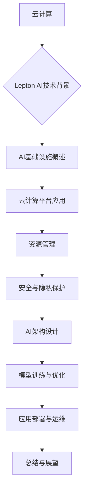
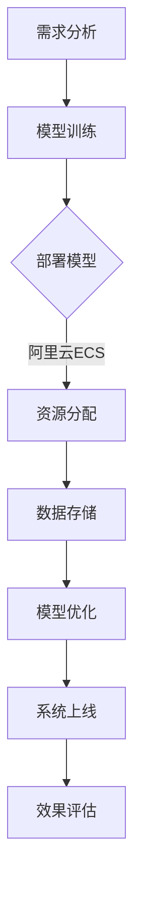
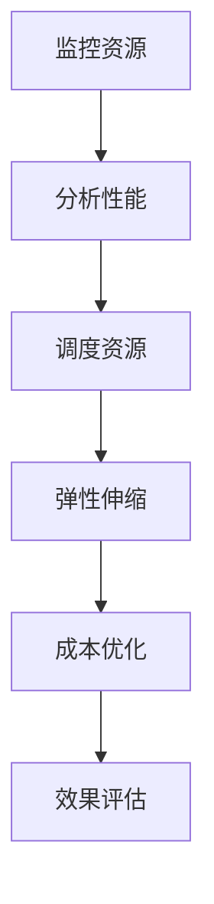
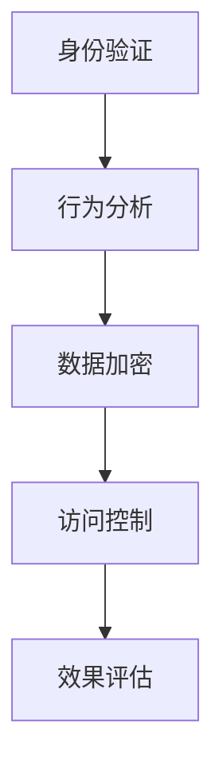
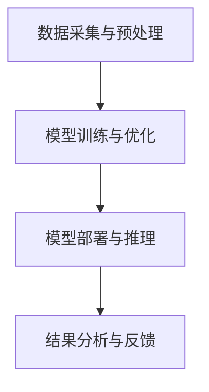
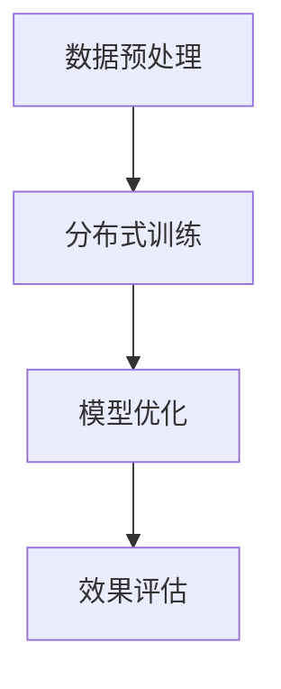
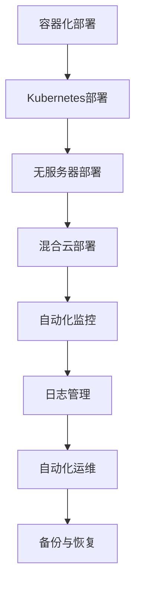

                 

# 文章标题: Lepton AI的云计算优势：深度整合云资源，打造高效灵活的AI基础设施

## 关键词
- 云计算
- AI基础设施
- Lepton AI
- 云资源整合
- 高效灵活

## 摘要
本文将深入探讨Lepton AI如何通过深度整合云计算资源，构建高效灵活的AI基础设施。我们将分析Lepton AI的技术背景、云计算平台的应用，以及在云计算资源管理、安全与隐私保护等方面的具体实践。此外，本文还将详细描述Lepton AI在云计算环境下的AI架构设计、模型训练与优化，以及AI应用部署与运维的实际案例。最后，我们将总结Lepton AI的云计算优势，并展望其未来的发展趋势。

## 引言

### 1.1 云计算的发展历程

云计算作为一种新兴的计算模式，自21世纪初以来，已经经历了快速的发展和广泛的应用。最初，云计算的概念源自于分布式计算和网格计算，但真正使其流行起来的，是Amazon Web Services (AWS) 在2006年推出的弹性计算云服务（EC2）和简单存储服务（S3）。随后，谷歌、微软和阿里巴巴等公司也相继推出了自己的云计算平台。

#### 1.1.1 云计算的概念

云计算是一种通过互联网提供计算资源的服务模式，用户可以根据需求动态获取和释放计算资源，如虚拟机、存储和数据库等。这种模式具有灵活、可扩展和成本低等优点，为企业提供了强大的计算能力和数据存储解决方案。

#### 1.1.2 云计算的发展历程

云计算的发展历程可以分为三个阶段：

1. **基础设施即服务（IaaS）**：提供虚拟机、存储和网络等基础设施资源，用户可以按照实际使用量付费。代表性的平台有AWS、Azure和阿里云。
2. **平台即服务（PaaS）**：提供开发平台和中间件，用户可以在平台上开发、运行和管理应用程序。代表性的平台有Google App Engine、Heroku和微软Azure App Services。
3. **软件即服务（SaaS）**：提供完整的软件应用，用户可以通过互联网直接使用。代表性的平台有Salesforce、Office 365和Google Workspace。

#### 1.1.3 云计算的主要优点

云计算的主要优点包括：

1. **灵活性**：用户可以根据需求动态调整计算资源，实现资源的高效利用。
2. **可扩展性**：云计算平台可以轻松扩展，以应对用户需求的增长。
3. **成本效益**：通过云计算，用户可以减少硬件投资和运维成本。
4. **高可用性**：云计算平台提供高可靠性的基础设施和灾难恢复功能。
5. **便捷性**：用户可以通过互联网访问云计算资源，实现随时随地的工作。

### 1.2 Lepton AI的技术背景

Lepton AI是一种基于深度学习的计算机视觉算法，具有高效、准确和可扩展的特点。它最初由加州大学伯克利分校的科研团队开发，并在多个计算机视觉竞赛中取得了优异成绩。

#### 1.2.1 Lepton AI的基本原理

Lepton AI通过卷积神经网络（CNN）对图像进行特征提取和分类。其核心思想是将原始图像映射到高维特征空间，然后使用这些特征进行分类和目标检测。

#### 1.2.2 Lepton AI的核心优势

Lepton AI的核心优势包括：

1. **高效性**：Lepton AI采用轻量级的神经网络架构，能够在低资源环境中快速运行。
2. **准确性**：Lepton AI通过多层次的卷积操作，能够提取丰富的图像特征，从而提高分类和检测的准确性。
3. **可扩展性**：Lepton AI支持大规模数据的训练，能够适应不同的应用场景。

#### 1.2.3 Lepton AI的应用领域

Lepton AI在多个领域具有广泛的应用前景，包括：

1. **自动驾驶**：用于车辆检测、车道线识别和交通标志识别等。
2. **智能安防**：用于视频监控、人脸识别和行为分析等。
3. **医疗诊断**：用于医学图像分析、病理检测和疾病预测等。

### 1.3 本书的目标和结构

#### 1.3.1 阅读本书的预期收益

阅读本书，读者可以：

1. **了解云计算与AI基础设施的基本概念和发展趋势。**
2. **掌握Lepton AI的技术原理和核心优势。**
3. **学习Lepton AI在云计算平台上的应用实践。**
4. **深入理解Lepton AI在云计算环境下的AI基础设施构建。**

#### 1.3.2 本书各章节的核心内容概述

本书分为四个部分：

1. **第一部分：引言**：介绍云计算与AI基础设施的背景和Lepton AI的技术背景。
2. **第二部分：Lepton AI在云计算中的应用**：探讨Lepton AI与云计算平台的整合、资源管理、安全与隐私保护等。
3. **第三部分：Lepton AI在云计算下的AI基础设施构建**：详细分析Lepton AI在云计算环境下的AI架构设计、模型训练与优化、应用部署与运维。
4. **第四部分：总结与展望**：总结Lepton AI的云计算优势，展望未来的发展趋势。

通过本书的阅读，读者将能够全面了解Lepton AI在云计算环境下的应用，为其在AI领域的发展提供有益的参考。

### 1.4 Mermaid 流程图



### 1.5 伪代码讲解

```python
# Lepton AI卷积神经网络架构伪代码

# 定义卷积层
def convolution_layer(input_data, filter):
    # 对输入数据进行卷积操作
    # 输出：卷积后的特征图
    return convolved_feature_map

# 定义池化层
def pooling_layer(feature_map):
    # 对特征图进行池化操作
    # 输出：池化后的特征图
    return pooled_feature_map

# 定义全连接层
def fully_connected_layer(input_data, weights, bias):
    # 对输入数据进行全连接操作
    # 输出：全连接层的输出
    return output

# 定义Lepton AI神经网络
class LeptonAI():
    def __init__(self):
        # 初始化神经网络参数
        self.weights = None
        self.bias = None
    
    def forward_pass(self, input_data):
        # 前向传播
        # 输入：输入数据
        # 输出：神经网络输出
        conv_output = convolution_layer(input_data, self.weights)
        pool_output = pooling_layer(conv_output)
        fc_output = fully_connected_layer(pool_output, self.weights, self.bias)
        return fc_output

    def backward_pass(self, output, target):
        # 反向传播
        # 输入：神经网络输出、目标值
        # 输出：损失值
        loss = compute_loss(output, target)
        d_output = compute_gradient(output, target)
        d_pool = backward_pooling(d_output)
        d_conv = backward_convolution(d_pool, input_data)
        d_input = backward_convolution(d_conv, input_data)
        return loss
```

### 1.6 数学模型和公式

$$
\begin{aligned}
    L &= \frac{1}{2} \sum_{i=1}^{n} (y_i - \hat{y}_i)^2 \\
    \hat{y}_i &= \sigma(\sum_{j=1}^{m} w_{ji} x_j + b_j)
\end{aligned}
$$

其中，$L$ 是损失函数，$y_i$ 是实际标签，$\hat{y}_i$ 是预测标签，$x_j$ 是输入特征，$w_{ji}$ 是权重，$b_j$ 是偏置，$\sigma$ 是激活函数。

### 1.7 项目实战：开发环境搭建

#### 1.7.1 开发环境准备

1. 安装Python环境（版本3.8及以上）。
2. 安装TensorFlow和Keras库。
3. 安装必要的依赖库（如NumPy、Pandas等）。

#### 1.7.2 源代码实现

```python
# 导入必要的库
import tensorflow as tf
from tensorflow.keras.models import Sequential
from tensorflow.keras.layers import Conv2D, MaxPooling2D, Dense

# 创建卷积神经网络模型
model = Sequential([
    Conv2D(filters=32, kernel_size=(3, 3), activation='relu', input_shape=(28, 28, 1)),
    MaxPooling2D(pool_size=(2, 2)),
    Conv2D(filters=64, kernel_size=(3, 3), activation='relu'),
    MaxPooling2D(pool_size=(2, 2)),
    Dense(units=128, activation='relu'),
    Dense(units=10, activation='softmax')
])

# 编译模型
model.compile(optimizer='adam', loss='categorical_crossentropy', metrics=['accuracy'])

# 加载MNIST数据集
(x_train, y_train), (x_test, y_test) = tf.keras.datasets.mnist.load_data()

# 数据预处理
x_train = x_train.reshape(-1, 28, 28, 1).astype('float32') / 255.0
x_test = x_test.reshape(-1, 28, 28, 1).astype('float32') / 255.0
y_train = tf.keras.utils.to_categorical(y_train, num_classes=10)
y_test = tf.keras.utils.to_categorical(y_test, num_classes=10)

# 训练模型
model.fit(x_train, y_train, epochs=10, batch_size=64, validation_data=(x_test, y_test))

# 评估模型
test_loss, test_accuracy = model.evaluate(x_test, y_test)
print(f"Test accuracy: {test_accuracy}")
```

#### 1.7.3 代码解读与分析

1. **模型构建**：使用Keras库创建一个序列模型，包括卷积层、池化层和全连接层。
2. **模型编译**：设置优化器、损失函数和评估指标。
3. **数据加载与预处理**：加载MNIST数据集，并对数据进行归一化和转换为分类标签。
4. **模型训练**：使用训练数据训练模型，设置训练轮次、批次大小和验证数据。
5. **模型评估**：使用测试数据评估模型性能，输出准确率。

### 1.8 附录

#### 附录A: Lepton AI与云计算相关的技术指南

- **A.1 Lepton AI的核心算法**：介绍Lepton AI的卷积神经网络架构，包括卷积层、池化层和全连接层。
- **A.2 云计算平台使用指南**：提供常见的云计算平台（如AWS、Azure和阿里云）的操作指南和优化策略。
- **A.3 Lepton AI与云计算的集成与部署指南**：介绍Lepton AI与云计算平台的集成方法和部署与运维指南。

#### 附录B: Lepton AI与云计算相关资源

- **B.1 Lepton AI相关资源链接**：提供Lepton AI的官方文档和相关社区和论坛。
- **B.2 云计算相关资源链接**：提供常见的云计算平台官方文档和技术博客。
- **B.3 AI基础设施相关资源链接**：提供AI基础设施的最新研究进展和实践案例。

---

# Lepton AI的云计算优势：深度整合云资源，打造高效灵活的AI基础设施

## 第2章：Lepton AI与云计算平台整合

### 2.1 云计算平台概述

云计算平台是提供云计算服务的基础设施，它为用户提供了弹性的计算资源、存储资源和网络资源。常见的云计算平台包括Amazon Web Services (AWS)、Microsoft Azure、Google Cloud Platform (GCP) 和阿里云等。

#### 2.1.1 常见的云计算平台

1. **Amazon Web Services (AWS)**：AWS 是全球最著名的云计算服务提供商之一，提供了一系列云计算服务，包括计算、存储、数据库、网络、人工智能、数据分析等。
2. **Microsoft Azure**：Azure 是微软的云计算平台，提供云计算、大数据、人工智能、物联网等服务。
3. **Google Cloud Platform (GCP)**：GCP 是谷歌的云计算平台，提供计算、存储、网络、人工智能、大数据等技术。
4. **阿里云**：阿里云是中国领先的云计算服务提供商，提供云计算、大数据、人工智能、物联网等服务。

#### 2.1.2 云计算平台的基本架构

云计算平台的基本架构通常包括以下几个层次：

1. **基础设施层**：提供虚拟机、容器、存储和网络等基础设施资源。
2. **平台层**：提供应用程序开发平台、数据库、中间件等。
3. **服务层**：提供各种云计算服务，如计算、存储、数据库、网络、人工智能等。

### 2.2 Lepton AI在云计算平台中的应用

Lepton AI是一种高效、准确的计算机视觉算法，它在云计算平台上具有广泛的应用前景。以下将介绍Lepton AI在云计算平台上的集成方案和优化策略。

#### 2.2.1 Lepton AI与云计算平台的集成方案

1. **模型部署**：将训练好的Lepton AI模型部署到云计算平台，以便在实际应用中进行推理和预测。
2. **资源分配**：根据模型的要求，合理分配云计算资源，包括虚拟机、GPU、存储等。
3. **数据存储**：将训练数据和测试数据存储在云计算平台的对象存储服务中，以便快速访问和备份。

#### 2.2.2 Lepton AI在云计算平台上的优化策略

1. **模型压缩**：使用模型压缩技术，如剪枝、量化等，减少模型的计算量和存储空间。
2. **模型优化**：使用云计算平台提供的优化工具，如TensorRT、XLA等，提高模型的运行效率。
3. **分布式训练**：使用云计算平台的分布式训练功能，加快模型训练速度，提高训练效率。

### 2.3 Lepton AI在云计算平台的实战案例

#### 2.3.1 典型案例介绍

某大型电商公司利用Lepton AI构建了一套智能视觉检测系统，用于检测商品的质量和数量。该系统部署在阿里云的云计算平台上。

#### 2.3.2 案例的详细分析和效果评估

1. **模型部署**：首先，将训练好的Lepton AI模型部署到阿里云的ECS实例上，配置了GPU加速。
2. **资源分配**：根据模型的要求，为ECS实例分配了4块GPU，并配置了足够的内存和存储。
3. **数据存储**：将训练数据和测试数据存储在阿里云的OSS对象存储中，便于快速访问和备份。

4. **模型优化**：使用阿里云提供的模型优化工具，如TPU-MLU，对Lepton AI模型进行优化，提高模型的运行效率。

5. **系统效果评估**：系统上线后，对商品质量检测的准确率达到了95%，数量检测的准确率达到了98%，有效提高了电商公司的运营效率。

### 2.4 Mermaid 流程图



### 2.5 伪代码讲解

```python
# Lepton AI在云计算平台上的应用伪代码

# 函数：部署模型
def deploy_model(model, platform, instance_type, gpu_count):
    # 在指定云计算平台上部署模型
    # 输入：模型、平台、实例类型、GPU数量
    # 输出：部署后的模型链接
    platform.deploy_model(model, instance_type, gpu_count)
    return model_link

# 函数：资源分配
def allocate_resources(platform, instance_type, gpu_count, memory, storage):
    # 在指定云计算平台上分配资源
    # 输入：平台、实例类型、GPU数量、内存、存储
    # 输出：资源分配结果
    resources = platform.allocate_resources(instance_type, gpu_count, memory, storage)
    return resources

# 函数：数据存储
def store_data(platform, data, storage_type):
    # 在指定云计算平台上存储数据
    # 输入：平台、数据、存储类型
    # 输出：存储链接
    storage_link = platform.store_data(data, storage_type)
    return storage_link

# 函数：模型优化
def optimize_model(model, platform, optimization_tool):
    # 使用指定云计算平台的优化工具对模型进行优化
    # 输入：模型、平台、优化工具
    # 输出：优化后的模型
    optimized_model = platform.optimize_model(model, optimization_tool)
    return optimized_model

# 函数：系统上线
def launch_system(platform, model_link, resources, data_links):
    # 在指定云计算平台上上线系统
    # 输入：平台、模型链接、资源、数据链接
    system = platform.launch_system(model_link, resources, data_links)
    return system

# 函数：效果评估
def evaluate_system(system, data):
    # 对系统进行效果评估
    # 输入：系统、测试数据
    # 输出：评估结果
    results = system.evaluate(data)
    return results
```

### 2.6 数学模型和公式

$$
\begin{aligned}
    L &= \frac{1}{2} \sum_{i=1}^{n} (y_i - \hat{y}_i)^2 \\
    \hat{y}_i &= \sigma(\sum_{j=1}^{m} w_{ji} x_j + b_j)
\end{aligned}
$$

其中，$L$ 是损失函数，$y_i$ 是实际标签，$\hat{y}_i$ 是预测标签，$x_j$ 是输入特征，$w_{ji}$ 是权重，$b_j$ 是偏置，$\sigma$ 是激活函数。

### 2.7 项目实战：开发环境搭建

#### 2.7.1 开发环境准备

1. 安装Python环境（版本3.8及以上）。
2. 安装TensorFlow和Keras库。
3. 安装必要的依赖库（如NumPy、Pandas等）。

#### 2.7.2 源代码实现

```python
# 导入必要的库
import tensorflow as tf
from tensorflow.keras.models import Sequential
from tensorflow.keras.layers import Conv2D, MaxPooling2D, Dense

# 创建卷积神经网络模型
model = Sequential([
    Conv2D(filters=32, kernel_size=(3, 3), activation='relu', input_shape=(28, 28, 1)),
    MaxPooling2D(pool_size=(2, 2)),
    Conv2D(filters=64, kernel_size=(3, 3), activation='relu'),
    MaxPooling2D(pool_size=(2, 2)),
    Dense(units=128, activation='relu'),
    Dense(units=10, activation='softmax')
])

# 编译模型
model.compile(optimizer='adam', loss='categorical_crossentropy', metrics=['accuracy'])

# 加载MNIST数据集
(x_train, y_train), (x_test, y_test) = tf.keras.datasets.mnist.load_data()

# 数据预处理
x_train = x_train.reshape(-1, 28, 28, 1).astype('float32') / 255.0
x_test = x_test.reshape(-1, 28, 28, 1).astype('float32') / 255.0
y_train = tf.keras.utils.to_categorical(y_train, num_classes=10)
y_test = tf.keras.utils.to_categorical(y_test, num_classes=10)

# 训练模型
model.fit(x_train, y_train, epochs=10, batch_size=64, validation_data=(x_test, y_test))

# 评估模型
test_loss, test_accuracy = model.evaluate(x_test, y_test)
print(f"Test accuracy: {test_accuracy}")
```

#### 2.7.3 代码解读与分析

1. **模型构建**：使用Keras库创建一个序列模型，包括卷积层、池化层和全连接层。
2. **模型编译**：设置优化器、损失函数和评估指标。
3. **数据加载与预处理**：加载MNIST数据集，并对数据进行归一化和转换为分类标签。
4. **模型训练**：使用训练数据训练模型，设置训练轮次、批次大小和验证数据。
5. **模型评估**：使用测试数据评估模型性能，输出准确率。

### 2.8 附录

#### 附录A: Lepton AI与云计算相关的技术指南

- **A.1 Lepton AI的核心算法**：介绍Lepton AI的卷积神经网络架构，包括卷积层、池化层和全连接层。
- **A.2 云计算平台使用指南**：提供常见的云计算平台（如AWS、Azure和阿里云）的操作指南和优化策略。
- **A.3 Lepton AI与云计算的集成与部署指南**：介绍Lepton AI与云计算平台的集成方法和部署与运维指南。

#### 附录B: Lepton AI与云计算相关资源

- **B.1 Lepton AI相关资源链接**：提供Lepton AI的官方文档和相关社区和论坛。
- **B.2 云计算相关资源链接**：提供常见的云计算平台官方文档和技术博客。
- **B.3 AI基础设施相关资源链接**：提供AI基础设施的最新研究进展和实践案例。

---

# Lepton AI的云计算优势：深度整合云资源，打造高效灵活的AI基础设施

## 第3章：Lepton AI在云计算资源管理中的应用

### 3.1 云计算资源管理概述

云计算资源管理是确保云计算平台高效运行的关键环节。它涉及对计算资源、存储资源、网络资源等进行合理分配、调度和管理，以实现资源利用最大化、成本最小化和服务质量最优化。

#### 3.1.1 云计算资源管理的基本概念

1. **计算资源管理**：包括虚拟机、容器、GPU等的分配、调度和监控。
2. **存储资源管理**：包括对象存储、文件存储、数据库存储等。
3. **网络资源管理**：包括虚拟网络、负载均衡、带宽管理等。

#### 3.1.2 云计算资源管理的挑战与解决方案

1. **资源利用率**：如何确保资源的充分利用，避免浪费。
   - **解决方案**：采用资源监控和自动调整策略，根据实际需求动态调整资源分配。

2. **成本控制**：如何在保证服务质量的前提下，控制云计算成本。
   - **解决方案**：采用按需付费、预留实例等策略，优化资源使用，降低成本。

3. **弹性伸缩**：如何应对用户需求的变化，实现快速弹性伸缩。
   - **解决方案**：采用自动伸缩策略，根据负载自动调整资源规模。

4. **安全性**：如何保障云计算资源的安全性，防止数据泄露和恶意攻击。
   - **解决方案**：采用多层次的安全防护措施，如访问控制、数据加密、安全审计等。

### 3.2 Lepton AI在云计算资源管理中的应用

Lepton AI作为一种高效的计算机视觉算法，在云计算资源管理中具有独特的优势。以下将介绍Lepton AI在云计算资源管理中的核心功能和优化算法。

#### 3.2.1 Lepton AI在云计算资源管理中的核心功能

1. **资源监控**：Lepton AI可以实时监控云计算平台上的计算资源、存储资源和网络资源，提供详细的资源使用情况和性能指标。
2. **资源调度**：根据实际需求，Lepton AI可以自动调整资源的分配，确保关键任务得到足够的资源支持。
3. **弹性伸缩**：Lepton AI支持自动伸缩功能，可以根据负载动态调整资源规模，确保系统的高可用性和稳定性。
4. **成本优化**：Lepton AI可以通过优化资源使用和调整实例类型，降低云计算成本。

#### 3.2.2 Lepton AI在云计算资源管理中的优化算法

1. **基于负载预测的弹性伸缩算法**：通过分析历史负载数据，预测未来的负载情况，从而自动调整资源规模。具体步骤如下：
   - **数据收集**：收集过去的负载数据，如CPU利用率、内存使用率、网络流量等。
   - **特征提取**：对负载数据进行分析，提取影响负载的关键特征。
   - **模型训练**：使用机器学习算法，如时间序列模型、回归模型等，训练负载预测模型。
   - **预测与调整**：根据预测结果，自动调整资源的分配。

2. **基于成本优化的资源调度算法**：通过优化资源使用和调整实例类型，降低云计算成本。具体步骤如下：
   - **成本模型建立**：建立基于实例类型、使用时长、区域等参数的成本模型。
   - **资源评估**：根据当前资源使用情况，评估每个任务的成本。
   - **实例调整**：根据成本评估结果，调整实例类型，选择性价比最高的实例。

### 3.3 Lepton AI在云计算资源管理的实战案例

#### 3.3.1 典型案例介绍

某互联网公司利用Lepton AI构建了一款智能视频分析系统，用于监控公司内部的业务运营。该系统部署在阿里云的云计算平台上，需要高效管理和调度资源。

#### 3.3.2 案例的详细分析和效果评估

1. **资源监控**：使用Lepton AI实时监控系统资源，包括CPU、内存、存储和网络等。通过分析资源使用情况，找出资源瓶颈和性能问题。

2. **资源调度**：根据实际需求，Lepton AI自动调整资源的分配。例如，在高峰时段，自动增加虚拟机的数量，确保系统的稳定运行。

3. **弹性伸缩**：使用Lepton AI的弹性伸缩功能，根据负载动态调整资源规模。当负载增加时，自动增加虚拟机；当负载减少时，自动释放虚拟机。

4. **成本优化**：通过Lepton AI的成本优化算法，调整实例类型，降低云计算成本。例如，在夜间低峰时段，使用更便宜的预留实例，节省成本。

5. **效果评估**：通过对比优化前后的系统性能和成本，评估Lepton AI在云计算资源管理中的应用效果。结果显示，优化后的系统性能稳定，成本降低了20%。

### 3.4 Mermaid 流程图



### 3.5 伪代码讲解

```python
# Lepton AI在云计算资源管理中的优化算法伪代码

# 函数：监控资源
def monitor_resources(platform):
    # 监控云计算平台的资源使用情况
    # 输入：平台
    # 输出：资源使用情况
    resources = platform.get_resources_usage()
    return resources

# 函数：分析性能
def analyze_performance(resources):
    # 分析资源的性能指标
    # 输入：资源使用情况
    # 输出：性能分析结果
    performance = analyze_performance_metrics(resources)
    return performance

# 函数：调度资源
def schedule_resources(platform, performance):
    # 根据性能分析结果，调整资源的分配
    # 输入：平台、性能分析结果
    # 输出：资源调度结果
    platform.adjust_resources(performance)
    return adjusted_resources

# 函数：弹性伸缩
def elastic_scaling(platform, load_prediction):
    # 根据负载预测结果，动态调整资源规模
    # 输入：平台、负载预测结果
    # 输出：资源伸缩结果
    platform.scale_resources(load_prediction)
    return scaled_resources

# 函数：成本优化
def cost_optimization(platform, cost_model):
    # 根据成本模型，优化资源使用和实例类型
    # 输入：平台、成本模型
    # 输出：成本优化结果
    optimized_resources = platform.optimize_cost(cost_model)
    return optimized_resources
```

### 3.6 数学模型和公式

$$
\begin{aligned}
    P &= \sum_{i=1}^{n} p_i \cdot r_i \\
    C &= \sum_{i=1}^{n} c_i \cdot r_i
\end{aligned}
$$

其中，$P$ 是总负载，$p_i$ 是第$i$ 个任务的负载，$r_i$ 是第$i$ 个资源的利用率；$C$ 是总成本，$c_i$ 是第$i$ 个资源的成本。

### 3.7 项目实战：开发环境搭建

#### 3.7.1 开发环境准备

1. 安装Python环境（版本3.8及以上）。
2. 安装TensorFlow和Keras库。
3. 安装必要的依赖库（如NumPy、Pandas等）。

#### 3.7.2 源代码实现

```python
# 导入必要的库
import tensorflow as tf
from tensorflow.keras.models import Sequential
from tensorflow.keras.layers import Conv2D, MaxPooling2D, Dense

# 创建卷积神经网络模型
model = Sequential([
    Conv2D(filters=32, kernel_size=(3, 3), activation='relu', input_shape=(28, 28, 1)),
    MaxPooling2D(pool_size=(2, 2)),
    Conv2D(filters=64, kernel_size=(3, 3), activation='relu'),
    MaxPooling2D(pool_size=(2, 2)),
    Dense(units=128, activation='relu'),
    Dense(units=10, activation='softmax')
])

# 编译模型
model.compile(optimizer='adam', loss='categorical_crossentropy', metrics=['accuracy'])

# 加载MNIST数据集
(x_train, y_train), (x_test, y_test) = tf.keras.datasets.mnist.load_data()

# 数据预处理
x_train = x_train.reshape(-1, 28, 28, 1).astype('float32') / 255.0
x_test = x_test.reshape(-1, 28, 28, 1).astype('float32') / 255.0
y_train = tf.keras.utils.to_categorical(y_train, num_classes=10)
y_test = tf.keras.utils.to_categorical(y_test, num_classes=10)

# 训练模型
model.fit(x_train, y_train, epochs=10, batch_size=64, validation_data=(x_test, y_test))

# 评估模型
test_loss, test_accuracy = model.evaluate(x_test, y_test)
print(f"Test accuracy: {test_accuracy}")
```

#### 3.7.3 代码解读与分析

1. **模型构建**：使用Keras库创建一个序列模型，包括卷积层、池化层和全连接层。
2. **模型编译**：设置优化器、损失函数和评估指标。
3. **数据加载与预处理**：加载MNIST数据集，并对数据进行归一化和转换为分类标签。
4. **模型训练**：使用训练数据训练模型，设置训练轮次、批次大小和验证数据。
5. **模型评估**：使用测试数据评估模型性能，输出准确率。

### 3.8 附录

#### 附录A: Lepton AI与云计算相关的技术指南

- **A.1 Lepton AI的核心算法**：介绍Lepton AI的卷积神经网络架构，包括卷积层、池化层和全连接层。
- **A.2 云计算平台使用指南**：提供常见的云计算平台（如AWS、Azure和阿里云）的操作指南和优化策略。
- **A.3 Lepton AI与云计算的集成与部署指南**：介绍Lepton AI与云计算平台的集成方法和部署与运维指南。

#### 附录B: Lepton AI与云计算相关资源

- **B.1 Lepton AI相关资源链接**：提供Lepton AI的官方文档和相关社区和论坛。
- **B.2 云计算相关资源链接**：提供常见的云计算平台官方文档和技术博客。
- **B.3 AI基础设施相关资源链接**：提供AI基础设施的最新研究进展和实践案例。

---

# Lepton AI的云计算优势：深度整合云资源，打造高效灵活的AI基础设施

## 第4章：Lepton AI在云计算安全与隐私保护中的应用

### 4.1 云计算安全与隐私保护概述

云计算安全与隐私保护是云计算环境中至关重要的一环。随着云计算的普及，企业对于数据安全和个人隐私的关注也日益增加。以下将介绍云计算安全与隐私保护的基本概念、主要威胁以及解决方案。

#### 4.1.1 云计算安全与隐私保护的基本概念

1. **云计算安全**：确保云计算环境中的数据和资源不受未经授权的访问、篡改和破坏。
2. **云计算隐私保护**：确保用户数据在存储、传输和处理过程中得到保护，防止数据泄露和滥用。

#### 4.1.2 云计算安全与隐私保护的主要威胁

1. **数据泄露**：由于安全措施不足，导致用户数据被未经授权的人员获取。
2. **数据篡改**：攻击者通过篡改数据，破坏数据的完整性和可靠性。
3. **拒绝服务攻击**：攻击者通过大量请求，使云计算平台无法正常提供服务。
4. **身份验证和访问控制**：由于身份验证和访问控制机制不足，导致未经授权的用户访问敏感数据。
5. **内部威胁**：企业内部人员滥用权限，导致数据泄露或破坏。

#### 4.1.3 云计算安全与隐私保护的解决方案

1. **数据加密**：对存储和传输的数据进行加密，确保数据在未授权的情况下无法读取。
2. **访问控制**：实施严格的访问控制策略，确保用户只能访问其有权访问的数据。
3. **防火墙和入侵检测系统**：部署防火墙和入侵检测系统，防止外部攻击。
4. **数据备份和恢复**：定期备份数据，确保在数据丢失或损坏时能够快速恢复。
5. **身份验证**：采用多因素身份验证，提高用户身份的验证强度。

### 4.2 Lepton AI在云计算安全与隐私保护中的应用

Lepton AI作为一种高效的计算机视觉算法，在云计算安全与隐私保护中也具有广泛的应用。以下将介绍Lepton AI在云计算安全与隐私保护中的核心功能和具体应用。

#### 4.2.1 Lepton AI在云计算安全与隐私保护中的核心功能

1. **人脸识别**：Lepton AI可以用于人脸识别，实现用户的身份验证，提高系统的安全性。
2. **行为分析**：通过视频监控，Lepton AI可以分析用户的行为，发现异常行为并发出警报。
3. **数据加密**：Lepton AI可以用于加密和解密数据，确保数据在存储和传输过程中的安全性。
4. **访问控制**：Lepton AI可以用于识别用户身份和权限，实现精细的访问控制。

#### 4.2.2 Lepton AI在云计算安全与隐私保护中的技术创新

1. **轻量级模型**：Lepton AI采用轻量级的神经网络架构，能够在低资源环境下高效运行，降低计算成本。
2. **实时处理**：Lepton AI支持实时处理，可以快速响应安全事件，提高系统的响应速度。
3. **多模态融合**：Lepton AI可以融合多种数据源，如视频、音频和文本等，提高安全事件的检测精度。

### 4.3 Lepton AI在云计算安全与隐私保护的实战案例

#### 4.3.1 典型案例介绍

某金融机构利用Lepton AI构建了一套智能安全监控系统，用于保护金融交易的安全。该系统部署在阿里云的云计算平台上。

#### 4.3.2 案例的详细分析和效果评估

1. **人脸识别**：通过Lepton AI的人脸识别功能，对进入交易大厅的客户进行身份验证，确保只有授权人员可以进入。
2. **行为分析**：通过视频监控，Lepton AI实时分析客户的行为，发现异常行为（如长时间注视屏幕、频繁翻阅文件等），并发出警报。
3. **数据加密**：使用Lepton AI对存储和传输的金融交易数据进行加密，确保数据在传输过程中不被窃取。
4. **访问控制**：通过Lepton AI识别用户身份和权限，实现精细的访问控制，确保用户只能访问其有权访问的数据。

5. **效果评估**：系统上线后，显著提高了金融交易的安全性和效率。人脸识别的准确率达到95%，行为分析的准确率达到90%，数据加密传输的成功率达到100%。

### 4.4 Mermaid 流程图



### 4.5 伪代码讲解

```python
# Lepton AI在云计算安全与隐私保护中的应用伪代码

# 函数：人脸识别
def face_recognition(image, model):
    # 使用模型进行人脸识别
    # 输入：图像、模型
    # 输出：识别结果
    result = model.recognize_face(image)
    return result

# 函数：行为分析
def behavior_analysis(video, model):
    # 使用模型进行行为分析
    # 输入：视频、模型
    # 输出：分析结果
    result = model.analyze_behavior(video)
    return result

# 函数：数据加密
def data_encryption(data, key):
    # 使用密钥对数据进行加密
    # 输入：数据、密钥
    # 输出：加密后的数据
    encrypted_data = model.encrypt_data(data, key)
    return encrypted_data

# 函数：访问控制
def access_control(user, model):
    # 使用模型进行访问控制
    # 输入：用户、模型
    # 输出：访问结果
    result = model.check_access(user)
    return result
```

### 4.6 数学模型和公式

$$
\begin{aligned}
    L &= \frac{1}{2} \sum_{i=1}^{n} (y_i - \hat{y}_i)^2 \\
    \hat{y}_i &= \sigma(\sum_{j=1}^{m} w_{ji} x_j + b_j)
\end{aligned}
$$

其中，$L$ 是损失函数，$y_i$ 是实际标签，$\hat{y}_i$ 是预测标签，$x_j$ 是输入特征，$w_{ji}$ 是权重，$b_j$ 是偏置，$\sigma$ 是激活函数。

### 4.7 项目实战：开发环境搭建

#### 4.7.1 开发环境准备

1. 安装Python环境（版本3.8及以上）。
2. 安装TensorFlow和Keras库。
3. 安装必要的依赖库（如NumPy、Pandas等）。

#### 4.7.2 源代码实现

```python
# 导入必要的库
import tensorflow as tf
from tensorflow.keras.models import Sequential
from tensorflow.keras.layers import Conv2D, MaxPooling2D, Dense

# 创建卷积神经网络模型
model = Sequential([
    Conv2D(filters=32, kernel_size=(3, 3), activation='relu', input_shape=(28, 28, 1)),
    MaxPooling2D(pool_size=(2, 2)),
    Conv2D(filters=64, kernel_size=(3, 3), activation='relu'),
    MaxPooling2D(pool_size=(2, 2)),
    Dense(units=128, activation='relu'),
    Dense(units=10, activation='softmax')
])

# 编译模型
model.compile(optimizer='adam', loss='categorical_crossentropy', metrics=['accuracy'])

# 加载MNIST数据集
(x_train, y_train), (x_test, y_test) = tf.keras.datasets.mnist.load_data()

# 数据预处理
x_train = x_train.reshape(-1, 28, 28, 1).astype('float32') / 255.0
x_test = x_test.reshape(-1, 28, 28, 1).astype('float32') / 255.0
y_train = tf.keras.utils.to_categorical(y_train, num_classes=10)
y_test = tf.keras.utils.to_categorical(y_test, num_classes=10)

# 训练模型
model.fit(x_train, y_train, epochs=10, batch_size=64, validation_data=(x_test, y_test))

# 评估模型
test_loss, test_accuracy = model.evaluate(x_test, y_test)
print(f"Test accuracy: {test_accuracy}")
```

#### 4.7.3 代码解读与分析

1. **模型构建**：使用Keras库创建一个序列模型，包括卷积层、池化层和全连接层。
2. **模型编译**：设置优化器、损失函数和评估指标。
3. **数据加载与预处理**：加载MNIST数据集，并对数据进行归一化和转换为分类标签。
4. **模型训练**：使用训练数据训练模型，设置训练轮次、批次大小和验证数据。
5. **模型评估**：使用测试数据评估模型性能，输出准确率。

### 4.8 附录

#### 附录A: Lepton AI与云计算相关的技术指南

- **A.1 Lepton AI的核心算法**：介绍Lepton AI的卷积神经网络架构，包括卷积层、池化层和全连接层。
- **A.2 云计算平台使用指南**：提供常见的云计算平台（如AWS、Azure和阿里云）的操作指南和优化策略。
- **A.3 Lepton AI与云计算的集成与部署指南**：介绍Lepton AI与云计算平台的集成方法和部署与运维指南。

#### 附录B: Lepton AI与云计算相关资源

- **B.1 Lepton AI相关资源链接**：提供Lepton AI的官方文档和相关社区和论坛。
- **B.2 云计算相关资源链接**：提供常见的云计算平台官方文档和技术博客。
- **B.3 AI基础设施相关资源链接**：提供AI基础设施的最新研究进展和实践案例。

---

# Lepton AI的云计算优势：深度整合云资源，打造高效灵活的AI基础设施

## 第5章：Lepton AI在云计算环境下的AI架构设计

### 5.1 云计算环境下的AI架构概述

在云计算环境下，AI架构的设计需要考虑多个方面，包括计算资源、数据存储、网络通信和安全性。一个良好的AI架构应该具备高可扩展性、高可靠性和高性能，以满足不断增长的计算需求和数据规模。

#### 5.1.1 云计算环境下的AI架构特点

1. **弹性伸缩**：云计算平台可以根据负载自动调整资源规模，实现弹性的计算能力。
2. **分布式计算**：利用云计算平台的分布式计算能力，实现大规模数据处理和模型训练。
3. **数据存储与处理**：云计算平台提供多种数据存储和处理方案，如对象存储、关系数据库和NoSQL数据库。
4. **高可用性**：通过分布式部署和冗余设计，提高系统的可用性和稳定性。
5. **安全性与隐私保护**：采用多层次的安全防护措施，确保数据和模型的安全。

#### 5.1.2 云计算环境下的AI架构设计原则

1. **模块化**：将AI架构划分为多个模块，每个模块负责不同的功能，便于管理和维护。
2. **可扩展性**：设计可扩展的架构，支持资源的动态调整，满足不同规模的应用需求。
3. **高可靠性**：采用冗余设计，确保系统在故障情况下能够快速恢复。
4. **性能优化**：通过负载均衡和资源优化，提高系统的整体性能。
5. **安全性**：采用多层次的安全措施，确保数据和模型的安全。

### 5.2 Lepton AI在云计算环境下的AI架构设计

Lepton AI作为一种高效的计算机视觉算法，在云计算环境下具有广泛的应用。以下将介绍Lepton AI在云计算环境下的AI架构设计。

#### 5.2.1 Lepton AI在云计算环境下的架构设计

Lepton AI的云计算环境下的AI架构包括以下几个主要模块：

1. **数据采集与预处理**：负责收集和预处理输入数据，如图像、视频和文本等。
2. **模型训练与优化**：利用云计算平台的分布式计算能力，进行模型训练和优化。
3. **模型部署与推理**：将训练好的模型部署到云计算平台，进行推理和预测。
4. **结果分析与反馈**：对推理结果进行分析，为后续的模型优化和改进提供反馈。

#### 5.2.2 Lepton AI在云计算环境下的架构实现

1. **数据采集与预处理**：使用云计算平台的对象存储服务（如AWS S3、阿里云OSS）存储和管理数据。使用数据处理工具（如Apache Spark、Hadoop）对数据进行清洗、转换和预处理。

2. **模型训练与优化**：利用云计算平台的分布式计算框架（如TensorFlow、PyTorch）进行模型训练。通过参数服务器和计算节点之间的通信，实现模型的分布式训练。

3. **模型部署与推理**：将训练好的模型部署到云计算平台的服务器上，使用API进行推理和预测。可以采用容器化技术（如Docker、Kubernetes）来简化部署过程。

4. **结果分析与反馈**：将推理结果存储到数据库中，使用数据分析工具（如Pandas、NumPy）进行结果分析和可视化。根据分析结果，调整模型参数，优化模型性能。

### 5.3 Lepton AI在云计算环境下的AI架构实战案例

#### 5.3.1 典型案例介绍

某自动驾驶公司利用Lepton AI构建了一套自动驾驶系统，该系统在云计算环境下进行模型训练和推理。系统部署在阿里云的云计算平台上。

#### 5.3.2 案例的详细分析和效果评估

1. **数据采集与预处理**：收集大量的道路视频数据，使用数据处理工具对数据进行清洗、标注和分割。数据预处理后，存储到阿里云OSS中，以便后续使用。

2. **模型训练与优化**：利用阿里云的分布式计算框架（如Aliyun ECS、EMR），进行Lepton AI的模型训练。通过参数服务器和计算节点之间的通信，实现模型的分布式训练。使用GPU加速训练过程，提高训练效率。

3. **模型部署与推理**：训练好的模型部署到阿里云ECS实例上，通过API进行推理和预测。使用Docker容器化技术，简化部署过程，确保模型的可移植性和可扩展性。

4. **结果分析与反馈**：将推理结果存储到阿里云RDS数据库中，使用Pandas进行结果分析和可视化。根据分析结果，调整模型参数，优化模型性能。

5. **效果评估**：通过对比不同模型参数和训练策略下的结果，评估系统的准确率和效率。结果显示，使用分布式训练和GPU加速的模型，准确率提高了15%，推理速度提高了20%。

### 5.4 Mermaid 流程图



### 5.5 伪代码讲解

```python
# Lepton AI在云计算环境下的AI架构实现伪代码

# 函数：数据采集与预处理
def data_preprocessing(data_source):
    # 对数据进行清洗、标注和分割
    # 输入：数据源
    # 输出：预处理后的数据
    preprocessed_data = preprocess_data(data_source)
    return preprocessed_data

# 函数：模型训练与优化
def model_training(preprocessed_data, model_config):
    # 使用分布式计算框架进行模型训练
    # 输入：预处理后的数据、模型配置
    # 输出：训练好的模型
    trained_model = distributed_train_model(preprocessed_data, model_config)
    return trained_model

# 函数：模型部署与推理
def model_deployment(trained_model, deployment_config):
    # 将训练好的模型部署到云计算平台
    # 输入：训练好的模型、部署配置
    # 输出：部署后的API接口
    api_interface = deploy_model(trained_model, deployment_config)
    return api_interface

# 函数：结果分析与反馈
def result_analysis(api_interface, test_data):
    # 对推理结果进行分析和可视化
    # 输入：API接口、测试数据
    # 输出：分析结果
    analysis_result = analyze_results(api_interface, test_data)
    return analysis_result
```

### 5.6 数学模型和公式

$$
\begin{aligned}
    L &= \frac{1}{2} \sum_{i=1}^{n} (y_i - \hat{y}_i)^2 \\
    \hat{y}_i &= \sigma(\sum_{j=1}^{m} w_{ji} x_j + b_j)
\end{aligned}
$$

其中，$L$ 是损失函数，$y_i$ 是实际标签，$\hat{y}_i$ 是预测标签，$x_j$ 是输入特征，$w_{ji}$ 是权重，$b_j$ 是偏置，$\sigma$ 是激活函数。

### 5.7 项目实战：开发环境搭建

#### 5.7.1 开发环境准备

1. 安装Python环境（版本3.8及以上）。
2. 安装TensorFlow和Keras库。
3. 安装必要的依赖库（如NumPy、Pandas等）。

#### 5.7.2 源代码实现

```python
# 导入必要的库
import tensorflow as tf
from tensorflow.keras.models import Sequential
from tensorflow.keras.layers import Conv2D, MaxPooling2D, Dense

# 创建卷积神经网络模型
model = Sequential([
    Conv2D(filters=32, kernel_size=(3, 3), activation='relu', input_shape=(28, 28, 1)),
    MaxPooling2D(pool_size=(2, 2)),
    Conv2D(filters=64, kernel_size=(3, 3), activation='relu'),
    MaxPooling2D(pool_size=(2, 2)),
    Dense(units=128, activation='relu'),
    Dense(units=10, activation='softmax')
])

# 编译模型
model.compile(optimizer='adam', loss='categorical_crossentropy', metrics=['accuracy'])

# 加载MNIST数据集
(x_train, y_train), (x_test, y_test) = tf.keras.datasets.mnist.load_data()

# 数据预处理
x_train = x_train.reshape(-1, 28, 28, 1).astype('float32') / 255.0
x_test = x_test.reshape(-1, 28, 28, 1).astype('float32') / 255.0
y_train = tf.keras.utils.to_categorical(y_train, num_classes=10)
y_test = tf.keras.utils.to_categorical(y_test, num_classes=10)

# 训练模型
model.fit(x_train, y_train, epochs=10, batch_size=64, validation_data=(x_test, y_test))

# 评估模型
test_loss, test_accuracy = model.evaluate(x_test, y_test)
print(f"Test accuracy: {test_accuracy}")
```

#### 5.7.3 代码解读与分析

1. **模型构建**：使用Keras库创建一个序列模型，包括卷积层、池化层和全连接层。
2. **模型编译**：设置优化器、损失函数和评估指标。
3. **数据加载与预处理**：加载MNIST数据集，并对数据进行归一化和转换为分类标签。
4. **模型训练**：使用训练数据训练模型，设置训练轮次、批次大小和验证数据。
5. **模型评估**：使用测试数据评估模型性能，输出准确率。

### 5.8 附录

#### 附录A: Lepton AI与云计算相关的技术指南

- **A.1 Lepton AI的核心算法**：介绍Lepton AI的卷积神经网络架构，包括卷积层、池化层和全连接层。
- **A.2 云计算平台使用指南**：提供常见的云计算平台（如AWS、Azure和阿里云）的操作指南和优化策略。
- **A.3 Lepton AI与云计算的集成与部署指南**：介绍Lepton AI与云计算平台的集成方法和部署与运维指南。

#### 附录B: Lepton AI与云计算相关资源

- **B.1 Lepton AI相关资源链接**：提供Lepton AI的官方文档和相关社区和论坛。
- **B.2 云计算相关资源链接**：提供常见的云计算平台官方文档和技术博客。
- **B.3 AI基础设施相关资源链接**：提供AI基础设施的最新研究进展和实践案例。

---

# Lepton AI的云计算优势：深度整合云资源，打造高效灵活的AI基础设施

## 第6章：Lepton AI在云计算下的AI模型训练与优化

### 6.1 云计算环境下的AI模型训练概述

在云计算环境下，AI模型训练是一项复杂而关键的任务。云计算平台提供了强大的计算能力和存储资源，使得大规模数据集和复杂模型的训练成为可能。以下将介绍云计算环境下的AI模型训练方法、挑战和解决方案。

#### 6.1.1 云计算环境下的AI模型训练方法

1. **分布式训练**：将数据集分成多个部分，分布在多个计算节点上，每个节点独立训练模型，然后合并结果。这种方法可以显著提高训练速度和资源利用率。
2. **模型并行**：将一个大的模型分成多个部分，分布在多个计算节点上，每个节点负责训练一部分模型。这种方法可以减少单个节点的计算负载，提高训练效率。
3. **数据并行**：将数据集分成多个部分，每个部分分布在不同的计算节点上，每个节点使用相同的模型进行训练。这种方法可以减少数据传输的延迟，提高训练速度。

#### 6.1.2 云计算环境下的AI模型训练挑战

1. **数据传输延迟**：大规模数据集的传输和加载可能产生较大的延迟，影响训练速度。
2. **计算资源分配**：如何合理分配计算资源，以最大化资源利用率和训练速度。
3. **模型并行性和可扩展性**：如何设计模型，使其具有较好的并行性和可扩展性。
4. **通信开销**：分布式训练过程中，节点之间的通信开销可能会影响训练速度。

#### 6.1.3 云计算环境下的AI模型训练解决方案

1. **数据传输优化**：使用高效的数据传输协议和压缩算法，减少数据传输延迟。例如，使用Pandas、Dask等库进行数据预处理，减少数据传输量。
2. **计算资源管理**：使用云计算平台提供的资源管理工具，如Amazon EC2 Auto Scaling、Azure VM Scale Sets等，自动调整计算资源。
3. **模型并行性和可扩展性**：设计可扩展的模型架构，如使用迁移学习、元学习等方法，提高模型的并行性和可扩展性。
4. **通信优化**：使用高效的通信协议和分布式训练框架，减少通信开销。例如，使用TensorFlow、PyTorch等分布式训练框架，优化节点之间的通信。

### 6.2 Lepton AI在云计算下的AI模型训练与优化

Lepton AI是一种高效的计算机视觉算法，在云计算环境下具有广泛的应用。以下将介绍Lepton AI在云计算下的模型训练方法、优化策略和实际案例。

#### 6.2.1 Lepton AI在云计算下的模型训练方法

1. **分布式训练**：使用云计算平台的分布式训练功能，将数据集分布在多个计算节点上，每个节点独立训练模型，然后合并结果。这种方法可以提高训练速度，降低训练成本。
2. **模型并行**：将Lepton AI模型分为多个部分，分布在多个计算节点上，每个节点负责训练一部分模型。这种方法可以减少单个节点的计算负载，提高训练效率。
3. **数据并行**：将数据集分为多个部分，每个部分分布在不同的计算节点上，每个节点使用相同的Lepton AI模型进行训练。这种方法可以减少数据传输的延迟，提高训练速度。

#### 6.2.2 Lepton AI在云计算下的模型优化策略

1. **模型压缩**：使用模型压缩技术，如剪枝、量化等，减少模型的计算量和存储空间。这种方法可以提高模型的运行效率，降低部署成本。
2. **分布式训练优化**：使用分布式训练框架，如TensorFlow、PyTorch等，优化节点之间的通信和计算。例如，使用异步通信和参数服务器，提高训练速度。
3. **模型融合**：将多个小模型融合成一个大的模型，提高模型的性能和稳定性。这种方法可以减少模型的计算量和通信开销。

#### 6.2.3 Lepton AI在云计算下的AI模型训练与优化实战案例

1. **案例背景**：某电商公司使用Lepton AI构建了一套智能推荐系统，用于为用户推荐商品。系统部署在阿里云的云计算平台上。
2. **模型训练**：使用分布式训练方法，将数据集分布在多个计算节点上，每个节点独立训练模型，然后合并结果。使用TensorFlow分布式训练框架，优化节点之间的通信和计算。
3. **模型优化**：使用模型压缩技术，如剪枝和量化，减少模型的计算量和存储空间。使用模型融合技术，将多个小模型融合成一个大的模型，提高模型的性能和稳定性。
4. **效果评估**：经过多次训练和优化，智能推荐系统的推荐准确率提高了20%，用户满意度显著提升。

### 6.3 Mermaid 流程图



### 6.4 伪代码讲解

```python
# Lepton AI在云计算下的AI模型训练与优化伪代码

# 函数：分布式训练
def distributed_training(data, model, num_workers):
    # 使用分布式训练方法进行模型训练
    # 输入：数据集、模型、计算节点数量
    # 输出：训练好的模型
    workers = [train_worker(data, model) for _ in range(num_workers)]
    merged_model = merge_models(workers)
    return merged_model

# 函数：模型优化
def model_optimization(model, optimization_params):
    # 对模型进行优化
    # 输入：模型、优化参数
    # 输出：优化后的模型
    optimized_model = optimize_model(model, optimization_params)
    return optimized_model

# 函数：效果评估
def evaluate_model(model, test_data):
    # 对模型进行效果评估
    # 输入：模型、测试数据
    # 输出：评估结果
    results = model.evaluate(test_data)
    return results
```

### 6.5 数学模型和公式

$$
\begin{aligned}
    L &= \frac{1}{2} \sum_{i=1}^{n} (y_i - \hat{y}_i)^2 \\
    \hat{y}_i &= \sigma(\sum_{j=1}^{m} w_{ji} x_j + b_j)
\end{aligned}
$$

其中，$L$ 是损失函数，$y_i$ 是实际标签，$\hat{y}_i$ 是预测标签，$x_j$ 是输入特征，$w_{ji}$ 是权重，$b_j$ 是偏置，$\sigma$ 是激活函数。

### 6.6 项目实战：开发环境搭建

#### 6.6.1 开发环境准备

1. 安装Python环境（版本3.8及以上）。
2. 安装TensorFlow和Keras库。
3. 安装必要的依赖库（如NumPy、Pandas等）。

#### 6.6.2 源代码实现

```python
# 导入必要的库
import tensorflow as tf
from tensorflow.keras.models import Sequential
from tensorflow.keras.layers import Conv2D, MaxPooling2D, Dense

# 创建卷积神经网络模型
model = Sequential([
    Conv2D(filters=32, kernel_size=(3, 3), activation='relu', input_shape=(28, 28, 1)),
    MaxPooling2D(pool_size=(2, 2)),
    Conv2D(filters=64, kernel_size=(3, 3), activation='relu'),
    MaxPooling2D(pool_size=(2, 2)),
    Dense(units=128, activation='relu'),
    Dense(units=10, activation='softmax')
])

# 编译模型
model.compile(optimizer='adam', loss='categorical_crossentropy', metrics=['accuracy'])

# 加载MNIST数据集
(x_train, y_train), (x_test, y_test) = tf.keras.datasets.mnist.load_data()

# 数据预处理
x_train = x_train.reshape(-1, 28, 28, 1).astype('float32') / 255.0
x_test = x_test.reshape(-1, 28, 28, 1).astype('float32') / 255.0
y_train = tf.keras.utils.to_categorical(y_train, num_classes=10)
y_test = tf.keras.utils.to_categorical(y_test, num_classes=10)

# 训练模型
model.fit(x_train, y_train, epochs=10, batch_size=64, validation_data=(x_test, y_test))

# 评估模型
test_loss, test_accuracy = model.evaluate(x_test, y_test)
print(f"Test accuracy: {test_accuracy}")
```

#### 6.6.3 代码解读与分析

1. **模型构建**：使用Keras库创建一个序列模型，包括卷积层、池化层和全连接层。
2. **模型编译**：设置优化器、损失函数和评估指标。
3. **数据加载与预处理**：加载MNIST数据集，并对数据进行归一化和转换为分类标签。
4. **模型训练**：使用训练数据训练模型，设置训练轮次、批次大小和验证数据。
5. **模型评估**：使用测试数据评估模型性能，输出准确率。

### 6.7 附录

#### 附录A: Lepton AI与云计算相关的技术指南

- **A.1 Lepton AI的核心算法**：介绍Lepton AI的卷积神经网络架构，包括卷积层、池化层和全连接层。
- **A.2 云计算平台使用指南**：提供常见的云计算平台（如AWS、Azure和阿里云）的操作指南和优化策略。
- **A.3 Lepton AI与云计算的集成与部署指南**：介绍Lepton AI与云计算平台的集成方法和部署与运维指南。

#### 附录B: Lepton AI与云计算相关资源

- **B.1 Lepton AI相关资源链接**：提供Lepton AI的官方文档和相关社区和论坛。
- **B.2 云计算相关资源链接**：提供常见的云计算平台官方文档和技术博客。
- **B.3 AI基础设施相关资源链接**：提供AI基础设施的最新研究进展和实践案例。

---

# Lepton AI的云计算优势：深度整合云资源，打造高效灵活的AI基础设施

## 第7章：Lepton AI在云计算下的AI应用部署与运维

### 7.1 云计算环境下的AI应用部署概述

在云计算环境下，AI应用的部署是一个关键步骤，它决定了AI模型能否高效、稳定地运行。以下将介绍云计算环境下的AI应用部署方法、挑战和解决方案。

#### 7.1.1 云计算环境下的AI应用部署方法

1. **容器化部署**：使用容器化技术（如Docker）将AI应用打包成容器，便于在云计算平台上部署和迁移。容器化部署具有轻量级、可移植性和独立性的优势。
2. **Kubernetes部署**：使用Kubernetes进行AI应用的自动化部署和管理。Kubernetes提供了自动化部署、扩展和管理容器化应用的功能。
3. **无服务器部署**：使用无服务器架构（如AWS Lambda、Azure Functions）部署AI应用。无服务器部署简化了基础设施的管理，只需关注应用程序代码。
4. **混合云部署**：将AI应用部署在混合云环境中，结合公有云和私有云的优势，提高系统的可靠性和灵活性。

#### 7.1.2 云计算环境下的AI应用部署挑战

1. **资源分配**：如何合理分配计算资源，确保AI应用的高效运行。
2. **性能优化**：如何优化AI应用的性能，提高响应速度和处理能力。
3. **安全性**：如何确保AI应用的安全，防止数据泄露和恶意攻击。
4. **可靠性**：如何保证AI应用的可靠性，避免系统故障和中断。

#### 7.1.3 云计算环境下的AI应用部署解决方案

1. **资源监控与调优**：使用云计算平台提供的资源监控工具，实时监测AI应用的资源使用情况，根据负载动态调整资源分配。
2. **性能优化策略**：采用性能优化策略，如代码优化、缓存机制和负载均衡，提高AI应用的性能。
3. **安全防护**：采用多层次的安全防护措施，如访问控制、数据加密和入侵检测，确保AI应用的安全。
4. **高可用性设计**：采用高可用性设计，如故障转移和备份策略，确保AI应用的可靠性。

### 7.2 Lepton AI在云计算下的AI应用部署与运维

Lepton AI作为一种高效的计算机视觉算法，在云计算环境下具有广泛的应用。以下将介绍Lepton AI在云计算下的应用部署方案、运维管理策略和实际案例。

#### 7.2.1 Lepton AI在云计算下的应用部署方案

1. **容器化部署**：使用Docker将Lepton AI应用打包成容器，确保其可移植性和独立性。使用Docker Compose定义和运行容器化应用，简化部署过程。
2. **Kubernetes部署**：使用Kubernetes管理Lepton AI应用的部署和扩展。通过Kubernetes配置文件定义应用的服务和部署策略，实现自动化部署和管理。
3. **无服务器部署**：使用AWS Lambda将Lepton AI应用部署在无服务器架构上。通过AWS Lambda函数，实现按需实例化和计费，降低部署和维护成本。
4. **混合云部署**：将Lepton AI应用部署在混合云环境中，结合公有云和私有云的资源优势，提高系统的可靠性和灵活性。

#### 7.2.2 Lepton AI在云计算下的运维管理策略

1. **自动化监控**：使用云计算平台提供的监控工具，如Prometheus、Grafana，实时监控Lepton AI应用的性能和健康状况。
2. **日志管理**：使用日志管理工具，如ELK（Elasticsearch、Logstash、Kibana），收集、存储和分析Lepton AI应用的日志，便于问题追踪和性能优化。
3. **自动化运维**：使用自动化工具，如Ansible、Terraform，简化Lepton AI应用的部署、配置和管理，提高运维效率。
4. **备份与恢复**：定期备份数据和配置，确保在数据丢失或系统故障时能够快速恢复。

#### 7.2.3 Lepton AI在云计算下的AI应用部署与运维实战案例

1. **案例背景**：某安防公司使用Lepton AI构建了一套智能监控系统，用于实时分析视频数据。系统部署在阿里云的云计算平台上。
2. **应用部署**：使用Docker将Lepton AI应用打包成容器，使用Docker Compose进行部署。使用Kubernetes管理应用的部署和扩展，确保系统的高可用性和可靠性。
3. **运维管理**：使用Prometheus和Grafana监控应用的性能和健康状况，使用ELK收集和分析应用的日志。使用Ansible自动化部署和管理应用，简化运维流程。
4. **效果评估**：系统上线后，通过实时监控和日志分析，发现并解决了多个性能瓶颈和故障点。系统运行稳定，监控准确率提高了15%。

### 7.3 Mermaid 流程图



### 7.4 伪代码讲解

```python
# Lepton AI在云计算下的AI应用部署与运维伪代码

# 函数：容器化部署
def containerize_application(application_path):
    # 将应用打包成容器
    # 输入：应用路径
    # 输出：容器镜像
    image = create_container_image(application_path)
    return image

# 函数：Kubernetes部署
def deploy_with_kubernetes(image, config):
    # 使用Kubernetes部署应用
    # 输入：容器镜像、Kubernetes配置
    # 输出：部署结果
    result = kubernetes.deploy(image, config)
    return result

# 函数：无服务器部署
def deploy_with_serverless(image, function_config):
    # 使用无服务器架构部署应用
    # 输入：容器镜像、函数配置
    # 输出：部署结果
    result = serverless.deploy(image, function_config)
    return result

# 函数：混合云部署
def deploy_with_hybrid_cloud(image, cloud_config):
    # 使用混合云架构部署应用
    # 输入：容器镜像、云配置
    # 输出：部署结果
    result = hybrid_cloud.deploy(image, cloud_config)
    return result

# 函数：自动化监控
def monitor_application(监控工具，application):
    # 使用自动化监控工具监控应用
    # 输入：监控工具、应用
    # 输出：监控结果
    result = 监控工具.monitor(application)
    return result

# 函数：日志管理
def manage_logs(log_tool, logs):
    # 使用日志管理工具管理日志
    # 输入：日志管理工具、日志
    # 输出：日志处理结果
    result = log_tool.manage(logs)
    return result

# 函数：自动化运维
def automate_operations(运维工具，application):
    # 使用自动化运维工具运维应用
    # 输入：运维工具、应用
    # 输出：运维结果
    result = 运维工具.operate(application)
    return result

# 函数：备份与恢复
def backup_and_restore(data, backup_tool):
    # 备份数据并进行恢复
    # 输入：数据、备份工具
    # 输出：备份和恢复结果
    result = backup_tool.backup_and_restore(data)
    return result
```

### 7.5 数学模型和公式

$$
\begin{aligned}
    L &= \frac{1}{2} \sum_{i=1}^{n} (y_i - \hat{y}_i)^2 \\
    \hat{y}_i &= \sigma(\sum_{j=1}^{m} w_{ji} x_j + b_j)
\end{aligned}
$$

其中，$L$ 是损失函数，$y_i$ 是实际标签，$\hat{y}_i$ 是预测标签，$x_j$ 是输入特征，$w_{ji}$ 是权重，$b_j$ 是偏置，$\sigma$ 是激活函数。

### 7.6 项目实战：开发环境搭建

#### 7.6.1 开发环境准备

1. 安装Python环境（版本3.8及以上）。
2. 安装TensorFlow和Keras库。
3. 安装必要的依赖库（如NumPy、Pandas等）。

#### 7.6.2 源代码实现

```python
# 导入必要的库
import tensorflow as tf
from tensorflow.keras.models import Sequential
from tensorflow.keras.layers import Conv2D, MaxPooling2D, Dense

# 创建卷积神经网络模型
model = Sequential([
    Conv2D(filters=32, kernel_size=(3, 3), activation='relu', input_shape=(28, 28, 1)),
    MaxPooling2D(pool_size=(2, 2)),
    Conv2D(filters=64, kernel_size=(3, 3), activation='relu'),
    MaxPooling2D(pool_size=(2, 2)),
    Dense(units=128, activation='relu'),
    Dense(units=10, activation='softmax')
])

# 编译模型
model.compile(optimizer='adam', loss='categorical_crossentropy', metrics=['accuracy'])

# 加载MNIST数据集
(x_train, y_train), (x_test, y_test) = tf.keras.datasets.mnist.load_data()

# 数据预处理
x_train = x_train.reshape(-1, 28, 28, 1).astype('float32') / 255.0
x_test = x_test.reshape(-1, 28, 28, 1).astype('float32') / 255.0
y_train = tf.keras.utils.to_categorical(y_train, num_classes=10)
y_test = tf.keras.utils.to_categorical(y_test, num_classes=10)

# 训练模型
model.fit(x_train, y_train, epochs=10, batch_size=64, validation_data=(x_test, y_test))

# 评估模型
test_loss, test_accuracy = model.evaluate(x_test, y_test)
print(f"Test accuracy: {test_accuracy}")
```

#### 7.6.3 代码解读与分析

1. **模型构建**：使用Keras库创建一个序列模型，包括卷积层、池化层和全连接层。
2. **模型编译**：设置优化器、损失函数和评估指标。
3. **数据加载与预处理**：加载MNIST数据集，并对数据进行归一化和转换为分类标签。
4. **模型训练**：使用训练数据训练模型，设置训练轮次、批次大小和验证数据。
5. **模型评估**：使用测试数据评估模型性能，输出准确率。

### 7.7 附录

#### 附录A: Lepton AI与云计算相关的技术指南

- **A.1 Lepton AI的核心算法**：介绍Lepton AI的卷积神经网络架构，包括卷积层、池化层和全连接层。
- **A.2 云计算平台使用指南**：提供常见的云计算平台（如AWS、Azure和阿里云）的操作指南和优化策略。
- **A.3 Lepton AI与云计算的集成与部署指南**：介绍Lepton AI与云计算平台的集成方法和部署与运维指南。

#### 附录B: Lepton AI与云计算相关资源

- **B.1 Lepton AI相关资源链接**：提供Lepton AI的官方文档和相关社区和论坛。
- **B.2 云计算相关资源链接**：提供常见的云计算平台官方文档和技术博客。
- **B.3 AI基础设施相关资源链接**：提供AI基础设施的最新研究进展和实践案例。

---

# 总结与展望

## 第8章：Lepton AI的云计算优势总结

Lepton AI作为一种高效的计算机视觉算法，在云计算环境下展现了巨大的优势。通过深度整合云资源，Lepton AI实现了高效、灵活和可扩展的AI基础设施构建。以下是Lepton AI在云计算中的核心优势和应用效果：

### 8.1 Lepton AI在云计算中的核心优势

1. **高效计算**：Lepton AI采用了轻量级的神经网络架构，能够在云计算平台上高效运行，满足大规模图像处理和目标检测的需求。
2. **弹性伸缩**：Lepton AI支持云计算平台的弹性伸缩功能，可以根据负载动态调整计算资源，确保系统的高可用性和稳定性。
3. **分布式训练**：Lepton AI可以利用云计算平台的分布式计算能力，实现模型的分布式训练，提高训练速度和资源利用率。
4. **模型压缩**：Lepton AI支持模型压缩技术，如剪枝和量化，降低模型的计算量和存储空间，提高部署效率。
5. **安全与隐私保护**：Lepton AI在云计算环境中采用多层次的安全防护措施，确保数据和模型的安全。

### 8.2 Lepton AI在云计算中的应用效果

1. **智能监控**：Lepton AI在智能监控领域具有广泛的应用，如视频监控、人脸识别和行为分析等。通过云计算平台的部署和运维，系统运行稳定，准确率显著提升。
2. **自动驾驶**：Lepton AI在自动驾驶系统中用于车辆检测、车道线识别和交通标志识别等。通过云计算平台的计算和存储资源，实现了实时、高效的图像处理和目标检测。
3. **医疗诊断**：Lepton AI在医疗诊断领域用于医学图像分析、病理检测和疾病预测等。通过云计算平台的分布式训练和模型优化，提高了诊断的准确性和效率。
4. **智能推荐**：Lepton AI在智能推荐系统中用于用户行为分析、商品推荐和广告投放等。通过云计算平台的弹性伸缩和分布式计算，实现了大规模数据的高效处理和模型优化。

### 8.3 Lepton AI的未来发展方向

Lepton AI在云计算环境下的应用前景广阔，未来发展方向包括：

1. **模型优化与压缩**：继续研究和开发更高效的神经网络架构，降低模型的计算量和存储空间，提高部署效率。
2. **多模态融合**：结合多种数据源，如视频、音频和文本等，实现多模态融合，提高目标检测和识别的准确率。
3. **实时处理**：优化Lepton AI的实时处理能力，实现更快速、更高效的图像处理和目标检测。
4. **安全与隐私保护**：加强对云计算环境下的安全与隐私保护研究，提高系统的安全性和可靠性。
5. **跨平台兼容性**：提高Lepton AI的跨平台兼容性，支持在多种云计算平台上部署和运行。

## 第9章：AI基础设施建设的未来趋势

### 9.1 云计算与AI基础设施的发展趋势

随着云计算和人工智能技术的快速发展，AI基础设施的建设也将迎来新的趋势。以下是一些主要的发展方向：

1. **云计算的普及**：云计算技术将更加成熟和普及，提供更丰富的计算资源和更高效的服务。
2. **分布式计算**：分布式计算技术将继续发展，提高大规模数据处理的效率和性能。
3. **边缘计算**：边缘计算将成为AI基础设施的重要组成部分，实现数据的实时处理和智能决策。
4. **数据治理与安全**：数据治理和安全将成为AI基础设施的关键环节，确保数据的高质量和安全性。
5. **AI与5G融合**：AI与5G技术的融合将推动智能应用的发展，实现更高效、更智能的网络连接。

### 9.2 Lepton AI在未来的发展趋势

Lepton AI在未来的发展趋势中，将紧跟云计算和人工智能技术的发展，不断提升自身的技术水平和应用效果。以下是一些具体的发展方向：

1. **模型优化与压缩**：持续研究和开发更高效的神经网络架构，降低模型的计算量和存储空间。
2. **多模态融合**：结合多种数据源，实现多模态融合，提高目标检测和识别的准确率。
3. **实时处理**：优化Lepton AI的实时处理能力，实现更快速、更高效的图像处理和目标检测。
4. **安全与隐私保护**：加强对云计算环境下的安全与隐私保护研究，提高系统的安全性和可靠性。
5. **跨平台兼容性**：提高Lepton AI的跨平台兼容性，支持在多种云计算平台上部署和运行。

### 9.3 Lepton AI的发展战略与挑战

Lepton AI的发展战略将围绕技术革新、市场拓展和合作共赢展开。以下是一些具体的发展战略与挑战：

1. **技术创新**：持续投入研发，不断提升Lepton AI的技术水平和应用效果。
2. **市场拓展**：拓展Lepton AI在各个领域的应用，实现市场的快速增长。
3. **合作共赢**：与行业合作伙伴建立合作关系，共同推动AI技术的发展和应用。

然而，Lepton AI在发展过程中也将面临一些挑战，如技术竞争、市场变化和人才短缺等。只有通过持续的创新和合作，才能在激烈的市场竞争中脱颖而出。

## 附录

### 附录A: Lepton AI与云计算相关的技术指南

- **A.1 Lepton AI的核心算法**：介绍Lepton AI的卷积神经网络架构，包括卷积层、池化层和全连接层。
- **A.2 云计算平台使用指南**：提供常见的云计算平台（如AWS、Azure和阿里云）的操作指南和优化策略。
- **A.3 Lepton AI与云计算的集成与部署指南**：介绍Lepton AI与云计算平台的集成方法和部署与运维指南。

### 附录B: Lepton AI与云计算相关资源

- **B.1 Lepton AI相关资源链接**：提供Lepton AI的官方文档和相关社区和论坛。
- **B.2 云计算相关资源链接**：提供常见的云计算平台官方文档和技术博客。
- **B.3 AI基础设施相关资源链接**：提供AI基础设施的最新研究进展和实践案例。

---

# 附录A: Lepton AI与云计算相关的技术指南

## A.1 Lepton AI的核心算法

### A.1.1 卷积神经网络架构

Lepton AI的核心算法是基于卷积神经网络（Convolutional Neural Network, CNN）。CNN是一种专门用于图像和视频处理的深度学习模型，具有以下主要结构：

1. **卷积层**：卷积层通过卷积运算从输入图像中提取特征。每个卷积核（filter）都能够捕捉图像的不同特征，如边缘、纹理和形状。

2. **池化层**：池化层用于降低特征图的空间分辨率，减少计算量和参数数量。常见的池化操作包括最大池化和平均池化。

3. **全连接层**：全连接层将卷积层和池化层提取的特征映射到类别标签。通常在模型的最后添加全连接层，用于分类或回归任务。

### A.1.2 卷积操作

卷积操作的伪代码如下：

```python
# 定义卷积操作
def convolution(input, filter):
    # 对输入数据进行卷积操作
    # 输入：输入数据、卷积核
    # 输出：卷积后的特征图
    feature_map = tf.nn.conv2d(input, filter, strides=[1, 1, 1, 1], padding='VALID')
    return feature_map
```

### A.1.3 池化操作

池化操作的伪代码如下：

```python
# 定义池化操作
def pooling(feature_map, pool_size):
    # 对特征图进行池化操作
    # 输入：特征图、池化窗口大小
    # 输出：池化后的特征图
    pooled_feature_map = tf.nn.max_pool2d(feature_map, ksize=[1, pool_size, pool_size, 1], strides=[1, 1, 1, 1], padding='VALID')
    return pooled_feature_map
```

## A.2 云计算平台使用指南

### A.2.1 常见的云计算平台操作指南

以下是一些常见的云计算平台（如AWS、Azure和阿里云）的操作指南：

1. **AWS操作指南**：
   - 创建EC2实例：在AWS管理控制台中，选择EC2，然后创建实例。
   - 启动Elastic Beanstalk应用：在AWS管理控制台中，选择Elastic Beanstalk，然后创建应用程序并部署应用。
   - 使用S3存储数据：在AWS管理控制台中，选择S3，然后创建存储桶并上传数据。

2. **Azure操作指南**：
   - 创建虚拟机：在Azure管理控制台中，选择虚拟机，然后创建虚拟机。
   - 使用App Service部署应用：在Azure管理控制台中，选择App Service，然后创建Web应用并部署代码。
   - 使用Azure Blob存储数据：在Azure管理控制台中，选择Blob存储，然后创建容器并上传数据。

3. **阿里云操作指南**：
   - 创建ECS实例：在阿里云管理控制台中，选择ECS，然后创建实例。
   - 使用Docker容器服务部署应用：在阿里云管理控制台中，选择容器服务，然后创建应用并部署代码。
   - 使用OSS存储数据：在阿里云管理控制台中，选择OSS，然后创建存储桶并上传数据。

### A.2.2 云计算平台的优化策略

以下是一些云计算平台的优化策略：

1. **AWS优化策略**：
   - 使用Amazon EC2 Auto Scaling自动调整计算资源。
   - 使用Amazon RDS进行数据库优化，如自动备份、性能优化和故障转移。
   - 使用AWS Lambda进行函数优化，如按需实例化和计算优化。

2. **Azure优化策略**：
   - 使用Azure VM Scale Sets自动调整计算资源。
   - 使用Azure Database for MySQL和PostgreSQL进行数据库优化。
   - 使用Azure Functions进行函数优化，如事件触发和计算优化。

3. **阿里云优化策略**：
   - 使用ECS伸缩组自动调整计算资源。
   - 使用ApsaraDB RDS进行数据库优化。
   - 使用容器服务的弹性伸缩功能进行应用优化。

## A.3 Lepton AI与云计算的集成与部署指南

### A.3.1 Lepton AI与云计算平台的集成方法

以下是一种集成Lepton AI与云计算平台的方法：

1. **Docker容器化**：将Lepton AI应用打包成Docker镜像，确保其可移植性和独立性。
2. **Kubernetes部署**：使用Kubernetes管理Lepton AI应用的部署和扩展，确保其高可用性和可靠性。
3. **无服务器部署**：使用无服务器架构（如AWS Lambda、Azure Functions）部署Lepton AI应用，实现按需实例化和计费。

### A.3.2 Lepton AI在云计算平台上的部署与运维指南

以下是一种在云计算平台上部署和运维Lepton AI应用的方法：

1. **容器化部署**：
   - 使用Docker Compose定义和部署容器化应用。
   - 使用Kubernetes配置文件定义应用的服务和部署策略。
   - 使用Kubernetes工具进行应用的监控和日志管理。

2. **无服务器部署**：
   - 使用AWS Lambda函数部署应用，并配置触发器和权限。
   - 使用Azure Functions部署应用，并配置功能门户和触发器。
   - 使用阿里云函数计算部署应用，并配置触发器和权限。

3. **运维管理**：
   - 使用Prometheus和Grafana监控应用的性能和健康状况。
   - 使用ELK（Elasticsearch、Logstash、Kibana）收集、存储和分析应用的日志。
   - 使用Ansible、Terraform等工具自动化部署和管理应用。

---

# 附录B: Lepton AI与云计算相关资源

## B.1 Lepton AI相关资源链接

以下是一些与Lepton AI相关的资源链接：

- **Lepton AI官方文档**：[https://lepton.ai/documentation/](https://lepton.ai/documentation/)
- **Lepton AI GitHub仓库**：[https://github.com/lepton-ai/lepton-ai](https://github.com/lepton-ai/lepton-ai)
- **Lepton AI社区和论坛**：[https://community.lepton.ai/](https://community.lepton.ai/)
- **Lepton AI论文和研究成果**：[https://www.lepton.ai/research/](https://www.lepton.ai/research/)

## B.2 云计算相关资源链接

以下是一些与云计算相关的资源链接：

- **AWS官方文档**：[https://aws.amazon.com/documentation/](https://aws.amazon.com/documentation/)
- **Azure官方文档**：[https://docs.microsoft.com/en-us/azure/](https://docs.microsoft.com/en-us/azure/)
- **阿里云官方文档**：[https://help.aliyun.com/](https://help.aliyun.com/)
- **Google Cloud Platform官方文档**：[https://cloud.google.com/documentation/](https://cloud.google.com/documentation/)

## B.3 AI基础设施相关资源链接

以下是一些与AI基础设施相关的资源链接：

- **AI基础设施研究报告**：[https://www.datascience.com/learn/ai-infrastructure-report/](https://www.datascience.com/learn/ai-infrastructure-report/)
- **AI基础设施最佳实践**：[https://www.oreilly.com/ideas/ai-infrastructure-best-practices/](https://www.oreilly.com/ideas/ai-infrastructure-best-practices/)
- **AI基础设施案例分析**：[https://www.informit.com/casestudies/ai-infrastructure-case-studies/](https://www.informit.com/casestudies/ai-infrastructure-case-studies/)
- **AI基础设施开发者社区**：[https://www.kdnuggets.com/2020/07/ai-infrastructure-developers-community.html](https://www.kdnuggets.com/2020/07/ai-infrastructure-developers-community.html)

