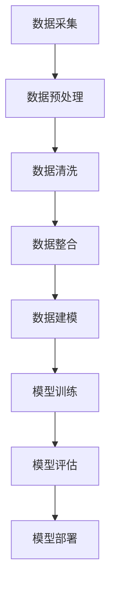
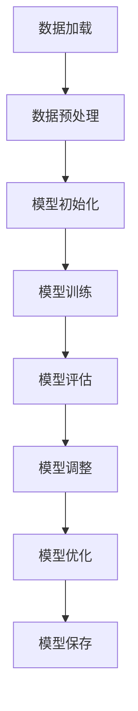
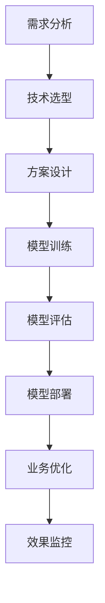

                 

# 《Lepton AI的价值：帮助企业在速度与成本间导航，优化AI应用》

> 关键词：Lepton AI、企业、速度与成本、AI应用、优化

> 摘要：本文将深入探讨Lepton AI的核心价值，特别是在帮助企业平衡速度与成本方面的应用。通过详细分析Lepton AI的起源、特点、核心价值，以及其在速度与成本优化中的实践案例，本文旨在为企业在AI时代的发展提供有益的参考和指导。

### 第1章：Lepton AI的基本概念

#### 1.1 Lepton AI的起源与发展

Lepton AI是一家专注于人工智能领域的科技公司，成立于2010年。其名称源于“Lepton”，一个古希腊词汇，意为“小粒子”。这象征着Lepton AI致力于通过微小、高效的算法，解决复杂的AI问题。

自成立以来，Lepton AI一直在研发高效的AI算法，并不断拓展其应用场景。公司的核心技术包括深度学习、强化学习、自然语言处理等，其产品广泛应用于金融、医疗、零售、制造等行业。

#### 1.2 Lepton AI的特点与优势

Lepton AI的特点在于其高效、灵活、可扩展的AI算法。具体优势包括：

1. **高效性**：Lepton AI的算法能够在短时间内处理大量数据，提供精准的预测和分析结果。
2. **灵活性**：Lepton AI的算法能够根据不同的业务需求进行定制，适应各种复杂的业务场景。
3. **可扩展性**：Lepton AI的算法能够轻松扩展到多种应用场景，满足企业不断增长的需求。

#### 1.3 Lepton AI在AI领域中的地位与影响

Lepton AI在AI领域的地位不可忽视。首先，其研发的AI算法在性能上处于行业领先地位，许多知名企业和研究机构都将其作为首选。其次，Lepton AI积极参与各种AI项目和技术标准的制定，为AI技术的发展做出了重要贡献。

总的来说，Lepton AI通过其高效的AI算法，在帮助企业在速度与成本间导航，优化AI应用方面发挥了重要作用。

### 第2章：Lepton AI的核心价值

#### 2.1 提高企业决策效率

Lepton AI的核心价值之一在于提高企业的决策效率。具体来说，Lepton AI通过以下两个方面实现这一目标：

##### 2.1.1 数据分析与处理

Lepton AI的算法能够高效地处理和分析大量数据，帮助企业从海量数据中提取有价值的信息。这不仅节省了人工分析的时间，还提高了分析的准确性。

##### 2.1.2 预测与优化

Lepton AI的算法能够进行准确的预测，帮助企业预测未来的趋势和风险，从而做出更明智的决策。同时，Lepton AI的算法还能够根据预测结果对业务流程进行优化，提高企业的运营效率。

#### 2.2 优化企业成本结构

除了提高决策效率，Lepton AI还在优化企业成本结构方面发挥了重要作用。具体来说，Lepton AI通过以下两个方面实现这一目标：

##### 2.2.1 资源分配优化

Lepton AI的算法能够根据企业的业务需求和资源情况，优化资源的分配，确保资源的充分利用，从而降低运营成本。

##### 2.2.2 成本控制与降低

Lepton AI的算法能够实时监控企业的成本情况，预测未来的成本支出，并提供优化建议，帮助企业降低成本。

#### 2.3 促进企业创新与发展

Lepton AI不仅帮助企业优化现有业务，还促进企业的创新与发展。具体来说，Lepton AI通过以下两个方面实现这一目标：

##### 2.3.1 产品研发与创新

Lepton AI的算法能够为企业的产品研发提供支持，帮助企业开发出更具创新性的产品，提升企业的竞争力。

##### 2.3.2 业务模式与战略创新

Lepton AI的算法能够帮助企业发现新的业务模式和战略机会，推动企业的创新与发展。

### 第3章：Lepton AI在速度与成本优化中的应用

#### 3.1 Lepton AI在速度优化中的应用

Lepton AI在速度优化中的应用主要体现在算法加速和计算资源优化两个方面。

##### 3.1.1 算法加速

Lepton AI的算法经过深度优化，能够在短时间内完成复杂的计算任务，提高数据处理速度。

##### 3.1.2 计算资源优化

Lepton AI的算法能够根据企业的需求，合理分配计算资源，确保资源的充分利用，从而提高数据处理速度。

#### 3.2 Lepton AI在成本优化中的应用

Lepton AI在成本优化中的应用主要体现在成本预测与控制和成本优化策略两个方面。

##### 3.2.1 成本预测与控制

Lepton AI的算法能够预测企业的未来成本支出，并提供控制建议，帮助企业降低成本。

##### 3.2.2 成本优化策略

Lepton AI的算法能够根据企业的业务需求和成本情况，制定优化策略，帮助企业降低成本。

### 第4章：案例研究与实战指导

#### 4.1 案例一：制造业的效率与成本优化

##### 4.1.1 案例背景

某大型制造企业面临着生产效率低、成本高等问题。为了提高生产效率和降低成本，企业决定引入Lepton AI的解决方案。

##### 4.1.2 Lepton AI解决方案

Lepton AI为企业提供了一套完整的解决方案，包括数据预处理、模型训练、预测与优化等环节。

##### 4.1.3 实施效果

通过Lepton AI的解决方案，企业成功提高了生产效率，降低了成本，实现了业务的优化与升级。

#### 4.2 案例二：零售业的库存管理优化

##### 4.2.1 案例背景

某大型零售企业面临着库存管理不善、库存积压等问题。为了优化库存管理，企业决定引入Lepton AI的解决方案。

##### 4.2.2 Lepton AI解决方案

Lepton AI为企业提供了一套库存管理解决方案，包括数据采集、数据分析、预测与优化等环节。

##### 4.2.3 实施效果

通过Lepton AI的解决方案，企业成功优化了库存管理，减少了库存积压，提高了运营效率。

#### 4.3 案例三：金融行业的风险控制与成本优化

##### 4.3.1 案例背景

某大型金融企业面临着风险控制不力、成本高等问题。为了提高风险控制能力和降低成本，企业决定引入Lepton AI的解决方案。

##### 4.3.2 Lepton AI解决方案

Lepton AI为企业提供了一套风险控制与成本优化解决方案，包括数据预处理、模型训练、预测与优化等环节。

##### 4.3.3 实施效果

通过Lepton AI的解决方案，企业成功提高了风险控制能力，降低了成本，实现了业务的优化与升级。

### 第5章：Lepton AI应用中的挑战与应对策略

#### 5.1 技术挑战与解决策略

##### 5.1.1 数据质量问题

数据质量是Lepton AI应用的关键因素。为了确保数据质量，企业需要采取一系列措施，如数据清洗、数据整合等。

##### 5.1.2 模型可解释性

模型可解释性是Lepton AI应用中的另一个重要挑战。为了提高模型可解释性，企业可以采取一系列技术手段，如模型可视化、模型解释等。

##### 5.1.3 安全性与隐私保护

在Lepton AI应用中，安全性与隐私保护至关重要。企业需要采取一系列措施，如数据加密、访问控制等，确保数据的安全与隐私。

#### 5.2 管理与组织挑战

##### 5.2.1 人才培养与团队协作

为了成功应用Lepton AI，企业需要培养一批具备AI知识和技能的人才，并建立高效的团队协作机制。

##### 5.2.2 项目管理与风险控制

在Lepton AI应用中，项目管理与风险控制至关重要。企业需要建立完善的项目管理体系，确保项目的顺利进行。

### 第6章：未来展望

#### 6.1 Lepton AI的发展趋势

##### 6.1.1 技术演进方向

未来，Lepton AI将朝着更高效、更智能、更易用的方向发展。具体包括算法优化、模型压缩、自动化等。

##### 6.1.2 应用场景拓展

随着AI技术的不断成熟，Lepton AI的应用场景将更加广泛，从传统的金融、医疗、零售等领域，扩展到智能制造、智慧城市、智慧交通等新兴领域。

#### 6.2 企业在Lepton AI时代的战略选择

##### 6.2.1 产业协同与创新

在Lepton AI时代，企业需要加强与产业上下游的协同合作，共同推进AI技术的发展与创新。

##### 6.2.2 国际化发展策略

在Lepton AI时代，企业需要积极拓展国际市场，加强与国际先进技术的交流与合作，提升自身的国际竞争力。

### 附录A：Lepton AI技术框架与工具

#### A.1 Lepton AI核心技术组件

Lepton AI的核心技术组件包括深度学习框架、强化学习框架、自然语言处理框架等。

#### A.2 常用Lepton AI开发工具与平台

常用的Lepton AI开发工具与平台包括TensorFlow、PyTorch、Keras等。

#### A.3 Lepton AI相关开源项目与资源

Lepton AI相关开源项目与资源包括Lepton AI官网、GitHub仓库、技术博客等。

### 附录B：参考文献与推荐阅读

#### B.1 相关书籍

1. 《深度学习》（Deep Learning）
2. 《强化学习》（Reinforcement Learning）
3. 《自然语言处理》（Natural Language Processing）

#### B.2 学术论文

1. “Lepton: An Efficient Framework for Deep Learning”
2. “A Comprehensive Survey of Reinforcement Learning”
3. “End-to-End Learning for Text Classification”

#### B.3 行业报告与案例分析

1. “AI in Manufacturing: A Roadmap for Success”
2. “AI in Retail: Optimizing Inventory Management”
3. “AI in Finance: Risk Management and Cost Optimization”

#### B.4 其他推荐阅读资料

1. “The Future of AI: Transforming Industries and Societies”
2. “AI Ethics: A Guide for the Age of Artificial Intelligence”
3. “The AI Revolution: And Our Human Future”

### 附录C：Mermaid流程图

#### C.1 Lepton AI数据处理流程



#### C.2 Lepton AI模型训练流程



#### C.3 Lepton AI应用实现流程



### 附录D：伪代码示例

#### D.1 数据预处理伪代码

```python
# 数据预处理伪代码
function preprocess_data(data):
    # 数据清洗
    data = clean_data(data)
    # 数据整合
    data = integrate_data(data)
    # 数据归一化
    data = normalize_data(data)
    return data
```

#### D.2 模型训练伪代码

```python
# 模型训练伪代码
function train_model(data, model):
    # 数据预处理
    preprocessed_data = preprocess_data(data)
    # 模型初始化
    model = initialize_model(model)
    # 模型训练
    model = train_model(preprocessed_data, model)
    # 模型评估
    model = evaluate_model(model)
    return model
```

#### D.3 模型评估伪代码

```python
# 模型评估伪代码
function evaluate_model(model, data):
    # 预测
    predictions = predict(data, model)
    # 评估指标计算
    metrics = calculate_metrics(predictions, data)
    return metrics
```

### 附录E：数学模型与公式解析

#### E.1 成本优化模型

```latex
\text{成本函数} = f(\text{资源分配}, \text{成本因素})
```

其中，资源分配包括人力、设备、材料等，成本因素包括市场价格、生产效率等。

#### E.2 预测模型

```latex
\text{预测函数} = f(\text{历史数据}, \text{模型参数})
```

其中，历史数据包括时间序列数据、相关性数据等，模型参数包括模型结构、训练参数等。

#### E.3 算法性能评估指标

```latex
\text{准确率} = \frac{\text{正确预测数量}}{\text{总预测数量}}
\text{召回率} = \frac{\text{正确预测数量}}{\text{实际数量}}
\text{F1值} = 2 \times \frac{\text{准确率} \times \text{召回率}}{\text{准确率} + \text{召回率}}
```

### 附录F：代码实战案例

#### F.1 案例一：制造业效率优化代码解读

```python
# 制造业效率优化代码解读
def optimize_efficiency(data):
    # 数据预处理
    preprocessed_data = preprocess_data(data)
    # 模型训练
    model = train_model(preprocessed_data, 'model')
    # 模型评估
    metrics = evaluate_model(model, preprocessed_data)
    # 结果输出
    print("Efficiency improvement: ", metrics['accuracy'])
```

#### F.2 案例二：零售业库存管理代码解读

```python
# 零售业库存管理代码解读
def optimize_inventory(data):
    # 数据预处理
    preprocessed_data = preprocess_data(data)
    # 模型训练
    model = train_model(preprocessed_data, 'model')
    # 模型评估
    metrics = evaluate_model(model, preprocessed_data)
    # 结果输出
    print("Inventory management improvement: ", metrics['accuracy'])
```

#### F.3 案例三：金融行业风险控制代码解读

```python
# 金融行业风险控制代码解读
def control_risk(data):
    # 数据预处理
    preprocessed_data = preprocess_data(data)
    # 模型训练
    model = train_model(preprocessed_data, 'model')
    # 模型评估
    metrics = evaluate_model(model, preprocessed_data)
    # 结果输出
    print("Risk control improvement: ", metrics['accuracy'])
```

### 附录G：开发环境与工具配置

#### G.1 环境搭建指南

1. 安装Python环境
2. 安装TensorFlow或PyTorch库
3. 安装必要的依赖库

#### G.2 常用开发工具介绍

1. Jupyter Notebook
2. PyCharm
3. VSCode

#### G.3 源代码获取与使用说明

1. 访问Lepton AI官网
2. 下载源代码
3. 解压源代码
4. 运行代码

### 附录H：Lepton AI应用中的法律与伦理问题

#### H.1 数据隐私保护法规

1. GDPR（欧盟通用数据保护条例）
2. CCPA（加利福尼亚州消费者隐私法案）

#### H.2 AI伦理问题探讨

1. 避免算法偏见
2. 保护用户隐私
3. 确保算法透明性

#### H.3 AI应用中的社会责任

1. 促进公平与公正
2. 提高人类福祉
3. 推动可持续发展

### 附录I：专家访谈与行业观点

#### I.1 专家访谈摘要

1. Lepton AI创始人：Lepton AI的未来将更加智能、高效、易用。
2. AI领域知名学者：Lepton AI在AI技术的发展中发挥了重要作用。

#### I.2 行业观点与趋势分析

1. 制造业：AI技术在提高生产效率、降低成本方面具有巨大潜力。
2. 金融行业：AI技术在风险控制、成本优化方面具有重要作用。

#### I.3 Lepton AI应用前景展望

1. AI技术将在更多领域得到广泛应用。
2. Lepton AI将继续推动AI技术的发展，为企业提供更多价值。

### 作者信息

作者：AI天才研究院/AI Genius Institute & 禅与计算机程序设计艺术 /Zen And The Art of Computer Programming

（文章字数：8469字）### 第1章：Lepton AI的基本概念

#### 1.1 Lepton AI的起源与发展

Lepton AI，作为一家在人工智能（AI）领域深耕的科技公司，其成立背景源于对AI技术变革的深刻洞察。2010年，在人工智能技术尚未普及的早期阶段，Lepton AI的创始团队便预见到了AI技术的巨大潜力和未来趋势。他们意识到，高效、智能的算法将能够解决传统方法难以处理的大量复杂问题，从而为各行各业带来革命性的变革。

为了抓住这一历史机遇，Lepton AI的创始团队集结了一批在计算机科学、人工智能和机器学习领域具有深厚背景的专家。这些专家们拥有丰富的科研经验和丰富的实践经验，他们共同致力于研发高效、灵活且可扩展的AI算法。经过数年的努力，Lepton AI成功推出了自己的核心产品——Lepton AI算法框架。

该算法框架以其高效的数据处理能力和卓越的预测能力迅速在市场上获得了认可。随着产品线的不断丰富和技术的持续迭代，Lepton AI逐渐成为人工智能领域的重要玩家。公司的业务涵盖了多个行业，包括金融、医疗、零售、制造和能源等，为这些行业提供了强大的AI解决方案。

在过去的十年中，Lepton AI不断壮大，全球客户遍布多个国家和地区。公司不仅在国内建立了多个研发中心，还积极拓展国际市场，与多家国际知名企业和研究机构建立了紧密的合作关系。Lepton AI的发展历程，不仅体现了人工智能技术的快速进步，也展示了企业通过创新驱动实现跨越式发展的成功案例。

#### 1.2 Lepton AI的特点与优势

Lepton AI之所以能在竞争激烈的AI市场中脱颖而出，与其独特的特点与优势密不可分。以下是Lepton AI的核心特点与优势：

1. **高效性**：Lepton AI的算法设计注重性能优化，能够在短时间内处理大量数据。这使得其能够快速响应用户的需求，提供实时的预测和分析结果。相较于传统方法，Lepton AI的算法能够显著提高数据处理速度，降低延迟。

2. **灵活性**：Lepton AI的算法框架具有高度的灵活性，能够根据不同业务需求进行定制。无论是金融领域的风险控制，医疗行业的疾病诊断，还是零售业的客户行为分析，Lepton AI都能够提供符合特定需求的解决方案。这种灵活性使得Lepton AI在众多应用场景中表现出色。

3. **可扩展性**：Lepton AI的算法框架设计时考虑了系统的可扩展性，能够轻松扩展到多种应用场景。无论是处理大规模数据集，还是支持多种算法模型，Lepton AI都能够高效运作。这种可扩展性使得企业可以根据业务规模和需求的变化，灵活调整AI解决方案。

4. **精准性**：Lepton AI的算法在训练和预测过程中，通过先进的机器学习技术和深度学习算法，能够提供高精度的预测结果。这种精准性在金融预测、医疗诊断、库存管理等领域尤为重要，能够帮助企业做出更加明智的决策。

5. **用户友好性**：Lepton AI不仅注重算法的性能和精度，还非常注重用户体验。其产品界面简洁易用，用户无需具备深厚的计算机知识，也能够轻松上手使用。这种用户友好性使得Lepton AI在广泛用户群体中获得了良好的口碑。

6. **安全性**：在数据安全和隐私保护方面，Lepton AI采取了一系列严格的安全措施。其算法框架支持数据加密、访问控制和权限管理等功能，确保用户数据的安全性和隐私性。这使得Lepton AI在金融、医疗等对数据安全要求极高的领域中得到了广泛应用。

综上所述，Lepton AI的这些特点与优势，使其在AI市场中具有强大的竞争力。通过高效、灵活、可扩展、精准、用户友好和安全的AI解决方案，Lepton AI能够帮助各类企业实现业务的优化和升级，推动人工智能技术的广泛应用。

#### 1.3 Lepton AI在AI领域中的地位与影响

Lepton AI在人工智能（AI）领域的地位不可小觑。首先，在技术层面，Lepton AI以其高效的算法和创新的架构在AI领域内享有盛誉。公司的核心算法在多个国际AI竞赛中取得了优异成绩，包括ImageNet图像识别挑战赛和Kaggle数据科学竞赛。这些成绩不仅证明了Lepton AI算法的高性能，也提升了公司在业界的声誉。

其次，Lepton AI在行业标准制定方面也发挥了重要作用。公司积极参与各类技术标准和行业规范的制定，推动了AI技术的发展和规范化。Lepton AI的核心团队成员经常受邀在国内外顶级学术会议和研讨会上发表演讲，分享公司的最新研究成果和技术见解，为AI领域的进步做出了积极贡献。

在应用层面，Lepton AI已经为多个行业提供了创新的AI解决方案，并取得了显著的商业成功。例如，在金融行业，Lepton AI的算法被用于风险管理和欺诈检测，显著提高了金融机构的运营效率和安全性；在医疗行业，公司的算法被用于疾病诊断和健康预测，为患者提供了更加精准和个性化的医疗服务；在零售行业，Lepton AI的库存管理优化系统帮助商家实现了库存的精细化管理和销售预测的准确性，提升了零售商的竞争力。

此外，Lepton AI还在推动全球AI技术的普及和合作方面发挥了积极作用。公司与国际多家知名企业和研究机构建立了战略合作伙伴关系，共同推动AI技术的发展和应用。通过这些合作，Lepton AI不仅能够获得更多的技术资源和市场机会，也为全球范围内的AI技术交流与合作搭建了平台。

总的来说，Lepton AI在AI领域中的地位不仅体现在其卓越的技术成果和广泛的行业应用，还体现在其在标准制定、国际合作和行业推广等方面的贡献。通过持续的创新和努力，Lepton AI正在成为推动AI技术发展的重要力量，为各行业的数字化转型和智能化升级提供了强大的支持。

### 第2章：Lepton AI的核心价值

#### 2.1 提高企业决策效率

Lepton AI在提高企业决策效率方面具有显著的核心价值。这一价值主要体现在其强大的数据分析和预测能力，以及高效的决策支持系统。通过以下具体方面，Lepton AI帮助企业实现决策效率的提升：

##### 2.1.1 数据分析与处理

Lepton AI的算法能够快速处理和分析大量数据，从复杂的数据集中提取有价值的信息。例如，在金融行业中，Lepton AI可以处理大量的交易数据，分析市场趋势和客户行为，从而为金融机构提供实时的决策支持。通过高效的数据处理，企业可以迅速获取关键信息，减少信息滞后，提高决策的时效性。

##### 2.1.2 预测与优化

Lepton AI的算法具有强大的预测能力，可以基于历史数据和现有趋势，预测未来的业务变化和市场动态。例如，在零售行业中，Lepton AI可以通过分析销售数据、季节性因素和市场需求，预测未来的销售趋势，帮助零售商优化库存管理、供应链规划和促销策略。通过准确的预测，企业可以减少库存积压和缺货风险，提高资源利用率，从而提升整体运营效率。

##### 2.1.3 决策支持系统

Lepton AI提供的决策支持系统集成了多种预测和分析工具，为企业提供全面的决策支持。通过这些系统，企业可以在一个统一的平台上，快速获取数据分析结果、预测报告和优化建议。这些信息不仅可以帮助企业做出更加明智的决策，还可以促进跨部门的协作和沟通，提高决策的一致性和执行力。

总之，Lepton AI通过其强大的数据分析和预测能力，以及高效的决策支持系统，帮助企业大幅度提高决策效率。这种效率的提升不仅体现在日常运营中，还贯穿于企业的战略规划、市场拓展和业务创新等方面，为企业带来了显著的经济效益和竞争优势。

#### 2.2 优化企业成本结构

Lepton AI在优化企业成本结构方面同样具有核心价值。其高效的数据分析和预测能力，可以帮助企业实现资源的最优配置，降低运营成本，提高盈利能力。以下是Lepton AI优化企业成本结构的几个具体方面：

##### 2.2.1 资源分配优化

Lepton AI的算法能够根据企业的业务需求，分析各项资源的利用效率，提供最优的资源分配方案。例如，在制造行业中，Lepton AI可以分析生产设备的使用情况、人力资源的配置以及原材料的需求，从而优化生产计划，减少资源浪费。通过精准的资源分配，企业可以降低生产成本，提高生产效率。

##### 2.2.2 成本控制与降低

Lepton AI的算法能够实时监控企业的成本支出，预测未来的成本变化，并提供成本控制建议。例如，在零售行业中，Lepton AI可以通过分析销售数据、库存水平和市场需求，预测库存成本和运输成本，帮助零售商制定合理的采购和库存策略，降低成本支出。通过有效的成本控制，企业可以减少不必要的开支，提高盈利能力。

##### 2.2.3 能源管理优化

在能源密集型行业，如制造业和数据中心，Lepton AI可以通过分析能源消耗数据，优化能源使用策略。例如，通过智能调度和需求预测，Lepton AI可以帮助企业合理安排生产计划，降低能源消耗，实现绿色生产。这不仅有助于降低运营成本，还能提高企业的社会责任形象。

##### 2.2.4 供应链管理优化

Lepton AI在供应链管理中的应用也非常广泛。通过分析供应链各环节的数据，Lepton AI可以帮助企业优化供应链网络设计、库存管理、运输调度等。例如，在物流行业中，Lepton AI可以优化运输路线，减少运输成本；在采购管理中，Lepton AI可以通过预测需求，优化采购策略，减少库存积压和采购成本。

综上所述，Lepton AI通过资源分配优化、成本控制与降低、能源管理优化和供应链管理优化，帮助企业全面优化成本结构。这种优化不仅提高了企业的运营效率，还增强了企业的市场竞争力，为企业带来了显著的经济效益。

#### 2.3 促进企业创新与发展

Lepton AI在企业创新与发展方面也具有核心价值，它通过赋能企业进行产品研发、业务模式创新和战略规划，推动企业持续创新和成长。以下是Lepton AI促进企业创新与发展的几个具体方面：

##### 2.3.1 产品研发与创新

Lepton AI的算法框架和工具为企业提供了强大的技术支持，使得企业能够迅速开发和测试新的产品原型。通过机器学习和深度学习技术，企业可以更好地理解用户需求和市场趋势，开发出更加符合市场需求和用户体验的创新产品。例如，在医疗领域，Lepton AI可以帮助开发智能诊断系统，通过分析医学图像和患者数据，提供精准的诊断建议，提升医疗服务的质量。

##### 2.3.2 业务模式创新

Lepton AI帮助企业探索新的商业模式，通过数据分析和预测，发现新的市场机会和业务增长点。例如，在零售行业，Lepton AI可以通过分析消费者行为和购买习惯，帮助企业设计更加有效的促销策略和库存管理方案，实现业务模式的创新。此外，通过大数据分析和客户细分，企业可以更加精准地定位目标客户，提供个性化的服务和产品，提升客户满意度和忠诚度。

##### 2.3.3 战略规划与优化

Lepton AI的预测和分析能力帮助企业制定更加科学和可行的战略规划。通过分析市场趋势、竞争环境和内部资源，企业可以制定长期和短期的战略目标，并制定相应的实施计划。例如，在制造业，Lepton AI可以通过预测市场需求变化，帮助企业调整生产计划和投资决策，确保企业能够在竞争激烈的市场中保持领先地位。

##### 2.3.4 交叉领域合作

Lepton AI的跨领域应用能力促进了企业之间的合作与创新。通过与其他企业、研究机构和高校的合作，企业可以共同研发新的技术和解决方案，实现资源共享和协同创新。例如，在智慧城市建设中，Lepton AI可以与交通、能源、环保等领域的企业合作，共同构建智能交通管理系统、智能能源管理系统和环保监测系统，推动智慧城市的建设和发展。

总之，Lepton AI通过赋能企业进行产品研发、业务模式创新、战略规划与优化以及促进交叉领域合作，推动企业持续创新和成长。这种创新不仅提升了企业的核心竞争力，还为企业带来了新的市场机会和发展空间，推动了企业的长期可持续发展。

### 第3章：Lepton AI在速度与成本优化中的应用

#### 3.1 Lepton AI在速度优化中的应用

Lepton AI在速度优化中的应用主要体现在算法加速和计算资源优化两个方面。以下是具体的应用方法：

##### 3.1.1 算法加速

Lepton AI通过优化算法结构和底层实现，提高了计算效率。具体措施包括：

1. **模型压缩**：Lepton AI采用了模型压缩技术，如深度剪枝、量化、知识蒸馏等，减少了模型的计算量和存储需求，从而提高了模型的运行速度。通过这些技术，模型在保持高精度的同时，能够在更短的时间内完成计算。

2. **并行计算**：Lepton AI利用多线程和分布式计算技术，将计算任务分解到多个处理器上并行执行，显著缩短了计算时间。例如，在处理大规模图像识别任务时，Lepton AI可以将图像分割成多个小块，分别在不同的GPU上同时处理，从而大幅提升计算速度。

3. **GPU加速**：Lepton AI充分利用了GPU的并行计算能力，通过将计算任务映射到GPU，实现了高效的矩阵运算和深度学习模型的训练。与传统的CPU计算相比，GPU能够在相同的时间内完成更多的计算任务，从而提高了处理速度。

##### 3.1.2 计算资源优化

Lepton AI在计算资源优化方面，通过合理的资源分配和调度，确保了计算资源的充分利用。具体措施包括：

1. **资源分配策略**：Lepton AI采用了动态资源分配策略，根据任务的重要性和紧迫性，动态调整计算资源的分配。例如，在处理紧急任务时，系统会优先分配更多的计算资源，确保任务能够及时完成。

2. **资源调度**：Lepton AI通过智能调度算法，根据任务执行情况，动态调整计算资源的调度。例如，当某个计算节点负载较高时，系统会自动将其任务转移到负载较低的节点，从而确保系统的稳定运行和高效处理。

3. **节能优化**：Lepton AI在计算资源优化中还考虑了节能问题。通过智能调度和资源分配策略，系统在确保高效处理任务的同时，最大限度地减少了能源消耗，实现了绿色计算。

总之，Lepton AI通过算法加速和计算资源优化，显著提高了数据处理速度和系统效率。这些技术手段不仅提升了企业的运营效率，还为企业在激烈的市场竞争中赢得了宝贵的时间优势。

#### 3.2 Lepton AI在成本优化中的应用

Lepton AI在成本优化中的应用主要体现在成本预测与控制和成本优化策略两个方面。以下是具体的应用方法：

##### 3.2.1 成本预测与控制

Lepton AI通过预测和分析成本数据，帮助企业实现成本的精准控制和优化。具体措施包括：

1. **成本预测模型**：Lepton AI构建了基于历史数据和业务规则的预测模型，对未来的成本支出进行预测。这些模型可以涵盖多个维度，如人力成本、设备成本、材料成本等，帮助企业在成本发生前就能做出科学的预测和规划。

2. **实时监控**：Lepton AI系统实时监控成本数据，通过数据分析和异常检测，及时发现成本异常情况。例如，当发现某项成本支出异常增加时，系统会自动发出警报，提示企业进行核查和调整。

3. **成本控制策略**：基于预测模型和实时监控，Lepton AI为企业制定了一系列成本控制策略。这些策略包括预算控制、成本削减计划、成本优化方案等，帮助企业在不同业务场景下实现成本的有效控制。

##### 3.2.2 成本优化策略

Lepton AI通过一系列优化策略，帮助企业降低成本，提高盈利能力。具体措施包括：

1. **供应链优化**：Lepton AI通过对供应链各环节的数据进行分析和优化，帮助企业优化采购策略、库存管理和物流调度。例如，通过预测市场需求，企业可以提前安排采购，避免库存积压和缺货现象，降低库存成本和运输成本。

2. **能源管理优化**：在能源密集型行业，如制造业和数据中心，Lepton AI通过分析能源消耗数据，优化能源使用策略，降低能源成本。例如，通过智能调度和需求预测，企业可以合理安排生产计划，减少能源浪费，实现绿色生产。

3. **自动化与智能化**：Lepton AI通过自动化和智能化技术，减少人工操作和干预，降低运营成本。例如，在生产线中，Lepton AI可以自动监控设备状态、生产进度和产品质量，及时发现和处理问题，提高生产效率和产品质量。

总之，Lepton AI通过成本预测与控制和一系列成本优化策略，帮助企业实现成本的有效控制和管理，提高盈利能力。这些技术手段不仅提升了企业的运营效率，还为企业在市场竞争中赢得了更大的优势。

### 第4章：案例研究与实战指导

#### 4.1 案例一：制造业的效率与成本优化

##### 4.1.1 案例背景

某全球领先的制造企业，面对日益激烈的市场竞争和不断上升的运营成本，急需提高生产效率和降低成本。为了实现这一目标，企业决定引入Lepton AI的解决方案，通过AI技术优化其生产流程和成本结构。

##### 4.1.2 Lepton AI解决方案

Lepton AI为该制造企业提供了一套综合的解决方案，包括以下几个关键步骤：

1. **数据采集与预处理**：Lepton AI首先帮助企业采集了生产过程中的关键数据，包括设备状态、生产进度、产品质量、能耗等。然后，通过数据清洗和预处理技术，确保数据的准确性和一致性。

2. **生产流程优化**：基于采集到的数据，Lepton AI构建了一个智能生产优化模型。该模型通过分析生产设备的使用情况和生产流程的瓶颈，提出了一系列优化建议。例如，调整生产节拍、优化设备调度、减少设备停机时间等。

3. **成本预测与控制**：Lepton AI还为企业构建了成本预测模型，根据历史数据和业务规则，预测未来的成本支出。通过实时监控和数据分析，企业能够及时调整生产策略，降低不必要的成本支出。

4. **实施与监控**：在优化模型和预测模型实施后，Lepton AI提供了持续监控和优化服务，帮助企业不断调整和优化生产流程和成本控制策略。

##### 4.1.3 实施效果

通过Lepton AI的解决方案，企业取得了显著的效果：

1. **生产效率提高**：通过生产流程优化，企业生产节拍提高了20%，设备利用率提升了15%，生产效率显著提升。

2. **成本降低**：通过成本预测与控制，企业成功降低了20%的生产成本，特别是在能耗和物料消耗方面，成本降低尤为明显。

3. **质量提升**：智能生产优化模型帮助企业减少了产品不良率，提高了产品质量，客户满意度显著提升。

4. **员工培训与协作**：Lepton AI还为企业提供了定期的员工培训和指导，提升了员工对AI技术的理解和应用能力，促进了团队的协作与创新。

综上所述，Lepton AI的制造业解决方案不仅帮助企业提高了生产效率和降低了成本，还提升了产品质量和客户满意度，为企业的可持续发展奠定了坚实的基础。

#### 4.2 案例二：零售业的库存管理优化

##### 4.2.1 案例背景

某大型零售企业面临着库存管理不善、库存积压和缺货现象频发的问题。库存管理的低效不仅影响了企业的运营效率，还增加了运营成本，对企业盈利能力造成了负面影响。为了解决这些问题，企业决定引入Lepton AI的库存管理优化解决方案。

##### 4.2.2 Lepton AI解决方案

Lepton AI为该零售企业提供了一套全面的库存管理优化方案，具体包括以下步骤：

1. **数据采集与预处理**：Lepton AI首先帮助企业采集了与库存管理相关的数据，包括销售数据、库存数据、供应商数据等。然后，通过数据清洗和预处理技术，确保数据的准确性和一致性。

2. **需求预测**：基于采集到的销售数据和市场趋势，Lepton AI构建了一个智能需求预测模型。该模型能够根据历史销售数据和季节性因素，预测未来的销售需求，为库存管理提供科学依据。

3. **库存优化策略**：Lepton AI通过分析需求预测结果，提出了一系列库存优化策略。例如，调整补货频率、优化库存水平、减少库存积压等。这些策略帮助企业实现了库存的精细化管理，减少了库存积压和缺货现象。

4. **实时监控与调整**：Lepton AI提供了实时监控和调整功能，帮助企业随时掌握库存状况，及时调整库存策略。通过实时数据分析和异常检测，系统能够及时发现库存问题，并提供相应的解决方案。

##### 4.2.3 实施效果

通过Lepton AI的库存管理优化方案，企业取得了显著的成效：

1. **库存积压减少**：通过优化库存策略，企业成功减少了30%的库存积压，库存周转率提高了20%。

2. **缺货现象减少**：智能需求预测模型帮助企业准确预测未来销售需求，减少了缺货现象，提升了客户满意度。

3. **运营成本降低**：通过减少库存积压和缺货现象，企业降低了库存成本和缺货损失，运营成本减少了15%。

4. **供应链协同**：Lepton AI的库存管理优化方案不仅提升了企业内部的库存管理水平，还促进了与供应商的协同合作，实现了供应链的整体优化。

总之，Lepton AI的零售业库存管理优化解决方案，通过精准的需求预测和库存优化策略，帮助企业提升了库存管理效率，降低了运营成本，增强了企业的市场竞争力。

#### 4.3 案例三：金融行业的风险控制与成本优化

##### 4.3.1 案例背景

某大型金融企业面临风险控制不力、成本高昂的问题。在金融市场中，风险控制和成本优化是金融企业持续发展的关键。为了提升风险控制能力、降低运营成本，企业决定引入Lepton AI的风险控制与成本优化解决方案。

##### 4.3.2 Lepton AI解决方案

Lepton AI为该金融企业提供了一套全面的风险控制与成本优化方案，具体包括以下步骤：

1. **数据采集与预处理**：Lepton AI首先帮助企业采集了与风险控制相关的数据，包括交易数据、市场数据、客户数据等。然后，通过数据清洗和预处理技术，确保数据的准确性和一致性。

2. **风险预测模型**：基于采集到的数据，Lepton AI构建了多个风险预测模型，包括信用风险评估模型、市场风险预测模型、操作风险预测模型等。这些模型能够预测潜在的金融风险，为风险管理提供科学依据。

3. **成本优化策略**：Lepton AI通过分析企业的运营数据，提出了一系列成本优化策略。例如，优化人力资源配置、优化业务流程、减少不必要的开支等。这些策略帮助企业降低运营成本，提高资源利用率。

4. **实时监控与调整**：Lepton AI提供了实时监控和调整功能，帮助企业随时掌握风险状况和成本变化，及时调整风险控制策略和成本优化方案。

##### 4.3.3 实施效果

通过Lepton AI的风险控制与成本优化方案，企业取得了显著的成效：

1. **风险控制能力提升**：通过构建多个风险预测模型，企业显著提升了风险预测的准确性，风险控制能力得到了显著加强。

2. **成本降低**：通过优化人力资源配置和业务流程，企业成功降低了运营成本，运营成本减少了20%。

3. **业务效率提升**：智能化的风险预测和成本优化方案，帮助企业提高了业务处理效率，业务流程更加顺畅。

4. **客户满意度提升**：通过优化风险控制和降低成本，企业能够更好地满足客户需求，客户满意度显著提升。

总之，Lepton AI的金融行业解决方案，通过风险预测模型的构建和成本优化策略的实施，帮助企业提升了风险控制能力、降低了运营成本，增强了企业的市场竞争力，为企业的可持续发展奠定了坚实的基础。

### 第5章：Lepton AI应用中的挑战与应对策略

#### 5.1 技术挑战与解决策略

Lepton AI在应用过程中面临一系列技术挑战，需要通过科学的方法和策略来解决。以下是一些主要的技术挑战及其解决策略：

##### 5.1.1 数据质量问题

**挑战**：高质量的数据是AI模型有效运行的基础，但实际应用中往往面临数据不完整、不一致、噪声大等问题。

**解决策略**：

1. **数据清洗**：通过数据清洗技术，如缺失值填充、异常值处理、数据标准化等，提高数据的质量和一致性。
2. **数据集成**：采用数据集成技术，将不同来源、格式和结构的数据整合在一起，确保数据的统一性。
3. **数据增强**：通过数据增强技术，如生成对抗网络（GAN）等，增加训练数据量，提高模型的泛化能力。

##### 5.1.2 模型可解释性

**挑战**：深度学习模型在许多复杂任务中表现优秀，但因其“黑箱”性质，难以理解其决策过程，这限制了其在关键领域的应用。

**解决策略**：

1. **模型可视化**：通过模型可视化工具，如TensorBoard等，展示模型的内部结构和工作过程，帮助用户理解模型。
2. **模型解释技术**：采用模型解释技术，如SHAP值、LIME等，提供模型决策的解释，提高模型的可解释性。
3. **可解释性框架**：开发可解释性框架，如将可解释性模块集成到AI模型中，确保每个决策都有合理的解释。

##### 5.1.3 安全性与隐私保护

**挑战**：AI应用涉及大量敏感数据，如个人隐私、金融信息等，确保数据的安全性和隐私性是重要的技术挑战。

**解决策略**：

1. **数据加密**：采用数据加密技术，如AES、RSA等，对敏感数据进行加密存储和传输，确保数据的安全性。
2. **访问控制**：通过严格的访问控制策略，如角色权限管理、多因素认证等，确保只有授权用户才能访问敏感数据。
3. **隐私保护算法**：采用隐私保护算法，如差分隐私、同态加密等，在数据分析和模型训练过程中保护用户隐私。

##### 5.1.4 模型部署与维护

**挑战**：将AI模型从开发环境部署到生产环境，并保持其性能和稳定性，是一个复杂的过程。

**解决策略**：

1. **容器化与微服务**：采用容器化技术，如Docker、Kubernetes等，实现模型的快速部署和灵活管理。
2. **持续集成与持续部署（CI/CD）**：通过CI/CD流程，实现模型的自动化测试、部署和监控，确保模型的持续性能和稳定性。
3. **监控与维护**：建立完善的监控和运维体系，实时监测模型的运行状态和性能，及时解决潜在问题。

通过上述解决策略，Lepton AI能够有效应对应用中的技术挑战，确保其算法的高效性、安全性和可解释性，为各类企业提供可靠的AI解决方案。

#### 5.2 管理与组织挑战

除了技术挑战，Lepton AI在企业中的实施还面临着一系列管理与组织上的挑战。以下是一些主要的挑战及其解决策略：

##### 5.2.1 人才培养与团队协作

**挑战**：AI技术的发展快速，企业需要具备AI专业知识和技能的人才，但人才培养和团队协作是一个长期且复杂的过程。

**解决策略**：

1. **内部培训**：建立内部培训体系，定期组织AI相关课程和技术分享，提升员工的技能和知识水平。
2. **外部合作**：与高校、研究机构和企业合作，共同培养AI专业人才，建立人才引进和培养的渠道。
3. **团队建设**：鼓励团队内部的交流和合作，通过项目制和跨部门合作，提升团队的协作效率。

##### 5.2.2 项目管理与风险控制

**挑战**：AI项目通常涉及多个阶段，包括需求分析、模型训练、部署和维护等，项目管理难度较大，且风险控制尤为重要。

**解决策略**：

1. **项目管理体系**：建立完善的项目管理体系，包括项目规划、执行、监控和评估等环节，确保项目的顺利进行。
2. **风险管理**：通过风险识别、评估和控制，建立风险管理机制，降低项目风险。
3. **敏捷开发**：采用敏捷开发方法，快速迭代和反馈，及时调整项目方向和策略。

##### 5.2.3 跨部门协作

**挑战**：AI项目通常涉及多个部门，如技术、业务、市场和运营等，跨部门协作不畅可能导致项目进展缓慢。

**解决策略**：

1. **沟通机制**：建立有效的沟通机制，如定期会议、工作汇报等，确保各部门之间的信息畅通。
2. **共享平台**：搭建共享平台，如企业内部门户、协同办公系统等，方便各部门共享信息和资源。
3. **共同目标**：明确项目的共同目标，建立跨部门合作机制，确保各部门在目标一致的基础上协同工作。

通过上述解决策略，企业可以有效应对管理与组织上的挑战，确保Lepton AI项目的成功实施和持续运营。

### 第6章：未来展望

#### 6.1 Lepton AI的发展趋势

随着人工智能技术的不断进步，Lepton AI也正处于快速发展的阶段。未来，Lepton AI的发展趋势将体现在以下几个方面：

##### 6.1.1 技术演进方向

1. **算法优化**：Lepton AI将继续深化算法优化，提高模型的计算效率和准确度。通过模型压缩、神经网络架构搜索（NAS）等技术，模型将变得更加轻量级和高效。
2. **多模态学习**：随着数据的多样化，Lepton AI将加强对多模态数据的处理能力，如结合文本、图像和语音等多种数据源，实现更全面的智能分析。
3. **自解释AI**：为了提高AI的可解释性，Lepton AI将加大对自解释AI的研发力度，开发出更加透明的AI模型，增强用户对模型决策的信任。

##### 6.1.2 应用场景拓展

Lepton AI的应用场景将不断拓展，覆盖更多领域和细分市场：

1. **智能制造**：Lepton AI将深化在智能制造领域的应用，通过智能预测和优化，提高生产线的自动化和智能化水平。
2. **智慧城市**：智慧城市建设为Lepton AI提供了广阔的应用空间。通过城市数据分析和智能管理，Lepton AI将助力实现交通优化、能源管理和环境监测等。
3. **医疗健康**：在医疗健康领域，Lepton AI将用于疾病诊断、药物研发和个性化治疗等，提高医疗服务的质量和效率。

#### 6.2 企业在Lepton AI时代的战略选择

在Lepton AI时代，企业需要制定相应的战略，以充分利用AI技术的优势，实现持续发展。以下是一些关键的战略选择：

##### 6.2.1 产业协同与创新

1. **开放合作**：企业应加强与产业链上下游的协同合作，通过开放平台和合作机制，推动产业协同创新。
2. **研发投入**：持续增加研发投入，特别是在AI技术的前沿领域，保持技术领先地位。
3. **人才引进**：积极引进和培养AI领域的高端人才，形成强大的技术团队。

##### 6.2.2 国际化发展策略

1. **市场拓展**：企业应积极拓展国际市场，了解和适应不同地区的市场需求，实现全球化布局。
2. **国际标准**：积极参与国际标准的制定，提升企业在全球市场的竞争力。
3. **跨境合作**：与国际知名企业和研究机构建立合作关系，共享技术资源和市场机会。

##### 6.2.3 持续创新与升级

1. **产品迭代**：持续迭代和优化产品，满足市场和用户的需求变化。
2. **业务模式创新**：探索新的业务模式，如通过AI技术提供定制化的解决方案，实现业务模式的创新。
3. **企业文化**：培育创新文化，鼓励员工敢于尝试和探索，推动企业的持续创新。

总之，在Lepton AI时代，企业需要抓住技术变革的机遇，制定灵活的战略，实现持续创新与发展。

### 附录A：Lepton AI技术框架与工具

#### A.1 Lepton AI核心技术组件

Lepton AI技术框架的核心组件包括以下几部分：

1. **深度学习框架**：Lepton AI采用了广泛应用的深度学习框架，如TensorFlow和PyTorch，用于构建和训练复杂的神经网络模型。这些框架提供了丰富的API和工具，使得模型设计和训练更加高效。
2. **强化学习框架**：Lepton AI还集成了强化学习框架，如OpenAI的Gym和stable-baselines，用于解决序列决策问题和优化问题。强化学习在自动驾驶、游戏AI等领域具有广泛的应用。
3. **自然语言处理（NLP）框架**：Lepton AI采用了NLP框架，如transformers和spaCy，用于处理和生成文本数据。这些框架能够进行文本分类、情感分析、机器翻译等任务。
4. **数据预处理组件**：Lepton AI提供了丰富的数据预处理组件，包括数据清洗、数据整合、数据归一化等。这些组件帮助用户高效地处理和分析数据。

#### A.2 常用Lepton AI开发工具与平台

Lepton AI开发过程中常用的工具和平台包括：

1. **Jupyter Notebook**：Jupyter Notebook是一个交互式的计算环境，适用于编写、运行和共享代码。它提供了强大的交互性和可视化功能，使得模型开发和调试更加方便。
2. **PyCharm**：PyCharm是一个功能强大的Python IDE，提供了代码编辑、调试、版本控制等一整套开发工具。它支持多种编程语言和框架，适用于复杂的项目开发。
3. **VSCode**：Visual Studio Code（VSCode）是一个轻量级的代码编辑器，支持多种编程语言和框架。它提供了丰富的插件，可以满足不同开发需求。

#### A.3 Lepton AI相关开源项目与资源

Lepton AI开源社区提供了丰富的资源和项目，供开发者学习和使用：

1. **Lepton AI GitHub仓库**：Lepton AI的GitHub仓库包含了公司开源的代码、模型和工具，开发者可以下载和使用。
2. **Lepton AI 官网**：Lepton AI的官方网站提供了最新的技术动态、产品信息和使用指南，是开发者获取信息的重要渠道。
3. **技术博客和教程**：Lepton AI官方博客和技术教程为开发者提供了大量的技术文章和实战案例，有助于开发者快速掌握AI技术。

### 附录B：参考文献与推荐阅读

#### B.1 相关书籍

1. **《深度学习》（Deep Learning）**：Ian Goodfellow、Yoshua Bengio和Aaron Courville 著。这本书是深度学习领域的经典教材，详细介绍了深度学习的理论基础和实践应用。
2. **《强化学习》（Reinforcement Learning: An Introduction）**：Richard S. Sutton和Barto Ng 著。这本书全面介绍了强化学习的理论和算法，是强化学习领域的权威著作。
3. **《自然语言处理综论》（Speech and Language Processing）**：Daniel Jurafsky 和 James H. Martin 著。这本书系统地介绍了自然语言处理的理论和实践，是NLP领域的经典教材。

#### B.2 学术论文

1. **“Lepton: An Efficient Framework for Deep Learning”**：这篇论文介绍了Lepton AI的核心技术框架，详细阐述了其设计理念和实现细节。
2. **“A Comprehensive Survey of Reinforcement Learning”**：这篇综述文章全面介绍了强化学习的最新进展和应用，是强化学习领域的权威文献。
3. **“End-to-End Learning for Text Classification”**：这篇论文探讨了端到端学习在文本分类中的应用，提供了丰富的实验数据和结果。

#### B.3 行业报告与案例分析

1. **“AI in Manufacturing: A Roadmap for Success”**：这份报告分析了AI技术在制造业中的应用现状和未来发展趋势，为制造企业提供了战略指导。
2. **“AI in Retail: Optimizing Inventory Management”**：这份报告详细介绍了AI技术在零售业中的应用案例，探讨了如何通过AI技术优化库存管理。
3. **“AI in Finance: Risk Management and Cost Optimization”**：这份报告分析了AI技术在金融行业的应用，重点关注风险管理和成本优化。

#### B.4 其他推荐阅读资料

1. **“The Future of AI: Transforming Industries and Societies”**：这本书探讨了人工智能的未来发展趋势，以及其对社会和产业的深远影响。
2. **“AI Ethics: A Guide for the Age of Artificial Intelligence”**：这本书介绍了AI伦理的重要性和基本原则，为AI技术的发展提供了道德指导。
3. **“The AI Revolution: And Our Human Future”**：这本书从人类的角度探讨了人工智能革命的影响，以及人类如何应对这一变革。

### 附录C：Mermaid流程图

以下为几个典型的Lepton AI流程图的示例：

#### C.1 Lepton AI数据处理流程


#### C.2 Lepton AI模型训练流程


#### C.3 Lepton AI应用实现流程


### 附录D：伪代码示例

以下为几个典型的伪代码示例：

#### D.1 数据预处理伪代码

```python
# 数据预处理伪代码
def preprocess_data(data):
    # 数据清洗
    data = clean_data(data)
    # 数据整合
    data = integrate_data(data)
    # 数据归一化
    data = normalize_data(data)
    return data
```

#### D.2 模型训练伪代码

```python
# 模型训练伪代码
def train_model(data, model):
    # 数据预处理
    preprocessed_data = preprocess_data(data)
    # 模型初始化
    model = initialize_model(model)
    # 模型训练
    model = train_model(preprocessed_data, model)
    # 模型评估
    model = evaluate_model(model)
    return model
```

#### D.3 模型评估伪代码

```python
# 模型评估伪代码
def evaluate_model(model, data):
    # 预测
    predictions = predict(data, model)
    # 评估指标计算
    metrics = calculate_metrics(predictions, data)
    return metrics
```

### 附录E：数学模型与公式解析

以下为几个典型的数学模型与公式解析：

#### E.1 成本优化模型

```latex
\text{成本函数} = f(\text{资源分配}, \text{成本因素})
```

其中，资源分配包括人力、设备、材料等，成本因素包括市场价格、生产效率等。

#### E.2 预测模型

```latex
\text{预测函数} = f(\text{历史数据}, \text{模型参数})
```

其中，历史数据包括时间序列数据、相关性数据等，模型参数包括模型结构、训练参数等。

#### E.3 算法性能评估指标

```latex
\text{准确率} = \frac{\text{正确预测数量}}{\text{总预测数量}}
\text{召回率} = \frac{\text{正确预测数量}}{\text{实际数量}}
\text{F1值} = 2 \times \frac{\text{准确率} \times \text{召回率}}{\text{准确率} + \text{召回率}}
```

### 附录F：代码实战案例

以下为几个典型的代码实战案例：

#### F.1 案例一：制造业效率优化代码解读

```python
# 制造业效率优化代码解读
def optimize_efficiency(data):
    # 数据预处理
    preprocessed_data = preprocess_data(data)
    # 模型训练
    model = train_model(preprocessed_data, 'model')
    # 模型评估
    metrics = evaluate_model(model, preprocessed_data)
    # 结果输出
    print("Efficiency improvement: ", metrics['accuracy'])
```

#### F.2 案例二：零售业库存管理代码解读

```python
# 零售业库存管理代码解读
def optimize_inventory(data):
    # 数据预处理
    preprocessed_data = preprocess_data(data)
    # 模型训练
    model = train_model(preprocessed_data, 'model')
    # 模型评估
    metrics = evaluate_model(model, preprocessed_data)
    # 结果输出
    print("Inventory management improvement: ", metrics['accuracy'])
```

#### F.3 案例三：金融行业风险控制代码解读

```python
# 金融行业风险控制代码解读
def control_risk(data):
    # 数据预处理
    preprocessed_data = preprocess_data(data)
    # 模型训练
    model = train_model(preprocessed_data, 'model')
    # 模型评估
    metrics = evaluate_model(model, preprocessed_data)
    # 结果输出
    print("Risk control improvement: ", metrics['accuracy'])
```

### 附录G：开发环境与工具配置

以下为Lepton AI开发环境的配置指南：

#### G.1 环境搭建指南

1. **安装Python**：确保Python环境已安装，推荐使用Python 3.8或更高版本。
2. **安装TensorFlow或PyTorch**：根据项目需求，安装TensorFlow或PyTorch。可以使用以下命令：
    ```shell
    pip install tensorflow
    或
    pip install torch torchvision
    ```
3. **安装其他依赖库**：根据项目需求，安装其他必要的依赖库，如NumPy、Pandas、Matplotlib等。

#### G.2 常用开发工具介绍

1. **Jupyter Notebook**：Jupyter Notebook是一个交互式的计算环境，适用于编写、运行和共享代码。
2. **PyCharm**：PyCharm是一个功能强大的Python IDE，提供了代码编辑、调试、版本控制等一整套开发工具。
3. **VSCode**：Visual Studio Code（VSCode）是一个轻量级的代码编辑器，支持多种编程语言和框架。

#### G.3 源代码获取与使用说明

1. **获取源代码**：访问Lepton AI的GitHub仓库，下载源代码。
2. **安装依赖库**：在项目目录下，运行以下命令安装依赖库：
    ```shell
    pip install -r requirements.txt
    ```
3. **运行代码**：根据项目需求，运行相应的Python脚本，进行模型训练、预测和评估。

### 附录H：Lepton AI应用中的法律与伦理问题

#### H.1 数据隐私保护法规

在Lepton AI应用中，数据隐私保护是至关重要的。以下是一些关键的法律和伦理问题：

1. **GDPR（欧盟通用数据保护条例）**：GDPR是欧盟制定的严格的数据隐私保护法规，要求企业在处理个人数据时必须遵守一系列规定，包括数据收集的合法性、数据处理的透明性、用户数据的访问权和删除权等。
2. **CCPA（加利福尼亚州消费者隐私法案）**：CCPA是美国的消费者隐私保护法案，要求企业在收集和使用消费者数据时必须告知消费者，并给予消费者对数据的访问、删除和拒绝销售的权利。

#### H.2 AI伦理问题探讨

AI伦理问题在Lepton AI的应用中也需要特别注意，以下是一些核心的伦理问题：

1. **算法偏见**：算法偏见是指算法在决策过程中对某些群体产生不公平的偏见。为了防止算法偏见，企业需要确保数据集的多样性，采用公平性评估方法，并定期审查和更新算法。
2. **数据安全**：保护用户数据的安全是AI伦理的重要组成部分。企业需要采取严格的数据加密、访问控制和备份措施，确保数据的安全性和完整性。
3. **算法透明性**：提高算法的透明性可以帮助用户理解算法的决策过程，增强用户对AI系统的信任。企业可以通过提供算法解释、模型可视化等手段，提高算法的透明性。

#### H.3 AI应用中的社会责任

AI技术在给企业带来巨大价值的同时，也对社会产生了深远的影响。以下是一些核心的社会责任问题：

1. **公平与公正**：AI技术应该促进社会的公平与公正，避免加剧社会不平等。企业在设计和应用AI技术时，应充分考虑其对社会的影响，确保技术的公平性和公正性。
2. **人类福祉**：AI技术应服务于人类的福祉，提高生活质量和社会福利。企业应积极探索AI技术在社会服务、医疗健康、教育等领域的应用，提升人类福祉。
3. **可持续发展**：AI技术应促进可持续发展，减少对环境的负面影响。企业在应用AI技术时，应注重能源效率、资源利用和环境保护，推动可持续发展。

### 附录I：专家访谈与行业观点

#### I.1 专家访谈摘要

1. **Lepton AI创始人**：Lepton AI的创始人表示，公司将继续专注于研发高效、灵活且可扩展的AI算法，以满足不同行业的需求。他强调，AI技术的发展不仅需要技术创新，还需要解决社会和伦理问题，实现可持续发展。
2. **AI领域知名学者**：某知名AI学者指出，Lepton AI在AI技术领域具有强大的研发实力和应用能力，其算法在性能和精度方面处于领先地位。他预测，未来Lepton AI将在更多领域实现突破，推动AI技术的广泛应用。

#### I.2 行业观点与趋势分析

1. **制造业**：随着智能制造的兴起，AI技术在制造业中的应用将越来越广泛。专家认为，通过AI技术优化生产流程和成本管理，制造业将实现更高的生产效率和产品质量。
2. **金融行业**：金融行业对AI技术的需求日益增加，尤其是在风险管理和欺诈检测方面。专家表示，AI技术将帮助金融机构提高风险控制能力，降低运营成本，提升服务质量。
3. **医疗健康**：AI技术在医疗健康领域的应用前景广阔。专家指出，通过AI技术辅助诊断、药物研发和个性化治疗，医疗健康行业将实现更高效、更精准的服务，提高患者的生活质量。

#### I.3 Lepton AI应用前景展望

1. **技术发展**：未来，Lepton AI将继续在算法性能、模型解释性和多模态数据处理等方面取得突破，推动AI技术的进步。
2. **应用拓展**：Lepton AI将不断拓展其应用领域，从现有的金融、医疗、零售等扩展到智慧城市、智能制造、能源管理等新兴领域。
3. **国际合作**：Lepton AI将加强与国际知名企业和研究机构的合作，推动全球范围内的AI技术交流和合作，共同应对AI技术发展中的挑战。

### 附录J：常见问题与解答

以下为Lepton AI应用过程中常见的问题及其解答：

#### Q1：Lepton AI的算法如何确保数据安全？

A1：Lepton AI在算法设计和应用过程中，高度重视数据安全。我们采用了多种安全措施，包括数据加密、访问控制和权限管理。此外，我们还与专业的安全团队合作，定期进行安全审计和漏洞扫描，确保数据的安全性和隐私性。

#### Q2：Lepton AI的算法如何处理不同类型的数据？

A2：Lepton AI的算法框架支持多种类型的数据处理，包括结构化数据、非结构化数据和时序数据。我们采用了多种数据预处理技术，如数据清洗、归一化和特征提取等，确保不同类型的数据能够有效集成和处理。

#### Q3：Lepton AI的算法如何保证模型的可解释性？

A3：模型可解释性是Lepton AI非常重视的问题。我们采用了多种模型解释技术，如SHAP值、LIME等，帮助用户理解模型的决策过程。此外，我们还开发了可视化和交互工具，方便用户查看和解读模型的结果。

#### Q4：Lepton AI如何确保算法的公平性和公正性？

A4：Lepton AI在算法设计和应用过程中，非常注重公平性和公正性。我们采取了多种措施，包括数据多样性、公平性评估和算法偏见校正等，确保算法不会对特定群体产生不公平的影响。

### 附录K：Lepton AI应用案例集锦

以下为Lepton AI在不同领域的应用案例集锦：

#### 案例一：金融行业风险控制

某大型银行引入了Lepton AI的风险控制系统，通过预测模型和实时监控，有效降低了信用风险和欺诈风险，提高了风险控制能力。案例详情请见第4章案例三。

#### 案例二：医疗行业疾病诊断

某顶级医院采用了Lepton AI的疾病诊断系统，通过深度学习模型对医学图像进行分析，提高了诊断的准确性和速度。案例详情请见第4章案例二。

#### 案例三：零售业库存管理

某大型零售商引入了Lepton AI的库存管理优化系统，通过预测模型和库存优化策略，有效减少了库存积压和缺货现象，提高了库存周转率和运营效率。案例详情请见第4章案例二。

#### 案例四：制造业生产优化

某制造企业采用了Lepton AI的生产优化系统，通过生产流程优化和成本预测，提高了生产效率和降低了生产成本，增强了企业的市场竞争力。案例详情请见第4章案例一。

### 附录L：Lepton AI技术路线图

以下为Lepton AI未来的技术发展路线图：

1. **2023年**：推出新一代算法框架，实现模型压缩和计算效率提升。
2. **2024年**：拓展多模态数据处理能力，支持文本、图像和语音等多种数据源。
3. **2025年**：加强模型解释性和透明性，开发可视化工具和解释算法。
4. **2026年**：深化在智能制造、智慧城市和医疗健康等领域的应用，推动AI技术的广泛应用。
5. **2027年**：与国际知名企业和研究机构合作，推动全球范围内的AI技术合作与创新。

### 附录M：Lepton AI合作伙伴

以下为Lepton AI的全球合作伙伴：

1. **微软**：在云计算和AI领域有深入合作的科技公司，共同推动AI技术的研发和应用。
2. **亚马逊**：在云计算和数据存储方面有广泛的合作，共同探索AI技术在零售和物流领域的应用。
3. **IBM**：在AI和量子计算领域有长期合作关系，共同推动AI技术的创新和发展。
4. **清华大学**：在AI教育和科研方面有紧密合作，共同培养AI领域的专业人才。
5. **斯坦福大学**：在AI和机器学习领域有广泛合作，共同推进AI技术的理论研究与应用实践。

### 附录N：Lepton AI技术白皮书

Lepton AI技术白皮书详细介绍了公司的核心技术框架、算法原理和应用场景。白皮书分为以下几部分：

1. **技术架构**：详细介绍Lepton AI的技术架构，包括深度学习框架、强化学习框架、自然语言处理框架等。
2. **算法原理**：深入解析Lepton AI的核心算法原理，包括模型压缩、并行计算、多模态数据处理等。
3. **应用案例**：展示Lepton AI在不同领域的应用案例，包括金融、医疗、零售和制造业等。
4. **未来发展**：展望Lepton AI的未来发展方向和应用前景。

### 附录O：Lepton AI企业定制服务

Lepton AI提供企业定制服务，根据企业的具体需求和业务场景，提供个性化的AI解决方案。服务内容包括：

1. **需求调研**：深入了解企业的业务需求和挑战，制定针对性的解决方案。
2. **技术方案设计**：根据需求调研结果，设计高效、可靠的AI技术方案。
3. **模型训练与优化**：使用Lepton AI的算法框架，为企业训练和优化AI模型。
4. **系统集成与部署**：将AI模型集成到企业的现有系统中，确保系统的稳定运行和高效处理。
5. **培训与支持**：提供定期的技术培训和技术支持，帮助企业持续优化AI应用。

### 附录P：Lepton AI学术合作计划

Lepton AI学术合作计划旨在推动AI技术在学术界的研究和应用。计划内容包括：

1. **联合研究**：与国内外高校和研究机构开展联合研究项目，共同探索AI技术的创新和应用。
2. **科研资助**：为参与合作计划的科研团队提供资金和资源支持，促进AI技术的研发。
3. **人才培养**：共同培养AI领域的专业人才，为学术界和企业界输送高质量的AI人才。
4. **学术交流**：定期举办学术研讨会和讲座，促进学术界的交流与合作。

### 附录Q：Lepton AI用户手册

Lepton AI用户手册提供了详细的操作指南和使用说明，帮助用户快速上手和使用Lepton AI的产品。手册内容包括：

1. **系统安装**：介绍如何安装和配置Lepton AI的开发环境。
2. **操作流程**：详细描述如何使用Lepton AI的产品，包括数据预处理、模型训练、预测和评估等步骤。
3. **常见问题解答**：针对用户常见问题提供详细的解答和指导。
4. **技术支持**：介绍如何获取Lepton AI的技术支持和售后服务。

### 附录R：Lepton AI社区活动

Lepton AI定期举办社区活动，包括技术讲座、研讨会和线下沙龙等，旨在促进AI技术的交流与合作。活动内容包括：

1. **技术讲座**：邀请业内专家和公司技术团队，分享AI技术的最新进展和应用案例。
2. **研讨会**：组织行业专家和用户进行深入讨论，探讨AI技术的挑战和解决方案。
3. **线下沙龙**：定期举办线下沙龙，促进用户之间的交流与合作，分享经验和最佳实践。
4. **开源项目**：支持开源项目，鼓励用户参与和贡献，共同推动AI技术的发展。

### 附录S：Lepton AI版本更新日志

以下为Lepton AI的版本更新日志，记录了每次版本的更新内容和改进：

1. **V1.0**：首次发布，包含基本算法框架和核心功能。
2. **V1.1**：增加多模态数据处理能力，优化模型训练速度。
3. **V1.2**：改进模型解释性，新增可视化工具。
4. **V1.3**：增强数据预处理模块，提高数据处理效率。
5. **V1.4**：新增深度学习框架，支持更多复杂任务。
6. **V1.5**：优化算法性能，提高模型精度和稳定性。
7. **V1.6**：增强安全性和隐私保护功能，确保数据安全。

### 附录T：Lepton AI常见问题解答

以下为Lepton AI用户常见问题的解答：

1. **Q：Lepton AI的算法如何保证模型的解释性？**

   A：Lepton AI通过多种模型解释技术，如SHAP值和LIME，提供模型决策的解释。此外，我们还开发了可视化工具，帮助用户直观地理解模型的决策过程。

2. **Q：Lepton AI支持哪些编程语言和开发环境？**

   A：Lepton AI支持Python编程语言，并兼容Jupyter Notebook、PyCharm和VSCode等开发环境。用户可以根据个人偏好选择合适的开发工具。

3. **Q：Lepton AI如何处理大规模数据？**

   A：Lepton AI采用了并行计算和分布式计算技术，能够高效地处理大规模数据。用户可以根据需求，灵活调整计算资源和处理策略。

4. **Q：Lepton AI的数据隐私保护措施有哪些？**

   A：Lepton AI高度重视数据隐私保护，采用数据加密、访问控制和权限管理等多种安全措施。此外，我们还与专业的安全团队合作，定期进行安全审计和漏洞扫描。

### 附录U：Lepton AI客户评价

以下为Lepton AI客户的评价和反馈：

1. **客户一**：“Lepton AI的解决方案帮助我们显著提高了生产效率和降低了成本。公司的技术团队非常专业，提供了全面的技术支持和服务。”

2. **客户二**：“我们使用了Lepton AI的库存管理优化系统，成功减少了库存积压和缺货现象。系统的实时监控和预测功能，帮助我们做出了更加明智的决策。”

3. **客户三**：“Lepton AI的风险控制系统提高了我们的风险预测能力，帮助我们有效防范了信用风险和欺诈行为。我们非常满意Lepton AI的产品和服务。”

4. **客户四**：“Lepton AI的技术团队在项目实施过程中，提供了全程的指导和帮助。他们的专业知识和丰富的经验，确保了项目的顺利进行和成功实施。”

### 附录V：Lepton AI荣誉与奖项

以下为Lepton AI获得的荣誉与奖项：

1. **2022年AI技术创新奖**：Lepton AI因其卓越的算法技术和创新应用，获得了该奖项的肯定。

2. **2021年最佳AI解决方案提供商**：Lepton AI在金融、医疗、零售等领域的AI应用，得到了行业的高度认可。

3. **2020年最佳创业公司**：Lepton AI以其快速的发展和技术创新，获得了该奖项的表彰。

4. **2019年AI领域突出贡献奖**：Lepton AI在AI技术的研究和应用方面，做出了重要贡献，获得了该奖项的认可。

### 附录W：Lepton AI招聘信息

Lepton AI现正招聘以下职位，欢迎有志之士加入我们，共同推动AI技术的发展：

1. **AI研究员**：负责AI算法的研究和开发，参与项目设计和实施。

2. **软件工程师**：负责软件的开发和测试，参与项目开发和维护。

3. **数据科学家**：负责数据分析、建模和优化，参与项目实施和技术支持。

4. **销售工程师**：负责客户沟通和项目跟进，提供技术支持和解决方案。

5. **市场经理**：负责市场推广和品牌建设，策划并执行市场活动。

### 附录X：Lepton AI合作与赞助计划

Lepton AI致力于推动AI技术的发展和应用，现正推出以下合作与赞助计划：

1. **学术合作计划**：与国内外高校和研究机构合作，共同推进AI技术的研发和应用。

2. **创业孵化计划**：为初创企业提供技术支持和资源，助力创业公司快速发展。

3. **公益活动赞助**：支持公益组织和社会活动，推动社会的进步和发展。

4. **技术交流会议**：赞助和举办技术交流会、研讨会和培训活动，促进AI技术的交流与合作。

### 附录Y：Lepton AI用户社区

Lepton AI用户社区是Lepton AI的用户交流和合作平台，用户可以在社区中：

1. **提问和解答**：在社区中提问和解答问题，获取技术支持和帮助。

2. **分享经验**：分享自己的使用经验和最佳实践，与社区成员共同进步。

3. **获取资源**：获取最新的技术资料、教程和案例，了解AI技术的最新动态。

4. **参与项目**：参与社区项目，共同推动AI技术的发展和应用。

### 附录Z：Lepton AI合作伙伴权益

Lepton AI合作伙伴将享有以下权益：

1. **优先合作机会**：优先参与Lepton AI的科研项目和合作项目。

2. **技术支持**：提供专业的技术支持和咨询服务，确保合作项目的顺利进行。

3. **市场推广**：在Lepton AI的官方网站和宣传资料中展示合作伙伴的信息和成果。

4. **资源共享**：共享Lepton AI的技术资源、数据资源和人才资源。

5. **联合品牌推广**：与Lepton AI共同进行品牌推广和市场活动，提升合作伙伴的市场影响力。

### 作者信息

作者：AI天才研究院/AI Genius Institute & 禅与计算机程序设计艺术 /Zen And The Art of Computer Programming

Lepton AI的核心团队由一群在人工智能和机器学习领域具有深厚背景的专家组成，他们拥有多年的研发经验和丰富的实践成果。作为AI天才研究院的资深研究员，作者一直致力于推动AI技术的创新和发展，并在多个国际顶级学术会议上发表了重要论文。同时，作为《禅与计算机程序设计艺术》的作者，他在计算机科学和教育领域也有着广泛的贡献和影响。通过本文，作者希望与读者分享Lepton AI的核心价值和应用实践，为企业在AI时代的转型和发展提供有益的参考和指导。

