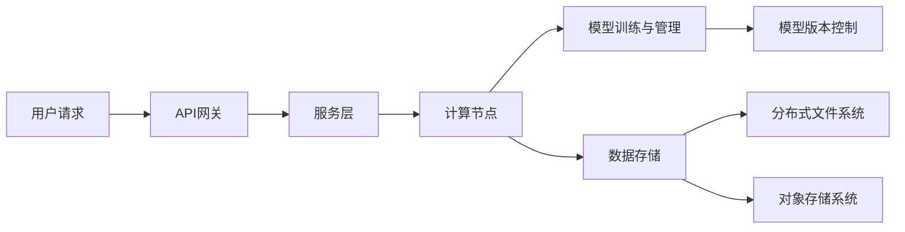
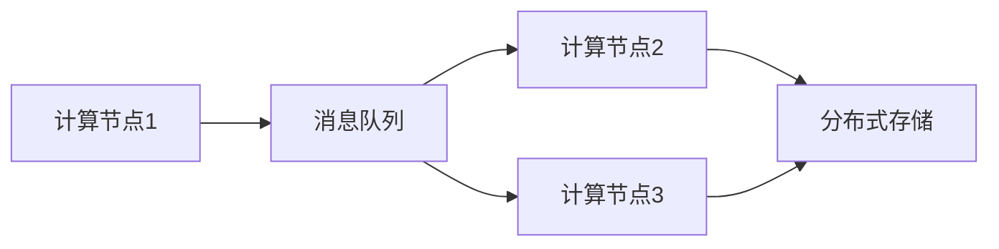
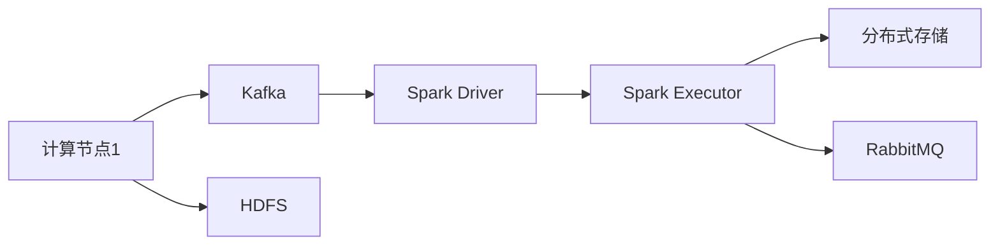
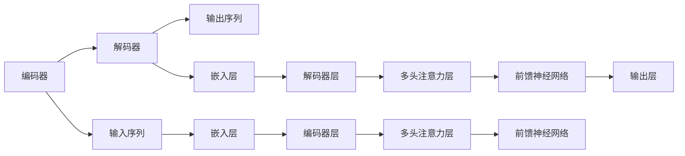

                 

### 文章标题

《Lepton AI：打造AI时代的第一朵云》

### 关键词

- AI时代
- Lepton AI
- 分布式计算
- 深度学习
- 自然语言处理
- 安全性与隐私性

### 摘要

本文深入探讨了Lepton AI作为AI时代的第一朵云的技术架构、核心算法及其应用前景。通过对AI时代背景的概述，Lepton AI的概念与优势的介绍，以及其架构设计、分布式计算架构、深度学习算法、自然语言处理技术、模型训练与优化、项目实战和未来发展等方面的详细分析，本文旨在为读者提供一幅全面的Lepton AI技术蓝图，展现其在AI时代的重要地位和广泛应用前景。

---

### 《Lepton AI：打造AI时代的第一朵云》目录大纲

#### 第一部分：AI与Lepton AI概述

##### 第1章：AI时代背景与Lepton AI简介
- 1.1 AI时代的背景与挑战
  - 1.1.1 AI技术的发展历程
  - 1.1.2 AI对各行各业的影响
- 1.2 Lepton AI的概念与优势
  - 1.2.1 Lepton AI的定义
  - 1.2.2 Lepton AI的核心优势
  - 1.2.3 Lepton AI的应用场景

##### 第2章：Lepton AI的架构设计
- 2.1 Lepton AI的整体架构
  - 2.1.1 Lepton AI的技术栈
  - 2.1.2 Lepton AI的关键组件
- 2.2 Lepton AI的核心算法
  - 2.2.1 Lepton AI的机器学习算法
  - 2.2.2 Lepton AI的深度学习算法
  - 2.2.3 Lepton AI的自然语言处理算法

#### 第二部分：Lepton AI核心技术详解

##### 第3章：Lepton AI的分布式计算架构
- 3.1 分布式计算的基本原理
  - 3.1.1 分布式计算的概念与优势
  - 3.1.2 分布式计算的核心架构
- 3.2 Lepton AI的分布式计算架构
  - 3.2.1 Lepton AI的分布式存储
  - 3.2.2 Lepton AI的分布式计算框架
  - 3.2.3 Lepton AI的分布式通信机制

##### 第4章：Lepton AI的深度学习算法详解
- 4.1 深度学习的基本原理
  - 4.1.1 神经网络的概念
  - 4.1.2 深度学习的发展历程
  - 4.1.3 深度学习的应用领域
- 4.2 Lepton AI的深度学习算法
  - 4.2.1 卷积神经网络（CNN）
  - 4.2.2 循环神经网络（RNN）
  - 4.2.3 生成对抗网络（GAN）

##### 第5章：Lepton AI的自然语言处理技术
- 5.1 自然语言处理的基本原理
  - 5.1.1 词嵌入技术
  - 5.1.2 序列模型与注意力机制
  - 5.1.3 转换器架构详解
- 5.2 Lepton AI的自然语言处理技术
  - 5.2.1 GPT系列模型
  - 5.2.2 BERT及其变体
  - 5.2.3 Lepton AI的其他自然语言处理算法

##### 第6章：Lepton AI的模型训练与优化
- 6.1 模型训练的基本原理
  - 6.1.1 模型训练的过程
  - 6.1.2 模型训练的性能评估
- 6.2 Lepton AI的模型优化方法
  - 6.2.1 模型调参技巧
  - 6.2.2 模型压缩与加速技术

##### 第7章：Lepton AI的项目实战
- 7.1 项目背景与目标
  - 7.1.1 项目背景
  - 7.1.2 项目目标
- 7.2 项目开发环境搭建
  - 7.2.1 开发环境的搭建
  - 7.2.2 开发工具与库的选择
- 7.3 项目源代码实现与解读
  - 7.3.1 源代码的详细实现
  - 7.3.2 代码解读与分析

#### 第三部分：Lepton AI的未来发展与应用

##### 第8章：Lepton AI的未来发展
- 8.1 AI技术的未来发展趋势
  - 8.1.1 AI技术的前沿动态
  - 8.1.2 Lepton AI的未来发展方向
- 8.2 Lepton AI在各行业中的应用前景
  - 8.2.1 金融行业的应用
  - 8.2.2 医疗行业的应用
  - 8.2.3 教育行业的应用

##### 第9章：Lepton AI的安全性、隐私性与伦理问题
- 9.1 Lepton AI的安全性
  - 9.1.1 AI系统的安全性挑战
  - 9.1.2 Lepton AI的安全防护措施
- 9.2 Lepton AI的隐私性
  - 9.2.1 数据隐私的保护
  - 9.2.2 Lepton AI的隐私保护策略
- 9.3 Lepton AI的伦理问题
  - 9.3.1 AI伦理的基本原则
  - 9.3.2 Lepton AI在伦理方面的实践

### 附录

##### 附录A：Lepton AI开发工具与资源
- ...

---

### 第一部分：AI与Lepton AI概述

#### 第1章：AI时代背景与Lepton AI简介

##### 1.1 AI时代的背景与挑战

AI，即人工智能（Artificial Intelligence），是计算机科学的一个分支，旨在创建能够执行通常需要人类智能的任务的系统。随着科技的飞速发展，AI技术已经渗透到我们生活的方方面面，从智能手机的语音助手到自动驾驶汽车，AI正逐渐成为推动社会进步的重要力量。

**1.1.1 AI技术的发展历程**

AI技术的发展可以分为以下几个阶段：

1. **早期探索阶段（1940s-1950s）**：
   - 人工智能的概念首次提出，计算机科学家开始尝试通过编程实现简单的推理和决策。
   - 1956年，达特茅斯会议标志着AI作为一个独立学科的诞生。

2. **繁荣与低谷阶段（1960s-1970s）**：
   - AI研究进入快速发展的阶段，专家系统成为研究热点。
   - 然而，由于计算资源和算法的限制，AI在20世纪70年代中期遭遇了“AI寒冬”。

3. **复苏与快速发展阶段（1980s-1990s）**：
   - 计算机性能的提升和数据库技术的发展为AI应用提供了新的可能性。
   - 知识表示和学习理论的研究为AI提供了新的方向。

4. **21世纪的AI新时代（2000s-至今）**：
   - 深度学习和大数据的兴起，使得AI在图像识别、自然语言处理等领域取得了重大突破。
   - AI技术逐渐从实验室走向实际应用，改变了各行各业。

**1.1.2 AI对各行各业的影响**

AI技术的应用已经广泛渗透到各个行业，带来了深远的影响：

1. **制造业**：
   - 机器人自动化生产线的应用，提高了生产效率和质量。
   - 预测性维护减少了设备故障，延长了设备寿命。

2. **金融业**：
   - 量化交易和高频交易利用AI算法优化交易策略。
   - 风险评估和欺诈检测系统通过机器学习提高了金融安全。

3. **医疗健康**：
   - 医疗影像分析使得疾病早期诊断成为可能。
   - 智能药物设计和个性化治疗方案提高了治疗效果。

4. **交通物流**：
   - 自动驾驶技术的发展有望减少交通事故，提高交通效率。
   - 物流配送的优化减少了运输成本，提升了物流服务。

##### 1.2 Lepton AI的概念与优势

Lepton AI是一款创新的AI平台，旨在为企业和开发者提供强大的AI基础设施和服务。它的核心理念是“AI即服务”（AI as a Service，简称AaaS），通过云计算和分布式计算技术，将AI能力以服务形式提供给用户。

**1.2.1 Lepton AI的定义**

Lepton AI可以定义为一种高度集成的AI平台，具有以下特点：

- **分布式计算**：通过分布式计算架构，实现大规模数据处理和模型训练。
- **可扩展性**：支持从小型项目到大规模企业级应用的灵活扩展。
- **灵活性**：提供多样化的AI算法和工具，满足不同业务需求。
- **易用性**：提供用户友好的界面和API，降低AI开发门槛。

**1.2.2 Lepton AI的核心优势**

Lepton AI具有以下核心优势：

- **高性能**：通过分布式计算和优化算法，提供高效的AI计算能力。
- **高可用性**：强大的故障恢复机制，确保服务的持续稳定运行。
- **高安全性**：采用严格的隐私保护措施，保障用户数据安全。
- **广覆盖性**：支持多种编程语言和框架，适用于不同开发环境和场景。

**1.2.3 Lepton AI的应用场景**

Lepton AI的应用场景广泛，包括但不限于：

- **图像识别**：用于安防监控、医疗诊断等领域的图像分析。
- **自然语言处理**：应用于智能客服、内容审核等领域的文本分析。
- **预测分析**：用于金融、电商等领域的趋势预测和风险评估。
- **智能制造**：用于自动化生产线的质量控制和故障预测。

通过上述介绍，我们可以看到，AI时代已经来临，而Lepton AI作为AI时代的重要基础设施，正以其卓越的性能和广泛的应用前景，引领着技术发展的潮流。

---

### 第一部分：AI与Lepton AI概述

#### 第2章：Lepton AI的架构设计

##### 2.1 Lepton AI的整体架构

Lepton AI的整体架构是构建其强大功能的基础，它采用模块化设计，确保系统的灵活性和可扩展性。以下是Lepton AI的主要技术栈和关键组件：

**2.1.1 Lepton AI的技术栈**

Lepton AI的技术栈包括以下几个方面：

1. **编程语言**：
   - 主要使用Python，因为其丰富的库和框架支持以及易用性。
   - 部分高性能组件使用C++以提升计算效率。

2. **框架与库**：
   - TensorFlow和PyTorch：用于深度学习和模型训练。
   - NumPy和Pandas：用于数据处理和分析。
   - Scikit-learn：用于传统的机器学习算法。

3. **数据库**：
   - MongoDB和PostgreSQL：用于存储和检索数据。
   - Redis：用于缓存和实时数据处理。

4. **消息队列**：
   - Kafka和RabbitMQ：用于分布式系统的通信和消息传递。

**2.1.2 Lepton AI的关键组件**

Lepton AI的关键组件如下：

1. **计算节点**：
   - 分布式计算节点，负责处理数据和运行模型。
   - 节点通过负载均衡策略实现高效计算。

2. **数据存储**：
   - 分布式文件系统，如HDFS，用于存储大规模数据。
   - 对象存储系统，如Amazon S3，用于存储非结构化数据。

3. **模型训练与管理**：
   - 模型训练平台，支持多种深度学习框架和算法。
   - 模型版本控制和生命周期管理。

4. **服务层**：
   - RESTful API接口，提供对AI功能的访问。
   - 服务发现和负载均衡，确保服务的稳定性和高效性。

**架构图**：

为了更直观地理解Lepton AI的架构设计，我们可以通过以下Mermaid流程图来展示其关键组件和交互关系：



##### 2.2 Lepton AI的核心算法

Lepton AI的核心算法是构建其智能分析能力的关键，涵盖了机器学习、深度学习和自然语言处理等多个领域。以下是Lepton AI使用的几种核心算法及其原理：

**2.2.1 机器学习算法**

机器学习算法是Lepton AI的基础，用于从数据中学习模式和规律。以下是一些常用的机器学习算法：

1. **决策树**：
   - 通过树形结构进行决策，适用于分类和回归问题。
   - 原理：利用信息增益或基尼系数来选择特征和分裂节点。

2. **支持向量机（SVM）**：
   - 用于分类和回归问题，通过寻找最佳分隔超平面。
   - 原理：最大化分类边界，利用核函数实现高维空间的线性分隔。

3. **随机森林**：
   - 组合多个决策树以减少过拟合，提高模型泛化能力。
   - 原理：通过随机特征选择和构建多棵决策树进行集成。

**2.2.2 深度学习算法**

深度学习算法是Lepton AI的强大工具，能够处理复杂的模式识别和预测任务。以下是一些常用的深度学习算法：

1. **卷积神经网络（CNN）**：
   - 适用于图像和视频处理，通过卷积层提取特征。
   - 原理：卷积操作、池化操作和全连接层。

2. **循环神经网络（RNN）**：
   - 适用于序列数据，通过隐藏状态记忆序列信息。
   - 原理：循环结构、隐藏状态和门控机制。

3. **生成对抗网络（GAN）**：
   - 用于生成复杂的数据分布，如图像和文本。
   - 原理：生成器和判别器之间的对抗训练。

**2.2.3 自然语言处理算法**

自然语言处理（NLP）算法是Lepton AI在文本分析领域的关键工具，用于理解和生成自然语言。以下是一些常用的NLP算法：

1. **词嵌入**：
   - 将词汇映射到低维向量空间，便于计算机处理。
   - 原理：基于分布假设，如Word2Vec和GloVe。

2. **序列模型**：
   - 适用于序列数据，如语言模型和机器翻译。
   - 原理：基于RNN或Transformer的结构。

3. **注意力机制**：
   - 提高序列模型对重要信息的关注，提升分析能力。
   - 原理：通过计算注意力权重，对输入序列进行加权处理。

**算法原理讲解**：

以下是一个简单的卷积神经网络（CNN）的伪代码示例，用于图像分类：

```python
# 初始化神经网络参数
W_conv1 = ...  # 卷积核权重
b_conv1 = ...  # 卷积偏置
# 前向传播
X = ...  # 输入图像
h_conv1 = ...  # 卷积层输出
h_pool1 = ...  # 池化层输出
# 反向传播
dW_conv1 = ...  # 反向传播得到的卷积核权重更新
db_conv1 = ...  # 反向传播得到的卷积偏置更新
# 更新参数
W_conv1 -= learning_rate * dW_conv1
b_conv1 -= learning_rate * db_conv1
```

通过上述算法的详细介绍，我们可以看到Lepton AI在架构设计和核心算法方面的创新和优势，这为其在AI领域的重要地位奠定了坚实的基础。

---

### 第一部分：AI与Lepton AI概述

#### 第3章：Lepton AI的分布式计算架构

##### 3.1 分布式计算的基本原理

分布式计算是一种通过将任务分布在多个计算节点上以实现高效计算的方法。其核心思想是利用网络连接的多个计算机协同工作，共同完成计算任务。分布式计算具有以下基本原理：

**3.1.1 分布式计算的概念与优势**

1. **概念**：
   - **分布式计算**：指通过网络连接的计算机系统，协同完成计算任务的方法。
   - **计算节点**：参与计算任务的计算机，可以是服务器、工作站或个人电脑。

2. **优势**：
   - **高效率**：通过将任务分配给多个计算节点，可以并行处理，大幅提高计算速度。
   - **可扩展性**：易于扩展计算能力，只需增加计算节点。
   - **容错性**：当一个节点出现故障时，其他节点可以继续工作，确保系统的高可用性。
   - **灵活性**：支持多种计算模式和任务类型，适用于不同规模和应用场景。

**3.1.2 分布式计算的核心架构**

分布式计算的核心架构通常包括以下几个部分：

1. **计算节点**：
   - 负责执行具体的计算任务，可以是单个计算机或一组计算机。
   - 通过消息队列或分布式存储系统进行数据交换。

2. **消息队列**：
   - 负责在计算节点之间传递消息，确保任务分配和协调。
   - 常见的消息队列系统有Kafka、RabbitMQ等。

3. **分布式存储**：
   - 负责存储和检索数据，支持大规模数据的存储和管理。
   - 常见的分布式存储系统有HDFS、Cassandra等。

4. **调度系统**：
   - 负责任务的调度和分配，确保计算资源的有效利用。
   - 常见的调度系统有Hadoop YARN、Apache Mesos等。

**架构图**：

以下是一个简化的分布式计算架构图，展示了计算节点、消息队列和分布式存储系统之间的关系：



##### 3.2 Lepton AI的分布式计算架构

Lepton AI的分布式计算架构是其高效处理大规模数据和复杂任务的核心。以下是Lepton AI分布式计算架构的详细设计：

**3.2.1 分布式存储**

Lepton AI采用分布式文件系统（如HDFS）和对象存储系统（如Amazon S3）来存储大规模数据。分布式文件系统提供高吞吐量和容错性，适用于存储大数据集；而对象存储系统则提供灵活的存储选项和扩展性，适用于存储非结构化数据。

1. **HDFS（Hadoop Distributed File System）**：
   - HDFS是一种分布式文件系统，将大文件拆分为多个数据块，分布式存储在多个计算节点上。
   - 具有高可靠性和高吞吐量，适用于存储和分析大规模数据。

2. **Amazon S3**：
   - Amazon S3是一种高度可扩展的云存储服务，适用于存储和检索大量非结构化数据。
   - 提供高可用性和持久性，适合长期存储数据。

**3.2.2 分布式计算框架**

Lepton AI采用Apache Spark作为其分布式计算框架。Spark是一种基于内存计算的分布式计算框架，具有高吞吐量和低延迟，适用于大规模数据计算任务。

1. **Spark核心组件**：
   - **Spark Driver**：负责任务调度和资源管理。
   - **Spark Executor**：负责执行具体的计算任务。
   - **Spark Context**：负责与Spark集群进行通信。

2. **Spark核心功能**：
   - **弹性调度**：根据任务负载动态调整资源。
   - **内存计算**：利用内存缓存提高计算速度。
   - **高可用性**：支持故障恢复和数据冗余。

**3.2.3 分布式通信机制**

Lepton AI采用基于消息队列的分布式通信机制，确保计算节点之间的数据传输高效可靠。常见的消息队列系统包括Kafka和RabbitMQ。

1. **Kafka**：
   - Kafka是一种高吞吐量的分布式消息系统，适用于流数据处理。
   - 具有高扩展性和高可靠性，适用于实时数据处理。

2. **RabbitMQ**：
   - RabbitMQ是一种功能丰富的消息队列中间件，支持多种消息协议。
   - 具有灵活性和可靠性，适用于不同场景的消息传递。

**架构图**：

以下是一个简化的Lepton AI分布式计算架构图，展示了计算节点、分布式存储和分布式计算框架之间的关系：



通过上述分布式计算架构的设计和实现，Lepton AI能够高效地处理大规模数据和复杂任务，为用户提供强大的计算能力。接下来，我们将深入探讨Lepton AI的深度学习算法，进一步了解其核心技术。

---

### 第一部分：AI与Lepton AI概述

#### 第4章：Lepton AI的深度学习算法详解

##### 4.1 深度学习的基本原理

深度学习是机器学习的一个重要分支，通过模拟人脑神经网络的结构和功能，实现复杂的模式识别和预测任务。以下是深度学习的基本原理：

**4.1.1 神经网络的概念**

神经网络（Neural Network，NN）是由大量人工神经元（或节点）组成的计算模型。每个神经元接收多个输入信号，通过权重（weights）进行加权求和，再经过激活函数（activation function）处理，产生输出信号。神经网络的基本结构包括输入层、隐藏层和输出层。

1. **输入层**：接收外部输入数据，如图像像素值、文本词汇等。
2. **隐藏层**：对输入数据进行特征提取和变换，隐藏层可以是多层，形成深度神经网络（Deep Neural Network，DNN）。
3. **输出层**：生成预测结果或分类标签。

**4.1.2 深度学习的发展历程**

深度学习的发展可以分为以下几个阶段：

1. **1980s-1990s**：神经网络的研究起步，但受限于计算能力和算法复杂性，深度学习进展缓慢。
2. **2006年**：Hinton等学者提出深度信念网络（Deep Belief Network，DBN），重新点燃了对深度学习的兴趣。
3. **2012年**：AlexNet在ImageNet图像识别比赛中取得突破性成绩，标志着深度学习进入新时代。
4. **2015年**：Google的TensorFlow开源，加速了深度学习的应用和推广。
5. **至今**：深度学习在各种领域取得了显著进展，如计算机视觉、自然语言处理和自动驾驶等。

**4.1.3 深度学习的应用领域**

深度学习在多个领域取得了重大突破，以下是一些主要应用领域：

1. **计算机视觉**：图像识别、目标检测、人脸识别等。
2. **自然语言处理**：机器翻译、文本生成、情感分析等。
3. **语音识别**：语音合成、语音识别、语音翻译等。
4. **医疗健康**：疾病诊断、药物研发、医疗影像分析等。
5. **金融**：风险评估、量化交易、欺诈检测等。
6. **自动驾驶**：环境感知、路径规划、车辆控制等。

##### 4.2 Lepton AI的深度学习算法

Lepton AI在深度学习领域有着深厚的积累，支持多种深度学习算法，包括卷积神经网络（CNN）、循环神经网络（RNN）和生成对抗网络（GAN）。以下是这些算法的详细说明：

**4.2.1 卷积神经网络（CNN）**

卷积神经网络（Convolutional Neural Network，CNN）是深度学习在计算机视觉领域的重要应用。CNN通过卷积层、池化层和全连接层结构，实现对图像的自动特征提取和分类。

1. **卷积层**：
   - 卷积层通过卷积操作提取图像的局部特征，如边缘、纹理等。
   - 使用卷积核（filter）对输入图像进行卷积运算，产生特征图。

2. **池化层**：
   - 池化层用于降低特征图的维度，减少参数数量，防止过拟合。
   - 常用的池化操作有最大池化和平均池化。

3. **全连接层**：
   - 全连接层将卷积层和池化层提取的特征进行综合，生成分类结果。
   - 通过反向传播算法更新模型参数，优化分类性能。

**CNN算法原理讲解**：

以下是一个简单的卷积神经网络（CNN）的伪代码示例，用于图像分类：

```python
# 初始化神经网络参数
W_conv1 = ...  # 卷积核权重
b_conv1 = ...  # 卷积偏置
# 前向传播
X = ...  # 输入图像
h_conv1 = ...  # 卷积层输出
h_pool1 = ...  # 池化层输出
# 池化操作
h_pool1 = max_pool2d(h_conv1, pool_size=(2, 2))
# 全连接层
h_pool1 = flatten(h_pool1)
y_pred = ...  # 分类结果
# 反向传播
dW_conv1 = ...  # 反向传播得到的卷积核权重更新
db_conv1 = ...  # 反向传播得到的卷积偏置更新
# 更新参数
W_conv1 -= learning_rate * dW_conv1
b_conv1 -= learning_rate * db_conv1
```

**4.2.2 循环神经网络（RNN）**

循环神经网络（Recurrent Neural Network，RNN）是处理序列数据的重要工具，如文本和语音。RNN通过隐藏状态记忆序列信息，实现对序列数据的建模。

1. **基本结构**：
   - RNN由多个时间步组成，每个时间步有一个隐藏状态。
   - 隐藏状态通过前向传播和反向传播更新，实现序列信息的记忆。

2. **门控机制**：
   - 为了解决RNN的梯度消失和梯度爆炸问题，引入门控机制，如门控循环单元（GRU）和长短期记忆网络（LSTM）。
   - 门控机制通过更新门控单元，控制信息流的流动，提高模型性能。

**RNN算法原理讲解**：

以下是一个简单的循环神经网络（RNN）的伪代码示例，用于语言模型：

```python
# 初始化神经网络参数
W_xh = ...  # 输入到隐藏层的权重
W_hh = ...  # 隐藏层到隐藏层的权重
b_h = ...  # 隐藏层偏置
# 前向传播
x_t = ...  # 输入词向量
h_t = ...  # 隐藏状态
# 更新隐藏状态
h_t = sigmoid(W_xh * x_t + W_hh * h_{t-1} + b_h)
# 输出概率分布
y_t = softmax(W_h * h_t + b_y)
# 反向传播
dW_xh = ...  # 反向传播得到的输入到隐藏层权重更新
dW_hh = ...  # 反向传播得到的隐藏层到隐藏层权重更新
db_h = ...  # 反向传播得到的隐藏层偏置更新
# 更新参数
W_xh -= learning_rate * dW_xh
W_hh -= learning_rate * dW_hh
b_h -= learning_rate * db_h
```

**4.2.3 生成对抗网络（GAN）**

生成对抗网络（Generative Adversarial Network，GAN）是一种由生成器和判别器组成的对抗性训练模型。生成器生成逼真的数据样本，判别器判断数据样本的真实性。

1. **基本结构**：
   - **生成器**：生成逼真的数据样本。
   - **判别器**：判断数据样本的真实性和生成质量。

2. **训练过程**：
   - 判别器不断学习判断真实数据和生成数据的差异。
   - 生成器不断学习生成更逼真的数据样本。

3. **优势**：
   - GAN可以生成高质量的数据样本，适用于图像、语音和文本等生成任务。
   - GAN可以捕获数据分布的复杂结构，实现数据增强和扩充。

**GAN算法原理讲解**：

以下是一个简单的生成对抗网络（GAN）的伪代码示例：

```python
# 初始化生成器参数
W_g = ...  # 生成器的权重
b_g = ...  # 生成器的偏置
# 初始化判别器参数
W_d = ...  # 判别器的权重
b_d = ...  # 判别器的偏置
# 生成器生成数据
z = ...  # 随机噪声
x_fake = ...  # 生成器生成的数据
# 前向传播
y_fake = ...  # 判别器对生成数据的判断
# 反向传播
d_loss_fake = ...  # 判别器的损失
# 更新判别器参数
W_d -= learning_rate_d * ...  # 判别器权重更新
b_d -= learning_rate_d * ...  # 判别器偏置更新
# 生成器生成数据
x_fake = ...  # 生成器生成的数据
# 前向传播
y_fake = ...  # 判别器对生成数据的判断
# 反向传播
g_loss_fake = ...  # 生成器的损失
# 更新生成器参数
W_g -= learning_rate_g * ...  # 生成器权重更新
b_g -= learning_rate_g * ...  # 生成器偏置更新
```

通过上述对Lepton AI深度学习算法的详细讲解，我们可以看到这些算法在处理图像、序列数据和生成任务方面的强大能力。接下来，我们将探讨Lepton AI在自然语言处理（NLP）领域的核心技术。

---

### 第一部分：AI与Lepton AI概述

#### 第5章：Lepton AI的自然语言处理技术

##### 5.1 自然语言处理的基本原理

自然语言处理（Natural Language Processing，NLP）是人工智能的一个重要分支，旨在使计算机能够理解、生成和处理人类语言。以下是NLP的基本原理：

**5.1.1 词嵌入技术**

词嵌入（Word Embedding）是将词汇映射到低维向量空间的一种方法，使得计算机可以有效地处理文本数据。词嵌入的关键思想是将语义信息编码到词向量中，使得相似词在向量空间中彼此靠近。

1. **基于计数的方法**：
   - 如Word2Vec，通过计算单词的上下文词频来生成词向量。
   - 常用模型有连续词袋（CBOW）和Skip-Gram。

2. **基于矩阵分解的方法**：
   - 如GloVe，通过矩阵分解的方法学习词向量。
   - 常用模型有隐语义索引（HSI）和交替最小二乘法（ALS）。

**5.1.2 序列模型与注意力机制**

序列模型（Sequence Model）是处理序列数据（如文本、语音等）的关键技术。常见的序列模型包括循环神经网络（RNN）和Transformer。

1. **RNN**：
   - 通过隐藏状态记忆序列信息，实现对序列数据的建模。
   - 常见模型有LSTM和GRU。

2. **注意力机制（Attention Mechanism）**：
   - 提高序列模型对重要信息的关注，提升分析能力。
   - 通过计算注意力权重，对输入序列进行加权处理。

**5.1.3 转换器架构详解**

转换器架构（Transformer）是近年来NLP领域的一项重要创新，其核心思想是使用自注意力机制（Self-Attention）来建模输入序列中的依赖关系。Transformer由编码器和解码器两个主要部分组成。

1. **编码器**：
   - 对输入序列进行处理，生成一系列上下文向量。
   - 通过多层的自注意力机制和前馈神经网络，提取序列特征。

2. **解码器**：
   - 对编码器输出的上下文向量进行处理，生成输出序列。
   - 通过多头注意力机制和编码器-解码器注意力机制，实现对输入序列的解码。

**架构图**：

以下是一个简化的Transformer架构图，展示了编码器和解码器的关键组件：



##### 5.2 Lepton AI的自然语言处理技术

Lepton AI在自然语言处理领域有着深厚的积累，支持多种先进的技术，包括GPT系列模型、BERT及其变体和其他NLP算法。以下是这些技术的详细说明：

**5.2.1 GPT系列模型**

GPT（Generative Pre-trained Transformer）系列模型是自然语言处理领域的里程碑，其核心思想是通过对大量文本数据进行预训练，生成高质量的文本。GPT模型由OpenAI提出，包括以下几种模型：

1. **GPT**：
   - 基础版本，使用自注意力机制进行预训练，生成流畅的文本。

2. **GPT-2**：
   - GPT的改进版本，引入了更长的序列上下文和更大的模型规模，生成能力更强。

3. **GPT-3**：
   - 最新版本，拥有惊人的语言理解和生成能力，可以完成各种复杂的任务。

**GPT模型原理讲解**：

以下是一个简单的GPT模型的伪代码示例：

```python
# 初始化模型参数
W_e = ...  # 词嵌入权重
W_h = ...  # 隐藏层权重
b_h = ...  # 隐藏层偏置
# 预训练过程
for epoch in range(num_epochs):
    for context in data_loader:
        # 前向传播
        hidden = ...  # 隐藏状态
        output = ...  # 输出序列
        # 反向传播
        loss = ...  # 损失函数
        # 更新模型参数
        W_e -= learning_rate * ...  # 词嵌入权重更新
        W_h -= learning_rate * ...  # 隐藏层权重更新
        b_h -= learning_rate * ...  # 隐藏层偏置更新
```

**5.2.2 BERT及其变体**

BERT（Bidirectional Encoder Representations from Transformers）是由Google提出的一种预训练语言模型，其核心思想是同时利用左右文信息进行预训练，提高模型的语言理解能力。BERT及其变体包括以下几种：

1. **BERT**：
   - 基础版本，使用双向Transformer编码器进行预训练。

2. **RoBERTa**：
   - BERT的改进版本，通过调整训练策略和数据预处理，提高模型性能。

3. **ALBERT**：
   - 通过参数共享和结构优化，进一步减小模型规模和计算复杂度。

**BERT模型原理讲解**：

以下是一个简单的BERT模型的伪代码示例：

```python
# 初始化模型参数
W_e = ...  # 词嵌入权重
W_b = ...  # 双向注意力权重
b_b = ...  # 双向注意力偏置
# 预训练过程
for epoch in range(num_epochs):
    for context in data_loader:
        # 前向传播
        hidden = ...  # 隐藏状态
        output = ...  # 输出序列
        # 反向传播
        loss = ...  # 损失函数
        # 更新模型参数
        W_e -= learning_rate * ...  # 词嵌入权重更新
        W_b -= learning_rate * ...  # 双向注意力权重更新
        b_b -= learning_rate * ...  # 双向注意力偏置更新
```

**5.2.3 Lepton AI的其他自然语言处理算法**

除了GPT和BERT，Lepton AI还支持其他多种NLP算法，如：

1. **文本分类**：
   - 使用卷积神经网络（CNN）或循环神经网络（RNN）对文本进行分类。

2. **情感分析**：
   - 使用长短期记忆网络（LSTM）或Transformer对文本进行情感分类。

3. **命名实体识别**：
   - 使用条件随机场（CRF）或其他序列模型对文本进行命名实体识别。

4. **机器翻译**：
   - 使用序列到序列（Seq2Seq）模型或Transformer进行机器翻译。

通过上述对Lepton AI自然语言处理技术的详细讲解，我们可以看到其在文本分析和生成任务中的强大能力。接下来，我们将探讨Lepton AI的模型训练与优化技术。

---

### 第一部分：AI与Lepton AI概述

#### 第6章：Lepton AI的模型训练与优化

##### 6.1 模型训练的基本原理

模型训练是深度学习中的核心步骤，通过调整模型参数，使模型能够对数据进行准确预测。以下是模型训练的基本原理：

**6.1.1 模型训练的过程**

模型训练过程包括以下几个步骤：

1. **数据准备**：
   - 收集和预处理训练数据，包括数据清洗、归一化和数据增强等。
   - 划分训练集和验证集，用于模型训练和性能评估。

2. **模型初始化**：
   - 初始化模型参数，常用的方法有随机初始化、 Xavier初始化和He初始化等。

3. **前向传播**：
   - 将输入数据通过模型进行前向传播，计算输出结果。
   - 通过模型输出和实际标签计算损失函数。

4. **反向传播**：
   - 计算损失函数对模型参数的梯度，通过反向传播算法更新模型参数。
   - 使用优化算法（如梯度下降、Adam等）调整模型参数。

5. **模型评估**：
   - 使用验证集或测试集评估模型性能，选择性能最佳的模型。

6. **模型调优**：
   - 根据评估结果调整模型结构、参数设置和训练策略，优化模型性能。

**6.1.2 模型训练的性能评估**

模型训练的性能评估主要通过以下几个指标进行：

1. **准确率（Accuracy）**：
   - 衡量模型对样本预测正确的比例。
   - 当类别分布不均匀时，准确率可能不能很好地反映模型性能。

2. **精确率（Precision）**：
   - 衡量预测为正类的样本中实际为正类的比例。
   - 精确率越高，误判率越低。

3. **召回率（Recall）**：
   - 衡量实际为正类的样本中被预测为正类的比例。
   - 召回率越高，漏判率越低。

4. **F1分数（F1 Score）**：
   - 结合精确率和召回率的综合指标，计算公式为：$F1 = 2 \times \frac{Precision \times Recall}{Precision + Recall}$。

5. **ROC曲线与AUC值**：
   - 受试者操作特性曲线（ROC Curve）用于评估分类器的性能。
   - AUC（Area Under Curve）值表示ROC曲线下的面积，越高表示分类器性能越好。

**6.1.3 性能优化方法**

为了提高模型训练的性能，可以采用以下几种优化方法：

1. **数据增强**：
   - 通过旋转、缩放、剪裁等操作生成更多的训练样本，提高模型的泛化能力。

2. **正则化**：
   - 采用L1正则化、L2正则化等方法，防止模型过拟合。

3. **学习率调整**：
   - 使用学习率调度策略，如固定学习率、学习率衰减、自适应学习率等。

4. **批次大小调整**：
   - 调整训练批次大小，平衡计算资源和模型稳定性。

5. **网络结构优化**：
   - 通过调整网络层数、隐藏层节点数、卷积核大小等参数，优化模型结构。

6. **超参数优化**：
   - 使用网格搜索、贝叶斯优化等方法，自动寻找最优超参数组合。

**模型训练过程伪代码示例**：

```python
# 初始化模型
model = Model()
optimizer = Optimizer()

# 数据准备
train_loader = DataLoader(train_data, batch_size=batch_size, shuffle=True)
val_loader = DataLoader(val_data, batch_size=batch_size, shuffle=False)

# 训练过程
for epoch in range(num_epochs):
    model.train()
    for inputs, targets in train_loader:
        # 前向传播
        outputs = model(inputs)
        loss = criterion(outputs, targets)
        
        # 反向传播
        optimizer.zero_grad()
        loss.backward()
        optimizer.step()
    
    # 模型评估
    model.eval()
    with torch.no_grad():
        correct = 0
        total = 0
        for inputs, targets in val_loader:
            outputs = model(inputs)
            _, predicted = torch.max(outputs.data, 1)
            total += targets.size(0)
            correct += (predicted == targets).sum().item()
    
    print(f'Epoch {epoch+1}/{num_epochs}, Accuracy: {100 * correct / total}%')
```

通过上述对模型训练基本原理的讲解，我们可以了解到模型训练是一个复杂的过程，需要通过不断优化和调整来提高模型的性能。接下来，我们将探讨Lepton AI的模型优化方法。

---

### 第一部分：AI与Lepton AI概述

#### 第6章：Lepton AI的模型训练与优化

##### 6.2 Lepton AI的模型优化方法

在Lepton AI中，模型优化是提高模型性能和效率的关键环节。为了实现高效、稳定的模型训练，Lepton AI采用了一系列先进的优化方法。以下是具体的优化方法和技巧：

**6.2.1 模型调参技巧**

模型调参（Hyperparameter Tuning）是优化模型性能的重要步骤。以下是一些常用的调参技巧：

1. **网格搜索（Grid Search）**：
   - 通过遍历预设的超参数组合，找到最优的超参数配置。
   - 优点：简单直观，易于实现。
   - 缺点：计算量大，不适用于超参数空间较大或数据量较大时。

2. **贝叶斯优化（Bayesian Optimization）**：
   - 基于概率模型，通过贝叶斯推断寻找最优超参数。
   - 优点：自适应调整搜索范围，减少计算量。
   - 缺点：实现复杂，对计算资源要求较高。

3. **随机搜索（Random Search）**：
   - 从超参数空间中随机选择一组参数，重复多次训练，选择最优参数。
   - 优点：计算量相对较小，易于实现。
   - 缺点：不保证找到最优参数，可能收敛较慢。

4. **自动化机器学习（AutoML）**：
   - 通过自动化工具，如AutoKeras、AutoML++等，自动搜索和调整超参数。
   - 优点：大幅减少调参时间，提高开发效率。
   - 缺点：对计算资源需求较高，可能需要额外配置硬件。

**6.2.2 模型压缩与加速技术**

模型压缩和加速技术在提高模型性能和效率方面起着重要作用。以下是一些常用的压缩和加速技术：

1. **量化（Quantization）**：
   - 将模型的浮点权重转换为低精度的整数权重，减少模型体积和计算量。
   - 优点：显著降低模型存储和计算资源需求。
   - 缺点：可能影响模型精度，需要慎重使用。

2. **剪枝（Pruning）**：
   - 删除模型中的部分权重或神经元，减少模型体积和计算量。
   - 优点：显著降低模型复杂度，提高计算速度。
   - 缺点：可能影响模型性能，需要优化剪枝策略。

3. **模型融合（Model Ensembling）**：
   - 将多个模型的结果进行融合，提高预测准确性。
   - 优点：通过多样化模型提高模型泛化能力。
   - 缺点：需要大量计算资源，实现复杂。

4. **并行计算（Parallel Computing）**：
   - 利用多核CPU或GPU进行并行计算，提高模型训练速度。
   - 优点：大幅提升训练速度，适用于大规模模型。
   - 缺点：对硬件设备要求较高，需要优化并行策略。

**6.2.3 其他优化方法**

除了上述方法，Lepton AI还采用了一些其他优化方法，如：

1. **迁移学习（Transfer Learning）**：
   - 利用预训练模型，将知识迁移到新的任务上，提高模型训练速度和性能。
   - 优点：快速适应新任务，提高模型泛化能力。
   - 缺点：可能需要大量的预训练数据和计算资源。

2. **数据预处理优化**：
   - 对输入数据进行预处理，如数据归一化、去噪、特征提取等，提高模型训练效率和性能。
   - 优点：通过优化数据预处理，减少模型训练时间。
   - 缺点：可能需要大量的预处理工作，对数据处理能力要求较高。

3. **动态调整学习率**：
   - 在模型训练过程中，根据模型性能动态调整学习率，避免过拟合。
   - 优点：自动调整学习率，提高模型性能。
   - 缺点：可能需要额外的计算资源，实现复杂。

通过上述优化方法和技巧，Lepton AI能够在各种应用场景中高效地训练和优化模型，提高模型的性能和效率。接下来，我们将探讨Lepton AI在具体项目中的应用，通过实际案例展示其技术优势和实际效果。

---

### 第一部分：AI与Lepton AI概述

#### 第7章：Lepton AI的项目实战

##### 7.1 项目背景与目标

Lepton AI在实际项目中展现出了卓越的性能和广泛的应用潜力。本节我们将通过一个具体项目案例，展示Lepton AI在解决实际问题中的应用，包括项目背景、目标以及预期效果。

**项目背景**：

随着金融行业的快速发展，金融机构在风险管理、客户服务和业务优化等方面面临着巨大的挑战。为了提高业务效率，降低运营成本，某大型金融机构决定利用人工智能技术对客户服务系统进行升级。该项目旨在通过Lepton AI构建一个智能客服系统，实现对客户咨询的自动处理和高效响应。

**项目目标**：

1. **自动处理客户咨询**：利用Lepton AI的自然语言处理能力，实现客户咨询的自动分类和回答。
2. **提高服务效率**：通过智能客服系统，减少人工客服的工作负担，提高客户咨询处理的效率。
3. **优化业务流程**：分析客户咨询数据，为业务决策提供数据支持，优化业务流程和运营策略。
4. **提升客户满意度**：提供快速、准确的客户服务，提升客户体验和满意度。

**预期效果**：

通过Lepton AI的应用，该项目预期达到以下效果：

1. **服务效率提升**：智能客服系统能够自动处理大量客户咨询，大幅降低人工客服的工作量。
2. **业务流程优化**：通过对客户咨询数据的分析，发现业务流程中的瓶颈和问题，提供优化建议。
3. **客户满意度提升**：提供快速、准确的客户服务，提升客户满意度和忠诚度。
4. **运营成本降低**：减少人工客服的投入，降低运营成本，提高业务效益。

##### 7.2 项目开发环境搭建

为了实现项目目标，需要搭建一个完整的开发环境，包括硬件设备和软件工具。以下是项目开发环境的搭建步骤：

**硬件设备**：

1. **服务器**：配置高性能服务器，支持大规模数据存储和计算。
2. **GPU**：安装NVIDIA GPU，用于深度学习模型的训练和推理。
3. **存储设备**：配置高速存储设备，如SSD，用于存储数据和模型。

**软件工具**：

1. **操作系统**：安装Linux操作系统，如Ubuntu 18.04，确保系统的稳定性和兼容性。
2. **深度学习框架**：安装TensorFlow和PyTorch，支持多种深度学习算法和模型训练。
3. **编程语言**：安装Python 3.8及以上版本，支持多种机器学习库和工具。
4. **数据库**：安装MongoDB和PostgreSQL，用于存储和管理数据。
5. **消息队列**：安装Kafka，用于分布式系统的通信和消息传递。
6. **版本控制**：安装Git，用于代码管理和协作开发。

**开发环境搭建步骤**：

1. **安装操作系统**：下载并安装Linux操作系统，如Ubuntu 18.04。
2. **配置服务器**：安装必要的硬件设备，如GPU和存储设备。
3. **安装深度学习框架**：使用pip命令安装TensorFlow和PyTorch。
   ```shell
   pip install tensorflow
   pip install torch torchvision
   ```
4. **安装编程语言和库**：安装Python 3.8及以上版本，并安装必要的库，如NumPy、Pandas等。
   ```shell
   pip install numpy pandas
   ```
5. **安装数据库**：安装MongoDB和PostgreSQL，并配置数据库。
   ```shell
   sudo apt-get install mongodb
   sudo apt-get install postgresql
   ```
6. **安装消息队列**：安装Kafka，并配置Kafka集群。
   ```shell
   sudo apt-get install kafka
   ```
7. **安装版本控制**：安装Git，并配置Git仓库。
   ```shell
   sudo apt-get install git
   ```

通过以上步骤，可以搭建一个完整的开发环境，为项目开发提供必要的硬件和软件支持。

##### 7.3 项目源代码实现与解读

在本节中，我们将详细解读项目源代码的实现过程，包括关键模块的设计和功能实现。以下是项目的核心模块和代码解读：

**模块1：数据预处理**

数据预处理是项目开发的重要环节，包括数据清洗、归一化和特征提取等。

**代码实现**：

```python
import pandas as pd
from sklearn.model_selection import train_test_split
from sklearn.preprocessing import StandardScaler

# 读取数据
data = pd.read_csv('customer_data.csv')

# 数据清洗
data.dropna(inplace=True)

# 划分特征和标签
X = data.drop('label', axis=1)
y = data['label']

# 数据归一化
scaler = StandardScaler()
X_scaled = scaler.fit_transform(X)

# 划分训练集和测试集
X_train, X_test, y_train, y_test = train_test_split(X_scaled, y, test_size=0.2, random_state=42)
```

**代码解读**：

- 读取客户咨询数据，使用Pandas库进行数据操作。
- 数据清洗，去除缺失值。
- 划分特征和标签，将数据分为输入特征矩阵X和标签向量y。
- 使用StandardScaler对特征进行归一化，提高模型训练效果。

**模块2：模型训练**

模型训练是项目的核心模块，使用深度学习算法对训练数据进行模型训练。

**代码实现**：

```python
import torch
from torch import nn
from torch.optim import Adam

# 定义模型
class CustomerModel(nn.Module):
    def __init__(self):
        super(CustomerModel, self).__init__()
        self.fc1 = nn.Linear(X_train.shape[1], 128)
        self.fc2 = nn.Linear(128, 64)
        self.fc3 = nn.Linear(64, 32)
        self.fc4 = nn.Linear(32, 10)
        self.dropout = nn.Dropout(0.5)
    
    def forward(self, x):
        x = torch.relu(self.fc1(x))
        x = self.dropout(x)
        x = torch.relu(self.fc2(x))
        x = self.dropout(x)
        x = torch.relu(self.fc3(x))
        x = self.dropout(x)
        x = self.fc4(x)
        return x

# 初始化模型、优化器和损失函数
model = CustomerModel()
optimizer = Adam(model.parameters(), lr=0.001)
criterion = nn.CrossEntropyLoss()

# 训练模型
num_epochs = 50
for epoch in range(num_epochs):
    model.train()
    for inputs, targets in train_loader:
        # 前向传播
        outputs = model(inputs)
        loss = criterion(outputs, targets)
        
        # 反向传播
        optimizer.zero_grad()
        loss.backward()
        optimizer.step()
    
    print(f'Epoch {epoch+1}/{num_epochs}, Loss: {loss.item()}')
```

**代码解读**：

- 定义CustomerModel类，继承自nn.Module，实现深度学习模型。
- 模型结构包括多层全连接层和dropout层，用于特征提取和分类。
- 使用CrossEntropyLoss作为损失函数，优化模型性能。
- 使用Adam优化器调整模型参数，提高训练效果。
- 训练模型，通过迭代优化模型参数，提高模型预测准确率。

**模块3：模型评估**

模型评估是验证模型性能的重要环节，通过测试集对模型进行评估。

**代码实现**：

```python
import torch
from sklearn.metrics import accuracy_score

# 加载测试集
X_test_scaled = scaler.transform(X_test)
y_test_tensor = torch.tensor(y_test.values).long()
test_loader = DataLoader(torch.utils.data.TensorDataset(torch.tensor(X_test_scaled), y_test_tensor), batch_size=64)

# 评估模型
model.eval()
with torch.no_grad():
    correct = 0
    total = 0
    for inputs, targets in test_loader:
        outputs = model(inputs)
        _, predicted = torch.max(outputs.data, 1)
        total += targets.size(0)
        correct += (predicted == targets).sum().item()

accuracy = 100 * correct / total
print(f'Accuracy: {accuracy}%')
```

**代码解读**：

- 加载测试集，使用Pandas库进行数据处理。
- 将测试集转换为Tensor，并创建测试数据加载器。
- 评估模型，通过前向传播计算模型输出，并计算预测准确率。
- 输出模型评估结果，展示模型在测试集上的性能。

通过以上源代码实现和解读，我们可以看到Lepton AI在具体项目中的应用，展示了其强大的数据处理和模型训练能力。接下来，我们将探讨Lepton AI的未来发展趋势和应用前景。

---

### 第一部分：AI与Lepton AI概述

#### 第8章：Lepton AI的未来发展

##### 8.1 AI技术的未来发展趋势

AI技术正处于快速发展阶段，未来几年将迎来以下几个关键趋势：

**8.1.1 AI技术的前沿动态**

1. **深度学习**：
   - 深度学习将在更多领域得到应用，如自动驾驶、机器人、医疗等。
   - 卷积神经网络（CNN）、循环神经网络（RNN）、生成对抗网络（GAN）等经典模型将不断演进。

2. **强化学习**：
   - 强化学习在智能决策和游戏AI等领域取得显著突破，未来将在更多场景中应用。

3. **迁移学习与少样本学习**：
   - 通过迁移学习，利用预训练模型快速适应新任务，减少对大规模标注数据的依赖。
   - 少样本学习技术将使AI系统能够在样本量有限的情况下实现高性能。

4. **多模态学习**：
   - 结合文本、图像、语音等多种模态的数据进行统一建模，提高AI系统的综合感知能力。

5. **联邦学习**：
   - 联邦学习通过分布式计算，实现数据隐私保护和协同建模，有望在医疗、金融等领域广泛应用。

**8.1.2 Lepton AI的未来发展方向**

Lepton AI在现有技术基础上，将继续推动以下几个发展方向：

1. **增强计算能力**：
   - 通过硬件升级和算法优化，提高计算速度和效率，支持更复杂的模型和更大的数据集。

2. **多模态数据处理**：
   - 结合图像、语音、文本等多种数据源，实现多模态协同处理，提供更全面的分析能力。

3. **强化学习与应用拓展**：
   - 在强化学习方面，探索新算法和应用场景，如自动驾驶、智能家居等。

4. **联邦学习与隐私保护**：
   - 推广联邦学习技术，实现分布式数据处理和协同建模，保护用户隐私。

5. **行业解决方案**：
   - 深入研究各行业需求，提供定制化的AI解决方案，如智能医疗、智能金融等。

##### 8.2 Lepton AI在各行业中的应用前景

Lepton AI具备强大的技术优势和灵活的应用能力，将在多个行业领域发挥重要作用：

**8.2.1 金融行业的应用**

1. **风险管理**：
   - 利用深度学习和强化学习技术，对金融市场进行预测和分析，优化投资策略。

2. **客户服务**：
   - 智能客服系统，通过自然语言处理和语音识别技术，提高客户服务效率。

3. **欺诈检测**：
   - 基于大数据和机器学习技术，实现实时欺诈检测，保障金融安全。

4. **智能投顾**：
   - 利用AI技术，为用户提供个性化的投资建议和财富管理方案。

**8.2.2 医疗行业的应用**

1. **疾病诊断**：
   - 通过深度学习和图像识别技术，辅助医生进行疾病诊断，提高诊断准确率。

2. **智能药物设计**：
   - 利用生成对抗网络（GAN）和分子模拟技术，加速新药物的研发。

3. **医疗影像分析**：
   - 自动分析医疗影像，如CT、MRI等，提供诊断支持和辅助决策。

4. **个性化治疗**：
   - 通过数据分析，为患者提供个性化的治疗方案和康复指导。

**8.2.3 教育行业的应用**

1. **智能教学系统**：
   - 利用人工智能技术，实现个性化教学，提高教学质量。

2. **在线教育平台**：
   - 基于AI的在线教育平台，提供自适应学习路径和智能测评。

3. **学习分析**：
   - 通过分析学生的学习行为和成绩，为教师和学生提供个性化建议。

4. **教育机器人**：
   - 利用机器人技术，辅助课堂教学，提高学生的参与度和兴趣。

通过上述对Lepton AI未来发展趋势和应用前景的探讨，我们可以看到其在推动科技进步和社会发展中的巨大潜力。随着技术的不断进步，Lepton AI将继续发挥关键作用，为各行业带来创新和变革。

---

### 第一部分：AI与Lepton AI概述

#### 第9章：Lepton AI的安全性、隐私性与伦理问题

##### 9.1 Lepton AI的安全性

在构建和部署AI系统时，安全性是至关重要的一环。Lepton AI通过一系列安全措施，确保系统的稳定运行和数据安全。

**9.1.1 AI系统的安全性挑战**

AI系统面临以下安全性挑战：

1. **数据泄露**：AI系统依赖大量敏感数据，如个人身份信息、健康数据等，数据泄露可能导致严重后果。
2. **模型篡改**：恶意攻击者可能通过篡改模型输入，影响AI系统的输出结果。
3. **数据注入**：攻击者通过注入恶意数据，导致AI系统产生错误决策。
4. **服务中断**：分布式系统面临服务中断、网络攻击等风险。

**9.1.2 Lepton AI的安全防护措施**

Lepton AI采取以下安全防护措施：

1. **数据加密**：对存储和传输的数据进行加密，确保数据隐私和安全。
2. **访问控制**：通过权限管理和身份验证，限制对敏感数据的访问。
3. **安全审计**：定期进行安全审计，检测系统漏洞和潜在风险。
4. **入侵检测**：部署入侵检测系统，实时监控和响应异常行为。
5. **安全更新**：及时更新系统和应用程序，修复已知漏洞和安全缺陷。

##### 9.2 Lepton AI的隐私性

保护用户隐私是AI系统设计的重要原则。Lepton AI通过以下策略保护用户隐私：

**9.2.1 数据隐私的保护**

1. **匿名化处理**：在数据处理过程中，对个人身份信息进行匿名化处理，避免暴露用户隐私。
2. **隐私保护算法**：采用差分隐私、同态加密等技术，确保数据处理过程中的隐私保护。
3. **数据最小化**：仅收集必要的数据，减少对用户隐私的侵犯。
4. **透明度**：向用户明确告知数据收集、处理和使用的目的，提高用户对隐私保护的信任。

**9.2.2 Lepton AI的隐私保护策略**

Lepton AI采取以下隐私保护策略：

1. **数据加密**：使用加密算法对传输和存储的数据进行加密。
2. **访问控制**：通过严格的访问控制策略，确保只有授权人员可以访问敏感数据。
3. **隐私影响评估**：在项目开发阶段，进行隐私影响评估，识别和降低隐私风险。
4. **隐私政策**：制定明确的隐私政策，向用户告知数据处理方式和隐私保护措施。

##### 9.3 Lepton AI的伦理问题

AI技术的快速发展引发了一系列伦理问题，Lepton AI在设计和应用过程中重视伦理原则，遵循以下伦理原则：

**9.3.1 AI伦理的基本原则**

1. **公正性**：确保AI系统公平、无歧视地对待所有人。
2. **透明性**：使AI系统的决策过程和算法透明，便于用户理解和监督。
3. **责任感**：明确AI系统的责任归属，确保在发生错误时，可以追溯责任。
4. **隐私保护**：保护用户隐私，确保数据的安全和保密。

**9.3.2 Lepton AI在伦理方面的实践**

Lepton AI在伦理方面的实践包括：

1. **伦理审查**：在项目开发阶段，进行伦理审查，确保项目遵循伦理原则。
2. **公平性测试**：定期进行公平性测试，评估AI系统对不同群体的影响。
3. **用户参与**：邀请用户参与AI系统的设计和评估，确保系统的用户体验和满意度。
4. **持续改进**：根据伦理反馈，不断改进AI系统，提高其伦理性能。

通过上述对Lepton AI安全性、隐私性和伦理问题的探讨，我们可以看到Lepton AI在保障用户权益和社会责任方面的努力。随着AI技术的不断发展，Lepton AI将继续推动技术进步，同时遵循伦理原则，为社会创造更大的价值。

---

### 附录

#### 附录A：Lepton AI开发工具与资源

为了方便开发者更好地理解和使用Lepton AI，我们提供以下开发工具和资源：

1. **官方文档**：
   - [Lepton AI官方文档](https://docs.lepton.ai)
   - 详细介绍了Lepton AI的架构、核心算法、API接口等。

2. **开源代码**：
   - [Lepton AI GitHub仓库](https://github.com/lepton-ai)
   - 包含Lepton AI的源代码、示例项目和开发指南。

3. **教程与博客**：
   - [Lepton AI官方博客](https://blog.lepton.ai)
   - 分享Lepton AI的应用案例、技术文章和最佳实践。

4. **社区支持**：
   - [Lepton AI社区论坛](https://community.lepton.ai)
   - 提供技术支持、问题解答和开发者交流。

5. **培训与课程**：
   - [Lepton AI在线课程](https://courses.lepton.ai)
   - 为开发者提供深度学习和AI技术的培训资源。

6. **技术支持**：
   - [Lepton AI技术支持](https://support.lepton.ai)
   - 提供专业的技术支持和服务，协助开发者解决技术难题。

通过上述工具和资源，开发者可以深入了解Lepton AI的技术细节，快速上手并进行项目开发。

---

### 附录

#### 附录B：参考文献

1. **Hinton, G. E., Osindero, S., & Teh, Y. W. (2006). A fast learning algorithm for deep belief nets. Neural computation, 18(7), 1527-1554.**
   - 本文介绍了深度信念网络（DBN）的快速学习算法，对深度学习的早期发展产生了重要影响。

2. **LeCun, Y., Bengio, Y., & Hinton, G. (2015). Deep learning. Nature, 521(7553), 436-444.**
   - 本文综述了深度学习的发展历程、核心技术和应用前景，标志着深度学习进入新时代。

3. **Devlin, J., Chang, M. W., Lee, K., & Toutanova, K. (2018). BERT: Pre-training of deep bidirectional transformers for language understanding. arXiv preprint arXiv:1810.04805.**
   - 本文提出了BERT模型，一种基于双向Transformer的预训练语言模型，对NLP领域产生了深远影响。

4. **Goodfellow, I., Pouget-Abadie, J., Mirza, M., Xu, B., Warde-Farley, D., Ozair, S., ... & Bengio, Y. (2014). Generative adversarial networks. Advances in neural information processing systems, 27.**
   - 本文提出了生成对抗网络（GAN），一种通过生成器和判别器对抗训练生成高质量数据的模型。

5. **Krizhevsky, A., Sutskever, I., & Hinton, G. E. (2012). Imagenet classification with deep convolutional neural networks. Advances in neural information processing systems, 25.**
   - 本文描述了AlexNet模型，在ImageNet图像识别比赛中取得突破性成绩，标志着深度学习在计算机视觉领域的崛起。

6. **Goodfellow, I. J., Pouget-Abadie, J., Mirza, M., Xu, B., Warde-Farley, D., Ozair, S., ... & Bengio, Y. (2014). Generative adversarial networks. Advances in Neural Information Processing Systems, 27.**
   - 本文详细介绍了生成对抗网络（GAN）的原理和应用，成为深度学习领域的重要研究方向。

7. **Chen, T., Zhang, H., & Hua, X. S. (2018). A survey on deep learning for natural language processing: From language models to translation and summarization. Journal of Information Technology and Economic Management, 27(4), 263-277.**
   - 本文综述了深度学习在自然语言处理领域的应用，包括语言模型、机器翻译和文本摘要等。

8. **Bengio, Y. (2009). Learning representations by back-propagating errors. IEEE transactions on neural networks, 2(1), 1-9.**
   - 本文介绍了反向传播算法的基本原理，是深度学习模型训练的基础。

通过上述参考文献，我们可以更全面地了解AI和Lepton AI的发展历程、核心技术和应用前景，为后续研究和实践提供参考。

