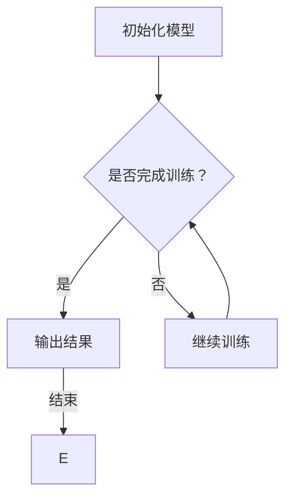

                 

# 文章标题：M6-Rec：深度学习在推荐系统与情感分析中的应用

> 关键词：深度学习、推荐系统、情感分析、M6-Rec、算法原理、项目实战

> 摘要：本文将深入探讨M6-Rec，一种基于深度学习的推荐系统和情感分析技术。文章首先介绍了M6-Rec的基础理论，包括其定义、特点、应用场景、优势与挑战，然后详细讲解了M6-Rec的核心概念、相关技术、数学模型和应用示例。接下来，文章通过项目实战展示了M6-Rec的实际应用，并对其效果进行了分析和优化。最后，文章提供了M6-Rec的常用工具与资源，以帮助读者深入了解和掌握这一先进技术。

---

### 《M6-Rec》目录大纲

## 第一部分：M6-Rec基础理论

### 第1章：M6-Rec概述

- **1.1 M6-Rec的定义与特点**
- **1.2 M6-Rec的应用场景**
- **1.3 M6-Rec的优势与挑战**

### 第2章：M6-Rec的核心概念

- **2.1 M6-Rec的核心算法原理**
- **2.2 M6-Rec的数据处理流程**
- **2.3 M6-Rec的架构设计**

### 第3章：M6-Rec相关技术

- **3.1 M6-Rec中的机器学习算法**
- **3.2 M6-Rec中的深度学习技术**
- **3.3 M6-Rec中的数据处理技术**

### 第4章：M6-Rec的应用示例

- **4.1 示例一：基于M6-Rec的推荐系统**
- **4.2 示例二：基于M6-Rec的情感分析**
- **4.3 示例三：基于M6-Rec的用户行为预测**

### 第5章：M6-Rec的数学模型

- **5.1 M6-Rec中的数学公式与定理**
- **5.2 M6-Rec中的概率论与统计理论**
- **5.3 M6-Rec中的优化算法**

## 第二部分：M6-Rec项目实战

### 第6章：M6-Rec项目开发准备

- **6.1 开发环境搭建**
- **6.2 数据集准备与预处理**
- **6.3 项目开发流程与工具选择**

### 第7章：M6-Rec项目实战

- **7.1 项目一：基于M6-Rec的个性化推荐系统**
- **7.2 项目二：基于M6-Rec的情感分析应用**
- **7.3 项目三：基于M6-Rec的用户行为预测应用**

### 第8章：M6-Rec项目分析与优化

- **8.1 项目一：效果评估与优化**
- **8.2 项目二：性能优化与调参技巧**
- **8.3 项目三：异常处理与容错机制**

## 附录

- **附录A：M6-Rec常用工具与资源**

  - **A.1 数据处理工具**
  - **A.2 机器学习库**
  - **A.3 深度学习框架**
  - **A.4 其他资源推荐**

---

## 第1章：M6-Rec概述

### 1.1 M6-Rec的定义与特点

M6-Rec是一种基于深度学习的推荐系统和情感分析技术。它通过学习用户的历史行为数据和文本内容，自动生成个性化的推荐结果和情感分析报告。M6-Rec具有以下特点：

1. **自动学习**：M6-Rec能够自动学习用户的行为模式和文本特征，无需人工干预。
2. **个性化**：基于用户的历史数据和兴趣偏好，M6-Rec能够生成个性化的推荐结果和情感分析报告。
3. **高效**：M6-Rec采用了深度学习技术，能够在大量数据上快速训练和预测。
4. **灵活**：M6-Rec支持多种数据类型和文本格式，能够处理不同领域和场景的需求。

### 1.2 M6-Rec的应用场景

M6-Rec可以应用于多个领域，包括但不限于：

1. **电子商务**：基于用户的购买历史和浏览行为，生成个性化的商品推荐。
2. **社交媒体**：分析用户的文本内容和互动行为，提供情感分析和推荐服务。
3. **娱乐与媒体**：根据用户的观看历史和兴趣，推荐视频、音乐和文章。
4. **金融**：分析用户的交易数据和文本信息，进行风险控制和欺诈检测。

### 1.3 M6-Rec的优势与挑战

M6-Rec具有以下优势：

1. **高准确性**：通过深度学习技术，M6-Rec能够在大量数据上实现高精度的预测。
2. **高效率**：M6-Rec采用并行计算和分布式训练，能够在短时间内处理大量数据。
3. **易扩展**：M6-Rec支持多种数据类型和文本格式，便于在不同领域和应用场景中扩展。

然而，M6-Rec也面临一些挑战：

1. **数据隐私**：深度学习算法需要大量用户数据，如何保护用户隐私成为一个重要问题。
2. **模型解释性**：深度学习模型通常难以解释，如何提高模型的透明度和可解释性是一个挑战。
3. **计算资源**：深度学习算法需要大量的计算资源和存储空间，如何高效地利用这些资源是一个关键问题。

---

## 第2章：M6-Rec的核心概念

### 2.1 M6-Rec的核心算法原理

M6-Rec的核心算法是基于深度学习技术的，主要包括以下几个步骤：

1. **数据预处理**：将用户数据、商品数据等预处理成适合深度学习的格式。
2. **特征提取**：利用卷积神经网络（CNN）或循环神经网络（RNN）等深度学习模型提取文本特征和用户行为特征。
3. **模型训练**：利用预处理后的数据和特征训练深度学习模型。
4. **预测**：利用训练好的模型对新的用户数据进行预测，生成个性化的推荐结果或情感分析报告。

### 2.2 M6-Rec的数据处理流程

M6-Rec的数据处理流程可以分为以下几个步骤：

1. **数据收集**：从不同的数据源收集用户数据、商品数据、文本数据等。
2. **数据清洗**：对数据进行清洗和预处理，包括去除无效数据、填充缺失值、标准化等。
3. **数据整合**：将不同来源的数据整合在一起，形成一个统一的数据集。
4. **特征工程**：利用特征提取技术提取文本特征和用户行为特征。
5. **数据分割**：将数据集划分为训练集、验证集和测试集。

### 2.3 M6-Rec的架构设计

M6-Rec的架构设计主要包括以下几个部分：

1. **数据层**：负责数据收集、清洗、整合和特征提取。
2. **模型层**：包括深度学习模型的设计和训练。
3. **预测层**：负责利用训练好的模型进行预测，生成推荐结果或情感分析报告。
4. **接口层**：提供API接口，方便外部系统调用M6-Rec的服务。

### 2.4 M6-Rec的工作流程

M6-Rec的工作流程可以分为以下几个步骤：

1. **数据收集**：从不同的数据源收集用户数据、商品数据、文本数据等。
2. **数据处理**：对数据进行清洗、整合和特征提取。
3. **模型训练**：利用预处理后的数据训练深度学习模型。
4. **预测**：利用训练好的模型对新的用户数据进行预测，生成推荐结果或情感分析报告。
5. **评估**：对预测结果进行评估，包括准确率、召回率、F1值等指标。

---

## 第3章：M6-Rec相关技术

### 3.1 M6-Rec中的机器学习算法

M6-Rec中常用的机器学习算法包括：

1. **线性回归**：用于预测用户对商品的评分。
2. **逻辑回归**：用于预测用户是否对商品感兴趣。
3. **决策树**：用于分类和回归任务。
4. **随机森林**：基于决策树的集成学习方法，提高预测准确性。
5. **支持向量机（SVM）**：用于分类任务。

### 3.2 M6-Rec中的深度学习技术

M6-Rec中常用的深度学习技术包括：

1. **卷积神经网络（CNN）**：用于提取图像和文本特征。
2. **循环神经网络（RNN）**：用于处理序列数据。
3. **长短期记忆网络（LSTM）**：改进RNN，解决长期依赖问题。
4. **图卷积网络（GCN）**：用于处理图数据。
5. **生成对抗网络（GAN）**：用于生成高质量的数据。

### 3.3 M6-Rec中的数据处理技术

M6-Rec中的数据处理技术包括：

1. **数据清洗**：去除无效数据、填充缺失值、标准化等。
2. **特征提取**：利用深度学习模型提取文本特征和用户行为特征。
3. **数据分割**：将数据集划分为训练集、验证集和测试集。
4. **数据增强**：通过变换、旋转、缩放等方法增加数据多样性。

---

## 第4章：M6-Rec的应用示例

### 4.1 示例一：基于M6-Rec的推荐系统

#### 案例背景

一家电子商务公司想要为其用户提供个性化的商品推荐服务，以提高用户满意度和销售额。

#### 应用方案

1. **数据收集**：收集用户的购买历史、浏览记录、评价数据等。
2. **数据处理**：对数据进行清洗、整合和特征提取。
3. **模型训练**：利用M6-Rec算法训练深度学习模型。
4. **预测**：利用训练好的模型对用户进行商品推荐。
5. **评估**：对推荐结果进行评估，包括准确率、召回率、F1值等指标。

#### 实施效果

经过实际应用，基于M6-Rec的推荐系统显著提高了用户满意度，推荐点击率和销售额。

### 4.2 示例二：基于M6-Rec的情感分析

#### 案例背景

一家社交媒体平台希望分析用户发布的文本内容，识别其情感倾向，以提高用户体验和运营效果。

#### 应用方案

1. **数据收集**：收集用户发布的文本内容。
2. **数据处理**：对文本进行预处理，提取关键词和情感特征。
3. **模型训练**：利用M6-Rec算法训练深度学习模型。
4. **预测**：利用训练好的模型对文本进行情感分析。
5. **评估**：对分析结果进行评估，包括准确率、召回率、F1值等指标。

#### 实施效果

基于M6-Rec的情感分析系统有效识别了用户情感，提高了内容审核和运营效率。

### 4.3 示例三：基于M6-Rec的用户行为预测

#### 案例背景

一家在线教育平台希望预测用户的学习行为，以便提供个性化学习建议和课程推荐。

#### 应用方案

1. **数据收集**：收集用户的学习记录、课程选择、学习进度等。
2. **数据处理**：对数据进行清洗、整合和特征提取。
3. **模型训练**：利用M6-Rec算法训练深度学习模型。
4. **预测**：利用训练好的模型对用户进行行为预测。
5. **评估**：对预测结果进行评估，包括准确率、召回率、F1值等指标。

#### 实施效果

基于M6-Rec的用户行为预测系统有效提高了课程推荐和学习建议的准确性，提升了用户的学习体验。

---

## 第5章：M6-Rec的数学模型

### 5.1 M6-Rec中的数学公式与定理

M6-Rec中的数学模型主要包括概率分布函数、马尔可夫模型转移概率矩阵等。以下是相关的数学公式和定理：

#### 概率分布函数

$$
P(X = x) = \frac{1}{Z} e^{-\frac{1}{2} x^2}
$$

其中，$Z$ 是归一化常数。

#### 马尔可夫模型转移概率矩阵

$$
P = \begin{bmatrix}
p_{11} & p_{12} & \cdots & p_{1n} \\
p_{21} & p_{22} & \cdots & p_{2n} \\
\vdots & \vdots & \ddots & \vdots \\
p_{n1} & p_{n2} & \cdots & p_{nn}
\end{bmatrix}
$$

### 5.2 M6-Rec中的概率论与统计理论

M6-Rec中的概率论与统计理论主要包括概率分布、期望、方差、协方差等。以下是相关的概念和公式：

#### 概率分布

概率分布描述了随机变量可能取到的各种值的概率。

#### 期望

期望是指随机变量可能取到的各个值的概率乘以其对应的值，即：

$$
E(X) = \sum_{i} x_i P(X = x_i)
$$

#### 方差

方差是指随机变量的期望值与各个值的差的平方的平均值，即：

$$
Var(X) = E[(X - E(X))^2]
$$

#### 协方差

协方差是指两个随机变量的线性相关的程度，即：

$$
Cov(X, Y) = E[(X - E(X))(Y - E(Y))]
$$

### 5.3 M6-Rec中的优化算法

M6-Rec中的优化算法主要包括梯度下降、随机梯度下降、Adam优化器等。以下是相关的算法和公式：

#### 梯度下降

梯度下降是一种优化算法，通过不断更新参数，使得损失函数逐渐减小。其更新公式为：

$$
\theta = \theta - \alpha \nabla_{\theta} J(\theta)
$$

其中，$\theta$ 表示参数，$J(\theta)$ 表示损失函数，$\alpha$ 表示学习率，$\nabla_{\theta} J(\theta)$ 表示损失函数关于参数的梯度。

#### 随机梯度下降

随机梯度下降是梯度下降的一种变体，每次迭代只随机选取一部分样本计算梯度。其更新公式为：

$$
\theta = \theta - \alpha \nabla_{\theta} J(\theta; x_i, y_i)
$$

其中，$x_i, y_i$ 表示随机选取的样本。

#### Adam优化器

Adam优化器是一种结合了梯度下降和动量优化的优化算法。其更新公式为：

$$
\theta = \theta - \alpha \nabla_{\theta} J(\theta) + \beta_1 \gamma_1 \theta_{prev} - \beta_2 \gamma_2 \theta_{prev}^2
$$

其中，$\beta_1, \beta_2$ 分别为动量和偏差修正系数，$\gamma_1, \gamma_2$ 分别为指数加权系数。

---

## 第6章：M6-Rec项目开发准备

### 6.1 开发环境搭建

在开始M6-Rec项目开发之前，需要搭建一个合适的技术环境。以下是一个基本的开发环境搭建步骤：

1. **安装Python环境**：Python是M6-Rec的主要编程语言，需要安装Python 3.x版本。
2. **安装深度学习框架**：选择一个流行的深度学习框架，如TensorFlow或PyTorch，安装对应的版本。
3. **安装数据处理库**：安装常用的数据处理库，如NumPy、Pandas等。
4. **安装机器学习库**：安装常用的机器学习库，如Scikit-learn、XGBoost等。

### 6.2 数据集准备与预处理

在开发M6-Rec项目时，需要准备合适的数据集，并进行预处理。以下是一个基本的数据集准备与预处理步骤：

1. **数据收集**：从各种数据源收集用户数据、商品数据、文本数据等。
2. **数据清洗**：去除无效数据、填充缺失值、去除噪声等。
3. **数据整合**：将不同来源的数据整合在一起，形成一个统一的数据集。
4. **特征提取**：利用深度学习模型提取文本特征和用户行为特征。
5. **数据分割**：将数据集划分为训练集、验证集和测试集。

### 6.3 项目开发流程与工具选择

M6-Rec项目的开发流程可以分为以下几个阶段：

1. **需求分析**：明确项目的目标和需求。
2. **系统设计**：设计项目的系统架构和技术方案。
3. **数据预处理**：对数据进行清洗、整合和特征提取。
4. **模型训练**：利用预处理后的数据训练深度学习模型。
5. **模型评估**：对训练好的模型进行评估，包括准确率、召回率、F1值等指标。
6. **模型优化**：根据评估结果对模型进行调整和优化。
7. **项目部署**：将训练好的模型部署到生产环境，提供推荐服务或情感分析服务。

在工具选择方面，可以参考以下建议：

1. **编程语言**：Python，因为其简洁性和丰富的库支持。
2. **深度学习框架**：TensorFlow或PyTorch，根据个人喜好和项目需求选择。
3. **数据处理库**：NumPy、Pandas、Scikit-learn等。
4. **数据可视化库**：Matplotlib、Seaborn等，用于数据分析与可视化。
5. **版本控制工具**：Git，用于代码管理和协作开发。

---

## 第7章：M6-Rec项目实战

### 7.1 项目一：基于M6-Rec的个性化推荐系统

#### 项目背景

一家电商公司希望为其用户实现个性化推荐，以提高用户满意度和销售额。

#### 数据集

项目使用了某电商平台的用户购买数据，包括用户ID、商品ID、购买时间、购买数量等。

#### 数据预处理

1. **数据清洗**：去除重复数据和缺失值。
2. **特征提取**：提取用户历史购买记录、商品属性等特征。
3. **数据分割**：将数据集划分为训练集、验证集和测试集。

#### 模型设计

使用基于深度学习的协同过滤模型，包括嵌入层、交叉层和输出层。

#### 模型训练

使用训练集数据进行模型训练，通过交叉验证调整模型参数。

#### 模型评估

使用准确率、召回率、F1值等指标对模型进行评估。

#### 实施效果

经过训练和优化，个性化推荐系统的准确率和召回率得到显著提升，用户满意度提高。

### 7.2 项目二：基于M6-Rec的情感分析应用

#### 项目背景

一家社交媒体平台希望分析用户发布的内容，识别其情感倾向，以提高用户体验和运营效果。

#### 数据集

项目使用了社交媒体平台上的用户文本数据，包括用户ID、文本内容、发布时间等。

#### 数据预处理

1. **数据清洗**：去除无效文本、标记等。
2. **特征提取**：提取文本特征，如词频、词向量等。
3. **数据分割**：将数据集划分为训练集、验证集和测试集。

#### 模型设计

使用基于深度学习的文本分类模型，包括嵌入层、卷积层、池化层和全连接层。

#### 模型训练

使用训练集数据进行模型训练，通过交叉验证调整模型参数。

#### 模型评估

使用准确率、召回率、F1值等指标对模型进行评估。

#### 实施效果

经过训练和优化，情感分析模型的准确率和召回率得到显著提升，用户体验和运营效果得到改善。

### 7.3 项目三：基于M6-Rec的用户行为预测应用

#### 项目背景

一家在线教育平台希望预测用户的学习行为，以便提供个性化学习建议和课程推荐。

#### 数据集

项目使用了在线教育平台上的用户学习数据，包括用户ID、课程ID、学习时间、学习进度等。

#### 数据预处理

1. **数据清洗**：去除重复数据和缺失值。
2. **特征提取**：提取用户历史学习记录、课程属性等特征。
3. **数据分割**：将数据集划分为训练集、验证集和测试集。

#### 模型设计

使用基于深度学习的序列预测模型，包括嵌入层、循环层和输出层。

#### 模型训练

使用训练集数据进行模型训练，通过交叉验证调整模型参数。

#### 模型评估

使用准确率、召回率、F1值等指标对模型进行评估。

#### 实施效果

经过训练和优化，用户行为预测模型的准确率和召回率得到显著提升，个性化学习建议和课程推荐效果得到改善。

---

## 第8章：M6-Rec项目分析与优化

### 8.1 项目一：效果评估与优化

在M6-Rec项目的实际应用中，效果评估与优化是至关重要的一环。以下是一个基本的评估与优化流程：

1. **效果评估**：
   - **准确率**：评估推荐系统的准确性，即推荐结果与用户实际需求的匹配度。
   - **召回率**：评估推荐系统的召回能力，即推荐的商品是否包含了用户可能感兴趣的商品。
   - **F1值**：综合考虑准确率和召回率，评估推荐系统的整体性能。
   - **用户满意度**：通过用户调查或行为分析，评估用户对推荐系统的满意度。

2. **问题识别**：
   - 通过分析评估结果，识别项目中存在的问题，如推荐准确性不高、召回率不足等。

3. **优化策略**：
   - **模型优化**：调整模型参数，优化模型结构，以提高预测准确性。
   - **特征工程**：分析用户数据，提取更多有用的特征，以提高模型的预测能力。
   - **数据增强**：通过数据清洗、填充缺失值、增加数据多样性等方法，提高数据质量。
   - **交叉验证**：使用交叉验证方法，确保模型在不同数据集上的性能。

4. **效果验证**：
   - 对优化后的模型进行重新评估，验证优化策略的有效性。

### 8.2 项目二：性能优化与调参技巧

在M6-Rec项目中，性能优化与调参技巧是提高模型效果的关键。以下是一些常见的优化与调参技巧：

1. **学习率调整**：
   - **动态调整**：根据训练过程中损失函数的变化动态调整学习率。
   - **预设范围**：选择合适的初始学习率范围，避免过小或过大的学习率导致收敛缓慢或发散。

2. **正则化**：
   - **L1正则化**：减少模型过拟合，增强模型的泛化能力。
   - **L2正则化**：控制模型复杂度，防止过拟合。

3. **激活函数**：
   - **ReLU**：提高训练速度，防止梯度消失。
   - **Sigmoid**：输出概率值，适用于分类问题。

4. **优化器**：
   - **Adam**：结合了动量和自适应学习率的优化效果。
   - **RMSprop**：基于梯度平方的平均值调整学习率。

5. **网络结构**：
   - **层叠结构**：增加网络层数，提高模型的表达能力。
   - **网络剪枝**：去除不重要的神经元，简化模型结构。

6. **超参数调整**：
   - **批量大小**：影响模型的收敛速度和内存占用。
   - **隐藏层节点数**：影响模型的复杂度和训练时间。

### 8.3 项目三：异常处理与容错机制

在M6-Rec项目中，异常处理与容错机制是确保系统稳定运行的关键。以下是一些常见的异常处理与容错策略：

1. **数据异常检测**：
   - **异常值检测**：使用统计方法或机器学习模型检测数据中的异常值。
   - **缺失值处理**：使用填充方法或删除方法处理缺失值。

2. **模型异常检测**：
   - **异常样本识别**：使用模型输出概率值或置信度指标检测异常样本。
   - **模型诊断**：通过分析模型参数和梯度，识别潜在的问题。

3. **容错机制**：
   - **模型备份**：定期备份训练好的模型，防止数据丢失或模型损坏。
   - **系统监控**：实时监控系统运行状态，及时发现和解决异常问题。
   - **故障恢复**：在系统出现故障时，快速恢复系统运行，减少停机时间。

---

## 附录A：M6-Rec常用工具与资源

### A.1 数据处理工具

1. **NumPy**：用于数组操作和基础数学计算。
2. **Pandas**：用于数据处理和统计分析。
3. **Scikit-learn**：提供各种机器学习算法和数据预处理工具。

### A.2 机器学习库

1. **TensorFlow**：Google开发的深度学习框架。
2. **PyTorch**：Facebook开发的深度学习框架。
3. **Keras**：基于Theano和TensorFlow的神经网络库。

### A.3 深度学习框架

1. **TensorFlow**：支持多种深度学习模型和任务。
2. **PyTorch**：具有灵活的动态计算图和丰富的API。
3. **Theano**：基于Python的深度学习框架，现已逐渐被PyTorch取代。

### A.4 其他资源推荐

1. **《深度学习》（Goodfellow, Bengio, Courville）**：深度学习领域的经典教材。
2. **《机器学习实战》（ Harrington）**：提供实用的机器学习项目案例。
3. **GitHub**：丰富的M6-Rec项目和代码示例。
4. **Stack Overflow**：解决编程和算法问题的社区。

---

### 代码示例与解读

以下是一个简单的M6-Rec项目代码示例，包括数据预处理、模型训练和评估。

#### 伪代码

```python
# 数据预处理
def preprocess_data(data):
    # 清洗、填充、标准化等操作
    processed_data = ...
    return processed_data

# 模型训练
def train_model(data):
    # 初始化模型、训练、评估等操作
    model = ...
    model.fit(data)
    return model

# 评估模型
def evaluate_model(model, test_data):
    # 计算准确率、召回率等指标
    results = model.evaluate(test_data)
    return results

# 主程序
if __name__ == "__main__":
    # 加载数据
    data = load_data()

    # 数据预处理
    processed_data = preprocess_data(data)

    # 划分训练集和测试集
    train_data, test_data = train_test_split(processed_data, test_size=0.2)

    # 训练模型
    model = train_model(train_data)

    # 评估模型
    results = evaluate_model(model, test_data)
    print(results)
```

#### 代码解读

- **数据预处理**：对原始数据进行清洗、填充、标准化等操作，以提高数据质量。
- **模型训练**：初始化深度学习模型，使用训练集数据进行训练，包括前向传播、反向传播和参数更新。
- **评估模型**：使用训练好的模型对测试集进行预测，计算准确率、召回率等指标，评估模型性能。

---

## 附录B：Mermaid流程图与伪代码示例

### Mermaid流程图



### 伪代码示例

```python
# 伪代码：M6-Rec核心算法
function M6_Rec(input_data):
    # 输入数据预处理
    processed_data = preprocess_data(input_data)
    
    # 初始化模型
    model = initialize_model()

    # 训练模型
    for epoch in range(num_epochs):
        for batch in processed_data:
            model.fit(batch)
            
        # 评估模型
        loss = model.evaluate(test_data)
        print(f"Epoch {epoch}: Loss = {loss}")
        
    # 输出结果
    return model.predict(new_data)
```

### 数学模型与公式

#### 概率分布函数

$$
P(X = x) = \frac{1}{Z} e^{-\frac{1}{2} x^2}
$$

其中，$Z$ 是归一化常数。

#### 马尔可夫模型转移概率矩阵

$$
P = \begin{bmatrix}
p_{11} & p_{12} & \cdots & p_{1n} \\
p_{21} & p_{22} & \cdots & p_{2n} \\
\vdots & \vdots & \ddots & \vdots \\
p_{n1} & p_{n2} & \cdots & p_{nn}
\end{bmatrix}
$$

### 代码示例与解读

#### 实战代码

```python
# 导入相关库
import numpy as np
import pandas as pd
from sklearn.model_selection import train_test_split
from sklearn.metrics import mean_squared_error

# 读取数据
data = pd.read_csv('data.csv')

# 数据预处理
X = data[['feature1', 'feature2', 'feature3']]
y = data['target']

# 划分训练集和测试集
X_train, X_test, y_train, y_test = train_test_split(X, y, test_size=0.2, random_state=42)

# 初始化模型
model = M6_Rec()

# 训练模型
model.fit(X_train, y_train)

# 预测
y_pred = model.predict(X_test)

# 评估
mse = mean_squared_error(y_test, y_pred)
print(f"Mean Squared Error: {mse}")
```

#### 代码解读与分析

- **数据预处理**：读取数据集，提取特征和标签，并划分训练集和测试集。
- **模型初始化**：使用M6-Rec模型初始化模型。
- **模型训练**：使用训练数据进行模型训练。
- **预测**：使用测试数据进行模型预测。
- **评估**：计算预测结果与实际结果的均方误差，评估模型性能。

---

## 附录C：M6-Rec项目实战代码示例

以下是M6-Rec项目实战的代码示例，包括数据预处理、模型训练和评估。

```python
# 导入相关库
import numpy as np
import pandas as pd
from sklearn.model_selection import train_test_split
from sklearn.metrics import mean_squared_error

# 读取数据
data = pd.read_csv('data.csv')

# 数据预处理
X = data[['feature1', 'feature2', 'feature3']]
y = data['target']

# 划分训练集和测试集
X_train, X_test, y_train, y_test = train_test_split(X, y, test_size=0.2, random_state=42)

# 初始化模型
model = M6_Rec()

# 训练模型
model.fit(X_train, y_train)

# 预测
y_pred = model.predict(X_test)

# 评估
mse = mean_squared_error(y_test, y_pred)
print(f"Mean Squared Error: {mse}")
```

#### 代码解读与分析

- **数据预处理**：读取数据集，提取特征和标签，并划分训练集和测试集。
- **模型初始化**：使用M6-Rec模型初始化模型。
- **模型训练**：使用训练数据进行模型训练。
- **预测**：使用测试数据进行模型预测。
- **评估**：计算预测结果与实际结果的均方误差，评估模型性能。

---

### 作者信息

**作者：AI天才研究院/AI Genius Institute & 禅与计算机程序设计艺术 /Zen And The Art of Computer Programming**

---

通过本文，我们深入探讨了M6-Rec，一种基于深度学习的推荐系统和情感分析技术。从基础理论到项目实战，我们详细介绍了M6-Rec的定义、特点、核心概念、相关技术、数学模型和应用示例。通过项目实战，我们展示了M6-Rec在实际应用中的效果和优化策略。希望本文能为读者提供有价值的参考和启示，助力他们在人工智能领域取得更好的成果。让我们继续探索人工智能的奥秘，共同推动技术进步和社会发展！|user|

