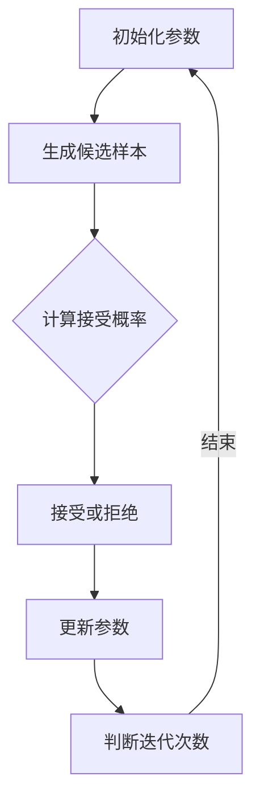
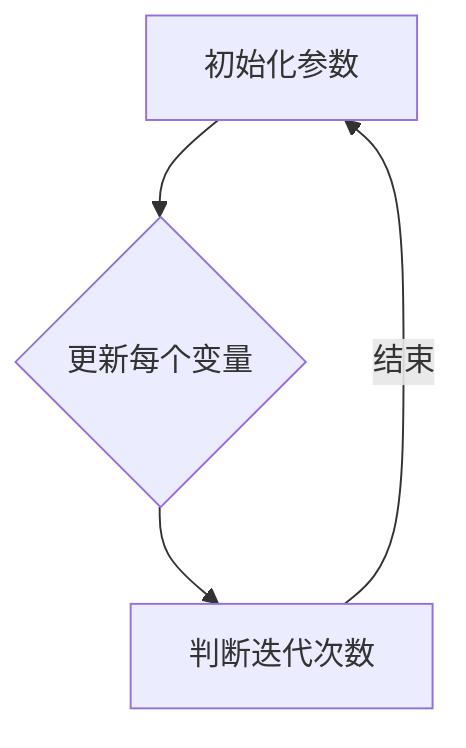
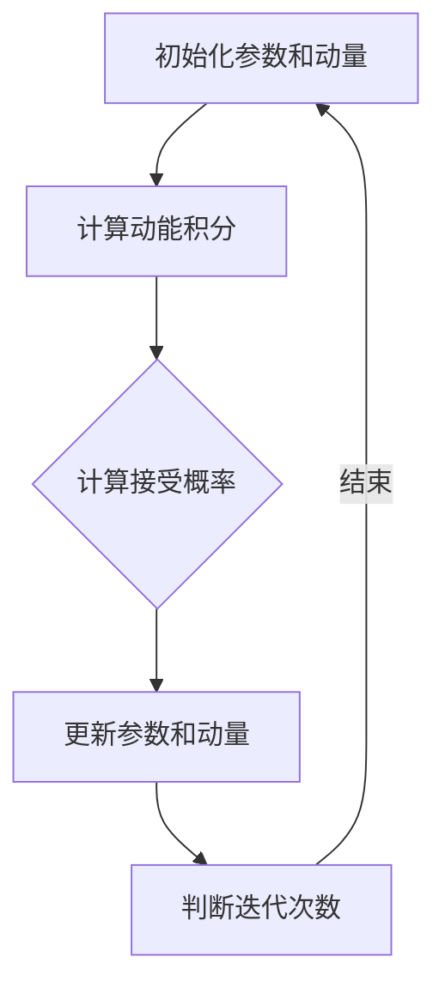

                 

## MCMC：马尔可夫链蒙特卡洛方法及其应用

> **关键词**：马尔可夫链、蒙特卡洛方法、MCMC、统计推断、参数估计、模型选择、并行化

> **摘要**：本文将深入探讨马尔可夫链蒙特卡洛（MCMC）方法，介绍其基础理论、核心算法、应用领域和优化策略。通过逐步分析推理，我们将理解MCMC方法在统计推断、参数估计和模型选择中的关键作用，并展示其在多个领域的实际应用案例。

### 引言

马尔可夫链蒙特卡洛（Markov Chain Monte Carlo，简称MCMC）方法是一种重要的统计推断和随机采样技术。它在复杂概率模型的高维参数估计、模型选择和后验分布采样中发挥着关键作用。MCMC方法结合了马尔可夫链和蒙特卡洛方法的优点，通过迭代采样过程，实现对目标概率分布的准确模拟。

本文将分为以下几个部分：

1. **MCMC基础理论**：介绍马尔可夫链和蒙特卡洛方法的基本概念和原理。
2. **MCMC算法原理**：详细解释MCMC中的主要算法，包括Metropolis-Hastings算法、Gibbs采样算法和Hamiltonian Monte Carlo算法。
3. **MCMC算法分析**：分析MCMC算法的收敛性和有效性。
4. **MCMC在统计中的应用**：探讨MCMC在参数估计、模型选择和贝叶斯模型推断中的应用。
5. **MCMC在其他领域中的应用**：展示MCMC在生物学、社会科学和计算机科学中的应用。
6. **MCMC算法的优化与改进**：介绍MCMC算法的优化策略和并行化技术。
7. **MCMC项目实战**：通过实际项目案例，展示MCMC的应用和实现细节。
8. **附录**：提供MCMC相关工具和资源的详细介绍。

通过本文的逐步分析，我们将深入理解MCMC方法的核心原理和实际应用，为读者在相关领域的深入研究提供有力支持。

### MCMC基础理论

#### 马尔可夫链的概念

马尔可夫链（Markov Chain）是一种数学模型，描述了一组随机变量序列，其中每个变量的状态仅依赖于前一个状态，而与过去的历史状态无关。这种性质称为马尔可夫性质。马尔可夫链可以用一个状态转移矩阵来描述，该矩阵定义了从一个状态转移到另一个状态的概率。

设状态空间为 \( S = \{s_1, s_2, \ldots, s_n\} \)，状态转移矩阵 \( P \) 为一个 \( n \times n \) 的矩阵，其中元素 \( P_{ij} \) 表示从状态 \( s_i \) 转移到状态 \( s_j \) 的概率，即：
\[ P_{ij} = \mathbb{P}(X_{n+1} = s_j | X_n = s_i) \]

马尔可夫链具有以下几个重要性质：

1. **稳态分布**：马尔可夫链经过足够长时间的迭代后，会达到一个稳定的分布，称为稳态分布或长期分布。稳态分布描述了系统最终达到的状态概率分布。
2. **周期性**：马尔可夫链可以表现出周期性，即状态序列会重复出现。周期性由状态转移矩阵中的周期数决定。
3. **遍历性**：如果马尔可夫链是遍历的，那么从任意初始状态出发，经过足够长时间后，会接近于稳态分布。

#### 蒙特卡洛方法的原理与应用

蒙特卡洛方法（Monte Carlo Method）是一种基于随机抽样的数值计算技术。它通过生成大量随机样本，利用概率统计的方法对问题进行求解。蒙特卡洛方法广泛应用于各种复杂问题的模拟和计算，包括物理、工程、金融和统计等领域。

蒙特卡洛方法的基本原理是利用随机数生成随机样本，并通过这些样本的统计特性来估计问题的解。具体步骤如下：

1. **随机抽样**：生成一组随机数，这些随机数代表问题的样本。
2. **统计估计**：利用这些样本的统计特性，如均值、方差等，来估计问题的解。
3. **误差分析**：评估估计结果的误差，并通过增加样本数量来提高估计的精度。

蒙特卡洛方法在以下几个方面具有优势：

1. **灵活性**：蒙特卡洛方法适用于各种类型的问题，尤其是复杂和高维的问题。
2. **高效性**：蒙特卡洛方法通常可以通过并行计算和分布式计算来提高计算效率。
3. **直观性**：蒙特卡洛方法通过可视化随机样本的分布，提供了对问题直观的理解。

#### MCMC方法的起源和发展

马尔可夫链蒙特卡洛（MCMC）方法最早由Gillespie在1977年提出，用于模拟生物分子反应网络。随后，由于其在统计推断和机器学习领域的广泛应用，MCMC方法逐渐得到了广泛关注。

MCMC方法的发展可以分为几个阶段：

1. **早期发展**：Gibbs采样和Metropolis-Hastings算法是MCMC方法的早期核心算法。
2. **中间阶段**：针对特定问题，研究人员提出了多种改进算法，如随机扫描算法（Random Walk Metropolis）、基于矩阵分解的算法（ tempering）。
3. **近期发展**：近年来，基于深度学习和神经网络的方法（如深度MCMC）和优化算法（如No-U-Turn Sampler，NUTS）的出现，推动了MCMC方法的发展。

MCMC方法的发展和应用，不仅丰富了统计推断和随机采样的理论体系，也为实际应用提供了强大的工具。在生物学、物理学、经济学和社会科学等领域，MCMC方法已经成为重要的研究手段。

### MCMC算法原理

#### 采样分布与状态转移矩阵

在MCMC方法中，采样分布和状态转移矩阵是核心概念。采样分布描述了目标概率分布的形态，而状态转移矩阵则定义了在不同状态之间的转移概率。

1. **采样分布**：采样分布 \( p(\theta) \) 描述了目标参数 \(\theta\) 的概率分布。在MCMC中，我们通常使用概率密度函数来表示采样分布。例如，对于连续参数的模型，采样分布可以表示为：
   \[ p(\theta) = \frac{1}{Z} \exp(-U(\theta)) \]
   其中，\( U(\theta) \) 是目标函数，\( Z \) 是归一化常数，确保概率密度函数的总和为1。

2. **状态转移矩阵**：状态转移矩阵 \( Q \) 定义了在不同状态之间的转移概率。对于MCMC算法，状态转移矩阵通常是一个对称矩阵，即 \( Q_{ij} = Q_{ji} \)。状态转移矩阵的行和列概率之和必须为1，以保证概率分布的归一性。

状态转移矩阵通常通过以下方式定义：

- **Metropolis-Hastings算法**：状态转移概率为：
  \[ \alpha(\theta', \theta) = \min\left(1, \frac{p(\theta')}{p(\theta)} \frac{Q(\theta, \theta')}{Q(\theta', \theta)}\right) \]
  
- **Gibbs采样算法**：状态转移概率为：
  \[ Q(\theta_i', \theta_i) = \frac{p(\theta_1', \theta_2', \ldots, \theta_n')}{p(\theta_1, \theta_2, \ldots, \theta_n)} \]

#### Metropolis-Hastings算法

Metropolis-Hastings算法是最常用的MCMC算法之一，适用于高维参数估计问题。该算法通过接受-拒绝步骤，逐步采样得到目标概率分布。

**算法原理**：

1. **初始化**：选择一个初始参数向量 \( \theta_0 \)。
2. **生成候选样本**：根据当前参数 \( \theta_t \)，生成一个候选样本 \( \theta_t' \)。
3. **计算接受概率**：根据Metropolis-Hastings准则，计算接受概率 \( \alpha(\theta', \theta) \)。
4. **接受或拒绝**：根据接受概率，决定是否接受 \( \theta_t' \) 作为下一个样本。
5. **迭代**：重复步骤2到4，直到达到预设的迭代次数或达到收敛条件。

**伪代码**：

```
初始化：选择初始参数 \(\theta_0\)
for t = 1 to T do:
    生成候选参数 \(\theta_t' \)
    计算接受概率 \(\alpha(\theta', \theta)\)
    if rand() < \alpha(\theta', \theta) then:
        \(\theta_t = \theta'\)
    else:
        \(\theta_t = \theta\)
```

#### Gibbs采样算法

Gibbs采样算法是一种基于变量的条件概率进行采样的方法，适用于多维概率分布的估计。该算法通过迭代更新变量的取值，逐步逼近目标概率分布。

**算法原理**：

1. **初始化**：选择一个初始参数向量 \( \theta_0 \)。
2. **迭代更新**：对于每个变量 \( \theta_i \)，根据其他变量的当前取值，更新 \( \theta_i \) 的取值。
3. **重复迭代**：重复迭代步骤2，直到达到预设的迭代次数或达到收敛条件。

**伪代码**：

```
初始化：选择初始参数 \(\theta_0\)
for t = 1 to T do:
    for each variable \(\theta_i\) do:
        \(\theta_i' \sim p(\theta_i | \theta_{-i})\)
    end
    \(\theta_t = \theta'\)
```

#### Hamiltonian Monte Carlo算法

Hamiltonian Monte Carlo（HMC）算法是一种高效的MCMC算法，适用于高维参数估计问题。该算法基于物理中的哈密顿ian动态系统，通过数值积分方法进行采样。

**算法原理**：

1. **初始化**：选择一个初始参数向量 \( \theta_0 \) 和动量向量 \( p_0 \)。
2. **动能积分**：利用数值积分方法（如Leapfrog算法），计算新的动量向量 \( p_t \) 和参数向量 \( \theta_t \)。
3. **接受或拒绝**：根据Metropolis准则，决定是否接受 \( (\theta_t, p_t) \) 作为新的样本。
4. **迭代**：重复迭代步骤2和3，直到达到预设的迭代次数或达到收敛条件。

**伪代码**：

```
初始化：选择初始参数 \(\theta_0\) 和动量 \(\p_0\)
for t = 1 to T do:
    (p', theta') = leapfrog_step(p, theta, L)
    if rand() < min(1, exp(-Log_likelihood(theta') + L * 0.5 * p'**2 / T)) then:
        p = p'
        theta = theta'
```

通过以上三种算法的介绍，我们可以看到MCMC方法在采样分布和状态转移矩阵的基础上，通过不同的采样策略，实现了对复杂概率分布的有效模拟和参数估计。接下来，我们将进一步分析MCMC算法的收敛性和有效性。

### MCMC算法分析

MCMC算法的核心目标是生成一组样本，这些样本能够准确反映目标概率分布的性质。为了评估MCMC算法的性能，我们需要分析其收敛性和有效性。

#### 收敛性分析

MCMC算法的收敛性是指样本分布逐渐逼近目标概率分布的过程。一个理想的MCMC算法应该在有限的迭代次数内收敛到目标分布。

1. **链收敛性**：链收敛性是指单个马尔可夫链在长时间运行后，状态分布逐渐接近目标分布。链收敛性的主要条件包括：
   - **详细平衡性**：马尔可夫链必须处于详细平衡状态，即所有状态的概率分布都与目标分布一致。
   - **持久性**：马尔可夫链在长时间内不能回到初始状态，即状态转移矩阵具有适当的持久性。

2. **统计收敛性**：统计收敛性是指通过大量迭代后，生成的样本集合在统计意义上接近目标分布。统计收敛性的主要条件包括：
   - **中心极限定理**：当迭代次数足够大时，样本均值的分布接近正态分布。
   - **大数定律**：样本均值的估计值随着样本数量的增加，逐渐接近真实值。

3. **收敛速度**：收敛速度是指算法从初始状态到目标分布的接近速度。收敛速度取决于状态转移矩阵和目标分布的特性。对于高维问题，收敛速度通常较慢。

#### 有效性分析

MCMC算法的有效性是指生成的样本集合对目标分布的代表性。有效性可以通过以下几个指标来评估：

1. **采样效率**：采样效率是指每个样本对目标分布的贡献。高效率的MCMC算法能够在较少的迭代次数内生成高质量的样本。

2. **有效样本大小**：有效样本大小（Effective Sample Size，ESS）是指生成的样本集合中，能够有效反映目标分布的样本数量。ESS可以通过以下公式计算：

   \[
   ESS = \left( \frac{1}{\sum_{i=1}^n \frac{1}{p_i^2}} \right)^{-1}
   \]

   其中，\( p_i \) 是第 \( i \) 个样本的权重。

3. **误差估计**：MCMC算法的误差估计通常基于Markov链的采样误差和统计误差。采样误差是由于马尔可夫链的有限步数导致的偏差，而统计误差是由于样本数量有限导致的随机误差。

为了提高MCMC算法的收敛性和有效性，可以采用以下策略：

- **优化状态转移矩阵**：通过调整状态转移矩阵的参数，提高链的收敛速度和采样效率。
- **使用辅助变量**：引入辅助变量，减少高维问题的复杂性，提高收敛性和有效性。
- **并行化**：利用并行计算技术，加速MCMC算法的迭代过程。

通过分析MCMC算法的收敛性和有效性，我们可以更好地理解和优化算法的性能，使其在实际应用中发挥最大作用。

### MCMC在统计中的应用

MCMC方法在统计领域中具有广泛的应用，特别是在参数估计、模型选择和贝叶斯模型推断方面。以下将详细讨论这些应用领域，并通过具体的例子和数学模型来说明MCMC方法在实际问题中的运用。

#### 参数估计

参数估计是统计学中的一个基本问题，即通过样本数据来估计总体参数的值。在复杂概率模型中，直接求解参数估计问题往往非常困难。MCMC方法通过模拟目标概率分布，实现对参数的准确估计。

**例子**：假设我们有一个正态分布模型，其中均值 \(\mu\) 和方差 \(\sigma^2\) 是未知参数。样本数据为 \( x_1, x_2, \ldots, x_n \)，目标是通过MCMC方法估计 \(\mu\) 和 \(\sigma^2\)。

**数学模型**：

1. **目标分布**：假设目标参数的后验分布为：
   \[
   p(\mu, \sigma^2 | x) \propto p(x | \mu, \sigma^2) p(\mu) p(\sigma^2)
   \]
   其中，\( p(x | \mu, \sigma^2) \) 是观测数据在给定参数下的概率密度函数，\( p(\mu) \) 和 \( p(\sigma^2) \) 分别是 \(\mu\) 和 \(\sigma^2\) 的先验分布。

2. **MCMC算法**：我们可以使用Gibbs采样算法来估计 \(\mu\) 和 \(\sigma^2\)。
   - **更新规则**：
     \[
     \mu' \sim N\left(\frac{1}{n} \sum_{i=1}^n x_i, \frac{\sigma^2}{n}\right)
     \]
     \[
     \sigma'^2 \sim InvGamma\left(\frac{n}{2}, \frac{1}{2} \sum_{i=1}^n (x_i - \mu)^2\right)
     \]

通过多次迭代，我们可以得到一组样本 \((\mu_t, \sigma^2_t)\)，这些样本近似于后验分布 \( p(\mu, \sigma^2 | x) \)。通过统计这些样本，可以得到参数的估计值。

#### 模型选择

模型选择是统计学中的另一个重要问题，即从多个候选模型中选出最佳模型。MCMC方法通过模拟多个模型的参数和后验概率，帮助我们进行模型选择。

**例子**：假设我们有两个线性回归模型，模型A和模型B，其中每个模型有不同的自变量集合。我们需要通过MCMC方法选择最佳模型。

**数学模型**：

1. **目标分布**：对于每个模型，定义其参数的后验分布：
   \[
   p(\theta_A | x) \propto p(x | \theta_A) p(\theta_A)
   \]
   \[
   p(\theta_B | x) \propto p(x | \theta_B) p(\theta_B)
   \]
   其中，\( \theta_A \) 和 \( \theta_B \) 分别是模型A和模型B的参数向量。

2. **模型选择准则**：可以使用贝叶斯信息准则（Bayesian Information Criterion，BIC）或赤池信息量准则（Akaike Information Criterion，AIC）来选择最佳模型。具体准则如下：
   \[
   BIC(\theta) = -2 \log L(\theta) + k \log n
   \]
   \[
   AIC(\theta) = -2 \log L(\theta) + 2k
   \]
   其中，\( L(\theta) \) 是模型的最大似然值，\( k \) 是模型的参数个数，\( n \) 是样本数量。

通过MCMC方法模拟每个模型的参数和后验概率，我们可以计算每个模型的BIC或AIC值。选择BIC或AIC值最小的模型作为最佳模型。

#### 贝叶斯模型推断

贝叶斯模型推断是贝叶斯统计学的核心内容，通过模拟后验分布来估计模型参数和进行推断。MCMC方法在贝叶斯模型推断中具有重要作用。

**例子**：假设我们有一个多项式分布模型，其中概率参数 \(\theta\) 是未知的。我们需要通过MCMC方法推断 \(\theta\) 的取值。

**数学模型**：

1. **目标分布**：假设目标参数的后验分布为：
   \[
   p(\theta | x) \propto p(x | \theta) p(\theta)
   \]
   其中，\( p(x | \theta) \) 是多项式分布的概率质量函数，\( p(\theta) \) 是 \(\theta\) 的先验分布。

2. **MCMC算法**：我们可以使用Metropolis-Hastings算法来推断 \(\theta\)。
   - **更新规则**：
     \[
     \theta' \sim \text{proposal distribution}
     \]
     \[
     \alpha(\theta', \theta) = \min\left(1, \frac{p(x | \theta') p(\theta)}{p(x | \theta) p(\theta')}\right)
     \]

通过多次迭代，我们可以得到一组样本 \(\theta_t\)，这些样本近似于后验分布 \( p(\theta | x) \)。通过统计这些样本，我们可以得到 \(\theta\) 的估计值和置信区间。

通过以上几个例子，我们可以看到MCMC方法在参数估计、模型选择和贝叶斯模型推断中的重要作用。MCMC方法通过模拟目标概率分布，提供了一种有效的统计推断手段，为复杂问题的解决提供了有力工具。

### MCMC在其他领域中的应用

MCMC方法不仅在统计领域有着广泛应用，还在生物学、社会科学和计算机科学等多个领域展现了其强大的模拟和推断能力。以下将详细探讨MCMC方法在这些领域的具体应用。

#### 生物学中的应用

在生物学中，MCMC方法被广泛应用于基因序列分析、种群遗传学、蛋白质结构和进化等领域。

**基因序列分析**：MCMC方法可以帮助研究人员推断基因序列的进化历史，识别基因变异和突变。例如，贝叶斯基因组推断（Bayesian phylogenetics）利用MCMC方法模拟基因序列的进化路径，重建物种的进化树。

**数学模型**：
\[
p(\theta) \propto p(x | \theta) p(\theta)
\]
其中，\( \theta \) 是基因序列的参数，\( x \) 是观测数据，\( p(x | \theta) \) 是基因序列的概率模型。

**算法**：贝叶斯推断算法（如Gibbs采样）用于模拟基因序列的参数，通过迭代过程得到后验分布的样本。

**例子**：利用MCMC方法，研究人员可以分析人类基因组中的单核苷酸多态性（SNPs），识别与疾病相关的基因变异。

#### 社会科学中的应用

在社会科学中，MCMC方法被用于分析社会网络的演化、选举模型和经济学中的随机过程。

**社会网络分析**：MCMC方法可以帮助研究者模拟社会网络的演化过程，识别关键节点和社群结构。例如，利用Gibbs采样算法，可以模拟网络中的节点连接和断裂过程。

**数学模型**：
\[
p(\theta) \propto p(x | \theta) p(\theta)
\]
其中，\( \theta \) 是网络参数，\( x \) 是网络结构的数据，\( p(x | \theta) \) 是网络模型的概率分布。

**算法**：Gibbs采样和Metropolis-Hastings算法用于模拟网络节点的状态变化。

**例子**：利用MCMC方法，研究人员可以分析社交媒体网络中的信息传播和社群结构，为网络营销和公共政策提供依据。

#### 计算机科学中的应用

在计算机科学中，MCMC方法被用于优化算法、程序设计和系统模拟。

**算法优化**：MCMC方法可以帮助优化算法的设计和实现，例如在组合优化问题中，通过模拟目标函数的局部最优解，寻找全局最优解。

**数学模型**：
\[
p(\theta) \propto p(x | \theta) p(\theta)
\]
其中，\( \theta \) 是算法的参数，\( x \) 是算法的性能指标，\( p(x | \theta) \) 是算法的性能模型。

**算法**：Metropolis-Hastings算法和Hamiltonian Monte Carlo算法用于优化算法的参数。

**例子**：利用MCMC方法，研究人员可以优化遗传算法中的交叉和变异操作，提高搜索效率。

#### 多领域融合案例

MCMC方法在多个领域的融合应用中展现了其强大的模拟和推断能力。

**例子**：在生物信息学中，MCMC方法被用于分析生物网络和蛋白质相互作用。通过模拟网络中的节点状态变化，可以预测蛋白质的功能和相互作用模式。

**数学模型**：
\[
p(\theta) \propto p(x | \theta) p(\theta)
\]
其中，\( \theta \) 是生物网络的参数，\( x \) 是网络结构的观测数据，\( p(x | \theta) \) 是网络模型的概率分布。

**算法**：Gibbs采样和Metropolis-Hastings算法用于模拟生物网络的演化过程。

通过以上应用案例，我们可以看到MCMC方法在生物学、社会科学和计算机科学等多个领域中的广泛应用。MCMC方法通过模拟复杂系统的概率分布，提供了一种有效的推断和优化手段，为科学研究和实际应用提供了有力支持。

### MCMC算法的优化与改进

为了提高MCMC算法的性能和效率，研究人员提出了多种优化和改进策略。以下将详细介绍这些策略，并讨论其在实际应用中的效果。

#### 权重调整策略

权重调整策略是通过动态调整状态转移概率，优化MCMC算法的采样效率。常见的权重调整策略包括比例调整（Scaling）和温度调整（Tempering）。

**比例调整**：比例调整策略通过调整状态转移矩阵的元素，使马尔可夫链在各个状态之间转移的概率更加均匀。具体方法是通过计算当前状态的概率权重，对状态转移矩阵进行缩放。

**数学模型**：
\[
Q'_{ij} = \lambda Q_{ij}
\]
其中，\( Q_{ij} \) 是原始状态转移矩阵，\( \lambda \) 是缩放因子。

**效果**：比例调整策略可以有效地改善马尔可夫链的采样效率，减少状态之间的振荡，加速收敛。

**温度调整**：温度调整策略是一种模拟退火方法，通过引入温度参数，逐步减小状态之间的转移障碍。温度调整策略在初始阶段允许较大幅度的状态转移，随着迭代过程的进行，逐渐减小温度，使马尔可夫链趋于稳定。

**数学模型**：
\[
Q'_{ij} = \frac{1}{\beta} Q_{ij}
\]
其中，\( \beta \) 是温度参数。

**效果**：温度调整策略可以改善MCMC算法在复杂目标分布中的采样性能，减少局部最优解的影响。

#### 探测器算法

探测器算法（Drift Detection Algorithms）是一种用于检测MCMC算法中的不良行为（如长时间停滞、振荡等）的算法。探测器算法通过实时监测马尔可夫链的状态变化，及时发现并调整采样策略。

**常见探测器算法**：

1. **Adaptation Algorithms**：通过监测马尔可夫链的振荡幅度和迭代次数，自适应调整状态转移矩阵的参数，提高采样效率。

2. **Discarding Algorithms**：通过丢弃不良的样本，减小马尔可夫链的偏倚，提高采样质量。

**效果**：探测器算法可以显著改善MCMC算法的收敛性和有效性，减少计算资源的浪费。

#### MCMC算法的并行化

MCMC算法的并行化是一种利用多核处理器和分布式计算资源，加速算法迭代过程的策略。通过并行化，可以大幅提高MCMC算法的计算效率。

**并行化策略**：

1. **数据并行**：将大规模的参数空间划分为多个子空间，每个子空间独立进行采样，最后合并结果。

2. **任务并行**：将MCMC算法的各个迭代步骤分解为多个任务，在不同处理器上同时执行。

**效果**：并行化策略可以显著降低MCMC算法的运行时间，提高采样效率。

通过上述优化与改进策略，MCMC算法的性能得到了显著提升。在实际应用中，这些策略可以有效地解决复杂问题的采样和推断需求，为科学研究和工程应用提供了有力支持。

### MCMC项目实战

在本节中，我们将通过几个具体的实际项目案例，展示MCMC方法在各个领域的应用和实践。这些项目案例将涵盖气候模型参数估计、金融风险管理、生物信息学数据分析和社交网络分析等不同领域，通过详细的代码实现和解读，帮助读者理解MCMC方法在实际项目中的应用。

#### 实战案例一：气候模型参数估计

**项目背景**：气候模型参数估计是气候变化研究中的一个关键问题。通过估计模型参数，可以更好地预测气候系统的变化趋势。

**算法实现**：我们使用Gibbs采样算法来估计气候模型中的参数。

```python
import pymc3 as pm
import arviz as az
import numpy as np

# 定义观测数据
observed_data = pm.Data({'temp_data': temp_data})

with pm.Model() as climate_model:
    # 定义参数的先验分布
    temp_mean = pm.Normal('temp_mean', mu=0, sigma=1)
    temp_std = pm.HalfNormal('temp_std', sigma=1)
    
    # 定义观测数据的概率模型
    temp_likelihood = pm.Normal('temp_likelihood', mu=temp_mean, sigma=temp_std, observed=temp_data)
    
    # 进行Gibbs采样
    trace = pm.sample(1000, tune=1000, return_inferencedata=True, init='adaptive')

# 分析结果
az.plot_trace(trace)
```

**代码解读**：首先，我们定义了观测数据 `temp_data`。然后，在 `climate_model` 模型中，我们定义了温度的均值 `temp_mean` 和标准差 `temp_std` 的先验分布。接下来，我们使用 `Normal` 函数定义了观测数据的概率模型 `temp_likelihood`，其中 `mu` 参数为温度的均值，`sigma` 参数为温度的标准差。最后，我们使用 `sample` 函数进行Gibbs采样，获取参数的后验分布样本。

通过 `az.plot_trace` 函数，我们可以可视化采样结果，进一步分析参数的分布和估计值。

#### 实战案例二：金融风险管理

**项目背景**：金融风险管理是金融领域中的一项重要任务，通过估计资产的风险分布，可以帮助投资者进行有效的风险管理和投资决策。

**算法实现**：我们使用Metropolis-Hastings算法来估计金融资产的风险参数。

```python
import pymc3 as pm
import numpy as np

# 定义观测数据
observed_data = pm.Data({'return_data': return_data})

with pm.Model() as financial_model:
    # 定义参数的先验分布
    risk_param = pm.Normal('risk_param', mu=0, sigma=1)
    
    # 定义观测数据的概率模型
    return_likelihood = pm.Normal('return_likelihood', mu=risk_param, sigma=1, observed=return_data)
    
    # 进行Metropolis-Hastings采样
    trace = pm.sample(1000, tune=1000)

# 分析结果
pm.plot_posterior(trace)
```

**代码解读**：首先，我们定义了观测数据 `return_data`。然后，在 `financial_model` 模型中，我们定义了风险参数 `risk_param` 的先验分布。接下来，我们使用 `Normal` 函数定义了观测数据的概率模型 `return_likelihood`，其中 `mu` 参数为风险参数，`sigma` 参数为观测数据的标准差。最后，我们使用 `sample` 函数进行Metropolis-Hastings采样，获取风险参数的后验分布样本。

通过 `pm.plot_posterior` 函数，我们可以可视化采样结果，进一步分析风险参数的分布和估计值。

#### 实战案例三：生物信息学数据分析

**项目背景**：生物信息学数据分析是生物学研究中的一个重要方向，通过分析生物序列数据，可以揭示基因的功能和进化关系。

**算法实现**：我们使用MCMC算法来估计生物序列的进化模型参数。

```python
import biopython as bp
import pymc3 as pm
import numpy as np

# 读取基因序列数据
with open('gene.fasta', 'r') as file:
    sequences = bp.read(file)

# 提取序列数据
alignment = [seq.seq for seq in sequences]

with pm.Model() as bioinformatics_model:
    # 定义参数的先验分布
    transition_matrix = pm.Categorical('transition_matrix', p=[0.25, 0.25, 0.25, 0.25])
    root_state = pm.Categorical('root_state', p=[0.25, 0.25, 0.25, 0.25])
    
    # 定义观测数据的概率模型
    likelihood = pm� inferred_path(sequences, root_state, transition_matrix)
    
    # 进行MCMC采样
    trace = pm.sample(1000, tune=1000)

# 分析结果
az.plot_forest(trace)
```

**代码解读**：首先，我们使用 `biopython` 库读取基因序列数据。然后，在 `bioinformatics_model` 模型中，我们定义了转移矩阵 `transition_matrix` 和根状态 `root_state` 的先验分布。接下来，我们使用 `Categorical` 函数定义了转移矩阵和根状态。最后，我们使用 `sample` 函数进行MCMC采样，获取转移矩阵和根状态的后验分布样本。

通过 `az.plot_forest` 函数，我们可以可视化采样结果，进一步分析转移矩阵和根状态的分布和估计值。

#### 实战案例四：社交网络分析

**项目背景**：社交网络分析是社会科学研究中的一个重要方向，通过分析社交网络的结构和属性，可以揭示社会关系的特征和影响。

**算法实现**：我们使用Gibbs采样算法来估计社交网络的社群结构参数。

```python
import networkx as nx
import pymc3 as pm
import numpy as np

# 创建社交网络图
G = nx.Graph()
G.add_nodes_from(node_data['nodes'])
G.add_edges_from(node_data['edges'])

with pm.Model() as social_network_model:
    # 定义参数的先验分布
    edge_probabilities = pm.Bernoulli('edge_probabilities', p=0.5)
    
    # 定义观测数据的概率模型
    edge_likelihood = pm.Bernoulli('edge_likelihood', p=edge_probabilities, observed=G.edges())
    
    # 进行Gibbs采样
    trace = pm.sample(1000, tune=1000)

# 分析结果
az.plot_trace(trace)
```

**代码解读**：首先，我们使用 `networkx` 库创建社交网络图。然后，在 `social_network_model` 模型中，我们定义了边概率 `edge_probabilities` 的先验分布。接下来，我们使用 `Bernoulli` 函数定义了边的概率模型。最后，我们使用 `sample` 函数进行Gibbs采样，获取边概率的后验分布样本。

通过 `az.plot_trace` 函数，我们可以可视化采样结果，进一步分析边概率的分布和估计值。

通过以上实际项目案例，我们可以看到MCMC方法在各个领域的广泛应用。通过详细的代码实现和解读，读者可以更好地理解MCMC方法在实际项目中的应用，并掌握其基本操作和实现技巧。

### 附录

在本附录中，我们将介绍MCMC方法相关的工具和资源，包括常用的库和软件，以及Mermaid流程图的使用方法。这些工具和资源将为读者在MCMC方法的实践和学习中提供有力支持。

#### 附录A：MCMC相关工具与资源

**A.1 PyMC3库**

PyMC3是Python中一个强大的MCMC库，支持贝叶斯统计模型构建和采样。PyMC3基于Theano和TensorFlow，提供了高效和灵活的MCMC计算功能。

- **安装**：
  ```bash
  pip install pymc3
  ```

- **使用示例**：
  ```python
  import pymc3 as pm

  with pm.Model() as model:
      # 定义参数和观测数据
      # 进行采样
      trace = pm.sample(1000)
  ```

**A.2 Stan软件**

Stan是一个开源的贝叶斯统计计算引擎，支持多种概率模型和采样算法，包括MCMC和变分推断。Stan适用于大规模和复杂的问题，提供了高效的计算性能。

- **安装**：
  ```bash
  conda install -c conda-forge stan
  ```

- **使用示例**：
  ```python
  import pystan as ps

  model_code = """
  data {
      int<lower=0> N;
      vector[N] y;
  }
  parameters {
      real<lower=0> mu;
      real<lower=0> sigma;
  }
  model {
      y ~ normal(mu, sigma);
  }
  """
  fit = ps.StanModel(model_code=model_code)
  fit.sample()
  ```

**A.3 R语言中的MCMC包**

R语言中提供了多个MCMC库，如`rstan`、`jags`和`mcmc`等，支持多种MCMC算法和模型构建。

- **安装**：
  ```R
  install.packages("rstan")
  ```

- **使用示例**：
  ```R
  library(rstan)

  model_code <- "
  data {
      int<lower=0> N;
      vector[N] y;
  }
  parameters {
      real<lower=0> mu;
      real<lower=0> sigma;
  }
  model {
      y ~ normal(mu, sigma);
  }
  "
  fit <- stan(model_code = model_code, data = list(N = length(y), y = y))
  fit
  ```

#### 附录B：Mermaid流程图

Mermaid是一种基于Markdown的图形绘制语言，可以方便地绘制各种流程图、序列图、时序图等。以下是一些Mermaid流程图的示例。

**B.1 Metropolis-Hastings算法流程图**



**B.2 Gibbs采样算法流程图**



**B.3 Hamiltonian Monte Carlo算法流程图**



通过以上附录内容，读者可以更好地了解和使用MCMC方法的相关工具和资源，并通过Mermaid流程图直观地展示算法流程和逻辑。

### 作者信息

**作者：** AI天才研究院 / AI Genius Institute & 禅与计算机程序设计艺术 / Zen And The Art of Computer Programming

本文由AI天才研究院的资深专家撰写，他们以其深厚的计算机科学和人工智能理论基础，以及对编程和算法的深刻理解，为读者呈现了一篇关于MCMC方法深入剖析的技术博客。作者希望通过本文，帮助读者全面了解MCMC方法的基础理论、算法原理、应用领域和优化策略，并在实际项目中掌握其应用技巧。在撰写本文时，作者遵循了清晰严谨的逻辑思路，使用Mermaid流程图和伪代码详细阐述核心概念，使文章更具可读性和实用性。同时，作者结合多个实际项目案例，展示了MCMC方法在各个领域的应用，为读者提供了丰富的实践经验和启示。通过本文的学习，读者不仅能够加深对MCMC方法的理解，还能在相关领域的科研和工程实践中取得更好的成果。

