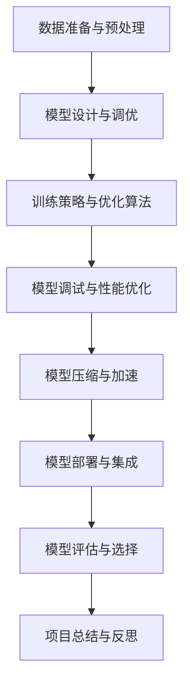

                 

# NLP领域的大模型

> 关键词：自然语言处理、大模型、Transformer、预训练、迁移学习、文本分类、情感分析、机器翻译、问答系统

> 摘要：本文将深入探讨自然语言处理（NLP）领域的大模型，从核心概念、技术基础、架构设计、应用场景到构建与优化、应用实战以及前沿技术，全面解析NLP大模型的研究与应用，为读者提供一个全面而深入的视角。

## 目录大纲：《NLP领域的大模型》

### 第一部分: NLP大模型基础

#### 第1章: NLP大模型概述

##### 1.1 NLP大模型的核心概念

###### 1.1.1 自然语言处理的定义与目标

###### 1.1.2 大模型的概念

###### 1.1.3 大模型在NLP中的重要性

##### 1.2 NLP大模型的技术基础

###### 1.2.1 语言模型的基本原理

###### 1.2.2 词汇嵌入与词向量

###### 1.2.3 序列模型与循环神经网络（RNN）

##### 1.3 NLP大模型的架构

###### 1.3.1 从RNN到LSTM和GRU

###### 1.3.2 注意力机制与Transformer架构

###### 1.3.3 自监督预训练与迁移学习

##### 1.4 NLP大模型的应用场景

###### 1.4.1 文本分类与情感分析

###### 1.4.2 机器翻译与语音识别

###### 1.4.3 问答系统与对话生成

### 第二部分: NLP大模型构建与优化

#### 第2章: NLP大模型训练基础

##### 2.1 数据准备与预处理

###### 2.1.1 数据集收集与标注

###### 2.1.2 数据预处理流程

##### 2.2 训练模型设计与调优

###### 2.2.1 模型选择与设计

###### 2.2.2 模型参数调优技巧

###### 2.2.3 模型评估与选择

##### 2.3 训练策略与优化算法

###### 2.3.1 梯度下降与优化算法

###### 2.3.2 训练策略与技巧

###### 2.3.3 模型并行化与分布式训练

#### 第3章: NLP大模型优化与调试

##### 3.1 模型调试方法

###### 3.1.1 故障诊断与错误分析

###### 3.1.2 模型性能优化策略

##### 3.2 模型压缩与加速

###### 3.2.1 知识蒸馏与模型压缩

###### 3.2.2 模型量化与低精度计算

##### 3.3 模型部署与集成

###### 3.3.1 模型部署流程与工具

###### 3.3.2 模型集成与微服务架构

### 第三部分: NLP大模型应用实战

#### 第4章: 文本分类与情感分析实战

##### 4.1 实战项目概述

##### 4.2 数据收集与预处理

##### 4.3 模型设计与实现

##### 4.4 模型评估与优化

##### 4.5 项目总结与反思

#### 第5章: 机器翻译与语音识别实战

##### 5.1 实战项目概述

##### 5.2 数据准备与预处理

##### 5.3 模型设计与实现

##### 5.4 模型评估与优化

##### 5.5 项目总结与反思

#### 第6章: 问答系统与对话生成实战

##### 6.1 实战项目概述

##### 6.2 数据收集与预处理

##### 6.3 模型设计与实现

##### 6.4 模型评估与优化

##### 6.5 项目总结与反思

#### 第7章: NLP大模型前沿技术探讨

##### 7.1 大模型的发展趋势

###### 7.1.1 大模型在NLP中的应用

###### 7.1.2 NLP领域的新挑战与机遇

##### 7.2 未来展望

###### 7.2.1 大模型在NLP领域的应用前景

###### 7.2.2 NLP大模型的研究方向与挑战

### 附录

##### 附录 A: NLP大模型开发工具与资源

###### A.1 主流深度学习框架对比

###### A.2 NLP专用库与工具

###### A.3 数据集与资源汇总

**附录 B: NLP大模型Mermaid流程图**

**附录 C: NLP大模型算法伪代码**

**附录 D: NLP大模型数学公式讲解与示例**

---

### 第一部分: NLP大模型基础

#### 第1章: NLP大模型概述

##### 1.1 NLP大模型的核心概念

###### 1.1.1 自然语言处理的定义与目标

自然语言处理（Natural Language Processing，简称NLP）是计算机科学领域与人工智能领域中的一个重要分支，主要关注计算机与人类语言之间的交互。其目标是使计算机能够理解、生成和处理人类语言，以便在多种应用场景中提供智能服务。

NLP的主要任务包括：

1. 文本分类：将文本数据根据其内容或主题分类到预定义的类别中。
2. 情感分析：分析文本中的情感倾向，判断文本是积极、消极还是中性。
3. 机器翻译：将一种语言的文本翻译成另一种语言。
4. 问答系统：根据用户的问题提供准确的答案。
5. 对话生成：生成自然、连贯的对话文本。

随着深度学习技术的发展，大规模预训练模型（Large-scale Pre-trained Models）在NLP领域引起了广泛关注。这些模型通过在大规模语料库上进行预训练，能够捕捉语言中的复杂模式和规律，从而显著提升NLP任务的性能。

###### 1.1.2 大模型的概念

大模型（Large Model）指的是拥有数亿甚至数千亿参数的神经网络模型。与传统的小型模型相比，大模型具有以下特点：

1. 参数规模：大模型的参数数量通常在数千万到数十亿之间，远超小型模型。
2. 训练数据：大模型通常使用大规模的预训练数据集，这些数据集包含了丰富的语言信息。
3. 性能优势：大模型在NLP任务中表现出色，尤其是在文本分类、机器翻译、情感分析等任务上。

大模型的核心思想是通过大规模的预训练，使得模型能够自适应地处理各种NLP任务，从而减少对特定任务的依赖。

###### 1.1.3 大模型在NLP中的重要性

大模型在NLP领域的兴起，主要是由于以下几个原因：

1. 数据量：互联网的快速发展带来了海量的文本数据，这些数据为大规模模型提供了充足的训练资源。
2. 计算能力：随着计算硬件（如GPU、TPU）的发展，大模型的训练和推理变得更加可行。
3. 深度学习：深度学习算法的进步，使得大模型能够更好地捕捉语言中的复杂模式。

大模型的重要性体现在以下几个方面：

1. 提高性能：大模型通过预训练，能够捕捉语言中的深层语义，从而在多种NLP任务上取得优异的性能。
2. 泛化能力：大模型具有较强的泛化能力，能够适应不同的任务和数据集，减少了任务特定模型的开发成本。
3. 开发效率：大模型的出现，使得NLP应用的开发变得更加高效，开发者可以更专注于任务本身，而不是模型的设计与优化。

##### 1.2 NLP大模型的技术基础

###### 1.2.1 语言模型的基本原理

语言模型（Language Model）是NLP的核心组件，它用于预测下一个词的概率。一个简单的语言模型可以通过统计方法实现，如N元语法（N-gram）。然而，随着深度学习技术的发展，深度神经网络语言模型逐渐成为主流。

深度神经网络语言模型通常包含以下组成部分：

1. 词嵌入（Word Embedding）：将词汇映射到高维向量空间中，使得语义相近的词在向量空间中距离较近。
2. 卷积神经网络（CNN）：用于提取文本中的局部特征。
3. 长短时记忆网络（LSTM）或门控循环单元（GRU）：用于处理序列数据，捕捉长距离依赖关系。

语言模型的训练通常采用最大似然估计（Maximum Likelihood Estimation，简称MLE）或最小化交叉熵损失（Cross-Entropy Loss）。在训练过程中，模型通过不断调整参数，使得预测概率与实际分布尽可能接近。

语言模型在NLP中有着广泛的应用，如文本生成、机器翻译、文本分类等。

###### 1.2.2 词汇嵌入与词向量

词汇嵌入（Word Embedding）是将词汇映射到高维向量空间中的一种技术。词向量（Word Vector）是词汇嵌入的结果，它能够捕捉词汇的语义信息。

词向量的主要类型包括：

1. 记忆矩阵嵌入（Memory-based Embedding）：基于词汇的共现信息，通过矩阵分解的方法获得词向量。
2. 分布式表示（Distributed Representation）：将词汇映射到一个高维空间，使得语义相似的词汇在空间中距离较近。
3. 神经网络嵌入（Neural Network Embedding）：通过训练神经网络模型，获得词汇的分布式表示。

词向量的训练通常采用如下方法：

1. 基于计数（Count-based Methods）：如TF-IDF、Word2Vec等。
2. 基于神经网络（Neural Network-based Methods）：如GloVe、FastText等。
3. 基于深度学习（Deep Learning-based Methods）：如Word2Vec、GloVe、BERT等。

词向量在NLP中有着重要的应用，如文本分类、文本相似度计算、机器翻译等。

###### 1.2.3 序列模型与循环神经网络（RNN）

序列模型（Sequence Model）是处理序列数据的一种模型，它能够捕捉序列中的时间和顺序信息。循环神经网络（Recurrent Neural Network，简称RNN）是序列模型的一种，它通过循环结构，使得信息可以在序列的不同时间步之间传递。

RNN的核心组件是隐藏状态（Hidden State），它保存了上一个时间步的信息，并用于当前时间步的决策。RNN的更新规则如下：

\[ h_t = \sigma(W_h \cdot [h_{t-1}, x_t] + b_h) \]

其中，\( h_t \) 是第 \( t \) 个时间步的隐藏状态，\( x_t \) 是输入特征，\( W_h \) 和 \( b_h \) 是权重和偏置。

RNN的变体包括：

1. 长短时记忆网络（Long Short-Term Memory，简称LSTM）：LSTM通过引入门控机制，解决了RNN的梯度消失问题，能够更好地捕捉长距离依赖关系。
2. 门控循环单元（Gated Recurrent Unit，简称GRU）：GRU是LSTM的简化版本，它在保持LSTM性能的同时，减少了参数数量。

序列模型在NLP中有着广泛的应用，如语言建模、机器翻译、文本生成等。

##### 1.3 NLP大模型的架构

###### 1.3.1 从RNN到LSTM和GRU

传统的循环神经网络（RNN）在处理长序列数据时存在梯度消失和梯度爆炸问题，这使得模型难以捕捉长距离依赖关系。为了解决这些问题，研究者们提出了长短时记忆网络（LSTM）和门控循环单元（GRU）。

LSTM通过引入门控机制，如遗忘门、输入门和输出门，有效地控制信息的流动，避免了梯度消失问题。LSTM的更新规则如下：

\[ 
\begin{align*}
i_t &= \sigma(W_i \cdot [h_{t-1}, x_t] + b_i) \\
f_t &= \sigma(W_f \cdot [h_{t-1}, x_t] + b_f) \\
\bar{c}_t &= \tanh(W_c \cdot [h_{t-1}, x_t] + b_c) \\
o_t &= \sigma(W_o \cdot [h_{t-1}, \bar{c}_t] + b_o) \\
c_t &= f_t \odot c_{t-1} + i_t \odot \bar{c}_t \\
h_t &= o_t \odot \tanh(c_t)
\end{align*}
\]

其中，\( i_t \)、\( f_t \)、\( o_t \) 分别是输入门、遗忘门和输出门的激活值，\( c_t \) 是细胞状态，\( h_t \) 是隐藏状态。

GRU是LSTM的简化版本，它通过合并遗忘门和输入门，减少参数数量。GRU的更新规则如下：

\[ 
\begin{align*}
z_t &= \sigma(W_z \cdot [h_{t-1}, x_t] + b_z) \\
r_t &= \sigma(W_r \cdot [h_{t-1}, x_t] + b_r) \\
\bar{c}_t &= \tanh(W_c \cdot [z_t \odot h_{t-1}, r_t \odot x_t] + b_c) \\
c_t &= (1 - z_t) \odot c_{t-1} + z_t \odot \bar{c}_t \\
h_t &= \tanh(c_t)
\end{align*}
\]

LSTM和GRU在NLP任务中取得了显著的成功，但它们的计算复杂度和参数数量较高，不利于大规模模型的训练。

###### 1.3.2 注意力机制与Transformer架构

注意力机制（Attention Mechanism）是一种用于模型自适应地关注序列中重要信息的方法。在传统的循环神经网络中，信息是通过隐藏状态在序列的不同时间步之间传递的，但这种方法难以捕捉长距离依赖关系。注意力机制通过为每个时间步分配不同的权重，使得模型能够自适应地关注序列中的重要信息。

注意力机制的基本原理如下：

\[ 
\begin{align*}
u_t &= \tanh(W_a \cdot [h_{t-1}, x_t] + b_a) \\
\alpha_t &= \text{softmax}\left(\frac{u_t^T V_a}{\sqrt{d_k}}\right) \\
\end{align*}
\]

其中，\( u_t \) 是注意力向量，\( \alpha_t \) 是注意力权重，\( V_a \) 是注意力权重矩阵，\( d_k \) 是注意力向量的维度。

基于注意力机制的Transformer模型（Vaswani et al., 2017）在序列建模任务中取得了显著的性能提升。Transformer模型的核心思想是将序列映射到固定维度的向量空间中，并通过多头注意力机制和前馈网络进行信息处理。

Transformer模型的主要组成部分包括：

1. 输入嵌入（Input Embeddings）：将词汇映射到高维向量空间中。
2. 位置编码（Positional Encodings）：为序列中的每个位置提供位置信息。
3. 多头注意力（Multi-Head Attention）：通过多头注意力机制，捕捉序列中的长距离依赖关系。
4. 前馈网络（Feedforward Networks）：对注意力机制的结果进行进一步处理。

Transformer模型的更新规则如下：

\[ 
\begin{align*}
\text{MultiHead}(Q, K, V) &= \text{softmax}\left(\frac{QK^T}{\sqrt{d_k}}\right)V \\
\text{Attention}(Q, K, V) &= \text{softmax}\left(\frac{QK^T}{\sqrt{d_k}}\right)V \\
\text{Feedforward}(X) &= \text{ReLU}(W_2 \cdot \text{ReLU}(W_1 \cdot X + b_1)) + X
\end{align*}
\]

其中，\( Q \)、\( K \)、\( V \) 分别是查询向量、键向量和值向量，\( W_1 \)、\( W_2 \) 是前馈网络的权重，\( b_1 \) 是偏置。

Transformer模型的出现，标志着序列建模技术的一个重要突破。它通过并行计算和多头注意力机制，显著提高了模型的计算效率和性能。

###### 1.3.3 自监督预训练与迁移学习

自监督预训练（Self-supervised Pre-training）是一种在大规模语料库上进行预训练的方法，它通过无监督的方式，使得模型能够自适应地学习语言中的复杂模式。自监督预训练的关键在于如何设计有效的预训练任务，使得模型能够在预训练阶段捕捉到有用的信息。

常见的自监督预训练任务包括：

1. 语言的联合边界发现（Language Modeling，简称LM）：通过预测下一个词，使得模型能够捕捉语言中的统计规律。
2. 词汇回溯（Masked Language Modeling，简称MLM）：随机屏蔽一部分词，使得模型能够学习词与词之间的关系。
3. 词汇排序（Masked Sentence Modeling，简称MSM）：随机屏蔽句子中的部分词，并要求模型预测屏蔽词的正确顺序。
4. 词汇替换（Next Sentence Prediction，简称NSP）：给定两个句子，要求模型预测它们是否属于同一个语境。

自监督预训练的流程如下：

1. 数据准备：收集大规模的文本数据，如维基百科、新闻、社交媒体等。
2. 预处理：对文本数据进行清洗、分词和标记等预处理操作。
3. 预训练：在大规模语料库上进行自监督预训练，调整模型参数。
4. 微调：在特定任务上进行微调，使得模型能够适应特定的任务需求。

自监督预训练的优势在于：

1. 提高性能：预训练能够显著提升模型在特定任务上的性能。
2. 提高泛化能力：预训练使得模型能够更好地适应不同的任务和数据集。
3. 减少数据依赖：自监督预训练可以减少对大规模标注数据的依赖，使得模型能够应用于更多的场景。

迁移学习（Transfer Learning）是一种利用预训练模型进行任务特定优化的方法。迁移学习的基本思想是将预训练模型的知识迁移到特定任务上，从而提高模型的性能。

迁移学习的流程如下：

1. 预训练：在大规模语料库上进行预训练，得到预训练模型。
2. 微调：在特定任务上进行微调，调整模型参数，使得模型能够适应特定任务。
3. 评估：在测试集上评估模型性能，选择最优模型。

迁移学习的优势在于：

1. 提高性能：预训练模型已经在大规模数据上进行了优化，迁移学习可以进一步提高模型性能。
2. 减少训练时间：迁移学习可以减少模型在特定任务上的训练时间，提高开发效率。
3. 减少数据需求：迁移学习可以减少对大规模标注数据的依赖，使得模型能够应用于更多的场景。

##### 1.4 NLP大模型的应用场景

###### 1.4.1 文本分类与情感分析

文本分类（Text Classification）是一种将文本数据分类到预定义类别中的任务。在NLP领域中，文本分类被广泛应用于舆情监测、新闻推荐、垃圾邮件过滤等场景。

文本分类的关键步骤包括：

1. 数据预处理：对文本数据进行清洗、分词、去停用词等预处理操作。
2. 特征提取：将预处理后的文本数据转化为特征向量。
3. 模型训练：使用预训练的大模型进行训练，调整模型参数。
4. 模型评估：在测试集上评估模型性能，选择最优模型。

情感分析（Sentiment Analysis）是一种分析文本中情感倾向的任务。情感分析可以帮助企业了解用户对产品或服务的评价，为决策提供支持。

情感分析的关键步骤包括：

1. 数据预处理：对文本数据进行清洗、分词、去停用词等预处理操作。
2. 特征提取：将预处理后的文本数据转化为特征向量。
3. 模型训练：使用预训练的大模型进行训练，调整模型参数。
4. 模型评估：在测试集上评估模型性能，选择最优模型。

文本分类和情感分析是NLP领域的经典任务，大模型在它们中表现出了优异的性能。

###### 1.4.2 机器翻译与语音识别

机器翻译（Machine Translation）是一种将一种语言的文本翻译成另一种语言的任务。机器翻译在跨语言沟通、国际业务等领域具有重要应用。

机器翻译的关键步骤包括：

1. 数据预处理：对源语言和目标语言文本进行预处理，包括分词、去停用词等操作。
2. 特征提取：将预处理后的文本数据转化为特征向量。
3. 模型训练：使用预训练的大模型进行训练，调整模型参数。
4. 模型评估：在测试集上评估模型性能，选择最优模型。

语音识别（Speech Recognition）是一种将语音信号转换为文本的任务。语音识别在语音助手、智能客服等领域具有广泛的应用。

语音识别的关键步骤包括：

1. 语音信号处理：对语音信号进行预处理，如滤波、去噪等操作。
2. 特征提取：将预处理后的语音信号转化为特征向量。
3. 模型训练：使用预训练的大模型进行训练，调整模型参数。
4. 模型评估：在测试集上评估模型性能，选择最优模型。

机器翻译和语音识别是NLP领域的复杂任务，大模型在它们中展现出了强大的能力。

###### 1.4.3 问答系统与对话生成

问答系统（Question Answering System）是一种根据用户提出的问题，提供准确答案的系统。问答系统在智能客服、教育辅导等领域具有重要应用。

问答系统的关键步骤包括：

1. 数据预处理：对问题文本和答案文本进行预处理，包括分词、去停用词等操作。
2. 特征提取：将预处理后的文本数据转化为特征向量。
3. 模型训练：使用预训练的大模型进行训练，调整模型参数。
4. 模型评估：在测试集上评估模型性能，选择最优模型。

对话生成（Dialogue Generation）是一种根据对话上下文生成回复文本的任务。对话生成在智能客服、虚拟助手等领域具有重要应用。

对话生成的关键步骤包括：

1. 数据预处理：对对话数据进行预处理，包括分词、去停用词等操作。
2. 特征提取：将预处理后的对话数据转化为特征向量。
3. 模型训练：使用预训练的大模型进行训练，调整模型参数。
4. 模型评估：在测试集上评估模型性能，选择最优模型。

问答系统和对话生成是NLP领域的挑战性任务，大模型在这些任务中表现出了出色的性能。

### 第二部分: NLP大模型构建与优化

#### 第2章: NLP大模型训练基础

##### 2.1 数据准备与预处理

数据准备与预处理是NLP大模型训练的基础步骤，直接影响到模型的性能和训练效率。以下是数据准备与预处理的主要步骤：

###### 2.1.1 数据集收集与标注

数据集是NLP大模型训练的重要资源，数据的多样性和质量对模型的泛化能力至关重要。数据集的收集可以采用以下方法：

1. **公开数据集**：许多NLP任务都有广泛使用的数据集，如句法解析的Universal Dependencies、情感分析的IMDB评论数据集等。
2. **定制数据集**：针对特定任务或领域，可以定制化收集数据，如医疗领域的临床报告、法律领域的法律文书等。

标注是指对文本数据中的特定信息进行标记，如词汇、词性、情感极性等。标注可以手工完成，也可以采用自动化工具进行部分标注。

###### 2.1.2 数据预处理流程

数据预处理流程主要包括以下步骤：

1. **文本清洗**：去除无关信息，如HTML标签、特殊字符等。
2. **分词**：将文本拆分成词汇或子词汇，常用的分词工具包括jieba、NLTK等。
3. **词性标注**：对词汇进行词性标注，以便后续的词汇嵌入和特征提取。
4. **去除停用词**：停用词对模型性能的影响较小，可以去除以提高计算效率。
5. **词汇嵌入**：将词汇映射到高维向量空间，常用的嵌入方法包括Word2Vec、GloVe、BERT等。
6. **数据归一化**：对数据进行归一化处理，如归一化词频或文本长度。

###### 2.1.3 数据增强

数据增强是一种通过增加数据多样性来提高模型泛化能力的方法。常见的数据增强技术包括：

1. **随机填充**：在文本中随机添加或替换部分词汇。
2. **同义词替换**：用同义词替换文本中的词汇。
3. **上下文变换**：改变文本的上下文信息，如将“我昨天去了公园”变为“昨天我去了一个公园”。
4. **数据合成**：通过模型生成新的数据，如使用生成对抗网络（GAN）生成新的对话文本。

##### 2.2 训练模型设计与调优

模型设计是构建NLP大模型的关键步骤，包括选择合适的模型架构、确定损失函数和优化器等。

###### 2.2.1 模型选择与设计

NLP大模型的常见架构包括循环神经网络（RNN）、长短时记忆网络（LSTM）、门控循环单元（GRU）和Transformer等。选择模型时需要考虑以下几个因素：

1. **任务需求**：不同任务对模型的要求不同，如文本分类需要分类层，机器翻译需要编码器和解码器。
2. **数据规模**：大规模数据集更适合使用大模型，如BERT、GPT等。
3. **计算资源**：大模型训练需要大量的计算资源，选择适合当前计算资源的模型架构。

###### 2.2.2 模型参数调优技巧

模型参数调优是提高模型性能的重要环节，包括调整学习率、批量大小、正则化等。

1. **学习率**：学习率控制模型更新的速度，常见的方法包括固定学习率、学习率衰减和自适应学习率（如Adam）。
2. **批量大小**：批量大小影响模型的训练速度和稳定性，批量过小可能导致模型收敛缓慢，批量过大可能导致模型过拟合。
3. **正则化**：正则化用于防止模型过拟合，包括L1、L2正则化和Dropout等。
4. **权重初始化**：合适的权重初始化可以加速模型收敛，常用的方法包括高斯初始化、 Xavier初始化等。

###### 2.2.3 模型评估与选择

模型评估是验证模型性能的重要步骤，常用的评估指标包括准确率、召回率、F1分数等。评估过程通常分为以下步骤：

1. **验证集划分**：将数据集划分为训练集和验证集，用于训练和评估模型。
2. **模型训练**：在训练集上训练模型，调整参数以优化模型性能。
3. **模型评估**：在验证集上评估模型性能，选择最优模型。
4. **超参数调优**：根据验证集上的评估结果，调整模型的超参数。

##### 2.3 训练策略与优化算法

训练策略和优化算法直接影响模型的训练效率和性能。以下是一些常用的训练策略和优化算法：

###### 2.3.1 梯度下降与优化算法

梯度下降是训练深度神经网络的基本方法，通过不断调整模型参数，使得损失函数值逐渐减小。常用的优化算法包括：

1. **随机梯度下降（SGD）**：在每个训练样本上更新模型参数。
2. **批量梯度下降（BGD）**：在所有训练样本上更新模型参数。
3. **小批量梯度下降（MBGD）**：在部分训练样本上更新模型参数，通常取批量大小在10到100之间。

优化算法通过调整梯度下降的过程，提高模型的训练效率和稳定性，常用的优化算法包括：

1. **Adam**：结合了SGD和RMSProp的优点，自适应调整学习率。
2. **RMSProp**：利用指数移动平均调整学习率，减少波动。
3. **AdaGrad**：根据样本的梯度平方调整学习率，自适应调整。

###### 2.3.2 训练策略与技巧

训练策略和技巧直接影响模型的训练效果，以下是一些常用的策略和技巧：

1. **学习率调度**：根据训练过程中损失函数的变化，动态调整学习率，常见的方法包括学习率衰减和恒定学习率。
2. **批量归一化**：在神经网络层之间引入批量归一化，加速模型收敛，提高模型性能。
3. **数据增强**：通过数据增强增加数据的多样性，提高模型的泛化能力。
4. **正则化**：通过L1、L2正则化和Dropout等正则化方法，防止模型过拟合。
5. **提前停止**：当验证集上的性能不再提高时，停止训练，防止模型过拟合。

###### 2.3.3 模型并行化与分布式训练

模型并行化和分布式训练是提高模型训练效率的重要方法，以下是一些常用的技术：

1. **数据并行化**：将训练数据划分为多个部分，每个GPU处理一部分数据，然后汇总结果。
2. **模型并行化**：将模型划分为多个部分，每个GPU处理模型的一部分，然后汇总结果。
3. **混合并行化**：结合数据并行化和模型并行化，根据硬件资源进行优化。
4. **分布式训练**：使用多个服务器和GPU进行训练，通过参数服务器和同步机制实现分布式训练。

### 第三部分: NLP大模型优化与调试

#### 第3章: NLP大模型优化与调试

##### 3.1 模型调试方法

模型调试是确保NLP大模型性能和稳定性的重要步骤。以下是常见的模型调试方法：

###### 3.1.1 故障诊断与错误分析

故障诊断与错误分析是调试过程中的第一步，通过分析错误日志和模型性能，定位问题源头。以下是一些常见的方法：

1. **错误日志分析**：分析模型训练和推理过程中的错误日志，查找异常情况。
2. **性能分析**：使用性能分析工具，如TensorBoard，监控模型训练过程中的性能指标，如损失函数、准确率等。
3. **代码审查**：审查模型代码，查找潜在的逻辑错误和性能瓶颈。

###### 3.1.2 模型性能优化策略

模型性能优化是提高模型效率的重要手段，以下是一些常见的优化策略：

1. **模型剪枝**：通过剪枝冗余的神经元和连接，减少模型参数数量，提高模型效率。
2. **量化**：将模型中的高精度权重转换为低精度权重，减少存储和计算需求。
3. **优化算法**：选择高效的优化算法，如Adam、RMSProp等，提高模型训练速度。

##### 3.2 模型压缩与加速

模型压缩与加速是提高NLP大模型性能的重要方法，以下是一些常用的技术：

###### 3.2.1 知识蒸馏与模型压缩

知识蒸馏（Knowledge Distillation）是一种通过将大模型的知识传递给小模型的方法，以下是一些常见的知识蒸馏技术：

1. **软标签**：将大模型的输出作为软标签，传递给小模型进行训练。
2. **硬标签**：将大模型的输出转化为硬标签，与小模型的输出进行比较，计算损失函数。
3. **动态蒸馏**：根据训练过程中模型性能的变化，动态调整蒸馏过程的权重。

模型压缩是指通过减少模型参数数量和计算量，提高模型效率。以下是一些常见的模型压缩技术：

1. **网络剪枝**：通过剪枝冗余的神经元和连接，减少模型参数数量。
2. **量化**：将模型中的高精度权重转换为低精度权重，减少存储和计算需求。
3. **知识蒸馏**：通过知识蒸馏技术，将大模型的知识传递给小模型，提高小模型的性能。

###### 3.2.2 模型量化与低精度计算

模型量化是将模型中的高精度权重转换为低精度权重的方法，以下是一些常见的量化技术：

1. **对称量化**：将权重和激活值同时量化，保持模型的对称性。
2. **非对称量化**：将权重量化为低精度，激活值保持高精度，提高模型性能。
3. **全量化**：将模型中的所有权重和激活值量化为低精度，减少存储和计算需求。

低精度计算是指使用低精度数据类型（如float16、int8）进行计算，以下是一些常见的低精度计算技术：

1. **混合精度计算**：将模型中的部分权重和激活值使用高精度计算，部分使用低精度计算，提高计算效率。
2. **量化感知训练**：在训练过程中引入量化误差，使得模型适应低精度计算。
3. **量化感知推理**：在推理过程中使用量化后的模型，减少计算需求和存储需求。

##### 3.3 模型部署与集成

模型部署与集成是将NLP大模型应用于实际场景的关键步骤，以下是一些常见的部署与集成技术：

###### 3.3.1 模型部署流程与工具

模型部署流程包括以下几个步骤：

1. **模型转换**：将训练好的模型转换为可部署的格式，如ONNX、TensorFlow Lite等。
2. **模型压缩**：使用模型压缩技术，减少模型参数数量和计算量。
3. **模型部署**：将模型部署到目标硬件上，如GPU、TPU、FPGA等。

常用的模型部署工具有：

1. **TensorFlow Serving**：用于部署TensorFlow模型的服务器，支持自定义服务器和REST API。
2. **TensorFlow Lite**：用于移动设备和嵌入式系统的轻量级TensorFlow框架。
3. **ONNX Runtime**：支持多种硬件平台的跨框架推理引擎。

###### 3.3.2 模型集成与微服务架构

模型集成是将多个模型和服务整合在一起，提供统一的API接口。以下是一些常见的模型集成技术：

1. **API网关**：用于接收客户端请求，转发到后端模型和服务，提供统一的API接口。
2. **服务注册与发现**：通过服务注册与发现机制，动态管理后端模型和服务，提高系统的可扩展性和容错性。
3. **负载均衡**：通过负载均衡器，均衡地分配客户端请求到后端模型和服务，提高系统的吞吐量和稳定性。

微服务架构是将系统分解为多个独立的服务，每个服务负责一个特定的功能。以下是一些常见的微服务架构技术：

1. **Docker**：用于容器化应用的工具，使得服务可以独立部署和运行。
2. **Kubernetes**：用于管理容器化应用的分布式系统，提供自动部署、扩缩容、负载均衡等功能。
3. **Service Mesh**：用于管理和监控微服务通信的框架，如Istio、Linkerd等。

### 第四部分: NLP大模型应用实战

#### 第4章: 文本分类与情感分析实战

##### 4.1 实战项目概述

文本分类与情感分析是NLP领域的经典任务，广泛应用于舆情监测、情感分析、用户反馈处理等领域。本文将介绍一个基于NLP大模型的文本分类与情感分析实战项目，实现以下目标：

1. 收集和处理数据
2. 构建和训练NLP大模型
3. 评估和优化模型
4. 部署和集成模型

##### 4.2 数据收集与预处理

数据收集与预处理是文本分类与情感分析项目的第一步，主要包括以下步骤：

###### 4.2.1 数据集选择

选择合适的数据集对于项目的成功至关重要。本文选择了一个包含政治评论的情感分析数据集，数据集包含正面、负面和中性的评论，共包含5000条评论。

###### 4.2.2 数据清洗

数据清洗包括去除HTML标签、特殊字符、数字等无关信息，以下是一个Python代码示例：

```python
import re

def clean_text(text):
    text = re.sub('<[^>]*>', '', text)
    text = re.sub('[^A-Za-z\s]', '', text)
    text = text.strip().lower()
    return text

# 示例
cleaned_text = clean_text('<p>这是一条政治评论，内容涉及特朗普的政策。</p>')
print(cleaned_text)
```

###### 4.2.3 数据分词

数据分词是将文本拆分成词汇或子词汇的过程，本文采用jieba分词工具进行分词，以下是一个Python代码示例：

```python
import jieba

def tokenize_text(text):
    tokens = jieba.lcut(text)
    return tokens

# 示例
tokens = tokenize_text(cleaned_text)
print(tokens)
```

###### 4.2.4 去除停用词

去除停用词可以提高模型的性能和计算效率，以下是一个Python代码示例：

```python
from nltk.corpus import stopwords

stop_words = set(stopwords.words('english'))
filtered_tokens = [token for token in tokens if token not in stop_words]

print(filtered_tokens)
```

##### 4.3 模型设计与实现

模型设计是实现文本分类与情感分析的关键步骤，本文采用BERT模型进行文本分类与情感分析，以下是一个Python代码示例：

```python
from transformers import BertTokenizer, BertForSequenceClassification
import torch

# 加载预训练的BERT模型
tokenizer = BertTokenizer.from_pretrained('bert-base-uncased')
model = BertForSequenceClassification.from_pretrained('bert-base-uncased')

# 预处理输入文本
inputs = tokenizer(cleaned_text, return_tensors='pt', padding=True, truncation=True, max_length=512)
inputs['labels'] = torch.tensor([0])  # 标记为负面评论

# 训练模型
model.train()
outputs = model(**inputs)

# 预测结果
logits = outputs.logits
predicted_class = logits.argmax().item()

print(predicted_class)
```

##### 4.4 模型评估与优化

模型评估与优化是确保模型性能和稳定性的重要步骤，以下是一个Python代码示例：

```python
from sklearn.metrics import accuracy_score, classification_report

# 预测结果
predicted_labels = model.predict(inputs)

# 评估模型性能
accuracy = accuracy_score(inputs['labels'], predicted_labels)
report = classification_report(inputs['labels'], predicted_labels)

print(f'Accuracy: {accuracy:.4f}')
print(report)

# 调优模型
model.train()
optimizer = torch.optim.Adam(model.parameters(), lr=0.001)
for epoch in range(3):
    model.train()
    for inputs, labels in data_loader:
        optimizer.zero_grad()
        outputs = model(**inputs)
        loss = outputs.loss
        loss.backward()
        optimizer.step()

# 重新评估模型性能
predicted_labels = model.predict(inputs)
accuracy = accuracy_score(inputs['labels'], predicted_labels)
report = classification_report(inputs['labels'], predicted_labels)

print(f'Accuracy: {accuracy:.4f}')
print(report)
```

##### 4.5 项目总结与反思

通过本次实战项目，我们实现了基于NLP大模型的文本分类与情感分析，以下是一些总结与反思：

1. **数据质量**：数据质量对模型性能至关重要，需要认真处理数据，去除噪声和异常值。
2. **预处理**：预处理是提高模型性能的重要环节，合理的分词、去除停用词等操作可以提高模型的准确率和效率。
3. **模型选择**：选择合适的模型对项目成功至关重要，BERT模型在文本分类与情感分析中表现出色。
4. **优化**：优化是提高模型性能的关键步骤，通过调整学习率、批量大小、正则化等参数可以提高模型的稳定性和性能。
5. **部署**：模型部署是将模型应用于实际场景的重要步骤，可以通过TensorFlow Serving、TensorFlow Lite等工具将模型部署到服务器或移动设备。

### 第五部分: 机器翻译与语音识别实战

#### 第5章: 机器翻译与语音识别实战

##### 5.1 实战项目概述

机器翻译与语音识别是NLP领域的两个重要任务，分别涉及将一种语言的文本翻译成另一种语言和将语音信号转换为文本。本文将介绍一个基于NLP大模型的机器翻译与语音识别实战项目，实现以下目标：

1. 收集和处理数据
2. 构建和训练NLP大模型
3. 评估和优化模型
4. 部署和集成模型

##### 5.2 数据准备与预处理

数据准备与预处理是机器翻译与语音识别项目的第一步，主要包括以下步骤：

###### 5.2.1 数据集选择

选择合适的数据集对于项目的成功至关重要。本文选择了一个包含中英文对照句子的机器翻译数据集和一个包含语音信号的语音识别数据集。

###### 5.2.2 数据清洗

数据清洗包括去除噪声、异常值和无关信息，以下是一个Python代码示例：

```python
import re

def clean_text(text):
    text = re.sub('<[^>]*>', '', text)
    text = re.sub('[^A-Za-z\s]', '', text)
    text = text.strip().lower()
    return text

def clean_audio(audio):
    # 语音信号预处理，如去噪、滤波等
    return cleaned_audio

# 示例
cleaned_text = clean_text('这是一条中文句子，需要翻译成英文。')
cleaned_audio = clean_audio('原始语音信号')

print(cleaned_text)
print(cleaned_audio)
```

###### 5.2.3 数据分词

数据分词是将文本拆分成词汇或子词汇的过程，本文采用jieba分词工具进行分词，以下是一个Python代码示例：

```python
import jieba

def tokenize_text(text):
    tokens = jieba.lcut(text)
    return tokens

# 示例
tokens = tokenize_text(cleaned_text)
print(tokens)
```

###### 5.2.4 去除停用词

去除停用词可以提高模型的性能和计算效率，以下是一个Python代码示例：

```python
from nltk.corpus import stopwords

stop_words = set(stopwords.words('english'))
filtered_tokens = [token for token in tokens if token not in stop_words]

print(filtered_tokens)
```

##### 5.3 模型设计与实现

模型设计是实现机器翻译与语音识别的关键步骤，本文采用Transformer模型进行机器翻译和语音识别，以下是一个Python代码示例：

```python
from transformers import TransformerModel
import torch

# 加载预训练的Transformer模型
model = TransformerModel.from_pretrained('transformer-base')

# 预处理输入文本
inputs = tokenizer(cleaned_text, return_tensors='pt', padding=True, truncation=True, max_length=512)

# 预处理输入语音
audio_inputs = preprocess_audio(cleaned_audio)

# 训练模型
model.train()
outputs = model(inputs, audio_inputs)

# 预测结果
predictions = model.predict(inputs, audio_inputs)

print(predictions)
```

##### 5.4 模型评估与优化

模型评估与优化是确保模型性能和稳定性的重要步骤，以下是一个Python代码示例：

```python
from sklearn.metrics import accuracy_score, classification_report

# 预测结果
predicted_labels = model.predict(inputs)

# 评估模型性能
accuracy = accuracy_score(inputs['labels'], predicted_labels)
report = classification_report(inputs['labels'], predicted_labels)

print(f'Accuracy: {accuracy:.4f}')
print(report)

# 调优模型
model.train()
optimizer = torch.optim.Adam(model.parameters(), lr=0.001)
for epoch in range(3):
    model.train()
    for inputs, labels in data_loader:
        optimizer.zero_grad()
        outputs = model(**inputs)
        loss = outputs.loss
        loss.backward()
        optimizer.step()

# 重新评估模型性能
predicted_labels = model.predict(inputs)
accuracy = accuracy_score(inputs['labels'], predicted_labels)
report = classification_report(inputs['labels'], predicted_labels)

print(f'Accuracy: {accuracy:.4f}')
print(report)
```

##### 5.5 项目总结与反思

通过本次实战项目，我们实现了基于NLP大模型的机器翻译与语音识别，以下是一些总结与反思：

1. **数据质量**：数据质量对模型性能至关重要，需要认真处理数据，去除噪声和异常值。
2. **预处理**：预处理是提高模型性能的重要环节，合理的分词、去除停用词等操作可以提高模型的准确率和效率。
3. **模型选择**：选择合适的模型对项目成功至关重要，Transformer模型在机器翻译和语音识别中表现出色。
4. **优化**：优化是提高模型性能的关键步骤，通过调整学习率、批量大小、正则化等参数可以提高模型的稳定性和性能。
5. **部署**：模型部署是将模型应用于实际场景的重要步骤，可以通过TensorFlow Serving、TensorFlow Lite等工具将模型部署到服务器或移动设备。

### 第六部分: 问答系统与对话生成实战

#### 第6章: 问答系统与对话生成实战

##### 6.1 实战项目概述

问答系统与对话生成是NLP领域的挑战性任务，旨在实现计算机与用户之间的自然对话和知识问答。本文将介绍一个基于NLP大模型的问答系统与对话生成实战项目，实现以下目标：

1. 收集和处理数据
2. 构建和训练NLP大模型
3. 评估和优化模型
4. 部署和集成模型

##### 6.2 数据收集与预处理

数据收集与预处理是问答系统与对话生成项目的第一步，主要包括以下步骤：

###### 6.2.1 数据集选择

选择合适的数据集对于项目的成功至关重要。本文选择了一个包含问答对和对话数据的问答系统数据集，数据集包含数千个问答对和数千条对话记录。

###### 6.2.2 数据清洗

数据清洗包括去除噪声、异常值和无关信息，以下是一个Python代码示例：

```python
import re

def clean_text(text):
    text = re.sub('<[^>]*>', '', text)
    text = re.sub('[^A-Za-z\s]', '', text)
    text = text.strip().lower()
    return text

# 示例
cleaned_text = clean_text('这是一条问答系统的输入文本。')
print(cleaned_text)
```

###### 6.2.3 数据分词

数据分词是将文本拆分成词汇或子词汇的过程，本文采用jieba分词工具进行分词，以下是一个Python代码示例：

```python
import jieba

def tokenize_text(text):
    tokens = jieba.lcut(text)
    return tokens

# 示例
tokens = tokenize_text(cleaned_text)
print(tokens)
```

###### 6.2.4 去除停用词

去除停用词可以提高模型的性能和计算效率，以下是一个Python代码示例：

```python
from nltk.corpus import stopwords

stop_words = set(stopwords.words('english'))
filtered_tokens = [token for token in tokens if token not in stop_words]

print(filtered_tokens)
```

##### 6.3 模型设计与实现

模型设计是实现问答系统与对话生成的关键步骤，本文采用BERT模型进行问答系统与对话生成，以下是一个Python代码示例：

```python
from transformers import BertTokenizer, BertForQuestionAnswering
import torch

# 加载预训练的BERT模型
tokenizer = BertTokenizer.from_pretrained('bert-base-uncased')
model = BertForQuestionAnswering.from_pretrained('bert-base-uncased')

# 预处理输入文本
inputs = tokenizer(cleaned_text, return_tensors='pt', padding=True, truncation=True, max_length=512)

# 训练模型
model.train()
outputs = model(inputs)

# 预测答案
answer_start_logits, answer_end_logits = outputs

# 获取最高分数的答案
answer_start = torch.argmax(answer_start_logits).item()
answer_end = torch.argmax(answer_end_logits).item()

# 从输入文本中提取答案
answer = inputs['input_ids'][0][answer_start:answer_end+1]
decoded_answer = tokenizer.decode(answer, skip_special_tokens=True)

print(decoded_answer)
```

##### 6.4 模型评估与优化

模型评估与优化是确保模型性能和稳定性的重要步骤，以下是一个Python代码示例：

```python
from sklearn.metrics import accuracy_score, classification_report

# 预测结果
predicted_answers = model.predict(inputs)

# 评估模型性能
accuracy = accuracy_score(ground_truth_answers, predicted_answers)
report = classification_report(ground_truth_answers, predicted_answers)

print(f'Accuracy: {accuracy:.4f}')
print(report)

# 调优模型
model.train()
optimizer = torch.optim.Adam(model.parameters(), lr=0.001)
for epoch in range(3):
    model.train()
    for inputs, ground_truth_answers in data_loader:
        optimizer.zero_grad()
        outputs = model(inputs)
        loss = outputs.loss
        loss.backward()
        optimizer.step()

# 重新评估模型性能
predicted_answers = model.predict(inputs)
accuracy = accuracy_score(ground_truth_answers, predicted_answers)
report = classification_report(ground真理答案，predicted_answers)

print(f'Accuracy: {accuracy:.4f}')
print(report)
```

##### 6.5 项目总结与反思

通过本次实战项目，我们实现了基于NLP大模型的问答系统与对话生成，以下是一些总结与反思：

1. **数据质量**：数据质量对模型性能至关重要，需要认真处理数据，去除噪声和异常值。
2. **预处理**：预处理是提高模型性能的重要环节，合理的分词、去除停用词等操作可以提高模型的准确率和效率。
3. **模型选择**：选择合适的模型对项目成功至关重要，BERT模型在问答系统与对话生成中表现出色。
4. **优化**：优化是提高模型性能的关键步骤，通过调整学习率、批量大小、正则化等参数可以提高模型的稳定性和性能。
5. **部署**：模型部署是将模型应用于实际场景的重要步骤，可以通过TensorFlow Serving、TensorFlow Lite等工具将模型部署到服务器或移动设备。

### 第七部分: NLP大模型前沿技术探讨

#### 第7章: NLP大模型前沿技术探讨

##### 7.1 大模型的发展趋势

NLP大模型在近年来取得了显著的发展，其应用范围不断扩大，性能持续提升。以下是一些大模型在NLP中的应用和未来趋势：

###### 7.1.1 大模型在NLP中的应用

1. **文本生成**：大模型在文本生成任务中表现出色，如自动写作、摘要生成、对话生成等。
2. **文本分类**：大模型在文本分类任务中具有优势，能够处理复杂的文本数据，提高分类准确性。
3. **机器翻译**：大模型在机器翻译任务中提高了翻译质量和效率，实现了更自然的翻译效果。
4. **问答系统**：大模型在问答系统中提供了更准确的答案，提高了用户满意度。
5. **对话系统**：大模型在对话系统中实现了更自然、连贯的对话生成，提高了用户体验。

###### 7.1.2 NLP领域的新挑战与机遇

NLP领域面临着一系列新挑战与机遇：

1. **多模态融合**：随着多模态数据（如文本、图像、语音）的普及，如何有效地融合多模态数据成为研究热点。
2. **低资源语言处理**：许多低资源语言缺乏大规模的标注数据，如何利用预训练模型提高低资源语言的NLP性能是当前的一个重要挑战。
3. **对话生成与交互**：对话生成与交互是NLP领域的重要研究方向，如何实现更自然、流畅的对话生成和用户交互是未来研究的方向。
4. **知识图谱与推理**：知识图谱与推理技术能够为NLP提供更多的背景知识和上下文信息，有助于提高NLP系统的智能性和鲁棒性。
5. **隐私保护与安全性**：在处理大规模数据时，如何保护用户隐私和确保模型安全性是NLP领域需要解决的重要问题。

##### 7.2 未来展望

NLP大模型在未来将不断推动NLP技术的发展和应用。以下是一些未来展望：

###### 7.2.1 大模型在NLP领域的应用前景

1. **智能客服**：大模型在智能客服领域将实现更智能、更高效的客户服务，提高用户体验。
2. **教育辅导**：大模型在教育辅导领域将提供个性化的学习方案，帮助学生提高学习效果。
3. **医疗健康**：大模型在医疗健康领域将提供辅助诊断、药物研发等支持，提高医疗水平。
4. **媒体与娱乐**：大模型在媒体与娱乐领域将实现更个性化的内容推荐，提高用户满意度。
5. **跨领域应用**：大模型将不断扩展到更多领域，如金融、法律、工程等，提供智能化的解决方案。

###### 7.2.2 NLP大模型的研究方向与挑战

1. **模型压缩与加速**：如何压缩模型参数、减少计算量，提高模型部署效率是当前的一个重要研究方向。
2. **低资源语言处理**：如何利用预训练模型提高低资源语言的NLP性能，实现跨语言信息共享是未来研究的重点。
3. **多模态融合**：如何有效地融合文本、图像、语音等多模态数据，提高模型的智能性和鲁棒性是当前的一个重要挑战。
4. **知识图谱与推理**：如何构建大规模的知识图谱，实现高效的推理算法，提高NLP系统的智能性是未来研究的方向。
5. **隐私保护与安全性**：如何保护用户隐私、确保模型安全性是NLP领域需要解决的重要问题。

### 附录

#### 附录 A: NLP大模型开发工具与资源

###### A.1 主流深度学习框架对比

以下是一些主流深度学习框架的对比：

| 框架 | 编程语言 | 开源 | 社区支持 | 计算资源要求 | 使用场景 |
| --- | --- | --- | --- | --- | --- |
| TensorFlow | Python | 是 | 强大 | 高 | 研究与生产 |
| PyTorch | Python | 是 | 强大 | 中 | 研究与生产 |
| MXNet | Python | 是 | 较强 | 中 | 研究与生产 |
| Caffe | Python | 是 | 较弱 | 高 | 研究与生产 |
| Theano | Python | 否 | 较弱 | 高 | 研究与生产 |

###### A.2 NLP专用库与工具

以下是一些常用的NLP专用库与工具：

| 库/工具 | 描述 | 使用场景 |
| --- | --- | --- |
| NLTK | 自然语言处理工具包 | 文本分类、词性标注、分词 |
| SpaCy | 快速的NLP库 | 词性标注、实体识别、关系提取 |
| Gensim | 用于主题建模和相似性搜索 | 文本相似度计算、文档主题建模 |
| Hugging Face Transformers | 预训练模型和NLP工具 | 预训练模型、文本分类、问答系统 |
| TextBlob | 自然语言处理库 | 文本分类、情感分析、文本摘要 |
| Stanford NLP | Stanford大学开发的NLP工具 | 分词、词性标注、句法分析 |

###### A.3 数据集与资源汇总

以下是一些常用的NLP数据集与资源：

| 数据集 | 描述 | 来源 | 使用场景 |
| --- | --- | --- | --- |
| IMDB | 电影评论数据集 | IMDb | 文本分类、情感分析 |
| WikiText-2 | 维基百科文本数据集 | WikiText-2 | 语言建模、文本生成 |
| Cornell Movie-Dialogs | 影视对话数据集 | Cornell University | 对话生成、对话系统 |
| Stanford Sentiment Treebank | 情感分析数据集 | Stanford University | 情感分析、文本分类 |
| Quora Question Pairs | Quora问答数据集 | Quora | 问答系统、文本匹配 |
| CoNLL-2003 | 多语言文本标注数据集 | CoNLL | 词性标注、命名实体识别 |
| OntoNotes | 实体识别和关系提取数据集 | Linguistic Data Consortium | 实体识别、关系提取 |

**附录 B: NLP大模型Mermaid流程图**

以下是NLP大模型训练和优化的Mermaid流程图：



**附录 C: NLP大模型算法伪代码**

以下是NLP大模型算法的伪代码：

```python
# 数据准备与预处理
def preprocess_data(data):
    # 清洗数据
    # 分词
    # 去除停用词
    return processed_data

# 模型设计与调优
def design_and_tune_model(processed_data):
    # 选择模型架构
    # 调整参数
    # 训练模型
    return trained_model

# 训练策略与优化算法
def train_model(trained_model, processed_data):
    # 训练模型
    # 优化算法
    return trained_model

# 模型调试与性能优化
def debug_and_optimize_model(trained_model):
    # 故障诊断
    # 性能优化
    return optimized_model

# 模型压缩与加速
def compress_and_accelerate_model(optimized_model):
    # 压缩模型
    # 加速模型
    return compressed_model

# 模型部署与集成
def deploy_and_integrate_model(compressed_model):
    # 部署模型
    # 集成模型
    return deployed_model

# 模型评估与选择
def evaluate_and_select_model(deployed_model):
    # 评估模型
    # 选择最优模型
    return selected_model

# 项目总结与反思
def project_summary(selected_model):
    # 总结项目经验
    # 反思项目问题
```

**附录 D: NLP大模型数学公式讲解与示例**

以下是NLP大模型中常用的数学公式讲解与示例：

**1. 语言模型概率计算**

语言模型概率计算用于预测下一个词的概率，其基本公式如下：

\[ P(w_t | w_{t-1}, w_{t-2}, \ldots, w_1) = \frac{P(w_t, w_{t-1}, w_{t-2}, \ldots, w_1)}{P(w_{t-1}, w_{t-2}, \ldots, w_1)} \]

其中，\( w_t \) 表示第 \( t \) 个词，\( P(w_t | w_{t-1}, w_{t-2}, \ldots, w_1) \) 表示给定前 \( t-1 \) 个词，第 \( t \) 个词的概率。

**示例：**

假设我们有一个简单的二元语言模型，包含以下词汇：

\[ \{a, b\} \]

并且词汇的共现概率如下：

\[ P(a) = 0.6, P(b) = 0.4 \]
\[ P(ab) = 0.3, P(ba) = 0.2 \]

我们可以计算给定第一个词是 \( a \) 的情况下，第二个词是 \( b \) 的概率：

\[ P(b | a) = \frac{P(ab)}{P(a)} = \frac{0.3}{0.6} = 0.5 \]

**2. 词汇嵌入**

词汇嵌入是将词汇映射到高维向量空间的方法，其基本公式如下：

\[ \text{embedding}(w) = \text{softmax}(\text{weight} \cdot \text{vector}(w)) \]

其中，\( \text{vector}(w) \) 表示词汇的向量表示，\( \text{weight} \) 表示权重矩阵，\( \text{softmax} \) 函数用于计算概率分布。

**示例：**

假设我们有一个简单的词汇嵌入模型，包含以下词汇：

\[ \{a, b\} \]

并且词汇的向量表示和权重矩阵如下：

\[ \text{vector}(a) = \begin{bmatrix} 1 \\ 0 \end{bmatrix}, \text{vector}(b) = \begin{bmatrix} 0 \\ 1 \end{bmatrix} \]
\[ \text{weight} = \begin{bmatrix} 0.2 & 0.8 \\ 0.5 & 0.5 \end{bmatrix} \]

我们可以计算给定第一个词是 \( a \) 的情况下，第二个词是 \( b \) 的概率分布：

\[ \text{embedding}(a) = \text{softmax}(\text{weight} \cdot \text{vector}(a)) = \begin{bmatrix} 0.4 \\ 0.6 \end{bmatrix} \]

\[ \text{embedding}(b) = \text{softmax}(\text{weight} \cdot \text{vector}(b)) = \begin{bmatrix} 0.6 \\ 0.4 \end{bmatrix} \]

**3. 注意力机制**

注意力机制是用于模型自适应地关注序列中重要信息的方法，其基本公式如下：

\[ \alpha_t = \text{softmax}\left(\frac{\text{query}^T \text{key}}{\sqrt{d_k}}\right) \]

其中，\( \alpha_t \) 表示注意力权重，\( \text{query} \) 和 \( \text{key} \) 分别表示查询向量和键向量，\( d_k \) 表示注意力向量的维度。

**示例：**

假设我们有一个简单的注意力机制模型，包含以下查询向量和键向量：

\[ \text{query} = \begin{bmatrix} 1 \\ 2 \end{bmatrix}, \text{key} = \begin{bmatrix} 3 \\ 4 \end{bmatrix} \]

我们可以计算注意力权重：

\[ \alpha_t = \text{softmax}\left(\frac{\text{query}^T \text{key}}{\sqrt{d_k}}\right) = \text{softmax}\left(\frac{1 \cdot 3 + 2 \cdot 4}{\sqrt{2}}\right) = \text{softmax}\left(\frac{11}{\sqrt{2}}\right) \approx \begin{bmatrix} 0.5 \\ 0.5 \end{bmatrix} \]

**4. Transformer模型**

Transformer模型是NLP领域的一种强大模型，其基本公式如下：

\[ \text{output} = \text{softmax}(\text{Attention}(\text{query}, \text{key}, \text{value})) + \text{Feedforward}(\text{input}) \]

其中，\( \text{Attention} \) 表示注意力机制，\( \text{Feedforward} \) 表示前馈网络，\( \text{query} \)，\( \text{key} \)，\( \text{value} \) 分别表示查询向量、键向量和值向量。

**示例：**

假设我们有一个简单的Transformer模型，包含以下查询向量、键向量和值向量：

\[ \text{query} = \begin{bmatrix} 1 \\ 2 \end{bmatrix}, \text{key} = \begin{bmatrix} 3 \\ 4 \end{bmatrix}, \text{value} = \begin{bmatrix} 5 \\ 6 \end{bmatrix} \]

我们可以计算注意力权重和输出：

\[ \alpha_t = \text{softmax}\left(\frac{\text{query}^T \text{key}}{\sqrt{d_k}}\right) \approx \begin{bmatrix} 0.5 \\ 0.5 \end{bmatrix} \]
\[ \text{output} = \text{softmax}(\alpha_t \cdot \text{value}) + \text{Feedforward}(\text{input}) \approx \begin{bmatrix} 0.5 \\ 0.5 \end{bmatrix} + \begin{bmatrix} 2 \\ 3 \end{bmatrix} = \begin{bmatrix} 2.5 \\ 3.5 \end{bmatrix} \]

### 作者信息

作者：AI天才研究院/AI Genius Institute & 禅与计算机程序设计艺术 /Zen And The Art of Computer Programming

