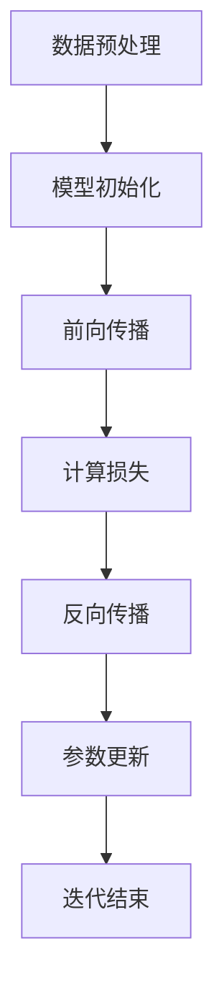
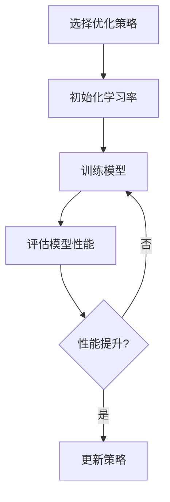

                 

### 文章标题

《NLP领域的大模型标准：参数与能力》

### 关键词

自然语言处理（NLP）、大模型、参数规模、能力评估、项目实战、算法原理

### 摘要

本文深入探讨了自然语言处理（NLP）领域的大模型标准，从参数规模和能力评估两方面展开。首先，介绍了NLP的基本概念、语言模型和词嵌入技术，然后详细分析了大模型的定义、特点及其参数标准和能力评估方法。接着，文章通过实际项目案例，展示了大模型在NLP领域的应用，并分享了项目实战的经验和教训。最后，文章展望了NLP领域大模型技术的发展趋势，以及未来可能面临的挑战和机遇。

----------------------------------------------------------------

# 《NLP领域的大模型标准：参数与能力》

## 引言

自然语言处理（Natural Language Processing，NLP）作为人工智能（Artificial Intelligence，AI）的一个重要分支，旨在使计算机能够理解和处理人类语言。随着深度学习和大数据技术的快速发展，NLP取得了显著的进展，尤其是大模型（Large Models）在自然语言处理中的广泛应用，使得许多原本难以解决的问题得到了有效解决。

大模型，通常指参数量庞大的神经网络模型，能够捕捉复杂的语言结构和语义信息，从而在文本分类、命名实体识别、情感分析、机器翻译等任务上表现出色。然而，大模型的训练和优化是一个复杂且资源消耗巨大的过程，如何选择合适的参数规模，评估模型的能力，优化训练过程，是NLP领域面临的重要问题。

本文将从NLP的基础知识出发，深入探讨大模型的定义、特点、参数标准和能力评估，并通过实际项目案例展示大模型在NLP领域的应用。最后，我们将对NLP领域大模型技术的发展趋势进行展望，并探讨未来可能面临的挑战和机遇。

## 第一部分：NLP基础

### 第1章：自然语言处理（NLP）简介

#### 1.1 NLP的起源与发展

自然语言处理（NLP）起源于20世纪50年代末，当时计算机科学家和语言学家开始探讨如何使计算机理解和处理人类语言。早期的研究主要集中在语法分析和语义理解上，但由于计算资源和算法的限制，这些研究并没有取得显著成果。

随着计算机科学和人工智能技术的快速发展，NLP在20世纪80年代迎来了第一个研究高潮。这一时期，基于规则的方法和统计方法被广泛应用。基于规则的方法依赖于手工编写的语法规则和语义规则，而统计方法则利用大量的文本数据来学习语言模式。

进入21世纪，深度学习和大数据技术的崛起为NLP带来了新的突破。深度学习模型，特别是卷积神经网络（CNN）和循环神经网络（RNN）的引入，使得语言模型的性能得到了显著提升。同时，大规模语料库的涌现为模型训练提供了丰富的数据支持，使得NLP在自然语言理解、生成和交互方面取得了长足进展。

#### 1.2 NLP的主要任务

NLP的主要任务包括文本分类、命名实体识别、关系抽取、情感分析等。这些任务在信息检索、机器翻译、智能客服、金融风控等领域具有广泛的应用。

- **文本分类**：文本分类是一种分类问题，即将文本数据分为预定义的类别。常见的文本分类任务包括垃圾邮件检测、情感分类、新闻分类等。

- **命名实体识别**：命名实体识别（Named Entity Recognition，NER）是一种信息提取任务，旨在从文本中识别出具有特定意义的实体，如人名、地名、组织名等。

- **关系抽取**：关系抽取（Relation Extraction）是从文本中识别出实体之间的关系。关系抽取在知识图谱构建、实体链接、问答系统等方面具有重要应用。

- **情感分析**：情感分析（Sentiment Analysis）是一种情感极性分类任务，旨在判断文本表达的情感倾向，如正面、负面或中性。

#### 1.3 NLP的核心技术

NLP的核心技术包括词嵌入、序列模型和注意力机制等。

- **词嵌入**：词嵌入（Word Embedding）是一种将词语映射为向量的技术，能够捕捉词语之间的语义关系。常见的词嵌入方法包括Word2Vec、GloVe等。

- **序列模型**：序列模型（Sequential Model）是一种处理序列数据的神经网络模型，如循环神经网络（RNN）、长短时记忆网络（LSTM）和门控循环单元（GRU）等。

- **注意力机制**：注意力机制（Attention Mechanism）是一种用于处理序列数据的方法，能够自动捕捉序列中不同部分的重要性。注意力机制在机器翻译、文本生成等领域得到广泛应用。

### 第2章：语言模型

#### 2.1 语言模型的定义与作用

语言模型（Language Model）是一种用于预测文本序列的概率分布的模型，它能够对自然语言的统计性质进行建模。语言模型在NLP中具有广泛的应用，包括文本生成、语音识别、机器翻译、对话系统等。

- **定义**：语言模型是一种概率模型，它通过学习大量文本数据，预测给定前文条件下下一个单词或字符的概率分布。

- **作用**：语言模型在NLP中具有重要作用，它能够提高文本处理任务的性能，如文本分类、命名实体识别、机器翻译等。此外，语言模型还可以用于文本生成和对话系统，使得计算机能够生成自然流畅的文本。

#### 2.2 语言模型的常见架构

语言模型的常见架构包括基于统计的模型和基于神经网络的模型。

- **基于统计的模型**：基于统计的模型通常使用N元语法（N-gram）来预测下一个单词的概率。N元语法是一种简单的语言模型，它使用前N个单词来预测下一个单词。虽然N元语法简单有效，但它忽略了长距离依赖信息，因此性能有限。

- **基于神经网络的模型**：基于神经网络的模型，如神经网络语言模型（Neural Network Language Model，NNLM）和递归神经网络（Recurrent Neural Network，RNN），能够更好地捕捉长距离依赖信息。NNLM通常使用双向RNN或LSTM来建模文本序列的概率分布。近年来，基于注意力机制的模型，如Transformer，在语言模型任务上取得了显著进展，使得语言模型的性能得到了大幅提升。

#### 2.3 语言模型的训练与评估

语言模型的训练与评估是NLP中重要的环节。语言模型的训练目标是学习一个能够准确预测文本序列概率的模型参数。评估语言模型的性能通常使用一系列指标，如损失函数、困惑度等。

- **训练过程**：语言模型的训练通常包括数据预处理、模型初始化、前向传播、反向传播和参数更新等步骤。数据预处理包括文本清洗、分词、词嵌入等操作。模型初始化通常使用随机初始化或预训练模型。前向传播用于计算模型输出和真实标签之间的差异，反向传播用于更新模型参数。参数更新通常采用梯度下降或其他优化算法。

- **评估指标**：评估语言模型性能的常见指标包括损失函数、困惑度（Perplexity，PP）和准确性。损失函数用于衡量模型预测结果和真实标签之间的差异，常见的损失函数包括交叉熵损失和负对数似然损失。困惑度是衡量语言模型预测不确定性的指标，越小表示模型预测越准确。准确性是衡量模型在分类任务上的表现，通常用于文本分类任务。

### 第3章：词嵌入与语义分析

#### 3.1 词嵌入技术

词嵌入（Word Embedding）是将词语映射为向量的技术，能够在低维空间中捕捉词语的语义和语法信息。词嵌入技术对于NLP任务的性能提升具有重要意义。

- **Word2Vec**：Word2Vec是最早的词嵌入技术之一，它使用神经网络训练词向量，能够捕捉词语的语义关系。Word2Vec包括连续词袋（Continuous Bag of Words，CBOW）和Skip-Gram两种模型。CBOW模型使用上下文词的均值来预测目标词，而Skip-Gram模型使用目标词来预测上下文词。

- **GloVe**：GloVe（Global Vectors for Word Representation）是另一种词嵌入技术，它使用全局上下文信息来训练词向量。GloVe模型通过计算词语共现矩阵的因子分解，得到词向量表示。

- **其他词嵌入技术**：除了Word2Vec和GloVe，还有许多其他的词嵌入技术，如FastText、Word2Vec++等，这些技术在不同的应用场景中具有不同的优势。

#### 3.2 语义分析的基本方法

语义分析（Semantic Analysis）是NLP中重要的任务，旨在理解和解释文本的语义内容。语义分析包括词义消歧、语义角色标注、语义解析等任务。

- **词义消歧**：词义消歧（Word Sense Disambiguation，WSD）是识别文本中词语的具体含义。词义消歧方法包括基于规则的方法、基于统计的方法和基于机器学习的方法。

- **语义角色标注**：语义角色标注（Semantic Role Labeling，SRL）是识别文本中词语的语义角色。SRL方法通常使用规则方法和基于机器学习的方法，如条件随机场（Conditional Random Field，CRF）。

- **语义解析**：语义解析（Semantic Parsing）是将自然语言文本转换为逻辑形式或程序代码。语义解析方法包括语义角色标注、语义解析树生成等。

#### 3.3 语义分析的应用场景

语义分析在多个应用场景中具有广泛的应用，如问答系统、机器翻译、文本生成等。

- **问答系统**：问答系统（Question Answering System）旨在回答用户的问题。语义分析在问答系统中用于理解用户的问题，并将问题转化为可查询的形式。

- **机器翻译**：机器翻译（Machine Translation）是将一种语言的文本转换为另一种语言的文本。语义分析在机器翻译中用于理解源语言和目标语言的语义信息，以提高翻译质量。

- **文本生成**：文本生成（Text Generation）是生成自然语言的文本。语义分析在文本生成中用于理解输入文本的语义信息，以生成连贯和自然的文本。

## 第二部分：大模型标准

### 第4章：大模型的定义与特点

#### 4.1 大模型的定义

大模型（Large Models）通常指参数量庞大的神经网络模型，能够捕捉复杂的语言结构和语义信息。大模型在NLP领域取得了显著的进展，如BERT、GPT等。

- **参数量**：大模型的参数量通常达到数十亿甚至千亿级别。这些参数用于学习文本的复杂结构和语义信息。

- **训练数据量**：大模型通常需要大规模的文本数据集进行训练，以学习到丰富的语义信息。

- **计算资源**：大模型的训练和推理需要大量的计算资源，如高性能计算设备和GPU。

#### 4.2 大模型的特点

大模型具有以下特点：

- **强大的表征能力**：大模型能够捕捉复杂的语言结构和语义信息，从而在多个NLP任务上表现出色。

- **高参数量**：大模型通常具有数十亿甚至千亿级别的参数，这使得模型能够学习到丰富的特征。

- **深度结构**：大模型通常具有深度的神经网络结构，能够处理长距离依赖问题。

- **资源消耗**：大模型的训练和推理需要大量的计算资源和时间，这使得在实际应用中需要进行优化和调整。

#### 4.3 大模型的发展历程

大模型的发展历程可以追溯到深度学习技术的兴起。以下是一些重要的大模型：

- **Word2Vec**：Word2Vec是最早的大规模词嵌入模型，通过训练得到数百万个词向量。

- **GloVe**：GloVe是基于全局上下文信息的词嵌入模型，参数量比Word2Vec更大。

- **BERT**：BERT是Google提出的一种预训练语言模型，具有数十亿级别的参数，通过预训练和微调在多个NLP任务上取得了优异的性能。

- **GPT**：GPT是OpenAI提出的一种预训练语言模型，具有数十亿级别的参数，能够生成高质量的自然语言文本。

- **T5**：T5是Google提出的一种统一的语言模型，能够处理多种自然语言处理任务，具有数十亿级别的参数。

### 第5章：大模型的参数标准

#### 5.1 参数规模与性能

大模型的参数规模对模型的性能具有重要影响。一般来说，参数规模越大，模型的表征能力越强，性能也越好。然而，参数规模的增加也会带来计算资源消耗的增加。

- **参数规模对性能的影响**：参数规模越大，模型能够捕捉到的语言特征越丰富，性能越好。例如，BERT的参数量比GloVe大得多，但在多个NLP任务上取得了更好的性能。

- **参数规模与计算资源消耗**：大模型的训练和推理需要大量的计算资源。例如，BERT的训练需要数百万个GPU小时，这使得在实际应用中需要进行优化和调整。

#### 5.2 参数规模的计算方法

参数规模的计算方法是评估大模型复杂度的重要指标。以下是一些常见的参数规模计算方法：

- **参数个数**：参数个数是模型参数量的直接度量。例如，BERT的参数个数约为3亿个。

- **FLOPs（浮点运算次数）**：FLOPs是模型计算复杂度的度量，表示模型在推理过程中所需的浮点运算次数。例如，BERT的FLOPs约为30万亿。

- **内存占用**：内存占用是模型在训练和推理过程中所需的内存大小。例如，BERT的内存占用约为20GB。

#### 5.3 参数规模的优化策略

为了减小大模型的参数规模，提高计算效率，可以采用以下优化策略：

- **模型剪枝**：模型剪枝是通过去除模型中不重要的连接和神经元来减小模型规模。常见的剪枝方法包括结构剪枝和权重剪枝。

- **知识蒸馏**：知识蒸馏（Knowledge Distillation）是将大模型的输出传递给小模型，使得小模型能够学到大模型的表征能力。知识蒸馏方法包括Teacher-Student模型和Teacher-Student Distillation。

- **量化**：量化（Quantization）是将模型的浮点参数转换为低精度参数，以减小模型大小和提高计算效率。常见的量化方法包括全精度量化、二值量化、量化感知训练等。

### 第6章：大模型的能力评估

#### 6.1 模型性能评估指标

大模型的性能评估指标是评估模型性能的重要依据。以下是一些常见的评估指标：

- **准确率（Accuracy）**：准确率是模型在分类任务上的表现，表示模型预测正确的样本比例。

- **召回率（Recall）**：召回率是模型在分类任务上的表现，表示模型正确识别出正样本的比例。

- **F1值（F1 Score）**：F1值是准确率和召回率的调和平均值，用于综合评估模型的性能。

- **困惑度（Perplexity）**：困惑度是模型在生成文本时的表现，表示模型对生成文本的不确定性。困惑度越小，表示模型预测越准确。

- **BLEU分数**：BLEU分数是用于评估机器翻译质量的指标，表示模型翻译的文本与参考文本的相似度。

#### 6.2 实际应用中的能力评估

在实际应用中，大模型的能力评估需要考虑多个方面：

- **任务适应性**：大模型在不同任务上的适应性，如文本分类、命名实体识别、关系抽取等。

- **模型鲁棒性**：大模型在面对不同数据分布和噪声时的鲁棒性，如数据增强、数据清洗等。

- **计算效率**：大模型的计算效率和推理速度，如模型压缩、量化、推理优化等。

#### 6.3 能力评估的挑战与对策

大模型的能力评估面临以下挑战：

- **数据多样性**：实际应用中的数据多样性较大，大模型需要适应不同的数据分布和噪声。

- **计算资源限制**：大模型的训练和推理需要大量的计算资源，如何高效利用计算资源是一个重要问题。

- **模型解释性**：大模型的黑盒特性使得其解释性较差，如何提高模型的可解释性是一个挑战。

针对这些挑战，可以采用以下对策：

- **数据增强**：通过数据增强方法生成多样性的数据，提高模型的泛化能力。

- **模型压缩**：通过模型压缩方法减小模型规模，提高计算效率。

- **模型解释**：通过可视化、解释性模型等方法提高模型的可解释性。

### 第7章：大模型的训练与优化

#### 7.1 大模型训练的基本流程

大模型训练的基本流程包括数据准备、模型初始化、前向传播、反向传播和参数更新等步骤。

- **数据准备**：数据准备包括数据清洗、数据预处理和数据增强等操作，以提高模型的泛化能力。

- **模型初始化**：模型初始化是随机初始化模型参数，常用的初始化方法包括高斯初始化、均方根初始化等。

- **前向传播**：前向传播是计算模型输出和真实标签之间的差异，用于计算损失函数。

- **反向传播**：反向传播是计算损失函数关于模型参数的梯度，用于更新模型参数。

- **参数更新**：参数更新是使用梯度下降或其他优化算法更新模型参数，以最小化损失函数。

#### 7.2 大模型优化的常见方法

大模型优化是提高模型性能的重要手段，以下是一些常见的大模型优化方法：

- **学习率调度**：学习率调度是调整学习率的方法，以提高模型的收敛速度和性能。常用的学习率调度方法包括学习率衰减、学习率 warm-up 等。

- **正则化技术**：正则化技术是防止模型过拟合的方法，包括 L1 正则化、L2 正则化、Dropout 等。

- **激活函数与优化器**：激活函数和优化器对模型性能具有重要影响。常用的激活函数包括 ReLU、Sigmoid、Tanh 等，优化器包括 Adam、RMSProp、SGD 等。

#### 7.3 大模型优化策略的实践

在大模型优化实践中，可以采用以下策略：

- **阶段性学习率调整**：在训练过程中，根据模型性能的变化调整学习率，以加速模型收敛。

- **权重裁剪**：通过裁剪模型权重，去除不重要的连接和神经元，以减小模型规模和提高计算效率。

- **批量归一化**：批量归一化是防止梯度消失和梯度爆炸的方法，可以提高模型的训练稳定性和性能。

## 第三部分：项目实战

### 第8章：NLP领域的大模型应用案例

#### 8.1 案例一：智能客服系统

智能客服系统是一种基于自然语言处理技术，能够自动回答用户问题的系统。大模型在智能客服系统中具有广泛的应用，如文本分类、命名实体识别、关系抽取等。

- **系统设计**：智能客服系统的设计包括文本预处理、模型选择和模型训练等步骤。文本预处理包括分词、去除停用词、词性标注等操作。模型选择包括文本分类模型、命名实体识别模型和关系抽取模型等。模型训练是使用大规模的数据集对模型进行训练，以优化模型性能。

- **系统实现**：系统实现包括开发环境搭建、源代码实现和模型部署等步骤。开发环境搭建包括安装深度学习框架和相关的依赖库。源代码实现包括模型定义、训练和评估等操作。模型部署是将训练好的模型部署到生产环境中，以提供实时服务。

- **系统优化**：系统优化包括模型压缩、量化、推理优化等步骤。模型压缩是通过模型剪枝、量化等方法减小模型规模，提高计算效率。量化是将模型参数从浮点数转换为低精度数，以提高计算速度。推理优化是通过优化模型推理流程，提高模型推理速度。

#### 8.2 案例二：情感分析

情感分析是一种从文本中提取情感极性的方法，常用于社交媒体分析、客户反馈处理等场景。大模型在情感分析中具有显著的优势，能够提高分类的准确性。

- **任务描述**：情感分析的任务是将文本分为正面、负面或中性三种情感极性。任务的目标是提高分类的准确性，减少误分类。

- **模型设计**：情感分析模型的模型设计包括文本预处理、特征提取、模型训练和评估等步骤。文本预处理包括分词、去除停用词、词性标注等操作。特征提取包括词嵌入、文本向量表示等操作。模型训练是使用大规模的数据集对模型进行训练，以优化模型性能。模型评估是使用验证集对模型进行评估，以确定模型的性能。

- **应用场景**：情感分析在社交媒体分析中，可以帮助企业了解用户对其产品和服务的反馈，从而进行改进。在客户反馈处理中，可以帮助企业快速识别和处理负面反馈，提高客户满意度。

#### 8.3 案例三：机器翻译

机器翻译是一种将一种语言的文本转换为另一种语言的文本的方法，常用于跨语言信息检索、多语言字幕等场景。大模型在机器翻译中具有广泛的应用，能够提高翻译的准确性和流畅性。

- **任务描述**：机器翻译的任务是将一种语言的文本转换为另一种语言的文本。任务的目标是提高翻译的准确性、流畅性和自然性。

- **模型设计**：机器翻译模型的模型设计包括编码器-解码器架构、注意力机制、BERT模型等。编码器-解码器架构是机器翻译的基本架构，能够处理序列到序列的转换。注意力机制能够自动捕捉输入和输出序列中不同部分的关系，提高翻译的准确性。BERT模型是一种预训练语言模型，能够为编码器和解码器提供丰富的语义信息。

- **应用场景**：机器翻译在跨语言信息检索中，可以帮助用户快速获取目标语言的文档信息。在多语言字幕中，可以帮助用户观看不同语言的影视作品。

### 第9章：大模型项目实战

#### 9.1 项目背景与目标

项目背景与目标是NLP项目成功的关键。项目背景包括项目来源、市场需求和行业挑战等。项目目标包括预期的成果、性能指标和目标用户等。

- **项目背景**：智能客服系统项目源于企业对提高客户服务效率和客户满意度的需求。随着社交媒体的兴起，客户对企业的反馈和咨询越来越多，传统的人工客服方式难以满足需求。因此，企业希望通过引入智能客服系统来提高服务效率和客户满意度。

- **项目目标**：智能客服系统的目标是实现自动回答用户问题，提高客户服务效率和客户满意度。性能指标包括准确率、召回率和响应时间等。目标用户是企业客服团队，以及需要使用智能客服系统的各种场景。

#### 9.2 系统设计与实现

系统设计与实现是NLP项目的重要组成部分。系统设计包括模块划分、数据流设计和接口设计等。实现包括开发环境搭建、源代码实现和测试等。

- **系统架构**：智能客服系统采用微服务架构，包括文本预处理、模型训练、模型推理和用户接口等模块。文本预处理模块负责处理用户输入的文本，模型训练模块负责训练和优化模型，模型推理模块负责实时预测用户问题的答案，用户接口模块负责与用户交互。

- **开发环境搭建**：开发环境包括操作系统、深度学习框架和依赖库等。常用的操作系统包括Linux和Windows，深度学习框架包括TensorFlow、PyTorch和PyTorch Transformers等。

- **源代码实现**：源代码实现包括模型定义、数据预处理、模型训练、模型评估和模型推理等。模型定义是使用深度学习框架定义神经网络模型，数据预处理是处理用户输入的文本，模型训练是使用训练数据集对模型进行训练，模型评估是使用验证集对模型进行评估，模型推理是使用实时数据对模型进行推理。

- **测试**：测试是验证系统功能是否正常的关键步骤。测试包括功能测试、性能测试和兼容性测试等。功能测试是验证系统是否能够按照预期工作，性能测试是评估系统性能，如响应时间、准确率和召回率等，兼容性测试是验证系统在不同操作系统、浏览器和设备上的兼容性。

#### 9.3 项目评估与优化

项目评估与优化是确保系统性能和用户体验的重要环节。项目评估包括性能评估、用户反馈和迭代优化等。

- **性能评估**：性能评估是评估系统性能的重要步骤。性能评估指标包括准确率、召回率、F1值和响应时间等。准确率和召回率是评估模型性能的关键指标，F1值是准确率和召回率的调和平均值，响应时间是评估系统响应速度的指标。

- **用户反馈**：用户反馈是优化系统的关键。用户反馈包括对系统回答的满意度、回答的准确性、系统响应速度等。用户反馈可以帮助发现系统存在的问题，从而进行优化。

- **迭代优化**：迭代优化是持续改进系统性能和用户体验的过程。迭代优化包括根据用户反馈和性能评估结果调整模型参数、优化模型结构、改进用户界面等。通过迭代优化，可以逐步提高系统的性能和用户体验。

## 第四部分：未来展望

### 第10章：大模型在NLP领域的应用前景

#### 10.1 大模型在NLP领域的应用前景

大模型在NLP领域具有广泛的应用前景。随着深度学习和大数据技术的不断发展，大模型在文本分类、命名实体识别、情感分析、机器翻译等任务上取得了显著进展。未来，大模型在NLP领域的应用将更加广泛，如文本生成、对话系统、知识图谱等。

- **文本生成**：大模型在文本生成方面具有巨大潜力，可以生成高质量、自然流畅的文本。文本生成在自动化写作、内容创作、聊天机器人等领域具有广泛的应用。

- **对话系统**：大模型在对话系统中可以用于生成对话回复、理解用户意图、提供建议等。对话系统在智能客服、虚拟助手、语音助手等领域具有重要应用。

- **知识图谱**：大模型在知识图谱构建方面可以用于实体识别、关系抽取、实体链接等任务。知识图谱在搜索引擎、智能问答、推荐系统等领域具有重要应用。

#### 10.2 大模型技术发展趋势

大模型技术在NLP领域的发展趋势包括以下几个方面：

- **模型压缩**：为了适应移动端和边缘设备的应用需求，模型压缩技术将成为研究热点。模型压缩包括模型剪枝、量化、模型融合等方法。

- **实时推理**：随着应用场景的多样化，实时推理技术将得到广泛关注。实时推理技术包括模型优化、推理引擎加速等方法。

- **多模态融合**：大模型在多模态融合方面具有巨大潜力，可以同时处理文本、语音、图像等多种模态的信息。多模态融合在多媒体信息检索、智能交互等领域具有重要应用。

#### 10.3 未来NLP领域的挑战与机遇

未来NLP领域面临着诸多挑战和机遇：

- **挑战**：

  - **数据隐私**：随着数据隐私问题的日益突出，如何在保证数据隐私的同时进行模型训练和优化是一个重要挑战。

  - **计算资源**：大模型的训练和推理需要大量的计算资源，如何高效利用计算资源是一个重要挑战。

  - **模型解释性**：大模型具有黑盒特性，提高模型的可解释性是一个重要挑战。

- **机遇**：

  - **跨学科融合**：NLP与心理学、社会学、语言学等学科的融合，将为NLP领域带来新的机遇。

  - **新应用场景**：随着技术的不断发展，NLP将在更多领域得到应用，如智能医疗、金融风控、智能教育等。

## 附录

### 附录A：NLP大模型相关资源

#### A.1 开源框架与工具

- **TensorFlow**：https://tensorflow.org/
- **PyTorch**：https://pytorch.org/
- **PyTorch Transformers**：https://github.com/huggingface/transformers

#### A.2 数据集与评测集

- **Common Crawl**：https://commoncrawl.org/
- **GLUE**：https://gluebenchmark.com/
- **SuperGLUE**：https://super.gluebenchmark.com/

#### A.3 研究论文与报告

- **ACL**：https://www.aclweb.org/anthology/
- **NeurIPS**：https://nips.cc/
- **ICLR**：https://iclr.cc/

### 附录B：Mermaid流程图

#### B.1 语言模型训练流程图



#### B.2 大模型优化策略流程图



### 附录C：算法原理与数学公式

#### C.1 语言模型的训练过程

$$
\text{Loss} = -\sum_{i=1}^{N} \log(p(y_i|x_i;\theta))
$$

#### C.2 优化算法伪代码

```plaintext
while not convergence do
    compute gradients
    update parameters
end while
```

### 附录D：源代码示例

```python
import torch
import torch.nn as nn
import torch.optim as optim

# 模型定义
class LanguageModel(nn.Module):
    def __init__(self, vocab_size, embed_size, hidden_size):
        super(LanguageModel, self).__init__()
        self.embeddings = nn.Embedding(vocab_size, embed_size)
        self.lstm = nn.LSTM(embed_size, hidden_size)
        self.fc = nn.Linear(hidden_size, vocab_size)

    def forward(self, inputs, hidden):
        embeds = self.embeddings(inputs)
        output, hidden = self.lstm(embeds, hidden)
        logits = self.fc(output)
        return logits, hidden

# 模型初始化
model = LanguageModel(vocab_size, embed_size, hidden_size)
optimizer = optim.Adam(model.parameters(), lr=learning_rate)

# 训练过程
for epoch in range(num_epochs):
    for inputs, targets in dataset:
        optimizer.zero_grad()
        logits, hidden = model(inputs, hidden)
        loss = nn.CrossEntropyLoss()(logits, targets)
        loss.backward()
        optimizer.step()
    print(f"Epoch {epoch+1}/{num_epochs}, Loss: {loss.item()}")
```

### 附录E：作者信息

作者：AI天才研究院/AI Genius Institute & 禅与计算机程序设计艺术 /Zen And The Art of Computer Programming

----------------------------------------------------------------

## 结论

本文系统地介绍了NLP领域的大模型标准，从参数规模和能力评估两个方面进行了深入探讨。首先，介绍了NLP的基本概念、语言模型和词嵌入技术，然后详细分析了大模型的定义、特点、参数标准和能力评估方法。接着，通过实际项目案例，展示了大模型在NLP领域的广泛应用和优化策略。最后，展望了NLP领域大模型技术的发展趋势，以及未来可能面临的挑战和机遇。

在未来的研究中，大模型技术将继续在NLP领域发挥重要作用。随着模型压缩、实时推理和多模态融合等技术的不断发展，大模型将在更多应用场景中展现其优势。同时，数据隐私、模型解释性和计算资源限制等挑战也需要我们持续关注和解决。我们相信，通过不断的探索和实践，NLP领域将迎来更加繁荣的未来。

