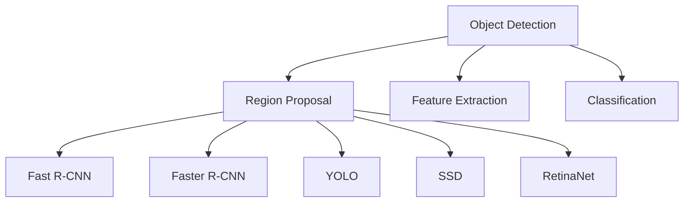

                 

### 《Object Detection 原理与代码实战案例讲解》

> 关键词：Object Detection，计算机视觉，深度学习，算法原理，代码实战

> 摘要：本文详细讲解了Object Detection（目标检测）的基本概念、历史发展、算法原理以及实际应用。通过一系列步骤，深入剖析了R-CNN、Fast R-CNN、Faster R-CNN、YOLO、SSD和RetinaNet等经典算法，并提供了基于TensorFlow和PyTorch的代码实战案例，帮助读者全面理解目标检测技术。

### 《Object Detection 原理与代码实战案例讲解》目录大纲

#### 第一部分：Object Detection 基础概念

**第1章：Object Detection 简介**  
- **1.1 Object Detection 在计算机视觉中的应用**  
- **1.2 Object Detection 的历史与发展趋势**  
- **1.3 Object Detection 的挑战与机遇**

**第2章：计算机视觉基础**  
- **2.1 图像处理基础**  
- **2.2 特征提取与特征降维**  
- **2.3 基本图像变换**

#### 第二部分：Object Detection 算法原理

**第3章：R-CNN 系列算法**  
- **3.1 R-CNN 算法原理**  
- **3.2 R-CNN 的优化**  

**第4章：Fast R-CNN 与 Faster R-CNN**  
- **4.1 Fast R-CNN**  
- **4.2 Faster R-CNN**

**第5章：Faster R-CNN 的改进算法**  
- **5.1 YOLO 算法**  
- **5.2 SSD 算法**  
- **5.3 RetinaNet 算法**

**第6章：RetinaNet 算法**  
- **6.1 RetinaNet 的原理**  
- **6.2 RetinaNet 的训练与优化**

#### 第三部分：Object Detection 实战案例

**第7章：基于深度学习的 Object Detection 实战**  
- **7.1 实战环境搭建**  
- **7.2 实际案例讲解**  
- **7.3 物体检测的优化技巧**

**第8章：Object Detection 在自然场景中的应用**  
- **8.1 实时物体检测**  
- **8.2 Object Detection 在计算机视觉任务中的应用**

**第9章：Object Detection 在深度学习框架中的应用**  
- **9.1 TensorFlow 对 Object Detection 的支持**  
- **9.2 PyTorch 对 Object Detection 的支持**

#### 附录

**附录 A：Object Detection 常用工具与资源**  
- **A.1 主流深度学习框架对比**  
- **A.2 Object Detection 相关数据集**

### Mermaid 流程图

以下是 Object Detection 的 Mermaid 流程图：



### Object Detection 算法原理讲解

本文将逐步讲解 Object Detection 中的核心算法原理，包括 R-CNN 系列、Fast R-CNN、Faster R-CNN、YOLO、SSD 和 RetinaNet 算法。

#### 第3章：R-CNN 系列算法

**3.1 R-CNN 算法原理**

R-CNN（Region-based CNN）是 Object Detection 的经典算法之一。其核心思想是首先使用 Region Proposal 算法生成候选区域，然后对每个候选区域提取特征，最后使用深度神经网络进行分类。

算法流程如下：

1. **Region Proposal**：使用选择性搜索（Selective Search）算法生成候选区域。
2. **Feature Extraction**：使用卷积神经网络（CNN）提取特征。
3. **Classification**：使用 SVM 分类器对提取的特征进行分类。

**R-CNN 伪代码**：

```python
def R-CNN(image, num_classes):
    # 1. Region Proposal
    rois = region_proposal(image)

    # 2. Feature Extraction
    features = feature_extraction(image, rois)

    # 3. Classification
    predicted_classes = classification(features, num_classes)

    return predicted_classes
```

**3.2 R-CNN 的优化**

R-CNN 存在以下问题：

- **速度慢**：使用 selective search 生成区域提议需要大量时间。
- **无法共享特征**：每个候选区域都需要独立提取特征，导致计算量大。

为了解决这些问题，提出了 Fast R-CNN。

**3.2.1 Fast R-CNN**

Fast R-CNN 通过共享特征图（Feature Map）来提高速度，并引入 RoI Pooling 层来提取区域特征。

算法流程如下：

1. **Region Proposal**：使用选择性搜索（Selective Search）算法生成候选区域。
2. **Feature Extraction**：使用卷积神经网络（CNN）提取特征。
3. **RoI Pooling**：对特征图进行 RoI Pooling，提取区域特征。
4. **Classification**：使用 SVM 分类器对区域特征进行分类。

**Fast R-CNN 伪代码**：

```python
def FastRCNN(image, num_classes):
    # 1. Region Proposal
    rois = region_proposal(image)

    # 2. Feature Extraction
    feature_map = feature_extraction(image)

    # 3. RoI Pooling
    region_features = RoIPooling(feature_map, rois)

    # 4. Classification
    predicted_classes = classification(region_features, num_classes)

    return predicted_classes
```

#### 第4章：Fast R-CNN 与 Faster R-CNN

**4.1 Fast R-CNN**

Fast R-CNN 通过共享特征图（Feature Map）来提高速度，并引入 RoI Pooling 层来提取区域特征。

算法流程如下：

1. **Region Proposal**：使用选择性搜索（Selective Search）算法生成候选区域。
2. **Feature Extraction**：使用卷积神经网络（CNN）提取特征。
3. **RoI Pooling**：对特征图进行 RoI Pooling，提取区域特征。
4. **Classification**：使用 SVM 分类器对区域特征进行分类。

**4.2 Faster R-CNN**

Faster R-CNN 是在 Fast R-CNN 基础上提出的，进一步提高了速度和准确性。其核心思想是引入 Region Proposal Network（RPN）来自动生成区域提议。

算法流程如下：

1. **Feature Extraction**：使用卷积神经网络（CNN）提取特征。
2. **RPN**：在特征图上生成锚框（Anchor Box），并计算锚框与真实框的匹配关系。
3. **RoI Pooling**：对特征图进行 RoI Pooling，提取区域特征。
4. **Classification**：使用 SVM 分类器对区域特征进行分类。

**Faster R-CNN 伪代码**：

```python
def FasterRCNN(image, num_classes):
    # 1. Feature Extraction
    feature_map = feature_extraction(image)

    # 2. RPN
    anchors = generate_anchors(feature_map)
    anchor_labels = compute_anchor_labels(anchors, ground_truth)

    # 3. RoI Pooling
    region_features = RoIPooling(feature_map, rois)

    # 4. Classification
    predicted_classes = classification(region_features, num_classes)

    return predicted_classes
```

#### 第5章：Faster R-CNN 的改进算法

**5.1 YOLO 算法**

YOLO（You Only Look Once）是一种单阶段 Object Detection 算法，其核心思想是将 Object Detection 任务分解为两个步骤：

1. **特征提取和区域提议**：使用卷积神经网络（CNN）提取特征图，并在特征图上生成锚框（Anchor Box）。
2. **分类和边界框回归**：对每个锚框进行分类，并计算锚框与真实框的匹配关系。

**5.2 SSD 算法**

SSD（Single Shot MultiBox Detector）是一种多阶段 Object Detection 算法，其核心思想是在特征图上生成多个尺度的锚框，并使用不同的网络层进行特征提取和分类。

**5.3 RetinaNet 算法**

RetinaNet 是一种 Anchor-Free Object Detection 算法，其核心思想是使用 Focal Loss 来解决类别不平衡问题，并使用 ResNet 作为骨干网络。

### 第6章：RetinaNet 算法

**6.1 RetinaNet 的原理**

RetinaNet 是一种 Anchor-Free Object Detection 算法，其核心思想是使用 Focal Loss 来解决类别不平衡问题，并使用 ResNet 作为骨干网络。

算法流程如下：

1. **特征提取**：使用 ResNet-50 或 ResNet-101 等预训练模型提取特征。
2. **Focal Loss**：使用 Focal Loss 来计算损失函数，以解决类别不平衡问题。
3. **分类和边界框回归**：对每个像素点进行分类和边界框回归。

**6.2 RetinaNet 的训练与优化**

RetinaNet 的训练与优化主要包括以下步骤：

1. **数据预处理**：对图像进行数据增强，如随机裁剪、旋转、翻转等。
2. **模型训练**：使用 Focal Loss 训练模型。
3. **模型优化**：通过调整学习率、批量大小等超参数来优化模型。

### 第7章：基于深度学习的 Object Detection 实战

**7.1 实战环境搭建**

1. **安装深度学习框架**：安装 TensorFlow 或 PyTorch。
2. **安装 Object Detection API**：根据所选框架安装相应的 Object Detection API。
3. **准备数据集**：下载并准备用于训练和测试的数据集。

**7.2 实际案例讲解**

1. **数据预处理**：对图像进行缩放、裁剪、翻转等操作。
2. **模型训练**：使用训练数据训练模型。
3. **模型评估**：使用测试数据评估模型性能。

**7.3 物体检测的优化技巧**

1. **调整超参数**：通过调整学习率、批量大小等超参数来优化模型性能。
2. **数据增强**：使用数据增强技术来增加数据多样性，提高模型泛化能力。
3. **多模型集成**：使用多个模型进行集成，提高预测准确性。

### 第8章：Object Detection 在自然场景中的应用

**8.1 实时物体检测**

1. **摄像头流**：使用摄像头捕获实时视频流。
2. **物体检测**：对实时视频流中的每个帧进行物体检测。
3. **实时显示**：将检测结果实时显示在界面上。

**8.2 Object Detection 在计算机视觉任务中的应用**

1. **车辆检测**：在交通监控视频中检测车辆。
2. **人脸识别**：在监控视频中识别和跟踪人脸。
3. **行人检测**：在监控视频中检测和跟踪行人。

### 第9章：Object Detection 在深度学习框架中的应用

**9.1 TensorFlow 对 Object Detection 的支持**

1. **TensorFlow Object Detection API**：介绍 TensorFlow Object Detection API 的基本使用方法。
2. **Object Detection 在 TensorFlow 中的实现**：展示如何在 TensorFlow 中实现 Object Detection 任务。

**9.2 PyTorch 对 Object Detection 的支持**

1. **PyTorch Object Detection Framework**：介绍 PyTorch Object Detection Framework 的基本使用方法。
2. **Object Detection 在 PyTorch 中的实现**：展示如何在 PyTorch 中实现 Object Detection 任务。

### 附录

**附录 A：Object Detection 常用工具与资源**

1. **主流深度学习框架对比**：对比 TensorFlow、PyTorch 和 Caffe 等主流深度学习框架的特点。
2. **Object Detection 相关数据集**：介绍常用的 Object Detection 数据集，如 COCO、VOC 和 ImageNet。

### 作者信息

作者：AI天才研究院/AI Genius Institute & 禅与计算机程序设计艺术 /Zen And The Art of Computer Programming

---

本文通过逐步讲解 Object Detection 的基本概念、算法原理和实际应用，帮助读者全面了解目标检测技术。同时，通过提供代码实战案例，使读者能够动手实践并深入理解目标检测算法。希望本文能为从事计算机视觉领域的开发者提供有益的参考和启示。

