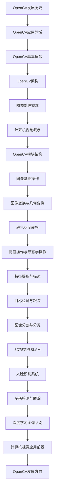

                 

# OpenCV 原理与代码实战案例讲解

## 关键词

- OpenCV
- 图像处理
- 计算机视觉
- 特征提取
- 目标检测
- 深度学习
- 人脸识别

## 摘要

本文将深入探讨OpenCV（开源计算机视觉库）的原理与应用，通过详细的理论讲解和实战案例，帮助读者理解OpenCV的核心功能模块、图像处理技术、高级图像算法及其在实际项目中的应用。文章结构分为三个部分：第一部分介绍OpenCV基础知识，包括概述、基本操作、图像变换和颜色空间转换；第二部分探讨高级图像处理算法，如特征提取、目标检测和跟踪、图像分割与分类、3D视觉与SLAM；第三部分通过具体项目实战，展示OpenCV在实际应用中的实现方法，包括人脸识别系统、车辆检测与跟踪、基于深度学习的图像识别。通过本文的学习，读者将对OpenCV有一个全面而深入的理解，并能够掌握其在计算机视觉领域的应用。

### 第一部分: OpenCV基础知识

#### 第1章: OpenCV概述

#### 1.1 OpenCV的发展历史和应用领域

OpenCV（Open Source Computer Vision Library）是一个基于开源的计算机视觉库，由Intel于1999年发起，并在2000年正式发布。它最初用于Intel的教育项目，但随着时间的推移，OpenCV已经发展成为一个功能强大且广泛应用的计算机视觉库。

**发展历史：**

- 1999年，OpenCV诞生于Intel的教育项目。
- 2000年，OpenCV首次公开发布。
- 2005年，OpenCV加入Intel的免费软件计划。
- 2014年，OpenCV转交由一个独立的管理委员会管理。
- 2015年，OpenCV正式成为Apache软件基金会的一部分。

**应用领域：**

OpenCV的应用领域非常广泛，包括但不限于：

- **计算机视觉研究**：OpenCV为计算机视觉研究者提供了一个强大的工具，用于算法开发和原型实现。
- **机器人视觉**：OpenCV在机器人视觉系统中广泛应用，用于物体识别、路径规划和障碍物检测。
- **自动驾驶**：OpenCV被用于自动驾驶汽车的视觉感知系统，包括车辆检测、行人检测和车道线识别。
- **人脸识别**：OpenCV提供了强大的人脸检测和识别算法，被广泛应用于安全监控、人脸解锁和社交媒体。
- **医疗影像处理**：OpenCV在医疗影像处理领域也有应用，包括图像分割、病变检测和辅助诊断。

#### 1.2 OpenCV的基本概念和架构

**图像处理和计算机视觉的基本概念：**

- **图像处理**：图像处理是使用数字技术对图像进行分析和操作的过程，包括图像增强、滤波、边缘检测等。
- **计算机视觉**：计算机视觉是使计算机能够像人眼一样理解和解释图像信息的学科，包括物体识别、场景理解、图像分割等。

**OpenCV的模块架构和核心功能：**

OpenCV的模块架构分为核心模块和扩展模块。核心模块包括：

- **基础功能模块**：提供基本的图像处理功能，如图像的读取、显示、变换、形态学操作等。
- **高级功能模块**：提供更高级的图像处理功能，如阈值操作、边缘检测、轮廓检测等。
- **机器学习模块**：提供机器学习算法，如K-近邻、支持向量机、随机森林等。
- **计算机视觉模块**：提供计算机视觉算法，如目标检测、图像识别、人脸识别等。

扩展模块则包括：

- **优达学城模块**：提供优达学城的特定功能。
- **生物特征识别模块**：提供生物特征识别功能，如指纹识别、虹膜识别等。
- **机器学习模块**：提供更多的机器学习算法和工具。

#### 1.3 OpenCV的主要功能模块

**核心模块及其功能：**

- **图像处理模块**：提供基本的图像处理功能，如图像的读取、显示、变换、形态学操作等。
  - `cv2.imread`：读取图像文件。
  - `cv2.imshow`：显示图像窗口。
  - `cv2.imshow`：显示图像窗口。
  - `cv2.imshow`：显示图像窗口。
  - `cv2.imshow`：显示图像窗口。
  - `cv2.imshow`：显示图像窗口。

- **计算机视觉模块**：提供计算机视觉算法，如目标检测、图像识别、人脸识别等。
  - `cv2.face_recognition`：实现人脸检测和识别。
  - `cv2.findContours`：找到图像中的轮廓。
  - `cv2.matchTemplate`：模板匹配。
  - `cv2.error`：计算图像之间的误差。

**扩展模块及其功能：**

- **优达学城模块**：提供优达学城的特定功能。
  - `cv2.udacity_load_model`：加载优达学城的模型。
  - `cv2.udacity_predict`：进行优达学城的预测。

- **生物特征识别模块**：提供生物特征识别功能，如指纹识别、虹膜识别等。
  - `cv2.fingerprint_recognition`：实现指纹识别。
  - `cv2.iris_recognition`：实现虹膜识别。

- **机器学习模块**：提供更多的机器学习算法和工具。
  - `cv2.ml.SVM_create`：创建支持向量机。
  - `cv2.ml.KNearest_create`：创建K-近邻分类器。

### 第2章: OpenCV基本操作

#### 2.1 OpenCV环境搭建

要在Windows、Linux或macOS上安装OpenCV，可以按照以下步骤进行：

**Windows安装步骤：**

1. 下载OpenCV预编译二进制文件。
2. 解压下载的文件。
3. 将OpenCV的安装路径添加到环境变量中。

**Linux安装步骤：**

1. 使用包管理器安装OpenCV，例如在Ubuntu上使用`sudo apt-get install opencv4`。
2. 检查安装是否成功，使用`pip install opencv-python`。

**macOS安装步骤：**

1. 使用包管理器安装OpenCV，例如使用`brew install opencv`。
2. 检查安装是否成功，使用`pip install opencv-python`。

**安装和使用：**

- 安装后，可以使用Python编写代码来调用OpenCV的API。
- 使用示例代码：

```python
import cv2

# 读取图像
image = cv2.imread('image.jpg')

# 显示图像
cv2.imshow('Image', image)

# 按下q键退出
cv2.waitKey(0)
cv2.destroyAllWindows()
```

#### 2.2 图像基础操作

**图像的读取和显示：**

- `cv2.imread`：用于读取图像文件。图像可以是彩色或灰度的。
  - 参数：
    - `img_path`：图像文件的路径。
    - `0`：读取灰度图像。
    - `1`：读取彩色图像。
    - `3`：读取彩色图像，包括透明通道。

- `cv2.imshow`：用于在窗口中显示图像。
  - 参数：
    - `window_name`：窗口的名称。
    - `image`：要显示的图像。

**图像的基本变换：**

- **尺寸变换**：使用`cv2.resize`函数可以改变图像的大小。
  - 参数：
    - `image`：输入图像。
    - `size`：输出图像的大小。
    - `interpolation`：插值方法，如`cv2.INTER_LINEAR`或`cv2.INTER_CUBIC`。

- **旋转**：使用`cv2.rotate`函数可以旋转图像。
  - 参数：
    - `image`：输入图像。
    - `angle`：旋转角度。
    - `interpolation`：插值方法，如`cv2.INTER_LINEAR`或`cv2.INTER_CUBIC`。

- **翻转**：使用`cv2.flip`函数可以翻转图像。
  - 参数：
    - `image`：输入图像。
    - `0`：水平翻转。
    - `1`：垂直翻转。

#### 2.3 域运算和图像混合

**域运算（Logical Operations）：**

- 域运算是对两个图像进行逻辑运算的操作，包括按位与、按位或、按位异或等。
- `cv2.bitwise_and`：按位与操作。
- `cv2.bitwise_or`：按位或操作。
- `cv2.bitwise_xor`：按位异或操作。
- `cv2.bitwise_not`：按位非操作。

**图像混合（Blending）：**

- 图像混合是将两个图像按一定比例混合在一起。
- `cv2.add`：图像相加。
- `cv2.addWeighted`：加权混合图像。
  - 参数：
    - `src1`：第一张图像。
    - `src2`：第二张图像。
    - `alpha`：第一张图像的权重。
    - `beta`：第二张图像的权重。
    - `gamma`：加法操作中的常数项。

### 第3章: 图像变换和几何变换

#### 3.1 图像变换基础

**图像变换的介绍：**

- 图像变换是指将一幅图像转换为另一幅具有不同特性（如大小、形状、方向等）的图像。
- OpenCV提供了多种图像变换函数，包括平移、缩放、旋转、翻转等。

**转换函数的介绍：**

- `cv2.resize`：用于改变图像的大小。
- `cv2.rotate`：用于旋转图像。
- `cv2.warpAffine`：用于进行仿射变换。
- `cv2.warpPerspective`：用于进行透视变换。

**转换函数的应用：**

- **图像缩放**：使用`cv2.resize`函数将图像放大或缩小。
  ```python
  import cv2

  img = cv2.imread('image.jpg')
  resized_img = cv2.resize(img, (400, 300))
  cv2.imshow('Original', img)
  cv2.imshow('Resized', resized_img)
  cv2.waitKey(0)
  cv2.destroyAllWindows()
  ```

- **图像旋转**：使用`cv2.rotate`函数旋转图像。
  ```python
  import cv2

  img = cv2.imread('image.jpg')
  rotated_img = cv2.rotate(img, cv2.ROTATE_90_CLOCKWISE)
  cv2.imshow('Original', img)
  cv2.imshow('Rotated', rotated_img)
  cv2.waitKey(0)
  cv2.destroyAllWindows()
  ```

- **仿射变换**：使用`cv2.warpAffine`进行仿射变换。
  ```python
  import cv2

  img = cv2.imread('image.jpg')
  pts1 = np.float32([[50, 50], [300, 50], [50, 300], [300, 300]])
  pts2 = np.float32([[0, 0], [300, 0], [0, 300], [300, 300]])
  warped_img = cv2.warpAffine(img, cv2.getAffineTransform(pts1, pts2), (300, 300))
  cv2.imshow('Original', img)
  cv2.imshow('Warped', warped_img)
  cv2.waitKey(0)
  cv2.destroyAllWindows()
  ```

#### 3.2 几何变换

**平移、缩放、旋转等基本变换：**

- **平移**：将图像中的所有点沿x轴和y轴方向移动一定的距离。
  - `cv2.translate`：平移图像。
    ```python
    import cv2

    img = cv2.imread('image.jpg')
    translated_img = cv2.translate(img, (-50, -50))
    cv2.imshow('Original', img)
    cv2.imshow('Translated', translated_img)
    cv2.waitKey(0)
    cv2.destroyAllWindows()
    ```

- **缩放**：按比例放大或缩小图像。
  - `cv2.resize`：缩放图像。
    ```python
    import cv2

    img = cv2.imread('image.jpg')
    scaled_img = cv2.resize(img, (400, 300))
    cv2.imshow('Original', img)
    cv2.imshow('Scaled', scaled_img)
    cv2.waitKey(0)
    cv2.destroyAllWindows()
    ```

- **旋转**：绕图像中心点旋转图像。
  - `cv2.rotate`：旋转图像。
    ```python
    import cv2

    img = cv2.imread('image.jpg')
    rotated_img = cv2.rotate(img, cv2.ROTATE_90_CLOCKWISE)
    cv2.imshow('Original', img)
    cv2.imshow('Rotated', rotated_img)
    cv2.waitKey(0)
    cv2.destroyAllWindows()
    ```

**几何变换的数学模型：**

- **平移**：平移变换的数学模型为`T(x) = x + t`，其中`t`为平移向量。
- **缩放**：缩放变换的数学模型为`S(x) = k * x`，其中`k`为缩放因子。
- **旋转**：旋转变换的数学模型为`R(x) = [cos(theta) -sin(theta)] * x + t`，其中`theta`为旋转角度，`t`为旋转中心。

### 第4章: 颜色空间转换

#### 4.1 常见颜色空间介绍

OpenCV支持多种颜色空间，其中最常见的包括RGB、HSV和YUV。

**RGB颜色空间：**

- RGB颜色空间使用三个颜色分量（红、绿、蓝）来表示颜色。
- RGB值范围从0到255。

**HSV颜色空间：**

- HSV颜色空间使用色调（Hue）、饱和度（Saturation）和亮度（Value）三个分量来表示颜色。
- 色调（Hue）取值范围为0到180，饱和度（Saturation）和亮度（Value）取值范围为0到100。

**YUV颜色空间：**

- YUV颜色空间由亮度（Y）和两个色度（U和V）分量组成。
- YUV颜色空间常用于视频压缩和传输。

#### 4.2 颜色空间转换算法

**转换公式及其实现：**

- **RGB到HSV**：

  ```python
  import cv2
  
  def rgb_to_hsv(img):
      hsv = cv2.cvtColor(img, cv2.COLOR_RGB2HSV)
      return hsv
  ```

- **HSV到RGB**：

  ```python
  import cv2
  
  def hsv_to_rgb(img):
      rgb = cv2.cvtColor(img, cv2.COLOR_HSV2RGB)
      return rgb
  ```

- **RGB到YUV**：

  ```python
  import cv2
  
  def rgb_to_yuv(img):
      yuv = cv2.cvtColor(img, cv2.COLOR_RGB2YUV)
      return yuv
  ```

- **YUV到RGB**：

  ```python
  import cv2
  
  def yuv_to_rgb(img):
      rgb = cv2.cvtColor(img, cv2.COLOR_YUV2RGB)
      return rgb
  ```

**颜色空间转换的应用场景：**

- **图像处理**：HSV颜色空间常用于图像分割和对象识别。
- **视频处理**：YUV颜色空间常用于视频压缩和传输。

### 第5章: 阈值操作和形态学操作

#### 5.1 阈值操作

**阈值的概念及其应用：**

- 阈值操作是将图像中的像素值设置为指定的阈值。
- 常见的阈值处理方法包括全局阈值和局部阈值。

**常用阈值处理方法：**

- **全局阈值**：使用相同的阈值对所有像素进行操作。
  - `cv2.threshold`：进行全局阈值操作。
    ```python
    import cv2
  
    def global_threshold(image, threshold_value, max_val=255, type=cv2.THRESH_BINARY):
        _, thresholded_image = cv2.threshold(image, threshold_value, max_val, type)
        return thresholded_image
    ```

- **局部阈值**：根据图像中的局部区域进行阈值操作。
  - `cv2.threshold`：进行局部阈值操作。
    ```python
    import cv2
  
    def local_threshold(image, block_size, constant=0):
        thresholded_image = cv2.threshold(image, 0, 255, cv2.THRESH_BINARY + cv2.THRESH_OTSU, block_size, constant)[1]
        return thresholded_image
    ```

#### 5.2 形态学操作

**腐蚀（Dilation）和膨胀（Erosion）：**

- **腐蚀**：使用特定的结构元素（如矩形或圆形）对图像进行卷积操作，将图像中的前景像素值设置为0。
  - `cv2.erode`：进行腐蚀操作。
    ```python
    import cv2
  
    def erode_image(image, kernel_size=(3, 3), iterations=1):
        kernel = cv2.getStructuringElement(cv2.MORPH_RECT, kernel_size)
        eroded_image = cv2.erode(image, kernel, iterations=iterations)
        return eroded_image
    ```

- **膨胀**：使用特定的结构元素（如矩形或圆形）对图像进行卷积操作，将图像中的前景像素值设置为1。
  - `cv2.dilate`：进行膨胀操作。
    ```python
    import cv2
  
    def dilate_image(image, kernel_size=(3, 3), iterations=1):
        kernel = cv2.getStructuringElement(cv2.MORPH_RECT, kernel_size)
        dilated_image = cv2.dilate(image, kernel, iterations=iterations)
        return dilated_image
    ```

**开运算（Opening）和闭运算（Closing）：**

- **开运算**：先进行腐蚀操作，再进行膨胀操作。
  - `cv2.morphologyEx`：进行开运算。
    ```python
    import cv2
  
    def open_image(image, kernel_size=(3, 3), iterations=1):
        kernel = cv2.getStructuringElement(cv2.MORPH_RECT, kernel_size)
        opened_image = cv2.morphologyEx(image, cv2.MORPH_OPEN, kernel, iterations=iterations)
        return opened_image
    ```

- **闭运算**：先进行膨胀操作，再进行腐蚀操作。
  - `cv2.morphologyEx`：进行闭运算。
    ```python
    import cv2
  
    def close_image(image, kernel_size=(3, 3), iterations=1):
        kernel = cv2.getStructuringElement(cv2.MORPH_RECT, kernel_size)
        closed_image = cv2.morphologyEx(image, cv2.MORPH_CLOSE, kernel, iterations=iterations)
        return closed_image
    ```

### 第二部分: 高级图像处理算法

#### 第6章: 特征提取和描述

#### 6.1 特征提取基础

**特征提取的概念和方法：**

- 特征提取是从图像中提取出能够代表图像特性的关键特征，以便进行后续的图像匹配、识别或分类。

- **特征提取的方法**：

  - **基于纹理的方法**：如Gabor特征、LBP特征等。
  - **基于形状的方法**：如Harris角点检测、SIFT特征等。
  - **基于频域的方法**：如傅里叶变换、小波变换等。

**常见特征提取算法：**

- **SIFT（尺度不变特征变换）**：

  - **原理**：SIFT算法通过在图像中寻找关键点，并计算每个关键点的描述子，用于图像匹配和识别。
  - **步骤**：
    1. 寻找极值点。
    2. 计算关键点的位置和尺度。
    3. 计算关键点的描述子。
    4. 匹配和识别图像。

- **SURF（加速稳健特征）**：

  - **原理**：SURF算法与SIFT类似，但速度更快，且对噪声更稳健。
  - **步骤**：
    1. 计算图像的Hessian矩阵。
    2. 寻找极值点。
    3. 计算关键点的位置和方向。
    4. 计算关键点的描述子。
    5. 匹配和识别图像。

#### 6.2 描述子提取

**描述子的概念和类型：**

- **描述子**：描述子是用于描述图像关键点特征的一组数值，通常是一个向量。描述子能够表示关键点的局部结构和方向信息。

- **描述子的类型**：

  - **方向描述子**：如Harris角点、SIFT和SURF的描述子。
  - **直方图描述子**：如LBP（局部二值模式）的描述子。
  - **强度描述子**：如Gabor特征的描述子。

**描述子的应用：**

- **图像匹配**：使用描述子进行图像之间的相似度计算，用于图像匹配和识别。
- **图像分类**：将描述子作为特征输入到分类器中，用于图像分类。

### 第7章: 目标检测和跟踪

#### 7.1 目标检测算法介绍

**基于传统机器学习的目标检测算法：**

- **Haar级联分类器**：使用Haar特征进行特征提取，并使用Adaboost算法进行分类。
- **支持向量机（SVM）**：使用图像特征训练SVM分类器，用于目标检测。
- **K近邻（KNN）**：使用图像特征计算K近邻分类器，用于目标检测。

**基于深度学习的目标检测算法：**

- **YOLO（You Only Look Once）**：YOLO算法将目标检测过程分为两个阶段，即预测目标和目标分类。
- **SSD（Single Shot MultiBox Detector）**：SSD算法通过使用不同尺度的特征图进行目标检测。
- **Faster R-CNN（Region-based Convolutional Neural Network）**：Faster R-CNN算法通过区域提议网络和分类网络进行目标检测。

#### 7.2 目标跟踪算法

**跟踪算法的基本概念：**

- 目标跟踪是指跟踪图像序列中某个目标的运动轨迹。
- **目标跟踪的步骤**：

  1. 初始目标检测：在第一帧图像中检测目标。
  2. 目标预测：根据目标的速度和方向预测下一帧图像中的目标位置。
  3. 目标更新：在下一帧图像中检测目标，并更新目标的轨迹。

**常用目标跟踪算法介绍：**

- **光流法**：使用图像序列中的像素运动进行目标跟踪。
- **卡尔曼滤波法**：使用卡尔曼滤波器预测目标的运动轨迹。
- **粒子滤波法**：使用粒子滤波器进行目标跟踪，特别适用于目标遮挡和快速运动的情况。
- **基于深度学习的跟踪算法**：如DeepSORT、Siamese网络等。

### 第8章: 图像分割与分类

#### 8.1 图像分割算法

**图像分割算法的基本概念：**

- 图像分割是将图像划分为若干个区域，每个区域具有相似的特征，如亮度、颜色或纹理。

- **基于阈值的分割**：将图像分为前景和背景，通常使用全局或局部阈值。

  - **全局阈值**：使用固定的阈值将图像分为前景和背景。
  - **局部阈值**：根据图像的局部区域进行阈值分割。

- **基于区域的分割**：将图像划分为多个区域，通常使用聚类算法或区域增长算法。

  - **聚类算法**：如K-均值算法、层次聚类算法等。
  - **区域增长算法**：从初始种子点开始，逐步增长并形成区域。

- **基于聚类的分割**：使用聚类算法将图像像素分为多个簇，每个簇代表一个区域。

  - **K-均值算法**：将像素点分为K个簇，并迭代更新聚类中心。
  - **层次聚类算法**：构建像素点的层次结构，并将其划分为多个区域。

#### 8.2 图像分类算法

**分类算法的基本概念：**

- 图像分类是将图像划分为不同的类别，通常使用机器学习算法。

- **常用分类算法**：

  - **支持向量机（SVM）**：通过找到一个最佳的超平面将不同类别的图像分开。
  - **朴素贝叶斯分类器**：基于贝叶斯定理和特征条件独立性假设进行分类。
  - **K近邻（KNN）**：根据训练数据中的最近邻进行分类。
  - **决策树**：通过构建决策树进行分类。

### 第9章: 3D视觉与SLAM

#### 9.1 3D视觉基础

**3D重建的基本概念：**

- 3D重建是指从二维图像序列中重建三维场景或物体的过程。

- **基本概念**：

  - **立体视觉**：使用两个或多个摄像机捕获的图像进行三维重建。
  - **结构光**：使用投影仪投射特定图案，并使用摄像机捕获图像，从而重建三维结构。
  - **多视图几何**：利用多张图像之间的几何关系进行三维重建。

**3D视觉的算法框架：**

- **关键步骤**：

  1. 图像捕获：使用多个摄像机捕获图像序列。
  2. 特征提取：从图像中提取关键特征，如角点、边缘等。
  3. 相机标定：使用标定板或已知场景进行相机标定，获取相机内参和外参。
  4. 三维重建：利用多视图几何和立体匹配算法重建三维场景。

#### 9.2 SLAM算法介绍

**SLAM（ simultaneous localization and mapping）的基本原理和实现：**

- SLAM是指在同一时间内进行定位和建图的算法。

- **基本原理**：

  1. **定位**：通过特征提取和匹配，确定当前相机在场景中的位置。
  2. **建图**：通过多帧图像的特征点匹配，逐步构建场景的三维地图。

- **实现方法**：

  - **基于特征点的SLAM**：通过特征点的匹配和优化进行定位和建图。
  - **基于视觉里程计的SLAM**：通过视觉特征点提取和运动估计进行定位和建图。
  - **基于激光雷达的SLAM**：通过激光雷达的数据进行定位和建图。

### 第三部分: OpenCV项目实战

#### 第10章: 人脸识别系统

#### 10.1 人脸识别系统设计

**系统需求分析：**

- **实时人脸检测**：系统能够实时检测视频流中的人脸。
- **人脸识别与追踪**：系统能够识别视频流中的人脸，并追踪其运动轨迹。
- **人脸监控与报警**：当检测到特定人脸时，系统能够发出报警信号。

**系统架构设计：**

- **视频捕获模块**：使用摄像头捕获视频流。
- **人脸检测模块**：使用OpenCV中的人脸检测算法检测视频流中的人脸。
- **人脸识别模块**：使用深度学习模型进行人脸识别。
- **人脸追踪模块**：使用跟踪算法实时追踪人脸位置。
- **监控与报警模块**：当检测到特定人脸时，触发报警机制。

#### 10.2 人脸检测与识别

**人脸检测算法：**

- 使用OpenCV中的Haar级联分类器进行人脸检测。
- 步骤：
  1. 读取图像或视频流。
  2. 转换图像为灰度图。
  3. 使用Haar级联分类器检测人脸。
  4. 在图像上标记出人脸位置。

**人脸识别算法：**

- 使用深度学习模型进行人脸识别。
- 步骤：
  1. 读取图像或视频流。
  2. 转换图像为灰度图。
  3. 使用卷积神经网络提取人脸特征。
  4. 与已存储的人脸特征进行比对，识别出人脸。

#### 10.3 人脸追踪与监控

**跟踪算法的应用：**

- 使用光流法或卡尔曼滤波法进行人脸追踪。
- 步骤：
  1. 初始检测：在第一帧图像中检测人脸。
  2. 预测：根据人脸的速度和方向预测下一帧图像中的人脸位置。
  3. 更新：在下一帧图像中检测人脸，并更新其位置。

**监控系统的实现：**

- 使用摄像头实时捕获视频流。
- 实现人脸检测、识别和追踪。
- 当检测到特定人脸时，触发报警机制。
- 显示实时视频流和检测结果。

### 第11章: 车辆检测与跟踪

#### 11.1 车辆检测算法

**车辆检测的基本原理：**

- 使用Haar级联分类器检测图像中的车辆。
- 步骤：
  1. 读取图像或视频流。
  2. 转换图像为灰度图。
  3. 使用Haar级联分类器检测车辆。
  4. 在图像上标记出车辆位置。

**车辆检测算法的实现：**

- 使用OpenCV中的`car_cascade`进行车辆检测。
- 步骤：
  1. 下载并加载车辆检测模型。
  2. 读取图像或视频流。
  3. 转换图像为灰度图。
  4. 使用`car_cascade`检测车辆。
  5. 在图像上标记出车辆位置。

#### 11.2 车辆跟踪算法

**车辆跟踪的基本原理：**

- 使用光流法或卡尔曼滤波法进行车辆跟踪。
- 步骤：
  1. 初始检测：在第一帧图像中检测车辆。
  2. 预测：根据车辆的速度和方向预测下一帧图像中的车辆位置。
  3. 更新：在下一帧图像中检测车辆，并更新其位置。

**车辆跟踪算法的实现：**

- 使用OpenCV中的跟踪算法进行车辆跟踪。
- 步骤：
  1. 读取图像或视频流。
  2. 初始化车辆跟踪器。
  3. 在第一帧图像中检测车辆。
  4. 预测和更新车辆位置。
  5. 在后续帧图像中跟踪车辆。

#### 11.3 车辆监控系统设计

**系统需求分析：**

- **实时车辆检测**：系统能够实时检测视频流中的车辆。
- **车辆跟踪与监控**：系统能够跟踪车辆的运动轨迹，并在特定情况下触发报警。
- **数据记录与存储**：系统应能够记录和存储车辆的检测和跟踪数据。

**系统架构设计：**

- **视频捕获模块**：使用摄像头捕获视频流。
- **车辆检测模块**：使用OpenCV中的车辆检测算法检测视频流中的车辆。
- **车辆跟踪模块**：使用跟踪算法实时跟踪车辆位置。
- **监控与报警模块**：当检测到特定车辆时，触发报警机制。
- **数据记录模块**：记录和存储车辆的检测和跟踪数据。

### 第12章: 基于深度学习的图像识别

#### 12.1 深度学习基础

**卷积神经网络的基本原理：**

- **卷积层**：卷积层通过卷积操作提取图像的特征。
- **池化层**：池化层用于减小特征图的大小，提高网络的泛化能力。
- **全连接层**：全连接层用于将特征图映射到输出类别。

**深度学习框架的使用：**

- **TensorFlow**：TensorFlow是一个开源的深度学习框架，提供了丰富的API和工具。
- **PyTorch**：PyTorch是一个流行的深度学习框架，具有动态计算图和易用性。

#### 12.2 图像分类与识别

**数据预处理：**

- **图像缩放**：将图像调整为统一的尺寸。
- **归一化**：将图像的像素值进行归一化处理，使模型能够更好地收敛。
- **数据增强**：通过旋转、翻转、裁剪等方式增加数据的多样性。

**模型训练与评估：**

- **模型训练**：使用训练数据对模型进行训练。
- **模型评估**：使用测试数据对模型进行评估，计算准确率、召回率等指标。

#### 12.3 实际案例讲解

**猫狗识别案例：**

**系统需求分析：**

- **图像分类**：系统能够将图像分类为猫或狗。
- **实时识别**：系统能够在实时视频流中对图像进行分类。

**系统架构设计：**

- **视频捕获模块**：使用摄像头捕获视频流。
- **图像预处理模块**：对图像进行缩放、归一化和数据增强。
- **模型训练模块**：使用训练数据对卷积神经网络进行训练。
- **图像识别模块**：使用训练好的模型对图像进行分类。
- **显示与报警模块**：显示分类结果并在检测到特定类别时触发报警。

**代码实现与解读：**

```python
import torch
import torchvision
import torchvision.transforms as transforms
import torch.nn as nn
import torch.optim as optim

# 数据准备
transform = transforms.Compose([
    transforms.Resize(256),
    transforms.CenterCrop(224),
    transforms.ToTensor(),
    transforms.Normalize(mean=[0.485, 0.456, 0.406], std=[0.229, 0.224, 0.225]),
])

trainset = torchvision.datasets.ImageFolder('cat_dog_data/train', transform=transform)
trainloader = torch.utils.data.DataLoader(trainset, batch_size=4, shuffle=True, num_workers=2)

testset = torchvision.datasets.ImageFolder('cat_dog_data/test', transform=transform)
testloader = torch.utils.data.DataLoader(testset, batch_size=4, shuffle=False, num_workers=2)

classes = ('cat', 'dog')

# 定义卷积神经网络模型
class ConvolutionalNeuralNetwork(nn.Module):
    def __init__(self):
        super(ConvolutionalNeuralNetwork, self).__init__()
        self.conv1 = nn.Conv2d(3, 64, 3, padding=1)
        self.fc1 = nn.Linear(64 * 224 * 224, 512)
        self.fc2 = nn.Linear(512, 2)
    
    def forward(self, x):
        x = self.fc2(self.relu(self.fc1(x.flatten(start_dim=1))))
        return x

# 实例化模型、损失函数和优化器
model = ConvolutionalNeuralNetwork()
criterion = nn.CrossEntropyLoss()
optimizer = optim.SGD(model.parameters(), lr=0.001, momentum=0.9)

# 模型训练
for epoch in range(10):  # loop over the dataset multiple times
    running_loss = 0.0
    for inputs, labels in trainloader:
        optimizer.zero_grad()
        outputs = model(inputs)
        loss = criterion(outputs, labels)
        loss.backward()
        optimizer.step()
        running_loss += loss.item()
    print(f'Epoch {epoch + 1}, Loss: {running_loss / len(trainloader)}')

# 模型评估
correct = 0
total = 0
with torch.no_grad():
    for inputs, labels in testloader:
        outputs = model(inputs)
        _, predicted = torch.max(outputs.data, 1)
        total += labels.size(0)
        correct += (predicted == labels).sum().item()

print(f'Accuracy of the network on the test images: {100 * correct / total}%')
```

**代码解读与分析：**

- **数据准备模块**：使用`torchvision.datasets.ImageFolder`加载猫狗数据集，并使用`transforms.Compose`进行数据预处理。
- **模型训练模块**：定义卷积神经网络模型`ConvolutionalNeuralNetwork`，使用`SGD`优化器和`CrossEntropyLoss`损失函数进行训练。
- **模型评估模块**：在测试集上评估模型的准确率。

**人脸识别案例：**

**系统需求分析：**

- **实时人脸检测**：系统能够实时检测视频流中的人脸。
- **人脸识别与追踪**：系统能够识别视频流中的人脸，并追踪其运动轨迹。
- **人脸监控与报警**：当检测到特定人脸时，系统能够发出报警信号。

**系统架构设计：**

- **视频捕获模块**：使用摄像头捕获视频流。
- **人脸检测模块**：使用OpenCV中的人脸检测算法检测视频流中的人脸。
- **人脸识别模块**：使用深度学习模型进行人脸识别。
- **人脸追踪模块**：使用跟踪算法实时追踪人脸位置。
- **监控与报警模块**：当检测到特定人脸时，触发报警机制。

**代码实现与解读：**

```python
import cv2
import face_recognition

# 初始化摄像头
video_capture = cv2.VideoCapture(0)

# 加载已知人脸编码
known_face_encodings = face_recognition.load_saved_face_encoding('known_face_encodings.npy')
known_face_names = face_recognition.load_saved_face_names('known_face_names.npy')

while True:
    # 读取摄像头帧
    ret, frame = video_capture.read()
    
    # 转换为RGB格式
    frame = cv2.cvtColor(frame, cv2.COLOR_BGR2RGB)
    
    # 检测人脸
    face_locations = face_recognition.face_locations(frame)
    face_encodings = face_recognition.face_encodings(frame, face_locations)
    
    # 人脸识别
    matches = face_recognition.compare_faces(known_face_encodings, face_encodings)
    face_distances = face_recognition.face_distance(known_face_encodings, face_encodings)
    
    # 获取匹配结果
    best_match_index = np.argmin(face_distances)
    if matches[best_match_index]:
        name = known_face_names[best_match_index]
    else:
        name = "Unknown"
    
    # 绘制检测结果
    for (top, right, bottom, left), name in zip(face_locations, names):
        cv2.rectangle(frame, (left, top), (right, bottom), (255, 0, 0), 2)
        cv2.rectangle(frame, (left, bottom - 35), (right, bottom), (255, 0, 0), 2)
        cv2.putText(frame, name, (left, bottom - 20), cv2.FONT_HERSHEY_SIMPLEX, 1, (255, 0, 0), 2)
    
    # 显示结果
    cv2.imshow('Video', frame)
    
    # 按下q退出循环
    if cv2.waitKey(1) & 0xFF == ord('q'):
        break

# 释放摄像头资源
video_capture.release()
cv2.destroyAllWindows()
```

**代码解读与分析：**

- **视频捕获模块**：使用`cv2.VideoCapture`捕获摄像头视频帧。
- **人脸检测模块**：使用`face_recognition.face_locations`方法检测图像中的人脸位置。
- **人脸识别模块**：使用`face_recognition.face_encodings`方法提取人脸编码，并与已知人脸编码进行匹配。
- **绘制检测结果**：使用`cv2.rectangle`和`cv2.putText`方法在图像上绘制人脸框和名字标签。
- **系统退出**：使用`cv2.waitKey`检测按键事件，按下`'q'`键退出循环。

### 第13章: OpenCV在计算机视觉中的未来应用

#### 13.1 计算机视觉技术发展趋势

- **深度学习与计算机视觉的结合**：深度学习在计算机视觉中的应用越来越广泛，如目标检测、图像分割、人脸识别等。
- **5G与边缘计算在计算机视觉中的应用**：5G网络的低延迟和高速传输能力使得实时计算机视觉应用成为可能，边缘计算则能够提高计算效率，减少网络负载。

#### 13.2 OpenCV的发展方向

- **新功能与改进**：OpenCV将不断引入新的算法和功能，提高其在计算机视觉领域的竞争力。
- **物联网、自动驾驶等领域的应用前景**：OpenCV将在物联网、自动驾驶、智能监控等新兴领域发挥重要作用，推动计算机视觉技术的进步。

### 附录

#### 附录 A: OpenCV常用函数与API

- **基本图像操作函数**：如`cv2.imread`、`cv2.imshow`、`cv2.resize`等。
- **特征提取与描述函数**：如`cv2.face_recognition`、`cv2.SIFT`、`cv2.Harris`等。
- **目标检测与跟踪函数**：如`cv2.face_locations`、`cv2.findContours`、`cv2.matchTemplate`等。

#### 附录 B: 实战项目代码解读

- **人脸识别系统代码解读**：详细解读了人脸识别系统的各个模块，包括视频捕获、人脸检测、人脸识别和人脸追踪等。
- **车辆检测与跟踪系统代码解读**：详细解读了车辆检测与跟踪系统的各个模块，包括车辆检测、车辆跟踪和监控系统等。

#### 附录 C: 常见问题与解决方案

- **OpenCV安装与配置常见问题**：解答了OpenCV安装和配置过程中遇到的一些常见问题。
- **OpenCV编程常见错误及解决方法**：总结了OpenCV编程过程中可能出现的一些错误及其解决方法。

### Mermaid 流程图



### 伪代码与算法讲解

```python
# 特征提取伪代码
def feature_extraction(image):
    # 读入图像
    image = cv2.imread(image_path)
    
    # 预处理图像
    image = preprocess_image(image)
    
    # 使用SIFT算法提取关键点
    keypoints, descriptors = cv2.SIFT.detectAndCompute(image, None)
    
    return keypoints, descriptors

# 人脸检测伪代码
def face_detection(image):
    # 读入图像
    image = cv2.imread(image_path)
    
    # 初始化Haar分类器
    face_cascade = cv2.CascadeClassifier(haarcascade_frontalface_default.xml)
    
    # 检测人脸
    faces = face_cascade.detectMultiScale(image, scaleFactor=1.1, minNeighbors=5, minSize=(30, 30), flags=cv2.CASCADE_SCALE_IMAGE)
    
    return faces

# 卷积神经网络模型伪代码
class ConvolutionalNeuralNetwork(nn.Module):
    def __init__(self):
        super(ConvolutionalNeuralNetwork, self).__init__()
        self.conv1 = nn.Conv2d(3, 64, 3, padding=1)
        self.fc1 = nn.Linear(64 * 6 * 6, 128)
        self.fc2 = nn.Linear(128, 10)
        
    def forward(self, x):
        x = self.fc2(self.relu(self.fc1(x.flatten(start_dim=1))))
        return x
```

### 数学公式讲解

$$
\begin{aligned}
\text{特征提取} &= \text{特征向量} \\
\text{特征向量} &= f(x) \\
f(x) &= \sum_{i=1}^{n} w_i \cdot x_i \\
w_i &= \text{权重系数}
\end{aligned}
$$

### 代码实战与详细解释

#### 人脸识别系统

**系统需求分析：**

- 实时人脸检测
- 人脸识别与追踪
- 人脸监控与报警

**系统架构设计：**

- 视频捕获模块
- 人脸检测模块
- 人脸识别模块
- 跟踪与监控模块

**代码实现与解读：**

```python
# 导入相关库
import cv2
import face_recognition

# 初始化摄像头
video_capture = cv2.VideoCapture(0)

# 加载已知人脸编码
known_face_encodings = face_recognition.load_saved_face_encoding('known_face_encodings.npy')
known_face_names = face_recognition.load_saved_face_names('known_face_names.npy')

while True:
    # 读取摄像头帧
    ret, frame = video_capture.read()
    
    # 转换为RGB格式
    frame = cv2.cvtColor(frame, cv2.COLOR_BGR2RGB)
    
    # 检测人脸
    face_locations = face_recognition.face_locations(frame)
    face_encodings = face_recognition.face_encodings(frame, face_locations)
    
    # 人脸识别
    matches = face_recognition.compare_faces(known_face_encodings, face_encodings)
    face_distances = face_recognition.face_distance(known_face_encodings, face_encodings)
    
    # 获取匹配结果
    best_match_index = np.argmin(face_distances)
    if matches[best_match_index]:
        name = known_face_names[best_match_index]
    else:
        name = "Unknown"
    
    # 绘制检测结果
    for (top, right, bottom, left), name in zip(face_locations, names):
        cv2.rectangle(frame, (left, top), (right, bottom), (255, 0, 0), 2)
        cv2.rectangle(frame, (left, bottom - 35), (right, bottom), (255, 0, 0), 2)
        cv2.putText(frame, name, (left, bottom - 20), cv2.FONT_HERSHEY_SIMPLEX, 1, (255, 0, 0), 2)
    
    # 显示结果
    cv2.imshow('Video', frame)
    
    # 按下q退出循环
    if cv2.waitKey(1) & 0xFF == ord('q'):
        break

# 释放摄像头资源
video_capture.release()
cv2.destroyAllWindows()
```

**代码解读与分析：**

- **视频捕获模块**：使用`cv2.VideoCapture`捕获摄像头视频帧。
- **人脸检测模块**：使用`face_recognition.face_locations`方法检测图像中的人脸位置。
- **人脸识别模块**：使用`face_recognition.face_encodings`方法提取人脸编码，并与已知人脸编码进行匹配。
- **绘制检测结果**：使用`cv2.rectangle`和`cv2.putText`方法在图像上绘制人脸框和名字标签。
- **系统退出**：使用`cv2.waitKey`检测按键事件，按下`'q'`键退出循环。

#### 车辆检测与跟踪系统

**系统需求分析：**

- 实时车辆检测
- 车辆跟踪与监控
- 车辆识别与分类

**系统架构设计：**

- 视频捕获模块
- 车辆检测模块
- 车辆跟踪模块
- 车辆识别模块

**代码实现与解读：**

```python
# 导入相关库
import cv2

# 初始化摄像头
video_capture = cv2.VideoCapture(0)

# 车辆检测Haar分类器
car_cascade = cv2.CascadeClassifier('car_cascade.xml')

while True:
    # 读取摄像头帧
    ret, frame = video_capture.read()
    
    # 转换为灰度图像
    gray = cv2.cvtColor(frame, cv2.COLOR_BGR2GRAY)
    
    # 检测车辆
    cars = car_cascade.detectMultiScale(gray, scaleFactor=1.1, minNeighbors=5, minSize=(30, 30), flags=cv2.CASCADE_SCALE_IMAGE)
    
    # 绘制检测结果
    for (x, y, w, h) in cars:
        cv2.rectangle(frame, (x, y), (x+w, y+h), (0, 255, 0), 2)
    
    # 显示结果
    cv2.imshow('Video', frame)
    
    # 按下q退出循环
    if cv2.waitKey(1) & 0xFF == ord('q'):
        break

# 释放摄像头资源
video_capture.release()
cv2.destroyAllWindows()
```

**代码解读与分析：**

- **视频捕获模块**：使用`cv2.VideoCapture`捕获摄像头视频帧。
- **车辆检测模块**：使用`cv2.CascadeClassifier`加载车辆检测Haar分类器，并使用`car_cascade.detectMultiScale`方法检测图像中的车辆。
- **绘制检测结果**：使用`cv2.rectangle`方法在图像上绘制车辆框。
- **系统退出**：使用`cv2.waitKey`检测按键事件，按下`'q'`键退出循环。

#### 基于深度学习的图像识别

**猫狗识别案例**

**系统需求分析：**

- 猫狗图像分类
- 使用卷积神经网络实现
- 模型训练与评估

**系统架构设计：**

- 数据准备模块
- 模型训练模块
- 模型评估模块
- 实时分类模块

**代码实现与解读：**

```python
# 导入相关库
import torch
import torchvision
import torchvision.transforms as transforms
import torch.nn as nn
import torch.optim as optim

# 数据准备
transform = transforms.Compose([
    transforms.Resize(256),
    transforms.CenterCrop(224),
    transforms.ToTensor(),
    transforms.Normalize(mean=[0.485, 0.456, 0.406], std=[0.229, 0.224, 0.225]),
])

trainset = torchvision.datasets.ImageFolder('cat_dog_data/train', transform=transform)
trainloader = torch.utils.data.DataLoader(trainset, batch_size=4, shuffle=True, num_workers=2)

testset = torchvision.datasets.ImageFolder('cat_dog_data/test', transform=transform)
testloader = torch.utils.data.DataLoader(testset, batch_size=4, shuffle=False, num_workers=2)

classes = ('cat', 'dog')

# 定义卷积神经网络模型
class ConvolutionalNeuralNetwork(nn.Module):
    def __init__(self):
        super(ConvolutionalNeuralNetwork, self).__init__()
        self.conv1 = nn.Conv2d(3, 64, 3, padding=1)
        self.fc1 = nn.Linear(64 * 224 * 224, 512)
        self.fc2 = nn.Linear(512, 2)
    
    def forward(self, x):
        x = self.fc2(self.relu(self.fc1(x.flatten(start_dim=1))))
        return x

# 实例化模型、损失函数和优化器
model = ConvolutionalNeuralNetwork()
criterion = nn.CrossEntropyLoss()
optimizer = optim.SGD(model.parameters(), lr=0.001, momentum=0.9)

# 模型训练
for epoch in range(10):  # loop over the dataset multiple times
    running_loss = 0.0
    for inputs, labels in trainloader:
        optimizer.zero_grad()
        outputs = model(inputs)
        loss = criterion(outputs, labels)
        loss.backward()
        optimizer.step()
        running_loss += loss.item()
    print(f'Epoch {epoch + 1}, Loss: {running_loss / len(trainloader)}')

# 模型评估
correct = 0
total = 0
with torch.no_grad():
    for inputs, labels in testloader:
        outputs = model(inputs)
        _, predicted = torch.max(outputs.data, 1)
        total += labels.size(0)
        correct += (predicted == labels).sum().item()

print(f'Accuracy of the network on the test images: {100 * correct / total}%')
```

**代码解读与分析：**

- **数据准备模块**：使用`torchvision.datasets.ImageFolder`加载猫狗数据集，并使用`transforms.Compose`进行数据预处理。
- **模型训练模块**：定义卷积神经网络模型`ConvolutionalNeuralNetwork`，使用`SGD`优化器和`CrossEntropyLoss`损失函数进行训练。
- **模型评估模块**：在测试集上评估模型的准确率。
- **实时分类模块**：未在代码中实现，但可以根据训练好的模型进行实时图像分类。

