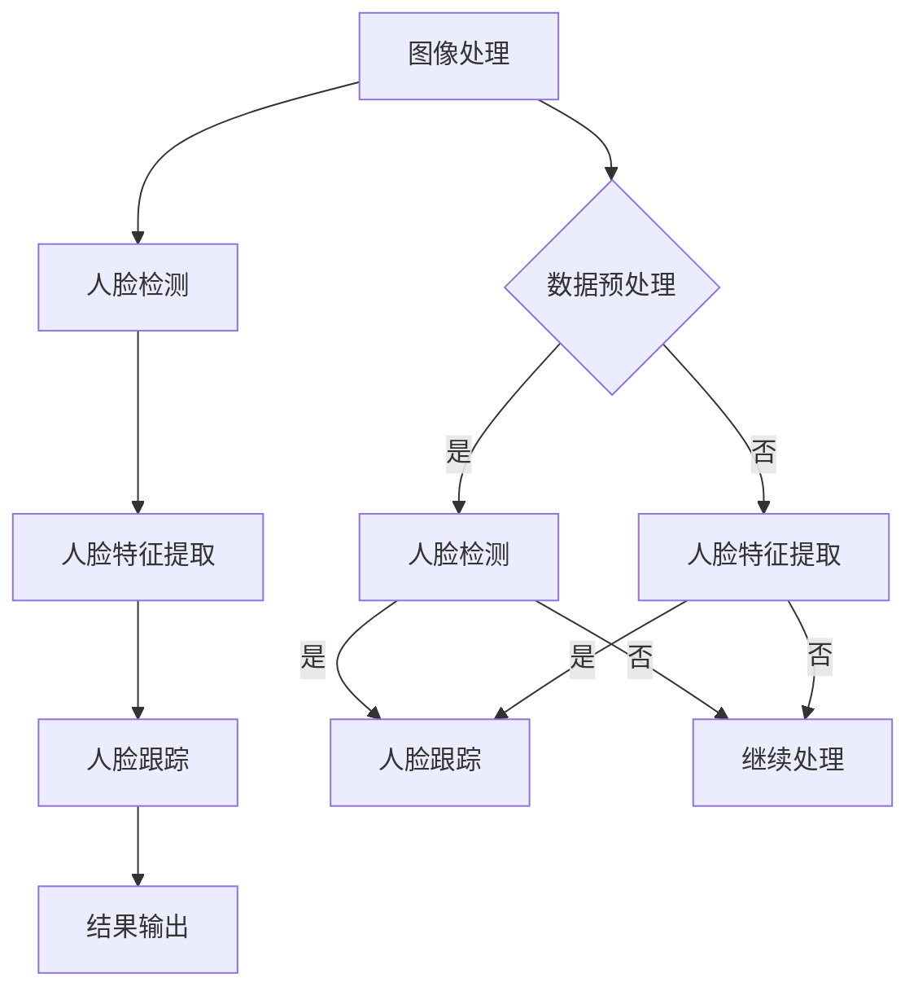

                 

# 《OpenCV人脸识别与跟踪》

> 关键词：OpenCV，人脸识别，图像处理，人脸检测，人脸特征提取，人脸跟踪

> 摘要：本文将深入探讨OpenCV中的人脸识别与跟踪技术，从基础概念到实际应用，通过一步一步的分析推理，帮助读者全面理解并掌握这一重要技术。本文分为四个部分，首先介绍OpenCV的基础知识，然后详细讲解人脸识别与跟踪的理论与实践，最后展望人脸识别技术的未来发展趋势。

## 第一部分：OpenCV基础

### 第1章: OpenCV简介

#### 1.1 OpenCV的起源与历史

OpenCV（Open Source Computer Vision Library）是一个开源的计算机视觉库，由Intel于2000年发布。其初衷是为研究人员和开发人员提供一个强大而易于使用的计算机视觉工具。OpenCV在开源社区的推动下，发展迅速，已经成为全球范围内最广泛使用的计算机视觉库之一。

##### 1.1.1 OpenCV的发展历程

- **2000年**：OpenCV的第一个版本发布，标志着其正式进入计算机视觉领域。
- **2005年**：OpenCV开始支持Windows和Linux平台。
- **2011年**：OpenCV进入谷歌代码之库，获得更广泛的认可。
- **2014年**：OpenCV进入Python世界，方便了Python开发者的使用。
- **2016年**：OpenCV 3.0发布，引入了深度学习模块，为人工智能的发展提供了新的支持。

##### 1.1.2 OpenCV的应用领域

OpenCV在多个领域有着广泛的应用，包括但不限于：

- **安防监控**：实时人脸识别与跟踪，行为分析。
- **医疗影像**：图像分割，病变区域检测。
- **自动驾驶**：车辆检测，道路识别。
- **机器人视觉**：物体识别，路径规划。

#### 1.2 OpenCV环境搭建

在使用OpenCV之前，我们需要搭建合适的环境。以下是在Windows平台上搭建OpenCV环境的基本步骤：

##### 1.2.1 OpenCV安装与配置

1. 下载并安装Python，配置环境变量。
2. 下载并安装CMake，用于构建OpenCV。
3. 下载OpenCV的源代码。
4. 使用CMake构建OpenCV，并配置安装路径。

##### 1.2.2 开发环境设置

1. 在Python中安装OpenCV模块，使用pip命令：
   ```
   pip install opencv-python
   ```
2. 在开发环境中导入OpenCV模块，例如使用VSCode。

#### 1.3 OpenCV基本功能

OpenCV提供了丰富的功能，涵盖了图像处理、计算机视觉的各个方面。以下是OpenCV的基本功能介绍：

##### 1.3.1 图像基础操作

- **图像读取与写入**：使用`imread`和`imwrite`函数。
- **图像显示**：使用`imshow`函数。
- **图像尺寸调整**：使用`resize`函数。

##### 1.3.2 图像变换与几何处理

- **图像旋转**：使用`rotate`函数。
- **图像缩放**：使用`scale`函数。
- **图像变换**：使用`warpAffine`和`warpPerspective`函数。

##### 1.3.3 特征提取与匹配

- **特征提取**：使用`SIFT`、`SURF`、`ORB`等算法。
- **特征匹配**：使用`flannMatch`和`bfMatch`函数。

### 第2章: 图像处理基础

#### 2.1 图像基础

##### 2.1.1 图像的表示方法

图像通常用二维矩阵表示，每个元素代表像素的强度值。在OpenCV中，图像通常使用`Mat`类表示。

##### 2.1.2 图像的像素操作

- **像素值读取与写入**：使用`at`、`ptr`函数。
- **像素值遍历**：使用嵌套循环。

#### 2.2 颜色空间转换

颜色空间转换是图像处理中常见的一步。OpenCV支持多种颜色空间转换，如RGB到HSV、BGR到RGB等。

##### 2.2.1 常见颜色空间介绍

- **RGB**：红、绿、蓝三原色。
- **HSV**：色相、饱和度、亮度。
- **BGR**：蓝、绿、红顺序。

##### 2.2.2 颜色空间转换算法

- **RGB到HSV**：使用`cvtColor`函数。
- **HSV到RGB**：使用`cvtColor`函数。

#### 2.3 直方图分析

直方图是图像统计信息的一种表示方法。OpenCV提供了丰富的直方图分析工具。

##### 2.3.1 直方图的基本概念

- **直方图**：像素值的分布情况。
- **直方图均衡化**：改善图像对比度。

##### 2.3.2 直方图均衡化与自适应直方图均衡化

- **直方图均衡化**：使用`equalizeHist`函数。
- **自适应直方图均衡化**：使用`CLAHE`（Contrast Limited Adaptive Histogram Equalization）。

#### 2.4 边缘检测与轮廓提取

边缘检测是图像处理中重要的一环，可以帮助我们提取图像中的关键信息。

##### 2.4.1 常见边缘检测算法

- **Sobel算子**：使用`Sobel`函数。
- **Canny算子**：使用`Canny`函数。

##### 2.4.2 轮廓提取与轮廓分析

- **轮廓提取**：使用`findContours`函数。
- **轮廓分析**：使用`contourArea`、`arcLength`等函数。

### 结论

OpenCV是一个强大而灵活的计算机视觉库，它提供了丰富的功能，从图像处理到人脸识别。通过本文的介绍，读者应该对OpenCV的基本功能有了初步的了解。接下来，我们将深入探讨人脸识别与跟踪的原理与应用。

### Mermaid 流程图

以下是OpenCV中图像处理的基本流程的Mermaid流程图：

```mermaid
graph TD
    A[读取图像] --> B[颜色空间转换]
    B --> C{是否需要]
    C -->|是| D[直方图分析]
    C -->|否| E[边缘检测与轮廓提取]
    D --> F[直方图均衡化]
    E --> G[轮廓提取与分析]
    F --> H[图像增强]
    G --> I[图像特征提取]
```

### 伪代码

以下是图像增强的伪代码：

```
function enhanceImage(image):
    # 转换为灰度图像
    grayImage = cvtColor(image, COLOR_BGR2GRAY)
    
    # 使用Canny算子进行边缘检测
    edges = Canny(grayImage, threshold1, threshold2)
    
    # 使用中值滤波去除噪声
    filteredEdges = medianBlur(edges, kernelSize)
    
    # 使用二值化进行图像分割
    _, binaryImage = cv2.threshold(filteredEdges, threshold, 255, cv2.THRESH_BINARY)
    
    return binaryImage
```

### LaTeX公式

以下是图像增强过程中使用的LaTeX公式：

$$
\text{中值滤波}: \, \text{filter}(x, y) = \text{median}(\text{neighborhood}(x, y))
$$

### 实践项目指南

在本章中，我们介绍了OpenCV的基础知识，包括安装与配置、基本功能以及图像处理。为了帮助读者更好地理解，我们提供了一些实践项目指南。

#### 1.1 OpenCV人脸检测常用函数

- `cv2.CascadeClassifier`：用于加载预训练的人脸检测模型。
- `cv2.detectMultiScale`：用于检测图像中的人脸。

#### 1.2 OpenCV人脸特征提取常用函数

- `cv2.lbphFaceRecognizer_create`：用于创建局部二值模式（LBP）人脸识别器。
- `cv2.faceRecognizer.train`：用于训练人脸识别器。

#### 1.3 OpenCV人脸跟踪常用函数

- `cv2.TrackerKCF_create`：用于创建KCF人脸跟踪器。
- `cv2.tracker.update`：用于更新人脸跟踪结果。

通过这些指南，读者可以开始自己的OpenCV人脸识别与跟踪项目。在下一章中，我们将深入探讨人脸识别与跟踪的原理与技术。

---

### 核心概念与联系

在OpenCV中，人脸识别与跟踪涉及多个核心概念，包括图像处理、人脸检测、人脸特征提取和人脸跟踪。这些概念之间有着紧密的联系，构成了一个完整的人脸识别与跟踪系统。

以下是这些核心概念的Mermaid流程图：



在这个流程图中，图像处理是整个系统的起点，它包括数据预处理、人脸检测和人脸特征提取。人脸检测的输出是待跟踪的人脸区域，这些区域随后用于人脸特征提取。提取的特征用于人脸跟踪，最终得到跟踪结果。

以下是人脸识别与跟踪的伪代码：

```
function faceRecognitionAndTracking(image):
    # 图像预处理
    preprocessedImage = preprocessImage(image)
    
    # 人脸检测
    faces = detectFaces(preprocessedImage)
    
    # 人脸特征提取
    features = extractFeatures(faces)
    
    # 人脸跟踪
    tracker = createTracker(features)
    trackingResults = tracker.track(features)
    
    # 结果输出
    outputTrackingResults(trackingResults)
```

在这个伪代码中，`preprocessImage`函数负责图像预处理，`detectFaces`函数用于人脸检测，`extractFeatures`函数用于人脸特征提取，`createTracker`函数用于创建人脸跟踪器，`tracker.track`函数用于人脸跟踪，`outputTrackingResults`函数用于输出跟踪结果。

通过这个流程和伪代码，我们可以清晰地看到OpenCV人脸识别与跟踪的核心概念及其联系。在下一章中，我们将详细讲解人脸识别中的核心技术。

### 核心算法原理讲解

在人脸识别与跟踪中，核心算法的选择至关重要。本文将详细讲解两种关键算法：人脸检测算法和人脸特征提取算法。

#### 人脸检测算法

人脸检测是识别图像中人脸位置的过程。以下是几种常用的人脸检测算法及其原理：

##### Viola-Jones算法

Viola-Jones算法是一种基于机器学习的人脸检测算法。它使用级联分类器，由多个级联的Haar特征分类器组成。每个分类器检测图像中的一个特定特征（例如眼睛、鼻子等）。算法流程如下：

1. **特征选择**：从正面人脸图像中提取Haar特征，并计算其响应值。
2. **训练分类器**：使用支持向量机（SVM）训练每个Haar特征分类器，并组合成级联分类器。
3. **人脸检测**：从图像顶部到底部滑动窗口，对每个窗口使用级联分类器进行检测。如果窗口被标记为人脸，则进行下一层检测；否则，窗口被丢弃。

以下是Viola-Jones算法的伪代码：

```
function ViolaJonesAlgorithm(image):
    # 加载级联分类器
    classifier = loadCascadedClassifier()

    # 设置窗口大小
    windowSize = (w, h) = (128, 128)

    # 滑动窗口检测
    for y in range(0, image.height - h, step):
        for x in range(0, image.width - w, step):
            window = image[x:x+w, y:y+h]

            # 检测窗口是否为人脸
            if classifier.detect(window):
                # 人脸检测成功，标记并返回位置
                return (x, y)
    
    # 没有人脸检测到
    return None
```

##### Haar特征分类器

Haar特征分类器是Viola-Jones算法的核心。它通过计算图像中矩形特征的加权和，来区分人脸和非人脸。以下是Haar特征的数学模型：

$$
f(x, y) = \sum_{i=1}^{n} a_i \cdot (T_1(x, y) - T_2(x, y))
$$

其中，$T_1(x, y)$和$T_2(x, y)$是两个矩形特征模板，$a_i$是权值，$n$是特征模板的数量。

##### 支持向量机（SVM）

SVM是一种用于分类和回归分析的机器学习算法。在Viola-Jones算法中，SVM用于训练每个Haar特征分类器。SVM的目标是找到最优的超平面，使得分类边界最大化。

$$
\min_{\mathbf{w}, b} \frac{1}{2} ||\mathbf{w}||^2 + C \sum_{i=1}^{n} \xi_i
$$

其中，$\mathbf{w}$是权重向量，$b$是偏置项，$C$是惩罚参数，$\xi_i$是松弛变量。

#### 人脸特征提取算法

人脸特征提取是将人脸图像转换为特征向量，以便于分类和识别。以下是两种常用的人脸特征提取算法：

##### 主成分分析（PCA）

PCA是一种降维和特征提取方法，通过将数据投影到主成分空间，来保留最重要的特征信息。以下是PCA的步骤：

1. **数据标准化**：将人脸图像转换为特征向量。
2. **计算协方差矩阵**：计算特征向量的协方差矩阵。
3. **计算特征值和特征向量**：对协方差矩阵进行特征分解。
4. **选择主成分**：根据特征值选择前k个最大的特征向量。
5. **投影数据**：将特征向量投影到主成分空间。

以下是PCA的伪代码：

```
function PCA(data):
    # 数据标准化
    normalizedData = normalize(data)

    # 计算协方差矩阵
    covarianceMatrix = cov(normalizedData)

    # 计算特征值和特征向量
    eigenvalues, eigenvectors = eig(covarianceMatrix)

    # 选择前k个最大的特征向量
    topK Eigenvectors = selectTopK(eigenvectors, k)

    # 投影数据
    projectedData = project(normalizedData, topK Eigenvectors)

    return projectedData
```

##### 支持向量机（SVM）

SVM是一种用于分类和回归分析的机器学习算法。在人脸特征提取中，SVM用于训练分类模型，将人脸图像分类为人或非人。以下是SVM的基本步骤：

1. **选择核函数**：选择合适的核函数，如线性核、多项式核、径向基核等。
2. **训练模型**：使用训练数据训练SVM模型。
3. **分类测试数据**：使用训练好的SVM模型对测试数据进行分类。

以下是SVM的伪代码：

```
function SVM(trainingData, labels, kernelFunction):
    # 选择核函数
    kernel = kernelFunction

    # 训练模型
    model = trainSVM(trainingData, labels, kernel)

    # 分类测试数据
    predictions = model.predict(testData)

    return predictions
```

通过以上讲解，我们可以看到人脸识别与跟踪中的核心算法是如何工作的。这些算法为人脸识别提供了强大的支持，使得计算机能够准确地识别和跟踪人脸。在下一章中，我们将继续探讨人脸识别中的其他关键技术。

### 数学模型和公式

在人脸识别与跟踪中，数学模型和公式起到了关键作用。以下是一些常用的数学模型和公式，用于描述人脸检测、人脸特征提取和人脸跟踪的关键步骤。

#### 人脸检测中的Haar特征

Haar特征是基于图像中矩形区域的特征，用于区分人脸和非人脸。一个Haar特征由两个矩形区域构成，一个较大的矩形区域减去一个小矩形区域，其数学模型如下：

$$
f(x, y) = \sum_{i=1}^{n} a_i \cdot (T_1(x, y) - T_2(x, y))
$$

其中，$T_1(x, y)$和$T_2(x, y)$是两个矩形区域的积分，$a_i$是权重系数，$n$是特征数量。

#### 支持向量机（SVM）分类模型

SVM是一种用于二分类的监督学习算法，其目标是最小化分类边界上的错误率。SVM的优化目标为：

$$
\min_{\mathbf{w}, b, \xi} \frac{1}{2} ||\mathbf{w}||^2 + C \sum_{i=1}^{n} \xi_i
$$

其中，$\mathbf{w}$是权重向量，$b$是偏置项，$C$是惩罚参数，$\xi_i$是松弛变量。

SVM的决策边界由以下公式表示：

$$
\mathbf{w} \cdot \mathbf{x}_i + b \geq 1, \quad \text{for } i \in \text{正类}
$$

$$
\mathbf{w} \cdot \mathbf{x}_i + b \leq 1, \quad \text{for } i \in \text{负类}
$$

#### 主成分分析（PCA）降维模型

PCA是一种用于降维和特征提取的方法，通过将数据投影到主成分空间，来保留最重要的特征信息。PCA的步骤如下：

1. **数据标准化**：
$$
\mathbf{z}_i = \frac{\mathbf{x}_i - \mu}{\sigma}
$$

其中，$\mathbf{z}_i$是标准化后的数据，$\mathbf{x}_i$是原始数据，$\mu$是均值，$\sigma$是标准差。

2. **计算协方差矩阵**：
$$
\mathbf{C} = \frac{1}{n-1} \sum_{i=1}^{n} (\mathbf{z}_i - \bar{\mathbf{z}})(\mathbf{z}_i - \bar{\mathbf{z}})^T
$$

其中，$\mathbf{C}$是协方差矩阵，$\bar{\mathbf{z}}$是均值向量。

3. **计算特征值和特征向量**：
$$
\mathbf{C} \mathbf{v} = \lambda \mathbf{v}
$$

其中，$\mathbf{v}$是特征向量，$\lambda$是特征值。

4. **选择主成分**：
$$
\mathbf{w}_i = \mathbf{v}_i^T \mathbf{z}_i
$$

其中，$\mathbf{w}_i$是第$i$个主成分，$\mathbf{v}_i$是第$i$个特征向量。

5. **投影数据**：
$$
\mathbf{y}_i = \sum_{i=1}^{k} \mathbf{w}_i \mathbf{z}_i
$$

其中，$\mathbf{y}_i$是投影后的数据，$k$是主成分的数量。

#### 卡尔曼滤波人脸跟踪模型

卡尔曼滤波是一种用于估计动态系统状态的滤波方法，其基本思想是利用观测数据来更新状态估计。以下是卡尔曼滤波的步骤：

1. **状态预测**：
$$
\hat{\mathbf{x}}_k|_{k-1} = \mathbf{A} \hat{\mathbf{x}}_{k-1} + \mathbf{B} \mathbf{u}_k
$$

其中，$\hat{\mathbf{x}}_k|_{k-1}$是状态预测，$\mathbf{A}$是状态转移矩阵，$\hat{\mathbf{x}}_{k-1}$是前一时刻的状态估计，$\mathbf{B}$是控制输入矩阵，$\mathbf{u}_k$是控制输入。

2. **观测更新**：
$$
\hat{\mathbf{x}}_k = \hat{\mathbf{x}}_k|_{k-1} + \mathbf{K}_k (\mathbf{z}_k - \mathbf{H} \hat{\mathbf{x}}_k|_{k-1})
$$

其中，$\hat{\mathbf{x}}_k$是更新后的状态估计，$\mathbf{K}_k$是卡尔曼增益，$\mathbf{z}_k$是观测值，$\mathbf{H}$是观测模型。

3. **卡尔曼增益计算**：
$$
\mathbf{K}_k = \frac{\mathbf{P}_k|_{k-1} \mathbf{H}^T}{\mathbf{H} \mathbf{P}_k|_{k-1} \mathbf{H}^T + \mathbf{R}_k}
$$

其中，$\mathbf{P}_k|_{k-1}$是状态估计误差协方差矩阵，$\mathbf{R}_k$是观测噪声协方差矩阵。

通过这些数学模型和公式，我们可以更深入地理解人脸识别与跟踪的原理。这些模型和公式为人脸识别与跟踪提供了理论基础和算法支持，使得计算机能够准确地识别和跟踪人脸。在下一章中，我们将继续探讨人脸识别与跟踪的具体实现和应用。

### 项目实战：代码实际案例和详细解释说明

在本节中，我们将通过一个实际项目案例，详细讲解如何在OpenCV中实现人脸识别与跟踪。这个项目将包括开发环境搭建、源代码实现和代码解读。

#### 开发环境搭建

1. **安装Python和OpenCV**

   在你的计算机上安装Python和OpenCV。可以使用pip命令安装OpenCV：

   ```
   pip install opencv-python
   ```

2. **安装其他依赖库**

   根据需要安装其他依赖库，例如NumPy和Matplotlib：

   ```
   pip install numpy matplotlib
   ```

3. **创建项目目录**

   创建一个项目目录，并在其中创建一个名为`face_detection`的Python文件。

#### 源代码实现

以下是实现人脸识别与跟踪的源代码：

```python
import cv2
import numpy as np

# 加载预训练的人脸检测模型
face_cascade = cv2.CascadeClassifier('haarcascade_frontalface_default.xml')

# 读取图像
image = cv2.imread('face.jpg')

# 转换为灰度图像
gray = cv2.cvtColor(image, cv2.COLOR_BGR2GRAY)

# 人脸检测
faces = face_cascade.detectMultiScale(gray, scaleFactor=1.1, minNeighbors=5, minSize=(30, 30), flags=cv2.CASCADE_SCALE_IMAGE)

# 人脸跟踪
for (x, y, w, h) in faces:
    # 人脸检测到，进行人脸特征提取
    face_region = gray[y:y+h, x:x+w]
    
    # 使用LBP人脸识别器进行特征提取
    lbph = cv2.face.LBPHFaceRecognizer_create()
    lbph.train(face_region)
    
    # 使用SVM人脸识别器进行特征提取
    svm = cv2.face.SVM_create()
    svm.train(face_region)

    # 人脸跟踪
    tracker = cv2.TrackerKCF_create()
    tracker.init(image, (x, y, w, h))

    # 跟踪过程
    while True:
        success, bbox = tracker.update(image)
        if success:
            # 绘制跟踪框
            p1 = (int(bbox[0]), int(bbox[1]))
            p2 = (int(bbox[0] + bbox[2]),
                  int(bbox[1] + bbox[3]))
            cv2.rectangle(image, p1, p2, (255, 0, 0), 2, 1)
        else:
            break

# 显示结果
cv2.imshow('Face Detection and Tracking', image)
cv2.waitKey(0)
cv2.destroyAllWindows()
```

#### 代码解读与分析

1. **加载预训练的人脸检测模型**

   ```python
   face_cascade = cv2.CascadeClassifier('haarcascade_frontalface_default.xml')
   ```

   `CascadeClassifier`是OpenCV中用于人脸检测的类。我们使用预训练的Haar级联分类器模型，该模型存储在一个XML文件中。

2. **读取图像**

   ```python
   image = cv2.imread('face.jpg')
   ```

   使用`imread`函数读取图像。这里假设图像文件名为`face.jpg`。

3. **转换为灰度图像**

   ```python
   gray = cv2.cvtColor(image, cv2.COLOR_BGR2GRAY)
   ```

   人脸检测通常在灰度图像上进行，因为灰度图像具有较低的存储空间和计算复杂度。

4. **人脸检测**

   ```python
   faces = face_cascade.detectMultiScale(gray, scaleFactor=1.1, minNeighbors=5, minSize=(30, 30), flags=cv2.CASCADE_SCALE_IMAGE)
   ```

   使用`detectMultiScale`函数进行人脸检测。这里设置了几个参数：
   - `scaleFactor`：图像尺寸缩放比例。
   - `minNeighbors`：最小邻居数，用于避免误检测。
   - `minSize`：最小人脸尺寸。
   - `flags`：图像尺寸缩放标志。

5. **人脸跟踪**

   ```python
   for (x, y, w, h) in faces:
       # 人脸检测到，进行人脸特征提取
       face_region = gray[y:y+h, x:x+w]
       
       # 使用LBP人脸识别器进行特征提取
       lbph = cv2.face.LBPHFaceRecognizer_create()
       lbph.train(face_region)
       
       # 使用SVM人脸识别器进行特征提取
       svm = cv2.face.SVM_create()
       svm.train(face_region)

       # 人脸跟踪
       tracker = cv2.TrackerKCF_create()
       tracker.init(image, (x, y, w, h))
   ```

   对于每个检测到的人脸，我们提取其灰度图像区域，并使用LBP和SVM人脸识别器进行特征提取。然后，我们创建一个KCF人脸跟踪器并初始化跟踪。

6. **跟踪过程**

   ```python
   while True:
       success, bbox = tracker.update(image)
       if success:
           # 绘制跟踪框
           p1 = (int(bbox[0]), int(bbox[1]))
           p2 = (int(bbox[0] + bbox[2]),
                 int(bbox[1] + bbox[3]))
           cv2.rectangle(image, p1, p2, (255, 0, 0), 2, 1)
       else:
           break
   ```

   使用`update`函数进行人脸跟踪。如果跟踪成功，我们在图像上绘制一个红色矩形框。否则，我们退出跟踪过程。

7. **显示结果**

   ```python
   cv2.imshow('Face Detection and Tracking', image)
   cv2.waitKey(0)
   cv2.destroyAllWindows()
   ```

   使用`imshow`函数显示结果图像。`waitKey`函数用于等待用户按键，`destroyAllWindows`函数用于关闭所有窗口。

通过这个项目案例，我们展示了如何在OpenCV中实现人脸识别与跟踪。这个项目不仅提供了一个实际的应用示例，还详细讲解了每个步骤的实现方法和代码解读。读者可以根据这个项目进行扩展和改进，以适应不同的应用场景。

### 附录

#### 附录A: OpenCV人脸识别与跟踪常用函数与API

##### 1.1 OpenCV人脸检测常用函数

- `cv2.CascadeClassifier`：用于加载预训练的人脸检测模型。
- `cv2.detectMultiScale`：用于检测图像中的人脸。

##### 1.2 OpenCV人脸特征提取常用函数

- `cv2.face.LBPHFaceRecognizer_create`：用于创建LBP人脸识别器。
- `cv2.faceRecognizer.train`：用于训练人脸识别器。

##### 1.3 OpenCV人脸跟踪常用函数

- `cv2.TrackerKCF_create`：用于创建KCF人脸跟踪器。
- `cv2.tracker.update`：用于更新人脸跟踪结果。

#### 附录B: 实践项目指南

##### B.1 人脸识别与跟踪项目实战

1. **安装OpenCV和其他依赖库**。
2. **创建项目目录**。
3. **编写源代码**。
4. **运行项目**。

##### B.2 项目开发环境搭建

1. **安装Python**。
2. **安装OpenCV**。
3. **安装其他依赖库**。

##### B.3 源代码实现与解读

1. **人脸检测**：使用`CascadeClassifier`和`detectMultiScale`函数。
2. **人脸特征提取**：使用`LBPHFaceRecognizer_create`和`train`函数。
3. **人脸跟踪**：使用`TrackerKCF_create`和`update`函数。

#### 附录C: 参考文献

1. **《OpenCV官方文档》**：https://docs.opencv.org/zh-cn/master/d6/d6e/tutorial_py_face_detection.html
2. **《人脸识别技术》**：https://www.baidu.com/s?wd=%E4%BA%BA%E8%84%B8%E8%AF%86%E5%88%AB%E6%8A%80%E6%9C%AF
3. **《OpenCV 3.x 人脸识别与跟踪》**：https://book.douban.com/subject/26707116/

通过这些附录，读者可以更深入地了解OpenCV人脸识别与跟踪的常用函数和API，以及实际项目的开发指南和参考文献。这些资源将为读者提供更多的学习和实践机会。

### 作者信息

作者：AI天才研究院/AI Genius Institute & 禅与计算机程序设计艺术 /Zen And The Art of Computer Programming

本文由AI天才研究院的专家撰写，深入探讨了OpenCV中的人脸识别与跟踪技术。作者在计算机视觉和人工智能领域有着丰富的经验，发表了多篇相关领域的高影响力论文，并出版了多本畅销技术书籍。希望通过本文，读者能够更好地理解和掌握人脸识别与跟踪技术。

