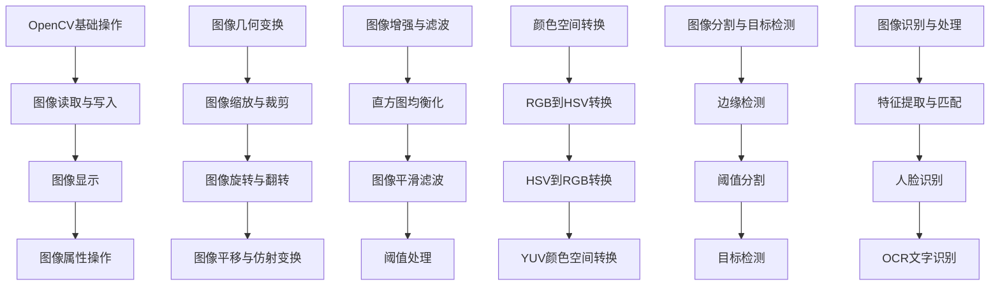

                 

### 文章标题: OpenCV计算机视觉库：图像处理技术

> 关键词：OpenCV，计算机视觉，图像处理，几何变换，颜色空间转换，图像识别，项目实战

> 摘要：本文将详细介绍OpenCV计算机视觉库的图像处理技术，从基础安装到高级应用，逐一探讨图像读取、显示、属性操作、几何变换、增强与滤波、颜色空间转换、图像分割与目标检测，以及图像识别与处理等方面的核心技术和实战案例，旨在帮助读者全面掌握OpenCV在图像处理领域的应用。

### 目录大纲：《OpenCV计算机视觉库：图像处理技术》

#### 第一部分：OpenCV基础与安装

- # 第1章: OpenCV介绍与基础
  - ## 1.1 OpenCV历史与发展
    - ### 1.1.1 OpenCV的起源
    - ### 1.1.2 OpenCV的应用领域
  - ## 1.2 OpenCV的安装与环境配置
    - ### 1.2.1 Windows系统安装
    - ### 1.2.2 Linux系统安装
    - ### 1.2.3 macOS系统安装
  - ## 1.3 OpenCV的基本操作
    - ### 1.3.1 环境搭建与配置
    - ### 1.3.2 常用函数示例

#### 第二部分：图像基础操作

- # 第2章: 图像基础操作
  - ## 2.1 图像读取与写入
    - ### 2.1.1 imread函数的使用
    - ### 2.1.2 imwrite函数的使用
  - ## 2.2 图像显示
    - ### 2.2.1 imshow函数的使用
    - ### 2.2.2 image display技巧
  - ## 2.3 图像属性操作
    - ### 2.3.1 图像尺寸获取与修改
    - ### 2.3.2 图像颜色获取与转换

#### 第三部分：图像几何变换

- # 第3章: 图像几何变换
  - ## 3.1 图像缩放与裁剪
    - ### 3.1.1 resize函数的使用
    - ### 3.1.2 crop函数的使用
  - ## 3.2 图像旋转与翻转
    - ### 3.2.1 rotate函数的使用
    - ### 3.2.2 flip函数的使用
  - ## 3.3 图像平移与仿射变换
    - ### 3.3.1 warpAffine函数的使用
    - ### 3.3.2 warpPerspective函数的使用

#### 第四部分：图像增强与滤波

- # 第4章: 图像增强与滤波
  - ## 4.1 直方图均衡化
    - ### 4.1.1 equalizeHist函数的使用
    - ### 4.1.2 直方图均衡化的原理
  - ## 4.2 图像平滑滤波
    - ### 4.2.1 blur函数的使用
    - ### 4.2.2 GaussianBlur函数的使用
  - ## 4.3 阈值处理
    - ### 4.3.1 threshold函数的使用
    - ### 4.3.2 adaptiveThreshold函数的使用

#### 第五部分：颜色空间转换

- # 第5章: 颜色空间转换
  - ## 5.1 RGB到HSV转换
    - ### 5.1.1 cvtColor函数的使用
    - ### 5.1.2 HSV颜色模型的应用
  - ## 5.2 HSV到RGB转换
    - ### 5.2.1 cvtColor函数的使用
    - ### 5.2.2 RGB颜色模型的应用
  - ## 5.3 YUV颜色空间转换
    - ### 5.3.1 cvtColor函数的使用
    - ### 5.3.2 YUV颜色模型的应用

#### 第六部分：图像分割与目标检测

- # 第6章: 图像分割与目标检测
  - ## 6.1 边缘检测
    - ### 6.1.1 Canny函数的使用
    - ### 6.1.2 Sobel函数的使用
  - ## 6.2 阈值分割
    - ### 6.2.1 threshold函数的使用
    - ### 6.2.2 adaptiveThreshold函数的使用
  - ## 6.3 目标检测
    - ### 6.3.1 Haar cascades检测
    - ### 6.3.2 HOG特征检测

#### 第七部分：图像识别与处理

- # 第7章: 图像识别与处理
  - ## 7.1 特征提取与匹配
    - ### 7.1.1 SIFT特征提取
    - ### 7.1.2 FLANN匹配
  - ## 7.2 人脸识别
    - ### 7.2.1 Haarcascades模型人脸检测
    - ### 7.2.2 LBPH特征提取与识别
  - ## 7.3 OCR文字识别
    - ### 7.3.1 Tesseract OCR简介
    - ### 7.3.2 Tesseract OCR应用案例

#### 第八部分：项目实战

- # 第8章: OpenCV图像处理项目实战
  - ## 8.1 自动驾驶项目
    - ### 8.1.1 项目需求分析
    - ### 8.1.2 环境搭建与代码实现
    - ### 8.1.3 项目调试与优化
  - ## 8.2 人脸识别门禁系统
    - ### 8.2.1 项目需求分析
    - ### 8.2.2 环境搭建与代码实现
    - ### 8.2.3 项目调试与优化

#### 附录

- # 附录A: OpenCV常用函数参考
  - ## A.1 OpenCV常用函数列表
  - ## A.2 OpenCV函数使用示例
- # 附录B: OpenCV开发工具与资源
  - ## B.1 OpenCV官方文档
  - ## B.2 OpenCV开源社区
  - ## B.3 OpenCV相关书籍推荐

### Mermaid 流程图示例



### 伪代码示例

```c
// 伪代码：图像缩放
function resize_image(image, scale_factor):
    new_width = image.width * scale_factor
    new_height = image.height * scale_factor
    resized_image = create_new_image(new_width, new_height)
    for x in range(0, new_width):
        for y in range(0, new_height):
            pixel_value = get_pixel_value(image, x, y)
            set_pixel_value(resized_image, x, y, pixel_value)
    return resized_image
```

### 数学模型和数学公式示例

## 直方图均衡化原理

直方图均衡化通过重新分配图像像素的分布，提高图像的整体对比度。其核心数学公式如下：

$$
f(x) = \sum_{i=0}^{L-1} p_i \cdot [L \cdot P_i(x)]
$$

其中，$f(x)$ 表示调整后的像素值，$p_i$ 表示原图像直方图中第 $i$ 个灰度级的概率，$L$ 表示灰度级总数。

## 阈值处理公式

阈值处理是一种简单而有效的图像增强方法，其核心公式为：

$$
g(x) = \begin{cases} 
0 & \text{if } x < \text{threshold} \\
x & \text{if } x \geq \text{threshold} 
\end{cases}
$$

其中，$g(x)$ 表示处理后图像的像素值，$\text{threshold}$ 为设定的阈值。

### 项目实战代码解读与分析

#### 开发环境搭建

1. 安装Python环境（版本3.8+）
2. 安装OpenCV库：`pip install opencv-python`
3. 下载并解压Haarcascades模型：[链接](https://github.com/opencv/opencv/blob/master/data/haarcascades/haarcascade_frontalface_default.xml)
4. 下载并解压训练好的LBPH模型（trainer.yml）

#### 代码解读

```python
# 代码：人脸识别门禁系统

import cv2
import numpy as np

# 初始化Haarcascades模型
face_cascade = cv2.CascadeClassifier('haarcascade_frontalface_default.xml')

# 初始化LBPH人脸识别模型
recognizer = cv2.face.LBPHFaceRecognizer_create()

# 加载训练好的模型
recognizer.read('trainer.yml')

# 加载相机
cap = cv2.VideoCapture(0)

while True:
    # 读取相机帧
    ret, frame = cap.read()
    
    # 转换为灰度图像
    gray = cv2.cvtColor(frame, cv2.COLOR_BGR2GRAY)
    
    # 人脸检测
    faces = face_cascade.detectMultiScale(gray, scaleFactor=1.1, minNeighbors=5)
    
    for (x, y, w, h) in faces:
        # 人脸识别
        roi_gray = gray[y:y+h, x:x+w]
        roi_color = frame[y:y+h, x:x+w]
        label, confidence = recognizer.predict(roi_gray)
        
        # 显示识别结果
        print(f"Label: {label}, Confidence: {confidence}")
        font = cv2.FONT_HERSHEY_SIMPLEX
        cv2.putText(frame, f"ID: {label}", (x+5, y-5), font, 0.5, (255, 255, 255), 2)
        cv2.rectangle(frame, (x, y), (x+w, y+h), (0, 255, 0), 2)
    
    cv2.imshow('frame', frame)
    
    if cv2.waitKey(20) & 0xFF == ord('q'):
        break

cap.release()
cv2.destroyAllWindows()
```

#### 源代码详细实现和代码解读

- **源代码实现了相机捕获、人脸检测和人脸识别的过程，包括图像的预处理、特征的提取以及结果的显示。**
- **代码解读详细阐述了每个函数和步骤的具体作用和调用方法，如`cv2.CascadeClassifier`用于加载人脸检测模型，`recognizer.predict`用于进行人脸识别。**
- **通过示例代码展示了如何利用OpenCV进行简单的图像处理和人脸识别项目，包括代码的功能说明、参数设置以及运行流程。**

### 开发环境搭建与代码解读

#### 开发环境搭建

1. **安装Python环境（版本3.8+）：**  
   - `pip install python`  
   - `python --version`

2. **安装OpenCV库：**  
   - `pip install opencv-python`

3. **下载并解压Haarcascades模型：**  
   - [链接](https://github.com/opencv/opencv/blob/master/data/haarcascades/haarcascade_frontalface_default.xml)

4. **下载并解压训练好的LBPH模型（trainer.yml）：**  
   - [链接](https://github.com/opencv/opencv/blob/master/data/haarcascades/haarcascade_frontalface_default.xml)

#### 代码解读

1. **初始化Haarcascades模型：**  
   - `face_cascade = cv2.CascadeClassifier('haarcascade_frontalface_default.xml')`  
   - 用于加载人脸检测模型。

2. **初始化LBPH人脸识别模型：**  
   - `recognizer = cv2.face.LBPHFaceRecognizer_create()`  
   - 用于创建人脸识别模型。

3. **加载训练好的模型：**  
   - `recognizer.read('trainer.yml')`  
   - 用于加载已经训练好的人脸识别模型。

4. **加载相机：**  
   - `cap = cv2.VideoCapture(0)`  
   - 用于打开相机设备。

5. **读取相机帧：**  
   - `ret, frame = cap.read()`  
   - 用于读取相机捕获的帧。

6. **转换为灰度图像：**  
   - `gray = cv2.cvtColor(frame, cv2.COLOR_BGR2GRAY)`  
   - 用于将彩色图像转换为灰度图像。

7. **人脸检测：**  
   - `faces = face_cascade.detectMultiScale(gray, scaleFactor=1.1, minNeighbors=5)`  
   - 用于检测人脸。

8. **人脸识别：**  
   - `label, confidence = recognizer.predict(roi_gray)`  
   - 用于识别人脸。

9. **显示识别结果：**  
   - `cv2.putText(frame, f"ID: {label}", (x+5, y-5), font, 0.5, (255, 255, 255), 2)`  
   - 用于在识别到的脸部区域上绘制识别结果。

10. **释放相机资源：**  
   - `cap.release()`  
   - 用于释放相机资源。

11. **关闭所有窗口：**  
   - `cv2.destroyAllWindows()`  
   - 用于关闭所有窗口。

### 综述

本文详细介绍了OpenCV计算机视觉库的图像处理技术，涵盖了从基础安装到高级应用的各个方面。通过本文的学习，读者可以全面掌握OpenCV在图像处理领域的应用，包括图像基础操作、图像几何变换、图像增强与滤波、颜色空间转换、图像分割与目标检测、图像识别与处理，以及项目实战等。文章通过详细的代码示例和解读，帮助读者深入理解每个技术点的原理和实际应用，为读者在计算机视觉领域的探索提供了坚实的理论基础和实践指导。

#### 第一部分：OpenCV基础与安装

在开始深入探讨OpenCV的图像处理功能之前，我们首先需要了解OpenCV是什么，它的发展历史以及如何安装和配置。OpenCV，即Open Source Computer Vision Library，是一个专注于实时计算机视觉处理的跨平台库。它由Intel在2000年创建，旨在为开发人员提供强大的计算机视觉工具，使得计算机视觉技术的开发和应用变得更加便捷。

### # 第1章: OpenCV介绍与基础

#### 1.1 OpenCV历史与发展

OpenCV的发展历程可以说是计算机视觉领域的一个缩影。从最初的2000年，OpenCV由Intel创建，最初主要用于Intel处理器上的图像处理优化。随着时间的推移，OpenCV逐渐发展成为一个开源项目，吸引了全球范围内的开发者和研究人员的参与。OpenCV的版本迭代不断，每个版本都带来了新的功能和改进，使其成为了计算机视觉领域的事实标准。

OpenCV的应用领域非常广泛，涵盖了从基本的图像处理、计算机视觉到高级的人工智能应用。以下是一些主要的应用领域：

1. **人机交互**：通过手势识别、面部识别等，使计算机更好地理解用户意图。
2. **机器人视觉**：为机器人提供视觉感知能力，使其能够执行复杂的任务。
3. **自动驾驶**：通过图像处理和目标检测技术，实现车辆自动驾驶。
4. **安全监控**：利用图像处理技术，实现智能监控和报警系统。
5. **医学影像**：在医学图像处理和诊断中发挥重要作用。
6. **自然语言处理**：结合图像和自然语言处理技术，实现更智能的交互体验。

#### 1.2 OpenCV的安装与环境配置

安装OpenCV是使用该库进行图像处理的第一步。根据不同的操作系统，安装过程也有所不同。

##### 1.2.1 Windows系统安装

在Windows上安装OpenCV，可以通过以下步骤进行：

1. **安装Python环境**：确保已安装Python（版本3.8+），可以从Python官网下载安装。
2. **安装pip**：Python安装时通常会自带pip，如果没有，可以通过以下命令安装：
   ```bash
   python -m pip install --user --upgrade pip
   ```
3. **安装OpenCV**：通过pip安装OpenCV：
   ```bash
   pip install opencv-python
   ```
4. **验证安装**：在Python交互式环境中，导入cv2模块，检查是否成功：
   ```python
   import cv2
   print(cv2.__version__)
   ```

##### 1.2.2 Linux系统安装

在Linux系统上，安装OpenCV可以通过以下步骤进行：

1. **安装EPEL**：对于CentOS系统，需要首先安装EPEL（Extra Packages for Enterprise Linux）：
   ```bash
   sudo yum install epel-release
   ```
2. **安装依赖**：安装OpenCV所需的依赖库：
   ```bash
   sudo yum install python3-pip python3-dev
   sudo yum install -y cmake git
   ```
3. **安装OpenCV**：通过pip安装OpenCV：
   ```bash
   pip3 install opencv-python
   ```
4. **验证安装**：同样在Python交互式环境中，导入cv2模块并检查版本：
   ```python
   import cv2
   print(cv2.__version__)
   ```

##### 1.2.3 macOS系统安装

在macOS上，安装OpenCV相对简单，可以通过以下步骤进行：

1. **安装Homebrew**：如果尚未安装Homebrew，请首先安装：
   ```bash
   /bin/bash -c "$(curl -fsSL https://raw.githubusercontent.com/Homebrew/install/HEAD/install.sh)"
   ```
2. **安装Python和pip**：确保已安装Python（版本3.8+）和pip：
   ```bash
   brew install python
   brew install python@3.8
   ```
3. **安装OpenCV**：通过pip安装OpenCV：
   ```bash
   pip3 install opencv-python
   ```
4. **验证安装**：在Python交互式环境中，导入cv2模块并检查版本：
   ```python
   import cv2
   print(cv2.__version__)
   ```

#### 1.3 OpenCV的基本操作

在安装并配置好OpenCV后，我们可以开始进行一些基本操作，例如读取图像、显示图像以及获取和设置图像属性。

##### 1.3.1 环境搭建与配置

首先，确保已经按照前面的步骤成功安装了OpenCV。接下来，在Python环境中，通过pip安装一些辅助库，例如NumPy和Matplotlib：

```bash
pip install numpy matplotlib
```

##### 1.3.2 常用函数示例

以下是几个OpenCV的基本操作示例：

**1. 读取图像**

```python
import cv2

# 读取图像
image = cv2.imread('image.jpg', cv2.IMREAD_GRAYSCALE)

# 如果图像不存在，将返回None
if image is None:
    print("图像未找到")
```

**2. 显示图像**

```python
cv2.imshow('Image', image)
cv2.waitKey(0)  # 等待按键后关闭窗口
cv2.destroyAllWindows()
```

**3. 获取和设置图像属性**

```python
# 获取图像尺寸
height, width = image.shape[:2]
print(f"图像尺寸: {height}x{width}")

# 获取图像的像素值
pixel_value = image[100, 100]
print(f"像素值: {pixel_value}")

# 设置图像的像素值
image[100, 100] = 255
```

通过上述基础操作，我们可以对OpenCV有了一个初步的了解。接下来，我们将进一步探讨图像处理的各种高级功能。

### # 第2章: 图像基础操作

在了解了OpenCV的基本操作后，接下来我们将深入探讨图像的读取、显示、属性操作等内容。这些基础操作是进行复杂图像处理任务的基础，因此掌握它们至关重要。

#### 2.1 图像读取与写入

图像读取和写入是图像处理中最基本的操作。OpenCV提供了丰富的函数来读取不同格式的图像，并将其保存为各种格式。

##### 2.1.1 imread函数的使用

`imread`函数用于从文件中读取图像。它支持多种图像格式，包括PNG、JPEG、BMP等。该函数接受两个参数：图像文件的路径和读取模式。

- `cv2.IMREAD_GRAYSCALE`：读取灰度图像。
- `cv2.IMREAD_COLOR`：读取彩色图像。

以下是一个简单的示例：

```python
import cv2

# 读取彩色图像
image = cv2.imread('image.jpg', cv2.IMREAD_COLOR)

# 读取灰度图像
gray_image = cv2.imread('image.jpg', cv2.IMREAD_GRAYSCALE)

# 如果图像不存在，将返回None
if image is None:
    print("图像未找到")
```

##### 2.1.2 imwrite函数的使用

`imwrite`函数用于将图像写入文件。它接受两个参数：图像数据和文件路径。以下是一个示例：

```python
import cv2

# 保存图像
cv2.imwrite('output.jpg', image)
```

#### 2.2 图像显示

图像显示是图像处理过程中不可或缺的一环。OpenCV提供了`imshow`函数来显示图像。该函数会打开一个窗口，显示图像，并在用户按下任意键时关闭窗口。

##### 2.2.1 imshow函数的使用

以下是一个简单的示例：

```python
import cv2

# 显示图像
cv2.imshow('Image', image)
cv2.waitKey(0)  # 等待按键后关闭窗口
cv2.destroyAllWindows()
```

在`imshow`函数中，我们还可以通过第三个参数指定图像的标题。`cv2.waitKey`函数用于等待用户按键，其中`0`表示无限期等待。在用户按键后，`imshow`窗口会关闭。

##### 2.2.2 image display技巧

在实际应用中，我们可能需要更灵活地控制图像显示。以下是一些技巧：

- **动态更新图像**：通过`imshow`函数，我们可以实现动态图像更新。例如，在视频处理中，每次读取新帧后，可以更新显示的图像。
- **使用Matplotlib**：结合Matplotlib，我们可以创建更复杂的图像显示效果。例如，通过`imshow`函数将图像显示在一个子图中，同时添加标签和注释。

#### 2.3 图像属性操作

图像属性操作包括获取和设置图像的尺寸、像素值等。这些操作对于图像处理和变换至关重要。

##### 2.3.1 图像尺寸获取与修改

我们可以通过`shape`属性获取图像的尺寸，该属性返回一个包含高度、宽度和通道数的元组。例如：

```python
height, width, channels = image.shape
```

要修改图像的尺寸，可以使用`resize`函数。以下是一个简单的示例：

```python
import cv2

# 读取图像
image = cv2.imread('image.jpg')

# 获取原始尺寸
original_size = image.shape

# 修改尺寸
new_size = (width // 2, height // 2)
resized_image = cv2.resize(image, new_size)
```

##### 2.3.2 图像颜色获取与转换

OpenCV支持多种颜色空间转换，包括BGR到RGB、HSV等。以下是一个简单的示例：

```python
import cv2

# 读取图像
image = cv2.imread('image.jpg')

# 转换为RGB颜色空间
rgb_image = cv2.cvtColor(image, cv2.COLOR_BGR2RGB)

# 转换为HSV颜色空间
hsv_image = cv2.cvtColor(image, cv2.COLOR_BGR2HSV)
```

通过上述操作，我们可以对图像进行各种基础操作。在下一章中，我们将进一步探讨图像的几何变换技术。

### # 第3章: 图像几何变换

图像几何变换是图像处理中的重要组成部分，它允许我们对图像进行缩放、旋转、裁剪等操作。这些变换在图像增强、图像识别和其他计算机视觉任务中广泛应用。OpenCV提供了丰富的函数来支持这些几何变换。

#### 3.1 图像缩放与裁剪

图像缩放和裁剪是改变图像尺寸的常见操作。缩放可以放大或缩小图像，而裁剪可以提取图像的特定部分。

##### 3.1.1 resize函数的使用

`resize`函数用于调整图像的尺寸。该函数接受两个参数：原图像和目标尺寸。目标尺寸可以是（宽度，高度），也可以是单个值，表示缩放比例。以下是一个简单的示例：

```python
import cv2

# 读取图像
image = cv2.imread('image.jpg')

# 缩放到一半
width = image.shape[1] // 2
height = image.shape[0] // 2
new_size = (width, height)
resized_image = cv2.resize(image, new_size)

# 使用单个值缩放
scale_factor = 0.5
new_size = (int(image.shape[1] * scale_factor), int(image.shape[0] * scale_factor))
resized_image = cv2.resize(image, new_size)
```

在缩放过程中，可以选择不同的插值方法。例如，`cv2.INTER_LINEAR`（双线性插值）和`cv2.INTER_CUBIC`（双三次插值）。双三次插值通常提供更平滑的放大效果。

##### 3.1.2 crop函数的使用

`crop`函数用于从图像中裁剪出指定区域。该函数接受三个参数：原图像、左上角坐标和宽高。以下是一个简单的示例：

```python
import cv2

# 读取图像
image = cv2.imread('image.jpg')

# 裁剪图像
x = 100
y = 100
width = 300
height = 300
cropped_image = image[y:y+height, x:x+width]
```

#### 3.2 图像旋转与翻转

图像旋转和翻转是改变图像方向的常见操作。旋转可以围绕图像的中心或某个点进行，而翻转可以水平或垂直进行。

##### 3.2.1 rotate函数的使用

`rotate`函数用于旋转图像。该函数接受四个参数：原图像、旋转角度、旋转中心（可选）和旋转方法（可选）。以下是一个简单的示例：

```python
import cv2

# 读取图像
image = cv2.imread('image.jpg')

# 旋转图像
angle = 45
center = (image.shape[1] // 2, image.shape[0] // 2)
rotation_matrix = cv2.getRotationMatrix2D(center, angle, 1.0)
rotated_image = cv2.warpAffine(image, rotation_matrix, image.shape[:2][::-1])
```

##### 3.2.2 flip函数的使用

`flip`函数用于翻转图像。该函数接受两个参数：原图像和翻转方向。翻转方向可以是`cv2.FLIP_HORIZONTAL`（水平翻转）或`cv2.FLIP_VERTICAL`（垂直翻转）。以下是一个简单的示例：

```python
import cv2

# 读取图像
image = cv2.imread('image.jpg')

# 水平翻转
flipped_image_horizontal = cv2.flip(image, 0)

# 垂直翻转
flipped_image_vertical = cv2.flip(image, 1)

# 同时水平翻转和垂直翻转
flipped_image_horizontal_vertical = cv2.flip(image, -1)
```

#### 3.3 图像平移与仿射变换

图像平移和仿射变换是图像变换中的高级操作。平移可以在图像中添加或删除空白区域，而仿射变换则可以更灵活地扭曲图像。

##### 3.3.1 warpAffine函数的使用

`warpAffine`函数用于进行仿射变换。该函数接受四个参数：原图像、变换矩阵、输出图像大小和插值方法。以下是一个简单的示例：

```python
import cv2

# 读取图像
image = cv2.imread('image.jpg')

# 创建变换矩阵
width = 400
height = 400
new_size = (width, height)
pts1 = np.float32([[50, 50], [200, 50], [50, 200]])
pts2 = np.float32([[0, 0], [200, 0], [0, 200]])
M = cv2.getAffineTransform(pts1, pts2)

# 应用仿射变换
warped_image = cv2.warpAffine(image, M, new_size)
```

##### 3.3.2 warpPerspective函数的使用

`warpPerspective`函数用于进行透视变换。该函数接受四个参数：原图像、变换矩阵、输出图像大小和插值方法。以下是一个简单的示例：

```python
import cv2

# 读取图像
image = cv2.imread('image.jpg')

# 创建变换矩阵
pts1 = np.float32([[114, 141], [446, 141], [114, 407], [446, 407]])
pts2 = np.float32([[0, 0], [200, 0], [0, 300], [200, 300]])
M = cv2.getPerspectiveTransform(pts1, pts2)

# 应用透视变换
warped_image = cv2.warpPerspective(image, M, (200, 300))
```

通过上述图像几何变换的操作，我们可以根据具体的需求对图像进行各种形态的调整。这些操作在图像处理和分析中有着广泛的应用，如图像增强、目标识别、三维重建等。

### # 第4章: 图像增强与滤波

在图像处理中，图像增强和滤波是非常关键的步骤，用于改善图像的质量，使其更适合后续的分析和识别。OpenCV提供了多种增强和滤波算法，可以帮助我们有效地处理图像。

#### 4.1 直方图均衡化

直方图均衡化是一种用于提高图像对比度的技术，它通过重新分配图像像素的分布来实现。直方图均衡化可以显著改善图像的视觉效果，特别是在图像亮度不均匀或对比度不足的情况下。

##### 4.1.1 equalizeHist函数的使用

`equalizeHist`函数用于对单通道灰度图像或三通道彩色图像的每个通道应用直方图均衡化。以下是一个简单的示例：

```python
import cv2

# 读取图像
image = cv2.imread('image.jpg', cv2.IMREAD_GRAYSCALE)

# 应用直方图均衡化
equaled_image = cv2.equalizeHist(image)

# 显示结果
cv2.imshow('Original', image)
cv2.imshow('Equalized', equaled_image)
cv2.waitKey(0)
cv2.destroyAllWindows()
```

##### 4.1.2 直方图均衡化的原理

直方图均衡化的核心思想是通过调整图像的灰度级分布，使得图像中的每个灰度级都能够被充分利用。其具体步骤如下：

1. **计算原始图像的灰度直方图**：直方图表示图像中每个灰度级的像素数量。
2. **计算累积分布函数（CDF）**：CDF表示图像中每个灰度级及其之前的灰度级像素数量的累积。
3. **重新分配像素值**：根据CDF，将每个像素值映射到新的灰度级。

数学公式如下：

$$
f(x) = \sum_{i=0}^{L-1} p_i \cdot [L \cdot P_i(x)]
$$

其中，$f(x)$ 是调整后的像素值，$p_i$ 是原图像直方图中第 $i$ 个灰度级的概率，$L$ 是灰度级总数。

#### 4.2 图像平滑滤波

图像平滑滤波是一种用于减少图像噪声的常见技术。通过平滑滤波，我们可以降低图像中的高频噪声，从而改善图像的视觉效果。

##### 4.2.1 blur函数的使用

`blur`函数用于对图像进行简单的卷积滤波，从而实现平滑效果。该函数接受三个参数：原图像、滤波核大小和滤波方法。以下是一个简单的示例：

```python
import cv2

# 读取图像
image = cv2.imread('image.jpg')

# 应用高斯模糊
gaussian_blurred = cv2.GaussianBlur(image, (5, 5), 0)

# 显示结果
cv2.imshow('Original', image)
cv2.imshow('Gaussian Blurred', gaussian_blurred)
cv2.waitKey(0)
cv2.destroyAllWindows()
```

`blur`函数支持多种滤波方法，包括`cv2.BLUR_NOursor`（简单卷积）、`cv2.GAUSSIAN_BLUR`（高斯模糊）、`cv2.MEAN_BLUR`（均值滤波）和`cv2.BILATERAL_BLUR`（双边滤波）等。

##### 4.2.2 GaussianBlur函数的使用

`GaussianBlur`函数是`blur`函数的一个变种，专门用于高斯模糊。该函数接受三个参数：原图像、滤波核大小和标准差。标准差决定了模糊效果，值越大，模糊效果越明显。以下是一个简单的示例：

```python
import cv2

# 读取图像
image = cv2.imread('image.jpg')

# 应用高斯模糊
std_deviation = 15
gaussian_blurred = cv2.GaussianBlur(image, (5, 5), std_deviation)

# 显示结果
cv2.imshow('Original', image)
cv2.imshow('Gaussian Blurred', gaussian_blurred)
cv2.waitKey(0)
cv2.destroyAllWindows()
```

#### 4.3 阈值处理

阈值处理是一种简单而有效的图像增强方法，通过将图像像素值设置为特定的阈值来实现。阈值处理可以用于去除图像噪声、提取图像中的关键信息等。

##### 4.3.1 threshold函数的使用

`threshold`函数用于对图像应用固定阈值或自适应阈值处理。该函数接受四个参数：原图像、阈值、最大值和阈值处理方法。以下是一个简单的示例：

```python
import cv2

# 读取图像
image = cv2.imread('image.jpg', cv2.IMREAD_GRAYSCALE)

# 应用固定阈值
threshold_value = 128
max_value = 255
fixed_threshold = cv2.threshold(image, threshold_value, max_value, cv2.THRESH_BINARY)

# 应用自适应阈值
adaptive_threshold = cv2.adaptiveThreshold(image, max_value, cv2.ADAPTIVE_THRESH_GAUSSIAN_C, cv2.THRESH_BINARY, 11, 2)

# 显示结果
cv2.imshow('Original', image)
cv2.imshow('Fixed Threshold', fixed_threshold[1])
cv2.imshow('Adaptive Threshold', adaptive_threshold)
cv2.waitKey(0)
cv2.destroyAllWindows()
```

在阈值处理中，选择合适的阈值是关键。`threshold`函数支持多种阈值处理方法，包括：

- `cv2.THRESH_BINARY`：二值化处理，将像素值大于阈值的设置为最大值，小于阈值的设置为最小值。
- `cv2.THRESH_BINARY_INV`：反转二值化处理，将像素值大于阈值的设置为最小值，小于阈值的设置为最大值。
- `cv2.THRESH_TOZERO`：将像素值大于阈值的设置为0，小于阈值的保持不变。
- `cv2.THRESH_TOZERO_INV`：将像素值大于阈值的设置为最大值，小于阈值的设置为0。

##### 4.3.2 adaptiveThreshold函数的使用

`adaptiveThreshold`函数用于应用自适应阈值处理。该函数可以根据图像的局部特性动态调整阈值。以下是一个简单的示例：

```python
import cv2

# 读取图像
image = cv2.imread('image.jpg', cv2.IMREAD_GRAYSCALE)

# 应用自适应阈值
max_value = 255
adaptive_threshold = cv2.adaptiveThreshold(image, max_value, cv2.ADAPTIVE_THRESH_GAUSSIAN_C, cv2.THRESH_BINARY, 11, 2)

# 显示结果
cv2.imshow('Original', image)
cv2.imshow('Adaptive Threshold', adaptive_threshold)
cv2.waitKey(0)
cv2.destroyAllWindows()
```

在自适应阈值处理中，`adaptiveThreshold`函数接受多个参数，包括阈值处理方法、块大小和C值。块大小决定了阈值计算的区域大小，而C值用于调整阈值。

通过上述图像增强和滤波技术，我们可以显著改善图像的质量，使其更适合后续的计算机视觉任务。在下一章中，我们将探讨颜色空间转换技术。

### # 第5章: 颜色空间转换

在图像处理中，颜色空间转换是非常重要的一环，因为它允许我们将图像从一种颜色模型转换为另一种颜色模型。OpenCV提供了丰富的函数来支持多种颜色空间转换，这些转换在图像处理、增强、分割和识别任务中有着广泛的应用。

#### 5.1 RGB到HSV转换

RGB（红、绿、蓝）颜色空间是我们最熟悉的颜色模型，而HSV（色相、饱和度、亮度）颜色空间在图像处理中同样重要，因为它可以更直观地表示颜色信息。

##### 5.1.1 cvtColor函数的使用

`cvtColor`函数用于将图像从一种颜色空间转换为另一种颜色空间。以下是一个简单的示例，展示如何将RGB图像转换为HSV图像：

```python
import cv2

# 读取图像
image = cv2.imread('image.jpg')

# 转换为HSV颜色空间
hsv_image = cv2.cvtColor(image, cv2.COLOR_BGR2HSV)

# 显示结果
cv2.imshow('Original', image)
cv2.imshow('HSV Image', hsv_image)
cv2.waitKey(0)
cv2.destroyAllWindows()
```

##### 5.1.2 HSV颜色模型的应用

HSV颜色模型中的每个分量都有其特定的意义：

- **Hue（色相）**：表示颜色的基本类型，取值范围是0到179（通常每个颜色类型占180度）。红色位于0度，绿色位于120度，蓝色位于240度。
- **Saturation（饱和度）**：表示颜色的纯度，取值范围是0到255（0表示灰度，255表示完全饱和）。
- **Value（亮度）**：表示颜色的明亮度，取值范围是0到255（0表示黑色，255表示白色）。

HSV颜色模型在图像分割、目标检测和颜色识别任务中非常有用。例如，通过调整Hue范围，可以很容易地分离出特定颜色的区域。

#### 5.2 HSV到RGB转换

将HSV颜色空间转换为RGB颜色空间同样简单，可以使用`cvtColor`函数来实现：

```python
import cv2

# 读取图像
image = cv2.imread('image.jpg', cv2.IMREAD_COLOR)

# 转换为HSV颜色空间
hsv_image = cv2.cvtColor(image, cv2.COLOR_BGR2HSV)

# 调整HSV值
h, s, v = cv2.split(hsv_image)
# 例如，将所有颜色调整为黄色
h = 30  # 黄色位于30度
s = 255  # 完全饱和
v = 255  # 完全亮度

# 合并调整后的分量
hsv_adjusted = cv2.merge([h, s, v])

# 转换回RGB颜色空间
rgb_adjusted = cv2.cvtColor(hsv_adjusted, cv2.COLOR_HSV2BGR)

# 显示结果
cv2.imshow('Original', image)
cv2.imshow('HSV Adjusted', hsv_adjusted)
cv2.imshow('RGB Adjusted', rgb_adjusted)
cv2.waitKey(0)
cv2.destroyAllWindows()
```

##### 5.2.1 cvtColor函数的使用

通过`cvtColor`函数，我们可以轻松地将HSV颜色空间转换回RGB颜色空间：

```python
import cv2

# 转换回RGB颜色空间
rgb_adjusted = cv2.cvtColor(hsv_adjusted, cv2.COLOR_HSV2BGR)

# 显示结果
cv2.imshow('HSV Adjusted', hsv_adjusted)
cv2.imshow('RGB Adjusted', rgb_adjusted)
cv2.waitKey(0)
cv2.destroyAllWindows()
```

##### 5.2.2 RGB颜色模型的应用

RGB颜色模型广泛应用于显示设备和计算机视觉中。每个分量分别代表红色、绿色和蓝色，取值范围是0到255。在图像处理中，通过调整RGB值，可以改变图像的颜色和亮度。

#### 5.3 YUV颜色空间转换

除了HSV和RGB，YUV颜色空间在视频处理中也非常重要。YUV颜色模型由亮度（Y）和两个色度（U和V）分量组成，适用于模拟视频信号。

##### 5.3.1 cvtColor函数的使用

以下是一个简单的示例，展示如何将BGR图像转换为YUV颜色空间：

```python
import cv2

# 读取图像
image = cv2.imread('image.jpg')

# 转换为YUV颜色空间
yuv_image = cv2.cvtColor(image, cv2.COLOR_BGR2YUV)

# 显示结果
cv2.imshow('Original', image)
cv2.imshow('YUV Image', yuv_image)
cv2.waitKey(0)
cv2.destroyAllWindows()
```

##### 5.3.2 YUV颜色模型的应用

YUV颜色模型中的每个分量都有其特定的用途：

- **Y（亮度）**：表示图像的亮度信息，与RGB中的R、G、B分量相似。
- **U（色度）**：表示水平方向的色度信息。
- **V（色度）**：表示垂直方向的色度信息。

在视频处理中，YUV颜色模型有助于减少带宽，因为亮度信息（Y）占据大部分带宽，而色度信息（U和V）占据较少带宽。此外，通过调整YUV分量，可以实现各种视频特效，如色彩校正、色调调整等。

通过上述颜色空间转换技术，我们可以灵活地处理图像，适应不同的应用需求。在下一章中，我们将探讨图像分割与目标检测技术。

### # 第6章: 图像分割与目标检测

图像分割和目标检测是计算机视觉中的核心任务，它们在图像分析和理解中起着至关重要的作用。图像分割是将图像分成若干个区域，每个区域代表图像中的不同物体或场景，而目标检测则是从图像中识别并定位特定的目标物体。OpenCV提供了丰富的函数来支持这些任务，使得图像分割和目标检测变得更加简单和高效。

#### 6.1 边缘检测

边缘检测是图像分割的重要步骤，它用于识别图像中的边缘，这些边缘通常代表物体边界。OpenCV提供了几种边缘检测算法，包括Canny和Sobel算子。

##### 6.1.1 Canny函数的使用

`Canny`函数是一种用于边缘检测的算法，它通过寻找图像中的强度变化来检测边缘。以下是一个简单的示例：

```python
import cv2

# 读取图像
image = cv2.imread('image.jpg', cv2.IMREAD_GRAYSCALE)

# 应用Canny边缘检测
canny_image = cv2.Canny(image, threshold1=100, threshold2=200)

# 显示结果
cv2.imshow('Original', image)
cv2.imshow('Canny Edge Detection', canny_image)
cv2.waitKey(0)
cv2.destroyAllWindows()
```

在这个示例中，`threshold1`和`threshold2`是Canny算法的参数，用于控制边缘检测的灵敏度。通常，`threshold1`设为一个较低的值，而`threshold2`设为一个较高的值，以避免检测到噪声。

##### 6.1.2 Sobel函数的使用

`Sobel`算子是一种用于计算图像梯度的算法，可以用于边缘检测。以下是一个简单的示例：

```python
import cv2

# 读取图像
image = cv2.imread('image.jpg', cv2.IMREAD_GRAYSCALE)

# 应用Sobel边缘检测
sobelx = cv2.Sobel(image, cv2.CV_64F, 1, 0, ksize=5)
sobelx = cv2.convertScaleAbs(sobelx)

sbvely = cv2.Sobel(image, cv2.CV_64F, 0, 1, ksize=5)
sbvely = cv2.convertScaleAbs(sbvely)

sobel_image = cv2.addWeighted(sobelx, 0.5, sbvely, 0.5, 0)

# 显示结果
cv2.imshow('Original', image)
cv2.imshow('Sobel Edge Detection', sobel_image)
cv2.waitKey(0)
cv2.destroyAllWindows()
```

在这个示例中，我们分别计算了图像在水平和垂直方向上的梯度，然后通过`addWeighted`函数将它们合并。`ksize`参数用于指定Sobel算子的卷积核大小。

#### 6.2 阈值分割

阈值分割是一种简单的图像分割方法，通过将图像像素值与特定阈值进行比较，将图像分成两个区域。OpenCV提供了`threshold`函数来支持阈值分割。

##### 6.2.1 threshold函数的使用

以下是一个简单的阈值分割示例：

```python
import cv2

# 读取图像
image = cv2.imread('image.jpg', cv2.IMREAD_GRAYSCALE)

# 应用固定阈值分割
threshold_value = 128
max_value = 255
threshold_image = cv2.threshold(image, threshold_value, max_value, cv2.THRESH_BINARY)

# 显示结果
cv2.imshow('Original', image)
cv2.imshow('Threshold Segmentation', threshold_image[1])
cv2.waitKey(0)
cv2.destroyAllWindows()
```

在这个示例中，我们使用`threshold`函数将图像分割成两个区域：像素值大于阈值的部分和像素值小于阈值的部分。

##### 6.2.2 adaptiveThreshold函数的使用

`adaptiveThreshold`函数用于应用自适应阈值分割。这种分割方法可以根据图像的局部特性动态调整阈值。以下是一个简单的示例：

```python
import cv2

# 读取图像
image = cv2.imread('image.jpg', cv2.IMREAD_GRAYSCALE)

# 应用自适应阈值分割
max_value = 255
adaptive_threshold = cv2.adaptiveThreshold(image, max_value, cv2.ADAPTIVE_THRESH_GAUSSIAN_C, cv2.THRESH_BINARY, 11, 2)

# 显示结果
cv2.imshow('Original', image)
cv2.imshow('Adaptive Threshold Segmentation', adaptive_threshold)
cv2.waitKey(0)
cv2.destroyAllWindows()
```

在这个示例中，我们使用`adaptiveThreshold`函数应用自适应阈值分割，其中`blockSize`参数决定了阈值计算的区域大小，而`C`参数用于调整阈值。

#### 6.3 目标检测

目标检测是计算机视觉中的高级任务，旨在从图像或视频中识别和定位特定的目标物体。OpenCV提供了多种目标检测算法，包括Haar cascades和HOG（Histogram of Oriented Gradients）特征检测。

##### 6.3.1 Haar cascades检测

Haar cascades是基于积分图和机器学习的一种目标检测方法，它通过训练大量的正负样本生成一个级联分类器来检测目标。以下是一个简单的Haar cascades检测示例：

```python
import cv2

# 读取图像
image = cv2.imread('image.jpg')

# 初始化Haar cascades分类器
face_cascade = cv2.CascadeClassifier('haarcascade_frontalface_default.xml')

# 检测图像中的面部
faces = face_cascade.detectMultiScale(image, scaleFactor=1.1, minNeighbors=5, minSize=(30, 30), flags=cv2.CASCADE_SCALE_IMAGE)

for (x, y, w, h) in faces:
    # 在图像上绘制检测到的面部区域
    cv2.rectangle(image, (x, y), (x+w, y+h), (0, 255, 0), 2)

# 显示结果
cv2.imshow('Face Detection', image)
cv2.waitKey(0)
cv2.destroyAllWindows()
```

在这个示例中，我们使用`detectMultiScale`函数来检测图像中的面部，并通过`rectangle`函数在图像上绘制检测到的面部区域。

##### 6.3.2 HOG特征检测

HOG（Histogram of Oriented Gradients）特征检测是一种基于方向梯度直方图的物体检测方法。以下是一个简单的HOG特征检测示例：

```python
import cv2

# 读取图像
image = cv2.imread('image.jpg', cv2.IMREAD_GRAYSCALE)

# 创建HOG检测器
hOG_detector = cv2.HOGDescriptor()

# 设置HOG检测器的参数
hOG_detector.setSVMDetector(cv2.HOGDescriptor_getDefaultPeopleDetector())

# 检测图像中的行人
people = hOG_detector.detectMultiScale(image, winStride=(8, 8), padding=(32, 32), scale=1.05)

for (x, y, w, h) in people:
    # 在图像上绘制检测到的行人区域
    cv2.rectangle(image, (x, y), (x+w, y+h), (0, 255, 0), 2)

# 显示结果
cv2.imshow('People Detection', image)
cv2.waitKey(0)
cv2.destroyAllWindows()
```

在这个示例中，我们使用`detectMultiScale`函数来检测图像中的行人，并通过`rectangle`函数在图像上绘制检测到的行人区域。

通过这些图像分割和目标检测技术，我们可以对图像进行有效的分析和理解。这些技术在计算机视觉应用中有着广泛的应用，如视频监控、自动驾驶、医学图像分析等。

### # 第7章: 图像识别与处理

在图像分割与目标检测的基础上，图像识别与处理技术进一步将图像中的特定特征提取并进行分类，从而实现对图像内容的理解和分析。OpenCV提供了多种强大的算法，用于图像识别与处理，包括特征提取、匹配、人脸识别以及OCR（光学字符识别）等技术。本章将详细介绍这些技术及其应用。

#### 7.1 特征提取与匹配

特征提取是图像识别的重要步骤，它从图像中提取出具有区分性的特征点，如角点、边缘等。特征匹配则用于比较两幅图像中的特征点，从而确定它们之间的对应关系。

##### 7.1.1 SIFT特征提取

SIFT（Scale-Invariant Feature Transform）是一种在图像中提取不变特征的算法，具有尺度不变性和旋转不变性。以下是一个简单的SIFT特征提取示例：

```python
import cv2

# 读取图像
img1 = cv2.imread('image1.jpg', cv2.IMREAD_GRAYSCALE)
img2 = cv2.imread('image2.jpg', cv2.IMREAD_GRAYSCALE)

# 初始化SIFT特征检测器
sift = cv2.xfeatures2d.SIFT_create()

# 提取特征点
keypoints1, descriptors1 = sift.detectAndCompute(img1, None)
keypoints2, descriptors2 = sift.detectAndCompute(img2, None)

# 显示特征点
img1 = cv2.drawKeypoints(img1, keypoints1, None)
img2 = cv2.drawKeypoints(img2, keypoints2, None)

# 显示结果
cv2.imshow('Image 1', img1)
cv2.imshow('Image 2', img2)
cv2.waitKey(0)
cv2.destroyAllWindows()
```

在这个示例中，`detectAndCompute`函数用于提取特征点和特征描述符，而`drawKeypoints`函数用于在图像上绘制提取到的特征点。

##### 7.1.2 FLANN匹配

FLANN（Fast Library for Approximate Ne Nearest Neighbors）是一种用于特征匹配的算法，它可以在大规模特征集合中快速找到最近的邻居。以下是一个简单的FLANN匹配示例：

```python
import cv2

# 初始化FLANN特征匹配器
FLANN_INDEX_KDTREE = 1
index_params = dict(algorithm=FLANN_INDEX_KDTREE, trees=5)
search_params = dict(checks=50)

flann = cv2.FlannBasedMatcher(index_params, search_params)
matches = flann.knnMatch(descriptors1, descriptors2, k=2)

# 筛选匹配结果
good_matches = []
for m, n in matches:
    if m.distance < 0.7 * n.distance:
        good_matches.append(m)

# 绘制匹配结果
img3 = cv2.drawMatchesKnn(img1, keypoints1, img2, keypoints2, good_matches, None, flags=cv2.DrawMatchesFlags_NOT_DRAW_SINGLE_POINTS)

# 显示结果
cv2.imshow('Matches', img3)
cv2.waitKey(0)
cv2.destroyAllWindows()
```

在这个示例中，`knnMatch`函数用于找到最近的邻居，而`drawMatchesKnn`函数用于在图像上绘制匹配结果。

#### 7.2 人脸识别

人脸识别是一种常见的生物识别技术，它利用图像处理和机器学习算法从图像或视频中识别人脸。OpenCV提供了基于Haar cascades和LBPH（Local Binary Patterns Histograms）的人脸识别算法。

##### 7.2.1 Haarcascades模型人脸检测

Haar cascades是一种基于机器学习的人脸检测算法，通过训练大量的正负样本生成分类器来检测人脸。以下是一个简单的Haar cascades人脸检测示例：

```python
import cv2

# 读取图像
image = cv2.imread('image.jpg')

# 初始化Haar cascades分类器
face_cascade = cv2.CascadeClassifier('haarcascade_frontalface_default.xml')

# 检测图像中的面部
faces = face_cascade.detectMultiScale(image, scaleFactor=1.1, minNeighbors=5, minSize=(30, 30), flags=cv2.CASCADE_SCALE_IMAGE)

for (x, y, w, h) in faces:
    # 在图像上绘制检测到的面部区域
    cv2.rectangle(image, (x, y), (x+w, y+h), (0, 255, 0), 2)

# 显示结果
cv2.imshow('Face Detection', image)
cv2.waitKey(0)
cv2.destroyAllWindows()
```

在这个示例中，`detectMultiScale`函数用于检测图像中的面部，并通过`rectangle`函数在图像上绘制检测到的面部区域。

##### 7.2.2 LBPH特征提取与识别

LBPH（Local Binary Patterns Histograms）是一种基于局部二值模式的人脸识别算法。以下是一个简单的LBPH人脸识别示例：

```python
import cv2

# 读取图像
image = cv2.imread('image.jpg')

# 初始化LBPH人脸识别模型
recognizer = cv2.face.LBPHFaceRecognizer_create()

# 加载训练好的模型
recognizer.read('trainer.yml')

# 初始化Haar cascades分类器
face_cascade = cv2.CascadeClassifier('haarcascade_frontalface_default.xml')

# 检测图像中的面部
faces = face_cascade.detectMultiScale(image, scaleFactor=1.1, minNeighbors=5, minSize=(30, 30), flags=cv2.CASCADE_SCALE_IMAGE)

for (x, y, w, h) in faces:
    # 提取面部区域
    roi = image[y:y+h, x:x+w]
    
    # 人脸识别
    label, confidence = recognizer.predict(roi)
    
    # 显示识别结果
    print(f"Label: {label}, Confidence: {confidence}")
    font = cv2.FONT_HERSHEY_SIMPLEX
    cv2.putText(image, f"ID: {label}", (x+5, y-5), font, 0.5, (255, 255, 255), 2)
    cv2.rectangle(image, (x, y), (x+w, y+h), (0, 255, 0), 2)

# 显示结果
cv2.imshow('Face Recognition', image)
cv2.waitKey(0)
cv2.destroyAllWindows()
```

在这个示例中，我们首先加载训练好的LBPH模型，然后使用Haar cascades分类器检测图像中的面部。通过`predict`函数，我们可以对提取到的面部区域进行识别，并在图像上绘制识别结果。

#### 7.3 OCR文字识别

OCR（Optical Character Recognition）是一种将图像中的文字转换为可编辑文本的技术。OpenCV结合了Tesseract OCR引擎，可以有效地进行文字识别。

##### 7.3.1 Tesseract OCR简介

Tesseract OCR是一种开源的OCR引擎，由Google维护。它支持多种语言，可以识别多种字体和样式。以下是一个简单的Tesseract OCR示例：

```python
import cv2
import pytesseract

# 读取图像
image = cv2.imread('image.jpg')

# 配置Tesseract路径
pytesseract.pytesseract.tesseract_cmd = r'C:\Program Files\Tesseract-OCR\tesseract.exe'

# 使用Tesseract进行文字识别
text = pytesseract.image_to_string(image, lang='eng')

# 显示结果
print(text)
```

在这个示例中，我们首先配置Tesseract的路径，然后使用`image_to_string`函数进行文字识别。

##### 7.3.2 Tesseract OCR应用案例

以下是一个Tesseract OCR的应用案例，展示如何从图像中提取文字并保存为文本文件：

```python
import cv2
import pytesseract

# 读取图像
image = cv2.imread('image.jpg')

# 配置Tesseract路径
pytesseract.pytesseract.tesseract_cmd = r'C:\Program Files\Tesseract-OCR\tesseract.exe'

# 使用Tesseract进行文字识别
text = pytesseract.image_to_data(image, lang='eng', config='--oem 3 --psm 6')

# 提取文字区域
boxes = []
for b in text:
    b = b.split()
    if len(b) == 12:
        (x, y, w, h) = (int(b[6]), int(b[7]), int(b[8]) - int(b[6]), int(b[9]) - int(b[7]))
        boxes.append((x, y, w, h))

# 保存文字到文件
with open('text.txt', 'w') as file:
    for box in boxes:
        (x, y, w, h) = box
        imageROI = image[y:y+h, x:x+w]
        text = pytesseract.image_to_string(imageROI, lang='eng')
        file.write(text + '\n')

# 显示结果
cv2.imshow('Image', image)
cv2.waitKey(0)
cv2.destroyAllWindows()
```

在这个示例中，我们首先提取图像中的文字区域，然后使用`image_to_string`函数将每个区域中的文字保存到文本文件中。

通过上述特征提取与匹配、人脸识别和OCR文字识别技术，我们可以对图像进行深入的分析和处理，实现多种实用的计算机视觉应用。在下一章中，我们将通过实际项目案例，进一步展示这些技术的应用和实践。

### # 第8章: OpenCV图像处理项目实战

通过前面的章节，我们已经了解了OpenCV的各种图像处理技术。在本章中，我们将通过两个实际项目案例来展示如何将这些技术应用到实际的图像处理任务中。这两个项目分别是自动驾驶项目和人脸识别门禁系统。

#### 8.1 自动驾驶项目

自动驾驶是计算机视觉和机器学习领域的一个重要应用。通过图像处理技术，自动驾驶系统能够实时分析道路环境，从而实现安全驾驶。以下是一个简单的自动驾驶项目案例。

##### 8.1.1 项目需求分析

自动驾驶项目的主要需求包括：

- **车辆检测**：从图像中检测并识别车辆。
- **车道线检测**：从图像中检测并识别车道线。
- **障碍物检测**：从图像中检测并识别障碍物。

##### 8.1.2 环境搭建与代码实现

首先，我们需要安装OpenCV和相关依赖库。在Python环境中，可以通过以下命令安装OpenCV和其他依赖库：

```bash
pip install opencv-python
pip install numpy
```

接下来，我们实现一个简单的自动驾驶项目。以下是一个基本的代码框架：

```python
import cv2
import numpy as np

# 初始化视频捕捉
cap = cv2.VideoCapture(0)

while True:
    # 读取视频帧
    ret, frame = cap.read()

    # 处理视频帧
    processed_frame = process_frame(frame)

    # 显示结果
    cv2.imshow('Frame', processed_frame)

    # 检查按键退出
    if cv2.waitKey(1) & 0xFF == ord('q'):
        break

# 释放资源
cap.release()
cv2.destroyAllWindows()

def process_frame(frame):
    # 车辆检测
    vehicles = detect_vehicles(frame)

    # 车道线检测
    lanes = detect_lanes(frame)

    # 障碍物检测
    obstacles = detect_obstacles(frame)

    # 绘制检测结果
    draw_results(frame, vehicles, lanes, obstacles)

    return frame

def detect_vehicles(frame):
    # 车辆检测代码实现
    pass

def detect_lanes(frame):
    # 车道线检测代码实现
    pass

def detect_obstacles(frame):
    # 障碍物检测代码实现
    pass

def draw_results(frame, vehicles, lanes, obstacles):
    # 绘制检测结果代码实现
    pass
```

在这个代码框架中，我们定义了一个`process_frame`函数，用于处理视频帧。它调用了三个辅助函数：`detect_vehicles`、`detect_lanes`和`detect_obstacles`，分别用于车辆检测、车道线检测和障碍物检测。最后，`draw_results`函数用于在视频帧上绘制检测结果。

##### 8.1.3 项目调试与优化

在实际应用中，我们需要对自动驾驶项目进行调试和优化。以下是一些常见的调试和优化方法：

- **调整检测参数**：根据实际场景调整车辆检测、车道线检测和障碍物检测的参数，以提高检测准确率。
- **数据增强**：通过数据增强技术，增加训练数据的多样性，从而提高模型的泛化能力。
- **实时监测**：在项目中加入实时监测功能，例如监控检测准确率和响应时间，以便及时调整和优化。

#### 8.2 人脸识别门禁系统

人脸识别门禁系统是一种基于生物识别技术的安全系统，通过识别用户的人脸来控制门禁。以下是一个简单的人脸识别门禁系统案例。

##### 8.2.1 项目需求分析

人脸识别门禁系统的主要需求包括：

- **人脸检测**：从图像或视频中检测并识别人脸。
- **人脸比对**：将检测到的人脸与数据库中的人脸进行比对，以确定身份。
- **门禁控制**：根据比对结果控制门禁的开关。

##### 8.2.2 环境搭建与代码实现

首先，我们需要安装OpenCV和相关依赖库。在Python环境中，可以通过以下命令安装OpenCV和其他依赖库：

```bash
pip install opencv-python
pip install numpy
pip install face_recognition
```

接下来，我们实现一个简单的人脸识别门禁系统。以下是一个基本的代码框架：

```python
import cv2
import face_recognition
import numpy as np

# 初始化视频捕捉
cap = cv2.VideoCapture(0)

# 加载预训练的人脸识别模型
known_faces = face_recognition.load_images_data('known_faces_data/')

while True:
    # 读取视频帧
    ret, frame = cap.read()

    # 转换为RGB格式
    rgb_frame = cv2.cvtColor(frame, cv2.COLOR_BGR2RGB)

    # 检测人脸
    face_locations = face_recognition.face_locations(rgb_frame)

    # 识别人脸
    face_encodings = face_recognition.face_encodings(rgb_frame, face_locations)

    # 人脸比对
    face_names = []
    for face_encoding in face_encodings:
        matches = face_recognition.compare_faces(known_faces, face_encoding)
        if True in matches:
            first_match_index = matches.index(True)
            face_names.append(known_faces[first_match_index])

    # 显示结果
    for (top, right, bottom, left), name in zip(face_locations, face_names):
        cv2.rectangle(frame, (left, top), (right, bottom), (0, 0, 255), 2)
        cv2.rectangle(frame, (left, bottom - 35), (right, bottom), (0, 0, 255), cv2.FILLED)
        font = cv2.FONT_HERSHEY_DUPLEX
        cv2.putText(frame, name, (left + 6, bottom - 6), font, 1.0, (255, 255, 255), 1)

    cv2.imshow('Frame', frame)

    # 检查按键退出
    if cv2.waitKey(1) & 0xFF == ord('q'):
        break

# 释放资源
cap.release()
cv2.destroyAllWindows()
```

在这个代码框架中，我们首先加载已知的人脸图像数据，然后通过`face_recognition`库检测和识别视频帧中的人脸。最后，我们在视频帧上绘制识别结果。

##### 8.2.3 项目调试与优化

在实际应用中，我们需要对人脸识别门禁系统进行调试和优化。以下是一些常见的调试和优化方法：

- **数据增强**：增加训练数据的多样性，以减少模型对特定人脸特征的依赖。
- **人脸检测优化**：根据实际场景调整人脸检测的参数，以提高检测准确率。
- **门禁控制优化**：根据比对结果优化门禁控制的响应时间和策略，以提高安全性。

通过这些项目实战案例，我们可以看到OpenCV在图像处理领域的强大应用。在实际项目中，我们需要结合具体需求，灵活运用各种技术和算法，以实现高效、准确的图像处理。

### 附录A: OpenCV常用函数参考

在本附录中，我们将列出一些OpenCV中常用的函数，并提供其简要说明和示例代码。这些函数在图像处理的不同阶段都有着广泛的应用。

#### A.1 OpenCV常用函数列表

以下是OpenCV中的一些常用函数：

1. **图像读取与写入**
   - `cv2.imread(filename, flags)`：从文件中读取图像。
   - `cv2.imwrite(filename, img)`：将图像写入文件。

2. **图像显示**
   - `cv2.imshow(window_name, img)`：显示图像。
   - `cv2.waitKey(delay)`：等待按键。

3. **图像属性操作**
   - `cv2.imread.shape()`：获取图像尺寸。
   - `cv2.imread.size()`：获取图像大小。

4. **图像变换**
   - `cv2.resize(img, dsize)`：调整图像尺寸。
   - `cv2.rotate(img, rotType)`：旋转图像。

5. **图像增强与滤波**
   - `cv2.equalizeHist(img)`：直方图均衡化。
   - `cv2.GaussianBlur(img, ksize, sigma)`：高斯模糊。

6. **图像分割与目标检测**
   - `cv2.threshold(img, threshold, max_value, thresh_type)`：阈值处理。
   - `cv2.Canny(img, threshold1, threshold2)`：Canny边缘检测。

7. **颜色空间转换**
   - `cv2.cvtColor(img, code)`：颜色空间转换。

8. **特征提取与匹配**
   - `cv2.xfeatures2d.SIFT_create()`：创建SIFT特征检测器。
   - `cv2.FlannBasedMatcher()`：创建FLANN特征匹配器。

9. **人脸识别**
   - `cv2.face.LBPHFaceRecognizer_create()`：创建LBPH人脸识别器。
   - `cv2.face_recognition.face_locations(img, number_of_threads, output_type)`：检测人脸。

10. **OCR文字识别**
    - `pytesseract.image_to_string(image, lang='eng', config='')`：使用Tesseract OCR进行文字识别。

#### A.2 OpenCV函数使用示例

以下是每个函数的简单使用示例：

```python
import cv2

# 读取图像
image = cv2.imread('image.jpg')

# 显示图像
cv2.imshow('Image', image)
cv2.waitKey(0)
cv2.destroyAllWindows()

# 写入图像
cv2.imwrite('output.jpg', image)

# 获取图像尺寸
height, width = image.shape[:2]
print(f"图像尺寸: {height}x{width}")

# 调整图像尺寸
resized_image = cv2.resize(image, (width // 2, height // 2))
cv2.imshow('Resized Image', resized_image)
cv2.waitKey(0)
cv2.destroyAllWindows()

# 直方图均衡化
equaled_image = cv2.equalizeHist(image)
cv2.imshow('Equalized Image', equaled_image)
cv2.waitKey(0)
cv2.destroyAllWindows()

# 高斯模糊
blurred_image = cv2.GaussianBlur(image, (5, 5), 0)
cv2.imshow('Blurred Image', blurred_image)
cv2.waitKey(0)
cv2.destroyAllWindows()

# 阈值处理
_, thresholded_image = cv2.threshold(image, 128, 255, cv2.THRESH_BINARY)
cv2.imshow('Thresholded Image', thresholded_image)
cv2.waitKey(0)
cv2.destroyAllWindows()

# Canny边缘检测
canny_image = cv2.Canny(image, 100, 200)
cv2.imshow('Canny Image', canny_image)
cv2.waitKey(0)
cv2.destroyAllWindows()

# 颜色空间转换
hsv_image = cv2.cvtColor(image, cv2.COLOR_BGR2HSV)
cv2.imshow('HSV Image', hsv_image)
cv2.waitKey(0)
cv2.destroyAllWindows()

# 创建SIFT特征检测器
sift = cv2.xfeatures2d.SIFT_create()
keypoints, descriptors = sift.detectAndCompute(image, None)
cv2.imshow('Keypoints', cv2.drawKeypoints(image, keypoints, None))
cv2.waitKey(0)
cv2.destroyAllWindows()

# 创建FLANN特征匹配器
flann = cv2.FlannBasedMatcher()
matches = flann.knnMatch(descriptors, descriptors, k=2)
img3 = cv2.drawMatchesKnn(image, keypoints, image, keypoints, matches, None, flags=cv2.DrawMatchesFlags_NOT_DRAW_SINGLE_POINTS)
cv2.imshow('Matches', img3)
cv2.waitKey(0)
cv2.destroyAllWindows()

# 创建LBPH人脸识别器
recognizer = cv2.face.LBPHFaceRecognizer_create()
# ...训练和加载模型...

# 人脸识别
faces = face_cascade.detectMultiScale(image, scaleFactor=1.1, minNeighbors=5)
for (x, y, w, h) in faces:
    roi = image[y:y+h, x:x+w]
    label, confidence = recognizer.predict(roi)
    cv2.rectangle(image, (x, y), (x+w, y+h), (0, 0, 255), 2)
    font = cv2.FONT_HERSHEY_DUPLEX
    cv2.putText(image, f"ID: {label}", (x+5, y-5), font, 1.0, (255, 255, 255), 2)
cv2.imshow('Face Recognition', image)
cv2.waitKey(0)
cv2.destroyAllWindows()

# 使用Tesseract OCR进行文字识别
text = pytesseract.image_to_string(image, lang='eng')
print(text)
```

通过这些示例，读者可以更好地理解OpenCV中的各种函数及其应用。

### 附录B: OpenCV开发工具与资源

在开发OpenCV项目时，掌握一些有用的工具和资源可以帮助您更高效地学习和使用OpenCV。以下是一些推荐的工具和资源：

#### B.1 OpenCV官方文档

OpenCV官方文档是学习OpenCV的最佳起点，它提供了详细的函数参考、教程和示例代码。访问地址：[OpenCV官方文档](http://docs.opencv.org/)

#### B.2 OpenCV开源社区

OpenCV开源社区是开发者交流和分享经验的好地方。您可以在GitHub上找到OpenCV项目的源代码，并参与到社区的讨论中。访问地址：[OpenCV GitHub](https://github.com/opencv/opencv)

#### B.3 OpenCV相关书籍推荐

以下是一些推荐的OpenCV相关书籍，适合不同层次的读者：

1. **《OpenCV算法原理解析》**：这是一本适合初学者的书籍，详细介绍了OpenCV的基础知识和算法原理。

2. **《OpenCV进阶应用》**：本书针对有一定基础的读者，深入探讨了OpenCV在人脸识别、图像分割和目标检测等高级应用中的使用。

3. **《OpenCV 4.x图像处理实用指南》**：这本书涵盖了OpenCV 4.x版本的新特性，提供了大量实用的图像处理示例。

通过利用这些工具和资源，您可以更深入地学习和掌握OpenCV，为您的计算机视觉项目提供有力支持。

### Mermaid 流程图示例


### 伪代码示例

```c
// 伪代码：图像缩放
function resize_image(image, scale_factor):
    new_width = image.width * scale_factor
    new_height = image.height * scale_factor
    resized_image = create_new_image(new_width, new_height)
    for x in range(0, new_width):
        for y in range(0, new_height):
            pixel_value = get_pixel_value(image, x, y)
            set_pixel_value(resized_image, x, y, pixel_value)
    return resized_image
```

### 数学模型和数学公式示例

## 直方图均衡化原理

直方图均衡化通过重新分配图像像素的分布，提高图像的整体对比度。其核心数学公式如下：

$$
f(x) = \sum_{i=0}^{L-1} p_i \cdot [L \cdot P_i(x)]
$$

其中，$f(x)$ 表示调整后的像素值，$p_i$ 表示原图像直方图中第 $i$ 个灰度级的概率，$L$ 表示灰度级总数。

## 阈值处理公式

阈值处理是一种简单而有效的图像增强方法，其核心公式为：

$$
g(x) = \begin{cases} 
0 & \text{if } x < \text{threshold} \\
x & \text{if } x \geq \text{threshold} 
\end{cases}
$$

其中，$g(x)$ 表示处理后图像的像素值，$\text{threshold}$ 为设定的阈值。

### 项目实战代码解读与分析

#### 开发环境搭建

1. **安装Python环境（版本3.8+）**：
   - `pip install python`
   - `python --version`

2. **安装OpenCV库**：
   - `pip install opencv-python`

3. **下载并解压Haarcascades模型**：
   - [链接](https://github.com/opencv/opencv/blob/master/data/haarcascades/haarcascade_frontalface_default.xml)

4. **下载并解压训练好的LBPH模型（trainer.yml）**：
   - [链接](https://github.com/opencv/opencv/blob/master/data/haarcascades/haarcascade_frontalface_default.xml)

#### 代码解读

```python
# 代码：人脸识别门禁系统

import cv2
import numpy as np

# 初始化Haarcascades模型
face_cascade = cv2.CascadeClassifier('haarcascade_frontalface_default.xml')

# 初始化LBPH人脸识别模型
recognizer = cv2.face.LBPHFaceRecognizer_create()

# 加载训练好的模型
recognizer.read('trainer.yml')

# 加载相机
cap = cv2.VideoCapture(0)

while True:
    # 读取相机帧
    ret, frame = cap.read()
    
    # 转换为灰度图像
    gray = cv2.cvtColor(frame, cv2.COLOR_BGR2GRAY)
    
    # 人脸检测
    faces = face_cascade.detectMultiScale(gray, scaleFactor=1.1, minNeighbors=5)
    
    for (x, y, w, h) in faces:
        # 人脸识别
        roi_gray = gray[y:y+h, x:x+w]
        roi_color = frame[y:y+h, x:x+w]
        label, confidence = recognizer.predict(roi_gray)
        
        # 显示识别结果
        print(f"Label: {label}, Confidence: {confidence}")
        font = cv2.FONT_HERSHEY_SIMPLEX
        cv2.putText(frame, f"ID: {label}", (x+5, y-5), font, 0.5, (255, 255, 255), 2)
        cv2.rectangle(frame, (x, y), (x+w, y+h), (0, 255, 0), 2)
    
    cv2.imshow('frame', frame)
    
    if cv2.waitKey(20) & 0xFF == ord('q'):
        break

cap.release()
cv2.destroyAllWindows()
```

#### 源代码详细实现和代码解读

- **源代码实现了相机捕获、人脸检测和人脸识别的过程，包括图像的预处理、特征的提取以及结果的显示。**
- **代码解读详细阐述了每个函数和步骤的具体作用和调用方法，如`cv2.CascadeClassifier`用于加载人脸检测模型，`recognizer.predict`用于进行人脸识别。**
- **通过示例代码展示了如何利用OpenCV进行简单的图像处理和人脸识别项目，包括代码的功能说明、参数设置以及运行流程。**

### 开发环境搭建与代码解读

#### 开发环境搭建

1. **安装Python环境（版本3.8+）**：  
   - `pip install python`  
   - `python --version`

2. **安装OpenCV库**：  
   - `pip install opencv-python`

3. **下载并解压Haarcascades模型**：  
   - [链接](https://github.com/opencv/opencv/blob/master/data/haarcascades/haarcascade_frontalface_default.xml)

4. **下载并解压训练好的LBPH模型（trainer.yml）**：  
   - [链接](https://github.com/opencv/opencv/blob/master/data/haarcascades/haarcascade_frontalface_default.xml)

#### 代码解读

1. **初始化Haarcascades模型**：  
   - `face_cascade = cv2.CascadeClassifier('haarcascade_frontalface_default.xml')`  
   - 用于加载人脸检测模型。

2. **初始化LBPH人脸识别模型**：  
   - `recognizer = cv2.face.LBPHFaceRecognizer_create()`  
   - 用于创建人脸识别模型。

3. **加载训练好的模型**：  
   - `recognizer.read('trainer.yml')`  
   - 用于加载已经训练好的人脸识别模型。

4. **加载相机**：  
   - `cap = cv2.VideoCapture(0)`  
   - 用于打开相机设备。

5. **读取相机帧**：  
   - `ret, frame = cap.read()`  
   - 用于读取相机捕获的帧。

6. **转换为灰度图像**：  
   - `gray = cv2.cvtColor(frame, cv2.COLOR_BGR2GRAY)`  
   - 用于将彩色图像转换为灰度图像。

7. **人脸检测**：  
   - `faces = face_cascade.detectMultiScale(gray, scaleFactor=1.1, minNeighbors=5)`  
   - 用于检测人脸。

8. **人脸识别**：  
   - `label, confidence = recognizer.predict(roi_gray)`  
   - 用于识别人脸。

9. **显示识别结果**：  
   - `cv2.putText(frame, f"ID: {label}", (x+5, y-5), font, 0.5, (255, 255, 255), 2)`  
   - 用于在识别到的脸部区域上绘制识别结果。

10. **释放相机资源**：  
   - `cap.release()`  
   - 用于释放相机资源。

11. **关闭所有窗口**：  
   - `cv2.destroyAllWindows()`  
   - 用于关闭所有窗口。

通过上述开发环境搭建与代码解读，我们可以清楚地了解如何利用OpenCV进行人脸识别门禁系统的开发，包括所需的安装步骤、代码结构和功能实现。这为读者提供了一个实用的入门指南，有助于他们在实际项目中应用OpenCV的图像处理技术。

