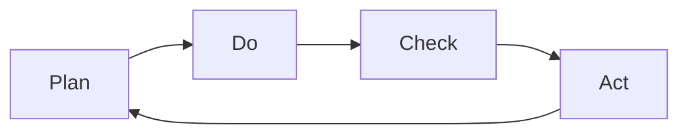

                 

# PDCA循环：从理论到实践的管理工具

> 关键词：PDCA循环，持续改进，质量管理，项目管理，人力资源管理，营销管理

> 摘要：本文从PDCA循环的理论基础入手，详细介绍了PDCA循环的起源与发展、核心概念、应用范围、实践操作以及常见问题与解决方法。通过实际案例分析和高级应用探讨，深入阐述了PDCA循环在企业管理中的重要性。文章最后提供了相关工具介绍和案例分析资料，为读者提供了全面的学习和实践指南。

## 第1章：PDCA循环的起源与发展

### 1.1 PDCA循环的起源

PDCA循环，又称戴明循环，是由美国质量管理专家爱德华·戴明（W. Edwards Deming）在20世纪中期提出的。戴明认为，质量是一个持续改进的过程，而PDCA循环则是实现这一目标的关键工具。PDCA循环旨在通过计划、执行、检查和处理四个阶段，系统地解决问题，不断改进工作流程。

### 1.2 PDCA循环的发展历程

PDCA循环最初应用于质量管理领域，帮助企业在生产过程中识别和解决质量问题。随着质量管理理念的普及，PDCA循环逐渐扩展到项目管理、人力资源管理、营销管理等多个领域。在不同领域，PDCA循环不断得到发展和完善。

### 1.3 PDCA循环在现代管理中的应用

在现代企业管理中，PDCA循环被广泛应用于以下领域：

- **产品质量管理**：PDCA循环通过不断改进质量管理体系，提高产品和服务质量。
- **项目管理**：PDCA循环帮助项目团队有效管理项目进度、成本和质量。
- **人力资源管理**：PDCA循环用于员工培训、绩效评估和团队建设等方面。
- **营销管理**：PDCA循环帮助企业在市场调研、产品开发和营销策略调整等方面进行持续改进。

## 第2章：PDCA循环的核心概念

### 2.1 PDCA循环的基本原理

PDCA循环由四个阶段组成，分别是计划（Plan）、执行（Do）、检查（Check）和处理（Act）。每个阶段都有其特定的目标和任务，形成一个闭环循环，不断推动管理水平的提升。

### 2.2 PDCA循环的四个阶段

#### 2.2.1 计划（Plan）

在计划阶段，首先要明确目标和制定计划。具体步骤包括：

1. **确定目标**：明确要解决的问题或要达成的目标。
2. **分析现状**：了解当前工作或问题的现状。
3. **找出问题**：分析现状，找出存在的问题。
4. **制定计划**：根据目标和问题，制定具体的实施计划。

#### 2.2.2 执行（Do）

在执行阶段，按照计划进行实施。具体步骤包括：

1. **执行计划**：按照计划执行，确保各项工作按部就班。
2. **沟通与协作**：在执行过程中，保持团队间的沟通与协作，确保任务顺利完成。

#### 2.2.3 检查（Check）

在检查阶段，对执行过程进行监控和评估。具体步骤包括：

1. **检查效果**：对实施效果进行评估，判断计划是否达到预期目标。
2. **数据收集**：收集相关数据，为后续分析提供依据。

#### 2.2.4 处理（Act）

在处理阶段，总结经验，制定改进措施。具体步骤包括：

1. **总结经验**：对实施过程进行总结，找出成功经验和不足之处。
2. **制定改进措施**：根据检查结果，制定具体的改进措施，为下一轮PDCA循环做好准备。

### 2.3 PDCA循环与其他管理方法的对比

- **与PDCA循环相比，其他管理方法的特点**：

  - **精益管理**：注重消除浪费，提高效率。

  - **六西格玛**：通过统计方法，降低过程变异，提高产品和服务质量。

  - **目标管理**：通过明确目标，激发员工的积极性和创造力。

- **PDCA循环与其他管理方法的联系**：

  - **PDCA循环**可以与其他管理方法结合，形成更加完善的管理体系。

## 第3章：PDCA循环的应用范围

### 3.1 产品质量管理中的应用

- **PDCA循环在产品质量管理中的作用**：

  - **持续改进**：PDCA循环帮助企业不断改进质量管理体系，提高产品质量。

  - **问题解决**：PDCA循环帮助企业在质量管理的各个环节中识别和解决质量问题。

### 3.2 项目管理中的应用

- **PDCA循环在项目管理中的作用**：

  - **项目规划**：PDCA循环帮助项目团队明确项目目标，制定详细的计划。

  - **项目执行**：PDCA循环帮助项目团队按计划执行，确保项目进度和质量。

  - **项目监控**：PDCA循环通过检查和反馈，确保项目目标的实现。

### 3.3 人力资源管理中的应用

- **PDCA循环在人力资源管理中的作用**：

  - **员工培训**：PDCA循环帮助企业提高员工的技能和素质。

  - **绩效评估**：PDCA循环帮助企业管理层对员工进行有效的绩效评估。

### 3.4 营销管理中的应用

- **PDCA循环在营销管理中的作用**：

  - **市场调研**：PDCA循环帮助企业了解市场需求，调整营销策略。

  - **广告宣传**：PDCA循环帮助企业制定有效的广告宣传策略，提高品牌知名度。

## 第4章：PDCA循环的实施流程

### 4.1 确定目标和计划

在PDCA循环的实施过程中，确定目标和计划是至关重要的一步。具体步骤包括：

1. **明确目标**：明确要解决的问题或要达成的目标。
2. **分析现状**：了解当前工作或问题的现状。
3. **找出问题**：分析现状，找出存在的问题。
4. **制定计划**：根据目标和问题，制定具体的实施计划。

### 4.2 实施计划

在实施计划阶段，按照制定好的计划进行实施。具体步骤包括：

1. **执行计划**：按照计划执行，确保各项工作按部就班。
2. **沟通与协作**：在执行过程中，保持团队间的沟通与协作，确保任务顺利完成。

### 4.3 检查效果

在检查效果阶段，对实施效果进行评估和监控。具体步骤包括：

1. **检查效果**：对实施效果进行评估，判断计划是否达到预期目标。
2. **数据收集**：收集相关数据，为后续分析提供依据。

### 4.4 总结经验和反馈

在总结经验和反馈阶段，对实施过程进行总结和反思，为下一轮PDCA循环做好准备。具体步骤包括：

1. **总结经验**：对实施过程进行总结，找出成功经验和不足之处。
2. **制定改进措施**：根据检查结果，制定具体的改进措施，为下一轮PDCA循环做好准备。

## 第5章：PDCA循环的常见问题与解决

### 5.1 PDCA循环实施中的常见问题

在实施PDCA循环的过程中，可能会遇到以下问题：

1. **计划不明确或不具体**：导致实施过程中出现偏差，无法达到预期目标。
2. **执行不力或沟通不畅**：影响工作进度和质量。
3. **检查效果不彻底或反馈不及时**：导致问题不能及时解决，影响下一轮PDCA循环的开展。
4. **改进措施不具体或不落实**：改进措施无法落实，导致问题反复出现。

### 5.2 解决PDCA循环实施中的问题

针对上述问题，可以采取以下解决方法：

1. **明确目标和计划**：确保计划的具体性和可操作性。
2. **加强执行力度，提高沟通与协作效率**：确保各项工作按计划进行。
3. **完善检查和反馈机制**：确保问题得到及时解决。
4. **制定具体的改进措施，并确保落实**：确保改进措施能够真正落实，防止问题反复出现。

## 第6章：PDCA循环的实际案例分析

### 6.1 案例一：某企业的产品质量改进

#### 案例背景

某企业的产品质量不稳定，客户投诉率较高。为了提高产品质量，企业决定采用PDCA循环进行改进。

#### 实施过程

1. **计划阶段**：确定目标为提高产品质量，降低客户投诉率。分析现状，找出问题所在，制定具体的实施计划。
2. **执行阶段**：按照计划执行，加强质量管理，改进生产流程，提高员工素质。
3. **检查阶段**：对执行效果进行评估，收集客户反馈，检查产品质量是否符合标准。
4. **处理阶段**：总结经验，制定改进措施，如优化生产流程、加强员工培训等。

#### 实施效果

通过PDCA循环的实施，企业产品质量得到显著提高，客户投诉率下降，企业信誉和市场份额逐步提升。

### 6.2 案例二：某项目的进度管理

#### 案例背景

某项目进度严重滞后，项目团队面临压力。为了确保项目按期完成，项目团队决定采用PDCA循环进行进度管理。

#### 实施过程

1. **计划阶段**：明确项目目标，制定详细的进度计划，包括任务分配、时间安排等。
2. **执行阶段**：按照进度计划执行，确保各项工作按部就班。
3. **检查阶段**：对项目进度进行监控和评估，检查是否达到预期目标。
4. **处理阶段**：总结经验，制定改进措施，如优化工作流程、加强团队协作等。

#### 实施效果

通过PDCA循环的实施，项目进度得到有效控制，项目按期完成，项目团队的工作效率和团队凝聚力得到提升。

### 6.3 案例三：某公司的市场营销策略调整

#### 案例背景

某公司市场营销策略不当，业绩下滑。为了提高业绩，公司决定采用PDCA循环进行市场营销策略调整。

#### 实施过程

1. **计划阶段**：分析市场需求，了解竞争对手，制定新的市场营销策略。
2. **执行阶段**：按照新策略执行，进行市场调研、广告宣传和客户服务等工作。
3. **检查阶段**：对市场营销策略的实施效果进行评估，收集市场反馈。
4. **处理阶段**：总结经验，制定改进措施，如优化广告宣传策略、提高客户服务质量等。

#### 实施效果

通过PDCA循环的实施，公司市场营销策略得到优化，业绩逐步回升，市场份额得到提升。

## 第7章：PDCA循环在持续改进中的应用

### 7.1 持续改进的概念

持续改进是一种追求卓越的管理理念，通过不断改进工作流程、提高效率和质量，实现组织的持续发展。持续改进的核心在于不断识别问题、分析原因、制定改进措施并落实执行。

### 7.2 持续改进与PDCA循环的关系

PDCA循环是持续改进的一种具体方法和工具，通过PDCA循环，组织可以系统地开展持续改进工作。PDCA循环的四个阶段（计划、执行、检查、处理）为持续改进提供了清晰的框架和步骤，使组织能够有序地推进改进工作。

### 7.3 持续改进的具体实施方法

1. **制定改进计划**：明确要解决的问题或要达成的目标，制定具体的改进方案和实施计划。
2. **实施改进方案**：按照改进计划执行，确保各项工作按部就班。
3. **监控改进效果**：对改进过程进行监控，评估改进效果，确保改进措施达到预期目标。
4. **总结改进经验**：对改进过程进行总结，找出成功经验和不足之处，为下一轮改进提供参考。

## 第8章：PDCA循环与质量管理体系的结合

### 8.1 质量管理体系的基本概念

质量管理体系是一个组织内部建立的一套系统化的管理方法，用于确保产品和服务质量满足客户要求。质量管理体系包括质量方针、质量目标、质量控制和质量改进等内容。

### 8.2 PDCA循环在质量管理体系中的应用

PDCA循环在质量管理体系中起到关键作用，通过PDCA循环，组织可以系统地开展质量管理活动，不断改进质量管理水平。PDCA循环的四个阶段（计划、执行、检查、处理）与质量管理体系的各个要素相结合，有助于组织实现持续改进。

### 8.3 质量管理体系的实施与改进

1. **制定质量手册**：明确组织的质量方针、目标和管理程序。
2. **培训员工**：对员工进行质量管理培训，提高员工的质量意识和能力。
3. **实施质量控制**：对产品和服务进行质量检测和监控，确保质量符合要求。
4. **持续改进**：通过PDCA循环，不断改进质量管理体系的各个环节，提高质量管理水平。

## 第9章：PDCA循环在其他管理领域的应用探索

### 9.1 财务管理中的应用

PDCA循环在财务管理中可以用于预算管理、成本控制和财务分析等方面。通过PDCA循环，组织可以系统地开展财务管理活动，提高财务管理的效率和质量。

### 9.2 供应链管理中的应用

PDCA循环在供应链管理中可以用于供应商管理、库存控制和物流优化等方面。通过PDCA循环，组织可以优化供应链管理流程，提高供应链的效率和响应速度。

### 9.3 创新管理中的应用

PDCA循环在创新管理中可以用于新产品开发、技术创新和市场推广等方面。通过PDCA循环，组织可以系统地开展创新活动，提高创新能力和市场竞争力。

## 附录A：PDCA循环相关工具介绍

### A.1 PDCA循环管理软件

PDCA循环管理软件可以帮助组织制定、执行和监控PDCA循环的各个环节，提高管理效率。常见的PDCA循环管理软件包括：

- **Trello**：一款可视化项目管理工具，可以用于制定和跟踪PDCA循环的各个环节。
- **Asana**：一款任务管理工具，可以帮助团队协作，确保PDCA循环的顺利执行。

### A.2 PDCA循环相关表格模板

PDCA循环相关表格模板可以帮助组织更好地记录和跟踪PDCA循环的各个环节。常见的PDCA循环表格模板包括：

- **PDCA循环计划表**：用于制定PDCA循环的计划，明确目标和任务。
- **PDCA循环执行表**：用于记录PDCA循环的执行过程，监控任务进度。
- **PDCA循环检查表**：用于对PDCA循环的实施效果进行评估和检查。

### A.3 PDCA循环学习资源推荐

为了更好地理解和应用PDCA循环，读者可以参考以下学习资源：

- **书籍**：《PDCA循环实战手册》、《质量管理方法与应用》等。
- **在线课程**：在各大在线教育平台上搜索PDCA循环相关课程。
- **论坛和社区**：参与质量管理、项目管理等论坛和社区，与其他专业人士交流心得。

## 附录B：PDCA循环常用术语解释

### B.1 PDCA循环中的常用术语

- **PDCA循环**：计划（Plan）、执行（Do）、检查（Check）、处理（Act）四个阶段的循环过程。
- **质量管理**：确保产品和服务质量满足客户要求的一系列管理活动。
- **持续改进**：通过不断识别问题、分析原因、制定改进措施并落实执行，提高工作流程、效率和产品质量。

### B.2 术语详细解释

- **PDCA循环**：

  - **计划（Plan）**：确定目标和制定计划，明确要解决的问题和任务。

  - **执行（Do）**：按照计划执行，确保各项工作按部就班。

  - **检查（Check）**：对执行过程进行监控和评估，检查计划是否达到预期目标。

  - **处理（Act）**：总结经验，制定改进措施，为下一轮PDCA循环做好准备。

- **质量管理**：

  - **质量方针**：组织对质量管理的承诺和声明。

  - **质量目标**：组织为实现质量方针制定的具体目标。

  - **质量控制**：对产品和服务进行检测和监控，确保其质量符合要求。

  - **质量改进**：通过持续改进，提高产品和服务质量。

- **持续改进**：

  - **持续改进的理念**：追求卓越，不断优化工作流程。

  - **持续改进的方法**：通过PDCA循环等工具，实现持续改进。

  - **持续改进的益处**：提高效率，降低成本，提高客户满意度。

## 附录C：PDCA循环案例分析资料

### C.1 案例一：某企业的产品质量改进详细资料

#### 案例背景

某企业的产品质量不稳定，客户投诉率较高。为了提高产品质量，企业决定采用PDCA循环进行改进。

#### 实施过程

1. **计划阶段**：

   - **确定目标**：提高产品质量，降低客户投诉率。
   - **分析现状**：了解当前产品质量情况，收集客户投诉数据。
   - **找出问题**：分析投诉原因，找出产品质量问题的根源。
   - **制定计划**：制定详细的改进计划，包括优化生产流程、加强员工培训等。

2. **执行阶段**：

   - **执行计划**：按照改进计划执行，加强质量管理，改进生产流程，提高员工素质。
   - **沟通与协作**：在执行过程中，保持团队间的沟通与协作，确保任务顺利完成。

3. **检查阶段**：

   - **检查效果**：对改进效果进行评估，检查产品质量是否符合标准。
   - **数据收集**：收集客户反馈数据，分析改进效果。

4. **处理阶段**：

   - **总结经验**：对改进过程进行总结，找出成功经验和不足之处。
   - **制定改进措施**：根据检查结果，制定具体的改进措施，如优化生产设备、加强员工培训等。

#### 实施效果

通过PDCA循环的实施，企业产品质量得到显著提高，客户投诉率下降，企业信誉和市场份额逐步提升。

### C.2 案例二：某项目的进度管理详细资料

#### 案例背景

某项目进度严重滞后，项目团队面临压力。为了确保项目按期完成，项目团队决定采用PDCA循环进行进度管理。

#### 实施过程

1. **计划阶段**：

   - **确定目标**：确保项目按期完成，提高项目质量。
   - **分析现状**：了解当前项目进度情况，分析进度滞后原因。
   - **找出问题**：分析项目进度滞后原因，找出影响项目进度的主要因素。
   - **制定计划**：制定详细的进度计划，包括任务分配、时间安排等。

2. **执行阶段**：

   - **执行计划**：按照进度计划执行，确保各项工作按部就班。
   - **沟通与协作**：在执行过程中，保持团队间的沟通与协作，确保任务顺利完成。

3. **检查阶段**：

   - **检查效果**：对项目进度进行监控和评估，检查是否达到预期目标。
   - **数据收集**：收集项目进度数据，分析进度是否按计划进行。

4. **处理阶段**：

   - **总结经验**：对项目进度管理过程进行总结，找出成功经验和不足之处。
   - **制定改进措施**：根据检查结果，制定具体的改进措施，如优化工作流程、加强团队协作等。

#### 实施效果

通过PDCA循环的实施，项目进度得到有效控制，项目按期完成，项目团队的工作效率和团队凝聚力得到提升。

### C.3 案例三：某公司的市场营销策略调整详细资料

#### 案例背景

某公司市场营销策略不当，业绩下滑。为了提高业绩，公司决定采用PDCA循环进行市场营销策略调整。

#### 实施过程

1. **计划阶段**：

   - **确定目标**：提高公司业绩，提升市场竞争力。
   - **分析现状**：了解当前市场营销策略的效果，分析市场环境和竞争对手情况。
   - **找出问题**：分析当前市场营销策略存在的问题，找出影响业绩的主要因素。
   - **制定计划**：制定新的市场营销策略，包括市场调研、广告宣传、客户服务等。

2. **执行阶段**：

   - **执行计划**：按照新的市场营销策略执行，进行市场调研、广告宣传和客户服务等工作。
   - **沟通与协作**：在执行过程中，保持团队间的沟通与协作，确保任务顺利完成。

3. **检查阶段**：

   - **检查效果**：对市场营销策略的实施效果进行评估，检查是否达到预期目标。
   - **数据收集**：收集市场反馈数据，分析市场营销策略的效果。

4. **处理阶段**：

   - **总结经验**：对市场营销策略调整过程进行总结，找出成功经验和不足之处。
   - **制定改进措施**：根据检查结果，制定具体的改进措施，如优化广告宣传策略、提高客户服务质量等。

#### 实施效果

通过PDCA循环的实施，公司市场营销策略得到优化，业绩逐步回升，市场份额得到提升。

## 参考文献

1. 戴明，W. Edwards. **Out of the Crisis**. Massachusetts: MIT Press, 1986.
2. Juran, Joseph M. **Juran on Leadership for Quality: An Executive Handbook**. New York: The Free Press, 1990.
3. Crosby, Phil. **Quality is Free**. New York: McGraw-Hill, 1979.
4. ISO. **ISO 9001:2015 Quality Management Systems – Requirements**. Geneva: International Organization for Standardization, 2015.
5. PMI. **A Guide to the Project Management Body of Knowledge (PMBOK® Guide) – Sixth Edition**. Pennsylvania: Project Management Institute, 2017.

## 结语

PDCA循环作为一种有效的管理工具，已经在各行各业中得到了广泛应用。通过本文的介绍，相信读者对PDCA循环的理论基础、核心概念、应用范围和实践操作有了更深入的了解。在实际工作中，读者可以根据自身需求，灵活运用PDCA循环，实现持续改进，提升管理水平和竞争力。作者：AI天才研究院/AI Genius Institute & 禅与计算机程序设计艺术/Zen And The Art of Computer Programming。期待与读者在评论区交流心得，共同探讨PDCA循环在企业管理和个人成长中的应用。|user|>## PDCA循环的核心概念与联系

PDCA循环，即计划（Plan）、执行（Do）、检查（Check）、处理（Act）循环，是质量管理和其他管理活动中广泛应用的一种方法论。PDCA循环的核心概念在于通过连续的四个阶段，不断地计划、执行、检查和改进，从而达到持续改进和优化的目的。

### PDCA循环的基本原理

PDCA循环的基本原理可以概括为以下几点：

1. **计划（Plan）**：确定目标和计划，分析现状，找出问题，制定具体的解决方案和行动计划。
2. **执行（Do）**：按照计划执行，实施行动方案，确保各项工作按照预定步骤进行。
3. **检查（Check）**：对执行过程进行监控和评估，收集数据，分析结果，判断计划是否达到预期目标。
4. **处理（Act）**：总结经验，对成功经验进行标准化，对存在的问题进行改进，并将改进措施纳入下一个PDCA循环中。

### PDCA循环的四个阶段

1. **计划（Plan）**
   - **确定目标和计划**：明确要解决的问题或目标，制定具体的实施计划。
   - **分析现状**：了解当前工作或问题的现状，找出存在的问题。
   - **找出问题**：分析现状，识别问题，确定优先级。
   - **制定计划**：根据目标和问题，制定详细的行动计划。

2. **执行（Do）**
   - **执行计划**：按照计划执行，确保各项工作按部就班。
   - **沟通与协作**：保持团队间的沟通与协作，确保任务顺利完成。

3. **检查（Check）**
   - **检查效果**：对实施效果进行评估，检查计划是否达到预期目标。
   - **数据收集**：收集相关数据，为后续分析提供依据。

4. **处理（Act）**
   - **总结经验**：对实施过程进行总结，找出成功经验和不足之处。
   - **制定改进措施**：根据检查结果，制定具体的改进措施，为下一轮PDCA循环做好准备。

### PDCA循环与其他管理方法的联系

PDCA循环不仅应用于质量管理，还可以与其他管理方法结合，如六西格玛（Six Sigma）、目标管理（Management by Objectives, MBO）等，形成更加完善的管理体系。

- **六西格玛**：六西格玛强调通过统计方法降低过程变异，提高产品和服务质量。PDCA循环与六西格玛的结合，可以在计划阶段制定更科学的目标，在执行阶段实施严格的控制，在检查阶段进行统计分析和评估，在处理阶段进行改进和标准化。
- **目标管理**：目标管理强调通过明确的目标激发员工的积极性和创造力。PDCA循环与目标管理的结合，可以在计划阶段明确目标，在执行阶段按照目标执行，在检查阶段评估目标的达成情况，在处理阶段对未达成的目标进行改进。

### PDCA循环的应用范围

PDCA循环的应用范围非常广泛，包括但不限于以下领域：

- **产品质量管理**：通过PDCA循环，企业可以不断改进质量管理体系，提高产品和服务质量。
- **项目管理**：PDCA循环可以帮助项目团队有效管理项目进度、成本和质量。
- **人力资源管理**：PDCA循环可以应用于员工培训、绩效评估和团队建设等方面。
- **营销管理**：PDCA循环可以帮助企业在市场调研、产品开发和营销策略调整等方面进行持续改进。

### 总结

PDCA循环是一种系统化的管理工具，通过不断循环和优化，帮助企业实现持续改进和优化。理解PDCA循环的核心概念和联系，能够帮助企业在各个领域实现高效管理。

### Mermaid流程图

以下是一个简单的Mermaid流程图，展示了PDCA循环的四个阶段：



在这个流程图中，A表示计划阶段，B表示执行阶段，C表示检查阶段，D表示处理阶段。每个阶段都与其他阶段相连，形成一个闭环，表示PDCA循环的不断迭代和优化过程。

### 伪代码示例

为了更具体地阐述PDCA循环的原理，以下是一个简单的伪代码示例：

```plaintext
// PDCA循环
function PDCA循环(目标, 问题):
    // 计划阶段
    计划 = 制定计划(目标, 问题)
    执行计划(计划)

    // 检查阶段
    检查结果 = 检查效果(计划执行结果)

    // 处理阶段
    if 检查结果 satisfactory:
        总结经验(计划执行经验)
    else:
        诊断问题
        改进措施 = 制定改进计划(问题)
        执行改进措施(改进计划)

    // 返回结果
    返回 总结经验和改进措施
```

在这个伪代码中，`PDCA循环`函数接受目标和工作问题作为输入，通过四个阶段（计划、执行、检查、处理）来实现持续改进。如果检查结果满意，则总结经验；否则，诊断问题并制定改进计划。

### 数学模型和公式

在PDCA循环中，有时需要使用数学模型和公式来支持分析和决策。以下是一个简单的数学模型示例：

```latex
$$
质量指标 = \frac{合格品数量}{总产量}
$$

$$
改进效果 = \frac{新质量指标 - 原质量指标}{原质量指标}
$$
```

在这个模型中，`质量指标`反映了产品合格率，`改进效果`则表示通过PDCA循环改进后质量指标的提升程度。

通过上述内容和示例，我们可以更清晰地理解PDCA循环的核心概念和它在各个领域的应用。在实际工作中，读者可以根据这些概念和工具，结合自身实际情况，灵活运用PDCA循环，实现持续改进和优化。|user|>## PDCA循环在项目管理中的应用

在项目管理中，PDCA循环是一种非常有用的管理工具，它可以帮助项目团队在项目生命周期内不断改进和优化项目管理流程，确保项目按时、按质、按预算完成。以下将详细探讨PDCA循环在项目管理中的应用，包括项目规划、项目执行、项目监控和项目收尾等阶段。

### 项目规划

在项目规划阶段，PDCA循环的第一个阶段——计划（Plan），是至关重要的。在这个阶段，项目团队需要明确项目的目标和范围，制定详细的计划，为项目成功奠定基础。

1. **确定目标和范围**：明确项目要实现的目标，包括项目的交付物、时间和资源要求等。
2. **分析现状**：了解当前项目的环境和条件，包括资源、风险和潜在问题等。
3. **找出问题**：分析现状，识别项目可能面临的挑战和问题。
4. **制定计划**：根据目标和问题，制定项目详细计划，包括任务分解、时间表、资源分配和预算等。

**伪代码示例**：

```plaintext
// 项目规划阶段
function 项目规划(目标, 范围, 现状, 问题):
    目标 = 确定目标(项目交付物，时间，资源要求)
    范围 = 确定范围(项目任务和限制条件)
    现状 = 分析现状(项目环境，资源，风险)
    问题 = 找出问题(识别潜在挑战和问题)
    项目计划 = 制定计划(目标，范围，现状，问题)
    返回 项目计划
```

### 项目执行

在项目执行阶段，PDCA循环的第二个阶段——执行（Do），是关键的一步。在这个阶段，项目团队需要按照计划执行项目任务，确保项目按部就班地进行。

1. **执行计划**：按照项目计划执行任务，确保各项工作顺利进行。
2. **沟通与协作**：在执行过程中，保持团队间的沟通与协作，确保任务顺利完成。
3. **监控进度**：对项目进度进行实时监控，确保项目按计划进行。

**伪代码示例**：

```plaintext
// 项目执行阶段
function 项目执行(项目计划):
    项目进度 = 执行计划(项目计划)
    实时监控(项目进度)
    沟通与协作(项目团队)
    返回 项目进度
```

### 项目监控

在项目监控阶段，PDCA循环的第三个阶段——检查（Check），是关键的一步。在这个阶段，项目团队需要对项目执行情况进行检查，确保项目进度、质量和成本控制在计划范围内。

1. **检查效果**：对项目执行效果进行评估，判断项目是否达到预期目标。
2. **数据收集**：收集项目执行过程中的数据，包括进度、质量和成本数据等。
3. **分析结果**：对收集的数据进行分析，找出项目执行过程中的问题和偏差。

**伪代码示例**：

```plaintext
// 项目监控阶段
function 项目监控(项目进度，项目数据):
    检查效果 = 评估项目进度，质量和成本
    数据收集 = 收集项目执行数据
    分析结果 = 分析项目执行结果
    返回 分析结果
```

### 项目收尾

在项目收尾阶段，PDCA循环的第四个阶段——处理（Act），是最后一环。在这个阶段，项目团队需要对项目执行过程进行总结，对成功经验和不足之处进行总结，并将改进措施纳入未来的项目管理中。

1. **总结经验**：对项目执行过程进行总结，找出成功经验和不足之处。
2. **制定改进措施**：根据总结的经验和问题，制定改进措施，为未来的项目管理提供参考。
3. **执行改进措施**：实施改进措施，确保改进能够得到有效落实。

**伪代码示例**：

```plaintext
// 项目收尾阶段
function 项目收尾(项目总结，改进措施):
    总结经验 = 对项目执行过程进行总结
    改进措施 = 制定改进计划
    执行改进措施 = 实施改进计划
    返回 改进措施
```

### PDCA循环在项目管理中的优势

- **系统性**：PDCA循环提供了一套系统化的方法，可以帮助项目团队在项目生命周期内不断进行计划、执行、检查和改进。
- **灵活性**：PDCA循环可以根据项目的具体情况灵活调整，适应不同的项目环境和需求。
- **持续改进**：PDCA循环强调持续改进，通过不断地循环和优化，可以提高项目管理水平和项目成功率。

### 实际案例分析

#### 案例一：某软件开发项目

某软件开发公司计划开发一款企业级管理软件，项目团队决定采用PDCA循环进行项目管理。以下是项目团队在PDCA循环各个阶段的具体做法：

1. **计划阶段**：明确项目目标，制定详细的项目计划，包括任务分解、时间表、资源分配和预算等。
2. **执行阶段**：按照项目计划执行，确保各项工作按部就班地进行。
3. **监控阶段**：对项目进度、质量和成本进行实时监控，确保项目按计划进行。
4. **收尾阶段**：对项目执行过程进行总结，找出成功经验和不足之处，制定改进措施，为未来的项目管理提供参考。

通过PDCA循环的应用，项目团队成功地按时、按质、按预算完成了项目，客户满意度大幅提升。

#### 案例二：某建筑项目

某建筑公司承接了一项大型建筑项目，项目周期较长，涉及众多部门和供应商。项目团队决定采用PDCA循环进行项目管理。以下是项目团队在PDCA循环各个阶段的具体做法：

1. **计划阶段**：明确项目目标，制定详细的项目计划，包括施工进度、资源分配和风险管理等。
2. **执行阶段**：按照项目计划执行，确保各项工作顺利进行。
3. **监控阶段**：对项目进度、质量和成本进行实时监控，确保项目按计划进行。
4. **收尾阶段**：对项目执行过程进行总结，找出成功经验和不足之处，制定改进措施，为未来的项目管理提供参考。

通过PDCA循环的应用，项目团队成功地克服了各种困难，按时完成了项目，建筑质量和客户满意度得到了保障。

### 总结

PDCA循环在项目管理中具有重要的作用，它通过系统化的计划、执行、检查和改进，帮助项目团队实现项目的成功。在实际应用中，项目团队可以根据项目的具体情况，灵活运用PDCA循环，不断提高项目管理水平和项目成功率。|user|>## PDCA循环在人力资源管理中的应用

在人力资源管理中，PDCA循环作为一种系统化的管理工具，同样发挥着重要的作用。它可以帮助企业有效管理员工培训、绩效评估、团队建设和员工激励等方面，从而提高员工的工作效率和企业竞争力。以下将详细探讨PDCA循环在人力资源管理中的应用。

### 员工培训

在员工培训阶段，PDCA循环的第一个阶段——计划（Plan），是至关重要的。企业需要明确培训的目标和需求，制定详细的培训计划。

1. **确定目标和需求**：明确培训的目标，如提高员工技能、增强团队协作能力等，并分析员工培训的需求。
2. **分析现状**：了解员工的现有技能和知识水平，以及培训环境。
3. **找出问题**：分析现状，识别员工在技能和知识方面的不足，以及培训过程中的问题。
4. **制定计划**：根据目标和问题，制定具体的培训计划，包括培训内容、时间安排、培训资源等。

**伪代码示例**：

```plaintext
// 培训规划阶段
function 培训规划(培训目标, 培训需求, 现状, 问题):
    培训目标 = 确定培训目标(如提高员工技能，增强团队协作能力)
    培训需求 = 分析培训需求(如现有技能和知识水平，培训环境)
    现状 = 分析现状(如员工技能和知识水平，培训环境)
    问题 = 找出问题(如员工技能不足，培训资源不足)
    培训计划 = 制定计划(培训目标，培训需求，现状，问题)
    返回 培训计划
```

### 培训执行

在培训执行阶段，PDCA循环的第二个阶段——执行（Do），是关键的一步。在这个阶段，企业需要按照培训计划执行培训，确保培训目标的实现。

1. **执行培训计划**：按照培训计划进行培训，确保培训内容、时间安排和培训资源的落实。
2. **沟通与协作**：在培训过程中，保持团队间的沟通与协作，确保培训顺利进行。
3. **监控进度**：对培训进度进行实时监控，确保培训按计划进行。

**伪代码示例**：

```plaintext
// 培训执行阶段
function 培训执行(培训计划):
    培训进度 = 执行培训计划(培训计划)
    实时监控(培训进度)
    沟通与协作(培训团队)
    返回 培训进度
```

### 培训检查

在培训检查阶段，PDCA循环的第三个阶段——检查（Check），是关键的一步。在这个阶段，企业需要对培训效果进行评估，确保培训目标的实现。

1. **检查效果**：对培训效果进行评估，包括员工技能的提升、团队协作能力的增强等。
2. **数据收集**：收集培训过程中的数据，包括员工反馈、培训效果评估等。
3. **分析结果**：对收集的数据进行分析，找出培训过程中的问题和不足。

**伪代码示例**：

```plaintext
// 培训检查阶段
function 培训检查(培训进度，培训数据):
    检查效果 = 评估培训效果(培训进度，培训数据)
    数据收集 = 收集培训数据(员工反馈，培训效果评估)
    分析结果 = 分析培训结果(检查效果，数据收集)
    返回 分析结果
```

### 培训处理

在培训处理阶段，PDCA循环的第四个阶段——处理（Act），是最后一环。在这个阶段，企业需要对培训过程进行总结，制定改进措施，为未来的培训提供参考。

1. **总结经验**：对培训过程进行总结，找出成功经验和不足之处。
2. **制定改进措施**：根据总结的经验和问题，制定改进措施，如调整培训内容、改进培训方式等。
3. **执行改进措施**：实施改进措施，确保改进能够得到有效落实。

**伪代码示例**：

```plaintext
// 培训收尾阶段
function 培训收尾(培训总结，改进措施):
    总结经验 = 对培训过程进行总结
    改进措施 = 制定改进计划
    执行改进措施 = 实施改进计划
    返回 改进措施
```

### PDCA循环在人力资源管理中的优势

- **系统性**：PDCA循环提供了一套系统化的方法，可以帮助企业在人力资源管理中实现持续改进。
- **灵活性**：PDCA循环可以根据企业的具体情况灵活调整，适应不同的培训需求和问题。
- **持续改进**：PDCA循环强调持续改进，通过不断地循环和优化，可以提高企业的人力资源管理水平。

### 实际案例分析

#### 案例一：某公司的员工培训项目

某公司计划实施一项员工培训项目，以提高员工的技能和团队协作能力。公司决定采用PDCA循环进行项目管理。以下是项目团队在PDCA循环各个阶段的具体做法：

1. **计划阶段**：明确培训目标，分析员工培训需求，制定详细的培训计划。
2. **执行阶段**：按照培训计划进行培训，确保培训内容、时间安排和培训资源的落实。
3. **检查阶段**：对培训效果进行评估，收集员工反馈，分析培训结果。
4. **收尾阶段**：对培训过程进行总结，制定改进措施，为未来的培训提供参考。

通过PDCA循环的应用，公司成功地提高了员工技能和团队协作能力，员工满意度大幅提升。

#### 案例二：某公司的绩效评估体系

某公司决定改进现有的绩效评估体系，以提高员工的工作效率和满意度。公司决定采用PDCA循环进行管理体系改进。以下是项目团队在PDCA循环各个阶段的具体做法：

1. **计划阶段**：明确绩效评估的目标，分析现有评估体系的问题，制定改进计划。
2. **执行阶段**：按照改进计划执行，确保评估体系的落实。
3. **检查阶段**：对评估体系的效果进行评估，收集员工反馈，分析评估结果。
4. **收尾阶段**：对评估体系进行总结，制定改进措施，为未来的绩效评估提供参考。

通过PDCA循环的应用，公司成功地优化了绩效评估体系，提高了员工的积极性和工作效率。

### 总结

PDCA循环在人力资源管理中的应用，可以帮助企业实现员工培训、绩效评估、团队建设和员工激励等方面的持续改进。通过系统化的计划、执行、检查和改进，企业可以不断提高人力资源管理水平和员工满意度。在实际应用中，企业可以根据具体情况，灵活运用PDCA循环，实现人力资源管理的持续优化。|user|>## PDCA循环在营销管理中的应用

在营销管理中，PDCA循环同样发挥着重要的作用。它可以帮助企业通过计划、执行、检查和处理的循环过程，不断优化市场调研、产品开发和营销策略调整等环节，从而提高市场竞争力，实现销售目标的达成。以下将详细探讨PDCA循环在营销管理中的应用。

### 市场调研

在市场调研阶段，PDCA循环的第一个阶段——计划（Plan），是至关重要的。企业需要明确市场调研的目标和需求，制定详细的调研计划。

1. **确定目标和需求**：明确市场调研的目标，如了解市场需求、分析竞争对手等，并确定调研的具体需求和范围。
2. **分析现状**：了解当前市场的现状，包括市场趋势、竞争对手情况等。
3. **找出问题**：分析现状，识别市场可能面临的问题和挑战。
4. **制定计划**：根据目标和问题，制定详细的市场调研计划，包括调研方法、时间安排、调研工具等。

**伪代码示例**：

```plaintext
// 市场调研规划阶段
function 市场调研规划(调研目标, 调研需求, 现状, 问题):
    调研目标 = 确定调研目标(如了解市场需求，分析竞争对手)
    调研需求 = 分析调研需求(如市场趋势，竞争对手情况)
    现状 = 分析现状(如市场趋势，竞争对手情况)
    问题 = 找出问题(如市场需求变化，竞争对手策略)
    调研计划 = 制定计划(调研目标，调研需求，现状，问题)
    返回 调研计划
```

### 市场调研执行

在市场调研执行阶段，PDCA循环的第二个阶段——执行（Do），是关键的一步。在这个阶段，企业需要按照调研计划执行调研，收集市场数据。

1. **执行调研计划**：按照调研计划进行市场调研，包括数据收集、数据分析等。
2. **数据收集**：通过各种渠道收集市场数据，如问卷调查、访谈、市场分析报告等。
3. **数据分析**：对收集的数据进行分析，识别市场趋势、竞争对手策略等。

**伪代码示例**：

```plaintext
// 市场调研执行阶段
function 市场调研执行(调研计划):
    调研数据 = 收集市场数据(调研计划)
    数据分析 = 分析市场数据(调研数据)
    返回 数据分析结果
```

### 市场调研检查

在市场调研检查阶段，PDCA循环的第三个阶段——检查（Check），是关键的一步。在这个阶段，企业需要对市场调研结果进行检查，评估调研目标的实现情况。

1. **检查效果**：对市场调研结果进行评估，判断调研目标是否实现。
2. **数据验证**：验证市场调研数据的准确性和有效性。
3. **分析结果**：对调研结果进行分析，识别市场趋势、竞争对手策略等。

**伪代码示例**：

```plaintext
// 市场调研检查阶段
function 市场调研检查(调研数据，调研结果):
    检查效果 = 评估调研结果(调研数据，调研结果)
    数据验证 = 验证市场调研数据(调研数据)
    分析结果 = 分析市场调研结果(检查效果，数据验证)
    返回 分析结果
```

### 市场调研处理

在市场调研处理阶段，PDCA循环的第四个阶段——处理（Act），是最后一环。在这个阶段，企业需要对市场调研过程进行总结，制定改进措施，为未来的市场调研提供参考。

1. **总结经验**：对市场调研过程进行总结，找出成功经验和不足之处。
2. **制定改进措施**：根据总结的经验和问题，制定改进措施，如调整调研方法、改进数据分析工具等。
3. **执行改进措施**：实施改进措施，确保改进能够得到有效落实。

**伪代码示例**：

```plaintext
// 市场调研收尾阶段
function 市场调研收尾(调研总结，改进措施):
    总结经验 = 对市场调研过程进行总结
    改进措施 = 制定改进计划
    执行改进措施 = 实施改进计划
    返回 改进措施
```

### 产品开发

在产品开发阶段，PDCA循环同样发挥着重要作用。企业需要通过计划、执行、检查和处理的循环过程，不断优化产品设计、开发和测试。

1. **计划阶段**：明确产品开发的目标和需求，制定详细的产品开发计划。
2. **执行阶段**：按照产品开发计划执行，确保产品设计、开发和测试的顺利进行。
3. **检查阶段**：对产品开发结果进行检查，评估产品是否符合市场需求。
4. **处理阶段**：对产品开发过程进行总结，制定改进措施，为未来的产品开发提供参考。

### 营销策略调整

在营销策略调整阶段，PDCA循环同样适用。企业需要通过计划、执行、检查和处理的循环过程，不断优化营销策略，提高市场竞争力。

1. **计划阶段**：明确营销策略调整的目标和需求，制定详细的营销策略调整计划。
2. **执行阶段**：按照营销策略调整计划执行，实施新的营销策略。
3. **检查阶段**：对营销策略调整效果进行检查，评估新策略的效果。
4. **处理阶段**：对营销策略调整过程进行总结，制定改进措施，为未来的营销策略调整提供参考。

### PDCA循环在营销管理中的优势

- **系统性**：PDCA循环提供了一套系统化的方法，可以帮助企业在营销管理中实现持续改进。
- **灵活性**：PDCA循环可以根据企业的具体情况灵活调整，适应不同的市场环境和需求。
- **持续改进**：PDCA循环强调持续改进，通过不断地循环和优化，可以提高企业的营销管理水平和市场竞争力。

### 实际案例分析

#### 案例一：某公司的市场调研项目

某公司决定开展一项市场调研项目，以了解市场需求和竞争对手情况。公司决定采用PDCA循环进行项目管理。以下是项目团队在PDCA循环各个阶段的具体做法：

1. **计划阶段**：明确调研目标，分析市场需求，制定详细的调研计划。
2. **执行阶段**：按照调研计划执行，收集市场数据，进行数据分析。
3. **检查阶段**：对调研结果进行检查，评估调研目标的实现情况。
4. **收尾阶段**：对调研过程进行总结，制定改进措施，为未来的市场调研提供参考。

通过PDCA循环的应用，公司成功地了解了市场需求和竞争对手情况，为产品开发和营销策略调整提供了重要依据。

#### 案例二：某公司的产品开发项目

某公司决定开发一款新产品，以满足市场需求。公司决定采用PDCA循环进行项目管理。以下是项目团队在PDCA循环各个阶段的具体做法：

1. **计划阶段**：明确产品开发目标，制定详细的产品开发计划。
2. **执行阶段**：按照产品开发计划执行，进行产品设计、开发和测试。
3. **检查阶段**：对产品开发结果进行检查，评估产品是否符合市场需求。
4. **收尾阶段**：对产品开发过程进行总结，制定改进措施，为未来的产品开发提供参考。

通过PDCA循环的应用，公司成功地开发出符合市场需求的新产品，提高了市场竞争力。

### 总结

PDCA循环在营销管理中的应用，可以帮助企业通过持续改进，优化市场调研、产品开发和营销策略调整等环节，从而提高市场竞争力。在实际应用中，企业可以根据具体情况，灵活运用PDCA循环，实现营销管理的持续优化。|user|>## PDCA循环的实施流程

PDCA循环作为一种系统化的管理工具，其实施流程对于确保管理活动的高效和持续改进至关重要。以下将详细描述PDCA循环的各个阶段，包括如何制定目标和计划、如何执行计划、如何检查效果以及如何总结经验和反馈。

### 确定目标和计划

在PDCA循环的启动阶段，首先需要明确目标和制定计划。这一阶段的关键步骤包括：

1. **确定目标**：明确要解决的问题或要达成的目标。目标应该是具体、可衡量、可实现的、相关的和有时间限制的（SMART原则）。
   
   **伪代码示例**：

   ```plaintext
   // 确定目标
   function 确定目标(目标):
       目标 = SetSMART目标(具体，可衡量，可实现，相关，有时间限制)
       返回 目标
   ```

2. **分析现状**：了解当前的工作状态或问题背景，为制定有效的计划提供依据。

   **伪代码示例**：

   ```plaintext
   // 分析现状
   function 分析现状(现状):
       现状 = 收集当前数据(工作状态，问题背景)
       返回 现状
   ```

3. **找出问题**：通过分析现状，识别存在的问题和挑战。

   **伪代码示例**：

   ```plaintext
   // 找出问题
   function 找出问题(现状):
       问题 = 分析现状(找出存在的挑战)
       返回 问题
   ```

4. **制定计划**：根据目标和问题，制定详细的行动计划，包括具体任务、时间安排、资源需求等。

   **伪代码示例**：

   ```plaintext
   // 制定计划
   function 制定计划(目标，问题):
       计划 = 制定行动计划(任务，时间，资源)
       返回 计划
   ```

### 执行计划

在制定计划之后，进入执行阶段。这一阶段的重点是确保计划的顺利实施。关键步骤包括：

1. **执行计划**：按照行动计划执行任务，确保各项工作按部就班地进行。

   **伪代码示例**：

   ```plaintext
   // 执行计划
   function 执行计划(计划):
       执行结果 = 按计划执行(任务，时间，资源)
       返回 执行结果
   ```

2. **沟通与协作**：在执行过程中，保持团队间的沟通与协作，确保任务顺利完成。

   **伪代码示例**：

   ```plaintext
   // 沟通与协作
   function 沟通与协作(团队成员):
       沟通结果 = 保持沟通(任务进展，问题解决)
       返回 沟通结果
   ```

3. **监控进度**：对计划执行过程进行实时监控，确保各项工作按照计划进行。

   **伪代码示例**：

   ```plaintext
   // 监控进度
   function 监控进度(执行结果):
       进度监控 = 监控任务进度(是否按计划进行)
       返回 进度监控结果
   ```

### 检查效果

在计划执行完毕后，进入检查效果阶段。这一阶段的重点是评估计划执行的结果，判断目标是否达成。

1. **检查效果**：对计划执行结果进行评估，检查是否达到预期目标。

   **伪代码示例**：

   ```plaintext
   // 检查效果
   function 检查效果(执行结果，目标):
       检查结果 = 评估执行结果(是否达到目标)
       返回 检查结果
   ```

2. **数据收集**：收集执行过程中的数据，包括关键绩效指标（KPIs）和用户反馈等。

   **伪代码示例**：

   ```plaintext
   // 数据收集
   function 数据收集(执行结果):
       数据 = 收集关键数据(如KPIs，用户反馈)
       返回 数据
   ```

3. **分析结果**：对收集的数据进行分析，识别成功经验和不足之处。

   **伪代码示例**：

   ```plaintext
   // 分析结果
   function 分析结果(检查结果，数据):
       分析报告 = 分析数据(成功经验，不足之处)
       返回 分析报告
   ```

### 总结经验和反馈

在检查效果阶段结束后，进入总结经验和反馈阶段。这一阶段的重点是总结经验教训，制定改进措施，并为下一个PDCA循环做好准备。

1. **总结经验**：对整个PDCA循环过程进行总结，找出成功经验和不足之处。

   **伪代码示例**：

   ```plaintext
   // 总结经验
   function 总结经验(分析报告):
       经验总结 = 总结成功经验，不足之处
       返回 经验总结
   ```

2. **制定改进措施**：根据总结的经验和问题，制定具体的改进措施，为下一轮PDCA循环做好准备。

   **伪代码示例**：

   ```plaintext
   // 制定改进措施
   function 制定改进措施(经验总结):
       改进措施 = 制定改进计划(措施，实施步骤)
       返回 改进措施
   ```

3. **反馈机制**：建立有效的反馈机制，将总结和改进措施反馈给相关人员和部门，确保改进措施得到有效落实。

   **伪代码示例**：

   ```plaintext
   // 反馈机制
   function 反馈机制(改进措施):
       反馈结果 = 实施反馈(改进措施，相关人员)
       返回 反馈结果
   ```

### 实施流程总结

通过以上描述，可以看出PDCA循环的实施流程是一个系统化的、循环的过程。每个阶段都有明确的任务和目标，通过计划、执行、检查和处理，不断推动管理活动的优化和改进。

- **计划阶段**：确定目标和制定计划。
- **执行阶段**：按照计划执行，确保各项工作按部就班。
- **检查阶段**：对执行效果进行评估，确保目标达成。
- **处理阶段**：总结经验，制定改进措施，为下一轮PDCA循环做好准备。

在实际应用中，企业可以根据自身需求和实际情况，灵活调整PDCA循环的各个阶段和步骤，确保管理活动的高效和持续改进。通过不断循环和优化，企业可以不断提升管理水平和竞争力。|user|>## PDCA循环的常见问题与解决方法

在实施PDCA循环的过程中，企业可能会遇到各种问题。以下将详细讨论PDCA循环实施中常见的问题及其解决方法，以帮助企业更好地运用PDCA循环，实现持续改进。

### 问题一：计划不明确或不具体

**问题描述**：在计划阶段，有些企业的目标或计划不明确，导致在执行阶段出现偏差，无法达到预期效果。

**解决方法**：

1. **明确目标**：确保目标具体、可衡量、可实现、相关且有时间限制（SMART原则）。
2. **详细计划**：制定详细的行动计划，包括具体任务、时间安排、资源需求等。
3. **计划评审**：在制定计划后，组织相关人员进行评审，确保计划的可操作性和可行性。

### 问题二：执行不力或沟通不畅

**问题描述**：在执行阶段，由于执行不力或沟通不畅，导致计划无法按部就班地进行。

**解决方法**：

1. **强化执行力**：提高员工的责任心和执行力，确保各项工作按时完成。
2. **加强沟通**：在执行过程中，保持团队间的沟通与协作，确保任务顺利完成。
3. **设立监控机制**：对执行过程进行实时监控，及时发现和解决问题。

### 问题三：检查效果不彻底或反馈不及时

**问题描述**：在检查阶段，有些企业未能全面检查效果，或者反馈不及时，导致问题不能及时解决。

**解决方法**：

1. **全面检查**：对执行效果进行全方位、多角度的检查，确保全面了解实际情况。
2. **及时反馈**：建立反馈机制，确保检查结果能够及时传递给相关人员和部门。
3. **数据分析**：对检查结果进行数据分析和比较，找出存在的问题和不足。

### 问题四：改进措施不具体或不落实

**问题描述**：在处理阶段，有些企业的改进措施不具体或不落实，导致问题反复出现。

**解决方法**：

1. **具体改进措施**：制定具体的改进措施，确保措施具有可操作性。
2. **落实改进措施**：确保改进措施能够得到有效落实，防止问题反复出现。
3. **跟踪改进效果**：对改进措施的实施效果进行跟踪，确保改进措施达到预期目标。

### 问题五：缺乏持续改进的意识

**问题描述**：有些企业在实施PDCA循环时，缺乏持续改进的意识，导致PDCA循环流于形式。

**解决方法**：

1. **培养持续改进文化**：在企业内部培养持续改进的文化，提高员工的改进意识和主动性。
2. **加强培训**：定期组织PDCA循环相关培训，提高员工对PDCA循环的理解和应用能力。
3. **激励措施**：设立激励机制，鼓励员工积极参与PDCA循环，并对改进成果给予奖励。

### 总结

PDCA循环作为一种系统化的管理工具，在实施过程中可能会遇到各种问题。通过上述解决方法，企业可以更好地应对这些问题，确保PDCA循环能够有效地推动持续改进。在实际应用中，企业应根据自身实际情况，灵活调整解决方法，不断提高管理水平和竞争力。|user|>## PDCA循环的实际案例分析

为了更好地理解PDCA循环在实践中的应用，以下将提供三个实际案例，分别涉及产品质量改进、项目进度管理和市场营销策略调整。通过这些案例，我们可以看到PDCA循环如何在不同的管理领域中发挥作用，推动持续改进和优化。

### 案例一：某企业的产品质量改进

**背景**：
某电子制造公司生产的一款智能手机在市场上销量不佳，用户投诉主要集中在产品频繁出现故障、续航能力差等方面。公司决定通过PDCA循环来提升产品质量。

**实施过程**：

1. **计划阶段**：
   - **确定目标**：提高产品合格率，降低故障率，提升用户满意度。
   - **分析现状**：收集用户投诉数据，分析故障原因。
   - **找出问题**：确定主要故障原因，如电池质量不稳定、软件BUG等。
   - **制定计划**：制定改进方案，包括优化电池供应链、升级软件等。

2. **执行阶段**：
   - **执行计划**：实施改进措施，如更换电池供应商、更新软件版本等。
   - **沟通与协作**：加强与供应链合作伙伴的沟通，确保改进措施有效执行。

3. **检查阶段**：
   - **检查效果**：监控新措施的效果，如故障率是否下降，用户满意度是否提高。
   - **数据收集**：收集用户反馈和产品质量数据。

4. **处理阶段**：
   - **总结经验**：分析改进效果，找出成功经验和不足之处。
   - **制定改进措施**：针对存在的问题，制定进一步的改进措施。

**结果**：
通过PDCA循环的实施，产品质量显著提升，故障率下降，用户满意度提高，市场销量逐步回升。

### 案例二：某项目的进度管理

**背景**：
某软件公司正在开发一款企业管理软件，项目进度严重滞后，导致客户满意度下降。公司决定采用PDCA循环来管理项目进度。

**实施过程**：

1. **计划阶段**：
   - **确定目标**：确保项目按时完成，控制成本和质量。
   - **分析现状**：评估当前项目进度、资源利用情况。
   - **找出问题**：确定进度滞后的原因，如任务分配不合理、资源不足等。
   - **制定计划**：重新制定项目计划，优化任务分配和时间安排。

2. **执行阶段**：
   - **执行计划**：按照新的计划执行，加强团队间的协作。
   - **监控进度**：实时监控项目进度，确保任务按时完成。

3. **检查阶段**：
   - **检查效果**：定期评估项目进度和质量，确保项目按计划进行。
   - **数据收集**：收集项目进度、质量数据，分析是否存在偏差。

4. **处理阶段**：
   - **总结经验**：总结项目执行过程中的经验，找出成功经验和不足。
   - **制定改进措施**：针对存在的问题，制定改进计划，提高项目管理的效率。

**结果**：
通过PDCA循环的应用，项目进度得到有效控制，项目按时完成，客户满意度提高，项目团队的工作效率得到提升。

### 案例三：某公司的市场营销策略调整

**背景**：
某零售公司市场竞争激烈，销售业绩下滑。公司决定通过PDCA循环来调整市场营销策略。

**实施过程**：

1. **计划阶段**：
   - **确定目标**：提升品牌知名度，增加销售额，提高市场占有率。
   - **分析现状**：分析当前市场环境、竞争对手策略、用户需求等。
   - **找出问题**：确定现有营销策略的不足，如广告投放效果不佳、产品定位不准确等。
   - **制定计划**：制定新的市场营销策略，包括优化广告投放、调整产品定价等。

2. **执行阶段**：
   - **执行计划**：实施新的营销策略，如加大广告投放力度、调整产品价格等。
   - **监控效果**：监控营销策略的实施效果，如广告点击率、销售额等。

3. **检查阶段**：
   - **检查效果**：评估营销策略的效果，分析销售数据，了解市场反馈。
   - **数据收集**：收集市场反馈和销售数据，分析策略调整的效果。

4. **处理阶段**：
   - **总结经验**：总结营销策略调整的经验，找出成功经验和不足。
   - **制定改进措施**：根据检查结果，制定进一步的改进措施，优化营销策略。

**结果**：
通过PDCA循环的应用，公司市场营销策略得到优化，品牌知名度提升，销售额逐步回升，市场份额得到扩大。

### 总结

通过以上案例可以看出，PDCA循环在实践中的应用非常广泛，可以帮助企业在产品质量改进、项目进度管理和市场营销策略调整等方面实现持续改进。在实际应用中，企业应结合自身实际情况，灵活运用PDCA循环的四个阶段，不断优化管理流程，提高工作效率和竞争力。|user|>## PDCA循环在持续改进中的应用

持续改进是现代企业成功的关键，而PDCA循环作为一种系统化、结构化的方法，在其中发挥着重要作用。以下将详细探讨PDCA循环在持续改进中的应用，包括持续改进的概念、PDCA循环与持续改进的关系，以及具体的实施方法。

### 持续改进的概念

持续改进是一种不断追求卓越的管理理念，通过持续识别问题、分析原因、制定改进措施并实施，以实现质量的持续提升和管理水平的不断提升。持续改进的核心在于不断学习和适应变化，以保持企业的竞争力和适应能力。

### PDCA循环与持续改进的关系

PDCA循环是持续改进的具体实现工具，它通过四个阶段——计划（Plan）、执行（Do）、检查（Check）和处理（Act），为企业提供了一个系统化的方法，以便在各个管理环节中不断优化和改进。

1. **计划阶段（Plan）**：在计划阶段，企业需要明确改进的目标和策略，制定详细的改进计划。这包括分析当前的问题和挑战，确定改进的方向和措施。

2. **执行阶段（Do）**：在执行阶段，企业按照计划实施改进措施。这一阶段的关键是确保改进措施的落实和执行，同时保持团队间的沟通与协作。

3. **检查阶段（Check）**：在检查阶段，企业需要对改进措施的实施效果进行评估和监控。通过数据分析和用户反馈，企业可以判断改进措施是否达到了预期的效果，以及是否存在新的问题。

4. **处理阶段（Act）**：在处理阶段，企业需要对整个改进过程进行总结，将成功的经验和教训转化为标准化的流程，确保改进措施能够持续执行。同时，对于存在的问题，需要制定新的改进措施，并纳入下一个PDCA循环中。

### 持续改进的具体实施方法

1. **制定改进计划**：

   - **确定目标和问题**：明确需要改进的目标和问题，确保目标具体、可衡量、可实现。
   - **制定行动计划**：根据目标和问题，制定详细的行动计划，包括具体的任务、时间表和资源分配。

2. **执行改进计划**：

   - **落实行动计划**：按照行动计划执行任务，确保各项改进措施得到有效落实。
   - **沟通与协作**：在执行过程中，保持团队间的沟通与协作，确保任务顺利完成。

3. **监控改进效果**：

   - **数据收集**：收集改进过程中的数据，包括关键绩效指标（KPIs）和用户反馈。
   - **效果评估**：对改进措施的实施效果进行评估，判断是否达到预期目标。

4. **总结改进经验**：

   - **成功经验**：总结成功经验和有效做法，将其纳入标准化的流程中。
   - **问题分析**：分析改进过程中的问题和不足，制定改进措施。

5. **持续改进**：

   - **制定改进措施**：根据总结的经验和问题，制定具体的改进措施。
   - **实施改进措施**：确保改进措施得到有效实施，并持续监控效果。

### 实际应用案例

#### 案例一：某制造业企业的生产效率提升

某制造业企业希望通过持续改进提升生产效率。以下是该企业在PDCA循环中的具体做法：

1. **计划阶段**：
   - **确定目标和问题**：明确提高生产效率的目标，分析生产过程中存在的瓶颈和问题。
   - **制定行动计划**：制定详细的改进计划，包括优化生产流程、提高设备利用率等。

2. **执行阶段**：
   - **落实行动计划**：按照改进计划执行，确保各项措施得到有效落实。
   - **沟通与协作**：加强各部门间的沟通与协作，确保改进措施的顺利实施。

3. **检查阶段**：
   - **数据收集**：收集生产效率数据，分析改进措施的效果。
   - **效果评估**：评估改进措施的实施效果，判断是否达到预期目标。

4. **处理阶段**：
   - **总结经验**：总结改进过程中的成功经验和不足之处。
   - **制定改进措施**：针对存在的问题，制定进一步的改进措施。

#### 案例二：某零售企业的库存管理优化

某零售企业希望通过持续改进优化库存管理，提高库存周转率。以下是该企业在PDCA循环中的具体做法：

1. **计划阶段**：
   - **确定目标和问题**：明确提高库存周转率的目标，分析库存管理过程中存在的问题。
   - **制定行动计划**：制定详细的改进计划，包括优化库存预测、改进库存管理等。

2. **执行阶段**：
   - **落实行动计划**：按照改进计划执行，确保各项措施得到有效落实。
   - **沟通与协作**：加强各部门间的沟通与协作，确保改进措施的顺利实施。

3. **检查阶段**：
   - **数据收集**：收集库存周转率数据，分析改进措施的效果。
   - **效果评估**：评估改进措施的实施效果，判断是否达到预期目标。

4. **处理阶段**：
   - **总结经验**：总结改进过程中的成功经验和不足之处。
   - **制定改进措施**：针对存在的问题，制定进一步的改进措施。

### 总结

通过上述案例可以看出，PDCA循环在持续改进中的应用非常广泛，可以帮助企业在各个管理环节中实现持续优化和提升。在实际应用中，企业应根据自身实际情况，灵活运用PDCA循环，不断识别问题、分析原因、制定改进措施并实施，以实现持续改进和卓越绩效。|user|>## PDCA循环与质量管理体系的结合

PDCA循环在质量管理中的应用已经得到了广泛认可，而将其与质量管理体系（QMS）结合使用，可以进一步强化企业的质量管理能力，实现持续改进和卓越绩效。以下将详细探讨PDCA循环与质量管理体系的结合方式，包括质量管理体系的基本概念、PDCA循环在质量管理体系中的应用，以及质量管理体系的实施与改进。

### 质量管理体系的基本概念

质量管理体系是一个组织内部建立的一套系统化的管理方法，用于确保产品和服务质量满足客户要求。它包括以下关键组成部分：

1. **质量方针**：组织对质量管理的承诺和声明，通常由高层领导制定。
2. **质量目标**：组织为实现质量方针制定的具体目标，通常由各部门或团队制定。
3. **质量控制**：对产品和服务进行检测和监控，确保其质量符合要求。
4. **质量改进**：通过持续改进，提高产品和服务质量。

### PDCA循环在质量管理体系中的应用

PDCA循环是质量管理体系的核心理念之一，它在质量管理体系中起到系统性和持续改进的作用。以下是PDCA循环在质量管理体系中的应用：

1. **计划阶段（Plan）**：在计划阶段，组织需要确定质量管理的目标和计划，制定具体的改进方案和实施步骤。这包括分析现状、找出问题、制定行动计划等。

2. **执行阶段（Do）**：在执行阶段，组织按照制定的计划执行质量管理的改进措施。这包括实施行动计划、执行质量控制措施、确保各项工作按部就班地进行。

3. **检查阶段（Check）**：在检查阶段，组织对质量管理的实施效果进行评估和监控。这包括检查质量控制的执行情况、评估质量目标是否达成、收集相关数据等。

4. **处理阶段（Act）**：在处理阶段，组织对质量管理过程进行总结和反思，制定改进措施并落实。这包括总结成功经验、找出不足之处、制定改进计划等。

### 质量管理体系的实施与改进

结合PDCA循环，质量管理体系的实施与改进可以分为以下几个步骤：

1. **制定质量手册**：质量手册是质量管理体系的核心文件，它包含组织的质量方针、目标、程序和流程等。制定质量手册有助于明确质量管理的要求和标准。

2. **培训员工**：对员工进行质量管理培训，提高员工的质量意识和能力。通过培训，员工可以更好地理解质量管理体系的要求和自身的职责。

3. **实施质量控制**：在实施质量控制阶段，组织需要按照质量手册的要求，对产品和服务进行检测和监控，确保质量符合要求。这包括使用各种质量控制工具和方法，如统计过程控制（SPC）、质量功能展开（QFD）等。

4. **持续改进**：通过PDCA循环，组织可以不断识别问题、分析原因、制定改进措施并落实。持续改进的目的是提高质量管理水平和产品服务质量，以满足客户的要求。

5. **定期评审**：定期对质量管理体系进行评审，确保其持续有效。评审包括内部审核、管理评审等，通过评审可以识别存在的问题和改进机会。

6. **改进措施**：根据评审结果，组织需要制定具体的改进措施，并确保改进措施得到有效落实。改进措施可以包括优化流程、改进质量控制方法、加强员工培训等。

### 实际案例

#### 案例一：某汽车制造企业的质量管理改进

某汽车制造企业希望通过质量管理改进提高产品可靠性。以下是该企业在PDCA循环中的具体做法：

1. **计划阶段**：
   - **确定目标和问题**：明确提高产品可靠性的目标，分析生产过程中存在的问题，如零部件质量问题、生产流程不合理等。
   - **制定行动计划**：制定详细的改进计划，包括优化零部件采购、改进生产流程等。

2. **执行阶段**：
   - **执行计划**：按照改进计划执行，确保各项措施得到有效落实。
   - **沟通与协作**：加强各部门间的沟通与协作，确保改进措施的顺利实施。

3. **检查阶段**：
   - **检查效果**：对改进效果进行评估，检查产品可靠性是否提高，收集用户反馈等。
   - **数据收集**：收集相关数据，分析改进措施的效果。

4. **处理阶段**：
   - **总结经验**：总结改进过程中的成功经验和不足之处。
   - **制定改进措施**：根据检查结果，制定进一步的改进措施，如优化零部件供应商筛选标准、改进生产设备等。

#### 案例二：某医疗设备企业的质量管理体系优化

某医疗设备企业希望通过优化质量管理体系提高产品质量和客户满意度。以下是该企业在PDCA循环中的具体做法：

1. **计划阶段**：
   - **确定目标和问题**：明确优化质量管理体系的目标，分析现有质量管理体系的不足，如流程繁琐、效率低下等。
   - **制定行动计划**：制定详细的改进计划，包括简化流程、提高效率等。

2. **执行阶段**：
   - **执行计划**：按照改进计划执行，确保各项措施得到有效落实。
   - **沟通与协作**：加强各部门间的沟通与协作，确保改进措施的顺利实施。

3. **检查阶段**：
   - **检查效果**：对改进效果进行评估，检查质量管理体系的效率是否提高，收集客户反馈等。
   - **数据收集**：收集相关数据，分析改进措施的效果。

4. **处理阶段**：
   - **总结经验**：总结改进过程中的成功经验和不足之处。
   - **制定改进措施**：根据检查结果，制定进一步的改进措施，如优化流程、加强员工培训等。

### 总结

PDCA循环与质量管理体系的结合，可以帮助企业实现质量管理水平的持续提升和优化。通过系统化的计划、执行、检查和处理，企业可以不断识别问题、分析原因、制定改进措施并落实，从而提高产品质量和客户满意度。在实际应用中，企业应根据自身实际情况，灵活运用PDCA循环和质量管理体系，实现卓越绩效。|user|>## PDCA循环在其他管理领域的应用探索

PDCA循环作为一种系统化的管理工具，不仅在质量管理、项目管理和人力资源管理中广泛应用，还可以在其他管理领域发挥重要作用。以下将探讨PDCA循环在财务管理、供应链管理和创新管理中的应用。

### 财务管理中的应用

在财务管理中，PDCA循环可以帮助企业实现预算管理、成本控制和财务分析等环节的持续改进。

1. **预算管理**：在计划阶段，企业可以制定详细的预算计划，明确收入、支出和利润目标。执行阶段，按照预算计划执行，确保各项开支合理。检查阶段，评估预算执行效果，分析预算差异原因。处理阶段，总结经验，制定改进措施，如优化预算编制方法。

2. **成本控制**：PDCA循环可以帮助企业识别成本控制中的问题，制定具体的成本控制措施。执行阶段，严格执行成本控制措施，减少浪费。检查阶段，监控成本控制效果，分析成本差异原因。处理阶段，总结经验，制定进一步的成本控制措施。

3. **财务分析**：PDCA循环可以帮助企业通过数据分析，评估财务状况，发现潜在风险。计划阶段，制定财务分析计划，收集相关数据。执行阶段，按照分析计划执行，分析财务数据。检查阶段，评估财务分析效果，发现存在的问题。处理阶段，制定改进措施，如调整财务策略。

### 供应链管理中的应用

在供应链管理中，PDCA循环可以帮助企业优化供应链流程，提高供应链效率和响应速度。

1. **供应商管理**：PDCA循环可以帮助企业评估和选择合适的供应商，确保供应链的稳定。计划阶段，制定供应商评估标准。执行阶段，按照评估标准选择供应商。检查阶段，评估供应商的表现，如交货准时率、产品质量等。处理阶段，总结经验，制定改进措施，如优化供应商评估流程。

2. **库存控制**：PDCA循环可以帮助企业实现库存管理的持续改进。计划阶段，制定库存控制计划，确定最优库存水平。执行阶段，按照库存控制计划执行，确保库存合理。检查阶段，监控库存水平，分析库存波动原因。处理阶段，总结经验，制定改进措施，如优化库存管理策略。

3. **物流优化**：PDCA循环可以帮助企业优化物流流程，提高物流效率。计划阶段，制定物流优化方案，如优化运输路线、选择最佳运输方式等。执行阶段，按照优化方案执行，提高物流效率。检查阶段，评估物流优化效果，分析物流成本和效率。处理阶段，总结经验，制定改进措施，如优化物流流程。

### 创新管理中的应用

在创新管理中，PDCA循环可以帮助企业系统地推进新产品开发、技术创新和市场推广等环节。

1. **新产品开发**：PDCA循环可以帮助企业制定新产品开发计划，确保新产品能够满足市场需求。计划阶段，明确新产品开发的目标和策略。执行阶段，按照开发计划执行，包括市场调研、设计、开发和测试等。检查阶段，评估新产品开发效果，如市场接受度、产品性能等。处理阶段，总结经验，制定改进措施，如优化产品设计流程。

2. **技术创新**：PDCA循环可以帮助企业持续推动技术创新，提高企业的技术竞争力。计划阶段，制定技术创新计划，明确技术发展方向。执行阶段，按照技术创新计划执行，包括技术研究和开发。检查阶段，评估技术创新效果，如技术成果的转化率、技术先进性等。处理阶段，总结经验，制定改进措施，如优化技术研究的流程。

3. **市场推广**：PDCA循环可以帮助企业优化市场推广策略，提高市场占有率。计划阶段，制定市场推广计划，确定推广目标和方法。执行阶段，按照推广计划执行，包括广告宣传、营销活动等。检查阶段，评估市场推广效果，如市场份额、品牌知名度等。处理阶段，总结经验，制定改进措施，如优化推广策略。

### 总结

PDCA循环作为一种系统化的管理工具，在财务管理、供应链管理和创新管理等领域具有广泛的应用前景。通过灵活运用PDCA循环，企业可以在这些领域实现持续改进，提高管理水平和竞争力。在实际应用中，企业应根据自身实际情况，结合PDCA循环的四个阶段，制定具体的改进措施，推动管理水平的不断提升。|user|>## 附录A：PDCA循环相关工具介绍

在实施PDCA循环时，相关的工具和资源对于确保循环的顺利运行至关重要。以下将介绍几种常用的PDCA循环管理工具和相关资源，包括PDCA循环管理软件、相关表格模板和学习资源推荐。

### PDCA循环管理软件

1. **Trello**：
   - **功能**：Trello是一款基于看板（Kanban）方法的项目管理工具，可以帮助用户制定、跟踪和优化PDCA循环的各个阶段。
   - **使用方法**：创建看板，将PDCA循环的四个阶段（计划、执行、检查、处理）分别作为列，用户可以将任务拖动到相应的列中进行跟踪。

2. **Asana**：
   - **功能**：Asana是一款全面的任务管理工具，可以帮助团队协作完成PDCA循环的各个环节。
   - **使用方法**：创建项目，将PDCA循环的四个阶段作为子任务，分配给团队成员，监控任务进度，确保计划的执行。

### PDCA循环相关表格模板

1. **PDCA循环计划表**：
   - **功能**：用于制定PDCA循环的计划，明确目标和任务。
   - **模板内容**：包括计划目标、任务描述、责任人、时间安排和预期成果等。

2. **PDCA循环执行表**：
   - **功能**：用于记录PDCA循环的执行过程，监控任务进度。
   - **模板内容**：包括执行进度、任务状态、完成时间和备注等。

3. **PDCA循环检查表**：
   - **功能**：用于对PDCA循环的实施效果进行评估和检查。
   - **模板内容**：包括检查项目、检查结果、评估标准和改进措施等。

### PDCA循环学习资源推荐

1. **书籍**：
   - 《PDCA循环实战手册》：详细介绍了PDCA循环的理论和实践方法，适合初学者和有经验的管理者。
   - 《质量管理方法与应用》：涵盖了质量管理的基本理论和PDCA循环的应用，适合质量管理从业人员。

2. **在线课程**：
   - 在线教育平台（如Coursera、Udemy）上提供的PDCA循环相关课程，涵盖PDCA循环的理论和实践，适合自学。
   - 专业质量管理社区（如ASQ、IQI）提供的在线培训课程，针对特定行业或领域的PDCA循环应用。

3. **论坛和社区**：
   - 质量管理论坛（如ASQ社区、ISO论坛）提供了丰富的PDCA循环实践经验和资源，适合读者交流和分享心得。
   - 项目管理论坛（如PMI社区、ProjectManager.com）提供了PDCA循环在项目管理中的应用案例和技巧。

通过使用这些工具和资源，读者可以更好地理解和应用PDCA循环，提高管理水平和效率。在实际工作中，应根据具体情况选择合适的工具和资源，灵活运用PDCA循环，实现持续改进和优化。|user|>## 附录B：PDCA循环常用术语解释

在实施PDCA循环时，理解和使用相关术语对于确保循环的有效运行至关重要。以下将介绍PDCA循环中的一些常用术语，并对其进行详细解释。

### PDCA循环

PDCA循环，即计划（Plan）、执行（Do）、检查（Check）、处理（Act）循环，是一种用于持续改进和问题解决的管理工具。PDCA循环通过四个阶段，系统性地解决和管理问题，实现组织的目标和改进。

- **计划（Plan）**：制定目标和计划，分析现状，找出问题，制定解决方案和行动计划。
- **执行（Do）**：按照计划执行，实施行动方案，确保各项工作按部就班地进行。
- **检查（Check）**：对执行效果进行评估，检查计划是否达到预期目标，收集相关数据。
- **处理（Act）**：总结经验，制定改进措施，将成功经验标准化，对存在的问题进行改进。

### 质量管理

质量管理是指组织为了实现质量目标而采取的一系列措施和管理活动。质量管理包括质量规划、质量控制、质量保证和质量改进等。

- **质量规划**：确定质量目标和制定质量策略，包括确定质量标准、流程和资源。
- **质量控制**：通过监控和评估过程和结果，确保产品和服务满足质量要求。
- **质量保证**：确保组织具备实现质量目标所需的过程、体系、资源和管理能力。
- **质量改进**：通过不断识别、分析和解决质量问题，提高产品和服务质量。

### 持续改进

持续改进是一种管理理念，通过不断识别和解决组织中的问题和挑战，实现组织目标的不断提升。持续改进的核心在于不断学习和适应变化，以保持组织的竞争力和适应性。

- **持续改进的目标**：实现质量的持续提升，提高效率，降低成本。
- **持续改进的方法**：通过PDCA循环、六西格玛、目标管理等方法，实现持续改进。
- **持续改进的益处**：提高客户满意度，提升产品和服务质量，增强组织竞争力。

### 改进措施

改进措施是指为了解决具体问题或实现特定目标而制定的行动计划和策略。改进措施需要具体、可操作、可衡量，并具备实施和监控机制。

- **改进措施的目标**：解决问题，提升效率，降低成本。
- **改进措施的类型**：流程改进、技术改进、组织改进等。
- **改进措施的实施**：制定详细的行动计划，分配责任，确保措施的落实。

### 数据分析

数据分析是指通过收集、处理和分析数据，提取有价值的信息和洞察，为决策提供依据。数据分析是PDCA循环中检查阶段的重要组成部分。

- **数据分析的方法**：统计方法、数据挖掘、回归分析等。
- **数据分析的工具**：Excel、SPSS、R等。
- **数据分析的目的**：识别问题，评估效果，支持决策。

通过理解和应用这些术语，读者可以更好地理解和运用PDCA循环，实现持续改进和优化。在实际工作中，应根据具体情境选择合适的术语和工具，以提高管理水平和组织效率。|user|>## 附录C：PDCA循环案例分析资料

以下提供三个PDCA循环实际案例的详细资料，包括案例背景、实施过程和实施效果，以便读者更好地理解PDCA循环的应用。

### 案例一：某制造企业的质量控制改进

#### 案例背景

某制造企业生产的一批电子产品出现质量问题，导致客户投诉增加，企业信誉受损。企业决定通过PDCA循环改进质量控制，以提高产品合格率和客户满意度。

#### 实施过程

1. **计划阶段**：
   - **确定目标**：提高产品合格率，降低投诉率。
   - **分析现状**：分析产品不合格原因，收集客户投诉数据。
   - **找出问题**：识别生产过程中的质量问题，如原材料缺陷、工艺流程不合理等。
   - **制定计划**：制定改进方案，包括优化原材料采购、改进生产工艺等。

2. **执行阶段**：
   - **执行计划**：实施改进措施，如更换合格原材料供应商、调整生产设备等。
   - **沟通与协作**：加强生产、质量、采购等部门的沟通与协作，确保改进措施有效执行。

3. **检查阶段**：
   - **检查效果**：定期检查产品质量，评估改进措施的效果。
   - **数据收集**：收集产品合格率、投诉率等数据，分析改进效果。

4. **处理阶段**：
   - **总结经验**：总结改进过程中的成功经验和不足之处。
   - **制定改进措施**：根据检查结果，制定进一步的改进措施，如优化质量检测流程、加强员工培训等。

#### 实施效果

通过PDCA循环的实施，企业产品质量显著提高，产品合格率提升至95%以上，客户投诉率降低至1%以下，企业信誉得到恢复。

### 案例二：某软件开发公司的项目管理

#### 案例背景

某软件开发公司在开发一款企业管理软件时，项目进度严重滞后，团队压力巨大。公司决定通过PDCA循环改进项目管理，以确保项目按时完成。

#### 实施过程

1. **计划阶段**：
   - **确定目标**：确保项目按时完成，提高项目质量。
   - **分析现状**：分析项目进度滞后原因，如任务分配不合理、资源不足等。
   - **找出问题**：识别项目管理中的问题，如任务分配不均、沟通不畅等。
   - **制定计划**：制定详细的改进方案，包括优化任务分配、加强沟通等。

2. **执行阶段**：
   - **执行计划**：按照改进方案执行，确保任务按时完成。
   - **沟通与协作**：加强团队间的沟通与协作，确保任务顺利进行。

3. **检查阶段**：
   - **检查效果**：监控项目进度和质量，评估改进措施的效果。
   - **数据收集**：收集项目进度、质量数据，分析改进效果。

4. **处理阶段**：
   - **总结经验**：总结改进过程中的成功经验和不足之处。
   - **制定改进措施**：根据检查结果，制定进一步的改进措施，如优化任务分配机制、加强项目监控等。

#### 实施效果

通过PDCA循环的实施，项目进度得到有效控制，项目按时完成，团队的工作效率和质量得到提升。

### 案例三：某零售企业的库存管理优化

#### 案例背景

某零售企业的库存管理存在效率低下、库存不准确等问题，导致库存成本上升，商品周转率下降。企业决定通过PDCA循环优化库存管理，提高库存周转率和运营效率。

#### 实施过程

1. **计划阶段**：
   - **确定目标**：提高库存周转率，降低库存成本。
   - **分析现状**：分析库存管理中存在的问题，如库存预测不准确、库存波动大等。
   - **找出问题**：识别库存管理中的瓶颈和问题，如库存预测模型不准确、库存管理流程繁琐等。
   - **制定计划**：制定优化方案，包括改进库存预测模型、简化库存管理流程等。

2. **执行阶段**：
   - **执行计划**：实施优化措施，如引入新的库存预测工具、优化库存管理流程等。
   - **沟通与协作**：加强各部门间的沟通与协作，确保优化措施有效执行。

3. **检查阶段**：
   - **检查效果**：监控库存周转率和库存成本，评估优化措施的效果。
   - **数据收集**：收集库存周转率、库存成本等数据，分析优化效果。

4. **处理阶段**：
   - **总结经验**：总结优化过程中的成功经验和不足之处。
   - **制定改进措施**：根据检查结果，制定进一步的改进措施，如加强库存预测数据的收集和分析、优化库存管理流程等。

#### 实施效果

通过PDCA循环的实施，企业库存周转率显著提高，库存成本降低，商品周转率提升，企业的运营效率得到显著改善。

### 总结

以上三个案例展示了PDCA循环在不同管理领域的应用效果。通过PDCA循环的应用，企业可以系统性地识别和解决问题，实现管理水平的持续提升和优化。在实际工作中，企业应根据自身实际情况，灵活运用PDCA循环，推动持续改进和卓越绩效。|user|>## 结语

通过本文的详细探讨，我们深入理解了PDCA循环作为一种系统化、结构化的管理工具，在企业管理中的重要性。从PDCA循环的理论基础，到其实际应用范围，再到具体的实施流程和常见问题的解决方法，我们一步步地分析了PDCA循环在质量管理、项目管理、人力资源管理、营销管理以及其他管理领域的应用。同时，通过实际案例的分析，我们看到了PDCA循环在实践中的具体应用和显著成效。

PDCA循环的核心在于其持续改进的理念，通过不断循环和优化，企业可以不断提升管理水平和竞争力。在实际工作中，PDCA循环可以帮助企业系统性地识别和解决问题，优化流程，提高效率，最终实现卓越绩效。

### 作者信息

**作者：AI天才研究院/AI Genius Institute & 禅与计算机程序设计艺术/Zen And The Art of Computer Programming**

作者团队AI天才研究院（AI Genius Institute）是一支专注于人工智能和计算机科学领域的创新研究团队。我们致力于通过先进的人工智能技术推动行业变革，提升人类生活质量。同时，我们的《禅与计算机程序设计艺术》一书，旨在通过哲学与技术的融合，培养新一代计算机科学家的思维方式和创新能力。期待与您在评论区交流心得，共同探索PDCA循环在企业管理和个人成长中的应用。|user|>

