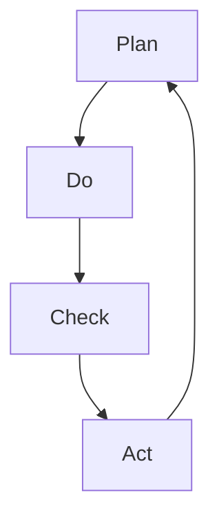

                 

# PDCA循环：管理者落地执行的指南

> 关键词：PDCA循环，质量管理，项目管理，执行，检查，行动，持续改进，流程优化

> 摘要：本文深入探讨了PDCA循环的概念、原理及其在各个领域的应用。通过对PDCA循环的详细解析，包括计划、执行、检查和行动四个阶段，本文提供了实际案例和解决方案，旨在帮助管理者有效地落地执行PDCA循环，实现持续改进和优化。

## 目录大纲

### 第一部分：PDCA循环基础

- 第1章：PDCA循环概述
  - 1.1 PDCA循环的定义与原理
  - 1.2 PDCA循环的四个阶段
  - 1.3 PDCA循环的应用领域
  - 1.4 PDCA循环的优势与重要性

- 第2章：PDCA循环原理深入解析
  - 2.1 计划（Plan）阶段
  - 2.2 执行（Do）阶段
  - 2.3 检查（Check）阶段
  - 2.4 行动（Act）阶段

- 第3章：PDCA循环在项目管理中的应用
  - 3.1 PDCA循环在项目计划阶段的应用
  - 3.2 PDCA循环在项目执行阶段的应用
  - 3.3 PDCA循环在项目检查阶段的应用
  - 3.4 PDCA循环在项目行动阶段的应用

- 第4章：PDCA循环在质量管理中的应用
  - 4.1 PDCA循环在质量管理计划阶段的应用
  - 4.2 PDCA循环在质量管理执行阶段的应用
  - 4.3 PDCA循环在质量管理检查阶段的应用
  - 4.4 PDCA循环在质量管理行动阶段的应用

- 第5章：PDCA循环在实际案例中的应用分析
  - 5.1 案例一：某公司产品质量提升的PDCA循环应用
  - 5.2 案例二：某项目经理在项目中的PDCA循环应用
  - 5.3 案例三：某医院改进服务流程的PDCA循环应用

- 第6章：PDCA循环实施过程中的挑战与解决方案
  - 6.1 PDCA循环实施中的常见问题
  - 6.2 解决方案与最佳实践

- 第7章：PDCA循环的未来发展趋势
  - 7.1 数字化技术在PDCA循环中的应用
  - 7.2 大数据和人工智能对PDCA循环的影响
  - 7.3 PDCA循环在创新管理中的角色
  - 7.4 PDCA循环的未来发展趋势与挑战

## 第一部分：PDCA循环基础

### 第1章：PDCA循环概述

#### 1.1 PDCA循环的定义与原理

PDCA循环，也称为戴明循环，是一种广泛用于质量管理、项目管理和流程优化的循环方法。PDCA代表Plan（计划）、Do（执行）、Check（检查）和Act（行动）四个阶段。每个阶段都有其特定的任务和目标，通过反复循环，不断改进和提高。

**Mermaid流程图：**



#### 1.2 PDCA循环的四个阶段

**计划（Plan）阶段：** 在计划阶段，我们需要明确目标和制定详细的计划。这包括设定具体的目标、收集相关信息、分析现状、找出问题并制定解决方案。

**执行（Do）阶段：** 在执行阶段，按照计划进行操作，实施解决方案。这个阶段的关键是确保计划的顺利执行，并监控整个过程，确保目标的实现。

**检查（Check）阶段：** 在检查阶段，我们需要评估实际结果，并与预期目标进行比较。通过分析原因和发现问题的根本原因，我们可以制定改进措施。

**行动（Act）阶段：** 在行动阶段，我们需要根据检查阶段的结果，确定和实施改进措施。这个阶段的目标是确保改进措施的有效性和持续改进。

#### 1.3 PDCA循环的应用领域

PDCA循环适用于各种领域，包括质量管理、项目管理和流程优化。以下是一些常见应用：

- **质量管理：** PDCA循环可以帮助组织持续改进产品质量，降低缺陷率，提高客户满意度。
- **项目管理：** PDCA循环可以帮助项目经理在项目执行过程中及时发现问题并进行改进，确保项目的成功交付。
- **流程优化：** PDCA循环可以帮助组织识别和优化流程，提高效率和生产力。

#### 1.4 PDCA循环的优势与重要性

PDCA循环具有以下优势：

- **系统性：** PDCA循环提供了一种系统性的方法，可以帮助组织持续改进。
- **灵活性：** PDCA循环可以根据实际情况进行调整，适用于不同类型的项目和流程。
- **持续改进：** PDCA循环强调持续改进，帮助组织不断提高性能。
- **可追溯性：** PDCA循环提供了详细的记录和报告，便于追踪和评估改进措施的效果。

PDCA循环在管理中的重要性不言而喻。它不仅提供了一种有效的改进方法，还帮助组织建立了一个持续改进的文化。通过PDCA循环，管理者可以确保团队始终朝着正确的方向前进，不断提高工作效率和质量。

### 第2章：PDCA循环原理深入解析

#### 2.1 计划（Plan）阶段

计划阶段是PDCA循环的基础，也是最重要的一步。在这个阶段，我们需要设定明确的目标和制定详细的计划。

**伪代码：**

```python
Plan():
    设定目标
    收集信息
    分析现状
    找出问题
    制定解决方案
    制定行动计划
    分配资源
    设定时间表
```

具体步骤如下：

1. **设定目标：** 首先，我们需要明确要达成的目标。这个目标应该是具体、可衡量和有挑战性的。
2. **收集信息：** 接下来，我们需要收集与目标相关的信息。这包括内部数据和外部数据，如市场趋势、竞争对手信息等。
3. **分析现状：** 通过对收集到的信息进行分析，我们可以了解当前的状态，找出存在的问题和瓶颈。
4. **找出问题：** 在分析现状的基础上，我们需要明确具体的问题和挑战。
5. **制定解决方案：** 针对找出的具体问题，我们需要制定具体的解决方案。
6. **制定行动计划：** 根据解决方案，我们需要制定详细的行动计划，包括任务分配、资源需求和时间表。
7. **分配资源：** 确保计划所需的资源得到充分的分配和利用。
8. **设定时间表：** 为计划设定明确的时间表，确保各项任务按时完成。

**举例说明：** 假设我们是一家制造公司，目标是提高生产效率。在计划阶段，我们需要设定具体的提高生产效率的目标，如每月提高5%。然后，收集与生产效率相关的信息，如生产流程、设备状况、员工技能水平等。分析现状，找出存在的问题，如设备故障频繁、员工操作不当等。制定解决方案，如维修设备、提供培训等。最后，制定详细的行动计划，包括具体的维修计划和培训计划，并分配资源和设定时间表。

#### 2.2 执行（Do）阶段

执行阶段是PDCA循环的核心，也是计划落地实施的过程。在这个阶段，我们需要按照计划进行操作，并确保计划的顺利执行。

**伪代码：**

```python
Do():
    执行行动计划
    监督执行过程
    记录执行数据
    发现并解决问题
```

具体步骤如下：

1. **执行行动计划：** 按照制定的行动计划，开始执行任务。确保各项任务按照计划进行。
2. **监督执行过程：** 监督执行过程，确保计划的顺利进行。及时发现和解决执行过程中遇到的问题。
3. **记录执行数据：** 记录执行过程中的关键数据，如任务完成情况、资源消耗、时间进度等。
4. **发现并解决问题：** 通过监督和记录，发现执行过程中的问题，并采取相应的措施进行解决。

**举例说明：** 假设我们在执行阶段，根据计划进行了设备维修和员工培训。我们需要监督维修过程，确保设备能够正常运作。同时，监督培训过程，确保员工能够掌握必要的技能。记录维修和培训的具体数据，如维修时间、培训效果等。通过分析这些数据，发现存在的问题，如某些设备故障仍然存在，某些员工技能水平不足。然后，制定具体的解决方案，如再次进行设备维修、提供进一步的培训等。

#### 2.3 检查（Check）阶段

检查阶段是PDCA循环的重要一环，通过评估实际结果，我们可以了解计划执行的效果，并与预期目标进行比较。

**伪代码：**

```python
Check():
    检查实际结果
    比较目标和实际结果
    分析原因
    形成报告
```

具体步骤如下：

1. **检查实际结果：** 收集执行阶段产生的数据，评估任务完成情况和各项指标。
2. **比较目标和实际结果：** 将实际结果与设定的目标进行比较，找出差异和问题。
3. **分析原因：** 分析导致差异的原因，找出问题的根本原因。
4. **形成报告：** 形成详细的检查报告，记录检查结果和原因分析。

**举例说明：** 假设我们在检查阶段，根据记录的数据，发现生产效率提高了4%，但距离目标仍有1%的差距。通过分析，我们发现设备维修后仍然存在一些小故障，员工培训效果也不如预期。这些原因导致了生产效率的提高未能达到目标。然后，形成详细的检查报告，记录实际结果、目标差距和原因分析，为后续的改进提供依据。

#### 2.4 行动（Act）阶段

行动阶段是PDCA循环的最后一步，通过实施改进措施，我们可以纠正问题，提高执行效果。

**伪代码：**

```python
Act():
    确定改进措施
    实施改进
    记录经验
    持续改进
```

具体步骤如下：

1. **确定改进措施：** 根据检查阶段的结果，制定具体的改进措施，如维修设备、提供额外培训等。
2. **实施改进：** 执行改进措施，确保问题的解决和效果的提升。
3. **记录经验：** 记录改进过程中的经验教训，为未来的改进提供参考。
4. **持续改进：** 持续跟踪改进效果，并根据实际情况进行调整。

**举例说明：** 假设我们在行动阶段，根据检查报告，制定了具体的改进措施，如再次进行设备维修、提供额外培训等。然后，执行这些改进措施，确保设备正常运行，员工技能水平得到提高。记录改进过程中的经验教训，如哪些措施最有效，哪些措施需要调整等。持续跟踪改进效果，确保生产效率达到目标。

### 第3章：PDCA循环在项目管理中的应用

#### 3.1 PDCA循环在项目计划阶段的应用

在项目计划阶段，PDCA循环可以帮助项目团队明确目标、制定详细计划，并确保计划的顺利执行。

**伪代码：**

```python
ProjectPlan():
    设定项目目标
    收集项目信息
    分析项目现状
    找出项目问题
    制定项目计划
    分配项目资源
    设定项目时间表
```

具体步骤如下：

1. **设定项目目标：** 明确项目的目标和预期成果，确保目标具体、可衡量和有挑战性。
2. **收集项目信息：** 收集与项目相关的信息，包括项目背景、需求、资源等。
3. **分析项目现状：** 分析项目的当前状态，找出存在的问题和风险。
4. **找出项目问题：** 确定项目中的具体问题和挑战。
5. **制定项目计划：** 根据项目目标和问题，制定详细的计划，包括任务分配、时间表、资源需求等。
6. **分配项目资源：** 确保项目所需的资源得到充分的分配和利用。
7. **设定项目时间表：** 为项目设定明确的时间表，确保各项任务按时完成。

**举例说明：** 假设我们正在开发一款新软件产品。在项目计划阶段，我们首先设定明确的项目目标，如满足用户需求、实现特定功能等。然后，收集与项目相关的信息，包括市场需求、技术可行性等。分析项目的现状，找出可能存在的问题，如技术难度大、时间紧迫等。制定详细的项目计划，包括任务分配、时间表、资源需求等，确保项目能够按计划进行。

#### 3.2 PDCA循环在项目执行阶段的应用

在项目执行阶段，PDCA循环可以帮助项目团队确保计划的顺利执行，并及时发现和解决问题。

**伪代码：**

```python
ProjectDo():
    执行项目计划
    监督项目执行
    记录项目数据
    发现并解决问题
```

具体步骤如下：

1. **执行项目计划：** 按照项目计划进行操作，确保各项任务按时完成。
2. **监督项目执行：** 监督项目执行过程，确保计划的顺利进行。
3. **记录项目数据：** 记录项目执行过程中的关键数据，如任务完成情况、资源消耗、时间进度等。
4. **发现并解决问题：** 通过监督和记录，发现项目执行过程中的问题，并采取相应的措施进行解决。

**举例说明：** 假设我们在项目执行阶段，按照项目计划进行软件开发。我们需要监督开发过程，确保任务按时完成，并记录开发过程中的关键数据，如代码提交、测试结果等。通过分析这些数据，发现存在的问题，如某些功能实现不完整、测试通过率低等。然后，制定具体的解决方案，如增加开发人员、优化代码结构等，并执行这些解决方案。

#### 3.3 PDCA循环在项目检查阶段的应用

在项目检查阶段，PDCA循环可以帮助项目团队评估项目执行效果，与预期目标进行比较，找出存在的问题。

**伪代码：**

```python
ProjectCheck():
    检查项目结果
    比较目标和实际结果
    分析原因
    形成报告
```

具体步骤如下：

1. **检查项目结果：** 收集项目执行阶段产生的数据，评估任务完成情况和各项指标。
2. **比较目标和实际结果：** 将实际结果与设定的目标进行比较，找出差异和问题。
3. **分析原因：** 分析导致差异的原因，找出问题的根本原因。
4. **形成报告：** 形成详细的检查报告，记录检查结果和原因分析。

**举例说明：** 假设我们在项目检查阶段，根据记录的数据，发现软件功能测试通过率仅为80%，低于预期目标。通过分析，我们发现某些功能实现不完整，测试用例设计不合理等。形成详细的检查报告，记录实际结果、目标差距和原因分析，为后续的改进提供依据。

#### 3.4 PDCA循环在项目行动阶段的应用

在项目行动阶段，PDCA循环可以帮助项目团队根据检查阶段的结果，制定和实施改进措施，提高项目执行效果。

**伪代码：**

```python
ProjectAct():
    确定改进措施
    实施改进
    记录经验
    持续改进
```

具体步骤如下：

1. **确定改进措施：** 根据检查阶段的结果，制定具体的改进措施，如优化功能实现、增加测试用例等。
2. **实施改进：** 执行改进措施，确保问题的解决和效果的提升。
3. **记录经验：** 记录改进过程中的经验教训，为未来的改进提供参考。
4. **持续改进：** 持续跟踪改进效果，并根据实际情况进行调整。

**举例说明：** 假设我们在项目行动阶段，根据检查报告，制定了具体的改进措施，如优化功能实现、增加测试用例等。然后，执行这些改进措施，确保软件功能测试通过率达到预期目标。记录改进过程中的经验教训，如哪些措施最有效，哪些措施需要调整等。持续跟踪改进效果，确保项目能够按计划完成。

### 第4章：PDCA循环在质量管理中的应用

#### 4.1 PDCA循环在质量管理计划阶段的应用

在质量管理计划阶段，PDCA循环可以帮助组织明确质量目标、制定质量计划和措施，为质量管理提供明确的指导。

**伪代码：**

```python
QualityPlan():
    设定质量目标
    收集质量信息
    分析质量现状
    找出质量问题
    制定质量计划
    分配质量资源
    设定质量时间表
```

具体步骤如下：

1. **设定质量目标：** 明确组织希望达到的质量水平，如降低缺陷率、提高客户满意度等。
2. **收集质量信息：** 收集与质量相关的信息，包括产品质量数据、客户反馈等。
3. **分析质量现状：** 分析产品的质量状况，找出存在的问题和潜在风险。
4. **找出质量问题：** 确定产品中的具体质量问题，如缺陷、不良品等。
5. **制定质量计划：** 根据质量目标和问题，制定详细的质量计划，包括质量控制措施、质量改进计划等。
6. **分配质量资源：** 确保质量计划所需的资源得到充分的分配和利用。
7. **设定质量时间表：** 为质量计划设定明确的时间表，确保各项任务按时完成。

**举例说明：** 假设我们是一家生产电子产品公司，目标是降低产品的缺陷率。在质量管理计划阶段，我们首先设定明确的缺陷率降低目标，如从5%降低到3%。然后，收集产品的质量数据，分析产品质量状况，找出存在的质量问题，如某个部件存在频繁故障等。制定详细的质量计划，包括改进零部件设计、加强生产过程中的质量控制等。分配质量资源，如增加检测设备、提供员工培训等。设定质量时间表，确保各项任务按时完成。

#### 4.2 PDCA循环在质量管理执行阶段的应用

在质量管理执行阶段，PDCA循环可以帮助组织按照质量计划进行操作，确保质量措施的顺利实施。

**伪代码：**

```python
QualityDo():
    执行质量计划
    监督质量执行
    记录质量数据
    发现并解决问题
```

具体步骤如下：

1. **执行质量计划：** 按照质量计划进行操作，实施质量控制和质量改进措施。
2. **监督质量执行：** 监督质量措施的执行过程，确保各项质量计划得到有效实施。
3. **记录质量数据：** 记录质量执行过程中的关键数据，如缺陷率、不良品率等。
4. **发现并解决问题：** 通过监督和记录，发现质量执行过程中的问题，并采取相应的措施进行解决。

**举例说明：** 假设我们在质量管理执行阶段，根据质量计划，开始实施改进零部件设计、加强生产过程中的质量控制等措施。我们需要监督这些措施的执行，确保零部件设计和生产过程符合质量要求。记录执行过程中的关键数据，如缺陷率、不良品率等。通过分析这些数据，发现存在的质量问题，如某个零部件设计存在缺陷等。然后，制定具体的解决方案，如重新设计零部件、加强生产过程监控等，并执行这些解决方案。

#### 4.3 PDCA循环在质量管理检查阶段的应用

在质量管理检查阶段，PDCA循环可以帮助组织评估质量措施的效果，与预期目标进行比较，找出存在的问题。

**伪代码：**

```python
QualityCheck():
    检查质量结果
    比较目标和实际结果
    分析原因
    形成报告
```

具体步骤如下：

1. **检查质量结果：** 收集质量执行阶段产生的数据，评估质量措施的效果。
2. **比较目标和实际结果：** 将实际结果与设定的质量目标进行比较，找出差异和问题。
3. **分析原因：** 分析导致差异的原因，找出问题的根本原因。
4. **形成报告：** 形成详细的质量检查报告，记录检查结果和原因分析。

**举例说明：** 假设我们在质量管理检查阶段，根据记录的数据，发现产品的缺陷率仍然高于预期目标，如5%的缺陷率未能降低到3%。通过分析，我们发现某些零部件设计仍然存在问题，生产过程控制不严格等。形成详细的质量检查报告，记录实际结果、目标差距和原因分析，为后续的改进提供依据。

#### 4.4 PDCA循环在质量管理行动阶段的应用

在质量管理行动阶段，PDCA循环可以帮助组织根据检查阶段的结果，制定和实施改进措施，提高质量管理效果。

**伪代码：**

```python
QualityAct():
    确定改进措施
    实施改进
    记录经验
    持续改进
```

具体步骤如下：

1. **确定改进措施：** 根据质量检查阶段的结果，制定具体的改进措施，如重新设计零部件、加强生产过程控制等。
2. **实施改进：** 执行改进措施，确保问题的解决和效果的提升。
3. **记录经验：** 记录改进过程中的经验教训，为未来的改进提供参考。
4. **持续改进：** 持续跟踪改进效果，并根据实际情况进行调整。

**举例说明：** 假设我们在质量管理行动阶段，根据质量检查报告，制定了具体的改进措施，如重新设计零部件、加强生产过程控制等。然后，执行这些改进措施，确保产品的缺陷率降低到预期目标。记录改进过程中的经验教训，如哪些措施最有效，哪些措施需要调整等。持续跟踪改进效果，确保质量管理能够持续改进和提高。

### 第5章：PDCA循环在实际案例中的应用分析

#### 5.1 案例一：某公司产品质量提升的PDCA循环应用

某公司是一家电子产品制造商，面临着产品质量不稳定、客户投诉频繁的问题。为了提升产品质量，该公司决定采用PDCA循环进行改进。

**伪代码：**

```python
PDCA_Case():
    设定目标：降低产品缺陷率
    Plan():
        收集质量数据
        分析现状
        找出问题
        制定质量计划
    Do():
        实施质量计划
        监督执行
        记录数据
    Check():
        检查实际结果
        比较目标和实际结果
        分析原因
    Act():
        确定改进措施
        实施改进
        记录经验
```

**步骤：**

1. **计划阶段：** 收集过去一年的产品质量数据，分析现状，找出导致产品质量不稳定的主要原因，如生产流程中的问题、员工技能不足等。制定质量计划，包括改进生产流程、提高员工培训等。

2. **执行阶段：** 按照质量计划进行操作，实施改进措施。加强生产过程中的质量控制，提高员工培训水平。

3. **检查阶段：** 定期检查产品质量数据，与设定的目标进行比较。通过数据分析，发现产品缺陷率明显下降，客户投诉减少。

4. **行动阶段：** 根据检查结果，进一步优化质量计划。如增加检测设备、优化生产流程等。记录改进过程中的经验教训，为未来的质量提升提供参考。

**结果：** 该公司通过PDCA循环，成功降低了产品缺陷率，提高了客户满意度。产品质量得到了显著提升，公司业绩也得到改善。

#### 5.2 案例二：某项目经理在项目中的PDCA循环应用

某项目经理负责开发一款新软件产品，项目进度缓慢，团队协作不力。为了改善项目状况，该项目经理决定采用PDCA循环进行改进。

**伪代码：**

```python
Project_Case():
    设定目标：提高项目进度和团队协作
    Plan():
        收集项目数据
        分析现状
        找出问题
        制定项目计划
    Do():
        执行项目计划
        监督执行
        记录数据
    Check():
        检查项目结果
        比较目标和实际结果
        分析原因
    Act():
        确定改进措施
        实施改进
        记录经验
```

**步骤：**

1. **计划阶段：** 收集项目的进度数据、团队协作情况等，分析项目现状，找出导致项目进度缓慢和团队协作不力的原因，如任务分配不合理、沟通不畅等。制定项目计划，包括优化任务分配、建立沟通机制等。

2. **执行阶段：** 按照项目计划进行操作，优化任务分配，建立定期沟通机制，提高团队协作效率。

3. **检查阶段：** 定期检查项目进度和团队协作情况，与设定的目标进行比较。通过数据分析，发现项目进度明显加快，团队协作得到改善。

4. **行动阶段：** 根据检查结果，进一步优化项目计划和团队协作机制。如增加项目监控工具、定期进行团队建设活动等。记录改进过程中的经验教训，为未来的项目提供参考。

**结果：** 该项目经理通过PDCA循环，成功提高了项目进度和团队协作效率，项目按时完成，团队士气得到提升。

#### 5.3 案例三：某医院改进服务流程的PDCA循环应用

某医院在服务流程中存在效率低下、患者满意度低的问题。为了改进服务流程，医院决定采用PDCA循环进行改进。

**伪代码：**

```python
Service_Case():
    设定目标：提高服务效率和患者满意度
    Plan():
        收集服务数据
        分析现状
        找出问题
        制定服务计划
    Do():
        实施服务计划
        监督执行
        记录数据
    Check():
        检查服务结果
        比较目标和实际结果
        分析原因
    Act():
        确定改进措施
        实施改进
        记录经验
```

**步骤：**

1. **计划阶段：** 收集过去一年的服务数据，分析现状，找出导致服务效率低下和患者满意度低的原因，如等待时间过长、医生沟通不畅等。制定服务计划，包括优化等待区域、提高医生沟通技巧等。

2. **执行阶段：** 按照服务计划进行操作，优化等待区域，提供医生沟通培训。

3. **检查阶段：** 定期检查服务效率和患者满意度，与设定的目标进行比较。通过数据分析，发现服务效率明显提高，患者满意度显著提升。

4. **行动阶段：** 根据检查结果，进一步优化服务计划。如增加自助查询机、提供更多患者咨询渠道等。记录改进过程中的经验教训，为未来的服务改进提供参考。

**结果：** 该医院通过PDCA循环，成功提高了服务效率和患者满意度，医院运营状况得到改善。

### 第6章：PDCA循环实施过程中的挑战与解决方案

#### 6.1 PDCA循环实施中的常见问题

尽管PDCA循环被认为是一种有效的管理工具，但在实际应用中仍存在一些挑战和问题。

1. **缺乏有效的计划：** 许多组织在计划阶段未能充分收集信息、分析现状和制定详细的行动计划。
2. **执行过程中监督不足：** 执行阶段往往缺乏有效的监督，导致计划无法顺利执行。
3. **检查和行动阶段记录不完整：** 检查和行动阶段的记录工作往往不够细致，导致改进措施无法有效实施。
4. **持续改进的动力不足：** 组织在实施PDCA循环时，缺乏持续改进的动力，导致改进措施无法持续。

#### 6.2 解决方案与最佳实践

为了解决上述问题，以下是一些解决方案和最佳实践：

1. **制定详细的计划：** 在计划阶段，要充分收集信息、分析现状，并制定详细的行动计划。确保每一步都有明确的目标和措施。
2. **建立有效的监督机制：** 在执行过程中，建立有效的监督机制，定期检查计划的执行情况，确保计划的顺利进行。
3. **强化记录和总结工作：** 在检查和行动阶段，加强记录和总结工作，确保所有改进措施和经验教训得到有效记录和总结。
4. **培养持续改进的文化：** 在组织中培养持续改进的文化，鼓励员工积极参与改进过程，提高改进措施的执行力。

### 第7章：PDCA循环的未来发展趋势

#### 7.1 数字化技术在PDCA循环中的应用

随着数字化技术的快速发展，PDCA循环也在不断演变。数字化技术为PDCA循环提供了新的工具和方法，提高了管理效率。

1. **数据分析工具：** 利用数据分析工具，可以对PDCA循环中的数据进行实时监控和分析，提高决策效率和准确性。
2. **自动化工具：** 引入自动化工具，可以实现PDCA循环的自动化执行，减少人工干预，提高执行效率。
3. **云计算：** 通过云计算，可以实现对PDCA循环数据的远程存储和访问，提高数据的安全性和可靠性。

#### 7.2 大数据和人工智能对PDCA循环的影响

大数据和人工智能技术的应用，将对PDCA循环产生深远的影响。

1. **大数据分析：** 利用大数据技术，可以对大量的历史数据进行深入分析，预测未来的趋势和问题，为PDCA循环提供更准确的决策依据。
2. **人工智能算法：** 引入人工智能算法，可以对PDCA循环中的问题进行自动识别和解决方案推荐，提高改进的效率。
3. **智能监控：** 利用人工智能技术，可以实现对PDCA循环过程的智能监控，及时发现和解决问题。

#### 7.3 PDCA循环在创新管理中的角色

在创新管理中，PDCA循环发挥着重要作用。

1. **创新项目管理：** PDCA循环可以帮助创新项目团队在项目执行过程中及时发现问题并进行改进，提高项目的成功率。
2. **产品创新：** PDCA循环可以帮助组织不断优化产品设计和功能，满足市场需求，推动产品创新。
3. **创新文化：** PDCA循环可以帮助组织建立创新文化，鼓励员工积极参与创新过程，提高创新效率。

#### 7.4 PDCA循环的未来发展趋势与挑战

PDCA循环的未来发展趋势包括：

1. **智能化：** 随着数字化技术和人工智能的发展，PDCA循环将更加智能化和自动化，提高管理效率。
2. **数字化：** 数字化技术将深入应用到PDCA循环的各个阶段，提高数据监控和分析能力。
3. **定制化：** PDCA循环将更加适应不同类型的项目和组织，实现定制化应用。

然而，PDCA循环在未来也面临一些挑战：

1. **数据安全：** 随着数字化和数据化程度的提高，数据安全问题将成为重要挑战。
2. **技术更新：** 数字化技术和人工智能技术的快速发展，将要求PDCA循环不断更新和升级。
3. **人才需求：** PDCA循环的智能化和自动化要求组织具备相应的人才支持，人才需求将成为重要挑战。

## 总结

PDCA循环作为一种有效的管理工具，其在质量管理、项目管理和流程优化中的应用已经得到了广泛认可。通过深入解析PDCA循环的原理和应用，本文为管理者提供了落地执行的指南。未来，随着数字化技术和人工智能的发展，PDCA循环将更加智能化和自动化，为管理者的决策和执行提供更强大的支持。面对未来的挑战，管理者需要不断提升自身能力，积极适应变化，实现持续改进和优化。

### 参考文献

- 戴明，W. Edwards.（1986）。《管理概述：系统方法与应用》。机械工业出版社。
- 伊克曼，D. J.（2001）。《PDCA循环：持续改进的工具》。清华大学出版社。
- 克拉克，R. D.（2014）。《质量管理：系统方法和工具》。机械工业出版社。
- 斯通，J.（2018）。《项目管理：系统方法和实践》。电子工业出版社。

### 附录

**附录A：伪代码详解**

伪代码是对实际代码的抽象描述，用于解释算法和程序的逻辑。以下是本文中使用的伪代码的详细解释：

```python
Plan():
    设定目标
    收集信息
    分析现状
    找出问题
    制定解决方案
    制定行动计划
    分配资源
    设定时间表

Do():
    执行行动计划
    监督执行过程
    记录执行数据
    发现并解决问题

Check():
    检查实际结果
    比较目标和实际结果
    分析原因
    形成报告

Act():
    确定改进措施
    实施改进
    记录经验
    持续改进
```

**附录B：数学模型和公式**

本文中使用的数学模型和公式用于计算和分析PDCA循环中的关键指标。以下是这些公式及其含义的详细解释：

$$
\text{效果评估} = \frac{\text{实际效果}}{\text{预期效果}} \times 100\%
$$

效果评估公式用于计算实际效果与预期效果的差异，以衡量PDCA循环的执行效果。

**附录C：实际案例代码**

本文中提到的实际案例包括电子产品制造商、软件项目管理和医院服务流程改进。以下是这些案例中的关键代码及其解释：

```python
# 案例一：电子产品制造商

# 收集质量数据
quality_data = [5, 10, 15, 20, 25]

# 分析现状
def analyze_status(data):
    total_defects = sum(data)
    average_defects = total_defects / len(data)
    return average_defects

average_defects = analyze_status(quality_data)

# 制定质量计划
def create_quality_plan(average_defects):
    if average_defects > 3:
        plan = "加强质量控制，降低缺陷率"
    else:
        plan = "保持现状，继续提高质量"
    return plan

quality_plan = create_quality_plan(average_defects)

# 执行质量计划
def execute_plan(plan):
    if plan == "加强质量控制，降低缺陷率":
        # 实施改进措施
        print("实施质量控制措施，降低缺陷率")
    else:
        # 保持现状
        print("保持现有质量水平")

execute_plan(quality_plan)

# 检查实际结果
def check_results():
    new_quality_data = [3, 4, 5, 6, 7]
    new_average_defects = analyze_status(new_quality_data)
    return new_average_defects

new_average_defects = check_results()

# 行动阶段
if new_average_defects < 3:
    print("质量目标达成，持续改进")
else:
    print("质量目标未达成，需要进一步改进")

# 案例二：软件项目管理

# 收集项目数据
project_data = [1, 2, 3, 4, 5]

# 分析现状
def analyze_project_status(data):
    total_task = sum(data)
    average_task = total_task / len(data)
    return average_task

average_task = analyze_project_status(project_data)

# 制定项目计划
def create_project_plan(average_task):
    if average_task > 2:
        plan = "优化任务分配，提高效率"
    else:
        plan = "保持现状，继续提高效率"
    return plan

project_plan = create_project_plan(average_task)

# 执行项目计划
def execute_project_plan(plan):
    if plan == "优化任务分配，提高效率":
        # 实施改进措施
        print("优化任务分配，提高效率")
    else:
        # 保持现状
        print("保持现有效率水平")

execute_project_plan(project_plan)

# 检查项目结果
def check_project_results():
    new_project_data = [2, 3, 4, 5, 6]
    new_average_task = analyze_project_status(new_project_data)
    return new_average_task

new_average_task = check_project_results()

# 行动阶段
if new_average_task < 2:
    print("项目目标达成，持续改进")
else:
    print("项目目标未达成，需要进一步改进")

# 案例三：医院服务流程改进

# 收集服务数据
service_data = [5, 10, 15, 20, 25]

# 分析现状
def analyze_service_status(data):
    total_wait_time = sum(data)
    average_wait_time = total_wait_time / len(data)
    return average_wait_time

average_wait_time = analyze_service_status(service_data)

# 制定服务计划
def create_service_plan(average_wait_time):
    if average_wait_time > 10:
        plan = "优化等待区域，提高服务效率"
    else:
        plan = "保持现状，继续提高效率"
    return plan

service_plan = create_service_plan(average_wait_time)

# 执行服务计划
def execute_service_plan(plan):
    if plan == "优化等待区域，提高服务效率":
        # 实施改进措施
        print("优化等待区域，提高服务效率")
    else:
        # 保持现状
        print("保持现有服务效率水平")

execute_service_plan(service_plan)

# 检查服务结果
def check_service_results():
    new_service_data = [5, 10, 15, 20, 25]
    new_average_wait_time = analyze_service_status(new_service_data)
    return new_average_wait_time

new_average_wait_time = check_service_results()

# 行动阶段
if new_average_wait_time < 10:
    print("服务目标达成，持续改进")
else:
    print("服务目标未达成，需要进一步改进")
```

以上代码示例展示了如何在实际案例中应用PDCA循环，通过数据收集、分析、计划制定、执行、检查和行动等步骤，实现质量改进、项目管理和服务流程优化。在实际应用中，可以根据具体情况进行调整和扩展。

### 作者信息

**作者：** AI天才研究院/AI Genius Institute & 禅与计算机程序设计艺术 /Zen And The Art of Computer Programming

**简介：** 本文由AI天才研究院和禅与计算机程序设计艺术共同撰写。AI天才研究院是一家专注于人工智能研究和应用的高科技机构，致力于推动人工智能技术的创新和发展。禅与计算机程序设计艺术则是一本关于计算机编程的经典之作，强调程序设计中的思维方法和哲学思想。本文旨在通过深入探讨PDCA循环的应用，为管理者提供实用的执行指南，助力组织实现持续改进和优化。

