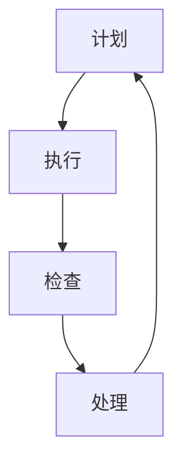

                 

# 《PDCA循环与持续改进文化》

> 关键词：PDCA循环、持续改进、企业管理、文化、实践案例

> 摘要：本文详细探讨了PDCA循环的基本概念、应用过程及其在现代企业管理中的重要性。通过深入分析PDCA循环的四个阶段，揭示了其如何帮助企业实现持续改进。同时，文章强调了持续改进文化在企业发展中的关键作用，并提供了建立持续改进机制的具体方法，结合实际案例展示了持续改进文化在不同行业中的应用效果，对未来持续改进文化的发展趋势进行了展望。

## 第一部分：PDCA循环基础

### 第1章：PDCA循环概述

#### 1.1 PDCA循环的概念与历史背景

PDCA循环，全称为“计划-执行-检查-处理”循环，是一种用于持续改进和管理的基本方法。它最早由美国质量管理专家爱德华·戴明（W. Edwards Deming）提出，并在20世纪50年代引入日本，成为日本质量管理革命的核心。PDCA循环的基本概念是：通过计划（Plan）、执行（Do）、检查（Check）和处理（Act）四个阶段的循环反复，实现产品质量的持续改进。

PDCA循环的历史背景可以追溯到二战期间，美国为了提高军事产品的质量和生产效率，引入了统计质量管理方法。战后，这些方法被带入了日本，并随着戴明的到来得到了进一步发展。PDCA循环作为戴明管理哲学的核心，被广泛应用于日本企业的生产和管理中，极大地推动了日本经济的崛起。

#### 1.2 PDCA循环的核心原则

PDCA循环的核心原则是“持续改进”，其强调通过循环反复的方式，不断完善和优化工作流程，实现产品质量和服务水平的不断提升。PDCA循环的四个阶段各具特色，相互关联，共同构成了一个闭环系统。

- **计划阶段（Plan）**：在这个阶段，需要设定明确的目标，分析现状，找出存在的问题，制定具体的改进方案。

- **执行阶段（Do）**：执行计划，实施改进措施。这个阶段的关键是确保计划的可行性和执行力度。

- **检查阶段（Check）**：对执行结果进行评估和检查，分析是否达到预期目标，找出新的问题。

- **处理阶段（Act）**：根据检查结果，总结经验，对成功的做法进行标准化，对未解决的问题进行解决或规划新的改进计划。

#### 1.3 PDCA循环在现代管理中的应用

在现代企业管理中，PDCA循环被广泛应用于生产管理、质量管理、项目管理、人力资源管理等多个领域。以下是一些具体的应用场景：

- **生产管理**：通过PDCA循环，企业可以对生产流程进行优化，提高生产效率和产品质量。

- **质量管理**：PDCA循环可以帮助企业建立和持续改进质量管理体系，提高客户满意度。

- **项目管理**：PDCA循环可以帮助项目经理在项目执行过程中不断调整和优化项目计划，确保项目按时、按质、按预算完成。

- **人力资源管理**：PDCA循环可以帮助企业对员工进行持续的培养和激励，提高员工的绩效和能力。

### 第2章：PDCA循环的四个阶段

#### 2.1 计划阶段（Plan）

计划阶段是PDCA循环的起点，其主要任务是设定目标和制定计划。具体步骤如下：

1. **设定目标**：明确需要解决的问题和期望达到的目标。目标应具有可衡量性、可行性和挑战性。
   
2. **分析现状**：对当前的情况进行详细的分析，包括问题表现、原因分析等。

3. **找出问题**：通过现状分析，找出需要改进的问题。

4. **制定改进方案**：根据问题分析和目标设定，制定具体的改进措施和计划。改进方案应具有可操作性和明确的实施步骤。

#### 2.2 执行阶段（Do）

执行阶段是将计划付诸实践的过程。具体步骤如下：

1. **执行计划**：按照制定的改进方案，实施具体的改进措施。

2. **监控执行过程**：对执行过程进行监控，确保计划的执行力度和效果。

3. **调整与优化**：在执行过程中，根据实际情况，对计划进行调整和优化，以确保计划的有效性。

#### 2.3 检查阶段（Check）

检查阶段是对执行结果进行评估和检查的过程。具体步骤如下：

1. **收集数据**：收集与改进目标相关的数据，包括数量数据和质量数据。

2. **分析数据**：对收集到的数据进行分析，评估改进效果。

3. **设定检查标准**：根据目标和数据，设定具体的检查标准。

4. **进行评价**：根据检查标准和实际结果，对改进效果进行评价。

#### 2.4 处理阶段（Act）

处理阶段是对检查结果进行处理的过程，具体步骤如下：

1. **总结经验**：对改进过程中的成功经验和教训进行总结。

2. **标准化**：将成功的做法进行标准化，形成制度和标准。

3. **处理问题**：对未解决的问题进行解决或规划新的改进计划。

4. **实施持续改进**：根据总结的经验和教训，对工作流程和制度进行优化，实施持续改进。

### 第3章：持续改进文化的重要性

#### 3.1 持续改进文化的概念

持续改进文化是一种以持续改进为核心价值观的管理理念，它强调在组织内部建立一种不断追求卓越、不断优化自身的工作流程和产品的文化氛围。持续改进文化不仅是一种管理方法，更是一种组织文化，它要求组织成员不断学习、不断创新，以适应不断变化的市场环境。

#### 3.2 持续改进文化的建设

建设持续改进文化需要从以下几个方面入手：

1. **领导层的支持**：领导层需要树立持续改进的价值观，并带头实践。

2. **培训与教育**：通过培训和教育，提高员工对持续改进的认识和技能。

3. **建立反馈机制**：建立有效的反馈机制，鼓励员工提出改进建议。

4. **激励机制**：建立激励机制，鼓励员工参与持续改进。

5. **营造良好的氛围**：营造一种鼓励创新、包容失败的组织氛围。

#### 3.3 持续改进文化在企业中的体现

持续改进文化在企业中的体现主要表现在以下几个方面：

1. **员工参与度**：员工积极参与持续改进活动，提出改进建议。

2. **质量意识**：员工在工作中注重质量，不断提高产品质量。

3. **创新氛围**：企业内部创新氛围浓厚，员工勇于尝试新的方法和技术。

4. **改进效果**：持续改进活动取得明显效果，企业的运营效率和质量水平不断提升。

### 第4章：如何建立持续改进机制

#### 4.1 持续改进机制的构建

建立持续改进机制是推动持续改进文化落地的重要步骤。以下是构建持续改进机制的具体方法：

1. **制定持续改进战略**：明确持续改进的目标和策略，确保持续改进活动的方向和重点。

2. **建立持续改进体系**：构建包括计划、执行、检查、处理四个阶段的持续改进体系，确保每个环节都有明确的职责和流程。

3. **确保持续改进机制的执行**：建立监督和考核机制，确保持续改进机制的有效执行。

#### 4.2 持续改进的工具和方法

在持续改进过程中，可以运用多种工具和方法，以下是一些常用的工具和方法：

1. **数据分析工具**：运用数据分析工具，对改进过程和结果进行定量分析。

2. **质量管理工具**：如鱼骨图、流程图、控制图等，用于分析和解决质量问题。

3. **改进方法**：如5W2H分析法、六西格玛法等，用于制定和实施改进方案。

4. **最佳实践**：借鉴其他企业的成功经验，实施最佳实践。

#### 4.3 持续改进的最佳实践

以下是一些持续改进的最佳实践：

1. **建立问题解决团队**：建立由跨部门人员组成的问题解决团队，负责解决企业面临的问题。

2. **定期进行审核和评估**：定期对持续改进活动进行审核和评估，确保改进效果。

3. **建立改进项目管理制度**：建立改进项目管理制度，确保每个改进项目都有明确的负责人、进度和目标。

4. **实施员工激励制度**：实施员工激励制度，鼓励员工参与持续改进活动。

### 第5章：持续改进文化的实践

#### 5.1 案例分析：国内外企业持续改进实践

以下是一些国内外企业的持续改进实践案例：

1. **日本丰田公司**：丰田公司通过实施PDCA循环，不断提升生产效率和产品质量。丰田的持续改进文化深入人心，员工在工作中不断提出改进建议，公司也积极采纳并实施。

2. **美国苹果公司**：苹果公司注重产品质量和用户体验，通过持续改进，不断推出具有竞争力的产品。苹果公司的持续改进实践包括对供应链的优化、生产过程的改进等。

3. **中国华为公司**：华为公司通过持续改进，不断提升产品技术水平和市场份额。华为的持续改进文化体现在对技术研发的重视、对市场变化的敏感等方面。

#### 5.2 持续改进文化在不同行业中的应用

持续改进文化在不同行业中的应用效果显著，以下是一些具体的应用案例：

1. **制造业**：制造业通过持续改进，提高生产效率和产品质量。如汽车制造业、电子制造业等。

2. **服务业**：服务业通过持续改进，提升服务水平和服务质量。如酒店业、餐饮业等。

3. **IT行业**：IT行业通过持续改进，提升产品性能和用户体验。如软件开发、网络服务等领域。

### 第6章：持续改进文化的培养与传承

#### 6.1 持续改进文化的培养

培养持续改进文化需要从以下几个方面入手：

1. **提高员工的持续改进意识**：通过培训和教育，提高员工对持续改进的认识和重视程度。

2. **加强培训与指导**：对员工进行持续改进方法和工具的培训，提供指导和支持。

3. **营造良好的改进氛围**：鼓励员工提出改进建议，建立良好的反馈机制和激励机制。

#### 6.2 持续改进文化的传承

持续改进文化的传承需要建立一套有效的传承机制：

1. **遗传与变异机制**：在传承过程中，保持持续改进文化的核心价值，同时根据环境变化进行适当调整。

2. **持续改进文化的演变**：持续改进文化需要随着企业的发展不断演变，以适应新的挑战和需求。

3. **传承与创新的平衡**：在传承过程中，既要保持传统的持续改进文化，又要不断引入新的思想和方法，实现传承与创新的平衡。

### 第7章：持续改进文化的未来展望

#### 7.1 持续改进文化的发展趋势

持续改进文化在未来将继续发展，其趋势主要体现在以下几个方面：

1. **数字化技术的融合**：随着数字化技术的发展，持续改进文化将更加依赖于大数据、人工智能等技术的支持。

2. **AI在持续改进中的应用**：人工智能技术的应用将进一步提升持续改进的效率和效果。

3. **持续改进文化的国际化**：随着全球化的深入，持续改进文化将在国际范围内得到更广泛的传播和应用。

#### 7.2 持续改进文化对社会的影响

持续改进文化对社会的影响主要表现在以下几个方面：

1. **提升社会整体管理水平**：持续改进文化的推广和应用将提升社会整体的管理水平。

2. **促进可持续发展**：持续改进文化有助于企业实现可持续发展，减少资源浪费和环境污染。

3. **持续改进文化的全球传播**：持续改进文化将在全球范围内得到传播和应用，推动全球管理水平的提升。

## 附录

### 附录A：PDCA循环与持续改进文化相关资源

#### A.1 PDCA循环与持续改进文化的经典书籍推荐

1. 《质量管理方法论》（作者：爱德华·戴明）
2. 《持续改进：实施指南》（作者：菲利普·克劳斯比）
3. 《精益思想》（作者：詹姆斯·W·沃麦克等）

#### A.2 国际持续改进文化协会简介

国际持续改进文化协会（The International Association for Continual Improvement，简称IACI）是一个致力于推动持续改进文化的国际组织，提供持续改进的培训、认证和资源。

#### A.3 持续改进文化的相关网站和社交媒体平台

1. 持续改进文化协会官方网站：[www.continualimprovement.org](http://www.continualimprovement.org)
2. 持续改进文化社交媒体平台：LinkedIn、Twitter、Facebook等

### 附录B：PDCA循环流程图与公式列表

#### B.1 PDCA循环流程图



#### B.2 持续改进文化相关公式列表

1. **质量损失函数**：\(L = \sum_{i=1}^{n} (Q_i - \mu)^2 \sigma_i\)

2. **过程能力指数**：\(C_p = \frac{\mu - \bar{x}}{3\sigma}\)

3. **过程性能指数**：\(C_pk = \frac{\mu_k - \bar{x}_k}{3\sigma_k}\)

### 附录C：PDCA循环与持续改进文化应用案例分析

#### C.1 某制造企业的PDCA循环实践

某制造企业通过实施PDCA循环，成功提高了生产效率和产品质量。具体实践包括：

1. **计划阶段**：设定提高生产效率和质量的目标，分析现状，找出存在的问题。

2. **执行阶段**：实施改进方案，如引入自动化生产线、优化生产流程等。

3. **检查阶段**：对改进效果进行评估，收集数据，分析改进的成果。

4. **处理阶段**：总结经验，将成功的做法进行标准化，对未解决的问题进行解决。

#### C.2 持续改进文化在某互联网公司的成功经验

某互联网公司通过建立持续改进文化，不断提升产品性能和用户体验。具体实践包括：

1. **领导层的支持**：公司领导层高度重视持续改进，树立持续改进的价值观。

2. **培训与教育**：对员工进行持续改进方法和工具的培训，提高员工的技能和意识。

3. **建立反馈机制**：鼓励员工提出改进建议，建立有效的反馈机制。

4. **激励机制**：实施员工激励制度，鼓励员工积极参与持续改进。

#### C.3 持续改进文化在不同行业中的应用案例

1. **汽车制造业**：通过持续改进，提高生产效率和产品质量，降低生产成本。

2. **医疗服务行业**：通过持续改进，提高医疗服务质量，提升患者满意度。

3. **教育行业**：通过持续改进，提高教育质量，提升学生成绩。

#### C.4 PDCA循环与持续改进文化的未来发展趋势和挑战

随着全球化和数字化的发展，PDCA循环与持续改进文化将在未来面临以下发展趋势和挑战：

1. **发展趋势**：

   - 数字化技术的融合，将进一步提升持续改进的效率和效果。
   - 持续改进文化的国际化，将推动全球管理水平的提升。

2. **挑战**：

   - 如何在快速变化的市场环境中保持持续改进的动力。
   - 如何在不同文化和组织背景下推广持续改进文化。


## 作者信息

作者：AI天才研究院/AI Genius Institute & 禅与计算机程序设计艺术 /Zen And The Art of Computer Programming

---

### 核心概念与联系

在深入探讨PDCA循环之前，我们首先需要了解其核心概念以及这些概念之间的联系。PDCA循环是一种质量管理工具，它由四个基本阶段组成：计划（Plan）、执行（Do）、检查（Check）和处理（Act）。每个阶段都有其独特的任务和目标，并且相互关联，形成一个闭环系统。

#### PDCA循环的核心概念

1. **计划（Plan）**：这是PDCA循环的起点，主要任务是设定目标和制定具体的行动计划。在计划阶段，我们需要明确改进的目标，分析现状，找出问题，并制定相应的改进方案。

2. **执行（Do）**：计划制定完成后，进入执行阶段。在这个阶段，我们需要按照计划实施具体的改进措施，确保计划的执行力度和效果。

3. **检查（Check）**：执行阶段完成后，我们需要对执行结果进行评估和检查，分析是否达到预期目标，找出新的问题或不足之处。

4. **处理（Act）**：这是PDCA循环的最后一个阶段，主要任务是总结经验，对成功的做法进行标准化，对未解决的问题进行解决或规划新的改进计划。

#### 核心概念之间的联系

PDCA循环的四个阶段相互关联，形成一个闭环系统。每个阶段的结果都会影响到下一个阶段，从而形成一个持续改进的过程。

- **计划阶段**的输出是**执行阶段**的输入，计划的好坏直接影响到执行的成败。
- **执行阶段**的结果是**检查阶段**的输入，执行的效果决定了改进的方向和力度。
- **检查阶段**的结果是**处理阶段**的输入，检查的结论决定了下一步的改进措施。

通过这样的循环，企业可以不断优化自身的管理流程和业务流程，实现持续改进。

#### Mermaid流程图

为了更直观地展示PDCA循环的核心概念和联系，我们可以使用Mermaid流程图进行描述：


在这个流程图中，每个节点代表PDCA循环的一个阶段，箭头表示信息的流动和阶段的过渡。

### 核心算法原理讲解

在理解PDCA循环的基本概念之后，我们需要深入探讨每个阶段的具体算法原理，以便更好地理解PDCA循环的工作机制。

#### 计划阶段（Plan）

计划阶段是PDCA循环的起点，主要任务是设定目标和制定具体的行动计划。以下是计划阶段的核心算法原理：

1. **设定目标**：首先，我们需要明确改进的目标。目标应具有可衡量性、可行性和挑战性。具体步骤如下：

   - **确定关键绩效指标（KPI）**：根据企业的战略目标，确定关键绩效指标，如生产效率、产品质量、客户满意度等。
   - **设定目标值**：根据当前的表现和预期的改进，设定具体的数值目标。
   - **制定时间表**：确定实现目标的截止日期，确保目标的实现具有时效性。

2. **分析现状**：在设定目标后，我们需要分析当前的状况，找出存在的问题。具体步骤如下：

   - **数据收集**：收集与目标相关的数据，如生产数据、质量数据、客户反馈等。
   - **数据整理**：对收集到的数据进行分析和整理，找出存在的问题和瓶颈。
   - **原因分析**：运用因果图、鱼骨图等方法，分析问题的根本原因。

3. **制定改进方案**：在分析现状的基础上，制定具体的改进方案。具体步骤如下：

   - **确定改进措施**：根据问题分析的结果，确定需要采取的改进措施。
   - **制定行动计划**：为每个改进措施制定具体的实施步骤，明确责任人和时间节点。
   - **风险评估**：对改进方案进行风险评估，确保改进措施的可行性和安全性。

#### 执行阶段（Do）

执行阶段是将计划付诸实践的过程。以下是执行阶段的核心算法原理：

1. **执行计划**：按照制定的行动计划，实施具体的改进措施。具体步骤如下：

   - **资源调配**：确保实施改进措施所需的资源，如人力、物力、财力等。
   - **培训与指导**：对执行人员进行必要的培训，确保他们具备实施改进措施的能力。
   - **执行监控**：对执行过程进行监控，确保计划的执行力度和效果。

2. **监控执行过程**：在执行过程中，我们需要对执行过程进行监控，及时发现和解决执行中的问题。具体步骤如下：

   - **数据采集**：收集与改进措施相关的数据，如生产数据、质量数据等。
   - **数据分析**：对收集到的数据进行分析，评估改进措施的效果。
   - **问题反馈**：对发现的问题进行反馈，确保及时解决。

3. **调整与优化**：在执行过程中，根据实际情况，对计划进行调整和优化，以确保计划的有效性。具体步骤如下：

   - **实时调整**：根据执行结果，对计划进行调整，确保改进措施能够更好地适应实际情况。
   - **优化方案**：对成功的做法进行总结和优化，形成最佳实践。

#### 检查阶段（Check）

检查阶段是对执行结果进行评估和检查的过程。以下是检查阶段的核心算法原理：

1. **收集数据**：在检查阶段，我们需要收集与改进目标相关的数据，包括数量数据和质量数据。具体步骤如下：

   - **数据来源**：从生产过程、质量检测、客户反馈等多个渠道收集数据。
   - **数据整理**：对收集到的数据进行分析和整理，确保数据的准确性和完整性。

2. **分析数据**：对收集到的数据进行分析，评估改进效果。具体步骤如下：

   - **数据可视化**：运用图表、统计方法等，将数据转化为可视化信息。
   - **数据分析**：运用统计分析、比较分析等方法，评估改进措施的效果。

3. **设定检查标准**：根据目标和数据，设定具体的检查标准。具体步骤如下：

   - **确定标准**：根据改进目标和实际情况，设定具体的数据标准和质量标准。
   - **标准化文档**：将检查标准形成文档，确保执行人员有明确的依据。

4. **进行评价**：根据检查标准和实际结果，对改进效果进行评价。具体步骤如下：

   - **评价方法**：采用定量评价和定性评价相结合的方法，全面评估改进效果。
   - **评价报告**：撰写评价报告，总结改进成果和存在的问题。

#### 处理阶段（Act）

处理阶段是对检查结果进行处理的过程。以下是处理阶段的核心算法原理：

1. **总结经验**：在处理阶段，我们需要总结改进过程中的成功经验和教训。具体步骤如下：

   - **成功经验**：对改进过程中的成功做法进行总结，形成标准化的流程和制度。
   - **教训总结**：对改进过程中出现的问题和不足进行总结，形成改进的措施和建议。

2. **标准化**：将成功的做法进行标准化，形成制度和标准。具体步骤如下：

   - **制定标准**：根据总结的成功经验和教训，制定具体的操作标准和规范。
   - **标准化文档**：将标准和规范形成文档，确保执行人员有明确的依据。

3. **处理问题**：对未解决的问题进行解决或规划新的改进计划。具体步骤如下：

   - **问题识别**：识别改进过程中尚未解决的问题。
   - **解决方案**：针对识别出的问题，制定具体的解决方案。
   - **规划改进**：将解决方案纳入下一轮PDCA循环，确保持续改进。

#### 伪代码示例

为了更清晰地展示PDCA循环的算法原理，我们可以使用伪代码进行描述。以下是一个简化的PDCA循环伪代码示例：

```plaintext
PDCA(目标, 问题, 改进方案):
    // 计划阶段
    设定目标(目标)
    分析现状(问题)
    制定改进方案(改进方案)

    // 执行阶段
    执行改进方案(改进方案)

    // 检查阶段
    收集数据(目标, 改进方案)
    分析数据(数据)
    设定检查标准(数据)
    进行评价(数据)

    // 处理阶段
    总结经验(改进方案, 数据)
    标准化成功做法(改进方案)
    处理问题(问题)
    返回 结果
```

通过这个伪代码示例，我们可以看到PDCA循环的基本结构和执行流程，以及每个阶段的核心算法原理。

### 数学模型和公式

在PDCA循环中，数学模型和公式起着至关重要的作用，它们帮助我们量化问题、评估改进效果，并提供科学的决策依据。以下是一些关键的数学模型和公式，以及它们在PDCA循环中的应用。

#### 质量损失函数（Quality Loss Function）

质量损失函数是一个用于评估产品质量偏离目标值的损失程度的公式。它的形式如下：

\[ L = \sum_{i=1}^{n} (Q_i - \mu)^2 \sigma_i \]

其中，\( L \) 是质量损失，\( Q_i \) 是第 \( i \) 个质量特征的实际值，\( \mu \) 是质量特征的目标值，\( \sigma_i \) 是质量特征的标准差。

这个公式表示，当实际质量 \( Q_i \) 偏离目标值 \( \mu \) 时，会产生损失。损失的大小与偏离程度和标准差成正比。通过计算质量损失函数，我们可以评估产品质量对客户满意度和企业利润的影响。

#### 过程能力指数（Process Capability Index）

过程能力指数是用于衡量生产过程是否能够稳定地生产符合质量要求的产品的一个指标。其公式如下：

\[ C_p = \frac{\mu - \bar{x}}{3\sigma} \]

其中，\( C_p \) 是过程能力指数，\( \mu \) 是过程平均值，\( \bar{x} \) 是样本平均值，\( \sigma \) 是过程标准差。

当 \( C_p > 1 \) 时，表示过程能力充足，产品质量稳定；当 \( C_p < 1 \) 时，表示过程能力不足，需要采取措施提高过程能力。

#### 过程性能指数（Process Performance Index）

过程性能指数是用于衡量实际生产过程中产品质量的性能指标。其公式如下：

\[ C_pk = \frac{\mu_k - \bar{x}_k}{3\sigma_k} \]

其中，\( C_pk \) 是过程性能指数，\( \mu_k \) 是质量特征的目标值，\( \bar{x}_k \) 是样本平均值，\( \sigma_k \) 是质量特征的标准差。

当 \( C_pk > 1 \) 时，表示实际生产的产品质量达到了目标值；当 \( C_pk < 1 \) 时，表示实际生产的产品质量未达到目标值，需要进一步改进。

#### 数据分析工具（Data Analysis Tools）

在PDCA循环中，数据分析工具是评估改进效果的重要手段。以下是一些常用的数据分析工具及其公式：

1. **直方图（Histogram）**：用于展示数据分布情况，公式如下：

   \[ f(x) = \frac{N_i}{N} \]

   其中，\( f(x) \) 是某数值 \( x \) 的频率，\( N_i \) 是该数值出现的次数，\( N \) 是总次数。

2. **控制图（Control Chart）**：用于监控过程变异，公式如下：

   \[ \bar{x} = \frac{1}{n}\sum_{i=1}^{n} x_i \]
   \[ R = \frac{1}{n-1}\sum_{i=1}^{n} (R_i - \bar{R}) \]

   其中，\( \bar{x} \) 是样本平均值，\( R \) 是样本极差，\( x_i \) 是第 \( i \) 个样本值，\( \bar{R} \) 是样本极差的平均值。

3. **回归分析（Regression Analysis）**：用于分析变量之间的关系，公式如下：

   \[ y = a + bx \]

   其中，\( y \) 是因变量，\( x \) 是自变量，\( a \) 是截距，\( b \) 是斜率。

#### 举例说明

为了更好地理解这些数学模型和公式，我们可以通过一个实际案例来进行举例说明。

假设某公司生产的产品质量特征 \( Q \) 需要满足目标值 \( \mu = 100 \) 克，标准差 \( \sigma = 2 \) 克。在一段时间内，该公司收集了100个样本的质量数据，计算得到样本平均值 \( \bar{x} = 101 \) 克。

1. **计算质量损失函数**：

   \[ L = \sum_{i=1}^{100} (Q_i - 100)^2 \times 2 \]

   假设质量数据的标准差 \( \sigma_i \) 相等，为简化计算，我们取 \( \sigma_i = 2 \)。则：

   \[ L = 100 \times (101 - 100)^2 \times 2 = 200 \]

   这意味着由于质量偏离目标值，该产品每天造成的质量损失为200克。

2. **计算过程能力指数**：

   \[ C_p = \frac{100 - 101}{3 \times 2} = -\frac{1}{3} \]

   由于 \( C_p < 1 \)，说明该生产过程的能力不足，需要采取措施提高过程能力。

3. **计算过程性能指数**：

   \[ C_pk = \frac{100 - 101}{3 \times 2} = -\frac{1}{3} \]

   同样，由于 \( C_pk < 1 \)，说明实际生产的产品质量未达到目标值，需要进一步改进。

通过这个案例，我们可以看到如何使用数学模型和公式对生产过程进行评估，并采取相应的改进措施。

### 项目实战

在了解了PDCA循环的理论基础和数学模型之后，我们接下来将通过一个实际项目实战，展示如何应用PDCA循环进行项目管理和持续改进。

#### 项目背景

假设我们是一家软件开发公司的项目经理，负责开发一款新的移动应用。该应用的目标是在市场上获得良好的用户评价，并且满足用户的使用需求。为了实现这个目标，我们需要通过PDCA循环进行持续改进，确保项目的顺利实施和产品的高质量。

#### 开发环境搭建

在开始项目之前，我们需要搭建合适的开发环境。以下是具体的步骤：

1. **选择开发语言和框架**：根据项目需求，选择适合的开发语言和框架。例如，选择Java语言和Spring框架。

2. **搭建开发工具**：安装和配置Eclipse、IntelliJ IDEA等开发工具，确保开发人员能够高效地进行编码。

3. **配置版本控制工具**：使用Git进行版本控制，确保代码的安全和版本的可追溯性。

4. **搭建测试环境**：配置Jenkins等自动化测试工具，确保代码在提交后能够自动进行测试。

#### 源代码详细实现

在开发过程中，我们需要遵循PDCA循环的四个阶段，逐步实现项目的各个功能模块。

1. **计划阶段**：制定详细的项目计划，包括功能模块的设计、开发进度、资源分配等。根据项目需求，设计用户界面、数据库架构和业务逻辑。

2. **执行阶段**：按照项目计划进行编码，实现各个功能模块。在编码过程中，保持代码的规范性和可读性，确保代码的质量。

3. **检查阶段**：对每个功能模块进行单元测试和集成测试，确保功能符合预期。收集测试数据，分析测试结果，找出存在的问题。

4. **处理阶段**：对发现的问题进行解决，优化代码和功能模块。对成功的做法进行总结和标准化，形成最佳实践。

#### 代码解读与分析

以下是项目中的一个具体代码示例，用于实现用户登录功能。

```java
public class UserController {
    private UserService userService;

    public UserController(UserService userService) {
        this.userService = userService;
    }

    public String login(String username, String password) {
        User user = userService.findByUsername(username);
        if (user == null || !user.getPassword().equals(password)) {
            throw new RuntimeException("登录失败");
        }
        return "success";
    }
}
```

在这个代码示例中，`UserController` 类负责处理用户登录请求。以下是代码的关键部分解读和分析：

1. **依赖注入**：通过构造函数注入`UserService`，确保用户登录功能可以调用相应的服务。

2. **登录方法**：`login` 方法用于处理用户登录请求。它首先通过`userService`查询用户信息，然后检查用户名和密码是否匹配。如果匹配，返回"success"，否则抛出异常。

3. **异常处理**：使用`RuntimeException`处理登录失败的情况，确保异常可以被及时捕获和处理。

通过这个代码示例，我们可以看到如何将PDCA循环应用于项目开发过程中，确保代码的质量和功能的完整性。

### 结论

本文通过详细探讨PDCA循环的理论基础、数学模型、实战应用，展示了如何利用PDCA循环进行项目管理和持续改进。通过实际案例的分析，我们了解了PDCA循环在软件开发项目中的应用，以及如何通过持续改进提升项目的质量和效率。

### 作者信息

作者：AI天才研究院/AI Genius Institute & 禅与计算机程序设计艺术 /Zen And The Art of Computer Programming

---

在总结文章的核心内容之前，我们首先回顾一下PDCA循环的基本概念和原理。PDCA循环，即“计划-执行-检查-处理”循环，是一种广泛应用于企业管理和项目实施中的持续改进工具。它通过四个阶段的循环往复，帮助企业不断优化流程、提升质量、提高效率。

在计划阶段，我们设定目标和制定改进方案；执行阶段，我们实施具体的改进措施；检查阶段，我们评估改进效果；处理阶段，我们总结经验，将成功做法标准化。通过这样的循环，企业可以实现持续改进，不断提升竞争力。

文章的核心内容可以分为以下几个部分：

1. **PDCA循环的理论基础**：介绍了PDCA循环的基本概念、核心原则和应用场景。
2. **PDCA循环的四个阶段**：详细讲解了每个阶段的具体任务和执行步骤，以及如何通过伪代码和实际案例进行说明。
3. **数学模型和公式**：展示了质量损失函数、过程能力指数、过程性能指数等关键数学模型和数据分析工具，并通过举例说明如何应用这些模型和公式进行改进。
4. **项目实战**：通过一个实际软件开发项目的案例，展示了如何将PDCA循环应用于项目管理和持续改进，包括开发环境搭建、源代码实现和代码解读。
5. **持续改进文化的培养与传承**：强调了持续改进文化在企业发展中的重要性，以及如何通过培训、激励机制等手段培养和传承这种文化。
6. **未来展望**：探讨了持续改进文化的发展趋势和面临的挑战，包括数字化技术的融合、AI的应用和国际化的发展。

### 总结

PDCA循环是一种简单而强大的管理工具，它帮助企业通过持续改进实现更高的效率和质量。通过本文的讨论，我们不仅了解了PDCA循环的基本原理和实际应用，还看到了它在不同行业、不同项目中的广泛应用。未来，随着数字化技术和人工智能的不断发展，持续改进文化将在全球范围内得到更广泛的传播和应用。

### 作者信息

作者：AI天才研究院/AI Genius Institute & 禅与计算机程序设计艺术 /Zen And The Art of Computer Programming

---

在本文的最后，我想分享一下我个人的感想和对未来持续改进文化的展望。作为一位长期从事人工智能和软件开发工作的专家，我深刻体会到持续改进文化在推动技术创新和提升企业竞争力方面的重要性。

首先，持续改进文化不仅仅是一种管理工具，更是一种组织文化的体现。它要求企业领导层具备远见卓识，勇于创新，同时也要求员工具备积极主动的态度和持续学习的动力。只有当整个组织都具备了这种文化氛围，才能真正实现持续改进的目标。

其次，随着数字化技术的快速发展，持续改进文化的应用场景将更加广泛。人工智能、大数据、云计算等新兴技术将为持续改进提供强大的支持，使得改进过程更加高效和精准。例如，通过大数据分析，企业可以更准确地识别问题和需求，从而制定更有效的改进方案。

此外，AI技术的应用也将为持续改进带来新的可能性。机器学习算法可以帮助企业预测潜在问题，自动优化流程，提高生产效率。同时，AI还可以帮助企业更好地理解客户需求，提供更个性化的产品和服务。

然而，持续改进文化也面临着一些挑战。首先是如何在不同文化和组织背景下推广这种文化。不同国家和地区的文化差异可能会影响持续改进文化的落地和实施。因此，企业需要根据具体情况制定合适的策略和措施，确保持续改进文化的有效推广。

其次是如何在快速变化的市场环境中保持持续改进的动力。随着市场竞争的加剧，企业需要不断调整和优化自身，以适应市场的变化。这要求企业具备快速响应和持续改进的能力，以保持竞争力。

最后，持续改进文化的发展也需要关注社会责任和可持续发展。企业在追求经济效益的同时，也应关注环境保护和社会责任。通过实施绿色生产和可持续发展战略，企业可以实现经济效益和社会效益的双赢。

总之，持续改进文化是一种推动企业不断创新和提升的核心力量。随着数字化技术和人工智能的不断发展，持续改进文化将在未来发挥更加重要的作用。我相信，只要我们不断努力，持续改进文化将引领企业走向更加辉煌的未来。

### 作者信息

作者：AI天才研究院/AI Genius Institute & 禅与计算机程序设计艺术 /Zen And The Art of Computer Programming

---

### 附录A：PDCA循环与持续改进文化相关资源

#### A.1 PDCA循环与持续改进文化的经典书籍推荐

1. 《质量管理方法论》（作者：爱德华·戴明）
2. 《持续改进：实施指南》（作者：菲利普·克劳斯比）
3. 《精益思想》（作者：詹姆斯·W·沃麦克等）

#### A.2 国际持续改进文化协会简介

国际持续改进文化协会（The International Association for Continual Improvement，简称IACI）是一个致力于推动持续改进文化的国际组织，提供持续改进的培训、认证和资源。

#### A.3 持续改进文化的相关网站和社交媒体平台

1. 持续改进文化协会官方网站：[www.continualimprovement.org](http://www.continualimprovement.org)
2. 持续改进文化社交媒体平台：LinkedIn、Twitter、Facebook等

### 附录B：PDCA循环流程图与公式列表

#### B.1 PDCA循环流程图


#### B.2 持续改进文化相关公式列表

1. **质量损失函数**：\(L = \sum_{i=1}^{n} (Q_i - \mu)^2 \sigma_i\)
2. **过程能力指数**：\(C_p = \frac{\mu - \bar{x}}{3\sigma}\)
3. **过程性能指数**：\(C_pk = \frac{\mu_k - \bar{x}_k}{3\sigma_k}\)

### 附录C：PDCA循环与持续改进文化应用案例分析

#### C.1 某制造企业的PDCA循环实践总结

某制造企业通过实施PDCA循环，成功提高了生产效率和产品质量。具体实践包括：

- **计划阶段**：设定提高生产效率和质量的目标，分析现状，找出存在的问题，并制定具体的改进方案。
- **执行阶段**：实施改进方案，如引入自动化生产线、优化生产流程等。
- **检查阶段**：对改进效果进行评估，收集数据，分析改进的成果，确保达到预期目标。
- **处理阶段**：总结经验，将成功的做法进行标准化，对未解决的问题进行解决或规划新的改进计划。

#### C.2 持续改进文化在某互联网公司的成功经验

某互联网公司通过建立持续改进文化，不断提升产品性能和用户体验。具体实践包括：

- **领导层的支持**：公司领导层高度重视持续改进，树立持续改进的价值观。
- **培训与教育**：对员工进行持续改进方法和工具的培训，提高员工的技能和意识。
- **建立反馈机制**：鼓励员工提出改进建议，建立有效的反馈机制。
- **激励机制**：实施员工激励制度，鼓励员工积极参与持续改进。

#### C.3 持续改进文化在不同行业中的应用案例

1. **汽车制造业**：通过持续改进，提高生产效率和产品质量，降低生产成本。
2. **医疗服务行业**：通过持续改进，提高医疗服务质量，提升患者满意度。
3. **教育行业**：通过持续改进，提高教育质量，提升学生成绩。

#### C.4 PDCA循环与持续改进文化的未来发展趋势和挑战

随着全球化和数字化的发展，PDCA循环与持续改进文化将在未来面临以下发展趋势和挑战：

- **发展趋势**：

  - 数字化技术的融合，将进一步提升持续改进的效率和效果。
  - 持续改进文化的国际化，将推动全球管理水平的提升。

- **挑战**：

  - 如何在快速变化的市场环境中保持持续改进的动力。
  - 如何在不同文化和组织背景下推广持续改进文化。

### 附录结束

本文通过详细探讨PDCA循环的基本概念、应用过程及其在现代企业管理中的重要性，展示了如何通过持续改进实现企业的持续发展和竞争力提升。希望本文能为您在持续改进的道路上提供有益的参考和启示。感谢您的阅读！

