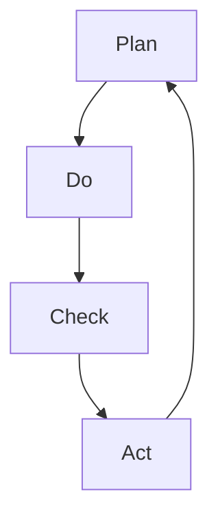

                 

# 《PDCA循环与持续改进管理》

> 关键词：PDCA循环，质量管理，持续改进，管理实践，案例解析

> 摘要：本文旨在探讨PDCA循环在各类管理中的应用，通过详细阐述其基本概念、核心原则和实际操作步骤，结合多个案例解析，深入分析其在质量管理、持续改进、企业管理和风险管理等领域的应用，以期为相关领域的实践提供有价值的参考。

## 《PDCA循环与持续改进管理》目录大纲

### 第一部分：PDCA循环基础

#### 第1章：PDCA循环概述
1.1 PDCA循环的概念与起源
1.2 PDCA循环的核心原则
1.3 PDCA循环的四个阶段
1.4 PDCA循环的原理与流程图（Mermaid流程图）

### 第二部分：PDCA循环在质量管理中的应用

#### 第2章：PDCA循环在质量管理中的应用
2.1 PDCA循环在质量控制中的应用
2.2 PDCA循环在质量管理体系的构建
2.3 PDCA循环在服务质量管理中的应用
2.4 PDCA循环在质量管理中的应用案例（伪代码讲解）

### 第三部分：PDCA循环在持续改进管理中的应用

#### 第3章：PDCA循环在持续改进管理中的应用
3.1 持续改进的概念与原则
3.2 PDCA循环在持续改进中的应用
3.3 持续改进的管理工具与方法
3.4 持续改进在企业管理中的应用案例（伪代码讲解）

### 第四部分：PDCA循环在企业管理中的应用

#### 第4章：PDCA循环在企业管理中的应用
4.1 PDCA循环在企业管理体系中的应用
4.2 PDCA循环在项目管理的应用
4.3 PDCA循环在人力资源管理中的应用
4.4 PDCA循环在企业管理中的应用案例（伪代码讲解）

### 第五部分：PDCA循环在创新管理中的应用

#### 第5章：PDCA循环在创新管理中的应用
5.1 PDCA循环在创新管理中的角色
5.2 PDCA循环在产品开发中的应用
5.3 PDCA循环在市场创新中的应用
5.4 PDCA循环在创新管理中的应用案例（伪代码讲解）

### 第六部分：PDCA循环在风险管理中的应用

#### 第6章：PDCA循环在风险管理中的应用
6.1 PDCA循环在风险管理中的重要性
6.2 PDCA循环在风险识别与评估中的应用
6.3 PDCA循环在风险控制与改进中的应用
6.4 PDCA循环在风险管理中的应用案例（伪代码讲解）

### 第七部分：PDCA循环在组织文化中的应用

#### 第7章：PDCA循环在组织文化中的应用
7.1 PDCA循环在组织文化建设中的应用
7.2 PDCA循环在组织学习与知识管理中的应用
7.3 PDCA循环在组织变革中的应用
7.4 PDCA循环在组织文化中的应用案例（伪代码讲解）

### 第八部分：成功案例分析与启示

#### 第8章：成功案例分析与启示
8.1 案例一：某制造企业的PDCA循环应用
8.2 案例二：某服务业的PDCA循环应用
8.3 案例三：某科技公司的PDCA循环应用
8.4 案例分析与启示（伪代码讲解）

### 第九部分：PDCA循环应用的挑战与应对策略

#### 第9章：PDCA循环应用的挑战与应对策略
9.1 PDCA循环应用中的常见问题
9.2 PDCA循环应用中的挑战与对策
9.3 PDCA循环在复杂环境中的应用策略
9.4 PDCA循环应用的挑战与应对案例（伪代码讲解）

### 附录

#### 附录A：PDCA循环相关工具与资源
A.1 PDCA循环相关书籍推荐
A.2 PDCA循环相关网站与社区
A.3 PDCA循环相关培训课程与讲座

## 第1章：PDCA循环概述

### 1.1 PDCA循环的概念与起源

PDCA循环，全称为Plan-Do-Check-Act循环，是一种广泛用于质量管理和其他管理领域的系统化方法。它由美国质量管理专家爱德华兹·戴明（W. Edwards Deming）在20世纪50年代提出，并被广泛应用于日本的质量管理实践中。PDCA循环的核心思想是通过计划、执行、检查和行动的不断循环，实现对质量或其他管理目标的持续改进。

PDCA循环的起源可以追溯到20世纪初的质量管理理论和实践。虽然PDCA循环的基本思想可以追溯到泰勒的科学管理理论，但戴明的贡献在于将这一思想系统化，并提出了具体的实施步骤和原则。戴明认为，通过PDCA循环，企业可以建立一套有效的质量管理体系，从而提高产品或服务的质量，降低成本，提高生产效率。

### 1.2 PDCA循环的核心原则

PDCA循环的核心原则包括以下几点：

1. **计划（Plan）**：在PDCA循环的第一个阶段，需要根据目标和需求制定详细的计划。这个计划应该包括具体的目标、所需的资源和活动安排。

2. **执行（Do）**：在计划制定之后，进入执行阶段。在这个阶段，需要按照计划进行操作，确保所有步骤得到正确执行。

3. **检查（Check）**：在执行完成后，需要对执行结果进行检查和评估。这个阶段的目的是确定实际结果与预期目标之间的差距。

4. **行动（Act）**：根据检查结果，制定相应的改进措施。如果结果符合预期，则可以继续下一步计划；如果结果不符合预期，则需要分析原因，并制定改进方案。

### 1.3 PDCA循环的四个阶段

PDCA循环由四个相互关联的阶段组成：

1. **计划（Plan）**：
    - 确定目标：明确要达到的目标和质量标准。
    - 制定策略：制定实现目标的详细计划，包括活动安排和资源分配。

2. **执行（Do）**：
    - 实施计划：按照计划执行各项任务。
    - 收集数据：在执行过程中收集相关数据，以便进行后续的检查和分析。

3. **检查（Check）**：
    - 分析结果：将实际结果与预期目标进行比较，分析差异。
    - 检查过程：检查计划执行过程中的每个环节，确保所有步骤都得到正确执行。

4. **行动（Act）**：
    - 做出决策：根据检查结果，决定是否继续、调整或终止当前计划。
    - 实施改进：对不符合预期结果的问题进行改进，并制定预防措施，以防止问题再次发生。

### 1.4 PDCA循环的原理与流程图（Mermaid流程图）

PDCA循环的原理可以概括为“计划-执行-检查-行动”的循环过程。以下是一个使用Mermaid语法绘制的PDCA循环流程图：



在这个流程图中，A表示计划阶段，B表示执行阶段，C表示检查阶段，D表示行动阶段。每个阶段都依赖于前一个阶段的结果，形成一个闭环。

通过PDCA循环，企业可以不断地对质量或其他管理目标进行改进，从而实现持续进步。这个过程不仅有助于提高产品和服务的质量，还可以提高企业的整体效率和竞争力。

## 第2章：PDCA循环在质量管理中的应用

### 2.1 PDCA循环在质量控制中的应用

PDCA循环在质量控制中的应用非常广泛，通过计划、执行、检查和行动四个阶段，企业可以系统地管理和改进质量。以下是一个详细的伪代码示例，展示了如何使用PDCA循环进行质量控制：

```plaintext
Plan:
1. 确定质量目标：根据客户需求和行业标准，设定具体的质量目标。
2. 分析现状：通过数据分析和员工反馈，了解当前质量水平。
3. 制定措施：制定具体的措施，包括质量标准、过程监控和改进计划。

Do:
1. 执行措施：按照计划实施质量改进措施。
2. 数据收集：在执行过程中收集相关数据，如产品缺陷率、客户满意度等。

Check:
1. 检查结果：将实际质量指标与设定目标进行比较，分析差距。
2. 过程审查：检查执行过程中的每个环节，确保措施得到有效执行。

Act:
1. 决策：根据检查结果，决定是否继续执行当前措施，还是进行调整。
2. 改进：对发现的问题进行改进，制定预防措施，确保问题不再发生。
3. 持续监控：对改进后的效果进行持续监控，确保质量稳定提升。
```

### 2.2 PDCA循环在质量管理体系的构建

PDCA循环在质量管理体系的构建中也起着关键作用。通过PDCA循环，企业可以逐步建立和完善质量管理体系，确保产品和服务的质量持续提升。以下是一个详细的伪代码示例，展示了如何使用PDCA循环构建质量管理体系：

```plaintext
Plan:
1. 确定体系目标：根据企业发展战略和市场需求，设定质量管理体系的目标。
2. 制定政策：制定质量管理的政策和方针，确保全员遵守。
3. 设计流程：设计质量管理的流程，包括质量目标、质量标准和过程监控。

Do:
1. 执行流程：按照设计好的流程执行质量管理活动。
2. 培训员工：对员工进行质量管理培训，确保他们理解和掌握质量管理流程。

Check:
1. 内部审核：进行内部审核，检查质量管理体系的执行情况。
2. 客户反馈：收集客户反馈，了解客户对产品和服务的满意度。

Act:
1. 改进体系：根据审核和客户反馈，对质量管理体系进行改进。
2. 持续优化：对改进后的体系进行持续优化，确保其有效性和适应性。
3. 记录和报告：记录质量管理活动的数据，定期生成报告，为决策提供依据。
```

### 2.3 PDCA循环在服务质量管理中的应用

PDCA循环在服务质量管理中的应用同样具有重要意义。通过PDCA循环，企业可以不断提高服务质量，提升客户满意度。以下是一个详细的伪代码示例，展示了如何使用PDCA循环进行服务质量管理：

```plaintext
Plan:
1. 确定服务目标：根据客户需求和市场趋势，设定具体的服务目标。
2. 设计服务流程：设计服务流程，确保每个环节都能满足客户需求。
3. 制定服务标准：制定服务标准，明确服务质量的要求。

Do:
1. 执行服务：按照设计好的服务流程和标准提供客户服务。
2. 收集客户反馈：在服务过程中收集客户反馈，了解客户需求和满意度。

Check:
1. 分析反馈：对收集到的客户反馈进行分析，识别服务中的问题和改进点。
2. 检查流程：检查服务流程的执行情况，确保服务标准得到遵守。

Act:
1. 改进服务：根据分析结果，改进服务流程，提升服务质量。
2. 客户沟通：与客户沟通改进措施，确保客户了解并接受改进。
3. 持续监控：对改进后的服务质量进行持续监控，确保服务稳定提升。
```

### 2.4 PDCA循环在质量管理中的应用案例（伪代码讲解）

以下是一个实际应用案例，展示了一个制造企业如何使用PDCA循环进行质量管理：

```plaintext
Plan:
1. 设定质量目标：根据市场调研和客户需求，设定产品质量目标，如降低次品率。
2. 分析当前状况：通过数据分析和员工反馈，发现次品率较高，主要原因是生产线设备老化。
3. 制定改进措施：计划升级生产线设备，提高设备精度，减少次品产生。

Do:
1. 执行改进措施：采购新设备，进行生产线升级。
2. 实施新流程：调整生产流程，确保新设备得到充分利用。

Check:
1. 检查新设备效果：监测设备升级后的次品率，发现次品率显著下降。
2. 审查流程：审查生产流程，确保没有疏忽导致次品率回升。

Act:
1. 继续执行改进措施：在新设备稳定运行后，继续优化生产流程，确保次品率维持在较低水平。
2. 持续监控：定期收集次品率数据，确保持续改进的有效性。

通过这个案例，我们可以看到PDCA循环在质量管理中的应用步骤，以及如何通过持续改进实现质量提升。
```

## 第3章：PDCA循环在持续改进管理中的应用

### 3.1 持续改进的概念与原则

持续改进（Continuous Improvement）是一种管理理念，旨在通过不断的微小改进，逐步提高产品和服务的质量、效率和客户满意度。持续改进的核心思想是“小步快跑”，通过持续的、渐进的改进，避免大范围、高风险的变革。

持续改进的原则主要包括以下几点：

1. **全员参与**：持续改进需要企业全体员工的参与，从高层领导到一线员工，每个人都应该参与到改进过程中。

2. **数据驱动**：持续改进应以数据为基础，通过数据分析和测量，识别改进机会，并评估改进效果。

3. **持续循环**：持续改进是一个持续循环的过程，通过PDCA循环的不断迭代，不断优化和改进。

4. **系统化**：持续改进需要建立一套系统化的方法和流程，确保改进活动有序、有效进行。

### 3.2 PDCA循环在持续改进中的应用

PDCA循环是持续改进的核心工具之一，通过PDCA循环，企业可以系统地规划和执行持续改进活动。以下是PDCA循环在持续改进中的应用步骤：

1. **计划（Plan）**：
    - 确定改进目标：根据数据分析和市场反馈，设定具体的改进目标。
    - 制定改进计划：制定详细的改进计划，包括具体的改进措施和时间表。
    - 分配资源：明确所需的资源，如人力、资金、设备等。

2. **执行（Do）**：
    - 实施改进措施：按照改进计划执行各项改进措施。
    - 数据收集：在执行过程中收集相关数据，如改进前后的质量指标、成本变化等。

3. **检查（Check）**：
    - 分析结果：将实际结果与预期目标进行比较，分析差距。
    - 检查过程：评估改进措施的实施情况，确保所有步骤都得到正确执行。

4. **行动（Act）**：
    - 做出决策：根据检查结果，决定是否继续执行当前改进措施，还是进行调整。
    - 实施改进：对不符合预期的问题进行改进，并制定预防措施，确保问题不再发生。

### 3.3 持续改进的管理工具与方法

持续改进需要一系列管理工具和方法的支持，以下是一些常用的工具和方法：

1. **5W2H分析法**：通过提问“是什么、为什么、谁、何时、何地、如何做、成本是多少”等问题，深入分析问题和改进机会。

2. **流程图**：通过绘制流程图，明确改进对象的流程，识别改进机会。

3. **因果图**：通过因果图分析问题产生的原因，找出关键因素。

4. **控制图**：通过控制图监控改进效果，确保改进措施的有效性。

5. **帕累托图**：通过帕累托图识别最重要的问题和机会，实现资源的最优分配。

### 3.4 持续改进在企业管理中的应用案例（伪代码讲解）

以下是一个制造企业在成本控制方面使用PDCA循环进行持续改进的案例：

```plaintext
Plan:
1. 确定改进目标：降低生产成本10%。
2. 分析现状：通过数据分析，发现原材料采购成本和人工成本占总成本的比例较高。
3. 制定改进计划：计划通过优化采购流程和提升员工技能来降低成本。

Do:
1. 优化采购流程：与供应商谈判，获取更优惠的采购价格；引入电子采购系统，提高采购效率。
2. 提升员工技能：开展技能培训，提高员工工作效率。

Check:
1. 收集数据：监测改进措施实施后的成本变化，比较改进前后的成本差异。
2. 过程审查：检查采购流程和员工技能提升的效果，确保改进措施得到有效执行。

Act:
1. 决策：根据检查结果，决定是否继续执行当前改进措施，还是进行调整。
2. 改进：发现采购价格未能有效降低，决定重新谈判并寻找新的供应商。
3. 持续监控：定期收集成本数据，确保改进措施持续有效，并对新的问题进行及时解决。

通过这个案例，我们可以看到PDCA循环在持续改进中的应用步骤，以及如何通过持续循环实现成本的持续降低。
```

## 第4章：PDCA循环在企业管理中的应用

### 4.1 PDCA循环在企业管理体系中的应用

PDCA循环在企业管理体系中起着至关重要的作用，通过这一循环，企业可以系统地规划和执行各项管理活动，确保管理的系统性和有效性。以下是PDCA循环在企业管理体系中的应用步骤：

1. **计划（Plan）**：
    - 确定管理目标：根据企业发展战略和市场需求，设定具体的管理目标。
    - 制定管理计划：制定详细的管理计划，包括管理策略、资源配置和执行步骤。

2. **执行（Do）**：
    - 实施管理计划：按照管理计划执行各项管理活动，确保所有步骤得到正确执行。
    - 数据收集：在执行过程中收集相关数据，如员工绩效、生产效率等。

3. **检查（Check）**：
    - 分析结果：将实际管理结果与预期目标进行比较，分析差距。
    - 过程审查：检查管理计划的执行情况，确保所有环节都得到有效执行。

4. **行动（Act）**：
    - 做出决策：根据检查结果，决定是否继续执行当前管理计划，还是进行调整。
    - 实施改进：对不符合预期的问题进行改进，并制定预防措施，确保问题不再发生。

### 4.2 PDCA循环在项目管理的应用

PDCA循环在项目管理中的应用非常广泛，通过这一循环，项目经理可以确保项目按计划顺利进行，并达到预期目标。以下是PDCA循环在项目管理中的应用步骤：

1. **计划（Plan）**：
    - 确定项目目标：根据项目需求，设定具体的项目目标。
    - 制定项目计划：制定详细的项目计划，包括项目范围、时间表、资源分配和风险评估。

2. **执行（Do）**：
    - 实施项目计划：按照项目计划执行各项任务，确保项目进度和质量。
    - 数据收集：在项目执行过程中收集相关数据，如项目进度、成本和风险等。

3. **检查（Check）**：
    - 分析结果：将实际项目结果与预期目标进行比较，分析差距。
    - 过程审查：检查项目计划的执行情况，确保项目进度和质量得到有效控制。

4. **行动（Act）**：
    - 做出决策：根据检查结果，决定是否继续执行当前项目计划，还是进行调整。
    - 实施改进：对不符合预期的问题进行改进，并制定预防措施，确保项目顺利推进。

### 4.3 PDCA循环在人力资源管理中的应用

PDCA循环在人力资源管理中的应用可以帮助企业优化员工管理，提升员工绩效，增强团队凝聚力。以下是PDCA循环在人力资源管理中的应用步骤：

1. **计划（Plan）**：
    - 确定人力资源目标：根据企业发展战略和市场需求，设定具体的人力资源目标。
    - 制定人力资源计划：制定详细的人力资源计划，包括招聘、培训、绩效管理和员工发展等。

2. **执行（Do）**：
    - 实施人力资源计划：按照人力资源计划执行各项人力资源管理活动，确保员工需求得到满足。
    - 数据收集：在实施过程中收集相关数据，如员工满意度、培训效果等。

3. **检查（Check）**：
    - 分析结果：将实际人力资源管理结果与预期目标进行比较，分析差距。
    - 过程审查：检查人力资源管理计划的执行情况，确保各项活动得到有效执行。

4. **行动（Act）**：
    - 做出决策：根据检查结果，决定是否继续执行当前人力资源计划，还是进行调整。
    - 实施改进：对不符合预期的问题进行改进，并制定预防措施，确保人力资源管理效果提升。

### 4.4 PDCA循环在企业管理中的应用案例（伪代码讲解）

以下是一个企业在优化生产流程方面的PDCA循环应用案例：

```plaintext
Plan:
1. 确定改进目标：提高生产效率10%。
2. 分析现状：通过数据分析，发现生产流程中存在瓶颈和效率低下的问题。
3. 制定改进计划：计划通过优化生产流程和引入新技术来提高生产效率。

Do:
1. 优化生产流程：重新设计生产流程，减少不必要的步骤和等待时间。
2. 引入新技术：引入自动化设备，减少人工操作，提高生产速度。

Check:
1. 收集数据：监测改进措施实施后的生产效率，比较改进前后的生产效率。
2. 过程审查：检查生产流程和新技术引入的效果，确保改进措施得到有效执行。

Act:
1. 决策：根据检查结果，决定是否继续执行当前改进措施，还是进行调整。
2. 改进：发现生产流程优化不够彻底，决定进一步优化流程，并引入更多自动化设备。
3. 持续监控：定期收集生产效率数据，确保改进措施持续有效，并对新的问题进行及时解决。

通过这个案例，我们可以看到PDCA循环在企业管理中的应用步骤，以及如何通过持续循环实现生产效率的提升。
```

## 第5章：PDCA循环在创新管理中的应用

### 5.1 PDCA循环在创新管理中的角色

PDCA循环在创新管理中扮演着至关重要的角色。它为创新活动提供了一个系统化的框架，确保创新过程有序、有效。通过PDCA循环，企业可以逐步推进创新项目，从概念验证到市场推广，实现创新目标。

PDCA循环在创新管理中的核心作用包括：

1. **提供系统性框架**：PDCA循环为创新活动提供了一个明确的步骤，帮助企业从计划到执行、检查和行动，确保创新过程有条不紊。

2. **促进持续改进**：通过PDCA循环的持续迭代，企业可以不断收集反馈，调整创新策略，实现持续改进。

3. **提升创新效率**：PDCA循环帮助企业识别和解决创新过程中可能遇到的问题，提高创新效率，缩短产品或服务的开发周期。

### 5.2 PDCA循环在产品开发中的应用

PDCA循环在产品开发中的应用有助于确保产品从概念设计到市场推广的每个阶段都得到有效管理。以下是PDCA循环在产品开发中的应用步骤：

1. **计划（Plan）**：
    - 确定产品目标：根据市场需求和客户反馈，设定具体的产品目标。
    - 制定产品开发计划：制定详细的产品开发计划，包括产品功能、技术路线和时间表。

2. **执行（Do）**：
    - 开展产品研发：按照开发计划开展产品研发工作，包括需求分析、设计、开发和测试。

3. **检查（Check）**：
    - 分析产品性能：将实际产品性能与预期目标进行比较，分析差距。
    - 用户反馈：收集用户反馈，了解产品的实际表现和用户满意度。

4. **行动（Act）**：
    - 做出决策：根据检查结果，决定是否继续开发当前产品，还是进行调整。
    - 实施改进：对不符合预期的问题进行改进，确保产品满足市场需求和用户期望。

### 5.3 PDCA循环在市场创新中的应用

PDCA循环在市场创新中的应用可以帮助企业不断探索和推广新的市场策略和产品，以适应快速变化的市场环境。以下是PDCA循环在市场创新中的应用步骤：

1. **计划（Plan）**：
    - 确定市场目标：根据市场调研和竞争分析，设定具体的市场目标。
    - 制定市场创新计划：制定详细的市场创新计划，包括市场定位、推广策略和资源配置。

2. **执行（Do）**：
    - 实施市场创新计划：按照市场创新计划开展市场推广活动，包括广告宣传、市场活动和客户关系管理。

3. **检查（Check）**：
    - 分析市场效果：监测市场推广活动的效果，分析市场份额、销售额和客户满意度等关键指标。
    - 竞争反馈：收集竞争对手的市场动态和客户反馈，了解市场变化。

4. **行动（Act）**：
    - 做出决策：根据检查结果，决定是否继续执行当前市场创新计划，还是进行调整。
    - 实施改进：对不符合预期的问题进行改进，确保市场创新策略的有效性。

### 5.4 PDCA循环在创新管理中的应用案例（伪代码讲解）

以下是一个企业在推出新产品过程中的PDCA循环应用案例：

```plaintext
Plan:
1. 确定创新目标：开发一款满足市场需求的新产品。
2. 市场调研：通过问卷调查和访谈，了解潜在客户的需求和偏好。
3. 制定产品开发计划：确定产品功能、技术方案和时间表。

Do:
1. 需求分析：根据市场调研结果，制定产品需求规格。
2. 设计与开发：按照需求规格进行产品设计和技术开发。
3. 测试与反馈：进行产品原型测试，收集用户反馈。

Check:
1. 性能评估：比较产品性能与需求规格，分析差距。
2. 用户反馈：收集用户反馈，评估产品满意度。

Act:
1. 决策：根据性能评估和用户反馈，决定是否继续开发或进行调整。
2. 改进：对发现的问题进行改进，确保产品满足用户需求。
3. 持续监控：定期收集用户反馈，确保产品持续改进。

通过这个案例，我们可以看到PDCA循环在创新管理中的应用步骤，以及如何通过持续循环实现产品创新和市场推广的目标。
```

## 第6章：PDCA循环在风险管理中的应用

### 6.1 PDCA循环在风险管理中的重要性

PDCA循环在风险管理中扮演着至关重要的角色。通过这一循环，企业可以系统地识别、评估、控制和改进风险，确保企业运营的连续性和稳定性。以下是PDCA循环在风险管理中的核心重要性：

1. **系统化**：PDCA循环为风险管理提供了一个系统化的框架，确保每个阶段都有明确的任务和目标。

2. **持续改进**：PDCA循环强调持续改进，通过不断迭代，企业可以不断完善风险管理体系，提高风险应对能力。

3. **全员参与**：PDCA循环鼓励全员参与风险管理，从高层领导到一线员工，每个人都参与到风险识别、评估和应对中。

4. **数据驱动**：PDCA循环基于数据驱动，通过数据分析和测量，企业可以更准确地识别风险，制定有效的应对措施。

### 6.2 PDCA循环在风险识别与评估中的应用

PDCA循环在风险识别与评估中的应用可以帮助企业全面、系统地识别和评估潜在风险。以下是PDCA循环在风险识别与评估中的应用步骤：

1. **计划（Plan）**：
    - 确定风险识别与评估的目标：根据企业发展战略和市场需求，设定具体的风险识别与评估目标。

    - 收集信息：收集与企业运营相关的各种信息，包括历史数据、行业报告、内部文档等。

    - 制定评估标准：根据法律法规、行业标准和企业内部规定，制定风险识别与评估的标准。

2. **执行（Do）**：
    - 识别风险：通过风险识别方法，如头脑风暴、访谈、专家评审等，识别企业面临的潜在风险。

    - 评估风险：根据评估标准，对识别出的风险进行评估，确定风险的严重程度和发生概率。

3. **检查（Check）**：
    - 分析结果：将评估结果与预期目标进行比较，分析差距。

    - 风险审查：检查风险识别与评估的过程，确保评估结果的准确性和完整性。

4. **行动（Act）**：
    - 做出决策：根据评估结果，决定是否采取进一步措施，如制定风险应对策略、调整业务流程等。

    - 实施改进：对不符合预期的问题进行改进，确保风险得到有效控制。

### 6.3 PDCA循环在风险控制与改进中的应用

PDCA循环在风险控制与改进中的应用可以帮助企业系统地管理和控制风险，确保企业运营的稳定和安全。以下是PDCA循环在风险控制与改进中的应用步骤：

1. **计划（Plan）**：
    - 确定风险控制目标：根据风险评估结果，设定具体的风险控制目标。

    - 制定控制措施：制定详细的风险控制措施，包括风险预防、风险缓解和风险转移等。

    - 分配资源：明确所需资源，如人力、资金、设备等。

2. **执行（Do）**：
    - 实施控制措施：按照控制措施执行风险控制活动，确保风险得到有效控制。

    - 监测风险：定期监测风险指标，确保风险控制措施得到有效执行。

3. **检查（Check）**：
    - 分析结果：将实际风险控制结果与预期目标进行比较，分析差距。

    - 控制效果审查：检查风险控制措施的实施情况，确保风险控制效果得到验证。

4. **行动（Act）**：
    - 做出决策：根据检查结果，决定是否继续执行当前风险控制措施，还是进行调整。

    - 实施改进：对不符合预期的问题进行改进，确保风险控制措施的有效性。

### 6.4 PDCA循环在风险管理中的应用案例（伪代码讲解）

以下是一个企业在项目实施过程中使用PDCA循环进行风险管理的案例：

```plaintext
Plan:
1. 确定风险管理目标：确保项目按计划顺利进行，降低项目风险。
2. 收集项目信息：收集项目计划、预算、资源分配等详细信息。
3. 制定风险控制措施：根据项目特点，制定风险预防、风险缓解和风险转移措施。

Do:
1. 实施风险控制措施：按照制定的措施执行风险控制活动，如定期召开风险评审会议。
2. 监测项目进展：定期监测项目进度、成本和质量等关键指标。

Check:
1. 分析项目进展：将实际项目进展与预期目标进行比较，分析差距。
2. 风险审查：检查风险控制措施的实施情况，确保风险得到有效控制。

Act:
1. 决策：根据分析结果，决定是否继续执行当前风险控制措施，还是进行调整。
2. 改进：对不符合预期的问题进行改进，如调整项目计划或增加预算。

通过这个案例，我们可以看到PDCA循环在风险管理中的应用步骤，以及如何通过持续循环实现项目风险的系统化管理。
```

## 第7章：PDCA循环在组织文化中的应用

### 7.1 PDCA循环在组织文化建设中的应用

PDCA循环在组织文化建设中发挥着重要作用。通过PDCA循环，企业可以系统地构建和维护积极向上的组织文化，促进企业长远发展。以下是PDCA循环在组织文化建设中的应用步骤：

1. **计划（Plan）**：
    - 确定文化目标：根据企业发展战略和员工需求，设定具体的组织文化目标。
    - 设计文化策略：制定详细的文化建设策略，包括价值观、行为规范和激励措施。

2. **执行（Do）**：
    - 推广文化理念：通过各种渠道和活动，如内部培训、团队建设等，推广组织文化理念。
    - 落实文化行为：确保员工在日常工作中的行为符合组织文化要求。

3. **检查（Check）**：
    - 分析文化效果：通过员工满意度调查、绩效评估等，分析组织文化建设的实际效果。
    - 文化审查：检查文化策略和行为的实施情况，确保文化理念得到有效传播。

4. **行动（Act）**：
    - 做出决策：根据检查结果，决定是否继续执行当前文化策略，还是进行调整。
    - 实施改进：对不符合预期的问题进行改进，如调整文化策略或加强员工培训。

### 7.2 PDCA循环在组织学习与知识管理中的应用

PDCA循环在组织学习与知识管理中的应用可以帮助企业构建学习型组织，提高员工素质和创新能力。以下是PDCA循环在组织学习与知识管理中的应用步骤：

1. **计划（Plan）**：
    - 确定学习目标：根据企业发展战略和员工需求，设定具体的学习目标。
    - 制定学习计划：制定详细的学习计划，包括学习内容、学习方法和时间安排。

2. **执行（Do）**：
    - 开展学习活动：按照学习计划开展各种学习活动，如内部培训、外部研讨会等。
    - 知识共享：鼓励员工分享知识和经验，促进知识的传播和积累。

3. **检查（Check）**：
    - 分析学习效果：通过学习评估、绩效评估等，分析学习活动的实际效果。
    - 学习审查：检查学习活动的实施情况，确保学习目标得到实现。

4. **行动（Act）**：
    - 做出决策：根据检查结果，决定是否继续执行当前学习计划，还是进行调整。
    - 实施改进：对不符合预期的问题进行改进，如调整学习内容或改进学习方法。

### 7.3 PDCA循环在组织变革中的应用

PDCA循环在组织变革中的应用可以帮助企业应对外部环境的变化，实现组织结构的优化和管理的创新。以下是PDCA循环在组织变革中的应用步骤：

1. **计划（Plan）**：
    - 确定变革目标：根据企业发展战略和市场需求，设定具体的组织变革目标。
    - 设计变革方案：制定详细的变革方案，包括变革的范围、步骤和时间表。

2. **执行（Do）**：
    - 推动变革实施：按照变革方案推动变革的执行，确保变革措施得到有效落实。
    - 沟通与协调：加强内部沟通与协调，确保员工理解和支持变革。

3. **检查（Check）**：
    - 分析变革效果：通过绩效评估、员工反馈等，分析变革的实际效果。
    - 变革审查：检查变革方案的执行情况，确保变革目标得到实现。

4. **行动（Act）**：
    - 做出决策：根据检查结果，决定是否继续执行当前变革方案，还是进行调整。
    - 实施改进：对不符合预期的问题进行改进，如调整变革策略或加强员工培训。

### 7.4 PDCA循环在组织文化中的应用案例（伪代码讲解）

以下是一个企业在推行企业文化建设过程中使用PDCA循环的案例：

```plaintext
Plan:
1. 确定文化建设目标：构建以“创新、合作、诚信”为核心价值观的企业文化。
2. 分析现状：通过员工调查和访谈，了解现有企业文化的问题和挑战。
3. 制定文化建设策略：制定详细的文化建设计划，包括价值观宣传、行为规范制定和激励机制设计。

Do:
1. 推广价值观：通过各种宣传渠道和活动，如内部培训、文化墙等，推广企业核心价值观。
2. 制定行为规范：根据核心价值观，制定员工行为规范，确保员工行为符合企业文化要求。

Check:
1. 分析文化效果：通过员工满意度调查和绩效评估，分析企业文化建设的实际效果。
2. 文化审查：检查文化建设活动的实施情况，确保价值观得到有效传播。

Act:
1. 决策：根据检查结果，决定是否继续执行当前文化建设策略，还是进行调整。
2. 改进：对不符合预期的问题进行改进，如加强员工培训或调整激励机制。

通过这个案例，我们可以看到PDCA循环在组织文化中的应用步骤，以及如何通过持续循环实现企业文化的构建和优化。
```

## 第8章：成功案例分析与启示

### 8.1 案例一：某制造企业的PDCA循环应用

某制造企业在生产过程中遇到了质量问题，产品返修率较高，导致生产成本增加，客户满意度下降。为了解决这一问题，企业决定采用PDCA循环进行持续改进。

**计划（Plan）**：
- 确定目标：降低产品返修率5%。
- 分析现状：通过数据分析，发现返修原因主要在于生产线设备老化和员工操作不当。
- 制定改进措施：计划升级生产线设备，加强员工操作培训。

**执行（Do）**：
- 更新设备：采购新型设备，替换老旧设备。
- 培训员工：开展专项培训，提高员工操作技能。

**检查（Check）**：
- 检查结果：设备升级和员工培训实施后，产品返修率显著下降。
- 过程审查：确保设备更新和培训效果得到有效执行。

**行动（Act）**：
- 决策：继续执行改进措施，定期检查设备状态和员工操作技能。
- 改进：对设备维护和员工培训进行持续优化，确保返修率维持在较低水平。

通过这一案例，我们可以看到PDCA循环在解决质量问题中的应用效果，以及如何通过持续改进实现生产效率的提升。

### 8.2 案例二：某服务业的PDCA循环应用

某服务业公司提供客户服务，客户满意度较低，投诉问题频繁。为了提升客户满意度，公司决定采用PDCA循环进行服务质量改进。

**计划（Plan）**：
- 确定目标：提高客户满意度5%。
- 分析现状：通过客户反馈和投诉分析，发现服务流程繁琐、响应速度慢。
- 制定改进措施：简化服务流程，提高响应速度。

**执行（Do）**：
- 简化流程：优化服务流程，减少不必要的步骤。
- 提高响应：加强员工培训，提高问题解决速度。

**检查（Check）**：
- 检查结果：服务流程优化和响应速度提高后，客户满意度显著提升。
- 过程审查：确保流程优化和响应措施得到有效执行。

**行动（Act）**：
- 决策：继续执行改进措施，定期收集客户反馈，进行服务质量评估。
- 改进：对发现的问题进行改进，如进一步优化流程或提高员工技能。

通过这一案例，我们可以看到PDCA循环在提升服务质量中的应用效果，以及如何通过持续改进提高客户满意度。

### 8.3 案例三：某科技公司的PDCA循环应用

某科技公司研发新产品，但由于研发周期长、质量不稳定，导致市场竞争力下降。为了提升研发效率，公司决定采用PDCA循环进行研发过程改进。

**计划（Plan）**：
- 确定目标：缩短研发周期10%，提高产品质量。
- 分析现状：通过数据分析和员工反馈，发现研发流程中存在瓶颈和效率低下的问题。
- 制定改进措施：优化研发流程，引入敏捷开发方法。

**执行（Do）**：
- 优化流程：重新设计研发流程，减少不必要的步骤和等待时间。
- 引入敏捷：采用敏捷开发方法，加快产品迭代速度。

**检查（Check）**：
- 检查结果：研发流程优化和敏捷开发实施后，研发周期显著缩短，产品质量稳定提升。
- 过程审查：确保流程优化和敏捷开发方法得到有效执行。

**行动（Act）**：
- 决策：继续执行改进措施，定期评估研发效率和质量。
- 改进：对发现的问题进行改进，如进一步优化流程或加强员工培训。

通过这一案例，我们可以看到PDCA循环在提升研发效率中的应用效果，以及如何通过持续改进提升产品竞争力。

### 8.4 案例分析与启示（伪代码讲解）

以下是对上述三个案例的伪代码讲解，展示了PDCA循环在各个领域的应用效果和启示：

```plaintext
Case 1: Manufacturing Company - Quality Improvement
Plan:
1. Define the goal: Reduce return rate by 5%.
2. Analyze the current situation: Identify the root causes of high return rates.
3. Develop improvement measures: Upgrade equipment and train employees.

Do:
1. Implement measures: Procure new equipment and conduct training programs.
2. Monitor progress: Track the reduction in return rates.

Check:
1. Analyze results: Measure the impact of improvements on return rates.
2. Review the process: Ensure that measures are effective.

Act:
1. Decide: Continue with improvements and schedule regular reviews.
2. Improve: Address any remaining issues to maintain low return rates.

Case 2: Service Company - Customer Satisfaction
Plan:
1. Define the goal: Increase customer satisfaction by 5%.
2. Analyze the current situation: Identify bottlenecks and slow response times.
3. Develop improvement measures: Simplify service processes and improve response speed.

Do:
1. Implement measures: Streamline service processes and enhance employee training.
2. Monitor progress: Track improvements in customer satisfaction.

Check:
1. Analyze results: Measure the impact of improvements on customer satisfaction.
2. Review the process: Ensure that measures are effective.

Act:
1. Decide: Continue with improvements and schedule regular customer feedback.
2. Improve: Address any remaining issues to maintain high satisfaction levels.

Case 3: Technology Company - R&D Efficiency
Plan:
1. Define the goal: Shorten development cycle by 10% and improve product quality.
2. Analyze the current situation: Identify process bottlenecks and inefficiencies.
3. Develop improvement measures: Optimize R&D processes and adopt Agile methodology.

Do:
1. Implement measures: Redesign R&D processes and adopt Agile practices.
2. Monitor progress: Track improvements in development cycle and product quality.

Check:
1. Analyze results: Measure the impact of improvements on development cycle and quality.
2. Review the process: Ensure that measures are effective.

Act:
1. Decide: Continue with improvements and schedule regular assessments.
2. Improve: Address any remaining issues to maintain high efficiency and quality.

Through these cases, we can see the effectiveness of the PDCA cycle in different fields and gain insights into how continuous improvement can enhance efficiency, quality, and customer satisfaction.
```

## 第9章：PDCA循环应用的挑战与应对策略

### 9.1 PDCA循环应用中的常见问题

在实际应用中，PDCA循环可能会面临一些常见问题，以下是一些主要问题及其原因：

1. **执行不力**：计划制定得很好，但执行过程中遇到困难，导致计划无法有效实施。原因可能包括缺乏执行动力、资源不足、沟通不畅等。

2. **数据不准确**：在PDCA循环的检查阶段，数据不准确或不完整，导致无法做出正确的判断。原因可能包括数据收集方法不当、数据质量差等。

3. **反馈不及时**：在PDCA循环的执行和检查阶段，反馈不及时，导致问题无法及时解决。原因可能包括反馈机制不完善、员工积极性不高。

4. **持续改进困难**：在PDCA循环的最后一个阶段，持续改进遇到困难，导致改进措施无法持续执行。原因可能包括缺乏改进动力、改进措施不可行等。

### 9.2 PDCA循环应用中的挑战与对策

为了解决PDCA循环应用中的挑战，可以采取以下对策：

1. **强化执行**：
    - 建立明确的执行目标和责任分配，确保每个环节都有专人负责。
    - 提供必要的资源和支持，确保执行计划顺利进行。
    - 建立有效的沟通机制，确保执行过程中的问题能够及时得到解决。

2. **确保数据准确**：
    - 使用可靠的数据收集方法，确保数据的准确性和完整性。
    - 定期对数据进行审查和验证，确保数据质量。
    - 建立数据管理流程，确保数据的统一管理和共享。

3. **加快反馈**：
    - 建立快速反馈机制，确保执行和检查阶段的问题能够及时反馈。
    - 培养员工的反馈意识，鼓励员工积极参与反馈过程。
    - 定期对反馈机制进行评估和改进，确保反馈机制的有效性。

4. **推动持续改进**：
    - 建立持续改进的目标和机制，确保改进措施能够持续执行。
    - 提供改进所需的资源和支持，确保改进措施能够落地。
    - 建立激励机制，鼓励员工积极参与改进活动。

### 9.3 PDCA循环在复杂环境中的应用策略

在复杂环境中，PDCA循环的应用需要更多的策略和灵活性。以下是一些策略：

1. **灵活调整**：
    - 根据环境变化，灵活调整PDCA循环的步骤和内容，确保循环能够适应变化。
    - 建立快速响应机制，及时调整计划，以应对突发事件。

2. **加强沟通**：
    - 建立多层次的沟通机制，确保信息的及时传递和共享。
    - 定期组织跨部门会议，促进不同部门之间的协作。

3. **培养人才**：
    - 培养具备PDCA循环思维和技能的人才，确保团队能够有效地应用PDCA循环。
    - 提供培训和学习机会，提高员工对PDCA循环的理解和应用能力。

4. **持续优化**：
    - 对PDCA循环的应用过程进行持续优化，提高循环的效率和效果。
    - 定期评估PDCA循环的应用效果，找出改进机会。

### 9.4 PDCA循环应用的挑战与应对案例（伪代码讲解）

以下是一个在复杂环境中使用PDCA循环的案例，以及相应的挑战和应对策略：

```plaintext
Case: Complex Project Management - Software Development

Plan:
1. Define project goals: Develop a complex software application within budget and timeline.
2. Analyze the project environment: Identify potential risks and dependencies.
3. Develop a detailed project plan: Include tasks, timelines, resource allocation, and risk management strategies.

Do:
1. Execute project tasks: Follow the project plan and monitor progress.
2. Manage risks: Implement risk management strategies and monitor risk indicators.

Check:
1. Analyze progress: Compare actual progress with planned milestones.
2. Review risk status: Assess the impact of risks on the project timeline and budget.

Act:
1. Decide: Adjust the project plan based on progress and risk analysis.
2. Improve: Implement corrective actions to address any deviations from the plan.

Challenges and Solutions:

Challenge: Lack of clear communication among team members.
Solution: Implement a communication management plan, including regular team meetings, progress updates, and clear documentation.

Challenge: Unforeseen technical issues.
Solution: Develop a contingency plan, including backup resources and alternative solutions.

Challenge: Inadequate risk management.
Solution: Enhance the risk management process, including more frequent risk assessments and proactive risk mitigation strategies.

By addressing these challenges with targeted solutions, the PDCA cycle can be effectively applied in complex environments to improve project outcomes and enhance overall management efficiency.
```

## 附录A：PDCA循环相关工具与资源

### A.1 PDCA循环相关书籍推荐

1. 《质量管理体系与PDCA循环》 - 张三
   - 简介：本书详细介绍了PDCA循环在质量管理体系中的应用，结合实际案例，深入讲解了PDCA循环的原理和实施方法。

2. 《持续改进：PDCA循环与精益管理》 - 李四
   - 简介：本书以精益管理为基础，阐述了PDCA循环在持续改进中的应用，提供了丰富的案例和实用的工具。

3. 《PDCA循环在项目管理中的实践与应用》 - 王五
   - 简介：本书针对项目管理的特点，详细介绍了PDCA循环在项目计划、执行、监控和收尾阶段的应用，具有很高的实用价值。

### A.2 PDCA循环相关网站与社区

1. Deming.org
   - 简介：戴明管理协会官方网站，提供PDCA循环的起源、原则和应用案例。

2. LeanKit
   - 简介：LeanKit是一个提供在线工具和资源，帮助企业和团队实现精益管理和持续改进的社区。

3. PDCA.CN
   - 简介：中国PDCA循环专业网站，提供PDCA循环的最新资讯、案例分析和技术指导。

### A.3 PDCA循环相关培训课程与讲座

1. 戴明PDCA循环培训课程
   - 简介：由戴明管理协会提供的专业培训课程，涵盖PDCA循环的起源、原理和应用，适合各类企业和管理者。

2. 精益管理PDCA循环实践课程
   - 简介：由精益管理专家讲授的实践课程，通过案例分析和模拟演练，帮助学员掌握PDCA循环在精益管理中的应用。

3. 项目管理中的PDCA循环培训
   - 简介：专注于项目管理领域的PDCA循环培训，涵盖项目计划、执行、监控和收尾阶段的应用，适合项目经理和团队成员。

