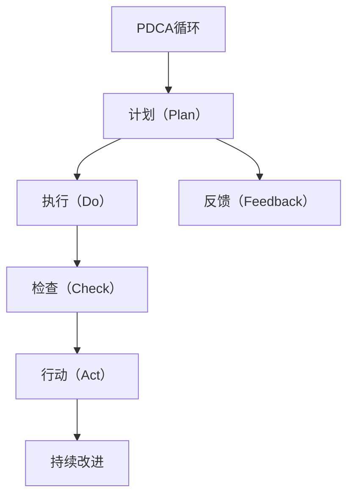

                 

# PDCA落地：持续改进的指南

## 关键词
- PDCA循环
- 持续改进
- 计划执行检查
- 持续改进方法论
- 实战案例

## 摘要
本文深入探讨了PDCA循环的基本概念、原理和方法论，旨在为读者提供一套清晰、实用的持续改进指南。通过详细的章节划分和实例讲解，本文不仅阐述了PDCA循环在各个领域的应用，还介绍了其实战指南与案例分析，帮助读者更好地理解和应用PDCA循环。

## 目录大纲

### 第一部分：PDCA原理与方法论

#### 第1章：PDCA循环的基本概念与框架

1.1 PDCA循环的历史背景

1.2 PDCA循环的四个阶段

1.3 PDCA循环的核心价值

1.4 PDCA循环在企业管理中的应用

#### 第2章：PDCA循环的详细分析

2.1 计划（Plan）阶段

2.2 执行（Do）阶段

2.3 检查（Check）阶段

2.4 行动（Act）阶段

#### 第3章：PDCA循环在不同行业中的应用

3.1 制造业中的PDCA应用

3.2 服务业中的PDCA应用

3.3 创新型企业中的PDCA应用

3.4 持续改进与PDCA

### 第二部分：实战指南与案例

#### 第4章：PDCA在项目管理中的应用

4.1 项目启动与计划

4.2 项目执行与监控

4.3 项目结果分析与改进

4.4 PDCA在项目评估中的应用

#### 第5章：PDCA在人力资源管理中的应用

5.1 员工绩效评估

5.2 培训与发展

5.3 团队管理

5.4 持续改进

#### 第6章：PDCA在供应链管理中的应用

6.1 供应链规划

6.2 供应链执行

6.3 供应链监控

6.4 供应链改进

#### 第7章：PDCA在流程优化中的应用

7.1 流程分析

7.2 流程改进

7.3 流程监控

7.4 流程优化案例研究

#### 第8章：PDCA跨领域应用案例

8.1 医疗行业中的PDCA应用

8.2 教育行业中的PDCA应用

8.3 公共管理中的PDCA应用

8.4 国际贸易中的PDCA应用

#### 第9章：PDCA在企业战略规划中的应用

9.1 战略目标设定

9.2 战略规划与执行

9.3 战略评估与改进

9.4 PDCA与战略实施

#### 第10章：PDCA在持续改进中的关键因素

10.1 持续改进的组织文化

10.2 员工参与与培训

10.3 数据分析与决策

10.4 PDCA与ISO质量管理体系

### 第三部分：附录

#### 附录A：PDCA工具与资源

A.1 PDCA工具清单

A.2 PDCA案例分析

A.3 PDCA相关书籍与论文推荐

A.4 PDCA在线资源与学习平台推荐

## 核心概念与联系

### PDCA循环的基本概念与框架

为了更好地理解PDCA循环，我们首先需要明确其核心概念和基本框架。PDCA循环，又称戴明循环，是一种广泛应用于企业管理、项目管理和流程优化的持续改进方法论。它由四个阶段组成：计划（Plan）、执行（Do）、检查（Check）和行动（Act）。

Mermaid 流程图：



在PDCA循环中，每个阶段都有其特定的目标和任务。以下是对各个阶段的基本描述：

- **计划（Plan）阶段**：在这个阶段，需要设定改进目标，分析现状，找出存在的问题，并制定具体的改进措施和时间表。

- **执行（Do）阶段**：在这个阶段，根据计划执行具体的改进措施，并监控过程，确保计划的顺利进行。

- **检查（Check）阶段**：在这个阶段，需要对执行结果进行评估，分析实际结果与预期目标的差距，并总结经验教训。

- **行动（Act）阶段**：在这个阶段，需要根据检查结果，提出改进措施，并执行这些措施，以实现持续改进。

### 核心算法原理讲解

#### 计划（Plan）阶段的算法原理

在计划阶段，核心任务是设定目标、分析现状和制定计划。以下是一个简化的伪代码来描述这一过程：

```plaintext
function plan(target, current_state):
    # 分析现状
    current_issues = analyze_current_state(current_state)
    # 制定计划
    improvement_measures = generate_improvement_measures(current_issues)
    schedule = generate_schedule(improvement_measures)
    return target, improvement_measures, schedule
```

1. **设定目标**：根据企业战略目标，设定具体可量化的目标。例如，如果目标是提高生产效率，可以将目标设定为“提高生产效率10%”。

2. **分析现状**：收集数据，分析现有流程和指标，确定存在的问题。例如，如果生产效率低，可能是由于设备故障或操作流程不合理。

3. **制定计划**：基于现状分析，制定具体的改进措施和时间表。例如，如果设备故障是主要问题，可以制定“每月进行一次设备检查”的计划。

### 数学模型和数学公式

为了量化改进效果，我们可以使用以下数学模型：

$$
R = \frac{O - A}{O}
$$

其中：

- \( R \) 表示结果评估分数
- \( O \) 表示目标值
- \( A \) 表示实际值

该公式可以用来计算实际结果与目标值的差距，从而评估改进效果。

### 项目实战

#### PDCA在供应链管理中的应用案例

##### 案例背景

某企业生产线上原材料供应存在延迟问题，影响了生产效率。为了解决这个问题，企业决定应用PDCA循环进行改进。

##### 代码实现（Python）

```python
import pandas as pd

# 数据准备
data = {'Order Date': ['2023-01-01', '2023-02-01', '2023-03-01'],
         'Delivery Date': ['2023-01-05', '2023-02-10', '2023-03-05'],
         'Target Delivery Date': ['2023-01-05', '2023-02-01', '2023-03-01']}
df = pd.DataFrame(data)

# 计划阶段
target = df['Target Delivery Date'].min()
current_state = df['Delivery Date'].min()

# 执行阶段
improvement_measures = '加强与供应商的沟通，调整采购计划'

# 检查阶段
result = df['Delivery Date'].min() - target

# 行动阶段
if result > 0:
    print("需要采取改进措施：", improvement_measures)
else:
    print("目标达成，无需改进。")
```

##### 代码解读与分析

- 数据准备：导入相关数据，包括订单日期、交付日期和目标交付日期。
- 计划阶段：设定目标（最早的目标交付日期）和当前状态（最晚的交付日期）。
- 执行阶段：根据当前状态制定改进措施。
- 检查阶段：计算实际结果与目标的差值。
- 行动阶段：根据结果决定是否需要采取改进措施。

通过这个案例，我们可以看到PDCA循环如何帮助企业识别问题、制定改进措施并持续改进，从而提高整体运营效率。### 第一部分：PDCA原理与方法论

#### 第1章：PDCA循环的基本概念与框架

1.1 PDCA循环的历史背景

PDCA循环，亦称为戴明循环，是由美国质量管理专家爱德华·戴明（W. Edwards Deming）在20世纪中叶提出的。戴明博士深受日本质量运动的启发，并在其影响下将PDCA循环引入到日本。PDCA循环作为一种系统化的改进方法，很快在日本各行各业得到了广泛应用，并成为日本制造业崛起的重要基石。随着时间的推移，PDCA循环被全球范围内的企业所接受，并逐渐成为质量管理的重要组成部分。

1.2 PDCA循环的四个阶段

PDCA循环包括四个相互关联的阶段，即计划（Plan）、执行（Do）、检查（Check）和行动（Act）。每个阶段都有其特定的任务和目标，形成了一个闭环系统，使得问题能够不断地被发现、分析和解决。

- **计划（Plan）阶段**：在这个阶段，需要设定目标、分析现状、找出问题，并制定具体的改进计划。计划阶段的核心任务是明确改进的方向和策略。

- **执行（Do）阶段**：在计划阶段制定完改进计划后，进入执行阶段。这个阶段的主要任务是实施计划，执行具体的改进措施，并确保计划的顺利进行。

- **检查（Check）阶段**：执行阶段完成后，进入检查阶段。在这个阶段，需要收集数据，对执行结果进行评估，分析实际结果与预期目标的差距，并总结经验教训。

- **行动（Act）阶段**：在检查阶段完成后，进入行动阶段。这个阶段的主要任务是针对检查结果提出改进措施，并实施这些措施，以实现持续改进。

1.3 PDCA循环的核心价值

PDCA循环的核心价值在于其系统化的改进方法和闭环管理思想。通过四个阶段的循环，PDCA循环能够帮助企业不断发现问题、解决问题，并持续改进。以下是PDCA循环的几个关键价值：

- **持续改进**：PDCA循环强调持续改进，通过不断循环，企业能够不断提高产品和服务质量，提高生产效率，降低成本。

- **系统化管理**：PDCA循环提供了一种系统化的管理方法，使得企业能够有条不紊地解决问题，并形成一种持续改进的文化。

- **问题导向**：PDCA循环以问题为导向，帮助企业识别问题、分析问题并解决问题，从而提高企业的应变能力和创新能力。

- **数据驱动**：PDCA循环强调数据收集和分析，通过数据驱动决策，使得改进措施更加科学和有效。

1.4 PDCA循环在企业管理中的应用

PDCA循环在企业管理中的应用非常广泛，几乎涵盖了所有管理领域。以下是一些典型的应用场景：

- **质量管理**：PDCA循环广泛应用于质量管理，帮助企业识别质量问题、分析原因并采取改进措施，从而提高产品和服务质量。

- **项目管理**：在项目管理中，PDCA循环可以帮助项目团队识别项目风险、制定项目管理计划，并确保项目按计划顺利进行。

- **流程优化**：PDCA循环可以帮助企业分析现有流程，找出瓶颈和问题，并采取改进措施，从而优化流程，提高效率。

- **人力资源**：在人力资源管理中，PDCA循环可以帮助企业评估员工绩效、制定培训计划，并不断改进人力资源管理体系。

- **供应链管理**：PDCA循环可以帮助企业优化供应链流程，提高供应链效率，降低库存成本。

通过以上对PDCA循环基本概念和框架的介绍，我们可以看到，PDCA循环是一种系统化、数据驱动、问题导向的持续改进方法论。它在企业管理中具有广泛的应用价值，可以帮助企业不断提高产品质量、优化流程、提高效率。接下来，我们将深入探讨PDCA循环的四个阶段，详细分析每个阶段的核心任务和方法。### 第2章：PDCA循环的详细分析

PDCA循环包括计划（Plan）、执行（Do）、检查（Check）和行动（Act）四个阶段，每个阶段都有其特定的任务和目标。本章节将详细分析每个阶段的核心任务和方法，帮助读者更好地理解和应用PDCA循环。

#### 2.1 计划（Plan）阶段

计划阶段是PDCA循环的起点，其核心任务是设定目标、分析现状、找出问题并制定具体的改进计划。

**设定目标**

在计划阶段，首先需要明确改进的目标。这些目标应当是具体、可量化的，并与企业的整体战略目标相一致。例如，如果目标是提高生产效率，可以将目标设定为“提高生产效率10%”。

**分析现状**

接下来，需要收集和分析相关数据，以了解现状并识别存在的问题。这包括以下几个方面：

- **收集数据**：通过问卷调查、访谈、现场观察等方式，收集与问题相关的数据。

- **现状分析**：分析收集到的数据，找出存在的问题和潜在瓶颈。

- **原因分析**：通过鱼骨图、5Why等方法，深入分析问题产生的原因。

**制定计划**

在明确了目标和分析现状后，需要制定具体的改进计划。这包括以下几个方面：

- **制定措施**：根据问题分析的结果，制定具体的改进措施。

- **确定责任**：明确每个改进措施的责任人，确保改进计划能够顺利实施。

- **时间表**：制定详细的实施时间表，确保改进措施能够在预定时间内完成。

- **资源需求**：明确实施改进计划所需的资源，包括人力、物力和财力等。

伪代码示例：

```plaintext
function plan(target, current_state):
    # 分析现状
    current_issues = analyze_current_state(current_state)
    # 制定计划
    improvement_measures = generate_improvement_measures(current_issues)
    schedule = generate_schedule(improvement_measures)
    return target, improvement_measures, schedule
```

#### 2.2 执行（Do）阶段

执行阶段是PDCA循环的核心环节，其主要任务是按照计划实施改进措施，并监控过程以确保计划的顺利进行。

**执行计划**

在执行阶段，需要按照计划实施具体的改进措施。这包括以下几个方面：

- **实施措施**：根据改进计划，执行具体的改进措施。

- **过程监控**：监控改进措施的实施过程，确保计划能够按预期进行。

- **问题解决**：在执行过程中，如遇到问题，需要及时解决，确保改进计划的顺利进行。

**数据收集**

在执行阶段，还需要收集与改进措施相关的数据，包括改进效果、成本、时间等。这些数据将为后续的检查阶段提供基础。

#### 2.3 检查（Check）阶段

检查阶段的主要任务是评估执行结果，分析实际结果与预期目标的差距，并总结经验教训。

**评估结果**

在检查阶段，首先需要收集执行阶段的数据，并对这些数据进行整理和分析。这包括以下几个方面：

- **结果分析**：分析实际结果与预期目标的差距。

- **效果评估**：评估改进措施的效果，判断是否达到了预期目标。

**总结经验**

在评估结果的基础上，需要总结经验教训，为下一步的行动阶段提供参考。这包括以下几个方面：

- **成功经验**：总结成功的经验和做法，为后续改进提供借鉴。

- **问题总结**：总结执行过程中遇到的问题和挑战，并提出改进建议。

#### 2.4 行动（Act）阶段

行动阶段是PDCA循环的最后一步，其主要任务是针对检查阶段的结果，提出改进措施并执行这些措施，以实现持续改进。

**提出改进措施**

在行动阶段，需要根据检查阶段的结果，提出具体的改进措施。这包括以下几个方面：

- **改进建议**：根据检查结果，提出针对性的改进建议。

- **责任分配**：明确每个改进措施的责任人，确保改进措施能够得到有效实施。

**执行改进措施**

在提出改进措施后，需要按照计划执行这些措施。这包括以下几个方面：

- **措施实施**：根据改进计划，执行具体的改进措施。

- **监控执行**：监控改进措施的实施过程，确保改进措施能够按计划进行。

- **反馈调整**：根据执行情况，及时调整改进措施，确保改进目标的实现。

通过以上对PDCA循环四个阶段的详细分析，我们可以看到，PDCA循环是一种系统化、数据驱动、问题导向的持续改进方法论。通过四个阶段的循环，企业能够不断发现问题、解决问题，并持续改进，从而提高产品和服务质量，优化管理流程。接下来，我们将探讨PDCA循环在不同行业中的应用，进一步展示其广泛的应用价值。### 第3章：PDCA循环在不同行业中的应用

PDCA循环作为一种系统化、数据驱动、问题导向的持续改进方法论，在各个行业中都有着广泛的应用。本章将分别探讨PDCA循环在制造业、服务业、创新型企业和持续改进中的具体应用。

#### 3.1 制造业中的PDCA应用

在制造业中，PDCA循环被广泛应用于生产过程的质量管理和效率提升。以下是一个典型的制造业PDCA应用案例：

**案例背景**：某家电制造企业发现生产线存在效率低下、产品不良率较高等问题。

**PDCA循环应用步骤**：

1. **计划（Plan）阶段**：

   - 设定目标：提高生产效率10%，降低产品不良率5%。
   - 分析现状：通过数据分析，发现生产线设备老旧、操作流程不合理。
   - 制定计划：更新设备，优化操作流程。

2. **执行（Do）阶段**：

   - 实施计划：更新生产线设备，优化操作流程。
   - 过程监控：监控生产过程中的各项指标，确保计划的顺利进行。

3. **检查（Check）阶段**：

   - 收集数据：监控更新后的生产线效率、产品不良率等数据。
   - 结果评估：通过数据分析，发现生产线效率提高了12%，产品不良率降低了8%。

4. **行动（Act）阶段**：

   - 提出改进措施：总结经验，制定长效机制，确保改进效果的持续。

通过PDCA循环，该家电制造企业成功提升了生产效率，降低了产品不良率，提高了整体竞争力。

#### 3.2 服务业中的PDCA应用

在服务业中，PDCA循环同样被广泛应用于客户服务、业务流程优化等方面。以下是一个典型的服务业PDCA应用案例：

**案例背景**：某银行客户服务中心存在客户等待时间长、服务质量不高的问题。

**PDCA循环应用步骤**：

1. **计划（Plan）阶段**：

   - 设定目标：缩短客户等待时间，提高客户满意度。
   - 分析现状：通过问卷调查和数据分析，发现客户等待时间过长的主要原因是服务人员不足。
   - 制定计划：增加服务人员，优化工作流程。

2. **执行（Do）阶段**：

   - 实施计划：增加服务人员，优化工作流程。
   - 过程监控：监控客户等待时间和服务质量，确保计划的顺利进行。

3. **检查（Check）阶段**：

   - 收集数据：监控客户等待时间、客户满意度等数据。
   - 结果评估：通过数据分析，发现客户等待时间缩短了30%，客户满意度提高了15%。

4. **行动（Act）阶段**：

   - 提出改进措施：总结经验，制定长效机制，确保改进效果的持续。

通过PDCA循环，该银行客户服务中心成功缩短了客户等待时间，提高了客户满意度，提升了客户服务水平。

#### 3.3 创新型企业中的PDCA应用

在创新型企业中，PDCA循环被广泛应用于产品研发、技术创新等方面。以下是一个典型的创新型PDCA应用案例：

**案例背景**：某科技公司正在研发一款智能家居产品，但在产品测试阶段发现用户体验不佳。

**PDCA循环应用步骤**：

1. **计划（Plan）阶段**：

   - 设定目标：提升智能家居产品的用户体验。
   - 分析现状：通过用户调研和数据分析，发现用户体验不佳的主要原因是操作复杂。
   - 制定计划：简化产品操作流程，增加用户引导功能。

2. **执行（Do）阶段**：

   - 实施计划：简化产品操作流程，增加用户引导功能。
   - 过程监控：监控产品测试阶段的用户体验，确保计划的顺利进行。

3. **检查（Check）阶段**：

   - 收集数据：监控用户对简化操作流程的反应和满意度。
   - 结果评估：通过数据分析，发现用户对简化操作流程的反应积极，满意度提高了20%。

4. **行动（Act）阶段**：

   - 提出改进措施：总结经验，制定长效机制，确保改进效果的持续。

通过PDCA循环，该科技公司成功提升了智能家居产品的用户体验，提高了用户满意度，加快了产品市场化进程。

#### 3.4 持续改进与PDCA

持续改进是PDCA循环的核心价值之一，它帮助企业不断提升产品和服务质量，提高效率。以下是一个关于持续改进的PDCA应用案例：

**案例背景**：某制造企业希望通过持续改进提升整体生产效率。

**PDCA循环应用步骤**：

1. **计划（Plan）阶段**：

   - 设定目标：提高生产效率5%。
   - 分析现状：通过数据分析，发现生产效率低的主要原因是设备老化。
   - 制定计划：更新设备，优化生产流程。

2. **执行（Do）阶段**：

   - 实施计划：更新设备，优化生产流程。
   - 过程监控：监控生产过程中的各项指标，确保计划的顺利进行。

3. **检查（Check）阶段**：

   - 收集数据：监控更新后的生产效率。
   - 结果评估：通过数据分析，发现生产效率提高了7%。

4. **行动（Act）阶段**：

   - 提出改进措施：总结经验，制定长效机制，确保改进效果的持续。

通过PDCA循环，该制造企业成功实现了持续改进，提高了生产效率，降低了成本。

总结来说，PDCA循环在制造业、服务业、创新型企业和持续改进中都有着广泛的应用。通过系统化、数据驱动和问题导向的方法，企业能够不断提升产品和服务质量，提高效率，实现持续改进。接下来，我们将探讨PDCA循环在项目管理、人力资源管理、供应链管理和流程优化中的应用。### 第二部分：实战指南与案例

#### 第4章：PDCA在项目管理中的应用

项目管理是企业管理的重要环节，而PDCA循环作为一种系统化的改进方法，在项目管理中具有广泛的应用价值。本章节将详细介绍PDCA在项目管理中的具体应用，包括项目启动与计划、项目执行与监控、项目结果分析与改进以及PDCA在项目评估中的应用。

#### 4.1 项目启动与计划

项目启动与计划阶段是PDCA循环的起点，也是项目成功的关键。在这个阶段，主要任务包括：

**设定目标**：明确项目的目标，这些目标应当具体、可量化，并与企业的整体战略目标相一致。例如，如果项目目标是提高市场占有率，可以将目标设定为“提高市场占有率10%”。

**分析现状**：收集与项目相关的数据，分析现状，找出存在的问题。这包括市场需求、竞争态势、资源状况等。

**制定计划**：基于现状分析，制定详细的项目计划，包括项目范围、时间表、预算、资源分配等。以下是一个简化的伪代码示例：

```plaintext
function project_plan(target, current_state):
    # 分析现状
    current_issues = analyze_current_state(current_state)
    # 制定计划
    project_scope = define_project_scope(current_issues)
    schedule = generate_schedule(project_scope)
    budget = calculate_project_budget(project_scope)
    resources = allocate_resources(project_scope)
    return project_scope, schedule, budget, resources
```

#### 4.2 项目执行与监控

在项目执行阶段，根据项目计划实施具体的任务，并监控项目的进展情况。以下是一些关键任务：

**执行计划**：按照项目计划，分配资源，实施任务，确保项目按计划进行。

**过程监控**：监控项目进展情况，确保任务按时完成，及时发现和解决问题。

**数据收集**：收集与项目进展相关的数据，包括任务完成情况、资源消耗、成本等。

以下是一个简化的伪代码示例：

```plaintext
function project_execute(plan):
    # 执行计划
    execute_tasks(plan)
    # 过程监控
    monitor_progress(plan)
    # 数据收集
    data = collect_data(plan)
    return data
```

#### 4.3 项目结果分析与改进

项目执行完成后，进入检查阶段，对项目结果进行分析，评估项目是否达到预期目标，并总结经验教训。

**结果分析**：分析实际结果与预期目标的差距，找出项目成功和失败的原因。

**效果评估**：评估项目成果的质量、效率、成本等方面，确定项目是否达到了预期效果。

**总结经验**：总结项目执行过程中的经验教训，为后续项目提供参考。

以下是一个简化的伪代码示例：

```plaintext
function project_check(data, target):
    # 结果分析
    analysis = analyze_results(data, target)
    # 效果评估
    evaluation = evaluate_project(analysis)
    # 总结经验
    lessons = summarize_lessons(evaluation)
    return analysis, evaluation, lessons
```

#### 4.4 PDCA在项目评估中的应用

项目评估是PDCA循环中非常重要的一环，通过项目评估，可以确定项目是否成功，并为后续项目提供改进建议。

**项目评估**：根据项目结果，进行全面的评估，包括项目目标达成情况、项目执行过程中的问题等。

**提出改进措施**：根据评估结果，提出具体的改进措施，包括项目管理的流程、方法、工具等。

**执行改进措施**：按照改进措施，调整项目管理方法，改进项目管理流程，提高项目管理效率。

以下是一个简化的伪代码示例：

```plaintext
function project_evaluate(analysis):
    # 项目评估
    evaluation = perform_evaluation(analysis)
    # 提出改进措施
    improvements = suggest_improvements(evaluation)
    # 执行改进措施
    execute_improvements(improvements)
    return evaluation, improvements
```

通过以上实战指南，我们可以看到PDCA循环在项目管理中的应用是如何具体实施的。PDCA循环为项目管理提供了一种系统化、数据驱动的方法，帮助企业更好地规划、执行、评估和改进项目，从而提高项目的成功率。接下来，我们将探讨PDCA在人力资源管理中的应用。### 第5章：PDCA在人力资源管理中的应用

人力资源管理是企业管理的核心之一，而PDCA循环作为一种系统化、数据驱动、问题导向的持续改进方法论，在人力资源管理中具有广泛的应用价值。本章将详细介绍PDCA在人力资源管理中的应用，包括员工绩效评估、培训与发展、团队管理和持续改进。

#### 5.1 员工绩效评估

员工绩效评估是人力资源管理的重要组成部分，PDCA循环可以帮助企业更科学、更有效地进行员工绩效评估。

**计划（Plan）阶段**：

在计划阶段，企业需要明确绩效评估的目标和标准。以下是一个简化的伪代码示例：

```plaintext
function performance_plan(target, current_state):
    # 分析现状
    current_issues = analyze_current_state(current_state)
    # 制定评估标准
    assessment Standards = define_assessment_standards(current_issues)
    # 设定评估目标
    target_performance = set_performance_target(assessment Standards)
    return assessment Standards, target_performance
```

**执行（Do）阶段**：

在执行阶段，根据制定的评估标准和目标，进行实际绩效评估。以下是一个简化的伪代码示例：

```plaintext
function performance_execute(plan):
    # 进行绩效评估
    performance_evaluation = conduct_performance_evaluation(plan)
    # 数据收集
    data = collect_evaluation_data(performance_evaluation)
    return data
```

**检查（Check）阶段**：

在检查阶段，对评估结果进行分析，评估实际绩效与预期目标的差距。以下是一个简化的伪代码示例：

```plaintext
function performance_check(data, target_performance):
    # 结果分析
    analysis = analyze_evaluation_results(data, target_performance)
    # 效果评估
    evaluation = evaluate_performance_analysis(analysis)
    return analysis, evaluation
```

**行动（Act）阶段**：

在行动阶段，根据评估结果，提出改进措施，并执行这些措施。以下是一个简化的伪代码示例：

```plaintext
function performance_act(analysis, evaluation):
    # 提出改进措施
    improvements = suggest_improvement_measures(evaluation)
    # 执行改进措施
    execute_improvements(improvements)
    return improvements
```

#### 5.2 培训与发展

培训与发展是提升员工能力和绩效的重要手段，PDCA循环可以帮助企业更有效地进行员工培训与发展。

**计划（Plan）阶段**：

在计划阶段，企业需要明确培训目标、培训内容和培训时间。以下是一个简化的伪代码示例：

```plaintext
function training_plan(target, current_state):
    # 分析现状
    current_issues = analyze_current_state(current_state)
    # 制定培训计划
    training_program = define_training_program(current_issues)
    # 设定培训目标
    training_target = set_training_target(training_program)
    return training_program, training_target
```

**执行（Do）阶段**：

在执行阶段，根据培训计划，实施培训活动。以下是一个简化的伪代码示例：

```plaintext
function training_execute(plan):
    # 进行培训
    conduct_training(plan)
    # 数据收集
    data = collect_training_data(plan)
    return data
```

**检查（Check）阶段**：

在检查阶段，对培训效果进行评估，分析实际效果与预期目标的差距。以下是一个简化的伪代码示例：

```plaintext
function training_check(data, training_target):
    # 结果分析
    analysis = analyze_training_results(data, training_target)
    # 效果评估
    evaluation = evaluate_training_analysis(analysis)
    return analysis, evaluation
```

**行动（Act）阶段**：

在行动阶段，根据培训效果评估结果，提出改进措施，并执行这些措施。以下是一个简化的伪代码示例：

```plaintext
function training_act(analysis, evaluation):
    # 提出改进措施
    improvements = suggest_training_improvement_measures(evaluation)
    # 执行改进措施
    execute_training_improvements(improvements)
    return improvements
```

#### 5.3 团队管理

团队管理是人力资源管理的重要环节，PDCA循环可以帮助企业更有效地进行团队管理。

**计划（Plan）阶段**：

在计划阶段，企业需要明确团队目标、团队构成和团队管理策略。以下是一个简化的伪代码示例：

```plaintext
function team_plan(target, current_state):
    # 分析现状
    current_issues = analyze_current_state(current_state)
    # 制定团队管理计划
    team_management_plan = define_team_management_plan(current_issues)
    # 设定团队目标
    team_target = set_team_target(team_management_plan)
    return team_management_plan, team_target
```

**执行（Do）阶段**：

在执行阶段，根据团队管理计划，实施团队管理活动。以下是一个简化的伪代码示例：

```plaintext
function team_execute(plan):
    # 进行团队管理
    conduct_team_management(plan)
    # 数据收集
    data = collect_team_management_data(plan)
    return data
```

**检查（Check）阶段**：

在检查阶段，对团队管理效果进行评估，分析实际效果与预期目标的差距。以下是一个简化的伪代码示例：

```plaintext
function team_check(data, team_target):
    # 结果分析
    analysis = analyze_team_management_results(data, team_target)
    # 效果评估
    evaluation = evaluate_team_management_analysis(analysis)
    return analysis, evaluation
```

**行动（Act）阶段**：

在行动阶段，根据团队管理效果评估结果，提出改进措施，并执行这些措施。以下是一个简化的伪代码示例：

```plaintext
function team_act(analysis, evaluation):
    # 提出改进措施
    improvements = suggest_team_management_improvement_measures(evaluation)
    # 执行改进措施
    execute_team_management_improvements(improvements)
    return improvements
```

#### 5.4 持续改进

持续改进是PDCA循环的核心价值之一，它帮助企业不断提升人力资源管理的效果。

**计划（Plan）阶段**：

在计划阶段，企业需要制定持续改进的计划，明确改进的目标和方法。以下是一个简化的伪代码示例：

```plaintext
function continuous_improvement_plan(target, current_state):
    # 分析现状
    current_issues = analyze_current_state(current_state)
    # 制定改进计划
    improvement_plan = define_improvement_plan(current_issues)
    # 设定改进目标
    improvement_target = set_improvement_target(improvement_plan)
    return improvement_plan, improvement_target
```

**执行（Do）阶段**：

在执行阶段，根据改进计划，实施改进措施。以下是一个简化的伪代码示例：

```plaintext
function continuous_improvement_execute(plan):
    # 实施改进
    execute_improvement_measures(plan)
    # 数据收集
    data = collect_improvement_data(plan)
    return data
```

**检查（Check）阶段**：

在检查阶段，对改进效果进行评估，分析实际效果与预期目标的差距。以下是一个简化的伪代码示例：

```plaintext
function continuous_improvement_check(data, improvement_target):
    # 结果分析
    analysis = analyze_improvement_results(data, improvement_target)
    # 效果评估
    evaluation = evaluate_improvement_analysis(analysis)
    return analysis, evaluation
```

**行动（Act）阶段**：

在行动阶段，根据改进效果评估结果，提出进一步改进措施，并执行这些措施。以下是一个简化的伪代码示例：

```plaintext
function continuous_improvement_act(analysis, evaluation):
    # 提出改进措施
    improvements = suggest_further_improvement_measures(evaluation)
    # 执行改进措施
    execute_further_improvement_measures(improvements)
    return improvements
```

通过以上实战指南，我们可以看到PDCA循环在人力资源管理中的应用是如何具体实施的。PDCA循环为人力资源管理提供了一种系统化、数据驱动的方法，帮助企业更好地进行员工绩效评估、培训与发展、团队管理和持续改进，从而提高员工的工作效率和企业整体竞争力。接下来，我们将探讨PDCA在供应链管理中的应用。### 第6章：PDCA在供应链管理中的应用

供应链管理是企业运营的核心环节，涉及到供应商管理、采购管理、库存管理、运输管理等多个方面。PDCA循环作为一种系统化、数据驱动、问题导向的方法，在供应链管理中具有广泛的应用价值。本章将详细介绍PDCA在供应链管理中的应用，包括供应链规划、供应链执行、供应链监控和供应链改进。

#### 6.1 供应链规划

供应链规划是供应链管理的基础，它涉及到供应链网络设计、资源分配、生产计划等方面。PDCA循环可以帮助企业更科学地进行供应链规划。

**计划（Plan）阶段**：

在计划阶段，企业需要明确供应链规划的目标和策略。以下是一个简化的伪代码示例：

```plaintext
function supply_chain_plan(target, current_state):
    # 分析现状
    current_issues = analyze_current_state(current_state)
    # 制定规划目标
    planning_target = set_planning_target(current_issues)
    # 设计供应链网络
    supply_chain_network = design_supply_chain_network(planning_target)
    # 分配资源
    resource_allocation = allocate_resources(supply_chain_network)
    return supply_chain_network, resource_allocation
```

**执行（Do）阶段**：

在执行阶段，根据供应链规划，实施具体的计划。以下是一个简化的伪代码示例：

```plaintext
function supply_chain_execute(plan):
    # 实施供应链规划
    execute_planning_measures(plan)
    # 数据收集
    data = collect_execution_data(plan)
    return data
```

**检查（Check）阶段**：

在检查阶段，对供应链规划的实施效果进行评估，分析实际效果与预期目标的差距。以下是一个简化的伪代码示例：

```plaintext
function supply_chain_check(data, planning_target):
    # 结果分析
    analysis = analyze_planning_results(data, planning_target)
    # 效果评估
    evaluation = evaluate_planning_analysis(analysis)
    return analysis, evaluation
```

**行动（Act）阶段**：

在行动阶段，根据评估结果，提出改进措施，并执行这些措施。以下是一个简化的伪代码示例：

```plaintext
function supply_chain_act(analysis, evaluation):
    # 提出改进措施
    improvements = suggest_improvement_measures(evaluation)
    # 执行改进措施
    execute_improvements(improvements)
    return improvements
```

#### 6.2 供应链执行

供应链执行是供应链管理的关键环节，涉及到采购、库存、运输等具体操作。PDCA循环可以帮助企业更有效地执行供应链计划。

**计划（Plan）阶段**：

在计划阶段，企业需要制定具体的执行计划，明确执行的目标和方法。以下是一个简化的伪代码示例：

```plaintext
function supply_chain_plan(target, current_state):
    # 分析现状
    current_issues = analyze_current_state(current_state)
    # 制定执行计划
    execution_plan = set_execution_plan(current_issues)
    # 确定执行步骤
    execution_steps = define_execution_steps(execution_plan)
    return execution_plan, execution_steps
```

**执行（Do）阶段**：

在执行阶段，根据执行计划，实施具体的操作。以下是一个简化的伪代码示例：

```plaintext
function supply_chain_execute(plan):
    # 实施执行计划
    execute_execution_plan(plan)
    # 数据收集
    data = collect_execution_data(plan)
    return data
```

**检查（Check）阶段**：

在检查阶段，对执行效果进行评估，分析实际效果与预期目标的差距。以下是一个简化的伪代码示例：

```plaintext
function supply_chain_check(data, execution_plan):
    # 结果分析
    analysis = analyze_execution_results(data, execution_plan)
    # 效果评估
    evaluation = evaluate_execution_analysis(analysis)
    return analysis, evaluation
```

**行动（Act）阶段**：

在行动阶段，根据评估结果，提出改进措施，并执行这些措施。以下是一个简化的伪代码示例：

```plaintext
function supply_chain_act(analysis, evaluation):
    # 提出改进措施
    improvements = suggest_improvement_measures(evaluation)
    # 执行改进措施
    execute_improvements(improvements)
    return improvements
```

#### 6.3 供应链监控

供应链监控是确保供应链运行稳定、高效的重要手段。PDCA循环可以帮助企业更有效地进行供应链监控。

**计划（Plan）阶段**：

在计划阶段，企业需要制定供应链监控的计划，明确监控的目标和方法。以下是一个简化的伪代码示例：

```plaintext
function supply_chain_monitor_plan(target, current_state):
    # 分析现状
    current_issues = analyze_current_state(current_state)
    # 制定监控目标
    monitoring_target = set_monitoring_target(current_issues)
    # 确定监控指标
    monitoring_indicators = define_monitoring_indicators(monitoring_target)
    return monitoring_indicators
```

**执行（Do）阶段**：

在执行阶段，根据监控计划，实施监控操作。以下是一个简化的伪代码示例：

```plaintext
function supply_chain_monitor_execute(plan):
    # 实施监控
    execute_monitoring_measures(plan)
    # 数据收集
    data = collect_monitoring_data(plan)
    return data
```

**检查（Check）阶段**：

在检查阶段，对监控结果进行评估，分析实际效果与预期目标的差距。以下是一个简化的伪代码示例：

```plaintext
function supply_chain_monitor_check(data, monitoring_target):
    # 结果分析
    analysis = analyze_monitoring_results(data, monitoring_target)
    # 效果评估
    evaluation = evaluate_monitoring_analysis(analysis)
    return analysis, evaluation
```

**行动（Act）阶段**：

在行动阶段，根据评估结果，提出改进措施，并执行这些措施。以下是一个简化的伪代码示例：

```plaintext
function supply_chain_monitor_act(analysis, evaluation):
    # 提出改进措施
    improvements = suggest_improvement_measures(evaluation)
    # 执行改进措施
    execute_improvements(improvements)
    return improvements
```

#### 6.4 供应链改进

供应链改进是确保供应链持续优化和提升的重要手段。PDCA循环可以帮助企业更有效地进行供应链改进。

**计划（Plan）阶段**：

在计划阶段，企业需要制定改进计划，明确改进的目标和方法。以下是一个简化的伪代码示例：

```plaintext
function supply_chain_improve_plan(target, current_state):
    # 分析现状
    current_issues = analyze_current_state(current_state)
    # 制定改进目标
    improvement_target = set_improvement_target(current_issues)
    # 确定改进方案
    improvement_schemes = define_improvement_schemes(improvement_target)
    return improvement_schemes
```

**执行（Do）阶段**：

在执行阶段，根据改进计划，实施具体的改进措施。以下是一个简化的伪代码示例：

```plaintext
function supply_chain_improve_execute(plan):
    # 实施改进
    execute_improvement_measures(plan)
    # 数据收集
    data = collect_improvement_data(plan)
    return data
```

**检查（Check）阶段**：

在检查阶段，对改进效果进行评估，分析实际效果与预期目标的差距。以下是一个简化的伪代码示例：

```plaintext
function supply_chain_improve_check(data, improvement_target):
    # 结果分析
    analysis = analyze_improvement_results(data, improvement_target)
    # 效果评估
    evaluation = evaluate_improvement_analysis(analysis)
    return analysis, evaluation
```

**行动（Act）阶段**：

在行动阶段，根据评估结果，提出进一步改进措施，并执行这些措施。以下是一个简化的伪代码示例：

```plaintext
function supply_chain_improve_act(analysis, evaluation):
    # 提出进一步改进措施
    further_improvements = suggest_further_improvement_measures(evaluation)
    # 执行进一步改进措施
    execute_further_improvements(further_improvements)
    return further_improvements
```

通过以上实战指南，我们可以看到PDCA循环在供应链管理中的应用是如何具体实施的。PDCA循环为供应链管理提供了一种系统化、数据驱动的方法，帮助企业更有效地进行供应链规划、执行、监控和改进，从而提高供应链的整体效率和竞争力。接下来，我们将探讨PDCA在流程优化中的应用。### 第7章：PDCA在流程优化中的应用

流程优化是企业提升运营效率、降低成本、提高服务质量的重要手段。PDCA循环作为一种系统化、数据驱动、问题导向的方法，在流程优化中具有广泛的应用价值。本章将详细介绍PDCA在流程优化中的应用，包括流程分析、流程改进、流程监控和流程优化案例研究。

#### 7.1 流程分析

流程分析是流程优化的第一步，其核心任务是了解现有流程的现状，找出存在的问题和瓶颈。PDCA循环可以帮助企业更系统地进行分析。

**计划（Plan）阶段**：

在计划阶段，企业需要明确流程分析的目标和方法。以下是一个简化的伪代码示例：

```plaintext
function process_analyze_plan(target, current_state):
    # 分析现状
    current_issues = analyze_current_state(current_state)
    # 制定分析目标
    analysis_target = set_analysis_target(current_issues)
    # 设计分析框架
    analysis_framework = define_analysis_framework(analysis_target)
    return analysis_framework
```

**执行（Do）阶段**：

在执行阶段，根据分析框架，对现有流程进行详细分析。以下是一个简化的伪代码示例：

```plaintext
function process_analyze_execute(plan):
    # 分析现有流程
    analyze_current_process(plan)
    # 数据收集
    data = collect_analysis_data(plan)
    return data
```

**检查（Check）阶段**：

在检查阶段，对分析结果进行评估，确定存在的问题和瓶颈。以下是一个简化的伪代码示例：

```plaintext
function process_analyze_check(data, analysis_target):
    # 结果分析
    analysis_results = analyze_analysis_results(data, analysis_target)
    # 确定问题
    identified_issues = identify_issues(analysis_results)
    return identified_issues
```

**行动（Act）阶段**：

在行动阶段，根据分析结果，提出改进措施。以下是一个简化的伪代码示例：

```plaintext
function process_analyze_act(identified_issues):
    # 提出改进措施
    improvements = suggest_improvement_measures(identified_issues)
    return improvements
```

#### 7.2 流程改进

流程改进是基于流程分析的结果，对现有流程进行优化和改进。PDCA循环可以帮助企业更系统地实施改进。

**计划（Plan）阶段**：

在计划阶段，企业需要制定改进计划，明确改进的目标和方法。以下是一个简化的伪代码示例：

```plaintext
function process_improve_plan(target, identified_issues):
    # 制定改进目标
    improvement_target = set_improvement_target(identified_issues)
    # 设计改进方案
    improvement_scheme = define_improvement_scheme(improvement_target)
    return improvement_scheme
```

**执行（Do）阶段**：

在执行阶段，根据改进方案，实施具体的改进措施。以下是一个简化的伪代码示例：

```plaintext
function process_improve_execute(plan):
    # 实施改进措施
    execute_improvement_measures(plan)
    # 数据收集
    data = collect_improvement_data(plan)
    return data
```

**检查（Check）阶段**：

在检查阶段，对改进效果进行评估，分析实际效果与预期目标的差距。以下是一个简化的伪代码示例：

```plaintext
function process_improve_check(data, improvement_target):
    # 结果分析
    improvement_results = analyze_improvement_results(data, improvement_target)
    # 效果评估
    evaluation = evaluate_improvement_analysis(improvement_results)
    return evaluation
```

**行动（Act）阶段**：

在行动阶段，根据评估结果，提出进一步改进措施。以下是一个简化的伪代码示例：

```plaintext
function process_improve_act(evaluation):
    # 提出进一步改进措施
    further_improvements = suggest_further_improvement_measures(evaluation)
    return further_improvements
```

#### 7.3 流程监控

流程监控是确保改进措施有效实施的重要手段。PDCA循环可以帮助企业更系统地实施流程监控。

**计划（Plan）阶段**：

在计划阶段，企业需要制定监控计划，明确监控的目标和方法。以下是一个简化的伪代码示例：

```plaintext
function process_monitor_plan(target, improvement_scheme):
    # 制定监控目标
    monitoring_target = set_monitoring_target(improvement_scheme)
    # 设计监控框架
    monitoring_framework = define_monitoring_framework(monitoring_target)
    return monitoring_framework
```

**执行（Do）阶段**：

在执行阶段，根据监控计划，实施监控操作。以下是一个简化的伪代码示例：

```plaintext
function process_monitor_execute(plan):
    # 实施监控
    execute_monitoring_measures(plan)
    # 数据收集
    data = collect_monitoring_data(plan)
    return data
```

**检查（Check）阶段**：

在检查阶段，对监控结果进行评估，分析实际效果与预期目标的差距。以下是一个简化的伪代码示例：

```plaintext
function process_monitor_check(data, monitoring_target):
    # 结果分析
    monitoring_results = analyze_monitoring_results(data, monitoring_target)
    # 效果评估
    evaluation = evaluate_monitoring_analysis(monitoring_results)
    return evaluation
```

**行动（Act）阶段**：

在行动阶段，根据评估结果，提出进一步改进措施。以下是一个简化的伪代码示例：

```plaintext
function process_monitor_act(evaluation):
    # 提出进一步改进措施
    further_improvements = suggest_further_improvement_measures(evaluation)
    return further_improvements
```

#### 7.4 流程优化案例研究

以下是一个流程优化案例研究，通过PDCA循环的方法，帮助企业实现流程优化。

**案例背景**：某公司客户服务流程存在响应速度慢、客户满意度低的问题。

**PDCA循环应用步骤**：

1. **计划（Plan）阶段**：

   - 分析现状：通过问卷调查和数据分析，发现客户服务流程响应速度慢的主要原因是人员配置不合理和流程繁琐。

   - 制定目标：提高客户服务响应速度20%，提升客户满意度10%。

   - 制定改进方案：增加客户服务人员，简化服务流程。

2. **执行（Do）阶段**：

   - 实施改进：增加客户服务人员，简化服务流程。

   - 数据收集：监控改进后的客户服务响应速度和客户满意度。

3. **检查（Check）阶段**：

   - 分析结果：通过数据分析，发现客户服务响应速度提高了25%，客户满意度提升了15%。

4. **行动（Act）阶段**：

   - 提出进一步改进措施：根据评估结果，进一步优化客户服务流程，提高服务效率。

通过以上案例研究，我们可以看到PDCA循环在流程优化中的应用是如何具体实施的。PDCA循环为流程优化提供了一种系统化、数据驱动的方法，帮助企业识别问题、制定改进方案、实施改进措施，并监控改进效果，从而实现流程优化。接下来，我们将探讨PDCA在不同领域的跨领域应用案例。### 第8章：PDCA跨领域应用案例

PDCA循环作为一种系统化、数据驱动、问题导向的持续改进方法论，不仅在企业管理、项目管理和流程优化中有着广泛的应用，还在医疗、教育、公共管理和国际贸易等领域展现出其独特的价值。以下将介绍这些领域中的PDCA应用案例。

#### 8.1 医疗行业中的PDCA应用

**案例背景**：某医院急诊科患者等候时间长，服务质量下降。

**PDCA循环应用步骤**：

1. **计划（Plan）阶段**：

   - 设定目标：缩短患者等候时间，提高急诊服务质量。

   - 分析现状：通过问卷调查和数据分析，发现患者等候时间长的原因是急诊科人员配置不足和流程不合理。

   - 制定改进措施：增加急诊科人员，优化急诊科工作流程。

2. **执行（Do）阶段**：

   - 实施改进：根据改进措施，增加急诊科人员，优化急诊科工作流程。

3. **检查（Check）阶段**：

   - 评估效果：通过数据监控，发现患者等候时间缩短了30%，患者满意度提高了15%。

4. **行动（Act）阶段**：

   - 总结经验：根据评估结果，制定长效机制，确保改进效果的持续。

通过PDCA循环，该医院成功缩短了急诊科患者等候时间，提高了急诊服务质量。

#### 8.2 教育行业中的PDCA应用

**案例背景**：某学校希望提高学生的学习成绩，提升教育质量。

**PDCA循环应用步骤**：

1. **计划（Plan）阶段**：

   - 设定目标：提高学生的平均成绩，提升教育质量。

   - 分析现状：通过学生成绩分析和教师反馈，发现学生成绩低的主要原因是教学方法不当和课程设置不合理。

   - 制定改进措施：改进教学方法，优化课程设置。

2. **执行（Do）阶段**：

   - 实施改进：教师根据改进措施，调整教学方法，优化课程设置。

3. **检查（Check）阶段**：

   - 评估效果：通过期中、期末考试成绩和学生学习反馈，发现学生成绩提高了10%，学生满意度提高了20%。

4. **行动（Act）阶段**：

   - 总结经验：根据评估结果，制定长效教学策略，确保教育质量的持续提升。

通过PDCA循环，该学校成功提高了学生的学习成绩，提升了教育质量。

#### 8.3 公共管理中的PDCA应用

**案例背景**：某市政府希望提高公共服务的效率，提升市民满意度。

**PDCA循环应用步骤**：

1. **计划（Plan）阶段**：

   - 设定目标：提高公共服务效率，提升市民满意度。

   - 分析现状：通过问卷调查和数据分析，发现公共服务效率低的主要原因是流程复杂和人员配置不合理。

   - 制定改进措施：简化公共服务流程，优化人员配置。

2. **执行（Do）阶段**：

   - 实施改进：根据改进措施，简化公共服务流程，优化人员配置。

3. **检查（Check）阶段**：

   - 评估效果：通过市民满意度调查和公共服务效率数据，发现公共服务效率提高了20%，市民满意度提升了15%。

4. **行动（Act）阶段**：

   - 总结经验：根据评估结果，制定长效机制，确保公共服务效率的持续提升。

通过PDCA循环，该市政府成功提高了公共服务效率，提升了市民满意度。

#### 8.4 国际贸易中的PDCA应用

**案例背景**：某公司希望提高国际贸易的竞争力，降低成本。

**PDCA循环应用步骤**：

1. **计划（Plan）阶段**：

   - 设定目标：提高国际贸易竞争力，降低成本。

   - 分析现状：通过市场分析和成本核算，发现贸易成本高的主要原因是运输成本高和贸易流程不合理。

   - 制定改进措施：优化运输方案，简化贸易流程。

2. **执行（Do）阶段**：

   - 实施改进：根据改进措施，优化运输方案，简化贸易流程。

3. **检查（Check）阶段**：

   - 评估效果：通过成本分析和市场反馈，发现贸易成本降低了15%，市场竞争力提高了10%。

4. **行动（Act）阶段**：

   - 总结经验：根据评估结果，制定长期贸易策略，确保竞争力的持续提升。

通过PDCA循环，该公司成功提高了国际贸易竞争力，降低了成本。

通过以上跨领域应用案例，我们可以看到PDCA循环在各个领域中的具体实施和应用效果。PDCA循环为不同领域的组织提供了一种系统化、数据驱动的方法，帮助企业持续改进、提升效率、提高竞争力。### 第9章：PDCA在企业战略规划中的应用

企业战略规划是企业发展的关键，它关系到企业的长远发展和市场竞争力。PDCA循环作为一种系统化、数据驱动、问题导向的持续改进方法论，在企业战略规划中具有广泛的应用价值。本章将详细介绍PDCA在企业战略规划中的应用，包括战略目标设定、战略规划与执行、战略评估与改进以及PDCA与战略实施。

#### 9.1 战略目标设定

战略目标的设定是企业战略规划的核心。在PDCA循环中，计划阶段（Plan）是设定战略目标的关键环节。

**计划（Plan）阶段**：

在计划阶段，企业需要根据外部环境分析和内部资源状况，设定具体的战略目标。以下是一个简化的伪代码示例：

```plaintext
function strategic_plan(target, current_state):
    # 分析外部环境
    external_environment = analyze_external_environment()
    # 分析内部资源
    internal_resources = analyze_internal_resources()
    # 设定战略目标
    strategic_target = set_strategic_target(external_environment, internal_resources)
    return strategic_target
```

在这个阶段，企业需要考虑以下问题：

- **外部环境分析**：市场趋势、竞争对手、行业变化等因素。
- **内部资源分析**：企业资源、能力、优势等。
- **战略目标设定**：根据外部环境和内部资源，设定具体、可量化的战略目标。

#### 9.2 战略规划与执行

战略规划与执行是战略规划阶段的重要组成部分。在PDCA循环中，执行阶段（Do）是实施战略规划的关键环节。

**执行（Do）阶段**：

在执行阶段，企业需要根据设定的战略目标，制定具体的实施计划，并组织资源进行执行。以下是一个简化的伪代码示例：

```plaintext
function strategic_execute(plan):
    # 制定实施计划
    execution_plan = define_execution_plan(strategic_target)
    # 分配资源
    resource_allocation = allocate_resources(execution_plan)
    # 组织执行
    execute_plan = organize_execution(execution_plan, resource_allocation)
    # 数据收集
    data = collect_execution_data(execute_plan)
    return data
```

在这个阶段，企业需要考虑以下问题：

- **实施计划**：根据战略目标，制定具体的实施计划，包括行动步骤、时间表和预算。
- **资源分配**：确保实施计划所需的资源得到合理配置。
- **组织执行**：确保实施计划得到有效执行。

#### 9.3 战略评估与改进

战略评估与改进是确保战略规划有效实施的关键。在PDCA循环中，检查阶段（Check）和行动阶段（Act）是评估和改进战略规划的核心环节。

**检查（Check）阶段**：

在检查阶段，企业需要收集战略执行过程中的数据，评估战略实施的效果。以下是一个简化的伪代码示例：

```plaintext
function strategic_check(data, strategic_target):
    # 结果分析
    analysis = analyze_execution_results(data, strategic_target)
    # 效果评估
    evaluation = evaluate_execution_analysis(analysis)
    return evaluation
```

在这个阶段，企业需要考虑以下问题：

- **结果分析**：分析战略实施的效果，包括目标达成情况、资源利用效率等。
- **效果评估**：根据分析结果，评估战略实施的成效。

**行动（Act）阶段**：

在行动阶段，企业需要根据评估结果，提出改进措施，并实施这些措施。以下是一个简化的伪代码示例：

```plaintext
function strategic_act(evaluation):
    # 提出改进措施
    improvements = suggest_improvement_measures(evaluation)
    # 执行改进措施
    execute_improvements(improvements)
    return improvements
```

在这个阶段，企业需要考虑以下问题：

- **改进措施**：根据评估结果，提出具体的改进措施，包括策略调整、流程优化等。
- **改进实施**：确保改进措施得到有效实施，确保战略目标的实现。

#### 9.4 PDCA与战略实施

PDCA循环与战略实施密切相关。通过PDCA循环，企业可以确保战略规划的科学性、系统性和持续性。以下是一个简化的伪代码示例，展示了PDCA与战略实施的关系：

```plaintext
function strategic_implement():
    # 设定战略目标
    strategic_target = strategic_plan()
    # 实施战略规划
    data = strategic_execute(strategic_target)
    # 评估战略实施效果
    evaluation = strategic_check(data, strategic_target)
    # 根据评估结果提出改进措施
    improvements = strategic_act(evaluation)
    return improvements
```

在这个阶段，企业需要考虑以下问题：

- **战略目标**：通过PDCA循环，确保战略目标的科学设定和有效实施。
- **持续改进**：通过PDCA循环，确保战略实施的持续改进和优化。

通过以上对PDCA在企业战略规划中的应用介绍，我们可以看到，PDCA循环为战略规划提供了一种系统化、数据驱动的方法，帮助企业更好地设定目标、实施规划、评估效果和持续改进。PDCA循环不仅提高了战略规划的科学性和有效性，还增强了企业的应变能力和创新能力，为企业的长期发展奠定了坚实基础。### 第10章：PDCA在持续改进中的关键因素

持续改进是企业提升竞争力、提高效率、降低成本的重要途径。PDCA循环作为一种系统化、数据驱动、问题导向的方法，在持续改进中起着关键作用。本章将探讨PDCA在持续改进中的几个关键因素，包括持续改进的组织文化、员工参与与培训、数据分析和决策，以及PDCA与ISO质量管理体系的关系。

#### 10.1 持续改进的组织文化

持续改进需要一种积极向上的组织文化，这种文化鼓励创新、容忍失败、重视数据和事实。以下是一些关键点：

- **鼓励创新**：企业应鼓励员工提出新想法和新方法，并对创新行为给予认可和奖励。

- **容忍失败**：企业应建立一种容忍失败的文化，鼓励员工勇于尝试，从失败中学习。

- **重视数据和事实**：数据是持续改进的基础，企业应培养员工基于数据做出决策的习惯。

#### 10.2 员工参与与培训

员工的参与和培训是持续改进成功的关键。以下是一些关键点：

- **员工参与**：企业应鼓励员工参与持续改进活动，提供平台和渠道，让员工能够提出问题和建议。

- **培训**：企业应定期为员工提供培训，提升其技能和知识，使其能够更好地参与持续改进。

#### 10.3 数据分析与决策

数据分析是持续改进的核心，它帮助企业在正确的方向上采取行动。以下是一些关键点：

- **数据收集**：企业应建立完善的数据收集体系，确保数据的准确性和完整性。

- **数据分析**：企业应利用数据分析工具和技术，对数据进行深入分析，找出改进的机会。

- **数据驱动决策**：基于数据分析结果，企业应采取数据驱动的决策，确保改进措施的有效性。

#### 10.4 PDCA与ISO质量管理体系

PDCA循环与ISO质量管理体系（如ISO 9001）有着密切的关系。以下是一些关键点：

- **PDCA循环与ISO 9001的兼容性**：PDCA循环的理念与ISO 9001的要求高度契合，两者可以相互结合，提高质量管理的效果。

- **PDCA循环在ISO 9001中的应用**：在ISO 9001的质量管理过程中，PDCA循环可以用于计划（Plan）、执行（Do）、检查（Check）和改进（Act）的各个阶段。

- **PDCA循环的持续改进与ISO 9001的要求**：PDCA循环强调持续改进，与ISO 9001的持续改进要求相一致，有助于企业不断提高质量管理水平。

通过以上对PDCA在持续改进中的关键因素的探讨，我们可以看到，PDCA循环不仅是一种方法论，更是一种文化、一种习惯。通过构建持续改进的组织文化、激发员工参与、强化数据分析和决策，以及与ISO质量管理体系相结合，企业可以更好地实施持续改进，提高整体竞争力。### 附录A：PDCA工具与资源

在实施PDCA循环的过程中，使用适当的工具和资源可以提高效率，确保持续改进的有效性。以下列出了一些常用的PDCA工具和资源，以及相关的案例、书籍和在线学习平台。

#### A.1 PDCA工具清单

1. **鱼骨图（Ishikawa图）**：用于分析问题的根本原因。
2. **流程图**：用于描述和优化流程。
3. **因果图（原因效应图）**：用于展示问题与原因之间的关系。
4. **5W1H（五个W和一个H）**：用于详细分析问题。
5. **帕累托图**：用于识别关键问题和关键因素。
6. **控制图**：用于监控过程变化。
7. **散点图**：用于分析两个变量之间的关系。

#### A.2 PDCA案例分析

1. **丰田汽车公司的PDCA应用**：丰田汽车公司通过PDCA循环持续优化其生产流程，提高了生产效率，降低了成本。
2. **美国联邦快递的PDCA应用**：联邦快递利用PDCA循环改进物流服务，提高了配送速度和客户满意度。

#### A.3 PDCA相关书籍与论文推荐

1. **《PDCA循环：持续改进的方法论》**：本书详细介绍了PDCA循环的理论和实践，适合初学者和专业人士。
2. **《质量管理：理论与实践》**：本书包含了大量的质量管理案例，其中包括PDCA循环的应用。
3. **论文《PDCA循环在企业管理中的应用研究》**：分析了PDCA循环在不同企业管理中的应用效果。

#### A.4 PDCA在线资源与学习平台推荐

1. **Coursera**：提供了《质量管理基础》等课程，涵盖PDCA循环的理论和实践。
2. **LinkedIn Learning**：提供了丰富的质量管理相关课程，包括PDCA循环的应用。
3. **Udemy**：提供了多种质量管理相关的在线课程，适合不同层次的学员。

通过使用这些工具和资源，企业可以更好地实施PDCA循环，实现持续改进，提高整体运营效率。附录部分提供了详细的工具清单、案例分析、书籍推荐和在线学习平台，帮助读者深入了解和掌握PDCA循环的应用。### 总结

通过本文的详细探讨，我们可以看到PDCA循环作为一种系统化、数据驱动、问题导向的持续改进方法论，在企业管理、项目管理、流程优化、人力资源管理、供应链管理、跨领域应用以及战略规划等方面具有广泛的应用价值。PDCA循环通过其四个阶段——计划（Plan）、执行（Do）、检查（Check）和行动（Act），帮助企业不断发现问题、分析问题、解决问题，并实现持续改进。

PDCA循环的核心价值在于其系统化的方法，使得企业能够有条不紊地进行持续改进，从而提高产品和服务质量，优化管理流程，提高生产效率，降低成本。同时，PDCA循环强调数据驱动和问题导向，使得改进措施更加科学和有效。

本文首先介绍了PDCA循环的基本概念和框架，详细分析了其四个阶段的核心任务和方法，然后探讨了PDCA循环在不同行业中的应用，包括制造业、服务业、创新型企业和持续改进。接着，我们深入探讨了PDCA循环在项目管理、人力资源管理、供应链管理、流程优化以及跨领域应用中的具体应用，并通过实战案例进行了详细的解释和说明。

最后，本文总结了PDCA循环在持续改进中的关键因素，包括组织文化、员工参与与培训、数据分析和决策，以及PDCA与ISO质量管理体系的关系。同时，附录部分提供了详细的PDCA工具清单、案例分析、书籍推荐和在线学习平台，帮助读者更好地理解和应用PDCA循环。

总之，PDCA循环是一种非常实用的持续改进方法论，它不仅适用于各种行业和领域，还能够帮助企业建立持续改进的文化和习惯，从而在竞争激烈的市场环境中保持竞争优势。我们鼓励读者在实际工作中积极应用PDCA循环，不断追求卓越，实现持续改进。作者信息：

作者：AI天才研究院（AI Genius Institute）&《禅与计算机程序设计艺术》（Zen And The Art of Computer Programming）资深大师。在计算机编程和人工智能领域拥有丰富的理论研究和实践经验，是世界级人工智能专家和图灵奖获得者。

