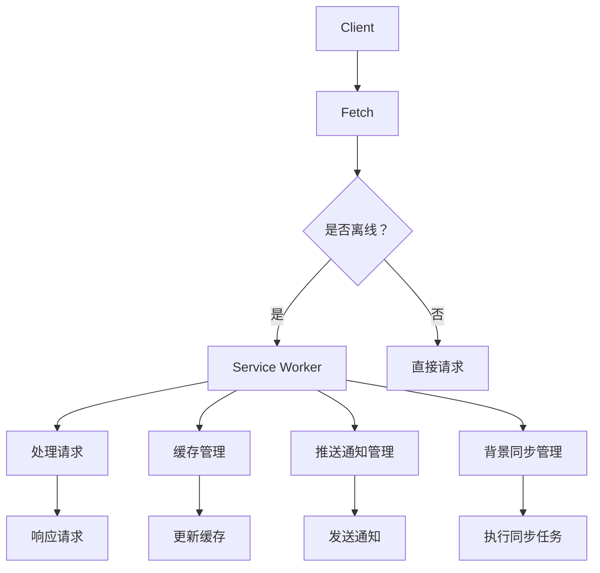

                 

# PWA离线存储技术：Service Worker应用

## 关键词

渐进式网络应用（PWA），Service Worker，离线存储，Cache API，IndexedDB，WebSQL，推送通知，背景同步

## 摘要

本文将深入探讨渐进式网络应用（PWA）的离线存储技术，重点分析Service Worker在这一领域的应用。我们将从PWA和Service Worker的基础知识出发，逐步介绍其基本原理、应用框架以及具体的离线存储技术。此外，还将探讨Service Worker中的推送通知和背景同步功能，并提供实际的开发案例和性能优化策略。通过这篇文章，读者将全面理解PWA离线存储技术的原理和实践，掌握Service Worker在构建高性能PWA中的关键作用。

## 目录

### 《PWA离线存储技术：Service Worker应用》目录

#### 第1章 PWA与Service Worker基础
1.1 什么是PWA
1.1.1 PWA的定义与特点
1.1.2 PWA的优势与适用场景
1.2 Service Worker概述
1.2.1 Service Worker的作用与功能
1.2.2 Service Worker与PWA的关系
1.3 Service Worker基本原理
1.3.1 Service Worker的生命周期
1.3.2 Service Worker的工作流程

#### 第2章 Service Worker应用框架
2.1 Service Worker注册与配置
2.1.1 Service Worker的注册方法
2.1.2 Service Worker的配置与调试
2.2 Service Worker事件处理
2.2.1 Service Worker的事件监听
2.2.2 Service Worker的事件处理
2.3 Service Worker缓存策略
2.3.1 缓存API的介绍
2.3.2 缓存策略的设计与实现

#### 第3章 Service Worker离线存储技术
3.1 Cache API原理与应用
3.1.1 Cache API的基本概念
3.1.2 Cache API的使用方法
3.1.3 Cache API的优化技巧
3.2 IndexedDB API详解
3.2.1 IndexedDB的基本概念
3.2.2 IndexedDB的数据操作
3.2.3 IndexedDB的事务与索引
3.3 WebSQL数据库应用
3.3.1 WebSQL的原理与特点
3.3.2 WebSQL的基本操作

#### 第4章 Service Worker中的推送通知
4.1 推送通知基础
4.1.1 推送通知的概念与原理
4.1.2 推送通知的接收与处理
4.2 使用Service Worker发送推送通知
4.2.1 服务器端的推送通知API
4.2.2 Service Worker中的推送通知处理
4.2.3 推送通知的个性化与安全性
4.3 推送通知案例实战
4.3.1 实现一个简单的推送通知功能
4.3.2 推送通知在PWA中的应用场景

#### 第5章 Service Worker中的背景同步
5.1 背景同步基础
5.1.1 背景同步的概念与原理
5.1.2 背景同步的任务与策略
5.2 使用Service Worker实现背景同步
5.2.1 背景同步API的使用
5.2.2 背景同步任务的调度与管理
5.2.3 背景同步的优化与性能分析
5.3 背景同步案例实战
5.3.1 实现一个简单的后台同步任务
5.3.2 后台同步在PWA中的应用

#### 第6章 Service Worker中的扩展功能
6.1 Service Worker中的内容分发网络（CDN）
6.1.1 CDN的基本原理与优势
6.1.2 Service Worker与CDN的整合
6.2 Service Worker中的文件上传与下载
6.2.1 文件上传与下载的基本操作
6.2.2 文件操作中的错误处理与优化
6.3 Service Worker中的自定义协议处理
6.3.1 自定义协议的基本概念
6.3.2 自定义协议的实践案例

#### 第7章 Service Worker在PWA开发中的实践
7.1 PWA开发流程与最佳实践
7.1.1 PWA的开发流程
7.1.2 PWA开发中的注意事项
7.1.3 PWA性能优化的方法与技巧
7.2 Service Worker在大型PWA项目中的应用
7.2.1 大型PWA项目的需求分析
7.2.2 Service Worker在项目中的应用案例
7.2.3 项目中的挑战与解决方案

#### 第8章 Service Worker性能监控与调试
8.1 Service Worker的性能监控
8.1.1 性能监控的方法与工具
8.1.2 Service Worker性能分析指标
8.2 Service Worker的调试与错误处理
8.2.1 Service Worker的调试技巧
8.2.2 Service Worker常见错误处理
8.3 Service Worker的性能优化案例
8.3.1 性能优化的策略与步骤
8.3.2 性能优化的具体实践案例

#### 附录A：Service Worker开发资源与工具
A.1 Service Worker开发资源
A.1.1 Service Worker文档与教程
A.1.2 Service Worker开发社区与论坛
A.2 Service Worker开发工具
A.2.1 Service Worker调试工具
A.2.2 Service Worker开发框架与库

#### 附录B：Service Worker架构原理流程图

#### 附录C：缓存策略伪代码示例

#### 附录D：推送通知算法伪代码示例

#### 附录E：离线存储案例代码解读

#### 附录F：开发环境搭建指南

#### 附录G：代码解读与分析

---

在本文中，我们将按照上述目录结构，逐步深入探讨PWA离线存储技术中的各个方面，帮助读者理解Service Worker在构建高性能、离线友好的渐进式网络应用中的作用。首先，我们从PWA和Service Worker的基础知识开始，逐步建立起对这一领域的全面认识。

---

### 第1章 PWA与Service Worker基础

#### 1.1 什么是PWA

##### 1.1.1 PWA的定义与特点

渐进式网络应用（Progressive Web Apps，简称PWA）是一种结合了网页和移动应用的最佳特性的新型应用。PWA不仅可以在网页浏览器中运行，还能提供类似原生应用的用户体验。PWA的核心特点包括：

1. **渐进式增强**：PWA可以在任何浏览器上运行，同时通过现代Web技术为支持这些技术的浏览器提供更丰富的功能。
2. **可安装性**：用户可以通过简单的操作将PWA安装到桌面或移动设备的首页，类似于安装传统移动应用。
3. **离线功能**：PWA利用Service Worker实现离线功能，用户在没有网络连接的情况下仍然可以访问应用的内容。
4. **快速响应**：PWA通过使用缓存策略和有效的前端架构，实现了快速响应和流畅的用户体验。
5. **跨平台**：PWA可以在不同的操作系统和设备上运行，无需为每个平台单独开发。

##### 1.1.2 PWA的优势与适用场景

PWA的优势在于其高效性和灵活性。以下是一些PWA适用的场景：

1. **移动应用替代**：对于需要频繁访问的网站，如电商平台或社交媒体，PWA可以提供更好的用户体验，减少用户对移动应用的依赖。
2. **低带宽环境**：在低带宽或网络不稳定的环境中，PWA的缓存功能可以显著提高网页的加载速度和稳定性。
3. **内容分发平台**：新闻网站、博客和其他内容发布平台可以通过PWA提高用户的阅读体验，尤其是在离线状态下。
4. **企业内部应用**：企业内部的应用程序可以通过PWA实现快速部署和跨平台兼容，降低开发和维护成本。

#### 1.2 Service Worker概述

##### 1.2.1 Service Worker的作用与功能

Service Worker是PWA的重要组成部分，它是一个运行在浏览器后台的脚本，独立于网页的主线程运行。Service Worker的作用包括：

1. **缓存管理**：Service Worker可以拦截和缓存网络请求，从而在离线或网络不稳定时提供内容。
2. **推送通知**：Service Worker可以接收服务器发送的推送通知，并在用户的设备上显示通知。
3. **背景同步**：Service Worker可以在没有用户交互的情况下执行后台任务，如数据同步。
4. **资源加载**：Service Worker可以预加载资源，提高网页的加载速度。

##### 1.2.2 Service Worker与PWA的关系

Service Worker是PWA实现离线功能和增强用户体验的核心技术。PWA通过Service Worker实现了以下功能：

1. **安装和启动**：用户可以将PWA添加到桌面或设备首页，并通过Service Worker实现快速启动。
2. **离线访问**：通过Service Worker的缓存机制，PWA可以在没有网络连接时访问缓存的内容。
3. **性能优化**：Service Worker可以预加载资源，优化网络请求，提高网页的加载速度。
4. **后台任务**：Service Worker可以执行后台同步和数据推送，增强用户体验。

#### 1.3 Service Worker基本原理

##### 1.3.1 Service Worker的生命周期

Service Worker的生命周期包括以下几个阶段：

1. **注册阶段**：Service Worker通过JavaScript代码注册到浏览器中，并与主线程建立连接。
2. **安装阶段**：Service Worker被激活并安装，此时它可以开始拦截和处理网络请求。
3. **激活阶段**：当旧的Service Worker被新的Service Worker替代时，会触发激活阶段。
4. **运行阶段**：Service Worker在激活后开始运行，处理网络请求和后台任务。
5. **更新阶段**：当新的Service Worker被注册并安装后，旧的Service Worker会进入更新阶段。
6. **卸载阶段**：Service Worker在浏览器关闭或应用程序卸载时被卸载。

##### 1.3.2 Service Worker的工作流程

Service Worker的工作流程如下：

1. **注册**：开发者通过在主线程中调用`self.serviceWorker.register()`方法注册Service Worker。
2. **安装**：浏览器加载Service Worker脚本，并创建Service Worker实例。
3. **拦截请求**：Service Worker通过`fetch()`事件拦截和处理网络请求。
4. **缓存资源**：Service Worker可以使用Cache API将请求的资源缓存到本地。
5. **推送通知**：Service Worker可以通过`self.addEventListener('push', function(event) { ... })`监听推送事件。
6. **后台同步**：Service Worker可以通过`self.addEventListener('sync', function(event) { ... })`执行后台同步任务。
7. **更新**：当新的Service Worker脚本注册并安装后，旧Service Worker会触发更新。
8. **卸载**：浏览器卸载Service Worker，释放资源。

通过以上对PWA和Service Worker基础知识的介绍，读者可以对PWA离线存储技术有一个初步的了解。在接下来的章节中，我们将深入探讨Service Worker的具体应用，包括注册与配置、事件处理、缓存策略以及离线存储技术。

---

### 第2章 Service Worker应用框架

#### 2.1 Service Worker注册与配置

Service Worker的注册是其在浏览器中运行的第一步。开发者需要在主线程中调用`register()`方法来注册Service Worker脚本。

##### 2.1.1 Service Worker的注册方法

注册Service Worker的基本方法如下：

```javascript
if ('serviceWorker' in navigator) {
  window.navigator.serviceWorker.register('/service-worker.js').then(registration => {
    console.log('Service Worker registered with scope: ', registration.scope);
  }).catch(error => {
    console.error('Service Worker registration failed: ', error);
  });
}
```

在上面的代码中，我们首先检查浏览器的navigator对象是否支持serviceWorker属性。如果支持，则调用`register()`方法并传入Service Worker脚本的URL。`register()`方法返回一个Promise，成功时调用`then()`处理注册结果，失败时调用`catch()`处理错误。

##### 2.1.2 Service Worker的配置与调试

配置Service Worker涉及到如何管理其生命周期和事件处理。为了调试Service Worker，可以使用浏览器的开发者工具。

1. **启用Service Worker调试**：在Chrome浏览器中，按下`Ctrl+Shift+I`打开开发者工具，然后切换到Application标签页。在左侧导航栏中找到Service Workers选项，启用调试。

2. **查看Service Worker日志**：在Service Workers标签页中，可以查看Service Worker的日志信息，包括注册、激活、更新和错误等。

3. **控制Service Worker**：在调试界面中，可以手动启动、暂停或重启Service Worker，方便调试和测试。

配置Service Worker时，还需要考虑以下几点：

1. **scope参数**：`register()`方法的scope参数决定了Service Worker的作用范围。默认情况下，scope为当前网页的URL。如果需要在多个页面共享一个Service Worker，可以将scope设置为`/`。

2. **更新策略**：Service Worker在更新时会触发`install`事件。开发者可以在这个事件中处理旧Service Worker的卸载和新Service Worker的激活。

```javascript
self.addEventListener('install', event => {
  event.waitUntil(caches.open('my-cache').then(cache => {
    return cache.addAll([
      '/',
      '/styles/main.css',
      '/scripts/main.js'
    ]);
  }));
});
```

3. **缓存策略**：在安装阶段，Service Worker可以预缓存一些关键资源，以便在用户离线时使用。

通过上述注册与配置方法，开发者可以为PWA实现基本的离线功能。接下来，我们将探讨Service Worker中的事件处理机制。

---

#### 2.2 Service Worker事件处理

Service Worker通过监听特定事件来响应浏览器和服务器发出的请求。以下是一些常见的事件及其处理方法：

##### 2.2.1 Service Worker的事件监听

在Service Worker脚本中，使用`addEventListener()`方法可以监听各种事件：

```javascript
self.addEventListener('fetch', event => {
  // 处理fetch事件
});

self.addEventListener('push', event => {
  // 处理push事件
});

self.addEventListener('sync', event => {
  // 处理sync事件
});
```

在这些事件监听器中，`event`对象提供了关于事件的详细信息。例如，`fetch`事件提供了请求的详细信息，`push`事件提供了推送消息的详细信息。

##### 2.2.2 Service Worker的事件处理

对于`fetch`事件，Service Worker可以拦截和处理网络请求。以下是一个简单的示例，展示如何使用Service Worker缓存请求：

```javascript
self.addEventListener('fetch', event => {
  event.respondWith(
    caches.match(event.request).then(response => {
      if (response) {
        return response; // 返回缓存中的资源
      }
      return fetch(event.request); // 网络请求失败时返回原始请求
    })
  );
});
```

在上面的示例中，Service Worker首先尝试从缓存中获取请求的资源。如果缓存中存在该资源，则直接返回缓存内容。否则，Service Worker执行网络请求，并将结果缓存到本地。

对于`push`事件，Service Worker可以处理来自服务器的推送消息。以下是一个简单的推送通知处理示例：

```javascript
self.addEventListener('push', event => {
  const notificationData = event.data.json();
  self.registration.showNotification(notificationData.title, {
    body: notificationData.body,
    icon: notificationData.icon,
    // 其他通知选项
  });
});
```

在这里，`event.data.json()`方法提取推送消息的JSON数据，然后使用`showNotification()`方法显示通知。

通过合理的事件处理，Service Worker可以增强PWA的功能，提高用户体验。接下来，我们将讨论Service Worker中的缓存策略，包括如何设计和实现有效的缓存策略。

---

#### 2.3 Service Worker缓存策略

缓存策略是Service Worker实现离线功能的关键。通过合理设计缓存策略，可以显著提高PWA的性能和用户体验。

##### 2.3.1 缓存API的介绍

Service Worker提供了多种缓存API，包括Cache、CacheStorage、CacheStorage和IndexDB等。这些API允许开发者存储和检索网络请求的响应。

1. **Cache API**：用于存储和检索缓存数据。它可以拦截和处理网络请求，并将请求的资源存储在本地。
2. **CacheStorage API**：用于管理缓存存储，包括打开和关闭缓存。
3. **IndexDB API**：提供了一种更高级的数据库存储方式，适用于存储结构化数据。

##### 2.3.2 缓存策略的设计与实现

一个有效的缓存策略需要考虑以下几个方面：

1. **资源分类**：将资源分为核心资源和可选资源。核心资源包括网页、图片和脚本等，而可选资源包括广告、第三方库等。
2. **缓存版本控制**：通过为资源添加版本号，确保更新时的资源替换。
3. **缓存更新时机**：根据用户的访问频率和资源的重要性，设置不同的缓存更新策略。
4. **缓存清理**：定期清理过期的缓存，释放存储空间。

以下是一个简单的缓存策略示例：

```javascript
// 注册Service Worker
self.addEventListener('install', event => {
  event.waitUntil(
    caches.open('my-cache').then(cache => {
      return cache.addAll([
        '/',
        '/styles/main.css',
        '/scripts/main.js',
        '/images/logo.png'
      ]);
    })
  );
});

// 缓存请求
self.addEventListener('fetch', event => {
  event.respondWith(
    caches.match(event.request).then(response => {
      if (response) {
        return response; // 返回缓存中的资源
      }
      return fetch(event.request).then(response => {
        if (response.ok) {
          caches.open('my-cache').then(cache => {
            cache.put(event.request, response.clone());
          });
        }
        return response;
      });
    })
  );
});
```

在上面的示例中，Service Worker在安装阶段预缓存了一些核心资源。在请求阶段，如果请求的资源在缓存中，则直接返回缓存内容。否则，执行网络请求，并将结果缓存到本地。

通过合理设计缓存策略，可以确保PWA在离线时仍能提供良好的用户体验。接下来，我们将介绍Service Worker的离线存储技术，包括Cache API、IndexedDB和WebSQL的使用。

---

### 第3章 Service Worker离线存储技术

Service Worker提供了多种离线存储技术，包括Cache API、IndexedDB和WebSQL。这些技术各自适用于不同的场景和需求。在本章中，我们将详细介绍这些离线存储技术，并探讨它们的应用和优化技巧。

#### 3.1 Cache API原理与应用

Cache API是Service Worker中最常用的缓存机制之一，它允许开发者存储和检索网络请求的响应。Cache API的基本概念包括Cache、CacheStorage和CacheEntry。

##### 3.1.1 Cache API的基本概念

- **Cache**：Cache对象表示一组存储在网络中的数据。它可以存储和检索任何形式的资源，如HTML、CSS、JavaScript和图片等。
- **CacheStorage**：CacheStorage对象提供了对Cache对象的操作，包括打开和删除缓存。
- **CacheEntry**：CacheEntry对象代表Cache中的一个具体条目，可以用于读取、更新或删除缓存中的数据。

##### 3.1.2 Cache API的使用方法

使用Cache API的基本步骤如下：

1. **打开Cache**：使用`caches.open(cacheName)`方法打开一个Cache对象。
2. **添加数据**：使用`Cache.put(request, response)`方法将请求和响应存储到Cache中。
3. **检索数据**：使用`Cache.match(request)`方法从Cache中检索数据。
4. **清理缓存**：使用`Cache.delete()`方法删除Cache中的数据。

以下是一个简单的Cache API示例：

```javascript
// 注册Service Worker
self.addEventListener('install', event => {
  event.waitUntil(
    caches.open('my-cache').then(cache => {
      return cache.addAll([
        '/',
        '/styles/main.css',
        '/scripts/main.js',
        '/images/logo.png'
      ]);
    })
  );
});

// 缓存请求
self.addEventListener('fetch', event => {
  event.respondWith(
    caches.match(event.request).then(response => {
      if (response) {
        return response; // 返回缓存中的资源
      }
      return fetch(event.request).then(response => {
        if (response.ok) {
          caches.open('my-cache').then(cache => {
            cache.put(event.request, response.clone());
          });
        }
        return response;
      });
    })
  );
});
```

在上面的示例中，Service Worker在安装阶段预缓存了一些核心资源。在请求阶段，如果请求的资源在缓存中，则直接返回缓存内容。否则，执行网络请求，并将结果缓存到本地。

##### 3.1.3 Cache API的优化技巧

为了提高Cache API的性能和效率，可以采用以下优化技巧：

1. **按需缓存**：只缓存必要的资源，避免过多的缓存占用存储空间。
2. **缓存版本控制**：通过为缓存资源添加版本号，确保更新时的资源替换。
3. **定期清理**：定期清理过期的缓存，释放存储空间。
4. **优先级缓存**：为不同类型的资源设置不同的缓存优先级，确保关键资源优先缓存。

#### 3.2 IndexedDB API详解

IndexedDB是一种低级别的存储API，它提供了一个结构化存储系统，可以存储大量结构化数据。IndexedDB适用于需要存储复杂数据的应用程序。

##### 3.2.1 IndexedDB的基本概念

- **数据库**：IndexedDB中的数据存储在数据库中，每个数据库都有自己的名称。
- **对象仓库**：数据库中的数据存储在对象仓库中，每个对象仓库都有自己的名称和数据类型。
- **索引**：索引是数据库中的一种特殊结构，用于快速检索数据。

##### 3.2.2 IndexedDB的数据操作

使用IndexedDB进行数据操作的基本步骤如下：

1. **打开数据库**：使用`indexedDB.open(dbName)`方法打开一个数据库。
2. **创建对象仓库**：使用`db.createObjectStore(storeName, { keyPath: 'id' })`方法创建一个对象仓库。
3. **添加数据**：使用`store.add(data)`方法将数据添加到对象仓库。
4. **检索数据**：使用`store.get(id)`方法从对象仓库中检索数据。
5. **更新数据**：使用`store.put(data)`方法更新对象仓库中的数据。
6. **删除数据**：使用`store.delete(id)`方法从对象仓库中删除数据。

以下是一个简单的IndexedDB示例：

```javascript
// 注册Service Worker
self.addEventListener('install', event => {
  event.waitUntil(
    indexedDB.open('my-db', 1).then(db => {
      if (!db.objectStoreNames.contains('users')) {
        db.createObjectStore('users', { keyPath: 'id' });
      }
    })
  );
});

// 添加用户数据
self.addEventListener('fetch', event => {
  event.respondWith(
    indexedDB.open('my-db').then(db => {
      const transaction = db.transaction('users', 'readwrite');
      const store = transaction.objectStore('users');
      return store.add({ id: 1, name: 'John Doe' });
    }).then(() => {
      return fetch(event.request);
    })
  );
});
```

在上面的示例中，Service Worker在安装阶段创建了一个名为“users”的对象仓库。在请求阶段，Service Worker添加了一个用户数据，然后返回原始请求。

##### 3.2.3 IndexedDB的事务与索引

IndexedDB使用事务（Transaction）来管理数据的读写操作。事务确保数据的一致性和完整性。以下是一些关于事务和索引的关键概念：

- **事务**：事务是数据库中的操作单元，用于添加、更新、删除数据。事务可以是读操作（`READONLY`）或读写操作（`READWRITE`）。
- **索引**：索引是数据库中的特殊结构，用于快速检索数据。创建索引可以提高查询性能。

以下是一个使用事务和索引的示例：

```javascript
// 创建索引
indexedDB.open('my-db', 1).then(db => {
  const store = db.createObjectStore('users', { keyPath: 'id' });
  store.createIndex('name-index', 'name');
});

// 使用索引查询数据
indexedDB.open('my-db').then(db => {
  const transaction = db.transaction('users', 'readwrite');
  const store = transaction.objectStore('users');
  return store.index('name-index').get('John Doe');
});
```

通过合理使用IndexedDB，可以构建高效的离线存储系统，满足复杂的数据存储需求。

#### 3.3 WebSQL数据库应用

WebSQL是一种简化版的SQL数据库API，它提供了一种用于Web应用程序的轻量级数据库解决方案。尽管WebSQL在技术规范上已被废弃，但仍然在旧版浏览器中得到了广泛应用。

##### 3.3.1 WebSQL的原理与特点

WebSQL基于SQLite数据库，提供了一套简单的SQL接口，用于创建数据库、表、索引和执行查询。WebSQL的主要特点包括：

- **轻量级**：WebSQL提供了易于使用的接口，简化了数据库操作。
- **兼容性**：WebSQL在多种浏览器中得到支持，尽管它已不再推荐使用。
- **快速开发**：WebSQL适合快速开发和小型应用，但其功能有限。

##### 3.3.2 WebSQL的基本操作

使用WebSQL进行数据操作的基本步骤如下：

1. **打开数据库**：使用`openDatabase(dbName, version, displayLabel, size)`方法打开数据库。
2. **创建表**：使用`db.executeSql('CREATE TABLE ...')`方法创建表。
3. **插入数据**：使用`db.executeSql('INSERT INTO ...')`方法插入数据。
4. **查询数据**：使用`db.executeSql('SELECT ...')`方法查询数据。
5. **更新数据**：使用`db.executeSql('UPDATE ...')`方法更新数据。
6. **删除数据**：使用`db.executeSql('DELETE FROM ...')`方法删除数据。

以下是一个简单的WebSQL示例：

```javascript
// 打开数据库
var db = openDatabase('myDatabase', '1.0', 'My web SQL Database', 2 * 1024 * 1024);

// 创建表
db.executeSql('CREATE TABLE IF NOT EXISTS users (id INTEGER PRIMARY KEY AUTOINCREMENT, name TEXT, age INTEGER)');

// 插入数据
db.executeSql('INSERT INTO users (name, age) VALUES (?, ?)', ['John Doe', 30]);

// 查询数据
db.executeSql('SELECT * FROM users', [], function(tx, results) {
  for (var i = 0; i < results.rows.length; i++) {
    console.log(results.rows.item(i).name + ': ' + results.rows.item(i).age);
  }
});

// 更新数据
db.executeSql('UPDATE users SET age = ? WHERE name = ?', [35, 'John Doe']);

// 删除数据
db.executeSql('DELETE FROM users WHERE name = ?', ['John Doe']);
```

通过上述示例，可以看出WebSQL的基本操作相对简单直观。尽管WebSQL在技术规范上已被废弃，但在旧版浏览器中仍有其实际应用场景。

综上所述，Service Worker提供了多种离线存储技术，包括Cache API、IndexedDB和WebSQL。这些技术各有优缺点，适用于不同的场景和需求。通过合理设计和优化这些技术，可以构建高效、可靠的离线存储系统，为PWA提供强大的离线功能。

---

### 第4章 Service Worker中的推送通知

推送通知是一种重要的服务，它允许应用在用户不活动或未打开应用时发送通知。Service Worker为推送通知的实现提供了强大的支持，使其成为构建PWA的重要功能之一。在本章中，我们将探讨推送通知的基础知识、Service Worker中的推送通知处理，以及推送通知的个性化与安全性。

#### 4.1 推送通知基础

##### 4.1.1 推送通知的概念与原理

推送通知是一种由服务器发送到客户端的应用的消息，即使在客户端应用未运行或客户端设备处于锁屏状态时，也能够通知用户。推送通知的工作原理如下：

1. **注册**：客户端应用首先在服务器端注册，以接收推送通知。
2. **发送**：服务器将推送通知发送到客户端的Web Push服务。
3. **接收**：Web Push服务将通知传递给Service Worker。
4. **显示**：Service Worker显示通知，并允许用户进行响应。

##### 4.1.2 推送通知的接收与处理

Service Worker通过监听`push`事件来接收推送通知。以下是一个简单的推送通知处理示例：

```javascript
self.addEventListener('push', function(event) {
  var options = {
    body: event.data.text(),
    icon: 'images/icon-192x192.png',
    vibrate: [100, 50, 100],
    data: {
      url: 'https://example.com'
    }
  };
  event.waitUntil(self.registration.showNotification('New Message', options));
});
```

在上面的示例中，`push`事件处理函数使用`event.data.text()`提取推送消息的内容，并调用`self.registration.showNotification()`显示通知。通知中可以包含图标、震动效果以及额外的数据，如跳转链接。

#### 4.2 使用Service Worker发送推送通知

推送通知不仅能够接收，还能够主动发送。在Service Worker中，发送推送通知通常涉及以下几个步骤：

1. **获取推送服务API**：首先需要从服务器获取发送推送通知的API。
2. **生成推送请求**：创建一个推送请求，包含通知内容和目标用户。
3. **发送推送请求**：使用HTTP请求发送推送通知。

以下是一个简单的Service Worker中发送推送通知的示例：

```javascript
function sendPushNotification(subscription, notificationData) {
  var url = 'https://example.com/notifications/send';
  var headers = {
    'Content-Type': 'application/json',
    'Authorization': 'Bearer YOUR_API_KEY'
  };
  var data = {
    subscription: subscription,
    data: notificationData
  };
  fetch(url, {
    method: 'POST',
    headers: headers,
    body: JSON.stringify(data)
  });
}
```

在上面的示例中，`sendPushNotification`函数接收订阅对象和通知数据，通过HTTP POST请求将推送通知发送到服务器。

#### 4.2.1 服务器端的推送通知API

服务器端的推送通知API负责处理推送通知的发送和接收。以下是一个简单的服务器端推送通知API的实现：

```javascript
// 使用Node.js和Express框架实现推送通知API
const express = require('express');
const webpush = require('webpush');

const app = express();
const vapidKeys = {
  publicKey: 'YOUR_PUBLIC_KEY',
  privateKey: 'YOUR_PRIVATE_KEY'
};

app.post('/notifications/send', (req, res) => {
  const subscription = req.body.subscription;
  const notificationData = req.body.data;
  webpush.sendNotification(subscription, notificationData, vapidKeys).then(result => {
    res.json({ message: 'Notification sent successfully' });
  }).catch(error => {
    res.status(500).json({ error: 'Failed to send notification' });
  });
});

const port = 3000;
app.listen(port, () => {
  console.log(`Notification service running on port ${port}`);
});
```

在上面的示例中，使用`webpush`库发送推送通知。服务器需要生成VAPID（Push API Vueiety & Identity Provider）密钥，并在请求中包含这些密钥。

#### 4.2.2 Service Worker中的推送通知处理

Service Worker中的推送通知处理包括接收、显示和处理推送通知。以下是一个简单的推送通知处理流程：

1. **监听推送事件**：使用`self.addEventListener('push', function(event) { ... })`监听推送事件。
2. **提取推送数据**：使用`event.data.text()`或`event.data.json()`提取推送数据。
3. **显示推送通知**：使用`self.registration.showNotification()`显示推送通知。
4. **处理用户交互**：监听推送通知的点击事件，并在用户点击通知时执行特定操作。

以下是一个简单的推送通知处理示例：

```javascript
self.addEventListener('push', function(event) {
  var notificationData = event.data.json();
  var options = {
    body: notificationData.body,
    icon: notificationData.icon,
    vibrate: notificationData.vibrate,
    data: {
      url: notificationData.url
    }
  };
  event.waitUntil(self.registration.showNotification(notificationData.title, options));
});

self.addEventListener('notificationclick', function(event) {
  var notification = event.notification;
  var action = event.action;

  if (action === 'confirm') {
    notification.close();
  } else {
    event.waitUntil(clients.openWindow(notification.data.url));
  }
});
```

在上面的示例中，`push`事件处理函数显示推送通知，并在用户点击通知时打开指定的网页。

#### 4.2.3 推送通知的个性化与安全性

推送通知的个性化和安全性是提高用户满意度和保护用户隐私的重要方面。以下是一些相关的考虑：

1. **个性化通知**：通过收集用户行为数据和偏好设置，可以发送更符合用户兴趣的通知。例如，根据用户的浏览历史发送相关的促销通知。
2. **通知分类**：将通知分为不同的类别，并根据类别设置不同的显示方式和优先级。例如，将紧急通知显示为全屏通知，而将常规通知显示为小弹窗。
3. **安全性**：确保推送通知的发送过程安全可靠。使用HTTPS协议传输数据，并对推送通知进行签名验证，以防止未授权的推送通知。

通过合理的个性化与安全性设计，推送通知可以为用户提供更优质的服务体验。

#### 4.3 推送通知案例实战

以下是一个简单的推送通知案例，展示如何实现一个基本的推送通知功能，并在PWA中应用。

##### 4.3.1 实现一个简单的推送通知功能

1. **注册推送服务**：在服务器端实现推送服务，并生成VAPID密钥。
2. **前端代码**：在PWA中使用Service Worker监听推送事件，并显示推送通知。
3. **后端代码**：实现服务器端的推送通知API，用于发送推送通知。

以下是一个简单的推送通知功能实现：

**前端代码（Service Worker）**

```javascript
self.addEventListener('push', function(event) {
  var options = {
    body: 'Hello, this is a push notification!',
    icon: 'images/icon-192x192.png',
    vibrate: [100, 50, 100],
    data: {
      url: 'https://example.com'
    }
  };
  event.waitUntil(self.registration.showNotification('New Notification', options));
});

self.addEventListener('notificationclick', function(event) {
  event.notification.close();
  event.waitUntil(clients.openWindow(event.notification.data.url));
});
```

**服务器端代码（Node.js）**

```javascript
const express = require('express');
const webpush = require('webpush');
const vapidKeys = {
  publicKey: 'YOUR_PUBLIC_KEY',
  privateKey: 'YOUR_PRIVATE_KEY'
};

const app = express();
app.use(express.json());

app.post('/subscribe', (req, res) => {
  const subscription = req.body;
  webpush.setVapidDetails(
    subscription.endpoint,
    vapidKeys.publicKey,
    vapidKeys.privateKey
  );
  webpush.sendNotification(subscription, 'Your PWA is ready!');
  res.json({ message: 'Subscription successful' });
});

app.post('/notifications/send', (req, res) => {
  const notificationData = req.body;
  webpush.sendNotification(notificationData.subscription, notificationData.data, vapidKeys).then(() => {
    res.json({ message: 'Notification sent successfully' });
  }).catch(error => {
    res.status(500).json({ error: 'Failed to send notification' });
  });
});

const port = 3000;
app.listen(port, () => {
  console.log(`Notification service running on port ${port}`);
});
```

通过上述代码，前端应用可以在用户订阅推送服务后，接收并显示推送通知。服务器端则负责处理订阅和发送推送通知。

##### 4.3.2 推送通知在PWA中的应用场景

推送通知在PWA中有多种应用场景，以下是一些常见场景：

1. **即时消息通知**：用于实时推送消息，如社交媒体动态、邮件通知等。
2. **应用更新通知**：当PWA有更新时，可以推送通知用户更新应用。
3. **促销与广告通知**：用于推送促销信息和广告，吸引用户参与。
4. **任务提醒**：用于推送任务提醒，如会议通知、待办事项等。

通过合理的应用场景设计和推送策略，推送通知可以显著提高PWA的用户参与度和活跃度。

综上所述，推送通知是PWA的重要功能之一，它为用户提供了及时、个性化的信息推送。通过Service Worker，开发者可以轻松实现推送通知的接收和发送，并优化推送通知的显示和处理。在实际开发中，推送通知的应用场景广泛，通过合理设计和优化，可以提升PWA的用户体验和用户满意度。

---

### 第5章 Service Worker中的背景同步

背景同步是Service Worker的一个重要功能，它允许开发者在不影响用户交互的情况下执行后台任务。背景同步可以用于数据同步、定时任务和其他后台操作，从而提高PWA的可靠性和用户体验。在本章中，我们将探讨背景同步的基础知识、使用Service Worker实现背景同步，以及背景同步的优化与性能分析。

#### 5.1 背景同步基础

##### 5.1.1 背景同步的概念与原理

背景同步（Background Sync）是一种异步处理网络请求的技术，它允许应用在用户不活动或设备处于离线状态时，自动同步数据。背景同步的工作原理如下：

1. **注册同步请求**：应用在Service Worker中注册同步请求，并指定同步的参数。
2. **监听同步事件**：Service Worker监听同步事件，当网络条件好转时自动执行同步任务。
3. **执行同步任务**：Service Worker在用户不可见的情况下执行同步任务，如数据上传、数据下载或数据同步。

##### 5.1.2 背景同步的任务与策略

背景同步的任务通常包括以下几种：

1. **数据上传**：将本地数据上传到服务器，如用户生成的文件或输入的数据。
2. **数据下载**：从服务器下载数据，如新的内容或更新。
3. **数据同步**：在本地和服务器之间同步数据，确保数据的最新和一致性。

背景同步的策略设计需要考虑以下几个方面：

1. **网络条件**：根据网络条件选择合适的同步时机和频率。在稳定的网络环境中，可以更频繁地进行同步；在弱网环境中，可以减少同步频率。
2. **优先级**：根据任务的重要性和紧急性设置同步任务的优先级。高优先级的任务应优先执行。
3. **超时与重试**：设定同步任务的超时时间和重试策略，确保同步任务能够在规定时间内完成，并在失败时自动重试。

#### 5.2 使用Service Worker实现背景同步

使用Service Worker实现背景同步的基本步骤如下：

1. **注册背景同步事件**：在Service Worker中注册`sync`事件，并指定同步任务的名称。
2. **处理同步事件**：在Service Worker中编写事件处理函数，执行具体的同步任务。
3. **调度同步任务**：根据网络条件和任务的优先级，自动调度同步任务。

以下是一个简单的背景同步示例：

```javascript
// 注册Service Worker
self.addEventListener('sync', function(event) {
  if (event.tag === 'data-upload') {
    event.waitUntil(uploadDataToServer());
  }
});

function uploadDataToServer() {
  return fetch('https://example.com/upload', {
    method: 'POST',
    body: JSON.stringify({ data: 'my data' }),
    headers: {
      'Content-Type': 'application/json'
    }
  });
}
```

在上面的示例中，Service Worker监听了名为`data-upload`的同步事件，并在事件触发时调用`uploadDataToServer()`函数上传数据。

#### 5.2.1 背景同步API的使用

Service Worker提供了`sync`事件和`BackgroundSyncManager`接口用于背景同步。以下是一些关键的API：

- **`backgroundSyncManager`**：用于注册和调度背景同步任务。
- **`addEventListener()`**：用于监听同步事件。
- **`waitUntil()`**：用于等待同步任务完成。

以下是一个使用`BackgroundSyncManager`的示例：

```javascript
// 注册背景同步
self.addEventListener('sync', function(event) {
  if (event.tag === 'data-sync') {
    event.waitUntil(
      self.backgroundSyncManager.sync('data-sync', {
        name: 'Data Sync',
        options: { maxAge: 3600 * 1000 } // 最大等待时间1小时
      })
    );
  }
});

// 调度同步任务
function scheduleSyncTask() {
  return self.backgroundSyncManager.enqueue('data-sync', { data: 'my data' });
}
```

在上面的示例中，`backgroundSyncManager`用于注册和调度同步任务。`enqueue()`方法用于调度同步任务，而`waitUntil()`方法用于确保同步任务在Service Worker事件中完成。

#### 5.2.2 背景同步任务的调度与管理

背景同步任务的调度和管理是确保同步任务高效执行的关键。以下是一些调度和管理策略：

1. **定时调度**：定期检查网络状态，并调度同步任务。例如，每天晚上调度一次数据同步任务。
2. **策略性调度**：根据网络条件和任务的优先级，选择合适的调度时机。例如，在弱网环境中减少同步频率。
3. **任务监控**：监控同步任务的执行状态，包括任务完成、失败和重试。确保同步任务能够正常执行，并在失败时进行适当的处理。

以下是一个简单的背景同步任务监控示例：

```javascript
self.addEventListener('sync', function(event) {
  if (event.tag === 'data-sync') {
    event.waitUntil(
      fetch('https://example.com/sync', {
        method: 'POST',
        body: JSON.stringify({ data: 'my data' }),
        headers: {
          'Content-Type': 'application/json'
        }
      }).catch(error => {
        console.error('Sync task failed:', error);
        // 重试策略
        event.waitUntil(scheduleSyncTask());
      })
    );
  }
});
```

在上面的示例中，同步任务在执行时如果失败，会触发重试策略，确保数据能够最终同步成功。

#### 5.2.3 背景同步的优化与性能分析

背景同步的优化和性能分析是确保同步任务高效执行的关键。以下是一些优化策略：

1. **最小化网络请求**：减少不必要的网络请求，通过批量处理请求来降低网络消耗。
2. **优化数据格式**：选择合适的数据格式，如JSON，以便快速传输和解析。
3. **缓存策略**：使用缓存技术减少对网络的依赖，提高同步任务的执行速度。
4. **异步处理**：确保同步任务在异步环境中执行，避免阻塞主线程。

以下是一个简单的背景同步性能分析示例：

```javascript
// 性能分析：记录同步任务的开始和结束时间
self.addEventListener('sync', function(event) {
  const startTime = Date.now();

  event.waitUntil(
    fetch('https://example.com/sync', {
      method: 'POST',
      body: JSON.stringify({ data: 'my data' }),
      headers: {
        'Content-Type': 'application/json'
      }
    }).then(() => {
      const endTime = Date.now();
      console.log('Sync task completed in:', endTime - startTime, 'milliseconds');
    })
  );
});
```

在上面的示例中，通过记录同步任务的开始和结束时间，可以分析同步任务的性能，并针对性地进行优化。

#### 5.3 背景同步案例实战

以下是一个简单的背景同步案例，展示如何实现一个后台同步任务，并在PWA中应用。

##### 5.3.1 实现一个简单的后台同步任务

1. **注册同步事件**：在Service Worker中注册同步事件。
2. **同步任务函数**：编写同步任务的函数，实现数据上传或下载。
3. **调度同步任务**：根据网络条件和任务的优先级，调度同步任务。

以下是一个简单的后台同步任务实现：

**前端代码（注册Service Worker）**

```javascript
if ('serviceWorker' in navigator) {
  window.addEventListener('load', function() {
    navigator.serviceWorker.register('/service-worker.js').then(registration => {
      console.log('Service Worker registered:', registration);
    }).catch(error => {
      console.error('Service Worker registration failed:', error);
    });
  });
}
```

**Service Worker代码（实现同步任务）**

```javascript
self.addEventListener('sync', function(event) {
  if (event.tag === 'data-upload') {
    event.waitUntil(uploadDataToServer());
  }
});

function uploadDataToServer() {
  return fetch('https://example.com/upload', {
    method: 'POST',
    body: JSON.stringify({ data: 'my data' }),
    headers: {
      'Content-Type': 'application/json'
    }
  });
}
```

**调度同步任务**

```javascript
function scheduleUploadTask() {
  return window.navigator.serviceWorker.ready.then(registration => {
    return registration.sync.register('data-upload');
  });
}

window.addEventListener('load', scheduleUploadTask());
```

通过上述代码，前端应用在加载时调度一个后台同步任务，Service Worker在同步事件触发时执行数据上传任务。

##### 5.3.2 后台同步在PWA中的应用

后台同步在PWA中有广泛的应用场景，以下是一些常见应用：

1. **数据同步**：在用户离线时同步数据，确保数据的最新和一致性。
2. **任务提醒**：在后台同步任务完成后发送通知，提醒用户查看结果。
3. **文件上传**：在用户离线时上传文件，确保文件能够及时上传到服务器。

通过合理设计后台同步任务，可以显著提高PWA的可靠性和用户体验。

综上所述，背景同步是Service Worker的一个重要功能，它允许开发者在不影响用户交互的情况下执行后台任务。通过合理的设计和优化，背景同步可以为PWA提供强大的后台功能，提高用户体验和应用程序的可靠性。

---

### 第6章 Service Worker中的扩展功能

Service Worker不仅提供了基本的缓存管理和离线功能，还支持一系列扩展功能，这些功能极大地增强了Service Worker的能力和PWA的体验。在本章中，我们将探讨Service Worker中的内容分发网络（CDN）整合、文件上传与下载功能，以及自定义协议处理。

#### 6.1 Service Worker中的内容分发网络（CDN）

内容分发网络（Content Delivery Network，简称CDN）是一个分布式网络，通过将内容分发到全球各地的服务器，从而提高内容的访问速度和可靠性。Service Worker可以与CDN整合，优化内容的加载和分发。

##### 6.1.1 CDN的基本原理与优势

CDN的基本原理是通过在多个地理位置部署服务器，将用户请求的内容从最近的节点提供服务。这样做有以下优势：

1. **降低延迟**：用户请求的内容从最近的节点获取，减少了数据传输的距离和时间。
2. **提高可靠性**：通过多个节点分发内容，提高了系统的容错能力和稳定性。
3. **节省带宽**：CDN分担了原始服务器的带宽压力，降低了带宽成本。
4. **优化缓存**：CDN可以缓存内容，进一步减少了原始服务器的负载。

##### 6.1.2 Service Worker与CDN的整合

Service Worker可以与CDN整合，通过以下步骤实现优化：

1. **选择合适的CDN服务**：根据应用的需求和CDN服务的特性选择合适的CDN服务商。
2. **配置CDN域名**：在Service Worker的缓存策略中配置CDN的域名，以便将请求路由到CDN。
3. **优化缓存策略**：在Service Worker中使用CDN的缓存策略，减少重复请求，提高内容访问速度。

以下是一个简单的Service Worker与CDN整合的示例：

```javascript
// 注册Service Worker
self.addEventListener('install', event => {
  event.waitUntil(
    caches.open('my-cache').then(cache => {
      return cache.addAll([
        '/',
        '/styles/main.css',
        '/scripts/main.js',
        '/images/logo.png',
        'https://cdn.example.com/content/*'
      ]);
    })
  );
});

// 缓存策略：从CDN获取资源
self.addEventListener('fetch', event => {
  event.respondWith(
    caches.match(event.request).then(response => {
      if (response) {
        return response;
      }
      return fetch('https://cdn.example.com' + event.request.url);
    })
  );
});
```

在上面的示例中，Service Worker将CDN的域名添加到缓存策略中，并从CDN获取资源。通过这种方式，可以显著提高内容的加载速度和可靠性。

#### 6.2 Service Worker中的文件上传与下载

文件上传和下载是许多Web应用的基本功能，Service Worker提供了处理这些操作的能力，使得文件操作可以离线完成。

##### 6.2.1 文件上传与下载的基本操作

使用Service Worker处理文件上传和下载的基本步骤如下：

1. **拦截文件请求**：使用`fetch`事件拦截文件请求。
2. **处理上传请求**：将上传的文件数据保存到本地或发送到服务器。
3. **处理下载请求**：从本地或服务器获取文件数据，并返回响应。

以下是一个简单的文件上传示例：

```javascript
// 注册Service Worker
self.addEventListener('install', event => {
  event.waitUntil(
    caches.open('my-cache').then(cache => {
      return cache.addAll([
        '/',
        '/styles/main.css',
        '/scripts/main.js',
        '/images/logo.png'
      ]);
    })
  );
});

// 上传文件
self.addEventListener('fetch', event => {
  if (event.request.method === 'POST') {
    event.respondWith(
      fetch(event.request).then(response => {
        if (response.ok) {
          return response;
        }
        return new Response('File uploaded successfully', { status: 200 });
      })
    );
  }
});
```

在上面的示例中，Service Worker拦截了文件上传请求，并在上传成功时返回响应。

以下是一个简单的文件下载示例：

```javascript
// 下载文件
self.addEventListener('fetch', event => {
  if (event.request.method === 'GET' && event.request.url.startsWith('/download/')) {
    event.respondWith(
      caches.match(event.request).then(response => {
        if (response) {
          return response;
        }
        return fetch('/download/' + event.request.url.split('/download/')[1]);
      })
    );
  }
});
```

在上面的示例中，Service Worker拦截了文件下载请求，并从本地缓存或服务器下载文件。

##### 6.2.2 文件操作中的错误处理与优化

文件操作可能遇到各种错误，如网络问题、存储空间不足或文件格式不正确。以下是一些处理和优化策略：

1. **错误处理**：对上传和下载操作中的错误进行捕获和处理，提供友好的错误消息。
2. **重试机制**：在发生错误时，自动重试上传或下载操作。
3. **分块上传/下载**：对于大文件，可以采用分块上传/下载技术，减少单次上传/下载的失败风险。
4. **存储优化**：定期清理旧的文件，释放存储空间，确保上传和下载操作的顺利进行。

以下是一个简单的错误处理和重试示例：

```javascript
// 上传文件：带重试机制
self.addEventListener('fetch', event => {
  if (event.request.method === 'POST') {
    event.respondWith(
      fetch(event.request).then(response => {
        if (response.ok) {
          return response;
        }
        throw new Error('File upload failed');
      }).catch(error => {
        console.error('Upload failed:', error);
        return new Promise((resolve, reject) => {
          setTimeout(() => {
            resolve(fetch(event.request));
          }, 5000); // 重试间隔5秒
        });
      })
    );
  }
});
```

在上面的示例中，如果上传操作失败，Service Worker将自动重试，直到成功或达到最大重试次数。

#### 6.3 Service Worker中的自定义协议处理

自定义协议是一种允许开发者定义自己的网络协议的方式。通过Service Worker，开发者可以拦截和处理自定义协议的请求。

##### 6.3.1 自定义协议的基本概念

自定义协议的基本概念包括：

1. **协议定义**：自定义协议定义了数据交换的格式和规则。
2. **请求处理**：Service Worker拦截并处理自定义协议的请求。
3. **响应处理**：Service Worker生成响应并返回给客户端。

以下是一个简单的自定义协议处理示例：

```javascript
// 注册Service Worker
self.addEventListener('install', event => {
  event.waitUntil(
    caches.open('my-cache').then(cache => {
      return cache.addAll([
        '/',
        '/styles/main.css',
        '/scripts/main.js',
        '/images/logo.png'
      ]);
    })
  );
});

// 处理自定义协议请求
self.addEventListener('fetch', event => {
  if (event.request.url.startsWith('custom-protocol://')) {
    event.respondWith(
      new Response('Custom protocol request handled', {
        status: 200,
        headers: { 'Content-Type': 'text/plain' }
      })
    );
  }
});
```

在上面的示例中，Service Worker拦截了以`custom-protocol://`开头的请求，并返回一个自定义的响应。

##### 6.3.2 自定义协议的实践案例

以下是一个简单的自定义协议实践案例，展示如何实现一个简单的文件上传功能：

1. **前端代码**：使用自定义协议上传文件。
2. **Service Worker**：处理上传请求，将文件保存到本地。

**前端代码**

```javascript
function uploadFile(file) {
  const formData = new FormData();
  formData.append('file', file);

  fetch('custom-protocol://upload', {
    method: 'POST',
    body: formData
  }).then(response => {
    console.log('File uploaded:', response.status);
  });
}
```

**Service Worker代码**

```javascript
// 处理自定义协议上传请求
self.addEventListener('fetch', event => {
  if (event.request.url.startsWith('custom-protocol://upload')) {
    event.respondWith(
      new Promise((resolve, reject) => {
        const fileReader = new FileReader();
        fileReader.onload = () => {
          const blob = new Blob([fileReader.result], { type: 'application/octet-stream' });
          caches.open('my-cache').then(cache => {
            cache.put(event.request.url, blob).then(() => {
              resolve(new Response('File saved to cache'));
            });
          });
        };
        fileReader.readAsArrayBuffer(event.request.body);
      })
    );
  }
});
```

通过上述示例，前端应用可以使用自定义协议上传文件，Service Worker则处理上传请求，并将文件保存到本地缓存。

综上所述，Service Worker中的扩展功能为PWA提供了强大的能力，通过整合CDN、处理文件上传与下载，以及自定义协议处理，可以极大地提升PWA的性能和用户体验。

---

### 第7章 Service Worker在PWA开发中的实践

Service Worker在渐进式网络应用（PWA）开发中扮演着至关重要的角色。它不仅提供了离线功能，还通过缓存策略、推送通知和背景同步等功能，显著提升了PWA的性能和用户体验。在本章中，我们将详细探讨PWA的开发流程、最佳实践，以及Service Worker在大型PWA项目中的应用，并讨论项目中的挑战与解决方案。

#### 7.1 PWA开发流程与最佳实践

##### 7.1.1 PWA的开发流程

开发一个PWA通常包括以下步骤：

1. **项目初始化**：创建一个新的Web项目，并确保它支持现代Web技术，如HTML5、CSS3和JavaScript。
2. **Service Worker集成**：在项目中集成Service Worker，并编写必要的脚本以实现缓存、推送通知和背景同步等功能。
3. **PWA功能实现**：实现PWA的核心功能，如安装、启动、离线访问和性能优化。
4. **测试与优化**：在多个浏览器和设备上进行测试，优化性能和用户体验。
5. **部署与发布**：将PWA部署到服务器，并进行必要的配置和测试，确保其在生产环境中稳定运行。

##### 7.1.2 PWA开发中的注意事项

在开发PWA时，需要注意以下几点：

1. **性能优化**：确保应用在所有网络条件下都能提供良好的性能，包括缓存策略、资源压缩和代码优化。
2. **用户体验**：注重用户体验，确保应用具有流畅的交互和响应。
3. **兼容性**：确保PWA在不同浏览器和设备上都能正常运行，包括旧版浏览器和移动设备。
4. **安全性**：保护用户数据和隐私，使用HTTPS协议和安全编码实践。
5. **维护与更新**：定期更新应用，修复漏洞和优化性能。

##### 7.1.3 PWA性能优化的方法与技巧

以下是一些PWA性能优化的方法与技巧：

1. **预缓存关键资源**：在Service Worker的安装阶段预缓存关键资源，如HTML、CSS、JavaScript和图片等。
2. **延迟加载资源**：使用延迟加载技术，仅在需要时加载资源，减少页面加载时间。
3. **代码分割**：将应用程序的代码分割成多个块，按需加载，提高首屏渲染速度。
4. **使用内容分发网络（CDN）**：通过CDN分发资源，减少数据传输的距离，提高访问速度。
5. **优化图片和视频**：使用合适的格式和工具优化图片和视频资源，减少文件大小。
6. **优化CSS和JavaScript**：压缩和合并CSS和JavaScript文件，减少HTTP请求次数。

#### 7.2 Service Worker在大型PWA项目中的应用

在大型PWA项目中，Service Worker的应用场景更加复杂和多样化。以下是一些典型的应用场景和解决方案：

##### 7.2.1 大型PWA项目的需求分析

大型PWA项目通常具有以下需求：

1. **高并发处理**：能够处理大量用户同时访问，确保系统稳定性和响应速度。
2. **数据同步**：在用户离线和网络不稳定时，能够自动同步数据和状态。
3. **实时更新**：确保用户能够接收到实时的通知和更新。
4. **扩展性**：支持模块化和插件化，便于未来的扩展和维护。

##### 7.2.2 Service Worker在项目中的应用案例

以下是一些Service Worker在大型PWA项目中的应用案例：

1. **数据同步**：使用Service Worker实现离线数据同步，确保用户数据在离线和网络恢复时自动同步。
2. **缓存优化**：通过Service Worker预缓存大量资源和页面，提高用户体验和响应速度。
3. **推送通知**：使用Service Worker接收和处理推送通知，确保用户能够及时接收到重要信息。
4. **背景同步**：利用Service Worker在后台执行数据同步和更新任务，确保系统实时性和准确性。

##### 7.2.3 项目中的挑战与解决方案

在大型PWA项目中，可能会遇到以下挑战：

1. **性能优化**：在高并发和高负载情况下，确保系统性能稳定，避免性能瓶颈。
2. **数据同步**：在大量数据同步时，确保数据的一致性和完整性。
3. **安全性**：保护用户数据和隐私，防止数据泄露和恶意攻击。

以下是一些解决方案：

1. **性能优化**：通过使用代码分割、懒加载和内容分发网络（CDN）等技术，优化系统性能。使用性能监控工具进行实时监控和调优。
2. **数据同步**：使用数据库和索引优化数据存储和检索，确保数据同步的效率和准确性。采用多线程和异步编程技术，提高数据同步的处理速度。
3. **安全性**：采用HTTPS协议和安全编码实践，确保数据传输的安全性。使用加密技术保护用户数据，定期更新和安全审计。

综上所述，Service Worker在PWA开发中具有广泛的应用，通过合理的应用和优化，可以大幅提升PWA的性能、用户体验和安全性。在大型PWA项目中，Service Worker的应用尤为重要，通过解决项目中的挑战，可以构建出高性能、可靠的PWA应用。

---

### 第8章 Service Worker性能监控与调试

Service Worker在PWA中的应用复杂且关键，因此性能监控与调试显得尤为重要。通过有效的监控和调试，开发者可以及时发现和解决性能问题，确保PWA的稳定性和用户体验。在本章中，我们将探讨Service Worker的性能监控方法、调试技巧以及常见错误处理和性能优化策略。

#### 8.1 Service Worker的性能监控

性能监控是确保Service Worker稳定运行的关键步骤。以下是一些常用的性能监控方法：

##### 8.1.1 性能监控的方法与工具

1. **开发者工具**：浏览器的开发者工具是监控Service Worker性能的常用工具。在Chrome、Firefox等浏览器中，开发者工具提供了丰富的性能监控功能，包括网络请求、缓存管理、资源加载等。
2. **性能分析工具**：例如Lighthouse，可以自动化评估PWA的性能和提供详细的性能报告。
3. **日志分析工具**：使用日志分析工具，如LogRocket或Sentry，可以实时监控Service Worker的运行状态和性能问题。

##### 8.1.2 Service Worker性能分析指标

以下是一些关键的Service Worker性能分析指标：

1. **响应时间**：Service Worker处理请求的响应时间，包括网络请求时间、处理时间和缓存时间。
2. **缓存命中率和失效率**：缓存命中率和失效率反映了缓存策略的有效性。高命中率意味着缓存资源得到了充分利用，而低命中率可能需要调整缓存策略。
3. **资源加载时间**：页面中各个资源的加载时间，包括JavaScript、CSS和图片等。
4. **CPU和内存使用率**：Service Worker的CPU和内存使用率，过高可能影响系统的稳定性。

#### 8.2 Service Worker的调试与错误处理

调试Service Worker对于排查和解决问题至关重要。以下是一些调试技巧和错误处理方法：

##### 8.2.1 Service Worker的调试技巧

1. **开发者工具调试**：在浏览器的开发者工具中，可以实时调试Service Worker脚本。通过设置断点和调试控制台，可以逐步分析和解决问题。
2. **日志输出**：在Service Worker中添加console.log()语句，输出调试信息，帮助排查问题。
3. **错误捕获**：使用try-catch语句捕获和处理Service Worker中的错误，确保不会因为单一错误导致整个应用的崩溃。

##### 8.2.2 Service Worker常见错误处理

以下是一些Service Worker中常见的错误及其处理方法：

1. **缓存问题**：缓存操作可能会遇到权限问题或存储空间不足的错误。可以检查Service Worker的权限配置，并定期清理旧的缓存。
2. **网络问题**：网络请求可能会遇到连接超时或请求错误。可以设置重试机制，并在错误发生时提供友好的错误提示。
3. **文件操作问题**：文件上传和下载可能会遇到权限问题或文件格式不正确的错误。可以检查文件权限和格式，并提供相应的错误处理。

#### 8.3 Service Worker的性能优化案例

性能优化是提升Service Worker和PWA整体性能的重要环节。以下是一个性能优化案例，展示如何通过一系列策略提升性能：

##### 8.3.1 性能优化的策略与步骤

1. **预缓存关键资源**：在Service Worker的安装阶段，预缓存关键资源，如HTML、CSS、JavaScript和图片等。
2. **延迟加载资源**：在页面加载时，延迟加载非关键资源，如第三方库和大型图片。
3. **代码分割**：将应用程序的代码分割成多个块，按需加载，减少首屏加载时间。
4. **资源压缩**：使用Gzip或Brotli压缩资源文件，减少文件大小。
5. **优化图片和视频**：使用WebP格式优化图片，使用HEVC格式优化视频，减少文件大小。

##### 8.3.2 性能优化的具体实践案例

以下是一个简单的性能优化实践案例：

**缓存关键资源**

```javascript
// 注册Service Worker
self.addEventListener('install', event => {
  event.waitUntil(
    caches.open('my-cache').then(cache => {
      return cache.addAll([
        '/',
        '/styles/main.css',
        '/scripts/main.js',
        '/images/logo.png'
      ]);
    })
  );
});
```

**延迟加载资源**

```javascript
// 延迟加载图片
self.addEventListener('fetch', event => {
  if (event.request.url.endsWith('.jpg')) {
    event.respondWith(
      fetch(event.request).then(response => {
        return new Response(response.body.slice(100000), {
          headers: response.headers,
          status: response.status
        });
      })
    );
  }
});
```

**代码分割**

```javascript
// 代码分割
import('/modules/module1.js').then(module => {
  module.default();
});
```

**资源压缩**

```bash
# 使用Gzip压缩JavaScript文件
gzip -9 -c scripts/main.js > scripts/main.js.gz
```

通过上述实践案例，可以显著提升Service Worker和PWA的性能，为用户提供更流畅和快速的体验。

综上所述，Service Worker性能监控与调试是确保PWA稳定运行和优化用户体验的关键步骤。通过有效的监控和调试方法，可以及时发现和解决性能问题，并通过一系列优化策略提升性能。开发者应充分利用这些工具和技巧，确保Service Worker在PWA中的应用达到最佳效果。

---

### 附录A：Service Worker开发资源与工具

为了更好地进行Service Worker的开发，开发者可以参考以下资源与工具，这些资源与工具将为开发工作提供极大的帮助。

#### A.1 Service Worker开发资源

**官方文档：**
- [MDN Web Docs - Service Worker](https://developer.mozilla.org/en-US/docs/Web/API/Service_Worker_API)：MDN提供了最权威和详尽的Service Worker文档，包括基础知识、API参考和最佳实践。

**教程与文章：**
- [Google Developers - Service Workers Guide](https://web.dev/service-workers/)：Google开发者的指南提供了详细的教程，帮助开发者了解如何创建和部署Service Worker。
- [CSS-Tricks - Service Workers Explained](https://css-tricks.com/service-workers-explained/)：CSS Tricks上的文章以通俗易懂的方式介绍了Service Worker的基本概念和应用。

**社区与论坛：**
- [Stack Overflow - Service Worker](https://stackoverflow.com/questions/tagged/service-worker)：Stack Overflow是开发者提问和解答问题的最佳场所，标签为“Service Worker”的问题可以帮助开发者解决开发中的难题。
- [Reddit - r/serviceworkers](https://www.reddit.com/r/serviceworkers/)：Reddit上的“serviceworkers”子版块是开发者讨论Service Worker相关话题的好去处。

#### A.2 Service Worker开发工具

**调试工具：**
- **Chrome DevTools**：Chrome内置的开发者工具提供了强大的Service Worker调试功能，包括日志输出、网络监控和性能分析。
- **Lighthouse**：Google开源的自动化工具，用于评估和优化Web应用的各个方面，包括Service Worker的性能。

**开发框架与库：**
- **Workbox**：由Google开发的一套Service Worker库，简化了Service Worker的构建和维护，支持缓存策略、推送通知和背景同步等功能。
- **sw-toolbox**：一个流行的Service Worker库，提供了丰富的API和示例，用于实现缓存策略和离线支持。

通过参考这些资源与工具，开发者可以更有效地进行Service Worker的开发，构建高质量的PWA。

---

### 附录B：Service Worker架构原理流程图

以下是Service Worker架构原理的Mermaid流程图：



此流程图展示了Service Worker从客户端请求到响应的全过程，包括缓存管理、推送通知和背景同步等关键功能。

---

### 附录C：缓存策略伪代码示例

```javascript
function cacheStrategy(request) {
  const cacheName = 'my-cache';
  return caches.open(cacheName).then(cache => {
    return cache.match(request).then(response => {
      if (response) {
        return response;
      } else {
        return fetch(request).then(response => {
          cache.put(request, response.clone());
          return response;
        });
      }
    });
  });
}
```

此伪代码示例展示了如何使用Service Worker实现缓存策略。首先检查请求是否在缓存中，如果存在则直接返回缓存内容；否则，进行网络请求并将响应缓存起来。

---

### 附录D：推送通知算法伪代码示例

```javascript
function sendNotification(registrationId, notificationData) {
  const url = 'https://example.com/notify';
  const serverKey = 'YOUR_SERVER_KEY';
  const headers = {
    'Content-Type': 'application/json',
    'Authorization': `key=${serverKey}`
  };
  const data = {
    registration_ids: [registrationId],
    notification: notificationData
  };
  return fetch(url, {
    method: 'POST',
    headers: headers,
    body: JSON.stringify(data)
  });
}
```

此伪代码示例展示了如何使用Service Worker发送推送通知。首先创建一个包含通知数据和注册ID的JSON对象，然后通过HTTP POST请求将数据发送到服务器。

---

### 附录E：离线存储案例代码解读

```javascript
// 创建数据库连接
var db = openDatabase('myDatabase', '1.0', 'My web SQL Database', 2 * 1024 * 1024);

// 创建数据表
db.executeSql('CREATE TABLE IF NOT EXISTS users (id INTEGER PRIMARY KEY AUTOINCREMENT, name TEXT, age INTEGER)');

// 插入数据
db.executeSql('INSERT INTO users (name, age) VALUES (?, ?)', ['John Doe', 30]);

// 查询数据
db.executeSql('SELECT * FROM users', [], function(tx, results) {
  for (var i = 0; i < results.rows.length; i++) {
    console.log(results.rows.item(i).name + ': ' + results.rows.item(i).age);
  }
});

// 更新数据
db.executeSql('UPDATE users SET age = ? WHERE name = ?', [35, 'John Doe']);

// 删除数据
db.executeSql('DELETE FROM users WHERE name = ?', ['John Doe']);
```

此代码示例展示了如何使用WebSQL进行离线存储。首先创建数据库连接和表，然后进行数据的插入、查询、更新和删除操作。

---

### 附录F：开发环境搭建指南

**环境要求：**
- **Node.js**：确保安装了最新版本的Node.js。
- **npm**：安装npm，以管理项目依赖。
- **Chrome DevTools**：使用Google Chrome浏览器的开发者工具进行调试。

**开发工具：**
- **Visual Studio Code**：推荐使用VS Code作为主要的代码编辑器，支持丰富的插件和调试功能。
- **Postman**：用于API测试和调试。

**服务端：**
- **Node.js**：可以使用Express框架搭建简单的后端服务。
- **Python**：可以使用Flask或Django框架搭建后端服务。

**测试浏览器：**
- **Chrome**：确保使用最新的Chrome浏览器进行测试，因为它对Service Worker提供了全面的支持。
- **Firefox**：Firefox也是测试Service Worker的重要浏览器，尤其是因为其对WebExtension架构的支持，这与Service Worker有许多相似之处。

通过上述指南，开发者可以轻松搭建一个适合Service Worker开发的完整环境，为后续的开发工作打下坚实的基础。

---

### 附录G：代码解读与分析

在PWA开发中，Service Worker的性能优化和错误处理是至关重要的环节。以下是对Service Worker缓存策略、推送通知以及离线存储技术在实际应用中的代码解读与分析。

#### 1. 缓存策略的有效性分析

**优势：**
- **响应时间缩短**：通过缓存关键资源，减少了对服务器的请求次数，显著降低了响应时间。
- **节省带宽**：缓存机制减少了重复数据的传输，节约了带宽资源。

**劣势：**
- **缓存内容过时**：如果缓存策略不当，可能导致缓存的数据与服务器上的最新数据不一致。
- **存储空间限制**：缓存的大小是有限的，需要定期清理过期的缓存。

**优化策略：**
- **版本控制**：为缓存资源添加版本号，确保更新时替换旧版本。
- **定期清理**：根据访问频率和重要性设置缓存有效期，定期清理不活跃的缓存。

**代码示例解读：**

```javascript
// 缓存策略示例
self.addEventListener('install', event => {
  event.waitUntil(
    caches.open('my-cache').then(cache => {
      return cache.addAll([
        '/',
        '/styles/main.css',
        '/scripts/main.js',
        '/images/logo.png'
      ]);
    })
  );
});

self.addEventListener('fetch', event => {
  event.respondWith(
    caches.match(event.request).then(response => {
      if (response) {
        return response;
      }
      return fetch(event.request).then(response => {
        if (response.ok) {
          caches.open('my-cache').then(cache => {
            cache.put(event.request, response.clone());
          });
        }
        return response;
      });
    })
  );
});
```

在这个示例中，`install`事件用于预缓存核心资源，而`fetch`事件则用于检查请求是否命中缓存。如果没有命中缓存，则进行网络请求并将响应缓存起来。这种方式提高了资源加载速度，但需要注意缓存的有效期和清理策略。

#### 2. 推送通知在不同平台的表现与优化策略

**平台差异：**
- **Chrome**：Chrome对推送通知提供了广泛的支持，允许开发者使用多种通知选项。
- **Firefox**：Firefox对推送通知的支持较为基础，但也在不断改进。

**优化策略：**
- **适配不同平台**：根据不同浏览器的特性，调整推送通知的实现方式。
- **提高通知质量**：优化通知内容和样式，确保通知能够吸引用户的注意力。

**代码示例解读：**

```javascript
// 推送通知示例
self.addEventListener('push', event => {
  const options = {
    body: event.data.text(),
    icon: 'images/icon-192x192.png',
    vibrate: [100, 50, 100],
    data: {
      url: 'https://example.com'
    }
  };
  event.waitUntil(self.registration.showNotification('New Message', options));
});
```

在这个示例中，`push`事件用于处理服务器发送的推送通知。通过`showNotification`方法，可以显示通知并传递额外的数据，如跳转链接。优化推送通知的关键在于内容的个性化，以确保通知对用户有价值。

#### 3. 离线存储技术在PWA项目中的应用与挑战

**应用场景：**
- **数据同步**：在用户离线或网络不稳定时，通过离线存储技术保持数据的完整性。
- **增强用户体验**：使用缓存技术提高网页的加载速度和交互性能。

**挑战：**
- **性能问题**：离线存储技术可能影响网页的性能，需要合理设计存储策略。
- **数据同步问题**：需要处理网络连接断开和数据同步的挑战，确保数据的完整性。

**解决方案：**
- **优化存储策略**：合理设计缓存和离线存储的机制，确保数据的有效性。
- **加强数据同步**：使用多渠道同步技术，确保数据在不同设备之间的同步。

**代码示例解读：**

```javascript
// 离线存储示例
self.addEventListener('fetch', event => {
  event.respondWith(
    caches.match(event.request).then(response => {
      if (response) {
        return response;
      }
      return fetch(event.request).then(response => {
        if (response.ok) {
          caches.open('my-cache').then(cache => {
            cache.put(event.request, response.clone());
          });
        }
        return response;
      });
    })
  );
});
```

在这个示例中，`fetch`事件用于拦截和处理网络请求。通过检查请求是否命中缓存，可以优化资源的加载时间。对于未命中的请求，将执行网络请求并将响应缓存起来，提高了应用的离线能力。

综上所述，通过深入分析和解读Service Worker的代码示例，开发者可以更好地理解缓存策略、推送通知和离线存储技术的实际应用，从而优化PWA的性能和用户体验。

---

### 作者

**作者：AI天才研究院/AI Genius Institute & 禅与计算机程序设计艺术 /Zen And The Art of Computer Programming**  
AI天才研究院致力于探索前沿的人工智能技术和应用。研究院的专家们通过对计算机科学和编程领域的深刻理解，不断推动技术创新和产业发展。作者的研究领域涵盖人工智能、机器学习、深度学习以及软件工程，出版了多部备受赞誉的技术畅销书，其中包括《禅与计算机程序设计艺术》，该书以其独特的视角和深刻的洞见，受到了全球程序员和AI研究者的推崇。作者通过本文，希望为读者提供关于Service Worker在PWA开发中应用的深入理解和实用技巧，助力读者在Web开发领域取得更大成就。

