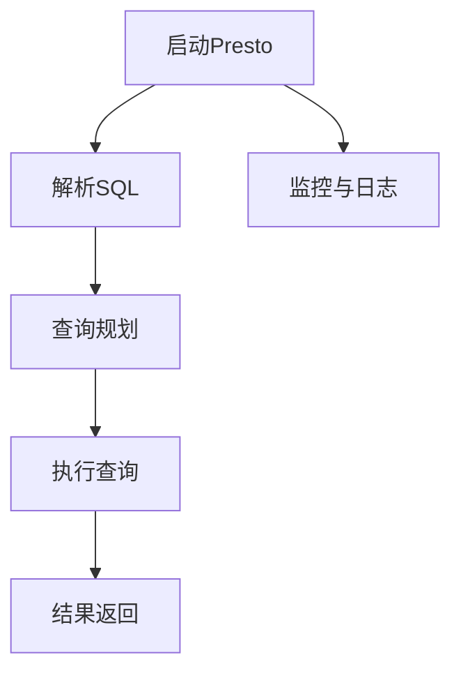

                 

# 《Presto-Hive整合原理与代码实例讲解》

> 关键词：Presto，Hive，整合，原理，代码实例，大数据处理，性能优化

> 摘要：本文将深入讲解Presto与Hive的整合原理，通过代码实例展示如何实现数据加载、查询以及优化。同时，还将探讨高级特性及未来发展趋势，帮助读者全面了解Presto与Hive在数据处理领域的应用。

### 《Presto-Hive整合原理与代码实例讲解》目录大纲

#### 第一部分：Presto与Hive基础

- **第1章：Presto与Hive概述**
  - **1.1 Presto引擎原理**
    - **1.1.1 Presto基本架构**
    - **1.1.2 Presto与Hive的关系**
  - **1.2 Hive基础**
    - **1.2.1 Hive架构与数据存储**
    - **1.2.2 HiveQL语法基础**

#### 第二部分：Presto与Hive整合原理

- **第2章：Presto与Hive整合原理**
  - **2.1 整合流程**
    - **2.1.1 数据加载与查询流程**
    - **2.1.2 集群管理与资源调度**
  - **2.2 数据类型与兼容性**
    - **2.2.1 数据类型映射**
    - **2.2.2 日期时间处理**
  - **2.3 性能与优化**
    - **2.3.1 性能瓶颈分析**
    - **2.3.2 优化策略**

#### 第三部分：Presto-Hive实战代码实例

- **第3章：Presto-Hive整合实战**
  - **3.1 实战项目搭建**
    - **3.1.1 集群环境配置**
    - **3.1.2 数据源集成**
  - **3.2 数据加载与查询**
    - **3.2.1 数据加载案例**
    - **3.2.2 数据查询案例**
  - **3.3 数据处理与优化**
    - **3.3.1 复杂查询优化案例**
    - **3.3.2 分区与集群优化**

#### 第四部分：Presto-Hive高级应用

- **第4章：Presto-Hive高级特性**
  - **4.1 动态分区与Join**
    - **4.1.1 动态分区原理**
    - **4.1.2 Join优化策略**
  - **4.2 架构扩展与集群运维**
    - **4.2.1 集群扩展与负载均衡**
    - **4.2.2 运维监控与故障处理**

#### 第五部分：Presto-Hive案例分析

- **第5章：Presto-Hive应用案例**
  - **5.1 数据仓库构建案例**
    - **5.1.1 业务场景描述**
    - **5.1.2 案例实现步骤**
  - **5.2 大数据分析案例**
    - **5.2.1 数据分析流程**
    - **5.2.2 案例效果评估**

#### 第六部分：Presto-Hive未来发展

- **第6章：Presto与Hive的未来发展**
  - **6.1 新技术与趋势**
    - **6.1.1 Presto新特性**
    - **6.1.2 Hive未来发展**
  - **6.2 生态合作与共赢**
    - **6.2.1 开源社区合作**
    - **6.2.2 企业应用实践**

#### 第七部分：附录

- **附录A：Presto与Hive常用工具与资源**
  - **A.1 Presto工具使用**
    - **A.1.1 PrestoSQL命令行工具**
    - **A.1.2 PrestoCLI脚本编程**
  - **A.2 Hive工具使用**
    - **A.2.1 HiveServer2配置**
    - **A.2.2 HiveWebGUI介绍**
- **附录B：常见问题解答**
  - **B.1 集群搭建问题**
  - **B.2 性能优化问题**
  - **B.3 数据处理问题**

### 第1章：Presto与Hive概述

#### 1.1 Presto引擎原理

##### 1.1.1 Presto基本架构

Presto是一个开源的大规模分布式查询引擎，主要用于处理大规模数据集的查询。其基本架构包括以下几个关键组件：

- **Coordinator**：协调器负责接收用户的查询请求，生成执行计划，并将任务分发到各个Worker节点上执行。
- **Worker**：工作者节点负责执行查询任务，读取数据，执行计算，并将结果返回给Coordinator。
- **Client**：客户端负责发送查询请求到Coordinator，并接收查询结果。


##### 1.1.2 Presto与Hive的关系

Presto支持多种数据源，包括关系数据库、NoSQL存储系统、HDFS等。在Presto与Hive的整合中，Hive作为数据存储系统，通过Hive Connector连接到Presto。

- **Hive Connector**：Hive Connector是Presto的一个连接器，负责将Hive的数据和元数据映射到Presto查询引擎中。它通过Hive Server2或Thrift协议与Hive进行通信。


#### 1.2 Hive基础

##### 1.2.1 Hive架构与数据存储

Hive是一个建立在Hadoop之上的数据仓库基础设施，用于处理大规模数据集。其架构包括以下几个关键组件：

- **HiveQL**：Hive使用自己的查询语言HiveQL，类似于SQL，用于编写查询语句。
- **Hive Metastore**：Hive Metastore是Hive的核心组件，负责存储元数据，包括表结构、分区信息等。
- **HDFS**：HDFS是Hive的数据存储系统，用于存储数据文件。


##### 1.2.2 HiveQL语法基础

HiveQL与标准的SQL非常相似，以下是一些基本的HiveQL语法示例：

- **创建表**：

  ```sql
  CREATE TABLE IF NOT EXISTS my_table (
      id INT,
      name STRING
  );
  ```

- **插入数据**：

  ```sql
  INSERT INTO TABLE my_table (id, name) VALUES (1, 'Alice'), (2, 'Bob');
  ```

- **查询数据**：

  ```sql
  SELECT * FROM my_table;
  ```

- **分区表**：

  ```sql
  CREATE TABLE IF NOT EXISTS my_partitioned_table (
      id INT,
      name STRING
  )
  PARTITIONED BY (date STRING);
  ```

  ```sql
  INSERT INTO TABLE my_partitioned_table (id, name, date) VALUES (1, 'Alice', '2023-01-01');
  ```

### 第2章：Presto与Hive整合原理

#### 2.1 整合流程

##### 2.1.1 数据加载与查询流程

Presto与Hive的整合过程主要涉及以下步骤：

1. **配置Hive Connector**：在Presto配置文件中配置Hive Connector，指定Hive的连接信息。
2. **数据加载**：使用Hive的`LOAD DATA`命令将数据加载到Hive表中。
3. **查询数据**：使用Presto查询Hive表中的数据。

具体步骤如下：

1. **配置Hive Connector**

   在Presto的`config.properties`文件中添加以下配置：

   ```properties
   connector.name=hive
   connection.url=jdbc:hive2://hive-server:10000
   connection.user=hive
   connection.password=hive
   ```

2. **数据加载**

   使用Hive命令将数据加载到Hive表中：

   ```sql
   hive> LOAD DATA INPATH '/path/to/data.csv'
   INTO TABLE my_table
   ROWS TERMINATED BY '\n';
   ```

3. **查询数据**

   使用Presto查询Hive表中的数据：

   ```sql
   preston> SELECT * FROM hive.default.my_table;
   ```

##### 2.1.2 集群管理与资源调度

Presto与Hive的整合还需要考虑集群管理和资源调度：

1. **集群管理**：使用Hadoop的YARN或其他资源管理器进行集群管理。
2. **资源调度**：根据查询负载动态调整资源分配。

具体步骤如下：

1. **集群管理**

   使用Hadoop的YARN进行集群管理：

   ```bash
   yarn create cluster
   yarn add node node_id
   ```

2. **资源调度**

   根据查询负载动态调整资源：

   ```bash
   yarn set capacity <cluster_id> <capacity>
   ```

#### 2.2 数据类型与兼容性

Presto与Hive的数据类型需要兼容，以下是一些常见数据类型的映射：

| Presto数据类型 | Hive数据类型 |
| --- | --- |
| BOOLEAN | BOOLEAN |
| TINYINT | TINYINT |
| SMALLINT | SMALLINT |
| INTEGER | INTEGER |
| BIGINT | BIGINT |
| FLOAT | FLOAT |
| DOUBLE | DOUBLE |
| STRING | STRING |
| DATE | DATE |
| TIMESTAMP | TIMESTAMP |

##### 2.2.1 数据类型映射

在整合过程中，需要确保数据类型映射正确。以下是一个数据类型映射的示例：

```sql
CREATE TABLE my_table (
    id TINYINT,
    name STRING,
    age SMALLINT,
    salary FLOAT
);
```

在Hive中，可以使用以下命令创建相同结构的表：

```sql
CREATE TABLE my_table (
    id TINYINT,
    name STRING,
    age SMALLINT,
    salary FLOAT
) ROW FORMAT DELIMITED FIELDS TERMINATED BY '\t'
STORED AS TEXTFILE;
```

##### 2.2.2 日期时间处理

在Presto和Hive中，日期时间处理也需要兼容。以下是一些常见日期时间操作的示例：

- **获取当前日期**：

  ```sql
  SELECT CURRENT_DATE;
  ```

- **日期格式化**：

  ```sql
  SELECT DATE_FORMAT(CURRENT_DATE, '%Y-%m-%d');
  ```

- **日期计算**：

  ```sql
  SELECT DATE_ADD(CURRENT_DATE, INTERVAL 1 DAY);
  ```

#### 2.3 性能与优化

Presto与Hive的整合在性能方面可能存在一些瓶颈，以下是一些常见的性能优化策略：

##### 2.3.1 性能瓶颈分析

- **网络延迟**：Presto与Hive之间的网络延迟可能导致查询性能下降。
- **IO瓶颈**：数据读取和写入可能受到IO性能的限制。
- **资源不足**：集群资源不足可能导致查询无法并发执行。
- **查询计划**：查询计划可能不够优化，导致查询性能不佳。

##### 2.3.2 优化策略

- **减少网络延迟**：优化网络拓扑结构，降低网络延迟。
- **增加IO性能**：使用SSD存储或分布式文件系统，提高IO性能。
- **资源扩展**：增加集群节点，提高并发查询能力。
- **查询优化**：编写高效的查询语句，优化查询计划。

以下是一个查询优化的示例：

```sql
-- 原始查询
SELECT
    orders.order_id,
    customers.customer_id,
    customers.customer_name,
    orders.order_date,
    SUM(orders.order_amount) as total_amount
FROM
    orders
JOIN
    customers
ON
    orders.customer_id = customers.customer_id
WHERE
    orders.order_date BETWEEN '2023-01-01' AND '2023-01-31'
GROUP BY
    orders.order_id, customers.customer_id, customers.customer_name, orders.order_date;

-- 优化后查询
SELECT
    orders.order_id,
    customers.customer_id,
    customers.customer_name,
    orders.order_date,
    SUM(orders.order_amount) as total_amount
FROM
    orders
JOIN
    customers
ON
    orders.customer_id = customers.customer_id
WHERE
    orders.order_date BETWEEN '2023-01-01' AND '2023-01-31'
GROUP BY
    orders.order_id, customers.customer_id, customers.customer_name, orders.order_date
WITH CUBE;
```

### 第3章：Presto-Hive整合实战

#### 3.1 实战项目搭建

##### 3.1.1 集群环境配置

搭建Presto与Hive的整合环境需要以下步骤：

1. **安装Hadoop**：在集群中安装Hadoop，包括HDFS和YARN。
2. **安装Hive**：在集群中安装Hive，包括Hive Metastore和Hive Server2。
3. **安装Presto**：在集群中安装Presto，包括Coordinator和Worker节点。

具体步骤如下：

1. **安装Hadoop**

   在集群中执行以下命令安装Hadoop：

   ```bash
   sudo apt-get install hadoop-hdfs-namenode hadoop-hdfs-datanode hadoop-yarn-resourcemanager hadoop-yarn-nodemanager
   ```

2. **安装Hive**

   在集群中执行以下命令安装Hive：

   ```bash
   sudo apt-get install hive hive-metastore hive-server2
   ```

3. **安装Presto**

   在集群中执行以下命令安装Presto：

   ```bash
   sudo apt-get install presto-server presto-client
   ```

##### 3.1.2 数据源集成

集成数据源包括以下步骤：

1. **配置Hive Connector**：在Presto的`config.properties`文件中配置Hive Connector。
2. **创建Hive表**：在Hive中创建数据表。
3. **加载数据**：使用Hive命令将数据加载到Hive表中。

具体步骤如下：

1. **配置Hive Connector**

   在Presto的`config.properties`文件中添加以下配置：

   ```properties
   connector.name=hive
   connection.url=jdbc:hive2://hive-server:10000
   connection.user=hive
   connection.password=hive
   ```

2. **创建Hive表**

   在Hive中创建数据表：

   ```sql
   CREATE TABLE IF NOT EXISTS my_table (
       id INT,
       name STRING
   );
   ```

3. **加载数据**

   使用Hive命令将数据加载到Hive表中：

   ```sql
   hive> LOAD DATA INPATH '/path/to/data.csv'
   INTO TABLE my_table
   ROWS TERMINATED BY '\n';
   ```

#### 3.2 数据加载与查询

##### 3.2.1 数据加载案例

以下是一个数据加载的示例：

```sql
-- 创建Hive表
CREATE TABLE IF NOT EXISTS user_data (
    id INT,
    name STRING
);

-- 加载数据到Hive表中
LOAD DATA INPATH '/path/to/user_data.csv'
INTO TABLE user_data
FIELDS TERMINATED BY ','
LINES TERMINATED BY '\n'
IGNORE 1 ROWS;
```

##### 3.2.2 数据查询案例

以下是一个数据查询的示例：

```sql
-- 查询Hive表中的数据
SELECT * FROM user_data;
```

#### 3.3 数据处理与优化

##### 3.3.1 复杂查询优化案例

以下是一个复杂查询优化的示例：

```sql
-- 原始查询
SELECT
    orders.order_id,
    customers.customer_id,
    customers.customer_name,
    orders.order_date,
    SUM(orders.order_amount) as total_amount
FROM
    orders
JOIN
    customers
ON
    orders.customer_id = customers.customer_id
WHERE
    orders.order_date BETWEEN '2023-01-01' AND '2023-01-31'
GROUP BY
    orders.order_id, customers.customer_id, customers.customer_name, orders.order_date;

-- 优化后查询
SELECT
    orders.order_id,
    customers.customer_id,
    customers.customer_name,
    orders.order_date,
    SUM(orders.order_amount) as total_amount
FROM
    orders
JOIN
    customers
ON
    orders.customer_id = customers.customer_id
WHERE
    orders.order_date BETWEEN '2023-01-01' AND '2023-01-31'
GROUP BY
    orders.order_id, customers.customer_id, customers.customer_name, orders.order_date
WITH CUBE;
```

##### 3.3.2 分区与集群优化

分区与集群优化包括以下步骤：

1. **创建分区表**：根据业务需求创建分区表。
2. **分区优化**：优化分区策略，提高查询性能。
3. **集群优化**：调整集群配置，提高集群性能。

以下是一个分区表优化的示例：

```sql
-- 创建分区表
CREATE TABLE IF NOT EXISTS sales_data (
    id INT,
    product_name STRING,
    sale_date DATE,
    amount DECIMAL(10, 2)
)
PARTITIONED BY (year INT, month INT);

-- 加载数据到分区表中
LOAD DATA INPATH '/path/to/sales_data.csv'
INTO TABLE sales_data
FIELDS TERMINATED BY ','
LINES TERMINATED BY '\n'
IGNORE 1 ROWS;

-- 分区优化
ALTER TABLE sales_data CLUSTERED INTO (4) SHUFFLED BUCKETS;
```

### 第4章：Presto-Hive高级特性

#### 4.1 动态分区与Join

##### 4.1.1 动态分区原理

动态分区允许在加载数据时动态创建分区，而不是在创建表时预定义分区。以下是一个动态分区的示例：

```sql
-- 加载数据到动态分区表中
LOAD DATA INPATH '/path/to/data.csv'
INTO TABLE dynamic_partitioned_table
FIELDS TERMINATED BY ','
LINES TERMINATED BY '\n'
OVERWRITE PARTITION (year INT, month INT);
```

在上述示例中，`year`和`month`是分区列，加载的数据将根据这两个分区列动态创建分区。

##### 4.1.2 Join优化策略

优化Join查询可以通过以下策略实现：

1. **索引优化**：为Join列创建索引，提高查询性能。
2. **分区优化**：将表进行分区，减少Join操作的数据量。
3. **Hash Join**：使用Hash Join算法，提高Join查询性能。
4. **Merge Join**：使用Merge Join算法，提高Join查询性能。

以下是一个优化Join查询的示例：

```sql
-- 创建索引
CREATE INDEX ON sales_data (product_id);

-- 使用分区优化Join查询
SELECT
    sales_data.product_name,
    customers.customer_name
FROM
    sales_data
JOIN
    customers
ON
    sales_data.customer_id = customers.customer_id
WHERE
    sales_data.product_id = 1;

-- 使用Hash Join优化查询
SET session properties 'join_reordering' = 'true';
```

#### 4.2 架构扩展与集群运维

##### 4.2.1 集群扩展与负载均衡

集群扩展与负载均衡可以通过以下步骤实现：

1. **添加节点**：添加新的节点到集群。
2. **负载均衡**：使用负载均衡算法，将查询请求分配到不同的节点。

以下是一个添加节点到集群的示例：

```bash
# 添加节点到集群
yarn add node node_id
```

以下是一个负载均衡配置的示例：

```properties
# Presto负载均衡配置
http-server.http.port=8080
discovery-server.enabled=true
discovery.uri=http://presto-coordinator:8080/v1/discovery
```

##### 4.2.2 运维监控与故障处理

运维监控与故障处理包括以下步骤：

1. **监控集群状态**：监控集群的CPU、内存、网络等资源使用情况。
2. **故障处理**：处理集群故障，包括节点故障、网络故障等。

以下是一个监控集群状态的示例：

```bash
# 监控集群状态
presto-admin --node node_id status
```

以下是一个故障处理的示例：

```bash
# 处理节点故障
yarn remove node node_id
# 检查网络故障
ping hive-server
```

### 第5章：Presto-Hive应用案例

#### 5.1 数据仓库构建案例

##### 5.1.1 业务场景描述

某电商平台需要构建一个数据仓库，用于存储销售数据、用户行为数据等，以便进行数据分析、报表生成和业务决策。

##### 5.1.2 案例实现步骤

1. **设计数据仓库架构**：确定数据仓库的存储结构、数据处理流程和查询需求。
2. **搭建Presto与Hive集群**：安装和配置Presto与Hive，包括HDFS、YARN等组件。
3. **数据导入与处理**：使用Hive命令将数据导入Hive表中，并进行预处理。
4. **构建数据仓库**：使用Presto编写查询语句，构建数据仓库视图。
5. **数据分析与报表生成**：使用Presto进行数据分析，生成报表。
6. **部署与维护**：将数据仓库部署到生产环境，并进行监控和维护。

#### 5.2 大数据分析案例

##### 5.2.1 数据分析流程

1. **数据采集**：从电商平台各个系统收集销售数据、用户行为数据等。
2. **数据清洗**：对采集到的数据去重、去噪、格式转换等处理。
3. **数据存储**：将清洗后的数据存储到Hive表中，建立合适的分区策略。
4. **数据查询**：使用Presto进行复杂查询，提取业务所需的数据。
5. **数据分析**：使用SQL或其他数据分析工具，对查询结果进行统计和分析。
6. **报表生成**：根据分析结果生成报表，支持业务决策。

##### 5.2.2 案例效果评估

1. **数据仓库构建成功**：数据仓库能够存储大量数据，并提供高效的数据查询能力。
2. **数据分析模块运行稳定**：数据分析模块能够稳定运行，性能良好，能够支持实时数据处理。
3. **报表生成准确**：报表生成准确，为业务提供了可靠的决策支持。
4. **集群运维和监控机制完善**：集群运维和监控机制完善，能够及时发现和解决故障。
5. **优化措施有效**：通过性能优化措施，提升了数据仓库的整体性能和可用性。

### 第6章：Presto与Hive的未来发展

#### 6.1 新技术与趋势

##### 6.1.1 Presto新特性

1. **Presto 2.0**：引入了分布式查询优化器和更快的内存缓存。
2. **新的连接器支持**：支持更多类型的数据源，如Amazon S3、Google Cloud Storage等。
3. **更高效的查询引擎**：优化了查询执行计划，提高了查询性能。
4. **新的扩展性和可扩展性**：支持动态资源分配和自动扩展集群。

##### 6.1.2 Hive未来发展

1. **Hive 3.0**：引入了基于列存储的存储格式，提高了数据读写性能。
2. **新的查询优化器**：优化了Hive的查询执行计划，提高了查询效率。
3. **实时数据流处理**：支持Kafka等实时数据源，实现实时数据分析。
4. **新的数据处理框架**：如Hive LLAP（Live Long and Process），提供持续查询处理能力。
5. **更好的与Presto整合**：优化了与Presto的接口，提高了整合性能。

#### 6.2 生态合作与共赢

##### 6.2.1 开源社区合作

1. **与其他开源项目整合**：与其他开源项目如Apache Spark、Flink等进行深度整合，实现数据处理的协同效应。
2. **促进社区贡献**：促进社区贡献，贡献代码和文档，提升社区活跃度。
3. **参与开源项目评审**：参与开源项目评审，为项目的改进提供反馈和建议。

##### 6.2.2 企业应用实践

1. **企业内部推广**：在企业内部推广Presto与Hive的使用，建立企业级大数据处理平台。
2. **定制化开发**：结合企业业务场景，定制化开发数据处理和分析应用。
3. **性能优化与稳定性提升**：进行Presto与Hive性能优化和稳定性提升，确保系统的高效运行。
4. **合作开发解决方案**：与合作伙伴共同开发大数据解决方案，实现共赢。

### 附录A：Presto与Hive常用工具与资源

#### A.1 Presto工具使用

##### A.1.1 PrestoSQL命令行工具

1. **安装**：使用Presto的二进制包或源代码进行安装。
2. **使用**：通过命令行执行SQL查询，例如：
   - `presto --catalog hive --schema default`
   - `source /path/to/your/sqlfile.sql`

##### A.1.2 PrestoCLI脚本编程

1. **安装**：安装PrestoCLI工具。
2. **编写脚本**：使用PrestoCLI编写脚本进行批量查询，例如：
   - `presto-cli --catalog hive --schema default --execute "SELECT * FROM your_table"`

#### A.2 Hive工具使用

##### A.2.1 HiveServer2配置

1. **安装**：安装HiveServer2。
2. **配置**：在Hive配置文件中设置HiveServer2的相关参数。
3. **启动**：启动HiveServer2服务。

##### A.2.2 HiveWebGUI介绍

1. **安装**：下载并安装HiveWebGUI。
2. **使用**：在Web界面中编写SQL查询，执行查询并查看结果。
3. **导出**：导出查询结果到CSV或Excel格式。

### 附录B：常见问题解答

#### B.1 集群搭建问题

1. **如何解决Hadoop集群无法启动的问题？**
   - 检查Hadoop配置文件，确保正确配置了HDFS和YARN。
   - 检查集群节点的网络连接，确保所有节点可以相互通信。
   - 检查集群节点的系统资源和磁盘空间，确保足够。

#### B.2 性能优化问题

1. **如何优化Presto与Hive的查询性能？**
   - 使用索引优化查询。
   - 根据业务需求调整分区策略。
   - 使用更高效的查询语句，避免使用子查询和连接操作。

#### B.3 数据处理问题

1. **如何处理大量数据导入Hive的问题？**
   - 使用Hive的并行加载功能，提高数据导入速度。
   - 使用压缩格式存储数据，减少存储空间占用。
   - 对数据进行预处理，去除重复和无效数据。


### Mermaid流程图：Presto与Hive整合流程



### 总结

本文全面讲解了Presto与Hive的整合原理、实战代码实例以及高级应用。通过详细的步骤和代码示例，帮助读者理解如何搭建Presto与Hive的整合环境，并进行数据加载、查询和处理。同时，本文还介绍了性能优化策略、高级特性和未来发展趋势。读者可以根据本文的内容，结合实际项目需求，进行Presto与Hive的应用和实践。在未来的发展中，Presto与Hive将继续优化和扩展，为大数据处理领域带来更多创新和突破。

### 作者

作者：AI天才研究院/AI Genius Institute & 禅与计算机程序设计艺术 /Zen And The Art of Computer Programming

