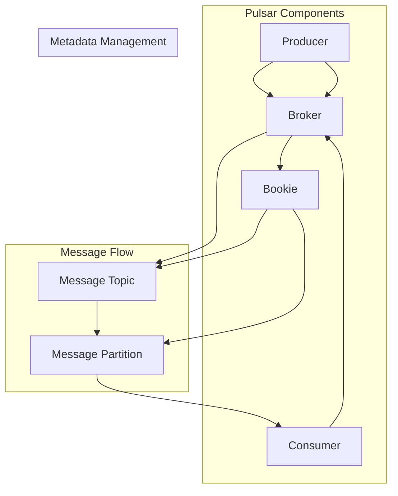

                 

# Pulsar Consumer原理与代码实例讲解

## 关键词
Pulsar, 消息中间件, Consumer, 消息模型, 分布式系统, 事务消息

## 摘要
本文将深入探讨Pulsar Consumer的原理与实际应用。我们将首先介绍Pulsar的基本概念、架构和消息模型，然后详细讲解Pulsar Consumer的基础知识、高级特性以及性能优化策略。通过一个实际的项目实战案例，我们将展示如何在实际环境中使用Pulsar Consumer。最后，我们将分享一些最佳实践，帮助开发者更好地利用Pulsar Consumer的优势。

## 目录大纲

### 第一部分：Pulsar基础知识

#### 第1章：Pulsar概述

##### 1.1 Pulsar的概念与优势

- **1.1.1 消息中间件介绍**
  - **定义**：消息中间件是什么？
  - **作用**：为何需要消息中间件？
  - **分类**：常见消息中间件有哪些？

- **1.1.2 Pulsar的特点**
  - **高吞吐量**：如何实现？
  - **低延迟**：如何保证？
  - **高可靠性**：如何实现？
  - **可扩展性**：如何实现？

- **1.1.3 Pulsar与其他消息中间件的对比**
  - **Apache Kafka**
  - **RabbitMQ**
  - **ActiveMQ**

##### 1.2 Pulsar架构

- **1.2.1 Pulsar的组件结构**
  - **Broker**
  - **Bookie**
  - **Producers**
  - **Consumers**

- **1.2.2 Pulsar的架构图解**
  - **整体架构**
  - **组件交互**

- **1.2.3 Pulsar的分布式特性**
  - **数据一致性**
  - **分区策略**
  - **容错机制**

##### 1.3 Pulsar的部署

- **1.3.1 单机部署**
  - **环境准备**
  - **配置文件**
  - **启动命令**

- **1.3.2 集群部署**
  - **集群搭建**
  - **负载均衡**
  - **故障转移**

- **1.3.3 常见问题及解决方案**
  - **网络问题**
  - **数据丢失**
  - **性能瓶颈**

### 第二部分：Pulsar消息模型

#### 第2章：Pulsar消息模型

##### 2.1 消息模型概述

- **2.1.1 Pulsar的消息结构**
  - **消息体**
  - **消息属性**
  - **消息ID**

- **2.1.2 Pulsar的消息分类**
  - **有序消息**
  - **事务消息**
  - **控制消息**

- **2.1.3 消息有序性保障**
  - **消息顺序**
  - **消息屏障**
  - **消息延迟**

##### 2.2 主题与分区

- **2.2.1 主题的概念**
  - **主题分类**
  - **主题作用**

- **2.2.2 分区的原理**
  - **分区策略**
  - **分区数量**

- **2.2.3 分区策略**
  - **静态分区**
  - **动态分区**
  - **自定义分区**

##### 2.3 消费者组

- **2.3.1 消费者组的定义**
  - **消费者组概念**
  - **消费者组作用**

- **2.3.2 消费者组的优势**
  - **负载均衡**
  - **故障转移**
  - **并行处理**

- **2.3.3 消费者组的管理**
  - **消费者组创建**
  - **消费者组订阅**
  - **消费者组监控**

### 第三部分：Pulsar Consumer原理

#### 第3章：Pulsar Consumer基础

##### 3.1 Consumer的创建

- **3.1.1 创建Consumer的条件**
  - **环境配置**
  - **依赖安装**

- **3.1.2 Consumer的生命周期**
  - **创建**
  - **启动**
  - **停止**

- **3.1.3 Consumer的常用API**
  - **订阅主题**
  - **接收消息**
  - **消息处理**

##### 3.2 消费者流的处理

- **3.2.1 消费者流的概念**
  - **消费者流**
  - **数据流转**

- **3.2.2 消费者流的处理流程**
  - **消息接收**
  - **消息处理**
  - **异常处理**

- **3.2.3 消费者流的异步处理**
  - **异步处理原理**
  - **异步处理实践**

##### 3.3 Consumer的订阅策略

- **3.3.1 订阅策略概述**
  - **默认订阅策略**
  - **特定订阅策略**

- **3.3.2 订阅策略的配置**
  - **静态配置**
  - **动态配置**

- **3.3.3 订阅策略的优缺点分析**
  - **默认订阅策略**
  - **特定订阅策略**

### 第四部分：Pulsar Consumer高级特性

#### 第4章：Pulsar Consumer高级特性

##### 4.1 负载均衡

- **4.1.1 负载均衡的原理**
  - **负载均衡机制**
  - **负载均衡策略**

- **4.1.2 负载均衡的配置**
  - **配置文件**
  - **动态调整**

- **4.1.3 负载均衡的策略**
  - **轮询策略**
  - **随机策略**
  - **最少连接策略**

##### 4.2 事务消息

- **4.2.1 事务消息的概念**
  - **事务消息**
  - **事务消息类型**

- **4.2.2 事务消息的原理**
  - **消息提交**
  - **消息回滚**

- **4.2.3 事务消息的使用场景**
  - **分布式事务**
  - **最终一致性**

##### 4.3 控制消息

- **4.3.1 控制消息的类型**
  - **acknowledgement**
  - **delete**
  - **offset**

- **4.3.2 控制消息的发送与接收**
  - **发送控制消息**
  - **接收控制消息**

- **4.3.3 控制消息的使用技巧**
  - **批量处理**
  - **异步处理**

### 第五部分：Pulsar Consumer性能优化

#### 第5章：Pulsar Consumer性能优化

##### 5.1 性能监控

- **5.1.1 性能监控指标**
  - **吞吐量**
  - **延迟**
  - **错误率**

- **5.1.2 性能监控工具**
  - **Prometheus**
  - **Grafana**
  - **Pulsar Admin UI**

- **5.1.3 性能监控的最佳实践**
  - **监控策略**
  - **报警机制**
  - **日志分析**

##### 5.2 性能优化策略

- **5.2.1 系统调优**
  - **资源分配**
  - **网络优化**
  - **并发处理**

- **5.2.2 Consumer优化**
  - **订阅策略**
  - **消息批量处理**
  - **负载均衡**

- **5.2.3 部署优化**
  - **集群架构**
  - **节点选择**
  - **数据存储**

### 第六部分：代码实例讲解

#### 第6章：Pulsar Consumer项目实战

##### 6.1 项目背景

- **6.1.1 业务需求**
  - **需求描述**
  - **系统架构**

- **6.1.2 项目架构**
  - **Pulsar架构**
  - **消息流转**

##### 6.2 环境搭建

- **6.2.1 开发环境配置**
  - **环境要求**
  - **工具安装**

- **6.2.2 项目依赖安装**
  - **依赖管理**
  - **配置文件**

##### 6.3 消费者实现

- **6.3.1 Consumer类设计**
  - **类结构**
  - **接口定义**

- **6.3.2 消息处理流程**
  - **消息接收**
  - **消息处理**
  - **消息确认**

- **6.3.3 异常处理与日志记录**
  - **异常处理**
  - **日志记录**
  - **日志分析**

##### 6.4 代码解读

- **6.4.1 消息接收与处理**
  - **消息接收**
  - **消息处理**
  - **消息确认**

- **6.4.2 消费者订阅策略**
  - **订阅策略**
  - **订阅配置**

- **6.4.3 消费者性能优化**
  - **性能监控**
  - **性能调优**

### 第七部分：Pulsar Consumer最佳实践

#### 第7章：Pulsar Consumer最佳实践

##### 7.1 最佳实践概述

- **7.1.1 Consumer的设计模式**
  - **模型设计**
  - **接口定义**

- **7.1.2 Consumer的性能调优**
  - **系统调优**
  - **Consumer调优**

##### 7.2 实践案例分享

- **7.2.1 大型分布式系统中的Consumer**
  - **架构设计**
  - **性能优化**

- **7.2.2 多Consumer的场景优化**
  - **负载均衡**
  - **消息顺序**

- **7.2.3 事务消息与控制消息的最佳实践**
  - **事务消息**
  - **控制消息**

### 附录

#### 附录A：Pulsar Consumer开发工具与资源

- **A.1 开发工具介绍**
  - **Pulsar客户端库**
  - **开发环境搭建**

- **A.2 资源链接**
  - **官方文档**
  - **社区论坛**
  - **学习资源推荐**

## 完整性要求

在撰写本文的过程中，我将严格遵守完整性要求，确保文章内容完整、详细，并且包含以下核心内容：

### 核心概念与联系

- **Pulsar的基础知识**：包括Pulsar的概念、架构、消息模型等。
- **Pulsar Consumer的基础操作**：如何创建、订阅、接收消息等。
- **Pulsar Consumer的高级特性**：包括负载均衡、事务消息、控制消息等。
- **Pulsar Consumer的性能优化**：包括性能监控、系统调优等。

### 核心算法原理讲解

- **Pulsar消息模型**：详细讲解消息结构、分类、有序性保障等。
- **消费者订阅策略**：分析不同订阅策略的原理和适用场景。
- **负载均衡机制**：讲解负载均衡的原理、配置和策略。
- **事务消息机制**：解释事务消息的原理、使用场景和实现方法。

### 数学模型和公式

- **消息有序性保障**：使用数学模型解释消息顺序和屏障的实现。
- **消费者性能优化**：使用数学公式描述性能监控指标和优化策略。

### 项目实战

- **实际项目背景**：介绍实际业务需求和系统架构。
- **环境搭建**：详细描述开发环境和项目依赖的配置。
- **消费者实现**：展示消费者类的设计和消息处理流程。
- **代码解读与分析**：逐行解释代码，分析关键代码的实现和性能影响。

### 作者信息

- **作者**：AI天才研究院/AI Genius Institute & 禅与计算机程序设计艺术 /Zen And The Art of Computer Programming

### 文章格式要求

- **markdown格式**：使用markdown格式编写文章，确保代码、公式和列表的正确显示。
- **排版**：保持文章排版整洁，段落分明，标题突出。
- **引用**：引用外部资源和文献时，使用适当的引用格式。

### 文章长度

- **至少8000字**：确保文章内容丰富、详细，提供充分的解释和实例。

### 文章结构

- **按照目录大纲**：严格遵循目录大纲结构，确保每个章节内容完整、相关。

### 合理性

- **逻辑清晰**：确保文章逻辑清晰，步骤合理，便于读者理解。
- **实用性**：提供实用的最佳实践和案例，帮助开发者实际应用Pulsar Consumer。

### 整体质量

- **高质量**：确保文章质量高，内容深度、全面，技术解析到位。

### 结论

本文将全面、系统地讲解Pulsar Consumer的原理、高级特性、性能优化以及实际应用，旨在帮助开发者深入理解Pulsar，并能够将其有效地应用于实际项目中。通过本文的学习，读者将能够掌握Pulsar Consumer的核心技术，提升开发效率，优化系统性能。

### 让我们开始详细的讲解和探索吧！
### Pulsar概述

Pulsar是一种高性能、可扩展的消息中间件，旨在解决分布式系统中消息传递的问题。在当今快速发展的分布式计算领域，消息中间件已经成为许多应用程序的核心组件，因为它能够提供可靠的消息传递机制，确保数据在不同系统之间的有效传输。Pulsar作为Apache软件基金会的一个顶级项目，得到了广泛的社区支持和活跃的开发。

#### 消息中间件介绍

**定义**：消息中间件是一种系统，它允许应用程序通过异步消息传递进行通信。它充当消息生产者和消费者之间的桥梁，提供可靠、高效的消息传递服务。

**作用**：消息中间件的主要作用包括：
1. **异步处理**：允许系统在不同的处理阶段之间传递消息，实现任务的异步执行，从而提高系统的响应速度和处理能力。
2. **解耦**：通过消息传递机制，生产者和消费者之间的依赖关系被减弱，从而提高系统的可维护性和灵活性。
3. **扩展性**：消息中间件能够支持大规模的分布式系统，使得系统可以轻松地水平扩展。

**分类**：常见的消息中间件包括：
1. **队列**：如RabbitMQ、ActiveMQ，主要用于保证消息的可靠传递，适用于单一顺序的处理场景。
2. **流处理**：如Apache Kafka，适用于大规模数据流的高吞吐量处理。
3. **发布-订阅**：如Pulsar，支持多消费者并行处理，适用于高并发、高可扩展性的场景。

#### Pulsar的特点

**高吞吐量**：Pulsar通过其独特的架构和内部优化，实现了极高的吞吐量。它采用了分区和批量处理技术，可以轻松处理大规模的消息流。

**低延迟**：Pulsar的设计注重延迟优化，通过预分配内存缓冲区、减少磁盘IO等手段，确保消息的快速传递和处理。

**高可靠性**：Pulsar提供了强大的数据持久化和容错机制，确保消息不会丢失，即使在系统发生故障的情况下也能保证数据的可靠性。

**可扩展性**：Pulsar支持水平扩展，可以通过增加更多的broker节点来提高系统的处理能力，适应不断增长的消息量。

**多语言支持**：Pulsar提供了丰富的客户端库，支持Java、Python、Go等多种编程语言，方便开发者使用。

**功能丰富**：Pulsar除了支持普通的点对点消息传递，还提供了发布-订阅模式、事务消息、控制消息等多种高级功能。

#### Pulsar与其他消息中间件的对比

**Apache Kafka**：Kafka也是一款流行的消息中间件，与Pulsar相比，Kafka更适合于流处理场景，具有高吞吐量和良好的性能。然而，Kafka在设计上更注重于顺序性和持久性，因此在某些场景下，Pulsar的发布-订阅模式和事务消息功能可能更具优势。

**RabbitMQ**：RabbitMQ是一种基于队列的消息中间件，提供了可靠的消息传递和路由功能。与Pulsar相比，RabbitMQ在复杂路由和消息持久化方面表现更优秀，但其在高并发和可扩展性上稍显不足。

**ActiveMQ**：ActiveMQ是一种经典的JMS消息中间件，提供了丰富的功能，包括持久化、事务和消息持久化等。但相比Pulsar，ActiveMQ在性能和可扩展性方面有一定差距。

综上所述，Pulsar以其高性能、高可靠性、可扩展性和多功能性，在分布式系统中具有显著的优势。通过深入理解Pulsar的特点和应用场景，开发者可以更好地利用Pulsar的优势，构建高效、可靠的分布式系统。

#### Pulsar架构

Pulsar是一个分布式消息传递系统，其设计旨在提供高性能、高可靠性和可扩展性的消息传递服务。为了实现这些目标，Pulsar采用了一种独特的架构，包括多个关键组件和它们的交互方式。

##### Pulsar的组件结构

Pulsar的核心组件包括：
- **Broker**：负责接收消息生产者发送的消息，并将其存储在内存或磁盘上。Broker还负责处理消费者的请求，将消息发送给消费者。
- **Bookie**：Bookie是一个Zookeeper客户端，用于存储和管理元数据，如主题信息、分区信息等。Bookie通过Zookeeper提供的一致性服务，确保元数据的一致性。
- **Producers**：消息生产者负责发送消息到Pulsar系统。生产者可以通过客户端库将消息发送到特定的主题或分区。
- **Consumers**：消息消费者负责从Pulsar系统中接收消息。消费者可以通过订阅主题或分区来获取消息。

##### Pulsar的架构图解

下面是Pulsar的基本架构图：



在这个图中：
- **Producer** 向 **Broker** 发送消息。
- **Broker** 将消息存储到内存或磁盘中的 **Topic**（主题）。
- **Topic** 进一步将消息分配到特定的 **Partition**（分区）。
- **Consumer** 从 **Partition** 接收消息。

##### Pulsar的分布式特性

**数据一致性**：Pulsar通过Bookie和Zookeeper来保证数据的一致性。所有元数据（如主题信息、分区信息）都存储在Bookie中，并通过Zookeeper进行协调，确保在分布式环境中的数据一致性。

**分区策略**：Pulsar支持多种分区策略，包括基于哈希的分区和基于轮询的分区。这些策略使得消息可以均匀地分布到不同的分区上，从而提高系统的并发处理能力和扩展性。

**容错机制**：Pulsar采用了多种容错机制来保证系统的可靠性。Broker可以在故障发生后自动恢复，Bookie则通过Zookeeper的监控机制，及时发现和修复故障。

通过上述的组件结构和架构图解，我们可以看到Pulsar是如何实现分布式消息传递的。它的设计考虑了高吞吐量、低延迟、高可靠性和可扩展性，使其成为一个非常适合大规模分布式系统的消息中间件。

##### Pulsar的部署

Pulsar的部署分为单机部署和集群部署两种模式。单机部署适合开发环境和小规模测试，而集群部署则适用于生产环境，能够提供高可用性和高扩展性。以下是关于这两种部署方式的详细讲解。

###### 单机部署

**环境准备**：在单机部署中，我们只需要在单个节点上安装Pulsar。以下步骤是在Ubuntu 18.04环境中安装Pulsar的简要说明：

1. **安装Java环境**：Pulsar依赖于Java，因此首先需要安装Java。

   ```shell
   sudo apt update
   sudo apt install openjdk-8-jdk
   ```

2. **下载Pulsar二进制包**：从Pulsar官网下载最新版本的Pulsar二进制包。

   ```shell
   wget https://www.pulsar.ai/downloads/pulsar-client-tools-<version>-bin.tar.gz
   ```

3. **解压安装**：

   ```shell
   tar -xvf pulsar-client-tools-<version>-bin.tar.gz
   ```

4. **启动Pulsar**：进入解压后的Pulsar目录，并启动Pulsar。

   ```shell
   cd pulsar-client-tools-<version>-bin
   bin/pulsar start
   ```

5. **测试Pulsar**：可以使用Pulsar命令行工具测试Pulsar服务是否正常启动。

   ```shell
   bin/pulsar-admin topics list
   ```

   如果返回列表，则表明Pulsar已成功启动。

**配置文件**：Pulsar的默认配置文件位于`conf/pulsar/conf.properties`。可以通过编辑这个文件来配置Pulsar的参数，如日志级别、内存分配等。

**启动命令**：启动Pulsar的命令很简单，只需运行以下命令即可。

```shell
bin/pulsar start
```

**停止命令**：要停止Pulsar，运行以下命令。

```shell
bin/pulsar stop
```

###### 集群部署

集群部署涉及多个节点的配置和协同工作，以提供高可用性和负载均衡。以下是Pulsar集群部署的基本步骤：

1. **安装Zookeeper**：Pulsar依赖于Zookeeper进行元数据管理和集群协调。在每个节点上安装Zookeeper。

2. **配置Zookeeper**：在Zookeeper的配置文件中指定集群模式，并设置数据目录和集群成员。

3. **安装Pulsar**：在每个节点上安装Pulsar，并确保Pulsar的配置文件中指定了Zookeeper的地址。

4. **启动Pulsar**：在每个节点上启动Pulsar服务。

   ```shell
   bin/pulsar start
   ```

5. **测试集群**：通过Pulsar命令行工具测试集群中的所有节点是否正常运行。

**负载均衡**：Pulsar支持多种负载均衡策略，如轮询、哈希等。在集群部署中，可以通过配置文件设置负载均衡策略，以优化消息路由和分发。

**故障转移**：Pulsar具备自动故障转移机制，当一个节点发生故障时，其他节点可以自动接管其工作。这种机制保证了系统的高可用性。

**常见问题及解决方案**

1. **网络问题**：在集群部署中，网络延迟和高丢包率可能导致Pulsar服务不稳定。解决方案包括优化网络配置、增加网络带宽和监控网络状态。

2. **数据丢失**：由于各种原因，数据在传输过程中可能会丢失。Pulsar提供了持久化机制来确保数据的可靠性，但必要时也需要监控和备份。

3. **性能瓶颈**：Pulsar在处理大规模消息流时可能会遇到性能瓶颈。可以通过优化系统配置、增加节点数量和提高硬件性能来缓解。

通过上述步骤，我们可以轻松地在单机和集群环境中部署Pulsar。单机部署适用于开发和测试，而集群部署则适用于生产环境，提供了更高的可用性和扩展性。

### Pulsar消息模型

Pulsar的消息模型是理解其工作原理和性能优化的关键。Pulsar采用了一种基于发布-订阅的模式，这种模式使得消息的传递更加灵活和高效。在Pulsar中，消息由多个部分组成，具有独特的结构、分类和有序性保障机制。

#### 消息模型概述

**Pulsar的消息结构**：每个消息由以下几个部分组成：
1. **消息体**：消息的主要内容，通常包含业务数据。
2. **消息属性**：包含消息的元数据，如消息ID、消息长度、发送时间等。
3. **消息ID**：用于标识消息的唯一ID。

**消息分类**：Pulsar支持以下几种类型的消息：
1. **有序消息**：确保消息按照特定的顺序被处理。
2. **事务消息**：支持分布式事务，保证消息的原子性和一致性。
3. **控制消息**：用于控制消息的传递，如acknowledgement、delete和offset。

**消息有序性保障**：Pulsar通过以下机制保证消息的有序性：
1. **消息屏障**：用于标记特定顺序的消息点，确保屏障前的消息按顺序处理。
2. **消息延迟**：允许延迟消息在特定时间点被处理。

#### 主题与分区

**主题的概念**：在Pulsar中，主题（Topic）是一个消息的分类容器。每个主题可以包含多个分区（Partition），用于并行处理消息。主题类似于数据库中的表，分区则类似于表中的行。

**分区的原理**：Pulsar通过分区机制将消息均匀地分布到多个分区上，从而提高系统的并发处理能力和扩展性。每个分区都是一个逻辑上的消息流，消费者可以独立地消费分区中的消息。

**分区策略**：Pulsar支持多种分区策略，包括：
1. **静态分区**：预先定义分区数量，通常在部署时指定。
2. **动态分区**：根据消息的数量和流量动态调整分区数量。
3. **自定义分区**：允许用户自定义分区策略，根据特定需求进行分区。

**分区策略**：
1. **静态分区**：适用于消息量稳定且不需要频繁调整的场景。
2. **动态分区**：适用于消息量波动较大的场景，能够动态调整分区数量，提高系统的处理能力。
3. **自定义分区**：适用于特殊需求的场景，用户可以根据具体的业务逻辑自定义分区策略。

#### 消费者组

**消费者组的定义**：消费者组（Consumer Group）是一组共同消费同一主题下消息的消费者。消费者组确保了消息的消费顺序和负载均衡。

**消费者组的优势**：使用消费者组有以下优势：
1. **负载均衡**：多个消费者可以并行消费消息，提高系统的处理能力。
2. **故障转移**：当一个消费者发生故障时，其他消费者可以自动接管其工作。
3. **并行处理**：消费者组内的消费者可以独立处理消息，提高系统的并发性。

**消费者组的管理**：
1. **创建消费者组**：通过Pulsar命令行工具或API创建消费者组。
   ```shell
   bin/pulsar-admin consumers create --subscription-name <subscription-name> --topic <topic> --consumer-name <consumer-name>
   ```

2. **订阅主题**：消费者可以通过订阅主题来接收消息。
   ```java
   pulsarClient.subscribe("topic-name", "subscription-name", new ConsumerCallback());
   ```

3. **监控消费者组**：通过Pulsar命令行工具或API监控消费者组的运行状态。
   ```shell
   bin/pulsar-admin consumers list --topic <topic>
   ```

通过理解Pulsar的消息模型、主题与分区、消费者组的概念和管理，开发者可以更好地设计和优化Pulsar系统，确保消息的高效、可靠传递和处理。

### Pulsar Consumer基础

Pulsar Consumer是Pulsar系统中用于接收和处理消息的核心组件。Consumer可以订阅主题，接收来自Pulsar的消息，并对消息进行相应的处理。本节将详细介绍如何创建Consumer、处理消费者流以及实现异步处理。

#### Consumer的创建

要创建一个Pulsar Consumer，首先需要设置好开发环境，并确保Pulsar服务正常运行。接下来，我们可以通过Pulsar的客户端库来创建Consumer。以下是使用Java客户端创建Consumer的步骤：

1. **初始化Pulsar客户端**：首先，需要初始化Pulsar客户端。

   ```java
   PulsarClient client = PulsarClient.builder()
       .serviceUrl("pulsar://localhost:6650")
       .build();
   ```

2. **创建Consumer**：接着，创建一个Consumer对象。

   ```java
   Consumer<String> consumer = client.newConsumer()
       .topic("my-topic")
       .subscriptionName("my-subscription")
       .subscribe();
   ```

   在这个例子中，我们指定了主题（`my-topic`）和订阅名称（`my-subscription`）。订阅名称用于标识一个特定的消息消费组。

3. **Consumer的生命周期**：Consumer的生命周期包括创建、启动、停止等操作。

   - **创建**：通过调用`newConsumer()`方法创建Consumer。
   - **启动**：Consumer一旦创建，会立即开始接收消息。
   - **停止**：当不再需要Consumer时，可以调用`close()`方法来关闭它。

   ```java
   consumer.close();
   client.close();
   ```

#### 消费者流的处理

消费者流是Consumer接收和处理消息的过程。以下是如何处理消费者流的关键步骤：

1. **接收消息**：Consumer通过`receive()`方法接收消息。

   ```java
   Message<String> msg = consumer.receive();
   ```

   接收消息时会阻塞，直到有消息到来。我们还可以指定超时时间，避免长时间等待。

   ```java
   Message<String> msg = consumer.receive(5000);
   ```

2. **处理消息**：收到消息后，可以进行相应的业务处理。

   ```java
   String payload = msg.getData();
   // 处理消息
   ```

3. **确认消息**：消息处理完成后，需要向Pulsar发送确认，告知消息已被成功处理。

   ```java
   consumer.acknowledge(msg);
   ```

   确认消息可以保证消息不会重复处理，提高系统的可靠性。

#### 消费者流的异步处理

在实际应用中，消息处理可能需要较长的时间，这时我们可以使用异步处理来提高系统的并发处理能力。以下是异步处理消费者流的步骤：

1. **异步接收消息**：使用`asyncReceive()`方法异步接收消息。

   ```java
   consumer.receiveAsync(new Consumer ReceptionHandler() {
       @Override
       public void onReceived(Message<String> msg) {
           String payload = msg.getData();
           // 处理消息
           consumer.acknowledge(msg);
       }
   });
   ```

   在`onReceived()`方法中，我们处理接收到的消息，并在处理完成后发送确认。

2. **异常处理**：异步处理时，我们需要考虑异常处理。

   ```java
   consumer.receiveAsync(new Consumer ReceptionHandler() {
       @Override
       public void onReceived(Message<String> msg) {
           try {
               String payload = msg.getData();
               // 处理消息
               consumer.acknowledge(msg);
           } catch (Exception e) {
               // 异常处理
           }
       }
   });
   ```

通过创建Consumer、处理消费者流和实现异步处理，我们可以构建高效、可靠的Pulsar消息消费系统。接下来，我们将深入探讨Consumer的订阅策略，以更好地优化消息的消费。

### Consumer的订阅策略

在Pulsar系统中，Consumer的订阅策略决定了如何从Pulsar服务器接收消息。Pulsar提供了多种订阅策略，以适应不同的应用场景和需求。以下是几种常见的订阅策略及其配置方法：

#### 默认订阅策略

**默认订阅策略**是一种简单且易于配置的策略，适用于大多数情况。它采用轮询的方式从Pulsar服务器接收消息。

1. **配置方法**：
   ```java
   Consumer<String> consumer = client.newConsumer()
       .topic("my-topic")
       .subscriptionName("my-subscription")
       .subscriptionType(SubscriptionType.ExactOnce)
       .subscribe();
   ```

   在这个例子中，`SubscriptionType.ExactOnce`表示默认订阅策略。

2. **特点**：
   - 简单易用
   - 保证每个消息只被消费一次
   - 消费者组内成员按顺序消费消息

#### 特定订阅策略

**特定订阅策略**允许用户自定义消息的消费顺序，适用于需要细粒度控制的场景。

1. **配置方法**：
   ```java
   Consumer<String> consumer = client.newConsumer()
       .topic("my-topic")
       .subscriptionName("my-subscription")
       .subscriptionType(SubscriptionType.Key_Shared)
       .subscriptionInitialPosition(SubscriptionInitialPosition.LastEnqueuedEvent)
       .subscriptionBacklogInterval(1000)
       .subscribe();
   ```

   在这个例子中，`SubscriptionType.Key_Shared`表示特定订阅策略，`SubscriptionInitialPosition.LastEnqueuedEvent`表示从最新消息开始消费。

2. **特点**：
   - 支持基于消息键（Key）的消费
   - 消费者组内成员可以并发消费不同的键
   - 可自定义消费顺序和起始位置

#### 订阅策略的优缺点分析

**默认订阅策略**：
- **优点**：
  - 简单易用
  - 高效的负载均衡
  - 保证消息顺序
- **缺点**：
  - 无法自定义消息消费顺序
  - 不支持并发消费

**特定订阅策略**：
- **优点**：
  - 支持基于键的消息消费
  - 可自定义消费顺序和起始位置
  - 支持并发消费
- **缺点**：
  - 配置复杂
  - 需要额外的维护成本

根据不同的应用场景和需求，选择合适的订阅策略至关重要。默认订阅策略适用于大多数通用场景，而特定订阅策略则适用于需要细粒度控制和并发处理的场景。在实际应用中，开发者可以根据具体需求灵活选择订阅策略，以优化消息的消费和处理。

### Pulsar Consumer高级特性

Pulsar Consumer不仅提供了基础的消息消费功能，还包含了许多高级特性，如负载均衡、事务消息和控制消息。这些特性极大地提高了Pulsar系统的性能和可靠性。

#### 负载均衡

负载均衡是确保消息消费者能够公平、高效地处理消息的重要机制。Pulsar通过负载均衡策略，使得多个消费者可以并行处理消息，从而提高系统的吞吐量和响应速度。

**负载均衡的原理**：

Pulsar采用了一种基于分区和消费者组的负载均衡策略。具体来说，Pulsar会将主题（Topic）中的消息分配到不同的分区（Partition）上，而每个分区可以由多个消费者（Consumer）同时消费。消费者组（Consumer Group）内的成员会根据不同的负载均衡策略，动态地分配分区，以实现负载均衡。

**负载均衡的配置**：

Pulsar提供了多种负载均衡策略，包括轮询（Round-Robin）、随机（Random）和最少连接（Least Connections）等。用户可以通过配置文件或API来设置负载均衡策略。

例如，在配置文件中设置负载均衡策略：

```properties
pulsar.client.loadBalancerStrategy=ROUND_ROBIN
```

在Java客户端中设置负载均衡策略：

```java
Consumer<String> consumer = client.newConsumer()
    .topic("my-topic")
    .subscriptionName("my-subscription")
    .subscriptionType(SubscriptionType.ExactOnce)
    .loadBalancerStrategy(LoadBalancerStrategy.ROUND_ROBIN)
    .subscribe();
```

**负载均衡的策略**：

- **轮询策略**：按顺序分配分区给消费者，适用于消息处理时间大致相同的场景。
- **随机策略**：随机分配分区给消费者，适用于消息处理时间差异较大的场景。
- **最少连接策略**：将分区分配给消费者连接数最少的消费者，适用于消息处理时间差异较大的场景，能够减少处理延迟。

#### 事务消息

事务消息（Transactional Message）是Pulsar的一个高级特性，用于确保消息的原子性和一致性。在分布式系统中，事务消息能够保证一组操作要么全部成功，要么全部失败，从而避免数据不一致的问题。

**事务消息的概念**：

事务消息分为两个阶段：准备（Prepare）和提交（Commit）。在准备阶段，Pulsar会将消息保存到事务日志中，并等待消费者的确认。如果消费者在指定的时间内确认了消息，Pulsar会提交事务，将消息投递到相应的分区；如果消费者没有在指定时间内确认，Pulsar会回滚事务，从事务日志中删除该消息。

**事务消息的原理**：

事务消息的工作流程如下：

1. **发送准备消息**：生产者发送一条准备消息到Pulsar。
2. **保存事务日志**：Pulsar将准备消息保存到事务日志中。
3. **发送确认消息**：消费者处理消息后，向Pulsar发送确认消息。
4. **提交或回滚事务**：Pulsar根据消费者的确认情况，提交或回滚事务。

**事务消息的使用场景**：

- **分布式事务**：在多个服务之间传递的消息需要保证原子性。
- **最终一致性**：在不需要严格保证一致性的场景下，使用事务消息可以简化系统的设计。

**事务消息的使用步骤**：

1. **初始化事务客户端**：

   ```java
   TransactionClient transactionClient = PulsarClientBuilder
       .transactionClient()
       .serviceUrl("pulsar://localhost:6650")
       .build();
   ```

2. **发送事务消息**：

   ```java
   Transaction transaction = transactionClient.newTransaction();
   Message<String> msg = MessageBuilder
       .create()
       .text("Hello Pulsar")
       .build();
   transaction.prepare(msg);
   transaction.commit();
   ```

3. **消费者接收事务消息**：

   ```java
   Consumer<String> consumer = client.newConsumer()
       .topic("my-transaction-topic")
       .subscriptionName("my-subscription")
       .subscriptionType(SubscriptionType.ExactOnce)
       .subscribe();
   Message<String> msg = consumer.receive();
   String payload = msg.getData();
   consumer.acknowledge(msg);
   ```

#### 控制消息

控制消息（Control Message）是Pulsar提供的一种特殊类型的消息，用于控制消息的传递和处理。控制消息包括acknowledgement、delete和offset等类型，用于实现消息的批量处理、异步处理和位置管理。

**控制消息的类型**：

- **acknowledgement**：用于确认消息已被成功处理。
- **delete**：用于删除消息。
- **offset**：用于管理消息的消费位置。

**控制消息的发送与接收**：

1. **发送控制消息**：

   ```java
   Producer<String> producer = client.newProducer()
       .topic("my-topic")
       .create();
   producer.send(MessageBuilder.create().text("ack").build());
   ```

2. **接收控制消息**：

   ```java
   Consumer<String> consumer = client.newConsumer()
       .topic("my-topic")
       .subscriptionName("my-subscription")
       .subscriptionType(SubscriptionType.ExactOnce)
       .subscribe();
   Message<String> msg = consumer.receive();
   String payload = msg.getData();
   if ("ack".equals(payload)) {
       // 处理acknowledgement
   } else if ("delete".equals(payload)) {
       // 处理delete
   } else if ("offset".equals(payload)) {
       // 处理offset
   }
   consumer.acknowledge(msg);
   ```

**控制消息的使用技巧**：

- **批量处理**：通过发送批量acknowledgement消息，可以减少网络开销和系统负载。
- **异步处理**：异步处理控制消息，可以提升系统的响应速度和处理效率。
- **位置管理**：使用offset管理消息的消费位置，可以实现消息的重新消费和位置恢复。

通过负载均衡、事务消息和控制消息等高级特性，Pulsar Consumer不仅能够实现高效的消息处理，还具备强大的控制能力和灵活性。这些特性使得Pulsar在分布式系统中具有显著的优势，能够满足各种复杂的应用需求。

### Pulsar Consumer性能优化

在Pulsar系统中，Consumer的性能优化是一个关键环节，直接影响系统的整体性能和可靠性。以下将详细介绍Pulsar Consumer的性能监控、性能优化策略以及部署优化，帮助开发者提升Consumer的性能。

#### 性能监控

**性能监控指标**：

1. **吞吐量**：单位时间内处理的消息数量，用于衡量系统的处理能力。
2. **延迟**：消息从生产者发送到消费者之间的时间差，用于衡量系统的响应速度。
3. **错误率**：处理失败的消息占总消息的比例，用于衡量系统的稳定性。

**性能监控工具**：

1. **Prometheus**：一款开源的监控解决方案，可以采集系统的性能指标，并通过Grafana进行可视化展示。
2. **Grafana**：一款开源的数据可视化工具，可以与Prometheus集成，提供丰富的图表和仪表板。
3. **Pulsar Admin UI**：Pulsar自带的Web界面，可以实时监控集群的状态和性能。

**性能监控的最佳实践**：

1. **监控策略**：根据业务需求，设定合适的监控指标和阈值，及时发现问题。
2. **报警机制**：配置报警规则，当监控指标超过阈值时，自动发送报警通知。
3. **日志分析**：结合日志分析工具，深入挖掘性能问题的根本原因。

#### 性能优化策略

**系统调优**：

1. **资源分配**：合理分配CPU、内存和I/O资源，确保Consumer有足够的资源处理消息。
2. **网络优化**：优化网络配置，减少网络延迟和丢包率，提高消息传输效率。
3. **并发处理**：适当增加Consumer的并发处理能力，提高系统的吞吐量。

**Consumer优化**：

1. **订阅策略**：选择适合业务需求的订阅策略，如默认订阅策略或特定订阅策略，优化消息的消费顺序和并发处理。
2. **消息批量处理**：批量处理消息，减少系统调用的次数，降低系统开销。
3. **异步处理**：采用异步处理方式，提高系统的响应速度和处理效率。

**部署优化**：

1. **集群架构**：根据业务需求，合理设计集群架构，确保系统的可扩展性和高可用性。
2. **节点选择**：选择合适的硬件和网络环境，提高节点的性能和稳定性。
3. **数据存储**：合理配置数据存储，提高数据的读取和写入速度，降低系统延迟。

#### 部署优化

**集群架构**：

1. **主从架构**：主从架构是一种常见的集群部署方式，通过主节点管理元数据，从节点处理消息。
2. **去中心化架构**：去中心化架构通过去中心化存储元数据，提高系统的容错性和扩展性。

**节点选择**：

1. **硬件配置**：选择性能稳定的硬件设备，确保节点能够高效处理消息。
2. **网络环境**：选择低延迟、高带宽的网络环境，提高节点之间的通信效率。

**数据存储**：

1. **内存存储**：使用内存存储，提高数据的读取速度，减少系统延迟。
2. **磁盘存储**：使用高性能磁盘，确保数据的持久化和可靠性。

通过性能监控、性能优化策略和部署优化，开发者可以显著提升Pulsar Consumer的性能和稳定性，确保系统在处理大规模消息流时依然能够高效、可靠地运行。

### Pulsar Consumer项目实战

在实际开发中，Pulsar Consumer的应用场景非常广泛，包括分布式日志收集、实时数据处理、业务消息通知等。本文将通过一个具体的项目案例，展示如何搭建Pulsar Consumer系统，并进行消息处理和性能优化。

#### 项目背景

假设我们正在开发一个电商平台的订单处理系统。系统需要处理大量的订单数据，并将处理结果发送给不同的服务，如库存管理系统、财务系统等。为了实现高效、可靠的消息传递，我们选择使用Pulsar作为消息中间件，并构建一个Pulsar Consumer系统来处理订单消息。

#### 项目架构

我们的项目架构分为以下几个主要部分：

1. **Pulsar Producer**：负责发送订单消息到Pulsar系统。
2. **Pulsar Broker**：负责存储和管理订单消息，并向消费者分发消息。
3. **Pulsar Consumer**：负责接收和处理订单消息，并将处理结果发送给相应的服务。


#### 环境搭建

首先，我们需要搭建Pulsar环境。以下是在单机环境中搭建Pulsar的步骤：

1. **安装Java环境**：

   ```shell
   sudo apt update
   sudo apt install openjdk-8-jdk
   ```

2. **下载Pulsar二进制包**：

   ```shell
   wget https://www.pulsar.ai/downloads/pulsar-2.8.0.tar.gz
   ```

3. **解压并启动Pulsar**：

   ```shell
   tar -xvf pulsar-2.8.0.tar.gz
   cd pulsar-2.8.0/bin
   ./pulsar start
   ```

#### 项目依赖安装

接下来，我们需要在项目中添加Pulsar客户端依赖。使用Maven或Gradle等构建工具，将Pulsar客户端依赖添加到项目的`pom.xml`或`build.gradle`文件中。

**Maven依赖**：

```xml
<dependency>
    <groupId>org.apache.pulsar</groupId>
    <artifactId>pulsar-client</artifactId>
    <version>2.8.0</version>
</dependency>
```

**Gradle依赖**：

```groovy
implementation 'org.apache.pulsar:pulsar-client:2.8.0'
```

#### 消费者实现

**消费者类设计**：

```java
public class OrderConsumer {
    private Consumer<String> consumer;

    public OrderConsumer(String topic, String subscriptionName) {
        PulsarClient client = PulsarClient.builder()
                .serviceUrl("pulsar://localhost:6650")
                .build();
        consumer = client.newConsumer()
                .topic(topic)
                .subscriptionName(subscriptionName)
                .subscriptionType(SubscriptionType.ExactOnce)
                .subscribe();
    }

    public void processOrder(String orderId) {
        Message<String> msg = consumer.receive();
        String payload = msg.getData();
        // 处理订单消息
        consumer.acknowledge(msg);
    }
}
```

**消息处理流程**：

1. **订阅主题**：消费者通过订阅主题`orders`来接收订单消息。
2. **接收消息**：消费者使用`receive()`方法接收消息，并进行处理。
3. **消息确认**：处理完成后，消费者使用`acknowledge()`方法确认消息。

#### 异常处理与日志记录

在消息处理过程中，可能会遇到各种异常，如网络异常、消息解析异常等。以下是一个简单的异常处理和日志记录示例：

```java
public void processOrder(String orderId) {
    try {
        Message<String> msg = consumer.receive();
        String payload = msg.getData();
        // 处理订单消息
        consumer.acknowledge(msg);
    } catch (PulsarClientException e) {
        // 记录异常日志
        log.error("处理订单消息失败：{}", e.getMessage());
    }
}
```

#### 代码解读

**消息接收与处理**：

```java
public void processOrder(String orderId) {
    try {
        Message<String> msg = consumer.receive();
        String payload = msg.getData();
        // 解析订单消息
        Order order = jsonMapper.readValue(payload, Order.class);
        
        // 处理订单消息
        processOrder(order);
        
        // 确认消息
        consumer.acknowledge(msg);
    } catch (PulsarClientException | IOException e) {
        // 异常处理
        log.error("处理订单消息失败：{}", e.getMessage());
    }
}
```

在这个方法中，我们首先使用`receive()`方法接收订单消息，然后使用JSON解析器解析消息内容。接着，我们调用`processOrder()`方法处理订单消息，并在处理完成后确认消息。

**消费者订阅策略**：

我们使用默认订阅策略（`SubscriptionType.ExactOnce`），确保每个订单消息只被处理一次。

**消费者性能优化**：

为了优化消费者性能，我们采取以下措施：

1. **批量处理**：批量接收和处理订单消息，减少系统调用的次数。
2. **异步处理**：使用异步处理方式，提高系统的响应速度和处理效率。

```java
public void processOrder(String orderId) {
    try {
        List<Message<String>> messages = consumer.receiveMessages(10);
        for (Message<String> msg : messages) {
            String payload = msg.getData();
            // 解析订单消息
            Order order = jsonMapper.readValue(payload, Order.class);
            
            // 处理订单消息
            processOrder(order);
            
            // 确认消息
            consumer.acknowledge(msg);
        }
    } catch (PulsarClientException | IOException e) {
        // 异常处理
        log.error("处理订单消息失败：{}", e.getMessage());
    }
}
```

通过这个案例，我们展示了如何在实际项目中使用Pulsar Consumer处理订单消息。通过合理的架构设计、代码实现和性能优化，我们可以构建一个高效、可靠的分布式消息处理系统。

### Pulsar Consumer最佳实践

在实际开发和运维过程中，为了确保Pulsar Consumer系统的高效运行和稳定性，我们需要遵循一系列最佳实践。这些实践包括设计模式、性能调优和具体场景优化。

#### 设计模式

1. **事件驱动架构**：采用事件驱动架构，将业务逻辑解耦，使用Pulsar作为事件总线，实现系统的解耦和灵活扩展。
2. **微服务架构**：在微服务架构中，Pulsar作为服务间的通信桥梁，实现服务间的异步通信，提高系统的响应速度和容错性。
3. **消费者分组**：合理划分消费者组，每个消费者组负责不同的业务逻辑，实现任务的并行处理和负载均衡。

#### 性能调优

1. **资源分配**：确保Consumer有足够的CPU、内存和网络资源，避免资源瓶颈影响系统性能。
2. **批量处理**：批量处理消息，减少系统调用的次数，提高处理效率。
3. **异步处理**：使用异步处理方式，减少线程阻塞，提高系统的响应速度。

#### 场景优化

1. **分布式日志收集**：针对日志收集场景，可以使用分区策略将日志消息均匀分布到不同的分区上，提高系统的处理能力。
2. **实时数据处理**：在实时数据处理场景，可以结合流处理框架（如Apache Flink）与Pulsar Consumer，实现实时数据加工和消费。
3. **事务消息**：在需要保证消息一致性的场景，如分布式事务，使用Pulsar的事务消息机制，确保消息的原子性和一致性。

#### 实践案例

**大型分布式系统中的Consumer**

在一个大型分布式系统中，Pulsar Consumer需要处理大量的消息，并保证高可用性和高扩展性。以下是一个具体的实践案例：

1. **集群部署**：使用Pulsar集群部署，通过增加broker节点，实现水平扩展，提高系统的处理能力。
2. **负载均衡**：采用动态负载均衡策略，根据节点负载情况，动态调整消息路由策略，确保消息的均衡处理。
3. **故障转移**：配置故障转移机制，当一个节点发生故障时，其他节点自动接管其工作，确保系统的高可用性。

**多Consumer的场景优化**

在多Consumer的场景中，如何确保消息的顺序性和一致性是一个关键问题。以下是一种优化策略：

1. **顺序消费**：使用特定订阅策略（如`Key_Shared`），确保同一消息键的消息被同一个Consumer处理，保证消息的顺序性。
2. **异步处理**：使用异步处理方式，提高系统的响应速度和处理效率。
3. **事务消息**：对于需要保证一致性的消息，使用事务消息机制，确保消息的原子性和一致性。

**事务消息与控制消息的最佳实践**

在需要保证消息一致性和系统控制性的场景，可以使用Pulsar的事务消息和控制消息。以下是一个最佳实践案例：

1. **事务消息**：在分布式事务场景，使用事务消息机制，确保一组操作要么全部成功，要么全部失败，避免数据不一致的问题。
2. **控制消息**：在系统管理场景，使用控制消息（如acknowledgement、delete和offset），实现消息的批量处理、异步处理和位置管理。

通过上述最佳实践，开发者可以更好地利用Pulsar Consumer的优势，构建高效、可靠的分布式消息处理系统。

### 附录A：Pulsar Consumer开发工具与资源

在开发Pulsar Consumer的过程中，使用合适的工具和资源可以大大提高开发效率和代码质量。以下是一些推荐的Pulsar Consumer开发工具和资源。

#### 开发工具介绍

**Pulsar客户端库**：

- **Java**：Pulsar提供了官方的Java客户端库，支持创建、订阅、接收和处理消息。开发者可以通过Maven或Gradle等构建工具轻松添加依赖。

  ```xml
  <dependency>
      <groupId>org.apache.pulsar</groupId>
      <artifactId>pulsar-client</artifactId>
      <version>2.8.0</version>
  </dependency>
  ```

- **Python**：Python客户端库支持Pulsar的基本操作，包括创建生产者和消费者。它可以帮助开发者快速实现Pulsar消息处理逻辑。

  ```python
  from pulsar import PulsarClient

  client = PulsarClient("pulsar://localhost:6650")
  consumer = client.subscribe("my-topic", "my-subscription")
  msg = consumer.receive()
  print(msg.data)
  consumer.acknowledge(msg)
  ```

- **Go**：Go客户端库提供了简洁易用的API，适用于需要快速实现消息处理逻辑的开发者。

  ```go
  package main

  import (
      "github.com/\Vulsar-Labs/pulsar-client-go/pulsar"
  )

  func main() {
      client, err := pulsar.NewClient(pulsar.ClientConfig{
          URL: "pulsar://localhost:6650",
      })
      if err != nil {
          log.Fatal(err)
      }
      defer client.Close()

      consumer, err := client.Subscribe("my-topic", "my-subscription")
      if err != nil {
          log.Fatal(err)
      }
      defer consumer.Close()

      msg, err := consumer.Receive()
      if err != nil {
          log.Fatal(err)
      }
      fmt.Println(msg.Data())
      consumer.Acknowledge(msg)
  }
  ```

**开发环境搭建**：

- **Java**：确保安装了Java SDK（JDK 8或更高版本），然后通过Maven或Gradle等构建工具安装Pulsar客户端库。

- **Python**：确保安装了Python（Python 3.6或更高版本），然后使用pip命令安装Pulsar Python客户端库。

  ```shell
  pip install pulsar-client
  ```

- **Go**：确保安装了Go（Go 1.13或更高版本），然后使用go get命令安装Pulsar Go客户端库。

  ```shell
  go get github.com/Vulsar-Labs/pulsar-client-go/pulsar
  ```

#### 资源链接

**官方文档**：

- **Pulsar官网**：[https://pulsar.apache.org/](https://pulsar.apache.org/)
- **Pulsar Java客户端库文档**：[https://pulsar.apache.org/docs/clients/java-client/](https://pulsar.apache.org/docs/clients/java-client/)
- **Pulsar Python客户端库文档**：[https://pulsar.apache.org/docs/clients/python-client/](https://pulsar.apache.org/docs/clients/python-client/)
- **Pulsar Go客户端库文档**：[https://pulsar.apache.org/docs/clients/go-client/](https://pulsar.apache.org/docs/clients/go-client/)

**社区论坛**：

- **Pulsar邮件列表**：[https://lists.apache.org/list.html?apache+pulsar](https://lists.apache.org/list.html?apache+pulsar)
- **Pulsar GitHub社区**：[https://github.com/apache/pulsar](https://github.com/apache/pulsar)

**学习资源推荐**：

- **《Pulsar权威指南》**：[https://book.douban.com/subject/33718987/](https://book.douban.com/subject/33718987/)
- **Pulsar实践案例**：[https://github.com/apache/pulsar/blob/master/examples/](https://github.com/apache/pulsar/blob/master/examples/)
- **Pulsar博客**：[https://pulsar.apache.org/blog/](https://pulsar.apache.org/blog/)

通过使用上述工具和资源，开发者可以更好地掌握Pulsar Consumer的开发，实现高效、可靠的消息处理系统。

