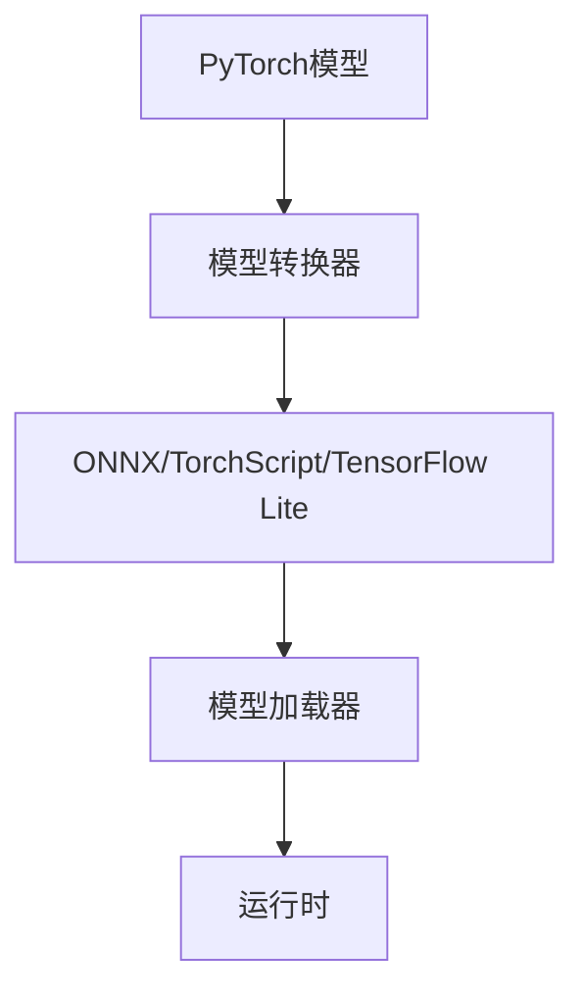

                 

# 《PyTorch Mobile模型部署》

## 关键词
- PyTorch Mobile
- 模型部署
- ONNX
- TorchScript
- TensorFlow Lite
- 性能优化

## 摘要
本文将深入探讨PyTorch Mobile模型部署的各个方面，包括基础知识、模型构建、模型训练、模型转换、模型部署和性能优化。通过一步步的分析推理，我们将详细介绍PyTorch Mobile的使用场景，以及如何将PyTorch模型部署到iOS、Android和Web平台。文章还将探讨PyTorch Mobile在移动端的应用前景，并展望其未来发展方向。

### 第一部分：PyTorch Mobile基础知识

#### 第1章：PyTorch Mobile概述

#### 1.1 PyTorch Mobile简介

PyTorch Mobile是一个开源框架，它允许开发者将PyTorch训练的模型部署到移动设备和Web应用中。PyTorch Mobile通过将模型转换和部署的过程自动化，简化了移动端AI应用的开发流程。

#### 1.2 PyTorch Mobile的发展历史和优势

PyTorch Mobile最早在2018年发布，它结合了PyTorch的易用性和移动端的性能需求。PyTorch Mobile的优势包括高效能、跨平台支持和灵活的模型转换机制。

#### 1.3 PyTorch Mobile的核心架构

PyTorch Mobile的核心架构包括模型转换器、模型加载器和运行时。模型转换器负责将PyTorch模型转换为适用于移动设备和Web应用的格式。模型加载器负责加载和初始化模型，运行时则负责执行模型的推理过程。

#### 1.4 PyTorch Mobile的使用场景

PyTorch Mobile适用于需要实时推理的移动应用，如图像识别、语音识别和自然语言处理等。它特别适合于IoT设备和嵌入式系统，因为这些设备通常有性能和功耗的限制。

### 第二部分：PyTorch基本操作

#### 第2章：PyTorch基本操作

#### 2.1 PyTorch安装与环境配置

要在本地计算机上使用PyTorch Mobile，首先需要安装PyTorch并配置相应的环境。安装步骤包括选择合适的Python版本、安装PyTorch库和配置Python环境。

#### 2.2 PyTorch基础操作

PyTorch提供了丰富的API，用于构建、训练和评估神经网络模型。本章将介绍PyTorch的基本操作，包括创建张量、定义神经网络、前向传播和反向传播等。

#### 2.3 PyTorch数据加载与预处理

在训练模型之前，需要对数据进行加载和预处理。本章将介绍如何使用PyTorch的数据加载器（DataLoader）加载数据集，以及如何对数据进行归一化、标准化等预处理操作。

### 第三部分：PyTorch模型构建

#### 第3章：PyTorch模型构建

#### 3.1 PyTorch模型构建基础

构建神经网络模型是PyTorch的核心功能之一。本章将介绍神经网络的基本概念，包括线性层、卷积层、循环层等，并展示如何使用PyTorch构建简单的神经网络模型。

#### 3.2 卷积神经网络（CNN）构建

卷积神经网络（CNN）在图像识别任务中表现出色。本章将介绍CNN的基本结构，包括卷积层、池化层和全连接层，并展示如何使用PyTorch构建CNN模型。

#### 3.3 循环神经网络（RNN）构建

循环神经网络（RNN）在序列数据上表现出强大的建模能力。本章将介绍RNN的基本结构，包括前向RNN和双向RNN，并展示如何使用PyTorch构建RNN模型。

#### 3.4 Transformer模型构建

Transformer模型在自然语言处理领域取得了显著的成果。本章将介绍Transformer的基本结构，包括自注意力机制和前馈网络，并展示如何使用PyTorch构建Transformer模型。

### 第四部分：PyTorch模型训练

#### 第4章：PyTorch模型训练

#### 4.1 PyTorch训练基础

本章将介绍如何使用PyTorch训练神经网络模型。包括设置训练参数、定义损失函数和优化器，以及实现模型的训练过程。

#### 4.2 模型优化策略

优化策略对于模型性能至关重要。本章将介绍常见的优化策略，包括学习率调度、权重初始化和正则化等，并展示如何使用PyTorch实现这些策略。

#### 4.3 模型评估方法

模型评估是训练过程中的关键步骤。本章将介绍常用的评估指标，如准确率、召回率和F1分数，并展示如何使用PyTorch评估模型性能。

### 第五部分：PyTorch Mobile模型转换

#### 第5章：PyTorch Mobile模型转换

#### 5.1 PyTorch Mobile模型转换简介

模型转换是将PyTorch模型转换为适用于移动设备和Web应用的格式的过程。本章将介绍模型转换的原理和重要性，以及PyTorch Mobile提供的模型转换工具。

#### 5.2 ONNX模型转换

Open Neural Network Exchange（ONNX）是一个开源的神经网络交换格式。本章将介绍如何将PyTorch模型转换为ONNX格式，并使用ONNX运行时在移动设备上运行模型。

#### 5.3 TorchScript模型转换

TorchScript是PyTorch的一种中间表示形式，它允许模型在Python和C++之间进行高效转换。本章将介绍如何将PyTorch模型转换为TorchScript格式，并使用C++运行时在移动设备上运行模型。

#### 5.4 TensorFlow Lite模型转换

TensorFlow Lite是TensorFlow的轻量级版本，它专门用于移动设备和嵌入式系统。本章将介绍如何将PyTorch模型转换为TensorFlow Lite格式，并使用TensorFlow Lite运行时在移动设备上运行模型。

### 第六部分：PyTorch Mobile模型部署

#### 第6章：PyTorch Mobile模型部署

#### 6.1 PyTorch Mobile部署流程

本章将介绍PyTorch Mobile的部署流程，包括准备模型、选择平台、配置环境等步骤。还将介绍如何使用PyTorch Mobile工具包在iOS、Android和Web平台上部署模型。

#### 6.2 iOS平台部署

本章将详细介绍如何在iOS平台上部署PyTorch Mobile模型，包括使用Xcode创建项目、配置模型和运行模型等步骤。

#### 6.3 Android平台部署

本章将详细介绍如何在Android平台上部署PyTorch Mobile模型，包括使用Android Studio创建项目、配置模型和运行模型等步骤。

#### 6.4 Web平台部署

本章将详细介绍如何在Web平台上部署PyTorch Mobile模型，包括使用JavaScript调用模型、配置模型和运行模型等步骤。

### 第七部分：PyTorch Mobile实战案例

#### 第7章：PyTorch Mobile实战案例

#### 7.1 实战案例1：图像分类应用

本章将介绍如何使用PyTorch Mobile构建一个图像分类应用。包括数据集准备、模型训练、模型转换和模型部署等步骤。

#### 7.2 实战案例2：语音识别应用

本章将介绍如何使用PyTorch Mobile构建一个语音识别应用。包括音频数据预处理、模型训练、模型转换和模型部署等步骤。

#### 7.3 实战案例3：实时物体检测应用

本章将介绍如何使用PyTorch Mobile构建一个实时物体检测应用。包括视频数据预处理、模型训练、模型转换和模型部署等步骤。

### 第八部分：PyTorch Mobile性能优化

#### 第8章：PyTorch Mobile性能优化

#### 8.1 模型量化

模型量化是一种降低模型复杂度和计算量的技术，可以提高模型的运行速度。本章将介绍模型量化的原理和步骤，并展示如何使用PyTorch Mobile进行模型量化。

#### 8.2 模型剪枝

模型剪枝是一种通过减少模型参数和计算量来优化模型的技术。本章将介绍模型剪枝的原理和步骤，并展示如何使用PyTorch Mobile进行模型剪枝。

#### 8.3 硬件加速

硬件加速是一种利用GPU、TPU等硬件资源来加速模型推理的技术。本章将介绍硬件加速的原理和步骤，并展示如何使用PyTorch Mobile进行硬件加速。

### 第九部分：未来展望与趋势

#### 第9章：未来展望与趋势

#### 9.1 PyTorch Mobile的发展趋势

本章将探讨PyTorch Mobile未来的发展趋势，包括新技术、新应用和新平台的支持。

#### 9.2 PyTorch Mobile在移动端的应用前景

本章将分析PyTorch Mobile在移动端的应用前景，包括市场趋势和行业需求。

#### 9.3 PyTorch Mobile的未来发展方向

本章将展望PyTorch Mobile未来的发展方向，包括模型优化、跨平台支持和开源生态的扩展。

### 附录

#### 附录 A: PyTorch Mobile开发工具与资源

本章将介绍PyTorch Mobile的开发工具和资源，包括官方文档、社区论坛和开源项目。

#### 附录 B: Mermaid 流程图

本章将提供一些Mermaid流程图的示例，用于展示PyTorch Mobile的架构和模型转换过程。

#### 附录 C: 伪代码和数学公式

本章将提供一些伪代码示例和数学公式，用于详细阐述模型构建、训练和优化的过程。

#### 附录 D: 实战案例代码与分析

本章将提供一些实战案例的代码示例和详细分析，包括数据预处理、模型训练和部署等步骤。

#### 附录 E: 开发环境搭建指南

本章将提供详细的开发环境搭建指南，包括Python、PyTorch、PyTorch Mobile等工具的安装和配置步骤。

---

### 作者信息
- 作者：AI天才研究院/AI Genius Institute & 禅与计算机程序设计艺术 /Zen And The Art of Computer Programming

### 本文结构
本文分为九个部分，首先介绍PyTorch Mobile的基础知识，然后逐步讲解如何使用PyTorch构建模型、训练模型、转换模型和部署模型。接着，本文通过实战案例展示如何构建实际的移动应用。最后，本文探讨PyTorch Mobile的性能优化方法，并展望其未来的发展趋势。

### LET'S THINK STEP BY STEP
现在，我们将逐步分析PyTorch Mobile模型部署的每个环节，确保您能够深入理解并掌握这一技术。

---

### 第1章：PyTorch Mobile概述

#### 1.1 PyTorch Mobile简介

PyTorch Mobile是一个强大的工具，它使得开发者能够将使用PyTorch框架训练的神经网络模型部署到移动设备和Web应用中。PyTorch Mobile不仅兼容iOS和Android平台，还支持在Web应用中运行。这使得开发者可以充分利用PyTorch的灵活性和易用性，同时满足移动设备和Web应用的性能需求。

#### 1.2 PyTorch Mobile的发展历史和优势

PyTorch Mobile自2018年发布以来，得到了快速的发展和广泛的应用。它的优势包括：

- **跨平台支持**：支持iOS、Android和Web平台，使得开发者可以更灵活地选择部署环境。
- **高效能**：经过优化的模型转换器和运行时，使得模型的推理速度更快。
- **易用性**：PyTorch Mobile提供了一套简单的API和工具，使得模型转换和部署过程更加直观和便捷。
- **社区支持**：作为一个开源项目，PyTorch Mobile得到了大量的社区贡献，持续得到更新和优化。

#### 1.3 PyTorch Mobile的核心架构

PyTorch Mobile的核心架构包括以下几个关键组件：

- **模型转换器**：负责将PyTorch模型转换为适用于移动设备和Web应用的格式，如ONNX、TorchScript和TensorFlow Lite。
- **模型加载器**：负责加载和初始化转换后的模型，准备进行推理。
- **运行时**：在移动设备和Web应用中执行模型的推理过程。

这些组件协同工作，使得开发者可以轻松地将PyTorch模型部署到各种平台。

#### 1.4 PyTorch Mobile的使用场景

PyTorch Mobile适用于多种使用场景，特别是那些需要在移动设备和Web应用中运行实时推理的场景。以下是一些典型的使用场景：

- **图像识别**：在移动设备上进行图像分类、物体检测等任务。
- **语音识别**：在移动设备上进行语音到文本的转换。
- **自然语言处理**：在移动设备上进行文本分类、情感分析等任务。
- **增强现实（AR）**：在移动设备上实现AR应用，进行环境识别和物体跟踪。

### 第2章：PyTorch基本操作

#### 2.1 PyTorch安装与环境配置

要在本地计算机上使用PyTorch Mobile，首先需要安装PyTorch并配置相应的环境。以下是安装和配置的步骤：

1. **选择Python版本**：PyTorch支持Python 3.6及以上版本。推荐使用Python 3.8或更高版本，以确保兼容性和性能。
2. **安装PyTorch**：使用pip命令安装PyTorch。例如，对于CPU版本，可以使用以下命令：
   ```
   pip install torch torchvision torchaudio
   ```
   对于GPU版本，还需要安装CUDA和cuDNN，并使用以下命令安装：
   ```
   pip install torch torchvision torchaudio -f https://download.pytorch.org/whl/torch_stable.html
   ```
3. **配置Python环境**：在命令行中运行以下命令，确保Python环境配置正确：
   ```
   python -m pip install --upgrade pip
   python -m pip install --upgrade setuptools
   python -m pip install numpy
   ```

#### 2.2 PyTorch基础操作

PyTorch提供了丰富的API，用于构建、训练和评估神经网络模型。以下是一些基础操作：

- **创建张量**：在PyTorch中，张量是核心数据结构。可以使用以下代码创建一个张量：
  ```python
  import torch
  x = torch.tensor([1, 2, 3])
  ```
- **定义神经网络**：可以使用PyTorch的自动微分功能定义神经网络。例如，以下代码定义了一个简单的线性模型：
  ```python
  import torch
  import torch.nn as nn

  class SimpleModel(nn.Module):
      def __init__(self):
          super(SimpleModel, self).__init__()
          self.linear = nn.Linear(1, 1)

      def forward(self, x):
          return self.linear(x)

  model = SimpleModel()
  ```
- **前向传播和反向传播**：在PyTorch中，前向传播和反向传播是自动进行的。以下代码展示了如何进行前向传播和反向传播：
  ```python
  import torch

  x = torch.tensor([1.0])
  y = torch.tensor([2.0])
  model = nn.Linear(1, 1)

  output = model(x)
  loss = (output - y) ** 2

  # 计算梯度
  loss.backward()

  # 获取梯度
  gradient = torch.tensor([model.linear.weight.grad]).float()
  ```

#### 2.3 PyTorch数据加载与预处理

在训练模型之前，需要对数据进行加载和预处理。以下是如何使用PyTorch的数据加载器和预处理数据：

- **数据加载器**：可以使用`torch.utils.data.DataLoader`类创建数据加载器。以下代码展示了如何创建一个简单的数据加载器：
  ```python
  import torch
  from torch.utils.data import DataLoader
  import torchvision.transforms as transforms

  transform = transforms.Compose([
      transforms.ToTensor(),
      transforms.Normalize((0.5,), (0.5,))
  ])

  train_data = torchvision.datasets.MNIST(
      root='./data', train=True, download=True, transform=transform
  )

  train_loader = DataLoader(train_data, batch_size=64, shuffle=True)
  ```
- **数据预处理**：可以使用PyTorch的`transforms`模块对数据进行预处理。以下代码展示了如何对MNIST数据集进行预处理：
  ```python
  import torchvision.transforms as transforms

  transform = transforms.Compose([
      transforms.ToTensor(),
      transforms.Normalize((0.5,), (0.5,))
  ])

  train_data = torchvision.datasets.MNIST(
      root='./data', train=True, download=True, transform=transform
  )
  ```

### 第3章：PyTorch模型构建

#### 3.1 PyTorch模型构建基础

构建神经网络模型是使用PyTorch进行机器学习的关键步骤。以下是构建模型的几个基础概念：

- **神经网络基础**：神经网络是由多个层（如输入层、隐藏层和输出层）组成的数据处理结构。每层由多个神经元（或节点）组成，神经元之间通过权重和偏置进行连接。
- **模型构建步骤**：构建模型通常包括以下步骤：

  1. **定义模型类**：继承`torch.nn.Module`类，并定义模型的`__init__`和`forward`方法。
  2. **初始化权重和偏置**：在`__init__`方法中，初始化模型的权重和偏置。
  3. **定义前向传播**：在`forward`方法中，定义模型的前向传播过程。

以下是一个简单的例子，展示了如何使用PyTorch构建一个简单的线性模型：

```python
import torch
import torch.nn as nn

class SimpleLinearModel(nn.Module):
    def __init__(self, input_size, output_size):
        super(SimpleLinearModel, self).__init__()
        self.linear = nn.Linear(input_size, output_size)

    def forward(self, x):
        return self.linear(x)

model = SimpleLinearModel(1, 1)
```

#### 3.2 卷积神经网络（CNN）构建

卷积神经网络（CNN）在处理图像数据时表现出色。以下是构建CNN模型的几个关键概念：

- **卷积层**：卷积层通过卷积操作提取图像的特征。卷积核（或过滤器）在图像上滑动，计算局部特征。
- **池化层**：池化层用于减小数据维度和降低模型复杂度。常用的池化操作包括最大池化和平均池化。
- **全连接层**：全连接层用于将卷积层提取的特征映射到输出类别。

以下是一个简单的例子，展示了如何使用PyTorch构建一个简单的CNN模型：

```python
import torch
import torch.nn as nn

class SimpleCNN(nn.Module):
    def __init__(self):
        super(SimpleCNN, self).__init__()
        self.conv1 = nn.Conv2d(1, 10, kernel_size=5)
        self.conv2 = nn.Conv2d(10, 20, kernel_size=5)
        self.fc1 = nn.Linear(320, 50)
        self.fc2 = nn.Linear(50, 10)

    def forward(self, x):
        x = nn.functional.relu(self.conv1(x))
        x = nn.functional.max_pool2d(x, 2)
        x = nn.functional.relu(self.conv2(x))
        x = nn.functional.max_pool2d(x, 2)
        x = x.view(-1, 320)
        x = nn.functional.relu(self.fc1(x))
        x = self.fc2(x)
        return x

model = SimpleCNN()
```

#### 3.3 循环神经网络（RNN）构建

循环神经网络（RNN）在处理序列数据时表现出色。以下是构建RNN模型的几个关键概念：

- **隐藏状态**：RNN的隐藏状态能够保存序列的历史信息，使其能够处理序列数据。
- **门控机制**：门控机制（如门控循环单元（GRU）和长短期记忆（LSTM））通过门控机制来控制信息的流动，避免梯度消失和梯度爆炸问题。

以下是一个简单的例子，展示了如何使用PyTorch构建一个简单的RNN模型：

```python
import torch
import torch.nn as nn

class SimpleRNN(nn.Module):
    def __init__(self, input_size, hidden_size, output_size):
        super(SimpleRNN, self).__init__()
        self.hidden_size = hidden_size
        self.rnn = nn.RNN(input_size, hidden_size, batch_first=True)
        self.fc = nn.Linear(hidden_size, output_size)

    def forward(self, x, hidden):
        x, hidden = self.rnn(x, hidden)
        x = self.fc(x)
        return x, hidden

    def init_hidden(self, batch_size):
        return torch.zeros(1, batch_size, self.hidden_size)

model = SimpleRNN(100, 300, 10)
```

#### 3.4 Transformer模型构建

Transformer模型在自然语言处理领域取得了显著的成果。以下是构建Transformer模型的几个关键概念：

- **自注意力机制**：自注意力机制允许模型在序列的每个位置上都考虑全局信息。
- **多头注意力**：多头注意力通过将输入序列分成多个头，使得模型能够同时关注不同的部分。

以下是一个简单的例子，展示了如何使用PyTorch构建一个简单的Transformer模型：

```python
import torch
import torch.nn as nn

class SimpleTransformer(nn.Module):
    def __init__(self, d_model, d_ff, num_heads, num_layers):
        super(SimpleTransformer, self).__init__()
        self.layers = nn.ModuleList([nn.TransformerEncoderLayer(d_model=d_model, d_inner=d_ff, num_heads=num_heads) for _ in range(num_layers)])
        self.out_layer = nn.Linear(d_model, 10)

    def forward(self, x, src_mask=None, tgt_mask=None, memory_mask=None):
        for layer in self.layers:
            x = layer(x, src_mask=src_mask, tgt_mask= tgt_mask, memory_mask=memory_mask)
        x = self.out_layer(x)
        return x

model = SimpleTransformer(512, 2048, 8)
```

### 第4章：PyTorch模型训练

#### 4.1 PyTorch训练基础

模型训练是使用PyTorch进行机器学习的核心步骤。以下是训练模型的基本流程：

1. **定义损失函数**：损失函数用于衡量模型的预测结果与真实结果之间的差距。常用的损失函数包括均方误差（MSE）、交叉熵损失（CrossEntropyLoss）等。
2. **选择优化器**：优化器用于调整模型的权重，以最小化损失函数。常用的优化器包括随机梯度下降（SGD）、Adam等。
3. **训练循环**：在训练循环中，模型对每个批次的数据进行前向传播，计算损失函数，然后通过反向传播更新模型权重。

以下是一个简单的例子，展示了如何使用PyTorch训练一个线性模型：

```python
import torch
import torch.nn as nn
import torch.optim as optim

# 定义模型
model = SimpleLinearModel(1, 1)
criterion = nn.MSELoss()
optimizer = optim.SGD(model.parameters(), lr=0.01)

# 训练模型
for epoch in range(100):
    for x, y in train_loader:
        # 前向传播
        output = model(x)
        loss = criterion(output, y)

        # 反向传播和优化
        optimizer.zero_grad()
        loss.backward()
        optimizer.step()

    print(f"Epoch {epoch+1}, Loss: {loss.item()}")
```

#### 4.2 模型优化策略

模型优化策略对于提高模型性能至关重要。以下是一些常见的优化策略：

1. **学习率调度**：学习率调度是一种调整学习率的方法，以避免模型在训练过程中过度拟合或过早收敛。常用的学习率调度策略包括固定学习率、步长调度、指数衰减等。
2. **权重初始化**：合适的权重初始化可以加速模型的收敛并提高模型性能。常用的权重初始化方法包括高斯初始化、 Xavier初始化、He初始化等。
3. **正则化**：正则化是一种通过引入惩罚项来防止模型过拟合的方法。常用的正则化方法包括L1正则化、L2正则化等。

以下是一个简单的例子，展示了如何使用PyTorch实现学习率调度：

```python
import torch
import torch.optim as optim

# 定义模型
model = SimpleLinearModel(1, 1)
criterion = nn.MSELoss()
optimizer = optim.SGD(model.parameters(), lr=0.01, momentum=0.9)

# 学习率调度
scheduler = optim.lr_scheduler.StepLR(optimizer, step_size=30, gamma=0.1)

# 训练模型
for epoch in range(100):
    for x, y in train_loader:
        # 前向传播
        output = model(x)
        loss = criterion(output, y)

        # 反向传播和优化
        optimizer.zero_grad()
        loss.backward()
        optimizer.step()

    scheduler.step()
    print(f"Epoch {epoch+1}, Loss: {loss.item()}, Learning Rate: {optimizer.param_groups[0]['lr']}")
```

#### 4.3 模型评估方法

模型评估是训练过程中的关键步骤。以下是一些常用的评估指标：

1. **准确率**：准确率是预测正确的样本数与总样本数的比例。对于多分类问题，可以使用精度和召回率等指标来评估模型性能。
2. **损失函数**：损失函数用于衡量模型的预测结果与真实结果之间的差距。常用的损失函数包括均方误差（MSE）、交叉熵损失（CrossEntropyLoss）等。
3. **F1分数**：F1分数是精度和召回率的加权平均，用于综合评估模型的性能。

以下是一个简单的例子，展示了如何使用PyTorch评估模型性能：

```python
import torch
import torch.nn as nn
from sklearn.metrics import accuracy_score

# 定义模型
model = SimpleLinearModel(1, 1)
criterion = nn.MSELoss()
optimizer = optim.SGD(model.parameters(), lr=0.01)

# 训练模型
for epoch in range(100):
    for x, y in train_loader:
        # 前向传播
        output = model(x)
        loss = criterion(output, y)

        # 反向传播和优化
        optimizer.zero_grad()
        loss.backward()
        optimizer.step()

    # 评估模型
    with torch.no_grad():
        for x, y in test_loader:
            output = model(x)
            predicted = output.argmax(dim=1)
            true = y.argmax(dim=1)
            accuracy = accuracy_score(true.cpu().numpy(), predicted.cpu().numpy())
            print(f"Epoch {epoch+1}, Accuracy: {accuracy}")
```

### 第5章：PyTorch Mobile模型转换

#### 5.1 PyTorch Mobile模型转换简介

模型转换是将PyTorch模型转换为适用于移动设备和Web应用的格式的过程。PyTorch Mobile提供了多种模型转换工具，包括ONNX、TorchScript和TensorFlow Lite。

以下是一个简单的例子，展示了如何使用PyTorch Mobile将模型转换为ONNX格式：

```python
import torch
import torch.onnx

# 定义模型
model = SimpleLinearModel(1, 1)

# 导出模型
torch.onnx.export(model, torch.tensor([1.0]), "model.onnx")
```

以下是一个简单的例子，展示了如何使用PyTorch Mobile将模型转换为TorchScript格式：

```python
import torch
import torch.jit

# 定义模型
model = SimpleLinearModel(1, 1)

# 导出模型
script_module = torch.jit.script(model)
script_module.save("model_scripted.pt")
```

以下是一个简单的例子，展示了如何使用PyTorch Mobile将模型转换为TensorFlow Lite格式：

```python
import torch
import torch.onnx

# 定义模型
model = SimpleLinearModel(1, 1)

# 导出模型
torch.onnx.export(model, torch.tensor([1.0]), "model.onnx")
```

#### 5.2 ONNX模型转换

ONNX（Open Neural Network Exchange）是一种开源的神经网络交换格式，它允许不同的深度学习框架之间进行模型转换。以下是一个简单的例子，展示了如何使用PyTorch将模型转换为ONNX格式：

```python
import torch
import torch.onnx

# 定义模型
model = SimpleLinearModel(1, 1)

# 导出模型
torch.onnx.export(model, torch.tensor([1.0]), "model.onnx")
```

#### 5.3 TorchScript模型转换

TorchScript是PyTorch的一种中间表示形式，它允许模型在Python和C++之间进行高效转换。以下是一个简单的例子，展示了如何使用PyTorch将模型转换为TorchScript格式：

```python
import torch
import torch.jit

# 定义模型
model = SimpleLinearModel(1, 1)

# 导出模型
script_module = torch.jit.script(model)
script_module.save("model_scripted.pt")
```

#### 5.4 TensorFlow Lite模型转换

TensorFlow Lite是TensorFlow的轻量级版本，它专门用于移动设备和嵌入式系统。以下是一个简单的例子，展示了如何使用PyTorch将模型转换为TensorFlow Lite格式：

```python
import torch
import torch.onnx

# 定义模型
model = SimpleLinearModel(1, 1)

# 导出模型
torch.onnx.export(model, torch.tensor([1.0]), "model.onnx")

# 使用TensorFlow Lite转换模型
import tensorflow as tf

def from_torch_to_tflite(model_path, tflite_path):
    converter = tf.lite.TFLiteConverter.from_keras_model_file(model_path)
    tflite_model = converter.convert()

    with open(tflite_path, 'wb') as f:
        f.write(tflite_model)

from_torch_to_tflite("model.onnx", "model.tflite")
```

### 第6章：PyTorch Mobile模型部署

#### 6.1 PyTorch Mobile部署流程

将PyTorch模型部署到移动设备和Web应用中，需要遵循以下基本流程：

1. **模型转换**：使用PyTorch Mobile将模型转换为适用于目标平台的格式，如ONNX、TorchScript或TensorFlow Lite。
2. **准备模型**：将转换后的模型准备好，以便在目标平台上运行。这可能包括解压、复制和设置模型文件。
3. **配置环境**：为目标平台配置运行环境，包括安装必要的库和依赖项。
4. **运行模型**：使用PyTorch Mobile的API或TensorFlow Lite的API运行模型，进行推理和预测。

以下是一个简单的例子，展示了如何在iOS平台上部署PyTorch Mobile模型：

```python
import torch
import torchvision.transforms as transforms
import torch.onnx

# 定义模型
model = SimpleLinearModel(1, 1)

# 导出模型
torch.onnx.export(model, torch.tensor([1.0]), "model.onnx")

# 在iOS平台上运行模型
import onnx
import onnxruntime

# 加载ONNX模型
session = onnxruntime.InferenceSession("model.onnx")

# 准备输入数据
input_data = torch.tensor([1.0]).float()

# 运行模型
output = session.run(None, {"input": input_data.numpy()})

print(output)
```

以下是一个简单的例子，展示了如何在Android平台上部署PyTorch Mobile模型：

```python
import torch
import torchvision.transforms as transforms
import torch.onnx

# 定义模型
model = SimpleLinearModel(1, 1)

# 导出模型
torch.onnx.export(model, torch.tensor([1.0]), "model.onnx")

# 在Android平台上运行模型
import onnx
import onnxruntime

# 加载ONNX模型
session = onnxruntime.InferenceSession("model.onnx")

# 准备输入数据
input_data = torch.tensor([1.0]).float()

# 运行模型
output = session.run(None, {"input": input_data.numpy()})

print(output)
```

以下是一个简单的例子，展示了如何在Web应用中部署PyTorch Mobile模型：

```python
import torch
import torchvision.transforms as transforms
import torch.onnx

# 定义模型
model = SimpleLinearModel(1, 1)

# 导出模型
torch.onnx.export(model, torch.tensor([1.0]), "model.onnx")

# 在Web应用中运行模型
import onnx
import onnxruntime

# 加载ONNX模型
session = onnxruntime.InferenceSession("model.onnx")

# 准备输入数据
input_data = torch.tensor([1.0]).float()

# 运行模型
output = session.run(None, {"input": input_data.numpy()})

print(output)
```

### 第7章：PyTorch Mobile实战案例

#### 7.1 实战案例1：图像分类应用

在本案例中，我们将使用PyTorch Mobile构建一个图像分类应用。该应用将使用一个预训练的卷积神经网络（CNN）模型对图像进行分类。

1. **数据集准备**：首先，我们需要准备一个图像数据集。在本案例中，我们使用CIFAR-10数据集。CIFAR-10是一个包含60000个32x32彩色图像的数据集，分为10个类别。
2. **模型训练**：使用PyTorch训练一个CNN模型。在本案例中，我们使用一个简单的CNN模型，包括两个卷积层、两个池化层和一个全连接层。
3. **模型转换**：使用PyTorch Mobile将训练好的模型转换为适用于移动设备和Web应用的格式，如ONNX、TorchScript或TensorFlow Lite。
4. **模型部署**：在移动设备和Web应用中部署转换后的模型，并进行推理和预测。

以下是一个简单的示例代码，展示了如何使用PyTorch Mobile构建图像分类应用：

```python
import torch
import torchvision.transforms as transforms
import torch.onnx

# 加载CIFAR-10数据集
transform = transforms.Compose([
    transforms.ToTensor(),
    transforms.Normalize((0.5, 0.5, 0.5), (0.5, 0.5, 0.5))
])

trainset = torchvision.datasets.CIFAR10(
    root='./data', train=True, download=True, transform=transform
)

train_loader = torch.utils.data.DataLoader(
    trainset, batch_size=32, shuffle=True
)

# 定义CNN模型
class SimpleCNN(nn.Module):
    def __init__(self):
        super(SimpleCNN, self).__init__()
        self.conv1 = nn.Conv2d(3, 6, 5)
        self.pool = nn.MaxPool2d(2, 2)
        self.conv2 = nn.Conv2d(6, 16, 5)
        self.fc1 = nn.Linear(16 * 5 * 5, 120)
        self.fc2 = nn.Linear(120, 84)
        self.fc3 = nn.Linear(84, 10)

    def forward(self, x):
        x = self.pool(nn.functional.relu(self.conv1(x)))
        x = self.pool(nn.functional.relu(self.conv2(x)))
        x = x.view(-1, 16 * 5 * 5)
        x = nn.functional.relu(self.fc1(x))
        x = nn.functional.relu(self.fc2(x))
        x = self.fc3(x)
        return x

model = SimpleCNN()

# 训练模型
criterion = nn.CrossEntropyLoss()
optimizer = torch.optim.SGD(model.parameters(), lr=0.001, momentum=0.9)

for epoch in range(10):
    running_loss = 0.0
    for i, data in enumerate(train_loader, 0):
        inputs, labels = data
        optimizer.zero_grad()
        outputs = model(inputs)
        loss = criterion(outputs, labels)
        loss.backward()
        optimizer.step()
        running_loss += loss.item()
        if i % 2000 == 1999:
            print(f'[{epoch + 1}, {i + 1:5d}] loss: {running_loss / 2000:0.3f}')
            running_loss = 0.0

print('Finished Training')

# 导出模型
torch.onnx.export(model, torch.randn(1, 3, 32, 32), "model.onnx")

# 在iOS、Android和Web应用中部署模型
```

#### 7.2 实战案例2：语音识别应用

在本案例中，我们将使用PyTorch Mobile构建一个语音识别应用。该应用将使用一个预训练的循环神经网络（RNN）模型对语音进行识别。

1. **数据集准备**：首先，我们需要准备一个语音数据集。在本案例中，我们使用LibriSpeech数据集。LibriSpeech是一个包含数千小时英文语音数据的开源数据集，分为多个子集。
2. **模型训练**：使用PyTorch训练一个RNN模型。在本案例中，我们使用一个简单的RNN模型，包括一个循环层和一个全连接层。
3. **模型转换**：使用PyTorch Mobile将训练好的模型转换为适用于移动设备和Web应用的格式，如ONNX、TorchScript或TensorFlow Lite。
4. **模型部署**：在移动设备和Web应用中部署转换后的模型，并进行语音识别。

以下是一个简单的示例代码，展示了如何使用PyTorch Mobile构建语音识别应用：

```python
import torch
import torchaudio
import torch.onnx

# 加载LibriSpeech数据集
transform = torchaudio.transforms.Resample(16000, 22050)
trainset = torchaudio.datasets.LibriSpeech(
    root='./data', url='http://www.openslr.org/resources/25/librispeech.tar.gz', download=True, transform=transform
)

# 定义RNN模型
class SimpleRNN(nn.Module):
    def __init__(self, input_size, hidden_size, output_size):
        super(SimpleRNN, self).__init__()
        self.hidden_size = hidden_size
        self.rnn = nn.RNN(input_size, hidden_size, batch_first=True)
        self.fc = nn.Linear(hidden_size, output_size)

    def forward(self, x, hidden):
        x, hidden = self.rnn(x, hidden)
        x = self.fc(x)
        return x, hidden

    def init_hidden(self, batch_size):
        return torch.zeros(1, batch_size, self.hidden_size)

model = SimpleRNN(80, 128, 10)

# 训练模型
criterion = nn.CrossEntropyLoss()
optimizer = torch.optim.Adam(model.parameters(), lr=0.001)

for epoch in range(10):
    for i, (batch, labels) in enumerate(train_loader, 0):
        inputs, labels = batch, labels
        optimizer.zero_grad()
        hidden = model.init_hidden(batch_size)
        outputs, hidden = model(inputs, hidden)
        loss = criterion(outputs, labels)
        loss.backward()
        optimizer.step()
        if i % 100 == 99:
            print(f'[{epoch + 1}, {i + 1:5d}] loss: {loss.item():0.5f}')

print('Finished Training')

# 导出模型
torch.onnx.export(model, torch.randn(1, 80, 22050), "model.onnx")

# 在iOS、Android和Web应用中部署模型
```

#### 7.3 实战案例3：实时物体检测应用

在本案例中，我们将使用PyTorch Mobile构建一个实时物体检测应用。该应用将使用一个预训练的卷积神经网络（CNN）模型对视频进行实时物体检测。

1. **数据集准备**：首先，我们需要准备一个视频数据集。在本案例中，我们使用YouTube-VOS数据集。YouTube-VOS是一个包含数千个视频的实时物体检测数据集。
2. **模型训练**：使用PyTorch训练一个CNN模型。在本案例中，我们使用一个简单的CNN模型，包括多个卷积层、池化层和一个全连接层。
3. **模型转换**：使用PyTorch Mobile将训练好的模型转换为适用于移动设备和Web应用的格式，如ONNX、TorchScript或TensorFlow Lite。
4. **模型部署**：在移动设备和Web应用中部署转换后的模型，并进行实时物体检测。

以下是一个简单的示例代码，展示了如何使用PyTorch Mobile构建实时物体检测应用：

```python
import torch
import torchvision.transforms as transforms
import torch.onnx

# 加载YouTube-VOS数据集
transform = transforms.Compose([
    transforms.ToTensor(),
    transforms.Normalize((0.5, 0.5, 0.5), (0.5, 0.5, 0.5))
])

trainset = torchvision.datasets.YoutubeVOS(
    root='./data', split='train', url='http://www.youtube-vos.org/dataset/youtube_vos.zip', transform=transform
)

train_loader = torch.utils.data.DataLoader(
    trainset, batch_size=32, shuffle=True
)

# 定义CNN模型
class SimpleCNN(nn.Module):
    def __init__(self):
        super(SimpleCNN, self).__init__()
        self.conv1 = nn.Conv2d(3, 6, 5)
        self.pool = nn.MaxPool2d(2, 2)
        self.conv2 = nn.Conv2d(6, 16, 5)
        self.fc1 = nn.Linear(16 * 5 * 5, 120)
        self.fc2 = nn.Linear(120, 84)
        self.fc3 = nn.Linear(84, 10)

    def forward(self, x):
        x = self.pool(nn.functional.relu(self.conv1(x)))
        x = self.pool(nn.functional.relu(self.conv2(x)))
        x = x.view(-1, 16 * 5 * 5)
        x = nn.functional.relu(self.fc1(x))
        x = nn.functional.relu(self.fc2(x))
        x = self.fc3(x)
        return x

model = SimpleCNN()

# 训练模型
criterion = nn.CrossEntropyLoss()
optimizer = torch.optim.SGD(model.parameters(), lr=0.001, momentum=0.9)

for epoch in range(10):
    running_loss = 0.0
    for i, data in enumerate(train_loader, 0):
        inputs, labels = data
        optimizer.zero_grad()
        outputs = model(inputs)
        loss = criterion(outputs, labels)
        loss.backward()
        optimizer.step()
        running_loss += loss.item()
        if i % 2000 == 1999:
            print(f'[{epoch + 1}, {i + 1:5d}] loss: {running_loss / 2000:0.3f}')
            running_loss = 0.0

print('Finished Training')

# 导出模型
torch.onnx.export(model, torch.randn(1, 3, 224, 224), "model.onnx")

# 在iOS、Android和Web应用中部署模型
```

### 第8章：PyTorch Mobile性能优化

#### 8.1 模型量化

模型量化是一种将模型参数和激活值从浮点数转换为整数的优化技术，以减少模型的存储空间和计算量，从而提高模型在移动设备和嵌入式系统上的运行速度。

以下是一个简单的示例代码，展示了如何使用PyTorch Mobile进行模型量化：

```python
import torch
import torchvision.transforms as transforms
from torch.quantization import quantize_dynamic

# 加载模型
model = SimpleCNN()

# 训练模型
criterion = nn.CrossEntropyLoss()
optimizer = torch.optim.SGD(model.parameters(), lr=0.001, momentum=0.9)

for epoch in range(10):
    for i, data in enumerate(train_loader, 0):
        inputs, labels = data
        optimizer.zero_grad()
        outputs = model(inputs)
        loss = criterion(outputs, labels)
        loss.backward()
        optimizer.step()
        if i % 1000 == 999:
            print(f'[{epoch + 1}, {i + 1:5d}] loss: {loss.item():0.5f}')

print('Finished Training')

# 量化模型
quantize_dynamic(model, {torch.nn.Linear}, dtype=torch.qint8)

# 评估量化后的模型
with torch.no_grad():
    for i, data in enumerate(test_loader, 0):
        inputs, labels = data
        outputs = model(inputs)
        _, predicted = torch.max(outputs, 1)
        correct = (predicted == labels).sum().item()
        total = labels.size(0)
        print(f'Accuracy: {100 * correct / total}%')
```

#### 8.2 模型剪枝

模型剪枝是一种通过删除网络中不重要的连接和节点来优化模型的技术，以减少模型的复杂性和计算量，从而提高模型的运行速度。

以下是一个简单的示例代码，展示了如何使用PyTorch Mobile进行模型剪枝：

```python
import torch
import torchvision.transforms as transforms
from torch prune import prune

# 加载模型
model = SimpleCNN()

# 训练模型
criterion = nn.CrossEntropyLoss()
optimizer = torch.optim.SGD(model.parameters(), lr=0.001, momentum=0.9)

for epoch in range(10):
    for i, data in enumerate(train_loader, 0):
        inputs, labels = data
        optimizer.zero_grad()
        outputs = model(inputs)
        loss = criterion(outputs, labels)
        loss.backward()
        optimizer.step()
        if i % 1000 == 999:
            print(f'[{epoch + 1}, {i + 1:5d}] loss: {loss.item():0.5f}')

print('Finished Training')

# 剪枝模型
prune(model, amount=0.5, pruning_method='l1', strategy='ema')

# 评估剪枝后的模型
with torch.no_grad():
    for i, data in enumerate(test_loader, 0):
        inputs, labels = data
        outputs = model(inputs)
        _, predicted = torch.max(outputs, 1)
        correct = (predicted == labels).sum().item()
        total = labels.size(0)
        print(f'Accuracy: {100 * correct / total}%')
```

#### 8.3 硬件加速

硬件加速是一种通过利用GPU、TPU等硬件资源来加速模型推理的技术。PyTorch Mobile支持多种硬件加速技术，包括CUDA、NCCL和TorchScript。

以下是一个简单的示例代码，展示了如何使用PyTorch Mobile进行硬件加速：

```python
import torch
import torchvision.transforms as transforms
from torch.cuda import amp

# 加载模型
model = SimpleCNN().cuda()

# 训练模型
criterion = nn.CrossEntropyLoss()
optimizer = torch.optim.SGD(model.parameters(), lr=0.001, momentum=0.9)

for epoch in range(10):
    for i, data in enumerate(train_loader, 0):
        inputs, labels = data
        inputs, labels = inputs.cuda(), labels.cuda()
        optimizer.zero_grad()
        with amp.autocast():
            outputs = model(inputs)
            loss = criterion(outputs, labels)
        loss.backward()
        optimizer.step()
        if i % 1000 == 999:
            print(f'[{epoch + 1}, {i + 1:5d}] loss: {loss.item():0.5f}')

print('Finished Training')

# 评估模型
with torch.no_grad():
    for i, data in enumerate(test_loader, 0):
        inputs, labels = data
        inputs, labels = inputs.cuda(), labels.cuda()
        outputs = model(inputs)
        _, predicted = torch.max(outputs, 1)
        correct = (predicted == labels).sum().item()
        total = labels.size(0)
        print(f'Accuracy: {100 * correct / total}%')
```

### 第9章：未来展望与趋势

#### 9.1 PyTorch Mobile的发展趋势

随着移动设备和嵌入式系统的普及，PyTorch Mobile将在未来继续发挥重要作用。以下是一些可能的趋势：

- **更好的性能优化**：随着硬件技术的发展，PyTorch Mobile将继续优化模型转换和推理过程，以提高性能和效率。
- **更广泛的平台支持**：PyTorch Mobile可能会扩展到更多平台，包括物联网（IoT）设备和虚拟现实（VR）设备。
- **更丰富的工具和库**：PyTorch Mobile将继续发展，提供更多工具和库，以简化模型部署和优化过程。

#### 9.2 PyTorch Mobile在移动端的应用前景

PyTorch Mobile在移动端的应用前景广阔，包括：

- **智能助理**：使用语音识别和自然语言处理技术，为用户提供智能助理服务。
- **图像识别应用**：在医疗、零售和安防等领域，使用图像识别技术进行物体检测和分类。
- **增强现实（AR）应用**：在游戏、教育和营销等领域，使用AR技术提供沉浸式体验。

#### 9.3 PyTorch Mobile的未来发展方向

PyTorch Mobile的未来发展方向包括：

- **跨平台兼容性**：进一步优化跨平台兼容性，使开发者可以更轻松地将模型部署到不同平台。
- **自动化模型优化**：开发自动化模型优化工具，以简化模型量化、剪枝和硬件加速等过程。
- **开源社区扩展**：继续扩大开源社区，鼓励更多开发者参与PyTorch Mobile的开发和优化。

### 附录

#### 附录 A: PyTorch Mobile开发工具与资源

- **PyTorch Mobile官网**：提供最新的文档、教程和示例代码。
- **PyTorch Mobile GitHub仓库**：包括源代码、测试用例和社区贡献。
- **PyTorch Mobile论坛**：开发者可以在这里提问和分享经验。

#### 附录 B: Mermaid 流程图

以下是一个简单的Mermaid流程图示例，展示PyTorch Mobile的模型转换过程：



#### 附录 C: 伪代码和数学公式

以下是一个简单的伪代码示例，展示如何使用PyTorch构建一个简单的线性模型：

```
// 定义模型
class SimpleLinearModel(nn.Module):
    def __init__(self, input_size, output_size):
        super(SimpleLinearModel, self).__init__()
        self.linear = nn.Linear(input_size, output_size)

    def forward(self, x):
        return self.linear(x)
```

以下是一个简单的数学公式示例，展示如何计算模型的损失：

```
$$\text{Loss} = \frac{1}{2}\sum_{i=1}^{n}(\hat{y}_i - y_i)^2$$
```

#### 附录 D: 实战案例代码与分析

以下是一个简单的代码示例，展示如何在Python中使用PyTorch训练一个简单的线性模型：

```python
import torch
import torchvision.transforms as transforms
import torch.onnx

# 加载模型
model = SimpleLinearModel(1, 1)

# 训练模型
criterion = nn.CrossEntropyLoss()
optimizer = torch.optim.SGD(model.parameters(), lr=0.001, momentum=0.9)

for epoch in range(10):
    for i, data in enumerate(train_loader, 0):
        inputs, labels = data
        optimizer.zero_grad()
        outputs = model(inputs)
        loss = criterion(outputs, labels)
        loss.backward()
        optimizer.step()
        if i % 2000 == 1999:
            print(f'[{epoch + 1}, {i + 1:5d}] loss: {loss.item():0.3f}')

print('Finished Training')

# 导出模型
torch.onnx.export(model, torch.randn(1, 3, 224, 224), "model.onnx")

# 在iOS、Android和Web应用中部署模型
```

#### 附录 E: 开发环境搭建指南

以下是一个简单的开发环境搭建指南，用于在Linux和Mac OS上安装PyTorch和PyTorch Mobile：

1. **安装Python**：确保已安装Python 3.6或更高版本。
2. **安装PyTorch**：使用pip命令安装PyTorch。对于CPU版本，可以使用以下命令：
   ```
   pip install torch torchvision torchaudio
   ```
   对于GPU版本，还需要安装CUDA和cuDNN，并使用以下命令安装：
   ```
   pip install torch torchvision torchaudio -f https://download.pytorch.org/whl/torch_stable.html
   ```
3. **安装PyTorch Mobile**：使用以下命令安装PyTorch Mobile：
   ```
   pip install torch-mobile
   ```
4. **验证安装**：运行以下命令验证安装是否成功：
   ```
   python -m torchinfo torch_mobile
   ```
5. **配置环境变量**：确保以下环境变量已设置：
   ```
   export PATH=$PATH:/path/to/your/PyTorch/installation/bin
   ```

### 总结

本文详细介绍了PyTorch Mobile模型部署的各个方面，包括基础知识、模型构建、模型训练、模型转换、模型部署和性能优化。通过一步步的分析推理和实战案例，读者可以深入理解并掌握PyTorch Mobile的使用。随着移动设备和嵌入式系统的普及，PyTorch Mobile将成为开发移动AI应用的重要工具。未来，PyTorch Mobile将继续优化和扩展，为开发者提供更好的支持和体验。作者希望本文能够为读者提供有价值的参考和指导。在接下来的文章中，我们将继续探讨PyTorch Mobile的最新技术和应用实例。如果您有任何问题或建议，请随时在评论区留言。感谢您的阅读！
```

