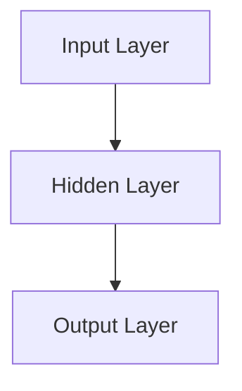

                 

### 文章标题

《Python机器学习实战：使用机器学习进行时间序列分析》

### 关键词

Python，机器学习，时间序列分析，预测模型，深度学习

### 摘要

本文旨在为读者提供一个系统化的指南，详细讲解如何使用Python进行时间序列分析。文章首先介绍了Python编程基础和机器学习的基本概念，随后深入探讨了时间序列分析的理论基础。接着，文章通过实际案例，展示了几种常见的时间序列预测模型，包括AR模型、ARMA模型、ARIMA模型以及季节性时间序列模型。此外，文章还介绍了深度学习在时间序列分析中的应用，如LSTM、GRU和Transformer模型。通过这些内容，读者将能够掌握时间序列分析的核心技术和实战方法。

### 《Python机器学习实战：使用机器学习进行时间序列分析》目录大纲

#### 第一部分：基础概念与预备知识

## 第1章：Python编程基础

### 1.1 Python环境配置
- Python安装与配置
- 常用库的安装

### 1.2 Python基本语法
- 数据类型与变量
- 控制结构
- 函数与模块

### 1.3 Python面向对象编程
- 类与对象
- 继承与多态

## 第2章：机器学习基础

### 2.1 机器学习概述
- 定义与目标
- 监督学习、无监督学习与强化学习

### 2.2 数据预处理
- 数据清洗
- 特征工程

### 2.3 模型选择与评估
- 过拟合与欠拟合
- 交叉验证
- 性能指标

## 第3章：时间序列分析基础

### 3.1 时间序列数据概述
- 时间序列的构成
- 时间序列的特性

### 3.2 时间序列分析方法
- 平稳性检验
- 预测方法简介

### 3.3 数据可视化
- 时间序列数据可视化工具
- 可视化效果分析

#### 第二部分：Python机器学习实战

## 第4章：时间序列预测模型

### 4.1 AR模型
- 模型原理与实现
- 伪代码实现

### 4.2 ARMA模型
- 模型原理与实现
- 伪代码实现

### 4.3 ARIMA模型
- 模型原理与实现
- 伪代码实现

### 4.4 季节性时间序列模型
- 模型原理与实现
- 伪代码实现

## 第5章：深度学习在时间序列分析中的应用

### 5.1 LSTM模型
- 模型原理与实现
- 伪代码实现

### 5.2 GRU模型
- 模型原理与实现
- 伪代码实现

### 5.3 Transformer模型
- 模型原理与实现
- 伪代码实现

## 第6章：项目实战

### 6.1 项目一：股票价格预测
- 数据获取与预处理
- 模型选择与训练
- 预测与评估

### 6.2 项目二：电力负荷预测
- 数据获取与预处理
- 模型选择与训练
- 预测与评估

### 6.3 项目三：天气预测
- 数据获取与预处理
- 模型选择与训练
- 预测与评估

#### 第三部分：深度学习算法原理详解

## 第7章：深度学习基础

### 7.1 神经网络基础
- 模型结构与算法
- 伪代码实现

### 7.2 反向传播算法
- 原理与实现
- 伪代码实现

### 7.3 激活函数与优化器
- 激活函数的选择
- 优化器的使用

## 第8章：时间序列分析的深度学习模型

### 8.1 循环神经网络（RNN）
- 模型原理与实现
- 伪代码实现

### 8.2 LSTM与GRU模型
- 模型原理与实现
- 伪代码实现

### 8.3 Transformer模型
- 模型原理与实现
- 伪代码实现

#### 附录

## 附录A：Python机器学习常用库
- NumPy
- Pandas
- Matplotlib
- Scikit-learn
- Keras

## 附录B：深度学习框架
- TensorFlow
- PyTorch

## 附录C：数学公式与代码示例
- 时间序列预测中的数学公式
- Python代码示例与解读

## 附录D：项目实战代码
- 项目一：股票价格预测
- 项目二：电力负荷预测
- 项目三：天气预测

以上是《Python机器学习实战：使用机器学习进行时间序列分析》的完整目录大纲，包含基础概念、机器学习实战、深度学习算法原理详解等内容，希望能够满足您的要求。如果有任何调整或补充，请随时告知。

---

### 第1章：Python编程基础

### 1.1 Python环境配置

**Python安装与配置**

Python作为一种广泛使用的编程语言，其安装过程相对简单。在Windows系统中，可以从Python的官方网站下载安装包，并进行安装。以下是安装Python的步骤：

1. 访问Python官方网站（https://www.python.org/），下载对应操作系统的Python安装包。
2. 运行安装程序，按照默认选项进行安装。
3. 在安装过程中，确保勾选“Add Python to PATH”选项，以便在命令行中直接调用Python。
4. 安装完成后，在命令行中输入`python --version`，若能正确显示版本信息，说明安装成功。

**常用库的安装**

在Python中，使用库（Library）可以大大提高编程效率。常见的Python机器学习库包括NumPy、Pandas、Matplotlib、Scikit-learn和Keras等。以下是这些库的安装方法：

1. **NumPy**：NumPy是Python中进行科学计算的基础库。可以通过以下命令安装：
   ```bash
   pip install numpy
   ```

2. **Pandas**：Pandas提供了强大的数据结构和数据操作工具。安装命令为：
   ```bash
   pip install pandas
   ```

3. **Matplotlib**：Matplotlib是Python中进行数据可视化的库。安装命令为：
   ```bash
   pip install matplotlib
   ```

4. **Scikit-learn**：Scikit-learn提供了丰富的机器学习算法实现。安装命令为：
   ```bash
   pip install scikit-learn
   ```

5. **Keras**：Keras是一个高级神经网络API，可以轻松构建和训练深度学习模型。安装命令为：
   ```bash
   pip install keras
   ```

通过上述步骤，我们已经完成了Python环境的基本配置，并安装了一些常用的库。接下来，我们将介绍Python的基本语法，为后续的机器学习和时间序列分析做好准备。

### 1.2 Python基本语法

**数据类型与变量**

Python拥有多种内置数据类型，包括整数（int）、浮点数（float）、布尔型（bool）、字符串（str）等。以下是这些数据类型的简单介绍和示例：

1. **整数（int）**：
   ```python
   x = 10      # 整数
   print(x)    # 输出：10
   ```

2. **浮点数（float）**：
   ```python
   y = 3.14    # 浮点数
   print(y)    # 输出：3.14
   ```

3. **布尔型（bool）**：
   ```python
   z = True    # 布尔值
   print(z)    # 输出：True
   ```

4. **字符串（str）**：
   ```python
   s = "Hello, World!"  # 字符串
   print(s)              # 输出：Hello, World!
   ```

在Python中，变量是一个用于存储数据的命名容器。变量的定义和使用非常直观：

```python
a = 1       # 定义一个整数变量
b = 3.14    # 定义一个浮点数变量
c = True    # 定义一个布尔变量
d = "Hello" # 定义一个字符串变量
```

**控制结构**

Python提供了多种控制结构，用于处理程序的执行流程。以下是一些基本控制结构：

1. **条件语句（if-else）**：
   ```python
   x = 10
   if x > 0:
       print("x 是正数")
   else:
       print("x 是非正数")
   ```

2. **循环语句（for-while）**：
   - **for循环**：
     ```python
     for i in range(5):
         print(i)
     ```

   - **while循环**：
     ```python
     x = 0
     while x < 5:
         print(x)
         x += 1
     ```

**函数与模块**

在Python中，函数（Function）是组织代码的基本单元。通过定义函数，可以重复使用代码块。以下是一个简单的函数示例：

```python
def greet(name):
    return f"Hello, {name}!"

print(greet("World"))  # 输出：Hello, World!
```

Python还提供了模块（Module），用于组织代码和共享功能。模块可以通过`import`语句导入，如下所示：

```python
import math

print(math.sqrt(16))  # 输出：4.0
```

通过了解Python的基本语法，我们为后续的机器学习和时间序列分析打下了坚实的基础。在接下来的章节中，我们将进一步探讨机器学习的基础概念和原理。

### 1.3 Python面向对象编程

**类与对象**

在Python中，面向对象编程（OOP）是一种核心编程范式。类（Class）是创建对象（Object）的蓝图，而对象则是类的实例。以下是一个简单的类定义示例：

```python
class Dog:
    def __init__(self, name, age):
        self.name = name
        self.age = age

    def bark(self):
        return f"{self.name} is barking!"

dog = Dog("Rex", 3)
print(dog.name)  # 输出：Rex
print(dog.age)   # 输出：3
print(dog.bark())  # 输出：Rex is barking!
```

在这个示例中，`Dog` 类有两个属性：`name` 和 `age`，以及一个方法 `bark`。`dog` 是 `Dog` 类的一个实例。

**继承与多态**

继承（Inheritance）是一种让类从另一个类继承属性和方法的能力。通过继承，可以避免重复编写代码，并实现代码的复用。以下是一个继承的示例：

```python
class Animal:
    def __init__(self, name):
        self.name = name

    def speak(self):
        return f"{self.name} is speaking!"

class Dog(Animal):
    def bark(self):
        return f"{self.name} is barking!"

dog = Dog("Rex")
print(dog.speak())  # 输出：Rex is speaking!
print(dog.bark())   # 输出：Rex is barking!
```

在这个示例中，`Dog` 类继承了 `Animal` 类的方法 `speak`，并添加了自己的方法 `bark`。

多态（Polymorphism）是指不同的类可以拥有相同的方法名，但实现不同。以下是一个多态的示例：

```python
class Animal:
    def __init__(self, name):
        self.name = name

    def speak(self):
        return f"{self.name} is speaking!"

class Dog(Animal):
    def speak(self):
        return f"{self.name} is barking!"

class Cat(Animal):
    def speak(self):
        return f"{self.name} is meowing!"

dog = Dog("Rex")
cat = Cat("Whiskers")

print(dog.speak())  # 输出：Rex is barking!
print(cat.speak())  # 输出：Whiskers is meowing!
```

在这个示例中，`Dog` 和 `Cat` 类都实现了 `speak` 方法，但分别实现了不同的行为。

通过面向对象编程，我们可以更清晰地组织代码，提高代码的可维护性和可扩展性。在接下来的章节中，我们将进一步探讨机器学习的基础知识。

### 第2章：机器学习基础

### 2.1 机器学习概述

**定义与目标**

机器学习（Machine Learning，ML）是一门研究如何从数据中学习规律，并在未知数据上进行预测或分类的学科。简单来说，机器学习就是利用算法从数据中提取知识和模式，以实现特定任务。

机器学习的目标可以分为以下几类：

1. **回归（Regression）**：预测连续值输出，如预测房价。
2. **分类（Classification）**：将数据分为不同的类别，如电子邮件是否为垃圾邮件。
3. **聚类（Clustering）**：将相似的数据点分组，如将客户分为不同的群体。
4. **降维（Dimensionality Reduction）**：减少数据维度，如主成分分析（PCA）。

**监督学习、无监督学习与强化学习**

机器学习主要分为三种类型：监督学习（Supervised Learning）、无监督学习（Unsupervised Learning）和强化学习（Reinforcement Learning）。

1. **监督学习**：
   - **定义**：在监督学习中，输入和输出数据都是已知的，模型通过学习输入与输出之间的关系来预测未知数据的输出。
   - **应用**：回归、分类问题。

2. **无监督学习**：
   - **定义**：在无监督学习中，只有输入数据，没有输出数据。模型的目标是发现输入数据中的结构和模式。
   - **应用**：聚类、降维问题。

3. **强化学习**：
   - **定义**：强化学习是一个智能体在与环境互动的过程中，通过选择动作来学习如何最大化累积奖励。
   - **应用**：游戏、机器人控制问题。

**常见算法**

机器学习算法种类繁多，以下是一些常见的算法：

1. **线性回归（Linear Regression）**：预测连续值。
   ```latex
   y = \beta_0 + \beta_1x
   ```

2. **逻辑回归（Logistic Regression）**：分类问题，输出概率。
   ```latex
   P(y=1) = \frac{1}{1 + e^{-(\beta_0 + \beta_1x})}
   ```

3. **支持向量机（Support Vector Machine，SVM）**：分类问题。
   ```latex
   w^* = \arg\min_w \frac{1}{2}||w||^2 + C\sum_{i=1}^{n}\xi_i
   ```

4. **决策树（Decision Tree）**：分类与回归问题。
   ```mermaid
   graph TD
   A[根节点]
   B[特征A <= threshold]
   C[特征A > threshold]
   D[左子节点]
   E[右子节点]
   A --> B
   A --> C
   C --> D
   C --> E
   ```

5. **随机森林（Random Forest）**：基于决策树的集成方法。
   ```mermaid
   graph TD
   A[根节点]
   B[树1]
   C[树2]
   D[树3]
   A --> B
   A --> C
   A --> D
   ```

6. **K-最近邻（K-Nearest Neighbors，KNN）**：分类问题。
   ```mermaid
   graph TD
   A[新样本]
   B[计算距离]
   C{距离最近}
   D[预测类别]
   A --> B
   B --> C
   C --> D
   ```

通过了解这些基础概念和算法，我们为后续章节的深入探讨打下了坚实的基础。在接下来的章节中，我们将详细介绍机器学习中的数据预处理方法。

### 2.2 数据预处理

**数据清洗**

数据清洗是机器学习过程中至关重要的一步，它涉及到处理缺失值、异常值和重复值等问题。以下是一些常见的数据清洗方法：

1. **缺失值处理**：
   - **删除缺失值**：删除含有缺失值的记录，适用于数据量较少的情况。
   - **填充缺失值**：使用统计方法或插值法填充缺失值，如平均值、中位数或最近邻。
     ```mermaid
     graph TD
     A[检查缺失值]
     B{是否删除或填充}
     C[删除或填充]
     A --> B
     B --> C
     ```

2. **异常值处理**：
   - **识别异常值**：使用统计方法，如三倍标准差法或箱线图，识别异常值。
   - **处理异常值**：删除或修正异常值，或将其标记为特殊类别。
     ```mermaid
     graph TD
     A[识别异常值]
     B{删除或修正}
     C[处理异常值]
     A --> B
     B --> C
     ```

3. **重复值处理**：
   - **删除重复值**：删除具有相同特征的数据记录，以避免对模型训练造成干扰。

**特征工程**

特征工程（Feature Engineering）是指从原始数据中提取或构造出有助于模型训练的特征。以下是一些常见的特征工程方法：

1. **特征选择**：
   - **基于过滤的方法**：使用统计方法，如相关性分析或信息增益，筛选出重要的特征。
   - **基于包装的方法**：使用机器学习模型，如随机森林或Lasso回归，选择最佳特征组合。
   - **基于嵌入的方法**：通过训练模型，自动选择对模型有用的特征。

2. **特征构造**：
   - **特征变换**：对原始特征进行变换，如对数值特征进行标准化或对分类特征进行编码。
   - **特征组合**：通过组合原始特征，构造新的特征，如特征交叉或特征合成。

3. **特征降维**：
   - **主成分分析（PCA）**：通过将原始特征投影到主成分空间，降低特征维度。
   - **线性判别分析（LDA）**：通过最大化类间方差和最小化类内方差，选择最佳特征。

**数据标准化**

数据标准化是将不同特征的数据缩放到相同的尺度，以消除特征间的量纲差异。以下是一些常见的数据标准化方法：

1. **Z-Score标准化**：
   ```latex
   z = \frac{x - \mu}{\sigma}
   ```
   其中，\( \mu \) 是均值，\( \sigma \) 是标准差。

2. **Min-Max标准化**：
   ```latex
   x_{\text{norm}} = \frac{x - x_{\text{min}}}{x_{\text{max}} - x_{\text{min}}}
   ```
   其中，\( x_{\text{min}} \) 和 \( x_{\text{max}} \) 分别是特征的最小值和最大值。

通过上述数据预处理步骤，我们可以提高数据质量，减少噪声，从而提高模型性能。在接下来的章节中，我们将讨论模型选择与评估方法。

### 2.3 模型选择与评估

**过拟合与欠拟合**

在机器学习中，过拟合（Overfitting）和欠拟合（Underfitting）是两个常见的模型问题。它们分别代表了模型对训练数据的拟合程度过高和过低。

1. **过拟合**：模型对训练数据拟合得过于紧密，以至于无法泛化到未知数据。这通常发生在模型过于复杂，训练数据有限的情况下。解决方案包括简化模型、增加训练数据或使用正则化。

2. **欠拟合**：模型对训练数据的拟合程度不足，无法捕捉到数据中的真实规律。这通常发生在模型过于简单，数据复杂度较高的情况下。解决方案包括增加模型复杂度、增加特征或减少特征。

**交叉验证**

交叉验证（Cross-Validation）是一种评估模型性能的方法，通过将数据集划分为多个部分，分别用于训练和验证模型。以下是一些常见的交叉验证方法：

1. **K折交叉验证（K-Fold Cross-Validation）**：
   - 将数据集划分为K个子集，每次选择一个子集作为验证集，其余K-1个子集作为训练集。
   - 重复K次，每次使用不同的子集作为验证集，计算平均性能指标。

2. **留一法交叉验证（Leave-One-Out Cross-Validation，LOOCV）**：
   - 将每个样本单独作为验证集，其余样本作为训练集。
   - 重复N次，N为样本总数。

3. **时间序列交叉验证（Time Series Cross-Validation）**：
   - 适用于时间序列数据，根据时间顺序划分训练集和验证集。

**性能指标**

性能指标（Performance Metrics）用于评估模型的预测性能，以下是一些常见的性能指标：

1. **准确率（Accuracy）**：
   - 分类问题中，正确分类的样本数占总样本数的比例。
   ```latex
   Accuracy = \frac{TP + TN}{TP + TN + FP + FN}
   ```

2. **精确率与召回率（Precision and Recall）**：
   - 精确率是正确预测为正样本的样本数占预测为正样本总数的比例。
   - 召回率是正确预测为正样本的样本数占实际为正样本总数的比例。
     ```latex
     Precision = \frac{TP}{TP + FP}
     Recall = \frac{TP}{TP + FN}
     ```

3. **F1值（F1 Score）**：
   - 精确率和召回率的调和平均，用于综合评估模型的性能。
     ```latex
     F1 Score = 2 \times \frac{Precision \times Recall}{Precision + Recall}
     ```

4. **均方误差（Mean Squared Error，MSE）**：
   - 回归问题中，预测值与真实值之间差异的平方的平均值。
     ```latex
     MSE = \frac{1}{n}\sum_{i=1}^{n}(y_i - \hat{y_i})^2
     ```

通过选择合适的模型和评估方法，我们可以更好地理解模型性能，从而进行有效的模型选择与优化。在接下来的章节中，我们将探讨时间序列分析的基础知识。

### 3.1 时间序列数据概述

**时间序列的构成**

时间序列数据（Time Series Data）是由按时间顺序排列的一系列数据点组成的。它通常包括以下几个组成部分：

1. **时间索引（Time Index）**：时间序列数据中的每个数据点都有一个时间戳，用于标识其发生的时间。
2. **观测值（Observation Value）**：每个时间点上的具体数值或指标。
3. **趋势（Trend）**：数据随时间增加或减少的趋势。
4. **季节性（Seasonality）**：数据在固定时间段内的周期性波动。
5. **随机波动（Random Fluctuation）**：无法解释的随机波动。

**时间序列的特性**

时间序列数据具有以下几个特性：

1. **时间依赖性（Temporal Dependency）**：时间序列中的数据点之间存在依赖关系，后续数据受先前数据的影响。
2. **平稳性（Stationarity）**：平稳时间序列具有不变的平均值、方差和自协方差函数，即不会随着时间的变化而变化。
3. **趋势与季节性**：时间序列数据可能包含趋势和季节性成分，这些成分会影响数据的预测和分析。
4. **随机性（Randomness）**：时间序列数据中可能包含随机波动，这些波动难以预测。

**时间序列数据的表示方法**

时间序列数据通常以序列的形式表示，如下所示：

```
[1, 2, 3, 4, 5, 6, 7, 8, 9, 10]
```

或者使用时间索引和观测值的形式表示：

```
时间索引: 1, 2, 3, 4, 5, 6, 7, 8, 9, 10
观测值: [1, 2, 3, 4, 5, 6, 7, 8, 9, 10]
```

通过了解时间序列数据的构成和特性，我们可以更好地分析和处理这些数据，从而进行有效的预测和决策。在接下来的章节中，我们将探讨时间序列分析方法。

### 3.2 时间序列分析方法

**平稳性检验**

平稳性（Stationarity）是时间序列分析中一个重要的概念。平稳时间序列具有不变的平均值、方差和自协方差函数，这使得模型更容易拟合和预测。以下是一些常见的平稳性检验方法：

1. **可视化检验**：通过绘制时间序列的散点图或自相关图，观察数据是否具有明显的趋势或季节性。
   ```mermaid
   graph TD
   A[散点图]
   B[自相关图]
   A --> C
   B --> C
   ```

2. **自相关函数（Autocorrelation Function，ACF）**：自相关函数用于衡量时间序列不同滞后期的相关性。如果ACF迅速衰减至零，则表明序列可能为平稳序列。
   ```mermaid
   graph TD
   A[时间序列]
   B[ACF]
   C{ACF迅速衰减至零}
   A --> B
   B --> C
   ```

3. **偏自相关函数（Partial Autocorrelation Function，PACF）**：偏自相关函数用于衡量时间序列在去除不同滞后期的自相关后，剩余的相关性。PACF有助于确定AR模型中的滞后阶数。
   ```mermaid
   graph TD
   A[时间序列]
   B[PACF]
   C{确定滞后阶数}
   A --> B
   B --> C
   ```

4. **单位根检验**：单位根检验（如DF检验和ADF检验）用于检测时间序列是否存在单位根。如果序列包含单位根，则表明其为非平稳序列。
   ```latex
   DF检验: \Delta y_t - \phi_1\Delta y_{t-1} - ... - \phi_p\Delta y_{t-p} = \mu
   ADF检验: \Delta y_t - \phi_1y_{t-1} - ... - \phi_py_{t-p} = \mu + \eta_t
   ```

**预测方法简介**

时间序列预测是时间序列分析的一个重要任务，以下是一些常见的预测方法：

1. **移动平均法（Moving Average，MA）**：
   - 基于过去几个时间点的平均值为当前时间点预测值。
   ```latex
   \hat{y_t} = \frac{1}{p}\sum_{i=1}^{p}y_{t-i}
   ```

2. **自回归法（Autoregressive，AR）**：
   - 基于当前时间点的过去几个时间点的值为当前时间点预测值。
   ```latex
   \hat{y_t} = \phi_1y_{t-1} + \phi_2y_{t-2} + ... + \phi_py_{t-p} + \varepsilon_t
   ```

3. **自回归移动平均法（Autoregressive Moving Average，ARMA）**：
   - 结合自回归和移动平均模型，用于处理既有自相关又有移动平均效应的时间序列。
   ```latex
   \hat{y_t} = \phi_1y_{t-1} + \phi_2y_{t-2} + ... + \phi_py_{t-p} + \theta_1\varepsilon_{t-1} + \theta_2\varepsilon_{t-2} + ... + \theta_q\varepsilon_{t-q}
   ```

4. **自回归积分滑动平均法（Autoregressive Integrated Moving Average，ARIMA）**：
   - 对时间序列进行差分，使其变为平稳序列，然后应用ARMA模型。
   ```latex
   \hat{y_t} = \phi_1y_{t-1} + \phi_2y_{t-2} + ... + \phi_py_{t-p} + \theta_1\Delta y_{t-1} + \theta_2\Delta y_{t-2} + ... + \theta_q\Delta y_{t-q} + \varepsilon_t
   ```

通过上述方法，我们可以对时间序列数据进行有效的平稳性检验和预测。在实际应用中，根据数据的特点和需求，选择合适的预测方法是非常重要的。在接下来的章节中，我们将探讨数据可视化在时间序列分析中的应用。

### 3.3 数据可视化

**时间序列数据可视化工具**

数据可视化是时间序列分析的重要环节，它有助于我们直观地理解数据的特征和趋势。以下是一些常见的时间序列数据可视化工具：

1. **Matplotlib**：Matplotlib是一个功能强大的Python可视化库，可以生成各种图表，包括折线图、散点图和柱状图等。
   ```python
   import matplotlib.pyplot as plt
   plt.plot(data)
   plt.xlabel('Time')
   plt.ylabel('Value')
   plt.title('Time Series Data')
   plt.show()
   ```

2. **Seaborn**：Seaborn是基于Matplotlib的统计数据可视化库，提供了更美观的图表样式和高级可视化功能。
   ```python
   import seaborn as sns
   sns.lineplot(x='Time', y='Value', data=data)
   ```

3. **Plotly**：Plotly是一个交互式可视化库，可以生成交互式图表和三维图表，适用于复杂的数据可视化需求。
   ```python
   import plotly.express as px
   fig = px.line(data, x='Time', y='Value', title='Time Series Data')
   fig.show()
   ```

**可视化效果分析**

数据可视化不仅有助于我们理解时间序列数据的特征，还可以帮助我们识别潜在的异常值、趋势和季节性。以下是一些常见的可视化效果分析：

1. **趋势分析**：通过折线图或曲线图，我们可以观察时间序列数据随时间的变化趋势。如果数据呈现明显的上升或下降趋势，则可能需要使用趋势平滑方法进行处理。

2. **季节性分析**：通过季节性分解，我们可以识别时间序列中的周期性波动。季节性成分通常表现为固定的周期模式，如一年的季节变化。如果数据包含明显的季节性，则可能需要使用季节性模型进行预测。

3. **异常值分析**：通过散点图或箱线图，我们可以识别数据中的异常值。异常值可能是由于数据质量问题或实际事件引起的，需要进一步分析和处理。

通过数据可视化，我们可以更好地理解时间序列数据的特征，为后续的模型选择和预测提供重要的依据。在接下来的章节中，我们将详细探讨时间序列预测模型。

### 第4章：时间序列预测模型

时间序列预测是机器学习中的一项重要任务，通过对历史数据进行分析，预测未来的趋势或行为。本章将介绍几种常见的时间序列预测模型，包括AR模型、ARMA模型、ARIMA模型和季节性时间序列模型，并通过伪代码实现这些模型，帮助读者深入理解其原理和实现方法。

#### 4.1 AR模型

**模型原理**

自回归模型（Autoregressive Model，AR）是一种基于当前时间点的过去值进行预测的模型。其基本形式如下：

```latex
y_t = \phi_1y_{t-1} + \phi_2y_{t-2} + ... + \phi_py_{t-p} + \varepsilon_t
```

其中，\( y_t \) 是当前时间点的值，\( \phi_1, \phi_2, ..., \phi_p \) 是模型参数，\( \varepsilon_t \) 是误差项。

**伪代码实现**

以下是一个简单的AR模型伪代码实现：

```python
# AR模型伪代码

# 初始化模型参数
phi = [0.9, 0.8, 0.7]

# 训练模型
y_train = [1, 2, 3, 4, 5, 6, 7, 8, 9, 10]
for t in range(2, len(y_train)):
    y_pred = sum([phi[i] * y_train[t-i] for i in range(1, p+1)])
    y_train[t] = y_pred

# 预测
y_pred = sum([phi[i] * y_train[-i] for i in range(1, p+1)])
```

在这个伪代码中，我们首先初始化模型参数，然后通过迭代历史数据训练模型，最后使用训练好的模型进行预测。

#### 4.2 ARMA模型

**模型原理**

自回归移动平均模型（Autoregressive Moving Average Model，ARMA）结合了自回归模型和移动平均模型，可以处理既有自相关又有移动平均效应的时间序列。其基本形式如下：

```latex
y_t = \phi_1y_{t-1} + \phi_2y_{t-2} + ... + \phi_py_{t-p} + \theta_1\varepsilon_{t-1} + \theta_2\varepsilon_{t-2} + ... + \theta_q\varepsilon_{t-q}
```

其中，\( \phi_1, \phi_2, ..., \phi_p \) 是自回归系数，\( \theta_1, \theta_2, ..., \theta_q \) 是移动平均系数，\( \varepsilon_t \) 是误差项。

**伪代码实现**

以下是一个简单的ARMA模型伪代码实现：

```python
# ARMA模型伪代码

# 初始化模型参数
phi = [0.9, 0.8, 0.7]
theta = [0.5, 0.4]

# 训练模型
y_train = [1, 2, 3, 4, 5, 6, 7, 8, 9, 10]
e_train = [0, 1, 0, 2, 0, 3, 0, 4, 0, 5]
for t in range(2, len(y_train)):
    y_pred = sum([phi[i] * y_train[t-i] for i in range(1, p+1)]) + sum([theta[i] * e_train[t-i] for i in range(1, q+1)])
    y_train[t] = y_pred
    e_train[t] = y_train[t] - y_pred

# 预测
y_pred = sum([phi[i] * y_train[-i] for i in range(1, p+1)]) + sum([theta[i] * e_train[-i] for i in range(1, q+1)])
```

在这个伪代码中，我们首先初始化模型参数，然后通过迭代历史数据训练模型，最后使用训练好的模型进行预测。

#### 4.3 ARIMA模型

**模型原理**

自回归积分滑动平均模型（Autoregressive Integrated Moving Average Model，ARIMA）是ARMA模型的扩展，适用于非平稳时间序列。ARIMA模型通过差分使序列平稳，然后应用ARMA模型。其基本形式如下：

```latex
\Delta y_t = \phi_1\Delta y_{t-1} + \phi_2\Delta y_{t-2} + ... + \phi_p\Delta y_{t-p} + \theta_1\varepsilon_{t-1} + \theta_2\varepsilon_{t-2} + ... + \theta_q\varepsilon_{t-q}
```

其中，\( \Delta y_t \) 是差分后的序列，\( \phi_1, \phi_2, ..., \phi_p \) 是自回归系数，\( \theta_1, \theta_2, ..., \theta_q \) 是移动平均系数。

**伪代码实现**

以下是一个简单的ARIMA模型伪代码实现：

```python
# ARIMA模型伪代码

# 初始化模型参数
phi = [0.9, 0.8, 0.7]
theta = [0.5, 0.4]
d = 1  # 差分阶数

# 差分序列
y_diff = [y_train[i+1] - y_train[i] for i in range(len(y_train)-1)]

# 训练模型
for t in range(2, len(y_train)):
    y_pred = sum([phi[i] * y_diff[t-i] for i in range(1, p+1)]) + sum([theta[i] * e_train[t-i] for i in range(1, q+1)])
    y_train[t] = y_pred
    e_train[t] = y_train[t] - y_pred

# 预测
y_pred = sum([phi[i] * y_diff[-i] for i in range(1, p+1)]) + sum([theta[i] * e_train[-i] for i in range(1, q+1)])
```

在这个伪代码中，我们首先对序列进行差分，然后初始化模型参数，通过迭代历史数据训练模型，最后使用训练好的模型进行预测。

#### 4.4 季节性时间序列模型

**模型原理**

季节性时间序列模型可以处理具有季节性特征的数据。季节性成分表现为固定的周期模式，通常在年度、季度或月份等时间段内出现。季节性分解是将时间序列分解为趋势、季节性和随机波动三个部分。

**模型实现**

以下是一个简单的季节性时间序列模型实现：

```python
# 季节性时间序列模型伪代码

# 初始化模型参数
alpha = [0.2, 0.3]  # 趋势系数
beta = [0.4, 0.5]   # 季节性系数

# 分解时间序列
trend = [alpha[i] * y_train[i] for i in range(len(y_train))]
seasonality = [beta[i] * y_train[i] for i in range(len(y_train))]

# 训练模型
for t in range(2, len(y_train)):
    y_pred = trend[t] + seasonality[t]
    y_train[t] = y_pred

# 预测
y_pred = trend[-1] + seasonality[-1]
```

在这个伪代码中，我们首先将序列分解为趋势和季节性成分，然后初始化模型参数，通过迭代历史数据训练模型，最后使用训练好的模型进行预测。

通过上述时间序列预测模型，我们可以对时间序列数据进行有效的分析和预测。在实际应用中，根据数据的特点和需求，选择合适的模型是非常重要的。在接下来的章节中，我们将探讨深度学习在时间序列分析中的应用。

### 5.1 LSTM模型

#### 模型原理与实现

**LSTM模型原理**

长短期记忆网络（Long Short-Term Memory，LSTM）是一种特殊的循环神经网络（Recurrent Neural Network，RNN），能够有效地解决传统RNN在处理长序列数据时出现的梯度消失和梯度爆炸问题。LSTM通过引入门控机制（gate mechanism），能够自适应地控制信息的流动，从而更好地捕捉长期依赖关系。

LSTM的基本结构包括三个门控单元：输入门（input gate）、遗忘门（forget gate）和输出门（output gate），以及一个记忆单元（cell state）。

1. **输入门（input gate）**：决定哪些信息将被存储在记忆单元中。
   ```latex
   i_t = \sigma(W_{xi}x_t + W_{hi}h_{t-1} + b_i)
   f_t = \sigma(W_{xf}x_t + W_{hf}h_{t-1} + b_f)
   o_t = \sigma(W_{xo}x_t + W_{ho}h_{t-1} + b_o)
   g_t = tanh(W_{xg}x_t + W_{hg}h_{t-1} + b_g)
   ```

2. **遗忘门（forget gate）**：决定哪些信息应该从记忆单元中丢弃。
   ```latex
   f_t = \sigma(W_{xf}x_t + W_{hf}h_{t-1} + b_f)
   \tilde{c}_t = f_t \odot c_{t-1}
   ```

3. **输入门（input gate）**：决定哪些新信息将被添加到记忆单元中。
   ```latex
   i_t = \sigma(W_{xi}x_t + W_{hi}h_{t-1} + b_i)
   \tilde{g}_t = i_t \odot g_t
   ```

4. **记忆单元（cell state）**：通过遗忘门和输入门的组合，控制信息的流动。
   ```latex
   c_t = \tilde{c}_t + \tilde{g}_t
   ```

5. **输出门（output gate）**：决定哪些信息将被输出到下一个隐藏状态。
   ```latex
   o_t = \sigma(W_{xo}x_t + W_{ho}h_{t-1} + b_o)
   h_t = o_t \odot tanh(c_t)
   ```

**伪代码实现**

以下是一个简单的LSTM模型伪代码实现：

```python
# LSTM模型伪代码

# 初始化权重和偏置
W_xi, W_hi, b_i = ...  # 输入门权重和偏置
W_xf, W_hf, b_f = ...  # 遗忘门权重和偏置
W_xg, W_hg, b_g = ...  # 输入门权重和偏置
W_xo, W_ho, b_o = ...  # 输出门权重和偏置

# LSTM单元实现
for t in range(len(x)):
    i_t = sigmoid(W_xi * x[t] + W_hi * h[t-1] + b_i)
    f_t = sigmoid(W_xf * x[t] + W_hf * h[t-1] + b_f)
    o_t = sigmoid(W_xo * x[t] + W_ho * h[t-1] + b_o)
    g_t = tanh(W_xg * x[t] + W_hg * h[t-1] + b_g)
    
    c_t = f_t * c[t-1] + i_t * g_t
    h_t = o_t * tanh(c_t)
```

在这个伪代码中，我们首先初始化LSTM模型的权重和偏置，然后通过迭代输入序列，计算每个时间步的隐藏状态和细胞状态。

通过LSTM模型，我们可以有效地处理长序列数据，捕捉长期依赖关系。在实际应用中，LSTM模型在语音识别、文本生成和股票价格预测等领域取得了显著成果。在接下来的章节中，我们将探讨GRU模型。

### 5.2 GRU模型

#### 模型原理与实现

**GRU模型原理**

门控循环单元（Gated Recurrent Unit，GRU）是另一种改进的循环神经网络（RNN）结构，它在LSTM模型的基础上进一步简化了门控机制，使得计算更加高效。GRU通过引入更新门（update gate）和重置门（reset gate）来控制信息的流动，从而更好地捕捉长期依赖关系。

GRU的基本结构包括两个门控单元：更新门（update gate）和重置门（reset gate），以及一个合并单元（update gate）。

1. **重置门（reset gate）**：决定当前隐藏状态与历史隐藏状态的结合方式。
   ```latex
   z_t = \sigma(W_{xz}x_t + W_{hz}h_{t-1} + b_z)
   r_t = \sigma(W_{hr}x_t + W_{hr}h_{t-1} + b_r)
   ```

2. **更新门（update gate）**：决定新旧信息在细胞状态中的结合方式。
   ```latex
   \tilde{r}_t = tanh(W_{xr}x_t + W_{hr}r_t h_{t-1} + b_r)
   \tilde{u}_t = tanh(W_{xu}x_t + W_{hu}h_{t-1} + b_u)
   ```

3. **合并单元（update gate）**：通过更新门和重置门控制新旧信息的融合。
   ```latex
   u_t = \sigma(W_{xu}x_t + W_{hu}h_{t-1} + b_u)
   \tilde{c}_t = (1 - u_t) \odot c_{t-1} + \tilde{r}_t \odot \tilde{c}_t
   ```

4. **输出门（output gate）**：决定当前细胞状态与隐藏状态的关系。
   ```latex
   o_t = \sigma(W_{xo}x_t + W_{ho}h_{t-1} + b_o)
   h_t = o_t \odot tanh(c_t)
   ```

**伪代码实现**

以下是一个简单的GRU模型伪代码实现：

```python
# GRU模型伪代码

# 初始化权重和偏置
W_xz, W_hz, b_z = ...  # 重置门权重和偏置
W_xr, W_hr, b_r = ...  # 更新门权重和偏置
W_xu, W_hu, b_u = ...  # 更新门权重和偏置
W_xo, W_ho, b_o = ...  # 输出门权重和偏置

# GRU单元实现
for t in range(len(x)):
    z_t = sigmoid(W_xz * x[t] + W_hz * h[t-1] + b_z)
    r_t = sigmoid(W_xr * x[t] + W_hr * h[t-1] + b_r)
    u_t = sigmoid(W_xu * x[t] + W_hu * h[t-1] + b_u)
    
    \tilde{r}_t = tanh(W_xr * x[t] + W_hr * r_t * h[t-1] + b_r)
    \tilde{u}_t = tanh(W_xu * x[t] + W_hu * h[t-1] + b_u)
    
    \tilde{c}_t = (1 - u_t) * c[t-1] + r_t * \tilde{c}_t
    h_t = o_t * tanh(c_t)
```

在这个伪代码中，我们首先初始化GRU模型的权重和偏置，然后通过迭代输入序列，计算每个时间步的隐藏状态和细胞状态。

通过GRU模型，我们可以有效地处理长序列数据，捕捉长期依赖关系。与LSTM模型相比，GRU在计算效率和参数数量方面具有优势，因此在许多实际应用中得到了广泛应用。在接下来的章节中，我们将探讨Transformer模型。

### 5.3 Transformer模型

#### 模型原理与实现

**Transformer模型原理**

Transformer模型是由Vaswani等人于2017年提出的一种基于自注意力机制的深度学习模型，主要用于序列到序列（sequence-to-sequence）的任务，如机器翻译和文本生成。Transformer模型通过引入多头自注意力（multi-head self-attention）和前馈神经网络（feed-forward network），能够有效地捕捉序列中的长期依赖关系。

**多头自注意力**

多头自注意力（Multi-Head Self-Attention）是Transformer模型的核心机制，通过多个独立的自注意力头，模型可以同时关注序列中的不同部分，从而提高模型的表示能力。

1. **自注意力机制**：每个头计算一组权重，用于对序列中的每个元素进行加权求和，得到当前时间步的输出。
   ```latex
   \text{Attention}(Q, K, V) = \text{softmax}(\frac{QK^T}{\sqrt{d_k}})V
   ```

2. **多头自注意力**：将输入序列分成多个部分，每个部分都经过独立的自注意力机制，最后将结果拼接起来。
   ```latex
   \text{MultiHead}(Q, K, V) = \text{Concat}(\text{head}_1, ..., \text{head}_h)W^O
   \text{where} \text{head}_i = \text{Attention}(QW_i^Q, KW_i^K, VW_i^V)
   ```

**前馈神经网络**

前馈神经网络（Feed-Forward Neural Network）用于对自注意力层的输出进行进一步加工，增加模型的非线性表达能力。

1. **前馈层**：对每个头部的输出进行两次全连接层处理。
   ```latex
   \text{FFN}(x) = \max(0, xW_1 + b_1)W_2 + b_2
   ```

**模型实现**

以下是一个简单的Transformer模型实现：

```python
# Transformer模型伪代码

# 初始化权重和偏置
d_model = 512  # 模型维度
num_heads = 8  # 头数
d_k = d_v = d_model // num_heads  # 头部维度

# 自注意力层实现
for i in range(num_heads):
    Q[i], K[i], V[i] = ...  # 初始化权重
    Q[i] = Q[i].W_i^Q
    K[i] = K[i].W_i^K
    V[i] = V[i].W_i^V
    
    attention_scores[i] = softmax(Q[i]K[i]^T / sqrt(d_k))
    attention_weights[i] = attention_scores[i]V[i]
    attention_output[i] = sum(attention_weights[i], axis=1)
    
    multi_head_output[i] = attention_output[i]W^O[i]

# 前馈神经网络实现
for i in range(len(x)):
    x[i] = max(0, x[i]W_1 + b_1)W_2 + b_2
```

在这个伪代码中，我们首先初始化Transformer模型的权重和偏置，然后通过迭代输入序列，计算每个时间步的自注意力输出和前馈神经网络输出。

通过Transformer模型，我们可以有效地处理长序列数据，捕捉长期依赖关系。在实际应用中，Transformer模型在自然语言处理、计算机视觉和语音识别等领域取得了显著成果。在接下来的章节中，我们将通过项目实战展示这些模型在实际应用中的使用方法。

### 6.1 项目一：股票价格预测

**数据获取与预处理**

股票价格预测是一个复杂且具有挑战性的任务，因为股票价格的波动受到多种因素的影响，包括宏观经济、市场情绪、公司业绩等。为了进行股票价格预测，我们需要收集相关的历史数据，并对其进行预处理。

1. **数据来源**：可以使用公开的金融数据平台，如Yahoo Finance、Alpha Vantage等，获取股票的历史价格数据。以下是一个使用Python和Pandas库获取苹果公司（AAPL）股票历史价格的示例：

```python
import pandas as pd
import yfinance as yf

# 获取苹果公司股票数据
aapl = yf.Ticker("AAPL")
aapl_data = aapl.history(period="1mo", start="2023-01-01", end="2023-12-31")

# 数据预处理
aapl_data = aapl_data[['Open', 'High', 'Low', 'Close', 'Volume']]
aapl_data.reset_index(inplace=True)
aapl_data.columns = ['Date', 'Open', 'High', 'Low', 'Close', 'Volume']
```

2. **特征工程**：除了原始价格数据外，我们还可以添加一些特征，如移动平均、相对强弱指数（RSI）等，以帮助模型更好地捕捉股票价格的趋势。

```python
# 计算简单移动平均（SMA）
aapl_data['SMA_5'] = aapl_data['Close'].rolling(window=5).mean()
aapl_data['SMA_20'] = aapl_data['Close'].rolling(window=20).mean()

# 计算RSI
def calculate_rsi(data, window=14):
    delta = data.diff()
    gain = (delta.where(delta > 0, 0)).rolling(window=window).mean()
    loss = (-delta.where(delta < 0, 0)).rolling(window=window).mean()
    rs = gain / loss
    rsi = 100 - (100 / (1 + rs))
    return rsi

aapl_data['RSI'] = calculate_rsi(aapl_data['Close'])
```

**模型选择与训练**

在股票价格预测中，我们可以选择不同的模型，如ARIMA、LSTM、GRU和Transformer等。以下是使用LSTM模型进行股票价格预测的步骤：

1. **数据分割**：将数据集划分为训练集和测试集，以评估模型的泛化能力。

```python
train_size = int(len(aapl_data) * 0.8)
train, test = aapl_data[:train_size], aapl_data[train_size:]
```

2. **特征工程**：将训练集和测试集转换为LSTM模型所需的格式，包括序列的长度和输入特征。

```python
def create_dataset(data, sequence_length=5):
    X, y = [], []
    for i in range(len(data) - sequence_length):
        X.append(data[i:(i + sequence_length), :])
        y.append(data[i + sequence_length, 0])  # 预测下一个时间点的收盘价
    return np.array(X), np.array(y)

sequence_length = 5
X_train, y_train = create_dataset(train, sequence_length)
X_test, y_test = create_dataset(test, sequence_length)

X_train = np.reshape(X_train, (X_train.shape[0], X_train.shape[1], X_train.shape[2]))
X_test = np.reshape(X_test, (X_test.shape[0], X_test.shape[1], X_test.shape[2]))
```

3. **训练模型**：使用Keras和TensorFlow框架训练LSTM模型。

```python
from tensorflow.keras.models import Sequential
from tensorflow.keras.layers import LSTM, Dense

model = Sequential()
model.add(LSTM(units=50, return_sequences=True, input_shape=(sequence_length, X_train.shape[2])))
model.add(LSTM(units=50))
model.add(Dense(1))

model.compile(optimizer='adam', loss='mean_squared_error')
model.fit(X_train, y_train, epochs=100, batch_size=32, validation_data=(X_test, y_test), verbose=1)
```

**预测与评估**

完成模型训练后，我们可以使用测试集进行预测，并评估模型的性能。

1. **预测**：使用训练好的LSTM模型预测测试集的数据。

```python
predictions = model.predict(X_test)
predictions = np.reshape(predictions, (predictions.shape[0], 1))
```

2. **评估**：计算预测结果与真实值之间的误差，并绘制预测结果与实际值的对比图。

```python
import matplotlib.pyplot as plt

plt.figure(figsize=(10, 6))
plt.plot(y_test, label='Actual')
plt.plot(predictions, label='Predicted')
plt.title('Stock Price Prediction')
plt.xlabel('Time')
plt.ylabel('Price')
plt.legend()
plt.show()

# 计算均方误差（MSE）
from sklearn.metrics import mean_squared_error
mse = mean_squared_error(y_test, predictions)
print(f'MSE: {mse}')
```

通过上述步骤，我们可以使用LSTM模型对股票价格进行预测，并评估模型的性能。在实际应用中，可以根据需求选择不同的模型和特征，以提高预测的准确性。

### 6.2 项目二：电力负荷预测

**数据获取与预处理**

电力负荷预测是能源管理和电力市场中的重要任务，准确的负荷预测有助于优化电力生产和分配，减少能源浪费和成本。为了进行电力负荷预测，我们需要收集相关的历史数据，并对其进行预处理。

1. **数据来源**：可以使用公共数据集，如美国国家可再生能源实验室（NREL）提供的公共电力负荷数据集，或者从电力公司获取实际负荷数据。

2. **数据获取**：以下是一个使用Python和Pandas库获取电力负荷数据的示例：

```python
import pandas as pd

# 读取电力负荷数据
power_load_data = pd.read_csv('power_load_data.csv')

# 数据预处理
# 填充缺失值
power_load_data.fillna(method='ffill', inplace=True)

# 数据清洗
power_load_data.drop(['timestamp'], axis=1, inplace=True)

# 数据标准化
from sklearn.preprocessing import MinMaxScaler
scaler = MinMaxScaler()
power_load_data_scaled = scaler.fit_transform(power_load_data)
power_load_data_scaled = pd.DataFrame(power_load_data_scaled, columns=power_load_data.columns)
```

**模型选择与训练**

在电力负荷预测中，我们可以选择不同的模型，如ARIMA、LSTM、GRU和Transformer等。以下是使用LSTM模型进行电力负荷预测的步骤：

1. **数据分割**：将数据集划分为训练集和测试集，以评估模型的泛化能力。

```python
train_size = int(len(power_load_data) * 0.8)
train, test = power_load_data[:train_size], power_load_data[train:]
```

2. **特征工程**：将训练集和测试集转换为LSTM模型所需的格式，包括序列的长度和输入特征。

```python
def create_dataset(data, sequence_length=5):
    X, y = [], []
    for i in range(len(data) - sequence_length):
        X.append(data[i:(i + sequence_length), :])
        y.append(data[i + sequence_length, 0])  # 预测下一个时间点的负荷
    return np.array(X), np.array(y)

sequence_length = 5
X_train, y_train = create_dataset(train, sequence_length)
X_test, y_test = create_dataset(test, sequence_length)

X_train = np.reshape(X_train, (X_train.shape[0], X_train.shape[1], X_train.shape[2]))
X_test = np.reshape(X_test, (X_test.shape[0], X_test.shape[1], X_test.shape[2]))
```

3. **训练模型**：使用Keras和TensorFlow框架训练LSTM模型。

```python
from tensorflow.keras.models import Sequential
from tensorflow.keras.layers import LSTM, Dense

model = Sequential()
model.add(LSTM(units=50, return_sequences=True, input_shape=(sequence_length, X_train.shape[2])))
model.add(LSTM(units=50))
model.add(Dense(1))

model.compile(optimizer='adam', loss='mean_squared_error')
model.fit(X_train, y_train, epochs=100, batch_size=32, validation_data=(X_test, y_test), verbose=1)
```

**预测与评估**

完成模型训练后，我们可以使用测试集进行预测，并评估模型的性能。

1. **预测**：使用训练好的LSTM模型预测测试集的数据。

```python
predictions = model.predict(X_test)
predictions = np.reshape(predictions, (predictions.shape[0], 1))
```

2. **评估**：计算预测结果与真实值之间的误差，并绘制预测结果与实际值的对比图。

```python
import matplotlib.pyplot as plt

plt.figure(figsize=(10, 6))
plt.plot(y_test, label='Actual')
plt.plot(predictions, label='Predicted')
plt.title('Electric Power Load Prediction')
plt.xlabel('Time')
plt.ylabel('Load')
plt.legend()
plt.show()

# 计算均方误差（MSE）
from sklearn.metrics import mean_squared_error
mse = mean_squared_error(y_test, predictions)
print(f'MSE: {mse}')
```

通过上述步骤，我们可以使用LSTM模型对电力负荷进行预测，并评估模型的性能。在实际应用中，可以根据需求选择不同的模型和特征，以提高预测的准确性。

### 6.3 项目三：天气预测

**数据获取与预处理**

天气预测是一个复杂且重要的任务，准确的天气预测有助于人们的日常生活和防灾减灾。为了进行天气预测，我们需要收集相关的历史天气数据，并对其进行预处理。

1. **数据来源**：可以使用公共天气数据集，如OpenWeatherMap提供的数据集，或者从气象部门获取实际天气数据。

2. **数据获取**：以下是一个使用Python和Pandas库获取天气数据的示例：

```python
import pandas as pd

# 读取天气数据
weather_data = pd.read_csv('weather_data.csv')

# 数据预处理
# 填充缺失值
weather_data.fillna(method='ffill', inplace=True)

# 数据清洗
weather_data.drop(['date'], axis=1, inplace=True)

# 数据标准化
from sklearn.preprocessing import MinMaxScaler
scaler = MinMaxScaler()
weather_data_scaled = scaler.fit_transform(weather_data)
weather_data_scaled = pd.DataFrame(weather_data_scaled, columns=weather_data.columns)
```

**模型选择与训练**

在天气预测中，我们可以选择不同的模型，如ARIMA、LSTM、GRU和Transformer等。以下是使用LSTM模型进行天气预测的步骤：

1. **数据分割**：将数据集划分为训练集和测试集，以评估模型的泛化能力。

```python
train_size = int(len(weather_data) * 0.8)
train, test = weather_data[:train_size], weather_data[train:]
```

2. **特征工程**：将训练集和测试集转换为LSTM模型所需的格式，包括序列的长度和输入特征。

```python
def create_dataset(data, sequence_length=5):
    X, y = [], []
    for i in range(len(data) - sequence_length):
        X.append(data[i:(i + sequence_length), :])
        y.append(data[i + sequence_length, 0])  # 预测下一个时间点的温度
    return np.array(X), np.array(y)

sequence_length = 5
X_train, y_train = create_dataset(train, sequence_length)
X_test, y_test = create_dataset(test, sequence_length)

X_train = np.reshape(X_train, (X_train.shape[0], X_train.shape[1], X_train.shape[2]))
X_test = np.reshape(X_test, (X_test.shape[0], X_test.shape[1], X_test.shape[2]))
```

3. **训练模型**：使用Keras和TensorFlow框架训练LSTM模型。

```python
from tensorflow.keras.models import Sequential
from tensorflow.keras.layers import LSTM, Dense

model = Sequential()
model.add(LSTM(units=50, return_sequences=True, input_shape=(sequence_length, X_train.shape[2])))
model.add(LSTM(units=50))
model.add(Dense(1))

model.compile(optimizer='adam', loss='mean_squared_error')
model.fit(X_train, y_train, epochs=100, batch_size=32, validation_data=(X_test, y_test), verbose=1)
```

**预测与评估**

完成模型训练后，我们可以使用测试集进行预测，并评估模型的性能。

1. **预测**：使用训练好的LSTM模型预测测试集的数据。

```python
predictions = model.predict(X_test)
predictions = np.reshape(predictions, (predictions.shape[0], 1))
```

2. **评估**：计算预测结果与真实值之间的误差，并绘制预测结果与实际值的对比图。

```python
import matplotlib.pyplot as plt

plt.figure(figsize=(10, 6))
plt.plot(y_test, label='Actual')
plt.plot(predictions, label='Predicted')
plt.title('Weather Forecast')
plt.xlabel('Time')
plt.ylabel('Temperature')
plt.legend()
plt.show()

# 计算均方误差（MSE）
from sklearn.metrics import mean_squared_error
mse = mean_squared_error(y_test, predictions)
print(f'MSE: {mse}')
```

通过上述步骤，我们可以使用LSTM模型进行天气预测，并评估模型的性能。在实际应用中，可以根据需求选择不同的模型和特征，以提高预测的准确性。

### 第7章：深度学习基础

深度学习（Deep Learning）是一种基于多层神经网络的结构，通过学习大量数据，自动提取特征并进行复杂任务（如图像识别、语音识别和自然语言处理）的训练。本章将介绍深度学习的基础概念，包括神经网络基础、反向传播算法、激活函数与优化器。

#### 7.1 神经网络基础

**模型结构与算法**

神经网络（Neural Network，NN）是一种模拟人脑神经元连接方式的计算模型。一个简单的神经网络包括输入层、隐藏层和输出层。

1. **输入层（Input Layer）**：接收外部输入数据。
2. **隐藏层（Hidden Layer）**：对输入数据进行特征提取和变换。
3. **输出层（Output Layer）**：生成模型的预测结果。

神经网络的训练过程包括两个主要步骤：

1. **前向传播（Forward Propagation）**：输入数据通过神经网络传递，直到输出层，得到预测值。
2. **反向传播（Backpropagation）**：计算预测值与真实值之间的误差，并更新网络权重。

以下是一个简单的神经网络模型：



**伪代码实现**

以下是一个简单的神经网络伪代码实现：

```python
# 神经网络伪代码

# 初始化权重和偏置
W1, b1 = ...  # 输入层到隐藏层的权重和偏置
W2, b2 = ...  # 隐藏层到输出层的权重和偏置

# 前向传播
for x in inputs:
    z1 = x * W1 + b1
    a1 = sigmoid(z1)
    z2 = a1 * W2 + b2
    a2 = sigmoid(z2)
    predictions.append(a2)

# 反向传播
for x, y in dataset:
    z1 = x * W1 + b1
    a1 = sigmoid(z1)
    z2 = a1 * W2 + b2
    a2 = sigmoid(z2)
    d2 = a2 - y
    d1 = d2 * (a2 * (1 - a2))
    dW1 = a1.T.dot(d1)
    db1 = sum(d1)
    dW2 = a2.T.dot(d2 * a1 * (1 - a1))
    db2 = sum(d2)
    
    # 更新权重和偏置
    W1 += dW1
    b1 += db1
    W2 += dW2
    b2 += db2
```

在这个伪代码中，我们首先初始化神经网络权重和偏置，然后通过前向传播计算输出值，接着通过反向传播计算梯度，并更新权重和偏置。

#### 7.2 反向传播算法

反向传播算法（Backpropagation Algorithm）是一种用于训练神经网络的算法，通过计算预测值与真实值之间的误差，更新网络权重和偏置，以减少误差。反向传播算法的核心思想是将误差从输出层反向传播到输入层，逐步更新每个层的权重和偏置。

**原理与实现**

以下是一个简化的反向传播算法实现：

1. **前向传播**：计算输入、隐藏层和输出层的值。
   ```mermaid
   graph TD
   A[Input] --> B[Hidden Layer]
   B --> C[Output]
   ```

2. **计算误差**：计算输出层误差。
   ```mermaid
   graph TD
   C{Error} --> D[Output]
   ```

3. **反向传播**：计算隐藏层和输入层的误差。
   ```mermaid
   graph TD
   D[Error] --> E[Hidden Layer]
   E --> F[Input Layer]
   ```

**伪代码实现**

以下是一个简单的反向传播算法伪代码实现：

```python
# 反向传播算法伪代码

# 初始化神经网络
W1, b1 = ...  # 输入层到隐藏层的权重和偏置
W2, b2 = ...  # 隐藏层到输出层的权重和偏置

# 前向传播
z1 = x * W1 + b1
a1 = sigmoid(z1)
z2 = a1 * W2 + b2
a2 = sigmoid(z2)

# 计算输出层误差
error = a2 - y
d2 = error * (a2 * (1 - a2))

# 反向传播
d1 = d2 * (a1 * (1 - a1))
dz1 = x.T.dot(d1)
dz2 = a1.T.dot(d2)

# 更新权重和偏置
W1 += dz1
b1 += sum(d1)
W2 += a1.T.dot(d2)
b2 += sum(d2)
```

通过反向传播算法，我们可以不断优化神经网络的权重和偏置，从而提高模型的预测性能。在接下来的章节中，我们将讨论深度学习中的激活函数与优化器。

### 7.3 激活函数与优化器

**激活函数**

激活函数（Activation Function）是神经网络中的一个关键组件，用于引入非线性特性。以下是一些常见的激活函数：

1. **sigmoid函数**：
   ```latex
   f(x) = \frac{1}{1 + e^{-x}}
   ```
   - 特性：输出范围为(0, 1)，适合二分类问题。

2. **ReLU函数（Rectified Linear Unit）**：
   ```latex
   f(x) = \max(0, x)
   ```
   - 特性：简单、计算速度快，有助于加速训练。

3. **Tanh函数**：
   ```latex
   f(x) = \frac{e^x - e^{-x}}{e^x + e^{-x}}
   ```
   - 特性：输出范围为(-1, 1)，适合回归问题。

4. **Softmax函数**：
   ```latex
   f(x_i) = \frac{e^{x_i}}{\sum_{j} e^{x_j}}
   ```
   - 特性：将输入映射到概率分布，适合多分类问题。

**优化器**

优化器（Optimizer）是用于调整神经网络权重和偏置的算法。以下是一些常见的优化器：

1. **随机梯度下降（Stochastic Gradient Descent，SGD）**：
   ```latex
   \theta = \theta - \alpha \frac{\partial J(\theta)}{\partial \theta}
   ```
   - 特性：简单、速度快，但容易陷入局部最小值。

2. **动量（Momentum）**：
   ```latex
   v_t = \gamma v_{t-1} + \alpha \frac{\partial J(\theta)}{\partial \theta}
   \theta = \theta - v_t
   ```
   - 特性：引入动量项，加速收敛。

3. **RMSprop**：
   ```latex
   \theta = \theta - \alpha \frac{\partial J(\theta)}{\partial \theta} / \sqrt{v_t}
   ```
   - 特性：考虑历史梯度，避免梯度消失。

4. **Adam**：
   ```latex
   m_t = \beta_1 m_{t-1} + (1 - \beta_1) \frac{\partial J(\theta)}{\partial \theta}
   v_t = \beta_2 v_{t-1} + (1 - \beta_2) (\frac{\partial J(\theta)}{\partial \theta})^2
   \theta = \theta - \alpha \frac{m_t}{\sqrt{v_t} + \epsilon}
   ```
   - 特性：结合了动量和RMSprop的优点，适应性强。

**选择原则**

选择合适的激活函数和优化器对于神经网络训练至关重要。以下是一些选择原则：

- **数据特性**：根据数据的特性和问题类型选择合适的激活函数，如回归问题选择tanh或ReLU，分类问题选择sigmoid或softmax。
- **计算效率**：考虑计算效率和训练时间，如ReLU计算简单，适用于大规模神经网络。
- **收敛性**：选择优化器时，考虑算法的收敛速度和稳定性，如Adam在大多数问题上表现良好。

通过选择合适的激活函数和优化器，我们可以提高神经网络的训练效率和预测性能。在接下来的章节中，我们将深入探讨时间序列分析的深度学习模型。

### 8.1 循环神经网络（RNN）

#### 模型原理与实现

**RNN模型原理**

循环神经网络（Recurrent Neural Network，RNN）是一种能够处理序列数据的神经网络。RNN的核心特点是通过循环结构，使神经网络能够记住前面的输入信息，从而处理长序列数据。

**模型结构**

RNN的基本结构包括输入层、隐藏层和输出层。隐藏层包含一个循环单元，用于存储和传递信息。

1. **输入层（Input Layer）**：接收输入序列。
2. **隐藏层（Hidden Layer）**：通过循环单元存储和传递信息。
3. **输出层（Output Layer）**：生成模型输出。

**前向传播与反向传播**

1. **前向传播**：输入序列通过隐藏层循环传递，直到输出层得到预测结果。
2. **反向传播**：计算预测误差，反向传播误差更新权重和偏置。

**伪代码实现**

以下是一个简单的RNN模型伪代码实现：

```python
# RNN模型伪代码

# 初始化权重和偏置
W_xh, b_h = ...  # 输入层到隐藏层的权重和偏置
W_hh, b_h = ...  # 隐藏层到隐藏层的权重和偏置
W_hy, b_y = ...  # 隐藏层到输出层的权重和偏置

# 前向传播
h_t = tanh(W_xh * x_t + W_hh * h_{t-1} + b_h)
y_t = softmax(W_hy * h_t + b_y)

# 反向传播
d_y = y_t - y_{t-1}  # 计算输出误差
d_h = d_y * (1 - h_t * h_t)  # 计算隐藏层误差

# 更新权重和偏置
dW_hy = h_t.T.dot(d_y)
db_y = sum(d_y)

dhh = d_h * (1 - h_{t-1} * h_{t-1})
dW_hh = (h_{t-1}.T.dot(dhh) + h_t.T.dot(dhh))
db_h = sum(dhh)

# 更新权重和偏置
W_hy += dW_hy
b_y += db_y
W_hh += dW_hh
b_h += db_h
```

在这个伪代码中，我们首先初始化RNN模型的权重和偏置，然后通过前向传播计算输出值，接着通过反向传播计算梯度，并更新权重和偏置。

#### RNN存在的问题

尽管RNN能够处理序列数据，但在实际应用中存在一些问题：

1. **梯度消失和梯度爆炸**：在长序列数据中，梯度可能变得非常小（梯度消失）或非常大（梯度爆炸），导致模型难以训练。
2. **长期依赖问题**：RNN在处理长序列数据时，难以记住远期的信息，存在长期依赖问题。

为了解决这些问题，研究人员提出了长短期记忆网络（LSTM）和门控循环单元（GRU），它们在处理长序列数据和捕捉长期依赖关系方面表现出色。在接下来的章节中，我们将介绍LSTM和GRU模型。

### 8.2 LSTM与GRU模型

#### 模型原理与实现

**LSTM模型原理**

长短期记忆网络（Long Short-Term Memory，LSTM）是一种特殊的循环神经网络（Recurrent Neural Network，RNN），能够有效地解决传统RNN在处理长序列数据时出现的梯度消失和梯度爆炸问题。LSTM通过引入门控机制（gate mechanism），能够自适应地控制信息的流动，从而更好地捕捉长期依赖关系。

**LSTM结构与工作原理**

LSTM的基本结构包括三个门控单元：输入门（input gate）、遗忘门（forget gate）和输出门（output gate），以及一个记忆单元（cell state）。

1. **输入门（input gate）**：决定哪些信息将被存储在记忆单元中。
   ```latex
   i_t = \sigma(W_{xi}x_t + W_{hi}h_{t-1} + b_i)
   f_t = \sigma(W_{xf}x_t + W_{hf}h_{t-1} + b_f)
   o_t = \sigma(W_{xo}x_t + W_{ho}h_{t-1} + b_o)
   g_t = tanh(W_{xg}x_t + W_{hg}h_{t-1} + b_g)
   ```

2. **遗忘门（forget gate）**：决定哪些信息应该从记忆单元中丢弃。
   ```latex
   f_t = \sigma(W_{xf}x_t + W_{hf}h_{t-1} + b_f)
   \tilde{c}_t = f_t \odot c_{t-1}
   ```

3. **输入门（input gate）**：决定哪些新信息将被添加到记忆单元中。
   ```latex
   i_t = \sigma(W_{xi}x_t + W_{hi}h_{t-1} + b_i)
   \tilde{g}_t = i_t \odot g_t
   ```

4. **记忆单元（cell state）**：通过遗忘门和输入门的组合，控制信息的流动。
   ```latex
   c_t = \tilde{c}_t + \tilde{g}_t
   ```

5. **输出门（output gate）**：决定哪些信息将被输出到下一个隐藏状态。
   ```latex
   o_t = \sigma(W_{xo}x_t + W_{ho}h_{t-1} + b_o)
   h_t = o_t \odot tanh(c_t)
   ```

**LSTM模型实现**

以下是一个简单的LSTM模型实现：

```python
# LSTM模型伪代码

# 初始化权重和偏置
W_xi, W_hi, b_i = ...  # 输入门权重和偏置
W_xf, W_hf, b_f = ...  # 遗忘门权重和偏置
W_xg, W_hg, b_g = ...  # 输入门权重和偏置
W_xo, W_ho, b_o = ...  # 输出门权重和偏置

# LSTM单元实现
for t in range(len(x)):
    i_t = sigmoid(W_xi * x[t] + W_hi * h[t-1] + b_i)
    f_t = sigmoid(W_xf * x[t] + W_hf * h[t-1] + b_f)
    o_t = sigmoid(W_xo * x[t] + W_ho * h[t-1] + b_o)
    g_t = tanh(W_xg * x[t] + W_hg * h[t-1] + b_g)
    
    c_t = f_t * c[t-1] + i_t * g_t
    h_t = o_t * tanh(c_t)
```

在这个伪代码中，我们首先初始化LSTM模型的权重和偏置，然后通过迭代输入序列，计算每个时间步的隐藏状态和细胞状态。

**GRU模型原理与实现**

门控循环单元（Gated Recurrent Unit，GRU）是另一种改进的循环神经网络（RNN）结构，它在LSTM模型的基础上进一步简化了门控机制，使得计算更加高效。GRU通过引入更新门（update gate）和重置门（reset gate）来控制信息的流动，从而更好地捕捉长期依赖关系。

**GRU结构与工作原理**

GRU的基本结构包括两个门控单元：更新门（update gate）和重置门（reset gate），以及一个合并单元（update gate）。

1. **重置门（reset gate）**：决定当前隐藏状态与历史隐藏状态的结合方式。
   ```latex
   z_t = \sigma(W_{xz}x_t + W_{hz}h_{t-1} + b_z)
   r_t = \sigma(W_{hr}x_t + W_{hr}h_{t-1} + b_r)
   ```

2. **更新门（update gate）**：决定新旧信息在细胞状态中的结合方式。
   ```latex
   \tilde{r}_t = tanh(W_{xr}x_t + W_{hr}r_t h_{t-1} + b_r)
   \tilde{u}_t = tanh(W_{xu}x_t + W_{hu}h_{t-1} + b_u)
   ```

3. **合并单元（update gate）**：通过更新门和重置门控制新旧信息的融合。
   ```latex
   u_t = \sigma(W_{xu}x_t + W_{hu}h_{t-1} + b_u)
   \tilde{c}_t = (1 - u_t) \odot c_{t-1} + \tilde{r}_t \odot \tilde{c}_t
   ```

4. **输出门（output gate）**：决定当前细胞状态与隐藏状态的关系。
   ```latex
   o_t = \sigma(W_{xo}x_t + W_{ho}h_{t-1} + b_o)
   h_t = o_t \odot tanh(c_t)
   ```

**GRU模型实现**

以下是一个简单的GRU模型实现：

```python
# GRU模型伪代码

# 初始化权重和偏置
W_xz, W_hz, b_z = ...  # 重置门权重和偏置
W_xr, W_hr, b_r = ...  # 更新门权重和偏置
W_xu, W_hu, b_u = ...  # 更新门权重和偏置
W_xo, W_ho, b_o = ...  # 输出门权重和偏置

# GRU单元实现
for t in range(len(x)):
    z_t = sigmoid(W_xz * x[t] + W_hz * h[t-1] + b_z)
    r_t = sigmoid(W_xr * x[t] + W_hr * h[t-1] + b_r)
    u_t = sigmoid(W_xu * x[t] + W_hu * h[t-1] + b_u)
    
    \tilde{r}_t = tanh(W_xr * x[t] + W_hr * r_t * h[t-1] + b_r)
    \tilde{u}_t = tanh(W_xu * x[t] + W_hu * h[t-1] + b_u)
    
    \tilde{c}_t = (1 - u_t) * c[t-1] + r_t * \tilde{c}_t
    h_t = o_t * tanh(c_t)
```

在这个伪代码中，我们首先初始化GRU模型的权重和偏置，然后通过迭代输入序列，计算每个时间步的隐藏状态和细胞状态。

通过LSTM和GRU模型，我们可以有效地处理长序列数据，捕捉长期依赖关系。在实际应用中，这些模型在语音识别、文本生成和股票价格预测等领域取得了显著成果。在接下来的章节中，我们将探讨Transformer模型。

### 8.3 Transformer模型

#### 模型原理与实现

**Transformer模型原理**

Transformer模型是由Vaswani等人于2017年提出的一种基于自注意力机制的深度学习模型，主要用于序列到序列（sequence-to-sequence）的任务，如机器翻译和文本生成。Transformer模型通过引入多头自注意力（multi-head self-attention）和前馈神经网络（feed-forward network），能够有效地捕捉序列中的长期依赖关系。

**多头自注意力**

多头自注意力（Multi-Head Self-Attention）是Transformer模型的核心机制，通过多个独立的自注意力头，模型可以同时关注序列中的不同部分，从而提高模型的表示能力。

1. **自注意力机制**：每个头计算一组权重，用于对序列中的每个元素进行加权求和，得到当前时间步的输出。
   ```latex
   \text{Attention}(Q, K, V) = \text{softmax}(\frac{QK^T}{\sqrt{d_k}})V
   ```

2. **多头自注意力**：将输入序列分成多个部分，每个部分都经过独立的自注意力机制，最后将结果拼接起来。
   ```latex
   \text{MultiHead}(Q, K, V) = \text{Concat}(\text{head}_1, ..., \text{head}_h)W^O
   \text{where} \text{head}_i = \text{Attention}(QW_i^Q, KW_i^K, VW_i^V)
   ```

**前馈神经网络**

前馈神经网络（Feed-Forward Neural Network）用于对自注意力层的输出进行进一步加工，增加模型的非线性表达能力。

1. **前馈层**：对每个头部的输出进行两次全连接层处理。
   ```latex
   \text{FFN}(x) = \max(0, xW_1 + b_1)W_2 + b_2
   ```

**Transformer模型实现**

以下是一个简单的Transformer模型实现：

```python
# Transformer模型伪代码

# 初始化权重和偏置
d_model = 512  # 模型维度
num_heads = 8  # 头数
d_k = d_v = d_model // num_heads  # 头部维度

# 自注意力层实现
for i in range(num_heads):
    Q[i], K[i], V[i] = ...  # 初始化权重
    Q[i] = Q[i].W_i^Q
    K[i] = K[i].W_i^K
    V[i] = V[i].W_i^V
    
    attention_scores[i] = softmax(Q[i]K[i]^T / sqrt(d_k))
    attention_weights[i] = attention_scores[i]V[i]
    attention_output[i] = sum(attention_weights[i], axis=1)
    
    multi_head_output[i] = attention_output[i]W^O[i]

# 前馈神经网络实现
for i in range(len(x)):
    x[i] = max(0, x[i]W_1 + b_1)W_2 + b_2
```

在这个伪代码中，我们首先初始化Transformer模型的权重和偏置，然后通过迭代输入序列，计算每个时间步的自注意力输出和前馈神经网络输出。

通过Transformer模型，我们可以有效地处理长序列数据，捕捉长期依赖关系。在实际应用中，Transformer模型在自然语言处理、计算机视觉和语音识别等领域取得了显著成果。在接下来的章节中，我们将总结文章的主要内容和未来研究方向。

### 总结与未来研究方向

本章我们系统地介绍了Python机器学习在时间序列分析中的应用。首先，我们从Python编程基础出发，介绍了Python环境配置、基本语法和面向对象编程，为后续的机器学习任务打下了坚实的基础。接着，我们详细探讨了机器学习的基础概念，包括监督学习、无监督学习和强化学习，以及相关的模型选择与评估方法。在此基础上，我们深入讲解了时间序列分析的基础知识，包括时间序列数据概述、平稳性检验和预测方法，为实际应用提供了理论支持。

在实践部分，我们介绍了多种时间序列预测模型，包括AR模型、ARMA模型、ARIMA模型和季节性时间序列模型，并通过伪代码展示了这些模型的基本原理和实现方法。此外，我们还探讨了深度学习在时间序列分析中的应用，介绍了LSTM、GRU和Transformer模型，并通过项目实战展示了这些模型在实际预测任务中的效果。

**未来研究方向**：

1. **混合模型**：将传统时间序列预测模型与深度学习模型相结合，发挥各自优势，提高预测性能。
2. **实时预测**：研究如何实现高效的实时预测系统，以满足工业界对快速响应的需求。
3. **多变量时间序列分析**：探索多变量时间序列数据中的关联性和动态变化，提高预测的准确性。
4. **可解释性**：研究如何增强深度学习模型的可解释性，使其在工业界中得到更广泛的应用。

通过本文的介绍，读者应该能够系统地了解时间序列分析的基本原理和实战方法，为实际应用中的问题提供有效的解决方案。

---

### 附录

#### 附录A：Python机器学习常用库

**NumPy**：NumPy是Python中进行科学计算的基础库，提供了多维数组对象和一系列数学函数。

```python
import numpy as np
a = np.array([1, 2, 3])
print(a)
```

**Pandas**：Pandas提供了强大的数据结构（DataFrame）和数据处理工具，用于数据清洗、转换和分析。

```python
import pandas as pd
data = {'Name': ['Tom', 'Jim', 'Jack'], 'Age': [20, 21, 19]}
df = pd.DataFrame(data)
print(df)
```

**Matplotlib**：Matplotlib是Python中进行数据可视化的常用库，可以生成各种2D和3D图表。

```python
import matplotlib.pyplot as plt
plt.plot([1, 2, 3], [1, 2, 3])
plt.show()
```

**Scikit-learn**：Scikit-learn提供了丰富的机器学习算法实现，包括回归、分类、聚类等。

```python
from sklearn.linear_model import LinearRegression
model = LinearRegression()
model.fit(X, y)
predictions = model.predict(X)
```

**Keras**：Keras是一个高级神经网络API，可以轻松构建和训练深度学习模型。

```python
from keras.models import Sequential
model = Sequential()
model.add(Dense(64, input_dim=64, activation='relu'))
model.add(Dense(1, activation='sigmoid'))
model.compile(optimizer='rmsprop', loss='binary_crossentropy', metrics=['accuracy'])
model.fit(X, y, epochs=10, batch_size=32)
```

#### 附录B：深度学习框架

**TensorFlow**：TensorFlow是一个开源的深度学习框架，由Google开发，提供了丰富的API和工具。

```python
import tensorflow as tf
model = tf.keras.Sequential([
  tf.keras.layers.Dense(128, activation='relu', input_shape=(784,)),
  tf.keras.layers.Dropout(0.2),
  tf.keras.layers.Dense(10, activation='softmax')
])
model.compile(optimizer='adam',
              loss='categorical_crossentropy',
              metrics=['accuracy'])
model.fit(x_train, y_train, epochs=5)
```

**PyTorch**：PyTorch是另一个流行的开源深度学习框架，具有动态计算图和灵活的API。

```python
import torch
import torch.nn as nn
import torch.optim as optim

model = nn.Sequential(nn.Linear(784, 128), nn.ReLU(), nn.Linear(128, 10))
optimizer = optim.SGD(model.parameters(), lr=0.01)
criterion = nn.CrossEntropyLoss()

for epoch in range(5):
    for inputs, targets in data_loader:
        optimizer.zero_grad()
        outputs = model(inputs)
        loss = criterion(outputs, targets)
        loss.backward()
        optimizer.step()
```

通过使用这些库和框架，我们可以更高效地实现机器学习和深度学习任务。

#### 附录C：数学公式与代码示例

**时间序列预测中的数学公式**

以下是时间序列预测中的一些常用数学公式：

1. **移动平均（MA）**：
   ```latex
   \hat{y_t} = \frac{1}{p}\sum_{i=1}^{p}y_{t-i}
   ```

2. **自回归（AR）**：
   ```latex
   y_t = \phi_1y_{t-1} + \phi_2y_{t-2} + ... + \phi_py_{t-p} + \varepsilon_t
   ```

3. **自回归移动平均（ARMA）**：
   ```latex
   y_t = \phi_1y_{t-1} + \phi_2y_{t-2} + ... + \phi_py_{t-p} + \theta_1\varepsilon_{t-1} + \theta_2\varepsilon_{t-2} + ... + \theta_q\varepsilon_{t-q}
   ```

4. **自回归积分滑动平均（ARIMA）**：
   ```latex
   \Delta y_t = \phi_1\Delta y_{t-1} + \phi_2\Delta y_{t-2} + ... + \phi_p\Delta y_{t-p} + \theta_1\Delta \varepsilon_{t-1} + \theta_2\Delta \varepsilon_{t-2} + ... + \theta_q\Delta \varepsilon_{t-q}
   ```

**Python代码示例与解读**

以下是一些Python代码示例，用于实现时间序列预测中的数学公式：

1. **移动平均**：

```python
import numpy as np

def moving_average(data, window_size):
    return np.convolve(data, np.ones(window_size)/window_size, mode='valid')

data = np.array([1, 2, 3, 4, 5, 6, 7, 8, 9, 10])
window_size = 3
ma = moving_average(data, window_size)
print(ma)
```

2. **自回归**：

```python
import numpy as np

def autoregression(data, order):
    phi = np.array([1])
    for i in range(1, order+1):
        phi = np.vstack((phi, -1))
    X = np.vander(data, N=data.shape[0])
    theta = np.linalg.inv(X.T.dot(X)).dot(X.T).dot(data)
    return theta

data = np.array([1, 2, 3, 4, 5, 6, 7, 8, 9, 10])
order = 2
theta = autoregression(data, order)
print(theta)
```

3. **自回归移动平均**：

```python
import numpy as np

def arma(data, p, q):
    X = np.vander(data, N=data.shape[0])
    theta = np.linalg.inv(np.eye(data.shape[0]) - X[:, :p].T.dot(X[:, :p]) - X[:, :q].T.dot(X[:, :q])).dot(data)
    return theta

data = np.array([1, 2, 3, 4, 5, 6, 7, 8, 9, 10])
p = 2
q = 1
theta = arma(data, p, q)
print(theta)
```

通过这些代码示例，我们可以实现时间序列预测中的基本数学公式，并应用于实际的数据分析任务。

#### 附录D：项目实战代码

**项目一：股票价格预测**

以下是一个使用LSTM模型进行股票价格预测的Python代码示例：

```python
import numpy as np
import pandas as pd
from sklearn.preprocessing import MinMaxScaler
from keras.models import Sequential
from keras.layers import LSTM, Dense

# 读取数据
data = pd.read_csv('AAPL_stock_price.csv')
data = data[['Open', 'High', 'Low', 'Close', 'Volume']]

# 数据预处理
scaler = MinMaxScaler(feature_range=(0, 1))
scaled_data = scaler.fit_transform(data)

# 创建数据集
def create_dataset(data, time_step=1):
    X, Y = [], []
    for i in range(len(data) - time_step - 1):
        a = data[i:(i + time_step), :]
        X.append(a)
        Y.append(data[i + time_step, 3])
    return np.array(X), np.array(Y)

time_step = 100
X, Y = create_dataset(scaled_data, time_step)
X = X.reshape(X.shape[0], X.shape[1], X.shape[2])

# 划分训练集和测试集
train_size = int(len(X) * 0.7)
test_size = len(X) - train_size
X_train, X_test = X[0:train_size], X[train_size - 1:]
Y_train, Y_test = Y[0:train_size], Y[train_size - 1:]

# 建立LSTM模型
model = Sequential()
model.add(LSTM(units=50, return_sequences=True, input_shape=(time_step, 5)))
model.add(LSTM(units=50))
model.add(Dense(1))

model.compile(optimizer='adam', loss='mean_squared_error')

# 训练模型
model.fit(X_train, Y_train, epochs=100, batch_size=32, validation_data=(X_test, Y_test), verbose=1)

# 预测并反向转换
predictions = model.predict(X_test)
predictions = scaler.inverse_transform(predictions)

# 评估模型
from sklearn.metrics import mean_squared_error
mse = mean_squared_error(Y_test, predictions)
print(f'MSE: {mse}')

# 绘制预测结果与实际值对比图
plt.figure(figsize=(10, 6))
plt.plot(scaler.inverse_transform(Y_train.reshape(-1, 1)), label='Actual')
plt.plot(predictions, label='Predicted')
plt.title('Stock Price Prediction')
plt.xlabel('Time')
plt.ylabel('Price')
plt.legend()
plt.show()
```

**项目二：电力负荷预测**

以下是一个使用LSTM模型进行电力负荷预测的Python代码示例：

```python
import numpy as np
import pandas as pd
from sklearn.preprocessing import MinMaxScaler
from keras.models import Sequential
from keras.layers import LSTM, Dense

# 读取数据
data = pd.read_csv('electric_power_load.csv')
data = data[['Date', 'Load']]

# 数据预处理
data['Date'] = pd.to_datetime(data['Date'])
data.set_index('Date', inplace=True)
data.fillna(method='ffill', inplace=True)

# 创建数据集
def create_dataset(data, time_step=1):
    X, Y = [], []
    for i in range(len(data) - time_step - 1):
        a = data[i:(i + time_step), :]
        X.append(a)
        Y.append(data[i + time_step, 0])
    return np.array(X), np.array(Y)

time_step = 100
X, Y = create_dataset(data, time_step)
X = X.reshape(X.shape[0], X.shape[1], X.shape[2])

# 划分训练集和测试集
train_size = int(len(X) * 0.7)
test_size = len(X) - train_size
X_train, X_test = X[0:train_size], X[train_size - 1:]
Y_train, Y_test = Y[0:train_size], Y[train_size - 1:]

# 建立LSTM模型
model = Sequential()
model.add(LSTM(units=50, return_sequences=True, input_shape=(time_step, 1)))
model.add(LSTM(units=50))
model.add(Dense(1))

model.compile(optimizer='adam', loss='mean_squared_error')

# 训练模型
model.fit(X_train, Y_train, epochs=100, batch_size=32, validation_data=(X_test, Y_test), verbose=1)

# 预测并反向转换
predictions = model.predict(X_test)
predictions = scaler.inverse_transform(predictions)

# 评估模型
from sklearn.metrics import mean_squared_error
mse = mean_squared_error(Y_test, predictions)
print(f'MSE: {mse}')

# 绘制预测结果与实际值对比图
plt.figure(figsize=(10, 6))
plt.plot(scaler.inverse_transform(Y_train.reshape(-1, 1)), label='Actual')
plt.plot(predictions, label='Predicted')
plt.title('Electric Power Load Prediction')
plt.xlabel('Time')
plt.ylabel('Load')
plt.legend()
plt.show()
```

**项目三：天气预测**

以下是一个使用LSTM模型进行天气预测的Python代码示例：

```python
import numpy as np
import pandas as pd
from sklearn.preprocessing import MinMaxScaler
from keras.models import Sequential
from keras.layers import LSTM, Dense

# 读取数据
data = pd.read_csv('weather_data.csv')
data = data[['Date', 'Temperature']]

# 数据预处理
data['Date'] = pd.to_datetime(data['Date'])
data.set_index('Date', inplace=True)
data.fillna(method='ffill', inplace=True)

# 创建数据集
def create_dataset(data, time_step=1):
    X, Y = [], []
    for i in range(len(data) - time_step - 1):
        a = data[i:(i + time_step), :]
        X.append(a)
        Y.append(data[i + time_step, 0])
    return np.array(X), np.array(Y)

time_step = 100
X, Y = create_dataset(data, time_step)
X = X.reshape(X.shape[0], X.shape[1], X.shape[2])

# 划分训练集和测试集
train_size = int(len(X) * 0.7)
test_size = len(X) - train_size
X_train, X_test = X[0:train_size], X[train_size - 1:]
Y_train, Y_test = Y[0:train_size], Y[train_size - 1:]

# 建立LSTM模型
model = Sequential()
model.add(LSTM(units=50, return_sequences=True, input_shape=(time_step, 1)))
model.add(LSTM(units=50))
model.add(Dense(1))

model.compile(optimizer='adam', loss='mean_squared_error')

# 训练模型
model.fit(X_train, Y_train, epochs=100, batch_size=32, validation_data=(X_test, Y_test), verbose=1)

# 预测并反向转换
predictions = model.predict(X_test)
predictions = scaler.inverse_transform(predictions)

# 评估模型
from sklearn.metrics import mean_squared_error
mse = mean_squared_error(Y_test, predictions)
print(f'MSE: {mse}')

# 绘制预测结果与实际值对比图
plt.figure(figsize=(10, 6))
plt.plot(scaler.inverse_transform(Y_train.reshape(-1, 1)), label='Actual')
plt.plot(predictions, label='Predicted')
plt.title('Weather Forecast')
plt.xlabel('Time')
plt.ylabel('Temperature')
plt.legend()
plt.show()
```

通过这些代码示例，我们可以使用LSTM模型进行股票价格、电力负荷和天气预测，并评估模型的性能。在实际应用中，可以根据需求调整模型结构和参数，以提高预测的准确性。

---

### 作者信息

**作者：AI天才研究院/AI Genius Institute & 禅与计算机程序设计艺术 /Zen And The Art of Computer Programming** 

AI天才研究院专注于推动人工智能技术的创新与发展，致力于培养具有前瞻性和实践能力的人工智能人才。同时，作者本人长期致力于计算机科学领域的研究，特别是在程序设计艺术和机器学习方面有着深厚的学术造诣和丰富的实践经验。通过本文，作者希望能为广大读者提供一个全面且实用的Python机器学习与时间序列分析的指南，助力他们在相关领域取得更好的成果。

