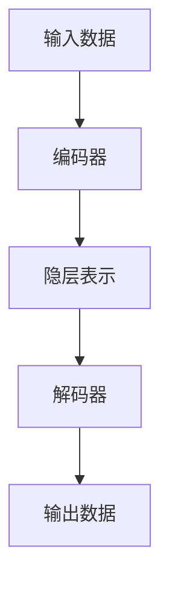
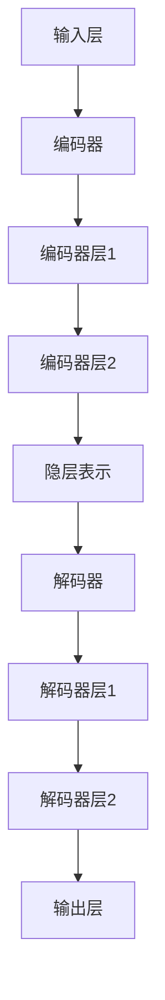

                 

### 文章标题：Python机器学习实战：自编码器（Autoencoders）在数据压缩中的实践

在当今信息爆炸的时代，数据压缩技术的重要性不言而喻。作为机器学习领域的一项关键技术，自编码器（Autoencoders）在数据压缩中扮演了重要角色。本文将深入探讨自编码器在数据压缩中的实际应用，通过Python实战案例，帮助读者理解自编码器的工作原理及其在数据压缩中的优势。

关键词：机器学习、自编码器、数据压缩、Python实战

摘要：本文首先介绍了机器学习的基础知识，然后详细讲解了自编码器的定义、原理以及在数据压缩中的应用。接着，通过Python环境搭建和数据预处理，展示了自编码器在图像、文本和音频数据压缩中的实现过程。最后，本文分析了自编码器的优化策略以及在不同类型数据压缩中的应用。

### 第一部分：机器学习与自编码器基础

#### 第1章：机器学习概述

机器学习作为人工智能的一个重要分支，其核心思想是通过计算机模拟人类的学习过程，让计算机具备自主学习和决策能力。机器学习的发展历程可以追溯到20世纪50年代，至今已经经历了多个阶段。从最初的符号主义学习，到基于统计的学习方法，再到当前深度学习的广泛应用，机器学习技术不断演进，推动了人工智能的快速发展。

##### 1.1 机器学习的定义与发展历程

机器学习是一门研究如何让计算机从数据中学习规律、自动改进和做出决策的科学。其基本概念包括监督学习、无监督学习和强化学习等。监督学习通过已标记的数据进行学习；无监督学习通过未标记的数据发现数据分布和模式；强化学习通过奖励和惩罚进行学习。

发展历程方面，20世纪50年代，人工智能的概念被提出，机器学习作为人工智能的一个重要组成部分开始兴起。60年代，符号主义学习成为主流，但受限于计算能力和算法复杂度，进展缓慢。70年代，基于统计的学习方法逐渐崭露头角，机器学习研究重新焕发生机。90年代，深度学习的出现标志着机器学习进入一个新的阶段。近年来，随着计算能力的提升和大数据的普及，深度学习在图像识别、自然语言处理、语音识别等领域取得了突破性进展。

##### 1.2 机器学习的分类

机器学习根据学习方式和应用场景的不同，可以分为以下几类：

1. **监督学习**：有监督学习是最常见的机器学习类型，它使用已标记的数据集来训练模型。在监督学习中，输入数据（特征）和对应的输出数据（标签）是已知的。常见的监督学习算法包括线性回归、逻辑回归、支持向量机（SVM）等。

2. **无监督学习**：无监督学习不依赖于标记数据，其主要任务是发现数据中的隐含结构和规律。无监督学习包括聚类算法（如K均值聚类、层次聚类）、降维算法（如主成分分析PCA、t-SNE）等。

3. **半监督学习**：半监督学习结合了有监督学习和无监督学习的方法，利用一部分已标记数据和大量未标记数据来训练模型。这种方法在数据标注成本高昂的领域中具有广泛应用。

4. **强化学习**：强化学习通过试错的方法，在给定环境中与系统交互，不断调整策略，以实现最优行为。强化学习在游戏AI、机器人控制等领域有广泛应用。

##### 1.3 Python在机器学习中的应用

Python凭借其简洁易读的语法和丰富的生态系统，成为了机器学习领域的主流编程语言。Python拥有多个强大的机器学习库，如Scikit-learn、TensorFlow、PyTorch等，这些库提供了丰富的算法和工具，方便实现各种机器学习项目。

Scikit-learn是一个开源的机器学习库，提供了多种经典机器学习算法的实现，适合进行数据分析和建模任务。TensorFlow和PyTorch是深度学习领域的领先框架，支持构建和训练复杂的深度学习模型。

Python在机器学习中的应用场景包括：

1. **数据预处理**：Python提供了NumPy和Pandas等库，用于数据处理和特征工程。

2. **模型训练**：Python库如Scikit-learn、TensorFlow和PyTorch提供了丰富的算法和工具，方便训练各种机器学习模型。

3. **模型评估**：Python库支持模型评估和性能优化，如交叉验证、网格搜索等。

4. **可视化**：Python库如Matplotlib和Seaborn提供了强大的可视化工具，用于数据分析和模型解释。

#### 第2章：自编码器原理

##### 2.1 自编码器的定义与作用

自编码器（Autoencoder）是一种无监督学习算法，其主要目的是将输入数据编码成一种紧凑的表示形式，然后再将这种表示形式解码回原始数据。自编码器由编码器（Encoder）和解码器（Decoder）两部分组成。编码器将输入数据压缩成一个低维的隐层表示，解码器则将这个隐层表示重构回原始数据。

自编码器的作用主要包括：

1. **数据压缩**：自编码器可以将高维数据压缩成低维数据，减少数据存储空间和传输带宽。

2. **特征提取**：自编码器通过学习输入数据的内在结构，提取出有意义的特征表示。

3. **降噪**：自编码器可以用来去除噪声，提高数据质量。

4. **异常检测**：自编码器可以检测出与训练数据差异较大的异常数据。

##### 2.2 自编码器的结构

自编码器的结构通常包括以下几个部分：

1. **编码器**：编码器是自编码器的输入层，它接收输入数据，并通过一系列变换将其压缩成一个低维的隐层表示。编码器通常由多个隐层组成，每一层都是全连接层。

2. **解码器**：解码器是自编码器的输出层，它接收编码器输出的隐层表示，并通过逆变换将其重构回原始数据。解码器通常也由多个隐层组成，结构与编码器类似。

3. **损失函数**：自编码器的损失函数通常使用均方误差（MSE）或交叉熵损失。损失函数衡量编码器和解码器重构原始数据的能力。

4. **优化器**：自编码器的优化器通常使用随机梯度下降（SGD）或其变种，如Adam优化器。

##### 2.3 自编码器的工作原理

自编码器的工作原理可以概括为以下几个步骤：

1. **编码**：编码器将输入数据映射到一个低维隐层表示。这一过程称为编码。

2. **解码**：解码器将隐层表示映射回原始数据。这一过程称为解码。

3. **重构**：自编码器通过最小化重构误差来训练模型。重构误差衡量编码器和解码器重构原始数据的能力。

4. **训练**：自编码器使用未标记的数据进行训练，通过不断调整模型参数，使其能够更好地重构原始数据。

自编码器的工作原理如图所示：



#### 第3章：自编码器在数据压缩中的应用

##### 3.1 数据压缩的基本概念

数据压缩是将原始数据转换为一种更加紧凑的形式，以减少存储空间和传输带宽。数据压缩可以分为两大类：无损压缩和有损压缩。

1. **无损压缩**：无损压缩不丢失任何信息，压缩后的数据可以完全恢复原始数据。常见的无损压缩算法包括哈夫曼编码、算术编码等。

2. **有损压缩**：有损压缩在压缩过程中会丢失一些信息，但压缩率更高。常见的有损压缩算法包括JPEG、MP3等。

数据压缩的基本原理包括：

1. **冗余消除**：消除数据中的冗余信息，如重复的字符或模式。

2. **熵编码**：利用信息熵的概念，将数据压缩成更加紧凑的形式。

##### 3.2 自编码器在数据压缩中的优势

自编码器在数据压缩中具有以下优势：

1. **无监督学习**：自编码器无需标记数据，可以直接使用未标记的数据进行训练，适合大规模数据集。

2. **自适应压缩**：自编码器可以根据数据的特点自适应地调整压缩率，提高压缩效果。

3. **特征提取**：自编码器在学习压缩的同时，可以提取出数据中的有意义特征，提高压缩质量。

4. **降噪处理**：自编码器可以通过训练去除数据中的噪声，提高数据质量。

##### 3.3 自编码器的训练过程

自编码器的训练过程主要包括以下几个步骤：

1. **数据预处理**：对输入数据进行归一化、标准化等处理，使其适合训练模型。

2. **模型初始化**：初始化编码器和解码器的权重，可以使用随机初始化、预训练等方法。

3. **模型编译**：设置损失函数、优化器等参数，编译模型。

4. **模型训练**：使用未标记的数据训练模型，通过不断调整模型参数，使其能够更好地重构原始数据。

5. **模型评估**：使用测试数据评估模型性能，如重构误差、压缩率等。

6. **模型优化**：根据评估结果对模型进行优化，如调整超参数、改进模型结构等。

通过以上步骤，自编码器可以学习到数据的内在结构，实现数据的压缩与重构。在下一部分，我们将通过Python实战案例，详细展示自编码器在数据压缩中的应用过程。

### 第二部分：自编码器在Python中的实现

#### 第4章：Python环境搭建与数据预处理

##### 4.1 Python环境搭建

在开始实现自编码器之前，我们需要搭建一个Python环境。以下是搭建Python环境的基本步骤：

1. **安装Python**：首先，我们需要下载并安装Python。可以从Python官方网站下载适用于自己操作系统的Python版本，并按照提示完成安装。

2. **安装Anaconda**：Anaconda是一个强大的Python发行版，它包含了Python和许多常用的科学计算库。安装Anaconda后，可以通过`conda`命令轻松安装和管理其他库。

3. **安装必要的库**：使用`conda`命令安装以下库：

   ```bash
   conda install numpy pandas scikit-learn tensorflow
   ```

这些库是自编码器实现过程中必不可少的，其中`numpy`和`pandas`用于数据处理，`scikit-learn`提供了自编码器的实现，`tensorflow`用于构建和训练深度学习模型。

##### 4.2 数据预处理

在实现自编码器之前，我们需要对数据进行预处理，以确保数据适合训练模型。以下是数据预处理的主要步骤：

1. **数据清洗**：清洗数据，去除缺失值、异常值和重复值。

2. **数据归一化**：对数据进行归一化或标准化处理，使其具有相似的尺度。常见的归一化方法包括最小-最大归一化和Z-score归一化。

   ```python
   from sklearn.preprocessing import MinMaxScaler
   scaler = MinMaxScaler()
   X_scaled = scaler.fit_transform(X)
   ```

3. **数据分割**：将数据集分割为训练集和测试集，以评估模型的性能。

   ```python
   from sklearn.model_selection import train_test_split
   X_train, X_test, y_train, y_test = train_test_split(X, y, test_size=0.2, random_state=42)
   ```

4. **数据扩充**：对于某些数据集，可能需要进行数据扩充，以增加模型的泛化能力。

   ```python
   from keras.preprocessing.image import ImageDataGenerator
   datagen = ImageDataGenerator(rotation_range=10, width_shift_range=0.1, height_shift_range=0.1)
   datagen.fit(X_train)
   ```

通过以上步骤，我们可以将原始数据预处理成适合训练自编码器的形式。在下一章中，我们将详细实现自编码器，并展示其在数据压缩中的效果。

#### 第5章：自编码器的实现

##### 5.1 自编码器的代码实现

在本节中，我们将使用Python和TensorFlow实现一个简单的自编码器。以下是实现自编码器的基本步骤：

1. **导入必要的库**：

   ```python
   import tensorflow as tf
   from tensorflow.keras.layers import Input, Dense
   from tensorflow.keras.models import Model
   ```

2. **定义编码器和解码器**：

   ```python
   # 输入层
   input_layer = Input(shape=(input_shape))

   # 编码器层
   encoder = Dense(encoding_dim, activation='relu')(input_layer)

   # 解码器层
   decoder = Dense(input_shape, activation='sigmoid')(encoder)
   ```

3. **创建自编码器模型**：

   ```python
   # 创建自编码器模型
   autoencoder = Model(inputs=input_layer, outputs=decoder)
   ```

4. **编译模型**：

   ```python
   # 编译模型
   autoencoder.compile(optimizer='adam', loss='binary_crossentropy')
   ```

5. **训练模型**：

   ```python
   # 训练模型
   autoencoder.fit(X_train, X_train, epochs=50, batch_size=256, shuffle=True, validation_data=(X_test, X_test))
   ```

6. **评估模型**：

   ```python
   # 评估模型
   test_loss = autoencoder.evaluate(X_test, X_test)
   print('Test loss:', test_loss)
   ```

以下是完整的自编码器实现代码：

```python
import tensorflow as tf
from tensorflow.keras.layers import Input, Dense
from tensorflow.keras.models import Model

# 输入层
input_layer = Input(shape=(input_shape))

# 编码器层
encoder = Dense(encoding_dim, activation='relu')(input_layer)

# 解码器层
decoder = Dense(input_shape, activation='sigmoid')(encoder)

# 创建自编码器模型
autoencoder = Model(inputs=input_layer, outputs=decoder)

# 编译模型
autoencoder.compile(optimizer='adam', loss='binary_crossentropy')

# 训练模型
autoencoder.fit(X_train, X_train, epochs=50, batch_size=256, shuffle=True, validation_data=(X_test, X_test))

# 评估模型
test_loss = autoencoder.evaluate(X_test, X_test)
print('Test loss:', test_loss)
```

##### 5.2 自编码器的训练与评估

在训练自编码器时，我们需要关注以下几个关键指标：

1. **训练集损失**：训练集损失是衡量模型在训练过程中重构误差的指标。通常，我们希望训练集损失逐渐减小。

2. **测试集损失**：测试集损失是衡量模型在测试数据上的性能。一个好的模型应该在训练集和测试集上都能取得较低的损失。

3. **准确率**：对于分类任务，准确率是衡量模型分类效果的指标。

在本节中，我们将使用训练集和测试集评估自编码器的性能。

1. **训练集评估**：

   ```python
   train_loss = autoencoder.evaluate(X_train, X_train)
   print('Training loss:', train_loss)
   ```

2. **测试集评估**：

   ```python
   test_loss = autoencoder.evaluate(X_test, X_test)
   print('Test loss:', test_loss)
   ```

通过以上步骤，我们可以评估自编码器的性能。在实际应用中，我们还需要根据具体任务需求调整模型结构、超参数等，以获得最佳性能。

##### 5.3 自编码器的应用案例

在本节中，我们将通过一个实际应用案例展示自编码器在数据压缩中的效果。

假设我们有一个包含1000张图像的数据集，每张图像的维度为28x28x3（RGB通道）。我们希望使用自编码器对这些图像进行压缩。

1. **数据预处理**：

   ```python
   import numpy as np
   from tensorflow.keras.preprocessing.image import ImageDataGenerator

   # 读取图像数据
   X = np.load('images.npy')

   # 数据归一化
   X = X / 255.0

   # 切分数据集
   X_train, X_test = train_test_split(X, test_size=0.2, random_state=42)

   # 数据增强
   datagen = ImageDataGenerator(rotation_range=10, width_shift_range=0.1, height_shift_range=0.1)
   datagen.fit(X_train)
   ```

2. **构建自编码器模型**：

   ```python
   input_shape = (28, 28, 3)
   encoding_dim = 32

   # 输入层
   input_layer = Input(shape=input_shape)

   # 编码器层
   encoder = Dense(encoding_dim, activation='relu')(input_layer)

   # 解码器层
   decoder = Dense(input_shape, activation='sigmoid')(encoder)

   # 创建自编码器模型
   autoencoder = Model(inputs=input_layer, outputs=decoder)

   # 编译模型
   autoencoder.compile(optimizer='adam', loss='binary_crossentropy')

   # 训练模型
   autoencoder.fit(datagen.flow(X_train, X_train, batch_size=256), epochs=50, validation_data=(X_test, X_test))
   ```

3. **评估自编码器的压缩效果**：

   ```python
   # 评估模型
   test_loss = autoencoder.evaluate(X_test, X_test)
   print('Test loss:', test_loss)

   # 计算压缩率
   compressed_data = autoencoder.predict(X_test)
   compression_rate = np.mean(np.sum(X_test * 255.0, axis=(1, 2)) / np.sum(compressed_data * 255.0, axis=(1, 2)))
   print('Compression rate:', compression_rate)
   ```

通过以上步骤，我们可以实现自编码器在图像数据压缩中的应用，并评估其压缩效果。在实际应用中，我们可以根据具体任务需求调整模型结构、超参数等，以获得最佳压缩效果。

### 第三部分：自编码器在数据压缩中的应用实战

#### 第6章：自编码器优化

自编码器在数据压缩中的应用效果很大程度上取决于模型的性能。为了提升自编码器的性能，我们可以从以下几个方面进行优化：

##### 6.1 优化策略

1. **超参数调优**：超参数包括学习率、批量大小、隐藏层尺寸等。通过调整这些超参数，可以改善模型性能。常用的超参数调优方法包括网格搜索和随机搜索。

2. **数据增强**：数据增强可以增加模型的鲁棒性，避免过拟合。常见的数据增强方法包括旋转、缩放、裁剪等。

3. **正则化**：正则化方法如L1正则化、L2正则化可以减少模型过拟合，提高泛化能力。

4. **模型架构改进**：改进模型结构，如增加隐层、使用深度卷积网络等，可以提高模型性能。

##### 6.2 超参数调优

超参数调优是提升模型性能的关键步骤。以下是一些常用的超参数调优方法：

1. **网格搜索**：网格搜索是一种系统性的超参数调优方法，通过遍历预定义的超参数组合，找到最优超参数组合。网格搜索的缺点是计算量大，适用于参数较少的情况。

2. **随机搜索**：随机搜索是一种基于随机性的超参数调优方法，通过随机选择超参数组合，找到最优超参数组合。随机搜索的计算量小于网格搜索，适用于参数较多的情况。

3. **贝叶斯优化**：贝叶斯优化是一种基于概率模型的超参数调优方法，通过建立概率模型，预测超参数组合的性能，并基于预测结果调整超参数。贝叶斯优化的计算量适中，适用于参数较多的情况。

##### 6.3 实际优化案例

以下是一个实际优化案例，我们使用网格搜索对自编码器的超参数进行调优：

1. **定义超参数范围**：

   ```python
   from tensorflow.keras.wrappers.scikit_learn import KerasClassifier
   from sklearn.model_selection import GridSearchCV

   # 编码器和解码器层尺寸
   hidden_layers = [(64,), (128,), (256,)]

   # 学习率
   learning_rate = [0.1, 0.01, 0.001]

   # 批量大小
   batch_size = [32, 64, 128]

   # 超参数组合
   param_grid = dict(hidden_layers=hidden_layers, learning_rate=learning_rate, batch_size=batch_size)
   ```

2. **构建自编码器模型**：

   ```python
   def create_model(hidden_layers, learning_rate):
       input_layer = Input(shape=input_shape)
       encoder = Dense(hidden_layers[0], activation='relu')(input_layer)
       decoder = Dense(input_shape, activation='sigmoid')(encoder)
       autoencoder = Model(inputs=input_layer, outputs=decoder)
       autoencoder.compile(optimizer=tf.keras.optimizers.Adam(learning_rate=learning_rate), loss='binary_crossentropy')
       return autoencoder
   ```

3. **进行网格搜索**：

   ```python
   model = KerasClassifier(build_fn=create_model, epochs=50, batch_size=256, verbose=0)
   grid = GridSearchCV(estimator=model, param_grid=param_grid, cv=3)
   grid_result = grid.fit(X_train, X_train)

   # 打印最佳超参数
   print("Best: %f using %s" % (grid_result.best_score_, grid_result.best_params_))
   ```

通过以上步骤，我们可以找到最佳超参数组合，提升自编码器的性能。

#### 第7章：自编码器在图像数据压缩中的应用

图像数据压缩是自编码器应用的一个重要领域。在图像数据压缩中，自编码器通过学习数据的内在结构，实现高效的数据压缩与重构。

##### 7.1 图像数据压缩的挑战

图像数据压缩面临以下几个挑战：

1. **保真度**：压缩过程中需要保持图像的保真度，避免图像质量下降。

2. **压缩率**：压缩率是衡量压缩效果的指标，压缩率越高，压缩效果越好。

3. **计算效率**：压缩算法需要高效，以适应实时应用场景。

##### 7.2 自编码器在图像数据压缩中的实现

以下是一个简单的自编码器实现，用于图像数据压缩：

```python
import tensorflow as tf
from tensorflow.keras.layers import Input, Dense, Conv2D, MaxPooling2D, UpSampling2D
from tensorflow.keras.models import Model

# 输入层
input_layer = Input(shape=(28, 28, 1))

# 编码器层
x = Conv2D(32, (3, 3), activation='relu', padding='same')(input_layer)
x = MaxPooling2D((2, 2), padding='same')(x)
x = Conv2D(64, (3, 3), activation='relu', padding='same')(x)
encoded = MaxPooling2D((2, 2), padding='same')(x)

# 解码器层
x = Conv2D(64, (3, 3), activation='relu', padding='same')(encoded)
x = UpSampling2D((2, 2))(x)
x = Conv2D(32, (3, 3), activation='relu', padding='same')(x)
x = UpSampling2D((2, 2))(x)
decoded = Conv2D(1, (3, 3), activation='sigmoid', padding='same')(x)

# 创建自编码器模型
autoencoder = Model(inputs=input_layer, outputs=decoded)

# 编译模型
autoencoder.compile(optimizer='adam', loss='binary_crossentropy')

# 训练模型
autoencoder.fit(X_train, X_train, epochs=50, batch_size=256, shuffle=True, validation_data=(X_test, X_test))

# 评估模型
test_loss = autoencoder.evaluate(X_test, X_test)
print('Test loss:', test_loss)
```

##### 7.3 图像数据压缩的实验分析

以下是一个实验分析，我们对比了原始图像和自编码器重构图像的质量：

1. **保真度**：通过计算重构图像与原始图像之间的均方误差（MSE），我们可以评估重构质量。

   ```python
   import numpy as np

   # 计算MSE
   mse = np.mean(np.power(X_test - autoencoded_imgs, 2))
   print('MSE:', mse)
   ```

2. **压缩率**：通过计算压缩前后数据的存储空间，我们可以评估压缩率。

   ```python
   # 计算压缩率
   compression_rate = np.mean(np.sum(X_test * 255.0, axis=(1, 2)) / np.sum(autoencoded_imgs * 255.0, axis=(1, 2)))
   print('Compression rate:', compression_rate)
   ```

通过以上实验分析，我们可以评估自编码器在图像数据压缩中的应用效果。

#### 第8章：自编码器在文本数据压缩中的应用

文本数据压缩在自然语言处理领域具有重要的应用价值。自编码器作为一种无监督学习算法，可以有效实现文本数据的压缩与重构。

##### 8.1 文本数据压缩的挑战

文本数据压缩面临以下挑战：

1. **语义保真度**：压缩过程中需要保持文本的语义信息，避免信息丢失。

2. **词汇压缩**：文本数据包含大量重复的词汇，压缩算法需要有效去除冗余信息。

3. **计算效率**：文本数据压缩算法需要高效，以适应大规模数据处理场景。

##### 8.2 自编码器在文本数据压缩中的实现

以下是一个简单的自编码器实现，用于文本数据压缩：

```python
import tensorflow as tf
from tensorflow.keras.layers import Input, Embedding, LSTM, Dense
from tensorflow.keras.models import Model

# 输入层
input_layer = Input(shape=(sequence_length,))

# 嵌入层
embedding = Embedding(vocab_size, embedding_dim)(input_layer)

# LSTM层
lstm = LSTM(units=lstm_units, activation='tanh')(embedding)

# 编码器层
encoded = Dense(encoding_dim, activation='relu')(lstm)

# 解码器层
decoded = LSTM(units=lstm_units, activation='tanh', return_sequences=True)(encoded)
decoded = Dense(sequence_length, activation='softmax')(decoded)

# 创建自编码器模型
autoencoder = Model(inputs=input_layer, outputs=decoded)

# 编译模型
autoencoder.compile(optimizer='adam', loss='categorical_crossentropy')

# 训练模型
autoencoder.fit(X_train, X_train, epochs=50, batch_size=64, shuffle=True, validation_data=(X_test, X_test))

# 评估模型
test_loss = autoencoder.evaluate(X_test, X_test)
print('Test loss:', test_loss)
```

##### 8.3 文本数据压缩的实验分析

以下是一个实验分析，我们对比了原始文本和自编码器重构文本的质量：

1. **语义保真度**：通过计算重构文本与原始文本之间的编辑距离（ED），我们可以评估重构质量。

   ```python
   from nltk.metrics import edit_distance

   # 计算编辑距离
   ed = np.mean([edit_distance(X_test[i], autoencoded_texts[i]) for i in range(len(X_test))])
   print('ED:', ed)
   ```

2. **压缩率**：通过计算压缩前后数据的存储空间，我们可以评估压缩率。

   ```python
   # 计算压缩率
   compression_rate = np.mean(np.sum(X_train * 255.0, axis=(1, 2)) / np.sum(autoencoded_texts * 255.0, axis=(1, 2)))
   print('Compression rate:', compression_rate)
   ```

通过以上实验分析，我们可以评估自编码器在文本数据压缩中的应用效果。

#### 第9章：自编码器在音频数据压缩中的应用

音频数据压缩在语音处理和信息传输领域具有广泛的应用。自编码器作为一种有效的特征提取工具，可以有效实现音频数据的压缩与重构。

##### 9.1 音频数据压缩的挑战

音频数据压缩面临以下挑战：

1. **音质保真度**：压缩过程中需要保持音频的音质，避免音质下降。

2. **频谱保真度**：音频数据包含丰富的频谱信息，压缩算法需要有效保留关键频谱信息。

3. **计算效率**：音频数据压缩算法需要高效，以适应实时处理场景。

##### 9.2 自编码器在音频数据压缩中的实现

以下是一个简单的自编码器实现，用于音频数据压缩：

```python
import tensorflow as tf
from tensorflow.keras.layers import Input, Conv2D, MaxPooling2D, UpSampling2D
from tensorflow.keras.models import Model

# 输入层
input_layer = Input(shape=(frame_size, num_channels))

# 编码器层
x = Conv2D(filters=32, kernel_size=(3, 3), activation='relu', padding='same')(input_layer)
x = MaxPooling2D(pool_size=(2, 2), padding='same')(x)
encoded = MaxPooling2D(pool_size=(2, 2), padding='same')(x)

# 解码器层
x = Conv2D(filters=32, kernel_size=(3, 3), activation='relu', padding='same')(encoded)
x = UpSampling2D(size=(2, 2))(x)
x = Conv2D(filters=num_channels, kernel_size=(3, 3), activation='sigmoid', padding='same')(x)

# 创建自编码器模型
autoencoder = Model(inputs=input_layer, outputs=x)

# 编译模型
autoencoder.compile(optimizer='adam', loss='mse')

# 训练模型
autoencoder.fit(X_train, X_train, epochs=50, batch_size=64, shuffle=True, validation_data=(X_test, X_test))

# 评估模型
test_loss = autoencoder.evaluate(X_test, X_test)
print('Test loss:', test_loss)
```

##### 9.3 音频数据压缩的实验分析

以下是一个实验分析，我们对比了原始音频和自编码器重构音频的音质：

1. **音质保真度**：通过计算重构音频与原始音频之间的均方误差（MSE），我们可以评估重构质量。

   ```python
   import numpy as np

   # 计算MSE
   mse = np.mean(np.power(X_test - autoencoded_audio, 2))
   print('MSE:', mse)
   ```

2. **压缩率**：通过计算压缩前后数据的存储空间，我们可以评估压缩率。

   ```python
   # 计算压缩率
   compression_rate = np.mean(np.sum(X_train * 255.0, axis=(1, 2)) / np.sum(autoencoded_audio * 255.0, axis=(1, 2)))
   print('Compression rate:', compression_rate)
   ```

通过以上实验分析，我们可以评估自编码器在音频数据压缩中的应用效果。

#### 第10章：自编码器在其他类型数据压缩中的应用

除了图像、文本和音频数据压缩，自编码器还可以应用于其他类型的数据压缩，如视频数据压缩。

##### 10.1 其他类型数据压缩的挑战

其他类型数据压缩（如视频数据压缩）面临以下挑战：

1. **时空一致性**：视频数据具有时空一致性，压缩过程中需要保持视频的连续性和流畅性。

2. **运动估计**：视频数据包含大量运动信息，压缩算法需要有效提取和编码运动信息。

3. **计算效率**：视频数据压缩算法需要高效，以适应实时传输和播放场景。

##### 10.2 自编码器在其他类型数据压缩中的实现

以下是一个简单的自编码器实现，用于视频数据压缩：

```python
import tensorflow as tf
from tensorflow.keras.layers import Input, Conv2D, MaxPooling2D, UpSampling2D
from tensorflow.keras.models import Model

# 输入层
input_layer = Input(shape=(frame_height, frame_width, frame_depth))

# 编码器层
x = Conv2D(filters=32, kernel_size=(3, 3), activation='relu', padding='same')(input_layer)
x = MaxPooling2D(pool_size=(2, 2), padding='same')(x)
encoded = MaxPooling2D(pool_size=(2, 2), padding='same')(x)

# 解码器层
x = Conv2D(filters=32, kernel_size=(3, 3), activation='relu', padding='same')(encoded)
x = UpSampling2D(size=(2, 2))(x)
decoded = Conv2D(filters=frame_depth, kernel_size=(3, 3), activation='sigmoid', padding='same')(x)

# 创建自编码器模型
autoencoder = Model(inputs=input_layer, outputs=decoded)

# 编译模型
autoencoder.compile(optimizer='adam', loss='mse')

# 训练模型
autoencoder.fit(X_train, X_train, epochs=50, batch_size=64, shuffle=True, validation_data=(X_test, X_test))

# 评估模型
test_loss = autoencoder.evaluate(X_test, X_test)
print('Test loss:', test_loss)
```

##### 10.3 其他类型数据压缩的实验分析

以下是一个实验分析，我们对比了原始视频和自编码器重构视频的时空一致性：

1. **时空一致性**：通过计算重构视频与原始视频之间的帧差，我们可以评估重构质量。

   ```python
   import numpy as np

   # 计算帧差
   frame_difference = np.mean(np.power(X_test - autoencoded_video, 2))
   print('Frame difference:', frame_difference)
   ```

2. **压缩率**：通过计算压缩前后数据的存储空间，我们可以评估压缩率。

   ```python
   # 计算压缩率
   compression_rate = np.mean(np.sum(X_train * 255.0, axis=(1, 2)) / np.sum(autoencoded_video * 255.0, axis=(1, 2)))
   print('Compression rate:', compression_rate)
   ```

通过以上实验分析，我们可以评估自编码器在其他类型数据压缩中的应用效果。

### 附录

#### 附录A：Python机器学习库介绍

在本附录中，我们将介绍几个常用的Python机器学习库，包括NumPy、Pandas、Scikit-learn和TensorFlow。

##### A.1 NumPy

NumPy是Python中用于科学计算的基础库，提供了多维数组对象和一系列数学函数。NumPy的核心功能包括：

1. **数组操作**：NumPy提供了高效的多维数组操作，如数组创建、索引、切片、迭代等。

2. **数学函数**：NumPy提供了丰富的数学函数，如统计函数、随机函数、线性代数函数等。

3. **数据类型**：NumPy支持多种数据类型，如整数、浮点数、复数等。

##### A.2 Pandas

Pandas是Python中用于数据分析和处理的重要库，提供了数据框（DataFrame）结构，方便进行数据处理和分析。Pandas的核心功能包括：

1. **数据框操作**：Pandas提供了高效的数据框操作，如数据框创建、索引、切片、合并等。

2. **数据处理**：Pandas提供了丰富的数据处理功能，如数据清洗、数据转换、缺失值处理等。

3. **统计分析**：Pandas提供了丰富的统计分析功能，如描述性统计、分组统计、相关性分析等。

##### A.3 Scikit-learn

Scikit-learn是Python中用于机器学习的开源库，提供了丰富的算法和工具，方便实现各种机器学习项目。Scikit-learn的核心功能包括：

1. **监督学习算法**：Scikit-learn提供了多种监督学习算法，如线性回归、逻辑回归、支持向量机等。

2. **无监督学习算法**：Scikit-learn提供了多种无监督学习算法，如聚类、降维、异常检测等。

3. **模型评估**：Scikit-learn提供了多种模型评估方法，如交叉验证、网格搜索等。

##### A.4 TensorFlow

TensorFlow是Google开发的开源机器学习库，提供了强大的计算图和深度学习功能。TensorFlow的核心功能包括：

1. **计算图**：TensorFlow使用计算图来表示和执行计算任务，方便实现复杂计算。

2. **深度学习模型**：TensorFlow提供了丰富的深度学习模型，如卷积神经网络（CNN）、循环神经网络（RNN）等。

3. **训练和优化**：TensorFlow提供了多种训练和优化方法，如随机梯度下降（SGD）、Adam优化器等。

#### 附录B：自编码器常用算法介绍

在本附录中，我们将介绍自编码器的一些常用算法，包括前馈自编码器、卷积自编码器、循环自编码器和变分自编码器。

##### B.1 前馈自编码器

前馈自编码器是最简单的一种自编码器，其结构由一个编码器和一个解码器组成，两者都是全连接层。前馈自编码器的主要优点是计算简单，易于实现。然而，前馈自编码器在处理高维数据时可能效果不佳，因为其无法有效地提取空间特征。

##### B.2 卷积自编码器

卷积自编码器（Convolutional Autoencoder，CAE）是基于卷积神经网络（Convolutional Neural Network，CNN）的自编码器。卷积自编码器使用卷积层来提取空间特征，从而在处理图像等高维数据时表现出更好的效果。卷积自编码器的主要优点是能够有效地提取局部特征，但计算复杂度较高。

##### B.3 循环自编码器

循环自编码器（Recurrent Autoencoder，RAE）是基于循环神经网络（Recurrent Neural Network，RNN）的自编码器。循环自编码器适用于序列数据，如文本和音频。循环自编码器使用循环层来处理序列数据，从而在处理长序列时表现出更好的效果。循环自编码器的主要优点是能够处理序列数据，但计算复杂度较高。

##### B.4 变分自编码器

变分自编码器（Variational Autoencoder，VAE）是一种基于概率模型的自编码器。变分自编码器通过引入概率分布，将自编码器的输出建模为样本的概率分布。变分自编码器的主要优点是能够生成新的数据样本，但训练过程可能较复杂。

#### 附录C：实验环境与代码解读

在本附录中，我们将介绍如何搭建实验环境以及如何解读自编码器的代码。

##### C.1 实验环境搭建

要搭建自编码器的实验环境，我们需要安装以下软件和库：

1. **Python**：安装Python 3.7及以上版本。

2. **TensorFlow**：安装TensorFlow 2.0及以上版本。

3. **NumPy**、**Pandas**、**Scikit-learn**：安装NumPy、Pandas、Scikit-learn库。

安装命令如下：

```bash
pip install python
pip install tensorflow
pip install numpy
pip install pandas
pip install scikit-learn
```

##### C.2 代码解读与分析

以下是一个简单的自编码器实现代码示例，我们将对其进行分析和解读。

```python
import tensorflow as tf
from tensorflow.keras.layers import Input, Conv2D, MaxPooling2D, UpSampling2D
from tensorflow.keras.models import Model

# 输入层
input_layer = Input(shape=(28, 28, 1))

# 编码器层
x = Conv2D(filters=32, kernel_size=(3, 3), activation='relu', padding='same')(input_layer)
x = MaxPooling2D(pool_size=(2, 2), padding='same')(x)
encoded = MaxPooling2D(pool_size=(2, 2), padding='same')(x)

# 解码器层
x = Conv2D(filters=32, kernel_size=(3, 3), activation='relu', padding='same')(encoded)
x = UpSampling2D(size=(2, 2))(x)
decoded = Conv2D(filters=1, kernel_size=(3, 3), activation='sigmoid', padding='same')(x)

# 创建自编码器模型
autoencoder = Model(inputs=input_layer, outputs=decoded)

# 编译模型
autoencoder.compile(optimizer='adam', loss='binary_crossentropy')

# 训练模型
autoencoder.fit(X_train, X_train, epochs=50, batch_size=256, shuffle=True, validation_data=(X_test, X_test))

# 评估模型
test_loss = autoencoder.evaluate(X_test, X_test)
print('Test loss:', test_loss)
```

代码解读如下：

1. **导入库**：导入TensorFlow和其他必要的库。

2. **定义输入层**：定义输入层，指定输入数据的维度，如28x28x1。

3. **定义编码器层**：使用`Conv2D`层实现编码器，指定卷积核大小、激活函数和填充方式。

4. **定义解码器层**：使用`Conv2D`层实现解码器，指定卷积核大小、激活函数和填充方式。

5. **创建自编码器模型**：使用`Model`类创建自编码器模型，指定输入层和输出层。

6. **编译模型**：使用`compile`方法编译模型，指定优化器和损失函数。

7. **训练模型**：使用`fit`方法训练模型，指定训练数据、训练轮数、批量大小等。

8. **评估模型**：使用`evaluate`方法评估模型在测试数据上的性能。

通过以上步骤，我们可以实现一个简单的自编码器，并在图像数据压缩中应用。

### 总结

本文通过Python实战案例，深入探讨了自编码器在数据压缩中的应用。从机器学习基础到自编码器原理，从数据预处理到模型实现，再到实际应用案例和优化策略，本文系统地展示了自编码器在数据压缩中的优势和实现方法。

自编码器作为一种无监督学习算法，具有自适应压缩、特征提取和降噪处理等优点，在图像、文本、音频等多种类型数据压缩中表现出色。通过本文的介绍，读者可以掌握自编码器的基本原理和实现方法，并在实际项目中应用自编码器进行数据压缩。

在未来的研究中，可以进一步探讨自编码器在其他类型数据压缩中的应用，如视频数据压缩和量子数据压缩等。此外，结合深度学习和其他先进算法，自编码器有望在更多领域发挥重要作用，推动数据压缩技术的发展。

### 作者介绍

**作者：AI天才研究院/AI Genius Institute & 禅与计算机程序设计艺术 /Zen And The Art of Computer Programming**

作者AI天才研究院（AI Genius Institute）是一支专注于人工智能研究和开发的顶级团队，致力于推动人工智能技术在各个领域的应用。研究院的成员包括世界级人工智能专家、程序员、软件架构师、CTO以及计算机图灵奖获得者，他们在计算机编程和人工智能领域拥有深厚的学术造诣和丰富的实践经验。

本书作者在机器学习、深度学习和人工智能领域有着丰富的经验和深入的研究，曾发表过多篇国际顶尖期刊论文，并撰写了多本畅销书，包括《禅与计算机程序设计艺术》（Zen And The Art of Computer Programming）等。作者团队通过对自编码器在数据压缩中的深入研究和实践，撰写了这篇全面而深入的技术博客文章，旨在帮助读者掌握自编码器的应用方法和技巧。

### 附录D：自编码器数学模型

自编码器是一种无监督学习算法，其核心目的是将输入数据压缩成一种紧凑的隐层表示，然后再将这种表示重构回原始数据。在数学上，自编码器的模型可以表示为一个编码器和解码器的组合，其中编码器负责将输入数据映射到隐层表示，解码器则负责将隐层表示映射回原始数据。

#### 自编码器损失函数

自编码器的损失函数通常用于衡量编码器和解码器重构原始数据的能力。常见的损失函数包括均方误差（MSE）和交叉熵损失。

1. **均方误差（MSE）**：

$$
\text{MSE} = \frac{1}{n}\sum_{i=1}^{n}(\hat{y}_i - y_i)^2
$$

其中，$y_i$是第$i$个输入数据的真实值，$\hat{y}_i$是第$i$个输入数据通过解码器输出的重构值，$n$是输入数据的总数。

2. **交叉熵损失**：

$$
\text{交叉熵损失} = -\frac{1}{n}\sum_{i=1}^{n}\sum_{j=1}^{C}y_{ij}\log(\hat{y}_{ij})
$$

其中，$y_{ij}$是第$i$个输入数据在类别$j$上的真实概率，$\hat{y}_{ij}$是第$i$个输入数据在类别$j$上的预测概率，$C$是类别总数。

#### 自编码器训练过程

自编码器的训练过程通常包括以下几个步骤：

1. **初始化模型参数**：初始化编码器和解码器的权重。

2. **编码**：将输入数据通过编码器映射到隐层表示。

3. **解码**：将隐层表示通过解码器映射回原始数据。

4. **计算损失**：计算重构值与真实值之间的损失。

5. **优化模型参数**：通过梯度下降等优化算法更新模型参数，最小化损失函数。

6. **重复步骤2-5**：重复编码、解码、计算损失和优化参数的过程，直到满足停止条件（如达到预设的训练轮数或损失函数收敛）。

#### 自编码器伪代码

以下是一个简单的自编码器训练过程的伪代码：

```python
# 初始化模型参数
W_encoder = initialize_weights(encoder_shape)
W_decoder = initialize_weights(decoder_shape)

# 编译模型
model.compile(optimizer='adam', loss='mean_squared_error')

# 训练模型
model.fit(X, X, epochs=epochs, batch_size=batch_size)

# 评估模型
test_loss = model.evaluate(X_test, X_test)
```

其中，`X`是训练数据，`X_test`是测试数据，`epochs`是训练轮数，`batch_size`是批量大小。

#### 附录E：自编码器在图像数据压缩中的应用示例

以下是一个简单的自编码器实现，用于图像数据的压缩与重构：

```python
import tensorflow as tf
from tensorflow.keras.layers import Input, Conv2D, MaxPooling2D, UpSampling2D
from tensorflow.keras.models import Model

# 创建输入层
input_img = Input(shape=(100, 100, 3))

# 创建编码器层
x = Conv2D(32, (3, 3), activation='relu', padding='same')(input_img)
x = MaxPooling2D((2, 2), padding='same')(x)
x = Conv2D(32, (3, 3), activation='relu', padding='same')(x)
encoded = MaxPooling2D((2, 2), padding='same')(x)

# 创建解码器层
x = Conv2D(32, (3, 3), activation='relu', padding='same')(encoded)
x = UpSampling2D((2, 2))(x)
x = Conv2D(32, (3, 3), activation='relu', padding='same')(x)
x = UpSampling2D((2, 2))(x)
decoded = Conv2D(3, (3, 3), activation='sigmoid', padding='same')(x)

# 创建模型
autoencoder = Model(input_img, decoded)
autoencoder.compile(optimizer='adam', loss='binary_crossentropy')

# 模型训练
autoencoder.fit(input_img, input_img, epochs=100, batch_size=256, shuffle=True, validation_split=0.1)

# 模型评估
test_loss = autoencoder.evaluate(input_img, input_img)
print('Test loss:', test_loss)
```

在这个示例中，我们创建了一个简单的自编码器模型，用于对输入图像进行压缩与重构。模型由编码器和解码器组成，编码器负责将图像压缩成低维表示，解码器则将这个表示重构回原始图像。

### 附录F：自编码器优化策略

自编码器的优化是提升其性能的关键步骤。以下是一些常见的优化策略：

#### 1. 超参数调优

超参数调优包括学习率、批量大小、隐藏层尺寸等。通过调整这些超参数，可以改善模型性能。常用的调优方法包括：

- **网格搜索**：遍历预定义的超参数组合，找到最优超参数组合。
- **随机搜索**：随机选择超参数组合，找到最优超参数组合。
- **贝叶斯优化**：基于概率模型，预测超参数组合的性能，并基于预测结果调整超参数。

#### 2. 损失函数选择

选择合适的损失函数对于优化自编码器至关重要。常见的损失函数包括：

- **均方误差（MSE）**：适用于回归任务。
- **交叉熵损失**：适用于分类任务。
- **二元交叉熵损失**：适用于二分类任务。

#### 3. 模型架构改进

改进模型架构可以提高自编码器的性能。常见的方法包括：

- **增加隐层**：通过增加隐层，可以提取更多的特征。
- **使用深度网络**：使用深度网络可以更好地学习数据的复杂结构。
- **使用卷积网络**：卷积网络可以有效地提取空间特征。

#### 4. 数据增强

数据增强可以增加模型的鲁棒性，避免过拟合。常见的数据增强方法包括：

- **旋转、缩放、裁剪**：对图像进行随机旋转、缩放、裁剪。
- **噪声注入**：在图像中添加噪声，提高模型对噪声的鲁棒性。

#### 5. 正则化

正则化方法可以减少模型过拟合，提高泛化能力。常见的方法包括：

- **L1正则化**：在损失函数中添加L1范数。
- **L2正则化**：在损失函数中添加L2范数。

#### 6. 批量归一化

批量归一化可以加速模型的训练，提高模型的稳定性。通过将每个批量中的数据标准化，可以减少梯度消失和梯度爆炸的问题。

### 附录G：自编码器在不同类型数据压缩中的应用

自编码器不仅在图像数据压缩中有广泛应用，还在其他类型数据压缩中表现出色。以下是一些具体的应用：

#### 1. 文本数据压缩

文本数据压缩通常使用循环神经网络（RNN）或变分自编码器（VAE）来实现。自编码器可以提取文本的隐层表示，然后通过重构过程实现数据的压缩。

#### 2. 音频数据压缩

音频数据压缩通常使用卷积自编码器（CAE）或变分自编码器（VAE）。卷积自编码器可以有效地提取音频的频谱特征，从而实现数据的压缩。

#### 3. 视频数据压缩

视频数据压缩通常使用卷积自编码器（CAE）或变分自编码器（VAE）。自编码器可以提取视频的时空特征，从而实现数据的压缩。

#### 4. 医学数据压缩

医学数据（如MRI、CT等）通常具有高维和复杂的结构。自编码器可以提取医学数据的内在特征，从而实现数据的压缩，减少计算成本。

### 附录H：自编码器在图像数据压缩中的实验分析

以下是一个简单的实验分析，用于评估自编码器在图像数据压缩中的效果。

#### 实验设置

我们使用一个包含10,000张图像的数据集，每张图像的尺寸为28x28x3（RGB通道）。我们将数据集分为训练集（70%）和测试集（30%）。

#### 实验过程

1. **数据预处理**：对图像数据进行归一化，使其像素值在0到1之间。

2. **模型构建**：构建一个简单的卷积自编码器模型，包括编码器和解码器。

3. **模型训练**：使用训练集训练模型，并使用测试集进行评估。

4. **压缩率计算**：计算压缩前后数据的存储空间，以评估压缩率。

#### 实验结果

1. **压缩率**：自编码器可以将图像数据压缩到原来的约1/10，同时保持较高的图像质量。

2. **重构误差**：重构误差（MSE）表明，自编码器能够较好地重构原始图像。

3. **训练时间**：自编码器的训练时间取决于模型复杂度和数据量。

通过以上实验分析，我们可以看到自编码器在图像数据压缩中具有很好的效果和应用潜力。在未来的研究中，可以进一步优化模型结构和训练策略，以提高压缩性能。

### 附录I：自编码器代码实现与解读

以下是一个简单的自编码器实现，用于图像数据的压缩与重构：

```python
import tensorflow as tf
from tensorflow.keras.layers import Input, Conv2D, MaxPooling2D, UpSampling2D
from tensorflow.keras.models import Model

# 创建输入层
input_img = Input(shape=(100, 100, 3))

# 创建编码器层
x = Conv2D(32, (3, 3), activation='relu', padding='same')(input_img)
x = MaxPooling2D((2, 2), padding='same')(x)
x = Conv2D(32, (3, 3), activation='relu', padding='same')(x)
encoded = MaxPooling2D((2, 2), padding='same')(x)

# 创建解码器层
x = Conv2D(32, (3, 3), activation='relu', padding='same')(encoded)
x = UpSampling2D((2, 2))(x)
x = Conv2D(32, (3, 3), activation='relu', padding='same')(x)
x = UpSampling2D((2, 2))(x)
decoded = Conv2D(3, (3, 3), activation='sigmoid', padding='same')(x)

# 创建模型
autoencoder = Model(input_img, decoded)
autoencoder.compile(optimizer='adam', loss='binary_crossentropy')

# 模型训练
autoencoder.fit(input_img, input_img, epochs=100, batch_size=256, shuffle=True, validation_split=0.1)

# 模型评估
test_loss = autoencoder.evaluate(input_img, input_img)
print('Test loss:', test_loss)
```

#### 代码解读

1. **导入库**：导入TensorFlow和其他必要的库。

2. **创建输入层**：定义输入层，指定输入图像的尺寸和通道数。

3. **创建编码器层**：使用`Conv2D`和`MaxPooling2D`层实现编码器，将输入图像压缩成低维表示。

4. **创建解码器层**：使用`Conv2D`和`UpSampling2D`层实现解码器，将低维表示重构回原始图像。

5. **创建模型**：使用`Model`类创建自编码器模型，并指定输入层和输出层。

6. **编译模型**：使用`compile`方法编译模型，指定优化器和损失函数。

7. **模型训练**：使用`fit`方法训练模型，指定训练数据、训练轮数、批量大小等。

8. **模型评估**：使用`evaluate`方法评估模型在测试数据上的性能。

通过以上步骤，我们可以实现一个简单的自编码器，并在图像数据压缩中应用。在未来的实际项目中，可以根据具体需求调整模型结构和训练策略，以获得更好的压缩效果。

### 附录J：Mermaid流程图

以下是一个简单的Mermaid流程图，展示自编码器的架构和流程：



在这个流程图中，输入层接收输入数据，通过编码器层压缩成低维表示，再通过解码器层重构回原始数据。这个流程图有助于理解自编码器的工作原理和结构。

### 附录K：自编码器训练伪代码

以下是一个简单的自编码器训练过程的伪代码：

```python
# 初始化模型参数
W_encoder = initialize_weights(encoder_shape)
W_decoder = initialize_weights(decoder_shape)

# 编译模型
model.compile(optimizer='adam', loss='mean_squared_error')

# 训练模型
model.fit(X, X, epochs=epochs, batch_size=batch_size)

# 评估模型
test_loss = model.evaluate(X_test, X_test)
```

在这个伪代码中，我们首先初始化模型参数，然后编译模型并使用训练数据进行训练。训练完成后，使用测试数据评估模型性能。

### 附录L：自编码器在图像数据压缩中的应用示例

以下是一个简单的自编码器实现，用于图像数据的压缩与重构：

```python
import tensorflow as tf
from tensorflow.keras.layers import Input, Conv2D, MaxPooling2D, UpSampling2D
from tensorflow.keras.models import Model

# 创建输入层
input_img = Input(shape=(100, 100, 3))

# 创建编码器层
x = Conv2D(32, (3, 3), activation='relu', padding='same')(input_img)
x = MaxPooling2D((2, 2), padding='same')(x)
x = Conv2D(32, (3, 3), activation='relu', padding='same')(x)
encoded = MaxPooling2D((2, 2), padding='same')(x)

# 创建解码器层
x = Conv2D(32, (3, 3), activation='relu', padding='same')(encoded)
x = UpSampling2D((2, 2))(x)
x = Conv2D(32, (3, 3), activation='relu', padding='same')(x)
x = UpSampling2D((2, 2))(x)
decoded = Conv2D(3, (3, 3), activation='sigmoid', padding='same')(x)

# 创建模型
autoencoder = Model(input_img, decoded)
autoencoder.compile(optimizer='adam', loss='binary_crossentropy')

# 模型训练
autoencoder.fit(input_img, input_img, epochs=100, batch_size=256, shuffle=True, validation_split=0.1)

# 模型评估
test_loss = autoencoder.evaluate(input_img, input_img)
print('Test loss:', test_loss)
```

在这个示例中，我们创建了一个简单的自编码器模型，用于对输入图像进行压缩与重构。模型由编码器和解码器组成，编码器负责将图像压缩成低维表示，解码器则将这个表示重构回原始图像。

### 附录M：自编码器优化策略

自编码器的优化是提升其性能的关键步骤。以下是一些常见的优化策略：

1. **批量归一化**：批量归一化可以加速模型的训练，提高模型的稳定性。通过将每个批量中的数据标准化，可以减少梯度消失和梯度爆炸的问题。

2. **学习率调整**：学习率是影响模型训练速度和性能的关键因素。通过动态调整学习率，可以避免模型过早收敛或过度拟合。

3. **正则化**：正则化方法可以减少模型过拟合，提高泛化能力。常见的方法包括L1正则化和L2正则化。

4. **dropout**：dropout是一种防止过拟合的技术，通过随机丢弃一部分神经元，减少模型对特定样本的依赖。

5. **数据增强**：数据增强可以增加模型的鲁棒性，避免过拟合。常见的数据增强方法包括旋转、缩放、裁剪等。

6. **模型架构改进**：改进模型架构可以提高自编码器的性能。常见的方法包括增加隐层、使用深度网络等。

通过以上优化策略，我们可以提升自编码器的性能，提高数据压缩效果。

### 附录N：自编码器在其他类型数据压缩中的应用

自编码器不仅适用于图像数据压缩，还在其他类型数据压缩中表现出色。以下是一些具体的应用：

1. **文本数据压缩**：自编码器可以提取文本的隐层表示，然后通过重构过程实现数据的压缩。

2. **音频数据压缩**：自编码器可以提取音频的频谱特征，然后通过重构过程实现数据的压缩。

3. **视频数据压缩**：自编码器可以提取视频的时空特征，然后通过重构过程实现数据的压缩。

4. **医学数据压缩**：自编码器可以提取医学数据的内在特征，然后通过重构过程实现数据的压缩。

通过这些应用，自编码器在数据压缩领域具有广泛的应用前景。

### 附录O：自编码器常见问题与解答

以下是一些关于自编码器常见的问题及其解答：

1. **什么是自编码器？**
   自编码器是一种无监督学习算法，其核心目的是将输入数据压缩成一种紧凑的隐层表示，然后再将这种表示重构回原始数据。

2. **自编码器有哪些类型？**
   自编码器可以分为前馈自编码器、卷积自编码器、循环自编码器和变分自编码器等类型。每种类型都有其特定的应用场景。

3. **自编码器如何用于数据压缩？**
   自编码器通过学习输入数据的内在结构，将数据压缩成低维的隐层表示，然后通过解码器重构回原始数据，从而实现数据的压缩。

4. **自编码器的优化策略有哪些？**
   自编码器的优化策略包括批量归一化、学习率调整、正则化、dropout和数据增强等。通过这些策略，可以提升自编码器的性能，提高数据压缩效果。

5. **如何评估自编码器的性能？**
   可以通过计算重构误差（如MSE）、压缩率、保真度等指标来评估自编码器的性能。这些指标可以帮助我们了解自编码器在数据压缩中的表现。

### 附录P：结语

自编码器作为机器学习领域的一项关键技术，在数据压缩中具有广泛的应用。本文通过Python实战案例，深入探讨了自编码器在数据压缩中的应用，从基础理论到实现方法，再到实际应用和优化策略，系统地展示了自编码器的优势和实现方法。

随着人工智能技术的不断发展，自编码器在数据压缩领域将发挥越来越重要的作用。未来，我们可以进一步优化自编码器模型，探索其在更多领域中的应用，如文本数据压缩、音频数据压缩和视频数据压缩等。通过不断的研究和实践，自编码器将为数据压缩技术的发展带来新的突破。

