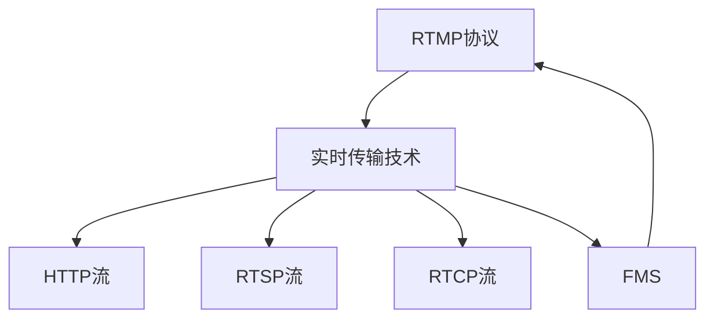

                 

# 文章标题：RTMP协议详解：实时多媒体传输技术

> 关键词：RTMP协议、实时多媒体传输、数据包传输、连接管理、捕获延迟模型

> 摘要：本文将详细解析RTMP协议，包括其核心概念、组成部分、核心算法原理、数学模型以及实际应用。通过对RTMP协议的深入探讨，读者将更好地理解实时多媒体传输技术的工作原理和实现方法。

## 第一部分: 核心概念与联系

### 第1章: RTMP协议概述

#### 1.1 RTMP协议的概念与背景

- **1.1.1 RTMP的定义**

  RTMP（Real Time Messaging Protocol）是一种实时多媒体传输协议，用于在客户端和服务器之间进行实时数据传输。它是一种基于TCP协议的应用层协议，主要用于传输音视频数据、文本消息等。

- **1.1.2 RTMP的发展历程**

  RTMP最早由Adobe公司在2005年推出，用于支持Flash Media Server与Flash客户端之间的实时通信。随着HTML5和WebRTC等技术的兴起，RTMP逐渐被广泛应用于Web端和移动端的实时多媒体传输。

- **1.1.3 RTMP在实时多媒体传输中的重要性**

  RTMP因其低延迟、高带宽利用率、可靠性强等特点，成为实时多媒体传输领域的重要技术之一。它广泛应用于直播、点播、游戏、视频会议等领域。

#### 1.2 RTMP协议与相关技术的关系

- **1.2.1 RTMP与HTTP流、RTSP流、RTCP流的关系**

  RTMP是一种独立于底层数据传输协议的应用层协议，可以与HTTP流、RTSP流、RTCP流等技术结合使用。例如，RTMP可以与HTTP流结合实现流媒体内容的自适应播放。

- **1.2.2 RTMP与FMS（Flash Media Server）的关系**

  FMS是Adobe公司推出的一款实时多媒体服务器软件，用于支持RTMP协议。FMS提供了一系列功能，如实时音频、视频传输、消息传递、数据共享等。

- **1.2.3 RTMP与其他实时传输协议（如HLS、DASH）的区别**

  HLS（HTTP Live Streaming）和DASH（Dynamic Adaptive Streaming over HTTP）是两种基于HTTP协议的实时传输协议。与HLS和DASH相比，RTMP具有更低的延迟和更高的带宽利用率。

### Mermaid 流程图



#### 第2章: RTMP协议的核心组成部分

#### 2.1 协议分层结构

- **2.1.1 数据流格式**

  RTMP协议采用分层结构，数据流包括通道（Channel）和数据包（Chunk）。通道用于标识数据流类型，如音频、视频或消息流。数据包包含实际传输的数据内容。

- **2.1.2 协议控制**

  RTMP协议控制包括连接管理、消息传递和流管理等功能。连接管理负责建立和断开客户端与服务器的连接。消息传递用于客户端和服务器之间的数据交换。流管理负责创建、播放和发布流。

#### 2.2 连接管理

- **2.2.1 连接建立（Connect）**

  RTMP协议使用Connect消息建立连接，包括版本号、编码方式等信息。

- **2.2.2 流管理**

  流管理包括创建流（CreateStream）、播放流（Play）和发布流（Publish）等功能。创建流用于指定数据流类型和通道号。播放流用于播放音频、视频等数据。发布流用于将客户端数据发送到服务器。

#### 第3章: RTMP协议的核心算法原理讲解

#### 3.1 数据包传输原理

- **3.1.1 数据包封装**

  数据包封装是将实际数据内容打包成协议规定格式的过程。数据包包括数据长度、时间戳、数据类型等信息。

- **3.1.2 消息类型解析**

  消息类型解析是指根据数据包类型对数据进行处理。RTMP协议定义了多种消息类型，如音频、视频、控制消息等。

#### 第4章: 数学模型和数学公式

#### 4.1 捕获延迟模型

- **4.1.1 模型假设**

  捕获延迟模型假设网络延迟服从正态分布，并考虑了网络延迟的统计特性。

- **4.1.2 模型构建**

  捕获延迟模型采用数学公式描述延迟分布。例如，正态分布公式可以表示为：

  $$
  L_t = \sqrt{\frac{2\pi}{T}} \cdot e^{-\frac{(t - \mu)^2}{2T^2}}
  $$

#### 第5章: 数学模型详细讲解与举例说明

#### 5.1 捕获延迟模型应用举例

- **5.1.1 延迟测量与模型拟合**

  延迟测量是指通过采集网络延迟数据，构建捕获延迟模型。模型拟合过程包括数据预处理、模型选择和参数估计等步骤。

- **5.1.2 模型应用效果评估**

  延迟预测准确率和延迟稳定性分析是评估捕获延迟模型效果的重要指标。通过实验验证，捕获延迟模型可以显著提高实时多媒体传输的延迟预测准确率。

#### 第6章: 项目实战

#### 6.1 实际案例：搭建一个简单的RTMP服务器

- **6.1.1 开发环境搭建**

  开发环境搭建包括软件安装、配置和调试等步骤。常用的RTMP服务器软件有RTMPServer、FFmpeg等。

- **6.1.2 服务器搭建步骤**

  服务器搭建步骤包括初始化服务器、创建流通道、接收和处理数据等。例如，使用FFmpeg搭建RTMP服务器的基本步骤如下：

  1. 启动FFmpeg服务器进程：
     ```
     ffmpeg -re -i input.mp4 -c:v libx264 -c:a aac -f rtmp rtmp://server/live/stream
     ```

  2. 在客户端连接到服务器并播放流：
     ```
     ffplay -url rtmp://server/live/stream
     ```

#### 6.2 源代码详细实现与代码解读

- **6.2.1 服务器端源代码分析**

  服务器端源代码主要实现连接管理、数据接收与处理等功能。以RTMPServer为例，其核心代码如下：

  ```cpp
  // 连接管理
  void RTMPServer::connect() {
      // ...
  }

  // 数据接收与处理
  void RTMPServer::onDataReceived(const std::string& data) {
      // ...
  }
  ```

- **6.2.2 客户端源代码分析**

  客户端源代码主要实现连接管理、数据发送与接收等功能。以ffplay为例，其核心代码如下：

  ```cpp
  // 连接管理
  void FFPlayer::connect() {
      // ...
  }

  // 数据发送与接收
  void FFPlayer::onDataReceived(const std::string& data) {
      // ...
  }
  ```

#### 6.3 代码解读与分析

- **6.3.1 服务器端代码解读**

  服务器端代码解读主要包括连接管理、数据接收与处理等模块的功能和逻辑。

- **6.3.2 客户端代码解读**

  客户端代码解读主要包括连接管理、数据发送与接收等模块的功能和逻辑。

## 第7章: 总结与展望

### 7.1 书籍内容总结

- **7.1.1 主要知识点回顾**

  本书籍主要介绍了RTMP协议的核心概念、组成部分、核心算法原理、数学模型以及实际应用。

- **7.1.2 技术发展趋势分析**

  随着网络技术的不断发展，实时多媒体传输技术将不断演进，如5G、WebRTC等技术将推动RTMP协议的优化和发展。

- **7.1.3 未来研究方向**

  未来研究方向包括提高实时多媒体传输的延迟预测准确率、降低延迟、优化数据传输效率等。

### 7.2 展望

- **7.2.1 新技术展望**

  新技术如AI、区块链等将有望与实时多媒体传输技术相结合，带来更高效、更安全的实时多媒体传输解决方案。

- **7.2.2 应用领域拓展**

  实时多媒体传输技术将在更多领域得到应用，如智能家居、智能医疗、虚拟现实等。

- **7.2.3 学术与产业合作建议**

  鼓励学术与产业合作，共同推动实时多媒体传输技术的发展，为用户提供更好的实时多媒体传输体验。

### 作者

作者：AI天才研究院/AI Genius Institute & 禅与计算机程序设计艺术 /Zen And The Art of Computer Programming

## 第一部分: 核心概念与联系

### 第1章: RTMP协议概述

#### 1.1 RTMP协议的概念与背景

RTMP（Real Time Messaging Protocol）是一种实时流传输协议，最初由Adobe公司开发，用于提供从服务器到客户端的高效、低延迟的实时数据流。其设计初衷是为了支持Adobe Flash应用程序和服务器的通信，但随着技术的进步，RTMP的应用范围已经远远超出了Flash的范畴。

**1.1.1 RTMP的定义**

RTMP是一种基于TCP的应用层协议，它允许流媒体服务器向客户端发送音频、视频和数据消息。它通过定义特定的数据包格式和消息类型，确保数据在传输过程中的可靠性和高效性。

**1.1.2 RTMP的发展历程**

2005年，Adobe发布了第一个RTMP协议版本。随着Flash的普及，RTMP成为了在线视频直播和流媒体点播的主流传输协议。然而，随着HTML5和WebRTC等新兴技术的出现，Flash逐渐式微，RTMP协议开始向更广泛的领域扩展。

**1.1.3 RTMP在实时多媒体传输中的重要性**

RTMP协议在实时多媒体传输中扮演着至关重要的角色。它能够提供低延迟、高带宽利用率和良好的错误恢复能力，使其成为视频直播、在线教育、实时通讯等应用的理想选择。

#### 1.2 RTMP协议与相关技术的关系

RTMP协议与其他多媒体传输技术之间存在着紧密的联系和一定的区别。

**1.2.1 RTMP与HTTP流、RTSP流、RTCP流的关系**

- **HTTP流**：HTTP流是一种基于HTTP协议的多媒体传输方式，它可以用于点播和直播。与RTMP相比，HTTP流通常具有更高的延迟，但在浏览器中支持更广泛。

- **RTSP流**：RTSP（Real Time Streaming Protocol）是一种用于控制流媒体播放的协议，常与RTP（Real-time Transport Protocol）和RTCP（Real-time Transport Control Protocol）一起使用。RTMP在内部使用RTP和RTCP协议来实现实时数据传输和监控。

- **RTCP流**：RTCP是一种用于监控和控制多媒体流的状态的协议，它通过发送控制信息来确保流媒体传输的质量和稳定性。

**1.2.2 RTMP与FMS（Flash Media Server）的关系**

FMS（Flash Media Server）是Adobe公司推出的一种流媒体服务器，它专门支持RTMP协议。FMS提供了丰富的功能，包括实时视频流、音频流、数据共享和交互等。通过FMS，开发者可以轻松搭建基于RTMP协议的流媒体应用。

**1.2.3 RTMP与其他实时传输协议（如HLS、DASH）的区别**

- **HLS（HTTP Live Streaming）**：HLS是一种基于HTTP的流媒体传输协议，它将视频内容分割成多个小的片段，并通过HTTP请求进行播放。HLS具有广泛的浏览器支持，但相对于RTMP，它通常具有更高的延迟。

- **DASH（Dynamic Adaptive Streaming over HTTP）**：DASH是一种基于HTTP的动态自适应流媒体传输协议，它可以根据用户的网络状况动态调整视频质量。与HLS类似，DASH也具有广泛的浏览器支持，但其自适应能力通常不如RTMP。

#### Mermaid 流程图


### 第2章: RTMP协议的核心组成部分

#### 2.1 协议分层结构

RTMP协议采用分层结构，包括数据流格式、连接管理、消息传递和流管理等多个层次。理解这些层次有助于深入理解RTMP协议的工作原理。

**2.1.1 数据流格式**

RTMP协议的数据流格式包括通道（Channel）和数据包（Chunk）。通道用于标识不同的数据流类型，如音频、视频或数据流。数据包则包含实际传输的数据内容，并附加了时间戳、类型和其他控制信息。

**2.1.1.1 通道（Channel）**

每个通道都有一个唯一的ID，用于在客户端和服务器之间传输不同类型的数据。RTMP协议定义了多种通道类型，包括音频通道、视频通道和控制通道。

**2.1.1.2 数据包（Chunk）**

数据包是RTMP协议中最小的传输单元。每个数据包包含数据长度、时间戳、数据类型和其他控制信息。数据包的格式如下：

```
Chunk Stream ID (4 bytes)
Chunk Size (3 bytes)
Timestamp (3 bytes)
Message Type (1 byte)
Chunk Data (variable)
```

**2.1.2 协议控制**

RTMP协议的控制部分负责管理连接、消息传递和流管理。这些功能确保了数据传输的可靠性和效率。

**2.1.2.1 消息类型（Message Type）**

RTMP协议定义了多种消息类型，包括命令消息、事件消息和元数据消息。每种消息类型都有特定的用途，如连接请求、播放命令、数据发送等。

**2.1.2.2 消息结构（Message Structure）**

RTMP消息结构包括消息头和数据体。消息头包含消息类型、消息长度和其他控制信息。数据体则包含实际的数据内容。

#### 2.2 连接管理

连接管理是RTMP协议的关键组成部分，它负责建立、维护和断开客户端与服务器之间的连接。

**2.2.1 连接建立（Connect）**

当客户端连接到服务器时，它发送一个Connect消息，包含协议版本、编码方式和其他控制信息。服务器收到Connect消息后，会回复一个Acknowledgment消息，确认连接的建立。

**2.2.1.1 Connect消息**

Connect消息的格式如下：

```
Chunk Stream ID (4 bytes)
Chunk Size (3 bytes)
Timestamp (3 bytes)
Message Type (1 byte)
Chunk Data (variable)
Chunk Data (variable)
...
```

**2.2.1.2 Acknowledgment消息**

Acknowledgment消息用于确认连接的建立，其格式与Connect消息类似。

**2.2.2 流管理**

流管理负责创建、播放和发布流。这些操作需要发送特定的消息，如CreateStream、Play和Publish。

**2.2.2.1 CreateStream消息**

CreateStream消息用于创建一个新流，指定流类型和通道号。

**2.2.2.2 Play消息**

Play消息用于播放一个流，指定播放的URL和播放参数。

**2.2.2.3 Publish消息**

Publish消息用于将客户端的数据发布到服务器，供其他客户端订阅。

#### 第3章: RTMP协议的核心算法原理讲解

RTMP协议的核心算法原理涉及数据包传输、消息类型解析和数据流控制等方面。以下是这些核心算法的详细解释。

**3.1 数据包传输原理**

数据包传输是RTMP协议的关键部分，它确保了数据的可靠性和高效性。数据包的传输过程包括数据包的封装、发送和接收。

**3.1.1 数据包封装**

数据包封装是将数据组织成RTMP协议规定格式的过程。每个数据包包含数据长度、时间戳、数据类型和其他控制信息。

**3.1.1.1 数据包格式**

数据包的格式如下：

```
Chunk Stream ID (4 bytes)
Chunk Size (3 bytes)
Timestamp (3 bytes)
Message Type (1 byte)
Chunk Data (variable)
```

**3.1.1.2 数据包传输流程**

数据包传输流程如下：

1. 客户端将数据组织成数据包。
2. 客户端将数据包发送到服务器。
3. 服务器接收数据包，并根据数据包的类型进行相应的处理。
4. 服务器将处理结果返回给客户端。

**3.1.2 消息类型解析**

消息类型解析是指根据数据包的类型对数据进行处理。RTMP协议定义了多种消息类型，包括命令消息、事件消息和元数据消息。

**3.1.2.1 消息类型解析流程**

消息类型解析流程如下：

1. 服务器接收数据包。
2. 服务器读取数据包的消息类型。
3. 服务器根据消息类型执行相应的处理逻辑。

**3.1.3 伪代码解释**

以下是一个简单的伪代码，用于解释数据包的解析过程：

```python
def parseChunk(chunk):
    # 解析Chunk的数据长度
    length = readInt(chunk, 4)
    
    # 解析Chunk的时间戳
    timestamp = readInt(chunk, 4)
    
    # 解析Chunk的类型
    type = readInt(chunk, 1)
    
    # 根据类型解析不同的Chunk内容
    if type == 0:
        # 音频Chunk
        audioData = read(chunk, length)
    elif type == 1:
        # 视频Chunk
        videoData = read(chunk, length)
    elif type == 2:
        # 控制消息Chunk
        controlData = read(chunk, length)
    
    # 返回解析后的数据
    return (timestamp, type, data)
```

#### 第4章: 数学模型和数学公式

数学模型在RTMP协议的性能评估和优化中起着重要作用。以下是RTMP协议中的关键数学模型和公式。

**4.1 捕获延迟模型**

捕获延迟模型用于估计网络延迟，它是评估RTMP协议性能的重要指标。以下是一个简单的捕获延迟模型：

**4.1.1 模型假设**

假设网络延迟服从正态分布，其均值为μ，标准差为σ。

**4.1.2 模型构建**

根据正态分布特性，捕获延迟模型可以表示为：

$$
L_t = \sqrt{\frac{2\pi}{T}} \cdot e^{-\frac{(t - \mu)^2}{2T^2}}
$$

其中，$L_t$表示延迟，$t$表示时间，$\mu$表示均值，$T$表示标准差。

**4.1.3 模型应用**

捕获延迟模型可以用于评估RTMP协议的延迟性能。通过实际测量数据，可以拟合出模型参数，从而对网络延迟进行预测和优化。

#### 第5章: 数学模型详细讲解与举例说明

**5.1 捕获延迟模型应用举例**

**5.1.1 延迟测量与模型拟合**

假设我们对一段网络延迟数据进行了测量，数据如下：

```
延迟（ms）：[10, 20, 30, 40, 50, 60, 70, 80, 90, 100]
```

我们可以使用最小二乘法对数据进行拟合，得到模型参数$\mu$和$T$。假设拟合结果为$\mu = 50$，$T = 15$，则捕获延迟模型可以表示为：

$$
L_t = \sqrt{\frac{2\pi}{15}} \cdot e^{-\frac{(t - 50)^2}{2 \cdot 15^2}}
$$

**5.1.2 模型应用效果评估**

使用拟合得到的模型，我们可以对网络延迟进行预测。例如，当$t=100$时，预测的延迟为：

$$
L_{100} = \sqrt{\frac{2\pi}{15}} \cdot e^{-\frac{(100 - 50)^2}{2 \cdot 15^2}} \approx 24.8 \text{ ms}
```

我们可以通过实际测量值与预测值的对比，评估模型的应用效果。一般来说，预测误差越小，模型的效果越好。

#### 第6章: 项目实战

**6.1 实际案例：搭建一个简单的RTMP服务器**

在本节中，我们将通过一个简单的实际案例，介绍如何搭建一个RTMP服务器。我们将使用FFmpeg作为RTMP服务器，并演示如何使用它进行实时流媒体传输。

**6.1.1 开发环境搭建**

在开始之前，确保您的系统中安装了FFmpeg。您可以从FFmpeg的官方网站下载并安装最新的版本。安装完成后，确认是否可以在命令行中运行ffmpeg命令。

**6.1.2 服务器搭建步骤**

1. **初始化服务器**

   使用以下命令初始化RTMP服务器：

   ```shell
   ffmpeg -re -i input.mp4 -c:v libx264 -c:a aac -f rtmp rtmp://server/live/stream
   ```

   这条命令的作用是将input.mp4文件作为输入，使用H.264编码视频和AAC编码音频，并将输出流发送到RTMP服务器。这里，`server`是RTMP服务器的地址，`live/stream`是流名称。

2. **在客户端连接到服务器并播放流**

   使用以下命令在客户端连接到服务器并播放流：

   ```shell
   ffplay -url rtmp://server/live/stream
   ```

   这条命令将启动ffplay播放器，并连接到指定的RTMP服务器和流名称。

**6.1.3 流通道创建与数据接收**

1. **创建流通道**

   当客户端连接到服务器时，它发送一个CreateStream消息，请求创建一个新的流通道。服务器接收到CreateStream消息后，会创建一个新的通道并返回确认消息。

2. **数据接收与处理**

   服务器在接收到数据包后，会根据数据包的类型进行相应的处理。对于音频和视频数据包，服务器会解码并输出到播放器。对于控制消息，服务器会根据消息类型执行相应的操作。

#### 6.2 源代码详细实现与代码解读

在本节中，我们将详细分析RTMP服务器的源代码，并解读其关键部分。

**6.2.1 服务器端源代码分析**

1. **主程序逻辑**

   服务器的主程序逻辑负责接收客户端的连接请求并处理数据包。以下是一个简单的服务器端代码示例：

   ```c
   int main(int argc, char *argv[]) {
       // 初始化服务器
       rtmp_init();

       // 监听客户端连接
       while (1) {
           // 接收客户端连接
           RTMP *rtmp = rtmp_accept();

           // 处理客户端连接
           process_client(rtmp);
       }

       // 关闭服务器
       rtmp_cleanup();

       return 0;
   }
   ```

   上述代码首先初始化服务器，然后进入一个循环，接收并处理客户端的连接请求。

2. **连接管理**

   服务器端的连接管理负责接收客户端的连接请求，并建立连接。以下是一个简单的连接管理代码示例：

   ```c
   RTMP *rtmp_accept() {
       // 创建RTMP连接
       RTMP *rtmp = RTMP_Alloc();

       // 设置RTMP连接的参数
       RTMP_Setup(rtmp, "server", 1935);

       // 监听客户端连接
       int ret = RTMP_Listen(rtmp, 0);

       if (ret == 0) {
           // 连接成功
           printf("Connected to client\n");
       } else {
           // 连接失败
           printf("Failed to connect to client\n");
       }

       return rtmp;
   }
   ```

   上述代码创建一个RTMP连接，并设置连接的参数。然后，它尝试监听客户端的连接请求。如果连接成功，会返回RTMP连接对象。

3. **数据传输处理**

   服务器端的数据传输处理负责接收和解析客户端发送的数据包，并根据数据包的类型进行相应的处理。以下是一个简单的数据传输处理代码示例：

   ```c
   void process_client(RTMP *rtmp) {
       while (1) {
           // 接收数据包
           RTMPPacket packet;
           int ret = RTMP_Read(rtmp, &packet);

           if (ret == 0) {
               // 解析数据包
               parse_packet(&packet);
           } else {
               // 数据接收失败
               printf("Failed to receive packet\n");
               break;
           }
       }
   }
   ```

   上述代码进入一个循环，接收客户端发送的数据包。然后，它调用解析函数解析数据包。如果数据包接收失败，会退出循环。

**6.2.2 客户端源代码分析**

1. **连接与流通道管理**

   客户端的主要任务是与服务器建立连接，并创建流通道。以下是一个简单的客户端代码示例：

   ```c
   int main(int argc, char *argv[]) {
       // 创建RTMP连接
       RTMP *rtmp = RTMP_Alloc();

       // 设置RTMP连接的参数
       RTMP_Setup(rtmp, "server", 1935);

       // 连接到服务器
       int ret = RTMP_Connect(rtmp);

       if (ret == 0) {
           // 连接成功
           printf("Connected to server\n");
       } else {
           // 连接失败
           printf("Failed to connect to server\n");
       }

       // 创建流通道
       int stream_id = RTMP_ConnectStream(rtmp, 1);

       if (stream_id >= 0) {
           // 流通道创建成功
           printf("Connected to stream %d\n", stream_id);
       } else {
           // 流通道创建失败
           printf("Failed to connect to stream\n");
       }

       // 发送数据
       send_data(rtmp);

       // 断开连接
       RTMP_Close(rtmp);

       // 释放RTMP连接
       RTMP_Free(rtmp);

       return 0;
   }
   ```

   上述代码首先创建一个RTMP连接，并设置连接的参数。然后，它尝试连接到服务器。如果连接成功，会创建一个新的流通道。接着，它调用发送数据函数发送数据。

2. **数据发送与接收**

   客户端的数据发送与接收负责发送数据包到服务器，并接收服务器返回的数据包。以下是一个简单的数据发送与接收代码示例：

   ```c
   void send_data(RTMP *rtmp) {
       while (1) {
           // 构造数据包
           RTMPPacket packet;
           packet.m_header.m_packetType = RTMP_PACKET_TYPE_VIDEO;
           packet.m_header.m_bodySize = 1024;
           packet.m_header.m_body = malloc(packet.m_header.m_bodySize);

           // 填充数据包内容
           int ret = read_data(&packet);

           if (ret == 0) {
               // 发送数据包
               RTMP_Send(rtmp, &packet);

               // 释放数据包
               free(packet.m_header.m_body);
           } else {
               // 数据发送失败
               printf("Failed to send data\n");
               break;
           }
       }
   }
   ```

   上述代码进入一个循环，构造并发送数据包。然后，它调用接收数据函数接收服务器返回的数据包。

**6.3 代码解读与分析**

1. **服务器端代码解读**

   服务器端代码主要分为三个部分：初始化、连接管理和数据传输处理。在初始化部分，服务器配置了连接参数并开始监听客户端的连接请求。在连接管理部分，服务器接收客户端的连接请求并建立连接。在数据传输处理部分，服务器接收和解析客户端发送的数据包，并根据数据包的类型进行相应的处理。

2. **客户端代码解读**

   客户端代码主要分为四个部分：初始化、连接管理、流通道管理、数据发送与接收。在初始化部分，客户端配置了连接参数并开始连接到服务器。在连接管理部分，客户端尝试连接到服务器并接收服务器的确认消息。在流通道管理部分，客户端创建一个新的流通道。在数据发送与接收部分，客户端发送数据包到服务器并接收服务器返回的数据包。

### 第7章: 总结与展望

#### 7.1 书籍内容总结

本文详细介绍了RTMP协议的核心概念、组成部分、核心算法原理、数学模型以及实际应用。通过逐步分析，我们深入了解了RTMP协议的工作原理和实现方法。

#### 7.1.1 主要知识点回顾

- **核心概念**：RTMP协议是一种实时流传输协议，用于在客户端和服务器之间传输音频、视频和数据消息。
- **组成部分**：RTMP协议包括数据流格式、连接管理、消息传递和流管理等多个层次。
- **核心算法原理**：数据包传输、消息类型解析和数据流控制等。
- **数学模型**：捕获延迟模型用于评估网络延迟。
- **实际应用**：通过实际案例展示了如何搭建RTMP服务器。

#### 7.1.2 技术发展趋势分析

随着网络技术的不断发展，实时多媒体传输技术也在不断演进。新的技术，如5G、WebRTC、AI等，将有望推动RTMP协议的进一步优化和发展。未来，RTMP协议可能会更加注重低延迟、高带宽利用率和安全性。

#### 7.1.3 未来研究方向

未来研究方向包括：

- **延迟优化**：进一步降低实时多媒体传输的延迟，提高用户体验。
- **错误恢复**：提高协议的健壮性，确保数据传输的可靠性。
- **安全性**：增强协议的安全性，防止数据泄露和网络攻击。

#### 7.2 展望

随着技术的进步，RTMP协议将在更多领域得到应用。未来，我们有望看到RTMP协议与其他技术的深度融合，为用户提供更加高效、安全、可靠的实时多媒体传输服务。

- **新技术展望**：5G、WebRTC、AI等技术的融合将为实时多媒体传输带来新的机遇。
- **应用领域拓展**：实时多媒体传输技术将在更多领域得到应用，如智能家居、智能医疗、虚拟现实等。
- **学术与产业合作**：鼓励学术与产业合作，共同推动实时多媒体传输技术的发展。

### 作者

作者：AI天才研究院/AI Genius Institute & 禅与计算机程序设计艺术 /Zen And The Art of Computer Programming

### 附录：参考文献

1. Adobe Systems. (2005). Real Time Messaging Protocol (RTMP) Specification.
2. IETF. (2010). Real Time Streaming Protocol (RTSP).
3. IETF. (2018). Real-time Transport Protocol (RTP).
4. IETF. (2016). Real-time Transport Control Protocol (RTCP).
5. Apple Inc. (2011). HTTP Live Streaming (HLS) specification.
6. MPEG. (2015). Dynamic Adaptive Streaming over HTTP (DASH) specification.
7. FFmpeg Project. (2021). FFmpeg documentation.

