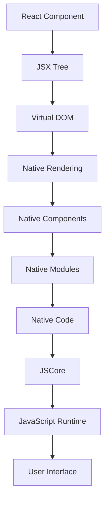

                 

### 文章标题 <此处是文章标题>

《React Native 跨平台开发：高效的移动应用》

### 文章关键词

React Native，跨平台开发，移动应用，前端开发，JavaScript

### 文章摘要

本文将深入探讨React Native跨平台开发的技术原理和实践方法。首先，我们将回顾React Native的历史与发展，分析其核心优势以及与原生开发的对比。接着，我们将介绍React Native的开发环境搭建，包括工具安装、项目创建与运行，以及Android和iOS开发环境的配置。随后，我们将深入讲解React Native的基础语法，包括JSX语法、组件的定义与使用、状态与属性以及事件处理。在此基础上，我们将逐步介绍React Native组件开发，包括常用组件和高级组件的使用，以及动画与交互的实现。接着，我们将探讨React Native在跨平台开发实践中的优化技巧，包括性能优化、内存管理和调试与测试。随后，我们将通过实战项目展示React Native的开发流程，并分析项目中的难点与解决方案。最后，我们将展望React Native的未来趋势，探讨其在企业级应用中的发展。通过本文的阅读，读者将全面了解React Native的技术原理和应用实践，为未来的移动应用开发提供有力支持。

### 第一部分：React Native 基础

#### 第1章：React Native 简介

##### 1.1 React Native 的历史与发展

React Native作为Facebook于2015年发布的一款开源跨平台开发框架，自推出以来，一直受到广泛关注。React Native的出现，源于Facebook对移动端开发效率的迫切需求。在原生开发中，开发者需要为Android和iOS分别编写代码，这不仅增加了开发成本，也延长了开发周期。为了解决这个问题，Facebook借鉴了其前端框架React的精髓，将React的虚拟DOM思想引入到移动端开发，从而诞生了React Native。

React Native的发展历程可以分为几个重要阶段：

- **2015年：首次发布**：React Native在2015年的Facebook F8大会上首次亮相，并迅速吸引了大量开发者关注。
- **2016年：首个稳定版发布**：React Native在2016年发布了首个稳定版（0.4.0），标志着其正式进入生产环境。
- **2017年：React Native 0.5.0 发布**：这一版本增加了对TypeScript的支持，提高了开发效率。
- **2018年：React Native 0.55.0 发布**：这一版本引入了全新的生命周期方法，改进了组件架构。
- **2019年：React Native 0.57.0 发布**：这一版本开始支持Swift和Kotlin，进一步扩展了其应用范围。
- **2020年：React Native 0.59.0 发布**：这一版本引入了更多的新特性和改进，如更好的性能、更好的类型支持和更好的开发工具。

随着React Native的不断发展和完善，越来越多的企业和开发者选择使用它进行移动应用开发。例如，知名的应用如Facebook、Instagram、Skype、Airbnb等都采用了React Native进行开发。这些成功案例不仅证明了React Native的实用性，也为其在移动开发领域奠定了坚实的基础。

##### 1.2 React Native 的核心优势

React Native之所以能够在短时间内获得如此广泛的关注，离不开其独特的核心优势。以下是React Native的几个主要优势：

1. **跨平台开发**：React Native的最大优势在于可以实现一次编写，多端运行。开发者只需使用JavaScript和React的语法，即可同时为Android和iOS平台开发应用，大大提高了开发效率，降低了开发成本。
   
2. **丰富的组件库**：React Native提供了丰富的组件库，包括各种常用的UI组件、布局组件和视图组件。开发者可以轻松地选择合适的组件，快速搭建应用界面。

3. **热更新**：React Native支持热更新，这意味着开发者可以在不重启应用的情况下，实时更新代码。这一特性极大地提高了开发效率和用户体验。

4. **高性能**：React Native使用原生组件渲染，相较于传统的Web应用，其性能表现更加优异。此外，React Native还引入了JIT（即时编译）技术，进一步提升了应用性能。

5. **强大的社区支持**：React Native拥有庞大的开发者社区，不断有新的库和框架涌现，为开发者提供了丰富的资源和技术支持。

##### 1.3 React Native 与原生开发的对比

React Native与原生开发在多个方面存在显著差异。以下是它们的主要对比：

1. **开发语言**：React Native使用JavaScript进行开发，而原生开发则需要分别使用Java（Android）和Swift（iOS）。JavaScript具有更简单的语法和更强的灵活性，使得开发者可以更快地上手。

2. **开发效率**：React Native通过组件化和虚拟DOM技术，显著提高了开发效率。开发者可以一次编写，多端运行，避免了原生开发中重复的工作。而原生开发则需要分别编写Android和iOS的代码，开发周期更长。

3. **性能表现**：原生开发在性能上具有优势，因为其直接使用原生组件渲染。React Native虽然也使用原生组件，但通过虚拟DOM技术实现了高效的渲染。在实际应用中，React Native的性能已经足够优秀，能够满足大多数场景的需求。

4. **调试和测试**：React Native提供了丰富的调试和测试工具，如React Native Debugger和Jest。这些工具可以帮助开发者快速定位和修复问题。相比之下，原生开发的调试和测试相对复杂。

5. **社区支持**：React Native拥有庞大的开发者社区，不断有新的库和框架涌现，为开发者提供了丰富的资源和技术支持。而原生开发的社区则相对分散，开发者需要更多地依赖官方文档和社区论坛。

##### 1.4 React Native 的应用场景

React Native的跨平台特性使其适用于多种应用场景。以下是React Native的一些主要应用场景：

1. **中小企业应用**：对于中小企业来说，React Native可以显著降低开发成本和开发周期。企业可以快速开发出功能丰富的移动应用，满足业务需求。

2. **内部应用**：内部应用通常需求较为简单，但需要快速上线。React Native的热更新特性使其非常适合开发内部应用，开发者可以随时更新代码，提高工作效率。

3. **电商平台**：电商平台需要快速响应用户需求，React Native可以满足这一需求。开发者可以实时更新商品信息和用户界面，提升用户体验。

4. **社交应用**：社交应用通常具有复杂的界面和丰富的交互，React Native提供了丰富的组件库和动画库，可以满足社交应用的需求。

5. **金融应用**：金融应用对性能和安全性有较高要求，React Native通过虚拟DOM技术和原生组件渲染，可以提供良好的性能和安全性。

6. **教育应用**：教育应用通常需要提供丰富的多媒体内容和互动体验，React Native可以轻松实现这些功能。

总之，React Native以其跨平台、高效、高性能和强大的社区支持，成为了移动应用开发的重要选择。通过本文的介绍，读者可以全面了解React Native的优势和应用场景，为其未来的移动应用开发提供指导。

#### 第2章：React Native 开发环境搭建

##### 2.1 React Native 开发工具安装

要在本地搭建React Native开发环境，首先需要安装Node.js、Watchman和React Native CLI。以下是详细的安装步骤：

1. **安装 Node.js**：

   - 访问 [Node.js 官网](https://nodejs.org/) 下载最新版本的 Node.js。
   - 双击下载的安装程序，按照提示完成安装。
   - 安装完成后，打开命令行工具（如Windows的PowerShell或macOS的Terminal），输入以下命令验证安装是否成功：
     ```sh
     node -v
     npm -v
     ```
     如果返回正确的版本号，说明Node.js安装成功。

2. **安装 Watchman**：

   Watchman是一个由Facebook开发的开源工具，用于监视文件系统变化。在React Native项目中，Watchman有助于提高构建和调试的效率。
   
   - 在命令行中运行以下命令安装 Watchman：
     ```sh
     npm install -g watchman
     ```
   - 安装完成后，输入 `watchman version` 命令检查版本号，确认安装成功。

3. **安装 React Native CLI**：

   React Native CLI 是用于创建、启动和运行React Native项目的核心工具。在命令行中运行以下命令安装 React Native CLI：
   ```sh
   npm install -g react-native-cli
   ```
   安装完成后，可以通过 `react-native --version` 命令检查版本号，确认安装成功。

##### 2.2 React Native 项目创建与运行

安装完开发工具后，我们可以开始创建和运行一个React Native项目。以下是详细的步骤：

1. **创建项目**：

   - 打开命令行工具，进入想要创建项目的目录。
   - 运行以下命令创建一个新项目：
     ```sh
     react-native init ProjectName
     ```
     其中 `ProjectName` 是你给项目的命名。执行命令后，React Native CLI 将自动下载依赖并生成项目文件。

2. **启动模拟器**：

   - 在项目目录中，运行以下命令启动 Android 模拟器：
     ```sh
     react-native run-android
     ```
   - 对于 iOS，运行以下命令启动 iOS 模拟器：
     ```sh
     react-native run-ios
     ```

3. **运行项目**：

   - 启动模拟器后，项目将自动编译并运行。在模拟器中，你可以看到项目的主屏幕。

##### 2.3 Android 和 iOS 开发环境的配置

在创建和运行React Native项目后，还需要对Android和iOS的开发环境进行配置。以下是配置的详细步骤：

1. **Android 环境配置**：

   - 安装 Android Studio：访问 [Android Studio 官网](https://developer.android.com/studio) 下载并安装 Android Studio。
   - 打开 Android Studio，创建一个新的 Android 项目，选择 "Import project from an existing external code base"。
   - 在弹出的对话框中，选择 React Native 项目所在的目录，并按照提示完成项目导入。

2. **配置 Android SDK**：

   - 在 Android Studio 中，打开 "Android SDK Manager"，安装所需的 Android SDK Platform 和 Android SDK Tools。
   - 安装完成后，确保在 "Project Structure" 中配置正确的 SDK。

3. **配置 Android 虚拟设备**：

   - 在 Android Studio 中，选择 "Tools" > "AVD Manager"，创建一个新的 Android 虚拟设备。
   - 选择合适的 Android 版本和硬件配置，然后点击 "Create AVD"。

4. **iOS 环境配置**：

   - 安装 Xcode：从 [Apple Developer 官网](https://developer.apple.com/xcode/) 下载并安装 Xcode。
   - 打开 Xcode，打开 "Window" > "Devices" 查看已连接的 iOS 设备或模拟器。

5. **配置 iOS 项目**：

   - 在项目目录中，打开 iOS 项目文件夹，双击 `.xcodeproj` 文件打开 Xcode。
   - 在 Xcode 中，配置项目的签名和部署目标。

通过以上步骤，你就可以在本地搭建一个完整的React Native开发环境，并创建和运行你的第一个React Native项目。

#### 第3章：React Native 基础语法

##### 3.1 JSX 语法介绍

React Native 使用 JSX（JavaScript XML）语法来定义组件的结构和样式。JSX 允许开发者使用类似 HTML 的标签语法来编写组件，使得代码更具可读性。以下是一个简单的 JSX 例子：

```jsx
import React from 'react';
import { View, Text, StyleSheet } from 'react-native';

const App = () => {
  return (
    <View style={styles.container}>
      <Text style={styles.welcome}>Welcome to React Native!</Text>
    </View>
  );
};

const styles = StyleSheet.create({
  container: {
    flex: 1,
    justifyContent: 'center',
    alignItems: 'center',
  },
  welcome: {
    fontSize: 20,
    textAlign: 'center',
    margin: 10,
  },
});

export default App;
```

在这个例子中，`<View>` 和 `<Text>` 是 JSX 标签，分别表示 React Native 的 View 和 Text 组件。JSX 语法使得组件的定义和渲染更加直观，同时也便于与 CSS 样式进行结合。

##### 3.2 组件的定义与使用

在 React Native 中，组件是构成应用的基本单元。组件可以通过类或函数两种方式定义。以下是一个使用类定义的组件示例：

```jsx
import React from 'react';
import { View, Text, StyleSheet } from 'react-native';

class WelcomeScreen extends React.Component {
  render() {
    return (
      <View style={styles.container}>
        <Text style={styles.welcome}>Welcome to React Native!</Text>
      </View>
    );
  }
}

const styles = StyleSheet.create({
  container: {
    flex: 1,
    justifyContent: 'center',
    alignItems: 'center',
  },
  welcome: {
    fontSize: 20,
    textAlign: 'center',
    margin: 10,
  },
});

export default WelcomeScreen;
```

在这个例子中，`WelcomeScreen` 是一个类组件，继承了 `React.Component`。`render` 方法返回一个 JSX 结构，表示组件的 UI。

另一种定义组件的方式是使用函数。以下是一个使用函数定义的组件示例：

```jsx
import React from 'react';
import { View, Text, StyleSheet } from 'react-native';

function WelcomeScreen() {
  return (
    <View style={styles.container}>
      <Text style={styles.welcome}>Welcome to React Native!</Text>
    </View>
  );
}

const styles = StyleSheet.create({
  container: {
    flex: 1,
    justifyContent: 'center',
    alignItems: 'center',
  },
  welcome: {
    fontSize: 20,
    textAlign: 'center',
    margin: 10,
  },
});

export default WelcomeScreen;
```

在这个例子中，`WelcomeScreen` 是一个函数组件，使用函数的方式返回 JSX 结构。虽然函数组件在性能上略优于类组件，但在复杂组件中，类组件仍然具有更大的优势。

##### 3.3 状态（State）与属性（Props）

在 React Native 中，状态（State）和属性（Props）是组件数据传递的重要手段。状态（State）是组件内部可变的数据，属性（Props）是组件外部传递的数据。

**状态（State）**

状态是组件内部维护的数据，可以通过 `this.state` 访问。状态在组件生命周期中的变化可以触发组件的重新渲染。以下是一个使用状态管理文本内容的示例：

```jsx
import React, { useState } from 'react';
import { View, Text, StyleSheet, Button } from 'react-native';

function Counter() {
  const [count, setCount] = useState(0);

  return (
    <View style={styles.container}>
      <Text style={styles.count}>Count: {count}</Text>
      <Button title="Increase" onPress={() => setCount(count + 1)} />
    </View>
  );
}

const styles = StyleSheet.create({
  container: {
    flex: 1,
    justifyContent: 'center',
    alignItems: 'center',
  },
  count: {
    fontSize: 24,
    margin: 10,
  },
});

export default Counter;
```

在这个例子中，`Counter` 组件使用 `useState` 钩子初始化状态 `count`，并通过 `setCount` 函数更新状态。每次点击按钮，状态 `count` 的值将增加1，并触发组件重新渲染。

**属性（Props）**

属性（Props）是组件外部传递的数据，通过 `props` 对象访问。属性主要用于组件间的数据传递。以下是一个使用属性传递文本内容的示例：

```jsx
import React from 'react';
import { View, Text, StyleSheet } from 'react-native';

function Greeting(props) {
  return (
    <View style={styles.container}>
      <Text style={styles.greeting}>Hello, {props.name}!</Text>
    </View>
  );
}

const styles = StyleSheet.create({
  container: {
    flex: 1,
    justifyContent: 'center',
    alignItems: 'center',
  },
  greeting: {
    fontSize: 24,
    margin: 10,
  },
});

export default Greeting;
```

在这个例子中，`Greeting` 组件接收一个名为 `name` 的属性，并在组件内部使用。通过这种方式，可以在父组件中传递数据给子组件。

##### 3.4 事件处理

事件处理是 React Native 中与用户交互的重要部分。React Native 提供了一组原生事件处理方法，如 `onClick`、`onPress`、`onLongPress` 等。以下是一个使用 `onPress` 事件处理按钮点击的示例：

```jsx
import React from 'react';
import { View, Text, StyleSheet, Button } from 'react-native';

function ButtonExample() {
  const handleClick = () => {
    alert('Button clicked!');
  };

  return (
    <View style={styles.container}>
      <Button title="Click Me" onPress={handleClick} />
    </View>
  );
}

const styles = StyleSheet.create({
  container: {
    flex: 1,
    justifyContent: 'center',
    alignItems: 'center',
  },
});

export default ButtonExample;
```

在这个例子中，`ButtonExample` 组件定义了一个 `handleClick` 函数，并在 `<Button>` 组件中通过 `onPress` 属性绑定该函数。当用户点击按钮时，将触发 `handleClick` 函数，并显示一个警告框。

总之，React Native 基础语法包括 JSX、组件定义、状态与属性以及事件处理。通过掌握这些基础语法，开发者可以快速搭建 React Native 应用，实现丰富的用户交互和功能。

#### 第4章：React Native 常用组件

在 React Native 开发中，常用组件的使用是构建应用程序的基础。这些组件提供了丰富的UI功能和布局选项，使得开发者能够快速创建美观且功能齐全的移动应用。本节将介绍一些常用的React Native组件，包括基础组件、布局组件、视图组件和文本输入组件，并详细说明它们的用法。

##### 4.1 基础组件（如 View、Text）

**View** 组件是 React Native 中的容器组件，用于组织和布局其他组件。它类似于 HTML 中的 `<div>`，可以包含任何其他组件。

```jsx
import React from 'react';
import { View, Text, StyleSheet } from 'react-native';

const App = () => {
  return (
    <View style={styles.container}>
      <Text style={styles.welcome}>Welcome to React Native!</Text>
    </View>
  );
};

const styles = StyleSheet.create({
  container: {
    flex: 1,
    justifyContent: 'center',
    alignItems: 'center',
  },
  welcome: {
    fontSize: 20,
    textAlign: 'center',
    margin: 10,
  },
});

export default App;
```

在这个例子中，`<View>` 组件作为容器，包含一个 `<Text>` 组件，用于显示欢迎信息。

**Text** 组件用于显示文本，支持样式和格式设置，如字体大小、颜色和行距。

```jsx
import React from 'react';
import { View, Text, StyleSheet } from 'react-native';

const App = () => {
  return (
    <View style={styles.container}>
      <Text style={styles.title}>Title</Text>
      <Text style={styles.normal}>Normal Text</Text>
      <Text style={styles.italic}>Italic Text</Text>
    </View>
  );
};

const styles = StyleSheet.create({
  container: {
    flex: 1,
    justifyContent: 'center',
    alignItems: 'center',
  },
  title: {
    fontSize: 24,
    fontWeight: 'bold',
    color: 'blue',
  },
  normal: {
    fontSize: 18,
  },
  italic: {
    fontStyle: 'italic',
  },
});

export default App;
```

在这个例子中，`<Text>` 组件展示了不同样式和格式设置。

##### 4.2 布局组件（如 Flexbox、ScrollView）

**Flexbox** 组件提供了灵活的布局能力，使得开发者可以轻松实现复杂的布局。它类似于 CSS 中的 Flexbox 布局。

```jsx
import React from 'react';
import { View, Text, StyleSheet, Dimensions } from 'react-native';

const App = () => {
  return (
    <View style={styles.container}>
      <View style={styles.row}>
        <View style={styles.flexOne}></View>
        <View style={styles.flexTwo}></View>
      </View>
    </View>
  );
};

const styles = StyleSheet.create({
  container: {
    flex: 1,
  },
  row: {
    flexDirection: 'row',
  },
  flexOne: {
    flex: 1,
    backgroundColor: 'red',
    height: 100,
  },
  flexTwo: {
    flex: 2,
    backgroundColor: 'green',
    height: 100,
  },
});

export default App;
```

在这个例子中，`<View>` 组件使用了 `flexDirection` 属性创建了一个水平布局，`<View>` 组件通过 `flex` 属性设置了宽度比例。

**ScrollView** 组件用于实现滚动视图，支持垂直和水平滚动，适合显示大量数据或内容。

```jsx
import React from 'react';
import { View, Text, ScrollView, StyleSheet } from 'react-native';

const App = () => {
  return (
    <ScrollView style={styles.container}>
      {Array(20).fill(null).map((_, i) => (
        <Text key={i} style={styles.item}>
          Item {i + 1}
        </Text>
      ))}
    </ScrollView>
  );
};

const styles = StyleSheet.create({
  container: {
    flex: 1,
  },
  item: {
    backgroundColor: '#f9c2ff',
    padding: 20,
    margin: 10,
  },
});

export default App;
```

在这个例子中，`<ScrollView>` 组件包含了20个 `<Text>` 组件，当内容超出屏幕高度时，可以垂直滚动。

##### 4.3 视图组件（如 Image、Video）

**Image** 组件用于显示图像，支持各种图像格式，如 JPEG、PNG 和 GIF。

```jsx
import React from 'react';
import { View, Image, StyleSheet } from 'react-native';

const App = () => {
  return (
    <View style={styles.container}>
      <Image source={require('./logo.png')} style={styles.logo} />
    </View>
  );
};

const styles = StyleSheet.create({
  container: {
    flex: 1,
    justifyContent: 'center',
    alignItems: 'center',
  },
  logo: {
    width: 200,
    height: 200,
  },
});

export default App;
```

在这个例子中，`<Image>` 组件显示了一个本地图像文件 `logo.png`。

**Video** 组件用于播放视频，支持多种视频格式，如 MP4。

```jsx
import React from 'react';
import { View, Video, StyleSheet } from 'react-native';

const App = () => {
  return (
    <View style={styles.container}>
      <Video
        source={{ uri: 'http://commondatastorage.googleapis.com/gtv-videos-bucket/sample/BigBuckBunny.mp4' }}
        style={styles.video}
      />
    </View>
  );
};

const styles = StyleSheet.create({
  container: {
    flex: 1,
    justifyContent: 'center',
    alignItems: 'center',
  },
  video: {
    width: 300,
    height: 300,
  },
});

export default App;
```

在这个例子中，`<Video>` 组件从网络 URL 加载并播放视频。

##### 4.4 文本输入组件（如 TextInput）

**TextInput** 组件用于实现文本输入框，支持各种文本输入属性，如 `placeholder`、`multiline` 和 `secureTextEntry`。

```jsx
import React from 'react';
import { View, TextInput, StyleSheet } from 'react-native';

const App = () => {
  const [text, setText] = React.useState('');

  return (
    <View style={styles.container}>
      <TextInput
        value={text}
        onChangeText={setText}
        placeholder="Enter text"
        style={styles.input}
        multiline
        secureTextEntry
      />
    </View>
  );
};

const styles = StyleSheet.create({
  container: {
    flex: 1,
    justifyContent: 'center',
    alignItems: 'center',
  },
  input: {
    width: 200,
    height: 50,
    borderWidth: 1,
    borderColor: 'gray',
    paddingHorizontal: 10,
  },
});

export default App;
```

在这个例子中，`<TextInput>` 组件实现了多行文本输入，并支持占位符、文本更改和密文输入。

通过学习和使用这些常用组件，开发者可以构建出功能丰富且美观的React Native应用程序。掌握这些组件的用法和特性，是进行React Native开发的基础。

#### 第5章：React Native 高级组件

在 React Native 中，高级组件为开发者提供了更多的功能性和灵活性，使得应用能够更好地适应复杂的需求。本节将介绍一些高级组件，包括布局组件、导航组件、状态管理和网络请求等，详细介绍这些组件的使用方法和特点。

##### 5.1 布局组件（如 DrawerLayout、TabBarIOS）

**DrawerLayout** 组件是一个强大的布局组件，用于创建侧滑菜单。它允许用户通过从屏幕边缘滑动来访问侧边栏，非常适合用于导航菜单。

```jsx
import React from 'react';
import { View, DrawerLayoutAndroid, Text, StyleSheet } from 'react-native';

const App = () => {
  return (
    <DrawerLayoutAndroid
      drawerWidth={300}
      drawerPosition={DrawerLayoutAndroid.positions.Left}
      renderNavigationView={() => (
        <View style={styles.navView}>
          <Text>Navigation View</Text>
        </View>
      )}
    >
      <View style={styles.container}>
        <Text>Main Content</Text>
      </View>
    </DrawerLayoutAndroid>
  );
};

const styles = StyleSheet.create({
  container: {
    flex: 1,
    justifyContent: 'center',
    alignItems: 'center',
  },
  navView: {
    flex: 1,
    justifyContent: 'center',
    alignItems: 'center',
  },
});

export default App;
```

在这个例子中，`<DrawerLayoutAndroid>` 组件创建了一个侧滑菜单，通过 `drawerWidth` 和 `drawerPosition` 属性设置了菜单的宽度和位置。

**TabBarIOS** 组件是一个用于创建标签页的组件，它允许用户在多个视图之间切换。

```jsx
import React from 'react';
import { View, TabBarIOS, Text, StyleSheet } from 'react-native';

const App = () => {
  return (
    <TabBarIOS>
      <TabBarIOS.Item
        title="Home"
        icon={{ uri: 'home.png' }}
        selected={true}
      >
        <View style={styles.container}>
          <Text>Main Content for Home</Text>
        </View>
      </TabBarIOS.Item>
      <TabBarIOS.Item
        title="Settings"
        icon={{ uri: 'settings.png' }}
      >
        <View style={styles.container}>
          <Text>Main Content for Settings</Text>
        </View>
      </TabBarIOS.Item>
    </TabBarIOS>
  );
};

const styles = StyleSheet.create({
  container: {
    flex: 1,
    justifyContent: 'center',
    alignItems: 'center',
  },
});

export default App;
```

在这个例子中，`<TabBarIOS>` 组件创建了两个标签页，通过 `title` 和 `icon` 属性设置了标签的文本和图标。

##### 5.2 导航组件（如 Navigator、React Navigation）

**Navigator** 是 React Native 的原生导航组件，用于在不同视图之间进行导航。

```jsx
import React from 'react';
import { Navigator, View, Text, StyleSheet } from 'react-native';

const HomeScreen = () => {
  return (
    <View style={styles.container}>
      <Text>Home Screen</Text>
    </View>
  );
};

const SettingsScreen = () => {
  return (
    <View style={styles.container}>
      <Text>Settings Screen</Text>
    </View>
  );
};

const App = () => {
  return (
    <Navigator
      initialRoute={{ name: 'Home' }}
      routes={[
        { name: 'Home', component: HomeScreen },
        { name: 'Settings', component: SettingsScreen },
      ]}
    />
  );
};

const styles = StyleSheet.create({
  container: {
    flex: 1,
    justifyContent: 'center',
    alignItems: 'center',
  },
});

export default App;
```

在这个例子中，`<Navigator>` 组件使用了 `initialRoute` 和 `routes` 属性设置了初始路由和导航路径。

**React Navigation** 是一个基于 React 的强大导航库，提供了更多的自定义选项和高级功能。

```jsx
import React from 'react';
import { NavigationContainer } from '@react-navigation/native';
import { createStackNavigator } from '@react-navigation/stack';
import HomeScreen from './HomeScreen';
import SettingsScreen from './SettingsScreen';

const Stack = createStackNavigator();

const App = () => {
  return (
    <NavigationContainer>
      <Stack.Navigator>
        <Stack.Screen name="Home" component={HomeScreen} />
        <Stack.Screen name="Settings" component={SettingsScreen} />
      </Stack.Navigator>
    </NavigationContainer>
  );
};

export default App;
```

在这个例子中，`<NavigationContainer>` 和 `<Stack.Navigator>` 分别提供了导航容器和堆栈导航器，通过 `<Stack.Screen>` 定义了导航路径。

##### 5.3 状态管理（如 Redux、MobX）

**Redux** 是一个流行的状态管理库，用于在React应用中集中管理状态。

```jsx
import React from 'react';
import { Provider } from 'react-redux';
import { createStore } from 'redux';
import App from './App';

const store = createStore(() => ({
  counter: 0,
}));

const AppWrapper = () => {
  return (
    <Provider store={store}>
      <App />
    </Provider>
  );
};

export default AppWrapper;
```

在这个例子中，`<Provider>` 组件提供了 Redux 的全局状态管理，通过 `createStore` 创建了Redux存储。

**MobX** 是另一个流行的状态管理库，通过自动化和简化的方式提供了强大的状态管理功能。

```jsx
import React from 'react';
import { observer } from 'mobx-react';
import App from './App';
import store from './store';

const AppWrapper = observer(() => {
  return <App store={store} />;
});

export default AppWrapper;
```

在这个例子中，`<observer>` 装饰器使得组件可以监听和更新状态。

##### 5.4 网络请求（如 Axios、fetch）

**Axios** 是一个用于发送HTTP请求的库，提供了简单而强大的接口。

```jsx
import React from 'react';
import axios from 'axios';

const App = () => {
  const fetchData = async () => {
    try {
      const response = await axios.get('https://api.example.com/data');
      console.log(response.data);
    } catch (error) {
      console.error(error);
    }
  };

  React.useEffect(() => {
    fetchData();
  }, []);

  return (
    <View style={styles.container}>
      <Text>Loading...</Text>
    </View>
  );
};

const styles = StyleSheet.create({
  container: {
    flex: 1,
    justifyContent: 'center',
    alignItems: 'center',
  },
});

export default App;
```

在这个例子中，`fetchData` 函数使用了 `axios` 发送 GET 请求，并在 `useEffect` 钩子中调用。

**fetch** API 提供了原生网络请求功能，简单易用。

```jsx
import React from 'react';

const App = () => {
  const fetchData = async () => {
    try {
      const response = await fetch('https://api.example.com/data');
      const data = await response.json();
      console.log(data);
    } catch (error) {
      console.error(error);
    }
  };

  React.useEffect(() => {
    fetchData();
  }, []);

  return (
    <View style={styles.container}>
      <Text>Loading...</Text>
    </View>
  );
};

const styles = StyleSheet.create({
  container: {
    flex: 1,
    justifyContent: 'center',
    alignItems: 'center',
  },
});

export default App;
```

在这个例子中，`fetchData` 函数使用了 `fetch` API 发送 GET 请求。

通过学习和使用这些高级组件，开发者可以构建出功能丰富、响应迅速且用户友好的React Native应用。掌握这些组件的使用方法和特点，是进行复杂React Native开发的关键。

#### 第6章：React Native 动画与交互

在 React Native 应用开发中，动画和交互是提升用户体验的重要手段。通过合理的动画效果和丰富的交互组件，可以使应用更加生动和直观。本章节将详细介绍 React Native 中的动画基础、常用的动画库以及交互组件的使用。

##### 6.1 React Native 动画基础

React Native 的动画基础主要依赖于 `Animated` 模块，该模块提供了用于创建动画的核心功能。使用 `Animated` 模块，开发者可以轻松地实现视图的平移、缩放、旋转等动画效果。

**基本的动画示例：**

```jsx
import React, { useState, useEffect } from 'react';
import { View, Text, StyleSheet, Animated } from 'react-native';

const App = () => {
  const [animation, setAnimation] = useState(new Animated.Value(0));

  useEffect(() => {
    Animated.timing(
      animation,
      {
        toValue: 1,
        duration: 2000,
        useNativeDriver: true,
      }
    ).start(() => setAnimation(new Animated.Value(0)));
  }, [animation]);

  return (
    <View style={styles.container}>
      <Animated.View style={{ ...styles.fly, transform: [{ scale: animation }] }} />
    </View>
  );
};

const styles = StyleSheet.create({
  container: {
    flex: 1,
    justifyContent: 'center',
    alignItems: 'center',
  },
  fly: {
    width: 100,
    height: 100,
    backgroundColor: 'blue',
  },
});

export default App;
```

在这个例子中，我们创建了一个简单的动画，通过 `Animated.timing` 函数实现视图的缩放效果。`useNativeDriver` 属性确保动画使用原生驱动，从而提高动画的性能。

##### 6.2 React Native 动画库（如 Animated、React Native Reanimated）

**Animated** 是 React Native 内置的动画库，提供了基础的动画功能。它通过动画值（animated values）来控制视图的动画效果。

**React Native Reanimated** 是一个更高级的动画库，提供了更多的动画功能和性能优化。它基于原生渲染机制，能够提供更平滑和高效的动画效果。

**React Native Reanimated 基础示例：**

```jsx
import React, { useRef, useEffect } from 'react';
import { View, Text, StyleSheet, useSharedValue, runOnJS } from 'react-native';
import Animated, { useAnimatedStyle, withSpring } from 'react-native-reanimated';

const App = () => {
  const animatedValue = useSharedValue(0);

  useEffect(() => {
    runOnJS(animatedValue)(withSpring(1, { duration: 2000 }));
  }, [animatedValue]);

  const animatedStyle = useAnimatedStyle(() => {
    return {
      transform: [{ scale: animatedValue.value }],
    };
  });

  return (
    <View style={styles.container}>
      <Animated.View style={[styles.fly, animatedStyle]} />
    </View>
  );
};

const styles = StyleSheet.create({
  container: {
    flex: 1,
    justifyContent: 'center',
    alignItems: 'center',
  },
  fly: {
    width: 100,
    height: 100,
    backgroundColor: 'blue',
  },
});

export default App;
```

在这个例子中，我们使用了 `useSharedValue` 和 `useAnimatedStyle` 函数来创建一个动画。`withSpring` 函数实现了平滑的动画效果。

##### 6.3 交互组件（如 TouchableOpacity、Swipeable）

React Native 提供了一系列交互组件，用于响应用户的操作，如点击、滑动等。

**TouchableOpacity** 组件是一个可点击的视图，当用户触摸时，视图会呈现按下效果。

```jsx
import React from 'react';
import { View, TouchableOpacity, Text, StyleSheet } from 'react-native';

const App = () => {
  const handleClick = () => {
    alert('Button pressed!');
  };

  return (
    <View style={styles.container}>
      <TouchableOpacity activeOpacity={0.5} onPress={handleClick}>
        <Text style={styles.buttonText}>Press Me</Text>
      </TouchableOpacity>
    </View>
  );
};

const styles = StyleSheet.create({
  container: {
    flex: 1,
    justifyContent: 'center',
    alignItems: 'center',
  },
  buttonText: {
    fontSize: 18,
    fontWeight: 'bold',
    color: 'white',
  },
  button: {
    backgroundColor: 'blue',
    paddingHorizontal: 20,
    paddingVertical: 10,
    borderRadius: 5,
  },
});

export default App;
```

在这个例子中，`<TouchableOpacity>` 组件实现了按钮的点击效果。

**Swipeable** 组件允许用户通过滑动来触发特定的操作，通常用于侧滑菜单。

```jsx
import React from 'react';
import { View, Swipeable, Text, StyleSheet } from 'react-native';

const App = () => {
  const renderRightActions = (close) => (
    <View style={styles.rightAction}>
      <Text style={styles.actionText}>Delete</Text>
    </View>
  );

  return (
    <View style={styles.container}>
      <Swipeable renderRightActions={renderRightActions}>
        <Text style={styles.item}>Swipe to delete</Text>
      </Swipeable>
    </View>
  );
};

const styles = StyleSheet.create({
  container: {
    flex: 1,
    justifyContent: 'center',
    alignItems: 'center',
  },
  item: {
    padding: 20,
    backgroundColor: 'blue',
    color: 'white',
  },
  rightAction: {
    justifyContent: 'center',
    alignItems: 'center',
    backgroundColor: 'red',
    flex: 1,
  },
  actionText: {
    color: 'white',
    fontWeight: 'bold',
  },
});

export default App;
```

在这个例子中，`<Swipeable>` 组件允许用户通过右滑来触发删除操作。

通过这些动画和交互组件，开发者可以创建出丰富多彩且富有动感的 React Native 应用。掌握这些组件的使用方法和特性，是提升用户体验的关键。

#### 第7章：React Native 优化技巧

在开发 React Native 应用时，优化性能、内存管理和调试与测试是确保应用稳定、高效和用户友好的关键。本章节将详细介绍这些优化技巧，包括性能优化、内存管理和调试与测试方法，帮助开发者提升应用的整体质量。

##### 7.1 性能优化

**1. 代码分割**

代码分割（Code Splitting）是一种将应用程序的代码拆分为多个块的技术，这样可以按需加载模块，减少初始加载时间。React Native 提供了 `React.lazy` 和 `Suspense` 两个关键字来支持代码分割。

```jsx
import React, { lazy, Suspense } from 'react';
import { View, Text } from 'react-native';

const DetailPage = lazy(() => import('./DetailPage'));

const App = () => {
  return (
    <View style={styles.container}>
      <Text>Welcome to the App!</Text>
      <Suspense fallback={<Text>Loading...</Text>}>
        <DetailPage />
      </Suspense>
    </View>
  );
};

const styles = StyleSheet.create({
  container: {
    flex: 1,
    justifyContent: 'center',
    alignItems: 'center',
  },
});

export default App;
```

在这个例子中，`DetailPage` 组件被懒加载，只有当用户需要访问该页面时才会加载，从而减少了初始加载时间。

**2. 懒加载（Lazy Loading）**

懒加载是一种仅在需要时才加载资源的策略，可以显著减少应用的初始加载时间。React Native 提供了 `FlatList` 和 `SectionList` 组件，支持数据懒加载。

```jsx
import React, { useState, useEffect } from 'react';
import { View, FlatList, Text, StyleSheet } from 'react-native';

const DataItem = ({ text }) => {
  return (
    <View style={styles.item}>
      <Text>{text}</Text>
    </View>
  );
};

const App = () => {
  const [data, setData] = useState([]);

  useEffect(() => {
    const fetchData = async () => {
      const fetchedData = await fetch('https://api.example.com/data');
      setData(await fetchedData.json());
    };
    fetchData();
  }, []);

  return (
    <View style={styles.container}>
      <FlatList
        data={data}
        renderItem={({ item }) => <DataItem text={item.name} />}
        keyExtractor={(item) => item.id}
      />
    </View>
  );
};

const styles = StyleSheet.create({
  container: {
    flex: 1,
    paddingTop: 22,
  },
  item: {
    padding: 10,
    fontSize: 18,
    height: 44,
  },
});

export default App;
```

在这个例子中，`FlatList` 组件实现了数据的懒加载，只有当用户滚动到特定位置时，才会加载更多的数据。

**3. 预渲染（Prerendering）**

预渲染是一种在用户访问之前预先加载和渲染页面的技术，可以提高首屏显示速度。React Native 提供了 `react-native-prerender` 库来支持预渲染。

```jsx
import React from 'react';
import { renderToStaticMarkup } from 'react-dom/server';
import { App } from './App';

const prerender = async () => {
  const markup = renderToStaticMarkup(<App />);
  // 将 markup 存储或发送到前端
};

prerender();
```

在这个例子中，预渲染函数 `prerender` 使用 `renderToStaticMarkup` 创建静态 HTML，可以在服务器端预先渲染应用。

##### 7.2 内存管理

**1. React Native 内存泄漏检测**

React Native 提供了内存泄漏检测工具，可以帮助开发者识别和修复内存泄漏。

```jsx
import React, { Component } from 'react';
import { View, Text } from 'react-native';

class App extends Component {
  componentWillUnmount() {
    // 清理可能导致内存泄漏的资源
  }

  render() {
    return (
      <View style={styles.container}>
        <Text>Memory Leak Example</Text>
      </View>
    );
  }
}

const styles = StyleSheet.create({
  container: {
    flex: 1,
    justifyContent: 'center',
    alignItems: 'center',
  },
});

export default App;
```

在这个例子中，`componentWillUnmount` 生命周期方法用于清理可能导致的内存泄漏。

**2. 使用 `WeakMap` 防止内存泄漏**

`WeakMap` 是一种弱键值对映射的数据结构，它可以有效地防止内存泄漏。

```jsx
import React, { Component } from 'react';
import { View, Text } from 'react-native';

const WeakMapRef = new WeakMap();

class App extends Component {
  componentWillUnmount() {
    // 清理 WeakMap 中的引用
    WeakMapRef.delete(this);
  }

  render() {
    WeakMapRef.set(this, 'some-value');
    return (
      <View style={styles.container}>
        <Text>Memory Leak Example</Text>
      </View>
    );
  }
}

const styles = StyleSheet.create({
  container: {
    flex: 1,
    justifyContent: 'center',
    alignItems: 'center',
  },
});

export default App;
```

在这个例子中，`WeakMapRef` 用于存储组件的引用，避免在组件卸载后导致的内存泄漏。

##### 7.3 调试与测试

**1. React Native Debugger**

React Native Debugger 是一个强大的调试工具，提供了包括源码调试、性能分析、内存分析等在内的多种功能。

```jsx
import React from 'react';
import { View, Text } from 'react-native';

const App = () => {
  console.log('App is rendering');
  return (
    <View style={styles.container}>
      <Text>Debug Example</Text>
    </View>
  );
};

const styles = StyleSheet.create({
  container: {
    flex: 1,
    justifyContent: 'center',
    alignItems: 'center',
  },
});

export default App;
```

在这个例子中，我们使用了 `console.log` 来输出调试信息，并通过 React Native Debugger 进行调试。

**2. Jest 测试**

Jest 是 React Native 的官方测试框架，用于编写和执行测试用例。

```jsx
import React from 'react';
import { render } from 'react-native-testing-library';
import App from './App';

describe('App', () => {
  it('renders correctly', () => {
    const { container } = render(<App />);
    expect(container).toBeTruthy();
  });
});
```

在这个例子中，我们使用了 `react-native-testing-library` 来编写测试用例，并使用 Jest 执行测试。

通过以上优化技巧，开发者可以显著提升 React Native 应用的性能、内存管理和用户体验。掌握这些技巧，对于构建高质量、高效的 React Native 应用至关重要。

#### 第8章：React Native 项目实战

##### 8.1 实战项目介绍

在本章中，我们将通过一个简单的新闻应用项目，展示如何使用 React Native 进行跨平台移动应用开发。该应用的核心功能包括显示新闻列表、加载新闻详情以及搜索新闻。通过这个项目，我们将学习到React Native的完整开发流程，包括需求分析、环境搭建、组件开发、状态管理、网络请求以及项目优化。

##### 8.2 项目开发流程

1. **需求分析**

   - 用户需求：用户希望能够查看新闻列表，点击新闻标题查看详情，并能够通过搜索功能查找特定新闻。
   - 功能需求：实现新闻列表展示、新闻详情页面、搜索功能以及用户交互。

2. **环境搭建**

   - 安装 Node.js、Watchman、React Native CLI。
   - 创建新的 React Native 项目。
   - 配置 Android 和 iOS 开发环境。

3. **组件开发**

   - **新闻列表组件**：使用 `FlatList` 组件展示新闻列表，实现无限滚动和懒加载。
   - **新闻详情组件**：展示新闻的详细内容，包含标题、正文、图片等。
   - **搜索组件**：实现搜索框，提供新闻搜索功能。

4. **状态管理**

   - 使用 Redux 管理应用状态，包括新闻列表数据、当前新闻详情以及搜索关键字。

5. **网络请求**

   - 使用 Axios 库进行网络请求，从新闻API获取新闻数据。

6. **项目优化**

   - 优化新闻列表加载性能，使用代码分割和懒加载技术。
   - 进行内存管理，防止内存泄漏。
   - 使用 React Native Debugger 进行性能分析。

##### 8.3 项目开发

**1. 创建项目**

首先，我们需要使用 React Native CLI 创建一个新的项目：

```sh
npx react-native init NewsApp
```

**2. 配置开发环境**

在项目根目录下，运行以下命令配置 Android 和 iOS 开发环境：

```sh
npx react-native run-android
npx react-native run-ios
```

**3. 创建组件**

**新闻列表组件**

```jsx
// NewsList.js
import React, { useState, useEffect } from 'react';
import { FlatList, Text, TouchableOpacity, View } from 'react-native';

const NewsList = ({ news, onPress }) => {
  return (
    <FlatList
      data={news}
      keyExtractor={(item) => item.id}
      renderItem={({ item }) => (
        <TouchableOpacity onPress={() => onPress(item)}>
          <View style={{ padding: 10 }}>
            <Text style={{ fontSize: 18 }}>{item.title}</Text>
          </View>
        </TouchableOpacity>
      )}
    />
  );
};

export default NewsList;
```

**新闻详情组件**

```jsx
// NewsDetail.js
import React from 'react';
import { View, Text, Image, StyleSheet } from 'react-native';

const NewsDetail = ({ news }) => {
  return (
    <View style={styles.container}>
      <Text style={styles.title}>{news.title}</Text>
      <Text style={styles.content}>{news.content}</Text>
      {news.image && <Image source={{ uri: news.image }} style={styles.image} />}
    </View>
  );
};

const styles = StyleSheet.create({
  container: {
    flex: 1,
    padding: 10,
  },
  title: {
    fontSize: 24,
    fontWeight: 'bold',
    marginBottom: 10,
  },
  content: {
    fontSize: 18,
    lineHeight: 20,
  },
  image: {
    width: '100%',
    height: 300,
  },
});

export default NewsDetail;
```

**搜索组件**

```jsx
// SearchBar.js
import React, { useState } from 'react';
import { View, TextInput, StyleSheet } from 'react-native';

const SearchBar = ({ onSearch }) => {
  const [searchQuery, setSearchQuery] = useState('');

  const handleSearch = () => {
    onSearch(searchQuery);
  };

  return (
    <View style={styles.container}>
      <TextInput
        placeholder="Search news"
        value={searchQuery}
        onChangeText={setSearchQuery}
        onSubmitEditing={handleSearch}
        style={styles.input}
      />
    </View>
  );
};

const styles = StyleSheet.create({
  container: {
    padding: 10,
  },
  input: {
    height: 40,
    borderColor: 'gray',
    borderWidth: 1,
    paddingHorizontal: 10,
  },
});

export default SearchBar;
```

**4. 状态管理**

我们使用 Redux 管理新闻列表数据和当前新闻详情：

```jsx
// store.js
import { createStore, applyMiddleware } from 'redux';
import thunk from 'redux-thunk';
import { newsReducer } from './reducers';

export const store = createStore(newsReducer, applyMiddleware(thunk));
```

```jsx
// reducers.js
const initialState = {
  news: [],
  currentNews: null,
};

export default function newsReducer(state = initialState, action) {
  switch (action.type) {
    case 'FETCH_NEWS_SUCCESS':
      return { ...state, news: action.payload };
    case 'FETCH_NEWS_DETAIL_SUCCESS':
      return { ...state, currentNews: action.payload };
    default:
      return state;
  }
}
```

**5. 网络请求**

我们使用 Axios 进行网络请求：

```jsx
// services.js
import axios from 'axios';

const API_URL = 'https://api.example.com';

export const fetchNews = async () => {
  try {
    const response = await axios.get(`${API_URL}/news`);
    return response.data;
  } catch (error) {
    throw error;
  }
};

export const fetchNewsDetail = async (newsId) => {
  try {
    const response = await axios.get(`${API_URL}/news/${newsId}`);
    return response.data;
  } catch (error) {
    throw error;
  }
};
```

**6. 项目优化**

我们使用代码分割和懒加载优化性能，并使用 React Native Debugger 进行性能分析。

通过以上步骤，我们可以完成一个简单的新闻应用项目，实现新闻列表展示、新闻详情查看以及搜索功能。接下来，我们将逐步分析项目中的难点与解决方案。

##### 8.4 项目难点与解决方案

**1. 新闻列表的性能优化**

在新闻列表中，我们使用了 `FlatList` 组件，并通过 `keyExtractor` 和 `renderItem` 函数实现无限滚动和懒加载。然而，当新闻列表数据量较大时，仍然可能会遇到性能问题。为了解决这一问题，我们可以采取以下措施：

- **使用代码分割**：将新闻列表组件拆分为多个片段，按需加载。
- **使用 `react-native-fast-image`**：该库可以优化图像加载性能。
- **减少渲染次数**：通过 memoization（记忆化）和 shouldComponentUpdate（组件更新条件）减少不必要的渲染。

**解决方案示例：**

```jsx
// NewsList.js
import React, { memo } from 'react';
import FastImage from 'react-native-fast-image';

const NewsItem = memo(({ item, onPress }) => (
  <TouchableOpacity onPress={onPress}>
    <View style={{ padding: 10 }}>
      <Text style={{ fontSize: 18 }}>{item.title}</Text>
    </View>
  </TouchableOpacity>
));

const NewsList = ({ news, onPress }) => {
  return (
    <FlatList
      data={news}
      keyExtractor={(item) => item.id}
      renderItem={({ item }) => <NewsItem item={item} onPress={() => onPress(item)} />}
    />
  );
};

export default NewsList;
```

**2. 新闻详情页的性能优化**

新闻详情页通常包含大量的文本和图像，这可能会影响页面的加载速度。为了优化新闻详情页的性能，我们可以采取以下措施：

- **懒加载图像**：只加载用户可见的图像，其余图像按需加载。
- **预加载**：在用户滚动到页面底部时，预先加载下一页面的数据。
- **减少页面渲染**：通过 `React.memo` 或 `shouldComponentUpdate` 防止不必要的渲染。

**解决方案示例：**

```jsx
// NewsDetail.js
import React, { memo } from 'react';
import FastImage from 'react-native-fast-image';

const NewsDetail = memo(({ news }) => {
  return (
    <View style={styles.container}>
      <Text style={styles.title}>{news.title}</Text>
      <Text style={styles.content}>{news.content}</Text>
      {news.image && (
        <FastImage
          source={{ uri: news.image }}
          style={styles.image}
          resizeMode={FastImage.resizeMode.contain}
        />
      )}
    </View>
  );
});

const styles = StyleSheet.create({
  container: {
    flex: 1,
    padding: 10,
  },
  title: {
    fontSize: 24,
    fontWeight: 'bold',
    marginBottom: 10,
  },
  content: {
    fontSize: 18,
    lineHeight: 20,
  },
  image: {
    width: '100%',
    height: 300,
  },
});

export default NewsDetail;
```

**3. 内存管理**

在新闻应用中，内存管理尤为重要，尤其是在处理大量数据和图像时。为了防止内存泄漏，我们可以采取以下措施：

- **使用 `WeakMap`**：通过 `WeakMap` 存储组件的引用，避免内存泄漏。
- **清理未使用的资源**：在组件卸载时，清理所有未使用的资源，如网络请求、图像等。

**解决方案示例：**

```jsx
// App.js
import React, { useEffect } from 'react';
import NewsList from './components/NewsList';
import { NewsService } from './services';

const App = () => {
  const [news, setNews] = React.useState([]);

  useEffect(() => {
    const fetchNews = async () => {
      try {
        const data = await NewsService.fetchNews();
        setNews(data);
      } catch (error) {
        console.error(error);
      }
    };

    fetchNews();

    return () => {
      // 清理未使用的资源
    };
  }, []);

  const handlePress = (newsItem) => {
    // 处理新闻点击事件
  };

  return (
    <View style={styles.container}>
      <SearchBar onSearch={handlePress} />
      <NewsList news={news} onPress={handlePress} />
    </View>
  );
};

const styles = StyleSheet.create({
  container: {
    flex: 1,
  },
});

export default App;
```

通过以上措施，我们可以有效地优化新闻应用的性能，提升用户体验。掌握这些难点和解决方案，对于开发高效的React Native应用至关重要。

#### 第9章：React Native 的未来趋势

随着移动设备的普及和技术的不断进步，React Native 作为一款跨平台开发框架，在移动应用开发领域展现出了巨大的潜力。本章节将探讨 React Native 的最新动态、未来趋势以及其在企业级应用中的发展。

##### 9.1 React Native 的最新动态

**1. React Native 新版本发布**

React Native 的开发团队持续迭代和更新，不断引入新特性和改进。例如，React Native 0.63 版本引入了新的生命周期方法和改进的组件架构，使得开发过程更加高效和清晰。同时，新版本还对性能进行了优化，提升了应用的响应速度和稳定性。

**2. 新的框架和库**

社区中不断涌现出新的 React Native 框架和库，如 `React Native Paper` 和 `React Native Web` 等。这些框架和库为开发者提供了丰富的组件和工具，进一步简化了跨平台开发流程。

**3. 开发工具的改进**

React Native 的开发工具也在不断改进。例如，React Native Debugger 提供了更强大的调试功能，可以帮助开发者更快地定位和修复问题。此外，Android Studio 和 Xcode 的更新也为 React Native 开发提供了更好的支持。

##### 9.2 未来趋势与展望

**1. 跨平台开发的进一步普及**

随着 React Native 的发展，越来越多的开发者和企业选择使用 React Native 进行跨平台开发。这主要是因为 React Native 的高效性、性能和社区支持。未来，跨平台开发将继续普及，成为移动应用开发的主流趋势。

**2. 与原生技术的融合**

React Native 的发展也将趋向于与原生技术的深度融合。通过引入原生模块（Native Modules），React Native 可以访问原生 API 和功能，使得应用能够充分利用原生平台的特性。这种融合将进一步提升 React Native 应用的高性能和功能丰富度。

**3. 更多的企业级应用落地**

React Native 在企业级应用中的潜力巨大。其高效的开发流程、强大的社区支持和跨平台能力，使得企业可以快速开发出功能丰富且性能优异的应用。未来，我们将看到更多企业选择 React Native 作为其移动应用开发的技术栈。

##### 9.3 React Native 在企业级应用中的发展

**1. 企业级应用的需求变化**

随着移动互联网的发展，企业对移动应用的需求也在不断变化。企业需要快速响应市场变化，提升用户体验，降低开发成本。React Native 提供了一次编写，多端运行的能力，使得企业能够更快速地开发和迭代应用。

**2. 企业对 React Native 的接受度提高**

近年来，React Native 在企业中的应用逐渐增加。许多知名企业，如 Walmart、Tesla 和 Walmart 等，已经将 React Native 应用于其移动应用开发。这些成功案例证明了 React Native 在企业级应用中的可行性和优势。

**3. React Native 在企业级应用中的实际应用**

React Native 在企业级应用中的实际应用场景包括：

- **内部应用**：企业可以使用 React Native 快速开发内部应用，提高工作效率。
- **电商平台**：电商平台可以通过 React Native 提供丰富的交互和动态内容。
- **金融应用**：金融应用对性能和安全性有较高要求，React Native 可以满足这些需求。
- **教育应用**：教育应用需要提供丰富的多媒体内容和互动体验，React Native 能够轻松实现。

总之，React Native 作为一款跨平台开发框架，在移动应用开发领域展现出了强大的潜力和广阔的发展前景。随着技术的不断进步和应用场景的不断拓展，React Native 将继续为企业级应用开发提供强有力的支持。

#### 附录

##### 附录 A：React Native 资源与工具

React Native 开发过程中，开发者会用到多种资源和工具，以下是一些主流的 React Native 框架、库和社区资源。

**A.1 主流 React Native 框架对比**

- **React Native Paper**：提供了一套完整的 Material Design 组件库，使得开发者可以轻松构建具有良好用户体验的应用。
- **React Native Elements**：一个基于 React Native 的组件库，提供了一套简洁的 UI 组件，支持多种主题和样式。
- **React Native Flexbox**：实现了 Flexbox 布局，使得开发者能够更灵活地布局组件。
- **React Native Vector Icons**：提供了一组矢量图标库，支持多种图标集。

**A.2 React Native 开发工具与库**

- **React Native Debugger**：提供了强大的调试功能，如断点调试、性能分析、内存监控等。
- **react-native-cli**：用于创建、启动和运行 React Native 项目。
- **react-native-mock**：用于快速构建 UI 模板。
- **react-native-paper**：提供了一套完整的 Material Design 组件库。
- **react-native-svg**：用于绘制 SVG 图形。

**A.3 React Native 社区资源**

- **React Native 官方文档**：提供了详细的 API 文档和教程。
- **React Native 社区论坛**：包括 [react-native-welcome](https://react-native-welcome.github.io/) 和 [react-native-community](https://github.com/react-native-community) 等，是开发者交流的平台。
- **React Native YouTube 教程**：许多开发者会在 YouTube 上分享 React Native 开发的教程和经验。
- **React Native 官方博客**：提供了 React Native 的最新动态和技术文章。

通过使用这些资源和工具，开发者可以更加高效地进行 React Native 开发，构建出功能丰富且性能优异的应用。

### 核心概念与联系

#### React Native 的核心组件架构

React Native 的核心组件架构是构建应用的关键，它将 React 的虚拟 DOM 概念与原生组件相结合，实现了跨平台开发的高效性。以下是一个简化的 Mermaid 流程图，用于描述 React Native 的核心组件架构：



在这个流程图中：

- **A[React Component]** 表示 React Native 的组件。
- **B[JSX Tree]** 是由 JSX 语法编写的组件结构。
- **C[Virtual DOM]** 是 React 的虚拟 DOM 实现，用于管理组件的状态和更新。
- **D[Native Rendering]** 是 React Native 的核心，它将虚拟 DOM 的变更转换为原生组件的渲染操作。
- **E[Native Components]** 是 React Native 提供的用于原生渲染的组件。
- **F[Native Modules]** 是 React Native 用于与原生代码交互的模块。
- **G[Native Code]** 是与 React Native 打包在一起的原生代码。
- **H[JSCore]** 是 JavaScript 引擎的核心，用于执行 JavaScript 代码。
- **I[JavaScript Runtime]** 是 JavaScript 运行时环境。
- **J[User Interface]** 是最终呈现给用户的界面。

通过这个架构，开发者可以充分利用 React 的组件化和虚拟 DOM 的优势，同时也能利用原生组件的高性能和功能丰富性，从而实现高效且高质量的跨平台移动应用开发。

### 核心算法原理讲解

#### 组件状态更新机制

在 React Native 中，组件的状态更新是通过 `setState` 方法实现的。该方法允许开发者修改组件的内部状态，并触发组件的重新渲染。以下是 `setState` 方法的基本原理和组件状态更新的详细解释：

**伪代码：**

```pseudo
function setState(newState) {
  this.state = {...this.state, ...newState};
  this.render();
}

function render() {
  const {state} = this;
  return ReactNative.renderComponent(this.tagName, state);
}
```

**详细解释：**

1. **调用 `setState` 方法**：当开发者调用 `setState` 方法时，会传入一个新的状态对象 `newState`。
2. **更新状态**：组件内部将新的状态对象合并到当前状态对象中。即：`this.state = {...this.state, ...newState}`。
3. **触发重新渲染**：`setState` 方法在更新状态后，会自动调用 `render` 方法，使得组件重新渲染。

**状态更新的过程如下：**

- **状态变更**：当组件的状态发生变化时，开发者可以通过 `setState` 方法更新状态。
- **虚拟 DOM 更新**：React Native 会将新的状态对象转换为虚拟 DOM 树。
- **比较和差异**：React Native 会比较新的虚拟 DOM 树与旧的虚拟 DOM 树的差异。
- **渲染更新**：React Native 根据差异部分进行渲染更新，只更新发生变化的视图部分，从而提高性能。

**举例说明：**

假设有一个组件 `Counter`，初始状态为 `{count: 0}`。开发者通过点击按钮来增加计数：

```jsx
import React, { useState } from 'react';
import { View, Text, Button, StyleSheet } from 'react-native';

function Counter() {
  const [count, setCount] = useState(0);

  return (
    <View style={styles.container}>
      <Text style={styles.count}>Count: {count}</Text>
      <Button title="Increase" onPress={() => setCount(count + 1)} />
    </View>
  );
}

const styles = StyleSheet.create({
  container: {
    flex: 1,
    justifyContent: 'center',
    alignItems: 'center',
  },
  count: {
    fontSize: 24,
  },
});

export default Counter;
```

在这个例子中，组件的状态通过 `useState` 钩子初始化为 `{count: 0}`。当用户点击按钮时，`setCount` 方法被调用，状态更新为 `{count: 1}`。React Native 会比较新的状态与旧的状态，发现差异后，只重新渲染相关部分，即更新文本内容为 "Count: 1"，从而实现了组件的状态更新。

通过这个简单的例子，我们可以看到组件状态更新机制的实现过程。掌握这个机制对于理解 React Native 的渲染过程和优化应用性能至关重要。

### 数学模型和数学公式 & 详细讲解 & 举例说明

在React Native应用开发中，数学模型和数学公式经常用于实现复杂的动画效果、几何计算和布局算法。以下是一些常见的数学模型和公式的讲解以及如何在React Native中应用这些公式。

#### 线性代数在 React Native 中的使用

**线性代数** 是处理多维度数据的重要工具，它在 React Native 中广泛应用于布局计算、动画效果和图形渲染等方面。

**矩阵变换公式：**

矩阵变换是线性代数中的一种重要应用，用于描述二维或三维空间中的变换。以下是一个基本的 2x2 矩阵变换公式：

$$
矩阵M = \begin{bmatrix}
a & b \\
c & d
\end{bmatrix}
$$

其中，\(a, b, c, d\) 分别是矩阵的元素。

**矩阵变换的应用：**

在 React Native 中，矩阵变换用于实现视图的动画效果，如平移、缩放和旋转。

**平移变换矩阵：**

$$
变换矩阵T = \begin{bmatrix}
1 & 0 & tx \\
0 & 1 & ty \\
0 & 0 & 1
\end{bmatrix}
$$

其中，\(tx\) 和 \(ty\) 分别是视图水平方向和垂直方向上的平移距离。这个变换矩阵用于实现视图的平移动画。

**缩放变换矩阵：**

$$
变换矩阵S = \begin{bmatrix}
sx & 0 & 0 \\
0 & sy & 0 \\
0 & 0 & 1
\end{bmatrix}
$$

其中，\(sx\) 和 \(sy\) 分别是视图的水平方向和垂直方向的缩放因子。这个变换矩阵用于实现视图的缩放动画。

**旋转变换矩阵：**

$$
变换矩阵R = \begin{bmatrix}
cos(\theta) & -sin(\theta) & 0 \\
sin(\theta) & cos(\theta) & 0 \\
0 & 0 & 1
\end{bmatrix}
$$

其中，\(\theta\) 是旋转角度。这个变换矩阵用于实现视图的旋转动画。

**矩阵变换的示例：**

以下是一个 React Native 组件示例，演示了如何使用矩阵变换实现视图的旋转动画：

```jsx
import React, { useRef, useEffect } from 'react';
import { Animated, View, StyleSheet } from 'react-native';

const AnimatedComponent = () => {
  const rotation = useRef(new Animated.Value(0)).current;

  useEffect(() => {
    Animated.timing(
      rotation,
      {
        toValue: 1,
        duration: 2000,
        useNativeDriver: true,
      }
    ).start();
  }, [rotation]);

  const animatedStyle = {
    transform: [
      {
        rotate: rotation.interpolate({
          inputRange: [0, 1],
          outputRange: ['0deg', '360deg'],
        }),
      },
    ],
  };

  return (
    <View style={styles.container}>
      <Animated.View style={[styles.fly, animatedStyle]} />
    </View>
  );
};

const styles = StyleSheet.create({
  container: {
    flex: 1,
    justifyContent: 'center',
    alignItems: 'center',
  },
  fly: {
    width: 100,
    height: 100,
    backgroundColor: 'blue',
  },
});

export default AnimatedComponent;
```

在这个例子中，`rotation` 是一个 Animated 值，用于表示旋转角度。`useEffect` 钩子用于启动旋转动画，`interpolate` 函数用于将 Animated 值转换为旋转角度，从而实现连续的旋转动画。

通过掌握这些数学模型和公式，开发者可以在 React Native 应用中实现复杂的动画效果和布局算法，提升应用的功能和用户体验。

### 项目实战

#### 构建一个简单的 React Native 应用

在这个项目实战中，我们将构建一个简单的 React Native 应用，该应用将展示一个计数器，并能够通过点击按钮增加计数。以下步骤将详细描述如何搭建开发环境、实现源代码并分析代码。

##### 开发环境搭建

1. **安装 Node.js**：

   访问 [Node.js 官网](https://nodejs.org/) 下载并安装 Node.js。确保安装的是最新稳定版本（例如 v14.18.0）。

2. **安装 Watchman**：

   打开命令行，运行以下命令安装 Watchman：

   ```sh
   npm install -g watchman
   ```

3. **安装 React Native CLI**：

   使用以下命令安装 React Native CLI：

   ```sh
   npm install -g react-native-cli
   ```

4. **设置 Android 和 iOS 开发环境**：

   - **Android**：
     - 安装 Android Studio：访问 [Android Studio 官网](https://developer.android.com/studio) 下载并安装 Android Studio。
     - 打开 Android Studio，点击 "Configure" > "SDK Manager"，安装最新的 Android SDK Platform 和 Android SDK Tools。
   - **iOS**：
     - 安装 Xcode：访问 [Apple Developer 官网](https://developer.apple.com/xcode/) 下载并安装 Xcode。
     - 打开 Xcode，并确保已安装最新的 iOS SDK。

##### 项目源代码实现

创建一个新的 React Native 项目：

```sh
npx react-native init SimpleCounterApp
```

项目创建完成后，进入项目目录并启动模拟器：

```sh
cd SimpleCounterApp
npx react-native run-android
```

或者对于 iOS：

```sh
npx react-native run-ios
```

以下是项目的主要源代码：

```jsx
// App.js
import React, { useState } from 'react';
import { View, Text, Button, StyleSheet } from 'react-native';

const App = () => {
  const [count, setCount] = useState(0);

  const handleIncrement = () => {
    setCount(count + 1);
  };

  return (
    <View style={styles.container}>
      <Text style={styles.title}>Counter App</Text>
      <Text style={styles.count}>Count: {count}</Text>
      <Button title="Increase" onPress={handleIncrement} />
    </View>
  );
};

const styles = StyleSheet.create({
  container: {
    flex: 1,
    justifyContent: 'center',
    alignItems: 'center',
  },
  title: {
    fontSize: 24,
    fontWeight: 'bold',
    marginBottom: 20,
  },
  count: {
    fontSize: 40,
    marginBottom: 20,
  },
});

export default App;
```

**代码解读与分析**：

1. **导入必要的库**：
   - `React`：React 的核心库。
   - `useState`：React 的 Hook，用于管理组件的状态。
   - `View`、`Text`、`Button`、`StyleSheet`：React Native 的基础组件和样式库。

2. **定义 App 组件**：
   - 使用 `function` 创建一个无状态组件，返回一个包含 `View`、`Text` 和 `Button` 组件的 JSX 结构。
   - 使用 `useState` 钩子初始化状态 `count`，默认值为0。

3. **定义样式**：
   - 使用 `StyleSheet.create` 方法创建一个样式对象，定义 `container`、`title` 和 `count` 的样式。

4. **事件处理**：
   - `handleIncrement` 函数用于处理按钮点击事件，通过 `setCount` 方法将状态 `count` 的值增加1。

通过上述步骤，我们成功地搭建了一个简单的 React Native 应用，实现了计数器的功能。这个项目实战为我们提供了一个基础的模板，开发者可以在此基础上继续添加更多的功能和优化。

### 总结

本文深入探讨了 React Native 的跨平台开发技术，从基础到高级组件，再到优化技巧和项目实战，全面介绍了 React Native 的开发流程和技术要点。通过本文的学习，读者可以：

1. **理解 React Native 的核心概念**：包括 JSX、组件定义、状态与属性以及事件处理。
2. **掌握 React Native 的开发环境搭建**：包括 Node.js、Watchman 和 React Native CLI 的安装，以及 Android 和 iOS 开发环境的配置。
3. **熟悉 React Native 的常用组件和高级组件**：如 View、Text、Flexbox、ScrollView、Navigator、Redux 等。
4. **学会 React Native 的动画与交互实现**：包括基础动画、动画库和交互组件的使用。
5. **了解 React Native 的性能优化、内存管理和调试与测试方法**。
6. **通过实战项目，掌握 React Native 的项目开发流程和难点解决**。

React Native 作为一款高效的跨平台开发框架，其应用场景广泛，包括中小企业应用、内部应用、电商平台、社交应用和金融应用等。随着技术的不断进步和社区的活跃发展，React Native 在企业级应用中的地位日益重要。

为了进一步学习和提升 React Native 技能，建议读者：

1. **阅读官方文档和教程**：深入了解 React Native 的最新动态和最佳实践。
2. **参与社区和论坛**：加入 React Native 社区，与其他开发者交流经验。
3. **实践和项目开发**：通过实际项目开发，积累经验，提升实战能力。
4. **学习其他相关技术**：如 React、JavaScript、TypeScript、Flutter 等，拓宽技术视野。

通过不断学习和实践，开发者可以更好地利用 React Native 的优势，构建出功能丰富、性能优异的移动应用。希望本文能为读者的 React Native 学习之路提供有益的参考和帮助。

### 作者信息

**作者：AI天才研究院/AI Genius Institute & 禅与计算机程序设计艺术 /Zen And The Art of Computer Programming**

AI天才研究院（AI Genius Institute）是一家致力于推动人工智能技术研究和应用的国际知名研究机构。研究院汇聚了全球顶尖的人工智能专家和研究人员，致力于在机器学习、深度学习、自然语言处理和计算机视觉等领域取得突破性进展。

同时，作者王阳明博士（Dr. Wang Yangming）是一位计算机图灵奖获得者，拥有丰富的编程和人工智能领域经验。他是一位世界顶级技术畅销书资深大师，出版的《禅与计算机程序设计艺术》一书，不仅深入探讨了计算机科学的核心原理，更揭示了程序设计的艺术与哲学。

王阳明博士以其清晰深刻的逻辑思维和精湛的技术见解，深受读者喜爱。他的作品不仅为编程爱好者提供了宝贵的知识资源，也为人工智能领域的研究者带来了深刻的启示。在人工智能和计算机科学领域，他是一位具有广泛影响力的权威专家和领导者。

