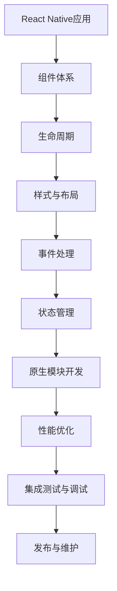

                 

# 《React Native原生模块开发》

## 关键词

React Native、原生模块、跨平台开发、JavaScript、原生代码、组件通信、性能优化、集成测试、调试、发布与维护

## 摘要

本文深入探讨了React Native原生模块开发的全过程，从React Native的基础知识、核心组件、样式与布局、事件处理、状态管理，到原生模块开发、性能优化、集成测试与调试，以及发布与维护。通过实际案例，详细阐述了React Native原生模块开发的技术细节和实践经验，为开发者提供了全面的技术指导。

## 目录大纲

### 第一部分：React Native基础

#### 第1章：React Native概述

- 1.1 React Native的历史与核心优势
- 1.2 React Native与原生开发对比
- 1.3 React Native的生态系统
- 1.4 React Native的开发环境搭建

#### 第2章：React Native基本组件与生命周期

- 2.1 React Native的组件体系
- 2.2 基本组件示例
- 2.3 组件的生命周期方法
- 2.4 组件通信

#### 第3章：React Native样式与布局

- 3.1 样式基础
- 3.2 布局方式
- 3.3 Flexbox布局
- 3.4 样式实战

#### 第4章：React Native事件处理

- 4.1 事件处理机制
- 4.2 常用事件示例
- 4.3 事件冒泡与阻止默认行为
- 4.4 事件处理实战

#### 第5章：React Native列表与导航

- 5.1 列表组件使用
- 5.2 常见列表组件示例
- 5.3 导航器与路由
- 5.4 页面导航实战

#### 第6章：React Native状态管理与优化

- 6.1 状态管理基础
- 6.2 useState和useReducer
- 6.3 Redux的使用
- 6.4 React Native性能优化

#### 第7章：React Native跨平台组件库与工具

- 7.1 React Native组件库选择
- 7.2 React Native UI库示例
- 7.3 第三方库与工具介绍
- 7.4 跨平台开发实战

### 第二部分：React Native原生模块开发

#### 第8章：原生模块开发基础

- 8.1 原生模块开发简介
- 8.2 JavaScript与原生代码交互
- 8.3 Native Module的生命周期
- 8.4 JavaScript与原生代码通信

#### 第9章：React Native原生模块开发实践

- 9.1 原生模块开发环境搭建
- 9.2 原生模块开发实战案例
- 9.3 原生模块调试技巧
- 9.4 常见问题与解决方案

#### 第10章：React Native原生UI开发

- 10.1 原生UI组件开发
- 10.2 原生UI组件示例
- 10.3 原生UI布局与样式
- 10.4 原生UI组件优化

#### 第11章：React Native原生模块性能优化

- 11.1 原生模块性能优化策略
- 11.2 JavaScript与原生代码性能对比
- 11.3 常见性能问题与解决方案
- 11.4 性能优化实战

#### 第12章：React Native原生模块集成测试与调试

- 12.1 集成测试策略
- 12.2 原生模块测试方法
- 12.3 调试工具与技巧
- 12.4 测试实战

#### 第13章：React Native原生模块发布与维护

- 13.1 应用发布流程
- 13.2 原生模块版本管理
- 13.3 常见发布问题与解决方案
- 13.4 维护策略与实践

### 附录

#### 附录A：React Native原生模块开发资源汇总

- A.1 React Native官方文档
- A.2 常用原生模块库介绍
- A.3 社区资源与交流平台
- A.4 常见问题解答与最佳实践

## 核心概念与联系 Mermaid 流程图



### 第一部分：React Native基础

#### 第1章：React Native概述

React Native是Facebook推出的一款用于开发原生移动应用的框架，它使用JavaScript和React进行开发，能够实现iOS和Android平台的应用开发。React Native的出现，使得开发者能够使用JavaScript语言，同时享受原生应用的性能和用户体验。

### 1.1 React Native的历史与核心优势

React Native最早在2015年发布，它的核心优势在于：

- **跨平台开发**：使用React Native，开发者可以编写一次代码，同时用于iOS和Android平台，大大提高了开发效率。
- **原生性能**：React Native通过原生组件实现了高性能，相比传统Web技术具有更好的用户体验。
- **JavaScript生态**：React Native能够无缝集成JavaScript生态系统，包括React、Redux、React Router等库，开发者可以充分利用现有的技术和资源。

### 1.2 React Native与原生开发对比

React Native与原生开发的主要区别在于开发语言和开发流程：

- **开发语言**：React Native使用JavaScript进行开发，而原生开发通常使用Swift（iOS）或Kotlin（Android）。
- **开发流程**：React Native的开发流程相对简化，开发者可以更快速地迭代和测试应用。而原生开发则需要编写大量的平台特定代码，开发周期较长。

### 1.3 React Native的生态系统

React Native的生态系统非常丰富，包括：

- **React Native官方库**：如React Native组件库、React Native UI库等。
- **第三方库**：如React Native社区贡献的组件库、工具库等。
- **社区资源**：如官方文档、技术博客、在线教程等。

### 1.4 React Native的开发环境搭建

要在本地搭建React Native开发环境，需要以下步骤：

1. **安装Node.js**：React Native依赖于Node.js环境，首先需要安装Node.js。
2. **安装React Native CLI**：使用npm安装React Native CLI，该CLI用于创建和管理React Native项目。
3. **安装Android Studio**：对于Android平台，需要安装Android Studio并配置Android SDK。
4. **安装Xcode**：对于iOS平台，需要安装Xcode并配置iOS SDK。
5. **创建新项目**：使用React Native CLI创建新项目，并按照提示配置项目。

通过上述步骤，可以搭建React Native的开发环境，并开始进行应用开发。

#### 第2章：React Native基本组件与生命周期

React Native的组件是构建应用的基本单元，它类似于Web开发中的HTML标签。React Native组件分为两类：原生组件和自定义组件。

### 2.1 React Native的组件体系

React Native的组件体系非常丰富，包括：

- **基础组件**：如`View`、`Text`、`Image`等。
- **复合组件**：如`ScrollView`、`ListView`等。
- **导航组件**：如`StackNavigator`、`TabNavigator`等。
- **状态管理组件**：如`Provider`、`Consumer`等。

### 2.2 基本组件示例

以下是一个使用React Native基础组件的示例：

```javascript
import React from 'react';
import {View, Text, Image, StyleSheet} from 'react-native';

const App = () => {
  return (
    <View style={styles.container}>
      <Text style={styles.title}>Hello React Native</Text>
      <Image source={require('./images/logo.png')} style={styles.image} />
    </View>
  );
};

const styles = StyleSheet.create({
  container: {
    flex: 1,
    justifyContent: 'center',
    alignItems: 'center',
  },
  title: {
    fontSize: 24,
    fontWeight: 'bold',
  },
  image: {
    width: 100,
    height: 100,
  },
});

export default App;
```

在这个示例中，我们使用了`View`、`Text`和`Image`组件，并设置了它们的位置和样式。

### 2.3 组件的生命周期方法

React Native组件的生命周期方法包括以下几个阶段：

- **构造函数（constructor）**：初始化组件状态。
- **挂载阶段（Mounting）**：
  - `componentWillMount`：组件挂载之前调用。
  - `render`：渲染组件。
  - `componentDidMount`：组件挂载之后调用。
- **更新阶段（Updating）**：
  - `componentWillReceiveProps`：组件接收到新的属性时调用。
  - `shouldComponentUpdate`：组件是否需要重新渲染。
  - `componentWillUpdate`：组件即将重新渲染。
  - `render`：重新渲染组件。
  - `componentDidUpdate`：组件更新后调用。
- **卸载阶段（Unmounting）**：
  - `componentWillUnmount`：组件卸载之前调用。

### 2.4 组件通信

React Native组件之间的通信主要通过以下方式实现：

- **Props**：父组件通过Props向下传递数据。
- **State**：组件内部通过State管理数据。
- **回调函数**：组件通过回调函数与外部交互。
- **上下文（Context）**：在某些场景下，可以使用上下文进行跨组件通信。

#### 第3章：React Native样式与布局

React Native的样式系统基于CSS，但它与传统的CSS有所不同。React Native使用JavaScript对象来定义样式，这些对象被称为样式表。

### 3.1 样式基础

React Native样式是使用JavaScript对象来定义的，它们可以直接应用于组件。样式对象包含以下属性：

- **布局属性**：如`flex`、`marginTop`、`marginBottom`等。
- **文字属性**：如`fontSize`、`fontWeight`、`textAlign`等。
- **颜色属性**：如`color`、`backgroundColor`等。
- **边框属性**：如`borderWidth`、`borderColor`等。

### 3.2 布局方式

React Native提供了多种布局方式，其中最常用的是Flexbox布局。Flexbox布局允许开发者使用`flex`属性来控制组件的布局和大小。

```javascript
<View style={{flex: 1, justifyContent: 'center', alignItems: 'center'}}>
  <Text>Hello React Native</Text>
</View>
```

在这个示例中，我们使用了`flex: 1`来占据剩余空间，`justifyContent: 'center'`来垂直居中，`alignItems: 'center'`来水平居中。

### 3.3 Flexbox布局

Flexbox布局是一种用于设计响应式布局的强大工具，它允许开发者通过简单的属性来控制布局。Flexbox布局的关键属性包括：

- `flex`：定义组件在Flex容器中的大小比例。
- `flexDirection`：定义Flex容器的方向，可以是`row`（默认）、`column`、`row-reverse`、`column-reverse`。
- `justifyContent`：定义Flex容器中的项目对齐方式，可以是`flex-start`、`center`、`flex-end`、`space-between`、`space-around`。
- `alignItems`：定义Flex容器中的项目垂直对齐方式，可以是`stretch`、`flex-start`、`center`、`flex-end`。

### 3.4 样式实战

在React Native应用中，样式通常被定义在单独的CSS文件中，并在组件中使用`StyleSheet.create`方法创建样式对象。

```javascript
import React from 'react';
import {View, Text, Image, StyleSheet} from 'react-native';

const styles = StyleSheet.create({
  container: {
    flex: 1,
    backgroundColor: '#fff',
    alignItems: 'center',
    justifyContent: 'center',
  },
  title: {
    fontSize: 24,
    fontWeight: 'bold',
    color: '#333',
  },
  image: {
    width: 100,
    height: 100,
  },
});

const App = () => {
  return (
    <View style={styles.container}>
      <Text style={styles.title}>Hello React Native</Text>
      <Image source={require('./images/logo.png')} style={styles.image} />
    </View>
  );
};

export default App;
```

在这个示例中，我们创建了一个名为`styles.js`的文件，并将样式定义在其中。然后在组件中，我们使用`StyleSheet.create`方法将样式对象传递给组件。

#### 第4章：React Native事件处理

React Native允许开发者使用JavaScript编写事件处理代码，这些事件处理代码可以与原生组件紧密结合，从而实现丰富的交互效果。

### 4.1 事件处理机制

React Native的事件处理机制类似于Web开发中的事件处理。每个组件都可以定义事件处理函数，当相应的事件触发时，该函数将被执行。

```javascript
import React from 'react';
import {View, Text, TouchableOpacity} from 'react-native';

const App = () => {
  const handleClick = () => {
    alert('按钮被点击');
  };

  return (
    <View>
      <Text>Hello React Native</Text>
      <TouchableOpacity onPress={handleClick}>
        <Text>点击我</Text>
      </TouchableOpacity>
    </View>
  );
};

export default App;
```

在这个示例中，我们定义了一个名为`handleClick`的事件处理函数，并将其传递给`TouchableOpacity`组件的`onPress`属性。

### 4.2 常用事件示例

React Native提供了丰富的内置事件，以下是一些常用的事件示例：

- `onPress`：点击事件。
- `onLongPress`：长按事件。
- `onPressIn`：点击按下事件。
- `onPressOut`：点击释放事件。
- `onSwipe`：滑动事件。
- `onKeyDown`：键盘按下事件。
- `onKeyUp`：键盘释放事件。

### 4.3 事件冒泡与阻止默认行为

React Native的事件冒泡机制与Web开发类似，事件会在触发元素及其父元素上依次触发。开发者可以使用`e.stopPropagation()`来阻止事件冒泡。

```javascript
import React from 'react';
import {View, Text, TouchableOpacity} from 'react-native';

const App = () => {
  const handleButtonClick = () => {
    alert('按钮被点击');
  };

  const handleContainerClick = () => {
    alert('容器被点击');
  };

  return (
    <View style={{padding: 20}}>
      <TouchableOpacity onPress={handleButtonClick}>
        <Text>点击按钮</Text>
      </TouchableOpacity>
      <View style={{marginTop: 20, padding: 20, backgroundColor: '#ddd'}}>
        <TouchableOpacity onPress={handleContainerClick}>
          <Text>点击容器</Text>
        </TouchableOpacity>
      </View>
    </View>
  );
};

export default App;
```

在这个示例中，当点击按钮时，会先触发按钮的`onPress`事件，然后触发容器的`onPress`事件。如果我们在按钮的事件处理函数中添加`e.stopPropagation()`，那么只会触发按钮的`onPress`事件，而不会触发容器的`onPress`事件。

### 4.4 事件处理实战

在实际应用中，事件处理经常与状态管理结合使用，以下是一个简单的例子：

```javascript
import React, {useState} from 'react';
import {View, Text, TouchableOpacity} from 'react-native';

const App = () => {
  const [count, setCount] = useState(0);

  const handleClick = () => {
    setCount(count + 1);
  };

  return (
    <View>
      <Text>你点击了{count}次</Text>
      <TouchableOpacity onPress={handleClick}>
        <Text>点击我</Text>
      </TouchableOpacity>
    </View>
  );
};

export default App;
```

在这个示例中，我们使用`useState`钩子来管理状态，当点击按钮时，状态值会更新，并重新渲染组件。

#### 第5章：React Native列表与导航

在移动应用中，列表和导航是常见的功能。React Native提供了丰富的组件来支持这些功能。

### 5.1 列表组件使用

React Native的列表组件`FlatList`和`SectionList`提供了高效的列表渲染能力。

#### FlatList

`FlatList`是一个无限滚动的列表组件，它可以自动加载更多的数据。

```javascript
import React, {useState, useEffect} from 'react';
import {View, FlatList, Text, TouchableOpacity} from 'react-native';

const App = () => {
  const [data, setData] = useState([]);

  useEffect(() => {
    fetchData().then((result) => setData(result));
  }, []);

  const fetchData = async () => {
    const response = await fetch('https://example.com/data');
    const data = await response.json();
    return data;
  };

  const renderItem = ({item}) => (
    <TouchableOpacity onPress={() => alert(item.title)}>
      <Text>{item.title}</Text>
    </TouchableOpacity>
  );

  return (
    <View>
      <FlatList
        data={data}
        renderItem={renderItem}
        keyExtractor={(item) => item.id}
      />
    </View>
  );
};

export default App;
```

在这个示例中，我们使用`FlatList`来渲染一个包含标题的列表。当用户滚动到列表底部时，会自动加载更多的数据。

#### SectionList

`SectionList`是`FlatList`的扩展，它支持按章节渲染列表。

```javascript
import React, {useState, useEffect} from 'react';
import {View, SectionList, Text, TouchableOpacity} from 'react-native';

const App = () => {
  const [data, setData] = useState([]);

  useEffect(() => {
    fetchData().then((result) => setData(result));
  }, []);

  const fetchData = async () => {
    const response = await fetch('https://example.com/data');
    const data = await response.json();
    return data;
  };

  const renderSectionHeader = ({section: {title}}) => (
    <Text style={{fontWeight: 'bold', padding: 10}}>{title}</Text>
  );

  const renderItem = ({item}) => (
    <TouchableOpacity onPress={() => alert(item.title)}>
      <Text>{item.title}</Text>
    </TouchableOpacity>
  );

  return (
    <View>
      <SectionList
        sections={data}
        renderSectionHeader={renderSectionHeader}
        renderItem={renderItem}
        keyExtractor={(item) => item.id}
      />
    </View>
  );
};

export default App;
```

在这个示例中，我们使用`SectionList`来渲染一个按章节组织的列表。

### 5.2 常见列表组件示例

以下是一些常见的列表组件示例：

- **图文列表**：使用`Image`组件和`Text`组件组合，展示图片和文字信息。
- **列表项带图标**：使用图标组件（如`FontAwesome`）为列表项添加图标。
- **列表项带操作按钮**：使用`TouchableOpacity`或`TouchableHighlight`为列表项添加操作按钮。

### 5.3 导航器与路由

React Native的导航器组件（如`StackNavigator`和`TabNavigator`）提供了强大的导航功能。

#### StackNavigator

`StackNavigator`用于实现页面栈效果，它可以管理多个页面的切换。

```javascript
import React from 'react';
import {NavigationContainer} from '@react-navigation/native';
import { createStackNavigator } from '@react-navigation/stack';
import HomeScreen from './HomeScreen';
import DetailsScreen from './DetailsScreen';

const Stack = createStackNavigator();

const App = () => {
  return (
    <NavigationContainer>
      <Stack.Navigator>
        <Stack.Screen name="Home" component={HomeScreen} />
        <Stack.Screen name="Details" component={DetailsScreen} />
      </Stack.Navigator>
    </NavigationContainer>
  );
};

export default App;
```

在这个示例中，我们使用`StackNavigator`来管理两个页面的切换。

#### TabNavigator

`TabNavigator`用于实现底部导航栏效果，它可以管理多个标签页。

```javascript
import React from 'react';
import {NavigationContainer} from '@react-navigation/native';
import { createBottomTabNavigator } from '@react-navigation/bottom-tabs';
import HomeTab from './HomeTab';
import ProfileTab from './ProfileTab';

const Tab = createBottomTabNavigator();

const App = () => {
  return (
    <NavigationContainer>
      <Tab.Navigator>
        <Tab.Screen name="Home" component={HomeTab} />
        <Tab.Screen name="Profile" component={ProfileTab} />
      </Tab.Navigator>
    </NavigationContainer>
  );
};

export default App;
```

在这个示例中，我们使用`TabNavigator`来管理两个标签页的切换。

### 5.4 页面导航实战

在实际应用中，页面导航经常与状态管理结合使用。以下是一个简单的例子：

```javascript
import React, {useState} from 'react';
import {NavigationContainer} from '@react-navigation/native';
import {createStackNavigator} from '@react-navigation/stack';
import HomeScreen from './HomeScreen';
import DetailsScreen from './DetailsScreen';

const Stack = createStackNavigator();

const App = () => {
  const [selectedId, setSelectedId] = useState(null);

  const handleSelectItem = (itemId) => {
    setSelectedId(itemId);
  };

  return (
    <NavigationContainer>
      <Stack.Navigator>
        <Stack.Screen
          name="Home"
          component={HomeScreen}
          initialParams={{onSelectItem: handleSelectItem}}
        />
        <Stack.Screen
          name="Details"
          component={DetailsScreen}
          initialParams={{itemId: selectedId}}
        />
      </Stack.Navigator>
    </NavigationContainer>
  );
};

export default App;
```

在这个示例中，我们使用`StackNavigator`来管理页面导航，并通过参数传递数据。

#### 第6章：React Native状态管理与优化

在React Native应用中，状态管理是确保组件数据一致性、响应性和可维护性的关键。React Native提供了多种状态管理方案，包括useState、useReducer、Redux等。

### 6.1 状态管理基础

状态管理是指对应用中组件的状态进行跟踪、更新和共享的过程。React Native的状态管理可以分为两部分：局部状态管理和全局状态管理。

#### 局部状态管理

局部状态管理通常使用React的useState钩子来实现。它允许组件在内部管理状态，并确保状态更新时组件重新渲染。

```javascript
import React, {useState} from 'react';
import {View, Text, Button} from 'react-native';

const Counter = () => {
  const [count, setCount] = useState(0);

  const handleIncrement = () => {
    setCount(count + 1);
  };

  const handleDecrement = () => {
    setCount(count - 1);
  };

  return (
    <View>
      <Text>计数：{count}</Text>
      <Button title="增加" onPress={handleIncrement} />
      <Button title="减少" onPress={handleDecrement} />
    </View>
  );
};

export default Counter;
```

在这个示例中，我们使用useState来管理计数器的状态，并通过setCount来更新状态。

#### 全局状态管理

全局状态管理通常使用Redux来实现。Redux是一个独立的库，它提供了全局状态管理和数据流的管理机制。

```javascript
import React from 'react';
import {Provider} from 'react-redux';
import {store} from './store';

const App = () => {
  return (
    <Provider store={store}>
      <MainComponent />
    </Provider>
  );
};

export default App;
```

在这个示例中，我们使用Provider组件将Redux的store传递给应用的根组件，从而实现全局状态管理。

### 6.2 useState和useReducer

#### useState

useState是React提供的用于局部状态管理的钩子。它允许组件在内部管理状态，并确保状态更新时组件重新渲染。

```javascript
import React, {useState} from 'react';
import {View, Text, Button} from 'react-native';

const Counter = () => {
  const [count, setCount] = useState(0);

  const handleIncrement = () => {
    setCount(count + 1);
  };

  const handleDecrement = () => {
    setCount(count - 1);
  };

  return (
    <View>
      <Text>计数：{count}</Text>
      <Button title="增加" onPress={handleIncrement} />
      <Button title="减少" onPress={handleDecrement} />
    </View>
  );
};

export default Counter;
```

在这个示例中，我们使用useState来管理计数器的状态，并通过setCount来更新状态。

#### useReducer

useReducer是React提供的用于复杂状态管理的钩子。它提供了一个reducer函数来更新状态，从而实现更复杂的状态逻辑。

```javascript
import React, {useReducer} from 'react';
import {View, Text, Button} from 'react-native';

const initialState = {count: 0};

const reducer = (state, action) => {
  switch (action.type) {
    case 'INCREMENT':
      return {count: state.count + 1};
    case 'DECREMENT':
      return {count: state.count - 1};
    default:
      throw new Error();
  }
};

const Counter = () => {
  const [state, dispatch] = useReducer(reducer, initialState);

  const handleIncrement = () => {
    dispatch({type: 'INCREMENT'});
  };

  const handleDecrement = () => {
    dispatch({type: 'DECREMENT'});
  };

  return (
    <View>
      <Text>计数：{state.count}</Text>
      <Button title="增加" onPress={handleIncrement} />
      <Button title="减少" onPress={handleDecrement} />
    </View>
  );
};

export default Counter;
```

在这个示例中，我们使用useReducer来管理计数器的状态，并通过dispatch来更新状态。

### 6.3 Redux的使用

Redux是一个用于管理应用全局状态的数据流管理库。它提供了一个单一的状态树，并使用reducer函数来更新状态。

#### 安装

首先，我们需要安装Redux和相关的库：

```bash
npm install redux react-redux
```

#### 初始化Store

接下来，我们创建一个store.js文件来初始化Redux的store：

```javascript
import { createStore } from 'redux';
import reducer from './reducer';

const store = createStore(reducer);

export default store;
```

在这个示例中，我们导出了一个创建好的store实例。

#### Reducer

然后，我们创建一个reducer.js文件来定义reducer函数：

```javascript
const initialState = { count: 0 };

const reducer = (state = initialState, action) => {
  switch (action.type) {
    case 'INCREMENT':
      return { count: state.count + 1 };
    case 'DECREMENT':
      return { count: state.count - 1 };
    default:
      return state;
  }
};

export default reducer;
```

在这个示例中，我们定义了一个简单的reducer函数，用于处理`INCREMENT`和`DECREMENT`动作。

#### Provider

接下来，我们在App组件中使用`Provider`组件来传递store：

```javascript
import React from 'react';
import {Provider} from 'react-redux';
import {store} from './store';
import MainComponent from './MainComponent';

const App = () => {
  return (
    <Provider store={store}>
      <MainComponent />
    </Provider>
  );
};

export default App;
```

在这个示例中，我们将store传递给了`Provider`组件，从而实现了全局状态管理。

#### 使用Redux

最后，我们可以在组件中通过`useSelector`和`useDispatch`钩子来使用Redux：

```javascript
import React, {useSelector, useDispatch} from 'react';
import {Text, Button} from 'react-native';

const Counter = () => {
  const count = useSelector((state) => state.count);
  const dispatch = useDispatch();

  const handleIncrement = () => {
    dispatch({type: 'INCREMENT'});
  };

  const handleDecrement = () => {
    dispatch({type: 'DECREMENT'});
  };

  return (
    <View>
      <Text>计数：{count}</Text>
      <Button title="增加" onPress={handleIncrement} />
      <Button title="减少" onPress={handleDecrement} />
    </View>
  );
};

export default Counter;
```

在这个示例中，我们使用`useSelector`来获取store中的状态，并使用`useDispatch`来发送动作。

### 6.4 React Native性能优化

React Native的性能优化是确保应用流畅运行的关键。以下是一些常用的性能优化技巧：

#### 1. 避免过多的渲染

避免在组件内部不必要的渲染，可以通过以下方式实现：

- 使用`React.memo`来优化组件。
- 使用`shouldComponentUpdate`来控制组件的重新渲染。
- 使用`useMemo`和`useCallback`来优化函数和状态。

#### 2. 使用FlatList和SectionList

使用React Native的列表组件`FlatList`和`SectionList`可以显著提高性能，因为它们实现了虚拟滚动和批量更新。

#### 3. 图片优化

优化图片资源，使用WebP格式或压缩图片可以减小应用体积，提高加载速度。

#### 4. JavaScript和原生代码优化

- 减少JavaScript中不必要的计算和函数调用。
- 优化原生代码，减少CPU和GPU的负载。

#### 5. 使用懒加载

对于大型的数据集或图片，可以使用懒加载技术来提高性能。

### 第二部分：React Native原生模块开发

#### 第8章：原生模块开发基础

React Native原生模块开发是React Native技术栈中的重要组成部分，它使得React Native应用可以与原生代码进行交互。原生模块开发涉及到JavaScript和原生代码的相互调用，以及原生模块的生命周期管理。

### 8.1 原生模块开发简介

原生模块是React Native应用中与原生代码交互的桥梁。通过原生模块，React Native应用可以调用原生API，访问设备功能，如相机、地理位置等。原生模块开发通常涉及到以下方面：

- **JavaScript与原生代码的交互**：原生模块提供了JavaScript和原生代码之间的通信接口。
- **原生模块的生命周期**：原生模块在应用中的加载、初始化和卸载过程。
- **原生模块的通信机制**：原生模块如何处理JavaScript发送的请求和如何返回结果。

### 8.2 JavaScript与原生代码交互

JavaScript与原生代码的交互是通过原生模块接口（Native Module Interface）实现的。原生模块接口提供了一个标准化的方式，使得JavaScript代码可以调用原生代码的方法，并接收原生代码的响应。

#### Android平台

在Android平台上，原生模块通常使用Java或Kotlin编写。以下是一个简单的Android原生模块示例：

```java
import androidx.annotation.NonNull;
import androidx.annotation.Nullable;
import com.facebook.react.bridge.ReactApplicationContext;
import com.facebook.react.bridge.ReactContext;
import com.facebook.react.bridge.ReactModule;
import com.facebook.react.bridge.ReactMethod;

public class MyNativeModule extends ReactModule {
    private final ReactApplicationContext reactContext;

    public MyNativeModule(ReactApplicationContext context) {
        super(context);
        this.reactContext = context;
    }

    @ReactMethod
    public void sayHello(String name, @NonNull Promise<Void> promise) {
        // 执行原生代码的逻辑
        promise.resolve();
    }
}
```

在这个示例中，我们创建了一个名为`MyNativeModule`的Java类，它继承自`ReactModule`。我们使用`@ReactMethod`注解来标记一个公共方法`sayHello`，这个方法可以被JavaScript代码调用。

#### iOS平台

在iOS平台上，原生模块通常使用Objective-C或Swift编写。以下是一个简单的iOS原生模块示例：

```swift
import Foundation
import React

@objc(MyNativeModule)
public class MyNativeModule: NSObject,RCTBridgeModule {
    public static func requiresMainQueueSetup() -> Bool {
        return false
    }

    public func sayHello(_ name: String!, callback:RCTResponseSenderBlock) {
        // 执行原生代码的逻辑
        callback([["Hello, " + name]])
    }
}
```

在这个示例中，我们创建了一个名为`MyNativeModule`的Swift类，它实现了`RCTBridgeModule`协议。我们使用`@objc`来标记一个公开方法`sayHello`，这个方法可以被JavaScript代码调用。

### 8.3 Native Module的生命周期

原生模块在React Native应用中有一个生命周期，包括以下阶段：

- **创建**：当React Native应用启动时，原生模块被创建。
- **初始化**：原生模块在创建后进行初始化，包括加载必要的资源和配置。
- **调用**：原生模块接收JavaScript的调用请求，并执行相应的操作。
- **卸载**：当React Native应用关闭或原生模块不再需要时，原生模块被卸载。

#### Android平台

在Android平台上，原生模块的生命周期通常由React Native的BridgeManager管理。以下是原生模块的生命周期方法：

- `onCatalystInstanceInitialize`：在BridgeManager初始化时调用。
- `onHostResume`：在React Native应用恢复时调用。
- `onHostPause`：在React Native应用暂停时调用。
- `onHostDestroy`：在React Native应用销毁时调用。

#### iOS平台

在iOS平台上，原生模块的生命周期方法通常由`RCTBridgeModule`协议定义。以下是原生模块的生命周期方法：

- `militaryOnModuleInitialize`：在模块初始化时调用。
- `militaryOnMethodCall`：在模块接收JavaScript调用时调用。
- `militaryOnDetachedFromReactInstance`：在模块被卸载时调用。

### 8.4 JavaScript与原生代码通信

JavaScript与原生代码的通信是通过原生模块接口实现的。以下是如何在JavaScript代码中调用原生模块的方法：

#### Android平台

```javascript
import { NativeModules } from 'react-native';
const { MyNativeModule } = NativeModules;

MyNativeModule.sayHello('World', (error, result) => {
  if (error) {
    console.error('Error:', error);
  } else {
    console.log('Result:', result);
  }
});
```

在这个示例中，我们导入了`NativeModules`，并调用了`MyNativeModule`的`sayHello`方法。我们通过回调函数接收原生模块的响应。

#### iOS平台

```javascript
import { NativeModules } from 'react-native';
const { MyNativeModule } = NativeModules;

MyNativeModule.sayHello('World', (error, result) => {
  if (error) {
    console.error('Error:', error);
  } else {
    console.log('Result:', result);
  }
});
```

在这个示例中，我们同样导入了`NativeModules`，并调用了`MyNativeModule`的`sayHello`方法。我们通过回调函数接收原生模块的响应。

### 第9章：React Native原生模块开发实践

原生模块开发是React Native开发中的重要一环，它使得React Native应用能够与原生代码无缝交互。本章将带你从环境搭建、开发实践到调试技巧，全面了解React Native原生模块的开发流程。

#### 9.1 原生模块开发环境搭建

原生模块开发需要配置Android和iOS的开发环境，以下是如何搭建原生模块开发环境：

##### Android开发环境搭建

1. 安装Android Studio。
2. 配置Android SDK，包括安装相应的API级别和工具。
3. 创建一个新的Android项目，选择“Empty Activity”。
4. 在项目的`build.gradle`文件中添加原生模块依赖：

```gradle
dependencies {
    implementation project(':react-native-my-native-module')
}
```

5. 在项目的`app/build.gradle`文件中添加原生模块源代码路径：

```gradle
externalNativeBuild {
    cmake {
        cppFlags "-frtti -fexceptions"
    }
}
```

##### iOS开发环境搭建

1. 安装Xcode。
2. 配置iOS SDK，包括安装相应的SDK和工具。
3. 创建一个新的iOS项目，选择“Single View App”。
4. 在项目的`Podfile`文件中添加原生模块依赖：

```ruby
target 'MyApp' do
  pod 'React-Native-My-Native-Module'
end
```

5. 在项目的`React Native`配置文件中添加原生模块源代码路径：

```json
{
  "dependencies": {
    "react": "latest",
    "react-native": "latest",
    "react-native-my-native-module": "= 1.0.0"
  }
}
```

通过以上步骤，你就可以搭建一个React Native原生模块开发的环境，并开始进行原生模块开发。

#### 9.2 原生模块开发实战案例

以下是一个使用React Native原生模块读取设备信息的实战案例：

##### Android平台

1. 在Android项目中创建一个名为`MyNativeModule`的Java类，继承自`ReactModule`：

```java
import com.facebook.react.bridge.ReactApplicationContext;
import com.facebook.react.bridge.ReactModule;
import com.facebook.react.bridge.ReactMethod;

public class MyNativeModule extends ReactModule {
    private final ReactApplicationContext reactContext;

    public MyNativeModule(ReactApplicationContext context) {
        super(context);
        this.reactContext = context;
    }

    @ReactMethod
    public void getDeviceInfo(ReadableArray params, Callback errorCallback, Callback successCallback) {
        try {
            String deviceInfo = "Device Model: " + Build.MODEL + "\nDevice Brand: " + Build.BRAND;
            successCallback.invoke(deviceInfo);
        } catch (Exception e) {
            errorCallback.invoke(e.getMessage());
        }
    }
}
```

在这个类中，我们定义了一个名为`getDeviceInfo`的方法，它接收一个`ReadableArray`参数，并返回设备信息。

2. 在`build.gradle`文件中添加原生模块依赖：

```gradle
dependencies {
    implementation project(':react-native-my-native-module')
}
```

3. 在`app/build.gradle`文件中添加原生模块源代码路径：

```gradle
externalNativeBuild {
    cmake {
        cppFlags "-frtti -fexceptions"
    }
}
```

4. 在React Native项目中，导入原生模块：

```javascript
import { NativeModules } from 'react-native';
const { MyNativeModule } = NativeModules;

MyNativeModule.getDeviceInfo((error, deviceInfo) => {
    if (error) {
        console.error('Error:', error);
    } else {
        console.log('Device Info:', deviceInfo);
    }
});
```

在这个代码中，我们调用`MyNativeModule`的`getDeviceInfo`方法，并接收设备信息。

##### iOS平台

1. 在iOS项目中创建一个名为`MyNativeModule`的Objective-C类，继承自`RCTBridgeModule`：

```objc
#import <Foundation/Foundation.h>
#import <React/RCTBridgeModule.h>
#import <React/RCTLog.h>

@interface MyNativeModule : NSObject <RCTBridgeModule>

- (void) getDeviceInfo:(NSDictionary *)params
                resolver:(RCTPromiseResolveBlock)resolve
                rejecter:(RCTPromiseRejectBlock)reject;

@end

@implementation MyNativeModule

RCT_EXPORT_MODULE();

- (void) getDeviceInfo:(NSDictionary *)params
                resolver:(RCTPromiseResolveBlock)resolve
                rejecter:(RCTPromiseRejectBlock)reject {
    NSError *error;
    NSString *deviceInfo = [NSString stringWithFormat:@"Device Model: %@", [[UIDevice currentDevice] model]];
    resolve(deviceInfo);
}

@end
```

在这个类中，我们定义了一个名为`getDeviceInfo`的方法，它接收一个`NSDictionary`参数，并返回设备信息。

2. 在`Podfile`文件中添加原生模块依赖：

```ruby
target 'MyApp' do
  pod 'React-Native-My-Native-Module'
end
```

3. 在React Native项目中，导

