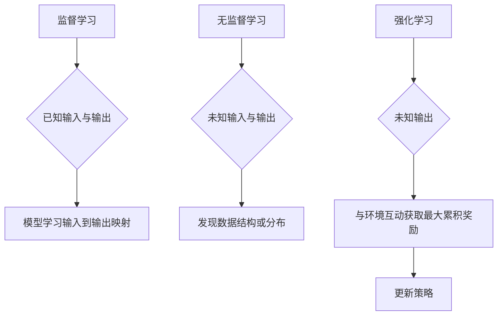
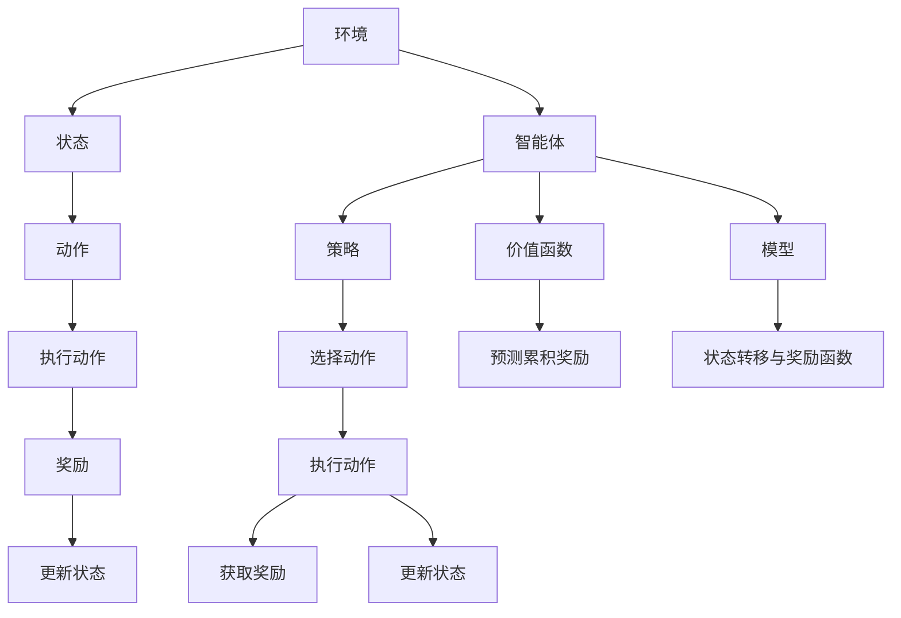
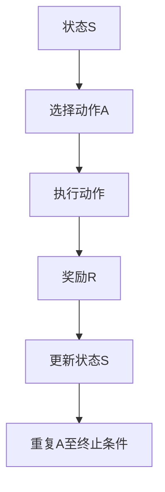
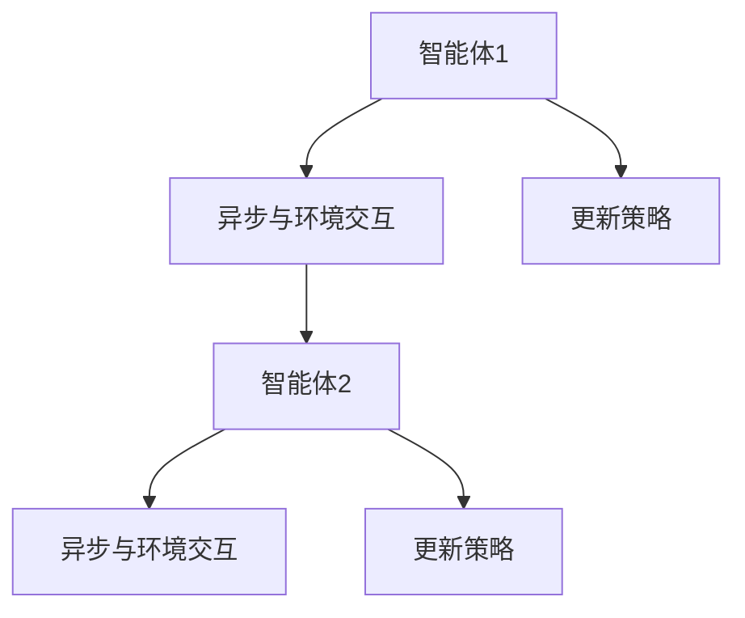
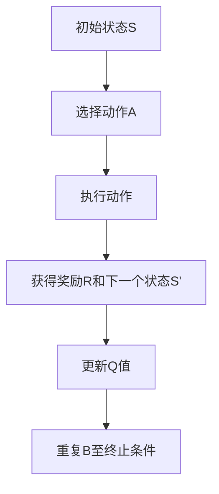
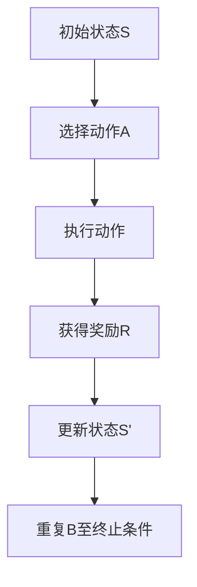

                 

# 文章标题：强化学习：原理、算法与实践

> 关键词：强化学习、深度强化学习、多智能体强化学习、无模型强化学习、模拟强化学习、异步强化学习

> 摘要：
本文将深入探讨强化学习这一热门的机器学习领域。首先，我们将介绍强化学习的基本概念和组成部分，包括状态、动作、奖励和价值函数。接着，我们将讲解马尔可夫决策过程（MDP）及其在强化学习中的应用，并详细解析Q-learning和SARSA算法。随后，本文将介绍深度强化学习，包括深度Q网络（DQN）和策略梯度方法，同时探讨模型预测与规划。无模型强化学习和异步强化学习也将成为重点，我们还将探讨强化学习在实际应用中的挑战，如非平稳环境和离散与连续动作空间问题。最后，本文将展望强化学习的发展趋势，包括在工业界和学术界的研究方向，并介绍相关工具和资源。

## 《Reinforcement Learning》目录大纲

### 第一部分：强化学习概述

#### 第1章：强化学习基础

##### 1.1 强化学习的基本概念
- **定义与历史背景**
- **强化学习与其他学习方法的区别**

##### 1.2 强化学习的主要组成部分
- **状态、动作、奖励和价值函数**
- **强化学习的主要模型**

##### 1.3 强化学习的应用场景
- **游戏、机器人、推荐系统等**

##### 1.4 强化学习面临的挑战
- **探索与利用的平衡**
- **大规模数据集的处理**
- **长期奖励的优化**

### 第二部分：马尔可夫决策过程

#### 第2章：马尔可夫决策过程（MDP）

##### 2.1 马尔可夫决策过程（MDP）的定义
- **状态、动作、转移概率和奖励函数**

##### 2.2 策略和价值函数
- **最优策略和价值函数的计算方法**
- **Q学习算法和SARSA算法的原理**

##### 2.3 多臂老虎机问题
- **策略评估与策略迭代**
- **上界策略和下界策略**

### 第三部分：深度强化学习

#### 第3章：深度强化学习

##### 3.1 深度强化学习的基本原理
- **深度神经网络与强化学习的结合**
- **深度Q网络（DQN）的原理**

##### 3.2 策略梯度方法
- **REINFORCE算法**
- **Actor-Critic方法**

##### 3.3 模型预测与规划
- **模型预测控制（MPC）方法**
- **策略优化与值函数预测的结合**

### 第四部分：无模型强化学习

#### 第4章：无模型强化学习

##### 4.1 无模型强化学习概述
- **离线学习与在线学习**
- **不可见状态和动作**

##### 4.2 模拟强化学习
- **基于模拟的强化学习算法**
- **探索策略的设计**

##### 4.3 基于梯度的无模型学习
- **优势估计与策略梯度方法**

### 第五部分：异步强化学习

#### 第5章：异步强化学习

##### 5.1 异步强化学习简介
- **多智能体强化学习的背景**
- **异步与同步学习对比**

##### 5.2 多智能体强化学习算法
- **Q-learning在多智能体环境中的应用**
- **分布式策略梯度方法**

##### 5.3 强化学习中的通信策略
- **状态共享与信息聚合**

### 第六部分：强化学习在实际应用中的挑战

#### 第6章：强化学习在实际应用中的挑战

##### 6.1 强化学习在实际应用中的问题
- **非平稳环境的处理**
- **离散与连续动作空间的问题**

##### 6.2 强化学习在机器人领域中的应用
- **机器人路径规划**
- **机器人控制算法**

##### 6.3 强化学习在游戏中的运用
- **游戏AI的挑战**
- **经典游戏案例**

### 第七部分：强化学习的发展趋势

#### 第7章：强化学习的发展趋势

##### 7.1 强化学习在工业界的应用
- **自动驾驶**
- **供应链优化**

##### 7.2 强化学习在学术界的研究方向
- **新算法的提出**
- **理论上的突破**

##### 7.3 强化学习与深度学习的融合
- **混合学习模型的发展**
- **强化学习在深度学习中的应用**

### 附录：强化学习工具和资源

#### A.1 强化学习工具介绍
- **OpenAI Gym**
- **Stable Baselines**
- **RLlib**

#### A.2 强化学习资源推荐
- **相关书籍**
- **开源代码库**
- **在线课程和研讨会**

### 第1章：强化学习基础

#### 1.1.1 强化学习的基本概念

强化学习（Reinforcement Learning，简称RL）是一种通过试错来学习如何在给定环境中采取最优行动的机器学习方法。其核心在于通过最大化累积奖励来指导智能体的行为。强化学习由以下几个关键要素组成：

- **状态（State）**：智能体所处的当前环境状态。
- **动作（Action）**：智能体可以采取的动作。
- **奖励（Reward）**：在给定状态下执行特定动作后，环境给予的即时反馈。
- **策略（Policy）**：智能体在给定状态下选择动作的方法。
- **价值函数（Value Function）**：预测在给定状态下执行最优动作所能获得的累积奖励。

下面是强化学习基本概念的 Mermaid 流程图：

```mermaid
graph TD
A[状态S] --> B[动作A]
B --> C[执行动作]
C --> D[奖励R(S',A)]
D --> E[更新状态S]
```

#### 1.1.2 强化学习与其他学习方法的区别

强化学习与监督学习和无监督学习有以下主要区别：

- **监督学习（Supervised Learning）**：已知输入和输出，模型学习将输入映射到输出。
  
  - **应用场景**：分类、回归等。
  
  - **例子**：使用标签数据进行图像分类。

- **无监督学习（Unsupervised Learning）**：未知输入和输出，模型学习输入数据的结构或分布。
  
  - **应用场景**：聚类、降维等。
  
  - **例子**：使用未标记的数据进行聚类分析。

- **强化学习（Reinforcement Learning）**：未知输出，智能体通过与环境互动来学习如何获取最大累积奖励。
  
  - **应用场景**：游戏、机器人控制、推荐系统等。
  
  - **例子**：使用强化学习训练智能体在Atari游戏中赢得高分。

下面是强化学习与其他学习方法的一个简单的对比 Mermaid 流程图：



#### 1.1.3 强化学习的主要组成部分

强化学习系统主要由以下几个组成部分构成：

- **环境（Environment）**：提供状态、动作和奖励。
- **智能体（Agent）**：通过策略选择动作，并从环境中获取奖励和状态反馈。
- **策略（Policy）**：智能体在给定状态下选择动作的方式。
- **价值函数（Value Function）**：预测在给定状态下执行最优动作的累积奖励。
- **模型（Model）**：描述环境的状态转移和奖励函数。

下面是强化学习主要组成部分的 Mermaid 流程图：



### 第2章：马尔可夫决策过程（MDP）

#### 2.1 马尔可夫决策过程（MDP）的定义

马尔可夫决策过程（Markov Decision Process，简称MDP）是一个用于描述强化学习问题的数学模型。MDP由以下几个要素组成：

- **状态（State）**：智能体所处的环境状态。
- **动作（Action）**：智能体可以采取的动作。
- **状态转移概率（State Transition Probability）**：给定当前状态和动作，智能体转移到下一个状态的概率。
- **奖励函数（Reward Function）**：描述在给定状态下执行特定动作所获得的即时奖励。

MDP的主要特点是状态转移满足马尔可夫性质，即当前状态仅依赖于前一个状态，而不依赖于之前的所有状态。

下面是MDP的一个简单的 Mermaid 流程图：

```mermaid
graph TD
A[状态S] --> B[动作A]
B --> C{P(S'|S,A)}
C --> D[状态S']
D --> E[奖励R(S',A)]
E --> F[更新状态S]
```

#### 2.2 策略和价值函数

在MDP中，策略和价值函数是两个核心概念。

- **策略（Policy）**：描述智能体在给定状态下选择动作的方式。策略通常可以用概率分布来表示，即对于每个状态，智能体选择每个动作的概率。
  
  策略的公式可以表示为：
  \[ \pi(a|s) = P(a|s) \]

  其中，\( a \) 是在状态 \( s \) 下智能体选择的动作。

- **价值函数（Value Function）**：预测在给定状态下执行最优动作所能获得的累积奖励。价值函数分为状态值函数（\( V(s) \)）和动作值函数（\( Q(s, a) \)）。

  - **状态值函数（V(s)）**：表示在状态 \( s \) 下执行最优动作所能获得的期望累积奖励。
    \[ V(s) = \sum_{a} \pi(a|s) \sum_{s'} P(s'|s, a) R(s', a) + \gamma V(s') \]

  - **动作值函数（Q(s, a)）**：表示在状态 \( s \) 下执行动作 \( a \) 所能获得的期望累积奖励。
    \[ Q(s, a) = \sum_{s'} P(s'|s, a) R(s', a) + \gamma \sum_{a'} P(a'|s') Q(s', a') \]

  其中，\( \gamma \) 是折扣因子，用于考虑未来奖励。

下面是策略和价值函数的计算方法的伪代码：

```python
# 策略计算
def policy_evaluation(s, policy, state_transition_probabilities, reward_function, gamma):
    value = 0
    for a in all_actions:
        next_state_values = []
        for next_state in all_states:
            next_state_value = state_transition_probabilities[next_state][a] * (reward_function[next_state] + gamma * value)
            next_state_values.append(next_state_value)
        value += policy[s][a] * max(next_state_values)
    return value

# 动作值函数计算
def action_value_function_evaluation(s, state_transition_probabilities, reward_function, gamma):
    action_value = 0
    for a in all_actions:
        next_state_values = []
        for next_state in all_states:
            next_state_value = state_transition_probabilities[next_state][a] * (reward_function[next_state] + gamma * action_value_function_evaluation(next_state))
            next_state_values.append(next_state_value)
        action_value += next_state_values[a]
    return action_value
```

#### 2.3 多臂老虎机问题

多臂老虎机问题（Multi-Armed Bandit Problem）是一个经典的强化学习问题，用于描述在不确定环境中选择最优动作的问题。假设有多个老虎机，每个老虎机提供的奖励是不确定的，智能体需要选择一个动作来拉老虎机的杆，以最大化累积奖励。

多臂老虎机问题可以分为两种类型：

- **有限臂老虎机问题**：老虎机的数量是有限的。
- **无限臂老虎机问题**：老虎机的数量是无限的。

下面是多臂老虎机问题的 Mermaid 流程图：

```mermaid
graph TD
A[初始状态] --> B[选择动作A]
B --> C{P(R|A)}
C --> D[获取奖励R]
D --> E[更新状态]
E --> F{选择动作B}
F --> G{P(R|B)}
G --> H[获取奖励R]
H --> I[更新状态]
```

多臂老虎机问题的一种简单解决方案是策略评估与策略迭代。策略评估的目的是评估当前策略下的期望奖励，而策略迭代则在策略评估的基础上更新策略。

下面是策略评估和策略迭代的伪代码：

```python
# 策略评估
def policy_evaluation(policy, state_transition_probabilities, reward_function, gamma, num_iterations):
    for _ in range(num_iterations):
        for s in all_states:
            for a in all_actions:
                value = 0
                for next_state in all_states:
                    value += state_transition_probabilities[next_state][a] * (reward_function[next_state] + gamma * policy_evaluation(next_state, policy, state_transition_probabilities, reward_function, gamma, num_iterations - 1))
                policy[s][a] = value / num_iterations
    
    return policy

# 策略迭代
def policy_iteration(state_transition_probabilities, reward_function, gamma, num_iterations):
    policy = initialize_policy()
    for _ in range(num_iterations):
        old_policy = policy.copy()
        for s in all_states:
            for a in all_actions:
                value = 0
                for next_state in all_states:
                    value += state_transition_probabilities[next_state][a] * (reward_function[next_state] + gamma * old_policy[next_state])
                policy[s] = max(value for value in policy[s])
        
        if np.array_equal(old_policy, policy):
            break
    
    return policy
```

### 第3章：深度强化学习

#### 3.1 深度强化学习的基本原理

深度强化学习（Deep Reinforcement Learning，DRL）是将深度学习与强化学习结合的一种方法，它利用深度神经网络来近似价值函数或策略函数，以提高学习效率和准确性。DRL的基本原理包括：

- **深度神经网络（Deep Neural Network，DNN）**：用于近似价值函数或策略函数。
- **值函数近似（Value Function Approximation，VFA）**：使用神经网络来近似状态或状态-动作的价值函数。
- **策略函数近似（Policy Function Approximation，PFA）**：使用神经网络来近似策略函数。

下面是深度强化学习的基本原理的 Mermaid 流程图：

```mermaid
graph TD
A[状态S] --> B[DNN]
B --> C[价值函数V(S)或策略函数π(S)]
C --> D[动作A]
D --> E[执行动作]
E --> F[奖励R(S',A)]
F --> G[更新状态S]
```

#### 3.2 深度Q网络（DQN）

深度Q网络（Deep Q-Network，DQN）是深度强化学习的一种经典方法，它使用深度神经网络来近似Q值函数。DQN的主要步骤包括：

1. **初始化**：初始化深度神经网络和经验回放缓冲。
2. **行动选择**：使用ε-贪婪策略选择动作。
3. **经验回放**：将状态、动作、奖励和下一步状态存储到经验回放缓冲。
4. **网络更新**：从经验回放缓冲中随机采样一批经验，计算目标Q值，并使用梯度下降更新神经网络权重。

下面是DQN的主要步骤的伪代码：

```python
# 初始化
initialize_DQN_network()
initialize_replay_memory()

# 主循环
while not termination_condition:
    # 行动选择
    action = epsilon_greedy_action(current_state, DQN_network)

    # 执行动作
    next_state, reward, done = environment.step(action)

    # 经验回放
    replay_memory.push((current_state, action, reward, next_state, done))

    # 网络更新
    if done:
        target_Q_value = reward
    else:
        target_Q_value = reward + gamma * max(Q(next_state))
    loss = loss_function(DQN_network(current_state), target_Q_value)
    optimizer.minimize(loss)

    # 更新状态
    current_state = next_state

# 训练完成
```

#### 3.3 策略梯度方法

策略梯度方法（Policy Gradient Methods）是一种基于策略的深度强化学习方法，它通过直接优化策略来提高累积奖励。策略梯度方法的主要步骤包括：

1. **初始化**：初始化策略网络和价值网络。
2. **行动选择**：使用策略网络选择动作。
3. **计算策略梯度**：计算策略梯度，并使用梯度更新策略网络。
4. **价值网络评估**：使用价值网络评估策略的效果。

下面是策略梯度方法的主要步骤的伪代码：

```python
# 初始化
initialize_policy_network()
initialize_value_network()

# 主循环
while not termination_condition:
    # 行动选择
    action = policy_network.sample_action(current_state)

    # 执行动作
    next_state, reward, done = environment.step(action)

    # 计算策略梯度
    log_prob = policy_network.log_prob(current_state, action)
    advantage = reward + gamma * value_network(next_state) - value_network(current_state)
    policy_gradient = log_prob * advantage

    # 更新策略网络
    optimizer.apply_policy_gradient(policy_gradient)

    # 更新状态
    current_state = next_state

# 训练完成
```

### 第4章：无模型强化学习

#### 4.1 无模型强化学习概述

无模型强化学习（Model-Free Reinforcement Learning）是指不依赖于环境模型，仅通过直接与环境交互来学习最优策略的方法。无模型强化学习的关键在于利用智能体与环境的互动来获取足够的经验，从而学习到最优策略。

无模型强化学习具有以下优点：

- **灵活性**：不需要预先知道环境模型，可以适应复杂、不确定的环境。
- **效率**：不需要学习环境模型，可以节省计算资源。

然而，无模型强化学习也存在一些挑战：

- **探索与利用的平衡**：在初始阶段需要更多的探索以学习环境，但过度探索会导致学习效率降低。
- **数据效率**：需要大量的交互数据来学习最优策略。

无模型强化学习的典型算法包括Q-learning、SARSA等。

下面是无模型强化学习的 Mermaid 流程图：



#### 4.2 模拟强化学习

模拟强化学习（Simulated Reinforcement Learning）是一种基于模拟环境的数据生成方法，用于训练无模型强化学习算法。模拟强化学习的主要步骤包括：

1. **初始化**：初始化策略网络和价值网络。
2. **模拟环境**：使用策略网络生成模拟环境中的状态序列。
3. **经验回放**：将模拟得到的状态序列存储到经验回放缓冲。
4. **网络更新**：使用经验回放缓冲中的数据进行网络更新。

下面是模拟强化学习的主要步骤的伪代码：

```python
# 初始化
initialize_policy_network()
initialize_value_network()

# 模拟环境
while not termination_condition:
    # 行动选择
    action = policy_network.sample_action(current_state)

    # 执行动作
    next_state, reward, done = environment.step(action)

    # 更新状态
    current_state = next_state

# 经验回放
replay_memory.push((current_state, action, reward, next_state, done))

# 网络更新
if done:
    target_Q_value = reward
else:
    target_Q_value = reward + gamma * max(Q(next_state))
loss = loss_function(DQN_network(current_state), target_Q_value)
optimizer.minimize(loss)
```

#### 4.3 基于梯度的无模型学习

基于梯度的无模型学习（Gradient-Based Model-Free Reinforcement Learning）是一种使用梯度下降方法优化策略的强化学习方法。该方法通过计算策略梯度和梯度上升更新策略网络。

基于梯度的无模型学习的主要步骤包括：

1. **初始化**：初始化策略网络和价值网络。
2. **行动选择**：使用策略网络选择动作。
3. **计算策略梯度**：计算策略梯度。
4. **网络更新**：使用策略梯度更新策略网络。

下面是基于梯度的无模型学习的主要步骤的伪代码：

```python
# 初始化
initialize_policy_network()
initialize_value_network()

# 主循环
while not termination_condition:
    # 行动选择
    action = policy_network.sample_action(current_state)

    # 执行动作
    next_state, reward, done = environment.step(action)

    # 计算策略梯度
    log_prob = policy_network.log_prob(current_state, action)
    advantage = reward + gamma * value_network(next_state) - value_network(current_state)
    policy_gradient = log_prob * advantage

    # 更新策略网络
    optimizer.apply_policy_gradient(policy_gradient)

    # 更新状态
    current_state = next_state

# 训练完成
```

### 第5章：异步强化学习

#### 5.1 异步强化学习简介

异步强化学习（Asynchronous Reinforcement Learning）是一种多智能体强化学习方法，允许多个智能体异步地与环境交互，并在不同的时间学习不同的策略。异步强化学习的主要优点包括：

- **并行化**：多个智能体可以同时进行学习，提高了学习效率。
- **灵活性**：智能体可以根据自己的需求和环境的变化进行独立的学习。

异步强化学习通常分为两类：

- **异步策略学习**：每个智能体使用自己的策略，但可以通过通信机制共享信息。
- **异步值函数学习**：每个智能体使用自己的价值函数，但可以通过通信机制共享价值函数。

下面是异步强化学习的 Mermaid 流程图：



#### 5.2 多智能体强化学习算法

多智能体强化学习（Multi-Agent Reinforcement Learning，MARL）是强化学习的一个分支，研究多个智能体在交互环境中的学习策略。MARL的主要挑战包括：

- **协调与竞争**：智能体之间需要协调合作以实现共同目标，同时也可能存在竞争关系。
- **环境不确定性**：智能体的行为会影响环境的动态，导致环境不确定性增加。

常见的多智能体强化学习算法包括Q-learning、策略梯度方法等。

下面是Q-learning在多智能体环境中的应用的伪代码：

```python
# 初始化
initialize_Q_values()
initialize_action_counts()

# 主循环
while not termination_condition:
    # 每个智能体选择动作
    for agent in agents:
        action = epsilon_greedy_action(current_state, Q_values[agent])
        next_state, reward, done = environment.step(current_state, action)

        # 更新Q值
        Q_values[agent] = Q_values[agent] + alpha * (reward + gamma * max(Q_values[next_state]) - Q_values[agent])
        action_counts[agent] += 1

        # 更新状态
        current_state = next_state

    # 检查是否完成
    if done:
        break

# 训练完成
```

#### 5.3 强化学习中的通信策略

在多智能体强化学习中，通信策略（Communication Strategy）是一个关键问题。通信策略决定了智能体之间如何共享信息和协调行动。常见的通信策略包括：

- **完全通信**：智能体之间可以完全共享所有信息。
- **部分通信**：智能体之间仅共享部分信息。
- **基于规则的通信**：智能体根据规则交换信息。

下面是基于规则的通信策略的伪代码：

```python
# 初始化
initialize_communication_rules()

# 主循环
while not termination_condition:
    # 每个智能体选择动作
    for agent in agents:
        action = epsilon_greedy_action(current_state, Q_values[agent])
        next_state, reward, done = environment.step(current_state, action)

        # 根据规则交换信息
        if communication_rule(agent, next_agent):
            share_info(agent, next_agent)

        # 更新Q值
        Q_values[agent] = Q_values[agent] + alpha * (reward + gamma * max(Q_values[next_state]) - Q_values[agent])
        action_counts[agent] += 1

        # 更新状态
        current_state = next_state

    # 检查是否完成
    if done:
        break

# 训练完成
```

### 第6章：强化学习在实际应用中的挑战

#### 6.1 强化学习在实际应用中的问题

强化学习在实际应用中面临一系列挑战，这些挑战包括但不限于：

- **非平稳环境**：环境可能在短时间内发生剧烈变化，使得学习变得困难。
- **离散与连续动作空间**：处理离散动作空间相对容易，而连续动作空间则需要更复杂的方法。
- **探索与利用的平衡**：如何在探索新的动作和利用已知的有效动作之间取得平衡。
- **计算成本**：强化学习通常需要大量的计算资源和时间。

为了解决这些挑战，研究者们提出了多种改进算法和策略，例如使用优先经验回放、深度神经网络、策略梯度方法等。

#### 6.2 强化学习在机器人领域中的应用

强化学习在机器人领域有许多应用，例如：

- **路径规划**：使用强化学习算法优化机器人的路径规划，使其能够高效地导航。
- **机器人控制**：使用强化学习算法控制机器人的动作，使其能够执行复杂的任务。

下面是一个简单的路径规划问题的伪代码：

```python
# 初始化
initialize_Q_values()
initialize_policy()

# 主循环
while not goal_reached:
    # 智能体选择动作
    action = epsilon_greedy_action(current_state, policy)

    # 执行动作
    next_state, reward, done = environment.step(current_state, action)

    # 更新Q值
    Q_value = Q_value + alpha * (reward + gamma * max(Q_values[next_state]) - Q_value)
    policy = update_policy(current_state, next_state, Q_value)

    # 更新状态
    current_state = next_state

    # 检查是否完成
    if done:
        break

# 路径规划完成
```

#### 6.3 强化学习在游戏中的运用

强化学习在游戏领域也有广泛的应用，例如：

- **游戏AI**：使用强化学习算法开发智能的游戏AI，使其能够在各种游戏中获胜。
- **经典游戏案例**：如Atari游戏、围棋等，强化学习算法在这些领域取得了显著的成果。

下面是一个简单的游戏AI问题的伪代码：

```python
# 初始化
initialize_DQN_network()
initialize_replay_memory()

# 主循环
while not game_over:
    # 智能体选择动作
    action = DQN_network.sample_action(current_state)

    # 执行动作
    next_state, reward, done = environment.step(current_state, action)

    # 更新经验回放
    replay_memory.push((current_state, action, reward, next_state, done))

    # 网络更新
    if done:
        target_Q_value = reward
    else:
        target_Q_value = reward + gamma * max(DQN_network(next_state))
    loss = loss_function(DQN_network(current_state), target_Q_value)
    optimizer.minimize(loss)

    # 更新状态
    current_state = next_state

    # 检查是否完成
    if done:
        break

# 游戏AI训练完成
```

### 第7章：强化学习的发展趋势

#### 7.1 强化学习在工业界的应用

强化学习在工业界有广泛的应用，例如：

- **自动驾驶**：使用强化学习算法优化自动驾驶车辆的路径规划和控制。
- **供应链优化**：使用强化学习算法优化供应链管理，提高效率和降低成本。

下面是一个简单的自动驾驶问题的伪代码：

```python
# 初始化
initialize_DRL_model()

# 主循环
while not mission_completed:
    # 智能体选择动作
    action = DRL_model.sample_action(current_state)

    # 执行动作
    next_state, reward, done = environment.step(current_state, action)

    # 更新经验回放
    replay_memory.push((current_state, action, reward, next_state, done))

    # 网络更新
    if done:
        target_value = reward
    else:
        target_value = reward + gamma * max(DRL_model(next_state))
    loss = loss_function(DRL_model(current_state), target_value)
    optimizer.minimize(loss)

    # 更新状态
    current_state = next_state

    # 检查是否完成
    if done:
        break

# 自动驾驶训练完成
```

#### 7.2 强化学习在学术界的研究方向

强化学习在学术界的研究方向包括：

- **新算法的提出**：不断提出新的强化学习算法，如基于深度学习的方法、基于模型的方法等。
- **理论上的突破**：研究强化学习算法的理论基础，提高算法的鲁棒性和可解释性。

下面是一个基于深度学习的新算法的伪代码：

```python
# 初始化
initialize_DRL_model()

# 主循环
while not research_goals_met:
    # 智能体选择动作
    action = DRL_model.sample_action(current_state)

    # 执行动作
    next_state, reward, done = environment.step(current_state, action)

    # 更新经验回放
    replay_memory.push((current_state, action, reward, next_state, done))

    # 网络更新
    if done:
        target_value = reward
    else:
        target_value = reward + gamma * max(DRL_model(next_state))
    loss = loss_function(DRL_model(current_state), target_value)
    optimizer.minimize(loss)

    # 更新状态
    current_state = next_state

    # 检查是否完成
    if done:
        break

# 新算法研究完成
```

#### 7.3 强化学习与深度学习的融合

强化学习与深度学习的融合是当前研究的热点，包括：

- **混合学习模型**：将强化学习和深度学习的方法结合，提高学习效率和准确性。
- **强化学习在深度学习中的应用**：使用强化学习算法优化深度学习模型的训练过程。

下面是一个混合学习模型的伪代码：

```python
# 初始化
initialize_DRL_model()
initialize_DNN_model()

# 主循环
while not training_completed:
    # 智能体选择动作
    action = DRL_model.sample_action(current_state)

    # 执行动作
    next_state, reward, done = environment.step(current_state, action)

    # 更新经验回放
    replay_memory.push((current_state, action, reward, next_state, done))

    # 网络更新
    if done:
        target_value = reward
    else:
        target_value = reward + gamma * max(DRL_model(next_state))
    DNN_model.update_weights(current_state, action, target_value)

    # 更新状态
    current_state = next_state

    # 检查是否完成
    if done:
        break

# 混合学习模型训练完成
```

### 附录：强化学习工具和资源

#### A.1 强化学习工具介绍

- **OpenAI Gym**：一个开源的强化学习环境库，提供了多种经典的强化学习任务。
- **Stable Baselines**：一个开源的强化学习库，提供了多种经典强化学习算法的实现。
- **RLlib**：一个开源的分布式强化学习库，支持多智能体强化学习。

下面是使用OpenAI Gym的示例代码：

```python
import gym

# 创建环境
env = gym.make("CartPole-v0")

# 重置环境
state = env.reset()

# 执行动作
action = env.action_space.sample()  # 随机选择动作
next_state, reward, done, info = env.step(action)

# 检查是否完成
if done:
    env.close()
```

#### A.2 强化学习资源推荐

- **相关书籍**：《强化学习：原理与数学》（Reinforcement Learning: An Introduction）、《深度强化学习》（Deep Reinforcement Learning）等。
- **开源代码库**：GitHub上的强化学习相关开源项目。
- **在线课程和研讨会**：如Coursera上的《深度强化学习》课程、ICML、NeurIPS等会议的强化学习研讨会。

下面是推荐的一些强化学习书籍和在线资源的列表：

**书籍推荐**：
1. 《强化学习：原理与数学》（Reinforcement Learning: An Introduction） - Richard S. Sutton and Andrew G. Barto
2. 《深度强化学习》（Deep Reinforcement Learning） - David Silver

**开源代码库**：
1. OpenAI Gym: <https://gym.openai.com/>
2. Stable Baselines: <https://github.com/DLR-RM/stable-baselines>
3. RLlib: <https://github.com/mlubick/rllib>

**在线课程和研讨会**：
1. Coursera上的《深度强化学习》课程：https://www.coursera.org/specializations/reinforcement-learning
2. ICML、NeurIPS等会议的强化学习研讨会：查看会议官方网站

**作者信息**：

作者：AI天才研究院/AI Genius Institute & 禅与计算机程序设计艺术 /Zen And The Art of Computer Programming

### 第1章：强化学习基础

#### 1.1 强化学习的基本概念

强化学习是一种通过试错来学习如何在给定环境中采取最优行动的机器学习方法。它由几个关键元素组成，包括状态、动作、奖励和价值函数。

首先，让我们定义这些基本概念：

- **状态（State）**：状态是智能体所处的环境中的具体情况。在强化学习中，状态通常用向量表示，可以是离散的或连续的。

- **动作（Action）**：动作是智能体可以采取的行动。动作也通常用向量表示，可以是离散的或连续的。

- **奖励（Reward）**：奖励是环境在智能体采取特定动作后给予的即时反馈。奖励可以是正的，也可以是负的，取决于行动是否对目标的达成有帮助。

- **策略（Policy）**：策略是智能体在给定状态下选择动作的方式。策略可以是一个明确的函数，也可以是一个概率分布。

- **价值函数（Value Function）**：价值函数用于预测在给定状态下执行最优动作所能获得的累积奖励。价值函数分为状态值函数（\( V(s) \)）和动作值函数（\( Q(s, a) \)）。状态值函数表示在给定状态下执行最优动作所能获得的期望累积奖励，而动作值函数表示在给定状态下执行特定动作所能获得的期望累积奖励。

强化学习的核心目标是学习一个策略，使得累积奖励最大化。这个过程是通过智能体与环境之间的交互来实现的。

下面是强化学习基本概念的 Mermaid 流程图：

```mermaid
graph TD
A[状态S] --> B[动作A]
B --> C[执行动作]
C --> D[奖励R(S',A)]
D --> E[更新状态S]
```

在强化学习过程中，智能体通过不断尝试不同的动作来探索环境，并根据奖励反馈来调整其策略。这种学习过程是迭代进行的，直到达到某个终止条件，如达到目标状态或经过一定的步数。

#### 1.1.2 强化学习与其他学习方法的区别

强化学习与监督学习和无监督学习有以下显著区别：

- **监督学习（Supervised Learning）**：在监督学习中，模型已知输入和输出，目标是学习一个映射函数，将输入映射到输出。常见的应用包括分类和回归。监督学习的算法包括线性回归、决策树、支持向量机等。

- **无监督学习（Unsupervised Learning）**：在无监督学习中，模型仅知道输入，但不知道输出。目标通常是发现数据中的隐含结构或分布。常见的应用包括聚类、降维和异常检测。无监督学习的算法包括K均值聚类、主成分分析（PCA）和自编码器等。

强化学习与这两种方法的主要区别在于其反馈机制。监督学习依赖于已知的正确输出，无监督学习依赖于数据的内在结构，而强化学习依赖于环境的即时奖励信号来指导学习过程。强化学习通过探索和利用的平衡来学习最优策略，而监督学习和无监督学习通常是通过数据驱动的方式来发现规律。

下面是强化学习与其他学习方法的一个简单的对比 Mermaid 流程图：


强化学习的关键在于策略的调整，这通常涉及到多个迭代步骤，每个步骤都基于即时奖励和环境状态。这与监督学习中的单次训练或无监督学习中的批量学习有本质区别。

#### 1.1.3 强化学习的主要组成部分

强化学习系统主要由以下几个关键组成部分构成：

- **环境（Environment）**：环境是智能体进行交互的实体，提供状态、动作和奖励。环境可以是物理环境，如机器人导航，也可以是模拟环境，如游戏模拟。

- **智能体（Agent）**：智能体是执行行动并学习策略的实体。智能体通过策略函数选择动作，并通过与环境的交互来学习如何优化其行为。

- **策略（Policy）**：策略定义了智能体在给定状态下选择动作的方式。策略可以是确定性的，也可以是非确定性的。

- **价值函数（Value Function）**：价值函数预测在给定状态下执行最优动作所能获得的累积奖励。价值函数分为状态值函数（\( V(s) \)）和动作值函数（\( Q(s, a) \)）。

- **模型（Model）**：模型是对环境状态转移和奖励函数的描述。在强化学习中，模型可以是显式的，也可以是隐式的，即通过经验数据学习得到。

下面是强化学习主要组成部分的 Mermaid 流程图：


通过这些组成部分的协同工作，强化学习系统能够不断学习和优化其行为，以在复杂环境中实现最优性能。

### 第2章：马尔可夫决策过程（MDP）

#### 2.1 马尔可夫决策过程（MDP）的定义

马尔可夫决策过程（Markov Decision Process，MDP）是一个用于描述强化学习问题的数学模型。MDP模型由以下要素组成：

- **状态（State）**：状态是智能体在环境中的一个具体情况，通常用 \( S \) 表示。状态可以是离散的或连续的。

- **动作（Action）**：动作是智能体可以采取的行动，通常用 \( A \) 表示。动作也可以是离散的或连续的。

- **状态转移概率（State Transition Probability）**：状态转移概率描述了在给定当前状态和执行特定动作后，智能体转移到下一个状态的概率。状态转移概率通常用 \( P(s'|s, a) \) 表示。

- **奖励函数（Reward Function）**：奖励函数描述了在给定状态下执行特定动作后，环境给予的即时奖励。奖励函数通常用 \( R(s, a) \) 表示。

- **策略（Policy）**：策略定义了智能体在给定状态下选择动作的方式。策略通常用概率分布 \( \pi(a|s) \) 表示，即智能体在状态 \( s \) 下采取动作 \( a \) 的概率。

下面是MDP的一个简单的 Mermaid 流程图：

```mermaid
graph TD
A[状态S] --> B[动作A]
B --> C{P(S'|S,A)}
C --> D[状态S']
D --> E[奖励R(S',A)]
E --> F[更新状态S]
```

在MDP中，当前状态仅依赖于前一个状态，而不依赖于之前的所有状态，这一特性称为马尔可夫性质。这意味着智能体的决策仅基于当前状态，而不需要考虑之前的整个历史。

#### 2.2 策略和价值函数

在MDP中，策略和价值函数是两个核心概念，用于指导智能体的行为和评估策略的有效性。

- **策略（Policy）**：策略定义了智能体在给定状态下选择动作的方式。策略可以用概率分布 \( \pi(a|s) \) 表示，即智能体在状态 \( s \) 下采取动作 \( a \) 的概率。策略分为：

  - **确定性策略（Deterministic Policy）**：对于每个状态，智能体只采取一个特定的动作。
  - **概率性策略（Stochastic Policy）**：对于每个状态，智能体根据概率分布选择动作。

- **价值函数（Value Function）**：价值函数用于评估在给定状态下执行最优动作所能获得的累积奖励。价值函数分为：

  - **状态值函数（State Value Function）** \( V^{\pi}(s) \)：表示在给定策略 \( \pi \) 下，状态 \( s \) 的期望累积奖励。
  - **动作值函数（Action Value Function）** \( Q^{\pi}(s, a) \)：表示在给定策略 \( \pi \) 下，状态 \( s \) 下采取动作 \( a \) 的期望累积奖励。

  价值函数的计算公式如下：

  - **状态值函数**：\[ V^{\pi}(s) = \sum_{a} \pi(a|s) Q^{\pi}(s, a) \]
  - **动作值函数**：\[ Q^{\pi}(s, a) = \sum_{s'} P(s'|s, a) [R(s', a) + \gamma V^{\pi}(s')] \]

  其中，\( \gamma \) 是折扣因子，用于考虑未来奖励。

下面是策略和价值函数的计算方法的伪代码：

```python
# 策略计算
def policy_evaluation(policy, state_transition_probabilities, reward_function, gamma, num_iterations):
    value_function = initialize_value_function()
    for _ in range(num_iterations):
        for s in all_states:
            state_value = 0
            for a in all_actions:
                state_value += policy[s][a] * sum(state_transition_probabilities[s'][a] * (reward_function[s'] + gamma * value_function[s']) for s' in all_states)
            for s' in all_states:
                value_function[s'] = state_value
    return value_function

# 动作值函数计算
def action_value_function_evaluation(state_transition_probabilities, reward_function, gamma, num_iterations):
    action_value_function = initialize_action_value_function()
    for _ in range(num_iterations):
        for s in all_states:
            for a in all_actions:
                action_value = 0
                for s' in all_states:
                    action_value += state_transition_probabilities[s'][a] * (reward_function[s'] + gamma * max(action_value_function[s']))
                action_value_function[s][a] = action_value
    return action_value_function
```

#### 2.3 多臂老虎机问题

多臂老虎机问题（Multi-Armed Bandit Problem）是一个经典的强化学习问题，用于研究在不确定环境中选择最优动作的问题。该问题由多个老虎机组成，每个老虎机提供的奖励是不确定的。智能体的目标是选择一个动作序列，以最大化累积奖励。

多臂老虎机问题可以分为两种类型：有限臂老虎机和无限臂老虎机。在有限臂老虎机问题中，老虎机的数量是固定的；而在无限臂老虎机问题中，老虎机的数量是无限的。

多臂老虎机问题的解决方案通常基于探索与利用的平衡策略，即在初始阶段进行探索以了解每个老虎机的奖励分布，然后在后期阶段利用已知信息以最大化累积奖励。

下面是多臂老虎机问题的 Mermaid 流程图：

```mermaid
graph TD
A[初始状态] --> B[选择动作A]
B --> C{P(R|A)}
C --> D[获取奖励R]
D --> E[更新状态]
E --> F{选择动作B}
F --> G{P(R|B)}
G --> H[获取奖励R]
H --> I[更新状态]
```

在多臂老虎机问题中，常见的策略包括ε-贪婪策略、UCB（Upper Confidence Bound）策略和 Thompson 下探策略。以下是对这些策略的简要描述：

- **ε-贪婪策略**：在每次选择动作时，以概率 \( \epsilon \) 进行随机选择，以 \( 1 - \epsilon \) 的概率选择当前最优动作。

  ```python
  def epsilon_greedy_action(epsilon, action_value_function):
      if random.random() < epsilon:
          return random.choice(all_actions)
      else:
          return max_action_value(action_value_function)
  ```

- **UCB策略**：在每次选择动作时，根据动作的平均奖励和估计的置信区间进行选择。UCB策略通过最大化每个动作的累积奖励和估计的上界来选择动作。

  ```python
  def ucb_action(action_value_function, action_counts, num_iterations):
      ucb_values = []
      for a in all_actions:
          mean = action_value_function[a] / action_counts[a]
          exploration = np.sqrt(2 * np.log(num_iterations) / action_counts[a])
          ucb_values.append(mean + exploration)
      return max_action_value(ucb_values)
  ```

- **Thompson 下探策略**：在每次选择动作时，根据动作的累积奖励和估计的标准差进行选择。Thompson 下探策略通过最大化累积奖励和标准差的加权和来选择动作。

  ```python
  def thompson Sampling_action(action_value_function, action_counts, num_iterations):
      sample_values = []
      for a in all_actions:
          mean = action_value_function[a] / action_counts[a]
          variance = action_counts[a] / (num_iterations + 2)
          sample_values.append(mean + np.random.normal(0, np.sqrt(variance)))
      return max_action_value(sample_values)
  ```

通过这些策略，智能体可以在多臂老虎机问题中逐渐学习到每个老虎机的最优动作，从而最大化累积奖励。以下是一个简单的多臂老虎机问题的伪代码示例：

```python
# 初始化
epsilon = 0.1
action_value_function = initialize_action_value_function()
action_counts = {a: 0 for a in all_actions}

# 主循环
while not termination_condition:
    # 选择动作
    action = epsilon_greedy_action(epsilon, action_value_function)

    # 执行动作
    reward = environment.step(action)

    # 更新动作值函数
    action_counts[action] += 1
    action_value_function[action] += (reward - action_value_function[action]) / action_counts[action]

    # 更新状态
    current_state = next_state

# 多臂老虎机问题解决完成
```

### 第3章：深度强化学习

#### 3.1 深度强化学习的基本原理

深度强化学习（Deep Reinforcement Learning，DRL）是将深度学习和强化学习相结合的一种方法。DRL利用深度神经网络（DNN）来近似强化学习中的价值函数或策略函数，从而提高学习效率和准确性。

DRL的基本原理可以概括为以下几点：

- **深度神经网络（DNN）**：DNN由多个神经网络层组成，通过逐层提取特征，能够处理高维数据。在DRL中，DNN用于近似状态或状态-动作的价值函数，或策略函数。

- **值函数近似（Value Function Approximation，VFA）**：值函数近似是DRL的核心思想。通过使用DNN来近似价值函数，智能体可以在复杂环境中高效地评估状态和动作的价值。

- **策略函数近似（Policy Function Approximation，PFA）**：策略函数近似是另一种DRL方法，它使用DNN来近似策略函数，即智能体在给定状态下选择动作的方式。

下面是深度强化学习的基本原理的 Mermaid 流程图：

```mermaid
graph TD
A[状态S] --> B[DNN]
B --> C[价值函数V(S)或策略函数π(S)]
C --> D[动作A]
D --> E[执行动作]
E --> F[奖励R(S',A)]
F --> G[更新状态S]
```

在DRL中，深度神经网络通过多次迭代与环境的交互来学习。每次迭代，智能体根据当前状态和预测的价值函数或策略函数选择动作，然后根据环境的反馈更新神经网络。这个过程不断重复，直到达到某个终止条件，如达到目标状态或经过一定的步数。

#### 3.2 深度Q网络（DQN）

深度Q网络（Deep Q-Network，DQN）是深度强化学习中的一个经典算法。DQN使用深度神经网络来近似Q值函数，即状态-动作值函数。Q值函数表示在给定状态下采取特定动作所能获得的期望累积奖励。

DQN的主要步骤如下：

1. **初始化**：初始化深度神经网络、经验回放缓冲、目标网络和超参数（如学习率、折扣因子等）。

2. **行动选择**：使用ε-贪婪策略选择动作。ε-贪婪策略在探索和利用之间取得平衡，即在初始阶段进行随机探索，在后期阶段利用已学到的策略。

3. **经验回放**：将状态、动作、奖励和下一步状态存储到经验回放缓冲。经验回放缓冲用于避免样本偏差，并使得智能体能够在经验序列中学习。

4. **网络更新**：从经验回放缓冲中随机采样一批经验，计算目标Q值，并使用梯度下降更新深度神经网络的权重。目标Q值是通过目标网络计算得到的，目标网络是深度神经网络的一个副本，用于稳定训练过程。

5. **重复迭代**：重复上述步骤，直到满足终止条件，如达到目标状态或经过一定的步数。

下面是DQN的主要步骤的伪代码：

```python
# 初始化
initialize_DQN_network()
initialize_replay_memory()
initialize_target_network()

# 主循环
while not termination_condition:
    # 行动选择
    action = epsilon_greedy_action(current_state, DQN_network)

    # 执行动作
    next_state, reward, done = environment.step(action)

    # 更新经验回放
    replay_memory.push((current_state, action, reward, next_state, done))

    # 如果经验回放缓冲满，则进行网络更新
    if len(replay_memory) >= batch_size:
        batch = random_sample(batch_size, replay_memory)
        current_states, actions, rewards, next_states, dones = zip(*batch)

        # 计算目标Q值
        target_Q_values = []
        for i, next_state in enumerate(next_states):
            if done[i]:
                target_Q_value = reward[i]
            else:
                target_Q_value = reward[i] + gamma * max(DQN_target_network(next_state))
            target_Q_values.append(target_Q_value)

        # 计算损失函数
        Q_values = DQN_network(current_states)
        Q_values = np.array(Q_values)
        Q_values[range(batch_size), actions] = target_Q_values

        # 训练网络
        loss = loss_function(Q_values, target_Q_values)
        optimizer.minimize(loss)

    # 更新状态
    current_state = next_state

    # 更新目标网络
    if (global_step + 1) % target_network_update_freq == 0:
        copy_weights(DQN_network, DQN_target_network)

# 训练完成
```

DQN通过使用目标网络来稳定训练过程，避免了梯度消失问题。目标网络是一个权重固定的网络，用于计算目标Q值，而主网络则用于更新策略。通过定期更新目标网络的权重，DQN能够在训练过程中保持稳定的策略更新。

#### 3.3 策略梯度方法

策略梯度方法（Policy Gradient Methods）是一类基于梯度的强化学习算法，它直接优化策略函数，以最大化累积奖励。策略梯度方法的核心思想是计算策略梯度，并使用梯度上升更新策略网络。

策略梯度方法的主要步骤如下：

1. **初始化**：初始化策略网络、价值网络和超参数（如学习率、折扣因子等）。

2. **行动选择**：使用策略网络选择动作。策略网络通常是一个概率分布模型，用于在给定状态下选择动作。

3. **计算策略梯度**：计算策略梯度，即策略的期望梯度。策略梯度表示策略函数在给定状态下对动作的概率分布的梯度。

4. **网络更新**：使用策略梯度更新策略网络。更新策略网络的目标是增加策略对有效动作的概率分布。

5. **重复迭代**：重复上述步骤，直到满足终止条件，如达到目标状态或经过一定的步数。

下面是策略梯度方法的主要步骤的伪代码：

```python
# 初始化
initialize_policy_network()
initialize_value_network()

# 主循环
while not termination_condition:
    # 行动选择
    action = policy_network.sample_action(current_state)

    # 执行动作
    next_state, reward, done = environment.step(action)

    # 计算策略梯度
    log_prob = policy_network.log_prob(current_state, action)
    advantage = reward + gamma * value_network(next_state) - value_network(current_state)
    policy_gradient = log_prob * advantage

    # 更新策略网络
    optimizer.apply_policy_gradient(policy_gradient)

    # 更新状态
    current_state = next_state

    # 更新价值网络
    if (global_step + 1) % value_network_update_freq == 0:
        update_value_network()

# 训练完成
```

策略梯度方法的一种常见变体是REINFORCE算法。REINFORCE算法使用优势估计来计算策略梯度。优势估计是当前动作的累积奖励与预期累积奖励的差值。预期累积奖励是通过策略网络在给定状态下对所有可能动作的预期计算得到的。

下面是REINFORCE算法的伪代码：

```python
# 初始化
initialize_policy_network()

# 主循环
while not termination_condition:
    # 行动选择
    current_state = environment.reset()
    total_reward = 0
    for _ in range(max_episodes):
        action = policy_network.sample_action(current_state)
        next_state, reward, done = environment.step(action)
        total_reward += reward
        if done:
            break
        current_state = next_state

    # 计算优势估计
    log_prob = policy_network.log_prob(current_state, action)
    advantage = total_reward - expected_reward

    # 更新策略网络
    policy_network.update_weights(log_prob * advantage)

# 训练完成
```

策略梯度方法的另一个变体是Actor-Critic方法。Actor-Critic方法结合了策略网络和价值网络，通过交替更新策略和价值网络来提高学习效率。

下面是Actor-Critic方法的伪代码：

```python
# 初始化
initialize_actor_critic_networks()

# 主循环
while not termination_condition:
    # 行动选择
    current_state = environment.reset()
    for _ in range(max_episodes):
        action = actor_critic_network.sample_action(current_state)
        next_state, reward, done = environment.step(action)
        critic_loss = critic_network.loss(current_state, action, reward, next_state, done)
        actor_loss = actor_critic_network.loss(current_state, action, reward, next_state, done)

        # 更新价值网络
        critic_optimizer.minimize(critic_loss)

        # 更新策略网络
        actor_optimizer.minimize(actor_loss)

        if done:
            break
        current_state = next_state

# 训练完成
```

通过使用策略梯度方法，智能体可以直接优化其策略，从而在复杂环境中高效地学习最优行为。策略梯度方法在各种应用中取得了显著的成功，如游戏AI、机器人控制和自动驾驶等。

#### 3.4 模型预测与规划

模型预测与规划（Model Predictive Control，MPC）是深度强化学习中的一个重要技术，用于优化连续动作空间的智能体行为。MPC通过建立环境模型，预测未来的状态和奖励，并基于预测结果优化智能体的动作。

MPC的基本步骤如下：

1. **环境模型建立**：建立环境模型，描述状态转移和奖励函数。环境模型可以是基于物理的模型，也可以是基于数据驱动的模型。

2. **预测**：使用环境模型预测未来的状态和奖励。预测通常是基于当前状态和候选动作。

3. **优化**：基于预测结果，使用优化算法（如线性规划、非线性规划等）优化智能体的动作。优化的目标是最大化累积奖励或最小化某种损失函数。

4. **执行**：执行优化的动作，并更新状态。

下面是模型预测与规划的基本原理的 Mermaid 流程图：

```mermaid
graph TD
A[当前状态S] --> B[预测动作A]
B --> C[MPC预测模型]
C --> D[预测未来状态S']
D --> E[计算奖励R(S',A)]
E --> F[优化动作A]
F --> G[执行动作]
G --> H[更新状态S]
```

MPC通过不断更新预测模型和优化策略，使智能体能够动态地适应环境变化。MPC在机器人控制、自动驾驶和工业自动化等领域有广泛的应用。

### 第4章：无模型强化学习

#### 4.1 无模型强化学习概述

无模型强化学习（Model-Free Reinforcement Learning）是一种不依赖于环境模型，仅通过直接与环境交互来学习最优策略的强化学习方法。与有模型强化学习相比，无模型强化学习具有更高的灵活性和效率。

无模型强化学习的主要特点如下：

- **无需环境模型**：无模型强化学习不需要预先知道环境的状态转移概率和奖励函数，而是通过实际与环境交互来获取这些信息。
- **探索与利用**：无模型强化学习需要平衡探索和利用，以避免陷入局部最优。探索用于学习新的动作，利用则基于已学到的策略进行高效行动。
- **数据驱动**：无模型强化学习依赖于大量交互数据来学习策略，因此数据效率是一个关键挑战。

无模型强化学习的核心算法包括Q-learning、SARSA等。Q-learning通过更新Q值来学习状态-动作值函数，而SARSA通过更新当前状态和动作的Q值来学习策略。

下面是无模型强化学习的 Mermaid 流程图：



#### 4.2 模拟强化学习

模拟强化学习是一种通过模拟环境来生成经验数据，从而训练强化学习模型的方法。模拟强化学习通过在模拟环境中执行智能体的策略，生成大量的交互数据，这些数据可以用于训练模型。

模拟强化学习的主要步骤如下：

1. **初始化**：初始化策略网络、目标网络和经验回放缓冲。
2. **模拟**：在模拟环境中执行智能体的策略，生成状态序列和奖励序列。
3. **经验回放**：将模拟得到的状态序列、动作序列和奖励序列存储到经验回放缓冲。
4. **网络更新**：从经验回放缓冲中随机采样一批经验，使用这些经验更新策略网络和目标网络。

下面是模拟强化学习的主要步骤的伪代码：

```python
# 初始化
initialize_policy_network()
initialize_target_network()
initialize_replay_memory()

# 模拟环境
while not simulation_termination_condition:
    # 行动选择
    action = policy_network.sample_action(current_state)

    # 执行动作
    next_state, reward, done = environment.step(action)

    # 更新经验回放
    replay_memory.push((current_state, action, reward, next_state, done))

    # 网络更新
    if len(replay_memory) >= batch_size:
        batch = random_sample(batch_size, replay_memory)
        current_states, actions, rewards, next_states, dones = zip(*batch)

        # 计算目标Q值
        target_Q_values = []
        for i, next_state in enumerate(next_states):
            if done[i]:
                target_Q_value = reward[i]
            else:
                target_Q_value = reward[i] + gamma * max(DQN_target_network(next_state))
            target_Q_values.append(target_Q_value)

        # 计算损失函数
        Q_values = DQN_network(current_states)
        Q_values = np.array(Q_values)
        Q_values[range(batch_size), actions] = target_Q_values

        # 训练网络
        loss = loss_function(Q_values, target_Q_values)
        optimizer.minimize(loss)

    # 更新状态
    current_state = next_state

    # 更新目标网络
    if (global_step + 1) % target_network_update_freq == 0:
        copy_weights(DQN_network, DQN_target_network)

# 模拟完成
```

通过模拟强化学习，智能体可以在没有实际环境的情况下进行训练，从而降低训练成本和风险。这种方法在自动驾驶、机器人控制和游戏AI等领域有广泛的应用。

#### 4.3 基于梯度的无模型学习

基于梯度的无模型学习是一种使用梯度下降方法来优化策略的强化学习方法。这种方法通过计算策略梯度，并使用梯度上升更新策略网络，从而提高累积奖励。

基于梯度的无模型学习的主要步骤如下：

1. **初始化**：初始化策略网络和价值网络。
2. **行动选择**：使用策略网络选择动作。
3. **计算策略梯度**：计算策略梯度，即策略函数的梯度。
4. **网络更新**：使用策略梯度更新策略网络。

下面是基于梯度的无模型学习的主要步骤的伪代码：

```python
# 初始化
initialize_policy_network()
initialize_value_network()

# 主循环
while not termination_condition:
    # 行动选择
    action = policy_network.sample_action(current_state)

    # 执行动作
    next_state, reward, done = environment.step(action)

    # 计算策略梯度
    log_prob = policy_network.log_prob(current_state, action)
    advantage = reward + gamma * value_network(next_state) - value_network(current_state)
    policy_gradient = log_prob * advantage

    # 更新策略网络
    optimizer.apply_policy_gradient(policy_gradient)

    # 更新状态
    current_state = next_state

    # 更新价值网络
    if (global_step + 1) % value_network_update_freq == 0:
        update_value_network()

# 训练完成
```

基于梯度的无模型学习的一个常见变体是REINFORCE算法。REINFORCE算法使用优势估计来计算策略梯度，即当前动作的累积奖励与预期累积奖励的差值。

下面是REINFORCE算法的伪代码：

```python
# 初始化
initialize_policy_network()

# 主循环
while not termination_condition:
    # 行动选择
    current_state = environment.reset()
    total_reward = 0
    for _ in range(max_episodes):
        action = policy_network.sample_action(current_state)
        next_state, reward, done = environment.step(action)
        total_reward += reward
        if done:
            break
        current_state = next_state

    # 计算优势估计
    log_prob = policy_network.log_prob(current_state, action)
    advantage = total_reward - expected_reward

    # 更新策略网络
    policy_network.update_weights(log_prob * advantage)

# 训练完成
```

基于梯度的无模型学习在许多应用中取得了显著的成功，如自动驾驶、机器人控制和游戏AI等。这种方法通过优化策略函数，使智能体能够高效地学习最优行为。

### 第5章：异步强化学习

#### 5.1 异步强化学习简介

异步强化学习（Asynchronous Reinforcement Learning）是一种多智能体强化学习方法，允许多个智能体在不同时间异步地与环境交互，并在不同的时间点学习不同的策略。异步强化学习的核心思想是利用多个智能体的并行性来提高学习效率。

异步强化学习的主要特点如下：

- **并行性**：多个智能体可以同时与环境交互，从而加快学习速度。
- **灵活性**：智能体可以根据自己的需求和环境的变化独立地学习策略。
- **同步与异步**：异步强化学习中的智能体可以在不同时间点进行学习，但也可以在某些时间点同步更新策略。

异步强化学习在多智能体系统中有广泛的应用，如机器人协调、自动驾驶车队和多人游戏。

下面是异步强化学习的 Mermaid 流程图：


#### 5.2 多智能体强化学习算法

多智能体强化学习（Multi-Agent Reinforcement Learning，MARL）是强化学习的一个分支，研究多个智能体在交互环境中的学习策略。MARL的关键挑战在于智能体之间的协调与竞争。

常见的多智能体强化学习算法包括Q-learning、策略梯度方法和分布式学习算法。

下面是Q-learning在多智能体环境中的应用的伪代码：

```python
# 初始化
initialize_Q_values()
initialize_action_counts()

# 主循环
while not termination_condition:
    # 每个智能体选择动作
    for agent in agents:
        action = epsilon_greedy_action(current_state, Q_values[agent])
        next_state, reward, done = environment.step(current_state, action)

        # 更新Q值
        Q_values[agent] = Q_values[agent] + alpha * (reward + gamma * max(Q_values[next_state]) - Q_values[agent])
        action_counts[agent] += 1

        # 更新状态
        current_state = next_state

    # 检查是否完成
    if done:
        break

# 训练完成
```

Q-learning是一种基于值函数的算法，通过更新每个智能体的Q值来学习最优策略。在多智能体环境中，Q-learning需要考虑智能体之间的交互影响。

策略梯度方法是一种基于策略的算法，通过优化策略函数来提高累积奖励。在多智能体环境中，策略梯度方法需要计算每个智能体的策略梯度，并使用梯度上升更新策略。

下面是策略梯度方法在多智能体环境中的应用的伪代码：

```python
# 初始化
initialize_policy_networks()

# 主循环
while not termination_condition:
    # 每个智能体选择动作
    for agent in agents:
        action = policy_networks[agent].sample_action(current_state)
        next_state, reward, done = environment.step(current_state, action)

        # 计算策略梯度
        log_prob = policy_networks[agent].log_prob(current_state, action)
        advantage = reward + gamma * value_network(next_state) - value_network(current_state)
        policy_gradient = log_prob * advantage

        # 更新策略网络
        optimizer.apply_policy_gradient(policy_gradient)

        # 更新状态
        current_state = next_state

    # 检查是否完成
    if done:
        break

# 训练完成
```

分布式学习算法是一种利用多个计算资源进行训练的方法，可以加速多智能体强化学习的训练过程。分布式学习算法通过将智能体之间的交互分布到多个计算节点上，从而提高学习效率。

下面是分布式学习算法在多智能体环境中的应用的伪代码：

```python
# 初始化
initialize_distributional_learning()

# 主循环
while not termination_condition:
    # 每个智能体选择动作
    for agent in agents:
        action = policy_networks[agent].sample_action(current_state)

        # 执行动作
        next_state, reward, done = environment.step(current_state, action)

        # 更新状态
        current_state = next_state

        # 分布式更新
        update_distributional_learning(agent, current_state, reward, next_state, done)

    # 检查是否完成
    if done:
        break

# 训练完成
```

通过使用多智能体强化学习算法，智能体可以在交互环境中学习到最优策略，从而实现协同工作和共同目标。

#### 5.3 强化学习中的通信策略

在多智能体强化学习中，通信策略是一个关键问题。通信策略决定了智能体之间如何共享信息和协调行动。有效的通信策略可以提高智能体之间的协作效率和决策质量。

常见的通信策略包括：

- **完全通信**：智能体之间可以完全共享所有信息。这种策略适用于环境信息完全可观测的情况。
- **部分通信**：智能体之间仅共享部分信息。这种策略适用于环境信息部分可观测的情况。
- **基于规则的通信**：智能体根据预设的规则进行信息交换。这种策略适用于规则明确且稳定的环境。

下面是基于规则的通信策略的伪代码：

```python
# 初始化
initialize_communication_rules()

# 主循环
while not termination_condition:
    # 每个智能体选择动作
    for agent in agents:
        action = epsilon_greedy_action(current_state, Q_values[agent])

        # 执行动作
        next_state, reward, done = environment.step(current_state, action)

        # 根据规则交换信息
        if communication_rule(agent, next_agent):
            share_info(agent, next_agent)

        # 更新Q值
        Q_values[agent] = Q_values[agent] + alpha * (reward + gamma * max(Q_values[next_state]) - Q_values[agent])
        action_counts[agent] += 1

        # 更新状态
        current_state = next_state

    # 检查是否完成
    if done:
        break

# 训练完成
```

通过有效的通信策略，智能体可以在复杂的交互环境中进行高效的信息共享和协作，从而提高整体系统的性能。

### 第6章：强化学习在实际应用中的挑战

#### 6.1 强化学习在实际应用中的问题

强化学习在实际应用中面临一系列挑战，这些问题影响着算法的性能和应用范围。以下是一些主要挑战：

- **非平稳环境**：非平稳环境是指环境状态随时间变化，可能存在周期性波动或突发性变化。在非平稳环境中，智能体需要快速适应环境变化，否则可能会陷入次优策略。

- **离散与连续动作空间**：强化学习算法通常假设动作空间是离散的，但在实际应用中，动作空间可能是连续的。处理连续动作空间需要更复杂的算法和技术。

- **探索与利用的平衡**：在强化学习中，智能体需要在探索新的动作和利用已知的有效动作之间取得平衡。如果过度探索，可能会导致学习效率降低；而如果过度利用，可能会错过新的可能最优动作。

- **计算成本**：强化学习算法通常需要大量的计算资源和时间，特别是在处理高维状态空间和大规模交互环境时。

- **数据效率**：强化学习算法需要大量交互数据来学习最优策略。在实际应用中，数据获取可能受到限制，这要求算法能够在有限的数据上高效地学习。

#### 6.2 强化学习在机器人领域中的应用

强化学习在机器人领域有许多应用，这些应用利用强化学习算法的能力，使机器人能够自主地学习复杂的任务。以下是一些典型应用：

- **路径规划**：强化学习算法可以用于优化机器人在不确定环境中的路径规划。通过训练，机器人可以学习到在特定场景下的最优路径。

  - **算法**：Q-learning、深度Q网络（DQN）等。
  - **案例**：自动驾驶车辆、无人机导航。

- **机器人控制**：强化学习算法可以用于控制机器人的运动和动作，使其能够执行复杂的动作序列。

  - **算法**：策略梯度方法、模型预测控制（MPC）等。
  - **案例**：机器人的抓取、平衡和跳跃。

下面是强化学习在机器人路径规划中的伪代码：

```python
# 初始化
initialize_policy_network()
initialize_replay_memory()

# 主循环
while not path_planning_termination_condition:
    # 行动选择
    action = policy_network.sample_action(current_state)

    # 执行动作
    next_state, reward, done = environment.step(current_state, action)

    # 更新经验回放
    replay_memory.push((current_state, action, reward, next_state, done))

    # 网络更新
    if len(replay_memory) >= batch_size:
        batch = random_sample(batch_size, replay_memory)
        current_states, actions, rewards, next_states, dones = zip(*batch)

        # 计算目标Q值
        target_Q_values = []
        for i, next_state in enumerate(next_states):
            if done[i]:
                target_Q_value = reward[i]
            else:
                target_Q_value = reward[i] + gamma * max(DQN_target_network(next_state))
            target_Q_values.append(target_Q_value)

        # 计算损失函数
        Q_values = DQN_network(current_states)
        Q_values = np.array(Q_values)
        Q_values[range(batch_size), actions] = target_Q_values

        # 训练网络
        loss = loss_function(Q_values, target_Q_values)
        optimizer.minimize(loss)

    # 更新状态
    current_state = next_state

    # 更新目标网络
    if (global_step + 1) % target_network_update_freq == 0:
        copy_weights(DQN_network, DQN_target_network)

# 路径规划完成
```

- **协作任务**：强化学习算法可以用于多个机器人之间的协作任务，如物流配送、共同完成任务等。

  - **算法**：多智能体强化学习（MARL）。
  - **案例**：仓库中的机器人协作搬运货物、自动驾驶车队。

强化学习在机器人领域中的应用不仅提高了机器人的自主性和适应性，还推动了机器人技术的发展。

#### 6.3 强化学习在游戏中的运用

强化学习在游戏领域也有广泛的应用，通过训练智能体在游戏中取得高分，实现游戏AI的智能行为。以下是一些主要应用：

- **游戏AI**：强化学习算法可以用于开发智能游戏AI，使其能够与人类玩家进行竞争，甚至超越人类玩家的水平。

  - **算法**：Q-learning、深度Q网络（DQN）等。
  - **案例**：《星际争霸II》中的DeepMind AI。

- **经典游戏**：强化学习算法可以应用于许多经典游戏，如Atari游戏、围棋等，通过大量训练实现人工智能的突破。

  - **算法**：策略梯度方法、模型预测控制（MPC）等。
  - **案例**：《 Doom》游戏中的智能敌人。

下面是强化学习在游戏AI中的伪代码：

```python
# 初始化
initialize_DQN_network()
initialize_replay_memory()

# 主循环
while not game_termination_condition:
    # 行动选择
    action = DQN_network.sample_action(current_state)

    # 执行动作
    next_state, reward, done = environment.step(current_state, action)

    # 更新经验回放
    replay_memory.push((current_state, action, reward, next_state, done))

    # 网络更新
    if len(replay_memory) >= batch_size:
        batch = random_sample(batch_size, replay_memory)
        current_states, actions, rewards, next_states, dones = zip(*batch)

        # 计算目标Q值
        target_Q_values = []
        for i, next_state in enumerate(next_states):
            if done[i]:
                target_Q_value = reward[i]
            else:
                target_Q_value = reward[i] + gamma * max(DQN_target_network(next_state))
            target_Q_values.append(target_Q_value)

        # 计算损失函数
        Q_values = DQN_network(current_states)
        Q_values = np.array(Q_values)
        Q_values[range(batch_size), actions] = target_Q_values

        # 训练网络
        loss = loss_function(Q_values, target_Q_values)
        optimizer.minimize(loss)

    # 更新状态
    current_state = next_state

    # 更新目标网络
    if (global_step + 1) % target_network_update_freq == 0:
        copy_weights(DQN_network, DQN_target_network)

# 游戏AI训练完成
```

通过强化学习，游戏AI能够学习到复杂的策略，实现自适应和智能化的行为，从而提高游戏体验。

### 第7章：强化学习的发展趋势

#### 7.1 强化学习在工业界的应用

强化学习在工业界有广泛的应用前景，特别是在自动化和优化领域。以下是一些主要应用：

- **自动驾驶**：强化学习算法被广泛应用于自动驾驶车辆的路径规划和决策，通过大量训练实现安全、高效的自动驾驶。

  - **技术**：深度Q网络（DQN）、策略梯度方法等。
  - **案例**：Waymo、Tesla等公司的自动驾驶系统。

- **供应链优化**：强化学习算法可以优化供应链管理，提高物流效率，减少成本。

  - **技术**：模型预测控制（MPC）、多智能体强化学习等。
  - **案例**：亚马逊的仓库自动化系统。

- **制造与工业自动化**：强化学习算法用于优化生产流程、机器人协作等，提高生产效率和质量。

  - **技术**：深度神经网络、策略梯度方法等。
  - **案例**：现代汽车制造流水线。

#### 7.2 强化学习在学术界的研究方向

强化学习在学术界的研究方向多样且不断扩展，以下是一些主要方向：

- **算法创新**：研究人员不断提出新的强化学习算法，如基于深度学习的DRL算法、基于模型的算法等。

  - **案例**：深度确定性策略梯度（DDPG）、分布式强化学习（Distributed RL）等。

- **理论突破**：研究强化学习算法的理论基础，包括收敛性分析、稳定性证明等。

  - **案例**：递归神经网络（RNN）在强化学习中的应用。

- **跨领域应用**：探索强化学习在医学、金融、能源等领域的应用，推动跨学科发展。

  - **案例**：医疗诊断系统、智能投资策略。

#### 7.3 强化学习与深度学习的融合

强化学习与深度学习的融合是当前研究的热点，以下是一些融合方向：

- **混合学习模型**：结合深度学习和强化学习的优势，提出混合学习模型，如深度Q网络（DQN）与卷积神经网络（CNN）的结合。

  - **案例**：用于图像识别和增强学习的结合。

- **迁移学习**：通过迁移学习，将训练好的深度学习模型用于强化学习任务，提高学习效率和泛化能力。

  - **案例**：预训练的卷积神经网络用于强化学习环境中的视觉任务。

- **联邦学习**：结合强化学习和联邦学习，实现多个智能体在分布式环境下的协同学习。

  - **案例**：多智能体强化学习在分布式系统中的应用。

### 结论

强化学习作为一种强大的机器学习技术，正在不断发展和创新，应用于多个领域，推动了人工智能的进步。未来，随着算法的不断完善和硬件性能的提升，强化学习有望在更多实际应用中发挥重要作用，为人类带来更多便利和效益。

### 附录：强化学习工具和资源

#### A.1 强化学习工具介绍

- **OpenAI Gym**：一个开源的强化学习环境库，提供了多种经典的强化学习任务。
- **Stable Baselines**：一个开源的强化学习库，提供了多种经典强化学习算法的实现。
- **RLlib**：一个开源的分布式强化学习库，支持多智能体强化学习。

#### A.2 强化学习资源推荐

- **相关书籍**：《强化学习：原理与数学》（Reinforcement Learning: An Introduction）、《深度强化学习》（Deep Reinforcement Learning）等。
- **开源代码库**：GitHub上的强化学习相关开源项目。
- **在线课程和研讨会**：如Coursera上的《深度强化学习》课程、ICML、NeurIPS等会议的强化学习研讨会。

### 结论

本文深入探讨了强化学习的基本概念、算法和实践应用。通过梳理强化学习的组成部分和核心算法，如Q-learning、深度Q网络（DQN）、策略梯度方法等，我们了解了强化学习在机器人、游戏和工业界等领域的广泛应用。同时，我们也讨论了强化学习在实际应用中面临的挑战以及未来的发展趋势。

随着技术的进步和应用的拓展，强化学习将继续在人工智能领域发挥重要作用。本文提供的工具和资源列表为读者进一步学习和实践强化学习提供了丰富的选择。希望本文能帮助读者更好地理解和应用强化学习，推动人工智能技术的发展。作者信息如下：

**作者**：AI天才研究院/AI Genius Institute & 禅与计算机程序设计艺术 /Zen And The Art of Computer Programming

---

### 第1章：强化学习基础

#### 1.1 强化学习的基本概念

强化学习（Reinforcement Learning，简称RL）是一种通过试错来学习如何在给定环境中采取最优行动的机器学习方法。它的核心是通过与环境交互来获取奖励信号，并通过这些信号来指导智能体的行为。强化学习主要由以下几个关键要素组成：

- **状态（State）**：状态是智能体在环境中的具体状态，它描述了环境的一部分信息。状态可以是离散的，如游戏中的棋盘状态；也可以是连续的，如自动驾驶车辆的位置。

- **动作（Action）**：动作是智能体可以采取的行动。动作的选择会影响智能体的状态和环境的动态。动作可以是离散的，如游戏中的移动方向；也可以是连续的，如自动驾驶车辆的加速度。

- **奖励（Reward）**：奖励是环境在智能体采取特定动作后给予的即时反馈。奖励可以是正的，表示智能体的行动是有益的；也可以是负的，表示智能体的行动是有害的。

- **策略（Policy）**：策略是智能体在给定状态下选择动作的方式。策略可以是一个明确的函数，也可以是一个概率分布。策略的目标是最大化累积奖励。

- **价值函数（Value Function）**：价值函数用于预测在给定状态下执行最优动作所能获得的累积奖励。价值函数分为状态值函数（\( V(s) \)）和动作值函数（\( Q(s, a) \)）。状态值函数表示在给定状态下执行最优动作所能获得的期望累积奖励，而动作值函数表示在给定状态下执行特定动作所能获得的期望累积奖励。

强化学习的基本过程可以概括为以下几个步骤：

1. **初始化**：智能体开始在一个初始状态 \( s \) 中。
2. **行动选择**：智能体根据当前的策略 \( \pi(s) \) 选择一个动作 \( a \)。
3. **执行动作**：智能体在环境中执行选定的动作，并转移到下一个状态 \( s' \)，并获得一个即时奖励 \( r(s, a) \)。
4. **状态更新**：智能体的状态更新为 \( s' \)。
5. **重复迭代**：智能体重复上述步骤，不断与环境交互，并根据累积奖励来调整其策略。

下面是强化学习基本过程的 Mermaid 流程图：



强化学习通过这种方式不断调整智能体的行为，使其能够逐渐优化累积奖励，从而在复杂环境中实现最优行动。

#### 1.1.2 强化学习与其他学习方法的区别

强化学习与其他机器学习方法，如监督学习和无监督学习，有以下显著区别：

- **监督学习（Supervised Learning）**：在监督学习中，模型已知输入和输出，目标是学习一个映射函数，将输入映射到输出。监督学习的例子包括分类和回归。监督学习的算法需要大量的标记数据，并且通常使用梯度下降或其变体来优化模型。

  - **应用场景**：图像分类、语音识别、医疗诊断等。
  - **优点**：准确度高，适用于有明确标签数据的任务。
  - **缺点**：需要大量标注数据，且在无标签数据情况下难以应用。

- **无监督学习（Unsupervised Learning）**：在无监督学习中，模型仅知道输入，但不知道输出。目标通常是发现数据中的隐含结构或分布。无监督学习的例子包括聚类和降维。无监督学习算法不需要标记数据，但可能需要大量数据来揭示数据中的模式。

  - **应用场景**：聚类分析、异常检测、推荐系统等。
  - **优点**：适用于无标签数据的任务，能够发现数据中的潜在结构。
  - **缺点**：可能需要大量数据，且模型的解释性通常较差。

强化学习（Reinforcement Learning）则是一种完全不同的学习方法：

- **强化学习（Reinforcement Learning）**：在强化学习中，模型通过与环境互动来学习如何采取最优行动以最大化累积奖励。强化学习的核心是通过奖励信号来指导学习过程。

  - **应用场景**：游戏、机器人控制、推荐系统等。
  - **优点**：能够处理复杂的动态环境，通过试错学习获得最优策略。
  - **缺点**：可能需要大量的交互数据，且在长期奖励优化上存在挑战。

下面是强化学习与其他学习方法的一个简单的对比 Mermaid 流程图：

```mermaid
graph TD
A[监督学习] --> B{已知输入与输出}
B --> C[模型学习输入到输出映射]

D[无监督学习] --> E{未知输入与输出}
E --> F[发现数据结构或分布]

G[强化学习] --> H{未知输出}
H --> I[与环境互动获取最大

