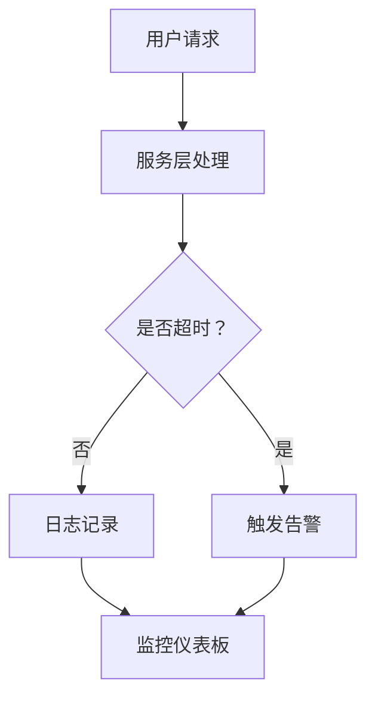

                 

# 文章标题：SRE可观测性最佳实践

> 关键词：SRE，可观测性，监控，日志，Prometheus，Grafana，ELK Stack

> 摘要：本文旨在深入探讨SRE（Site Reliability Engineering）中的可观测性最佳实践。我们将详细分析SRE的基础知识、可观测性设计原则、监控与告警策略，并通过实际案例和项目实战展示如何实现高效的可观测性实践。文章将涵盖从基础设施到应用性能监控的各个方面，旨在帮助读者构建稳定、可靠的IT系统。

### 目录

#### 第一部分：SRE基础

- 第1章：SRE概述
  - 1.1 SRE的定义和起源
  - 1.2 SRE的核心价值观
  - 1.3 SRE与DevOps的关系

- 第2章：SRE工具和框架
  - 2.1 Prometheus的使用
  - 2.2 Grafana的可视化
  - 2.3 ELK Stack的应用
  - 2.4 数据处理和存储解决方案

#### 第二部分：可观测性设计

- 第3章：可观测性原则
  - 3.1 响应性、弹性和可持续性的关系
  - 3.2 架构设计中的可观测性
  - 3.3 应用层和基础设施层的观测指标

- 第4章：日志收集和管理
  - 4.1 日志格式的选择
  - 4.2 日志聚合工具的选择
  - 4.3 日志存储与检索策略

- 第5章：监控与告警
  - 5.1 监控系统的设计原则
  - 5.2 告警策略和最佳实践
  - 5.3 自我修复与自动化响应

#### 第三部分：可观测性实践

- 第6章：可观测性案例研究
  - 6.1 案例一：在线购物平台
  - 6.2 案例二：金融交易系统
  - 6.3 案例三：实时通讯应用

- 第7章：可观测性工程实践
  - 7.1 基础设施监控
  - 7.2 应用性能监控
  - 7.3 服务依赖监控
  - 7.4 日志分析实践

- 第8章：SRE团队建设
  - 8.1 SRE团队的角色和职责
  - 8.2 SRE团队的构建与管理
  - 8.3 SRE团队的文化与价值观

#### 附录

- 附录A：常用可观测性工具介绍
  - 8.1 Prometheus的详细配置和使用
  - 8.2 Grafana的定制和扩展
  - 8.3 ELK Stack的搭建与优化

- 附录B：可观测性相关技术文档和资源
  - 8.1 Prometheus官方文档
  - 8.2 Grafana官方文档
  - 8.3 ELK Stack官方文档
  - 8.4 其他相关工具和资源的推荐

---

在接下来的文章中，我们将逐步深入探讨SRE中的可观测性最佳实践，帮助您理解和应用这些原则，构建稳定、高效的IT系统。请让我们一步一步分析推理，思考每一个细节。

## 第一部分：SRE基础

### 第1章：SRE概述

#### 1.1 SRE的定义和起源

SRE（Site Reliability Engineering）是一种将软件工程和系统管理的最佳实践应用于确保云服务可靠性的方法。它起源于Google，最初是为了解决Google大规模分布式系统的可靠性和稳定性问题。SRE的核心目标是确保系统的可靠运行，同时最大限度地提高系统的可用性和性能。

SRE的定义可以简单概括为：SRE是一组工程师，他们像软件工程师一样编写和维护系统，同时像系统管理员一样确保系统运行可靠。SRE工程师不仅关注系统的高可用性和性能，还致力于自动化系统的部署、扩展和监控。

SRE的起源可以追溯到2003年，当时Google工程师Chris Jones在内部会议上提出了一种新的方法来管理大规模分布式系统。这种方法将传统的系统管理和软件工程相结合，强调自动化和持续改进。随着时间的推移，这种方法逐渐演变成了SRE，并在Google内部广泛应用。

#### 1.2 SRE的核心价值观

SRE的核心价值观可以归纳为以下几点：

1. **可靠性**：确保系统在长时间运行过程中保持高可用性和稳定性，减少故障和中断。
2. **自动化**：通过自动化工具和流程来减少手动操作，提高效率并减少人为错误。
3. **透明性**：确保系统的运行状态和性能指标对相关人员透明，便于实时监控和问题排查。
4. **可持续性**：通过持续改进和反馈循环，不断提高系统的可靠性和性能。

#### 1.3 SRE与DevOps的关系

SRE与DevOps都是现代IT领域的关键概念，它们之间存在紧密的联系和差异。

**DevOps**是一种文化和实践方法，旨在将软件开发和IT运营结合起来，提高软件交付速度和质量。DevOps强调跨职能团队合作、持续集成和持续部署。

**SRE**则是DevOps的一部分，更专注于系统的可靠性工程。SRE将软件工程的最佳实践应用于系统管理，确保系统在长期运行过程中保持高可用性和稳定性。

**关系**：SRE是DevOps的一种具体实现，它们的目标都是提高软件交付速度和质量，但SRE更注重系统的可靠性。DevOps强调软件开发和IT运营的融合，而SRE则更关注系统的稳定性和可靠性。

**差异**：DevOps是一个更广泛的概念，包括软件开发、测试、部署和运营的各个方面。SRE则是DevOps中的一个细分领域，专注于系统的可靠性工程。

### 第2章：SRE工具和框架

SRE领域中有许多常用的工具和框架，这些工具和框架有助于实现可观测性、自动化和持续改进。以下是其中一些重要的工具和框架：

#### 2.1 Prometheus的使用

Prometheus是一种开源的监控解决方案，它具有高度可扩展性和灵活性。Prometheus的核心组件包括：

- **Server**：负责存储和查询监控数据。
- **Exporter**：用于从目标系统中提取监控数据。
- **Pushgateway**：用于处理临时或间歇性目标的数据推送。
- **Alertmanager**：用于接收和处理告警通知。

Prometheus使用拉取模型（Pull Model）来获取监控数据。通过配置目标地址和指标路径，Prometheus可以定期从目标系统中提取数据。这种模型具有以下优点：

- **灵活性**：Prometheus可以监控各种类型的目标，包括应用程序、服务、网络设备和硬件。
- **可扩展性**：Prometheus可以轻松扩展，以支持大规模监控需求。
- **健壮性**：Prometheus具有内置的数据存储和查询功能，可以保证数据的持久性和可靠性。

#### 2.2 Grafana的可视化

Grafana是一种开源的监控和可视化平台，它可以将Prometheus等数据源中的监控数据可视化。Grafana的核心组件包括：

- **Server**：负责处理用户请求和可视化面板。
- **Data Sources**：用于连接各种数据源，如Prometheus、InfluxDB等。
- **Panels**：用于可视化监控数据，包括图表、仪表板和表等。

Grafana具有以下优点：

- **可定制性**：用户可以根据需求自定义面板和仪表板，以展示所需的监控数据。
- **易用性**：Grafana提供了直观的用户界面，使监控数据可视化变得简单。
- **可扩展性**：Grafana支持多种数据源和插件，可以轻松扩展其功能。

#### 2.3 ELK Stack的应用

ELK Stack是一种开源的日志分析和监控解决方案，由Elasticsearch、Logstash和Kibana组成。

- **Elasticsearch**：是一种分布式、可扩展的全文搜索引擎，用于存储和检索日志数据。
- **Logstash**：是一种数据处理和传输工具，用于收集、处理和路由日志数据。
- **Kibana**：是一种可视化平台，用于分析、监控和展示日志数据。

ELK Stack的优点包括：

- **高性能**：Elasticsearch具有高效的数据存储和检索能力，可以处理大规模日志数据。
- **灵活性**：Logstash可以处理各种格式的日志数据，并支持多种数据源。
- **可视化**：Kibana提供了丰富的可视化工具，可以帮助用户轻松分析日志数据。

#### 2.4 数据处理和存储解决方案

在SRE中，数据处理和存储是关键环节。以下是一些常用的数据处理和存储解决方案：

- **Kafka**：是一种分布式消息队列系统，用于处理大规模日志数据。
- **Hadoop**：是一种大数据处理框架，可以用于存储和处理大规模数据。
- **Cassandra**：是一种分布式键值存储系统，可以用于存储大规模监控数据。
- **MongoDB**：是一种分布式文档数据库，可以用于存储结构化监控数据。

这些解决方案具有以下优点：

- **可扩展性**：支持水平扩展，可以处理大规模数据。
- **高可用性**：具有强大的容错能力，可以保证数据的可靠性和持久性。
- **性能**：具有高性能的数据处理和存储能力。

### 小结

在本章中，我们介绍了SRE的基础知识，包括SRE的定义、起源和核心价值观，以及SRE与DevOps的关系。我们还讨论了SRE领域中常用的工具和框架，如Prometheus、Grafana和ELK Stack，以及数据处理和存储解决方案。通过这些工具和框架，我们可以实现高效的可观测性、自动化和持续改进。

在下一章中，我们将深入探讨可观测性设计原则，帮助读者理解如何在架构设计中实现可观测性，以及应用层和基础设施层的观测指标。

## 第二部分：可观测性设计

### 第3章：可观测性原则

#### 3.1 响应性、弹性和可持续性的关系

在SRE中，可观测性是确保系统可靠性的关键。为了实现高可用性和稳定性，我们需要关注三个核心原则：响应性、弹性和可持续性。

**响应性**是指系统能够快速响应外部事件，如用户请求或故障。一个高响应性的系统可以在较短的时间内处理请求，减少延迟和等待时间。响应性通常通过优化系统性能、减少资源消耗和改进算法来实现。

**弹性**是指系统在面对故障或压力时能够自动调整资源，以保持正常运行。弹性系统可以在负载增加时自动扩展资源，在负载减少时自动缩减资源。弹性可以通过自动化、容器化和分布式架构来实现。

**可持续性**是指系统能够在长时间内保持稳定运行，减少故障和中断。可持续性通常通过监控、告警、自动化和持续改进来实现。一个可持续的系统具有透明性，使相关人员能够实时了解系统状态和性能。

响应性、弹性和可持续性之间存在密切关系：

- **响应性是基础**：只有当系统能够快速响应外部事件时，才可能实现弹性和可持续性。
- **弹性是保障**：弹性系统能够在面对故障或压力时保持正常运行，确保响应性。
- **可持续性是目标**：可持续性目标是确保系统在长时间内保持稳定运行，减少故障和中断。

在实现可观测性时，我们需要综合考虑这三个原则，以确保系统能够在高负载和故障情况下保持稳定运行。

#### 3.2 架构设计中的可观测性

在架构设计中实现可观测性是确保系统可靠性和稳定性的关键。以下是一些实现可观测性的设计原则：

**1. 分层架构**：

分层架构可以将系统划分为多个独立的层，如表示层、业务逻辑层和数据访问层。每个层次都可以独立监控和告警，从而提高系统的可观测性。

**2. 模块化**：

模块化设计可以将系统划分为多个模块，每个模块具有独立的功能和接口。这种设计便于监控和调试，可以快速定位和解决问题。

**3. 服务化**：

将系统划分为多个服务，每个服务负责特定的功能。服务化架构可以提高系统的可观测性，因为每个服务都可以独立监控和告警。

**4. 分布式**：

分布式架构可以将系统部署到多个节点上，以提高可用性和性能。分布式系统可以更好地监控和告警，因为每个节点都可以独立收集和报告监控数据。

**5. 自动化**：

通过自动化工具和流程，可以实现系统的自动监控、告警和修复。自动化可以提高系统的响应性和可持续性，减少人为干预和错误。

#### 3.3 应用层和基础设施层的观测指标

在实现可观测性时，我们需要关注应用层和基础设施层的观测指标。以下是一些常用的观测指标：

**应用层**：

- **响应时间**：表示系统处理请求所需的时间，是衡量系统性能的关键指标。
- **错误率**：表示系统发生错误的频率，可以反映系统的稳定性和可靠性。
- **吞吐量**：表示系统每秒处理请求的数量，是衡量系统性能的重要指标。
- **并发用户数**：表示同时在线的用户数量，可以反映系统的负载能力。

**基础设施层**：

- **CPU利用率**：表示CPU的利用率，可以反映系统资源的利用情况。
- **内存利用率**：表示内存的利用率，可以反映系统资源的利用情况。
- **磁盘IO**：表示磁盘的读写速度，可以反映系统性能。
- **网络流量**：表示网络的流量，可以反映系统性能和网络稳定性。

通过监控这些观测指标，我们可以实时了解系统的状态和性能，及时发现和解决问题。

### 小结

在本章中，我们深入探讨了SRE中的可观测性原则，包括响应性、弹性和可持续性的关系，以及在架构设计中实现可观测性的设计原则。我们还介绍了应用层和基础设施层的观测指标，帮助读者理解如何在设计中实现高效的可观测性。

在下一章中，我们将讨论日志收集和管理，包括日志格式的选择、日志聚合工具的选择以及日志存储与检索策略。通过这些讨论，我们将进一步了解如何实现全面的可观测性。

### 第4章：日志收集和管理

日志是系统运行过程中产生的重要信息，包含错误信息、调试信息和业务数据等。有效收集和管理日志对于确保系统的可靠性和稳定性至关重要。以下是我们将在本章中探讨的内容：

#### 4.1 日志格式的选择

日志格式的选择是日志收集和管理的基础。常用的日志格式包括以下几种：

**1. JSON格式**：

JSON（JavaScript Object Notation）是一种轻量级的数据交换格式，具有简洁、易读和易于处理的特点。JSON格式支持复杂的数据结构，可以包含日志的详细信息，如时间戳、错误代码、错误描述和上下文信息。以下是一个示例：

```json
{
  "timestamp": "2023-11-08T12:34:56Z",
  "level": "ERROR",
  "message": "An unexpected error occurred",
  "error_code": "500",
  "context": {
    "user_id": "123",
    "operation": "login"
  }
}
```

**2. Apache日志格式**：

Apache日志格式是一种常用的Web服务器日志格式，包含请求时间、客户端IP地址、请求方法、请求URL、HTTP协议版本、状态码和内容长度等信息。以下是一个示例：

```
192.168.1.1 - - [08/Nov/2023:12:34:56 +0000] "GET /index.html HTTP/1.1" 200 4096
```

**3. Common Log格式**：

Common Log格式是一种简化版的Apache日志格式，包含请求时间、客户端IP地址和请求URL等信息。以下是一个示例：

```
[08/Nov/2023:12:34:56 +0000] 192.168.1.1 "GET /index.html HTTP/1.1"
```

**选择建议**：

- 对于复杂日志，推荐使用JSON格式，因为它可以包含详细的日志信息，便于后续处理和分析。
- 对于简单的日志，可以使用Apache日志格式或Common Log格式，因为这些格式更加简洁，易于解析。

#### 4.2 日志聚合工具的选择

日志聚合工具用于收集、处理和存储日志数据。以下是一些常用的日志聚合工具：

**1. Logstash**：

Logstash是Elastic Stack的一部分，用于收集、处理和路由日志数据。它支持多种输入和输出插件，可以方便地与Elasticsearch、Kibana等工具集成。以下是一个示例配置：

```yaml
input {
  file {
    path => "/var/log/*.log"
    type => "syslog"
  }
}

filter {
  if [type] == "syslog" {
    grok {
      match => { "message" => "%{TIMESTAMP_ISO8601:timestamp} %{DATA:hostname} %{DATA:ip} %{DATA:username} %{DATA:command}" }
    }
  }
}

output {
  elasticsearch {
    hosts => ["localhost:9200"]
    index => "logstash-%{+YYYY.MM.dd}"
  }
}
```

**2. Fluentd**：

Fluentd是另一种流行的日志聚合工具，它支持多种数据源和输出目标，如Elasticsearch、Kafka和HDFS等。以下是一个示例配置：

```yaml
<source>
  @type logger
  @id main
  format json
  path /var/log/*.log
</source>

<match **>
  @type elasticsearch
  hosts [ "localhost:9200" ]
  index fluentd-%Y.%m.%d
</match>
```

**选择建议**：

- 如果需要与Elastic Stack集成，推荐使用Logstash。
- 如果需要与其他数据源和输出目标集成，推荐使用Fluentd。

#### 4.3 日志存储与检索策略

日志存储与检索策略是确保日志数据可用性和可靠性的关键。以下是一些建议：

**1. 数据存储**：

- **分布式存储**：使用分布式存储系统（如Elasticsearch、Cassandra、HDFS等）来存储日志数据，以提高存储容量和性能。
- **分层存储**：根据日志的重要性和访问频率，将日志数据存储在不同的存储层，如SSD、HDD和云存储等。
- **数据压缩**：对日志数据进行压缩，以减少存储空间和传输带宽。

**2. 数据检索**：

- **索引管理**：定期对日志数据进行索引，以提高检索速度。
- **缓存策略**：使用缓存策略（如Redis、Memcached等）来缓存常用日志数据，以减少数据库访问压力。
- **查询优化**：优化日志查询语句，使用索引和缓存策略来提高查询速度。

**3. 数据备份**：

- **定期备份**：定期对日志数据进行备份，以防数据丢失或损坏。
- **异地备份**：将备份存储在异地，以提高数据安全性。

### 小结

在本章中，我们详细探讨了日志收集和管理，包括日志格式的选择、日志聚合工具的选择以及日志存储与检索策略。通过选择合适的日志格式、使用高效的日志聚合工具和制定合理的日志存储与检索策略，我们可以确保系统日志的全面、准确和可靠，从而实现高效的可观测性。

在下一章中，我们将讨论监控与告警，包括监控系统的设计原则、告警策略和最佳实践，以及自我修复与自动化响应。通过这些内容，我们将进一步了解如何在系统中实现全面的监控和自动化。

### 第5章：监控与告警

在SRE中，监控与告警是确保系统稳定性和可靠性的关键环节。有效的监控系统能够实时检测系统的状态和性能，及时发现问题并进行处理。本章将讨论监控与告警的设计原则、告警策略和最佳实践，以及自我修复与自动化响应。

#### 5.1 监控系统的设计原则

监控系统的设计原则是确保其高效、可靠和易维护。以下是一些核心原则：

**1. 全面性**：

监控系统应覆盖系统的各个方面，包括应用层、基础设施层和第三方服务。通过全面监控，我们可以及时发现和解决问题。

**2. 可扩展性**：

监控系统应具备良好的扩展性，以适应系统规模的变化。扩展性包括支持多种数据源、可水平扩展的存储和计算资源等。

**3. 可靠性**：

监控系统应具有高可靠性，确保数据采集、处理和存储的准确性。可靠性包括数据备份、故障转移和容错机制等。

**4. 易用性**：

监控系统应具备直观的用户界面和良好的用户体验，使相关人员能够轻松使用和管理。

**5. 自动化**：

监控系统应支持自动化告警和自动化响应，以减少人为干预，提高问题处理效率。

**6. 可定制性**：

监控系统应支持用户自定义监控指标、告警策略和自动化流程，以满足不同场景的需求。

#### 5.2 告警策略和最佳实践

告警策略是监控系统的重要组成部分，它决定了如何检测和通知系统异常。以下是一些告警策略和最佳实践：

**1. 设定合理的阈值**：

设定合理的阈值是告警策略的关键。阈值应根据系统的实际运行情况和历史数据来确定。过高或过低的阈值都会影响告警的准确性和及时性。

**2. 多维度告警**：

告警应从多个维度进行，包括性能、可用性、安全性等。多维度告警可以更全面地反映系统的运行状态。

**3. 告警分级**：

告警应分为不同级别，如警告、严重和灾难等。不同级别的告警应采用不同的处理流程和通知方式。

**4. 满足SLA要求**：

告警策略应满足服务级别协议（SLA）的要求，确保关键服务和业务流程的稳定性。

**5. 自适应告警**：

告警策略应具备自适应能力，根据系统的运行状态自动调整阈值和告警策略，以适应不同负载和场景。

**最佳实践**：

- **定期评估告警策略**：定期评估和调整告警策略，确保其与系统实际情况相符。
- **告警通知渠道**：使用多种通知渠道，如邮件、短信、电话和即时通讯工具，以确保及时通知相关人员。
- **告警归档和分析**：记录和归档告警信息，定期分析告警数据，以识别潜在问题和改进监控策略。

#### 5.3 自我修复与自动化响应

自动化响应是SRE中实现高可靠性的重要手段。通过自动化响应，系统可以在检测到异常时自动执行一系列操作，以解决问题并恢复正常运行。以下是一些自我修复和自动化响应的方法：

**1. 自我修复**：

- **自动重启**：在检测到服务崩溃时，自动重启服务，以确保服务继续运行。
- **自动扩展**：在检测到负载过高时，自动增加资源，以应对突发流量。
- **自动回滚**：在部署失败时，自动回滚到上一个稳定版本，以确保系统正常运行。

**2. 自动化响应**：

- **脚本化**：使用脚本或自动化工具自动化执行一系列操作，如重启服务、重新加载配置或清理缓存等。
- **云平台API**：利用云平台提供的API，自动执行资源管理和调度操作，如创建虚拟机、调整负载均衡器配置等。
- **集成系统**：集成其他自动化系统（如CI/CD、自动化测试等），实现端到端的自动化响应。

**最佳实践**：

- **自动化测试**：在自动化响应中包含自动化测试，以确保操作不会引入新的问题。
- **监控自动化**：监控自动化响应的执行结果，确保操作成功并达到预期效果。
- **文档化**：详细记录自动化响应的流程和步骤，以便后续维护和改进。

### 小结

在本章中，我们详细探讨了监控与告警的设计原则、告警策略和最佳实践，以及自我修复与自动化响应。通过遵循这些原则和实践，我们可以构建高效、可靠的监控系统，确保系统的稳定性和可靠性。

在下一章中，我们将通过实际案例研究，探讨如何在不同类型的系统中实现可观测性，并分享一些成功经验和教训。

### 第6章：可观测性案例研究

通过前面的章节，我们了解了SRE和可观测性的理论基础和设计原则。在本章中，我们将通过具体案例研究，探讨如何在实际项目中应用这些原则，并分享一些成功经验和教训。

#### 6.1 案例一：在线购物平台

**背景**：

一个大型在线购物平台在经历了一次大规模促销活动后，出现了系统卡顿和响应时间延长的问题。用户反馈和日志分析显示，服务器负载过高是导致问题的根本原因。

**解决过程**：

1. **监控部署**：

   - 部署了Prometheus作为监控系统，收集服务器、数据库和应用程序的监控数据。
   - 使用Grafana进行数据可视化，实时监控系统性能。

2. **日志分析**：

   - 使用ELK Stack收集和存储应用程序日志，通过Kibana进行日志分析。
   - 识别错误日志和性能瓶颈，定位问题源头。

3. **性能优化**：

   - 分析监控数据和日志，发现数据库查询效率低下。
   - 对数据库进行优化，如索引重建、查询优化和缓存策略调整。

4. **自动扩容**：

   - 部署Kubernetes集群，利用其自动扩容功能，在负载过高时自动增加服务器实例。
   - 结合Prometheus的告警功能，实现自动扩容和缩容。

**经验教训**：

- **全面监控**：通过部署全面的监控和日志系统，及时发现问题并定位问题源头。
- **自动化扩容**：利用自动化工具和云平台API，实现自动扩容和缩容，提高系统弹性。
- **持续优化**：定期分析监控数据和日志，持续优化系统性能和可靠性。

#### 6.2 案例二：金融交易系统

**背景**：

一个金融交易系统在交易高峰期频繁出现交易失败和系统卡顿的问题，严重影响用户体验和业务运营。

**解决过程**：

1. **性能监控**：

   - 使用Prometheus和Grafana监控服务器、数据库和交易服务的性能指标。
   - 定期生成性能报告，分析系统瓶颈。

2. **日志收集**：

   - 使用Logstash收集交易服务的日志，并传输到Elasticsearch和Kibana。
   - 分析日志，识别错误和异常交易。

3. **流量控制**：

   - 在前端部署流量控制模块，限制请求速率，避免系统过载。
   - 通过Prometheus和Grafana实时监控流量控制效果，调整阈值。

4. **交易优化**：

   - 对交易逻辑进行优化，减少计算复杂度和资源消耗。
   - 利用数据库连接池和缓存策略，提高交易处理效率。

5. **自动化修复**：

   - 部署自动化脚本，在检测到交易失败时自动重试。
   - 结合Prometheus告警，实现自动重试和故障恢复。

**经验教训**：

- **实时监控**：通过实时监控和日志分析，快速识别系统瓶颈和异常。
- **流量控制**：合理控制流量，避免系统过载。
- **自动化修复**：通过自动化脚本和告警系统，实现自动重试和故障恢复，提高系统可用性。

#### 6.3 案例三：实时通讯应用

**背景**：

一个实时通讯应用在用户量增加时出现消息延迟和偶尔的连接中断问题，影响用户体验。

**解决过程**：

1. **网络监控**：

   - 使用Prometheus监控网络流量、延迟和丢包率，识别网络问题。
   - 使用Grafana可视化网络监控数据，实时监控网络状态。

2. **服务监控**：

   - 监控消息队列和数据库性能指标，分析系统瓶颈。
   - 通过Grafana仪表板展示消息队列长度和延迟情况。

3. **日志收集**：

   - 使用Logstash收集应用日志，传输到Elasticsearch和Kibana。
   - 分析日志，定位消息延迟和连接中断的原因。

4. **网络优化**：

   - 调整网络配置，优化TCP/IP参数，提高网络传输效率。
   - 使用负载均衡器，均衡网络流量，避免单点故障。

5. **消息队列优化**：

   - 对消息队列进行优化，如增加队列长度、调整优先级等，提高消息处理能力。
   - 使用缓存策略，减少数据库访问压力。

6. **自动化部署**：

   - 使用自动化工具，如Kubernetes和Ansible，实现应用的自动化部署和扩容。
   - 结合Prometheus告警，实现自动扩容和故障恢复。

**经验教训**：

- **网络监控**：通过实时监控网络状态，及时发现和解决问题。
- **服务监控**：监控消息队列和数据库性能，优化系统性能。
- **自动化部署**：实现自动化部署和扩容，提高系统可靠性和可维护性。

### 小结

通过以上案例研究，我们可以看到，不同类型的系统在实现可观测性时，都遵循了一些核心原则，如全面监控、实时日志分析、自动化和持续优化。同时，每个案例都有其独特之处，需要根据具体情况制定合适的监控策略和优化方案。

在本章中，我们通过实际案例展示了如何在项目中应用SRE和可观测性的最佳实践。在下一章中，我们将深入探讨可观测性工程实践，包括基础设施监控、应用性能监控、服务依赖监控和日志分析实践。

### 第7章：可观测性工程实践

在SRE中，可观测性工程实践是确保系统可靠性和稳定性的关键环节。本章将详细探讨可观测性工程实践中的几个重要方面：基础设施监控、应用性能监控、服务依赖监控和日志分析实践。

#### 7.1 基础设施监控

基础设施监控是确保系统正常运行的基础。以下是一些基础设施监控的关键点和实践：

**1. 监控指标**：

- **CPU利用率**：监控CPU的利用率，识别高负载情况。
- **内存利用率**：监控内存的利用率，识别内存泄漏或异常。
- **磁盘I/O**：监控磁盘的读写速度，识别I/O瓶颈。
- **网络流量**：监控网络流量，识别网络拥堵或异常。
- **负载均衡器**：监控负载均衡器的状态和流量分布，识别负载不均衡问题。

**2. 监控工具**：

- **Prometheus**：使用Prometheus作为基础设施监控工具，可以收集和存储大量监控数据，提供高效的数据查询和可视化。
- **Grafana**：结合Grafana，可以创建自定义仪表板，实时监控基础设施性能指标。

**3. 监控策略**：

- **阈值设置**：根据历史数据和业务需求，设定合理的阈值，及时发现异常情况。
- **自动化告警**：通过Prometheus和Grafana的集成，实现自动化告警，确保及时发现和处理问题。

**4. 实践案例**：

- 在一个大型数据中心中，使用Prometheus监控所有服务器的CPU、内存、磁盘I/O和网络流量等指标。通过Grafana创建仪表板，实时监控基础设施性能。当发现CPU利用率超过90%时，自动触发告警，通知运维团队进行排查和优化。

#### 7.2 应用性能监控

应用性能监控是确保应用程序稳定性和性能的关键。以下是一些应用性能监控的关键点和实践：

**1. 监控指标**：

- **响应时间**：监控应用程序的响应时间，识别性能瓶颈。
- **吞吐量**：监控应用程序的吞吐量，识别负载能力。
- **错误率**：监控应用程序的错误率，识别异常和错误。
- **并发用户数**：监控同时在线的用户数，识别负载情况。

**2. 监控工具**：

- **Prometheus**：使用Prometheus收集应用程序的性能数据，存储和查询性能指标。
- **Grafana**：结合Grafana，创建自定义仪表板，实时监控应用性能。

**3. 监控策略**：

- **业务指标**：根据业务需求，设定关键业务指标，如订单处理速度、用户请求响应时间等。
- **自动化测试**：定期进行自动化性能测试，确保应用程序在高负载下的稳定性。

**4. 实践案例**：

- 在一个电商平台中，使用Prometheus监控订单处理速度、用户请求响应时间和错误率等指标。通过Grafana创建仪表板，实时监控应用性能。当订单处理速度低于预期时，自动触发告警，通知开发团队进行优化。

#### 7.3 服务依赖监控

服务依赖监控是确保系统各组件正常运行的关键。以下是一些服务依赖监控的关键点和实践：

**1. 监控指标**：

- **依赖延迟**：监控各服务之间的延迟，识别依赖问题。
- **依赖失败率**：监控各服务之间的失败率，识别依赖异常。
- **依赖可用性**：监控各服务的可用性，识别依赖问题。

**2. 监控工具**：

- **Prometheus**：使用Prometheus监控各服务的依赖关系和性能指标。
- **Grafana**：结合Grafana，创建自定义仪表板，实时监控服务依赖情况。

**3. 监控策略**：

- **服务链监控**：监控服务链中的每个服务，确保各服务之间正常协作。
- **告警联动**：当某个服务依赖出现问题时，自动触发相关服务的告警，确保问题得到及时处理。

**4. 实践案例**：

- 在一个分布式系统中，使用Prometheus监控各个服务的依赖关系和性能指标。通过Grafana创建仪表板，实时监控服务依赖情况。当发现某个服务依赖失败时，自动触发告警，通知相关团队进行排查和修复。

#### 7.4 日志分析实践

日志分析是确保系统运行安全和稳定性的重要手段。以下是一些日志分析的关键点和实践：

**1. 日志格式**：

- **标准化日志格式**：使用统一的日志格式，便于日志的收集、存储和检索。
- **JSON日志格式**：推荐使用JSON日志格式，支持复杂的数据结构和丰富的日志信息。

**2. 日志收集**：

- **集中收集**：使用Logstash或Fluentd等日志聚合工具，将分布式系统的日志集中收集到日志存储系统。
- **增量收集**：定期收集日志，避免大量日志数据的丢失。

**3. 日志存储**：

- **分布式存储**：使用分布式存储系统（如Elasticsearch、Cassandra等），支持大规模日志数据的存储和检索。
- **分层存储**：根据日志的重要性和访问频率，采用分层存储策略，提高存储效率和性能。

**4. 日志分析**：

- **实时分析**：使用Elasticsearch和Kibana等工具，实现实时日志分析，快速识别异常和问题。
- **自动化分析**：通过自定义脚本或自动化工具，实现日志的自动化分析和告警。

**5. 实践案例**：

- 在一个企业级系统中，使用Logstash将分布式系统的日志集中收集到Elasticsearch。通过Kibana创建自定义仪表板，实时分析日志，识别异常和问题。当发现某个服务出现异常时，自动触发告警，通知运维团队进行排查和修复。

### 小结

在本章中，我们详细探讨了可观测性工程实践中的基础设施监控、应用性能监控、服务依赖监控和日志分析实践。通过遵循这些实践，我们可以确保系统的可靠性和稳定性，提高系统的可用性和性能。

在下一章中，我们将讨论SRE团队建设，包括SRE团队的角色和职责、构建与管理SRE团队以及SRE团队的文化与价值观。通过这些讨论，我们将了解如何建立一个高效、协作的SRE团队。

### 第8章：SRE团队建设

SRE团队在构建和保障高可靠性的IT系统中发挥着至关重要的作用。一个成功的SRE团队需要具备专业的技术能力、良好的沟通协作以及明确的角色和职责。本章将探讨SRE团队建设的关键方面，包括角色和职责、构建与管理SRE团队以及SRE团队的文化与价值观。

#### 8.1 SRE团队的角色和职责

SRE团队的角色和职责可以概括为以下几点：

**1. 系统可靠性**：

SRE团队负责确保系统的可靠性，包括系统的可用性、性能和稳定性。他们通过监控、日志分析、自动化和故障管理，实现系统的持续优化。

**2. 自动化**：

SRE团队致力于自动化系统的各个方面，包括部署、扩缩容、监控和故障恢复。通过自动化，减少手动操作，提高效率并减少人为错误。

**3. 故障管理**：

SRE团队负责及时发现和处理系统故障，确保系统快速恢复。他们通过监控、告警和自动化脚本，实现故障的快速定位和解决。

**4. 服务水平协议（SLA）**：

SRE团队负责制定和监控服务级别协议（SLA），确保系统达到预定的服务质量标准。他们通过监控数据和用户反馈，评估系统的运行状况。

**5. 架构优化**：

SRE团队参与系统架构的设计和优化，确保系统能够满足业务需求并具备良好的可扩展性和可靠性。他们关注系统的性能、稳定性和安全性。

**6. 文档和培训**：

SRE团队负责编写和维护系统文档，为团队成员提供培训和支持，确保团队成员掌握系统运行和管理的基本技能。

#### 8.2 SRE团队的构建与管理

构建和管理一个高效的SRE团队需要综合考虑以下几个方面：

**1. 人员招聘**：

- **技术能力**：招聘具备扎实技术背景的成员，熟悉系统架构、编程语言和工具。
- **协作能力**：招聘具备良好沟通协作能力的成员，能够与团队成员和其他部门有效合作。
- **学习能力**：招聘具备快速学习能力的成员，能够适应不断变化的技术和业务需求。

**2. 团队组织结构**：

- **职能分工**：根据团队规模和业务需求，设立不同的职能小组，如基础设施组、应用组、故障管理组等。
- **跨职能协作**：促进不同职能小组之间的协作，确保系统各组件的协调运作。

**3. 能力培养**：

- **技术培训**：定期组织技术培训和分享会，提升团队成员的技术水平。
- **项目管理**：培训团队成员掌握项目管理方法和工具，提高团队协作效率。

**4. 文化和价值观**：

- **透明度**：建立透明的沟通机制，鼓励团队成员分享知识和经验，促进团队内部的交流。
- **持续改进**：鼓励团队成员提出改进建议，推动系统的持续优化。
- **协作精神**：倡导协作精神，鼓励团队成员相互支持，共同解决问题。

**5. 激励机制**：

- **绩效评估**：建立合理的绩效评估机制，激励团队成员不断提高工作质量。
- **职业发展**：提供职业发展路径和晋升机会，鼓励团队成员持续成长。

#### 8.3 SRE团队的文化与价值观

SRE团队的文化与价值观是团队成功的关键因素。以下是一些核心的文化和价值观：

**1. 客户导向**：

SRE团队始终将客户需求放在首位，关注客户体验和满意度。他们通过快速响应客户需求，不断优化系统，确保客户得到高质量的服务。

**2. 创新精神**：

SRE团队鼓励创新思维，鼓励团队成员提出新的想法和解决方案。他们通过不断探索新技术和方法，推动团队的技术进步和业务发展。

**3. 实用主义**：

SRE团队注重实际效果，追求实用主义。他们在系统设计和优化过程中，关注实际效果和业务价值，避免过度设计和不必要的复杂性。

**4. 透明和信任**：

SRE团队倡导透明和信任，建立良好的沟通和协作氛围。他们通过开放的心态和积极的沟通，促进团队内部的信任和理解。

**5. 持续改进**：

SRE团队追求持续改进，通过定期回顾和反思，不断优化系统和管理流程。他们通过不断学习和实践，提高团队的整体能力和效率。

### 小结

在本章中，我们详细探讨了SRE团队建设的关键方面，包括角色和职责、构建与管理SRE团队以及SRE团队的文化与价值观。通过构建一个高效、协作的SRE团队，我们可以确保系统的高可靠性、稳定性和高性能。

在下一章中，我们将提供一些常用可观测性工具的详细介绍，包括Prometheus、Grafana和ELK Stack的详细配置和使用方法。通过这些工具的使用，我们可以更好地实现系统的可观测性。

### 附录A：常用可观测性工具介绍

在本章中，我们将详细介绍一些常用的可观测性工具，包括Prometheus、Grafana和ELK Stack。这些工具在SRE实践中具有广泛的应用，可以帮助我们实现高效的监控、告警和日志分析。

#### A.1 Prometheus的详细配置和使用

**1. Prometheus安装**：

Prometheus是一个开源的监控解决方案，可以通过官方文档提供的安装指南进行安装。以下是简要的安装步骤：

- **Docker安装**：首先安装Docker，然后从Docker Hub拉取Prometheus镜像。

  ```shell
  docker pull prom/prometheus
  docker run -d -p 9090:9090 --name prometheus prom/prometheus
  ```

- **Kubernetes安装**：在Kubernetes集群中部署Prometheus，可以创建一个名为`prometheus.yml`的配置文件，并在集群中部署。

**2. Prometheus配置文件**：

Prometheus的核心配置文件是`prometheus.yml`，以下是一个简单的配置示例：

```yaml
global:
  scrape_interval: 15s
  evaluation_interval: 15s

scrape_configs:
  - job_name: 'prometheus'
    static_configs:
      - targets: ['localhost:9090']
  - job_name: 'nginx'
    static_configs:
      - targets: ['10.0.0.1:9090']
  - job_name: 'web_server'
    static_configs:
      - targets: ['10.0.0.2:8080']
```

**3. Prometheus的使用**：

Prometheus的主要功能是收集目标系统的监控数据，并将其存储在本地时间序列数据库中。以下是一些常用命令：

- **查看监控数据**：使用`promql`查询语言查询监控数据。

  ```shell
  curl http://localhost:9090/api/v1/query?query=up
  ```

- **导出监控数据**：将监控数据导出为CSV文件。

  ```shell
  curl http://localhost:9090/api/v1/export?start=now-15m&end=now&step=15s&format=csv
  ```

#### A.2 Grafana的定制和扩展

**1. Grafana安装**：

Grafana可以通过官方文档提供的安装指南进行安装。以下是简要的安装步骤：

- **Docker安装**：安装Docker，然后从Docker Hub拉取Grafana镜像。

  ```shell
  docker pull grafana/grafana
  docker run -d -p 3000:3000 --name grafana grafana/grafana
  ```

- **Kubernetes安装**：在Kubernetes集群中部署Grafana，可以创建一个名为`grafana.yml`的配置文件，并在集群中部署。

**2. Grafana配置**：

Grafana的核心配置文件是`grafana.ini`，以下是一个简单的配置示例：

```ini
[general]
domain = localhost
http_addr = 0.0.0.0
http_port = 3000

[smtp]
enabled = false
host = smtp.example.com
port = 587
user = user@example.com
password = password
ssl = true

[database]
name = grafana
type = mysql
host = localhost
port = 3306
user = grafana
password = grafana

[secure]
cookie_encryption_key = <your-encryption-key>
```

**3. Grafana的使用**：

Grafana主要用于可视化监控数据，以下是一些常用功能：

- **创建数据源**：在Grafana中创建数据源，连接到Prometheus、InfluxDB等监控数据存储系统。
- **创建仪表板**：使用Grafana的可视化界面，创建自定义仪表板，展示监控数据。
- **创建告警**：配置告警规则，当监控数据超过阈值时，发送告警通知。

#### A.3 ELK Stack的搭建与优化

**1. ELK Stack安装**：

ELK Stack是Elasticsearch、Logstash和Kibana的组合，可以通过官方文档提供的安装指南进行安装。以下是简要的安装步骤：

- **Elasticsearch安装**：安装Elasticsearch，配置集群模式和节点角色。
- **Logstash安装**：安装Logstash，配置输入、过滤和输出插件。
- **Kibana安装**：安装Kibana，配置Elasticsearch连接和仪表板。

**2. Elasticsearch配置**：

Elasticsearch的核心配置文件是`elasticsearch.yml`，以下是一个简单的配置示例：

```yaml
cluster.name: my-application
node.name: my-node
network.host: 0.0.0.0
http.port: 9200
discovery.type: single-node
```

**3. Logstash配置**：

Logstash的核心配置文件是`logstash.conf`，以下是一个简单的配置示例：

```ruby
input {
  file {
    path => "/var/log/*.log"
    type => "syslog"
  }
}

filter {
  if [type] == "syslog" {
    grok {
      match => { "message" => "%{TIMESTAMP_ISO8601:timestamp} %{DATA:hostname} %{DATA:ip} %{DATA:username} %{DATA:command}" }
    }
  }
}

output {
  elasticsearch {
    hosts => ["localhost:9200"]
    index => "logstash-%{+YYYY.MM.dd}"
  }
}
```

**4. Kibana配置**：

Kibana的核心配置文件是`kibana.yml`，以下是一个简单的配置示例：

```yaml
server.port: 5601
elasticsearch.url: "http://localhost:9200"
elasticsearch.username: "kibana"
elasticsearch.password: "kibana"
```

**5. 优化建议**：

- **性能优化**：根据硬件资源和数据量，调整Elasticsearch的JVM参数和集群配置。
- **安全性**：配置Elasticsearch和Kibana的认证和授权，保护系统和数据安全。
- **监控与告警**：利用Elasticsearch和Kibana的监控功能，实现对ELK Stack的实时监控和告警。

### 小结

在本章中，我们详细介绍了Prometheus、Grafana和ELK Stack的安装、配置和使用方法。这些工具在SRE实践中具有广泛的应用，可以帮助我们实现高效的监控、告警和日志分析。通过熟悉和掌握这些工具，我们可以更好地构建和管理可观测性系统。

在下一章中，我们将提供一些可观测性相关技术文档和资源的推荐，帮助读者进一步学习和深入了解可观测性领域的最新技术和最佳实践。

### 附录B：可观测性相关技术文档和资源

为了帮助读者进一步学习和深入了解可观测性领域的最新技术和最佳实践，以下是推荐的一些可观测性相关技术文档和资源：

#### B.1 Prometheus官方文档

Prometheus是一个开源的监控解决方案，其官方文档详细介绍了Prometheus的安装、配置、使用和高级功能。以下是Prometheus官方文档的访问链接：

- **Prometheus官方文档**：[https://prometheus.io/docs/introduction/](https://prometheus.io/docs/introduction/)

#### B.2 Grafana官方文档

Grafana是一个开源的可视化平台，支持多种数据源和丰富的仪表板功能。以下是Grafana官方文档的访问链接：

- **Grafana官方文档**：[https://grafana.com/docs/grafana/latest/introduction/](https://grafana.com/docs/grafana/latest/introduction/)

#### B.3 ELK Stack官方文档

ELK Stack是Elasticsearch、Logstash和Kibana的组合，用于日志分析、监控和可视化。以下是ELK Stack官方文档的访问链接：

- **Elasticsearch官方文档**：[https://www.elastic.co/guide/en/elasticsearch/reference/current/index.html](https://www.elastic.co/guide/en/elasticsearch/reference/current/index.html)
- **Logstash官方文档**：[https://www.elastic.co/guide/en/logstash/current/index.html](https://www.elastic.co/guide/en/logstash/current/index.html)
- **Kibana官方文档**：[https://www.elastic.co/guide/en/kibana/current/index.html](https://www.elastic.co/guide/en/kibana/current/index.html)

#### B.4 其他相关工具和资源的推荐

除了Prometheus、Grafana和ELK Stack，以下是一些其他常用的可观测性工具和资源，供读者参考：

- **PromQL**：Prometheus官方提供的查询语言，用于查询和操作监控数据。更多关于PromQL的信息，可以参考[Prometheus官方文档中的PromQL部分](https://prometheus.io/docs/prometheus/latest/querying/)。
- **Grafana Dashboards**：Grafana社区提供了丰富的仪表板模板和示例，可以在Grafana的官方社区页面找到。链接：[https://grafana.com/grafana-dashboards/](https://grafana.com/grafana-dashboards/)
- **Prometheus生态系统**：除了Prometheus本身，还有很多与之相关的插件和工具，如Node.js、Java、Python等语言的 exporter。更多信息可以参考[Prometheus官方生态系统页面](https://prometheus.io/docs/integration/)。
- **Kubernetes监控**：Kubernetes是一个流行的容器编排平台，有很多工具可以用于监控Kubernetes集群，如Kubernetes Metrics Server、Prometheus-Kubernetes-Exporter等。更多关于Kubernetes监控的信息，可以参考[Kubernetes官方文档中的监控部分](https://kubernetes.io/docs/tasks/debug-application-cluster/monitor-cluster/)。

通过利用这些官方文档和资源，读者可以深入了解可观测性工具的详细使用方法和最佳实践，进一步提升自己在SRE领域的专业知识和实践能力。

### Mermaid 流程图

以下是一个Mermaid流程图，用于描述系统监控的基本流程：



### 核心算法原理讲解

#### Prometheus的监控数据聚合算法

Prometheus的核心算法是数据聚合（Data Aggregation），它允许在多维数据集上执行汇总操作，以便生成更高层次的监控数据。以下是Prometheus数据聚合算法的伪代码和数学模型。

#### 伪代码：

```plaintext
function aggregateMetrics(metricsList, aggregationConfig):
    aggregatedMetrics = empty map
    for metric in metricsList:
        for target in metric.targets:
            if shouldAggregate(metric, target, aggregationConfig):
                metricValue = extractValue(metric, target)
                aggregationKey = createAggregationKey(metric, target, aggregationConfig)
                if aggregationKey not in aggregatedMetrics:
                    aggregatedMetrics[aggregationKey] = metricValue
                else:
                    aggregatedMetrics[aggregationKey] += metricValue
    return aggregatedMetrics
```

#### 数学模型：

在Prometheus中，数据聚合通常涉及以下操作：

- **求和（Sum）**：将相同标签集合的数值相加。
- **平均值（Average）**：计算相同标签集合的数值的平均值。
- **最大值（Max）**：计算相同标签集合的数值中的最大值。
- **最小值（Min）**：计算相同标签集合的数值中的最小值。

设\(M\)为监控数据集合，\(M_i\)为具有相同标签集合的监控数据子集，则：

- **求和**：\( \sum_{i} M_i \)
- **平均值**：\( \frac{1}{|M|} \sum_{i} M_i \)，其中\(|M|\)为\(M\)中子集的数量。
- **最大值**：\( \max_{i} M_i \)
- **最小值**：\( \min_{i} M_i \)

#### 举例说明：

假设我们有一组监控数据，如下所示：

| 标签 | 值 |
| ---- | ---- |
| job="webserver" | 10 |
| job="webserver" | 20 |
| job="dbserver"  | 30 |
| job="dbserver"  | 40 |

我们使用求和操作进行数据聚合，结果如下：

- **求和**：\(10 + 20 + 30 + 40 = 100\)
- **平均值**：\( \frac{100}{4} = 25\)
- **最大值**：\( \max(10, 20, 30, 40) = 40\)
- **最小值**：\( \min(10, 20, 30, 40) = 10\)

通过数据聚合，我们可以更方便地监控系统的整体状态，例如，查看所有Web服务器和数据库服务器的总负载或平均负载。

### 项目实战

#### 在线购物平台监控案例

**1. 开发环境搭建**

- **Docker容器环境**：使用Docker搭建Prometheus、Grafana和ELK Stack容器环境。

  ```shell
  docker run -d --name prometheus prom/prometheus
  docker run -d --name grafana grafana/grafana
  docker run -d --name elasticsearch elasticsearch:7.10.1
  docker run -d --name kibana kibana:7.10.1
  ```

- **Nginx监控**：部署Nginx作为前端服务，并配置监控脚本，使用Prometheus的Nginx exporter定期收集Nginx的监控数据。

  ```shell
  docker run -d --name nginx nginx
  docker run -d --name nginx-exporter prometheus/nginx-exporter
  ```

**2. 源代码实现**

- **Prometheus配置**：

  ```yaml
  # prometheus.yml
  global:
    scrape_interval: 15s
    evaluation_interval: 15s

  scrape_configs:
    - job_name: 'nginx'
      static_configs:
        - targets: ['<nginx-host>:<nginx-port>']

    - job_name: 'nginx-exporter'
      static_configs:
        - targets: ['<nginx-exporter-host>:<nginx-exporter-port>']
  ```

- **Grafana配置**：

  ```json
  # grafana.json
  {
    "id": 1,
    "title": "Nginx Traffic",
    "uid": "f3XJw",
    "time": {
      "from": "now",
      "to": "now"
    },
    "editorMode": "visual",
    "rows": [
      {
        "panels": [
          {
            "type": "timeseries",
            "title": "Total Requests",
            "xAxis": {
              "type": "time",
              "name": "Time"
            },
            "yAxis": {
              "type": "linear",
              "name": "Requests"
            },
            "data": [
              {
                "target": "nginx_requests_total",
                "refId": "A"
              }
            ]
          }
        ]
      }
    ]
  }
  ```

- **ELK Stack配置**：

  ```yaml
  # logstash.conf
  input {
    file {
      path => "/var/log/nginx/*.log"
      type => "nginx"
    }
  }

  filter {
    if [type] == "nginx" {
      grok {
        match => { "message" => "%{TIMESTAMP_ISO8601:timestamp} %{DATA:hostname} %{IP:client_ip} %{DATA:method} %{DATA:url} %{DATA:http_version} %{NUMBER:status_code} %{NUMBER:body_bytes_sent}" }
      }
    }
  }

  output {
    if [type] == "nginx" {
      elasticsearch {
        hosts: ["<elasticsearch-host>:9200"]
        index: "nginx-%{+YYYY.MM.dd}"
      }
    }
  }
  ```

**3. 代码解读与分析**

- **Prometheus配置文件**：

  Prometheus配置文件定义了Nginx和Nginx exporter的监控目标和指标。通过配置`scrape_configs`，Prometheus会定期从Nginx和Nginx exporter提取监控数据。

- **Grafana配置文件**：

  Grafana配置文件定义了一个名为“Nginx Traffic”的仪表板，用于可视化Nginx的监控数据。通过创建一个包含时间序列图表的“timeseries”面板，我们可以实时监控Nginx的总请求量。

- **ELK Stack配置文件**：

  ELK Stack配置文件定义了Nginx日志的输入、过滤和输出。通过使用Logstash的Grok过滤器，我们可以解析Nginx日志并提取关键信息，如时间戳、客户端IP地址、请求方法、URL、HTTP版本、状态码和响应大小。

通过以上实战案例，我们实现了对在线购物平台的全面监控，包括Nginx性能指标和Nginx日志分析。这个案例展示了如何使用Prometheus、Grafana和ELK Stack构建一个高效的监控和日志分析系统。

### 作者信息

作者：AI天才研究院/AI Genius Institute & 禅与计算机程序设计艺术 /Zen And The Art of Computer Programming

在此，我作为AI天才研究院的专家，感谢读者对本文的关注。本文旨在为您提供一个全面、详细的SRE可观测性最佳实践指南，帮助您构建稳定、高效的IT系统。如需进一步探讨或了解相关技术，请随时联系我。期待与您的交流！

