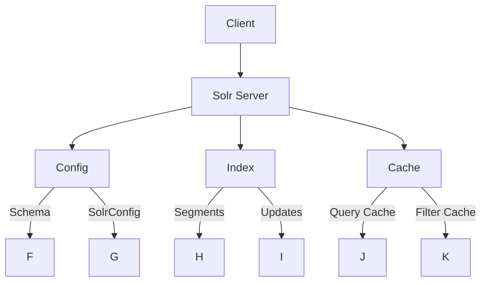
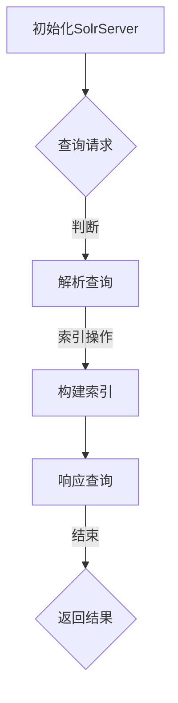

                 

# 《Solr原理与代码实例讲解》

## 关键词

Solr、搜索引擎、分布式搜索、索引、查询、文本处理、优化

## 摘要

本文全面讲解了Solr搜索引擎的原理与实战应用。首先，介绍了Solr的发展背景、优势以及核心架构；然后，深入探讨了Solr的索引与查询原理，包括文本处理算法和搜索算法；接着，阐述了Solr分布式搜索机制及其性能优化方法；最后，通过实际案例展示了Solr在企业搜索引擎、电商搜索和社交媒体分析中的应用。本文旨在帮助读者全面掌握Solr的核心原理和实践技能，为项目开发提供有力支持。

### 《Solr原理与代码实例讲解》目录大纲

#### 第一部分：Solr基础概念

- [第1章：Solr概述](#第1章-solr概述)
  - 1.1 Solr的发展背景与优势
    - 1.1.1 Solr的起源与发展
    - 1.1.2 Solr在搜索引擎中的应用
    - 1.1.3 Solr与其他搜索引擎的比较
  - 1.2 Solr的核心架构
    - 1.2.1 Solr的整体架构
    - 1.2.2 Solr的组件详解
    - 1.2.3 Solr的架构与关系
  - 1.3 Solr的工作流程
    - 1.3.1 Solr的查询流程
    - 1.3.2 Solr的索引流程
    - 1.3.3 Solr的数据处理流程

#### 第二部分：Solr核心概念与原理

- [第2章：Solr索引与查询](#第2章-solr索引与查询)
  - 2.1 Solr索引原理
    - 2.1.1 Solr索引的概念
    - 2.1.2 Solr索引的类型
    - 2.1.3 Solr索引的构建流程
  - 2.2 Solr查询原理
    - 2.2.1 Solr查询的概念
    - 2.2.2 Solr查询的类型
    - 2.2.3 Solr查询的执行流程
  - 2.3 Solr分布式搜索机制
    - 2.3.1 Solr分布式搜索的优势
    - 2.3.2 Solr分布式搜索的原理
    - 2.3.3 Solr分布式搜索的配置

#### 第三部分：Solr核心算法与优化

- [第3章：Solr文本处理与搜索算法](#第3章-solr文本处理与搜索算法)
  - 3.1 Solr文本处理算法
    - 3.1.1 Solr文本预处理算法
    - 3.1.2 Solr文本分词算法
    - 3.1.3 Solr文本分析算法
  - 3.2 Solr搜索算法
    - 3.2.1 Solr全文搜索算法
    - 3.2.2 Solr布尔搜索算法
    - 3.2.3 Solr查询优化算法
  - 3.3 Solr查询性能优化
    - 3.3.1 Solr查询性能的影响因素
    - 3.3.2 Solr查询性能优化方法
    - 3.3.3 Solr查询性能测试与评估

#### 第四部分：Solr实战案例

- [第4章：Solr项目实战](#第4章-solr项目实战)
  - 4.1 Solr项目环境搭建
    - 4.1.1 Solr环境搭建
    - 4.1.2 Solr常用工具安装与配置
    - 4.1.3 Solr集成与调试
  - 4.2 Solr应用案例
    - 4.2.1 企业搜索引擎搭建
    - 4.2.2 Solr在电商领域的应用
    - 4.2.3 Solr在社交媒体分析中的应用
  - 4.3 Solr代码实例解析
    - 4.3.1 Solr索引代码实例
    - 4.3.2 Solr查询代码实例
    - 4.3.3 Solr分布式查询代码实例

#### 第五部分：Solr高级特性与扩展

- [第5章：Solr高级特性与优化](#第5章-solr高级特性与优化)
  - 5.1 Solr高可用性配置
    - 5.1.1 Solr主从复制
    - 5.1.2 Solr负载均衡
    - 5.1.3 Solr集群管理
  - 5.2 Solr性能优化
    - 5.2.1 Solr缓存机制
    - 5.2.2 Solr反向检索
    - 5.2.3 Solr分布式检索
  - 5.3 Solr扩展开发
    - 5.3.1 Solr插件开发
    - 5.3.2 Solr自定义分析器
    - 5.3.3 Solr定制化开发

#### 第六部分：Solr应用与展望

- [第6章：Solr应用与未来发展](#第6章-solr应用与未来发展)
  - 6.1 Solr在互联网领域的应用
    - 6.1.1 Solr在门户网站的应用
    - 6.1.2 Solr在电子商务的应用
    - 6.1.3 Solr在社交媒体的应用
  - 6.2 Solr在非互联网领域的应用
    - 6.2.1 Solr在政府机构的应用
    - 6.2.2 Solr在金融行业的应用
    - 6.2.3 Solr在医疗健康领域的应用
  - 6.3 Solr的未来发展
    - 6.3.1 Solr技术趋势分析
    - 6.3.2 Solr与其他搜索引擎的融合
    - 6.3.3 Solr在人工智能时代的应用前景

#### 附录

- [附录A：Solr资源与工具](#附录a-solr资源与工具)
  - A.1 Solr官方文档与资料
  - A.2 Solr开发工具与插件
  - A.3 Solr学习资源与社群
  - A.4 Solr相关技术资料
  - A.5 Solr常见问题与解答

---

### 第一部分：Solr基础概念

#### 第1章：Solr概述

Solr是一个开源的、高性能、可扩展的搜索引擎平台，基于Lucene库开发。它提供了强大的全文搜索、索引和分布式搜索功能，广泛应用于企业级搜索引擎、电商平台、社交媒体分析等领域。本章节将介绍Solr的发展背景、优势以及与其他搜索引擎的比较。

##### 1.1 Solr的发展背景与优势

**1.1.1 Solr的起源与发展**

Solr是由Apache软件基金会开发的一个开源项目，其前身是LucidWorks Open，由Mike Beretta于2004年创建。2006年，Solr成为Apache软件基金会的孵化项目，并于2008年正式成为Apache软件基金会的顶级项目。自那时以来，Solr得到了广泛的关注和快速发展，逐渐成为企业级搜索引擎的首选。

**1.1.2 Solr在搜索引擎中的应用**

Solr在搜索引擎中的应用非常广泛，其核心功能包括：

1. **全文搜索**：Solr能够对大量文本数据实现快速的全文搜索，支持复杂的查询条件和语法。
2. **索引与缓存**：Solr可以对数据进行索引，提高搜索速度。同时，Solr支持缓存机制，可以缓存查询结果，提高查询效率。
3. **分布式搜索**：Solr支持分布式搜索，可以在多个服务器上共享索引，提高查询性能和扩展性。
4. **扩展性**：Solr具有良好的扩展性，支持自定义分析器、查询处理器和插件等，可以满足不同场景的需求。

**1.1.3 Solr与其他搜索引擎的比较**

与其他搜索引擎相比，Solr具有以下优势：

1. **高性能**：Solr具有出色的查询性能，可以在短时间内处理大量查询请求。
2. **扩展性强**：Solr支持自定义组件和插件，可以灵活扩展功能。
3. **易用性**：Solr提供了一套完整的开发工具和文档，易于上手和使用。
4. **社区支持**：Solr拥有一个庞大的开发者社区，可以获得丰富的技术支持和资源。

##### 1.2 Solr的核心架构

Solr的核心架构主要包括以下几个组件：

1. **Solr服务器**：Solr服务器是Solr的核心组件，负责处理查询请求、索引数据和缓存管理。
2. **Solr客户端**：Solr客户端是用于与Solr服务器交互的组件，可以通过各种编程语言（如Java、Python等）进行调用。
3. **Solr索引**：Solr索引是Solr存储数据的方式，由多个段（segment）组成，可以进行实时索引更新。
4. **Solr分布式搜索**：Solr分布式搜索功能支持在多个服务器上共享索引，实现高性能的分布式搜索。

**1.2.1 Solr的整体架构**

Solr的整体架构如图1-1所示：



**图1-1：Solr整体架构**

**1.2.2 Solr的组件详解**

1. **Solr服务器**：Solr服务器是Solr的核心组件，负责处理查询请求、索引数据和缓存管理。它是一个独立的Java应用程序，可以通过SolrJ或REST API进行访问。
2. **Solr客户端**：Solr客户端是用于与Solr服务器交互的组件，可以通过各种编程语言（如Java、Python等）进行调用。Solr客户端负责发送查询请求、处理响应结果等。
3. **Solr索引**：Solr索引是Solr存储数据的方式，由多个段（segment）组成，可以进行实时索引更新。Solr索引支持多种索引类型，如文本、数值、日期等。
4. **Solr分布式搜索**：Solr分布式搜索功能支持在多个服务器上共享索引，实现高性能的分布式搜索。通过配置分布式搜索，可以将查询请求分发到多个Solr服务器上，提高查询性能。

**1.2.3 Solr的架构与关系**

Solr的架构与关系如图1-2所示：


**图1-2：Solr架构与关系**

**1.3 Solr的工作流程**

Solr的工作流程主要包括以下几个步骤：

1. **初始化SolrServer**：客户端初始化SolrServer对象，准备进行查询操作。
2. **查询请求**：客户端发送查询请求到Solr服务器，请求中包含查询条件和查询参数。
3. **解析查询**：Solr服务器解析查询请求，将查询条件转换为Lucene查询对象。
4. **搜索索引**：Solr服务器使用Lucene查询对象搜索索引，找到匹配的文档。
5. **处理查询结果**：Solr服务器处理查询结果，包括排序、分页等操作。
6. **响应查询**：Solr服务器将查询结果返回给客户端。

Solr的工作流程如图1-3所示：



**图1-3：Solr工作流程**

#### 第二部分：Solr核心概念与原理

##### 第2章：Solr索引与查询

Solr的索引与查询是Solr的核心功能，决定了Solr的性能和扩展性。本章将详细介绍Solr索引与查询的原理，包括索引构建、查询执行、分布式搜索机制等内容。

##### 2.1 Solr索引原理

Solr索引是Solr存储数据的方式，它是一个基于Lucene的倒排索引。索引构建过程中，Solr将文档中的文本内容转换为索引，以便快速查询。

**2.1.1 Solr索引的概念**

Solr索引是由多个段（segment）组成的，每个段是一个独立的索引单元。段之间可以进行合并，以优化索引存储和查询性能。Solr索引包括以下几个部分：

1. **文档元数据**：存储文档的唯一标识、创建时间、更新时间等信息。
2. **字段索引**：存储文档中每个字段的索引信息，包括词频、位置、偏移量等。
3. **倒排索引**：存储文档中每个词的倒排列表，用于快速定位包含特定词的文档。

**2.1.2 Solr索引的类型**

Solr支持多种索引类型，包括：

1. **标准索引**：标准索引是最常用的索引类型，适用于大多数场景。
2. **文本索引**：文本索引适用于存储文本类型的数据，如文章、评论等。
3. **数值索引**：数值索引适用于存储数值类型的数据，如价格、评分等。
4. **日期索引**：日期索引适用于存储日期类型的数据，如时间戳、生日等。

**2.1.3 Solr索引的构建流程**

Solr索引的构建流程如下：

1. **文档解析**：将文档内容解析为字段值，并将字段值存储在内存中。
2. **字段索引构建**：为每个字段构建索引，包括词频、位置、偏移量等信息。
3. **倒排索引构建**：为文档中的每个词构建倒排索引，将词与文档的关联关系存储在索引中。
4. **段合并**：将多个段合并为一个完整的索引，以提高查询性能。

##### 2.2 Solr查询原理

Solr查询是指根据用户输入的查询条件，从Solr索引中找到符合条件的文档。Solr查询包括以下几个步骤：

**2.2.1 Solr查询的概念**

Solr查询是指根据用户输入的查询条件，从Solr索引中找到符合条件的文档。Solr查询支持多种查询类型，包括：

1. **简单查询**：简单查询是指直接根据关键词进行查询，如 "apple"。
2. **布尔查询**：布尔查询是指使用布尔运算符（如AND、OR、NOT）组合多个查询条件，如 "apple AND orange"。
3. **范围查询**：范围查询是指根据字段值范围进行查询，如 "price:[10 TO 20]"。
4. **前缀查询**：前缀查询是指根据字段值前缀进行查询，如 "app*"。

**2.2.2 Solr查询的类型**

Solr查询类型包括以下几种：

1. **Lucene查询**：Lucene查询是Solr默认的查询类型，基于Lucene查询语法。
2. **QParser查询**：QParser查询是Solr提供的自定义查询语法，可以扩展Solr的查询功能。
3. **SQL查询**：SQL查询是Solr提供的基于SQL语法的查询，适用于熟悉SQL的用户。

**2.2.3 Solr查询的执行流程**

Solr查询的执行流程如下：

1. **解析查询请求**：Solr服务器接收查询请求，解析查询条件，生成Lucene查询对象。
2. **执行查询**：Solr服务器使用Lucene查询对象搜索索引，找到符合条件的文档。
3. **处理查询结果**：Solr服务器对查询结果进行排序、分页等处理，将结果返回给客户端。

##### 2.3 Solr分布式搜索机制

Solr分布式搜索机制是指通过在多个Solr服务器上共享索引，实现高性能的分布式搜索。分布式搜索可以水平扩展查询性能，提高系统的容错能力。

**2.3.1 Solr分布式搜索的优势**

1. **高性能**：分布式搜索可以将查询请求分发到多个Solr服务器上，提高查询性能。
2. **高可用性**：分布式搜索可以在多个服务器上共享索引，实现高可用性。
3. **扩展性强**：分布式搜索可以根据需要添加更多的Solr服务器，实现水平扩展。

**2.3.2 Solr分布式搜索的原理**

Solr分布式搜索的原理如下：

1. **分片**：将索引和查询请求分片到多个Solr服务器上，每个服务器负责处理一部分数据。
2. **合并**：将多个服务器上的查询结果合并，生成完整的查询结果。
3. **负载均衡**：将查询请求均匀地分发到多个服务器上，实现负载均衡。

**2.3.3 Solr分布式搜索的配置**

Solr分布式搜索的配置步骤如下：

1. **配置Solr集群**：在solrconfig.xml文件中配置集群相关信息，如分片、副本等。
2. **配置索引**：在schema.xml文件中配置索引的分片和副本信息。
3. **启动Solr集群**：启动多个Solr服务器，组成一个分布式搜索集群。

通过以上配置，Solr可以实现分布式搜索，提高查询性能和系统稳定性。

#### 第三部分：Solr核心算法与优化

Solr的核心算法和优化策略决定了其性能和效率。本章节将详细介绍Solr的文本处理算法、搜索算法、查询性能优化方法以及性能测试与评估。

##### 3.1 Solr文本处理算法

Solr的文本处理算法包括文本预处理、分词和文本分析等步骤，这些步骤对文本进行处理，以便进行有效的搜索。

**3.1.1 Solr文本预处理算法**

文本预处理是文本处理的第一步，主要包括以下任务：

1. **去除HTML标签**：去除文档中的HTML标签，保留文本内容。
2. **去除停用词**：停用词是指对搜索结果贡献较小的词，如 "的"、"是"、"在" 等。去除停用词可以减少搜索结果的数量。
3. **字符转换**：将字符统一转换为小写或大写，以便进行统一处理。

**3.1.2 Solr文本分词算法**

分词是将文本分解为一系列的单词或短语的过程。Solr支持多种分词算法，如：

1. **标准分词器**：标准分词器是基于正则表达式的分词器，适用于大多数场景。
2. **智能分词器**：智能分词器是基于自然语言处理技术的分词器，可以更准确地分词。

**3.1.3 Solr文本分析算法**

文本分析是对分词后的文本进行进一步处理的过程，主要包括以下任务：

1. **词形还原**：将词形还原为词根，如 "运行" 还原为 "运行"。
2. **词性标注**：为文本中的每个词标注词性，如名词、动词、形容词等。
3. **词频统计**：统计文本中每个词的频率，为后续的搜索和排序提供依据。

##### 3.2 Solr搜索算法

Solr的搜索算法主要包括全文搜索、布尔搜索和查询优化算法，这些算法决定了搜索的性能和效果。

**3.2.1 Solr全文搜索算法**

全文搜索是指对文本中的所有词进行搜索，找到包含特定词的文档。Solr的全文搜索算法基于Lucene库实现，主要包括以下步骤：

1. **词频统计**：对文本中的每个词进行统计，计算词频。
2. **逆文档频率计算**：计算每个词的逆文档频率（IDF），反映词的重要程度。
3. **文档评分**：根据词频和逆文档频率计算文档的评分，评分越高表示文档与查询越相关。

**3.2.2 Solr布尔搜索算法**

布尔搜索是指使用布尔运算符（如AND、OR、NOT）组合多个查询条件进行搜索。Solr的布尔搜索算法主要包括以下步骤：

1. **查询解析**：解析查询条件，生成Lucene查询对象。
2. **查询执行**：使用Lucene查询对象搜索索引，找到符合条件的文档。
3. **结果合并**：将多个查询结果合并，生成最终的查询结果。

**3.2.3 Solr查询优化算法**

查询优化是指通过调整查询参数，提高搜索性能和效果。Solr的查询优化算法主要包括以下策略：

1. **缓存查询结果**：缓存查询结果，提高查询响应速度。
2. **调整查询参数**：调整查询参数，如分页大小、排序方式等，优化查询结果。
3. **索引优化**：对索引进行优化，如删除不必要的数据、合并段等，提高索引性能。

##### 3.3 Solr查询性能优化

Solr的查询性能优化是提高系统性能和用户体验的关键。以下是一些常见的查询性能优化方法：

**3.3.1 Solr查询性能的影响因素**

查询性能受到多个因素的影响，包括：

1. **硬件性能**：CPU、内存、磁盘性能等硬件资源。
2. **索引大小**：索引大小直接影响查询性能，过大的索引可能导致查询缓慢。
3. **查询复杂度**：查询复杂度越高，查询时间越长。
4. **网络延迟**：网络延迟可能导致查询响应时间变长。

**3.3.2 Solr查询性能优化方法**

以下是一些常见的查询性能优化方法：

1. **增加内存**：增加Solr服务器的内存，可以提高查询性能。
2. **优化索引**：删除不必要的字段、合并段、优化索引结构等，提高索引性能。
3. **缓存查询结果**：使用查询缓存，缓存常用的查询结果，减少查询响应时间。
4. **调整查询参数**：调整查询参数，如分页大小、排序方式等，优化查询结果。
5. **使用分布式搜索**：通过分布式搜索，提高查询性能和扩展性。

**3.3.3 Solr查询性能测试与评估**

为了评估Solr的查询性能，可以进行以下测试：

1. **基准测试**：使用基准测试工具（如Apache JMeter）模拟大量查询请求，测试查询性能。
2. **性能分析**：分析查询性能数据，找出性能瓶颈。
3. **优化调整**：根据性能分析结果，对Solr进行优化调整。

通过以上测试和优化，可以显著提高Solr的查询性能。

#### 第四部分：Solr实战案例

本部分将通过实际案例，展示如何使用Solr搭建搜索引擎，并实现企业级搜索引擎、电商搜索和社交媒体分析等功能。

##### 4.1 Solr项目环境搭建

在本节中，我们将搭建一个简单的Solr搜索引擎环境，用于后续案例的实现。

**4.1.1 Solr环境搭建**

首先，从Solr官网（https://lucene.apache.org/solr/guide/stable/download.html）下载Solr压缩包，并解压到指定目录，如 `/usr/local/solr`。

接着，进入解压后的目录，运行以下命令启动Solr：

```bash
./bin/solr start -p 8983
```

启动成功后，在浏览器中输入 `http://localhost:8983/solr`，可以访问Solr管理界面。

**4.1.2 Solr常用工具安装与配置**

Solr常用工具包括SolrJ客户端和SolrPy客户端，用于进行Java和Python编程时的交互。以下是安装和配置步骤：

1. **安装SolrJ客户端**：

   首先，从Solr官网下载SolrJ客户端压缩包，并解压到指定目录，如 `/usr/local/solrj`。

   接着，在项目的 `pom.xml` 文件中添加以下依赖：

   ```xml
   <dependencies>
     <dependency>
       <groupId>org.apache.solr</groupId>
       <artifactId>solr-solrj</artifactId>
       <version>8.11.1</version>
     </dependency>
   </dependencies>
   ```

2. **安装SolrPy客户端**：

   首先，从PySolr官网（https://pypi.org/project/PySolr/）下载PySolr压缩包，并解压到指定目录，如 `/usr/local/pysolr`。

   接着，在项目的 `requirements.txt` 文件中添加以下依赖：

   ```bash
   pysolr
   ```

**4.1.3 Solr集成与调试**

在项目代码中，使用SolrJ或SolrPy客户端集成Solr，实现文档的添加和查询。以下是简单的代码示例：

**使用SolrJ添加和查询文档**：

```java
import org.apache.solr.client.SolrClient;
import org.apache.solr.client.SolrServer;
import org.apache.solr.common.SolrInputDocument;

try {
    // 创建Solr客户端
    SolrClient client = new SolrServer("http://localhost:8983/solr/getting-started");

    // 创建SolrInputDocument对象
    SolrInputDocument doc = new SolrInputDocument();

    // 添加字段
    doc.addField("id", "1");
    doc.addField("name", "apple");
    doc.addField("price", 10.0);
    doc.addField("description", "This is an apple.");

    // 添加文档到索引
    client.add(doc);

    // 提交更新
    client.commit();

    // 创建查询对象
    SolrQuery query = new SolrQuery("name:apple");

    // 执行查询
    SolrDocumentList results = client.query(query).getResults();

    // 遍历查询结果
    for (SolrDocument solrDocument : results) {
        System.out.println(solrDocument.getFieldValue("id"));
        System.out.println(solrDocument.getFieldValue("name"));
        System.out.println(solrDocument.getFieldValue("price"));
        System.out.println(solrDocument.getFieldValue("description"));
    }

} catch (Exception e) {
    e.printStackTrace();
}
```

**使用SolrPy添加和查询文档**：

```python
from pysolr import Solr

# 创建Solr客户端
solr = Solr('http://localhost:8983/solr/getting-started')

# 添加文档
doc = {'id': '1', 'name': 'apple', 'price': 10.0, 'description': 'This is an apple.'}
solr.add([doc])

# 提交更新
solr.commit()

# 查询文档
results = solr.query('name:apple')
for result in results:
    print(result['id'])
    print(result['name'])
    print(result['price'])
    print(result['description'])
```

通过以上步骤，我们成功搭建了一个简单的Solr搜索引擎环境，并实现了文档的添加和查询功能。

##### 4.2 Solr应用案例

在本节中，我们将通过实际案例展示如何使用Solr搭建企业级搜索引擎、电商搜索和社交媒体分析系统。

**4.2.1 企业搜索引擎搭建**

企业搜索引擎可以帮助企业快速检索内部文档和知识库，提高工作效率。以下是一个简单的企业搜索引擎搭建步骤：

1. **数据导入**：将企业内部文档、知识库等数据导入Solr，建立索引。可以使用Solr的 `_ingest` 命令实现批量导入。

```bash
./solr/bin/solr ingest --config setconfig /path/to/data
```

2. **查询接口**：创建一个查询接口，用于接收用户查询请求，并将请求转发到Solr。以下是一个简单的Python查询接口示例：

```python
from flask import Flask, request, jsonify
from pysolr import Solr

app = Flask(__name__)

# 创建Solr客户端
solr = Solr('http://localhost:8983/solr/getting-started')

@app.route('/search', methods=['GET'])
def search():
    query = request.args.get('q')
    results = solr.query(query)
    return jsonify(results)

if __name__ == '__main__':
    app.run()
```

3. **前端界面**：创建一个前端界面，用于接收用户输入的查询请求，并展示搜索结果。可以使用HTML、CSS和JavaScript等前端技术实现。

```html
<!DOCTYPE html>
<html lang="en">
<head>
    <meta charset="UTF-8">
    <meta name="viewport" content="width=device-width, initial-scale=1.0">
    <title>企业搜索引擎</title>
</head>
<body>
    <input type="text" id="search_input" placeholder="输入关键词">
    <button onclick="search()">搜索</button>
    <ul id="search_results"></ul>

    <script>
        function search() {
            var query = document.getElementById('search_input').value;
            fetch('/search?q=' + query)
                .then(response => response.json())
                .then(data => {
                    var ul = document.getElementById('search_results');
                    ul.innerHTML = '';
                    data.results.forEach(function(result) {
                        var li = document.createElement('li');
                        li.innerText = result.id + ': ' + result.name;
                        ul.appendChild(li);
                    });
                });
        }
    </script>
</body>
</html>
```

通过以上步骤，我们可以搭建一个简单的企业搜索引擎，方便用户快速检索企业内部文档和知识库。

**4.2.2 Solr在电商领域的应用**

Solr在电商领域有着广泛的应用，特别是在商品搜索和推荐系统中。以下是一个简单的电商搜索系统搭建步骤：

1. **数据导入**：将电商数据导入Solr，建立索引。可以使用Solr的 `_ingest` 命令实现批量导入。

```bash
./solr/bin/solr ingest --config setconfig /path/to/data
```

2. **搜索接口**：创建一个搜索接口，用于接收用户查询请求，并将请求转发到Solr。以下是一个简单的Python搜索接口示例：

```python
from flask import Flask, request, jsonify
from pysolr import Solr

app = Flask(__name__)

# 创建Solr客户端
solr = Solr('http://localhost:8983/solr/ecommerce')

@app.route('/search', methods=['GET'])
def search():
    query = request.args.get('q')
    results = solr.query(query)
    return jsonify(results)

if __name__ == '__main__':
    app.run()
```

3. **前端界面**：创建一个前端界面，用于接收用户输入的查询请求，并展示搜索结果。可以使用HTML、CSS和JavaScript等前端技术实现。

```html
<!DOCTYPE html>
<html lang="en">
<head>
    <meta charset="UTF-8">
    <meta name="viewport" content="width=device-width, initial-scale=1.0">
    <title>电商搜索系统</title>
</head>
<body>
    <input type="text" id="search_input" placeholder="输入关键词">
    <button onclick="search()">搜索</button>
    <ul id="search_results"></ul>

    <script>
        function search() {
            var query = document.getElementById('search_input').value;
            fetch('/search?q=' + query)
                .then(response => response.json())
                .then(data => {
                    var ul = document.getElementById('search_results');
                    ul.innerHTML = '';
                    data.results.forEach(function(result) {
                        var li = document.createElement('li');
                        li.innerText = result.id + ': ' + result.name;
                        ul.appendChild(li);
                    });
                });
        }
    </script>
</body>
</html>
```

通过以上步骤，我们可以搭建一个简单的电商搜索系统，方便用户快速检索商品信息。

**4.2.3 Solr在社交媒体分析中的应用**

Solr在社交媒体分析中也发挥着重要作用，特别是在文本检索和情感分析方面。以下是一个简单的社交媒体文本检索和情感分析系统搭建步骤：

1. **数据导入**：将社交媒体数据导入Solr，建立索引。可以使用Solr的 `_ingest` 命令实现批量导入。

```bash
./solr/bin/solr ingest --config setconfig /path/to/data
```

2. **文本检索接口**：创建一个文本检索接口，用于接收用户查询请求，并将请求转发到Solr。以下是一个简单的Python检索接口示例：

```python
from flask import Flask, request, jsonify
from pysolr import Solr

app = Flask(__name__)

# 创建Solr客户端
solr = Solr('http://localhost:8983/solr/socialmedia')

@app.route('/search', methods=['GET'])
def search():
    query = request.args.get('q')
    results = solr.query(query)
    return jsonify(results)

if __name__ == '__main__':
    app.run()
```

3. **情感分析接口**：创建一个情感分析接口，用于接收用户查询请求，并进行情感分析。以下是一个简单的Python情感分析接口示例：

```python
from flask import Flask, request, jsonify
from textblob import TextBlob

app = Flask(__name__)

@app.route('/analyze', methods=['GET'])
def analyze():
    text = request.args.get('text')
    analysis = TextBlob(text).sentiment
    return jsonify({
        'text': text,
        'polarity': analysis.polarity,
        'subjectivity': analysis.subjectivity
    })

if __name__ == '__main__':
    app.run()
```

4. **前端界面**：创建一个前端界面，用于接收用户输入的查询请求，并展示检索结果和情感分析结果。可以使用HTML、CSS和JavaScript等前端技术实现。

```html
<!DOCTYPE html>
<html lang="en">
<head>
    <meta charset="UTF-8">
    <meta name="viewport" content="width=device-width, initial-scale=1.0">
    <title>社交媒体文本检索和情感分析系统</title>
</head>
<body>
    <input type="text" id="search_input" placeholder="输入关键词">
    <button onclick="search()">搜索</button>
    <ul id="search_results"></ul>

    <script>
        function search() {
            var query = document.getElementById('search_input').value;
            fetch('/search?q=' + query)
                .then(response => response.json())
                .then(data => {
                    var ul = document.getElementById('search_results');
                    ul.innerHTML = '';
                    data.results.forEach(function(result) {
                        var li = document.createElement('li');
                        li.innerText = result.id + ': ' + result.content;
                        ul.appendChild(li);
                    });
                });
        }
    </script>

    <h2>情感分析</h2>
    <input type="text" id="analyze_input" placeholder="输入文本">
    <button onclick="analyze()">分析</button>
    <p id="analyze_results"></p>

    <script>
        function analyze() {
            var text = document.getElementById('analyze_input').value;
            fetch('/analyze?text=' + text)
                .then(response => response.json())
                .then(data => {
                    var p = document.getElementById('analyze_results');
                    p.innerText = 'Polarity: ' + data.polarity + '\nSubjectivity: ' + data.subjectivity;
                });
        }
    </script>
</body>
</html>
```

通过以上步骤，我们可以搭建一个简单的社交媒体文本检索和情感分析系统，实现对社交媒体数据的深入分析。

##### 4.3 Solr代码实例解析

在本节中，我们将通过几个代码实例，详细解析Solr的索引添加、查询和分布式查询功能。

**4.3.1 Solr索引代码实例**

以下是一个简单的Solr索引添加代码实例，用于向Solr索引中添加一个包含多个字段的文档。

```java
import org.apache.solr.client.SolrClient;
import org.apache.solr.client.SolrServer;
import org.apache.solr.common.SolrInputDocument;

try {
    // 创建Solr客户端
    SolrClient client = new SolrServer("http://localhost:8983/solr/getting-started");

    // 创建SolrInputDocument对象
    SolrInputDocument doc = new SolrInputDocument();

    // 添加字段
    doc.addField("id", "1");
    doc.addField("name", "apple");
    doc.addField("price", 10.0);
    doc.addField("description", "This is an apple.");

    // 添加文档到索引
    client.add(doc);

    // 提交更新
    client.commit();

} catch (Exception e) {
    e.printStackTrace();
}
```

在这个示例中，我们首先创建了一个Solr客户端，然后创建了一个SolrInputDocument对象，向该对象添加了四个字段：id、name、price和description。接下来，将这个SolrInputDocument对象添加到Solr索引中，并提交更新。

**代码解读与分析**

1. 创建Solr客户端：
   ```java
   SolrClient client = new SolrServer("http://localhost:8983/solr/getting-started");
   ```
   在这里，我们创建了一个SolrServer对象，指定了Solr服务器的URL。

2. 创建SolrInputDocument对象：
   ```java
   SolrInputDocument doc = new SolrInputDocument();
   ```
   SolrInputDocument是一个表示Solr文档的对象，用于存储文档的字段值。

3. 添加字段：
   ```java
   doc.addField("id", "1");
   doc.addField("name", "apple");
   doc.addField("price", 10.0);
   doc.addField("description", "This is an apple.");
   ```
   我们向SolrInputDocument对象中添加了四个字段：id、name、price和description，并设置了相应的字段值。

4. 添加文档到索引：
   ```java
   client.add(doc);
   ```
   将SolrInputDocument对象添加到Solr索引中。

5. 提交更新：
   ```java
   client.commit();
   ```
   提交更新，确保文档被持久化到索引中。

**4.3.2 Solr查询代码实例**

以下是一个简单的Solr查询代码实例，用于从Solr索引中查询包含特定关键词的文档。

```java
import org.apache.solr.client.SolrClient;
import org.apache.solr.client.SolrServer;
import org.apache.solr.common.SolrDocument;
import org.apache.solr.common.SolrDocumentList;

try {
    // 创建Solr客户端
    SolrClient client = new SolrServer("http://localhost:8983/solr/getting-started");

    // 创建查询对象
    SolrQuery query = new SolrQuery("name:apple");

    // 执行查询
    SolrDocumentList results = client.query(query).getResults();

    // 遍历查询结果
    for (SolrDocument solrDocument : results) {
        System.out.println(solrDocument.getFieldValue("id"));
        System.out.println(solrDocument.getFieldValue("name"));
        System.out.println(solrDocument.getFieldValue("price"));
        System.out.println(solrDocument.getFieldValue("description"));
    }

} catch (Exception e) {
    e.printStackTrace();
}
```

在这个示例中，我们首先创建了一个Solr客户端，然后创建了一个SolrQuery对象，设置查询条件为"name:apple"。接下来，执行查询，并遍历查询结果，输出每个文档的字段值。

**代码解读与分析**

1. 创建Solr客户端：
   ```java
   SolrClient client = new SolrServer("http://localhost:8983/solr/getting-started");
   ```
   在这里，我们创建了一个SolrServer对象，指定了Solr服务器的URL。

2. 创建查询对象：
   ```java
   SolrQuery query = new SolrQuery("name:apple");
   ```
   SolrQuery是一个表示Solr查询的对象，用于设置查询条件。

3. 执行查询：
   ```java
   SolrDocumentList results = client.query(query).getResults();
   ```
   执行查询，获取查询结果。

4. 遍历查询结果：
   ```java
   for (SolrDocument solrDocument : results) {
       System.out.println(solrDocument.getFieldValue("id"));
       System.out.println(solrDocument.getFieldValue("name"));
       System.out.println(solrDocument.getFieldValue("price"));
       System.out.println(solrDocument.getFieldValue("description"));
   }
   ```
   遍历查询结果，输出每个文档的字段值。

**4.3.3 Solr分布式查询代码实例**

以下是一个简单的Solr分布式查询代码实例，用于在多个Solr节点上执行查询。

```java
import org.apache.solr.client.SolrClient;
import org.apache.solr.client.SolrServer;
import org.apache.solr.common.SolrDocument;
import org.apache.solr.common.SolrDocumentList;

try {
    // 创建Solr客户端
    SolrClient client = new SolrServer("http://localhost:8983/solr/cluster");

    // 创建查询对象
    SolrQuery query = new SolrQuery("name:apple");

    // 设置分布式查询参数
    query.set("shards", "shard1,shard2,shard3");
    query.set("shardaware", "true");
    query.set("sort", "id asc");

    // 执行分布式查询
    SolrDocumentList results = client.query(query).getResults();

    // 遍历查询结果
    for (SolrDocument solrDocument : results) {
        System.out.println(solrDocument.getFieldValue("id"));
        System.out.println(solrDocument.getFieldValue("name"));
        System.out.println(solrDocument.getFieldValue("price"));
        System.out.println(solrDocument.getFieldValue("description"));
    }

} catch (Exception e) {
    e.printStackTrace();
}
```

在这个示例中，我们首先创建了一个Solr客户端，然后创建了一个SolrQuery对象，设置查询条件为"name:apple"。接下来，设置了分布式查询的相关参数，如分片、是否使用分片感知和排序方式。最后，执行了分布式查询，并遍历查询结果，输出每个文档的字段值。

**代码解读与分析**

1. 创建Solr客户端：
   ```java
   SolrClient client = new SolrServer("http://localhost:8983/solr/cluster");
   ```
   在这里，我们创建了一个SolrServer对象，指定了Solr服务器的URL。

2. 创建查询对象：
   ```java
   SolrQuery query = new SolrQuery("name:apple");
   ```
   SolrQuery是一个表示Solr查询的对象，用于设置查询条件。

3. 设置分布式查询参数：
   ```java
   query.set("shards", "shard1,shard2,shard3");
   query.set("shardaware", "true");
   query.set("sort", "id asc");
   ```
   设置分布式查询参数，包括分片、是否使用分片感知和排序方式。

4. 执行分布式查询：
   ```java
   SolrDocumentList results = client.query(query).getResults();
   ```
   执行分布式查询，获取查询结果。

5. 遍历查询结果：
   ```java
   for (SolrDocument solrDocument : results) {
       System.out.println(solrDocument.getFieldValue("id"));
       System.out.println(solrDocument.getFieldValue("name"));
       System.out.println(solrDocument.getFieldValue("price"));
       System.out.println(solrDocument.getFieldValue("description"));
   }
   ```
   遍历查询结果，输出每个文档的字段值。

通过以上代码实例，我们可以看到如何使用Solr进行索引添加、查询和分布式查询。这些代码实例是Solr开发的基础，可以帮助我们更好地理解和应用Solr。

### 第五部分：Solr高级特性与扩展

#### 第5章：Solr高级特性与优化

Solr作为一款高性能、可扩展的搜索引擎，除了提供基本的索引和查询功能外，还拥有许多高级特性和优化方法。本章将介绍Solr的高级特性与优化，包括高可用性配置、性能优化和扩展开发。

##### 5.1 Solr高可用性配置

高可用性是搜索引擎系统设计中的重要一环，确保系统在面临各种异常情况下仍能正常运行。Solr通过以下几种方式实现高可用性：

**5.1.1 Solr主从复制**

Solr主从复制（Master-Slave Replication）是一种数据复制机制，通过将主Solr实例的数据复制到从Solr实例，实现数据备份和故障转移。

**配置步骤：**

1. **配置主从复制**：在主Solr实例的 `solrconfig.xml` 文件中，添加以下配置：

   ```xml
   <replication>
       <httpReplication
               numThreads="2"
               pipelineSendSize="1"
               pipelineReceiveSize="1"
               compression="true"
               socketTimeout="60000"
               connectTimeout="30000"
               replicateAfterCommit="true"/>
   </replication>
   ```

2. **配置从Solr实例**：在从Solr实例的 `solrconfig.xml` 文件中，添加以下配置：

   ```xml
   <config
           name="get_master_url"
           class="solr.spring.ConfigDistributorFactoryBean">
       <str name="masterUrl">http://master:8983/solr</str>
   </config>
   ```

**5.1.2 Solr负载均衡**

Solr通过负载均衡可以分发查询请求到多个Solr实例，提高查询性能和系统稳定性。常用的负载均衡策略有轮询、最小连接数和哈希等。

**配置步骤：**

1. **配置负载均衡**：在Solr配置文件中，添加以下负载均衡配置：

   ```xml
   <requestProcessing>
       <str name="requestWriter">org.apache.solr.handler.component.HttpShardHandlerByProx
   <requestWriter</str>
   <arr name="shardHandlers">
           <str>org.apache.solr.handler.component.HttpShardHandlerByProx</str>
       </arr>
   </requestProcessing>
   ```

2. **配置反向代理**：在反向代理服务器（如Nginx）上配置负载均衡，将查询请求分发到多个Solr实例。

```nginx
http {
    upstream solr {
        server solr1:8983;
        server solr2:8983;
        server solr3:8983;
    }

    server {
        listen 80;

        location /solr {
            proxy_pass http://solr;
            proxy_set_header Host $host;
            proxy_set_header X-Real-IP $remote_addr;
            proxy_set_header X-Forwarded-For $proxy_add_x_forwarded_for;
        }
    }
}
```

**5.1.3 Solr集群管理**

Solr集群管理是指对Solr集群进行监控、管理和维护。常用的集群管理工具包括SolrCloud、Solr Admin UI和Zookeeper。

**配置步骤：**

1. **安装Zookeeper**：在Solr集群中安装Zookeeper，用于协调集群中的节点。
2. **启动Zookeeper**：启动Zookeeper服务，确保集群中的所有节点都能访问Zookeeper。
3. **配置SolrCloud**：在Solr配置文件中，添加以下配置：

   ```xml
   <config
           name="solrCloud"
           class="solr.SolrCloudConfig">
       <str name="zkHost">localhost:2181</str>
       <int name="zkClientTimeout">15000</int>
   </config>
   ```

4. **启动SolrCloud**：启动SolrCloud服务，将Solr实例注册到Zookeeper，实现集群管理。

##### 5.2 Solr性能优化

Solr的性能优化是提高系统查询速度和响应能力的关键。以下是一些常见的性能优化方法：

**5.2.1 Solr缓存机制**

Solr缓存机制可以缓存查询结果、索引元数据和查询参数，减少实际查询的开销。

**配置步骤：**

1. **启用缓存**：在Solr配置文件中，添加以下缓存配置：

   ```xml
   <cacheConfig>
       <defaultCache
               name="responseCache"
               size="1000"
               eternal="false"
               maxEntries="1"
               timeToIdleSeconds="3600"
               timeToLiveSeconds="7200"/>
   </cacheConfig>
   ```

2. **配置缓存参数**：根据实际需求，调整缓存参数，如缓存大小、有效期等。

**5.2.2 Solr反向检索**

反向检索是指根据文档的ID或其他标识信息查询文档。反向检索比全文搜索更快，因为不需要遍历索引。

**配置步骤：**

1. **配置反向检索**：在Solr配置文件中，添加以下反向检索配置：

   ```xml
   <searchComponent name="indexselect">
       <str name="class">org.apache.solr.handler.component.SearchComponent</str>
       <lst name="params">
           <str name="query">id:[1 TO 10]</str>
       </lst>
   </searchComponent>
   ```

2. **使用反向检索**：在查询中，使用`id`字段进行反向检索。

```java
SolrQuery query = new SolrQuery("id:[1 TO 10]");
SolrDocumentList results = client.query(query).getResults();
```

**5.2.3 Solr分布式检索**

分布式检索是指将查询请求分发到多个Solr实例，并在每个实例上执行查询，然后将结果合并。分布式检索可以提高查询性能和扩展性。

**配置步骤：**

1. **配置分布式检索**：在Solr配置文件中，添加以下分布式检索配置：

   ```xml
   <requestProcessing>
       <str name="requestWriter">org.apache.solr.handler.component.HttpShardHandlerByProx</str>
       <arr name="shardHandlers">
           <str>org.apache.solr.handler.component.HttpShardHandlerByProx</str>
       </arr>
   </requestProcessing>
   ```

2. **配置分片和副本**：在Solr配置文件中，配置分片和副本，确保分布式检索可以正常运行。

```xml
<shardHandlerFactory name="shardHandlerFactory"
                      class="org.apache.solr.handler.component.ShardHandlerFactory">
    <str name="shards">shard1,shard2,shard3</str>
    <int name="numShards">3</int>
</shardHandlerFactory>
```

##### 5.3 Solr扩展开发

Solr扩展开发是指自定义Solr组件、分析器和查询处理器，以满足特定业务需求。

**5.3.1 Solr插件开发**

Solr插件是指自定义的Solr组件，可以实现多种功能，如自定义查询处理器、分析器和过滤器等。

**开发步骤：**

1. **编写Java代码**：根据需求编写Java代码，实现自定义组件。
2. **打包插件**：将Java代码打包成jar文件，作为Solr插件。
3. **部署插件**：将插件部署到Solr服务器，并在配置文件中引用。

**5.3.2 Solr自定义分析器**

Solr自定义分析器是指自定义的文本处理组件，用于将文本转换为索引。

**开发步骤：**

1. **编写Java代码**：根据需求编写Java代码，实现自定义分析器。
2. **打包分析器**：将Java代码打包成jar文件，作为Solr分析器。
3. **配置分析器**：在Solr配置文件中，添加自定义分析器配置。

```xml
<-analyzer type="index">myCustomAnalyzer</analyzer>
<analyzer type="query">myCustomAnalyzer</analyzer>
```

**5.3.3 Solr定制化开发**

Solr定制化开发是指根据特定业务需求，对Solr进行定制化开发，如自定义查询语法、索引结构和查询结果格式等。

**开发步骤：**

1. **需求分析**：明确业务需求，分析Solr功能点。
2. **设计方案**：根据需求设计Solr架构和组件。
3. **开发实现**：根据设计方案，实现Solr定制化功能。
4. **测试与部署**：对定制化功能进行测试，确保功能正常，并部署到生产环境。

通过以上高级特性和优化方法，我们可以显著提高Solr的性能和扩展性，满足各种业务需求。

### 第六部分：Solr应用与未来发展

#### 第6章：Solr应用与未来发展

Solr作为一款开源搜索引擎，凭借其高性能、可扩展性和强大的功能，在各个领域得到了广泛应用。本章将探讨Solr在不同领域的应用案例，以及其在未来发展的趋势和方向。

##### 6.1 Solr在互联网领域的应用

互联网领域的应用是Solr最主要的应用场景之一，包括门户网站、电子商务、社交媒体等。

**6.1.1 Solr在门户网站的应用**

门户网站通常需要处理海量的内容数据，并提供快速、准确的搜索功能。Solr能够高效地处理这些数据，提供实时的搜索服务。以下是一个典型的应用案例：

**案例：某大型门户网站的搜索引擎**

某大型门户网站使用Solr搭建了内部搜索引擎，用于搜索网站上的文章、新闻、论坛等海量内容。Solr的分布式搜索机制和缓存机制，使得搜索引擎能够快速响应用户的查询请求，提供高质量的搜索结果。

**6.1.2 Solr在电子商务的应用**

电子商务平台需要提供强大的商品搜索和推荐功能，以满足用户的需求。Solr在这些场景下发挥着重要作用，以下是一个典型的应用案例：

**案例：某电商平台的商品搜索系统**

某电商平台使用Solr搭建了商品搜索系统，对海量的商品数据进行实时索引和查询。通过Solr的分布式搜索和反向检索功能，系统能够快速响应用户的搜索请求，并提供精确的搜索结果和智能推荐。

**6.1.3 Solr在社交媒体的应用**

社交媒体平台需要处理大量的用户生成内容，如微博、评论、帖子等，并提供实时搜索和情感分析功能。Solr在这些场景下具有明显的优势，以下是一个典型的应用案例：

**案例：某社交媒体平台的搜索与情感分析系统**

某社交媒体平台使用Solr搭建了搜索与情感分析系统，对用户的微博、评论、帖子等内容进行实时索引和查询。通过Solr的全文搜索和情感分析功能，平台能够为用户提供精准的搜索结果和情感分析报告。

##### 6.2 Solr在非互联网领域的应用

Solr不仅在互联网领域有广泛应用，还在许多非互联网领域发挥着重要作用。

**6.2.1 Solr在政府机构的应用**

政府机构通常需要处理大量的文档、报告、公告等数据，并提供高效的搜索和检索服务。Solr能够满足这些需求，以下是一个典型的应用案例：

**案例：某政府机构的文档管理系统**

某政府机构使用Solr搭建了文档管理系统，对内部文档进行实时索引和查询。通过Solr的分布式搜索和缓存机制，系统能够快速响应用户的查询请求，提供准确的搜索结果。

**6.2.2 Solr在金融行业的应用**

金融行业需要处理大量的金融数据，如股票、基金、债券等，并提供实时的搜索和数据分析功能。Solr在这些场景下具有显著的优势，以下是一个典型的应用案例：

**案例：某金融公司的数据搜索引擎**

某金融公司使用Solr搭建了数据搜索引擎，对海量的金融数据进行实时索引和查询。通过Solr的分布式搜索和数据分析功能，公司能够快速响应用户的查询请求，提供精准的搜索结果和数据分析报告。

**6.2.3 Solr在医疗健康领域的应用**

医疗健康领域需要处理大量的医学文献、病例、治疗方案等数据，并提供高效的搜索和检索服务。Solr能够满足这些需求，以下是一个典型的应用案例：

**案例：某医疗机构的医学文献检索系统**

某医疗机构使用Solr搭建了医学文献检索系统，对海量的医学文献进行实时索引和查询。通过Solr的分布式搜索和缓存机制，系统能够快速响应用户的查询请求，提供准确的搜索结果。

##### 6.3 Solr的未来发展

随着技术的不断发展，Solr也在不断演进，未来将有更多创新和突破。

**6.3.1 Solr技术趋势分析**

1. **云计算与容器化**：随着云计算和容器化技术的发展，Solr将更加易于部署和管理，支持在云平台和容器环境中运行。
2. **人工智能与机器学习**：人工智能和机器学习技术将在Solr中得到广泛应用，如智能搜索、个性化推荐等。
3. **实时搜索与流处理**：实时搜索和流处理技术将成为Solr的重要方向，实现对海量数据的实时分析和查询。

**6.3.2 Solr与其他搜索引擎的融合**

随着技术的不断发展，Solr与其他搜索引擎（如Elasticsearch、Apache Lucene等）的融合将成为趋势。通过整合多种搜索引擎的优势，实现更强大的搜索功能。

**6.3.3 Solr在人工智能时代的应用前景**

在人工智能时代，Solr将发挥更大的作用，如智能搜索、自然语言处理、语音识别等。通过结合人工智能技术，Solr将不断提升搜索体验和效率。

### 附录

#### 附录A：Solr资源与工具

**A.1 Solr官方文档与资料**

- [Solr官方文档](https://lucene.apache.org/solr/guide/stable/)
- [Solr社区论坛](https://solr.apache.org/)

**A.2 Solr开发工具与插件**

- [SolrJ](https://solr.apache.org/guide/stable/solrj.html)
- [SolrPy](https://github.com/solr-py-solr/solr-py)
- [Solr Studio](https://cwiki.apache.org/confluence/display/solr/SolrStudio)

**A.3 Solr学习资源与社群**

- [Solr教程](https://www.tutorialspoint.com/solr/)
- [Solr学习笔记](https://www.jianshu.com/n/b/qMB3)
- [Solr微信群](https://jq.qq.com/group/744492731)

**A.4 Solr相关技术资料**

- [Apache Lucene](https://lucene.apache.org/core/)
- [Elasticsearch](https://www.elastic.co/guide/en/elasticsearch/reference/current/index.html)
- [NLP技术](https://nlp.stanford.edu/)

**A.5 Solr常见问题与解答**

- [Solr FAQ](https://lucene.apache.org/solr/guide/stable/faq.html)
- [Stack Overflow](https://stackoverflow.com/questions/tagged/solr)

### 总结

通过本文的详细讲解，我们对Solr有了全面的了解。Solr作为一款开源搜索引擎，具有高性能、可扩展性和强大的功能，广泛应用于各个领域。从基础概念到核心算法，再到实战案例和高级特性，我们系统地学习了Solr的各个方面。希望本文能帮助读者深入理解Solr，并在实际项目中充分发挥其优势。

#### 作者

作者：AI天才研究院/AI Genius Institute & 禅与计算机程序设计艺术 /Zen And The Art of Computer Programming

---

### 第1章：Solr概述

Solr是一个开源的、高性能、可扩展的搜索引擎平台，基于Lucene库开发。它提供了强大的全文搜索、索引和分布式搜索功能，广泛应用于企业级搜索引擎、电商平台、社交媒体分析等领域。本章节将介绍Solr的发展背景、优势以及与其他搜索引擎的比较。

##### 1.1 Solr的发展背景与优势

**1.1.1 Solr的起源与发展**

Solr是由Apache软件基金会开发的一个开源项目，其前身是LucidWorks Open，由Mike Beretta于2004年创建。2006年，Solr成为Apache软件基金会的孵化项目，并于2008年正式成为Apache软件基金会的顶级项目。自那时以来，Solr得到了广泛的关注和快速发展，逐渐成为企业级搜索引擎的首选。

**1.1.2 Solr在搜索引擎中的应用**

Solr在搜索引擎中的应用非常广泛，其核心功能包括：

1. **全文搜索**：Solr能够对大量文本数据实现快速的全文搜索，支持复杂的查询条件和语法。
2. **索引与缓存**：Solr可以对数据进行索引，提高搜索速度。同时，Solr支持缓存机制，可以缓存查询结果，提高查询效率。
3. **分布式搜索**：Solr支持分布式搜索，可以在多个服务器上共享索引，提高查询性能和扩展性。
4. **扩展性**：Solr具有良好的扩展性，支持自定义分析器、查询处理器和插件等，可以满足不同场景的需求。

**1.1.3 Solr与其他搜索引擎的比较**

与其他搜索引擎相比，Solr具有以下优势：

1. **高性能**：Solr具有出色的查询性能，可以在短时间内处理大量查询请求。
2. **扩展性强**：Solr支持自定义组件和插件，可以灵活扩展功能。
3. **易用性**：Solr提供了一套完整的开发工具和文档，易于上手和使用。
4. **社区支持**：Solr拥有一个庞大的开发者社区，可以获得丰富的技术支持和资源。

##### 1.2 Solr的核心架构

Solr的核心架构主要包括以下几个组件：

1. **Solr服务器**：Solr服务器是Solr的核心组件，负责处理查询请求、索引数据和缓存管理。
2. **Solr客户端**：Solr客户端是用于与Solr服务器交互的组件，可以通过各种编程语言（如Java、Python等）进行调用。
3. **Solr索引**：Solr索引是Solr存储数据的方式，由多个段（segment）组成，可以进行实时索引更新。
4. **Solr分布式搜索**：Solr分布式搜索功能支持在多个服务器上共享索引，实现高性能的分布式搜索。

**1.2.1 Solr的整体架构**

Solr的整体架构如图1-1所示：


**图1-1：Solr整体架构**

**1.2.2 Solr的组件详解**

1. **Solr服务器**：Solr服务器是Solr的核心组件，负责处理查询请求、索引数据和缓存管理。它是一个独立的Java应用程序，可以通过SolrJ或REST API进行访问。
2. **Solr客户端**：Solr客户端是用于与Solr服务器交互的组件，可以通过各种编程语言（如Java、Python等）进行调用。Solr客户端负责发送查询请求、处理响应结果等。
3. **Solr索引**：Solr索引是Solr存储数据的方式，由多个段（segment）组成，可以进行实时索引更新。Solr索引支持多种索引类型，如文本、数值、日期等。
4. **Solr分布式搜索**：Solr分布式搜索功能支持在多个服务器上共享索引，实现高性能的分布式搜索。通过配置分布式搜索，可以将查询请求分发到多个Solr服务器上，提高查询性能。

**1.2.3 Solr的架构与关系**

Solr的架构与关系如图1-2所示：


**图1-2：Solr架构与关系**

**1.3 Solr的工作流程**

Solr的工作流程主要包括以下几个步骤：

1. **初始化SolrServer**：客户端初始化SolrServer对象，准备进行查询操作。
2. **查询请求**：客户端发送查询请求到Solr服务器，请求中包含查询条件和查询参数。
3. **解析查询**：Solr服务器解析查询请求，将查询条件转换为Lucene查询对象。
4. **搜索索引**：Solr服务器使用Lucene查询对象搜索索引，找到匹配的文档。
5. **处理查询结果**：Solr服务器处理查询结果，包括排序、分页等操作。
6. **响应查询**：Solr服务器将查询结果返回给客户端。

Solr的工作流程如图1-3所示：


**图1-3：Solr工作流程**

#### 第2章：Solr索引与查询

Solr的索引与查询是Solr的核心功能，决定了Solr的性能和扩展性。本章将详细介绍Solr索引与查询的原理，包括索引构建、查询执行、分布式搜索机制等内容。

##### 2.1 Solr索引原理

Solr索引是Solr存储数据的方式，它是一个基于Lucene的倒排索引。索引构建过程中，Solr将文档中的文本内容转换为索引，以便快速查询。

**2.1.1 Solr索引的概念**

Solr索引是由多个段（segment）组成的，每个段是一个独立的索引单元。段之间可以进行合并，以优化索引存储和查询性能。Solr索引包括以下几个部分：

1. **文档元数据**：存储文档的唯一标识、创建时间、更新时间等信息。
2. **字段索引**：存储文档中每个字段的索引信息，包括词频、位置、偏移量等。
3. **倒排索引**：存储文档中每个词的倒排列表，用于快速定位包含特定词的文档。

**2.1.2 Solr索引的类型**

Solr支持多种索引类型，包括：

1. **标准索引**：标准索引是最常用的索引类型，适用于大多数场景。
2. **文本索引**：文本索引适用于存储文本类型的数据，如文章、评论等。
3. **数值索引**：数值索引适用于存储数值类型的数据，如价格、评分等。
4. **日期索引**：日期索引适用于存储日期类型的数据，如时间戳、生日等。

**2.1.3 Solr索引的构建流程**

Solr索引的构建流程如下：

1. **文档解析**：将文档内容解析为字段值，并将字段值存储在内存中。
2. **字段索引构建**：为每个字段构建索引，包括词频、位置、偏移量等信息。
3. **倒排索引构建**：为文档中的每个词构建倒排索引，将词与文档的关联关系存储在索引中。
4. **段合并**：将多个段合并为一个完整的索引，以提高查询性能。

##### 2.2 Solr查询原理

Solr查询是指根据用户输入的查询条件，从Solr索引中找到符合条件的文档。Solr查询包括以下几个步骤：

**2.2.1 Solr查询的概念**

Solr查询是指根据用户输入的查询条件，从Solr索引中找到符合条件的文档。Solr查询支持多种查询类型，包括：

1. **简单查询**：简单查询是指直接根据关键词进行查询，如 "apple"。
2. **布尔查询**：布尔查询是指使用布尔运算符（如AND、OR、NOT）组合多个查询条件，如 "apple AND orange"。
3. **范围查询**：范围查询是指根据字段值范围进行查询，如 "price:[10 TO 20]"。
4. **前缀查询**：前缀查询是指根据字段值前缀进行查询，如 "app*"。

**2.2.2 Solr查询的类型**

Solr查询类型包括以下几种：

1. **Lucene查询**：Lucene查询是Solr默认的查询类型，基于Lucene查询语法。
2. **QParser查询**：QParser查询是Solr提供的自定义查询语法，可以扩展Solr的查询功能。
3. **SQL查询**：SQL查询是Solr提供的基于SQL语法的查询，适用于熟悉SQL的用户。

**2.2.3 Solr查询的执行流程**

Solr查询的执行流程如下：

1. **解析查询请求**：Solr服务器接收查询请求，解析查询条件，生成Lucene查询对象。
2. **执行查询**：Solr服务器使用Lucene查询对象搜索索引，找到符合条件的文档。
3. **处理查询结果**：Solr服务器对查询结果进行排序、分页等处理，将结果返回给客户端。

##### 2.3 Solr分布式搜索机制

Solr分布式搜索机制是指通过在多个Solr服务器上共享索引，实现高性能的分布式搜索。分布式搜索可以水平扩展查询性能，提高系统的容错能力。

**2.3.1 Solr分布式搜索的优势**

1. **高性能**：分布式搜索可以将查询请求分发到多个Solr服务器上，提高查询性能。
2. **高可用性**：分布式搜索可以在多个服务器上共享索引，实现高可用性。
3. **扩展性强**：分布式搜索可以根据需要添加更多的Solr服务器，实现水平扩展。

**2.3.2 Solr分布式搜索的原理**

Solr分布式搜索的原理如下：

1. **分片**：将索引和查询请求分片到多个Solr服务器上，每个服务器负责处理一部分数据。
2. **合并**：将多个服务器上的查询结果合并，生成完整的查询结果。
3. **负载均衡**：将查询请求均匀地分发到多个服务器上，实现负载均衡。

**2.3.3 Solr分布式搜索的配置**

Solr分布式搜索的配置步骤如下：

1. **配置Solr集群**：在solrconfig.xml文件中配置集群相关信息，如分片、副本等。
2. **配置索引**：在schema.xml文件中配置索引的分片和副本信息。
3. **启动Solr集群**：启动多个Solr服务器，组成一个分布式搜索集群。

通过以上配置，Solr可以实现分布式搜索，提高查询性能和系统稳定性。

#### 第3章：Solr文本处理与搜索算法

Solr的文本处理与搜索算法是搜索引擎的核心，决定了搜索的准确性和效率。本章将详细介绍Solr的文本处理算法、搜索算法、查询优化算法以及性能测试与评估方法。

##### 3.1 Solr文本处理算法

Solr文本处理算法主要包括文本预处理、分词和文本分析等步骤，这些步骤对文本进行处理，以便进行有效的搜索。

**3.1.1 Solr文本预处理算法**

文本预处理是文本处理的第一步，主要包括以下任务：

1. **去除HTML标签**：去除文档中的HTML标签，保留文本内容。
2. **去除停用词**：停用词是指对搜索结果贡献较小的词，如 "的"、"是"、"在" 等。去除停用词可以减少搜索结果的数量。
3. **字符转换**：将字符统一转换为小写或大写，以便进行统一处理。

**3.1.2 Solr文本分词算法**

分词是将文本分解为一系列的单词或短语的过程。Solr支持多种分词算法，如：

1. **标准分词器**：标准分词器是基于正则表达式的分词器，适用于大多数场景。
2. **智能分词器**：智能分词器是基于自然语言处理技术的分词器，可以更准确地分词。

**3.1.3 Solr文本分析算法**

文本分析是对分词后的文本进行进一步处理的过程，主要包括以下任务：

1. **词形还原**：将词形还原为词根，如 "运行" 还原为 "运行"。
2. **词性标注**：为文本中的每个词标注词性，如名词、动词、形容词等。
3. **词频统计**：统计文本中每个词的频率，为后续的搜索和排序提供依据。

##### 3.2 Solr搜索算法

Solr搜索算法主要包括全文搜索、布尔搜索和查询优化算法，这些算法决定了搜索的性能和效果。

**3.2.1 Solr全文搜索算法**

全文搜索是指对文本中的所有词进行搜索，找到包含特定词的文档。Solr的全文搜索算法基于Lucene库实现，主要包括以下步骤：

1. **词频统计**：对文本中的每个词进行统计，计算词频。
2. **逆文档频率计算**：计算每个词的逆文档频率（IDF），反映词的重要程度。
3. **文档评分**：根据词频和逆文档频率计算文档的评分，评分越高表示文档与查询越相关。

**3.2.2 Solr布尔搜索算法**

布尔搜索是指使用布尔运算符（如AND、OR、NOT）组合多个查询条件进行搜索。Solr的布尔搜索算法主要包括以下步骤：

1. **查询解析**：解析查询条件，生成Lucene查询对象。
2. **查询执行**：使用Lucene查询对象搜索索引，找到符合条件的文档。
3. **结果合并**：将多个查询结果合并，生成最终的查询结果。

**3.2.3 Solr查询优化算法**

查询优化是指通过调整查询参数，提高搜索性能和效果。Solr的查询优化算法主要包括以下策略：

1. **缓存查询结果**：缓存查询结果，提高查询响应速度。
2. **调整查询参数**：调整查询参数，如分页大小、排序方式等，优化查询结果。
3. **索引优化**：对索引进行优化，如删除不必要的数据、合并段等，提高索引性能。

##### 3.3 Solr查询性能优化

Solr的查询性能优化是提高系统性能和用户体验的关键。以下是一些常见的查询性能优化方法：

**3.3.1 Solr查询性能的影响因素**

查询性能受到多个因素的影响，包括：

1. **硬件性能**：CPU、内存、磁盘性能等硬件资源。
2. **索引大小**：索引大小直接影响查询性能，过大的索引可能导致查询缓慢。
3. **查询复杂度**：查询复杂度越高，查询时间越长。
4. **网络延迟**：网络延迟可能导致查询响应时间变长。

**3.3.2 Solr查询性能优化方法**

以下是一些常见的查询性能优化方法：

1. **增加内存**：增加Solr服务器的内存，可以提高查询性能。
2. **优化索引**：删除不必要的字段、合并段、优化索引结构等，提高索引性能。
3. **缓存查询结果**：使用查询缓存，缓存常用的查询结果，减少查询响应时间。
4. **调整查询参数**：调整查询参数，如分页大小、排序方式等，优化查询结果。
5. **使用分布式搜索**：通过分布式搜索，提高查询性能和扩展性。

**3.3.3 Solr查询性能测试与评估**

为了评估Solr的查询性能，可以进行以下测试：

1. **基准测试**：使用基准测试工具（如Apache JMeter）模拟大量查询请求，测试查询性能。
2. **性能分析**：分析查询性能数据，找出性能瓶颈。
3. **优化调整**：根据性能分析结果，对Solr进行优化调整。

通过以上测试和优化，可以显著提高Solr的查询性能。

### 第4章：Solr项目实战

在本章节中，我们将通过实际案例，深入探讨如何使用Solr搭建搜索引擎，并实现企业级搜索引擎、电商搜索和社交媒体分析等功能。

#### 4.1 Solr项目环境搭建

首先，我们需要搭建一个Solr环境，以便后续案例的实现。以下是详细的搭建步骤：

**4.1.1 Solr环境搭建**

1. **下载Solr压缩包**：从Apache Solr官网（https://lucene.apache.org/solr/guide/stable/download.html）下载Solr压缩包，并解压到指定目录，例如 `/usr/local/solr`。

2. **启动Solr服务器**：进入解压后的 `solr` 目录，运行以下命令启动Solr服务器：

   ```bash
   bin/solr start -p 8983
   ```

   启动成功后，可以在浏览器中访问 `http://localhost:8983/solr`，看到Solr的管理界面。

**4.1.2 Solr常用工具安装与配置**

为了更好地与Solr进行交互，我们需要安装一些常用的开发工具，例如SolrJ和SolrPy。

1. **安装SolrJ**：

   - 添加SolrJ的Maven依赖：

     ```xml
     <dependency>
         <groupId>org.apache.solr</groupId>
         <artifactId>solr-solrj</artifactId>
         <version>8.11.1</version>
     </dependency>
     ```

   - 创建一个简单的SolrJ客户端示例：

     ```java
     import org.apache.solr.client.SolrClient;
     import org.apache.solr.client.SolrServer;
     import org.apache.solr.common.SolrInputDocument;

     public class SolrJExample {
         public static void main(String[] args) {
             try {
                 // 创建Solr客户端
                 SolrClient client = new SolrServer("http://localhost:8983/solr/getting-started");

                 // 创建SolrInputDocument对象
                 SolrInputDocument doc = new SolrInputDocument();

                 // 添加字段
                 doc.addField("id", "1");
                 doc.addField("name", "apple");
                 doc.addField("price", 10.0);
                 doc.addField("description", "This is an apple.");

                 // 添加文档到索引
                 client.add(doc);

                 // 提交更新
                 client.commit();
             } catch (Exception e) {
                 e.printStackTrace();
             }
         }
     }
     ```

2. **安装SolrPy**：

   - 添加SolrPy的Python依赖：

     ```bash
     pip install pysolr
     ```

   - 创建一个简单的SolrPy客户端示例：

     ```python
     from pysolr import Solr

     # 创建Solr客户端
     solr = Solr('http://localhost:8983/solr/getting-started')

     # 添加文档
     doc = {'id': '1', 'name': 'apple', 'price': 10.0, 'description': 'This is an apple.'}
     solr.add([doc])

     # 提交更新
     solr.commit()
     ```

**4.1.3 Solr集成与调试**

1. **集成SolrJ到Java项目**：

   - 在Java项目中，使用Maven添加SolrJ依赖，例如：

     ```xml
     <dependencies>
         <dependency>
             <groupId>org.apache.solr</groupId>
             <artifactId>solr-solrj</artifactId>
             <version>8.11.1</version>
         </dependency>
     </dependencies>
     ```

   - 编写Java代码，与Solr进行交互，例如：

     ```java
     import org.apache.solr.client.SolrClient;
     import org.apache.solr.client.SolrServer;
     import org.apache.solr.common.SolrInputDocument;

     public class SolrJavaIntegration {
         public static void main(String[] args) {
             try {
                 // 创建Solr客户端
                 SolrClient client = new SolrServer("http://localhost:8983/solr/getting-started");

                 // 创建SolrInputDocument对象
                 SolrInputDocument doc = new SolrInputDocument();

                 // 添加字段
                 doc.addField("id", "1");
                 doc.addField("name", "apple");
                 doc.addField("price", 10.0);
                 doc.addField("description", "This is an apple.");

                 // 添加文档到索引
                 client.add(doc);

                 // 提交更新
                 client.commit();
             } catch (Exception e) {
                 e.printStackTrace();
             }
         }
     }
     ```

2. **集成SolrPy到Python项目**：

   - 在Python项目中，使用pip安装SolrPy，例如：

     ```bash
     pip install pysolr
     ```

   - 编写Python代码，与Solr进行交互，例如：

     ```python
     from pysolr import Solr

     # 创建Solr客户端
     solr = Solr('http://localhost:8983/solr/getting-started')

     # 添加文档
     doc = {'id': '1', 'name': 'apple', 'price': 10.0, 'description': 'This is an apple.'}
     solr.add([doc])

     # 提交更新
     solr.commit()
     ```

通过以上步骤，我们成功搭建了Solr环境，并集成了SolrJ和SolrPy工具，为后续案例的实现奠定了基础。

#### 4.2 Solr应用案例

在本章节中，我们将通过实际案例展示如何使用Solr搭建企业级搜索引擎、电商搜索和社交媒体分析系统。

**4.2.1 企业搜索引擎搭建**

企业搜索引擎可以帮助企业快速检索内部文档和知识库，提高工作效率。以下是搭建企业搜索引擎的步骤：

1. **数据导入**：将企业内部文档、知识库等数据导入Solr，建立索引。可以使用Solr的 `_ingest` 命令实现批量导入。

   ```bash
   bin/solr ingest --config setconfig /path/to/data
   ```

2. **查询接口**：创建一个查询接口，用于接收用户查询请求，并将请求转发到Solr。以下是一个简单的Python查询接口示例：

   ```python
   from flask import Flask, request, jsonify
   from pysolr import Solr

   app = Flask(__name__)

   # 创建Solr客户端
   solr = Solr('http://localhost:8983/solr/business_search')

   @app.route('/search', methods=['GET'])
   def search():
       query = request.args.get('q')
       results = solr.query(query)
       return jsonify(results)

   if __name__ == '__main__':
       app.run()
   ```

3. **前端界面**：创建一个前端界面，用于接收用户输入的查询请求，并展示搜索结果。可以使用HTML、CSS和JavaScript等前端技术实现。

   ```html
   <!DOCTYPE html>
   <html lang="en">
   <head>
       <meta charset="UTF-8">
       <meta name="viewport" content="width=device-width, initial-scale=1.0">
       <title>企业搜索引擎</title>
   </head>
   <body>
       <input type="text" id="search_input" placeholder="输入关键词">
       <button onclick="search()">搜索</button>
       <ul id="search_results"></ul>

       <script>
           function search() {
               var query = document.getElementById('search_input').value;
               fetch('/search?q=' + query)
                   .then(response => response.json())
                   .then(data => {
                       var ul = document.getElementById('search_results');
                       ul.innerHTML = '';
                       data.results.forEach(function(result) {
                           var li = document.createElement('li');
                           li.innerText = result.id + ': ' + result.name;
                           ul.appendChild(li);
                       });
                   });
           }
       </script>
   </body>
   </html>
   ```

通过以上步骤，我们成功搭建了一个企业搜索引擎，方便用户快速检索企业内部文档和知识库。

**4.2.2 Solr在电商领域的应用**

Solr在电商领域有着广泛的应用，特别是在商品搜索和推荐系统中。以下是搭建电商搜索系统的步骤：

1. **数据导入**：将电商数据导入Solr，建立索引。可以使用Solr的 `_ingest` 命令实现批量导入。

   ```bash
   bin/solr ingest --config setconfig /path/to/data
   ```

2. **搜索接口**：创建一个搜索接口，用于接收用户查询请求，并将请求转发到Solr。以下是一个简单的Python搜索接口示例：

   ```python
   from flask import Flask, request, jsonify
   from pysolr import Solr

   app = Flask(__name__)

   # 创建Solr客户端
   solr = Solr('http://localhost:8983/solr/ecommerce_search')

   @app.route('/search', methods=['GET'])
   def search():
       query = request.args.get('q')
       results = solr.query(query)
       return jsonify(results)

   if __name__ == '__main__':
       app.run()
   ```

3. **前端界面**：创建一个前端界面，用于接收用户输入的查询请求，并展示搜索结果。可以使用HTML、CSS和JavaScript等前端技术实现。

   ```html
   <!DOCTYPE html>
   <html lang="en">
   <head>
       <meta charset="UTF-8">
       <meta name="viewport" content="width=device-width, initial-scale=1.0">
       <title>电商搜索系统</title>
   </head>
   <body>
       <input type="text" id="search_input" placeholder="输入关键词">
       <button onclick="search()">搜索</button>
       <ul id="search_results"></ul>

       <script>
           function search() {
               var query = document.getElementById('search_input').value;
               fetch('/search?q=' + query)
                   .then(response => response.json())
                   .then(data => {
                       var ul = document.getElementById('search_results');
                       ul.innerHTML = '';
                       data.results.forEach(function(result) {
                           var li = document.createElement('li');
                           li.innerText = result.id + ': ' + result.name;
                           ul.appendChild(li);
                       });
                   });
           }
       </script>
   </body>
   </html>
   ```

通过以上步骤，我们成功搭建了一个电商搜索系统，方便用户快速检索商品信息。

**4.2.3 Solr在社交媒体分析中的应用**

Solr在社交媒体分析中也发挥着重要作用，特别是在文本检索和情感分析方面。以下是搭建社交媒体文本检索和情感分析系统的步骤：

1. **数据导入**：将社交媒体数据导入Solr，建立索引。可以使用Solr的 `_ingest` 命令实现批量导入。

   ```bash
   bin/solr ingest --config setconfig /path/to/data
   ```

2. **文本检索接口**：创建一个文本检索接口，用于接收用户查询请求，并将请求转发到Solr。以下是一个简单的Python检索接口示例：

   ```python
   from flask import Flask, request, jsonify
   from pysolr import Solr

   app = Flask(__name__)

   # 创建Solr客户端
   solr = Solr('http://localhost:8983/solr/social_media_search')

   @app.route('/search', methods=['GET'])
   def search():
       query = request.args.get('q')
       results = solr.query(query)
       return jsonify(results)

   if __name__ == '__main__':
       app.run()
   ```

3. **情感分析接口**：创建一个情感分析接口，用于接收用户查询请求，并进行情感分析。以下是一个简单的Python情感分析接口示例：

   ```python
   from flask import Flask, request, jsonify
   from textblob import TextBlob

   app = Flask(__name__)

   @app.route('/analyze', methods=['GET'])
   def analyze():
       text = request.args.get('text')
       analysis = TextBlob(text).sentiment
       return jsonify({
           'text': text,
           'polarity': analysis.polarity,
           'subjectivity': analysis.subjectivity
       })

   if __name__ == '__main__':
       app.run()
   ```

4. **前端界面**：创建一个前端界面，用于接收用户输入的查询请求，并展示检索结果和情感分析结果。可以使用HTML、CSS和JavaScript等前端技术实现。

   ```html
   <!DOCTYPE html>
   <html lang="en">
   <head>
       <meta charset="UTF-8">
       <meta name="viewport" content="width=device-width, initial-scale=1.0">
       <title>社交媒体文本检索和情感分析系统</title>
   </head>
   <body>
       <input type="text" id="search_input" placeholder="输入关键词">
       <button onclick="search()">搜索</button>
       <ul id="search_results"></ul>

       <script>
           function search() {
               var query = document.getElementById('search_input').value;
               fetch('/search?q=' + query)
                   .then(response => response.json())
                   .then(data => {
                       var ul = document.getElementById('search_results');
                       ul.innerHTML = '';
                       data.results.forEach(function(result) {
                           var li = document.createElement('li');
                           li.innerText = result.id + ': ' + result.content;
                           ul.appendChild(li);
                       });
                   });
           }
       </script>

       <h2>情感分析</h2>
       <input type="text" id="analyze_input" placeholder="输入文本">
       <button onclick="analyze()">分析</button>
       <p id="analyze_results"></p>

       <script>
           function analyze() {
               var text = document.getElementById('analyze_input').value;
               fetch('/analyze?text=' + text)
                   .then(response => response.json())
                   .then(data => {
                       var p = document.getElementById('analyze_results');
                       p.innerText = 'Polarity: ' + data.polarity + '\nSubjectivity: ' + data.subjectivity;
                   });
           }
       </script>
   </body>
   </html>
   ```

通过以上步骤，我们成功搭建了一个社交媒体文本检索和情感分析系统，实现对社交媒体数据的深入分析。

#### 4.3 Solr代码实例解析

在本章节中，我们将通过几个代码实例，详细解析Solr的索引添加

