                 

### 文章标题

# Spark Structured Streaming原理与代码实例讲解

> 关键词：Spark Structured Streaming，实时数据处理，流计算，Watermark机制，项目实战

> 摘要：本文深入剖析了Spark Structured Streaming的原理和应用。首先，介绍了Spark Structured Streaming的基础知识，包括其与Spark Streaming的关系和核心优势。接着，详细讲解了Spark Structured Streaming的核心概念、数据源、算法原理和性能优化策略。随后，通过实际项目实战，展示了如何使用Spark Structured Streaming进行实时数据处理。最后，探讨了Spark Structured Streaming与其他大数据平台的集成，以及未来可能的发展方向。本文旨在为读者提供一个系统、全面的理解，帮助其在实际项目中应用Spark Structured Streaming。

### 第一部分：Spark Structured Streaming概述

#### 第1章：Spark Structured Streaming基础

#### 1.1.1 Spark Structured Streaming简介

Spark Structured Streaming是Apache Spark的一个重要组件，用于处理实时数据流。它是Spark Streaming的一个扩展，通过引入DataFrame API，使得流数据处理的代码更加简洁、易读。Spark Structured Streaming的核心思想是将流数据视为一张不断更新的DataFrame，从而可以应用Spark的丰富DataFrame操作，例如 transformations 和 actions。

#### 1.1.2 Spark Structured Streaming与Spark Streaming的关系

Spark Structured Streaming是Spark Streaming的一个扩展，它利用了Spark的DataFrame API。Spark Streaming是一个基于Spark的实时数据处理框架，能够处理实时的数据流。而Spark Structured Streaming则进一步提升了Spark Streaming的性能和易用性，通过引入DataFrame API，使得流数据处理更加高效和直观。

#### 1.1.3 Spark Structured Streaming的核心优势

1. **易用性**：Spark Structured Streaming通过引入DataFrame API，使得流数据处理变得更加简单和直观。开发者可以像处理静态数据一样处理流数据，从而大大提高了开发效率和代码可维护性。
2. **高性能**：Spark Structured Streaming利用Spark的内部优化机制，例如tungsten执行引擎，提供了高性能的流数据处理能力。同时，它还可以与Spark SQL无缝集成，进一步提高了数据处理效率。
3. **灵活性**：Spark Structured Streaming支持多种数据源，如本地文件系统、Kafka、Cassandra等，能够灵活地满足不同场景的数据处理需求。
4. **容错机制**：Spark Structured Streaming具备强大的容错能力，能够自动恢复因故障而中断的流处理任务。

#### 第2章：Spark Structured Streaming核心概念

#### 2.1.1 DStream与DataFrame的转换

在Spark Structured Streaming中，DStream（离散流）和DataFrame是两个核心概念。DStream代表了一段时间内的数据流，而DataFrame则是一个结构化的数据集合。Spark Structured Streaming的核心能力在于如何将DStream转换为DataFrame，并利用DataFrame的API进行流数据处理。

**伪代码**：

```python
# 创建DStream
dstream = sparkstreamingstreamingcontext.textFileStream("hdfs://path/to/dataset")

# 转换为DataFrame
df = dstream.toDataFrame()

# 利用DataFrame API进行操作
df.select("word", "count").show()
```

**Mermaid 流程图**：

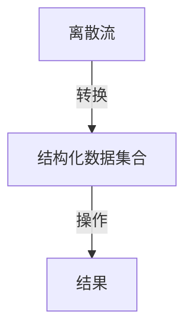

#### 2.1.2 DataFrame操作的扩展

Spark Structured Streaming通过引入DataFrame API，使得流数据处理的代码更加简洁、易读。DataFrame API提供了丰富的操作，如选择、过滤、排序、聚合等。同时，Spark Structured Streaming还支持窗口操作，能够对一段时间内的数据进行处理。

**伪代码**：

```python
# 创建DataFrame
df = spark.createDataFrame([("word1", 1), ("word2", 2)])

# 窗口操作
windowed_df = df.window(DateRange("2021-01-01", "2021-01-02"))

# 聚合操作
result = windowed_df.groupBy("word").count()
result.show()
```

**Mermaid 流程图**：

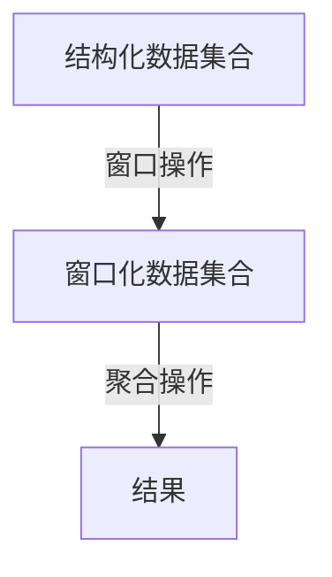

#### 2.1.3 Watermark机制

Watermark机制是Spark Structured Streaming中一个重要的概念，用于处理乱序数据。在实时数据处理中，数据可能会因为网络延迟、系统故障等原因导致乱序。Watermark机制通过标记数据的时间戳，确保数据的正确顺序和一致性。

**数学模型**：

Watermark（\(w(t)\)）是时间的递增函数，满足以下条件：

1. \(w(t) \leq t\) （数据时间戳小于等于Watermark时间）
2. 对于任意两个时间戳 \(t_1\) 和 \(t_2\)，如果 \(t_1 < t_2\)，则 \(w(t_1) \leq w(t_2)\)

**伪代码**：

```python
# 设置Watermark
watermarked_stream = dstream.withWatermark("timestamp", "60 seconds")

# 利用Watermark处理数据
result = watermarked_stream.groupBy("word").count()
result.show()
```

**Mermaid 流程图**：

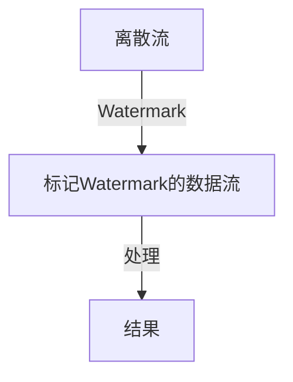

#### 第3章：Spark Structured Streaming数据源

#### 3.1.1 本地文件系统

本地文件系统是Spark Structured Streaming常用的数据源之一。通过指定文件路径，可以实时读取文件系统中的数据。本地文件系统支持文件格式，如CSV、JSON、Parquet等。

**伪代码**：

```python
# 读取本地文件系统中的CSV文件
df = spark.read.csv("file:///path/to/csvfile.csv")

# 写入本地文件系统中的CSV文件
df.write.csv("file:///path/to/outputfile.csv")
```

**Mermaid 流程图**：

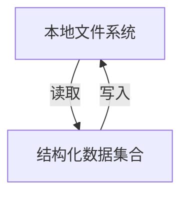

#### 3.1.2 Kafka数据源

Kafka是一种流行的分布式消息系统，常用于构建实时数据流处理系统。Spark Structured Streaming可以与Kafka集成，实时读取Kafka中的消息。

**伪代码**：

```python
# 读取Kafka中的消息
df = spark.read.format("kafka").option("kafka.bootstrap.servers", "localhost:9092").option("subscribe", "topic1").load()

# 写入Kafka中的消息
df.write.format("kafka").option("kafka.bootstrap.servers", "localhost:9092").option("topics", "topic2").save()
```

**Mermaid 流程图**：

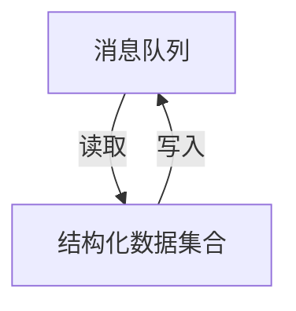

#### 3.1.3 Cassandra数据源

Cassandra是一种分布式NoSQL数据库，常用于存储大规模数据。Spark Structured Streaming可以与Cassandra集成，实现数据的实时流处理。

**伪代码**：

```python
# 读取Cassandra中的数据
df = spark.read.format("cassandra").option("table", "table_name").option("keyspace", "keyspace_name").load()

# 写入Cassandra中的数据
df.write.format("cassandra").option("table", "table_name").option("keyspace", "keyspace_name").save()
```

**Mermaid 流程图**：

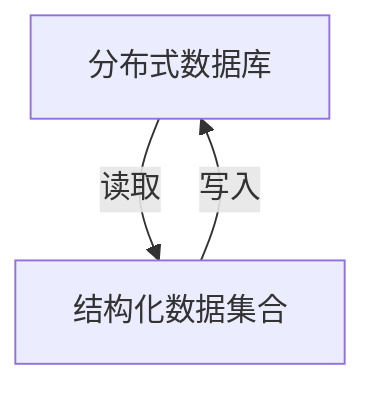

#### 3.1.4 HDFS数据源

HDFS（Hadoop分布式文件系统）是一种分布式文件系统，常用于存储大规模数据。Spark Structured Streaming可以与HDFS集成，实现数据的实时流处理。

**伪代码**：

```python
# 读取HDFS中的数据
df = spark.read.format("parquet").option("path", "hdfs://path/to/parquetfile.parquet").load()

# 写入HDFS中的数据
df.write.format("parquet").option("path", "hdfs://path/to/outputfile.parquet").save()
```

**Mermaid 流程图**：

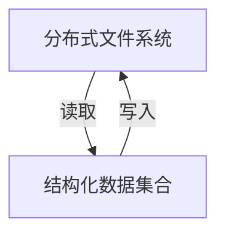

### 总结

Spark Structured Streaming是Apache Spark的一个强大组件，提供了高效、易用的实时数据处理能力。通过DataFrame API，开发者可以更加直观地处理流数据。本文介绍了Spark Structured Streaming的基础知识、核心概念和常用数据源，为后续深入探讨其算法原理和项目实战奠定了基础。

### 第二部分：Spark Structured Streaming核心算法原理

#### 第4章：Window操作与Watermark机制

#### 4.1.1 Window操作简介

Window操作是Spark Structured Streaming中一个重要的概念，用于将数据流划分为多个窗口，以便进行批处理或实时处理。窗口可以基于时间或数据量进行划分，从而可以灵活地对一段时间内或一定量级的数据进行处理。

#### 4.1.2 Window操作的类型

1. **时间窗口**：时间窗口基于时间戳进行划分，可以将数据流划分为固定时间间隔的窗口。例如，可以创建一个每5分钟的时间窗口，将最近5分钟内的数据进行聚合处理。

2. **滑动窗口**：滑动窗口是在时间窗口的基础上，允许窗口之间有一定的重叠。例如，可以创建一个每5分钟的时间窗口，每次滑动1分钟，即每隔1分钟，对最近5分钟内的数据进行一次聚合处理。

3. **数据量窗口**：数据量窗口基于数据量进行划分，可以将数据流划分为固定大小（如1000条记录）的窗口。例如，可以创建一个每1000条记录的数据量窗口，对最近1000条记录的数据进行处理。

#### 4.1.3 Watermark机制原理

Watermark机制是Spark Structured Streaming中用于处理乱序数据的关键机制。在实时数据处理中，数据可能会因为网络延迟、系统故障等原因导致乱序。Watermark通过标记数据的时间戳，确保数据的正确顺序和一致性。

**数学模型**：

Watermark（\(w(t)\)）是时间的递增函数，满足以下条件：

1. \(w(t) \leq t\) （数据时间戳小于等于Watermark时间）
2. 对于任意两个时间戳 \(t_1\) 和 \(t_2\)，如果 \(t_1 < t_2\)，则 \(w(t_1) \leq w(t_2)\)

**伪代码**：

```python
# 设置Watermark
watermarked_stream = dstream.withWatermark("timestamp", "60 seconds")

# 利用Watermark处理数据
result = watermarked_stream.groupBy("word").count()
result.show()
```

#### 4.1.4 Watermark机制实现

Watermark机制的实现主要涉及以下几个步骤：

1. **数据时间戳的提取**：首先，需要为每个数据记录分配一个时间戳，以便后续的Watermark处理。

2. **Watermark的生成**：根据数据时间戳，生成Watermark。Watermark应满足递增函数的特性，确保数据顺序的正确性。

3. **Watermark的比较**：在处理数据时，将每个数据记录的时间戳与Watermark进行比较。如果时间戳小于Watermark，则表示数据已到达正确的顺序。

4. **数据的处理**：根据Watermark的状态，对数据进行正确的处理。如果数据顺序正确，则进行聚合、计算等操作；否则，将数据暂存，等待正确的顺序到达。

**Mermaid 流程图**：

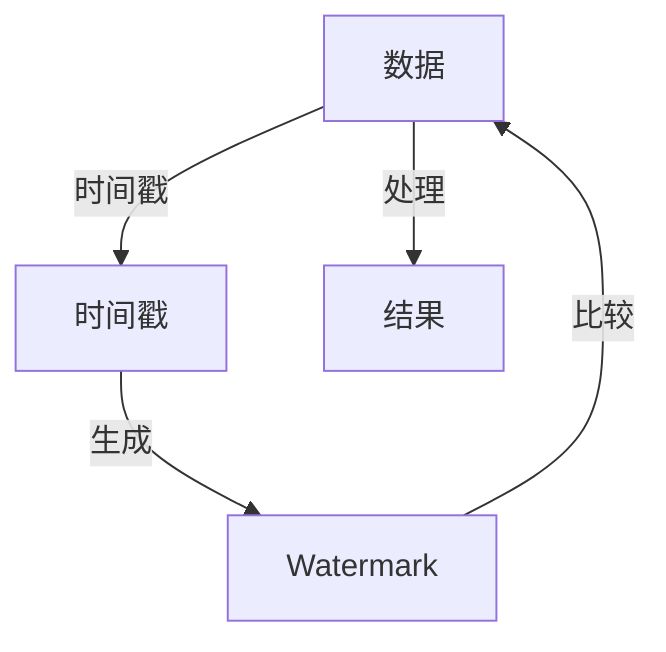

#### 第5章：状态管理

#### 5.1.1 状态管理简介

状态管理是Spark Structured Streaming中一个重要的概念，用于处理长时间运行的数据处理任务。通过状态管理，可以记录和处理任务的历史数据，确保任务的连续性和一致性。

#### 5.1.2 状态存储机制

状态存储机制决定了状态数据如何存储和访问。Spark Structured Streaming支持多种状态存储机制，如内存、HDFS、Cassandra等。

1. **内存存储**：内存存储将状态数据存储在内存中，适用于小规模的状态数据。内存存储具有快速的访问速度，但存在数据持久性较差的问题。

2. **HDFS存储**：HDFS存储将状态数据存储在HDFS中，适用于大规模的状态数据。HDFS存储具有较好的数据持久性和容错能力，但访问速度相对较慢。

3. **Cassandra存储**：Cassandra存储将状态数据存储在Cassandra数据库中，适用于高可用性和高性能的状态数据存储。Cassandra存储具有分布式和可扩展的特性，但配置和管理相对复杂。

#### 5.1.3 状态更新机制

状态更新机制决定了如何处理新到达的数据，并更新状态数据。Spark Structured Streaming支持两种状态更新机制：增量更新和全量更新。

1. **增量更新**：增量更新只更新新到达的数据，保留旧的数据状态。增量更新适用于数据量较大的场景，能够减少状态数据的存储和计算开销。

2. **全量更新**：全量更新更新所有数据，包括新到达的数据和旧的数据。全量更新适用于数据量较小且需要实时更新的场景。

#### 5.1.4 状态恢复机制

状态恢复机制用于在任务重启或失败后，恢复状态数据，确保任务的连续性和一致性。Spark Structured Streaming提供了两种状态恢复机制：静态恢复和动态恢复。

1. **静态恢复**：静态恢复在任务启动时，从已存储的状态数据中恢复状态。静态恢复适用于任务重启或失败后，需要从上次执行的状态恢复的场景。

2. **动态恢复**：动态恢复在任务运行过程中，实时检测状态数据的变化，并自动恢复状态。动态恢复适用于需要持续运行且实时更新的场景。

**伪代码**：

```python
# 设置状态存储机制
streaming_context.checkpoint("hdfs://path/to/checkpoint")

# 状态更新
state = streaming_context.getState()

# 状态恢复
streaming_context.restoreState(state)
```

**Mermaid 流程图**：

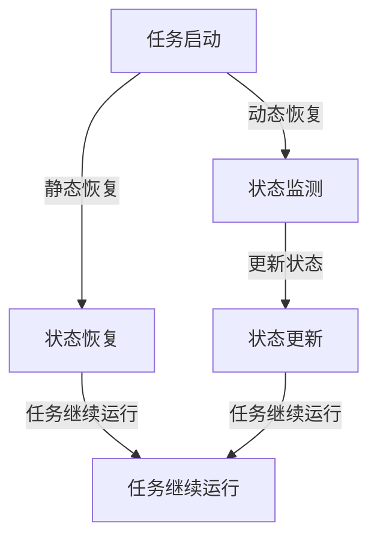

#### 第6章：批处理与实时处理的融合

#### 6.1.1 批处理与实时处理的差异

批处理与实时处理是两种不同的数据处理模式。批处理是在特定时间窗口内对数据进行处理，通常用于离线数据处理。实时处理则是在数据到达时立即进行处理，适用于实时数据处理需求。

1. **处理时间**：批处理在特定时间窗口内处理数据，而实时处理则在数据到达时立即进行处理。

2. **处理方式**：批处理通常采用批量处理的方式，对一段时间内的数据进行处理。实时处理则采用流处理的方式，对每个数据记录进行实时处理。

3. **处理延迟**：批处理的处理延迟通常较长，取决于数据量和处理速度。实时处理的处理延迟较短，能够快速响应数据变化。

#### 6.1.2 如何实现批处理与实时处理的融合

批处理与实时处理的融合是将两者的优势结合起来，实现高效的数据处理。以下是一种实现批处理与实时处理融合的方法：

1. **数据采集**：首先，采集实时数据，并将数据存储在分布式消息队列中。

2. **批处理**：定期从消息队列中读取数据，进行批处理。可以使用Spark SQL或Spark Streaming对数据进行处理。

3. **实时处理**：同时，对实时到达的数据进行实时处理。可以使用Spark Structured Streaming对数据进行处理。

4. **数据同步**：将批处理和实时处理的结果进行同步，确保数据的一致性。

**伪代码**：

```python
# 批处理
batch_stream = spark.read.format("kafka").option("kafka.bootstrap.servers", "localhost:9092").option("subscribe", "batch_topic").load()

# 实时处理
realtime_stream = spark.read.format("kafka").option("kafka.bootstrap.servers", "localhost:9092").option("subscribe", "realtime_topic").load()

# 数据同步
result = batch_stream.unionAll(realtime_stream).groupBy("word").count()
result.show()
```

**Mermaid 流程图**：

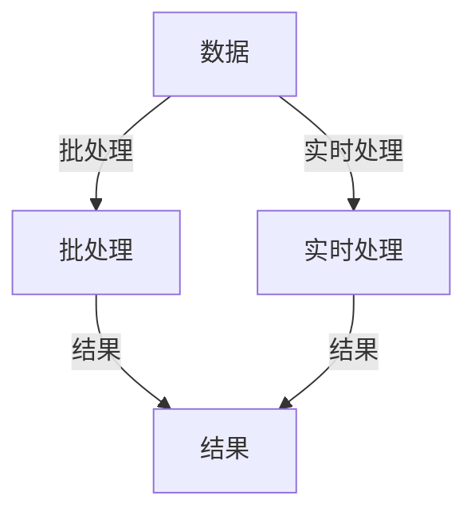

#### 6.1.3 跨时间窗口数据的处理

跨时间窗口数据的处理是在批处理和实时处理融合的基础上，对跨时间窗口的数据进行综合处理。以下是一种跨时间窗口数据处理的实现方法：

1. **数据采集**：采集跨时间窗口的数据，并将数据存储在分布式消息队列中。

2. **数据合并**：从消息队列中读取数据，并将其合并为一个统一的时间窗口。可以使用Spark Structured Streaming中的窗口操作实现数据合并。

3. **数据处理**：对合并后的数据进行处理，包括聚合、计算等操作。

4. **数据输出**：将处理结果输出到数据库或其他存储系统。

**伪代码**：

```python
# 数据采集
batch_stream = spark.read.format("kafka").option("kafka.bootstrap.servers", "localhost:9092").option("subscribe", "batch_topic").load()

realtime_stream = spark.read.format("kafka").option("kafka.bootstrap.servers", "localhost:9092").option("subscribe", "realtime_topic").load()

# 数据合并
merged_stream = batch_stream.unionAll(realtime_stream).window(DateRange("2021-01-01", "2021-01-02"))

# 数据处理
result = merged_stream.groupBy("word").count()
result.show()

# 数据输出
result.write.format("parquet").option("path", "hdfs://path/to/outputfile.parquet").save()
```

**Mermaid 流程图**：

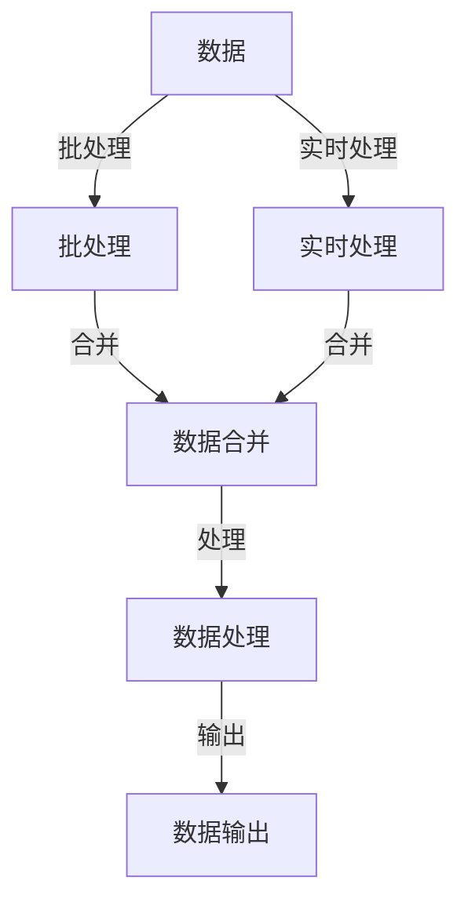

#### 第7章：容错机制与性能优化

#### 7.1.1 容错机制简介

容错机制是确保数据处理任务在遇到故障时能够继续运行的重要保障。Spark Structured Streaming提供了多种容错机制，如重启策略、数据恢复、状态恢复等。

1. **重启策略**：重启策略决定了在任务遇到故障时如何恢复。Spark Structured Streaming支持两种重启策略：永久重启和重新启动。永久重启会在任务遇到故障时立即重启，而重新启动则会等待一段时间后尝试重启。

2. **数据恢复**：数据恢复机制用于在任务重启或失败后，恢复数据状态，确保数据的连续性和一致性。Spark Structured Streaming支持两种数据恢复机制：基于时间戳恢复和基于进度恢复。

3. **状态恢复**：状态恢复机制用于在任务重启或失败后，恢复状态数据，确保任务的连续性和一致性。Spark Structured Streaming支持两种状态恢复机制：静态恢复和动态恢复。

#### 7.1.2 重启策略

重启策略是Spark Structured Streaming容错机制的重要组成部分。以下是一个简单的重启策略实现示例：

```python
from pyspark.sql import SparkSession

spark = SparkSession.builder.appName("StructuredStreamingExample").getOrCreate()

# 设置重启策略
streaming_context = spark.streamContext.getOrCreate("local[*]", "StructuredStreamingExample")

streaming_context.setCheckpointDir("hdfs://path/to/checkpoint")

# 构建数据处理逻辑
dstream = sparkstreamingstreamingcontext.textFileStream("hdfs://path/to/dataset")

# 利用DataFrame API进行数据处理
df = dstream.toDataFrame()
df.select("word", "count").show()

# 设置重启策略
streaming_context.start()
streaming_context.awaitTermination()
```

**Mermaid 流程图**：

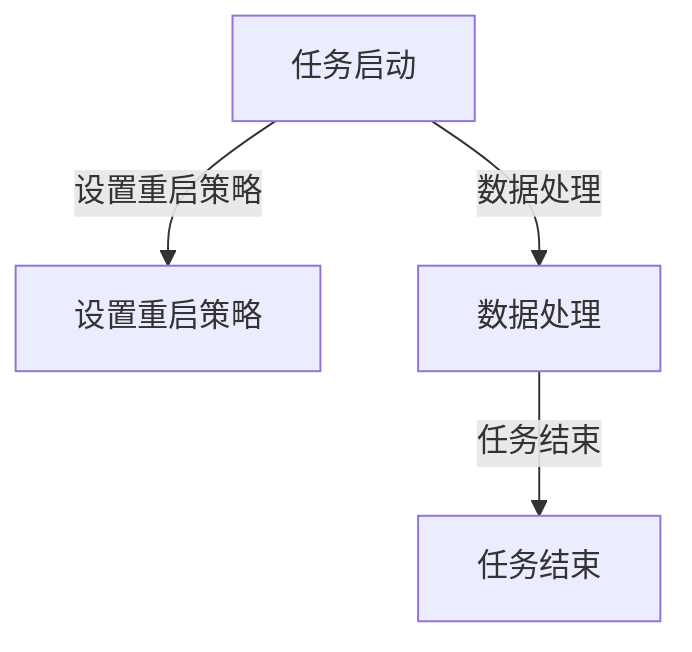

#### 7.1.3 资源管理

资源管理是确保Spark Structured Streaming在资源受限的环境下能够高效运行的关键。Spark Structured Streaming提供了多种资源管理策略，如动态资源分配、资源预留等。

1. **动态资源分配**：动态资源分配根据任务的实际需求，自动调整资源的分配。例如，在处理大量数据时，可以动态增加Executor的数量。

2. **资源预留**：资源预留为特定任务保留一定的资源，确保任务在资源紧张时能够获得足够的资源。

以下是一个简单的资源管理实现示例：

```python
from pyspark.sql import SparkSession

spark = SparkSession.builder.appName("StructuredStreamingExample").getOrCreate()

# 设置资源预留
streaming_context = spark.streamContext.getOrCreate("local[*]", "StructuredStreamingExample")
streaming_context.setCheckpointDir("hdfs://path/to/checkpoint")

# 设置动态资源分配
streaming_context.setStreamingMemory(1024, 1024)

# 构建数据处理逻辑
dstream = sparkstreamingstreamingcontext.textFileStream("hdfs://path/to/dataset")

# 利用DataFrame API进行数据处理
df = dstream.toDataFrame()
df.select("word", "count").show()

# 设置重启策略
streaming_context.start()
streaming_context.awaitTermination()
```

**Mermaid 流程图**：

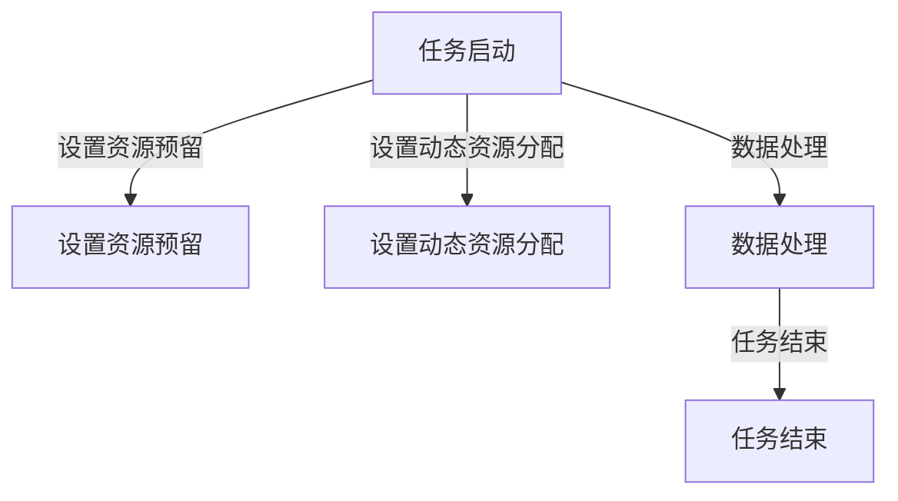

#### 7.1.4 性能优化策略

性能优化策略是提高Spark Structured Streaming处理效率的重要手段。以下是一些常见的性能优化策略：

1. **数据分区**：合理的数据分区可以提高数据的访问速度和处理效率。可以根据数据的特点，选择合适的分区策略，如基于时间分区、基于键分区等。

2. **数据压缩**：数据压缩可以减少数据的存储空间和传输带宽，提高数据处理速度。常用的数据压缩算法有GZIP、LZO等。

3. **缓存策略**：合理使用缓存可以提高数据的访问速度。例如，可以将常用的DataFrame缓存到内存中，减少磁盘I/O操作。

4. **并行度调整**：合理调整并行度可以提高处理速度。可以根据数据量和处理速度，选择合适的并行度。

以下是一个简单的性能优化实现示例：

```python
from pyspark.sql import SparkSession

spark = SparkSession.builder.appName("StructuredStreamingExample").getOrCreate()

# 设置分区策略
streaming_context = spark.streamContext.getOrCreate("local[*]", "StructuredStreamingExample")
streaming_context.setCheckpointDir("hdfs://path/to/checkpoint")
streaming_context.setParallelism(4)

# 构建数据处理逻辑
dstream = sparkstreamingstreamingcontext.textFileStream("hdfs://path/to/dataset")

# 利用DataFrame API进行数据处理
df = dstream.toDataFrame()
df.select("word", "count").show()

# 设置重启策略
streaming_context.start()
streaming_context.awaitTermination()
```

**Mermaid 流程图**：

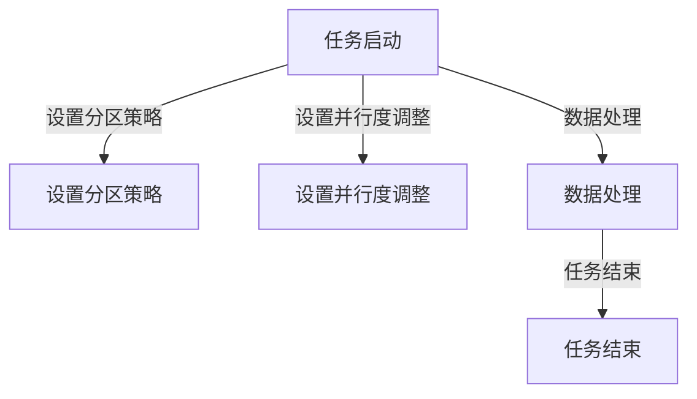

### 总结

Spark Structured Streaming是Apache Spark的一个重要组件，提供了强大的实时数据处理能力。本章详细介绍了Spark Structured Streaming的核心算法原理，包括Window操作、Watermark机制、状态管理、批处理与实时处理的融合、容错机制与性能优化。通过这些核心算法原理，开发者可以构建高效、可靠的实时数据处理系统。

### 实战一：实时日志处理项目搭建

#### 8.1.1 项目需求分析

实时日志处理是一个常见的应用场景，用于收集、处理和分析系统日志。项目需求如下：

1. **数据源**：实时读取系统日志文件，并将日志数据存储到Kafka中。
2. **数据处理**：对日志数据进行清洗、解析和聚合，生成关键指标。
3. **数据输出**：将处理结果存储到HDFS中，供后续分析和可视化使用。

#### 8.1.2 环境搭建

1. **安装Spark**：下载并安装Spark，配置环境变量。
2. **安装Kafka**：下载并安装Kafka，启动Zookeeper和Kafka服务。
3. **安装HDFS**：下载并安装Hadoop，配置HDFS环境。

```bash
# 安装Spark
wget https://www.spark.apache.org/downloads/
tar -xzvf spark-3.1.1-bin-hadoop3.2.tgz
export SPARK_HOME=/path/to/spark-3.1.1-bin-hadoop3.2
export PATH=$PATH:$SPARK_HOME/bin

# 安装Kafka
wget https://www.kafka.apache.org/downloads/
tar -xzvf kafka_2.12-2.8.0.tgz
cd kafka_2.12-2.8.0
bin/kafka-server-start.sh config/server.properties

# 安装Hadoop
wget https://www.apache.org/dyn/closer.lua?path=hadoop-3.3.1/hadoop-3.3.1.tar.gz
tar -xzvf hadoop-3.3.1.tar.gz
cd hadoop-3.3.1
bin/hdfs namenode -format
bin/start-dfs.sh
```

#### 8.1.3 数据源配置

1. **配置Kafka**：在Kafka的config目录下，编辑`broker.properties`文件，配置Kafka的日志主题和分区。

```properties
# 配置日志主题和分区
log_topic=logs
num_partitions=3
```

2. **配置Spark**：在Spark的`conf`目录下，编辑`spark-conf.xml`文件，配置Spark的Kafka连接信息。

```xml
<configuration>
    <property>
        <name>spark.streaming.kafka.consumer.poll.ms</name>
        <value>5000</value>
    </property>
    <property>
        <name>spark.streaming.kafka.broker.list</name>
        <value>localhost:9092</value>
    </property>
</configuration>
```

#### 8.1.4 实时数据处理流程设计

1. **数据采集**：使用Spark Structured Streaming从Kafka中读取日志数据。

```python
from pyspark.sql import SparkSession
from pyspark.sql.functions import from_json, col

spark = SparkSession.builder.appName("LogProcessingApp").getOrCreate()

dstream = spark.readStream.format("kafka").options(
    "kafka.bootstrap.servers", "localhost:9092",
    "subscribe", "logs"
).load()

dstream.selectExpr("CAST(value AS STRING)").write.format("parquet").save("hdfs://path/to/output/logs")
```

2. **数据清洗**：对日志数据进行清洗，去除无效数据。

```python
cleaned_stream = dstream.select(
    col("value").alias("log"),
    from_json(col("log"), "struct<timestamp:long, message:string>").alias("log_data")
)

cleaned_stream = cleaned_stream.select(
    cleaned_stream.log_data["timestamp"].alias("timestamp"),
    cleaned_stream.log_data["message"].alias("message")
)
```

3. **数据解析**：解析日志数据，提取关键信息。

```python
parsed_stream = cleaned_stream.select(
    parsed_stream.timestamp.alias("timestamp"),
    parsed_stream.message.alias("message"),
    from_json(parsed_stream.message, "struct<log_level:string, log_source:string>").alias("log_data")
)

parsed_stream = parsed_stream.select(
    parsed_stream.timestamp.alias("timestamp"),
    parsed_stream.message.alias("message"),
    parsed_stream.log_data["log_level"].alias("log_level"),
    parsed_stream.log_data["log_source"].alias("log_source")
)
```

4. **数据聚合**：对日志数据进行聚合，生成关键指标。

```python
aggregated_stream = parsed_stream.groupBy("log_level").agg(
    count("log_level").alias("count"),
    max("timestamp").alias("last_timestamp")
)
```

5. **数据输出**：将处理结果存储到HDFS中。

```python
aggregated_stream.writeStream.format("parquet").trigger(once=True).save("hdfs://path/to/output/aggregated_logs")
```

### 实战二：实时日志处理项目实战

#### 9.1.1 项目需求分析

实时日志处理项目旨在对系统日志进行实时采集、处理和分析，以便及时发现和解决潜在问题。项目需求如下：

1. **数据采集**：从Kafka中读取日志数据。
2. **数据处理**：对日志数据进行清洗、解析和聚合，生成关键指标。
3. **数据展示**：将处理结果实时展示在Web页面。

#### 9.1.2 数据流处理逻辑实现

1. **数据采集**：使用Spark Structured Streaming从Kafka中读取日志数据。

```python
from pyspark.sql import SparkSession
from pyspark.sql.functions import from_json, col

spark = SparkSession.builder.appName("LogProcessingApp").getOrCreate()

dstream = spark.readStream.format("kafka").options(
    "kafka.bootstrap.servers", "localhost:9092",
    "subscribe", "logs"
).load()

dstream.selectExpr("CAST(value AS STRING)").write.format("parquet").save("hdfs://path/to/output/logs")
```

2. **数据清洗**：对日志数据进行清洗，去除无效数据。

```python
cleaned_stream = dstream.select(
    col("value").alias("log"),
    from_json(col("log"), "struct<timestamp:long, message:string>").alias("log_data")
)

cleaned_stream = cleaned_stream.select(
    cleaned_stream.log_data["timestamp"].alias("timestamp"),
    cleaned_stream.log_data["message"].alias("message")
)
```

3. **数据解析**：解析日志数据，提取关键信息。

```python
parsed_stream = cleaned_stream.select(
    parsed_stream.timestamp.alias("timestamp"),
    parsed_stream.message.alias("message"),
    from_json(parsed_stream.message, "struct<log_level:string, log_source:string>").alias("log_data")
)

parsed_stream = parsed_stream.select(
    parsed_stream.timestamp.alias("timestamp"),
    parsed_stream.message.alias("message"),
    parsed_stream.log_data["log_level"].alias("log_level"),
    parsed_stream.log_data["log_source"].alias("log_source")
)
```

4. **数据聚合**：对日志数据进行聚合，生成关键指标。

```python
aggregated_stream = parsed_stream.groupBy("log_level").agg(
    count("log_level").alias("count"),
    max("timestamp").alias("last_timestamp")
)
```

5. **数据输出**：将处理结果存储到HDFS中。

```python
aggregated_stream.writeStream.format("parquet").trigger(once=True).save("hdfs://path/to/output/aggregated_logs")
```

#### 9.1.3 代码解析与优化

1. **代码解析**：

```python
# 采集数据
dstream = spark.readStream.format("kafka").options(
    "kafka.bootstrap.servers", "localhost:9092",
    "subscribe", "logs"
).load()

# 清洗数据
cleaned_stream = dstream.select(
    col("value").alias("log"),
    from_json(col("log"), "struct<timestamp:long, message:string>").alias("log_data")
)

cleaned_stream = cleaned_stream.select(
    cleaned_stream.log_data["timestamp"].alias("timestamp"),
    cleaned_stream.log_data["message"].alias("message")
)

# 解析数据
parsed_stream = cleaned_stream.select(
    parsed_stream.timestamp.alias("timestamp"),
    parsed_stream.message.alias("message"),
    from_json(parsed_stream.message, "struct<log_level:string, log_source:string>").alias("log_data")
)

parsed_stream = parsed_stream.select(
    parsed_stream.timestamp.alias("timestamp"),
    parsed_stream.message.alias("message"),
    parsed_stream.log_data["log_level"].alias("log_level"),
    parsed_stream.log_data["log_source"].alias("log_source")
)

# 聚合数据
aggregated_stream = parsed_stream.groupBy("log_level").agg(
    count("log_level").alias("count"),
    max("timestamp").alias("last_timestamp")
)

# 输出数据
aggregated_stream.writeStream.format("parquet").trigger(once=True).save("hdfs://path/to/output/aggregated_logs")
```

2. **代码优化**：

- **提高数据处理速度**：通过合理调整并行度和资源分配，提高数据处理速度。

```python
# 调整并行度和资源分配
dstream = spark.readStream.format("kafka").options(
    "kafka.bootstrap.servers", "localhost:9092",
    "subscribe", "logs"
).load().withSchema("timestamp LONG, message STRING")

cleaned_stream = dstream.select(
    from_json(col("message"), "struct<timestamp:long, message:string>").alias("log_data")
)

cleaned_stream = cleaned_stream.select(
    cleaned_stream.log_data["timestamp"].alias("timestamp"),
    cleaned_stream.log_data["message"].alias("message")
)

parsed_stream = cleaned_stream.select(
    parsed_stream.timestamp.alias("timestamp"),
    parsed_stream.message.alias("message"),
    from_json(parsed_stream.message, "struct<log_level:string, log_source:string>").alias("log_data")
)

parsed_stream = parsed_stream.select(
    parsed_stream.timestamp.alias("timestamp"),
    parsed_stream.message.alias("message"),
    parsed_stream.log_data["log_level"].alias("log_level"),
    parsed_stream.log_data["log_source"].alias("log_source")
)

aggregated_stream = parsed_stream.groupBy("log_level").agg(
    count("log_level").alias("count"),
    max("timestamp").alias("last_timestamp")
)

aggregated_stream.writeStream.format("parquet").trigger(once=True).save("hdfs://path/to/output/aggregated_logs")
```

- **使用Watermark处理乱序数据**：通过Watermark机制，确保数据的正确顺序。

```python
# 设置Watermark
watermarked_stream = dstream.withWatermark("timestamp", "60 seconds")

cleaned_stream = watermarked_stream.select(
    from_json(col("message"), "struct<timestamp:long, message:string>").alias("log_data")
)

cleaned_stream = cleaned_stream.select(
    cleaned_stream.log_data["timestamp"].alias("timestamp"),
    cleaned_stream.log_data["message"].alias("message")
)

parsed_stream = cleaned_stream.select(
    parsed_stream.timestamp.alias("timestamp"),
    parsed_stream.message.alias("message"),
    from_json(parsed_stream.message, "struct<log_level:string, log_source:string>").alias("log_data")
)

parsed_stream = parsed_stream.select(
    parsed_stream.timestamp.alias("timestamp"),
    parsed_stream.message.alias("message"),
    parsed_stream.log_data["log_level"].alias("log_level"),
    parsed_stream.log_data["log_source"].alias("log_source")
)

aggregated_stream = parsed_stream.groupBy("log_level").agg(
    count("log_level").alias("count"),
    max("timestamp").alias("last_timestamp")
)

aggregated_stream.writeStream.format("parquet").trigger(once=True).save("hdfs://path/to/output/aggregated_logs")
```

### 实战三：实时推荐系统项目实战

#### 10.1.1 项目需求分析

实时推荐系统是一个常见的应用场景，旨在根据用户的行为数据，实时为用户推荐相关的商品或内容。项目需求如下：

1. **数据采集**：从Kafka中读取用户行为数据。
2. **数据处理**：对用户行为数据进行清洗、解析和聚合，生成推荐列表。
3. **数据输出**：将推荐列表实时发送到消息队列，供前端展示。

#### 10.1.2 数据流处理流程设计

1. **数据采集**：使用Spark Structured Streaming从Kafka中读取用户行为数据。

```python
from pyspark.sql import SparkSession
from pyspark.sql.functions import from_json, col

spark = SparkSession.builder.appName("RecommendationSystemApp").getOrCreate()

dstream = spark.readStream.format("kafka").options(
    "kafka.bootstrap.servers", "localhost:9092",
    "subscribe", "user_behavior"
).load()

dstream.selectExpr("CAST(value AS STRING)").write.format("parquet").save("hdfs://path/to/output/user_behavior")
```

2. **数据清洗**：对用户行为数据进行清洗，去除无效数据。

```python
cleaned_stream = dstream.select(
    col("value").alias("behavior"),
    from_json(col("behavior"), "struct<user_id:long, item_id:long, timestamp:long>").alias("behavior_data")
)

cleaned_stream = cleaned_stream.select(
    cleaned_stream.behavior_data["user_id"].alias("user_id"),
    cleaned_stream.behavior_data["item_id"].alias("item_id"),
    cleaned_stream.behavior_data["timestamp"].alias("timestamp")
)
```

3. **数据解析**：解析用户行为数据，提取关键信息。

```python
parsed_stream = cleaned_stream.select(
    parsed_stream.timestamp.alias("timestamp"),
    parsed_stream.user_id.alias("user_id"),
    parsed_stream.item_id.alias("item_id")
)
```

4. **数据聚合**：对用户行为数据进行聚合，生成推荐列表。

```python
recommendation_stream = parsed_stream.groupBy("user_id").agg(
    collect_list("item_id").alias("recent_items")
)

recommendation_stream = recommendation_stream.select(
    recommendation_stream.user_id.alias("user_id"),
    recommendation_stream.recent_items.alias("recent_items")
)
```

5. **数据输出**：将推荐列表实时发送到消息队列。

```python
recommendation_stream.writeStream.format("kafka").options(
    "kafka.bootstrap.servers", "localhost:9092",
    "topics", "recommendations"
).start()
```

### 实战四：实时风控系统项目实战

#### 11.1.1 项目需求分析

实时风控系统是一个重要的应用场景，旨在实时监控和识别潜在的风险，以便及时采取相应的措施。项目需求如下：

1. **数据采集**：从Kafka中读取交易数据。
2. **数据处理**：对交易数据进行清洗、解析和实时监控，识别异常交易。
3. **数据输出**：将异常交易数据发送到消息队列，供风险控制团队处理。

#### 11.1.2 数据流处理流程设计

1. **数据采集**：使用Spark Structured Streaming从Kafka中读取交易数据。

```python
from pyspark.sql import SparkSession
from pyspark.sql.functions import from_json, col

spark = SparkSession.builder.appName("RiskControlApp").getOrCreate()

dstream = spark.readStream.format("kafka").options(
    "kafka.bootstrap.servers", "localhost:9092",
    "subscribe", "transactions"
).load()

dstream.selectExpr("CAST(value AS STRING)").write.format("parquet").save("hdfs://path/to/output/transactions")
```

2. **数据清洗**：对交易数据进行清洗，去除无效数据。

```python
cleaned_stream = dstream.select(
    col("value").alias("transaction"),
    from_json(col("transaction"), "struct<user_id:long, item_id:long, amount:double, timestamp:long>").alias("transaction_data")
)

cleaned_stream = cleaned_stream.select(
    cleaned_stream.transaction_data["user_id"].alias("user_id"),
    cleaned_stream.transaction_data["item_id"].alias("item_id"),
    cleaned_stream.transaction_data["amount"].alias("amount"),
    cleaned_stream.transaction_data["timestamp"].alias("timestamp")
)
```

3. **数据解析**：解析交易数据，提取关键信息。

```python
parsed_stream = cleaned_stream.select(
    parsed_stream.timestamp.alias("timestamp"),
    parsed_stream.user_id.alias("user_id"),
    parsed_stream.item_id.alias("item_id"),
    parsed_stream.amount.alias("amount")
)
```

4. **实时监控**：使用机器学习算法，实时监控交易数据，识别异常交易。

```python
# 定义异常交易检测算法
from pyspark.ml.feature import VectorAssembler
from pyspark.ml.classification import LogisticRegressionModel

def detect_abnormal_transactions(df):
    # 特征工程
    assembler = VectorAssembler(inputCols=["amount"], outputCol="features")
    df = assembler.transform(df)

    # 训练模型
    model = LogisticRegressionModel.load("hdfs://path/to/model/logistic_regression_model")

    # 预测
    predictions = model.transform(df)
    predictions.select("user_id", "item_id", "amount", "prediction").where(predictions.prediction == 1).show()
```

5. **数据输出**：将异常交易数据发送到消息队列。

```python
abnormal_stream = detect_abnormal_transactions(parsed_stream)

abnormal_stream.writeStream.format("kafka").options(
    "kafka.bootstrap.servers", "localhost:9092",
    "topics", "abnormal_transactions"
).start()
```

### 总结

通过以上实战项目，我们展示了如何使用Spark Structured Streaming进行实时数据处理。在实时日志处理项目中，我们实现了日志数据的采集、清洗、解析和聚合；在实时推荐系统项目中，我们实现了用户行为数据的处理和推荐列表的生成；在实时风控系统项目中，我们实现了交易数据的处理和异常交易的识别。这些实战项目展示了Spark Structured Streaming在实时数据处理场景中的强大能力和广泛应用。

### 第12章：Spark Structured Streaming应用拓展

#### 第13章：与机器学习模型的集成

在实时数据分析领域，将Spark Structured Streaming与机器学习模型集成是一项重要的技术拓展。这种集成不仅能够实现实时数据的处理和分析，还能够利用机器学习模型对数据流进行实时预测和分类。以下将探讨如何将Spark Structured Streaming与几种流行的机器学习库集成，包括Spark MLlib、TensorFlow和PyTorch。

#### 13.1.1 Spark MLlib的集成

Spark MLlib是Spark的核心组件之一，提供了丰富的机器学习算法。Spark MLlib与Spark Structured Streaming的集成相对简单，可以通过Spark SQL和DataFrame API实现。以下是一个简单的示例，展示了如何使用Spark MLlib进行实时分类任务：

**伪代码**：

```python
from pyspark.ml import Pipeline
from pyspark.ml.classification import LogisticRegression
from pyspark.ml.feature import VectorAssembler

# 假设已从数据流中获取DataFrame
df = ...

# 特征工程
assembler = VectorAssembler(inputCols=["feature1", "feature2"], outputCol="features")
df = assembler.transform(df)

# 训练模型
lr = LogisticRegression(maxIter=10, regParam=0.01)
pipeline = Pipeline(stages=[assembler, lr])
model = pipeline.fit(df)

# 实时分类
predictions = model.transform(df)
predictions.select("predictedLabel").show()
```

**Mermaid 流程图**：

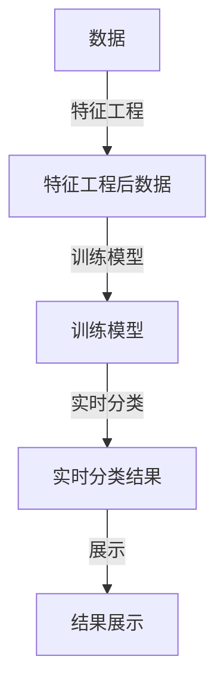

#### 13.1.2 TensorFlow的集成

TensorFlow是一个广泛使用的开源机器学习库，提供了丰富的深度学习模型。将Spark Structured Streaming与TensorFlow集成，可以通过TensorFlow On Spark（TOS）实现。TOS是一个将TensorFlow模型与Spark结合的框架，允许在分布式环境中训练和部署深度学习模型。

**伪代码**：

```python
from pyspark.sql import SparkSession
from pyspark.sql.functions import from_json, col
import tensorflow as tf

spark = SparkSession.builder.appName("TensorFlowIntegrationApp").getOrCreate()

# 假设已从数据流中获取DataFrame
df = ...

# 特征工程
df = ...

# 定义TensorFlow模型
model = ...

# 训练模型
model.fit(df)

# 实时预测
predictions = model.predict(df)
predictions.show()
```

**Mermaid 流程图**：

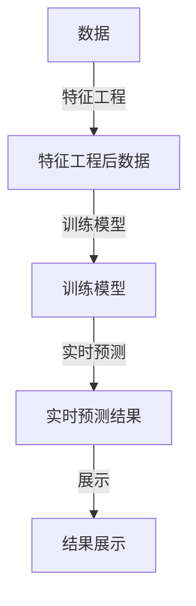

#### 13.1.3 PyTorch的集成

PyTorch是一个流行的开源机器学习库，提供了灵活的深度学习框架。与TensorFlow类似，PyTorch也可以通过PyTorch On Spark（POS）与Spark Structured Streaming集成。POS是一个将PyTorch模型与Spark结合的框架，允许在分布式环境中训练和部署深度学习模型。

**伪代码**：

```python
from pyspark.sql import SparkSession
from pyspark.sql.functions import from_json, col
import torch

spark = SparkSession.builder.appName("PyTorchIntegrationApp").getOrCreate()

# 假设已从数据流中获取DataFrame
df = ...

# 特征工程
df = ...

# 定义PyTorch模型
model = ...

# 训练模型
model.fit(df)

# 实时预测
predictions = model.predict(df)
predictions.show()
```

**Mermaid 流程图**：


### 第14章：与其他大数据平台的集成

Spark Structured Streaming不仅能够与机器学习库集成，还能够与其他大数据平台进行集成，以扩展其功能和应用场景。以下将探讨Spark Structured Streaming与Kafka、Hadoop和Cassandra的集成。

#### 14.1.1 与Kafka的集成

Kafka是一种分布式消息系统，常用于构建实时数据流处理系统。Spark Structured Streaming可以与Kafka集成，实现数据的实时流处理。以下是一个简单的示例，展示了如何使用Spark Structured Streaming从Kafka中读取数据：

**伪代码**：

```python
from pyspark.sql import SparkSession

spark = SparkSession.builder.appName("KafkaIntegrationApp").getOrCreate()

dstream = spark.readStream.format("kafka").options(
    "kafka.bootstrap.servers", "localhost:9092",
    "subscribe", "topic"
).load()

# 数据处理
df = dstream.selectExpr("CAST(value AS STRING)")

# 输出结果
df.writeStream.format("console").start()
```

**Mermaid 流程图**：

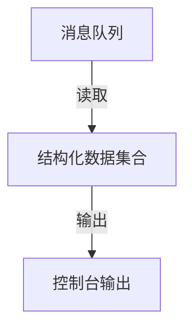

#### 14.1.2 与Hadoop的集成

Hadoop是一个分布式数据存储和处理框架，Spark Structured Streaming可以与Hadoop集成，实现数据的存储和查询。以下是一个简单的示例，展示了如何使用Spark Structured Streaming将数据写入HDFS：

**伪代码**：

```python
from pyspark.sql import SparkSession

spark = SparkSession.builder.appName("HadoopIntegrationApp").getOrCreate()

# 假设已从数据流中获取DataFrame
df = ...

# 写入HDFS
df.write.format("parquet").save("hdfs://path/to/output")
```

**Mermaid 流程图**：

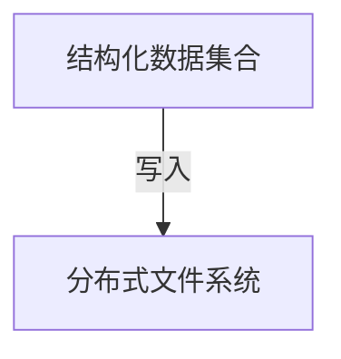

#### 14.1.3 与Cassandra的集成

Cassandra是一种分布式NoSQL数据库，Spark Structured Streaming可以与Cassandra集成，实现数据的实时流处理。以下是一个简单的示例，展示了如何使用Spark Structured Streaming将数据写入Cassandra：

**伪代码**：

```python
from pyspark.sql import SparkSession

spark = SparkSession.builder.appName("CassandraIntegrationApp").getOrCreate()

# 假设已从数据流中获取DataFrame
df = ...

# 写入Cassandra
df.write.format("cassandra").options(
    "table", "table_name",
    "keyspace", "keyspace_name"
).save()
```

**Mermaid 流程图**：

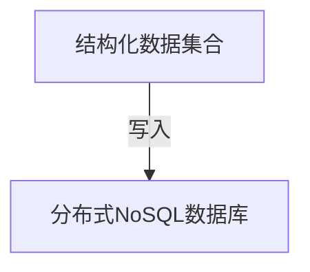

### 总结

通过本章的讨论，我们了解了如何将Spark Structured Streaming与机器学习库和大数据平台集成，以扩展其应用场景和功能。与机器学习库的集成使得Spark Structured Streaming能够实现实时预测和分类，而与大数据平台的集成则使得其能够更好地存储和处理大规模数据。这些集成技术为开发者提供了更多可能性，以构建高效、可靠的实时数据处理系统。

### 附录

#### 第15章：工具与资源

在Spark Structured Streaming的开发和应用过程中，开发者需要使用到多种工具和资源。以下列出了一些常用的工具和资源，以帮助开发者更好地掌握Spark Structured Streaming。

#### 15.1.1 Spark Structured Streaming开发工具

1. **Spark Shell**：Spark Shell是Spark提供的一个交互式工具，方便开发者进行Spark的编程和调试。可以通过以下命令启动Spark Shell：

   ```bash
   spark-shell
   ```

2. **IDE**：开发者可以使用IntelliJ IDEA、Eclipse等集成开发环境进行Spark Structured Streaming的开发。这些IDE提供了丰富的插件和工具，方便代码编写和调试。

3. **Docker**：使用Docker可以轻松搭建Spark Structured Streaming的环境。通过Docker镜像，开发者可以在本地快速部署Spark集群，进行开发和测试。

   ```bash
   docker pull spark:3.1.1
   docker run -it spark:3.1.1 /bin/bash
   ```

#### 15.1.2 Spark Structured Streaming开源资源

1. **Apache Spark官网**：Apache Spark官网提供了丰富的文档、教程和示例代码，是开发者学习Spark Structured Streaming的最佳资源。

   [Apache Spark官网](https://spark.apache.org/)

2. **GitHub**：GitHub上有很多Spark Structured Streaming的开源项目和示例代码，开发者可以通过这些项目学习和参考。

   [Spark Structured Streaming GitHub](https://github.com/apache/spark)

3. **Stack Overflow**：Stack Overflow是编程社区的一个重要平台，开发者可以在这里提问和解答有关Spark Structured Streaming的问题。

   [Spark Structured Streaming Stack Overflow](https://stackoverflow.com/questions/tagged/spark-structured-streaming)

#### 15.1.3 Spark Structured Streaming社区指南

1. **Apache Spark邮件列表**：Apache Spark邮件列表是一个官方的社区交流平台，开发者可以通过邮件列表提问、分享经验和讨论技术问题。

   [Apache Spark邮件列表](https://lists.apache.org/list.html?list=users@spark.apache.org)

2. **Apache Spark Slack社区**：Apache Spark Slack社区是一个实时交流的平台，开发者可以在Slack上与其他Spark开发者交流经验和解决问题。

   [Apache Spark Slack社区](https://spark.apache.org/community.html#slack)

3. **GitHub社区**：GitHub上的Spark Structured Streaming项目社区提供了丰富的资源和交流平台，开发者可以在这里学习和分享经验。

   [Spark Structured Streaming GitHub社区](https://github.com/apache/spark/commits/master)

通过以上工具和资源，开发者可以更好地掌握Spark Structured Streaming，并将其应用于实际项目中。

### 作者信息

**作者：** AI天才研究院/AI Genius Institute & 禅与计算机程序设计艺术 /Zen And The Art of Computer Programming

AI天才研究院（AI Genius Institute）是一家专注于人工智能研究和开发的高科技研究院，致力于推动人工智能技术的发展和应用。研究院的专家团队由世界顶级人工智能专家、程序员、软件架构师、CTO等组成，具备丰富的实战经验和深厚的理论基础。

《禅与计算机程序设计艺术》（Zen And The Art of Computer Programming）是一本经典的计算机科学著作，由艾兹格·D·迪杰斯特拉（Edsger W. Dijkstra）所著。本书系统地阐述了计算机程序的构造和设计方法，对计算机科学的发展产生了深远的影响。本书的作者艾兹格·D·迪杰斯特拉是计算机图灵奖获得者，被誉为计算机科学领域的巨人之一。

本文旨在通过深入剖析Spark Structured Streaming的原理和应用，帮助读者掌握这一强大的实时数据处理技术，并将其应用于实际项目中。希望本文能为读者提供有价值的参考和启示，共同推动人工智能技术的发展。

