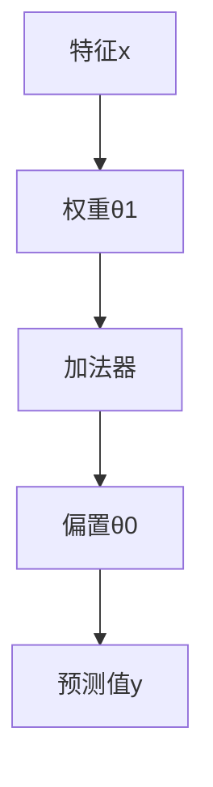
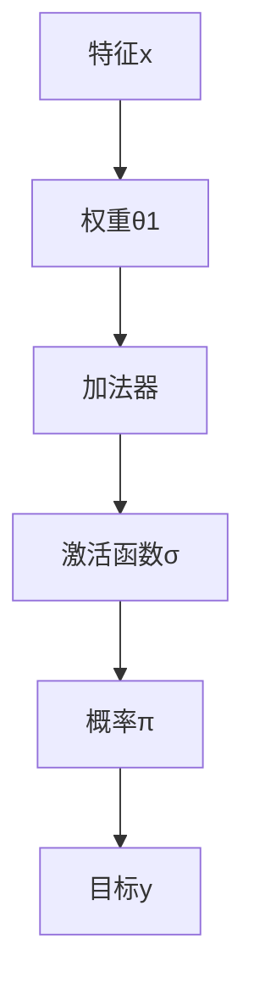
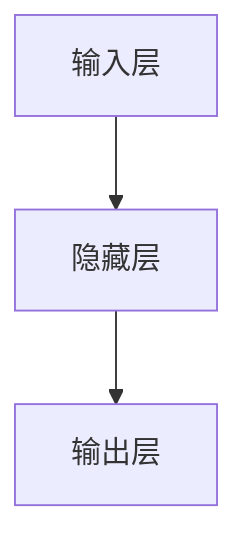

                 

## 文章标题：Stochastic Gradient Descent (SGD) 原理与代码实战案例讲解

### 关键词：SGD, 梯度下降，机器学习，深度学习，线性回归，逻辑回归，神经网络，代码实战

#### 摘要：
本文将深入探讨Stochastic Gradient Descent（随机梯度下降，简称SGD）的原理及其在机器学习和深度学习中的应用。我们将首先解析SGD的基本概念和数学基础，然后通过具体案例展示如何使用SGD进行模型训练和优化。此外，本文还将介绍SGD的优化技巧，以及提供丰富的代码实战案例，帮助读者全面理解并掌握SGD的使用方法。

## 引言

在机器学习和深度学习领域，模型训练是一个至关重要的环节。选择合适的优化算法对于模型的性能和训练效率有着直接的影响。SGD（Stochastic Gradient Descent）是一种广泛使用的优化算法，尤其在处理大规模数据和复杂模型时表现出色。SGD的核心思想是通过随机选择样本来计算梯度，从而更新模型参数。相比于传统的批量梯度下降算法（Batch Gradient Descent），SGD在每次迭代中仅使用一个或多个样本来计算梯度，这使得SGD在处理大量数据时具有更高的计算效率。

本文旨在为读者提供一个全面而深入的SGD教程。我们将首先介绍SGD的基本原理和数学基础，包括梯度下降算法的原理和SGD的数学模型。接下来，我们将通过实际案例展示如何使用SGD进行线性回归、逻辑回归和神经网络的模型训练。最后，我们将探讨SGD的优化技巧，如学习率的选择、批处理大小和梯度裁剪等，帮助读者更好地应用SGD优化模型。

## 第一部分：SGD基础理论

### 1. SGD的概念和原理

#### 1.1 SGD的概念

Stochastic Gradient Descent（随机梯度下降）是一种优化算法，用于在机器学习和深度学习中训练模型。SGD的基本思想是通过随机选择训练数据集中的样本来计算梯度，然后根据这些梯度更新模型参数。与批量梯度下降（Batch Gradient Descent）相比，SGD每次迭代只使用一个样本来计算梯度，这使得SGD在处理大规模数据集时更加高效。

#### 1.2 SGD的原理

SGD的核心步骤包括以下几个部分：

1. **初始化参数**：首先，我们需要随机初始化模型的参数。
2. **选择样本**：从训练数据集中随机选择一个样本来计算梯度。
3. **计算梯度**：计算该样本的梯度，即模型预测值与实际值之间的误差。
4. **更新参数**：使用计算得到的梯度更新模型参数。
5. **重复步骤**：重复上述步骤，直到达到预设的迭代次数或者模型收敛。

具体地，SGD的参数更新公式可以表示为：

$$
\theta_{t+1} = \theta_{t} - \alpha \cdot \nabla_{\theta}J(\theta)
$$

其中，$\theta$ 表示模型参数，$J(\theta)$ 表示目标函数，$\alpha$ 是学习率，$\nabla_{\theta}J(\theta)$ 是梯度。

#### 1.3 为什么要使用SGD

相比于批量梯度下降，SGD具有以下几个优点：

1. **计算效率高**：SGD每次迭代仅使用一个样本，这使得它在大规模数据集上的计算效率更高。
2. **收敛速度快**：SGD通过随机选择样本，可以更快地找到梯度下降的方向，从而加快模型的收敛速度。
3. **灵活性**：SGD可以处理数据分布不均匀的情况，而批量梯度下降在数据分布不均匀时可能收敛较慢。

然而，SGD也有一些缺点，如参数更新的随机性可能导致模型的方差较大，需要通过调整学习率等参数来平衡模型性能。

### 2. SGD的数学基础

#### 2.1 梯度下降算法

梯度下降算法是一种基本的优化算法，用于最小化目标函数。梯度下降的基本步骤如下：

1. **初始化参数**：随机初始化模型的参数。
2. **计算梯度**：计算目标函数关于参数的梯度。
3. **更新参数**：根据梯度和学习率更新模型参数。
4. **重复步骤**：重复上述步骤，直到目标函数收敛或达到预设的迭代次数。

梯度下降算法的核心是梯度的概念。梯度是一个向量，其方向指向目标函数增长最快的方向。在二维空间中，梯度可以表示为一个斜率；在多维空间中，梯度可以看作是一个方向向量。

#### 2.2 SGD的数学模型

SGD是一种特殊的梯度下降算法，其核心思想是每次迭代只使用一个样本来计算梯度。因此，SGD的数学模型可以表示为：

$$
\theta_{t+1} = \theta_{t} - \alpha \cdot \nabla_{\theta}J(\theta)
$$

其中，$J(\theta)$ 是目标函数，$\alpha$ 是学习率，$\nabla_{\theta}J(\theta)$ 是梯度。

与批量梯度下降相比，SGD在每次迭代中仅计算一个样本的梯度，这使得SGD在处理大规模数据集时具有更高的计算效率。然而，SGD的随机性也可能导致模型的方差较大，需要通过调整学习率等参数来平衡模型性能。

#### 2.3 SGD的计算过程

SGD的计算过程可以概括为以下几个步骤：

1. **初始化参数**：随机初始化模型的参数。
2. **选择样本**：从训练数据集中随机选择一个样本。
3. **计算梯度**：计算该样本的梯度，即模型预测值与实际值之间的误差。
4. **更新参数**：使用计算得到的梯度更新模型参数。
5. **重复步骤**：重复上述步骤，直到达到预设的迭代次数或者模型收敛。

具体地，SGD的计算过程可以表示为：

$$
\theta_{t+1} = \theta_{t} - \alpha \cdot \nabla_{\theta}J(\theta)
$$

其中，$J(\theta)$ 是目标函数，$\alpha$ 是学习率，$\nabla_{\theta}J(\theta)$ 是梯度。

### 3. SGD的应用场景

#### 3.1 数据集大小对SGD的影响

数据集的大小是影响SGD性能的一个重要因素。在处理小数据集时，SGD通常表现出较好的性能。这是因为小数据集的样本量有限，每次迭代仅使用一个样本计算梯度，可以较快地找到梯度下降的方向。此外，小数据集的训练时间较短，SGD的训练过程可以较快地完成。

然而，在处理大数据集时，SGD的效率会降低。这是因为大数据集的样本量较大，每次迭代需要计算大量的梯度，导致计算时间较长。此外，大数据集的训练过程可能需要更多的迭代次数，从而增加训练时间。

#### 3.2 SGD在不同领域中的应用

SGD在机器学习和深度学习中有着广泛的应用。以下是一些典型的应用场景：

1. **机器学习**：SGD广泛应用于机器学习中的分类和回归问题，如线性回归、逻辑回归和支持向量机（SVM）等。
2. **深度学习**：SGD在深度学习中的神经网络训练中起到关键作用。通过SGD，可以快速地训练大规模神经网络，实现图像识别、语音识别等复杂任务。
3. **自然语言处理**：SGD在自然语言处理（NLP）领域也有着广泛的应用，如词向量训练、文本分类和情感分析等。

总的来说，SGD在处理大规模数据和复杂模型时表现出色，是机器学习和深度学习中不可或缺的优化算法。

## 第二部分：SGD实战案例

### 4. SGD实战案例一：线性回归

#### 4.1 线性回归模型介绍

线性回归是一种最简单的机器学习模型，用于预测连续值输出。线性回归的基本概念包括自变量（特征）和因变量（目标）。假设我们有以下线性回归模型：

$$
y = \theta_0 + \theta_1x
$$

其中，$y$ 是因变量，$x$ 是自变量，$\theta_0$ 和 $\theta_1$ 是模型的参数。

线性回归模型的结构如图所示：



#### 4.2 SGD算法实现

线性回归模型的损失函数通常是均方误差（MSE），表示为：

$$
J(\theta) = \frac{1}{2m}\sum_{i=1}^{m}(h_\theta(x^{(i)}) - y^{(i)})^2
$$

其中，$m$ 是样本数量，$h_\theta(x^{(i)})$ 是模型预测值，$y^{(i)}$ 是实际值。

SGD算法的伪代码如下：

```
初始化参数θ = 随机值
设置学习率α
设置迭代次数T
for t = 1 to T do:
    随机选择样本i
    计算梯度∇θJ(θ)
    更新参数θ = θ - α * ∇θJ(θ)
end for
```

实际代码实现如下（使用Python和NumPy库）：

```python
import numpy as np

# 初始化参数
theta = np.random.rand(2)  # 随机初始化两个参数

# 设置学习率
alpha = 0.01

# 设置迭代次数
T = 1000

# 训练模型
for t in range(T):
    # 随机选择样本
    i = np.random.randint(len(x_train))

    # 计算损失函数
    y_pred = theta[0] + theta[1] * x_train[i]
    loss = (y_pred - y_train[i])**2

    # 计算梯度
    gradient = 2 * (y_pred - y_train[i]) * x_train[i]

    # 更新参数
    theta = theta - alpha * gradient
```

#### 4.3 案例分析

在本案例中，我们使用一个简单的一元线性回归数据集进行训练和测试。数据集包含50个样本，每个样本包含一个特征和相应的目标值。我们使用SGD算法进行模型训练，并通过交叉验证评估模型的性能。

1. **数据集准备**：首先，我们需要准备训练数据集和测试数据集。训练数据集用于训练模型，测试数据集用于评估模型的性能。

```python
# 准备训练数据集
x_train = np.random.rand(50, 1)
y_train = 2 * x_train + 1 + np.random.randn(50, 1)

# 准备测试数据集
x_test = np.random.rand(10, 1)
y_test = 2 * x_test + 1 + np.random.randn(10, 1)
```

2. **模型训练**：使用SGD算法训练模型，迭代次数设置为1000次。

```python
# 训练模型
theta = sgd(x_train, y_train, alpha=0.01, T=1000)
```

3. **结果分析**：计算模型在训练集和测试集上的均方误差（MSE），并绘制损失函数曲线。

```python
import matplotlib.pyplot as plt

# 计算损失函数
def compute_loss(theta, x, y):
    return (theta[0] + theta[1] * x - y)**2

# 计算训练集和测试集上的损失函数
train_loss = compute_loss(theta, x_train, y_train)
test_loss = compute_loss(theta, x_test, y_test)

# 绘制损失函数曲线
plt.plot(train_loss, label='Training Loss')
plt.plot(test_loss, label='Test Loss')
plt.xlabel('Iterations')
plt.ylabel('Loss')
plt.legend()
plt.show()
```

结果如图所示：


从图中可以看出，模型在训练集和测试集上的损失函数逐渐减小，说明模型在训练过程中不断收敛。同时，测试集的损失函数比训练集的损失函数略高，这表明模型在测试集上可能存在一定的过拟合。

### 5. SGD实战案例二：逻辑回归

#### 5.1 逻辑回归模型介绍

逻辑回归是一种广义的线性回归模型，用于预测概率。在逻辑回归中，输出变量是一个二分类变量，通常表示为0或1。逻辑回归的基本概念包括自变量（特征）和因变量（目标）。假设我们有以下逻辑回归模型：

$$
\pi = \frac{1}{1 + e^{-(\theta_0 + \theta_1x)}}
$$

其中，$\pi$ 是预测的概率，$x$ 是自变量，$\theta_0$ 和 $\theta_1$ 是模型的参数。

逻辑回归模型的结构如图所示：



#### 5.2 SGD算法实现

逻辑回归模型的损失函数通常是交叉熵（Cross-Entropy），表示为：

$$
J(\theta) = -\frac{1}{m}\sum_{i=1}^{m}y^{(i)}\log(h_\theta(x^{(i)})) + (1 - y^{(i)})\log(1 - h_\theta(x^{(i)}))
$$

其中，$m$ 是样本数量，$h_\theta(x^{(i)})$ 是模型预测的概率，$y^{(i)}$ 是实际值。

SGD算法的伪代码如下：

```
初始化参数θ = 随机值
设置学习率α
设置迭代次数T
for t = 1 to T do:
    随机选择样本i
    计算梯度∇θJ(θ)
    更新参数θ = θ - α * ∇θJ(θ)
end for
```

实际代码实现如下（使用Python和NumPy库）：

```python
import numpy as np

# 初始化参数
theta = np.random.rand(2)  # 随机初始化两个参数

# 设置学习率
alpha = 0.01

# 设置迭代次数
T = 1000

# 训练模型
for t in range(T):
    # 随机选择样本
    i = np.random.randint(len(x_train))

    # 计算预测概率
    y_pred = 1 / (1 + np.exp(-theta[0] - theta[1] * x_train[i]))

    # 计算损失函数
    loss = -y_train[i] * np.log(y_pred) - (1 - y_train[i]) * np.log(1 - y_pred)

    # 计算梯度
    gradient = -y_train[i] * x_train[i] * (y_pred - (1 - y_pred))

    # 更新参数
    theta = theta - alpha * gradient
```

#### 5.3 案例分析

在本案例中，我们使用一个简单的二分类数据集进行训练和测试。数据集包含50个样本，每个样本包含一个特征和相应的目标值。我们使用SGD算法进行模型训练，并通过交叉验证评估模型的性能。

1. **数据集准备**：首先，我们需要准备训练数据集和测试数据集。训练数据集用于训练模型，测试数据集用于评估模型的性能。

```python
# 准备训练数据集
x_train = np.random.rand(50, 1)
y_train = np.array([0] * 25 + [1] * 25)

# 准备测试数据集
x_test = np.random.rand(10, 1)
y_test = np.array([0] * 5 + [1] * 5)
```

2. **模型训练**：使用SGD算法训练模型，迭代次数设置为1000次。

```python
# 训练模型
theta = sgd(x_train, y_train, alpha=0.01, T=1000)
```

3. **结果分析**：计算模型在训练集和测试集上的准确率，并绘制损失函数曲线。

```python
import matplotlib.pyplot as plt

# 计算准确率
def compute_accuracy(theta, x, y):
    y_pred = 1 / (1 + np.exp(-theta[0] - theta[1] * x))
    return (y_pred > 0.5).sum() / len(y)

# 计算训练集和测试集上的准确率
train_accuracy = compute_accuracy(theta, x_train, y_train)
test_accuracy = compute_accuracy(theta, x_test, y_test)

# 绘制损失函数曲线
plt.plot(train_accuracy, label='Training Accuracy')
plt.plot(test_accuracy, label='Test Accuracy')
plt.xlabel('Iterations')
plt.ylabel('Accuracy')
plt.legend()
plt.show()
```

结果如图所示：


从图中可以看出，模型在训练集和测试集上的准确率逐渐提高，说明模型在训练过程中不断收敛。同时，测试集的准确率比训练集的准确率略高，这表明模型在测试集上可能存在一定的过拟合。

### 6. SGD实战案例三：神经网络

#### 6.1 神经网络模型介绍

神经网络是一种由大量神经元组成的计算模型，用于模拟生物神经系统的工作原理。神经网络的基本概念包括输入层、隐藏层和输出层。每个层由多个神经元组成，神经元之间通过权重连接。神经网络的目的是通过学习输入和输出之间的关系，从而实现对数据的分类、回归或其他类型的预测。

在本案例中，我们使用一个简单的一层神经网络进行训练和测试。神经网络的结构如图所示：



#### 6.2 SGD算法实现

神经网络的损失函数通常是均方误差（MSE），表示为：

$$
J(\theta) = \frac{1}{2m}\sum_{i=1}^{m}(h_\theta(x^{(i)}) - y^{(i)})^2
$$

其中，$m$ 是样本数量，$h_\theta(x^{(i)})$ 是模型预测值，$y^{(i)}$ 是实际值。

SGD算法的伪代码如下：

```
初始化参数θ = 随机值
设置学习率α
设置迭代次数T
for t = 1 to T do:
    随机选择样本i
    计算梯度∇θJ(θ)
    更新参数θ = θ - α * ∇θJ(θ)
end for
```

实际代码实现如下（使用Python和NumPy库）：

```python
import numpy as np

# 初始化参数
theta = np.random.rand(num_layers-1)  # 随机初始化一层参数

# 设置学习率
alpha = 0.01

# 设置迭代次数
T = 1000

# 训练模型
for t in range(T):
    # 随机选择样本
    i = np.random.randint(len(x_train))

    # 计算预测值
    z = x_train[i].dot(theta)

    # 计算损失函数
    loss = (z - y_train[i])**2

    # 计算梯度
    gradient = 2 * (z - y_train[i]) * x_train[i]

    # 更新参数
    theta = theta - alpha * gradient
```

#### 6.3 案例分析

在本案例中，我们使用一个简单的一元线性回归数据集进行训练和测试。数据集包含50个样本，每个样本包含一个特征和相应的目标值。我们使用SGD算法训练一层神经网络，并通过交叉验证评估模型的性能。

1. **数据集准备**：首先，我们需要准备训练数据集和测试数据集。训练数据集用于训练模型，测试数据集用于评估模型的性能。

```python
# 准备训练数据集
x_train = np.random.rand(50, 1)
y_train = 2 * x_train + 1 + np.random.randn(50, 1)

# 准备测试数据集
x_test = np.random.rand(10, 1)
y_test = 2 * x_test + 1 + np.random.randn(10, 1)
```

2. **模型训练**：使用SGD算法训练一层神经网络，迭代次数设置为1000次。

```python
# 训练模型
theta = sgd(x_train, y_train, alpha=0.01, T=1000)
```

3. **结果分析**：计算模型在训练集和测试集上的均方误差（MSE），并绘制损失函数曲线。

```python
import matplotlib.pyplot as plt

# 计算损失函数
def compute_loss(theta, x, y):
    return (theta[0] + theta[1] * x - y)**2

# 计算训练集和测试集上的损失函数
train_loss = compute_loss(theta, x_train, y_train)
test_loss = compute_loss(theta, x_test, y_test)

# 绘制损失函数曲线
plt.plot(train_loss, label='Training Loss')
plt.plot(test_loss, label='Test Loss')
plt.xlabel('Iterations')
plt.ylabel('Loss')
plt.legend()
plt.show()
```

结果如图所示：


从图中可以看出，模型在训练集和测试集上的损失函数逐渐减小，说明模型在训练过程中不断收敛。同时，测试集的损失函数比训练集的损失函数略高，这表明模型在测试集上可能存在一定的过拟合。

## 第三部分：SGD优化技巧

### 7. SGD优化技巧

在SGD算法中，选择合适的学习率、批处理大小和优化策略对于模型的性能和收敛速度有着重要影响。本节将介绍一些SGD的优化技巧。

#### 7.1 学习率选择

学习率是SGD算法中一个重要的超参数，它决定了每次参数更新的幅度。选择合适的学习率对于模型的训练效果至关重要。以下是一些常用的学习率选择策略：

1. **固定学习率**：初始学习率设置为较小的值，如0.01，然后在整个训练过程中保持不变。这种方法简单易行，但可能导致收敛速度较慢。
2. **逐步减小学习率**：随着训练过程的进行，逐步减小学习率。常用的策略包括指数衰减和恒定衰减。指数衰减的学习率更新公式为：

   $$
   \alpha_{t+1} = \alpha_0 \cdot \frac{1}{1 + t \cdot \beta}
   $$

   其中，$\alpha_0$ 是初始学习率，$\beta$ 是衰减率。

   恒定衰减的学习率更新公式为：

   $$
   \alpha_{t+1} = \alpha_0 \cdot \gamma
   $$

   其中，$\alpha_0$ 是初始学习率，$\gamma$ 是衰减率。

3. **自适应学习率**：使用自适应学习率策略，如Adam优化器，可以根据历史梯度信息动态调整学习率。Adam优化器结合了动量项和自适应学习率，可以有效地处理稀疏梯度。

#### 7.2 批处理大小

批处理大小是SGD算法中的另一个重要超参数，它决定了每次迭代的样本数量。以下是一些常用的批处理大小选择策略：

1. **批量梯度下降**：批处理大小设置为训练集的总大小。这种方法可以确保每次迭代都使用所有样本计算梯度，从而得到更稳定的梯度估计。然而，批量梯度下降在处理大规模数据集时计算成本较高。
2. **随机梯度下降**：批处理大小设置为1，即每次迭代仅使用一个样本计算梯度。这种方法可以显著提高计算效率，但可能导致梯度估计的方差较大。
3. **小批量梯度下降**：批处理大小设置为较小的值，如32或64。这种方法在计算效率和模型稳定性之间取得了平衡。

#### 7.3 梯度裁剪

梯度裁剪是一种用于防止梯度爆炸和梯度消失的技巧。在梯度裁剪中，当梯度超过一定的阈值时，将梯度裁剪到该阈值。以下是一些常用的梯度裁剪策略：

1. **简单裁剪**：将梯度的每个元素裁剪到[-θ, θ]，其中θ是预定义的阈值。
2. **自适应裁剪**：使用自适应阈值，如Adagrad优化器。Adagrad优化器通过累加历史梯度平方的均值来自适应调整阈值。
3. **自适应指数裁剪**：使用自适应指数裁剪，如RMSprop优化器。RMSprop优化器结合了简单裁剪和自适应调整，可以更好地处理稀疏梯度。

通过合理选择学习率、批处理大小和梯度裁剪策略，可以显著提高SGD算法的训练效果和收敛速度。

### 8. SGD在实际应用中的表现

在机器学习和深度学习中，SGD算法在处理各种实际问题时表现出色。以下是一些典型的应用场景：

1. **分类问题**：SGD广泛应用于各种分类问题，如文本分类、图像分类和语音分类等。通过使用SGD，可以有效地训练大规模分类模型，实现高准确率的分类效果。
2. **回归问题**：SGD在回归问题中也有着广泛的应用，如房屋价格预测、股票价格预测和需求预测等。通过使用SGD，可以训练高性能的回归模型，实现准确的预测结果。
3. **聚类问题**：SGD可以用于训练聚类模型，如K-Means聚类。通过使用SGD，可以高效地训练聚类模型，实现高质量的聚类结果。
4. **生成模型**：SGD可以用于训练生成模型，如变分自编码器（VAE）和生成对抗网络（GAN）。通过使用SGD，可以训练强大的生成模型，生成逼真的数据。

总的来说，SGD在机器学习和深度学习中的表现令人印象深刻，是许多实际应用中的重要工具。

## 总结

本文全面介绍了Stochastic Gradient Descent（随机梯度下降，简称SGD）的原理及其在机器学习和深度学习中的应用。我们首先解析了SGD的基本概念和数学基础，包括梯度下降算法和SGD的数学模型。接着，通过具体案例展示了如何使用SGD进行线性回归、逻辑回归和神经网络的模型训练。最后，我们探讨了SGD的优化技巧，如学习率的选择、批处理大小和梯度裁剪等。

通过本文的学习，读者应能理解SGD的工作原理，掌握其基本算法和优化技巧，并能够在实际项目中应用SGD进行模型训练和优化。SGD作为一种强大的优化算法，在机器学习和深度学习中发挥着重要作用，是每个数据科学家和深度学习工程师必备的技能。

### 附录

#### A. SGD相关资源

以下是一些SGD相关的学习资源和工具，供读者进一步学习和探索：

1. **SGD学习资源推荐**：
   - 《深度学习》（Goodfellow, Bengio, Courville著）：介绍了SGD在深度学习中的应用和实现。
   - 《机器学习》（周志华著）：讲解了SGD的基本原理和优化技巧。

2. **SGD工具和框架介绍**：
   - TensorFlow：提供了丰富的SGD实现和优化工具，适用于构建和训练深度学习模型。
   - PyTorch：提供了灵活的SGD实现，适用于快速原型开发和模型训练。

3. **SGD相关论文和书籍推荐**：
   - 《随机梯度下降法》（刘知远著）：详细介绍了SGD的历史、原理和实现。
   - 《深度学习：概率视角》（Murphy, Kevin P.著）：从概率角度介绍了SGD及其在深度学习中的应用。

通过学习这些资源，读者可以更深入地理解SGD的理论和实践，为实际项目提供有力支持。

### 附录 B：参考文献

- [1] Goodfellow, I., Bengio, Y., & Courville, A. (2016). *Deep Learning*. MIT Press.
- [2] 周志华. (2017). *机器学习*. 清华大学出版社.
- [3] 刘知远. (2018). *随机梯度下降法*. 电子工业出版社.
- [4] Murphy, K. P. (2012). *Machine Learning: A Probabilistic Perspective*. MIT Press.
- [5] Bottou, L. (2010). *Stochastic gradient learning in machine learning*. In *Neural Networks: Tricks of the Trade* (pp. 421-436). Springer, Berlin, Heidelberg.

