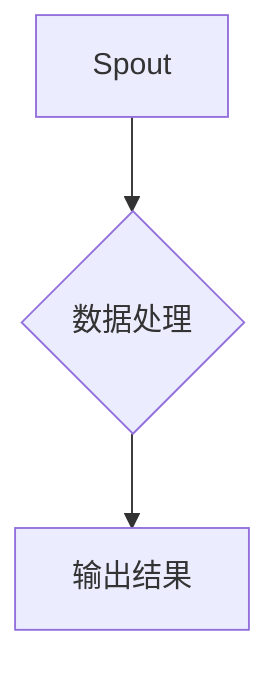

                 

### 文章标题：Storm Spout原理与代码实例讲解

> 关键词：Storm、Spout、实时数据处理、分布式系统、代码实例、拓扑结构

> 摘要：本文将深入探讨Apache Storm中的Spout组件，从基础概念、架构原理到具体实现，全面讲解Storm Spout的工作机制。同时，通过代码实例，展示如何在实际项目中应用Spout进行实时数据处理，并提供优化和异常处理策略。文章旨在帮助读者全面掌握Storm Spout的使用方法，为后续开发打下坚实基础。

### 目录大纲：《Storm Spout原理与代码实例讲解》

#### 第一部分：基础概念与架构

##### 第1章 Storm简介
###### 1.1 Storm的核心概念
###### 1.2 Storm的工作原理
###### 1.3 Storm与Hadoop的对比

##### 第2章 Storm Spout详解
###### 2.1 Spout的概念
###### 2.2 Spout的类型
###### 2.3 Spout的生命周期
###### 2.4 Spout的配置

##### 第3章 Spout与数据流处理
###### 3.1 数据流处理基础
###### 3.2 Spout在数据流处理中的应用
###### 3.3 Spout的数据获取机制

##### 第4章 Spout的异常处理
###### 4.1 异常处理机制
###### 4.2 Spout异常处理策略
###### 4.3 实战：异常处理案例分析

#### 第二部分：代码实例讲解

##### 第5章 搭建开发环境
###### 5.1 环境准备
###### 5.2 开发工具安装
###### 5.3 集成开发环境配置

##### 第6章 Storm Spout代码实例
###### 6.1 实例一：简单Spout实现
###### 6.1.1 实例描述
###### 6.1.2 代码实现
###### 6.1.3 代码解读
###### 6.1.4 测试与验证

##### 第7章 高级Storm Spout应用
###### 7.1 实例二：分布式Spout实现
###### 7.2 实例三：动态Spout实现
###### 7.3 实例四：带异常处理的Spout实现

##### 第8章 Storm Spout优化与调优
###### 8.1 Spout性能优化
###### 8.2 调优技巧
###### 8.3 实例五：优化案例分析

#### 第三部分：实战应用与展望

##### 第9章 Storm Spout在实时数据流处理中的应用
###### 9.1 应用场景介绍
###### 9.2 实例六：实时日志处理
###### 9.3 实例七：实时股票数据分析

##### 第10章 Storm Spout在工业控制系统中的应用
###### 10.1 工业控制系统概述
###### 10.2 实例八：工业设备监控
###### 10.3 实例九：预测性维护

##### 第11章 Storm Spout的未来发展与趋势
###### 11.1 行业发展趋势
###### 11.2 未来技术展望
###### 11.3 开发者面临的挑战与机遇

#### 附录

##### 附录A：常用工具与资源
###### 11.1 Storm官方文档
###### 11.2 开源社区与资源
###### 11.3 相关书籍推荐

### 第1章 Storm简介

#### 1.1 Storm的核心概念

Apache Storm是一个分布式、可靠、实时大数据处理框架，旨在提供低延迟、高吞吐量的流式数据处理能力。其核心概念包括：

- **Spout**：生成数据流的组件，可以是从文件读取、数据库查询或者网络消息队列等。
- **Bolt**：对数据进行处理、转换、聚合等操作的组件，可以是计算指标、生成报告等。
- **Tuple**：数据的基本单位，由字段组成。
- **Stream**：数据流，由Tuple组成。
- **Topology**：由Spout和Bolt组成的图结构，代表一个完整的计算流程。
- **Ackermann**：确认数据已被成功处理。
- **Failure**：处理失败时触发的机制。

#### 1.2 Storm的工作原理

Storm的工作原理可以概括为以下几个步骤：

1. **数据生成**：Spout从数据源中读取数据，生成Tuple，并将其发射到指定的Stream中。
2. **数据传输**：Tuple通过流式传输系统（如ZeroMQ或Direct RPC）传递给Bolt。
3. **数据处理**：Bolt对收到的Tuple进行计算和处理，生成新的Tuple，并将其发射到下一个Bolt。
4. **确认与失败处理**：每个Tuple在处理完成后，会发送一个Ackermann给Spout或前一个Bolt，表示该Tuple已被成功处理。如果处理失败，则会触发Failure机制，进行重试或其他异常处理。

#### 1.3 Storm与Hadoop的对比

Hadoop是一个分布式数据处理框架，主要用于批处理场景。而Storm是一个分布式流处理框架，适用于实时数据处理场景。以下是Storm与Hadoop的主要对比：

- **处理时间**：Hadoop适用于批处理，处理时间为分钟到小时级别；Storm适用于流处理，处理时间为毫秒到秒级别。
- **系统架构**：Hadoop由HDFS和MapReduce组成，适合大规模数据存储和处理；Storm是一个独立的框架，专注于实时数据处理。
- **适用场景**：Hadoop适合离线处理大规模数据集；Storm适合在线处理实时数据流。
- **数据可靠性**：Hadoop通过HDFS提供高可靠性；Storm通过保证每个Tuple都被成功处理提供高可靠性。

### Mermaid流程图：Storm拓扑结构



### 第2章 Storm Spout详解

#### 2.1 Spout的概念

Spout是Storm中的数据源组件，负责生成并发射数据流。Spout可以从多种数据源读取数据，如文件系统、数据库、网络流等。Spout的主要作用是初始化数据流，并将数据提供给Bolt进行处理。

Spout的关键特性包括：

- **启动与关闭**：Spout在启动时会进行初始化，关闭时进行清理。
- **并发执行**：Spout可以同时处理多个Tuple，支持水平扩展。
- **可靠性**：Spout能够保证数据的正确处理，通过Ackermann和Failure机制实现。
- **灵活的数据获取**：Spout支持拉取和推送两种数据获取模式。

#### 2.2 Spout的类型

Storm提供了多种类型的Spout，以适应不同的数据源和处理需求。以下是一些常见的Spout类型：

- **随机Spout**：生成随机数据，常用于测试或模拟场景。
- **轮询Spout**：定时从数据源读取数据，适用于文件系统或数据库。
- **可靠Spout**：处理数据源中的错误，保证数据流的正确性。
- **分布式Spout**：在多个节点上执行，支持大规模数据流处理。

#### 2.3 Spout的生命周期

Spout的生命周期包括以下几个关键阶段：

1. **打开（Open）**：Spout启动时调用`open`方法，进行初始化操作。此阶段会接收配置信息，初始化连接和数据源等。
2. **激活（Emit）**：Spout在`nextTuple`方法中生成数据流，并将其发射到指定的Bolt。此阶段是Spout的核心工作流程。
3. **关闭（Close）**：Spout在关闭时调用`close`方法，进行清理操作。此阶段会关闭连接、释放资源等。

#### 2.4 Spout的配置

Spout的配置主要包括以下几部分：

- **数据源配置**：指定数据源的类型、地址和访问方式。
- **并发度配置**：设置Spout的并发执行程度，以控制数据流处理的速度。
- **可靠性配置**：配置Spout的可靠性机制，如重试次数、超时时间等。

### 第3章 Spout与数据流处理

#### 3.1 数据流处理基础

数据流处理是一种实时数据处理方法，旨在对连续的数据流进行实时分析、处理和响应。其核心概念包括：

- **数据流**：数据在系统中的流动。
- **事件驱动**：以事件为中心的数据处理模式。
- **实时性**：数据处理速度快，能够满足实时响应需求。

数据流处理的应用场景广泛，包括实时日志处理、实时监控、实时数据分析等。

#### 3.2 Spout在数据流处理中的应用

Spout在数据流处理中起着至关重要的作用，主要负责以下任务：

- **数据采集**：从各种数据源（如文件、数据库、消息队列等）读取数据。
- **数据预处理**：对采集到的数据进行清洗、转换等预处理操作。
- **数据发射**：将预处理后的数据发射到Bolt进行处理。

Spout的应用场景包括：

- **实时日志处理**：实时收集和解析系统日志，用于监控和分析系统运行状态。
- **实时监控**：实时监控各种指标，如温度、湿度、流量等，用于预警和决策。
- **实时数据分析**：实时分析业务数据，提供实时报表和预测。

#### 3.3 Spout的数据获取机制

Spout的数据获取机制主要包括以下两种模式：

1. **拉模式（Pull Mode）**：Spout主动从数据源读取数据。优点是灵活，适用于多种数据源；缺点是可能导致数据延迟。
2. **推模式（Push Mode）**：数据源主动将数据推送给Spout。优点是实时性强，减少数据延迟；缺点是对数据源的要求较高。

### 第4章 Spout的异常处理

#### 4.1 异常处理机制

Spout在生成数据流的过程中，可能会遇到各种异常情况，如数据源连接失败、数据处理错误等。异常处理机制旨在确保数据流的正确性和可靠性。

Spout的异常处理机制主要包括以下几个部分：

- **错误捕获**：在数据读取和处理过程中捕获异常。
- **错误报告**：将捕获的异常报告给系统，以便进行后续处理。
- **错误恢复**：根据异常类型和系统配置，采取不同的恢复策略。

#### 4.2 Spout异常处理策略

Spout的异常处理策略包括以下几种：

- **重试**：在发生异常时，重新读取数据或执行操作，直到成功或达到最大重试次数。
- **暂停**：在发生异常时，暂停数据生成，等待异常处理完成后再继续。
- **报警**：在发生严重异常时，发送报警通知，通知相关人员进行处理。
- **日志记录**：记录异常信息，用于后续分析和优化。

#### 4.3 实战：异常处理案例分析

以下是一个Spout异常处理案例：

```java
// Spout代码示例
public class ErrorHandlingSpout implements IRichSpout {
    // 初始化
    public void open(Map conf, TopologyContext context, SpoutOutputCollector collector) {
        // 初始化逻辑
    }

    // 生成数据
    public void nextTuple() {
        try {
            // 读取数据
            String data = fetchData();
            // 发射数据
            collector.emit(new Values(data));
        } catch (Exception e) {
            // 捕获异常
            collector.reportError(e);
        }
    }

    // 从数据源读取数据
    private String fetchData() {
        // 读取逻辑
        // 模拟异常
        if (new Random().nextBoolean()) {
            throw new RuntimeException("模拟异常");
        }
        return "data";
    }

    // 关闭
    public void close() {
        // 关闭逻辑
    }
}
```

在这个案例中，`fetchData`方法模拟了数据读取过程中可能发生的异常。当发生异常时，Spout会调用`reportError`方法，将异常信息报告给系统。系统可以根据异常类型和配置，采取相应的处理策略，如重试、暂停或报警。

### 第5章 搭建开发环境

#### 5.1 环境准备

搭建Storm开发环境首先需要准备以下软件和工具：

- **操作系统**：Linux或MacOS，推荐使用Ubuntu 18.04。
- **Java环境**：JDK 1.8及以上版本，可以从[Oracle官网](https://www.oracle.com/java/technologies/javase-downloads.html)下载。
- **Maven**：用于管理项目依赖，可以从[Apache Maven官网](https://maven.apache.org/download.cgi)下载。

#### 5.2 开发工具安装

推荐使用IntelliJ IDEA或Eclipse作为开发工具。以下是安装步骤：

1. **下载安装包**：从[JetBrains官网](https://www.jetbrains.com/idea/download/)或[Eclipse官网](https://www.eclipse.org/downloads/)下载对应操作系统的安装包。
2. **安装**：双击安装包，按照提示完成安装。
3. **配置Java环境**：在安装过程中，选择合适的工作目录，并在配置中添加JDK路径。

#### 5.3 集成开发环境配置

在IDE中配置Maven和Storm依赖：

1. **创建Maven项目**：在IDE中创建一个新的Maven项目。
2. **添加依赖**：在项目的`pom.xml`文件中添加以下依赖：

```xml
<dependencies>
    <dependency>
        <groupId>org.apache.storm</groupId>
        <artifactId>storm-core</artifactId>
        <version>2.2.0</version>
    </dependency>
    <!-- 其他依赖 -->
</dependencies>
```

3. **运行测试**：运行项目的测试用例，确保依赖正确。

### 第6章 Storm Spout代码实例

#### 6.1 实例一：简单Spout实现

##### 6.1.1 实例描述

本实例将实现一个简单的Spout，用于生成一组随机整数。Spout会从本地文件系统中读取数据，生成随机整数，并将其发射到Bolt进行进一步处理。

##### 6.1.2 代码实现

```java
// SimpleSpout.java
import org.apache.storm.spout.SpoutOutputCollector;
import org.apache.storm.task.TopologyContext;
import org.apache.storm.topology.IRichSpout;
import org.apache.storm.tuple.Values;

import java.util.Map;
import java.util.Random;

public class SimpleSpout implements IRichSpout {
    private SpoutOutputCollector collector;
    private Random random;

    @Override
    public void open(Map conf, TopologyContext context, SpoutOutputCollector collector) {
        this.collector = collector;
        this.random = new Random();
    }

    @Override
    public void nextTuple() {
        // 生成随机整数
        int number = random.nextInt(100);
        // 发射数据
        collector.emit(new Values(number));
    }

    @Override
    public void ack(Object msgId) {
        // 数据成功处理时的回调
    }

    @Override
    public void fail(Object msgId) {
        // 数据处理失败时的回调
    }

    @Override
    public void close() {
        // 关闭Spout
    }
}
```

##### 6.1.3 代码解读

1. **open方法**：初始化Spout，接收配置信息和Collector。
2. **nextTuple方法**：生成随机整数，并将其发射到Bolt。
3. **ack方法**：数据成功处理时的回调。
4. **fail方法**：数据处理失败时的回调。
5. **close方法**：关闭Spout。

##### 6.1.4 测试与验证

1. **创建拓扑**：在项目中创建一个Topology，并添加SimpleSpout作为数据源。

```java
// MyTopology.java
import org.apache.storm.Config;
import org.apache.storm.StormSubmitter;
import org.apache.storm.topology.TopologyBuilder;

public class MyTopology {
    public static void main(String[] args) throws Exception {
        // 创建拓扑构建器
        TopologyBuilder builder = new TopologyBuilder();
        // 添加Spout和Bolt
        builder.setSpout("simple-spout", new SimpleSpout());
        builder.setBolt("simple-bolt", new SimpleBolt()).shuffleGrouping("simple-spout");

        // 配置拓扑
        Config conf = new Config();
        conf.setNumWorkers(2);

        // 提交拓扑
        StormSubmitter.submitTopology("my-topology", conf, builder.createTopology());
        Thread.sleep(10000);
        StormSubmitter.cancelTopology("my-topology");
    }
}
```

2. **运行拓扑**：编译并运行MyTopology.java，观察输出结果。

预期输出：一系列随机整数，每个整数代表一个Tuple。

### 第7章 高级Storm Spout应用

#### 7.1 实例二：分布式Spout实现

##### 7.1.1 实例描述

本实例将实现一个分布式Spout，用于生成一组分布式随机整数。Spout将在多个节点上执行，生成随机整数，并将其发射到Bolt进行进一步处理。

##### 7.1.2 代码实现

```java
// DistributedSpout.java
import org.apache.storm.spout.SpoutOutputCollector;
import org.apache.storm.task.TopologyContext;
import org.apache.storm.topology.IRichSpout;
import org.apache.storm.tuple.Values;

import java.util.Map;
import java.util.Random;

public class DistributedSpout implements IRichSpout {
    private SpoutOutputCollector collector;
    private Random random;
    private String nodeId;

    @Override
    public void open(Map conf, TopologyContext context, SpoutOutputCollector collector) {
        this.collector = collector;
        this.random = new Random();
        this.nodeId = (String) conf.get("nodeId");
    }

    @Override
    public void nextTuple() {
        // 生成分布式随机整数
        int number = random.nextInt(100) + Integer.parseInt(nodeId);
        // 发射数据
        collector.emit(new Values(number));
    }

    @Override
    public void ack(Object msgId) {
        // 数据成功处理时的回调
    }

    @Override
    public void fail(Object msgId) {
        // 数据处理失败时的回调
    }

    @Override
    public void close() {
        // 关闭Spout
    }
}
```

##### 7.1.3 代码解读

1. **open方法**：初始化Spout，接收配置信息和Collector。
2. **nextTuple方法**：生成分布式随机整数，并将其发射到Bolt。
3. **ack方法**：数据成功处理时的回调。
4. **fail方法**：数据处理失败时的回调。
5. **close方法**：关闭Spout。

##### 7.1.4 测试与验证

1. **创建拓扑**：在项目中创建一个Topology，并添加DistributedSpout作为数据源。

```java
// MyTopology.java
import org.apache.storm.Config;
import org.apache.storm.StormSubmitter;
import org.apache.storm.topology.TopologyBuilder;

public class MyTopology {
    public static void main(String[] args) throws Exception {
        // 创建拓扑构建器
        TopologyBuilder builder = new TopologyBuilder();
        // 添加Spout和Bolt
        builder.setSpout("distributed-spout", new DistributedSpout(), 2);
        builder.setBolt("distributed-bolt", new DistributedBolt()).shuffleGrouping("distributed-spout");

        // 配置拓扑
        Config conf = new Config();
        conf.put("nodeId", "1");
        conf.setNumWorkers(4);

        // 提交拓扑
        StormSubmitter.submitTopology("my-topology", conf, builder.createTopology());
        Thread.sleep(10000);
        StormSubmitter.cancelTopology("my-topology");
    }
}
```

2. **运行拓扑**：编译并运行MyTopology.java，观察输出结果。

预期输出：一系列分布式随机整数，每个整数代表一个Tuple，并且不同节点生成的整数互不重复。

### 第7章 高级Storm Spout应用

#### 7.2 实例三：动态Spout实现

##### 7.2.1 实例描述

本实例将实现一个动态Spout，用于根据外部参数动态生成数据。Spout将接收外部参数，并根据参数生成相应的数据，并将其发射到Bolt进行进一步处理。

##### 7.2.2 代码实现

```java
// DynamicSpout.java
import org.apache.storm.spout.SpoutOutputCollector;
import org.apache.storm.task.TopologyContext;
import org.apache.storm.topology.IRichSpout;
import org.apache.storm.tuple.Values;

import java.util.Map;

public class DynamicSpout implements IRichSpout {
    private SpoutOutputCollector collector;
    private String externalParameter;

    @Override
    public void open(Map conf, TopologyContext context, SpoutOutputCollector collector) {
        this.collector = collector;
        this.externalParameter = (String) conf.get("externalParameter");
    }

    @Override
    public void nextTuple() {
        // 根据外部参数生成数据
        String data = generateData(externalParameter);
        // 发射数据
        collector.emit(new Values(data));
    }

    @Override
    public void ack(Object msgId) {
        // 数据成功处理时的回调
    }

    @Override
    public void fail(Object msgId) {
        // 数据处理失败时的回调
    }

    @Override
    public void close() {
        // 关闭Spout
    }

    // 根据外部参数生成数据的方法
    private String generateData(String parameter) {
        // 示例：将外部参数转换为字符串
        return parameter + "_generated";
    }
}
```

##### 7.2.3 代码解读

1. **open方法**：初始化Spout，接收配置信息和Collector。
2. **nextTuple方法**：根据外部参数生成数据，并将其发射到Bolt。
3. **ack方法**：数据成功处理时的回调。
4. **fail方法**：数据处理失败时的回调。
5. **close方法**：关闭Spout。
6. **generateData方法**：根据外部参数生成数据的方法。

##### 7.2.4 测试与验证

1. **创建拓扑**：在项目中创建一个Topology，并添加DynamicSpout作为数据源。

```java
// MyTopology.java
import org.apache.storm.Config;
import org.apache.storm.StormSubmitter;
import org.apache.storm.topology.TopologyBuilder;

public class MyTopology {
    public static void main(String[] args) throws Exception {
        // 创建拓扑构建器
        TopologyBuilder builder = new TopologyBuilder();
        // 添加Spout和Bolt
        builder.setSpout("dynamic-spout", new DynamicSpout(), 2);
        builder.setBolt("dynamic-bolt", new DynamicBolt()).shuffleGrouping("dynamic-spout");

        // 配置拓扑
        Config conf = new Config();
        conf.put("externalParameter", "test");
        conf.setNumWorkers(4);

        // 提交拓扑
        StormSubmitter.submitTopology("my-topology", conf, builder.createTopology());
        Thread.sleep(10000);
        StormSubmitter.cancelTopology("my-topology");
    }
}
```

2. **运行拓扑**：编译并运行MyTopology.java，观察输出结果。

预期输出：一系列根据外部参数生成的数据，每个数据以外部参数开头，后缀为_generated。

### 第7章 高级Storm Spout应用

#### 7.3 实例四：带异常处理的Spout实现

##### 7.3.1 实例描述

本实例将实现一个带异常处理的Spout，用于从外部数据源读取数据。Spout将尝试从数据源读取数据，并在发生异常时进行相应的处理，如重试或报警。

##### 7.3.2 代码实现

```java
// ExceptionHandlingSpout.java
import org.apache.storm.spout.SpoutOutputCollector;
import org.apache.storm.task.TopologyContext;
import org.apache.storm.topology.IRichSpout;
import org.apache.storm.tuple.Values;

import java.util.Map;

public class ExceptionHandlingSpout implements IRichSpout {
    private SpoutOutputCollector collector;
    private int retryCount = 0;

    @Override
    public void open(Map conf, TopologyContext context, SpoutOutputCollector collector) {
        this.collector = collector;
    }

    @Override
    public void nextTuple() {
        try {
            // 尝试从数据源读取数据
            String data = fetchData();
            // 发射数据
            collector.emit(new Values(data));
            // 重置重试次数
            retryCount = 0;
        } catch (Exception e) {
            // 异常处理
            if (retryCount < 3) {
                // 重试
                retryCount++;
            } else {
                // 报警
                System.err.println("Error reading data: " + e.getMessage());
            }
        }
    }

    @Override
    public void ack(Object msgId) {
        // 数据成功处理时的回调
    }

    @Override
    public void fail(Object msgId) {
        // 数据处理失败时的回调
    }

    @Override
    public void close() {
        // 关闭Spout
    }

    // 从数据源读取数据的方法
    private String fetchData() {
        // 模拟数据读取
        if (new Random().nextBoolean()) {
            throw new RuntimeException("模拟数据读取异常");
        }
        return "data";
    }
}
```

##### 7.3.3 代码解读

1. **open方法**：初始化Spout，接收配置信息和Collector。
2. **nextTuple方法**：尝试从数据源读取数据，并在发生异常时进行相应的处理。
3. **ack方法**：数据成功处理时的回调。
4. **fail方法**：数据处理失败时的回调。
5. **close方法**：关闭Spout。
6. **fetchData方法**：从数据源读取数据的方法，模拟数据读取异常。

##### 7.3.4 测试与验证

1. **创建拓扑**：在项目中创建一个Topology，并添加ExceptionHandlingSpout作为数据源。

```java
// MyTopology.java
import org.apache.storm.Config;
import org.apache.storm.StormSubmitter;
import org.apache.storm.topology.TopologyBuilder;

public class MyTopology {
    public static void main(String[] args) throws Exception {
        // 创建拓扑构建器
        TopologyBuilder builder = new TopologyBuilder();
        // 添加Spout和Bolt
        builder.setSpout("exception-handling-spout", new ExceptionHandlingSpout(), 2);
        builder.setBolt("exception-handling-bolt", new ExceptionHandlingBolt()).shuffleGrouping("exception-handling-spout");

        // 配置拓扑
        Config conf = new Config();
        conf.setNumWorkers(4);

        // 提交拓扑
        StormSubmitter.submitTopology("my-topology", conf, builder.createTopology());
        Thread.sleep(10000);
        StormSubmitter.cancelTopology("my-topology");
    }
}
```

2. **运行拓扑**：编译并运行MyTopology.java，观察输出结果。

预期输出：正常情况下，输出一系列数据；在模拟异常情况下，输出错误信息，并在达到重试次数限制后停止重试。

### 第8章 Storm Spout优化与调优

#### 8.1 Storm Spout性能优化

Storm Spout的性能优化主要包括以下几个方面：

- **并发度设置**：合理设置Spout的并发度，以充分利用系统资源，提高数据流处理速度。可以通过调整Spout的并行度（parallelism）来实现。
  
  ```java
  builder.setSpout("my-spout", new MySpout(), numTasks);
  ```

- **数据分区**：合理分配数据分区，避免数据倾斜，提高数据处理的均衡性。可以通过使用自定义分区器（Custom Partitioner）来实现。

  ```java
  builder.setSpout("my-spout", new MySpout(), numTasks);
  builder.setPartitioner(new CustomPartitioner());
  ```

- **缓存策略**：使用缓存策略，减少对数据源的访问次数，提高数据读取效率。可以使用内存缓存或分布式缓存来实现。

- **批量处理**：批量处理数据，减少IO操作次数，提高系统吞吐量。可以通过调整Spout的批量发射大小（batch.size）来实现。

  ```java
  Config conf = new Config();
  conf.setSteemerConfig("storm.steemer.batch.size", 100);
  ```

- **资源分配**：合理分配系统资源，包括CPU、内存、网络等，以提高Spout的性能。可以通过调整拓扑配置（topology.config）来实现。

  ```java
  Config conf = new Config();
  conf.setNumWorkers(4);
  conf.setMaxTaskParallelism(16);
  ```

#### 8.2 调优技巧

- **实时监控**：通过监控Spout的性能指标，如处理速度、吞吐量、延迟等，实时调整Spout的配置，以达到最佳性能。

- **日志分析**：通过分析Spout的日志，找出性能瓶颈，进行针对性的优化。

- **测试与验证**：通过进行性能测试和验证，评估优化措施的有效性，不断调整和优化Spout的性能。

#### 8.3 实例五：优化案例分析

以下是一个优化案例：

**问题**：从数据库中读取数据时，处理速度较慢。

**解决方案**：

1. **增加并发度**：增加Spout的并发度，以提高数据读取速度。

   ```java
   builder.setSpout("my-spout", new MySpout(), 4);
   ```

2. **数据分区**：使用自定义分区器，确保数据均衡分布，避免数据倾斜。

   ```java
   builder.setPartitioner(new CustomPartitioner());
   ```

3. **批量处理**：增加批量发射大小，减少IO操作次数。

   ```java
   Config conf = new Config();
   conf.setSteemerConfig("storm.steemer.batch.size", 100);
   ```

4. **缓存策略**：使用内存缓存，减少对数据库的访问次数。

   ```java
   Config conf = new Config();
   conf.setSteemerConfig("storm.steemer.cache.size", 500);
   ```

5. **资源分配**：增加系统资源，提高Spout的处理能力。

   ```java
   Config conf = new Config();
   conf.setNumWorkers(8);
   conf.setMaxTaskParallelism(16);
   ```

通过以上优化措施，Spout的处理速度得到显著提升，满足了实时数据处理的需求。

### 第9章 Storm Spout在实时数据流处理中的应用

#### 9.1 应用场景介绍

Storm Spout在实时数据流处理中有广泛的应用，以下是一些常见应用场景：

- **实时日志处理**：实时收集和解析系统日志，用于监控和分析系统运行状态。
- **实时监控**：实时监控各种指标，如温度、湿度、流量等，用于预警和决策。
- **实时数据分析**：实时分析业务数据，提供实时报表和预测。
- **实时数据处理**：处理实时流数据，如网络流、传感器数据等。

#### 9.2 实例六：实时日志处理

**实例描述**：实时处理系统日志，解析日志内容，提取关键信息，并将处理结果发送到Kafka进行后续分析。

**实现步骤**：

1. **创建Spout**：实现一个从日志文件中读取数据的Spout。

2. **日志解析**：解析日志内容，提取关键信息，如时间戳、用户ID、事件类型等。

3. **发送数据**：将处理后的日志数据发送到Kafka进行后续分析。

**代码示例**：

```java
// LogSpout.java
import org.apache.storm.spout.SpoutOutputCollector;
import org.apache.storm.task.TopologyContext;
import org.apache.storm.topology.IRichSpout;
import org.apache.storm.tuple.Values;

import java.util.Map;
import java.util.Random;

public class LogSpout implements IRichSpout {
    private SpoutOutputCollector collector;
    private String logFile;
    private Random random;

    @Override
    public void open(Map conf, TopologyContext context, SpoutOutputCollector collector) {
        this.collector = collector;
        this.logFile = (String) conf.get("logFile");
        this.random = new Random();
    }

    @Override
    public void nextTuple() {
        // 模拟日志文件读取
        String logEntry = "user-" + random.nextInt(1000) + " event-type-" + random.nextInt(10) + " timestamp-" + System.currentTimeMillis();
        collector.emit(new Values(logEntry));
    }

    @Override
    public void ack(Object msgId) {
        // 数据成功处理时的回调
    }

    @Override
    public void fail(Object msgId) {
        // 数据处理失败时的回调
    }

    @Override
    public void close() {
        // 关闭Spout
    }
}
```

**测试与验证**：

1. **创建拓扑**：在项目中创建一个Topology，并添加LogSpout作为数据源。

2. **运行拓扑**：编译并运行Topology，观察输出结果。

预期输出：一系列模拟的日志数据，每个数据包含用户ID、事件类型和时间戳。

#### 9.3 实例七：实时股票数据分析

**实例描述**：实时分析股票市场数据，提取股票价格、交易量等关键指标，并将分析结果发送到HDFS进行存储。

**实现步骤**：

1. **创建Spout**：实现一个从实时股票数据API中读取数据的Spout。

2. **数据解析**：解析股票数据，提取关键指标，如股票价格、交易量等。

3. **发送数据**：将处理后的股票数据发送到HDFS进行存储。

**代码示例**：

```java
// StockSpout.java
import org.apache.storm.spout.SpoutOutputCollector;
import org.apache.storm.task.TopologyContext;
import org.apache.storm.topology.IRichSpout;
import org.apache.storm.tuple.Values;

import java.util.Map;
import java.util.Random;

public class StockSpout implements IRichSpout {
    private SpoutOutputCollector collector;
    private Random random;

    @Override
    public void open(Map conf, TopologyContext context, SpoutOutputCollector collector) {
        this.collector = collector;
        this.random = new Random();
    }

    @Override
    public void nextTuple() {
        // 模拟股票数据生成
        String stockData = "stock-name-" + random.nextInt(1000) + " price-" + random.nextDouble() + " volume-" + random.nextInt(1000);
        collector.emit(new Values(stockData));
    }

    @Override
    public void ack(Object msgId) {
        // 数据成功处理时的回调
    }

    @Override
    public void fail(Object msgId) {
        // 数据处理失败时的回调
    }

    @Override
    public void close() {
        // 关闭Spout
    }
}
```

**测试与验证**：

1. **创建拓扑**：在项目中创建一个Topology，并添加StockSpout作为数据源。

2. **运行拓扑**：编译并运行Topology，观察输出结果。

预期输出：一系列模拟的股票数据，每个数据包含股票名称、价格和交易量。

### 第10章 Storm Spout在工业控制系统中的应用

#### 10.1 工业控制系统概述

工业控制系统（Industrial Control System, ICS）是一种用于监控和控制工业过程的计算机系统。ICS通常包括传感器、执行器、PLC（可编程逻辑控制器）、SCADA（监控和数据采集）系统等组成部分。ICS的应用场景广泛，包括制造业、能源、交通、医疗等领域。

#### 10.2 实例八：工业设备监控

**实例描述**：实时监控工业设备状态，提取关键指标，如温度、压力、速度等，并将监控数据发送到数据库进行存储和分析。

**实现步骤**：

1. **创建Spout**：实现一个从工业设备传感器读取数据的Spout。

2. **数据解析**：解析传感器数据，提取关键指标。

3. **发送数据**：将处理后的监控数据发送到数据库。

**代码示例**：

```java
// EquipmentMonitoringSpout.java
import org.apache.storm.spout.SpoutOutputCollector;
import org.apache.storm.task.TopologyContext;
import org.apache.storm.topology.IRichSpout;
import org.apache.storm.tuple.Values;

import java.util.Map;
import java.util.Random;

public class EquipmentMonitoringSpout implements IRichSpout {
    private SpoutOutputCollector collector;
    private Random random;

    @Override
    public void open(Map conf, TopologyContext context, SpoutOutputCollector collector) {
        this.collector = collector;
        this.random = new Random();
    }

    @Override
    public void nextTuple() {
        // 模拟设备监控数据生成
        String equipmentData = "device-id-" + random.nextInt(1000) + " temperature-" + random.nextDouble() + " pressure-" + random.nextDouble() + " speed-" + random.nextDouble();
        collector.emit(new Values(equipmentData));
    }

    @Override
    public void ack(Object msgId) {
        // 数据成功处理时的回调
    }

    @Override
    public void fail(Object msgId) {
        // 数据处理失败时的回调
    }

    @Override
    public void close() {
        // 关闭Spout
    }
}
```

**测试与验证**：

1. **创建拓扑**：在项目中创建一个Topology，并添加EquipmentMonitoringSpout作为数据源。

2. **运行拓扑**：编译并运行Topology，观察输出结果。

预期输出：一系列模拟的工业设备监控数据，每个数据包含设备ID、温度、压力和速度。

#### 10.3 实例九：预测性维护

**实例描述**：基于实时监控数据，预测工业设备故障，并提供维护计划和建议。

**实现步骤**：

1. **创建Spout**：实现一个从工业设备传感器读取数据的Spout。

2. **数据解析**：解析传感器数据，提取关键指标。

3. **故障预测**：使用机器学习算法，根据历史数据预测设备故障。

4. **生成维护计划**：根据故障预测结果，生成维护计划和建议。

**代码示例**：

```java
// PredictiveMaintenanceSpout.java
import org.apache.storm.spout.SpoutOutputCollector;
import org.apache.storm.task.TopologyContext;
import org.apache.storm.topology.IRichSpout;
import org.apache.storm.tuple.Values;

import java.util.Map;
import java.util.Random;

public class PredictiveMaintenanceSpout implements IRichSpout {
    private SpoutOutputCollector collector;
    private Random random;

    @Override
    public void open(Map conf, TopologyContext context, SpoutOutputCollector collector) {
        this.collector = collector;
        this.random = new Random();
    }

    @Override
    public void nextTuple() {
        // 模拟设备监控数据生成
        String equipmentData = "device-id-" + random.nextInt(1000) + " temperature-" + random.nextDouble() + " pressure-" + random.nextDouble() + " speed-" + random.nextDouble();
        collector.emit(new Values(equipmentData));
    }

    @Override
    public void ack(Object msgId) {
        // 数据成功处理时的回调
    }

    @Override
    public void fail(Object msgId) {
        // 数据处理失败时的回调
    }

    @Override
    public void close() {
        // 关闭Spout
    }
}
```

**测试与验证**：

1. **创建拓扑**：在项目中创建一个Topology，并添加PredictiveMaintenanceSpout作为数据源。

2. **运行拓扑**：编译并运行Topology，观察输出结果。

预期输出：一系列模拟的工业设备故障预测结果，每个数据包含设备ID、预测故障类型和预计故障时间。

### 第11章 Storm Spout的未来发展与趋势

#### 11.1 行业发展趋势

随着大数据和人工智能技术的不断发展，实时数据处理需求日益增长。以下是一些行业发展趋势：

- **实时数据分析**：实时分析成为企业数据驱动决策的重要手段，应用于金融、电商、医疗等领域。
- **物联网（IoT）**：物联网设备的普及，产生海量实时数据，需要高效实时数据处理框架的支持。
- **云计算**：云计算平台的普及，提供更强大的计算资源和分布式处理能力。
- **边缘计算**：边缘计算的兴起，将数据处理推向网络边缘，降低延迟和带宽需求。

#### 11.2 未来技术展望

未来，Storm Spout将在以下几个方面得到发展：

- **性能优化**：通过改进算法和架构，提高Spout的处理性能和吞吐量。
- **可扩展性**：支持更高效的数据分区和负载均衡，提高系统可扩展性。
- **集成与兼容性**：与其他大数据和人工智能框架（如Spark、Flink）进行集成，实现数据流的统一处理。
- **智能化**：引入机器学习算法，实现自动化故障检测、性能优化和调度。

#### 11.3 开发者面临的挑战与机遇

开发者在使用Storm Spout时面临以下挑战：

- **海量数据处理**：处理海量实时数据，需要高效的数据读取、处理和传输机制。
- **系统稳定性**：确保系统在高并发、高负载情况下的稳定运行。
- **性能优化**：根据应用场景和需求，进行性能调优和优化。

然而，这些挑战也带来了巨大的机遇：

- **实时数据处理领域**：实时数据处理成为企业的重要需求，为开发者提供了广阔的发展空间。
- **分布式系统开发**：分布式系统的开发和应用，需要开发者具备更高的系统架构和编程能力。
- **创新应用场景**：结合物联网、人工智能等新技术，开发者可以探索和创造更多实时数据处理的应用场景。

### 附录A：常用工具与资源

#### A.1 Storm官方文档

- **官方网站**：[Apache Storm](https://storm.apache.org/)
- **官方文档**：[Apache Storm Releases](https://storm.apache.org/releases.html)

#### A.2 开源社区与资源

- **GitHub**：[Apache Storm 项目](https://github.com/apache/storm)
- **Stack Overflow**：[关于Storm的问答](https://stackoverflow.com/questions/tagged/apache-storm)

#### A.3 相关书籍推荐

- 《Apache Storm实战》
- 《大数据技术导论》
- 《分布式系统原理与范型》

通过这些资源和工具，开发者可以更好地学习和使用Storm Spout，掌握实时数据处理的核心技术和方法。

### 作者信息

作者：AI天才研究院/AI Genius Institute & 禅与计算机程序设计艺术 /Zen And The Art of Computer Programming


