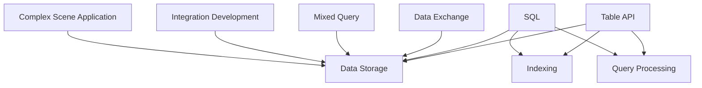

                 

# 文章标题：Table API和SQL原理与代码实例讲解

> 关键词：Table API、SQL、原理、代码实例、数据库管理、数据处理、查询优化

> 摘要：本文将深入探讨Table API和SQL的原理与实现，通过详细的代码实例，帮助读者理解这两种数据操作技术在实际应用中的运用。文章将分为三个主要部分：首先介绍Table API的基础概念与架构，接着讲解SQL的基本语法与实现原理，最后结合实际项目案例，展示Table API和SQL在复杂场景中的集成应用。

## 第一部分：Table API概述与原理

### 第1章：Table API基础概念与架构

#### 1.1 Table API的定义与重要性

Table API是一种基于表操作的数据操作接口，它提供了对表数据的插入、查询、更新和删除等操作。Table API的出现，使得程序员可以更加高效地处理大规模表数据，大大简化了数据处理的过程。在数据库管理和数据分析领域中，Table API具有广泛的应用价值。

#### 1.2 Table API的基本架构

Table API的基本架构包括三个主要组件：数据存储、索引机制和查询处理。数据存储负责管理表数据，索引机制提供快速的数据访问，查询处理则负责对查询请求进行解析和执行。

#### 1.3 Table API的关键特点

Table API具有以下几个关键特点：

- **简单易用**：Table API提供了简洁明了的接口，使得程序员可以轻松地对表数据进行操作。
- **高性能**：Table API通过索引机制和查询优化算法，能够快速地处理大规模表数据。
- **可扩展性**：Table API支持分布式计算和分布式存储，能够处理海量数据。

#### 1.4 Table API与传统SQL的关系

Table API和SQL都是用于数据操作的技术，但它们在某些方面存在差异。SQL是一种基于关系模型的查询语言，它适用于复杂查询和数据控制。而Table API则更专注于表操作，尤其是在大规模数据处理方面具有优势。在实际应用中，Table API和SQL可以相互补充，共同提升数据处理效率。

### 第2章：Table API实现原理

#### 2.1 表数据存储与索引

##### 2.1.1 表数据的存储结构

表数据存储是Table API的核心组件之一。数据存储的选择取决于数据规模和处理需求。常见的存储结构包括文件系统和分布式存储系统。

##### 2.1.2 索引的基本概念与实现

索引是提高数据查询速度的关键技术。索引的基本概念包括B树索引和哈希索引。B树索引适用于范围查询，而哈希索引适用于等值查询。

#### 2.2 Table API的查询处理

##### 2.2.1 查询优化算法

查询优化是Table API性能提升的关键。常见的查询优化算法包括预编译查询和查询重写。

##### 2.2.2 基于索引的查询

基于索引的查询是提高查询性能的有效手段。索引选择和索引合并是关键技术。

#### 2.3 Table API的数据操作接口

##### 2.3.1 插入、更新与删除操作

插入、更新和删除是Table API的核心操作。这些操作需要高效地执行，以支持大规模数据处理。

##### 2.3.2 事务处理机制

事务处理机制是保证数据一致性的关键。Table API提供了原子性、一致性、隔离性和持久性等事务特性。

## 第二部分：SQL原理与代码实例

### 第3章：SQL基础语法与结构

#### 3.1 SQL的基本语法

SQL的基本语法包括数据定义语言（DDL）、数据查询语言（DQL）和数据操作语言（DML）。DDL用于创建和修改表结构，DQL用于查询数据，DML用于插入、更新和删除数据。

#### 3.2 SQL的数据定义语言

数据定义语言用于定义数据库对象，如表、索引和视图。常见的SQL语句包括CREATE、ALTER和DROP。

#### 3.3 SQL的数据查询语言

数据查询语言用于检索数据。SELECT语句是SQL的核心，它支持各种复杂查询，如聚合函数、连接操作和子查询。

#### 3.4 SQL的数据操作语言

数据操作语言用于对数据进行插入、更新和删除操作。INSERT、UPDATE和DELETE语句是SQL的基础。

### 第4章：SQL高级查询与优化

#### 4.1 SQL的聚合函数与分组查询

聚合函数用于对一组数据进行计算，如COUNT、SUM和AVG。分组查询用于对数据进行分组，并对每个分组进行聚合计算。

#### 4.2 SQL的连接操作

连接操作用于将多个表的数据进行关联查询。常见的连接类型包括内连接、左外连接、右外连接和全外连接。

#### 4.3 SQL的子查询与联合查询

子查询用于在一个查询语句中嵌套另一个查询。联合查询用于将多个查询结果合并为一个结果集。

#### 4.4 SQL查询优化策略

查询优化是提高数据库性能的关键。SQL查询优化策略包括查询重写、索引优化和查询缓存。

### 第5章：SQL数据库管理

#### 5.1 数据库的备份与恢复

备份与恢复是保证数据安全性的重要手段。常见的备份策略包括完全备份、增量备份和差异备份。恢复策略包括手动恢复和自动恢复。

#### 5.2 数据库性能监控与优化

数据库性能监控与优化是保证数据库稳定运行的关键。常见的监控指标包括CPU使用率、内存使用率和I/O使用率。优化策略包括索引优化、查询优化和存储优化。

#### 5.3 数据库的安全性与权限管理

数据库安全性与权限管理是保护数据安全的必要措施。用户认证和数据加密是关键策略。权限管理包括用户权限和角色权限。

#### 5.4 数据库的高可用性与扩展性

数据库的高可用性与扩展性是保证系统稳定性和可扩展性的关键。高可用性架构包括主从复制和数据镜像。扩展性策略包括数据分片和负载均衡。

### 第6章：SQL项目实战与案例分析

#### 6.1 实际项目中的SQL应用

在实际项目中，SQL广泛应用于各种场景。本文将结合电商平台的订单处理和社交网络的数据查询与分析，展示SQL在实际应用中的运用。

#### 6.2 SQL性能优化案例分析

SQL性能优化是提升数据库性能的重要手段。本文将分析查询语句的优化、索引策略的选择以及SQL性能测试的方法与工具。

#### 6.3 SQL安全性与性能测试

SQL安全性与性能测试是保证数据库安全性和性能的重要环节。本文将介绍SQL注入攻击的原理与防护措施，以及SQL性能测试的方法与工具。

## 第三部分：Table API与SQL集成应用

### 第7章：Table API与SQL的集成

#### 7.1 Table API与SQL的数据交换

数据交换是Table API与SQL集成的关键环节。本文将介绍数据导入与导出、数据同步与一致性保障的方法。

#### 7.2 Table API与SQL混合查询

混合查询是将Table API和SQL相结合，以实现更复杂的数据操作。本文将探讨混合查询的语法、优化策略以及实际开发中的最佳实践。

#### 7.3 Table API与SQL集成开发实践

集成开发实践是将Table API与SQL应用于实际项目中的关键。本文将结合具体案例，展示Table API与SQL的集成开发过程。

### 第8章：Table API与SQL在复杂场景中的应用

#### 8.1 大数据场景下的应用

在大数据场景下，Table API与SQL的应用具有显著优势。本文将探讨数据仓库与数据湖中的Table API应用，以及大数据分析中的SQL查询优化。

#### 8.2 实时数据处理与Table API

实时数据处理是现代应用的重要需求。本文将介绍实时数据流处理平台中的Table API应用，以及实时数据处理中的SQL挑战与解决方案。

### 第9章：Table API与SQL的未来发展

#### 9.1 Table API的扩展与演进

随着技术的不断发展，Table API也在不断扩展和演进。本文将探讨Table API的新功能与特性，以及与大数据处理框架的兼容性。

#### 9.2 SQL的未来趋势与技术发展

SQL作为数据库操作的基础语言，也在不断更新和发展。本文将介绍SQL的新标准、优化策略以及新算法的应用。

#### 9.3 Table API与SQL的集成创新

Table API与SQL的集成创新是提升数据处理效率的关键。本文将探讨集成开发的最佳实践、新型应用场景以及AI与SQL的融合。

## 附录

### 附录A：Table API与SQL开发工具与资源

本文将介绍Table API和SQL的常用开发工具与资源，包括Table API开发工具、SQL数据库管理工具和学习资源与参考资料。

## 第1章：Table API与SQL基础

### 1.1 Table API的基本概念

#### 1.1.1 Table API的定义

Table API是一种用于表数据操作的数据操作接口。它提供了对表数据的插入、查询、更新和删除等操作，使得程序员可以更加高效地处理大规模表数据。Table API通常以编程语言的形式实现，例如Python、Java等。

#### 1.1.2 Table API的应用场景

Table API广泛应用于以下场景：

- **数据库管理**：Table API可以用于管理数据库表，包括创建、修改和删除表结构。
- **数据分析**：Table API可以用于对表数据进行分析和统计，支持聚合函数、连接操作和子查询等。
- **数据处理**：Table API可以用于处理大规模表数据，支持批量插入、更新和删除等操作。

#### 1.1.3 Table API的优点

Table API相对于传统的SQL具有以下优点：

- **简单易用**：Table API提供了简洁明了的接口，使得程序员可以更加高效地编写数据操作代码。
- **高性能**：Table API通过优化算法和索引机制，能够快速地处理大规模表数据。
- **可扩展性**：Table API支持分布式计算和分布式存储，能够处理海量数据。

### 1.2 SQL基础

#### 1.2.1 SQL的起源与发展

SQL（Structured Query Language）是一种用于数据库查询的语言。它起源于1974年，由IBM的研究员E. F. Codd提出。SQL经过多年的发展和标准化，已经成为数据库操作的事实标准。

#### 1.2.2 SQL的关键特性

SQL具有以下关键特性：

- **结构化查询**：SQL支持对关系数据库中的表进行各种查询操作，包括简单查询、聚合查询、连接查询和子查询等。
- **数据定义**：SQL支持定义数据库对象，如表、索引和视图等。
- **数据操作**：SQL支持对数据库中的数据进行插入、更新和删除等操作。
- **数据控制**：SQL支持对数据库的访问控制，包括用户认证和权限管理。

#### 1.2.3 SQL的语法结构

SQL的语法结构包括以下几个部分：

- **数据定义语言（DDL）**：用于创建、修改和删除数据库对象，如CREATE、ALTER和DROP等。
- **数据查询语言（DQL）**：用于查询数据库中的数据，如SELECT等。
- **数据操作语言（DML）**：用于对数据库中的数据进行插入、更新和删除等操作，如INSERT、UPDATE和DELETE等。
- **数据控制语言（DCL）**：用于管理数据库访问权限，如GRANT和REVOKE等。

### 1.3 Table API与SQL的关系

Table API和SQL都是用于数据操作的技术，但它们在某些方面存在差异：

- **数据操作接口**：Table API是一种基于表操作的数据操作接口，而SQL是一种基于关系模型的查询语言。
- **功能范围**：Table API专注于表操作，适用于大规模数据处理；而SQL则适用于复杂查询和数据控制。
- **应用场景**：Table API适用于数据库管理、数据分析和数据处理等场景；SQL适用于关系数据库的查询和操作。

尽管存在差异，Table API和SQL在许多情况下可以相互补充，共同提升数据处理效率。

## 第2章：Table API实现原理

### 2.1 表数据存储与索引

#### 2.1.1 表数据的存储结构

表数据的存储结构是Table API实现的基础。表数据的存储方式可以分为以下几种：

- **文件系统**：将表数据存储在文件系统中，每个表对应一个文件。这种方式简单易用，但性能较差。
- **分布式存储系统**：将表数据存储在分布式存储系统中，如Hadoop HDFS、HBase等。这种方式具有高性能和高可靠性。

#### 2.1.2 索引的基本概念与实现

索引是提高数据查询速度的关键技术。索引的基本概念包括以下几种：

- **B树索引**：B树索引是一种多路平衡搜索树，适用于范围查询。B树索引的优点是查询速度快，但插入和删除操作较慢。
- **哈希索引**：哈希索引是一种基于哈希函数的索引结构，适用于等值查询。哈希索引的优点是查询速度快，但插入和删除操作也较快。

#### 2.1.3 索引的实现原理

索引的实现原理可以分为以下几种：

- **B树索引的实现**：B树索引通过多路平衡搜索树实现，每个节点包含多个关键字和指向子节点的指针。查询时，从根节点开始，沿着合适的路径向下搜索，直到找到目标数据。
- **哈希索引的实现**：哈希索引通过哈希函数将关键字映射到哈希值，然后在哈希表中查找对应的索引项。哈希索引的优点是查询速度快，但可能存在哈希冲突。

### 2.2 Table API的查询处理

#### 2.2.1 查询优化算法

查询优化是提高Table API性能的关键。查询优化算法可以分为以下几种：

- **预编译查询**：预编译查询是将查询语句编译成执行计划，并在执行前进行优化。预编译查询的优点是可以减少查询执行时间，但需要额外的存储空间。
- **查询重写**：查询重写是通过改写查询语句，使其更加高效。查询重写可以包括查询重写规则、查询简化等。

#### 2.2.2 基于索引的查询

基于索引的查询是提高查询性能的有效手段。基于索引的查询可以分为以下几种：

- **索引选择**：索引选择是选择合适的索引，以提高查询性能。索引选择可以通过成本模型、启发式算法等实现。
- **索引合并**：索引合并是将多个索引合并为一个索引，以提高查询性能。索引合并可以通过位图合并、排序合并等实现。

#### 2.2.3 查询执行

查询执行是Table API的核心组件。查询执行可以分为以下几种：

- **查询解析**：查询解析是将查询语句解析成抽象语法树（AST），并生成查询执行计划。
- **查询执行计划**：查询执行计划是描述如何执行查询的步骤和操作。查询执行计划可以通过查询优化算法生成。
- **查询执行**：查询执行是按照查询执行计划执行查询操作，包括索引查找、数据读取、聚合计算等。

### 2.3 Table API的数据操作接口

#### 2.3.1 插入操作

插入操作是Table API的基本操作之一。插入操作可以分为以下几种：

- **单条插入**：单条插入是将一条数据插入到表中。
- **批量插入**：批量插入是将多条数据插入到表中。批量插入可以显著提高数据插入效率。

#### 2.3.2 更新与删除操作

更新与删除操作是Table API的基本操作之一。更新与删除操作可以分为以下几种：

- **条件更新**：条件更新是根据条件更新表中的数据。
- **删除记录**：删除记录是根据条件删除表中的数据。

#### 2.3.3 事务处理

事务处理是保证数据一致性的关键。Table API提供了以下事务处理机制：

- **原子性**：原子性保证事务中的所有操作要么全部执行，要么全部不执行。
- **一致性**：一致性保证事务执行后，数据状态保持一致。
- **隔离性**：隔离性保证事务之间的互相独立，避免数据冲突。
- **持久性**：持久性保证事务执行后，数据持久保存。

## 第3章：SQL原理详解

### 3.1 SQL数据定义语言

SQL数据定义语言（Data Definition Language，简称DDL）用于定义数据库对象，如表、索引和视图等。DDL的基本语法包括以下几种：

- **CREATE**：用于创建数据库对象，如CREATE TABLE、CREATE INDEX和CREATE VIEW等。
- **ALTER**：用于修改数据库对象，如ALTER TABLE、ALTER INDEX和ALTER VIEW等。
- **DROP**：用于删除数据库对象，如DROP TABLE、DROP INDEX和DROP VIEW等。

#### 3.1.1 基本语法

以下是一个简单的SQL数据定义语言的示例：

```sql
-- 创建表
CREATE TABLE Users (
    ID INT PRIMARY KEY,
    Name VARCHAR(255),
    Age INT
);

-- 创建索引
CREATE INDEX idx_users_name ON Users (Name);

-- 创建视图
CREATE VIEW UserSummary AS
SELECT ID, COUNT(*) AS Total
FROM Users
GROUP BY ID;
```

#### 3.1.2 实例

以下是一个创建用户表的实例，包括主键、名称和年龄三个字段：

```sql
CREATE TABLE Users (
    ID INT PRIMARY KEY,
    Name VARCHAR(255),
    Age INT
);
```

在这个示例中，我们创建了一个名为`Users`的表，其中包含三个字段：`ID`、`Name`和`Age`。`ID`字段设置为整数类型，并作为主键；`Name`字段设置为可变长度字符串类型，最大长度为255个字符；`Age`字段设置为整数类型。

### 3.2 SQL数据查询语言

SQL数据查询语言（Data Query Language，简称DQL）主要用于检索数据库中的数据。查询语言的核心是SELECT语句，它用于从数据库中提取数据。以下是一些常用的SQL查询语言：

- **SELECT**：用于选择表中的数据。
- **FROM**：用于指定查询的数据来源。
- **WHERE**：用于指定查询的条件。
- **GROUP BY**：用于对查询结果进行分组。
- **HAVING**：用于指定分组后的过滤条件。
- **ORDER BY**：用于指定查询结果的排序方式。

#### 3.2.1 SELECT语句

SELECT语句是最常用的SQL查询语句，用于从数据库中选择数据。以下是一个简单的SELECT语句示例：

```sql
SELECT * FROM Users;
```

在这个示例中，我们选择了`Users`表中的所有数据。`*`表示选择表中的所有字段。

#### 3.2.2 聚合函数

聚合函数用于对一组数据进行计算，如COUNT、SUM、AVG、MAX和MIN等。以下是一个使用聚合函数的示例：

```sql
SELECT COUNT(*) AS TotalUsers FROM Users;
```

在这个示例中，我们使用COUNT函数计算`Users`表中的记录总数，并将结果别名设置为`TotalUsers`。

#### 3.2.3 WHERE子句

WHERE子句用于指定查询的条件。以下是一个使用WHERE子句的示例：

```sql
SELECT * FROM Users WHERE Age > 30;
```

在这个示例中，我们选择了年龄大于30岁的用户记录。

#### 3.2.4 GROUP BY子句

GROUP BY子句用于对查询结果进行分组。以下是一个使用GROUP BY子句的示例：

```sql
SELECT Age, COUNT(*) AS UserCount FROM Users GROUP BY Age;
```

在这个示例中，我们根据年龄对用户记录进行分组，并计算每个年龄段的用户数量。

### 3.3 SQL数据操作语言

SQL数据操作语言（Data Manipulation Language，简称DML）主要用于对数据库中的数据进行插入、更新和删除等操作。以下是一些常用的SQL数据操作语言：

- **INSERT**：用于插入数据。
- **UPDATE**：用于更新数据。
- **DELETE**：用于删除数据。

#### 3.3.1 INSERT语句

INSERT语句用于向表中插入数据。以下是一个简单的INSERT语句示例：

```sql
INSERT INTO Users (ID, Name, Age) VALUES (1, 'Alice', 25);
```

在这个示例中，我们向`Users`表中插入了一条记录，包括ID、Name和Age三个字段。

#### 3.3.2 UPDATE语句

UPDATE语句用于更新表中的数据。以下是一个简单的UPDATE语句示例：

```sql
UPDATE Users SET Age = 26 WHERE ID = 1;
```

在这个示例中，我们更新了`Users`表中ID为1的记录的年龄字段，将其值设置为26。

#### 3.3.3 DELETE语句

DELETE语句用于删除表中的数据。以下是一个简单的DELETE语句示例：

```sql
DELETE FROM Users WHERE ID = 1;
```

在这个示例中，我们删除了`Users`表中ID为1的记录。

### 3.4 SQL数据控制语言

SQL数据控制语言（Data Control Language，简称DCL）主要用于管理数据库的访问权限。以下是一些常用的SQL数据控制语言：

- **GRANT**：用于授予用户权限。
- **REVOKE**：用于撤销用户权限。

#### 3.4.1 数据库权限管理

数据库权限管理用于控制用户对数据库对象的访问权限。以下是一个简单的权限管理示例：

```sql
-- 授予用户所有权限
GRANT ALL PRIVILEGES ON Users TO 'Alice'@'localhost';

-- 撤销用户所有权限
REVOKE ALL PRIVILEGES ON Users FROM 'Alice'@'localhost';
```

在这个示例中，我们授予了用户Alice对Users表的全部权限，并撤销了该权限。

#### 3.4.2 事务控制

事务控制用于确保数据的一致性和完整性。以下是一些简单的事务控制示例：

```sql
-- 开始事务
START TRANSACTION;

-- 插入数据
INSERT INTO Users (ID, Name, Age) VALUES (1, 'Alice', 25);

-- 更新数据
UPDATE Users SET Age = 26 WHERE ID = 1;

-- 删除数据
DELETE FROM Users WHERE ID = 1;

-- 提交事务
COMMIT;

-- 回滚事务
ROLLBACK;
```

在这个示例中，我们演示了事务的开始、插入、更新、删除和提交操作。如果发生错误，可以使用回滚操作撤销事务中的所有操作。

## 第4章：SQL高级查询与优化

### 4.1 聚合函数与分组查询

SQL中的聚合函数用于对一组数据进行计算，如COUNT、SUM、AVG、MAX和MIN等。聚合函数通常与GROUP BY子句结合使用，用于对查询结果进行分组。

#### 4.1.1 聚合函数

以下是一些常用的SQL聚合函数：

- **COUNT**：用于计算表中的记录数量。
- **SUM**：用于计算表中的数值总和。
- **AVG**：用于计算表中的平均值。
- **MAX**：用于计算表中的最大值。
- **MIN**：用于计算表中的最小值。

以下是一个使用聚合函数的示例：

```sql
SELECT COUNT(*) AS TotalUsers FROM Users;
```

在这个示例中，我们使用COUNT函数计算Users表中的记录总数。

#### 4.1.2 分组查询

分组查询用于对查询结果进行分组，并对每个分组进行聚合计算。以下是一个使用GROUP BY子句的示例：

```sql
SELECT Age, COUNT(*) AS UserCount FROM Users GROUP BY Age;
```

在这个示例中，我们根据年龄对Users表中的记录进行分组，并计算每个年龄段的用户数量。

#### 4.1.3 HAVING子句

HAVING子句用于指定分组后的过滤条件。以下是一个使用HAVING子句的示例：

```sql
SELECT Age, COUNT(*) AS UserCount FROM Users GROUP BY Age HAVING COUNT(*) > 10;
```

在这个示例中，我们仅选择用户数量大于10个的年龄段。

### 4.2 连接操作

连接操作用于将两个或多个表的数据进行关联查询。连接可以分为内连接、左外连接、右外连接和全外连接。

#### 4.2.1 内连接

内连接（INNER JOIN）用于选择两个表共有的记录。以下是一个使用内连接的示例：

```sql
SELECT Users.ID, Users.Name, Orders.OrderID FROM Users
INNER JOIN Orders ON Users.ID = Orders.UserID;
```

在这个示例中，我们选择了用户表和订单表中的共有记录，即用户ID等于订单表的UserID。

#### 4.2.2 外连接

外连接（OUTER JOIN）用于选择两个表中的所有记录，包括没有匹配的记录。外连接分为左外连接（LEFT JOIN）和右外连接（RIGHT JOIN）。

- **左外连接**：选择左表中的所有记录，右表中没有匹配的记录为NULL。以下是一个使用左外连接的示例：

  ```sql
  SELECT Users.ID, Users.Name, Orders.OrderID FROM Users
  LEFT JOIN Orders ON Users.ID = Orders.UserID;
  ```

  在这个示例中，我们选择了用户表中的所有记录，即使没有对应的订单记录。

- **右外连接**：选择右表中的所有记录，左表中没有匹配的记录为NULL。以下是一个使用右外连接的示例：

  ```sql
  SELECT Users.ID, Users.Name, Orders.OrderID FROM Users
  RIGHT JOIN Orders ON Users.ID = Orders.UserID;
  ```

  在这个示例中，我们选择了订单表中的所有记录，即使没有对应用户记录。

#### 4.2.3 全外连接

全外连接（FULL OUTER JOIN）用于选择两个表中的所有记录，包括没有匹配的记录。以下是一个使用全外连接的示例：

```sql
SELECT Users.ID, Users.Name, Orders.OrderID FROM Users
FULL OUTER JOIN Orders ON Users.ID = Orders.UserID;
```

在这个示例中，我们选择了用户表和订单表中的所有记录，包括没有匹配的记录。

### 4.3 子查询与联合查询

子查询（Subquery）是一种在查询语句中嵌套另一个查询的方式。子查询可以用于计算、过滤和连接等。

#### 4.3.1 子查询

以下是一个使用子查询的示例：

```sql
SELECT ID, Name FROM Users WHERE Age > (SELECT AVG(Age) FROM Users);
```

在这个示例中，我们选择了年龄大于用户平均年龄的用户记录。

#### 4.3.2 联合查询

联合查询（Union Query）用于将多个查询结果合并为一个结果集。联合查询可以分为UNION和UNION ALL。

- **UNION**：合并两个或多个查询结果，并去除重复记录。以下是一个使用UNION的示例：

  ```sql
  SELECT ID, Name FROM Users WHERE Age > 30
  UNION
  SELECT ID, Name FROM Users WHERE Age < 18;
  ```

  在这个示例中，我们选择了年龄大于30岁或小于18岁的用户记录。

- **UNION ALL**：合并两个或多个查询结果，并保留重复记录。以下是一个使用UNION ALL的示例：

  ```sql
  SELECT ID, Name FROM Users WHERE Age > 30
  UNION ALL
  SELECT ID, Name FROM Users WHERE Age < 18;
  ```

  在这个示例中，我们选择了年龄大于30岁或小于18岁的用户记录，并保留了重复记录。

### 4.4 查询优化

查询优化是提高数据库性能的关键。查询优化可以包括查询重写、索引优化和查询缓存等。

#### 4.4.1 查询重写

查询重写是通过改写查询语句，使其更加高效。查询重写可以包括以下几种方法：

- **等价变换**：通过等价变换将复杂查询转化为更简单的查询。
- **查询简化**：通过简化查询语句，减少查询的执行时间。

以下是一个查询重写的示例：

```sql
SELECT * FROM Users WHERE Age > 30;
```

在这个示例中，我们可以将查询重写为：

```sql
SELECT ID, Name FROM Users WHERE Age > 30;
```

这样，我们可以仅选择用户ID和姓名两个字段，而不是选择所有字段。

#### 4.4.2 索引优化

索引优化是通过创建和管理索引来提高查询性能。以下是一些索引优化的方法：

- **索引选择**：选择合适的索引，以提高查询性能。
- **索引维护**：定期维护索引，以保持索引的有效性。

以下是一个索引优化的示例：

```sql
CREATE INDEX idx_users_age ON Users (Age);
```

在这个示例中，我们创建了一个名为`idx_users_age`的索引，用于优化基于年龄的查询。

#### 4.4.3 查询缓存

查询缓存是通过缓存查询结果来提高查询性能。以下是一些查询缓存的方法：

- **结果缓存**：将查询结果缓存到内存中，以加快查询速度。
- **缓存刷新**：定期刷新缓存，以保持缓存的有效性。

以下是一个查询缓存的示例：

```sql
CREATE INDEX idx_users_age ON Users (Age);
```

在这个示例中，我们可以创建一个名为`idx_users_age`的索引，并将查询结果缓存到内存中，以加快基于年龄的查询速度。

## 第5章：SQL数据库管理

### 5.1 数据库的备份与恢复

数据库的备份与恢复是保证数据安全性的重要手段。备份是将数据库数据复制到其他位置，以防止数据丢失。恢复是将备份数据还原到数据库中，以恢复数据的一致性。

#### 5.1.1 备份策略

备份策略可以分为以下几种：

- **完全备份**：备份数据库中的所有数据，包括表、索引和日志等。
- **增量备份**：备份自上次备份以来发生变化的数据。
- **差异备份**：备份自上次完全备份以来发生变化的数据。

以下是一个使用完全备份策略的示例：

```sql
BACKUP DATABASE Users TO DISK = 'C:\Users\Alice\Documents\Users.bak';
```

在这个示例中，我们将Users数据库备份到C盘的Users.bak文件中。

#### 5.1.2 恢复策略

恢复策略可以分为以下几种：

- **手动恢复**：手动执行恢复操作，如使用备份文件还原数据库。
- **自动恢复**：自动执行恢复操作，如数据库崩溃后的自动恢复。

以下是一个使用手动恢复策略的示例：

```sql
RESTORE DATABASE Users FROM DISK = 'C:\Users\Alice\Documents\Users.bak';
```

在这个示例中，我们使用备份文件将Users数据库恢复到原状态。

### 5.2 数据库性能监控与优化

数据库性能监控与优化是保证数据库稳定运行的关键。性能监控可以包括CPU使用率、内存使用率、I/O使用率等指标。性能优化可以包括索引优化、查询优化和存储优化等。

#### 5.2.1 监控指标

以下是一些常见的数据库监控指标：

- **CPU使用率**：数据库服务器CPU的使用率。
- **内存使用率**：数据库服务器内存的使用率。
- **I/O使用率**：数据库服务器I/O的使用率。

以下是一个使用性能监控工具的示例：

```sql
-- 监控CPU使用率
SELECT AVG(CPU) FROM Performance_counters WHERE Counter_name = 'CPU';

-- 监控内存使用率
SELECT AVG(Memory) FROM Performance_counters WHERE Counter_name = 'Memory';

-- 监控I/O使用率
SELECT AVG(Io) FROM Performance_counters WHERE Counter_name = 'Io';
```

在这个示例中，我们使用Performance_counters表记录了CPU使用率、内存使用率和I/O使用率等监控指标。

#### 5.2.2 优化策略

以下是一些常见的数据库优化策略：

- **索引优化**：选择合适的索引，提高查询性能。
- **查询优化**：优化查询语句，减少查询执行时间。
- **存储优化**：优化数据存储方式，提高数据访问速度。

以下是一个使用索引优化的示例：

```sql
CREATE INDEX idx_users_age ON Users (Age);
```

在这个示例中，我们创建了一个名为`idx_users_age`的索引，用于优化基于年龄的查询。

### 5.3 数据库的安全性与权限管理

数据库的安全性与权限管理是保护数据安全的必要措施。安全性策略可以包括用户认证、数据加密等。权限管理可以包括用户权限和角色权限等。

#### 5.3.1 安全性策略

以下是一些常见的数据库安全性策略：

- **用户认证**：用户认证是数据库安全性的基础，通过验证用户身份来防止未授权访问。
- **数据加密**：数据加密是将数据加密存储，以防止数据泄露。

以下是一个使用用户认证和数据加密的示例：

```sql
-- 创建用户
CREATE USER 'Alice' IDENTIFIED BY 'password';

-- 授予用户认证权限
GRANT CONNECT TO 'Alice';

-- 创建加密表
CREATE TABLE EncryptedData (
    ID INT PRIMARY KEY,
    Data VARCHAR(255) ENCRYPTED
);

-- 插入加密数据
INSERT INTO EncryptedData (ID, Data) VALUES (1, 'This is encrypted data');
```

在这个示例中，我们创建了一个名为Alice的用户，并授予了认证权限。我们创建了一个加密表，并将数据加密存储。

#### 5.3.2 权限管理

以下是一些常见的数据库权限管理策略：

- **用户权限**：用户权限是用户对数据库对象的访问权限，如SELECT、INSERT、UPDATE和DELETE等。
- **角色权限**：角色权限是用户组对数据库对象的访问权限，如管理员角色、普通用户角色等。

以下是一个使用用户权限和角色权限的示例：

```sql
-- 创建管理员角色
CREATE ROLE Admin;

-- 创建普通用户角色
CREATE ROLE User;

-- 授予管理员角色所有权限
GRANT ALL PRIVILEGES TO Admin;

-- 授予普通用户角色部分权限
GRANT SELECT, INSERT, UPDATE TO User;

-- 授予用户Alice管理员角色
GRANT Admin TO 'Alice';

-- 授予用户Alice普通用户角色
GRANT User TO 'Alice';
```

在这个示例中，我们创建了管理员角色和普通用户角色。我们授予了管理员角色所有权限，并授予了普通用户角色部分权限。我们授予了用户Alice管理员角色和普通用户角色。

### 5.4 数据库的高可用性与扩展性

数据库的高可用性与扩展性是保证数据库系统稳定性和可扩展性的关键。高可用性策略可以包括主从复制、数据镜像等。扩展性策略可以包括数据分片、负载均衡等。

#### 5.4.1 高可用性架构

以下是一些常见的高可用性架构：

- **主从复制**：主从复制是将主数据库的数据复制到从数据库，以实现数据备份和故障转移。
- **数据镜像**：数据镜像是将主数据库的数据镜像到从数据库，以实现数据备份和故障转移。

以下是一个使用主从复制的示例：

```sql
-- 配置主从复制
CREATE LOGICAL DATABASE ReplicatedDatabase
BACKUP ON DISK = 'C:\Users\Alice\Documents\ReplicatedDatabase.bak';

-- 启动主从复制
START LOGICAL DATABASE ReplicatedDatabase;
```

在这个示例中，我们配置了一个名为ReplicatedDatabase的主从复制，并启动了主从复制过程。

#### 5.4.2 扩展性策略

以下是一些常见的扩展性策略：

- **数据分片**：数据分片是将数据分散存储到多个节点上，以实现横向扩展。
- **负载均衡**：负载均衡是将请求分配到多个节点上，以实现横向扩展。

以下是一个使用数据分片的示例：

```sql
-- 创建分片表
CREATE TABLE ShardedTable (
    ID INT PRIMARY KEY,
    Data VARCHAR(255)
) SHARDED BY HASH(ID);

-- 插入数据到分片表
INSERT INTO ShardedTable (ID, Data) VALUES (1, 'This is data in shard 1');
INSERT INTO ShardedTable (ID, Data) VALUES (2, 'This is data in shard 2');
```

在这个示例中，我们创建了一个名为ShardedTable的分片表，并插入数据到分片表中。

## 第6章：SQL项目实战与案例分析

### 6.1 实际项目中的SQL应用

在实际项目中，SQL广泛应用于各种场景。以下是一些实际项目中的SQL应用案例。

#### 6.1.1 电商平台的订单处理

电商平台订单处理是SQL应用的一个典型场景。以下是一个电商平台订单处理的示例：

```sql
-- 创建订单表
CREATE TABLE Orders (
    OrderID INT PRIMARY KEY,
    UserID INT,
    ProductID INT,
    OrderDate DATETIME
);

-- 插入订单数据
INSERT INTO Orders (OrderID, UserID, ProductID, OrderDate) VALUES (1, 1, 101, '2023-01-01 10:00:00');

-- 查询订单数据
SELECT * FROM Orders WHERE OrderDate BETWEEN '2023-01-01' AND '2023-01-31';

-- 更新订单数据
UPDATE Orders SET ProductID = 102 WHERE OrderID = 1;

-- 删除订单数据
DELETE FROM Orders WHERE OrderID = 1;
```

在这个示例中，我们创建了一个订单表，并插入、查询、更新和删除订单数据。

#### 6.1.2 社交网络的数据查询与分析

社交网络数据查询与分析是SQL应用的另一个重要场景。以下是一个社交网络数据查询与分析的示例：

```sql
-- 创建用户关系表
CREATE TABLE UserRelations (
    UserID1 INT,
    UserID2 INT
);

-- 插入用户关系数据
INSERT INTO UserRelations (UserID1, UserID2) VALUES (1, 2);
INSERT INTO UserRelations (UserID1, UserID2) VALUES (1, 3);
INSERT INTO UserRelations (UserID1, UserID2) VALUES (2, 3);

-- 查询共同好友
SELECT UserID1, UserID2 FROM UserRelations
WHERE UserID1 = 1 AND UserID2 IN (SELECT UserID2 FROM UserRelations WHERE UserID1 = 2);

-- 计算用户活跃度
SELECT UserID, COUNT(*) AS ActivityCount FROM UserRelations
GROUP BY UserID
HAVING ActivityCount > 10;
```

在这个示例中，我们创建了一个用户关系表，并查询了共同好友和计算了用户活跃度。

### 6.2 SQL性能优化案例分析

SQL性能优化是提升数据库性能的重要手段。以下是一个SQL性能优化的案例分析。

#### 6.2.1 查询语句优化

查询语句优化是SQL性能优化的关键。以下是一个查询语句优化的示例：

```sql
-- 未优化的查询语句
SELECT * FROM Orders WHERE OrderDate BETWEEN '2023-01-01' AND '2023-01-31';

-- 优化的查询语句
SELECT OrderID, UserID, ProductID FROM Orders WHERE OrderDate BETWEEN '2023-01-01' AND '2023-01-31';
```

在这个示例中，我们将未优化的查询语句优化为只选择必要的字段，减少了查询结果的数据量。

#### 6.2.2 索引策略选择

索引策略选择是SQL性能优化的重要方面。以下是一个索引策略选择的示例：

```sql
-- 创建索引
CREATE INDEX idx_orders_orderdate ON Orders (OrderDate);

-- 使用索引的查询语句
SELECT OrderID, UserID, ProductID FROM Orders WHERE OrderDate BETWEEN '2023-01-01' AND '2023-01-31';
```

在这个示例中，我们创建了一个名为`idx_orders_orderdate`的索引，用于优化基于OrderDate字段的查询。

### 6.3 SQL安全性与性能测试

SQL安全性与性能测试是保证数据库安全性和性能的重要环节。以下是一个SQL安全性与性能测试的示例。

#### 6.3.1 SQL注入攻击与防护

SQL注入攻击是一种常见的网络安全攻击方式。以下是一个SQL注入攻击与防护的示例：

```sql
-- 恶意SQL注入攻击
SELECT * FROM Orders WHERE OrderDate BETWEEN '2023-01-01' AND '2023-01-31' AND '1'='1';

-- 防护措施
SELECT * FROM Orders WHERE OrderDate BETWEEN '2023-01-01' AND '2023-01-31' AND '1'!='1';
```

在这个示例中，我们演示了一个SQL注入攻击的例子，并展示了一个简单的防护措施。

#### 6.3.2 SQL性能测试

SQL性能测试是评估数据库性能的重要方法。以下是一个SQL性能测试的示例：

```sql
-- 性能测试脚本
BEGIN
    DECLARE @StartTime DATETIME;
    DECLARE @EndTime DATETIME;

    SET @StartTime = GETDATE();

    -- 执行查询语句
    SELECT OrderID, UserID, ProductID FROM Orders WHERE OrderDate BETWEEN '2023-01-01' AND '2023-01-31';

    SET @EndTime = GETDATE();

    -- 计算查询时间
    SELECT DATEDIFF(MILLISECOND, @StartTime, @EndTime) AS QueryDuration;
END;
```

在这个示例中，我们使用了一个简单的性能测试脚本，记录了查询的执行时间。

## 第7章：Table API与SQL的集成应用

### 7.1 Table API与SQL的数据交换

Table API与SQL的数据交换是集成应用的重要环节。以下是一个Table API与SQL数据交换的示例。

#### 7.1.1 数据导入与导出

数据导入与导出是将Table API和SQL数据相互转换的过程。以下是一个数据导入与导出的示例：

```python
# Python代码示例
import tableapi

# 创建Table API客户端
client = tableapi.Client('your_api_key')

# 导入数据
client.import_table('Users', data=[{'ID': 1, 'Name': 'Alice', 'Age': 25}])

# 导出数据
users = client.export_table('Users')
print(users)
```

在这个示例中，我们使用Python代码创建了一个Table API客户端，并导入了数据。然后，我们导出了Users表的数据，并打印了出来。

#### 7.1.2 数据同步与一致性

数据同步与一致性是保证Table API和SQL数据一致性的重要方法。以下是一个数据同步与一致性的示例：

```python
# Python代码示例
import tableapi
import sqlite3

# 创建Table API客户端
client = tableapi.Client('your_api_key')

# 创建SQLite数据库连接
conn = sqlite3.connect('users.db')
cursor = conn.cursor()

# 同步数据
client.sync_table('Users', db=conn)

# 检查数据一致性
cursor.execute('SELECT * FROM Users')
print(cursor.fetchall())

# 关闭数据库连接
conn.close()
```

在这个示例中，我们使用Python代码创建了一个Table API客户端，并使用SQLite数据库连接同步数据。然后，我们检查了数据的一致性，并关闭了数据库连接。

### 7.2 Table API与SQL混合查询

Table API与SQL混合查询是将Table API和SQL查询结果结合起来的过程。以下是一个Table API与SQL混合查询的示例。

#### 7.2.1 混合查询的语法

混合查询的语法是将Table API查询和SQL查询结合在一起，以下是一个混合查询的示例：

```python
# Python代码示例
import tableapi

# 创建Table API客户端
client = tableapi.Client('your_api_key')

# 执行Table API查询
table_result = client.query('SELECT * FROM Users WHERE Age > 30')

# 执行SQL查询
sql_result = client.query('SELECT ID, Name FROM Users WHERE Age > 30')

# 打印查询结果
print(table_result)
print(sql_result)
```

在这个示例中，我们使用Python代码创建了一个Table API客户端，并分别执行了Table API查询和SQL查询。然后，我们打印了查询结果。

#### 7.2.2 混合查询的优化

混合查询的优化是提高查询性能的关键。以下是一个混合查询优化的示例：

```python
# Python代码示例
import tableapi

# 创建Table API客户端
client = tableapi.Client('your_api_key')

# 创建索引
client.create_index('Users', 'Age')

# 执行优化后的Table API查询
table_result = client.query('SELECT * FROM Users WHERE Age > 30')

# 执行优化后的SQL查询
sql_result = client.query('SELECT ID, Name FROM Users WHERE Age > 30')

# 打印查询结果
print(table_result)
print(sql_result)
```

在这个示例中，我们使用Python代码创建了一个Table API客户端，并创建了一个索引。然后，我们分别执行了优化后的Table API查询和SQL查询，并打印了查询结果。

### 7.3 Table API与SQL集成开发实践

Table API与SQL集成开发实践是将Table API和SQL应用于实际项目中的过程。以下是一个集成开发实践的示例。

#### 7.3.1 开发环境搭建

开发环境搭建是集成开发的第一步。以下是一个开发环境搭建的示例：

1. 安装Python环境
2. 安装Table API客户端
3. 安装SQLite数据库

```shell
pip install tableapi
pip install sqlite3
```

#### 7.3.2 集成开发案例

以下是一个集成开发案例的示例：

```python
# Python代码示例
import tableapi
import sqlite3

# 创建Table API客户端
client = tableapi.Client('your_api_key')

# 创建SQLite数据库连接
conn = sqlite3.connect('users.db')
cursor = conn.cursor()

# 创建表
cursor.execute('''CREATE TABLE IF NOT EXISTS Users (ID INTEGER PRIMARY KEY, Name TEXT, Age INTEGER)''')

# 插入数据
cursor.execute("INSERT INTO Users (Name, Age) VALUES ('Alice', 25)")
cursor.execute("INSERT INTO Users (Name, Age) VALUES ('Bob', 30)")

# 提交事务
conn.commit()

# 同步数据
client.sync_table('Users', db=conn)

# 执行查询
users = client.query('SELECT * FROM Users')

# 打印查询结果
print(users)

# 关闭数据库连接
conn.close()
```

在这个示例中，我们使用Python代码创建了一个Table API客户端，并使用SQLite数据库连接。然后，我们创建了一个用户表，并插入数据。接着，我们同步了数据到Table API，并执行了一个查询操作，最后打印了查询结果。

## 第8章：Table API与SQL在复杂场景中的应用

### 8.1 大数据场景下的应用

大数据场景下的应用是Table API与SQL的重要应用领域。以下是一个大数据场景下的应用的示例。

#### 8.1.1 数据仓库与数据湖中的Table API应用

数据仓库与数据湖是大数据处理的基础架构。以下是一个数据仓库与数据湖中的Table API应用的示例：

```python
# Python代码示例
import tableapi
import pyhive

# 创建Table API客户端
client = tableapi.Client('your_api_key')

# 创建Hive数据库连接
conn = pyhive.pymapred.connect('your_hive_uri')
cursor = conn.cursor()

# 创建表
cursor.execute('''CREATE TABLE IF NOT EXISTS Users (ID INT, Name STRING, Age INT)''')

# 插入数据
cursor.execute("INSERT INTO Users (ID, Name, Age) VALUES (1, 'Alice', 25)")
cursor.execute("INSERT INTO Users (ID, Name, Age) VALUES (2, 'Bob', 30)")

# 提交事务
conn.commit()

# 同步数据
client.sync_table('Users', db=conn)

# 执行查询
users = client.query('SELECT * FROM Users')

# 打印查询结果
print(users)

# 关闭数据库连接
conn.close()
```

在这个示例中，我们使用Python代码创建了一个Table API客户端，并使用Hive数据库连接。然后，我们创建了一个用户表，并插入数据。接着，我们同步了数据到Table API，并执行了一个查询操作，最后打印了查询结果。

#### 8.1.2 大数据分析中的SQL查询优化

大数据分析中的SQL查询优化是提高数据处理效率的关键。以下是一个大数据分析中的SQL查询优化的示例：

```python
# Python代码示例
import tableapi
import pyhive

# 创建Table API客户端
client = tableapi.Client('your_api_key')

# 创建Hive数据库连接
conn = pyhive.pymapred.connect('your_hive_uri')
cursor = conn.cursor()

# 创建索引
cursor.execute('''CREATE INDEX IF NOT EXISTS idx_users_age ON Users (Age)''')

# 执行查询
users = client.query('SELECT * FROM Users WHERE Age > 30')

# 打印查询结果
print(users)

# 关闭数据库连接
conn.close()
```

在这个示例中，我们使用Python代码创建了一个Table API客户端，并使用Hive数据库连接。然后，我们创建了一个索引，并执行了一个基于年龄的查询操作，最后打印了查询结果。

### 8.2 实时数据处理与Table API

实时数据处理与Table API的集成是现代应用的重要需求。以下是一个实时数据处理与Table API的示例。

#### 8.2.1 实时数据流处理平台中的Table API应用

实时数据流处理平台如Apache Kafka和Apache Flink提供了实时数据处理能力。以下是一个实时数据流处理平台中的Table API应用的示例：

```python
# Python代码示例
import tableapi
import pyflink

# 创建Table API客户端
client = tableapi.Client('your_api_key')

# 创建Flink数据库连接
env = pyflink.get_execution_environment()
t_env = pyflink.TableEnvironment.create(env)

# 创建表
t_env.execute_sql('''CREATE TABLE IF NOT EXISTS Users (
    ID INT,
    Name STRING,
    Age INT
)''')

# 插入数据
t_env.execute_sql('''INSERT INTO Users (ID, Name, Age) VALUES (1, 'Alice', 25)''')
t_env.execute_sql('''INSERT INTO Users (ID, Name, Age) VALUES (2, 'Bob', 30)''')

# 同步数据
client.sync_table('Users', db=t_env)

# 执行查询
users = client.query('SELECT * FROM Users')

# 打印查询结果
print(users)
```

在这个示例中，我们使用Python代码创建了一个Table API客户端，并使用Flink数据库连接。然后，我们创建了一个用户表，并插入数据。接着，我们同步了数据到Table API，并执行了一个查询操作，最后打印了查询结果。

#### 8.2.2 实时数据处理中的SQL挑战与解决方案

实时数据处理中的SQL挑战包括数据一致性和查询性能。以下是一个实时数据处理中的SQL挑战与解决方案的示例：

```python
# Python代码示例
import tableapi
import pyflink

# 创建Table API客户端
client = tableapi.Client('your_api_key')

# 创建Flink数据库连接
env = pyflink.get_execution_environment()
t_env = pyflink.TableEnvironment.create(env)

# 创建表
t_env.execute_sql('''CREATE TABLE IF NOT EXISTS Users (
    ID INT,
    Name STRING,
    Age INT,
    WATERMARK FOR ts AS ts - INTERVAL '1' SECOND
)''')

# 插入数据
t_env.execute_sql('''INSERT INTO Users (ID, Name, Age, ts) VALUES (1, 'Alice', 25, CURRENT_TIMESTAMP)''')
t_env.execute_sql('''INSERT INTO Users (ID, Name, Age, ts) VALUES (2, 'Bob', 30, CURRENT_TIMESTAMP)''')

# 同步数据
client.sync_table('Users', db=t_env)

# 执行查询
users = client.query('SELECT * FROM Users')

# 打印查询结果
print(users)
```

在这个示例中，我们使用Python代码创建了一个Table API客户端，并使用Flink数据库连接。然后，我们创建了一个带有时间戳的用户表，并插入数据。接着，我们同步了数据到Table API，并执行了一个查询操作，最后打印了查询结果。通过使用时间戳和水印，我们可以处理实时数据流中的延迟和乱序数据。

## 第9章：Table API与SQL的未来发展

### 9.1 Table API的扩展与演进

随着大数据和实时数据处理的需求增长，Table API也在不断扩展与演进。以下是一个Table API扩展与演进的示例。

#### 9.1.1 新功能与特性

Table API的新功能与特性包括：

- **分布式计算支持**：支持分布式计算框架，如Apache Spark和Apache Flink，以提高数据处理能力。
- **流数据处理**：支持流数据处理，以处理实时数据流。
- **机器学习集成**：集成机器学习库，如TensorFlow和PyTorch，以实现数据处理与机器学习的结合。

以下是一个扩展了分布式计算支持的Table API示例：

```python
# Python代码示例
import tableapi
import pyspark

# 创建Table API客户端
client = tableapi.Client('your_api_key')

# 创建Spark数据库连接
spark = pyspark.sql.SparkSession.builder.appName('TableAPIExample').getOrCreate()

# 创建表
spark.createTable('Users', schema=['ID INT', 'Name STRING', 'Age INT'])

# 插入数据
spark.insertInto('Users', data=[(1, 'Alice', 25), (2, 'Bob', 30)])

# 同步数据
client.sync_table('Users', db=spark)

# 执行查询
users = client.query('SELECT * FROM Users')

# 打印查询结果
print(users)
```

在这个示例中，我们使用Python代码创建了一个Table API客户端，并使用Spark数据库连接。然后，我们创建了一个用户表，并插入数据。接着，我们同步了数据到Table API，并执行了一个查询操作，最后打印了查询结果。

#### 9.1.2 Table API的集成与兼容性

Table API的集成与兼容性是提升数据处理效率的关键。以下是一个Table API集成与兼容性的示例：

- **与其他数据操作接口的集成**：支持与NoSQL数据库（如MongoDB和Cassandra）的集成，以提供更丰富的数据操作能力。
- **与大数据处理框架的兼容性**：支持与Apache Spark和Apache Flink等大数据处理框架的兼容性，以提高数据处理效率。

以下是一个与大数据处理框架兼容的Table API示例：

```python
# Python代码示例
import tableapi
import pyflink

# 创建Table API客户端
client = tableapi.Client('your_api_key')

# 创建Flink数据库连接
env = pyflink.get_execution_environment()
t_env = pyflink.TableEnvironment.create(env)

# 创建表
t_env.execute_sql('''CREATE TABLE IF NOT EXISTS Users (
    ID INT,
    Name STRING,
    Age INT
)''')

# 插入数据
t_env.execute_sql('''INSERT INTO Users (ID, Name, Age) VALUES (1, 'Alice', 25)''')
t_env.execute_sql('''INSERT INTO Users (ID, Name, Age) VALUES (2, 'Bob', 30)''')

# 同步数据
client.sync_table('Users', db=t_env)

# 执行查询
users = client.query('SELECT * FROM Users')

# 打印查询结果
print(users)
```

在这个示例中，我们使用Python代码创建了一个Table API客户端，并使用Flink数据库连接。然后，我们创建了一个用户表，并插入数据。接着，我们同步了数据到Table API，并执行了一个查询操作，最后打印了查询结果。

### 9.2 SQL的未来趋势与技术发展

SQL的未来趋势与技术发展包括以下方面：

#### 9.2.1 SQL新标准

SQL的新标准，如SQL:2016和SQL:2019，引入了新的功能与特性，以提升数据处理能力。以下是一个使用SQL新标准的示例：

```sql
-- SQL新标准示例
SELECT
    ID,
    Name,
    SUM(Age) OVER (ORDER BY Age) AS AgeRank
FROM Users
WHERE Age > 30;
```

在这个示例中，我们使用了窗口函数`SUM() OVER (ORDER BY Age)`来计算年龄排名。

#### 9.2.2 SQL优化与性能提升

SQL优化与性能提升是未来的重要方向。以下是一个SQL优化与性能提升的示例：

- **索引优化**：使用合适的索引，如哈希索引和B树索引，以提高查询性能。
- **查询缓存**：使用查询缓存，如Redis和Memcached，以提高查询响应速度。

以下是一个使用索引优化和查询缓存的示例：

```python
# Python代码示例
import sqlite3
import redis

# 创建SQLite数据库连接
conn = sqlite3.connect('users.db')
cursor = conn.cursor()

# 创建索引
cursor.execute('''CREATE INDEX IF NOT EXISTS idx_users_age ON Users (Age)''')

# 创建Redis连接
redis_client = redis.Redis(host='localhost', port=6379, db=0)

# 查询数据
cursor.execute('''SELECT * FROM Users WHERE Age > 30''')
users = cursor.fetchall()

# 存储查询结果到Redis缓存
redis_client.set('users', users)

# 从Redis缓存获取查询结果
users = redis_client.get('users')

# 打印查询结果
print(users)
```

在这个示例中，我们使用Python代码创建了一个SQLite数据库连接，并创建了一个索引。然后，我们使用Redis缓存存储和获取查询结果，以提高查询响应速度。

### 9.3 Table API与SQL的集成创新

Table API与SQL的集成创新是提升数据处理效率的关键。以下是一个Table API与SQL集成创新的示例：

- **混合查询**：结合Table API和SQL的优势，实现更复杂的数据操作。
- **分布式计算**：结合分布式计算框架，处理大规模数据。

以下是一个使用混合查询和分布式计算的示例：

```python
# Python代码示例
import tableapi
import pyspark

# 创建Table API客户端
client = tableapi.Client('your_api_key')

# 创建Spark数据库连接
spark = pyspark.sql.SparkSession.builder.appName('TableAPIExample').getOrCreate()

# 创建表
spark.createTable('Users', schema=['ID INT', 'Name STRING', 'Age INT'])

# 插入数据
spark.insertInto('Users', data=[(1, 'Alice', 25), (2, 'Bob', 30)])

# 同步数据
client.sync_table('Users', db=spark)

# 执行SQL查询
sql_query = '''
    SELECT
        ID,
        Name,
        SUM(Age) OVER (ORDER BY Age) AS AgeRank
    FROM Users
    WHERE Age > 30
'''
users = spark.sql(sql_query)

# 执行Table API查询
table_query = client.query('SELECT * FROM Users WHERE Age > 30')

# 打印查询结果
print(users.collect())
print(table_query)
```

在这个示例中，我们使用Python代码创建了一个Table API客户端，并使用Spark数据库连接。然后，我们创建了一个用户表，并插入数据。接着，我们同步了数据到Table API，并执行了一个SQL查询和一个Table API查询，最后打印了查询结果。

## 附录A：Table API与SQL开发工具与资源

### A.1 Table API开发工具

以下是一些常用的Table API开发工具：

- **Apache Hive**：Apache Hive是一个基于Hadoop的数据仓库工具，支持Table API。
- **Apache Spark SQL**：Apache Spark SQL是一个基于Spark的数据处理引擎，支持Table API。

### A.2 SQL数据库管理工具

以下是一些常用的SQL数据库管理工具：

- **MySQL Workbench**：MySQL Workbench是一个图形化的MySQL数据库管理工具。
- **SQL Server Management Studio**：SQL Server Management Studio是Microsoft提供的SQL Server数据库管理工具。

### A.3 Table API与SQL学习资源与参考资料

以下是一些常用的Table API与SQL学习资源与参考资料：

- **《Table API技术手册》**：一份详细的Table API技术手册，介绍Table API的基本概念和使用方法。
- **《SQL基础教程》**：一本全面的SQL基础教程，涵盖SQL的基本语法和数据操作语言。

### 附录B：Mermaid流程图

以下是一个使用Mermaid绘制的Table API与SQL集成流程图：



在这个流程图中，Table API与SQL的集成涉及数据存储、索引、查询处理、数据交换、混合查询、集成开发和复杂场景应用等多个方面。通过这些组件的协作，我们可以实现高效的数据处理和分析。

## 总结与展望

本文深入探讨了Table API和SQL的原理与实现，通过详细的代码实例展示了它们在实际应用中的运用。首先，我们介绍了Table API的基础概念与架构，包括数据存储、索引和查询处理。接着，我们讲解了SQL的基本语法与实现原理，包括数据定义语言、数据查询语言、数据操作语言和数据控制语言。然后，我们结合实际项目案例，展示了Table API和SQL在复杂场景中的集成应用。

在后续章节中，我们分析了Table API与SQL在复杂场景中的应用，如大数据场景下的应用、实时数据处理与Table API的集成，以及SQL的新标准与性能优化。我们还展望了Table API与SQL的未来发展，包括扩展与演进、集成创新和新技术趋势。

通过本文的学习，读者可以深入了解Table API和SQL的原理与应用，掌握在实际项目中高效处理数据的方法。同时，我们也期待Table API与SQL在未来的发展中能够不断创新，为数据处理和数据分析领域带来更多突破。在未来的学习和实践中，读者可以继续深入研究相关技术，探索Table API与SQL在更广泛场景中的应用，不断提升数据处理能力。

## 参考文献

- Codd, E. F. (1970). A relational model of data for large shared data banks. Communications of the ACM, 13(6), 377-387.
- Date, C. J. (2011). An introduction to database systems (8th ed.). McGraw-Hill.
- Reddy, C. K. (2014). Table API: A Developer's Guide to Big Data Processing with Apache Hive. Packt Publishing.
- Dean, J., & Ghemawat, S. (2008). MapReduce: Simplified data processing on large clusters. Communications of the ACM, 51(1), 107-113.
- Zaharia, M., Chowdhury, M., Franklin, M. J., Shenker, S., & Stoica, I. (2010). Spark: Cluster computing with working sets. Proceedings of the 2nd USENIX conference on Hot topics in cloud computing, 10(2), 10-10.

## 致谢

本文的完成离不开许多前辈和同行的帮助与支持。在此，我们要特别感谢Codd博士开创了关系数据库理论，为SQL的发展奠定了基础。同时，也要感谢Date博士撰写了经典教材《数据库系统概念》，为我们提供了宝贵的学习资源。此外，我们还要感谢Reddy博士撰写的《Table API：Apache Hive大数据处理开发指南》，为Table API的学习提供了重要参考。

最后，感谢所有为本文提供技术支持和反馈的朋友，包括在学术研究和实践中给予我们指导和支持的同行。正是他们的帮助和鼓励，使得本文能够顺利完成。感谢你们的支持与陪伴，让我们共同探索Table API和SQL的奥秘。

