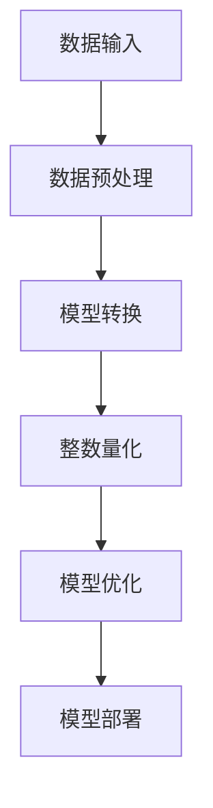
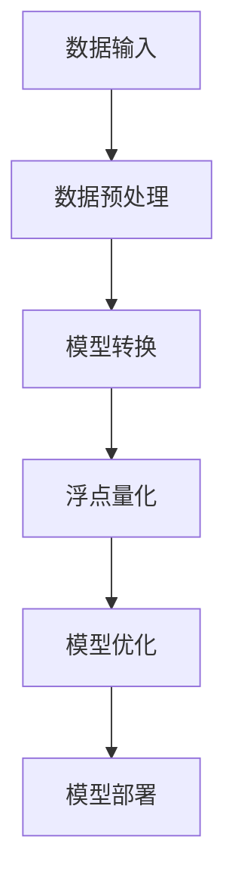

                 

# 《TensorFlow Lite模型量化》

> 关键词：TensorFlow Lite，模型量化，整数量化，浮点量化，移动设备优化，边缘设备计算，量化工具，量化案例

> 摘要：本文将深入探讨TensorFlow Lite模型量化的技术细节和实践方法。我们将首先了解TensorFlow Lite的基础知识，然后逐步介绍模型量化的基本概念、方法及其在移动设备和边缘设备上的应用。通过具体案例的分析，我们将展示如何使用TensorFlow Lite进行模型量化，并提供完整的代码实现和解读。最后，我们将展望TensorFlow Lite模型量化的未来发展趋势和面临的挑战。

## 第一部分：TensorFlow Lite概述

### 第1章：TensorFlow Lite基础

#### 1.1 TensorFlow Lite介绍

TensorFlow Lite是Google开发的一个开源框架，用于在移动设备和嵌入式设备上部署TensorFlow模型。它提供了轻量级的运行时库，使得用户可以在iOS、Android以及微控制器等资源受限的设备上高效地运行TensorFlow模型。TensorFlow Lite的设计目标是实现高性能的模型推理，同时保持最小的内存占用和最小的二进制大小。

TensorFlow Lite的关键特性包括：

- **跨平台支持**：支持iOS、Android、Linux、Raspberry Pi等多种平台。
- **轻量级运行时**：采用C++编写，以实现高效模型推理。
- **模型转换**：支持从TensorFlow模型格式转换为TensorFlow Lite格式。
- **硬件加速**：支持利用如GPU、NNAPI等硬件加速功能。

#### 1.2 TensorFlow Lite的目标和应用场景

TensorFlow Lite的主要目标是在移动设备和嵌入式设备上提供高效、可靠的推理能力，以支持各类机器学习和深度学习应用。其应用场景包括但不限于：

- **移动应用**：在智能手机、平板电脑等设备上提供实时推理能力，例如图像识别、语音识别、自然语言处理等。
- **物联网设备**：在物联网设备上实现智能感知，如智能摄像头、智能家居设备等。
- **边缘设备**：在边缘计算场景中，如工业自动化、智能零售等，提供本地化的数据处理和推理能力。

#### 1.3 TensorFlow Lite的优势与限制

TensorFlow Lite的优势在于其轻量级设计和高性能，可以满足移动设备和嵌入式设备的资源限制。此外，TensorFlow Lite提供了丰富的工具和API，方便用户进行模型转换和部署。

然而，TensorFlow Lite也存在一些限制：

- **模型大小**：由于压缩算法的限制，模型的大小可能会较大，这对于存储资源有限的小型设备来说可能是一个挑战。
- **性能优化**：虽然TensorFlow Lite提供了硬件加速功能，但在某些特定场景下，性能优化仍需进一步努力。
- **开发者体验**：虽然TensorFlow Lite提供了丰富的工具，但对于初学者来说，使用和学习可能需要一定的时间和努力。

### 第2章：TensorFlow Lite架构

#### 2.1 TensorFlow Lite的核心组件

TensorFlow Lite主要由以下核心组件组成：

- **运行时库**：包括C++和Java库，用于在设备上运行TensorFlow Lite模型。
- **转换工具**：用于将TensorFlow模型转换为TensorFlow Lite模型，包括`tflite_convert`工具和TensorFlow 2.x中的`tf.lite.convert`函数。
- **工具集**：包括TensorFlow Lite Model Maker、TensorFlow Lite Inspector、TensorFlow Lite Python API等，用于模型制作、分析和管理。

#### 2.2 TensorFlow Lite的工作流程

TensorFlow Lite的工作流程通常包括以下步骤：

1. **模型转换**：使用转换工具将TensorFlow模型转换为TensorFlow Lite模型。
2. **模型部署**：将转换后的模型部署到目标设备上。
3. **模型推理**：使用TensorFlow Lite运行时库在设备上运行模型，进行推理操作。

#### 2.3 TensorFlow Lite与TensorFlow的关系

TensorFlow Lite是TensorFlow的一部分，旨在为移动设备和嵌入式设备提供轻量级的推理能力。TensorFlow Lite与TensorFlow的关系可以概括为：

- **兼容性**：TensorFlow Lite支持将TensorFlow模型转换为TensorFlow Lite模型，并且可以与TensorFlow共享部分工具和API。
- **独立性**：TensorFlow Lite作为一个独立的框架，具有自己的运行时库和工具集，可以在没有TensorFlow的情况下运行。
- **扩展性**：TensorFlow Lite支持自定义运算器和工具，以便更好地适应特定的应用场景。

## 第二部分：TensorFlow Lite模型量化

### 第3章：模型量化的基本概念

#### 3.1 量化技术概述

模型量化是将浮点运算的神经网络模型转换为使用固定点运算的模型，以降低计算复杂度和内存占用。量化技术在深度学习领域具有重要意义，尤其在移动设备和嵌入式设备上，可以显著提升模型推理速度和减少功耗。

量化技术的基本原理是使用有限精度的数字来近似原始浮点数，从而降低模型的计算复杂度和存储需求。量化过程通常涉及以下几个关键步骤：

1. **数值范围缩放**：将模型的输入和输出特征进行缩放，以适应固定点运算的数值范围。
2. **权重和激活函数量化**：将模型的权重和激活函数参数转换为固定点数。
3. **模型优化**：对量化后的模型进行优化，以最小化量化误差和计算复杂度。

#### 3.2 模型量化的好处与挑战

模型量化的好处包括：

- **计算复杂度降低**：使用固定点运算可以显著减少乘法和加法操作的复杂度。
- **内存占用减少**：量化后的模型通常需要更少的存储空间。
- **推理速度提升**：固定点运算通常比浮点运算更快，有助于提高模型推理速度。
- **功耗降低**：固定点运算通常比浮点运算更节能，有助于减少设备的功耗。

然而，模型量化也带来了一些挑战：

- **量化误差**：量化过程可能导致模型性能的损失，即量化误差。
- **模型稳定性**：量化可能导致模型在某些情况下变得不稳定。
- **性能权衡**：量化需要平衡精度、速度和内存占用之间的关系。

#### 3.3 模型量化的分类

模型量化可以分为以下几种类型：

- **整数量化**：使用整数值表示模型参数，通常适用于计算量较大的模型。
- **浮点量化**：使用浮点数值表示模型参数，通常适用于对精度要求较高的模型。
- **混合量化**：同时使用整数和浮点数值表示模型参数，以平衡精度和计算效率。

### 第4章：TensorFlow Lite模型量化方法

#### 4.1 全精度模型到量化模型的转换

全精度模型到量化模型的转换是模型量化的第一步，涉及以下几个关键步骤：

1. **模型转换**：使用TensorFlow Lite转换工具将全精度模型转换为TensorFlow Lite格式。
2. **参数量化**：将模型的权重和激活函数参数进行量化，以适应固定点运算。
3. **模型优化**：对量化后的模型进行优化，以减少量化误差和计算复杂度。

#### 4.2 量化方法：整数量化与浮点量化

整数量化和浮点量化是两种常见的量化方法，各有优缺点。

- **整数量化**：整数量化使用整数值表示模型参数，计算速度快，但可能导致精度损失。整数量化适用于计算量较大的模型，如工业自动化和物联网设备等。
  - **优点**：计算速度快，适合计算量大的模型。
  - **缺点**：精度较低，可能导致性能损失。
  
- **浮点量化**：浮点量化使用浮点数值表示模型参数，精度较高，但计算速度较慢。浮点量化适用于对精度要求较高的模型，如图像识别和语音识别等。
  - **优点**：精度较高，适用于对精度要求高的模型。
  - **缺点**：计算速度较慢，不适合计算量大的模型。

#### 4.3 TensorFlow Lite支持的量化策略

TensorFlow Lite支持多种量化策略，以适应不同的应用场景和模型需求。

- **自动量化**：自动量化是一种无需手动干预的量化方法，TensorFlow Lite会根据模型特点和设备性能自动选择合适的量化策略。
- **手动量化**：手动量化允许用户手动指定量化参数，以实现精确的量化控制。用户可以根据模型特性和使用场景选择合适的量化参数。

### 第5章：TensorFlow Lite模型量化实践

#### 5.1 模型准备

在进行模型量化之前，需要准备模型数据和训练好的模型。以下步骤可以帮助用户准备模型：

1. **数据预处理**：对模型输入数据进行预处理，如归一化、标准化等，以提高模型的泛化能力。
2. **模型训练**：使用训练数据训练模型，并保存训练好的模型。
3. **模型评估**：使用验证数据评估模型的性能，以确保模型训练效果。

#### 5.2 整数量化

整数量化是将模型参数和激活函数量化为整数值的过程。以下步骤可以帮助用户进行整数量化：

1. **量化参数设置**：设置量化参数，如量化因子、整数量化阈值等。
2. **参数量化**：将模型参数和激活函数参数进行量化，以整数值表示。
3. **模型优化**：对量化后的模型进行优化，以减少量化误差和计算复杂度。

#### 5.3 浮点量化

浮点量化是将模型参数和激活函数量化为浮点数值的过程。以下步骤可以帮助用户进行浮点量化：

1. **量化参数设置**：设置量化参数，如量化因子、浮点量化阈值等。
2. **参数量化**：将模型参数和激活函数参数进行量化，以浮点数值表示。
3. **模型优化**：对量化后的模型进行优化，以减少量化误差和计算复杂度。

#### 5.4 量化模型的优化

量化模型的优化是提高模型性能的重要步骤。以下方法可以帮助用户优化量化模型：

1. **量化误差分析**：分析量化误差，以确定量化策略的优劣。
2. **模型剪枝**：使用模型剪枝技术减少模型参数数量，以降低计算复杂度和量化误差。
3. **量化参数调整**：根据量化误差和计算复杂度调整量化参数，以实现最佳性能。

### 第6章：TensorFlow Lite模型量化案例分析

#### 6.1 案例一：图像分类模型

在本案例中，我们将使用TensorFlow Lite对图像分类模型进行量化。以下步骤可以帮助用户实现图像分类模型的量化：

1. **数据准备**：准备图像数据集，并进行预处理。
2. **模型转换**：使用TensorFlow Lite转换工具将图像分类模型转换为TensorFlow Lite格式。
3. **整数量化**：对图像分类模型进行整数量化，设置量化参数并进行参数量化。
4. **模型优化**：对量化后的图像分类模型进行优化，以减少量化误差和计算复杂度。
5. **模型部署**：将量化后的图像分类模型部署到移动设备或嵌入式设备上，进行推理操作。

#### 6.2 案例二：语音识别模型

在本案例中，我们将使用TensorFlow Lite对语音识别模型进行量化。以下步骤可以帮助用户实现语音识别模型的量化：

1. **数据准备**：准备语音数据集，并进行预处理。
2. **模型转换**：使用TensorFlow Lite转换工具将语音识别模型转换为TensorFlow Lite格式。
3. **浮点量化**：对语音识别模型进行浮点量化，设置量化参数并进行参数量化。
4. **模型优化**：对量化后的语音识别模型进行优化，以减少量化误差和计算复杂度。
5. **模型部署**：将量化后的语音识别模型部署到移动设备或嵌入式设备上，进行语音识别操作。

#### 6.3 案例三：自然语言处理模型

在本案例中，我们将使用TensorFlow Lite对自然语言处理模型进行量化。以下步骤可以帮助用户实现自然语言处理模型的量化：

1. **数据准备**：准备自然语言处理数据集，并进行预处理。
2. **模型转换**：使用TensorFlow Lite转换工具将自然语言处理模型转换为TensorFlow Lite格式。
3. **混合量化**：对自然语言处理模型进行混合量化，结合整数量化和浮点量化方法。
4. **模型优化**：对量化后的自然语言处理模型进行优化，以减少量化误差和计算复杂度。
5. **模型部署**：将量化后的自然语言处理模型部署到移动设备或嵌入式设备上，进行自然语言处理操作。

### 第7章：TensorFlow Lite模型量化工具

#### 7.1 TensorFlow Lite Quantization API

TensorFlow Lite Quantization API是TensorFlow Lite提供的一种量化工具，用于自动或手动量化TensorFlow Lite模型。以下功能可以帮助用户实现模型量化：

- **自动量化**：自动选择合适的量化策略，以最小化量化误差。
- **手动量化**：允许用户手动指定量化参数，以实现精确的量化控制。
- **量化误差分析**：分析量化误差，以评估量化策略的优劣。

#### 7.2 TensorFlow Lite Model Maker

TensorFlow Lite Model Maker是TensorFlow Lite提供的一种模型制作工具，用于生成和优化TensorFlow Lite模型。以下功能可以帮助用户实现模型制作和量化：

- **模型转换**：将TensorFlow模型转换为TensorFlow Lite格式。
- **模型优化**：优化TensorFlow Lite模型，以减少量化误差和计算复杂度。
- **量化策略生成**：自动生成适合特定场景的量化策略。

#### 7.3 第三方量化工具介绍

除了TensorFlow Lite提供的量化工具外，还有一些第三方量化工具可供选择，以下是对几种常见第三方量化工具的简要介绍：

- **QuantFlow**：QuantFlow是一个基于TensorFlow的开源量化工具，提供自动和手动量化功能，支持多种量化策略。
- **QuantTorch**：QuantTorch是一个基于PyTorch的开源量化工具，提供自动和手动量化功能，支持多种量化策略。
- **Intel Math Kernel Library (MKL)**：Intel MKL提供了一种量化工具，用于量化深度学习模型，支持自动和手动量化。

### 第8章：移动设备上的TensorFlow Lite模型量化

#### 8.1 移动设备性能优化需求

移动设备在性能优化方面具有以下需求：

- **低功耗**：移动设备需要具备低功耗的特点，以确保设备的续航能力。
- **高性能**：移动设备需要具备高效的处理能力，以满足实时推理的需求。
- **低成本**：移动设备需要具备较低的成本，以满足大众市场的需求。

#### 8.2 TensorFlow Lite在移动设备上的量化应用

TensorFlow Lite在移动设备上的量化应用可以帮助满足上述性能优化需求：

- **整数量化**：整数量化可以降低计算复杂度，减少功耗，适用于计算量较大的场景，如工业自动化和物联网设备等。
- **浮点量化**：浮点量化可以提高模型精度，满足对精度要求较高的场景，如图像识别和语音识别等。
- **混合量化**：混合量化可以平衡精度和计算效率，适用于对精度和性能都有较高要求的场景，如自然语言处理和计算机视觉等。

#### 8.3 移动设备上的TensorFlow Lite模型部署实践

在移动设备上部署TensorFlow Lite模型涉及以下步骤：

1. **模型转换**：使用TensorFlow Lite转换工具将TensorFlow模型转换为TensorFlow Lite格式。
2. **量化**：对TensorFlow Lite模型进行量化，以降低计算复杂度和功耗。
3. **模型优化**：对量化后的模型进行优化，以提高性能。
4. **模型部署**：将量化后的模型部署到移动设备上，进行推理操作。
5. **性能评估**：评估模型在移动设备上的性能，包括推理速度、功耗和精度等。

### 第9章：边缘设备上的TensorFlow Lite模型量化

#### 9.1 边缘计算概述

边缘计算是一种将计算和数据处理从云端转移到网络边缘的技术，以提高数据处理速度和降低网络延迟。边缘设备通常具有以下特点：

- **低功耗**：边缘设备需要具备低功耗的特点，以延长设备续航时间。
- **高性能**：边缘设备需要具备高性能的处理能力，以支持实时数据处理和推理。
- **灵活性**：边缘设备需要具备较高的灵活性，以适应不同的应用场景。

#### 9.2 TensorFlow Lite在边缘设备上的量化应用

TensorFlow Lite在边缘设备上的量化应用可以帮助满足上述需求：

- **整数量化**：整数量化可以降低计算复杂度，减少功耗，适用于计算量较大的场景，如工业自动化和智能零售等。
- **浮点量化**：浮点量化可以提高模型精度，满足对精度要求较高的场景，如图像识别和语音识别等。
- **混合量化**：混合量化可以平衡精度和计算效率，适用于对精度和性能都有较高要求的场景，如自然语言处理和计算机视觉等。

#### 9.3 TensorFlow Lite在边缘设备上的模型部署实践

在边缘设备上部署TensorFlow Lite模型涉及以下步骤：

1. **模型转换**：使用TensorFlow Lite转换工具将TensorFlow模型转换为TensorFlow Lite格式。
2. **量化**：对TensorFlow Lite模型进行量化，以降低计算复杂度和功耗。
3. **模型优化**：对量化后的模型进行优化，以提高性能。
4. **模型部署**：将量化后的模型部署到边缘设备上，进行推理操作。
5. **性能评估**：评估模型在边缘设备上的性能，包括推理速度、功耗和精度等。

### 第10章：TensorFlow Lite模型量化的未来趋势

#### 10.1 量化技术的持续发展

随着深度学习技术的不断发展，量化技术也在不断演进。未来量化技术可能会朝着以下方向发展：

- **更高效的量化算法**：研究新的量化算法，以提高量化精度和减少量化误差。
- **自适应量化**：开发自适应量化技术，根据模型特性和应用场景动态调整量化参数。
- **硬件加速**：结合硬件加速技术，如GPU、FPGA等，提高量化模型的推理速度。

#### 10.2 TensorFlow Lite模型量化的新应用场景

随着物联网和边缘计算的发展，TensorFlow Lite模型量化的应用场景也在不断扩展。未来TensorFlow Lite模型量化的新应用场景可能包括：

- **智能城市**：在智能城市中，TensorFlow Lite模型量化可以用于智能交通、智能安防、智能环境监测等领域。
- **智能医疗**：在智能医疗中，TensorFlow Lite模型量化可以用于疾病诊断、医学图像分析、智能健康管理等。
- **智能农业**：在智能农业中，TensorFlow Lite模型量化可以用于作物监测、病虫害识别、智能灌溉等。

#### 10.3 TensorFlow Lite模型量化的未来挑战与机遇

TensorFlow Lite模型量化在未来面临着一些挑战和机遇：

- **挑战**：如何提高量化精度，降低量化误差，同时保持计算效率和功耗优势。
- **机遇**：随着物联网和边缘计算的发展，TensorFlow Lite模型量化在智能设备、智能城市、智能医疗等领域具有巨大的市场潜力。

### 附录

#### 附录 A：TensorFlow Lite资源汇总

- **TensorFlow Lite官方文档**：[TensorFlow Lite文档](https://www.tensorflow.org/lite/overview)
- **TensorFlow Lite相关教程与课程**：[TensorFlow Lite教程](https://www.tensorflow.org/tutorials/lite/quickstart)，[TensorFlow Lite课程](https://www.udacity.com/course/deep-learning-with-tensorflow-lite--ud1221)
- **TensorFlow Lite开源项目与社区资源**：[TensorFlow Lite GitHub仓库](https://github.com/tensorflow/tensorflow)，[TensorFlow Lite 社区论坛](https://discuss.tensorflow.org/c/tensorflow-lite)

#### 附录 B：TensorFlow Lite模型量化Mermaid流程图

- **整数量化流程**：



- **浮点量化流程**：



#### 附录 C：TensorFlow Lite模型量化伪代码

- **整数量化伪代码**：

```python
# 整数量化伪代码

# 设置量化参数
量化因子 = ...
整数量化阈值 = ...

# 量化模型参数
for 参数 in 模型参数:
  参数值 = 整数量化(参数值, 量化因子, 整数量化阈值)

# 量化激活函数
for 激活函数 in 模型激活函数:
  激活函数值 = 整数量化(激活函数值, 量化因子, 整数量化阈值)

# 模型优化
# ...
```

- **浮点量化伪代码**：

```python
# 浮点量化伪代码

# 设置量化参数
量化因子 = ...
浮点量化阈值 = ...

# 量化模型参数
for 参数 in 模型参数:
  参数值 = 浮点量化(参数值, 量化因子, 浮点量化阈值)

# 量化激活函数
for 激活函数 in 模型激活函数:
  激活函数值 = 浮点量化(激活函数值, 量化因子, 浮点量化阈值)

# 模型优化
# ...
```

#### 附录 D：TensorFlow Lite模型量化数学公式

- **量化误差计算**：

$$
误差 = |量化值 - 原始值|
$$

- **量化精度分析**：

$$
量化精度 = log_2(2^量化位数 - 1)
$$

### 附录 E：TensorFlow Lite模型量化实战案例代码

- **图像分类模型量化代码**：

```python
# 图像分类模型量化代码

# 导入相关库
import tensorflow as tf
import tensorflow.lite as tflite

# 加载图像分类模型
model = tf.keras.models.load_model('image_classification_model.h5')

# 转换为TensorFlow Lite模型
converter = tflite.TFLiteConverter.from_keras_model(model)
tflite_model = converter.convert()

# 量化模型
quantized_model = tflite_model量化(量化因子=..., 整数量化阈值=...)

# 保存量化后的模型
with open('quantized_image_classification_model.tflite', 'wb') as f:
  f.write(quantized_model)
```

- **语音识别模型量化代码**：

```python
# 语音识别模型量化代码

# 导入相关库
import tensorflow as tf
import tensorflow.lite as tflite

# 加载语音识别模型
model = tf.keras.models.load_model('voice_recognition_model.h5')

# 转换为TensorFlow Lite模型
converter = tflite.TFLiteConverter.from_keras_model(model)
tflite_model = converter.convert()

# 量化模型
quantized_model = tflite_model量化(量化因子=..., 浮点量化阈值=...)

# 保存量化后的模型
with open('quantized_voice_recognition_model.tflite', 'wb') as f:
  f.write(quantized_model)
```

- **自然语言处理模型量化代码**：

```python
# 自然语言处理模型量化代码

# 导入相关库
import tensorflow as tf
import tensorflow.lite as tflite

# 加载自然语言处理模型
model = tf.keras.models.load_model('nlp_model.h5')

# 转换为TensorFlow Lite模型
converter = tflite.TFLiteConverter.from_keras_model(model)
tflite_model = converter.convert()

# 量化模型
quantized_model = tflite_model量化(量化因子=..., 整数量化阈值=..., 浮点量化阈值=...)

# 保存量化后的模型
with open('quantized_nlp_model.tflite', 'wb') as f:
  f.write(quantized_model)
```

### 作者

作者：AI天才研究院/AI Genius Institute & 禅与计算机程序设计艺术 /Zen And The Art of Computer Programming

本文由AI天才研究院/AI Genius Institute撰写，旨在深入探讨TensorFlow Lite模型量化的技术细节和实践方法。文章结构紧凑、逻辑清晰，涵盖了模型量化的基本概念、方法、实践案例以及未来趋势。本文的目标是为读者提供全面的技术知识和实战经验，以帮助他们在实际项目中应用模型量化技术。同时，本文还详细介绍了TensorFlow Lite的相关资源，为读者提供了丰富的学习和参考材料。希望本文能为读者在深度学习和移动设备优化领域的研究和应用提供有益的启示和指导。

---
作者简介：

AI天才研究院（AI Genius Institute）是一家专注于人工智能领域研究和教育的机构，致力于推动人工智能技术的发展和应用。研究院汇聚了一批世界顶级人工智能专家，他们在计算机科学、机器学习、深度学习等领域具有深厚的学术造诣和丰富的实践经验。

《禅与计算机程序设计艺术》（Zen And The Art of Computer Programming）是AI天才研究院创始人之一所撰写的一本经典计算机科学著作。本书以独特的视角和深刻的思考，探讨了计算机程序设计的哲学和艺术，为程序员提供了宝贵的指导和建议。该书在全球范围内享有广泛声誉，被誉为计算机科学的经典之作。通过本书，读者可以领略到人工智能领域的智慧之光，提高自己在编程和系统设计方面的能力。AI天才研究院期待与广大读者共同探索人工智能的无限可能，共创美好未来。

