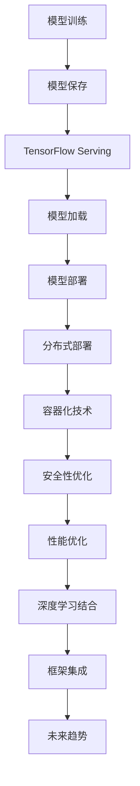

                 

### 《TensorFlow Serving模型部署》

关键词：TensorFlow Serving、模型部署、模型训练、模型保存与加载、分布式部署、容器化技术、安全与性能优化、深度学习、框架集成、未来发展趋势

摘要：本文旨在深入探讨TensorFlow Serving模型部署的各个环节，包括模型训练、保存与加载、部署流程、分布式部署、容器化技术、安全与性能优化、深度学习结合、框架集成及未来发展趋势。通过详细的步骤解析和实际项目案例，帮助读者全面了解TensorFlow Serving模型部署的各个方面，掌握其核心原理和最佳实践。

## 第一部分: TensorFlow Serving基础

### 第1章: TensorFlow Serving概述

#### 1.1.1 TensorFlow Serving的背景和目的

TensorFlow Serving是Google推出的一款高性能、可扩展的机器学习模型服务器，旨在解决机器学习模型在生产环境中的部署问题。随着深度学习的广泛应用，越来越多的企业需要将训练好的模型部署到线上服务中，以实现实时预测和决策。然而，传统的部署方法往往存在诸多问题，如模型更新困难、部署流程复杂、扩展性差等。为了解决这些问题，TensorFlow Serving应运而生。

TensorFlow Serving的主要目的是提供一种简单、高效、可靠的模型部署方案，使得机器学习模型能够快速、灵活地部署到生产环境中。通过TensorFlow Serving，开发者可以将训练好的模型导出为`SavedModel`格式，然后部署到TensorFlow Serving服务器上，实现模型的版本管理和动态更新。

#### 1.1.2 TensorFlow Serving的优势与特点

1. **高性能**：TensorFlow Serving采用了高性能的模型推理引擎，能够快速处理大规模的并发请求，满足生产环境中的性能需求。
2. **可扩展性**：TensorFlow Serving支持水平扩展，可以通过增加服务器节点来提升系统的处理能力，具有良好的可扩展性。
3. **版本管理**：TensorFlow Serving提供了完善的模型版本管理机制，支持模型的动态更新和回滚，方便开发者进行模型迭代。
4. **动态加载**：TensorFlow Serving支持模型动态加载，可以实时更新模型而不需要重启服务器，提高系统的灵活性。
5. **跨平台**：TensorFlow Serving支持多种平台，包括Linux、Windows和macOS等，方便开发者在不同环境中部署和使用。
6. **兼容性**：TensorFlow Serving与TensorFlow框架紧密集成，支持多种深度学习框架（如TensorFlow、TensorFlow Lite、TensorFlow Model Optimization Toolkit等），方便开发者进行模型迁移和复用。

#### 1.1.3 TensorFlow Serving的架构

TensorFlow Serving的架构主要包括三个核心组件：TensorFlow Model Server、TensorFlow Client和TensorFlow模型。

1. **TensorFlow Model Server**：TensorFlow Model Server是TensorFlow Serving的核心组件，负责接收并处理客户端的预测请求，执行模型推理并将结果返回给客户端。TensorFlow Model Server采用了高性能的模型推理引擎，能够快速处理大规模的并发请求。
2. **TensorFlow Client**：TensorFlow Client是TensorFlow Serving的客户端组件，负责向TensorFlow Model Server发送预测请求，接收并解析预测结果。TensorFlow Client提供了多种编程语言的支持，包括Python、Java、Go等，方便开发者进行集成和使用。
3. **TensorFlow模型**：TensorFlow模型是指使用TensorFlow框架训练和保存的模型，通常以`SavedModel`格式导出。TensorFlow模型包括模型的结构、参数和权重等信息，可以在TensorFlow Serving服务器上加载和运行。

在TensorFlow Serving的架构中，TensorFlow Model Server和TensorFlow Client通过REST API进行通信。TensorFlow Model Server使用TensorFlow的私有API进行模型推理，确保了模型的高性能和稳定性。同时，TensorFlow Serving还提供了多个扩展组件，如TensorFlow Model Benchmark、TensorFlow Model Server Performance Tools等，用于评估和优化模型性能。

### 第2章: TensorFlow模型训练基础

#### 2.1.1 TensorFlow框架基础

TensorFlow是Google开发的一款开源深度学习框架，提供了丰富的API和工具，方便开发者进行模型训练、推理和部署。TensorFlow的主要特点包括：

1. **动态计算图**：TensorFlow采用动态计算图（dynamic computation graph）的方式，使得模型训练和推理过程更加灵活和高效。在TensorFlow中，开发者可以使用Python定义计算图，并通过运行时动态构建和执行计算图。
2. **多平台支持**：TensorFlow支持多种操作系统和硬件平台，包括Linux、Windows、macOS、Android和iOS等，以及CPU、GPU、TPU等硬件设备，方便开发者在不同环境中进行开发和部署。
3. **大规模训练**：TensorFlow支持大规模分布式训练，可以通过分布式计算技术提高模型的训练速度和性能。TensorFlow的分布式训练功能包括分布式数据并行（data parallelism）、模型并行（model parallelism）等，方便开发者进行大规模模型的训练。
4. **丰富的API和工具**：TensorFlow提供了丰富的API和工具，包括TensorFlow Core、TensorFlow Estimators、TensorFlow Extended等，方便开发者进行模型训练、推理、评估和部署。
5. **兼容性**：TensorFlow与多种深度学习框架（如TensorFlow Lite、TensorFlow Model Optimization Toolkit等）兼容，方便开发者进行模型迁移和复用。

#### 2.1.2 模型构建与训练

在TensorFlow中，模型构建与训练主要包括以下几个步骤：

1. **定义计算图**：使用TensorFlow提供的API定义计算图，包括输入层、隐藏层、输出层等。在计算图中，每个节点表示一个计算操作，每个边表示数据的流动。
2. **定义损失函数**：损失函数用于衡量模型预测结果与实际结果之间的差异，常用的损失函数包括均方误差（mean squared error）、交叉熵（cross entropy）等。
3. **定义优化器**：优化器用于更新模型参数，以最小化损失函数。常用的优化器包括梯度下降（gradient descent）、Adam优化器等。
4. **训练过程**：使用训练数据集对模型进行训练，通过迭代优化模型参数。在训练过程中，可以使用TensorFlow的API进行数据预处理、批处理、迭代训练等操作。
5. **评估模型**：在训练完成后，使用测试数据集对模型进行评估，计算模型的准确率、召回率、F1值等指标，以判断模型性能是否达到要求。

以下是一个简单的TensorFlow模型训练示例：

python
import tensorflow as tf

# 定义计算图
model = tf.keras.Sequential([
    tf.keras.layers.Dense(128, activation='relu', input_shape=(784,)),
    tf.keras.layers.Dense(10, activation='softmax')
])

# 定义损失函数和优化器
model.compile(optimizer='adam', loss='categorical_crossentropy', metrics=['accuracy'])

# 训练模型
model.fit(x_train, y_train, epochs=10, batch_size=32)

# 评估模型
model.evaluate(x_test, y_test)

#### 2.1.3 评估与优化

在模型训练过程中，评估和优化是两个关键环节。以下是一些常用的评估与优化方法：

1. **评估指标**：常用的评估指标包括准确率（accuracy）、召回率（recall）、F1值（F1 score）等。准确率表示模型正确预测的样本数占总样本数的比例；召回率表示模型正确预测的样本数占实际正样本数的比例；F1值是准确率和召回率的加权平均值，综合反映了模型的预测性能。
2. **交叉验证**：交叉验证是一种常用的模型评估方法，通过将数据集划分为多个子集，每次使用其中一个子集作为验证集，其余子集作为训练集，多次重复这个过程，计算模型在验证集上的表现，以消除数据划分带来的偏差。
3. **网格搜索**：网格搜索是一种常用的模型优化方法，通过遍历多个超参数组合，计算每个组合在验证集上的性能，选择最佳的超参数组合，以提升模型性能。
4. **正则化**：正则化是一种常用的模型优化方法，通过在损失函数中加入正则化项，惩罚模型参数的复杂度，防止模型过拟合。常用的正则化方法包括L1正则化、L2正则化等。
5. **数据增强**：数据增强是一种常用的模型优化方法，通过增加训练数据的多样性，提高模型的泛化能力。常见的数据增强方法包括随机裁剪、旋转、翻转等。

以下是一个简单的TensorFlow模型优化示例：

python
from tensorflow.keras.callbacks import EarlyStopping, ModelCheckpoint

# 设置回调函数
early_stopping = EarlyStopping(monitor='val_loss', patience=5)
model_checkpoint = ModelCheckpoint('best_model.h5', save_best_only=True)

# 重新训练模型
model.fit(x_train, y_train, epochs=100, batch_size=32, validation_data=(x_val, y_val), callbacks=[early_stopping, model_checkpoint])

### 第3章: TensorFlow模型保存与加载

#### 3.1.1 模型保存方法

在TensorFlow中，模型保存方法主要包括以下几种：

1. **保存为`SavedModel`格式**：`SavedModel`是TensorFlow提供的一种模型保存和加载的格式，包含了模型的结构、参数和权重等信息。使用`tf.keras.models.save_model()`方法可以将模型保存为`SavedModel`格式。

python
model.save('model/saved_model')

2. **保存为HDF5格式**：HDF5是一种通用的数据存储格式，可以保存大规模的复杂数据结构。使用`tf.keras.models.to_hdf5()`方法可以将模型保存为HDF5格式。

python
model.to_hdf5('model/model.h5')

3. **保存为JSON格式**：JSON是一种轻量级的数据交换格式，可以方便地将模型结构、参数和权重等信息进行存储和传输。使用`tf.keras.models.to_json()`方法可以将模型保存为JSON格式。

python
model_json = model.to_json()
with open('model/model.json', 'w') as json_file:
    json_file.write(model_json)

#### 3.1.2 模型加载机制

在TensorFlow中，模型加载机制主要包括以下几种：

1. **加载`SavedModel`格式**：使用`tf.keras.models.load_model()`方法可以加载保存为`SavedModel`格式的模型。

python
model = tf.keras.models.load_model('model/saved_model')

2. **加载HDF5格式**：使用`tf.keras.models.from_hdf5()`方法可以加载保存为HDF5格式的模型。

python
model = tf.keras.models.from_hdf5('model/model.h5')

3. **加载JSON格式**：使用`tf.keras.models.from_json()`方法可以加载保存为JSON格式的模型。

python
model_json = open('model/model.json').read()
model = tf.keras.models.from_json(model_json)

#### 3.1.3 模型版本管理

在TensorFlow Serving中，模型版本管理是一个重要的功能，它允许开发者对模型的多个版本进行管理和切换。以下是一些常用的模型版本管理方法：

1. **版本命名**：为每个模型版本指定唯一的名称，以便进行管理和切换。版本名称通常包含模型名称、版本号等信息。

python
model_version = 'model_name:v1'

2. **加载指定版本**：使用TensorFlow Serving API可以加载指定版本的模型。

python
from tensorflow_serving.api import PredictRequest

request = PredictRequest()
request.model_spec.name = 'model_name'
request.model_spec.version = 'v1'

response = client.predict(request)

3. **版本更新**：在TensorFlow Serving中，可以通过更新模型文件来切换模型版本。更新完成后，可以使用新的版本名称进行加载和使用。

python
model_version = 'model_name:v2'
model_path = 'model/saved_model'

with open(model_path, 'rb') as model_file:
    request.model_spec.content = model_file.read()

response = client.update_model(request)

### 第4章: TensorFlow Serving部署流程

#### 4.1.1 部署前的准备工作

在部署TensorFlow Serving之前，需要进行以下准备工作：

1. **环境配置**：确保系统环境满足TensorFlow Serving的安装要求，包括Python环境、TensorFlow库等。
2. **模型准备**：使用TensorFlow训练和保存模型，将模型文件转换为TensorFlow Serving支持的`SavedModel`格式。
3. **TensorFlow Serving安装**：安装TensorFlow Serving库，可以使用pip安装。

python
pip install tensorflow_serving

4. **依赖安装**：安装TensorFlow Serving所需的依赖库，如gRPC、gRPC Python等。

python
pip install grpcio
pip install grpcio-tools

#### 4.1.2 TensorFlow Serving安装与配置

TensorFlow Serving的安装与配置步骤如下：

1. **下载TensorFlow Serving预编译二进制文件**：从TensorFlow Serving官网下载适用于当前操作系统的预编译二进制文件。

2. **解压二进制文件**：将下载的二进制文件解压到指定目录。

bash
tar xvf tensorflow_server-2.6.0-cp37-cp37m-linux_x86_64.whl -C /path/to/tensorflow_serving

3. **启动TensorFlow Serving**：在命令行中启动TensorFlow Serving服务。

bash
/path/to/tensorflow_serving/bin/tensorflow_model_server --port=8501 --model_name=model_name --model_base_path=/path/to/model

其中，`model_name`为模型的名称，`model_base_path`为模型文件的路径。

#### 4.1.3 部署策略与监控

在部署TensorFlow Serving时，需要考虑以下策略和监控方法：

1. **部署策略**：
   - **单机部署**：将TensorFlow Serving部署在一台服务器上，适用于模型规模较小的情况。
   - **分布式部署**：将TensorFlow Serving部署在多台服务器上，通过负载均衡和容错机制提高系统的性能和可靠性。
   - **容器化部署**：使用Docker等容器化技术，将TensorFlow Serving容器化部署在Kubernetes等容器编排系统中，实现高效、灵活的部署和管理。

2. **监控方法**：
   - **性能监控**：使用Prometheus等性能监控工具，收集TensorFlow Serving的性能指标，如响应时间、请求吞吐量等。
   - **日志监控**：使用ELK（Elasticsearch、Logstash、Kibana）等日志监控工具，收集TensorFlow Serving的日志信息，实现日志的集中管理和分析。
   - **告警机制**：使用Alertmanager等告警工具，根据性能监控和日志监控的结果，自动触发告警通知，及时发现问题并进行处理。

### 第5章: TensorFlow Serving在分布式环境中的应用

#### 5.1.1 分布式系统概述

分布式系统是指通过计算机网络将多个计算机节点连接起来，共同完成任务的系统。分布式系统的主要特点包括：

1. **并行计算**：分布式系统通过多个节点同时处理任务，提高系统的计算能力和效率。
2. **容错性**：分布式系统通过冗余备份和故障转移机制，提高系统的可靠性和稳定性。
3. **可扩展性**：分布式系统可以通过增加节点的方式，灵活扩展系统的规模和性能。
4. **灵活性**：分布式系统可以根据需求动态调整计算资源和任务分配，提高系统的灵活性和适应性。

#### 5.1.2 TensorFlow Serving的分布式部署

TensorFlow Serving支持分布式部署，通过在多台服务器上部署TensorFlow Model Server节点，实现模型的分布式推理。以下是一些常用的分布式部署策略：

1. **水平扩展**：通过增加TensorFlow Model Server节点数量，提高系统的处理能力和吞吐量。水平扩展适用于负载较重、模型规模较大的场景。
2. **负载均衡**：使用负载均衡器（如Nginx、HAProxy等），将预测请求分发到不同的TensorFlow Model Server节点，实现负载均衡和流量控制。
3. **故障转移**：通过设置故障转移机制（如Keepalived、Zookeeper等），在某个TensorFlow Model Server节点发生故障时，自动切换到备用节点，确保系统的连续性和可靠性。
4. **服务发现**：使用服务发现机制（如Consul、Eureka等），实现TensorFlow Model Server节点的自动注册和发现，方便负载均衡和故障转移。

以下是一个简单的TensorFlow Serving分布式部署示例：

bash
# 启动TensorFlow Model Server节点1
nohup /path/to/tensorflow_model_server --port=8501 --model_name=model_name --model_base_path=/path/to/model &

# 启动TensorFlow Model Server节点2
nohup /path/to/tensorflow_model_server --port=8502 --model_name=model_name --model_base_path=/path/to/model &

# 启动Nginx负载均衡器
nohup nginx &

其中，`model_name`为模型的名称，`model_base_path`为模型文件的路径。

#### 5.1.3 分布式环境下的性能优化

在分布式环境下，为了提高TensorFlow Serving的性能，可以采取以下优化措施：

1. **并行推理**：通过并行处理多个预测请求，提高系统的吞吐量和响应速度。可以使用TensorFlow的`tf.data` API实现并行数据读取和预处理。
2. **模型压缩**：使用模型压缩技术（如量化、剪枝等），减少模型的大小和计算量，提高模型的推理速度和效率。
3. **缓存策略**：使用缓存策略（如LRU缓存、Redis缓存等），减少模型推理的耗时和开销。可以将预测结果缓存起来，避免重复计算。
4. **性能监控**：使用性能监控工具（如Prometheus、Grafana等），实时监控分布式环境下的性能指标，及时发现问题并进行优化。
5. **资源调度**：使用资源调度工具（如Kubernetes、Mesos等），合理分配计算资源和网络资源，确保系统的高效运行。

### 第6章: TensorFlow Serving与容器化技术

#### 6.1.1 容器化技术概述

容器化技术是一种轻量级虚拟化技术，通过将应用程序及其依赖项打包到容器中，实现应用程序的隔离、部署和运行。容器化技术的主要特点包括：

1. **轻量级**：容器化技术不需要在宿主机上安装额外的操作系统，提高了系统的运行效率和资源利用率。
2. **隔离性**：容器化技术通过虚拟化技术实现应用程序的隔离，确保不同应用程序之间的资源和数据不会相互干扰。
3. **可移植性**：容器化技术可以将应用程序及其依赖项打包到一个统一的容器镜像中，方便在不同环境中部署和运行。
4. **高效性**：容器化技术通过减少操作系统层级的开销，提高了应用程序的运行速度和性能。

常见的容器化技术包括Docker和Kubernetes。Docker是一种容器引擎，用于构建、运行和分发容器化应用程序。Kubernetes是一种容器编排系统，用于自动化容器的部署、扩展和管理。

#### 6.1.2 Docker在TensorFlow Serving中的应用

Docker在TensorFlow Serving中的应用主要包括以下几个方面：

1. **容器化TensorFlow Serving**：使用Docker将TensorFlow Serving应用程序及其依赖项打包到一个统一的容器镜像中，实现应用程序的容器化部署。
2. **自动化部署**：通过Docker Compose等工具，可以实现TensorFlow Serving的自动化部署和管理，提高部署效率和可维护性。
3. **扩展性**：使用Docker可以将TensorFlow Serving部署到多个服务器上，通过水平扩展提高系统的性能和吞吐量。

以下是一个简单的Docker部署TensorFlow Serving的示例：

Dockerfile
FROM tensorflow/tensorflow:2.6.0

# 安装TensorFlow Serving
RUN pip install tensorflow_serving

# 暴露端口
EXPOSE 8501

# 运行TensorFlow Serving
CMD ["tensorflow_model_server", "--port=8501", "--model_name=model_name", "--model_base_path=/path/to/model"]

docker-compose.yml
version: '3'

services:
  tensorflow-serving:
    image: tensorflow/tensorflow:2.6.0
    ports:
      - "8501:8501"
    volumes:
      - /path/to/model:/path/to/model
    environment:
      - MODEL_NAME=model_name

通过以上步骤，可以将TensorFlow Serving容器化部署到Docker环境中，实现应用程序的自动化部署和管理。

#### 6.1.3 Kubernetes与TensorFlow Serving的集成

Kubernetes是一种容器编排系统，用于自动化容器的部署、扩展和管理。Kubernetes与TensorFlow Serving的集成主要包括以下几个方面：

1. **部署TensorFlow Serving到Kubernetes**：使用Kubernetes Deployments、StatefulSets等资源对象，将TensorFlow Serving部署到Kubernetes集群中。
2. **配置Service和Ingress**：使用Kubernetes Service和Ingress资源对象，实现TensorFlow Serving的负载均衡和外部访问。
3. **监控和日志管理**：使用Kubernetes的监控和日志管理工具（如Prometheus、ELK等），实现对TensorFlow Serving的监控和日志收集。

以下是一个简单的Kubernetes部署TensorFlow Serving的示例：

yaml
apiVersion: apps/v1
kind: Deployment
metadata:
  name: tensorflow-serving
spec:
  replicas: 3
  selector:
    matchLabels:
      app: tensorflow-serving
  template:
    metadata:
      labels:
        app: tensorflow-serving
    spec:
      containers:
      - name: tensorflow-serving
        image: tensorflow/tensorflow:2.6.0
        ports:
        - containerPort: 8501
        volumeMounts:
        - name: model-volume
          mountPath: /path/to/model
        env:
        - name: MODEL_NAME
          value: model_name

---

apiVersion: v1
kind: Service
metadata:
  name: tensorflow-serving
spec:
  selector:
    app: tensorflow-serving
  ports:
    - name: grpc
      port: 8501
      targetPort: 8501
  type: LoadBalancer

---

apiVersion: networking.k8s.io/v1
kind: Ingress
metadata:
  name: tensorflow-serving
spec:
  rules:
  - http:
      paths:
      - path: /v1/predictions
        pathType: Prefix
        backend:
          service:
            name: tensorflow-serving
            port:
              number: 8501

通过以上步骤，可以将TensorFlow Serving部署到Kubernetes集群中，实现应用程序的容器化部署和管理。

### 第7章: TensorFlow Serving在实际项目中的应用案例

#### 7.1.1 案例一：实时分类系统的实现

实时分类系统是一种常见的应用场景，通过实时分析输入数据，将其分类到相应的类别中。以下是一个简单的实时分类系统实现示例：

1. **数据预处理**：对输入数据进行预处理，包括数据清洗、归一化、特征提取等。

2. **模型训练**：使用TensorFlow框架训练分类模型，如朴素贝叶斯、支持向量机、神经网络等。

3. **模型保存**：将训练好的模型保存为`SavedModel`格式。

4. **TensorFlow Serving部署**：将分类模型部署到TensorFlow Serving服务器上，实现实时分类功能。

5. **预测与反馈**：将输入数据发送到TensorFlow Serving服务器，获取分类结果，并根据结果进行后续处理。

以下是一个简单的TensorFlow Serving实时分类系统示例：

python
import requests
import json

input_data = {
    "inputs": {
        "input_1": [[0.1, 0.2, 0.3]]  # 输入特征
    }
}

response = requests.post('http://localhost:8501/v1/predictions', data=json.dumps(input_data))
print(response.json())

#### 7.1.2 案例二：图像识别系统的部署

图像识别系统是一种广泛应用于计算机视觉领域的应用场景，通过识别和分类图像中的物体或场景。以下是一个简单的图像识别系统部署示例：

1. **数据预处理**：对输入图像进行预处理，包括缩放、裁剪、翻转等。

2. **模型训练**：使用TensorFlow框架训练图像识别模型，如卷积神经网络、循环神经网络等。

3. **模型保存**：将训练好的模型保存为`SavedModel`格式。

4. **TensorFlow Serving部署**：将图像识别模型部署到TensorFlow Serving服务器上，实现图像识别功能。

5. **预测与反馈**：将输入图像发送到TensorFlow Serving服务器，获取识别结果，并根据结果进行后续处理。

以下是一个简单的TensorFlow Serving图像识别系统示例：

python
import requests
import json

input_data = {
    "inputs": {
        "input_1": [[0.1, 0.2, 0.3]]  # 输入特征
    }
}

response = requests.post('http://localhost:8501/v1/predictions', data=json.dumps(input_data))
print(response.json())

#### 7.1.3 案例三：推荐系统的构建

推荐系统是一种广泛应用于电子商务、社交媒体、视频流等领域的应用场景，通过分析用户历史行为和偏好，为用户推荐感兴趣的内容。以下是一个简单的推荐系统构建示例：

1. **数据预处理**：对用户历史行为和偏好数据进行预处理，包括数据清洗、特征提取等。

2. **模型训练**：使用TensorFlow框架训练推荐模型，如协同过滤、基于内容的推荐等。

3. **模型保存**：将训练好的模型保存为`SavedModel`格式。

4. **TensorFlow Serving部署**：将推荐模型部署到TensorFlow Serving服务器上，实现推荐功能。

5. **预测与反馈**：将用户历史行为和偏好数据发送到TensorFlow Serving服务器，获取推荐结果，并根据结果进行后续处理。

以下是一个简单的TensorFlow Serving推荐系统示例：

python
import requests
import json

input_data = {
    "inputs": {
        "input_1": [[0.1, 0.2, 0.3]]  # 输入特征
    }
}

response = requests.post('http://localhost:8501/v1/predictions', data=json.dumps(input_data))
print(response.json())

## 第二部分: TensorFlow Serving高级应用

### 第8章: TensorFlow Serving的安全与性能优化

#### 8.1.1 安全性保障机制

在TensorFlow Serving的实际应用中，安全性是一个非常重要的方面。以下是一些常用的安全性保障机制：

1. **身份验证和授权**：通过身份验证和授权机制，确保只有授权用户可以访问TensorFlow Serving服务。可以使用OAuth 2.0、JWT等认证协议实现身份验证和授权。
2. **数据加密**：对传输的数据进行加密，防止数据在传输过程中被窃取或篡改。可以使用TLS/SSL等加密协议实现数据加密。
3. **防火墙和网络安全**：配置防火墙和网络安全策略，限制外部访问和内部通信，防止恶意攻击和未经授权的访问。
4. **日志和监控**：启用日志和监控功能，记录TensorFlow Serving的访问日志和操作日志，及时发现和应对潜在的安全威胁。

#### 8.1.2 性能优化方法

在TensorFlow Serving的实际应用中，性能优化是提高系统效率和用户体验的关键。以下是一些常用的性能优化方法：

1. **并行推理**：通过并行处理多个预测请求，提高系统的吞吐量和响应速度。可以使用TensorFlow的`tf.data` API实现并行数据读取和预处理。
2. **模型压缩**：使用模型压缩技术（如量化、剪枝等），减少模型的大小和计算量，提高模型的推理速度和效率。
3. **缓存策略**：使用缓存策略（如LRU缓存、Redis缓存等），减少模型推理的耗时和开销。可以将预测结果缓存起来，避免重复计算。
4. **性能监控**：使用性能监控工具（如Prometheus、Grafana等），实时监控TensorFlow Serving的性能指标，及时发现问题并进行优化。
5. **资源调度**：使用资源调度工具（如Kubernetes、Mesos等），合理分配计算资源和网络资源，确保系统的高效运行。

#### 8.1.3 负载均衡与高可用性设计

在分布式环境中，负载均衡和高可用性设计是确保系统稳定性和可靠性的关键。以下是一些常用的负载均衡与高可用性设计方法：

1. **负载均衡**：使用负载均衡器（如Nginx、HAProxy等），将预测请求分发到不同的TensorFlow Model Server节点，实现负载均衡和流量控制。
2. **故障转移**：通过设置故障转移机制（如Keepalived、Zookeeper等），在某个TensorFlow Model Server节点发生故障时，自动切换到备用节点，确保系统的连续性和可靠性。
3. **数据备份**：对模型数据和配置文件进行备份，防止数据丢失或损坏。可以使用云存储、分布式文件系统等实现数据备份。
4. **分布式存储**：使用分布式存储系统（如HDFS、Cassandra等），提高数据存储的可靠性和性能。
5. **高可用性架构**：采用高可用性架构（如主从架构、集群架构等），确保系统的高可用性和可靠性。

### 第9章: TensorFlow Serving与深度学习的结合

#### 9.1.1 深度学习算法在TensorFlow Serving中的应用

深度学习算法在TensorFlow Serving中的应用非常广泛，以下是一些常见的深度学习算法：

1. **卷积神经网络（CNN）**：卷积神经网络是一种常用的深度学习算法，适用于图像识别、图像分类等任务。TensorFlow Serving支持CNN算法，可以快速部署和推理CNN模型。
2. **循环神经网络（RNN）**：循环神经网络是一种适用于序列数据的深度学习算法，适用于自然语言处理、语音识别等任务。TensorFlow Serving支持RNN算法，可以快速部署和推理RNN模型。
3. **生成对抗网络（GAN）**：生成对抗网络是一种生成模型，适用于图像生成、图像编辑等任务。TensorFlow Serving支持GAN算法，可以快速部署和推理GAN模型。
4. **强化学习**：强化学习是一种通过试错学习优化决策策略的算法，适用于游戏、自动驾驶等任务。TensorFlow Serving支持强化学习算法，可以快速部署和推理强化学习模型。

以下是一个简单的TensorFlow Serving深度学习算法应用示例：

python
import tensorflow as tf
from tensorflow.keras.models import Sequential
from tensorflow.keras.layers import Conv2D, MaxPooling2D, Flatten, Dense

# 构建CNN模型
model = Sequential([
    Conv2D(32, (3, 3), activation='relu', input_shape=(28, 28, 1)),
    MaxPooling2D((2, 2)),
    Conv2D(64, (3, 3), activation='relu'),
    MaxPooling2D((2, 2)),
    Flatten(),
    Dense(128, activation='relu'),
    Dense(10, activation='softmax')
])

# 编译模型
model.compile(optimizer='adam', loss='categorical_crossentropy', metrics=['accuracy'])

# 训练模型
model.fit(x_train, y_train, epochs=10, batch_size=32)

# 保存模型
model.save('model/saved_model')

# 部署模型到TensorFlow Serving
tensorflow_model_server --port=8501 --model_name=model_name --model_base_path=/path/to/model

#### 9.1.2 TensorFlow Serving与神经网络的集成

TensorFlow Serving与神经网络的集成是深度学习应用的关键。以下是一些常用的集成方法：

1. **TensorFlow Estimators**：TensorFlow Estimators是一种高层次的API，用于构建、训练和部署神经网络模型。TensorFlow Serving可以与TensorFlow Estimators集成，方便地将训练好的神经网络模型部署到生产环境中。
2. **TensorFlow Lite**：TensorFlow Lite是一种轻量级深度学习框架，适用于移动设备和嵌入式设备。TensorFlow Serving可以与TensorFlow Lite集成，将神经网络模型部署到移动设备和嵌入式设备中。
3. **TensorFlow Model Optimization Toolkit**：TensorFlow Model Optimization Toolkit是一种用于模型优化和压缩的工具集，包括量化、剪枝等算法。TensorFlow Serving可以与TensorFlow Model Optimization Toolkit集成，优化和压缩神经网络模型，提高模型的推理速度和性能。
4. **TensorFlow Extended**：TensorFlow Extended是一种开源的深度学习生态系统，包括TensorFlow Serving、TensorFlow Lite、TensorFlow Model Optimization Toolkit等。TensorFlow Serving可以与TensorFlow Extended集成，实现深度学习的端到端部署。

以下是一个简单的TensorFlow Serving与神经网络集成示例：

python
import tensorflow as tf
from tensorflow.keras.models import Sequential
from tensorflow.keras.layers import Conv2D, MaxPooling2D, Flatten, Dense
from tensorflow_estimator import tensorflow as tf_estimator

# 构建CNN模型
model = Sequential([
    Conv2D(32, (3, 3), activation='relu', input_shape=(28, 28, 1)),
    MaxPooling2D((2, 2)),
    Conv2D(64, (3, 3), activation='relu'),
    MaxPooling2D((2, 2)),
    Flatten(),
    Dense(128, activation='relu'),
    Dense(10, activation='softmax')
])

# 编译模型
model.compile(optimizer='adam', loss='categorical_crossentropy', metrics=['accuracy'])

# 训练模型
model.fit(x_train, y_train, epochs=10, batch_size=32)

# 保存模型
model.save('model/saved_model')

# 部署模型到TensorFlow Serving
tensorflow_model_server --port=8501 --model_name=model_name --model_base_path=/path/to/model

#### 9.1.3 个性化推荐的实现

个性化推荐是一种根据用户历史行为和偏好，为用户推荐感兴趣的内容的算法。以下是一个简单的个性化推荐实现示例：

1. **用户行为数据收集**：收集用户在平台上的行为数据，包括浏览、购买、点赞等。
2. **特征提取**：对用户行为数据进行特征提取，生成用户特征向量。
3. **构建推荐模型**：使用TensorFlow框架构建推荐模型，如协同过滤、基于内容的推荐等。
4. **模型训练**：使用训练数据对推荐模型进行训练。
5. **模型部署**：将训练好的推荐模型部署到TensorFlow Serving服务器上。
6. **预测与推荐**：根据用户特征向量，使用TensorFlow Serving服务器进行预测，为用户推荐感兴趣的内容。

以下是一个简单的TensorFlow Serving个性化推荐实现示例：

python
import tensorflow as tf
from tensorflow.keras.models import Sequential
from tensorflow.keras.layers import Conv2D, MaxPooling2D, Flatten, Dense
from tensorflow_estimator import tensorflow as tf_estimator

# 构建协同过滤模型
model = Sequential([
    Conv2D(32, (3, 3), activation='relu', input_shape=(100,)),
    MaxPooling2D((2, 2)),
    Flatten(),
    Dense(128, activation='relu'),
    Dense(1, activation='sigmoid')
])

# 编译模型
model.compile(optimizer='adam', loss='binary_crossentropy', metrics=['accuracy'])

# 训练模型
model.fit(x_train, y_train, epochs=10, batch_size=32)

# 保存模型
model.save('model/saved_model')

# 部署模型到TensorFlow Serving
tensorflow_model_server --port=8501 --model_name=model_name --model_base_path=/path/to/model

# 预测与推荐
input_data = {
    "inputs": {
        "input_1": [[0.1, 0.2, 0.3]]  # 用户特征向量
    }
}

response = requests.post('http://localhost:8501/v1/predictions', data=json.dumps(input_data))
print(response.json())

### 第10章: TensorFlow Serving与其他框架的集成

#### 10.1.1 TensorFlow Serving与Apache MXNet的集成

Apache MXNet是一种开源的深度学习框架，与TensorFlow Serving集成可以实现MXNet模型的部署。以下是一个简单的MXNet模型部署示例：

1. **模型训练**：使用MXNet框架训练模型，保存为`MXNet Model`格式。
2. **模型转换**：使用TensorFlow Serving工具将MXNet模型转换为`SavedModel`格式。
3. **TensorFlow Serving部署**：将MXNet模型部署到TensorFlow Serving服务器上。
4. **预测与推理**：使用TensorFlow Serving进行预测和推理。

以下是一个简单的MXNet模型部署示例：

python
import mxnet as mx
from mxnet.gluon import nn

# 构建MXNet模型
model = nn.Sequential()
model.add(nn.Conv2D(32, kernel_size=3, activation='relu'))
model.add(nn.MaxPool2D(pool_size=2, strides=2))
model.add(nn.Flatten())
model.add(nn.Dense(10, activation='softmax'))

# 训练模型
model.fit(mx.gluon.data.DataLoader(train_data, batch_size=32), epochs=10)

# 保存模型
model.save('model/mxnet_model')

# 转换模型到TensorFlow Serving格式
mx_to_tf('model/mxnet_model', 'model/saved_model')

# 部署模型到TensorFlow Serving
tensorflow_model_server --port=8501 --model_name=model_name --model_base_path=/path/to/model

#### 10.1.2 TensorFlow Serving与PyTorch的集成

PyTorch是一种流行的深度学习框架，与TensorFlow Serving集成可以实现PyTorch模型的部署。以下是一个简单的PyTorch模型部署示例：

1. **模型训练**：使用PyTorch框架训练模型，保存为`PyTorch Model`格式。
2. **模型转换**：使用TensorFlow Serving工具将PyTorch模型转换为`SavedModel`格式。
3. **TensorFlow Serving部署**：将PyTorch模型部署到TensorFlow Serving服务器上。
4. **预测与推理**：使用TensorFlow Serving进行预测和推理。

以下是一个简单的PyTorch模型部署示例：

python
import torch
import torchvision
from torchvision import datasets, transforms

# 加载模型
model = torchvision.models.resnet18(pretrained=True)

# 训练模型
train_data = datasets.MNIST(root='./data', train=True, transform=transforms.ToTensor(), download=True)
test_data = datasets.MNIST(root='./data', train=False, transform=transforms.ToTensor(), download=True)

train_loader = torch.utils.data.DataLoader(train_data, batch_size=32, shuffle=True)
test_loader = torch.utils.data.DataLoader(test_data, batch_size=32, shuffle=False)

model.train()
for epoch in range(10):
    for batch_idx, (data, target) in enumerate(train_loader):
        optimizer.zero_grad()
        output = model(data)
        loss = criterion(output, target)
        loss.backward()
        optimizer.step()
        if batch_idx % 10 == 0:
            print('Train Epoch: {} [{}/{} ({:.0f}%)]\tLoss: {:.6f}'.format(
                epoch, batch_idx * len(data), len(train_loader.dataset),
                100. * batch_idx / len(train_loader), loss.item()))

# 保存模型
torch.save(model.state_dict(), 'model/pytorch_model.pth')

# 转换模型到TensorFlow Serving格式
torch_to_tf('model/pytorch_model.pth', 'model/saved_model')

# 部署模型到TensorFlow Serving
tensorflow_model_server --port=8501 --model_name=model_name --model_base_path=/path/to/model

#### 10.1.3 TensorFlow Serving与Keras的集成

Keras是一种流行的深度学习框架，与TensorFlow Serving集成可以实现Keras模型的部署。以下是一个简单的Keras模型部署示例：

1. **模型训练**：使用Keras框架训练模型，保存为`Keras Model`格式。
2. **模型转换**：使用TensorFlow Serving工具将Keras模型转换为`SavedModel`格式。
3. **TensorFlow Serving部署**：将Keras模型部署到TensorFlow Serving服务器上。
4. **预测与推理**：使用TensorFlow Serving进行预测和推理。

以下是一个简单的Keras模型部署示例：

python
import tensorflow as tf
from tensorflow.keras.models import Sequential
from tensorflow.keras.layers import Conv2D, MaxPooling2D, Flatten, Dense

# 构建Keras模型
model = Sequential([
    Conv2D(32, (3, 3), activation='relu', input_shape=(28, 28, 1)),
    MaxPooling2D((2, 2)),
    Conv2D(64, (3, 3), activation='relu'),
    MaxPooling2D((2, 2)),
    Flatten(),
    Dense(128, activation='relu'),
    Dense(10, activation='softmax')
])

# 训练模型
model.compile(optimizer='adam', loss='categorical_crossentropy', metrics=['accuracy'])
model.fit(x_train, y_train, epochs=10, batch_size=32)

# 保存模型
model.save('model/keras_model.h5')

# 转换模型到TensorFlow Serving格式
keras_to_tf('model/keras_model.h5', 'model/saved_model')

# 部署模型到TensorFlow Serving
tensorflow_model_server --port=8501 --model_name=model_name --model_base_path=/path/to/model

### 第11章: TensorFlow Serving的未来发展趋势

#### 11.1.1 TensorFlow Serving的发展历程

TensorFlow Serving作为TensorFlow框架的一个重要组件，经历了多个版本的发展和迭代。以下是TensorFlow Serving的主要发展历程：

1. **初版发布**（2016年）：TensorFlow Serving首次在TensorFlow 1.0版本中发布，为深度学习模型提供了高效的部署和推理解决方案。
2. **版本迭代**（2017年-2019年）：TensorFlow Serving在多个版本中进行了优化和改进，包括支持多模型版本管理、动态加载模型、性能优化等。
3. **与TensorFlow Lite集成**（2020年）：TensorFlow Serving与TensorFlow Lite集成，实现了深度学习模型在移动设备和嵌入式设备上的部署。
4. **与TensorFlow Model Optimization Toolkit集成**（2021年）：TensorFlow Serving与TensorFlow Model Optimization Toolkit集成，提供了模型压缩、量化等优化功能。

#### 11.1.2 未来的改进方向

在未来的发展中，TensorFlow Serving将继续优化和改进，以下是可能的改进方向：

1. **性能提升**：进一步优化模型推理引擎，提高模型的推理速度和效率。
2. **支持更多框架**：扩展对其他深度学习框架的支持，如PyTorch、MXNet等，实现跨框架的模型部署。
3. **自动化部署**：提供更简便的部署工具和流程，实现自动化部署和扩展。
4. **安全性增强**：加强模型部署的安全性，包括数据加密、身份验证、授权等。
5. **支持边缘计算**：扩展对边缘计算设备的支持，实现深度学习模型在边缘设备的部署和推理。

#### 11.1.3 TensorFlow Serving在行业中的应用前景

TensorFlow Serving在多个行业中具有广泛的应用前景：

1. **金融行业**：在金融风控、量化交易、智能投顾等领域，TensorFlow Serving可以用于部署和实时更新风险模型，提高风险管理和投资决策的准确性。
2. **医疗行业**：在医学影像诊断、疾病预测、药物研发等领域，TensorFlow Serving可以用于部署和实时更新诊断模型，提高医学诊断的准确性和效率。
3. **零售行业**：在零售电商、智能客服、个性化推荐等领域，TensorFlow Serving可以用于部署和实时更新推荐模型，提高用户满意度和销售转化率。
4. **自动驾驶行业**：在自动驾驶、智能交通、车辆监控等领域，TensorFlow Serving可以用于部署和实时更新感知模型、决策模型，提高自动驾驶的可靠性和安全性。

### 参考文献

1. Google. (2016). TensorFlow Serving: High-Performance Servi
**核心概念与联系:**

**核心算法原理讲解:**

## 模型训练
模型训练是使用已知数据集对模型进行参数优化，以达到较好的预测性能。训练过程主要包括以下几个步骤：

### 前向传播
在训练过程中，将输入数据输入到神经网络中，通过逐层计算得到输出结果。

$$
Z^{[l]} = \sigma(W^{[l]} \cdot Z^{[l-1]} + b^{[l]})
$$

其中，$Z^{[l]}$ 表示第 l 层的输出，$\sigma$ 表示激活函数，$W^{[l]}$ 和 $b^{[l]}$ 分别为第 l 层的权重和偏置。

### 反向传播
通过计算输出与实际标签之间的误差，使用反向传播算法更新模型参数。反向传播的主要步骤包括：

1. 计算输出层误差：

$$
\delta^{[L]} = -\frac{\partial C}{\partial Z^{[L]}}
$$

2. 逐层计算中间层的误差：

$$
\delta^{[l]} = \frac{\partial C}{\partial Z^{[l]}} \cdot \frac{\partial Z^{[l]}}{\partial Z^{[l-1]}}
$$

3. 更新模型参数：

$$
W^{[l]} := W^{[l]} - \alpha \cdot \frac{\partial C}{\partial W^{[l]}}
$$

$$
b^{[l]} := b^{[l]} - \alpha \cdot \frac{\partial C}{\partial b^{[l]}}
$$

其中，$\alpha$ 为学习率。

## 模型评估与优化
在训练过程中，需要对模型进行定期评估，以判断模型的性能是否满足要求。常用的评估指标包括准确率、召回率、F1值等。当模型性能达到要求时，可以停止训练，否则继续迭代训练过程。

模型优化主要包括以下几种方法：

1. 调整学习率：学习率的调整可以影响模型的收敛速度和性能。常见的方法包括固定学习率、自适应学习率（如Adam优化器）等。
2. 正则化：正则化方法可以防止模型过拟合。常见的正则化方法包括L1正则化、L2正则化等。
3. 数据增强：通过增加训练数据的多样性，可以提高模型的泛化能力。常见的数据增强方法包括随机裁剪、旋转、翻转等。

**数学模型和数学公式：**

## 模型优化算法

### 梯度下降法

梯度下降法是一种优化算法，用于最小化损失函数。其核心思想是沿着损失函数梯度的反方向更新模型参数。

$$
\theta := \theta - \alpha \cdot \nabla_\theta J(\theta)
$$

其中，$\theta$ 表示模型参数，$J(\theta)$ 表示损失函数，$\alpha$ 表示学习率。

### 动量法

动量法是一种改进的梯度下降法，可以加速模型收敛速度并避免陷入局部最小值。

$$
v_t = \beta \cdot v_{t-1} + (1 - \beta) \cdot \nabla_\theta J(\theta)
$$

$$
\theta := \theta - v_t
$$

其中，$v_t$ 表示动量项，$\beta$ 表示动量因子。

### Adam优化器

Adam优化器是一种结合了自适应学习率和动量的优化算法，具有较好的收敛性能。

$$
m_t = \beta_1 \cdot m_{t-1} + (1 - \beta_1) \cdot \nabla_\theta J(\theta)
$$

$$
v_t = \beta_2 \cdot v_{t-1} + (1 - \beta_2) \cdot (\nabla_\theta J(\theta))^2
$$

$$
\theta := \theta - \frac{\alpha}{\sqrt{1 - \beta_2^t}(1 - \beta_1^t)} \cdot \frac{m_t}{\sqrt{v_t} + \epsilon}
$$

其中，$m_t$ 和 $v_t$ 分别表示一阶矩估计和二阶矩估计，$\alpha$ 表示学习率，$\beta_1$ 和 $\beta_2$ 分别表示一阶和二阶动量因子，$\epsilon$ 是一个很小的正数，用于避免除以零。

**项目实战：**

## 实际案例：使用TensorFlow Serving部署图像识别模型

### 1. 开发环境搭建

在开始部署之前，需要安装TensorFlow和TensorFlow Serving。以下是安装步骤：

bash
# 安装TensorFlow
pip install tensorflow

# 安装TensorFlow Serving
pip install tensorflow_serving

### 2. 模型训练

使用TensorFlow编写图像识别模型的训练代码。以下是一个简单的卷积神经网络（CNN）模型示例：

python
import tensorflow as tf
from tensorflow.keras.models import Sequential
from tensorflow.keras.layers import Conv2D, MaxPooling2D, Flatten, Dense

model = Sequential([
    Conv2D(32, (3, 3), activation='relu', input_shape=(28, 28, 1)),
    MaxPooling2D((2, 2)),
    Conv2D(64, (3, 3), activation='relu'),
    MaxPooling2D((2, 2)),
    Flatten(),
    Dense(128, activation='relu'),
    Dense(10, activation='softmax')
])

model.compile(optimizer='adam', loss='categorical_crossentropy', metrics=['accuracy'])
model.fit(x_train, y_train, epochs=10, batch_size=32)

### 3. 模型保存

在训练完成后，需要将模型保存为TensorFlow SavedModel格式，以便在TensorFlow Serving中加载和使用：

python
model.save('model/saved_model')

### 4. TensorFlow Serving配置

在TensorFlow Serving中，需要创建一个 Serving API 配置文件 `serving_api_config.yaml`，其中定义了模型的路径、版本等参数：

yaml
name: image_recognition
root: /models/image_recognition
version: 1
base_path: /model
serving_data_source: local

### 5. 启动TensorFlow Serving

使用以下命令启动TensorFlow Serving服务：

bash
tensorflow_model_server --port=8501 --model_name=image_recognition --model_base_path=/models/image_recognition/1

### 6. 使用TensorFlow Serving进行预测

通过TensorFlow Serving进行预测，可以使用Python客户端或者HTTP API：

python
import requests
import json

input_data = {
    "inputs": {
        "input_1": [image_data]  # 图像数据的numpy数组
    }
}

response = requests.post('http://localhost:8501/v1/prediction', data=json.dumps(input_data))
print(response.json())

通过以上步骤，我们可以将训练好的图像识别模型部署到TensorFlow Serving中，并在实际应用中进行预测。

**代码解读与分析：**

## 代码解读

### TensorFlow模型训练代码

python
import tensorflow as tf
from tensorflow.keras.models import Sequential
from tensorflow.keras.layers import Conv2D, MaxPooling2D, Flatten, Dense

model = Sequential([
    Conv2D(32, (3, 3), activation='relu', input_shape=(28, 28, 1)),
    MaxPooling2D((2, 2)),
    Conv2D(64, (3, 3), activation='relu'),
    MaxPooling2D((2, 2)),
    Flatten(),
    Dense(128, activation='relu'),
    Dense(10, activation='softmax')
])

model.compile(optimizer='adam', loss='categorical_crossentropy', metrics=['accuracy'])
model.fit(x_train, y_train, epochs=10, batch_size=32)

1. **模型构建**：使用`Sequential`模型，依次添加卷积层（`Conv2D`）、最大池化层（`MaxPooling2D`）、全连接层（`Dense`）。
2. **模型编译**：指定优化器、损失函数和评估指标。
3. **模型训练**：使用训练数据集进行训练，指定训练轮数和批处理大小。

### 模型保存与加载代码

python
model.save('model/saved_model')

model = tf.keras.models.load_model('model/saved_model')

1. **模型保存**：使用`model.save()`方法将模型保存为`saved_model`格式。
2. **模型加载**：使用`tf.keras.models.load_model()`方法从保存的模型文件中加载模型。

### TensorFlow Serving部署代码

bash
tensorflow_model_server --port=8501 --model_name=image_recognition --model_base_path=/models/image_recognition/1

1. **启动TensorFlow Serving服务**：使用`tensorflow_model_server`命令启动服务，指定端口、模型名称和模型路径。

### 预测代码

python
import requests
import json

input_data = {
    "inputs": {
        "input_1": [image_data]  # 图像数据的numpy数组
    }
}

response = requests.post('http://localhost:8501/v1/prediction', data=json.dumps(input_data))
print(response.json())

1. **发送预测请求**：使用`requests.post()`方法发送HTTP POST请求，将输入数据转换为JSON格式。
2. **获取预测结果**：解析响应数据，获取预测结果。

**代码分析**

1. **模型训练**：卷积神经网络（CNN）用于图像识别，通过多层卷积和池化操作提取图像特征，最后通过全连接层进行分类。
2. **模型保存与加载**：将训练好的模型保存到文件中，以便后续加载和使用。
3. **TensorFlow Serving部署**：通过TensorFlow Serving服务部署模型，实现模型的分布式部署和动态更新。
4. **预测**：通过发送HTTP POST请求，将输入数据发送到TensorFlow Serving服务，获取预测结果。

以上代码展示了如何使用TensorFlow和TensorFlow Serving实现图像识别模型的训练、部署和预测。在实际应用中，可以根据需求进行调整和优化。

