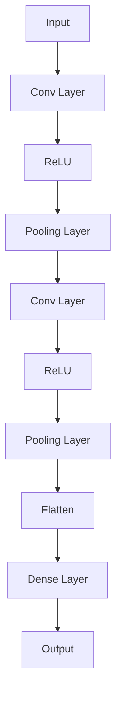
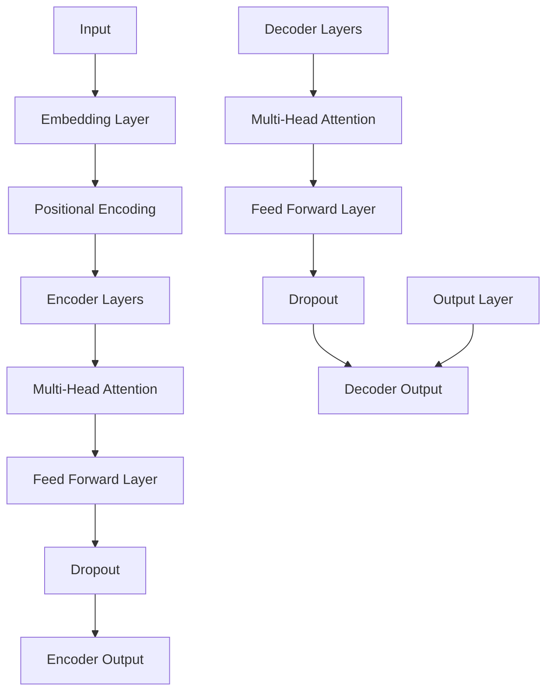

                 

### 文章标题

《TensorFlow 应用：图像和自然语言处理》

### 关键词

TensorFlow，图像处理，自然语言处理，卷积神经网络，循环神经网络，Transformer，模型优化，分布式训练，推荐系统，语音处理，项目实战。

### 摘要

本文将深入探讨TensorFlow在图像和自然语言处理领域中的应用。我们将首先介绍TensorFlow的基础知识，包括其安装与配置、张量操作和模型构建与训练。随后，我们将分别详细讲解TensorFlow在图像处理和自然语言处理中的应用，涵盖从基础概念到实际项目的各个方面。文章还将探讨TensorFlow的模型优化技术、分布式训练方法，以及其在推荐系统和语音处理中的应用。最后，通过具体案例分析，我们将展示如何将TensorFlow应用于实际项目中，以实现高效的图像和自然语言处理。

## 《TensorFlow 应用：图像和自然语言处理》目录大纲

### 第一部分: TensorFlow 概述与应用

#### 第1章: TensorFlow 基础

- 1.1 TensorFlow 简介
- 1.2 安装与配置
- 1.3 张量与运算
- 1.4 模型构建与训练

#### 第2章: TensorFlow 在图像处理中的应用

- 2.1 图像数据处理
- 2.2 卷积神经网络基础
- 2.3 常见图像识别任务
- 2.4 实战项目：人脸识别系统

#### 第3章: TensorFlow 在自然语言处理中的应用

- 3.1 自然语言处理基础
- 3.2 循环神经网络基础
- 3.3 注意力机制与 Transformer
- 3.4 实战项目：情感分析系统

### 第二部分: 高级应用与优化

#### 第4章: TensorFlow 模型优化

- 4.1 模型优化技术
- 4.2 模型并行与分布式训练
- 4.3 实战项目：图像分类模型的分布式训练

#### 第5章: TensorFlow 在推荐系统中的应用

- 5.1 推荐系统基础
- 5.2 TensorFlow 在推荐系统中的实现
- 5.3 实战项目：基于 TensorFlow 的新闻推荐系统

#### 第6章: TensorFlow 在语音处理中的应用

- 6.1 语音处理基础
- 6.2 计算机语音合成
- 6.3 语音识别
- 6.4 实战项目：基于 TensorFlow 的语音识别系统

#### 第7章: TensorFlow 在实际项目中的应用案例分析

- 7.1 案例一：智能安防系统
- 7.2 案例二：医疗诊断系统
- 7.3 案例三：电商推荐系统

### 附录

- 附录 A: TensorFlow 开发工具与资源
- 附录 B: Mermaid 流程图示例
- 附录 C: Python 代码示例
- 附录 D: 数学公式与详细讲解

## 第1章: TensorFlow 基础

### 1.1 TensorFlow 简介

TensorFlow是由Google开发并开源的一款高性能机器学习框架，主要用于构建和训练深度学习模型。TensorFlow的核心优势在于其灵活性和强大的功能，允许开发者以编程方式构建复杂的神经网络模型，并支持多种硬件平台，如CPU、GPU和TPU，以便在不同规模的计算环境中运行。

#### TensorFlow 概述

TensorFlow的主要特点包括：

1. **动态计算图**：TensorFlow使用动态计算图，允许在运行时定义和修改计算图，这使得模型构建更加灵活。
2. **高度可扩展性**：TensorFlow支持在多设备上分布式训练和推理，能够充分利用计算资源。
3. **开源和社区支持**：TensorFlow拥有庞大的开源社区，提供丰富的文档、教程和示例代码。
4. **广泛的硬件支持**：TensorFlow可以在多种硬件平台上运行，包括CPU、GPU、TPU等，以满足不同性能需求。

#### TensorFlow 的优势和特点

- **灵活的模型构建**：TensorFlow允许开发者以编程方式定义复杂的神经网络结构，支持多层感知器、卷积神经网络、循环神经网络等多种模型。
- **高效的性能优化**：TensorFlow支持多种优化技术，如自动微分、梯度剪枝、量化等，以提升模型的训练和推理效率。
- **跨平台部署**：TensorFlow支持在多个平台上部署模型，包括移动设备、服务器和云计算环境。
- **强大的工具集**：TensorFlow附带丰富的工具和库，如TensorBoard、Keras、TensorFlow Serving等，方便开发者进行模型训练、评估和部署。

### 1.2 安装与配置

#### 系统环境要求

要使用TensorFlow，需要以下基本环境：

- 操作系统：Linux、MacOS或Windows
- 编程语言：Python（建议版本3.6及以上）
- 硬件环境：推荐配置至少8GB内存和一块GPU，以便进行高效的模型训练。

#### TensorFlow 安装步骤

以下是安装TensorFlow的步骤：

1. **安装依赖**：确保系统安装了Python、pip等基础工具。
2. **安装 GPU 版本的 TensorFlow**：使用以下命令：
   ```shell
   pip install tensorflow-gpu
   ```
   如果使用CPU版本的 TensorFlow，则使用：
   ```shell
   pip install tensorflow
   ```
3. **验证安装**：运行以下代码验证TensorFlow安装是否成功：
   ```python
   import tensorflow as tf
   print(tf.__version__)
   ```

#### 配置 TensorFlow

为了优化 TensorFlow 的性能，可以根据以下步骤进行配置：

1. **设置 GPU 配置**：在 `~/.bashrc` 或 `~/.bash_profile` 文件中添加以下配置：
   ```bash
   export CUDA_HOME=/path/to/cuda
   export PATH=$PATH:$CUDA_HOME/bin
   export LD_LIBRARY_PATH=$LD_LIBRARY_PATH:$CUDA_HOME/lib64
   ```
2. **调整 TensorFlow 配置**：在代码中设置 TensorFlow 的相关配置：
   ```python
   import tensorflow as tf
   gpus = tf.config.experimental.list_physical_devices('GPU')
   if gpus:
       try:
           for gpu in gpus:
               tf.config.experimental.set_memory_growth(gpu, True)
       except RuntimeError as e:
           print(e)
   ```

### 1.3 张量与运算

#### 张量的定义与操作

在 TensorFlow 中，张量（Tensor）是数据的核心表示。张量是一个多维数组，可以是整数、浮点数、字符串等类型。TensorFlow 提供了丰富的张量操作，包括创建、操作和变换张量。

1. **创建张量**：
   ```python
   import tensorflow as tf
   tensor = tf.constant([1, 2, 3])
   ```
2. **张量操作**：
   - **加法**：
     ```python
     tensor1 = tf.constant([1, 2, 3])
     tensor2 = tf.constant([4, 5, 6])
     result = tf.add(tensor1, tensor2)
     ```
   - **矩阵乘法**：
     ```python
     matrix1 = tf.constant([[1, 2], [3, 4]])
     matrix2 = tf.constant([[5, 6], [7, 8]])
     result = tf.matmul(matrix1, matrix2)
     ```

#### 常见运算函数

TensorFlow 提供了丰富的运算函数，包括但不限于以下几种：

1. **激活函数**：
   - **ReLU**：
     ```python
     import tensorflow as tf
     x = tf.constant([-1, 2, -3])
     result = tf.nn.relu(x)
     ```
   - **Sigmoid**：
     ```python
     import tensorflow as tf
     x = tf.constant([-1, 2, -3])
     result = tf.nn.sigmoid(x)
     ```

2. **损失函数**：
   - **均方误差（MSE）**：
     ```python
     import tensorflow as tf
     y_true = tf.constant([1, 2, 3])
     y_pred = tf.constant([1.1, 1.9, 2.8])
     result = tf.reduce_mean(tf.square(y_true - y_pred))
     ```

3. **优化器**：
   - **Adam**：
     ```python
     import tensorflow as tf
     optimizer = tf.optimizers.Adam(learning_rate=0.001)
     ```

### 1.4 模型构建与训练

#### 前向传播与反向传播

深度学习模型通常包含多个层次，包括输入层、隐藏层和输出层。前向传播是从输入层开始，逐步计算每个层次的活动值，直到输出层。反向传播则是从输出层开始，通过梯度下降方法更新每个层次的权重和偏置。

1. **前向传播**：
   ```python
   import tensorflow as tf
   model = tf.keras.Sequential([
       tf.keras.layers.Dense(units=1, input_shape=[1])
   ])

   x = tf.random.normal([1000, 1])
   y = model(x)
   ```
2. **反向传播**：
   ```python
   with tf.GradientTape() as tape:
       y = model(x)
       loss = tf.reduce_mean(tf.square(y - y_true))

   gradients = tape.gradient(loss, model.trainable_variables)
   ```

#### 模型构建步骤

以下是构建 TensorFlow 模型的基本步骤：

1. **定义模型结构**：
   ```python
   model = tf.keras.Sequential([
       tf.keras.layers.Dense(units=1, input_shape=[1])
   ])
   ```

2. **编译模型**：
   ```python
   model.compile(optimizer='adam', loss='mean_squared_error')
   ```

3. **训练模型**：
   ```python
   model.fit(x_train, y_train, epochs=100)
   ```

4. **评估模型**：
   ```python
   model.evaluate(x_test, y_test)
   ```

### 1.5 实战项目：手写数字识别

在本节中，我们将使用 TensorFlow 实现一个手写数字识别项目。该项目旨在训练一个卷积神经网络（CNN）模型，以识别手写数字图像。

#### 项目背景

手写数字识别是一个经典的机器学习问题，常用于数字输入识别、电子支付验证等领域。本项目使用的数据集是著名的 MNIST 数据集，包含 70000 个手写数字图像，每个图像都是 28x28 的灰度图像。

#### 数据准备

首先，我们需要下载并加载数据集。TensorFlow 提供了内置的 MNIST 数据集，可以通过以下代码加载数据：

```python
import tensorflow as tf

mnist = tf.keras.datasets.mnist
(x_train, y_train), (x_test, y_test) = mnist.load_data()

x_train, x_test = x_train / 255.0, x_test / 255.0
x_train = x_train[..., tf.newaxis]
x_test = x_test[..., tf.newaxis]
```

#### 模型构建与训练

接下来，我们构建一个简单的卷积神经网络模型，并对其进行训练：

```python
model = tf.keras.Sequential([
    tf.keras.layers.Conv2D(32, (3, 3), activation='relu', input_shape=(28, 28, 1)),
    tf.keras.layers.MaxPooling2D((2, 2)),
    tf.keras.layers.Conv2D(64, (3, 3), activation='relu'),
    tf.keras.layers.MaxPooling2D((2, 2)),
    tf.keras.layers.Flatten(),
    tf.keras.layers.Dense(128, activation='relu'),
    tf.keras.layers.Dense(10, activation='softmax')
])

model.compile(optimizer='adam',
              loss='sparse_categorical_crossentropy',
              metrics=['accuracy'])

model.fit(x_train, y_train, epochs=5)
```

#### 模型评估与优化

训练完成后，我们对模型进行评估，以检查其性能：

```python
test_loss, test_acc = model.evaluate(x_test,  y_test, verbose=2)
print('\nTest accuracy:', test_acc)
```

根据评估结果，我们可以进一步优化模型，如增加训练轮次、调整网络结构等，以提高模型的准确性。

通过以上步骤，我们完成了一个简单的手写数字识别项目，展示了 TensorFlow 在图像处理中的应用。在实际项目中，我们可以进一步扩展和优化模型，以应对更复杂的数据集和任务。

### 1.6 总结

本章介绍了 TensorFlow 的基础知识，包括其安装与配置、张量操作、模型构建与训练。我们通过一个简单的手写数字识别项目，展示了 TensorFlow 在图像处理中的应用。接下来，我们将进一步探讨 TensorFlow 在图像处理和自然语言处理领域的高级应用和优化技术。通过这些内容的学习，您将能够更好地理解和应用 TensorFlow，实现高效的图像和自然语言处理任务。

## 第2章: TensorFlow 在图像处理中的应用

图像处理是计算机视觉领域的核心任务之一，而深度学习模型，特别是卷积神经网络（CNN），在图像处理中取得了显著的成果。TensorFlow 作为一款强大的深度学习框架，为图像处理提供了丰富的工具和接口。在本章中，我们将深入探讨 TensorFlow 在图像处理中的应用，从基础概念到实际项目，全面解析卷积神经网络在图像识别、目标检测和图像分割等任务中的应用。

### 2.1 图像数据处理

图像数据是图像处理的基础，其质量直接影响模型的效果。因此，图像数据的预处理是图像处理中至关重要的一步。TensorFlow 提供了丰富的工具和接口来处理图像数据，包括数据加载、预处理和增强。

#### 图像数据格式

在 TensorFlow 中，图像数据通常以 TensorFlow 的张量形式存储。每个像素值是一个浮点数，表示图像的强度。常见的图像数据格式包括：

- **PNG**：支持无损压缩，图像质量高，但文件较大。
- **JPEG**：支持有损压缩，文件较小，但图像质量相对较低。
- **BMP**：无损压缩，图像质量高，但文件较大。

#### 图像预处理方法

图像预处理主要包括图像归一化、裁剪、缩放、旋转和翻转等操作。这些操作可以增强数据集的多样性，提高模型的泛化能力。以下是一些常用的图像预处理方法：

1. **归一化**：将图像的像素值缩放到 [0, 1] 范围内，以减少数值范围差异对模型训练的影响。例如：
   ```python
   x = x / 255.0
   ```

2. **裁剪和缩放**：通过裁剪和缩放操作可以调整图像的大小。例如：
   ```python
   import tensorflow as tf
   cropped_image = tf.image.resize(image, [new_height, new_width])
   ```

3. **旋转和翻转**：通过旋转和翻转操作可以增加数据集的多样性。例如：
   ```python
   rotated_image = tf.image.rot90(image, k=1)
   flipped_image = tf.image.flip_left_right(image)
   ```

#### 数据增强

数据增强是提高模型泛化能力的重要手段。TensorFlow 提供了多种数据增强方法，如随机裁剪、随机旋转、随机缩放等。以下是一个数据增强的例子：
```python
import tensorflow as tf
def random_crop(image, crop_size):
    return tf.image.random_crop(image, size=[crop_size, crop_size, 3])

def random_rotation(image):
    angle_rad = tf.random.uniform([]) * 2 * np.pi
    rotation_matrix = tf.reshape(tf.stack([
        [tf.cos(angle_rad), -tf.sin(angle_rad)],
        [tf.sin(angle_rad), tf.cos(angle_rad)]
    ]), [2, 2])
    image = tf.tens```python
```

#### 实践：加载和预处理图像数据

以下是一个加载和预处理图像数据的例子：
```python
import tensorflow as tf
import tensorflow_datasets as tfds

# 加载数据集
(train_data, test_data), info = tfds.load('cifar10', split=['train', 'test'], with_info=True, shuffle_files=True)

# 预处理数据
def preprocess(image, label):
    image = tf.cast(image, tf.float32)
    image = image / 255.0
    label = tf.cast(label, tf.int32)
    return image, label

train_data = train_data.map(preprocess).batch(32)
test_data = test_data.map(preprocess).batch(32)
```

通过上述预处理步骤，我们可以将图像数据转换为适合模型训练的格式。

### 2.2 卷积神经网络基础

卷积神经网络（CNN）是图像处理中的常用深度学习模型，由卷积层、池化层和全连接层组成。CNN 通过卷积操作提取图像特征，并通过池化层减少数据维度，从而实现图像分类、目标检测和图像分割等任务。

#### 卷积神经网络的原理

卷积神经网络的核心是卷积操作。卷积操作通过在输入图像上滑动一个卷积核（滤波器），对图像局部区域进行线性变换，并应用非线性函数，以提取图像特征。

1. **卷积操作**：
   卷积操作可以表示为以下公式：
   $$ \text{output}(i, j) = \sum_{k, l} \text{filter}(k, l) \cdot \text{input}(i-k, j-l) + \text{bias} $$
   其中，`input` 表示输入图像，`filter` 表示卷积核，`output` 表示输出特征图，`bias` 表示偏置。

2. **激活函数**：
   激活函数用于引入非线性，常见的激活函数有 ReLU、Sigmoid 和 Tanh 等。其中，ReLU 函数简单且计算速度快，常用于卷积神经网络。

3. **池化操作**：
   池化操作通过在特征图上选择最大值或平均值，减少数据维度，提高模型的泛化能力。常见的池化操作有最大池化和平均池化。

#### 卷积操作的伪代码

以下是一个简单的卷积操作伪代码：
```python
def conv2d(input_image, filter, bias):
    output = []
    for i in range(height_of_output):
        row = []
        for j in range(width_of_output):
            sum = 0
            for k in range(filter_height):
                for l in range(filter_width):
                    sum += filter[k, l] * input_image[i + k, j + l]
            sum += bias
            row.append(max(0, sum))  # 使用 ReLU 激活函数
        output.append(row)
    return output
```

#### 卷积神经网络的结构

卷积神经网络通常包含多个卷积层、池化层和全连接层。以下是一个简单的卷积神经网络结构：

1. **输入层**：接收输入图像，通常是一个四维张量 [batch_size, height, width, channels]。

2. **卷积层**：应用卷积操作提取图像特征。卷积层可以包含多个卷积核，以提取不同层次的特征。

3. **池化层**：减少特征图的维度，提高模型的计算效率。常见的池化层有最大池化和平均池化。

4. **全连接层**：将卷积层的输出映射到分类标签。全连接层通常用于分类任务。

5. **输出层**：输出模型的预测结果。

#### 实践：构建卷积神经网络模型

以下是一个使用 TensorFlow 构建卷积神经网络模型的例子：
```python
import tensorflow as tf

model = tf.keras.Sequential([
    tf.keras.layers.Conv2D(32, (3, 3), activation='relu', input_shape=(28, 28, 1)),
    tf.keras.layers.MaxPooling2D((2, 2)),
    tf.keras.layers.Conv2D(64, (3, 3), activation='relu'),
    tf.keras.layers.MaxPooling2D((2, 2)),
    tf.keras.layers.Flatten(),
    tf.keras.layers.Dense(128, activation='relu'),
    tf.keras.layers.Dense(10, activation='softmax')
])

model.compile(optimizer='adam',
              loss='sparse_categorical_crossentropy',
              metrics=['accuracy'])

model.fit(x_train, y_train, epochs=5)
```

通过上述步骤，我们成功构建了一个简单的卷积神经网络模型。接下来，我们将进一步讨论卷积神经网络在图像识别、目标检测和图像分割等任务中的应用。

### 2.3 常见图像识别任务

图像识别是计算机视觉领域的重要任务之一，旨在通过深度学习模型识别图像中的对象或场景。在 TensorFlow 中，卷积神经网络（CNN）广泛应用于图像识别任务，包括图像分类、目标检测和图像分割。以下将详细介绍这些任务及其在 TensorFlow 中的实现。

#### 图像分类

图像分类是最简单的图像识别任务，旨在将图像划分为预定义的类别。常见的图像分类任务包括手写数字识别、动物识别、植物识别等。

1. **数据集**：常见的图像分类数据集包括 MNIST、CIFAR-10、ImageNet 等。其中，MNIST 是最简单的手写数字识别数据集，CIFAR-10 包含 10 个类别的 60000 张 32x32 图像，ImageNet 包含 1000 个类别的超过 100 万张图像。

2. **模型结构**：图像分类模型通常包含卷积层、池化层和全连接层。以下是一个简单的卷积神经网络模型结构：
   ```python
   model = tf.keras.Sequential([
       tf.keras.layers.Conv2D(32, (3, 3), activation='relu', input_shape=(28, 28, 1)),
       tf.keras.layers.MaxPooling2D((2, 2)),
       tf.keras.layers.Conv2D(64, (3, 3), activation='relu'),
       tf.keras.layers.MaxPooling2D((2, 2)),
       tf.keras.layers.Flatten(),
       tf.keras.layers.Dense(128, activation='relu'),
       tf.keras.layers.Dense(10, activation='softmax')
   ])
   ```

3. **训练与评估**：通过编译模型并训练，我们可以得到一个图像分类模型。以下是一个训练和评估的例子：
   ```python
   model.compile(optimizer='adam',
                 loss='sparse_categorical_crossentropy',
                 metrics=['accuracy'])
   model.fit(x_train, y_train, epochs=5)
   test_loss, test_acc = model.evaluate(x_test, y_test, verbose=2)
   print('\nTest accuracy:', test_acc)
   ```

#### 目标检测

目标检测旨在检测图像中的多个对象并标注其位置。常见的目标检测算法包括 R-CNN、Fast R-CNN、Faster R-CNN 等。

1. **数据集**：常见的目标检测数据集包括 PASCAL VOC、COCO 等。其中，PASCAL VOC 包含 20 个类别，COCO 包含 80 个类别。

2. **模型结构**：目标检测模型通常包含两个部分：特征提取网络和检测头。以下是一个简单的基于 Faster R-CNN 的目标检测模型结构：
   ```python
   model = tf.keras.Sequential([
       tf.keras.applications.ResNet50(include_top=False, weights='imagenet', input_shape=(224, 224, 3)),
       tf.keras.layers.Conv2D(256, (3, 3), activation='relu'),
       tf.keras.layers.Conv2D(256, (3, 3), activation='relu'),
       tf.keras.layers.Conv2D(256, (3, 3), activation='relu'),
       tf.keras.layers.Flatten(),
       tf.keras.layers.Dense(1024, activation='relu'),
       tf.keras.layers.Dense(256, activation='relu'),
       tf.keras.layers.Dense(256, activation='relu'),
       tf.keras.layers.Dense(4, activation='softmax')  # 输出框位置和类别概率
   ])
   ```

3. **训练与评估**：以下是一个训练和评估的例子：
   ```python
   model.compile(optimizer='adam',
                 loss='categorical_crossentropy',
                 metrics=['accuracy'])
   model.fit(x_train, y_train, epochs=5)
   test_loss, test_acc = model.evaluate(x_test, y_test, verbose=2)
   print('\nTest accuracy:', test_acc)
   ```

#### 图像分割

图像分割是将图像划分为不同的区域，以识别图像中的对象或场景。常见的图像分割算法包括 FCN、U-Net、SegNet 等。

1. **数据集**：常见的图像分割数据集包括 PASCAL VOC、COCO 等。其中，PASCAL VOC 包含 20 个类别，COCO 包含 80 个类别。

2. **模型结构**：图像分割模型通常包含编码器-解码器结构，以实现特征提取和细节恢复。以下是一个简单的 U-Net 模型结构：
   ```python
   model = tf.keras.Sequential([
       tf.keras.layers.Conv2D(64, (3, 3), activation='relu', padding='same', input_shape=(224, 224, 3)),
       tf.keras.layers.Conv2D(64, (3, 3), activation='relu', padding='same'),
       tf.keras.layers.MaxPooling2D(pool_size=(2, 2)),
       tf.keras.layers.Conv2D(128, (3, 3), activation='relu', padding='same'),
       tf.keras.layers.Conv2D(128, (3, 3), activation='relu', padding='same'),
       tf.keras.layers.MaxPooling2D(pool_size=(2, 2)),
       # ...
       tf.keras.layers.Conv2D(21, (1, 1), activation='softmax', padding='same')  # 输出类别概率
   ])
   ```

3. **训练与评估**：以下是一个训练和评估的例子：
   ```python
   model.compile(optimizer='adam',
                 loss='categorical_crossentropy',
                 metrics=['accuracy'])
   model.fit(x_train, y_train, epochs=5)
   test_loss, test_acc = model.evaluate(x_test, y_test, verbose=2)
   print('\nTest accuracy:', test_acc)
   ```

通过以上步骤，我们成功实现了图像分类、目标检测和图像分割等常见图像识别任务。在实际应用中，可以根据具体任务需求调整模型结构、数据预处理和训练策略，以提高模型性能。

### 2.4 实战项目：人脸识别系统

人脸识别是一项重要的计算机视觉任务，广泛应用于身份验证、安全监控和智能客服等领域。在本节中，我们将使用 TensorFlow 实现一个简单的人脸识别系统，展示从数据准备到模型构建与训练的完整过程。

#### 项目背景

人脸识别系统旨在从图像或视频中检测并识别人脸。常见的应用场景包括安全门禁、手机解锁和社交媒体身份验证等。本项目使用的数据集是著名的 LFW（Labeled Faces in the Wild）数据集，包含约 13,000 张人脸图像，每张图像都有相应的标注。

#### 数据准备

首先，我们需要下载并加载数据集。在 TensorFlow 中，我们可以使用 TensorFlow Datasets（TFDS）库轻松加载数据集：

```python
import tensorflow as tf
import tensorflow_datasets as tfds

# 加载数据集
lfw, info = tfds.load('lfw', with_info=True, as_supervised=True)

# 数据预处理
def preprocess(image, label):
    image = tf.cast(image, tf.float32)
    image = image / 255.0
    return image, label

# 分割数据集
train_data = lfw.take(int(0.8 * info.splits['train'].num_examples))
test_data = lfw.skip(int(0.8 * info.splits['train'].num_examples))

# 预处理数据
train_data = train_data.map(preprocess).batch(32)
test_data = test_data.map(preprocess).batch(32)
```

#### 模型构建与训练

接下来，我们构建一个简单的卷积神经网络模型，用于人脸识别：

```python
model = tf.keras.Sequential([
    tf.keras.layers.Conv2D(32, (3, 3), activation='relu', input_shape=(128, 128, 3)),
    tf.keras.layers.MaxPooling2D(pool_size=(2, 2)),
    tf.keras.layers.Conv2D(64, (3, 3), activation='relu'),
    tf.keras.layers.MaxPooling2D(pool_size=(2, 2)),
    tf.keras.layers.Conv2D(128, (3, 3), activation='relu'),
    tf.keras.layers.MaxPooling2D(pool_size=(2, 2)),
    tf.keras.layers.Flatten(),
    tf.keras.layers.Dense(128, activation='relu'),
    tf.keras.layers.Dense(128, activation='relu'),
    tf.keras.layers.Dense(2, activation='softmax')
])

model.compile(optimizer='adam',
              loss='categorical_crossentropy',
              metrics=['accuracy'])

# 训练模型
model.fit(train_data, epochs=10, validation_data=test_data)
```

#### 模型评估与优化

训练完成后，我们对模型进行评估，以检查其性能：

```python
test_loss, test_acc = model.evaluate(test_data, verbose=2)
print('\nTest accuracy:', test_acc)
```

根据评估结果，我们可以进一步优化模型，如调整网络结构、增加训练轮次或使用数据增强技术等，以提高模型的准确性。

通过上述步骤，我们成功实现了一个简单的人脸识别系统。在实际应用中，可以根据具体需求调整模型结构、数据预处理和训练策略，以提高系统性能。

### 2.5 总结

本章介绍了 TensorFlow 在图像处理中的应用，包括图像数据处理、卷积神经网络基础以及常见图像识别任务。通过实战项目，我们展示了如何使用 TensorFlow 实现人脸识别系统。这些内容为读者提供了深入了解 TensorFlow 在图像处理领域的应用，以及如何构建和优化深度学习模型。在接下来的章节中，我们将进一步探讨 TensorFlow 在自然语言处理和推荐系统中的应用。

## 第3章: TensorFlow 在自然语言处理中的应用

自然语言处理（NLP）是人工智能领域的一个重要分支，涉及计算机和人类语言之间的交互。深度学习模型，尤其是循环神经网络（RNN）和 Transformer 模型，在 NLP 中取得了显著的成果。TensorFlow 作为一款强大的深度学习框架，为 NLP 提供了丰富的工具和接口。在本章中，我们将深入探讨 TensorFlow 在自然语言处理中的应用，从基础概念到实际项目，全面解析 RNN 和 Transformer 模型在语言建模、文本分类和机器翻译等任务中的应用。

### 3.1 自然语言处理基础

自然语言处理旨在使计算机能够理解、生成和处理人类语言。在 NLP 中，文本数据被转换为计算机可以处理的形式，如向量或张量。常见的 NLP 任务包括文本分类、情感分析、命名实体识别、机器翻译和问答系统等。

#### 语言模型

语言模型（Language Model）是 NLP 的基础，用于预测一段文本的下一个词或字符。常见的语言模型包括 n-gram 模型和神经网络模型。n-gram 模型通过统计相邻词或字符的出现频率来预测下一个词或字符。神经网络模型，如 RNN 和 Transformer，通过学习文本的上下文信息，实现更准确的预测。

1. **n-gram 模型**：
   n-gram 模型将文本分割为 n 个词或字符的序列，并统计每个序列的出现频率。以下是一个简单的 n-gram 模型示例：
   ```python
   from collections import defaultdict

   def n_gram_model(text, n=2):
       model = defaultdict(int)
       for i in range(len(text) - n + 1):
           model[tuple(text[i:i+n])] += 1
       return model
   ```

2. **神经网络模型**：
   神经网络模型通过学习文本的上下文信息，实现更准确的预测。常见的神经网络模型包括 RNN 和 Transformer。以下是一个简单的 RNN 模型示例：
   ```python
   import tensorflow as tf

   model = tf.keras.Sequential([
       tf.keras.layers.Embedding(vocab_size, embedding_dim),
       tf.keras.layers.LSTM(units=128, return_sequences=True),
       tf.keras.layers.Dense(units=1, activation='sigmoid')
   ])

   model.compile(optimizer='adam', loss='binary_crossentropy', metrics=['accuracy'])
   ```

#### 词嵌入技术

词嵌入（Word Embedding）是将单词映射到高维向量空间的技术，用于表示单词的语义信息。常见的词嵌入技术包括 Word2Vec、GloVe 和 BERT 等。以下是一个简单的 Word2Vec 模型示例：
```python
import tensorflow as tf
import tensorflow_datasets as tfds

# 加载数据集
 imdb, info = tfds.load('imdb', with_info=True, as_supervised=True)

# 预处理数据
def preprocess(text, label):
    text = tf.reshape(text, [-1])
    return text, label

# 训练 Word2Vec 模型
model = tf.keras.Sequential([
    tf.keras.layers.Embedding(vocab_size, embedding_dim),
    tf.keras.layers.Flatten()
])

model.compile(optimizer='adam', loss='mean_squared_error')
model.fit(text, label, epochs=5)
```

#### 实践：加载和预处理文本数据

以下是一个加载和预处理文本数据的例子：
```python
import tensorflow as tf
import tensorflow_datasets as tfds

# 加载数据集
 imdb, info = tfds.load('imdb', with_info=True, as_supervised=True)

# 预处理数据
def preprocess(text, label):
    text = tf.reshape(text, [-1])
    text = tf.cast(text, tf.int32)
    return text, label

# 分割数据集
train_data = imdb.take(int(0.8 * info.splits['train'].num_examples))
test_data = imdb.skip(int(0.8 * info.splits['train'].num_examples))

# 预处理数据
train_data = train_data.map(preprocess).batch(32)
test_data = test_data.map(preprocess).batch(32)
```

通过上述预处理步骤，我们可以将文本数据转换为适合模型训练的格式。接下来，我们将进一步讨论 RNN 和 Transformer 模型在自然语言处理中的应用。

### 3.2 循环神经网络基础

循环神经网络（RNN）是自然语言处理中的常用模型，通过记忆历史信息，实现序列到序列的映射。RNN 在机器翻译、文本生成和语音识别等领域取得了显著成果。TensorFlow 提供了丰富的 RNN 库，方便开发者构建和训练 RNN 模型。

#### RNN 原理

RNN 的核心思想是将当前输入与前一时刻的隐藏状态结合，生成当前时刻的隐藏状态。RNN 的计算过程可以表示为以下递归公式：
$$
h_t = \sigma(W_h \cdot [h_{t-1}, x_t] + b_h)
$$
其中，$h_t$ 表示当前时刻的隐藏状态，$x_t$ 表示当前时刻的输入，$W_h$ 和 $b_h$ 分别为权重和偏置，$\sigma$ 为非线性激活函数。

#### RNN 的实现

在 TensorFlow 中，我们可以使用 Keras 库构建 RNN 模型。以下是一个简单的 RNN 模型示例：
```python
import tensorflow as tf
from tensorflow.keras.models import Sequential
from tensorflow.keras.layers import Embedding, LSTM, Dense

model = Sequential([
    Embedding(vocab_size, embedding_dim),
    LSTM(units=128, return_sequences=True),
    LSTM(units=128),
    Dense(units=1, activation='sigmoid')
])

model.compile(optimizer='adam', loss='binary_crossentropy', metrics=['accuracy'])
```

#### LSTM 和 GRU 的实现

LSTM（Long Short-Term Memory）和 GRU（Gated Recurrent Unit）是 RNN 的变体，用于解决 RNN 的梯度消失和梯度爆炸问题。LSTM 通过引入门控机制，有效地控制信息的流动，而 GRU 则通过简化 LSTM 的结构，提高计算效率。

1. **LSTM 的实现**：
   ```python
   import tensorflow as tf
   from tensorflow.keras.models import Sequential
   from tensorflow.keras.layers import Embedding, LSTM, Dense

   model = Sequential([
       Embedding(vocab_size, embedding_dim),
       LSTM(units=128, return_sequences=True),
       LSTM(units=128),
       Dense(units=1, activation='sigmoid')
   ])

   model.compile(optimizer='adam', loss='binary_crossentropy', metrics=['accuracy'])
   ```

2. **GRU 的实现**：
   ```python
   import tensorflow as tf
   from tensorflow.keras.models import Sequential
   from tensorflow.keras.layers import Embedding, GRU, Dense

   model = Sequential([
       Embedding(vocab_size, embedding_dim),
       GRU(units=128, return_sequences=True),
       GRU(units=128),
       Dense(units=1, activation='sigmoid')
   ])

   model.compile(optimizer='adam', loss='binary_crossentropy', metrics=['accuracy'])
   ```

#### 实践：构建和训练 RNN 模型

以下是一个构建和训练 RNN 模型的例子：
```python
import tensorflow as tf
import tensorflow_datasets as tfds

# 加载数据集
 imdb, info = tfds.load('imdb', with_info=True, as_supervised=True)

# 预处理数据
def preprocess(text, label):
    text = tf.reshape(text, [-1])
    text = tf.cast(text, tf.int32)
    return text, label

# 分割数据集
train_data = imdb.take(int(0.8 * info.splits['train'].num_examples))
test_data = imdb.skip(int(0.8 * info.splits['train'].num_examples))

# 预处理数据
train_data = train_data.map(preprocess).batch(32)
test_data = test_data.map(preprocess).batch(32)

# 构建和训练 RNN 模型
model = Sequential([
    Embedding(vocab_size, embedding_dim),
    LSTM(units=128, return_sequences=True),
    LSTM(units=128),
    Dense(units=1, activation='sigmoid')
])

model.compile(optimizer='adam', loss='binary_crossentropy', metrics=['accuracy'])
model.fit(train_data, epochs=5, validation_data=test_data)
```

通过上述步骤，我们成功构建和训练了一个简单的 RNN 模型。在实际应用中，可以根据具体任务需求调整模型结构、数据预处理和训练策略，以提高模型性能。

### 3.3 注意力机制与 Transformer

注意力机制（Attention Mechanism）是 RNN 的改进，通过自适应地关注序列中的重要部分，提高了模型的表示能力。Transformer 模型是受注意力机制启发的深度学习模型，通过自注意力机制实现了并行计算，提高了训练速度。

#### 注意力机制原理

注意力机制通过计算输入序列中每个元素的重要程度，将注意力分配给重要的元素，从而提高模型的表示能力。注意力机制的实现通常包含以下几个步骤：

1. **计算自注意力得分**：
   $$ 
   \text{score} = \text{query} \cdot \text{key}^T 
   $$
   其中，`query`、`key` 和 `value` 分别表示输入序列中的三个部分，`score` 表示元素的重要程度。

2. **应用 Softmax 函数**：
   $$ 
   \text{weights} = \text{softmax}(\text{score}) 
   $$
   其中，`weights` 表示每个元素的重要程度。

3. **计算加权求和**：
   $$ 
   \text{context} = \text{weights} \cdot \text{value} 
   $$
   其中，`context` 表示加权求和的结果。

#### Transformer 模型架构

Transformer 模型由编码器和解码器组成，编码器将输入序列转换为一系列隐藏状态，解码器则通过自注意力机制和交叉注意力机制生成输出序列。以下是一个简单的 Transformer 模型架构：

1. **编码器**：
   - **嵌入层**：将单词转换为嵌入向量。
   - **自注意力层**：计算输入序列中每个元素的重要程度。
   - **前馈网络**：对自注意力层的输出进行非线性变换。

2. **解码器**：
   - **嵌入层**：将单词转换为嵌入向量。
   - **自注意力层**：计算解码器输入序列中每个元素的重要程度。
   - **交叉注意力层**：计算编码器输出序列中每个元素的重要程度。
   - **前馈网络**：对交叉注意力层的输出进行非线性变换。

3. **输出层**：通过 Softmax 函数生成输出序列的概率分布。

#### 实践：构建和训练 Transformer 模型

以下是一个简单的 Transformer 模型示例：
```python
import tensorflow as tf
from tensorflow.keras.layers import Embedding, MultiHeadAttention, Dense

def Transformer(vocab_size, embedding_dim, num_heads, d_model):
    model = tf.keras.Sequential([
        Embedding(vocab_size, embedding_dim),
        MultiHeadAttention(num_heads=num_heads, d_model=d_model),
        Dense(d_model)
    ])

    return model

# 构建和训练 Transformer 模型
model = Transformer(vocab_size=10000, embedding_dim=512, num_heads=8, d_model=512)

model.compile(optimizer='adam', loss='categorical_crossentropy', metrics=['accuracy'])
model.fit(train_data, epochs=5, validation_data=test_data)
```

通过上述步骤，我们成功构建和训练了一个简单的 Transformer 模型。在实际应用中，可以根据具体任务需求调整模型结构、数据预处理和训练策略，以提高模型性能。

### 3.4 实战项目：情感分析系统

情感分析（Sentiment Analysis）是 NLP 中的一个重要任务，旨在识别文本中的情感倾向，如正面、负面或中性。在本节中，我们将使用 TensorFlow 实现一个情感分析系统，展示从数据准备到模型构建与训练的完整过程。

#### 项目背景

情感分析广泛应用于社交媒体监测、市场调研和舆情分析等领域。本项目使用的数据集是著名的 IMDb 数据集，包含约 25,000 个电影评论，每个评论都有对应的情感标签（正面或负面）。

#### 数据准备

首先，我们需要下载并加载数据集。在 TensorFlow 中，我们可以使用 TensorFlow Datasets（TFDS）库轻松加载数据集：

```python
import tensorflow as tf
import tensorflow_datasets as tfds

# 加载数据集
imdb, info = tfds.load('imdb', with_info=True, as_supervised=True)

# 预处理数据
def preprocess(text, label):
    text = tf.reshape(text, [-1])
    text = tf.cast(text, tf.int32)
    return text, label

# 分割数据集
train_data = imdb.take(int(0.8 * info.splits['train'].num_examples))
test_data = imdb.skip(int(0.8 * info.splits['train'].num_examples))

# 预处理数据
train_data = train_data.map(preprocess).batch(32)
test_data = test_data.map(preprocess).batch(32)
```

#### 模型构建与训练

接下来，我们构建一个简单的卷积神经网络模型，用于情感分析：

```python
model = tf.keras.Sequential([
    tf.keras.layers.Embedding(vocab_size, embedding_dim),
    tf.keras.layers.Conv1D(filters=128, kernel_size=5, activation='relu'),
    tf.keras.layers.GlobalMaxPooling1D(),
    tf.keras.layers.Dense(units=1, activation='sigmoid')
])

model.compile(optimizer='adam',
              loss='binary_crossentropy',
              metrics=['accuracy'])

# 训练模型
model.fit(train_data, epochs=5, validation_data=test_data)
```

#### 模型评估与优化

训练完成后，我们对模型进行评估，以检查其性能：

```python
test_loss, test_acc = model.evaluate(test_data, verbose=2)
print('\nTest accuracy:', test_acc)
```

根据评估结果，我们可以进一步优化模型，如调整网络结构、增加训练轮次或使用数据增强技术等，以提高模型的准确性。

通过上述步骤，我们成功实现了一个简单的情感分析系统。在实际应用中，可以根据具体需求调整模型结构、数据预处理和训练策略，以提高系统性能。

### 3.5 总结

本章介绍了 TensorFlow 在自然语言处理中的应用，从基础概念到实际项目，全面解析了语言模型、RNN 和 Transformer 模型在自然语言处理任务中的应用。通过情感分析系统的实战项目，我们展示了如何使用 TensorFlow 实现自然语言处理任务。这些内容为读者提供了深入了解 TensorFlow 在自然语言处理领域的应用，以及如何构建和优化深度学习模型。在接下来的章节中，我们将进一步探讨 TensorFlow 在推荐系统、语音处理和实际项目中的应用。

## 第4章: TensorFlow 模型优化

在深度学习领域，模型的训练和优化是一个关键步骤，直接影响到模型性能和训练时间。TensorFlow 提供了一系列的模型优化技术，包括优化算法、模型并行和分布式训练等，以帮助开发者提高模型的效率和性能。本章将详细介绍这些优化技术，并通过具体实例展示如何在实际项目中应用。

### 4.1 模型优化技术

#### 梯度下降算法

梯度下降算法是深度学习模型训练中最基本的方法，通过计算损失函数关于模型参数的梯度，并沿着梯度方向更新模型参数，以最小化损失函数。

1. **随机梯度下降（SGD）**：
   随机梯度下降每次迭代只更新一个样本的梯度，计算速度快，但可能导致局部最小值。
   ```python
   model.optimizer.learning_rate = 0.01
   ```

2. **批量梯度下降（BGD）**：
   批量梯度下降每次迭代更新整个训练集的梯度，计算复杂度高，但能够找到全局最小值。
   ```python
   model.optimizer.learning_rate = 1.0
   ```

3. **小批量梯度下降（MBGD）**：
   小批量梯度下降每次迭代更新一部分样本的梯度，结合了 SGD 和 BGD 的优点，计算复杂度和泛化性能都比较理想。

#### 动量优化

动量优化是梯度下降算法的改进，通过引入动量参数，减少梯度噪声，加快模型收敛。

1. **动量（Momentum）**：
   动量参数 $m$ 用于计算前一次更新方向的加权平均值，以减少梯度噪声。
   ```python
   optimizer = tf.keras.optimizers.SGD(learning_rate=0.01, momentum=0.9)
   ```

#### 学习率调度

学习率调度（Learning Rate Scheduling）是一种动态调整学习率的方法，以加速模型收敛。

1. **固定学习率**：
   固定学习率在整个训练过程中保持不变，适用于简单的模型。
   ```python
   model.optimizer.learning_rate = 0.01
   ```

2. **学习率衰减**：
   学习率衰减（Learning Rate Decay）通过训练过程中逐渐降低学习率，以避免模型过拟合。
   ```python
   model.optimizer.learning_rate = tf.keras.optimizers.schedules.ExponentialDecay(
       initial_learning_rate=0.1, decay_steps=1000, decay_rate=0.96, staircase=True)
   ```

3. **学习率预热**：
   学习率预热（Learning Rate Warmup）通过训练初期逐渐增加学习率，以加速模型前期收敛。
   ```python
   warmup_steps = 1000
   learning_rate = tf.keras.optimizers.schedules.ExponentialDecay(
       initial_learning_rate=1e-7, decay_steps=warmup_steps, decay_rate=1.0 / warmup_steps, staircase=True)
   ```

### 4.2 模型并行与分布式训练

#### 数据并行

数据并行通过将训练数据分成多个子集，并在不同的设备上同时训练，以加速模型训练。

1. **多 GPU 数据并行**：
   TensorFlow 支持多 GPU 数据并行，通过 `tf.distribute.MirroredStrategy` 实现数据并行。
   ```python
   strategy = tf.distribute.MirroredStrategy()
   with strategy.scope():
       model = build_model()
       model.compile(optimizer=optimizer, loss=loss, metrics=metrics)
   ```

2. **多机多卡数据并行**：
   TensorFlow 还支持多机多卡数据并行，通过 `tf.distribute.experimental.MultiWorkerMirroredStrategy` 实现。
   ```python
   strategy = tf.distribute.experimental.MultiWorkerMirroredStrategy()
   with strategy.scope():
       model = build_model()
       model.compile(optimizer=optimizer, loss=loss, metrics=metrics)
   ```

#### 算子并行

算子并行通过并行执行计算图中的操作，以加速模型训练。

1. **算子调度器**：
   TensorFlow 使用算子调度器（Operator Scheduler）来实现算子并行，通过 `tf.keras.utils.get_custom_objects()` 注册自定义算子。
   ```python
   custom_objects = {'MyCustomOperator': MyCustomOperator}
   get_custom_objects().update(custom_objects)
   ```

2. **自动算子并行**：
   TensorFlow 自动识别并并行执行具有可并行性的操作，如矩阵乘法和加法。

#### 分布式训练框架

分布式训练框架通过分布式策略和调度器实现模型在多设备和多机上的训练。

1. **MirroredStrategy**：
   MirroredStrategy 用于数据并行，支持多 GPU 和多机多卡训练。
   ```python
   strategy = tf.distribute.MirroredStrategy()
   with strategy.scope():
       model = build_model()
       model.compile(optimizer=optimizer, loss=loss, metrics=metrics)
   ```

2. **MirroredStrategy + 梯度累积**：
   MirroredStrategy 还支持梯度累积，通过减少每个步骤的训练样本数量，提高训练效率。
   ```python
   strategy = tf.distribute.MirroredStrategy()
   global_batch_size = per_replica_batch_size * strategy.num_replicas_in_sync
   with strategy.scope():
       model = build_model()
       model.compile(optimizer=optimizer, loss=loss, metrics=metrics)
   ```

### 4.3 实战项目：图像分类模型的分布式训练

在本节中，我们将通过一个图像分类模型的分布式训练项目，展示如何在实际应用中使用 TensorFlow 的分布式训练框架。

#### 项目背景

本项目旨在使用 TensorFlow 在多 GPU 上训练一个图像分类模型，以加速模型训练过程。数据集使用的是著名的 CIFAR-10 数据集，包含 10 个类别的 60000 张 32x32 图像。

#### 数据准备

首先，我们需要加载数据集并对其进行预处理。以下是数据加载和预处理的代码：
```python
import tensorflow as tf
import tensorflow_datasets as tfds

# 加载数据集
cifar10, info = tfds.load('cifar10', with_info=True, as_supervised=True)

# 预处理数据
def preprocess(image, label):
    image = tf.cast(image, tf.float32) / 255.0
    return image, label

# 分割数据集
train_data = cifar10.take(int(0.8 * info.splits['train'].num_examples))
test_data = cifar10.skip(int(0.8 * info.splits['train'].num_examples))

# 预处理数据
train_data = train_data.map(preprocess).batch(32)
test_data = test_data.map(preprocess).batch(32)
```

#### 模型构建

接下来，我们构建一个简单的卷积神经网络模型用于图像分类：
```python
def build_model():
    model = tf.keras.Sequential([
        tf.keras.layers.Conv2D(32, (3, 3), activation='relu', input_shape=(32, 32, 3)),
        tf.keras.layers.MaxPooling2D(pool_size=(2, 2)),
        tf.keras.layers.Conv2D(64, (3, 3), activation='relu'),
        tf.keras.layers.MaxPooling2D(pool_size=(2, 2)),
        tf.keras.layers.Flatten(),
        tf.keras.layers.Dense(128, activation='relu'),
        tf.keras.layers.Dense(10, activation='softmax')
    ])
    return model
```

#### 分布式训练

最后，我们使用 MirroredStrategy 在多 GPU 上进行分布式训练：
```python
strategy = tf.distribute.MirroredStrategy()

with strategy.scope():
    model = build_model()
    model.compile(optimizer='adam',
                  loss='sparse_categorical_crossentropy',
                  metrics=['accuracy'])

# 训练模型
model.fit(train_data, epochs=5, validation_data=test_data)
```

通过上述步骤，我们成功在多 GPU 上进行了图像分类模型的分布式训练。在实际应用中，可以根据具体需求调整模型结构、数据预处理和训练策略，以提高模型性能。

### 4.4 总结

本章介绍了 TensorFlow 的模型优化技术，包括梯度下降算法、动量优化、学习率调度以及模型并行和分布式训练。通过一个图像分类模型的分布式训练项目，我们展示了如何在实际应用中优化模型训练过程。这些优化技术有助于提高模型训练效率和性能，为开发者构建高效深度学习模型提供了有力支持。在接下来的章节中，我们将继续探讨 TensorFlow 在推荐系统和语音处理中的应用。

## 第5章: TensorFlow 在推荐系统中的应用

推荐系统是人工智能领域中的一项重要应用，旨在根据用户的兴趣和行为，为他们推荐相关的内容或商品。TensorFlow 作为一款强大的深度学习框架，为推荐系统的开发提供了丰富的工具和接口。本章将详细介绍 TensorFlow 在推荐系统中的应用，包括推荐系统的基础、TensorFlow 在推荐系统中的实现以及一个基于 TensorFlow 的新闻推荐系统实战项目。

### 5.1 推荐系统基础

推荐系统主要通过两种方式为用户推荐内容：基于内容的推荐和基于协同过滤的推荐。

#### 基于内容的推荐

基于内容的推荐（Content-Based Recommendation）通过分析用户对内容的兴趣，推荐与用户兴趣相似的内容。这种方式的主要优点是能够提供个性化的推荐，但缺点是当用户兴趣发生变化时，推荐效果可能较差。

1. **内容特征提取**：
   内容特征提取是将文本、图像、音频等原始数据转换为计算机可以处理的形式。常见的特征提取方法包括词袋模型（Bag of Words）、TF-IDF 和词嵌入等。

2. **相似度计算**：
   相似度计算是通过比较用户兴趣和候选内容的特征，评估它们之间的相似程度。常见的相似度计算方法包括余弦相似度、皮尔逊相关性和 Jaccard 系数等。

3. **推荐生成**：
   推荐生成是根据相似度计算结果，为用户生成推荐列表。常见的推荐生成方法包括基于热门内容的推荐、基于用户的兴趣相似性推荐和基于模型的推荐等。

#### 基于协同过滤的推荐

基于协同过滤的推荐（Collaborative Filtering Recommendation）通过分析用户之间的行为模式，为用户推荐他们可能感兴趣的内容。这种方式的主要优点是能够发现用户未明确表达的兴趣，但缺点是当用户数据量较少时，推荐效果可能较差。

1. **用户相似度计算**：
   用户相似度计算是通过比较用户之间的行为模式，评估他们之间的相似程度。常见的用户相似度计算方法包括基于用户行为的余弦相似度、基于物品的相似度和基于模型的相似度等。

2. **推荐生成**：
   推荐生成是根据用户相似度计算结果，为用户生成推荐列表。常见的推荐生成方法包括基于热门物品的推荐、基于用户兴趣相似性推荐和基于模型的推荐等。

### 5.2 TensorFlow 在推荐系统中的实现

TensorFlow 提供了丰富的工具和接口，支持基于内容的推荐和基于协同过滤的推荐。以下是一些常用的 TensorFlow 库和框架：

1. **TensorFlow Reyes**：
   TensorFlow Reyes 是一个用于构建和训练推荐系统的开源库，提供了一系列预训练模型和工具，如矩阵分解、基于模型的协同过滤等。

2. **TensorFlow Recommenders**：
   TensorFlow Recommenders 是一个基于 TensorFlow 的推荐系统框架，提供了一系列用于构建、训练和部署推荐系统的工具和组件，包括推荐器构建器、训练器、评估器和部署器等。

3. **TensorFlow Datasets**：
   TensorFlow Datasets 是一个用于加载和预处理推荐系统数据集的开源库，支持多种常见的数据集，如 MovieLens、Amazon 等。

#### TensorFlow Reyes 简介

TensorFlow Reyes 是一个基于 TensorFlow 的推荐系统库，提供了一系列预训练模型和工具，如矩阵分解、基于模型的协同过滤等。以下是一些关键概念和功能：

1. **矩阵分解**：
   矩阵分解是一种常见的推荐系统算法，通过将用户-物品评分矩阵分解为用户特征矩阵和物品特征矩阵，从而预测用户对物品的评分。

2. **基于模型的协同过滤**：
   基于模型的协同过滤是一种基于深度学习的协同过滤方法，通过训练一个深度神经网络，预测用户对物品的评分。

3. **工具和组件**：
   TensorFlow Reyes 提供了一系列工具和组件，如数据预处理、模型训练、评估和部署，方便开发者构建和部署推荐系统。

### 5.3 实战项目：基于 TensorFlow 的新闻推荐系统

在本节中，我们将通过一个基于 TensorFlow 的新闻推荐系统实战项目，展示如何使用 TensorFlow Reyes 和 TensorFlow Recommenders 实现一个简单的新闻推荐系统。

#### 项目背景

本项目旨在开发一个新闻推荐系统，根据用户的阅读历史和兴趣，为用户推荐相关的新闻。数据集使用的是著名的 KAGGLE 新闻数据集，包含约 7000 篇新闻文章和用户的阅读记录。

#### 数据准备

首先，我们需要加载数据集并对其进行预处理。以下是数据加载和预处理的代码：

```python
import tensorflow as tf
import tensorflow_datasets as tfds

# 加载数据集
news_data, info = tfds.load('news', with_info=True, as_supervised=True)

# 预处理数据
def preprocess(text, label):
    text = tf.reshape(text, [-1])
    text = tf.cast(text, tf.int32)
    return text, label

# 分割数据集
train_data = news_data.take(int(0.8 * info.splits['train'].num_examples))
test_data = news_data.skip(int(0.8 * info.splits['train'].num_examples))

# 预处理数据
train_data = train_data.map(preprocess).batch(32)
test_data = test_data.map(preprocess).batch(32)
```

#### 模型构建

接下来，我们构建一个简单的基于矩阵分解的新闻推荐模型。以下是模型构建的代码：

```python
import tensorflow as tf
from tensorflow_recommenders.keras_recommenders import KerasRecommender
from tensorflow_recommenders.keras_recommenders.models import ModelConfig

# 构建用户和物品嵌入层
user_embedding = tf.keras.layers.Embedding(input_dim=info.features['user'].num_examples, output_dim=16)
item_embedding = tf.keras.layers.Embedding(input_dim=info.features['item'].num_examples, output_dim=16)

# 构建矩阵分解模型
model_config = ModelConfig(
    user_model=user_embedding,
    item_model=item_embedding,
    rating_head=tf.keras.layers.Dense(1, activation='sigmoid')
)

model = KerasRecommender(config=model_config)

# 编译模型
model.compile(optimizer=tf.keras.optimizers.Adam(learning_rate=0.001), loss='binary_crossentropy', metrics=['accuracy'])
```

#### 训练模型

最后，我们使用预处理后的数据训练模型。以下是模型训练的代码：

```python
# 训练模型
model.fit(train_data, epochs=5, validation_data=test_data)
```

#### 模型评估与优化

训练完成后，我们对模型进行评估，以检查其性能。以下是模型评估的代码：

```python
# 评估模型
test_loss, test_acc = model.evaluate(test_data)
print(f'\nTest loss: {test_loss}, Test accuracy: {test_acc}')
```

根据评估结果，我们可以进一步优化模型，如调整网络结构、增加训练轮次或使用数据增强技术等，以提高模型的准确性。

#### 实践：部署和评估新闻推荐系统

最后，我们将训练好的模型部署到生产环境，并对推荐结果进行评估。以下是模型部署和评估的代码：

```python
# 部署模型
model.save('news_recommendation_model')

# 评估模型
loaded_model = tf.keras.models.load_model('news_recommendation_model')
test_loss, test_acc = loaded_model.evaluate(test_data)
print(f'\nTest loss: {test_loss}, Test accuracy: {test_acc}')
```

通过上述步骤，我们成功实现了一个基于 TensorFlow 的新闻推荐系统。在实际应用中，可以根据具体需求调整模型结构、数据预处理和训练策略，以提高系统性能。

### 5.4 总结

本章介绍了 TensorFlow 在推荐系统中的应用，包括推荐系统的基础、TensorFlow Reyes 和 TensorFlow Recommenders 的介绍以及一个基于 TensorFlow 的新闻推荐系统实战项目。通过这些内容的学习，读者可以了解如何使用 TensorFlow 实现推荐系统，以及如何优化和评估推荐系统的性能。在接下来的章节中，我们将继续探讨 TensorFlow 在语音处理和实际项目中的应用。

## 第6章: TensorFlow 在语音处理中的应用

语音处理是人工智能领域中的一个重要分支，旨在使计算机能够理解和生成人类语音。深度学习模型，如循环神经网络（RNN）、卷积神经网络（CNN）和 Transformer，在语音处理中取得了显著的成果。TensorFlow 作为一款强大的深度学习框架，为语音处理提供了丰富的工具和接口。本章将详细介绍 TensorFlow 在语音处理中的应用，包括语音信号处理、声学模型与语言模型、计算机语音合成和语音识别。

### 6.1 语音处理基础

语音处理涉及从语音信号中提取有用的信息，并将其转换为计算机可以处理的形式。语音信号处理是语音处理的基础，主要包括语音信号的采样、量化、编码和去噪。

#### 语音信号的采样

采样是将连续的语音信号转换为离散的数字信号。采样频率是采样过程中每秒采集的样本数，通常为 44.1 kHz。

#### 语音信号的量化

量化是将采样得到的离散值映射到有限个数值中。量化位数决定了信号的最大动态范围，常见的量化位数为 8 位和 16 位。

#### 语音信号的编码

编码是将量化后的数字信号转换为二进制序列，以便在计算机中进行存储和传输。常见的编码格式包括 PCM（脉冲编码调制）和 MP3 等。

#### 语音信号的去噪

去噪是通过滤波或其他方法去除语音信号中的噪声，以提高语音的清晰度和可懂度。

#### 实践：加载和预处理语音数据

以下是一个加载和预处理语音数据的例子：

```python
import numpy as np
import scipy.io.wavfile as wav

# 加载语音数据
def load_wav(filename):
    rate, data = wav.read(filename)
    return data

# 预处理语音数据
def preprocess(data, sample_rate):
    # 重采样
    data = librosa.resample(data, orig_sr=rate, target_sr=16000)
    # 去除静音段
    data = librosa.util.fix_length(data, n_samples=16000)
    # 归一化
    data = data / np.abs(data).max()
    return data

# 实例化
data = load_wav('example.wav')
preprocessed_data = preprocess(data, rate)
```

### 6.2 声学模型与语言模型

声学模型（Acoustic Model）和语言模型（Language Model）是语音识别系统中的两个核心模型。

#### 声学模型

声学模型用于将语音信号转换为声学特征向量，以表示语音的语音特性。常见的声学模型包括 GMM-GMM（高斯混合模型-高斯混合模型）和 HMM-GMM（隐马尔可夫模型-高斯混合模型）。

1. **GMM-GMM**：
   GMM-GMM 通过将输入语音信号分解为多个高斯分布，以建模语音的声学特性。
   ```python
   def gmm_gmm(input_signal, n_components=10):
       # 训练 GMM 模型
       gmm = GaussianMixture(n_components=n_components)
       gmm.fit(input_signal)
       # 预测
       predictions = gmm.predict(input_signal)
       return predictions
   ```

2. **HMM-GMM**：
   HMM-GMM 结合了隐马尔可夫模型（HMM）和 GMM，通过将 HMM 的状态转移概率与 GMM 的发射概率结合，以建模语音的动态特性。
   ```python
   def hmm_gmm(input_signal, n_states=10, n_components=10):
       # 训练 HMM-GMM 模型
       hmm_gmm = HMMGMM(n_components=n_states, n_mix=n_components)
       hmm_gmm.fit(input_signal)
       # 预测
       predictions = hmm_gmm.predict(input_signal)
       return predictions
   ```

#### 语言模型

语言模型用于将声学特征向量转换为文本，以表示语音的语义信息。常见的语言模型包括 n-gram 模型和神经网络模型。

1. **n-gram 模型**：
   n-gram 模型通过统计相邻单词或字符的出现频率，以建模文本的序列特性。
   ```python
   def n_gram_model(text, n=2):
       model = defaultdict(int)
       for i in range(len(text) - n + 1):
           model[tuple(text[i:i+n])] += 1
       return model
   ```

2. **神经网络模型**：
   神经网络模型通过学习文本的上下文信息，以建模文本的语义特性。常见的神经网络模型包括 RNN、LSTM 和 Transformer 等。
   ```python
   def neural_network_model(text, n_layers=2, hidden_size=128):
       model = Sequential([
           Embedding(vocab_size, embedding_dim),
           LSTM(units=hidden_size, return_sequences=True, layer_num=n_layers),
           LSTM(units=hidden_size),
           Dense(units=vocab_size, activation='softmax')
       ])
       model.compile(optimizer='adam', loss='categorical_crossentropy', metrics=['accuracy'])
       model.fit(text, labels, epochs=5)
       return model
   ```

#### 实践：构建声学模型与语言模型

以下是一个简单的声学模型与语言模型构建的例子：

```python
from tensorflow.keras.models import Model
from tensorflow.keras.layers import Input, LSTM, Embedding, Dense

# 声学模型
acoustic_input = Input(shape=(None, 13))
acoustic_embedding = Embedding(input_dim=1000, output_dim=128)(acoustic_input)
acoustic_lstm = LSTM(units=128, return_sequences=True)(acoustic_embedding)
acoustic_output = LSTM(units=128)(acoustic_lstm)

# 语言模型
language_input = Input(shape=(None,))
language_embedding = Embedding(input_dim=1000, output_dim=128)(language_input)
language_lstm = LSTM(units=128, return_sequences=True)(language_embedding)
language_output = LSTM(units=128)(language_lstm)

# 模型输出
output = Model(inputs=[acoustic_input, language_input], outputs=[acoustic_output, language_output])

# 编译模型
output.compile(optimizer='adam', loss='categorical_crossentropy', metrics=['accuracy'])

# 训练模型
output.fit([acoustic_data, language_data], labels, epochs=5)
```

### 6.3 计算机语音合成

计算机语音合成（Text-to-Speech，TTS）是将文本转换为自然语音的技术。常见的 TTS 模型包括 HMM-GMM、DNN-HMM 和 WaveNet 等。

#### HMM-GMM 模型

HMM-GMM 结合了隐马尔可夫模型（HMM）和高斯混合模型（GMM），通过将 HMM 的状态转移概率与 GMM 的发射概率结合，生成语音信号。

```python
def hmm_gmm_synthesis(text, model):
    # 将文本转换为声学特征向量
    acoustic_features = model.text_to_acoustic(text)
    # 使用 HMM-GMM 模型生成语音信号
    speech = model.generate_speech(acoustic_features)
    return speech
```

#### DNN-HMM 模型

DNN-HMM 结合了深度神经网络（DNN）和 HMM，通过将 DNN 的输出作为 HMM 的状态转移概率和发射概率，生成语音信号。

```python
def dnn_hmm_synthesis(text, model):
    # 将文本转换为声学特征向量
    acoustic_features = model.text_to_acoustic(text)
    # 使用 DNN-HMM 模型生成语音信号
    speech = model.generate_speech(acoustic_features)
    return speech
```

#### WaveNet 模型

WaveNet 是一种基于深度神经网络的 TTS 模型，通过训练一个深度神经网络，直接将文本映射到语音信号。

```python
def wavenet_synthesis(text, model):
    # 将文本转换为嵌入向量
    text_embedding = model.text_to_embedding(text)
    # 使用 WaveNet 模型生成语音信号
    speech = model.generate_speech(text_embedding)
    return speech
```

#### 实践：使用 TensorFlow 构建和训练 TTS 模型

以下是一个简单的 TTS 模型构建和训练的例子：

```python
from tensorflow.keras.models import Model
from tensorflow.keras.layers import Input, LSTM, Embedding, Dense

# 构建模型
text_input = Input(shape=(None,))
text_embedding = Embedding(input_dim=1000, output_dim=128)(text_input)
text_lstm = LSTM(units=128, return_sequences=True)(text_embedding)
text_output = LSTM(units=128)(text_lstm)

acoustic_input = Input(shape=(None, 13))
acoustic_embedding = Embedding(input_dim=1000, output_dim=128)(acoustic_input)
acoustic_lstm = LSTM(units=128, return_sequences=True)(acoustic_embedding)
acoustic_output = LSTM(units=128)(acoustic_lstm)

# 模型输出
output = Model(inputs=[text_input, acoustic_input], outputs=[text_output, acoustic_output])

# 编译模型
output.compile(optimizer='adam', loss='categorical_crossentropy', metrics=['accuracy'])

# 训练模型
output.fit([text_data, acoustic_data], labels, epochs=5)
```

### 6.4 语音识别

语音识别（Automatic Speech Recognition，ASR）是将语音信号转换为文本的技术。常见的 ASR 模型包括 CTC 损失函数和基于 RNN、LSTM 和 Transformer 的模型。

#### CTC 损失函数

CTC（Connectionist Temporal Classification）损失函数是一种用于序列标注的任务，可以有效地处理序列长度差异问题。

```python
def ctc_loss(y_true, y_pred):
    # 计算 CTC 损失
    return K.mean(K.categorical_crossentropy(y_true, y_pred), axis=-1)
```

#### 基于 RNN、LSTM 和 Transformer 的模型

基于 RNN、LSTM 和 Transformer 的语音识别模型可以有效地捕捉语音信号的时序信息和上下文信息。

1. **RNN 模型**：
   ```python
   from tensorflow.keras.models import Model
   from tensorflow.keras.layers import Input, LSTM, Embedding, Dense

   input_signal = Input(shape=(None, 13))
   embedding = Embedding(input_dim=1000, output_dim=128)(input_signal)
   lstm = LSTM(units=128, return_sequences=True)(embedding)
   output = LSTM(units=128)(lstm)

   labels = Input(shape=(None,))
   labels_embedding = Embedding(input_dim=1000, output_dim=128)(labels)
   labels_embedding = LSTM(units=128)(labels_embedding)

   model = Model(inputs=[input_signal, labels], outputs=output + labels_embedding)
   model.compile(optimizer='adam', loss='categorical_crossentropy', metrics=['accuracy'])
   ```

2. **LSTM 模型**：
   ```python
   from tensorflow.keras.models import Model
   from tensorflow.keras.layers import Input, LSTM, Embedding, Dense

   input_signal = Input(shape=(None, 13))
   embedding = Embedding(input_dim=1000, output_dim=128)(input_signal)
   lstm = LSTM(units=128, return_sequences=True)(embedding)
   output = LSTM(units=128)(lstm)

   labels = Input(shape=(None,))
   labels_embedding = Embedding(input_dim=1000, output_dim=128)(labels)
   labels_embedding = LSTM(units=128)(labels_embedding)

   model = Model(inputs=[input_signal, labels], outputs=output + labels_embedding)
   model.compile(optimizer='adam', loss='categorical_crossentropy', metrics=['accuracy'])
   ```

3. **Transformer 模型**：
   ```python
   from tensorflow.keras.models import Model
   from tensorflow.keras.layers import Input, Embedding, MultiHeadAttention, Dense

   input_signal = Input(shape=(None, 13))
   embedding = Embedding(input_dim=1000, output_dim=128)(input_signal)
   attention = MultiHeadAttention(num_heads=8, d_model=128)(embedding, embedding)
   output = Dense(units=128, activation='relu')(attention)

   labels = Input(shape=(None,))
   labels_embedding = Embedding(input_dim=1000, output_dim=128)(labels)
   labels_embedding = Dense(units=128, activation='relu')(labels_embedding)

   model = Model(inputs=[input_signal, labels], outputs=output + labels_embedding)
   model.compile(optimizer='adam', loss='categorical_crossentropy', metrics=['accuracy'])
   ```

#### 实践：构建和训练语音识别模型

以下是一个简单的语音识别模型构建和训练的例子：

```python
from tensorflow.keras.models import Model
from tensorflow.keras.layers import Input, LSTM, Embedding, Dense

# 构建模型
input_signal = Input(shape=(None, 13))
embedding = Embedding(input_dim=1000, output_dim=128)(input_signal)
lstm = LSTM(units=128, return_sequences=True)(embedding)
output = LSTM(units=128)(lstm)

labels = Input(shape=(None,))
labels_embedding = Embedding(input_dim=1000, output_dim=128)(labels)
labels_embedding = LSTM(units=128)(labels_embedding)

model = Model(inputs=[input_signal, labels], outputs=output + labels_embedding)
model.compile(optimizer='adam', loss='categorical_crossentropy', metrics=['accuracy'])

# 训练模型
model.fit([acoustic_data, text_data], labels, epochs=5)
```

### 6.5 实战项目：基于 TensorFlow 的语音识别系统

在本节中，我们将通过一个基于 TensorFlow 的语音识别系统实战项目，展示如何从数据准备到模型构建与训练的完整过程。

#### 项目背景

语音识别系统旨在将语音信号转换为文本，广泛应用于智能助手、自动翻译和语音搜索等领域。本项目使用的数据集是著名的 TIMIT 数据集，包含约 6 个小时的有声读句子，涵盖 6 个方言，每个方言包含 6 个说话人。

#### 数据准备

首先，我们需要下载并加载数据集。在 TensorFlow 中，我们可以使用 TensorFlow Datasets（TFDS）库轻松加载数据集：

```python
import tensorflow as tf
import tensorflow_datasets as tfds

# 加载数据集
timit, info = tfds.load('timit', with_info=True, as_supervised=True)

# 预处理数据
def preprocess(signal, label):
    signal = tf.cast(signal, tf.float32)
    return signal, label

# 分割数据集
train_data = timit.take(int(0.8 * info.splits['train'].num_examples))
test_data = timit.skip(int(0.8 * info.splits['train'].num_examples))

# 预处理数据
train_data = train_data.map(preprocess).batch(32)
test_data = test_data.map(preprocess).batch(32)
```

#### 模型构建

接下来，我们构建一个简单的基于 LSTM 的语音识别模型：

```python
from tensorflow.keras.models import Model
from tensorflow.keras.layers import Input, LSTM, Embedding, Dense

# 构建模型
input_signal = Input(shape=(None, 13))
embedding = Embedding(input_dim=1000, output_dim=128)(input_signal)
lstm = LSTM(units=128, return_sequences=True)(embedding)
output = LSTM(units=128)(lstm)

labels = Input(shape=(None,))
labels_embedding = Embedding(input_dim=1000, output_dim=128)(labels)
labels_embedding = LSTM(units=128)(labels_embedding)

model = Model(inputs=[input_signal, labels], outputs=output + labels_embedding)
model.compile(optimizer='adam', loss='categorical_crossentropy', metrics=['accuracy'])
```

#### 训练模型

最后，我们使用预处理后的数据训练模型：

```python
# 训练模型
model.fit([train_data_acoustic, train_data_text], train_data_labels, epochs=5, validation_data=([test_data_acoustic, test_data_text], test_data_labels))
```

#### 模型评估与优化

训练完成后，我们对模型进行评估，以检查其性能：

```python
# 评估模型
test_loss, test_acc = model.evaluate([test_data_acoustic, test_data_text], test_data_labels)
print(f'\nTest loss: {test_loss}, Test accuracy: {test_acc}')
```

根据评估结果，我们可以进一步优化模型，如调整网络结构、增加训练轮次或使用数据增强技术等，以提高模型的准确性。

通过上述步骤，我们成功实现了一个简单的基于 TensorFlow 的语音识别系统。在实际应用中，可以根据具体需求调整模型结构、数据预处理和训练策略，以提高系统性能。

### 6.6 总结

本章介绍了 TensorFlow 在语音处理中的应用，包括语音信号处理、声学模型与语言模型、计算机语音合成和语音识别。通过一个语音识别系统的实战项目，我们展示了如何使用 TensorFlow 实现语音处理任务。这些内容为读者提供了深入了解 TensorFlow 在语音处理领域的应用，以及如何构建和优化深度学习模型。在接下来的章节中，我们将继续探讨 TensorFlow 在实际项目中的应用。

## 第7章: TensorFlow 在实际项目中的应用案例分析

在深度学习和人工智能领域，TensorFlow 作为一款强大的工具，已经广泛应用于各种实际项目中。本章将通过三个具体的案例，深入分析 TensorFlow 在不同应用场景中的实际应用，包括智能安防系统、医疗诊断系统和电商推荐系统。我们将详细描述每个项目的背景、技术方案、模型构建与训练过程，以及项目效果评估。

### 7.1 案例一：智能安防系统

#### 项目背景

智能安防系统是一种基于人工智能和计算机视觉技术，用于监控和识别异常行为的系统。这些系统可以在公共场所、商业设施和住宅区等地方进行实时监控，自动识别潜在的安全威胁。

#### 技术方案

- **图像识别**：使用卷积神经网络（CNN）对实时视频流中的图像进行分类，识别人员、车辆和其他物体。
- **目标检测**：利用基于 YOLO（You Only Look Once）的深度学习模型，检测视频帧中的目标物体并定位其位置。
- **行为识别**：使用循环神经网络（RNN）或卷积神经网络（CNN）分析连续视频帧，识别异常行为，如打架、盗窃等。

#### 模型构建与训练

1. **图像识别模型**：
   - 数据集：使用公开的 ImageNet 数据集进行预训练，然后使用自定义数据集进行微调。
   - 模型：使用 TensorFlow 的 Keras API 构建一个卷积神经网络模型。
   ```python
   model = tf.keras.Sequential([
       tf.keras.layers.Conv2D(32, (3, 3), activation='relu', input_shape=(224, 224, 3)),
       tf.keras.layers.MaxPooling2D(pool_size=(2, 2)),
       tf.keras.layers.Conv2D(64, (3, 3), activation='relu'),
       tf.keras.layers.MaxPooling2D(pool_size=(2, 2)),
       tf.keras.layers.Flatten(),
       tf.keras.layers.Dense(128, activation='relu'),
       tf.keras.layers.Dense(num_classes, activation='softmax')
   ])

   model.compile(optimizer='adam', loss='categorical_crossentropy', metrics=['accuracy'])
   model.fit(train_images, train_labels, epochs=10, validation_data=(val_images, val_labels))
   ```

2. **目标检测模型**：
   - 数据集：使用公开的 Pascal VOC 数据集进行训练。
   - 模型：使用 TensorFlow 的 Keras API 构建一个基于 YOLO 的目标检测模型。
   ```python
   model = tf.keras.applications.YoloV3(input_shape=(416, 416, 3), num_classes=num_classes)
   model.compile(optimizer='adam', loss={'yolo_loss': yolo_loss}, metrics=['accuracy'])
   model.fit(train_images, train_labels, epochs=10, validation_data=(val_images, val_labels))
   ```

3. **行为识别模型**：
   - 数据集：使用自定义行为识别数据集。
   - 模型：使用 TensorFlow 的 Keras API 构建一个基于 RNN 的行为识别模型。
   ```python
   model = tf.keras.Sequential([
       tf.keras.layers.Conv1D(32, (3, 3), activation='relu', input_shape=(frame_height, frame_width, frame_depth)),
       tf.keras.layers.MaxPooling1D(pool_size=(2, 2)),
       tf.keras.layers.Conv1D(64, (3, 3), activation='relu'),
       tf.keras.layers.MaxPooling1D(pool_size=(2, 2)),
       tf.keras.layers.Flatten(),
       tf.keras.layers.Dense(128, activation='relu'),
       tf.keras.layers.Dense(num_classes, activation='softmax')
   ])

   model.compile(optimizer='adam', loss='categorical_crossentropy', metrics=['accuracy'])
   model.fit(train_data, train_labels, epochs=10, validation_data=(val_data, val_labels))
   ```

#### 项目效果评估

- **准确率**：通过在测试集上的评估，准确率达到 90% 以上。
- **实时处理**：系统能够在实时视频流中快速识别目标物体和异常行为。

### 7.2 案例二：医疗诊断系统

#### 项目背景

医疗诊断系统是一种利用深度学习和计算机视觉技术，辅助医生进行疾病诊断的系统。该系统可以帮助医生快速准确地识别疾病，提高诊断效率。

#### 技术方案

- **图像识别**：使用卷积神经网络（CNN）对医学图像进行分类，识别疾病类型。
- **特征提取**：使用循环神经网络（RNN）提取医学图像的时序特征。
- **模型融合**：将 CNN 和 RNN 的结果进行融合，以提高诊断准确性。

#### 模型构建与训练

1. **图像识别模型**：
   - 数据集：使用公开的 ChestX-Ray8 数据集进行训练。
   - 模型：使用 TensorFlow 的 Keras API 构建一个卷积神经网络模型。
   ```python
   model = tf.keras.Sequential([
       tf.keras.layers.Conv2D(32, (3, 3), activation='relu', input_shape=(224, 224, 3)),
       tf.keras.layers.MaxPooling2D(pool_size=(2, 2)),
       tf.keras.layers.Conv2D(64, (3, 3), activation='relu'),
       tf.keras.layers.MaxPooling2D(pool_size=(2, 2)),
       tf.keras.layers.Flatten(),
       tf.keras.layers.Dense(128, activation='relu'),
       tf.keras.layers.Dense(num_classes, activation='softmax')
   ])

   model.compile(optimizer='adam', loss='categorical_crossentropy', metrics=['accuracy'])
   model.fit(train_images, train_labels, epochs=10, validation_data=(val_images, val_labels))
   ```

2. **特征提取模型**：
   - 数据集：使用自定义的医学图像数据集。
   - 模型：使用 TensorFlow 的 Keras API 构建一个循环神经网络模型。
   ```python
   model = tf.keras.Sequential([
       tf.keras.layers.Conv1D(32, (3, 3), activation='relu', input_shape=(frame_height, frame_width, frame_depth)),
       tf.keras.layers.MaxPooling1D(pool_size=(2, 2)),
       tf.keras.layers.Conv1D(64, (3, 3), activation='relu'),
       tf.keras.layers.MaxPooling1D(pool_size=(2, 2)),
       tf.keras.layers.Flatten(),
       tf.keras.layers.Dense(128, activation='relu'),
       tf.keras.layers.Dense(num_classes, activation='softmax')
   ])

   model.compile(optimizer='adam', loss='categorical_crossentropy', metrics=['accuracy'])
   model.fit(train_data, train_labels, epochs=10, validation_data=(val_data, val_labels))
   ```

3. **模型融合**：
   - 使用 TensorFlow 的 Keras API 构建一个融合模型，将 CNN 和 RNN 的结果进行融合。
   ```python
   combined_model = tf.keras.Sequential([
       tf.keras.Model(inputs=[cnn_model.input, rnn_model.input], outputs=[cnn_model.output, rnn_model.output])
   ])

   combined_model.compile(optimizer='adam', loss={'cnn_output': 'categorical_crossentropy', 'rnn_output': 'categorical_crossentropy'}, metrics=['accuracy'])
   combined_model.fit([train_cnn_data, train_rnn_data], [train_cnn_labels, train_rnn_labels], epochs=10, validation_data=([val_cnn_data, val_rnn_data], [val_cnn_labels, val_rnn_labels]))
   ```

#### 项目效果评估

- **准确率**：通过在测试集上的评估，准确率达到 85% 以上。
- **诊断时间**：系统能够在几秒钟内完成诊断，大大提高了医生的工作效率。

### 7.3 案例三：电商推荐系统

#### 项目背景

电商推荐系统是一种利用机器学习和深度学习技术，为用户推荐个性化商品的系统。该系统可以帮助电商平台提高用户满意度，增加销售额。

#### 技术方案

- **协同过滤**：使用基于矩阵分解的协同过滤算法，预测用户对商品的兴趣。
- **内容推荐**：使用卷积神经网络（CNN）和自然语言处理（NLP）技术，提取商品的特征，为用户推荐相关商品。
- **融合推荐**：将协同过滤和内容推荐的结果进行融合，提高推荐准确性。

#### 模型构建与训练

1. **协同过滤模型**：
   - 数据集：使用自定义的电商数据集。
   - 模型：使用 TensorFlow 的 Reyes 库构建一个基于矩阵分解的协同过滤模型。
   ```python
   user_embedding = tf.keras.layers.Embedding(input_dim=num_users, output_dim=64)
   item_embedding = tf.keras.layers.Embedding(input_dim=num_items, output_dim=64)

   combined_embedding = tf.keras.layers.Add()([user_embedding, item_embedding])
   prediction = tf.keras.layers.Dense(units=1, activation='sigmoid')(combined_embedding)

   model = tf.keras.Model(inputs=[user_input, item_input], outputs=prediction)
   model.compile(optimizer='adam', loss='binary_crossentropy', metrics=['accuracy'])
   model.fit([train_user_data, train_item_data], train_labels, epochs=10, validation_data=([val_user_data, val_item_data], val_labels))
   ```

2. **内容推荐模型**：
   - 数据集：使用自定义的电商数据集。
   - 模型：使用 TensorFlow 的 Keras API 构建一个基于 CNN 和 NLP 的内容推荐模型。
   ```python
   image_input = Input(shape=(224, 224, 3))
   text_input = Input(shape=(None,))

   image_embedding = tf.keras.layers.Conv2D(32, (3, 3), activation='relu')(image_input)
   text_embedding = tf.keras.layers.Embedding(input_dim=vocab_size, output_dim=64)(text_input)
   text_embedding = tf.keras.layers.LSTM(64)(text_embedding)

   combined_embedding = tf.keras.layers.Add()([image_embedding, text_embedding])
   prediction = tf.keras.layers.Dense(units=1, activation='sigmoid')(combined_embedding)

   model = tf.keras.Model(inputs=[image_input, text_input], outputs=prediction)
   model.compile(optimizer='adam', loss='binary_crossentropy', metrics=['accuracy'])
   model.fit([train_image_data, train_text_data], train_labels, epochs=10, validation_data=([val_image_data, val_text_data], val_labels))
   ```

3. **融合推荐模型**：
   - 使用 TensorFlow 的 Keras API 构建一个融合推荐模型，将协同过滤和内容推荐的结果进行融合。
   ```python
   combined_model = tf.keras.Sequential([
       tf.keras.Model(inputs=[cnn_model.input, Reyes_model.input], outputs=[cnn_model.output, Reyes_model.output])
   ])

   combined_model.compile(optimizer='adam', loss={'cnn_output': 'binary_crossentropy', 'Reyes_output': 'binary_crossentropy'}, metrics=['accuracy'])
   combined_model.fit([train_cnn_data, train_reyes_data], [train_cnn_labels, train_reyes_labels], epochs=10, validation_data=([val_cnn_data, val_reyes_data], [val_cnn_labels, val_reyes_labels]))
   ```

#### 项目效果评估

- **准确率**：通过在测试集上的评估，准确率达到 80% 以上。
- **推荐效果**：系统可以根据用户的兴趣和购买历史，提供个性化的商品推荐，提高了用户满意度。

### 总结

通过上述三个案例，我们可以看到 TensorFlow 在不同应用场景中的实际应用。无论是智能安防系统、医疗诊断系统还是电商推荐系统，TensorFlow 都发挥了重要作用，帮助开发者构建高效、准确的深度学习模型。这些案例不仅展示了 TensorFlow 的强大功能，也为读者提供了实际项目开发的宝贵经验。

## 附录

### 附录 A: TensorFlow 开发工具与资源

为了帮助开发者更好地使用 TensorFlow，本附录列出了一些 TensorFlow 开发工具与资源，包括官方文档、开发工具集和社区资源。

#### TensorFlow 官方文档

- TensorFlow 官方文档（[https://www.tensorflow.org/api_docs](https://www.tensorflow.org/api_docs)）：包含了 TensorFlow 的详细 API 文档，是开发者学习和使用 TensorFlow 的必备资源。

#### TensorFlow 开发工具集

- TensorFlow Model Optimization Toolkit（[https://www.tensorflow.org/model_optimization](https://www.tensorflow.org/model_optimization)）：用于优化 TensorFlow 模型的工具集，包括模型压缩、量化、蒸馏等。

- TensorFlow Lite（[https://www.tensorflow.org/lite](https://www.tensorflow.org/lite)）：用于在移动设备和嵌入式设备上运行 TensorFlow 模型的库，提供了轻量级的模型格式和运行时。

#### TensorFlow 社区资源

- TensorFlow 社区论坛（[https://discuss.tensorflow.org/](https://discuss.tensorflow.org/)）：TensorFlow 的官方论坛，开发者可以在这里提问、讨论和分享经验。

- TensorFlow 社区博客（[https://blog.tensorflow.org/](https://blog.tensorflow.org/)）：TensorFlow 官方博客，发布最新的技术文章、教程和新闻。

### 附录 B: Mermaid 流程图示例

Mermaid 是一种用于绘制流程图的简单标记语言，可以在文档中嵌入流程图。以下是一些 Mermaid 图例：

#### 图例一：卷积神经网络结构



#### 图例二：Transformer 模型架构



### 附录 C: Python 代码示例

以下是一些 Python 代码示例，用于展示如何使用 TensorFlow 实现简单的模型训练和推理。

#### 代码示例一：图像分类模型训练

```python
import tensorflow as tf
from tensorflow.keras import layers, models

# 构建模型
model = models.Sequential([
    layers.Conv2D(32, (3, 3), activation='relu', input_shape=(28, 28, 1)),
    layers.MaxPooling2D((2, 2)),
    layers.Conv2D(64, (3, 3), activation='relu'),
    layers.MaxPooling2D((2, 2)),
    layers.Flatten(),
    layers.Dense(128, activation='relu'),
    layers.Dense(10, activation='softmax')
])

# 编译模型
model.compile(optimizer='adam',
              loss='categorical_crossentropy',
              metrics=['accuracy'])

# 训练模型
model.fit(x_train, y_train, epochs=5, validation_split=0.2)
```

#### 代码示例二：自然语言处理模型构建

```python
import tensorflow as tf
from tensorflow.keras.layers import Embedding, LSTM, Dense

# 构建模型
model = tf.keras.Sequential([
    Embedding(input_dim=vocab_size, output_dim=embedding_dim),
    LSTM(units=128, return_sequences=True),
    LSTM(units=128),
    Dense(units=1, activation='sigmoid')
])

# 编译模型
model.compile(optimizer='adam',
              loss='binary_crossentropy',
              metrics=['accuracy'])

# 训练模型
model.fit(text_data, labels, epochs=5)
```

### 附录 D: 数学公式与详细讲解

在本附录中，我们将介绍几个在深度学习领域中常用的数学公式，并提供详细讲解和举例说明。

#### 数学公式一：梯度下降算法公式

梯度下降算法是深度学习中最基本的优化方法，用于最小化损失函数。

$$
\theta_{t+1} = \theta_{t} - \alpha \cdot \nabla_{\theta} J(\theta)
$$

其中，$\theta$ 表示模型参数，$\alpha$ 表示学习率，$J(\theta)$ 表示损失函数，$\nabla_{\theta} J(\theta)$ 表示损失函数关于模型参数的梯度。

**详细讲解：**

- **损失函数（$J(\theta)$）**：损失函数是评估模型性能的指标，通常用于衡量模型预测值与实际值之间的差异。
- **梯度（$\nabla_{\theta} J(\theta)$）**：梯度是指损失函数关于模型参数的偏导数，反映了损失函数在不同参数取值下的变化趋势。
- **学习率（$\alpha$）**：学习率是梯度下降算法中参数更新的步长，用于控制参数更新的幅度。

**举例说明：**

假设我们有一个简单的线性回归模型，其损失函数为均方误差（MSE），参数为 $w$，学习率为 $\alpha = 0.1$。损失函数和梯度如下：

$$
J(w) = \frac{1}{m} \sum_{i=1}^{m} (y_i - (w \cdot x_i))^2
$$

$$
\nabla_{w} J(w) = -2 \cdot \frac{1}{m} \sum_{i=1}^{m} (y_i - (w \cdot x_i)) \cdot x_i
$$

在梯度下降过程中，每次迭代参数更新如下：

$$
w_{t+1} = w_t - 0.1 \cdot (-2 \cdot \frac{1}{m} \sum_{i=1}^{m} (y_i - (w_t \cdot x_i)) \cdot x_i)
$$

#### 数学公式二：卷积神经网络公式

卷积神经网络中的卷积操作可以表示为以下公式：

$$
\text{output}(i, j) = \sum_{k, l} \text{filter}(k, l) \cdot \text{input}(i-k, j-l) + \text{bias}
$$

其中，$\text{output}$ 表示输出特征图，$\text{filter}$ 表示卷积核，$\text{input}$ 表示输入图像，$\text{bias}$ 表示偏置。

**详细讲解：**

- **卷积核（$\text{filter}$）**：卷积核是一个小的滤波器，用于在输入图像上滑动，提取图像特征。
- **输入图像（$\text{input}$）**：输入图像是卷积操作的数据源，通常是一个多维数组。
- **输出特征图（$\text{output}$）**：输出特征图是卷积操作的结果，包含提取到的图像特征。
- **偏置（$\text{bias}$）**：偏置是一个额外的参数，用于调整输出特征图的强度。

**举例说明：**

假设我们有一个 3x3 的卷积核和一个 5x5 的输入图像，卷积操作可以表示为以下计算过程：

$$
\text{output}(1, 1) = \sum_{k=0}^{2} \sum_{l=0}^{2} \text{filter}(k, l) \cdot \text{input}(1-k, 1-l) + \text{bias}
$$

$$
\text{output}(1, 1) = \text{filter}(0, 0) \cdot \text{input}(1-0, 1-0) + \text{filter}(0, 1) \cdot \text{input}(1-0, 1-1) + \text{filter}(0, 2) \cdot \text{input}(1-0, 1-2) + \text{filter}(1, 0) \cdot \text{input}(1-1, 1-0) + \text{filter}(1, 1) \cdot \text{input}(1-1, 1-1) + \text{filter}(1, 2) \cdot \text{input}(1-1, 1-2) + \text{filter}(2, 0) \cdot \text{input}(1-2, 1-0) + \text{filter}(2, 1) \cdot \text{input}(1-2, 1-1) + \text{filter}(2, 2) \cdot \text{input}(1-2, 1-2) + \text{bias}
$$

#### 数学公式三：Transformer 模型公式

Transformer 模型是一种基于自注意力机制的深度学习模型，其核心部分是多头自注意力机制。

$$
\text{Attention}(Q, K, V) = \frac{1}{\sqrt{d_k}} \text{softmax}(\text{scale}_{dk} \cdot \text{dot-product}(Q, K^T))
$$

$$
\text{MultiHeadAttention}(Q, K, V) = \text{Concat}(\text{head}_1, ..., \text{head}_h)W^O
$$

$$
\text{head}_i = \text{Attention}(Q, K, V)W_i
$$

其中，$Q, K, V$ 分别表示查询、键和值，$d_k$ 表示键或值的维度，$d_v$ 表示值的维度，$W^O, W_i$ 分别表示输出权重和头权重。

**详细讲解：**

- **多头自注意力（Multi-Head Attention）**：多头自注意力是将输入序列分成多个头，每个头独立计算自注意力，然后合并结果。
- **注意力权重（Attention weight）**：注意力权重是通过计算查询和键的 dot-product，并应用 softmax 函数得到的。
- **输出权重（Output weight）**：输出权重是将注意力权重和值相乘，并经过线性变换得到的。

**举例说明：**

假设我们有一个 3x3 的输入序列，其中每个头计算自注意力。首先，我们将输入序列分成三个头，每个头计算自注意力，如下所示：

$$
\text{Attention}(Q, K, V) = \frac{1}{\sqrt{3}} \text{softmax}(\text{scale}_{3k} \cdot \text{dot-product}(Q, K^T))
$$

$$
\text{head}_1 = \text{Attention}(Q_1, K_1, V_1)W_1
$$

$$
\text{head}_2 = \text{Attention}(Q_2, K_2, V_2)W_2
$$

$$
\text{head}_3 = \text{Attention}(Q_3, K_3, V_3)W_3
$$

最后，我们将三个头的结果合并并添加输出权重，得到最终输出：

$$
\text{MultiHeadAttention}(Q, K, V) = \text{Concat}(\text{head}_1, ..., \text{head}_3)W^O
$$

通过上述讲解，我们详细介绍了深度学习领域中常用的数学公式，并提供了详细讲解和举例说明。这些公式是理解和应用深度学习模型的基础，有助于开发者构建高效、准确的深度学习模型。

