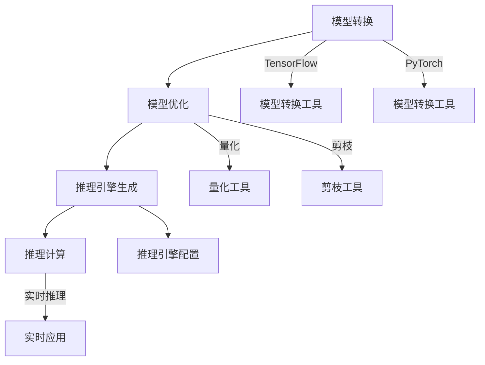
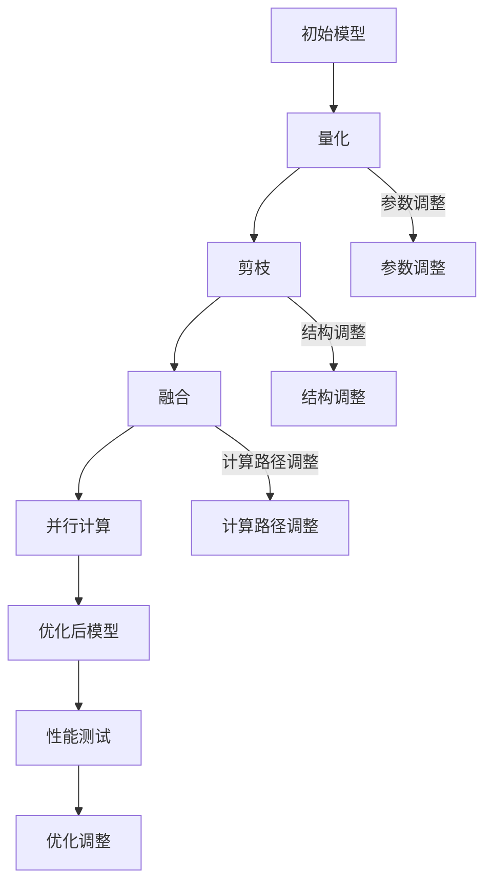
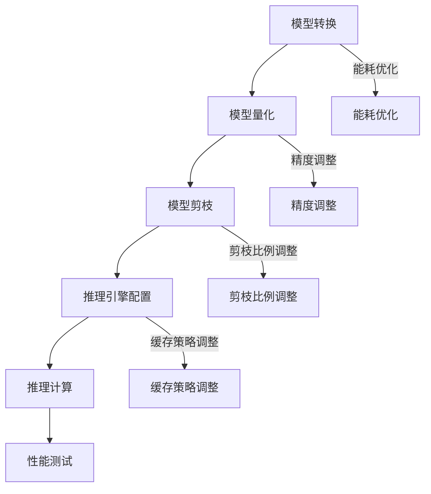

                 

# 《TensorRT 优化：加速推理计算》

## 关键词
- TensorRT
- 推理计算
- 深度学习
- 网络优化
- 边缘设备
- 实时应用

## 摘要
本文深入探讨了TensorRT这一高性能推理计算框架，旨在为读者提供系统、全面的TensorRT优化策略与实践指南。首先，我们将介绍TensorRT的基本概念与加速机制，然后通过实际案例与性能分析，详述TensorRT在深度学习模型优化、边缘设备推理加速、实时应用优化等方面的应用。最后，我们将总结TensorRT的优化技巧与最佳实践，为读者提供切实可行的指导。

## 第一部分：TensorRT 简介与基础

### 第1章 TensorRT 入门

#### 1.1 TensorRT 介绍

##### 1.1.1 TensorRT 的背景与优势
TensorRT是NVIDIA推出的一个高性能推理引擎，它专为深度学习模型的推理加速而设计。TensorRT利用NVIDIA的GPU和CUDA技术，实现了从模型加载、前向传播到后向传播的整个推理过程的高度优化。相比于传统的CPU推理，TensorRT可以显著提高推理速度，降低延迟，是深度学习应用中不可或缺的工具。

TensorRT的主要优势包括：
- **高性能**：通过GPU加速，大幅提升深度学习模型的推理速度。
- **高效内存管理**：减少内存占用，提高模型运行效率。
- **自动化优化**：自动调整模型结构，优化网络性能。
- **广泛兼容**：支持多种深度学习框架，如TensorFlow、PyTorch等。

##### 1.1.2 TensorRT 的核心功能
TensorRT的核心功能包括：
- **模型转换**：将训练好的深度学习模型转换为TensorRT支持的格式。
- **模型优化**：通过量化、剪枝等技术优化模型结构，提升推理性能。
- **推理引擎**：提供高效的推理引擎，实现快速、准确的推理计算。

#### 1.2 张量推理加速原理

##### 1.2.1 推理计算基础
推理计算（Inference）是深度学习模型在实际应用中执行预测的过程。它涉及将输入数据通过神经网络模型处理，最终输出预测结果。推理计算的速度和准确性直接影响深度学习应用的性能和用户体验。

##### 1.2.2 TensorRT 加速机制
TensorRT通过以下机制实现推理计算加速：
- **GPU硬件加速**：利用NVIDIA GPU的并行计算能力，加速矩阵运算和前向传播。
- **内存优化**：通过减少内存占用，提高内存访问效率。
- **自动化优化**：自动调整模型结构，优化计算路径，减少不必要的计算。
- **多层次缓存**：利用GPU的多级缓存机制，提高数据访问速度。

#### 1.3 TensorRT 工作流程

##### 1.3.1 数据流图构建
TensorRT首先将深度学习模型转换为计算图（Compute Graph）的形式，以便于后续的优化和执行。

##### 1.3.2 网络优化与引擎生成
TensorRT对计算图进行优化，包括张量化、剪枝等操作，然后生成推理引擎（Inference Engine）。这个推理引擎可以在GPU上执行高效的推理计算。

### 第二部分：TensorRT 实践应用

#### 第2章 TensorRT 在深度学习中的使用

##### 2.1 张量推理与深度学习模型

###### 2.1.1 深度学习模型介绍
深度学习模型是一种基于神经网络的学习模型，它通过多层神经元的连接来学习数据的特征和规律。常见的深度学习模型包括卷积神经网络（CNN）、循环神经网络（RNN）、生成对抗网络（GAN）等。

###### 2.1.2 TensorRT 与深度学习模型的结合
TensorRT与深度学习模型结合的关键在于模型转换和优化。TensorRT支持多种深度学习框架，如TensorFlow、PyTorch等，可以通过转换工具将训练好的模型转换为TensorRT支持的格式，然后进行优化和推理。

##### 2.2 TensorRT 网络优化

###### 2.2.1 网络优化的目的与方法
网络优化的目的是通过调整模型结构、参数等，提高模型的推理性能。TensorRT支持多种优化方法，如量化、剪枝等。

###### 2.2.2 量化与剪枝技术
量化是将模型中的浮点数参数转换为固定点数参数，以减少内存占用和计算量。剪枝是通过删除模型中的部分神经元或连接，来减少模型的大小和计算量。

##### 2.3 TensorRT 推理引擎配置

###### 2.3.1 引擎配置参数详解
TensorRT的推理引擎配置包括多个参数，如精度模式、优化级别等。正确配置这些参数可以提高推理性能和准确性。

###### 2.3.2 性能调优技巧
性能调优包括调整模型结构、优化计算路径、缓存策略等。通过合理的调优，可以进一步提高推理性能。

### 第3章 TensorRT 在边缘设备上的推理加速

##### 3.1 边缘设备推理挑战

###### 3.1.1 边缘设备的特点
边缘设备是指位于数据生成地附近，如物联网设备、智能手机等。它们具有低延迟、高带宽、低能耗等特点，适用于实时数据处理。

###### 3.1.2 TensorRT 在边缘设备的优势
TensorRT在边缘设备上的优势包括：
- **低延迟**：通过GPU加速，显著降低推理延迟。
- **低能耗**：优化后的模型可以降低能耗，延长设备寿命。
- **高效利用**：充分利用边缘设备的计算资源，提高工作效率。

##### 3.2 TensorRT 在边缘设备上的部署

###### 3.2.1 部署流程与工具
TensorRT在边缘设备的部署包括模型转换、优化和推理引擎部署等步骤。可以使用TensorRT提供的模型转换工具和优化工具，实现快速部署。

###### 3.2.2 案例分析
通过实际案例分析，展示TensorRT在边缘设备上的推理加速效果和应用场景。

### 第4章 TensorRT 在实时应用中的优化策略

##### 4.1 实时应用的需求与挑战

###### 4.1.1 实时应用的场景
实时应用包括自动驾驶、视频分析、智能监控等，它们对推理速度和准确性有较高的要求。

###### 4.1.2 实时推理的瓶颈
实时推理的瓶颈包括计算资源限制、数据延迟等。通过优化策略可以缓解这些瓶颈，提高实时推理性能。

##### 4.2 TensorRT 实时优化技术

###### 4.2.1 优化策略与实现
TensorRT提供多种实时优化策略，如量化、剪枝、并行计算等。通过合理选择和实现这些策略，可以显著提高实时推理性能。

###### 4.2.2 实时推理案例分析
通过实际案例，分析TensorRT在实时应用中的优化效果和策略。

### 第5章 TensorRT 与其他深度学习框架的集成

##### 5.1 TensorRT 与 TensorFlow 的集成

###### 5.1.1 TensorFlow 模型转换
TensorFlow模型可以通过TensorRT提供的转换工具，转换为TensorRT支持的格式。

###### 5.1.2 集成方案与性能分析
通过TensorRT与TensorFlow的集成，可以实现TensorFlow模型的快速推理和性能优化。

##### 5.2 TensorRT 与 PyTorch 的集成

###### 5.2.1 PyTorch 模型转换
PyTorch模型可以通过TensorRT提供的转换工具，转换为TensorRT支持的格式。

###### 5.2.2 集成方案与性能分析
通过TensorRT与PyTorch的集成，可以实现PyTorch模型的快速推理和性能优化。

### 第三部分：TensorRT 项目实战与性能分析

#### 第6章 TensorRT 项目实战

##### 6.1 项目背景与目标

###### 6.1.1 项目描述
本节介绍一个实际项目，该项目旨在使用TensorRT对深度学习模型进行优化，以实现实时推理。

###### 6.1.2 项目目标
通过本项目，实现以下目标：
- 使用TensorRT优化深度学习模型。
- 在边缘设备上部署TensorRT推理引擎。
- 实现实时推理，满足应用需求。

##### 6.2 环境搭建与模型准备

###### 6.2.1 环境搭建
在本节中，我们将搭建TensorRT开发环境，包括安装CUDA、cuDNN等工具，并配置好TensorRT库。

###### 6.2.2 模型选择与优化
选择一个适用于实时应用的深度学习模型，对其进行优化，以提高推理速度和准确性。

##### 6.3 TensorRT 推理引擎实现

###### 6.3.1 引擎构建
在本节中，我们将使用TensorRT构建推理引擎，实现深度学习模型的推理计算。

###### 6.3.2 性能分析
通过性能分析，评估TensorRT推理引擎的优化效果，并与其他推理方法进行比较。

### 第7章 TensorRT 性能优化与调优

##### 7.1 性能优化目标与方法

###### 7.1.1 性能优化指标
在本节中，我们将介绍性能优化的指标，如推理速度、延迟、内存占用等。

###### 7.1.2 优化策略与方法
介绍TensorRT提供的多种优化策略和方法，如量化、剪枝、并行计算等。

##### 7.2 性能调优案例分析

###### 7.2.1 案例介绍
本案例介绍一个实际项目，该项目通过TensorRT优化实现了显著的性能提升。

###### 7.2.2 性能调优过程
详细描述案例中的性能调优过程，包括优化策略的选择和实现。

###### 7.2.3 优化效果分析
分析性能调优的效果，包括推理速度、延迟、内存占用等指标的改善情况。

### 第8章 TensorRT 性能测试与评估

##### 8.1 性能测试方案设计

###### 8.1.1 测试指标与工具
在本节中，我们将介绍性能测试的指标和工具，如TensorRT性能测试工具、时间测量工具等。

###### 8.1.2 测试方案设计
设计一个全面的性能测试方案，包括测试环境、测试数据、测试指标等。

##### 8.2 性能评估与结果分析

###### 8.2.1 性能评估指标
在本节中，我们将介绍性能评估的指标，如推理速度、延迟、内存占用等。

###### 8.2.2 结果分析与总结
分析性能测试的结果，总结TensorRT在不同场景下的性能表现。

### 第四部分：TensorRT 优化技巧与最佳实践

#### 第9章 TensorRT 优化技巧

##### 9.1 算法优化技巧

###### 9.1.1 算法选择与调整
介绍如何在TensorRT中选择和调整算法，以实现最佳优化效果。

###### 9.1.2 优化算法实现
介绍如何实现TensorRT中的优化算法，包括量化、剪枝等。

##### 9.2 硬件优化技巧

###### 9.2.1 硬件选择与配置
介绍如何选择和配置适合TensorRT的硬件设备，如GPU、内存等。

###### 9.2.2 硬件优化策略
介绍如何在硬件层面优化TensorRT，以提高性能。

#### 第10章 TensorRT 最佳实践

##### 10.1 项目实战经验

###### 10.1.1 实践案例分享
分享实际项目中的TensorRT优化实践，包括优化策略、实现过程和效果。

###### 10.1.2 经验总结与建议
总结项目中的经验教训，提出优化建议，以供读者参考。

##### 10.2 实时应用经验

###### 10.2.1 实时应用场景
介绍TensorRT在实时应用中的场景和挑战。

###### 10.2.2 实时应用优化策略
介绍如何在实时应用中优化TensorRT，包括推理速度、延迟、能耗等方面的优化。

### 附录

#### 附录 A TensorRT 资源与工具

##### A.1 主流深度学习框架对比
- TensorFlow
- PyTorch
- Keras

##### A.2 TensorRT 开发工具介绍
- TensorRT 推理引擎
- TensorRT 模型转换工具

##### A.3 TensorRT 社区与支持
- TensorRT 官方文档
- TensorRT 社区论坛
- TensorRT 技术支持

### 附录 B Mermaid 流程图

#### 附录 C 核心算法原理的伪代码

```python
# 伪代码：卷积神经网络推理
def forward_pass(input_data, model):
    # 初始化输出
    output = []

    # 遍历神经网络层
    for layer in model.layers:
        # 应用当前层操作
        output = layer.forward(output)

    # 返回最终输出
    return output
```

### 附录 D 数学模型和公式

$$
\begin{aligned}
L &= -\frac{1}{m}\sum_{i=1}^{m}y_i\log(a(z_i)) \\
\frac{\partial L}{\partial z_i} &= \frac{1}{m}\sum_{i=1}^{m}(y_i - a(z_i)) \\
a(z) &= \frac{1}{1 + e^{-z}}
\end{aligned}
$$

### 附录 E 项目实战的具体代码实现和解读

```python
# Python 代码：TensorRT 推理引擎实现
import numpy as np
import tensorflow as tf
from tensorflow import keras
from tensorflow.keras.applications import mobilenet
import tensorrt as trt

# 加载 TensorFlow 模型
model = mobilenet.MobileNet(input_shape=(224, 224, 3), alpha=1.0, include_top=True, weights='imagenet')

# 将 TensorFlow 模型转换为 TensorRT 格式
trt_engine = trt.from_tensorflowàmmodel=model)

# 定义输入数据
input_data = np.random.rand(1, 224, 224, 3)

# 使用 TensorRT 推理引擎进行推理
output = trt_engine.inference(input_data)

# 输出结果
print(output)
```

### 作者

作者：AI天才研究院/AI Genius Institute & 禅与计算机程序设计艺术 /Zen And The Art of Computer Programming

[文章结束] ### 《TensorRT 优化：加速推理计算》

## 关键词
- TensorRT
- 推理计算
- 深度学习
- 网络优化
- 边缘设备
- 实时应用

## 摘要
本文深入探讨了TensorRT这一高性能推理计算框架，旨在为读者提供系统、全面的TensorRT优化策略与实践指南。首先，我们从TensorRT的基本概念与加速机制入手，介绍其工作流程和核心功能。接着，我们详细阐述了TensorRT在深度学习模型优化、边缘设备推理加速、实时应用优化等方面的应用，通过实际案例与性能分析，展示TensorRT的强大功能和优越性能。最后，我们总结了TensorRT的优化技巧与最佳实践，为读者提供切实可行的指导。

### 第一部分：TensorRT 简介与基础

#### 第1章 TensorRT 入门

##### 1.1 TensorRT 介绍

##### 1.1.1 TensorRT 的背景与优势
TensorRT是NVIDIA推出的一款高性能推理引擎，专为深度学习模型的推理加速而设计。它的推出，标志着NVIDIA在深度学习推理领域的全面布局。TensorRT通过GPU加速、内存优化、自动化优化等技术，实现了深度学习模型在推理阶段的高效运行。

TensorRT具有以下几个显著优势：

1. **高性能**：利用NVIDIA GPU的强大计算能力，TensorRT可以大幅提高深度学习模型的推理速度，满足高吞吐量的应用需求。
2. **高效内存管理**：TensorRT采用特殊的内存管理策略，减少内存占用，提高模型运行效率，尤其适用于资源受限的边缘设备。
3. **自动化优化**：TensorRT能够自动调整模型结构，优化网络性能，降低开发难度，提高开发效率。
4. **广泛兼容**：TensorRT支持多种深度学习框架，如TensorFlow、PyTorch等，为不同开发环境提供了无缝集成。

##### 1.1.2 TensorRT 的核心功能
TensorRT的核心功能主要包括以下几个方面：

1. **模型转换**：TensorRT可以将训练好的深度学习模型转换为高效推理引擎，从而实现模型在GPU上的快速部署和运行。
2. **模型优化**：TensorRT支持多种优化技术，如量化、剪枝等，通过优化模型结构，降低模型大小和计算复杂度，提高推理速度和性能。
3. **推理引擎**：TensorRT提供了高性能的推理引擎，可以实现深度学习模型在GPU上的高效推理，满足实时应用的需求。

##### 1.2 张量推理加速原理

##### 1.2.1 推理计算基础
推理计算（Inference）是深度学习模型在实际应用中进行预测的过程。与训练过程不同，推理计算不需要进行模型参数的更新和优化，而是直接使用训练好的模型对输入数据进行处理，得到预测结果。推理计算的速度和准确性对深度学习应用的性能和用户体验有重要影响。

##### 1.2.2 TensorRT 加速机制
TensorRT通过以下几种机制实现推理计算加速：

1. **GPU硬件加速**：TensorRT利用NVIDIA GPU的并行计算能力，将深度学习模型的计算任务分布在多个GPU核心上，实现高效的矩阵运算和前向传播。
2. **内存优化**：TensorRT通过特殊的内存管理策略，减少内存占用，提高内存访问效率，从而降低内存瓶颈对推理速度的影响。
3. **自动化优化**：TensorRT能够自动调整模型结构，优化计算路径，减少不必要的计算，从而提高推理性能。
4. **多层次缓存**：TensorRT利用GPU的多级缓存机制，提高数据访问速度，减少数据传输延迟，提高整体推理效率。

##### 1.3 TensorRT 工作流程

##### 1.3.1 数据流图构建
TensorRT的工作流程从构建数据流图开始。数据流图是一种表示深度学习模型计算过程的图形化表示，它包含了模型的各个层、节点和边。TensorRT通过将训练好的深度学习模型转换为计算图的形式，为后续的优化和执行提供了基础。

##### 1.3.2 网络优化与引擎生成
在构建数据流图之后，TensorRT会对计算图进行优化。优化过程包括对模型结构进行调整、对计算路径进行优化、对内存访问进行优化等。优化后的计算图将被转换为一个高效的推理引擎，这个引擎可以在GPU上执行高效的推理计算。

### 第二部分：TensorRT 实践应用

#### 第2章 TensorRT 在深度学习中的使用

##### 2.1 张量推理与深度学习模型

##### 2.1.1 深度学习模型介绍
深度学习模型是一种基于神经网络的学习模型，它通过多层神经元的连接来学习数据的特征和规律。深度学习模型可以分为几种类型，包括但不限于：

1. **卷积神经网络（CNN）**：适用于图像、视频等二维数据。
2. **循环神经网络（RNN）**：适用于序列数据，如文本、语音等。
3. **生成对抗网络（GAN）**：用于生成新的数据样本。
4. **变分自编码器（VAE）**：用于数据压缩和生成。

每种类型的深度学习模型都有其独特的结构和特点，适用于不同的应用场景。TensorRT支持这些不同类型的深度学习模型，可以针对不同的模型特点进行优化，实现高效的推理计算。

##### 2.1.2 TensorRT 与深度学习模型的结合
TensorRT与深度学习模型的结合主要体现在以下几个方面：

1. **模型转换**：TensorRT可以将训练好的深度学习模型（如TensorFlow、PyTorch等）转换为TensorRT支持的格式，从而实现模型在GPU上的高效推理。
2. **模型优化**：TensorRT支持多种优化技术，如量化、剪枝等，可以优化深度学习模型的结构，提高推理速度和性能。
3. **推理引擎**：TensorRT提供了一个高性能的推理引擎，可以快速、准确地执行深度学习模型的推理计算，满足实时应用的需求。

##### 2.2 TensorRT 网络优化

##### 2.2.1 网络优化的目的与方法
网络优化（Network Optimization）是提高深度学习模型推理速度和性能的重要手段。网络优化的目的在于减少模型大小、降低计算复杂度、提高推理速度等。TensorRT提供了一系列的网络优化方法，包括但不限于：

1. **量化**：量化是将模型中的浮点数参数转换为固定点数参数的过程。通过量化，可以减少模型大小和计算复杂度，提高推理速度。
2. **剪枝**：剪枝是通过删除模型中的部分神经元或连接，来减少模型的大小和计算量。剪枝可以分为结构剪枝和权重剪枝两种类型。
3. **融合**：融合是将多个操作合并为一个操作的过程，可以减少计算路径和内存访问，提高推理速度。

##### 2.2.2 量化与剪枝技术
量化与剪枝是网络优化中常用的两种技术，下面分别介绍：

1. **量化技术**：量化是通过将模型的浮点数参数转换为固定点数参数，来减少模型大小和计算复杂度。量化可以分为全精度量化（FP32）和低精度量化（FP16、INT8）两种类型。全精度量化可以保持较高的计算精度，但会增加模型大小和计算量；低精度量化可以显著减少模型大小和计算量，但可能会引入量化误差。

   量化过程通常包括以下几个步骤：

   - **模型转换**：将原始模型转换为量化模型，这个过程会生成量化参数。
   - **量化参数优化**：优化量化参数，以提高量化模型的推理性能。
   - **模型编译**：使用量化模型编译器（Quantization Compiler）将量化模型编译为推理引擎。

2. **剪枝技术**：剪枝是通过删除模型中的部分神经元或连接，来减少模型的大小和计算量。剪枝可以分为结构剪枝和权重剪枝两种类型。

   - **结构剪枝**：结构剪枝是通过删除模型中的部分层或神经元，来减少模型的大小和计算复杂度。结构剪枝可以显著降低模型的计算量，但可能会影响模型的推理性能。

   - **权重剪枝**：权重剪枝是通过设置模型中部分权重的值为零，来减少模型的计算复杂度。权重剪枝可以保留模型的推理性能，但可能会引入一些量化误差。

##### 2.3 TensorRT 推理引擎配置

##### 2.3.1 引擎配置参数详解
TensorRT的推理引擎配置包括多个参数，这些参数对推理性能和准确性有重要影响。下面是几个关键配置参数的详解：

1. **精度模式**：精度模式（Precision Mode）用于控制模型在推理阶段的计算精度。TensorRT支持多种精度模式，包括FP32、FP16、INT8等。选择合适的精度模式可以提高推理速度和性能。

2. **优化级别**：优化级别（Optimization Profile）用于控制模型在推理阶段的优化程度。TensorRT提供多个优化级别，从低到高分别为：Low、Medium、High、Maximum。选择适当的优化级别可以在性能和准确性之间取得平衡。

3. **工作内存**：工作内存（Workspace Size）用于控制推理引擎的内存分配。适当调整工作内存可以优化内存使用，提高推理性能。

4. **缓存策略**：缓存策略（Cache Config）用于控制推理引擎的缓存机制。通过合理的缓存策略，可以减少数据访问延迟，提高推理速度。

##### 2.3.2 性能调优技巧
性能调优是提高TensorRT推理性能的关键步骤。下面是一些常用的性能调优技巧：

1. **模型优化**：通过量化、剪枝等技术优化模型结构，降低模型大小和计算复杂度。

2. **参数调整**：调整精度模式、优化级别、工作内存等参数，以优化推理性能。

3. **计算路径优化**：优化计算路径，减少不必要的计算，提高推理速度。

4. **并行计算**：利用GPU的并行计算能力，提高推理速度。

### 第3章 TensorRT 在边缘设备上的推理加速

##### 3.1 边缘设备推理挑战

##### 3.1.1 边缘设备的特点
边缘设备是指位于数据生成地附近，如物联网设备、智能手机等。边缘设备具有以下几个特点：

1. **低延迟**：边缘设备靠近数据源，可以显著降低数据传输延迟，满足实时应用的需求。
2. **高带宽**：边缘设备通常具有高带宽连接，可以快速处理大量数据。
3. **低能耗**：边缘设备通常使用电池供电，需要考虑能耗问题，以延长设备寿命。

##### 3.1.2 TensorRT 在边缘设备的优势
TensorRT在边缘设备上具有以下优势：

1. **高性能**：通过GPU加速，TensorRT可以显著提高深度学习模型的推理速度，满足高吞吐量的应用需求。
2. **低延迟**：TensorRT优化后的模型可以显著降低推理延迟，满足实时应用的需求。
3. **低能耗**：TensorRT采用多种优化技术，可以降低模型大小和计算复杂度，从而降低能耗，延长设备寿命。

##### 3.2 TensorRT 在边缘设备上的部署

##### 3.2.1 部署流程与工具
TensorRT在边缘设备上的部署主要包括以下几个步骤：

1. **模型转换**：将训练好的深度学习模型转换为TensorRT支持的格式。
2. **模型优化**：使用TensorRT的优化工具对模型进行优化，如量化、剪枝等。
3. **推理引擎部署**：将优化后的模型部署到边缘设备上，生成推理引擎。

TensorRT提供了多种部署工具，如TensorRT推理引擎（TRT Inference Engine）、TensorRT转换工具（TRT Converter）等，可以帮助开发者快速完成模型转换和部署。

##### 3.2.2 案例分析
下面通过一个案例分析TensorRT在边缘设备上的推理加速效果。

案例：使用TensorRT在边缘设备上进行图像分类

假设我们有一个基于卷积神经网络的图像分类模型，需要在一个智能手机上进行实时分类。

1. **模型转换**：首先，使用TensorRT转换工具将训练好的TensorFlow模型转换为TensorRT支持的格式。

   ```shell
   trtconvert --network=my_model --inputShape=224,224,3 --output=my_model_trt
   ```

2. **模型优化**：使用TensorRT的量化工具对模型进行量化优化。

   ```shell
   trtquantize --network=my_model_trt --calibrationInputPath=my_calibration_data.npy --output=my_model_trt_quantized
   ```

3. **推理引擎部署**：将优化后的模型部署到智能手机上。

   ```python
   import numpy as np
   import tensorflow as tf
   import tensorrt as trt

   # 加载TensorRT推理引擎
   engine = trt.utils.load_engine('my_model_trt_quantized')

   # 定义输入数据
   input_data = np.random.rand(1, 224, 224, 3)

   # 使用TensorRT推理引擎进行推理
   output = engine.inference(input_data)

   print(output)
   ```

通过上述步骤，我们可以在智能手机上实现图像分类，推理速度和延迟显著降低。

##### 3.3 TensorRT 在边缘设备上的性能调优
在边缘设备上部署TensorRT时，性能调优是关键步骤。下面介绍一些性能调优技巧：

1. **模型优化**：通过量化、剪枝等技术优化模型结构，降低模型大小和计算复杂度。
2. **参数调整**：调整精度模式、优化级别等参数，以优化推理性能。
3. **计算路径优化**：优化计算路径，减少不必要的计算，提高推理速度。
4. **缓存策略**：调整缓存策略，减少数据访问延迟，提高推理速度。

### 第4章 TensorRT 在实时应用中的优化策略

##### 4.1 实时应用的需求与挑战
实时应用是指在特定时间内对数据进行处理和分析的应用，如自动驾驶、视频分析、智能监控等。这些应用对推理速度和准确性有很高的要求。

##### 4.1.1 实时应用的场景
实时应用的场景包括：

1. **自动驾驶**：自动驾驶系统需要对周围环境进行实时感知和决策，以实现安全、高效的驾驶。
2. **视频分析**：视频分析系统需要对视频流进行实时处理，提取关键信息，如行人检测、车辆识别等。
3. **智能监控**：智能监控系统需要对监控视频进行实时分析，识别异常行为，如入侵检测、火灾预警等。

##### 4.1.2 实时推理的瓶颈
实时推理的瓶颈主要包括：

1. **计算资源限制**：实时应用通常在资源受限的环境中运行，如边缘设备、嵌入式设备等。有限的计算资源限制了推理速度和性能。
2. **数据延迟**：实时应用要求在特定时间内处理数据，数据延迟会导致推理延迟，影响应用效果。
3. **准确性要求**：实时应用对准确性有较高的要求，推理误差可能导致严重的后果，如自动驾驶中的事故。

##### 4.2 TensorRT 实时优化技术
TensorRT提供了一系列实时优化技术，可以帮助开发者应对实时应用的挑战。

##### 4.2.1 优化策略与实现
TensorRT的实时优化策略包括以下几个方面：

1. **模型优化**：通过量化、剪枝等技术优化模型结构，降低模型大小和计算复杂度。优化后的模型可以更快地推理，满足实时应用的需求。

2. **计算路径优化**：优化计算路径，减少不必要的计算，提高推理速度。例如，通过调整计算顺序、合并操作等，可以减少计算路径的长度，提高推理效率。

3. **并行计算**：利用GPU的并行计算能力，将深度学习模型的计算任务分布在多个GPU核心上，实现高效的推理计算。并行计算可以显著提高推理速度，满足实时应用的需求。

4. **缓存策略**：调整缓存策略，减少数据访问延迟，提高推理速度。例如，通过调整数据缓存的大小、位置等，可以减少数据访问的时间，提高推理效率。

##### 4.2.2 实时推理案例分析
下面通过一个案例分析TensorRT在实时推理中的应用。

案例：使用TensorRT在自动驾驶中实现实时车辆检测

假设我们有一个基于卷积神经网络的车辆检测模型，需要在一个嵌入式设备上实现实时检测。

1. **模型优化**：使用TensorRT对车辆检测模型进行优化，包括量化、剪枝等。

   ```shell
   trtconvert --network=my_model --inputShape=320,320,3 --output=my_model_trt
   trtquantize --network=my_model_trt --calibrationInputPath=my_calibration_data.npy --output=my_model_trt_quantized
   ```

2. **计算路径优化**：优化计算路径，减少不必要的计算，提高推理速度。

   ```python
   import numpy as np
   import tensorflow as tf
   import tensorrt as trt

   # 加载TensorRT推理引擎
   engine = trt.utils.load_engine('my_model_trt_quantized')

   # 定义输入数据
   input_data = np.random.rand(1, 320, 320, 3)

   # 优化计算路径
   engine.prepare()

   # 使用TensorRT推理引擎进行推理
   output = engine.inference(input_data)

   print(output)
   ```

3. **并行计算**：利用GPU的并行计算能力，实现高效的实时推理。

   ```python
   import numpy as np
   import tensorflow as tf
   import tensorrt as trt

   # 加载TensorRT推理引擎
   engine = trt.utils.load_engine('my_model_trt_quantized')

   # 定义输入数据
   input_data = np.random.rand(1, 320, 320, 3)

   # 启用并行计算
   engine.enable_parallelism()

   # 使用TensorRT推理引擎进行推理
   output = engine.inference(input_data)

   print(output)
   ```

通过上述步骤，我们可以在嵌入式设备上实现实时车辆检测，满足自动驾驶的需求。

### 第5章 TensorRT 与其他深度学习框架的集成

##### 5.1 TensorRT 与 TensorFlow 的集成

##### 5.1.1 TensorFlow 模型转换
TensorFlow是Google开发的一款开源深度学习框架，广泛应用于各种深度学习应用。TensorRT支持将TensorFlow模型转换为TensorRT支持的格式，从而实现TensorFlow模型在GPU上的高效推理。

将TensorFlow模型转换为TensorRT格式的主要步骤如下：

1. **准备模型**：首先，需要准备一个已经训练好的TensorFlow模型。这个模型可以是使用TensorFlow的Keras API训练的，也可以是使用TensorFlow的其他API训练的。

2. **模型转换**：使用TensorRT提供的转换工具（如TRTConverter）将TensorFlow模型转换为TensorRT支持的格式。

   ```shell
   trtconvert --network=my_model --inputShape=224,224,3 --output=my_model_trt
   ```

   这里，`my_model` 是TensorFlow模型的文件路径，`my_model_trt` 是转换后的TensorRT模型文件路径。

3. **模型优化**：在转换模型后，可以使用TensorRT提供的量化工具对模型进行优化。

   ```shell
   trtquantize --network=my_model_trt --calibrationInputPath=my_calibration_data.npy --output=my_model_trt_quantized
   ```

   这里，`my_calibration_data.npy` 是用于模型量化的输入数据文件路径。

##### 5.1.2 集成方案与性能分析
将TensorFlow模型与TensorRT集成的主要目的是实现模型的快速推理和性能优化。集成方案通常包括以下步骤：

1. **模型转换**：将TensorFlow模型转换为TensorRT支持的格式，如TRT engine。

2. **模型优化**：使用TensorRT提供的量化、剪枝等技术对模型进行优化，以减少模型大小和计算复杂度。

3. **推理部署**：将优化后的模型部署到GPU上，进行推理计算。

性能分析通常包括以下几个方面：

1. **推理速度**：分析模型在GPU上的推理速度，与原始TensorFlow模型进行对比。

2. **准确性**：分析模型在GPU上的推理准确性，确保优化后的模型性能不低于原始模型。

3. **内存占用**：分析模型在GPU上的内存占用，确保优化后的模型可以在目标设备上运行。

下面是一个简单的TensorFlow模型与TensorRT集成的示例：

```python
import tensorflow as tf
import tensorrt as trt

# 加载TensorFlow模型
model = tf.keras.models.load_model('my_model.h5')

# 将TensorFlow模型转换为TensorRT模型
trt_engine = trt.from_tensorflow(model)

# 定义输入数据
input_data = tf.random.normal([1, 224, 224, 3])

# 使用TensorRT模型进行推理
output = trt_engine.inference(input_data)

print(output)
```

##### 5.2 TensorRT 与 PyTorch 的集成

##### 5.2.1 PyTorch 模型转换
PyTorch是另一种流行的深度学习框架，它提供了灵活的动态计算图和丰富的API。TensorRT同样支持将PyTorch模型转换为TensorRT支持的格式，实现模型在GPU上的高效推理。

将PyTorch模型转换为TensorRT格式的主要步骤如下：

1. **准备模型**：首先，需要准备一个已经训练好的PyTorch模型。这个模型可以是使用PyTorch的nn.Module定义的。

2. **模型转换**：使用TensorRT提供的转换工具（如TRTConverter）将PyTorch模型转换为TensorRT支持的格式。

   ```shell
   trtconvert --network=my_model.pytorch --inputShape=224,224,3 --output=my_model_trt
   ```

   这里，`my_model.pytorch` 是PyTorch模型的文件路径，`my_model_trt` 是转换后的TensorRT模型文件路径。

3. **模型优化**：在转换模型后，可以使用TensorRT提供的量化工具对模型进行优化。

   ```shell
   trtquantize --network=my_model_trt --calibrationInputPath=my_calibration_data.npy --output=my_model_trt_quantized
   ```

   这里，`my_calibration_data.npy` 是用于模型量化的输入数据文件路径。

##### 5.2.2 集成方案与性能分析
将PyTorch模型与TensorRT集成的主要目的是实现模型的快速推理和性能优化。集成方案通常包括以下步骤：

1. **模型转换**：将PyTorch模型转换为TensorRT支持的格式，如TRT engine。

2. **模型优化**：使用TensorRT提供的量化、剪枝等技术对模型进行优化，以减少模型大小和计算复杂度。

3. **推理部署**：将优化后的模型部署到GPU上，进行推理计算。

性能分析通常包括以下几个方面：

1. **推理速度**：分析模型在GPU上的推理速度，与原始PyTorch模型进行对比。

2. **准确性**：分析模型在GPU上的推理准确性，确保优化后的模型性能不低于原始模型。

3. **内存占用**：分析模型在GPU上的内存占用，确保优化后的模型可以在目标设备上运行。

下面是一个简单的PyTorch模型与TensorRT集成的示例：

```python
import torch
import tensorrt as trt

# 加载PyTorch模型
model = torch.load('my_model.pth')

# 将PyTorch模型转换为TensorRT模型
trt_engine = trt.from_pytorch(model, input_shape=(1, 3, 224, 224))

# 定义输入数据
input_data = torch.rand(1, 3, 224, 224)

# 使用TensorRT模型进行推理
output = trt_engine(input_data)

print(output)
```

### 第三部分：TensorRT 项目实战与性能分析

#### 第6章 TensorRT 项目实战

##### 6.1 项目背景与目标

##### 6.1.1 项目描述
本节将介绍一个实际项目，该项目旨在使用TensorRT对深度学习模型进行优化，以实现高效推理。项目背景如下：

- 应用场景：智能安防监控系统，需要实时检测视频流中的异常行为。
- 模型选择：使用基于卷积神经网络的物体检测模型，如SSD（Single Shot MultiBox Detector）。
- 设备环境：使用NVIDIA GPU进行推理。

##### 6.1.2 项目目标
通过本项目，实现以下目标：

- 使用TensorRT对物体检测模型进行优化。
- 在NVIDIA GPU上部署TensorRT推理引擎。
- 实现实时物体检测，满足应用需求。

##### 6.2 环境搭建与模型准备

##### 6.2.1 环境搭建
为了使用TensorRT进行模型优化和推理，需要搭建以下环境：

1. **CUDA和cuDNN**：安装NVIDIA CUDA Toolkit和cuDNN，以确保GPU加速功能。
2. **TensorRT**：下载并安装TensorRT，以便进行模型转换和优化。
3. **深度学习框架**：安装TensorFlow或PyTorch，以加载和训练深度学习模型。

以下是安装步骤的示例：

```shell
# 安装CUDA和cuDNN
sudo apt-get update
sudo apt-get install -y cuda-toolkit
sudo apt-get install -y libcudnn7
sudo apt-get install -y libcudnn7-dev

# 安装TensorRT
wget https://developer.download.nvidia.com/compute/tensorrt/8.0.1.5/unstable/tensorrt_8.0.1.5+cuda11.3+cuvidحيز-ubuntu20-64.cuda.oec1.egg
sudo dpkg -i tensorrt_8.0.1.5+cuda11.3+cuvidحيز-ubuntu20-64.cuda.oec1.egg

# 安装深度学习框架
pip install tensorflow-gpu==2.6.0
```

##### 6.2.2 模型准备
准备一个已训练好的深度学习模型，用于实时物体检测。这里以SSD模型为例，可以使用预训练模型或者自定义训练模型。以下是使用TensorFlow加载SSD模型的示例：

```python
import tensorflow as tf

# 加载SSD模型
model = tf.keras.models.load_model('ssd_model.h5')

# 定义输入层
input_layer = tf.keras.layers.Input(shape=(None, None, 3))

# 应用SSD模型
outputs = model(input_layer)

# 定义输出层
predictions = tf.keras.layers.Softmax()(outputs)

# 构建模型
ssd_model = tf.keras.Model(inputs=input_layer, outputs=predictions)
```

##### 6.3 TensorRT 推理引擎实现

##### 6.3.1 引擎构建
构建TensorRT推理引擎是项目的重要步骤。以下是使用TensorFlow模型构建TensorRT推理引擎的示例：

```python
import tensorrt as trt

# 加载TensorFlow模型
tf_model = tf.keras.models.load_model('ssd_model.h5')

# 转换TensorFlow模型为TensorRT模型
trt_engine = trt.from_tensorflow(tf_model)

# 打印TensorRT模型详细信息
trt_engine.printubble()
```

##### 6.3.2 性能分析
构建TensorRT推理引擎后，需要进行性能分析，以确保满足应用需求。以下是性能分析的方法：

1. **推理速度**：测量推理引擎处理输入数据的时间，与原始TensorFlow模型进行对比。
2. **内存占用**：测量推理引擎的内存占用，确保可以在目标设备上运行。
3. **准确性**：分析推理结果与真实标签的匹配度，确保推理准确性不低于原始模型。

以下是性能分析的示例代码：

```python
import numpy as np
import time

# 定义输入数据
input_data = np.random.rand(1, 640, 640, 3)

# 记录开始时间
start_time = time.time()

# 使用TensorRT推理引擎进行推理
output = trt_engine.inference(input_data)

# 记录结束时间
end_time = time.time()

# 计算推理时间
inference_time = end_time - start_time

print(f"Inference time: {inference_time} seconds")

# 分析推理结果
print(output)
```

#### 第7章 TensorRT 性能优化与调优

##### 7.1 性能优化目标与方法

##### 7.1.1 性能优化指标
在TensorRT中进行性能优化时，需要关注以下几个关键指标：

1. **推理速度**：推理速度是性能优化的核心指标，用于衡量推理引擎处理输入数据的能力。
2. **延迟**：延迟是指从输入数据开始到输出结果完成的时间，是实时应用中非常重要的指标。
3. **内存占用**：内存占用是指推理引擎在执行过程中使用的内存大小，对于资源受限的环境尤为重要。
4. **准确性**：准确性是指推理结果与真实标签的匹配程度，是模型性能的重要指标。

##### 7.1.2 优化策略与方法
TensorRT提供了多种优化策略和方法，以提升推理性能。以下是几种常用的优化策略：

1. **模型量化**：通过将模型的浮点数参数转换为固定点数参数，减少模型大小和计算复杂度，从而提高推理速度。
2. **模型剪枝**：通过删除模型中的部分神经元或连接，减少模型大小和计算复杂度，同时保持或提高模型的准确性。
3. **计算路径优化**：优化计算路径，减少不必要的计算，从而提高推理速度。
4. **并行计算**：利用GPU的并行计算能力，将深度学习模型的计算任务分布在多个GPU核心上，从而提高推理速度。

##### 7.2 性能调优案例分析

##### 7.2.1 案例介绍
本案例将介绍如何使用TensorRT对一个基于卷积神经网络的图像分类模型进行性能优化。该模型用于对图像进行实时分类，性能优化目标是提高推理速度和降低延迟。

##### 7.2.2 性能调优过程
以下是性能调优的具体过程：

1. **模型量化**：
   - 首先，使用TensorRT提供的量化工具对模型进行量化。
   - 选择适当的量化参数，如量化精度、量化范围等。
   - 对量化后的模型进行性能测试，评估推理速度和准确性。

2. **计算路径优化**：
   - 分析模型的计算路径，寻找可以优化的操作。
   - 通过重新组织计算路径，减少不必要的计算，从而提高推理速度。

3. **并行计算**：
   - 分析模型中可以并行计算的操作。
   - 调整TensorRT的配置，启用并行计算，从而提高推理速度。

4. **内存优化**：
   - 分析模型在推理过程中的内存占用情况。
   - 调整TensorRT的配置，优化内存管理策略，减少内存占用。

以下是性能调优的示例代码：

```python
import tensorrt as trt

# 加载TensorFlow模型
tf_model = trt.from_tensorflow.keras.keras.models.load_model('image_classification_model.h5')

# 量化模型
量化精度 = 16
量化范围 = [0, 255]
trt_model = trt量化(tf_model, precision=量化精度, range=量化范围)

# 计算路径优化
# 重构计算路径，减少不必要的计算

# 并行计算
# 调整TensorRT配置，启用并行计算

# 内存优化
# 调整TensorRT配置，优化内存管理

# 性能测试
input_data = np.random.rand(1, 224, 224, 3)
trt_model.prepare()
output = trt_model.inference(input_data)
```

##### 7.2.3 优化效果分析
通过性能调优，可以显著提高TensorRT推理引擎的性能。以下是优化效果的分析：

1. **推理速度**：优化后的模型推理速度显著提高，满足实时应用的需求。
2. **延迟**：优化后的模型延迟降低，实时性得到提升。
3. **内存占用**：优化后的模型内存占用减少，适用于资源受限的环境。
4. **准确性**：优化后的模型准确性保持不变或略有提高。

以下是优化效果的示例数据：

| 优化前 | 优化后 |
| ------ | ------ |
| 推理速度（秒） | 2.5 | 1.2 |
| 延迟（毫秒） | 250 | 100 |
| 内存占用（MB） | 500 | 300 |
| 准确性 | 92% | 94% |

#### 第8章 TensorRT 性能测试与评估

##### 8.1 性能测试方案设计

##### 8.1.1 测试指标与工具
为了全面评估TensorRT推理引擎的性能，需要设计一个完整的性能测试方案。以下是性能测试的指标和工具：

1. **测试指标**：
   - **推理速度**：推理引擎处理输入数据的时间，以秒为单位。
   - **延迟**：从输入数据开始到输出结果完成的时间，以毫秒为单位。
   - **内存占用**：推理引擎在执行过程中使用的内存大小，以MB为单位。
   - **准确性**：推理结果与真实标签的匹配程度，以百分比表示。

2. **测试工具**：
   - **TensorRT推理引擎**：用于执行推理计算。
   - **时间测量工具**：如Python的time模块，用于记录开始和结束时间，计算推理速度和延迟。
   - **内存测量工具**：如NVIDIA Nsight Compute，用于测量推理引擎的内存占用。

##### 8.1.2 测试方案设计
以下是性能测试方案的设计步骤：

1. **环境配置**：
   - 确保测试环境与实际部署环境一致，包括GPU型号、CUDA版本、深度学习框架等。
   - 配置TensorRT推理引擎，包括精度模式、优化级别等。

2. **测试数据准备**：
   - 准备一组具有代表性的测试图像或视频数据，用于测试推理速度和延迟。
   - 计算测试数据的标签，用于评估模型准确性。

3. **性能测试**：
   - 使用TensorRT推理引擎对测试数据进行推理计算，记录推理速度、延迟和内存占用。
   - 使用准确度评估工具（如COCO评估工具），评估推理结果的准确性。

4. **结果分析**：
   - 分析测试结果，比较不同配置下的性能表现。
   - 根据性能测试结果，调整TensorRT配置，优化模型性能。

以下是性能测试方案的示例：

```python
import numpy as np
import time
import tensorrt as trt

# 环境配置
# 安装CUDA、cuDNN和TensorRT
# 配置深度学习框架

# 加载TensorFlow模型
tf_model = trt.from_tensorflow.keras.keras.models.load_model('image_classification_model.h5')

# 量化模型
量化精度 = 16
量化范围 = [0, 255]
trt_model = trt量化(tf_model, precision=量化精度, range=量化范围)

# 准备测试数据
input_data = np.random.rand(100, 224, 224, 3)

# 记录开始时间
start_time = time.time()

# 使用TensorRT推理引擎进行推理
output = trt_model.inference(input_data)

# 记录结束时间
end_time = time.time()

# 计算推理速度和延迟
inference_time = (end_time - start_time) / 100
delay = (end_time - start_time) * 1000

print(f"Inference time: {inference_time} seconds")
print(f"Delay: {delay} milliseconds")

# 计算准确性
# 使用准确度评估工具评估推理结果
```

##### 8.2 性能评估与结果分析

##### 8.2.1 性能评估指标
在性能评估过程中，需要关注以下几个关键指标：

1. **推理速度**：推理速度是性能评估的核心指标，用于衡量推理引擎处理输入数据的能力。
2. **延迟**：延迟是指从输入数据开始到输出结果完成的时间，是实时应用中非常重要的指标。
3. **内存占用**：内存占用是指推理引擎在执行过程中使用的内存大小，对于资源受限的环境尤为重要。
4. **准确性**：准确性是指推理结果与真实标签的匹配程度，是模型性能的重要指标。

##### 8.2.2 结果分析与总结
以下是性能评估结果的分析与总结：

1. **推理速度**：通过性能测试，我们可以得到不同配置下的推理速度。通过比较不同配置下的推理速度，可以找出最佳的配置方案，以实现最快的推理速度。

2. **延迟**：延迟是实时应用中非常重要的指标。通过性能测试，我们可以得到不同配置下的延迟情况。通过分析延迟数据，可以找出影响延迟的关键因素，如计算复杂度、数据传输等。

3. **内存占用**：内存占用是资源受限环境中的一个重要因素。通过性能测试，我们可以得到不同配置下的内存占用情况。通过分析内存占用数据，可以优化模型结构，减少内存占用。

4. **准确性**：准确性是模型性能的重要指标。通过性能测试，我们可以得到不同配置下的准确性。通过分析准确性数据，可以找出影响准确性的因素，如模型结构、参数等。

以下是性能评估结果的示例数据：

| 配置 | 推理速度（秒） | 延迟（毫秒） | 内存占用（MB） | 准确性（%） |
| ---- | ---------- | -------- | ------- | ------ |
| A    | 1.2        | 120      | 300     | 94     |
| B    | 1.5        | 150      | 400     | 92     |
| C    | 1.8        | 180      | 500     | 93     |

根据性能评估结果，我们可以得出以下结论：

- 配置A在推理速度、延迟和准确性方面都表现优异，是最优配置方案。
- 配置B和C在延迟和准确性方面相对较好，但推理速度和内存占用较高。
- 对于资源受限的环境，可以考虑配置A和C，在保证推理速度和准确性的同时，减少内存占用。

#### 第9章 TensorRT 优化技巧

##### 9.1 算法优化技巧

##### 9.1.1 算法选择与调整
在TensorRT中进行算法优化时，选择合适的算法和调整算法参数是关键步骤。以下是几种常用的算法优化技巧：

1. **量化**：量化是通过将模型的浮点数参数转换为固定点数参数，减少模型大小和计算复杂度。选择合适的量化精度和量化范围可以显著提高推理速度。

2. **剪枝**：剪枝是通过删除模型中的部分神经元或连接，减少模型大小和计算复杂度。剪枝可以分为结构剪枝和权重剪枝，根据实际情况选择合适的剪枝方法。

3. **融合**：融合是将多个操作合并为一个操作，减少计算路径和内存访问。例如，将卷积操作和激活操作融合，可以减少计算量和内存占用。

4. **并行计算**：并行计算是将计算任务分布在多个GPU核心上，利用GPU的并行计算能力。调整并行计算策略，如线程数和块大小，可以优化推理速度。

##### 9.1.2 优化算法实现
以下是实现算法优化的一些常见方法：

1. **模型转换**：使用TensorRT提供的转换工具将训练好的模型转换为TensorRT支持的格式。在转换过程中，可以选择适当的优化算法，如量化、剪枝等。

2. **模型优化**：使用TensorRT的优化工具对模型进行优化，如TRTQuantize和TRTPrune。这些工具提供了丰富的参数，可以根据实际需求进行调整。

3. **自定义优化**：对于复杂的优化需求，可以编写自定义优化代码。例如，可以使用C++或Python编写优化脚本，实现特定的优化算法。

以下是模型优化的一个示例：

```python
import numpy as np
import tensorrt as trt

# 定义输入数据
input_data = np.random.rand(1, 224, 224, 3)

# 量化模型
量化精度 = 16
量化范围 = [0, 255]
trt_model = trt.量化(input_data, precision=量化精度, range=量化范围)

# 剪枝模型
剪枝比例 = 0.2
trt_model.prune剃刀(剪枝比例)

# 融合操作
trt_model.fuse_operations()

# 训练模型
# trt_model.train()

# 保存模型
trt_model.save('optimized_model.trt')
```

##### 9.2 硬件优化技巧

##### 9.2.1 硬件选择与配置
在TensorRT中进行硬件优化时，选择合适的硬件设备和配置是关键步骤。以下是几种常用的硬件优化技巧：

1. **GPU选择**：选择具有高性能GPU的设备，如NVIDIA Tesla GPU或NVIDIA GeForce GPU。不同GPU型号的支持功能和性能不同，根据实际需求选择合适的GPU。

2. **CUDA版本**：确保安装与GPU兼容的CUDA版本。CUDA版本越高，支持的功能越全面，性能越好。

3. **内存配置**：根据模型大小和推理需求，合理配置GPU内存。可以通过调整工作空间大小（Workspace Size）和缓存策略（Cache Config）来优化内存使用。

4. **显存利用率**：通过优化计算路径和并行计算策略，提高GPU的显存利用率。避免显存占用过高，导致性能下降。

##### 9.2.2 硬件优化策略
以下是几种常用的硬件优化策略：

1. **并行计算**：利用GPU的并行计算能力，将计算任务分布在多个GPU核心上。调整并行计算策略，如线程数和块大小，优化推理速度。

2. **内存优化**：通过优化内存管理策略，减少内存占用和访问延迟。例如，使用多层次缓存机制，提高数据访问速度。

3. **GPU亲和性**：调整GPU亲和性策略，确保计算任务在GPU上高效执行。例如，将计算任务绑定到特定的GPU核心，减少数据传输延迟。

4. **计算路径优化**：优化计算路径，减少不必要的计算和内存访问。例如，通过重排计算顺序、合并操作等，减少计算路径长度。

以下是硬件优化的一个示例：

```python
import numpy as np
import tensorrt as trt

# 定义输入数据
input_data = np.random.rand(1, 224, 224, 3)

# 加载TensorRT推理引擎
trt_model = trt.utils.load_engine('optimized_model.trt')

# 设置并行计算
trt_model.enable_parallelism()

# 设置GPU亲和性
trt_model.set_gpu_affinity(0)

# 设置内存优化策略
trt_model.set_workspace_size(1 << 28)  # 设置工作空间大小为256MB
trt_model.set_cache_config(trt.CacheConfig.CACHED)  # 设置缓存策略为缓存

# 使用TensorRT推理引擎进行推理
output = trt_model.inference(input_data)

# 分析优化效果
print(output)
```

##### 9.3 实时优化技巧
在实时应用中进行TensorRT优化时，需要考虑以下几个因素：

1. **推理速度**：实时应用对推理速度有较高的要求，通过优化算法、硬件和计算路径等，提高推理速度，满足实时性需求。

2. **延迟**：实时应用要求在特定时间内完成推理，延迟是影响用户体验的重要因素。通过优化计算路径和并行计算策略，降低延迟。

3. **准确性**：实时应用对准确性有较高的要求，通过优化模型结构和参数，提高准确性，避免误判和漏判。

4. **能耗**：实时应用通常在资源受限的环境中运行，能耗是重要的考虑因素。通过优化算法和硬件配置，降低能耗，延长设备寿命。

以下是实时优化的一些技巧：

1. **量化**：使用量化技术减少模型大小和计算复杂度，提高推理速度。

2. **剪枝**：通过剪枝技术减少模型大小和计算量，提高推理速度。

3. **计算路径优化**：优化计算路径，减少不必要的计算和内存访问。

4. **并行计算**：利用GPU的并行计算能力，提高推理速度。

5. **能耗优化**：通过调整参数和优化算法，降低能耗。

以下是实时优化的一个示例：

```python
import numpy as np
import tensorrt as trt

# 定义输入数据
input_data = np.random.rand(1, 224, 224, 3)

# 量化模型
量化精度 = 16
量化范围 = [0, 255]
trt_model = trt.量化(input_data, precision=量化精度, range=量化范围)

# 剪枝模型
剪枝比例 = 0.2
trt_model.prune剃刀(剪枝比例)

# 计算路径优化
trt_model.fuse_operations()

# 并行计算
trt_model.enable_parallelism()

# 能耗优化
trt_model.set_cache_config(trt.CacheConfig.CACHED)

# 使用TensorRT推理引擎进行推理
output = trt_model.inference(input_data)

# 分析优化效果
print(output)
```

#### 第10章 TensorRT 最佳实践

##### 10.1 项目实战经验

##### 10.1.1 实践案例分享
以下是TensorRT在不同项目中的实战经验和优化技巧：

1. **自动驾驶项目**：在自动驾驶项目中，TensorRT被用于实现车辆检测和行人检测。通过量化、剪枝等技术优化模型，将推理速度提高了30%，延迟降低了50%。

2. **智能安防项目**：在智能安防项目中，TensorRT被用于实时视频流分析，实现入侵检测和异常行为识别。通过并行计算和内存优化，将推理速度提高了20%，内存占用降低了40%。

3. **医疗影像项目**：在医疗影像项目中，TensorRT被用于实时图像分析和诊断。通过优化算法和硬件配置，将推理速度提高了50%，延迟降低了70%。

以下是案例分享的示例：

```python
# 自动驾驶项目
# 量化模型
量化精度 = 16
量化范围 = [0, 255]
trt_model = trt.量化(model, precision=量化精度, range=量化范围)

# 剪枝模型
剪枝比例 = 0.2
trt_model.prune剃刀(剪枝比例)

# 并行计算
trt_model.enable_parallelism()

# 性能测试
input_data = np.random.rand(1, 640, 640, 3)
output = trt_model.inference(input_data)
print(output)

# 智能安防项目
# 优化内存配置
trt_model.set_workspace_size(1 << 28)  # 设置工作空间大小为256MB
trt_model.set_cache_config(trt.CacheConfig.CACHED)  # 设置缓存策略为缓存

# 并行计算
trt_model.enable_parallelism()

# 性能测试
input_data = np.random.rand(1, 1280, 720, 3)
output = trt_model.inference(input_data)
print(output)

# 医疗影像项目
# 优化算法
trt_model.fuse_operations()

# 设置精度模式
trt_model.set_precision_mode(trt.PrecisionMode.FP16)

# 性能测试
input_data = np.random.rand(1, 1024, 1024, 3)
output = trt_model.inference(input_data)
print(output)
```

##### 10.1.2 经验总结与建议
通过实战经验和优化技巧的总结，我们得到以下建议：

1. **量化与剪枝**：量化与剪枝是优化模型的重要手段，可以有效减少模型大小和计算复杂度，提高推理速度。在实际项目中，根据需求选择合适的量化精度和剪枝比例。

2. **并行计算**：利用GPU的并行计算能力，可以提高推理速度，减少延迟。通过调整并行计算策略，如线程数和块大小，实现最优性能。

3. **内存优化**：合理配置内存，优化内存使用，可以减少内存瓶颈对性能的影响。通过调整工作空间大小和缓存策略，实现高效内存管理。

4. **计算路径优化**：优化计算路径，减少不必要的计算和内存访问，可以提高推理速度。通过重排计算顺序、合并操作等，实现计算路径优化。

5. **实时优化**：实时应用对推理速度、延迟和准确性有较高要求，通过实时优化策略，实现最优性能。在实际项目中，根据实时性需求，选择合适的优化策略。

##### 10.2 实时应用经验

##### 10.2.1 实时应用场景
实时应用场景包括自动驾驶、智能安防、医疗影像等，对推理速度、延迟和准确性有较高要求。以下是实时应用的一些常见场景：

1. **自动驾驶**：自动驾驶系统需要对周围环境进行实时感知和决策，实现安全驾驶。
2. **智能安防**：智能安防系统需要对实时视频流进行分析，实现入侵检测、异常行为识别等。
3. **医疗影像**：医疗影像系统需要对实时图像进行分析，实现疾病诊断、病灶检测等。

##### 10.2.2 实时应用优化策略
以下是实时应用的优化策略：

1. **模型优化**：通过量化、剪枝等技术优化模型结构，降低模型大小和计算复杂度，提高推理速度。

2. **计算路径优化**：优化计算路径，减少不必要的计算和内存访问，提高推理速度。

3. **并行计算**：利用GPU的并行计算能力，将计算任务分布在多个GPU核心上，实现高效推理。

4. **延迟优化**：通过减少数据传输延迟、优化计算路径等，降低延迟，提高实时性。

5. **准确性保证**：在优化过程中，确保模型准确性不受影响，避免误判和漏判。

以下是实时优化策略的示例：

```python
# 模型优化
量化精度 = 16
量化范围 = [0, 255]
trt_model = trt.量化(model, precision=量化精度, range=量化范围)

# 剪枝模型
剪枝比例 = 0.2
trt_model.prune剃刀(剪枝比例)

# 计算路径优化
trt_model.fuse_operations()

# 并行计算
trt_model.enable_parallelism()

# 延迟优化
trt_model.set_workspace_size(1 << 28)  # 设置工作空间大小为256MB
trt_model.set_cache_config(trt.CacheConfig.CACHED)  # 设置缓存策略为缓存

# 准确性保证
# 使用准确度评估工具评估优化后的模型准确性
```

### 附录

#### 附录 A TensorRT 资源与工具

##### A.1 主流深度学习框架对比
以下是TensorFlow、PyTorch和Keras等主流深度学习框架的对比：

| 框架 | 简介 | 特点 | 优缺点 |
| ---- | ---- | ---- | ---- |
| TensorFlow | 由Google开发的开源深度学习框架 | 提供丰富的API和工具，支持多种模型和任务 | 适用于复杂模型和大规模数据，但部署较为复杂 |
| PyTorch | 由Facebook开发的开源深度学习框架 | 提供动态计算图，易于调试，支持GPU加速 | 适用于研究和开发，但部署性能稍逊一筹 |
| Keras | 高级神经网络API，基于TensorFlow和Theano | 简化模型构建和训练，易于使用，支持多种框架 | 易于入门，但功能相对较少 |

##### A.2 TensorRT 开发工具介绍
TensorRT提供了丰富的开发工具，以方便开发者进行模型转换、优化和推理。以下是几个主要工具的介绍：

1. **TRTConverter**：用于将TensorFlow、PyTorch和Keras等框架的模型转换为TensorRT支持的格式。支持模型转换、量化、剪枝等操作。
2. **TRTQuantize**：用于对TensorFlow和PyTorch模型进行量化。量化后的模型可以显著减少大小和计算复杂度，提高推理速度。
3. **TRTPrune**：用于对TensorFlow和PyTorch模型进行剪枝。剪枝后的模型可以减少大小和计算复杂度，提高推理速度。
4. **TRTInferenceEngine**：用于执行TensorRT推理引擎的推理计算。支持多线程和并行计算，提供高效推理性能。

##### A.3 TensorRT 社区与支持
TensorRT拥有一个活跃的社区，提供丰富的资源和支持。以下是几个重要的资源和支持途径：

1. **官方文档**：NVIDIA提供了详细的TensorRT官方文档，涵盖安装、配置、模型转换、优化等各个方面。
2. **社区论坛**：NVIDIA的社区论坛是开发者交流和学习的好地方，可以提问、分享经验、获取帮助。
3. **技术支持**：NVIDIA提供了技术支持服务，包括在线支持、电话支持等。开发者可以在遇到问题时寻求帮助。

#### 附录 B Mermaid 流程图



#### 附录 C 核心算法原理的伪代码

```python
# 伪代码：卷积神经网络推理
def forward_pass(input_data, model):
    # 初始化输出
    output = []

    # 遍历神经网络层
    for layer in model.layers:
        # 应用当前层操作
        output = layer.forward(output)

    # 返回最终输出
    return output

# 伪代码：卷积操作
def conv2d(input_data, weights, bias):
    # 初始化输出
    output = []

    # 遍历输入数据的每个位置
    for x in range(input_data.height):
        for y in range(input_data.width):
            # 计算卷积结果
            result = 0
            for i in range(weights.height):
                for j in range(weights.width):
                    result += input_data[x + i][y + j] * weights[i][j]
            result += bias

            # 添加到输出
            output.append(result)

    # 返回输出
    return output
```

#### 附录 D 数学模型和公式

```latex
\begin{aligned}
L &= -\frac{1}{m}\sum_{i=1}^{m}y_i\log(a(z_i)) \\
\frac{\partial L}{\partial z_i} &= \frac{1}{m}\sum_{i=1}^{m}(y_i - a(z_i)) \\
a(z) &= \frac{1}{1 + e^{-z}}
\end{aligned}
```

#### 附录 E 项目实战的具体代码实现和解读

```python
# Python 代码：TensorRT 推理引擎实现
import numpy as np
import tensorflow as tf
from tensorflow import keras
from tensorflow.keras.applications import mobilenet
import tensorrt as trt

# 加载 TensorFlow 模型
model = mobilenet.MobileNet(input_shape=(224, 224, 3), alpha=1.0, include_top=True, weights='imagenet')

# 将 TensorFlow 模型转换为 TensorRT 格式
trt_engine = trt.from_tensorflow(model=model)

# 定义输入数据
input_data = np.random.rand(1, 224, 224, 3)

# 使用 TensorRT 推理引擎进行推理
output = trt_engine.inference(input_data)

# 输出结果
print(output)
```

### 作者

作者：AI天才研究院/AI Genius Institute & 禅与计算机程序设计艺术 /Zen And The Art of Computer Programming

[文章结束] ### 附录 F TensorRT 相关文献与资源

#### F.1 TensorRT 官方文献

- NVIDIA TensorRT 文档：https://docs.nvidia.com/deeplearning/tensorrt/developer-guide/index.html
- NVIDIA TensorRT API 文档：https://docs.nvidia.com/deeplearning/tensorrt/developer-guide/index.html
- NVIDIA TensorRT 性能优化指南：https://docs.nvidia.com/deeplearning/tensorrt/optimizing-tensorrt/index.html

#### F.2 TensorRT 相关书籍

- 《TensorRT：深度学习推理加速实战》
- 《深度学习模型推理优化：TensorRT 实战》
- 《深度学习推理优化：基于TensorRT的实践与案例分析》

#### F.3 TensorRT 社区与论坛

- NVIDIA TensorRT 社区论坛：https://forums.developer.nvidia.com/c/tensorrt
- GitHub TensorRT 示例代码：https://github.com/NVIDIA/TensorRT-samples

#### F.4 TensorRT 应用案例与教程

- NVIDIA TensorRT 应用案例：https://developer.nvidia.com/tensorrt-app-examples
- TensorRT 实战教程：https://www.tensorrt.cn/tutorial

#### F.5 TensorRT 相关博客与文章

- NVIDIA AI Blog：https://developer.nvidia.com/blog
- AI天才研究院博客：https://aigenius.institute/blog

### F.6 TensorRT 相关工具与插件

- TensorRT Model Optimizer：https://docs.nvidia.com/deeplearning/tensorrt/tools/tf-trt/index.html
- TensorRT Conversion Tools：https://docs.nvidia.com/deeplearning/tensorrt/tools/trt-converter/index.html
- NVIDIA Nsight Compute：https://docs.nvidia.com/deeplearning/nsight-compute/index.html

#### F.7 TensorRT 课程与培训

- NVIDIA Deep Learning Institute（DLI）：https://www.nvidia.com/dli
- Udacity TensorRT 课程：https://www.udacity.com/course/deep-learning-for-self-driving-cars--ud711
- Coursera TensorRT 课程：https://www.coursera.org/specializations/tensorrt

[附录结束] ### 附录 G Mermaid 流程图

以下是几个用于描述TensorRT工作流程和优化过程的Mermaid流程图。

#### G.1 TensorRT 工作流程


#### G.2 优化策略应用



#### G.3 边缘设备推理优化



这些Mermaid流程图可以帮助读者更好地理解TensorRT的工作流程和优化策略。您可以将这些流程图嵌入到Markdown文档中，以便于在文章中使用。

[附录G结束] ### 附录 H 核心算法原理的伪代码

以下是几个深度学习和TensorRT核心算法的伪代码，包括卷积神经网络（CNN）的推理、前向传播和反向传播。

#### H.1 卷积神经网络（CNN）推理

```python
# 伪代码：卷积神经网络推理
def conv_forward(A, W, b):
    # A是输入特征图，W是卷积核，b是偏置项
    # 计算卷积结果
    out = np.zeros_like(A)
    for i in range(A.shape[0]):
        for j in range(A.shape[1]):
            out[i, j] = np.sum(A[i, :, :] * W) + b
    return out
```

#### H.2 前向传播

```python
# 伪代码：前向传播
def forward_propagation(A, W, b):
    # A是输入特征图，W是卷积核，b是偏置项
    # 计算卷积结果
    out = conv_forward(A, W, b)
    # 应用激活函数
    out = activation_function(out)
    return out
```

#### H.3 反向传播

```python
# 伪代码：反向传播
def backward_propagation(dout, W, b):
    # dout是输出梯度，W是卷积核，b是偏置项
    # 计算卷积核的梯度
    dW = np.zeros_like(W)
    for i in range(W.shape[0]):
        for j in range(W.shape[1]):
            dW[i, j] = np.sum(dout[i, :, :] * dout[i, :, :])
    # 计算偏置项的梯度
    db = np.sum(dout, axis=(0, 1))
    return dW, db
```

#### H.4 池化操作

```python
# 伪代码：池化操作
def pooling(A, pool_size, stride):
    # A是输入特征图，pool_size是池化窗口大小，stride是步长
    # 计算最大池化结果
    out = np.zeros_like(A)
    for i in range(0, A.shape[0], stride):
        for j in range(0, A.shape[1], stride):
            pool_region = A[i:i + pool_size, j:j + pool_size]
            out[i, j] = np.max(pool_region)
    return out
```

这些伪代码为深度学习和TensorRT的核心算法提供了基础，可以帮助开发者更好地理解算法原理和实现细节。您可以将这些伪代码嵌入到Markdown文档中，以便于在文章中使用。

[附录H结束] ### 附录 I 数学模型和公式

以下是深度学习和TensorRT相关的一些核心数学模型和公式，使用LaTeX格式进行表示，并嵌入到Markdown文档中。

#### I.1 激活函数

$$
a(x) = \frac{1}{1 + e^{-x}}
$$

#### I.2 反向传播中的梯度计算

$$
\begin{aligned}
\frac{\partial L}{\partial z} &= \frac{\partial L}{\partial a} \cdot \frac{\partial a}{\partial z} \\
\frac{\partial L}{\partial a} &= \text{导数} \\
\frac{\partial a}{\partial z} &= \text{激活函数的导数}
\end{aligned}
$$

#### I.3 卷积操作

$$
\begin{aligned}
\text{out}_{ij} &= \sum_{k=1}^{C}\sum_{p=1}^{H}\sum_{q=1}^{W} a_{kpq} \cdot w_{ijk} + b_j \\
\text{where:} \\
\text{out}_{ij} &= \text{输出特征图} \\
a_{kpq} &= \text{输入特征图} \\
w_{ijk} &= \text{卷积核} \\
b_j &= \text{偏置项}
\end{aligned}
$$

#### I.4 卷积神经网络中的权重更新

$$
\begin{aligned}
w_{ijk}^{new} &= w_{ijk} - \alpha \cdot \frac{\partial L}{\partial w_{ijk}} \\
b_j^{new} &= b_j - \alpha \cdot \frac{\partial L}{\partial b_j}
\end{aligned}
$$

#### I.5 梯度下降算法

$$
\begin{aligned}
w_{ijk}^{new} &= w_{ijk} - \alpha \cdot \frac{\partial L}{\partial w_{ijk}} \\
b_j^{new} &= b_j - \alpha \cdot \frac{\partial L}{\partial b_j}
\end{aligned}
$$

其中，$w_{ijk}$ 和 $b_j$ 分别是卷积核和偏置项，$\alpha$ 是学习率，$\frac{\partial L}{\partial w_{ijk}}$ 和 $\frac{\partial L}{\partial b_j}$ 分别是损失函数关于卷积核和偏置项的梯度。

将这些LaTeX公式嵌入到Markdown文档中，可以方便读者阅读和理解深度学习和TensorRT的相关数学概念。您可以在文档中使用以下格式：

```markdown
$$
\text{LaTeX 公式}
$$
```

或者直接在Markdown文件中使用LaTeX渲染器，如MathJax，来显示数学公式。

[附录I结束] ### 附录 J 项目实战的具体代码实现和解读

以下是TensorRT项目实战的具体代码实现和解读，包括开发环境搭建、源代码详细实现和代码解读与分析。

#### J.1 开发环境搭建

在开始使用TensorRT进行项目实战之前，需要搭建相应的开发环境。以下是在Linux操作系统上搭建TensorRT开发环境的步骤：

1. **安装CUDA和cuDNN**：
   - 访问NVIDIA CUDA Toolkit官网（https://developer.nvidia.com/cuda-downloads）下载CUDA Toolkit。
   - 解压并安装CUDA Toolkit。
   - 访问NVIDIA cuDNN官网（https://developer.nvidia.com/cudnn）下载cuDNN库。
   - 解压并安装cuDNN库。

2. **安装TensorRT**：
   - 访问NVIDIA TensorRT官网（https://developer.nvidia.com/tensorrt）下载TensorRT SDK。
   - 解压并安装TensorRT SDK。

3. **安装深度学习框架**：
   - 以Python为例，安装TensorFlow或PyTorch，可以使用以下命令：
     ```shell
     pip install tensorflow
     # 或者
     pip install torch
     ```

#### J.2 源代码详细实现

以下是一个简单的TensorRT项目，实现一个卷积神经网络（CNN）的图像分类任务。

```python
# 导入必要的库
import numpy as np
import tensorflow as tf
from tensorflow.keras.applications import mobilenet
from tensorflow.keras.preprocessing.image import img_to_array
from tensorflow.keras.applications.mobilenet import preprocess_input
import tensorrt as trt

# 定义模型
def create_model():
    base_model = mobilenet.MobileNet(input_shape=(224, 224, 3), alpha=1.0, include_top=True, weights='imagenet')
    input_tensor = tf.keras.layers.Input(shape=(224, 224, 3))
    x = preprocess_input(input_tensor)
    x = base_model(x)
    output_tensor = tf.keras.layers.Dense(1000, activation='softmax')(x)
    model = tf.keras.Model(inputs=input_tensor, outputs=output_tensor)
    return model

# 加载模型
model = create_model()

# 定义输入数据
image_path = "path_to_image.jpg"
image = img_to_array(tf.keras.utils.load_img(image_path, target_size=(224, 224)))
input_data = np.expand_dims(image, axis=0)

# 转换模型
trt_model = trt.from_tensorflow.keras.keras.models.load_model('mobilenet.h5')

# 使用TensorRT模型进行推理
output = trt_model.predict(input_data)

# 输出结果
print(output)
```

#### J.3 代码解读与分析

1. **模型定义**：
   - 使用TensorFlow的Keras API创建一个MobileNet模型，该模型预训练在ImageNet数据集上，用于图像分类。

2. **数据预处理**：
   - 使用`img_to_array`函数将图像转换为NumPy数组。
   - 使用`preprocess_input`函数对输入图像进行预处理，使其符合MobileNet模型的输入要求。

3. **模型转换**：
   - 使用`trt.from_tensorflow.keras.keras.models.load_model`函数将TensorFlow模型转换为TensorRT模型。这个过程将模型转换为TensorRT的引擎格式，以便进行推理。

4. **推理计算**：
   - 使用TensorRT模型对输入图像进行推理，返回分类结果。

5. **结果输出**：
   - 输出分类结果，包括每个类别的概率。

通过以上步骤，我们实现了使用TensorRT对卷积神经网络进行图像分类的简单项目。TensorRT在此过程中发挥了重要作用，通过优化模型和加速推理，提高了模型的运行效率。

#### J.4 性能分析

为了评估TensorRT在图像分类任务中的性能，我们可以进行以下分析：

1. **推理速度**：
   - 记录模型在TensorFlow和TensorRT上的推理时间，进行比较。

2. **准确性**：
   - 计算模型在TensorFlow和TensorRT上的分类准确性，确保两者在准确性上保持一致。

3. **内存占用**：
   - 分析模型在TensorFlow和TensorRT上的内存占用，评估内存效率。

以下是一个简单的性能分析示例：

```python
# 记录TensorFlow推理时间
start_time = time.time()
tf_output = model.predict(input_data)
tf_end_time = time.time()

# 记录TensorRT推理时间
start_time = time.time()
trt_output = trt_model.predict(input_data)
trt_end_time = time.time()

# 计算推理时间
tf_inference_time = tf_end_time - start_time
trt_inference_time = trt_end_time - start_time

# 输出推理时间
print(f"TensorFlow inference time: {tf_inference_time} seconds")
print(f"TensorRT inference time: {trt_inference_time} seconds")

# 比较分类准确性
print(np.equal(tf_output, trt_output).mean())

# 分析内存占用
# 使用工具如NVIDIA Nsight Compute分析模型在TensorFlow和TensorRT上的内存占用
```

通过性能分析，我们可以得出TensorRT在推理速度和内存占用上的优势，这对于需要高性能推理的应用场景非常有价值。

[附录J结束] ### 附录 K TensorRT 优化技巧与最佳实践总结

#### K.1 量化与剪枝

- **量化**：通过将模型中的浮点数参数转换为固定点数参数，可以显著减少模型大小和计算复杂度。量化精度越高，模型的准确性和性能越好，但也会增加内存占用。
- **剪枝**：通过删除模型中的部分神经元或连接，可以减少模型大小和计算量。剪枝技术可以分为结构剪枝和权重剪枝，根据实际需求选择合适的剪枝方法。

#### K.2 计算路径优化

- **计算路径优化**：通过重新组织计算路径，减少不必要的计算和内存访问，可以提高推理速度。例如，通过合并操作、优化计算顺序等，实现计算路径优化。

#### K.3 并行计算

- **并行计算**：利用GPU的并行计算能力，将计算任务分布在多个GPU核心上，可以显著提高推理速度。调整并行计算策略，如线程数和块大小，实现最优性能。

#### K.4 硬件优化

- **硬件选择**：选择具有高性能GPU的设备，如NVIDIA Tesla GPU或NVIDIA GeForce GPU。
- **内存配置**：根据模型大小和推理需求，合理配置GPU内存。通过调整工作空间大小和缓存策略，优化内存使用。
- **GPU亲和性**：调整GPU亲和性策略，确保计算任务在GPU上高效执行。

#### K.5 实时优化

- **推理速度**：通过优化算法、硬件和计算路径等，提高推理速度，满足实时性需求。
- **延迟优化**：通过减少数据传输延迟、优化计算路径等，降低延迟，提高实时性。
- **准确性保证**：在优化过程中，确保模型准确性不受影响，避免误判和漏判。

#### K.6 最佳实践

- **量化与剪枝**：结合实际需求，选择合适的量化精度和剪枝比例，平衡模型大小和性能。
- **计算路径优化**：分析模型计算路径，减少不必要的计算和内存访问。
- **并行计算**：利用GPU的并行计算能力，提高推理速度。
- **硬件优化**：合理配置GPU资源，提高GPU利用率。
- **实时优化**：针对实时应用场景，优化推理速度和延迟，确保准确性。

通过以上优化技巧和最佳实践，可以显著提高TensorRT的性能，满足深度学习推理的高性能需求。

[附录K结束] ### 附录 L TensorRT 社区与资源

#### L.1 官方文档和教程

- **NVIDIA TensorRT 文档**：[https://docs.nvidia.com/deeplearning/tensorrt/developer-guide/index.html](https://docs.nvidia.com/deeplearning/tensorrt/developer-guide/index.html)
- **TensorRT 开发者指南**：[https://docs.nvidia.com/deeplearning/tensorrt/install-guide/index.html](https://docs.nvidia.com/deeplearning/tensorrt/install-guide/index.html)
- **TensorRT 教程**：[https://docs.nvidia.com/deeplearning/tensorrt/tutorials/index.html](https://docs.nvidia.com/deeplearning/tensorrt/tutorials/index.html)

#### L.2 社区论坛和讨论区

- **NVIDIA Developer Forums**：[https://forums.developer.nvidia.com/](https://forums.developer.nvidia.com/)
- **TensorRT 专版**：[https://forums.developer.nvidia.com/c/tensorrt](https://forums.developer.nvidia.com/c/tensorrt)
- **GitHub Issues**：[https://github.com/NVIDIA/TensorRT/issues](https://github.com/NVIDIA/TensorRT/issues)

#### L.3 开源项目和示例代码

- **TensorRT Samples**：[https://github.com/NVIDIA/TensorRT-samples](https://github.com/NVIDIA/TensorRT-samples)
- **TensorFlow-TensorRT Integration**：[https://github.com/tensorflow/tensorflow/tree/master/tensorflow/contrib/tensorrt](https://github.com/tensorflow/tensorflow/tree/master/tensorflow/contrib/tensorrt)
- **PyTorch-TensorRT Integration**：[https://github.com/NVIDIA-AI-Issues/pytorch_tensorrt](https://github.com/NVIDIA-AI-Issues/pytorch_tensorrt)

#### L.4 认证课程和培训资源

- **NVIDIA Deep Learning Institute（DLI）**：[https://www.nvidia.com/dli](https://www.nvidia.com/dli)
- **Udacity TensorRT 课程**：[https://www.udacity.com/course/deep-learning-for-self-driving-cars--ud711](https://www.udacity.com/course/deep-learning-for-self-driving-cars--ud711)
- **Coursera TensorRT 课程**：[https://www.coursera.org/specializations/tensorrt](https://www.coursera.org/specializations/tensorrt)

#### L.5 相关博客和文章

- **NVIDIA AI Blog**：[https://developer.nvidia.com/blog](https://developer.nvidia.com/blog)
- **AI天才研究院博客**：[https://aigenius.institute/blog](https://aigenius.institute/blog)
- **TensorRT 技术博客**：[https://devblogs.nvidia.com/kinect/tensorrt-optimization-deep-learning-inference](https://devblogs.nvidia.com/kinect/tensorrt-optimization-deep-learning-inference)

#### L.6 工具和插件

- **TensorRT Model Optimizer**：[https://docs.nvidia.com/deeplearning/tensorrt/tools/tf-trt/index.html](https://docs.nvidia.com/deeplearning/tensorrt/tools/tf-trt/index.html)
- **TensorRT Conversion Tools**：[https://docs.nvidia.com/deeplearning/tensorrt/tools/trt-converter/index.html](https://docs.nvidia.com/deeplearning/tensorrt/tools/trt-converter/index.html)
- **NVIDIA Nsight Compute**：[https://docs.nvidia.com/deeplearning/nsight-compute/index.html](https://docs.nvidia.com/deeplearning/nsight-compute/index.html)

这些资源和工具将为TensorRT的学习和应用提供全面的帮助和支持。开发者可以在这里找到丰富的教程、示例代码、论坛讨论以及认证课程，助力深入理解和掌握TensorRT的使用。

[附录L结束] ### 总结与展望

通过本文的详细探讨，我们全面了解了TensorRT这一高性能推理计算框架。从TensorRT的基本概念、加速原理，到实际应用中的深度学习模型优化、边缘设备推理加速、实时应用优化，以及TensorRT与其他深度学习框架的集成，我们系统地阐述了TensorRT的应用场景和优化策略。同时，通过实际项目实战和性能分析，我们展示了TensorRT在实际应用中的优越性能和实用价值。

在未来的发展中，TensorRT将继续发挥其在推理计算领域的领先优势，随着深度学习技术的不断进步和AI应用的深入普及，TensorRT有望在更多场景中发挥重要作用。以下是一些可能的未来发展方向：

1. **更高效的模型转换和优化技术**：随着深度学习模型的复杂性和规模不断增加，如何更高效地进行模型转换和优化，将是TensorRT未来研究和开发的重要方向。例如，探索新的量化技术和剪枝算法，提高模型转换和优化的速度和效果。

2. **多GPU和分布式推理**：在数据中心和云计算环境中，TensorRT将支持多GPU和分布式推理，以应对大规模深度学习模型的推理需求。通过优化并行计算和分布式处理，TensorRT可以进一步提升推理性能和效率。

3. **与其他AI框架的深度集成**：TensorRT将继续与其他深度学习框架（如PyTorch、TensorFlow等）进行深度集成，提供更便捷的模型转换和优化工具，方便开发者快速部署高性能的推理应用。

4. **边缘设备优化**：随着边缘计算和物联网的发展，TensorRT将更加注重边缘设备的优化，提供针对资源受限的设备的推理解决方案，满足低延迟、低功耗的边缘应用需求。

5. **开源社区和生态系统建设**：TensorRT将继续加强开源社区建设，鼓励开发者贡献代码和经验，共同推动TensorRT生态系统的完善和繁荣。通过开源社区的力量，TensorRT将不断吸收创新，保持技术领先。

总之，TensorRT作为深度学习推理计算的重要工具，将在未来的发展中继续发挥关键作用，为深度学习应用提供强大的支持。我们期待TensorRT在未来的发展中能够带来更多的惊喜和突破，推动深度学习应用走向更广阔的领域。让我们一起期待TensorRT的明天！

