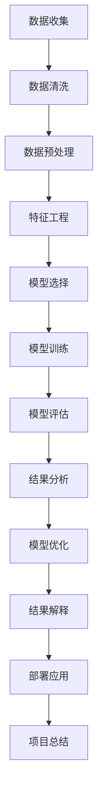

                 

### 文章标题：Time Series Forecasting原理与代码实例讲解

#### 关键词：时间序列预测、统计模型、机器学习、深度学习、项目实战

#### 摘要：
本文将深入探讨时间序列预测的基本原理、统计模型、机器学习模型以及深度学习模型，并通过实际项目实例讲解时间序列预测的实战技巧。我们将首先介绍时间序列预测的基本概念和特性，然后分别讲解统计模型、机器学习模型和深度学习模型在时间序列预测中的应用，最后通过具体案例展示如何进行时间序列预测项目实践。

### 目录大纲

#### 第一部分：时间序列预测基础

- **第1章：时间序列预测概述**
  - **1.1 时间序列的定义与特性**
  - **1.2 时间序列预测的应用场景**
  - **1.3 时间序列预测的基本流程

- **第2章：时间序列数据的处理**
  - **2.1 时间序列数据的预处理**
    - **2.1.1 数据清洗**
    - **2.1.2 数据变换**
    - **2.1.3 数据归一化**
  - **2.2 时间序列特征提取**
    - **2.2.1 时域特征**
    - **2.2.2 频域特征**
    - **2.2.3 宏观经济指标特征**

#### 第二部分：时间序列预测模型原理

- **第3章：时间序列预测的统计模型**
  - **3.1 自回归模型（AR）**
    - **3.1.1 自回归模型的基本原理**
    - **3.1.2 AR模型的参数估计**
    - **3.1.3 AR模型的应用**
  - **3.2 自回归移动平均模型（ARMA）**
    - **3.2.1 ARMA模型的基本原理**
    - **3.2.2 ARMA模型的参数估计**
    - **3.2.3 ARMA模型的应用**
  - **3.3 自回归积分滑动平均模型（ARIMA）**
    - **3.3.1 ARIMA模型的基本原理**
    - **3.3.2 ARIMA模型的参数估计**
    - **3.3.3 ARIMA模型的应用**

- **第4章：时间序列预测的机器学习模型**
  - **4.1 人工神经网络基础**
    - **4.1.1 神经网络的基本结构**
    - **4.1.2 神经网络的训练与优化**
  - **4.2 长短期记忆网络（LSTM）**
    - **4.2.1 LSTM的基本原理**
    - **4.2.2 LSTM的参数设置与优化**
    - **4.2.3 LSTM的应用**
  - **4.3 变分自编码器（VAE）**
    - **4.3.1 VAE的基本原理**
    - **4.3.2 VAE的参数设置与优化**
    - **4.3.3 VAE的应用**

- **第5章：时间序列预测的深度学习模型**
  - **5.1 卷积神经网络（CNN）与时间序列**
    - **5.1.1 CNN的基本原理**
    - **5.1.2 CNN在时间序列预测中的应用**
  - **5.2 循环神经网络（RNN）与时间序列**
    - **5.2.1 RNN的基本原理**
    - **5.2.2 RNN在时间序列预测中的应用**
  - **5.3 深度学习框架在时间序列预测中的应用**
    - **5.3.1 TensorFlow的使用**
    - **5.3.2 PyTorch的使用**

#### 第三部分：时间序列预测项目实战

- **第6章：时间序列预测实战案例**
  - **6.1 案例一：股票价格预测**
    - **6.1.1 数据预处理**
    - **6.1.2 模型选择与训练**
    - **6.1.3 结果分析与优化**
  - **6.2 案例二：电力负荷预测**
    - **6.2.1 数据预处理**
    - **6.2.2 模型选择与训练**
    - **6.2.3 结果分析与优化**

- **第7章：时间序列预测项目实践指南**
  - **7.1 项目开发流程**
  - **7.2 项目环境搭建**
  - **7.3 项目实战技巧与案例分析**

- **第8章：总结与展望**
  - **8.1 时间序列预测的发展趋势**
  - **8.2 时间序列预测的挑战与解决方案**
  - **8.3 时间序列预测的未来应用前景**

#### 附录

- **附录 A：时间序列预测工具与资源**
  - **A.1 Python时间序列预测库**
  - **A.2 其他时间序列预测工具**
  - **A.3 在线时间序列预测平台**

- **附录 B：时间序列预测常见问题解答**
  - **B.1 时间序列预测中的常见错误**
  - **B.2 时间序列预测的性能评估指标**
  - **B.3 时间序列预测中的数据选择与处理策略**

- **附录 C：时间序列预测流程图**
  - **C.1 时间序列预测流程图（Mermaid）**

### 导读

时间序列预测是数据分析中的一个重要领域，它涉及到对历史数据的分析，以预测未来可能发生的趋势和变化。随着数据量的增加和数据复杂性的提升，准确的时间序列预测对于决策制定、资源分配、风险控制等领域具有重要意义。本文将系统地介绍时间序列预测的基本概念、统计模型、机器学习模型和深度学习模型，并通过实际项目实例展示如何实现时间序列预测。文章结构清晰，旨在帮助读者从基础理论到实践应用全面掌握时间序列预测的相关知识。在阅读过程中，我们将不断提出问题并逐步解答，确保读者能够深入理解并灵活应用所学内容。

## 第1章：时间序列预测概述

### 1.1 时间序列的定义与特性

时间序列（Time Series）是一系列按照时间顺序排列的数据点。这些数据点可以是任何可以量化的变量，如股票价格、温度、销售额、人口统计数据等。时间序列数据具有以下几个基本特性：

1. **时间依赖性（Temporal Dependency）**：时间序列中的每个数据点不仅与它自身有关，还与之前的数据点有关。这种依赖关系可以通过滞后项（Lag Variables）来表示。例如，今天的价格可能会受到昨天和前天价格的影响。

2. **稳定性（Stability）**：时间序列数据的特征可能会随时间变化而变化，但这种变化通常是逐渐的，而不是突然的。稳定性对于模型选择和参数估计至关重要。

3. **趋势性（Trend）**：时间序列数据可能表现出长期上升或下降的趋势。这种趋势可以由线性趋势、多项式趋势或非线性趋势表示。

4. **季节性（Seasonality）**：某些时间序列数据会表现出周期性的波动，如季节性销售数据或天气温度变化。这种周期性可以通过季节性模型来捕捉。

5. **随机性（Irregularity or Noise）**：时间序列数据中不可避免地包含随机波动或噪声，这些波动通常难以预测。

### 1.2 时间序列预测的应用场景

时间序列预测在多个领域都有着广泛的应用：

1. **金融市场**：股票价格、交易量等金融数据的预测对于投资策略制定和风险管理至关重要。

2. **供应链管理**：预测未来需求可以帮助企业优化库存管理，减少库存成本，提高供应链效率。

3. **能源管理**：预测电力负荷和能源消耗可以优化能源分配，降低能源成本。

4. **天气预报**：预测未来的天气条件对于制定防灾减灾措施、规划户外活动具有重要意义。

5. **人口统计与公共卫生**：预测人口增长、疾病传播趋势等对于公共政策的制定和资源分配有重要作用。

6. **交通规划**：预测交通流量和交通需求可以帮助交通管理部门优化交通信号控制，减少交通拥堵。

### 1.3 时间序列预测的基本流程

时间序列预测的基本流程可以概括为以下几个步骤：

1. **数据收集与预处理**：收集历史时间序列数据，并进行数据清洗、填充缺失值、去除异常值等预处理操作。

2. **数据探索与分析**：通过可视化工具对时间序列数据进行分析，观察数据的趋势、季节性和波动性。

3. **特征工程**：提取与预测目标相关的特征，如滞后项、差分项、季节性指标等。

4. **模型选择**：根据数据特性选择合适的预测模型，如统计模型、机器学习模型或深度学习模型。

5. **模型训练与验证**：使用历史数据训练模型，并通过交叉验证等方法评估模型性能。

6. **模型优化**：调整模型参数，优化模型性能，如调整AR模型的阶数、LSTM的隐藏层大小等。

7. **预测与评估**：使用训练好的模型进行预测，并通过评估指标（如MAE、RMSE）评估预测结果的准确性。

8. **结果解释与反馈**：对预测结果进行解释，识别潜在的问题和改进空间，并进行反馈调整。

通过以上基本流程，我们可以系统地实现时间序列预测，为不同领域的问题提供数据驱动的解决方案。在接下来的章节中，我们将详细探讨时间序列预测的各种模型和方法，帮助读者深入理解并应用这些技术。

### 1.4 时间序列预测中的常见问题

在进行时间序列预测时，会遇到一些常见问题，这些问题不仅影响预测模型的准确性，还可能带来误导性的结果。以下是几个主要问题及其解决方案：

1. **缺失值处理**：时间序列数据中常存在缺失值，这些缺失值可能是由于记录错误、数据采集问题或设备故障等原因造成的。直接删除缺失值会损失大量信息，而简单的填充方法（如平均值填充或线性插值）可能无法准确反映数据的真实趋势。解决方案包括使用插值法、时间序列插值库（如`ts_interpolate`）或利用机器学习模型预测缺失值。

2. **异常值检测与处理**：异常值是指那些明显偏离数据整体趋势的值，这些异常值可能由错误记录或特殊情况引起。异常值会影响模型的训练和预测效果。检测异常值的方法包括统计方法（如Z分数、IQR方法）和机器学习方法（如孤立森林、局部异常因子分析）。处理方法包括删除异常值、使用修正模型或对异常值进行特别处理。

3. **趋势和季节性处理**：时间序列数据中往往包含趋势和季节性成分，如果这些成分未被适当处理，模型可能会学习到错误的模式。处理方法包括差分变换（消除趋势和季节性）、分解时间序列（分离趋势、季节性和随机成分）和使用去季节性模型（如STL）。

4. **数据噪声**：噪声是时间序列数据中的随机波动，它会干扰模型的学习和预测。减噪方法包括移动平均、滤波器（如卡尔曼滤波）和小波变换。

5. **模型选择和参数调整**：不同的模型和参数设置对预测结果有很大影响。选择合适的模型和调整参数是一个复杂的过程，通常需要多次尝试和交叉验证。可以使用自动化模型选择工具（如`scikit-learn`的`GridSearchCV`）来简化这一过程。

6. **过拟合与欠拟合**：过拟合模型会过度适应训练数据，导致在未知数据上的表现不佳；而欠拟合模型则未能捕捉到数据中的关键特征。解决方法包括增加数据集大小、减少模型复杂度和使用正则化技术。

通过理解和解决这些常见问题，我们可以显著提高时间序列预测模型的准确性和可靠性，从而为实际应用提供更有价值的预测结果。

### 1.5 总结

本章对时间序列预测的基本概念、应用场景和流程进行了详细的介绍。时间序列预测是通过历史数据来预测未来趋势和变化的重要技术，它在金融市场、供应链管理、能源管理等多个领域都有着广泛的应用。时间序列数据具有时间依赖性、稳定性、趋势性、季节性和随机性等特性，这些特性对模型的选择和参数调整有着重要影响。时间序列预测的基本流程包括数据收集与预处理、数据探索与分析、特征工程、模型选择与训练、模型优化与评估等步骤。同时，本章还讨论了时间序列预测中常见的问题及解决方案。在下一章中，我们将深入探讨时间序列数据的处理方法，包括预处理、特征提取等关键技术。

## 第2章：时间序列数据的处理

时间序列数据的处理是时间序列预测的重要环节，它直接影响到模型的选择和预测的准确性。在这一章中，我们将详细介绍时间序列数据的预处理、特征提取和常用的时间序列分析方法。

### 2.1 时间序列数据的预处理

预处理是数据分析和建模的重要步骤，对于时间序列数据来说也不例外。时间序列数据的预处理主要包括以下三个方面：

#### 2.1.1 数据清洗

数据清洗是指识别和修正数据集中的错误、异常值和缺失值。对于时间序列数据，数据清洗尤为重要，因为任何错误或异常值都可能对后续的预测产生重大影响。

- **错误值处理**：识别并修正数据集中的错误值。错误值可能是由于数据采集过程中的失误或数据录入错误造成的。常见的处理方法包括使用已知的数据标准来识别错误值，或者利用机器学习算法自动识别和修正。

- **异常值检测**：检测并处理数据集中的异常值。异常值可能是由数据采集过程中的异常事件造成的，也可能是数据记录错误。常用的检测方法包括统计方法（如Z分数、IQR方法）和机器学习方法（如孤立森林、局部异常因子分析）。处理方法包括删除异常值、使用修正模型或对异常值进行特别处理。

- **缺失值填充**：缺失值填充是处理时间序列数据中缺失值的一种方法。常见的填充方法包括：
  - **均值填充**：用数据点的平均值来填补缺失值。
  - **前值或后值填充**：用前一个或后一个已知数据点来填补缺失值。
  - **插值法**：使用插值方法（如线性插值、高斯插值）来填补缺失值。
  - **时间序列插值库**：使用专门的库（如`ts_interpolate`）进行复杂的时间序列数据插值。

#### 2.1.2 数据变换

数据变换是指将原始数据转换为适合分析和建模的形式。时间序列数据变换的常见方法包括：

- **归一化**：将数据缩放到一个特定的范围，如0到1或-1到1之间。归一化有助于加速模型的训练过程，提高模型的性能。

- **标准化**：将数据集的均值设置为0，标准差设置为1。标准化可以消除不同特征之间的尺度差异，使模型更稳定。

- **差分变换**：差分变换用于消除时间序列中的趋势和季节性成分。一阶差分可以消除线性趋势，二阶差分可以消除多项式趋势。

  - **一阶差分**：\( \Delta X_t = X_t - X_{t-1} \)
  - **二阶差分**：\( \Delta^2 X_t = \Delta X_t - \Delta X_{t-1} \)

- **对数变换**：对数变换有助于稳定时间序列数据中的波动，特别是在处理指数增长或衰减的数据时。对数变换可以减少数据的方差，提高模型的稳定性。

#### 2.1.3 数据归一化

数据归一化是指将数据集的尺度调整到统一的范围内，以便于不同特征之间的比较。归一化的方法包括最小-最大缩放、标准化等。

- **最小-最大缩放**：将数据缩放到[0, 1]范围内。计算公式为：
  \[
  X_{\text{normalized}} = \frac{X - X_{\text{min}}}{X_{\text{max}} - X_{\text{min}}}
  \]
  其中，\(X_{\text{min}}\) 和 \(X_{\text{max}}\) 分别为数据集的最小值和最大值。

- **标准化**：将数据集的均值设置为0，标准差设置为1。计算公式为：
  \[
  X_{\text{normalized}} = \frac{X - \mu}{\sigma}
  \]
  其中，\(\mu\) 和 \(\sigma\) 分别为数据集的均值和标准差。

### 2.2 时间序列特征提取

特征提取是从原始时间序列数据中提取对预测任务有帮助的特征。特征提取可以增强模型的预测能力，减少数据维度，提高模型的效率和准确性。时间序列特征提取的方法包括时域特征、频域特征和宏观经济指标特征等。

#### 2.2.1 时域特征

时域特征是在时间序列数据的时域（即时间维度）上提取的特征。常见的时域特征包括：

- **均值（Mean）**：时间序列数据点的平均值。
- **中位数（Median）**：时间序列数据点的中间值。
- **标准差（Standard Deviation）**：时间序列数据点的离散程度。
- **变异系数（Coefficient of Variation, CV）**：标准差与均值之比，用于衡量数据的波动性。
- **四分位距（Interquartile Range, IQR）**：第三四分位数与第一四分位数之差，用于衡量数据的分散程度。
- **最大值（Maximum）**和**最小值（Minimum）**：时间序列数据中的最大值和最小值。
- **趋势（Trend）**：时间序列数据的长期增长或减少趋势。

#### 2.2.2 频域特征

频域特征是通过将时间序列数据转换为频域表示来提取的特征。频域分析可以帮助我们识别时间序列数据中的周期性成分和波动模式。常用的频域特征提取方法包括：

- **傅里叶变换（Fourier Transform）**：将时间序列数据转换为频域表示，以识别周期性成分。
- **离散小波变换（Discrete Wavelet Transform, DWT）**：将时间序列数据分解为不同的频率成分，以捕捉局部特征和趋势。

#### 2.2.3 宏观经济指标特征

宏观经济指标特征是指从宏观经济数据中提取的特征，这些特征可以反映经济环境对时间序列数据的影响。常见的宏观经济指标特征包括：

- **通货膨胀率**：衡量货币购买力的变化。
- **失业率**：衡量劳动力市场的健康状况。
- **GDP增长率**：衡量国家经济增长的速度。
- **利率**：影响金融市场和消费行为的重要指标。

### 2.3 常用的时间序列分析方法

时间序列分析是处理和分析时间序列数据的方法和工具。以下是一些常用的时间序列分析方法：

- **自相关分析（Autocorrelation Analysis）**：通过计算序列中不同滞后时间点的相关性，分析时间序列的自相关性。

- **移动平均（Moving Average, MA）**：使用过去的平均值来预测未来的值，包括简单移动平均（Simple Moving Average, SMA）和指数移动平均（Exponential Moving Average, EMA）。

- **自回归模型（Autoregressive Model, AR）**：假设当前值是前几个值的线性组合，适用于平稳时间序列数据。

- **自回归移动平均模型（ARMA Model）**：结合自回归和移动平均模型，适用于非平稳时间序列数据。

- **自回归积分滑动平均模型（ARIMA Model）**：在ARMA模型的基础上引入差分操作，适用于带有趋势和季节性的时间序列数据。

- **季节性分解（Seasonal Decomposition）**：将时间序列分解为趋势、季节性和残差成分，以便更好地理解和预测数据。

通过以上对时间序列数据的预处理、特征提取和时间序列分析方法的介绍，我们可以更有效地处理时间序列数据，为接下来的模型选择和训练打下坚实的基础。在下一章中，我们将详细探讨时间序列预测中的统计模型，包括自回归模型（AR）、自回归移动平均模型（ARMA）和自回归积分滑动平均模型（ARIMA）。

### 2.4 时间序列预测中的异常值处理方法

异常值处理是时间序列数据预处理中一个至关重要的环节，因为异常值会对模型训练和预测结果产生显著的影响。以下是几种常见的时间序列预测中的异常值处理方法：

#### 2.4.1 统计方法

1. **Z-score方法**：通过计算每个数据点的Z-score值来检测异常值。Z-score是标准差与数据点与均值距离的比值，如果Z-score的绝对值大于一个设定的阈值（如3），则认为该数据点为异常值。计算公式为：

   \[
   Z = \frac{X - \mu}{\sigma}
   \]

   其中，\(X\) 为数据点，\(\mu\) 为均值，\(\sigma\) 为标准差。

2. **IQR方法**：通过计算数据的四分位距（IQR）来检测异常值。四分位距是第三四分位数（Q3）与第一四分位数（Q1）之间的距离，如果数据点小于Q1 - 1.5 \* IQR或大于Q3 + 1.5 \* IQR，则认为该数据点为异常值。计算公式为：

   \[
   IQR = Q3 - Q1
   \]

#### 2.4.2 机器学习方法

1. **孤立森林（Isolation Forest）**：孤立森林是一种基于决策树的异常检测算法，通过随机选择特征和切分值来构建孤立点。它的工作原理是计算每个数据点到其他数据的平均距离，距离越远的数据点越可能是异常值。

2. **局部异常因子分析（Local Outlier Factor, LOF）**：LOF是一种基于密度的异常检测方法，它通过计算局部密度来识别异常值。LOF考虑了异常值相对于其邻居的局部密度变化，异常值的LOF值通常会远高于正常值。

3. **基于支持向量机的异常检测**：支持向量机（SVM）可以通过将正常数据和异常数据映射到高维空间来分类。通过训练一个SVM模型，我们可以将异常值从正常数据中区分出来。

#### 2.4.3 结合多种方法

在实际应用中，常常结合多种异常值检测方法来提高检测的准确性和鲁棒性。例如，可以先使用统计方法筛选出一些明显的异常值，然后使用机器学习方法对剩余的数据进行更细致的分析。

#### 2.4.4 处理策略

1. **删除异常值**：直接删除异常值是一种简单的方法，但需要注意，删除异常值可能会损失一些有用的信息。

2. **修正异常值**：对异常值进行修正，使其更接近正常值的范围。修正的方法可以是线性插值、基于统计模型的预测值修正等。

3. **使用异常值**：在某些情况下，异常值可能代表某些特殊事件或特殊条件，直接保留异常值可能更有意义。例如，在金融市场数据中，异常值可能代表突发事件或市场操纵。

通过以上方法，我们可以有效地处理时间序列数据中的异常值，提高时间序列预测模型的准确性和可靠性。在下一章中，我们将继续探讨时间序列预测中的统计模型，包括自回归模型（AR）、自回归移动平均模型（ARMA）和自回归积分滑动平均模型（ARIMA），深入了解这些模型的原理和应用。

### 2.5 数据归一化方法的比较与选择

数据归一化在时间序列预测中起着至关重要的作用，因为它可以消除不同特征之间的尺度差异，提高模型训练的效率和准确性。常用的数据归一化方法包括最小-最大缩放和标准化。下面将详细比较这两种方法，并探讨如何根据实际情况选择合适的归一化方法。

#### 2.5.1 最小-最大缩放

最小-最大缩放是一种简单且常用的归一化方法，它将数据缩放到[0, 1]的范围内。计算公式为：

\[
X_{\text{normalized}} = \frac{X - X_{\text{min}}}{X_{\text{max}} - X_{\text{min}}}
\]

其中，\(X_{\text{min}}\) 和 \(X_{\text{max}}\) 分别是数据集的最小值和最大值。

**优点**：

- **计算简单**：只需简单的数学运算，易于实现。
- **适用于稀疏数据**：由于只关注最大值和最小值，对于稀疏数据，这种方法尤其有效。

**缺点**：

- **敏感于极值变化**：当数据集中出现极端值时，最小-最大缩放可能会导致较大的误差，影响模型的稳定性。
- **不保留数据分布**：最小-最大缩放不会保留原始数据的分布特性，这可能导致模型在预测时失去一些重要的信息。

#### 2.5.2 标准化

标准化是一种将数据集的均值设置为0，标准差设置为1的方法。计算公式为：

\[
X_{\text{normalized}} = \frac{X - \mu}{\sigma}
\]

其中，\(\mu\) 和 \(\sigma\) 分别是数据集的均值和标准差。

**优点**：

- **保留数据分布**：标准化能够保留原始数据的分布特性，有助于模型捕捉数据中的关键特征。
- **鲁棒性**：标准化对极值变化不太敏感，能够更好地处理极端值问题。
- **适用于线性模型**：许多线性模型（如线性回归、神经网络等）依赖于数据的标准差和均值，标准化可以提高这些模型的性能。

**缺点**：

- **计算复杂度较高**：计算均值和标准差需要遍历整个数据集，对于大规模数据集，这种方法可能会比较耗时。
- **对离群值敏感**：如果数据集中存在异常值，标准化可能会放大这些异常值的影响，导致模型性能下降。

#### 2.5.3 选择合适的归一化方法

选择合适的归一化方法需要根据实际问题的特点和数据集的特性来决定：

- **对于稀疏数据**：如果数据集中存在大量缺失值或稀疏值，最小-最大缩放是一个更好的选择，因为它不会受到缺失值的影响。
- **对于线性模型**：如果模型依赖于数据的分布特性，标准化是更好的选择，因为它能够保留数据的均值和标准差。
- **对于非线性模型**：如果模型具有较强的非线性特性，如深度学习模型，标准化通常更为有效，因为它能够保持数据的分布特性，减少模型训练中的方差。

在实际应用中，还可以结合两种方法，首先使用最小-最大缩放进行初步归一化，然后应用标准化进行二次归一化，以平衡计算效率和模型性能。例如，可以先使用最小-最大缩放将数据缩放到[0, 1]，然后对每个特征再应用标准化，这样可以在保留数据分布的同时，降低计算复杂度。

通过合理选择和组合归一化方法，我们可以有效地提高时间序列预测模型的训练效率和预测准确性，从而为实际应用提供更可靠的数据分析结果。

### 2.6 时间序列数据的探索性数据分析（EDA）

探索性数据分析（EDA）是理解数据、发现数据中的模式和异常、并进行初步假设的重要步骤。在时间序列数据中，EDA尤为关键，因为它帮助我们识别数据的趋势、季节性和异常值，为后续的模型构建和参数优化提供依据。以下是一些常用的时间序列数据的EDA方法：

#### 2.6.1 直方图（Histogram）

直方图是一种展示数据分布情况的图表，特别适用于单变量数据。通过直方图，我们可以直观地看到数据的分布形态、集中趋势和分散程度。

- **优点**：简单直观，易于理解。
- **应用**：用于初步观察数据是否服从正态分布，是否存在多个峰值。

#### 2.6.2 时间序列图（Time Series Plot）

时间序列图是一种展示数据随时间变化趋势的图表，可以直观地观察到数据的波动性和周期性。

- **优点**：直观展示数据的时间序列特性。
- **应用**：识别数据的趋势、季节性和异常值。

#### 2.6.3 自相关图（Autocorrelation Plot）

自相关图展示了序列中不同滞后时间点的相关性，用于分析时间序列的自相关性。自相关图通常在滞后时间轴上展示，通过观察自相关系数的变化，我们可以了解数据在不同时间滞后下的相关性。

- **优点**：直观展示自相关性的变化趋势。
- **应用**：分析数据的时间依赖性，识别滞后效应。

#### 2.6.4 频率分布图（Frequency Distribution Plot）

频率分布图展示了数据在不同时间区间的分布情况，特别适用于具有季节性的数据。

- **优点**：直观展示数据在不同时间区间的分布。
- **应用**：识别数据的季节性模式。

#### 2.6.5 趋势图（Trend Plot）

趋势图展示了数据点的长期变化趋势，可以区分出线性趋势、多项式趋势和非线性趋势。

- **优点**：直观展示数据的长期变化趋势。
- **应用**：识别数据的趋势成分，为差分操作提供依据。

#### 2.6.6 季节性图（Seasonal Plot）

季节性图展示了数据在一年中的周期性波动，有助于识别季节性模式。

- **优点**：直观展示数据的季节性波动。
- **应用**：识别数据的季节性成分，为季节性分解提供依据。

#### 2.6.7 异常值分析

在时间序列数据的EDA中，识别和处理异常值是非常重要的。常用的异常值分析方法包括：

- **可视化检查**：通过时间序列图、直方图等图表直观检查异常值。
- **统计方法**：使用Z-score、IQR等方法计算异常值。
- **机器学习方法**：使用孤立森林、LOF等方法检测异常值。

通过上述EDA方法，我们可以深入理解时间序列数据的特性，发现潜在的问题和模式，为后续的模型构建和参数优化提供有力支持。在下一章中，我们将探讨时间序列预测中的统计模型，包括自回归模型（AR）、自回归移动平均模型（ARMA）和自回归积分滑动平均模型（ARIMA），深入理解这些模型的原理和应用。

### 第3章：时间序列预测的统计模型

统计模型在时间序列预测中占据着重要的地位，这些模型基于历史数据，通过建立数学模型来预测未来趋势。本章将详细介绍时间序列预测中的几种常见统计模型：自回归模型（AR）、自回归移动平均模型（ARMA）和自回归积分滑动平均模型（ARIMA），并深入讲解这些模型的基本原理、参数估计方法以及在实际中的应用。

#### 3.1 自回归模型（AR）

自回归模型（Autoregressive Model，AR）是最基本的时间序列预测模型之一。它假设当前值是由前几个历史值的线性组合得到的。AR模型的基本形式可以表示为：

\[
X_t = c + \phi_1 X_{t-1} + \phi_2 X_{t-2} + \ldots + \phi_p X_{t-p} + \varepsilon_t
\]

其中，\(X_t\) 是时间序列在时刻 \(t\) 的观测值，\(\varepsilon_t\) 是误差项，\(\phi_1, \phi_2, \ldots, \phi_p\) 是模型参数，\(p\) 是模型的阶数，即前 \(p\) 个历史值对当前值的影响。

##### 3.1.1 自回归模型的基本原理

自回归模型的核心思想是通过当前值与前 \(p\) 个值的线性关系来预测未来的值。这种关系可以通过模型参数\(\phi_1, \phi_2, \ldots, \phi_p\) 来确定。自回归模型适用于平稳时间序列数据，即时间序列的统计特性不随时间变化。

##### 3.1.2 AR模型的参数估计

AR模型的参数估计通常采用最小二乘法（Ordinary Least Squares，OLS）或Yule-Walker方程。最小二乘法通过最小化预测误差的平方和来估计参数，而Yule-Walker方程则是基于自相关函数来估计参数。

- **最小二乘法**：通过求解以下最小化问题来估计参数：

  \[
  \min \sum_{t=1}^{n} (X_t - \phi_1 X_{t-1} - \phi_2 X_{t-2} - \ldots - \phi_p X_{t-p})^2
  \]

- **Yule-Walker方程**：利用时间序列的自相关函数（Autocorrelation Function，ACF）来建立参数估计的方程：

  \[
  \rho_1 = \phi_1, \quad \rho_2 = \phi_1 \phi_2, \quad \ldots, \quad \rho_p = \phi_1 \phi_2 \ldots \phi_p
  \]

##### 3.1.3 AR模型的应用

AR模型在许多实际应用中都有广泛应用，如股票价格预测、销售数据预测等。通过选择合适的阶数和参数，AR模型可以很好地捕捉时间序列的趋势和波动性。

#### 3.2 自回归移动平均模型（ARMA）

自回归移动平均模型（Autoregressive Moving Average Model，ARMA）是自回归模型（AR）和移动平均模型（MA）的结合。ARMA模型同时考虑了自相关和移动平均的影响，其基本形式为：

\[
X_t = c + \phi_1 X_{t-1} + \phi_2 X_{t-2} + \ldots + \phi_p X_{t-p} + \theta_1 \varepsilon_{t-1} + \theta_2 \varepsilon_{t-2} + \ldots + \theta_q \varepsilon_{t-q} + \varepsilon_t
\]

其中，\(\theta_1, \theta_2, \ldots, \theta_q\) 是移动平均模型的参数，\(q\) 是移动平均模型的阶数，\(\varepsilon_t\) 是误差项。

##### 3.2.1 ARMA模型的基本原理

ARMA模型通过自回归项和移动平均项的结合，同时考虑了当前值与前 \(p\) 个历史值以及前 \(q\) 个预测误差的影响。ARMA模型适用于非平稳时间序列数据，通过差分操作可以转化为平稳时间序列。

##### 3.2.2 ARMA模型的参数估计

ARMA模型的参数估计通常采用极大似然估计（Maximum Likelihood Estimation，MLE）或递推关系。极大似然估计通过最大化似然函数来估计参数，而递推关系则通过前一个模型的参数来递推估计当前模型的参数。

- **极大似然估计**：通过求解以下最大化问题来估计参数：

  \[
  \max \ln L(\theta) = \sum_{t=1}^{n} \ln p(X_t | \theta)
  \]

- **递推关系**：利用前一个模型的参数来递推估计当前模型的参数：

  \[
  \hat{\theta}_{t+1} = \left(1 - \sum_{j=1}^{p} \phi_j \lambda_j^{-1}\right)^{-1} \left( \sum_{j=1}^{p} \phi_j \lambda_j^{-1} X_{t-j} - \theta_t \right)
  \]

##### 3.2.3 ARMA模型的应用

ARMA模型在多个领域都有广泛应用，如经济预测、金融市场分析等。通过选择合适的阶数和参数，ARMA模型可以有效地捕捉时间序列的长期趋势和短期波动。

#### 3.3 自回归积分滑动平均模型（ARIMA）

自回归积分滑动平均模型（Autoregressive Integrated Moving Average Model，ARIMA）是ARMA模型的扩展，适用于带有趋势成分的时间序列数据。ARIMA模型通过引入差分操作将非平稳时间序列转化为平稳时间序列，其基本形式为：

\[
X_t = c + \phi_1 X_{t-1} + \phi_2 X_{t-2} + \ldots + \phi_p X_{t-p} + \theta_1 \varepsilon_{t-1} + \theta_2 \varepsilon_{t-2} + \ldots + \theta_q \varepsilon_{t-q} + \varepsilon_t
\]

其中，\(d\) 是差分的阶数，即数据经过 \(d\) 次差分后变为平稳时间序列。

##### 3.3.1 ARIMA模型的基本原理

ARIMA模型通过引入差分操作，使得时间序列数据具有平稳性。差分操作可以通过消除趋势成分来使数据变得平稳。ARIMA模型适用于具有线性趋势和季节性的时间序列数据。

##### 3.3.2 ARIMA模型的参数估计

ARIMA模型的参数估计通常采用最大熵方法（Maximum Entropy Method）或基于最小化残差平方和的方法。最大熵方法通过最大化数据的熵来估计参数，而最小化残差平方和的方法则通过最小化预测误差的平方和来估计参数。

- **最大熵方法**：通过最大化数据的熵来估计参数：

  \[
  \max \sum_{t=1}^{n} \ln p(X_t | \theta)
  \]

- **最小化残差平方和**：通过最小化预测误差的平方和来估计参数：

  \[
  \min \sum_{t=1}^{n} (X_t - \hat{X}_t)^2
  \]

##### 3.3.3 ARIMA模型的应用

ARIMA模型在多个领域都有广泛应用，如气象预报、金融市场分析等。通过选择合适的阶数和差分阶数，ARIMA模型可以有效地捕捉时间序列的长期趋势和短期波动。

#### 3.4 统计模型的应用实例

以下是一个股票价格预测的应用实例，展示了如何使用ARIMA模型进行时间序列预测。

##### 数据准备

首先，我们需要准备股票价格的历史数据，数据包括日期和对应的价格。以下是一个简化的数据集示例：

```python
import pandas as pd

# 假设我们有一个CSV文件，其中包含日期和股票价格
data = pd.read_csv('stock_prices.csv')
data['Date'] = pd.to_datetime(data['Date'])
data.set_index('Date', inplace=True)
data.head()
```

##### 数据预处理

在应用ARIMA模型之前，我们需要对数据进行预处理，包括数据清洗、归一化和特征提取等。以下是一个简化的数据预处理流程：

```python
# 数据清洗和填充缺失值
data.fillna(method='ffill', inplace=True)

# 数据归一化
data_normalized = (data - data.mean()) / data.std()

# 提取特征
data_normalized['Diff'] = data_normalized['Close'].diff().dropna()
```

##### 模型构建与训练

接下来，我们需要选择合适的ARIMA模型参数，并构建模型。以下是一个简化的模型构建和训练流程：

```python
from statsmodels.tsa.arima.model import ARIMA

# 选择ARIMA模型参数
p = 5  # 自回归阶数
d = 1  # 差分阶数
q = 2  # 移动平均阶数

# 构建ARIMA模型
model = ARIMA(data_normalized['Close'], order=(p, d, q))

# 训练模型
model_fit = model.fit()
```

##### 预测与评估

最后，我们使用训练好的模型进行预测，并评估模型的性能。以下是一个简化的预测和评估流程：

```python
# 预测未来数据
forecast = model_fit.forecast(steps=5)

# 评估模型性能
from sklearn.metrics import mean_squared_error

# 计算均方误差
mse = mean_squared_error(data_normalized['Close'].dropna(), forecast)
print(f'MSE: {mse}')
```

通过上述实例，我们可以看到如何使用统计模型进行时间序列预测，并评估模型的性能。在实际应用中，还需要进一步调整模型参数，进行更多的数据预处理和特征提取，以提高预测的准确性和可靠性。

### 第4章：时间序列预测的机器学习模型

随着机器学习技术的快速发展，机器学习模型在时间序列预测中的应用越来越广泛。本章将介绍几种常见的机器学习模型，包括人工神经网络（ANN）、长短期记忆网络（LSTM）和变分自编码器（VAE），并详细讲解这些模型的基本原理、实现方法和应用场景。

#### 4.1 人工神经网络基础

人工神经网络（Artificial Neural Network，ANN）是机器学习的基础模型之一，它通过模拟人脑神经元之间的连接来处理复杂的数据。ANN由多个层次组成，包括输入层、隐藏层和输出层。

##### 4.1.1 神经网络的基本结构

神经网络的基本结构包括以下部分：

- **神经元**：是神经网络的基本单元，负责接收输入、计算加权求和并产生输出。
- **层**：神经网络包括输入层、隐藏层和输出层。隐藏层可以有多个，每个隐藏层包含多个神经元。
- **权重**：每个神经元之间的连接都有一组权重，这些权重决定了输入数据对输出的影响。
- **激活函数**：用于引入非线性特性，常见的激活函数包括Sigmoid、ReLU和Tanh等。

##### 4.1.2 神经网络的训练与优化

神经网络的训练过程是一个优化问题，目标是找到使损失函数最小的权重。常用的训练算法包括：

- **反向传播算法（Backpropagation）**：通过计算输出误差，反向传播误差到每一层，更新权重和偏置。
- **梯度下降（Gradient Descent）**：一种优化算法，通过迭代更新权重和偏置，使损失函数逐渐减小。
- **动量（Momentum）**：引入动量项，加速收敛并避免局部最小值。

##### 4.1.3 神经网络在时间序列预测中的应用

ANN在时间序列预测中具有广泛的应用，如股票价格预测、负荷预测等。通过将时间序列数据作为输入，ANN可以学习到数据中的复杂模式和规律。

#### 4.2 长短期记忆网络（LSTM）

长短期记忆网络（Long Short-Term Memory，LSTM）是一种特殊的循环神经网络（Recurrent Neural Network，RNN），它解决了传统RNN在处理长期依赖问题上的困难。LSTM通过引入记忆单元和门控机制，有效地捕捉了时间序列中的长期依赖关系。

##### 4.2.1 LSTM的基本原理

LSTM的基本结构包括输入门、遗忘门和输出门，以及一个记忆单元。

- **输入门（Input Gate）**：控制输入数据中哪些信息将被存储在记忆单元中。
- **遗忘门（Forget Gate）**：控制哪些信息将被遗忘。
- **输出门（Output Gate）**：控制记忆单元中的哪些信息将被输出。

记忆单元用于存储长期依赖信息，通过门控机制可以灵活地更新和读取记忆。

##### 4.2.2 LSTM的参数设置与优化

LSTM的参数设置对模型性能有很大影响，主要包括：

- **隐藏层大小**：决定了模型的复杂度和记忆能力，需要根据数据集的大小和问题复杂性进行调整。
- **学习率**：用于调节梯度下降过程中的步长，需要通过实验找到合适的值。
- **批量大小**：决定了每次训练的数据量，需要根据计算资源和数据分布进行调整。

##### 4.2.3 LSTM的应用

LSTM在时间序列预测中具有广泛应用，如天气预测、语音识别等。通过捕捉长期依赖关系，LSTM可以显著提高预测的准确性和稳定性。

#### 4.3 变分自编码器（VAE）

变分自编码器（Variational Autoencoder，VAE）是一种基于深度学习的生成模型，它通过引入变分推断来学习数据的高斯先验分布。VAE在时间序列预测中可以用于生成新的时间序列数据，从而提高模型的泛化能力和预测能力。

##### 4.3.1 VAE的基本原理

VAE由编码器和解码器组成，编码器将输入数据映射到一个潜在空间的高斯分布上，解码器从潜在空间中采样并生成新的数据。

- **编码器**：将输入数据编码为一个潜在变量的向量。
- **解码器**：从潜在空间中采样，并解码为新的数据。

VAE通过最大化数据分布的对数似然来训练，同时引入了变分下界（Variational Lower Bound）来优化。

##### 4.3.2 VAE的参数设置与优化

VAE的参数设置和优化主要包括：

- **潜在空间维度**：决定了VAE的生成能力和复杂度，需要根据数据集的大小和问题复杂性进行调整。
- **正则化项**：用于平衡生成质量和数据拟合度，常用的正则化项包括KL散度。
- **学习率**：用于调节梯度下降过程中的步长，需要通过实验找到合适的值。

##### 4.3.3 VAE的应用

VAE在时间序列预测中可以用于生成新的时间序列数据，从而提高模型的泛化能力和预测能力。通过生成新的数据，VAE可以帮助模型学习到更复杂的时间序列模式。

### 4.4 机器学习模型在时间序列预测中的比较与选择

在时间序列预测中，选择合适的机器学习模型非常重要。以下是对几种常见模型的比较：

- **ANN**：简单易用，适用于处理线性问题，但在处理非线性问题时效果较差。
- **LSTM**：能够捕捉长期依赖关系，适用于复杂的时间序列预测问题，但训练时间较长。
- **VAE**：通过生成新数据提高泛化能力，但需要较大的计算资源。

在实际应用中，可以根据数据特点、问题复杂性和计算资源等因素选择合适的模型。例如，对于简单的时间序列预测问题，可以选择ANN；对于复杂的时间序列预测问题，可以选择LSTM；而对于需要生成新数据的应用，可以选择VAE。

通过以上对机器学习模型的基本原理、实现方法和应用场景的介绍，我们可以更好地理解这些模型在时间序列预测中的优势和局限，从而在实际应用中选择合适的模型，提高预测的准确性和稳定性。

### 第5章：时间序列预测的深度学习模型

深度学习模型在时间序列预测中表现出色，特别是在捕捉长期依赖关系和复杂模式方面。本章将深入探讨卷积神经网络（CNN）和循环神经网络（RNN）在时间序列预测中的应用，并介绍如何在实际项目中使用深度学习框架如TensorFlow和PyTorch。

#### 5.1 卷积神经网络（CNN）与时间序列

卷积神经网络（Convolutional Neural Network，CNN）最初是为图像处理而设计的，但后来也被广泛应用于其他领域，包括时间序列预测。CNN的核心思想是通过卷积层提取特征，并通过池化层降低数据维度。

##### 5.1.1 CNN的基本原理

CNN由以下几个部分组成：

- **卷积层（Convolutional Layer）**：通过卷积操作提取数据中的局部特征。卷积层包括多个滤波器（或卷积核），每个滤波器在输入数据上滑动，计算局部特征。
- **激活函数（Activation Function）**：常用的激活函数包括ReLU和Sigmoid，用于引入非线性特性。
- **池化层（Pooling Layer）**：通过池化操作降低数据维度，如最大池化和平均池化，减少计算量和过拟合的风险。
- **全连接层（Fully Connected Layer）**：将卷积层和池化层提取的特征映射到输出层。

##### 5.1.2 CNN在时间序列预测中的应用

CNN在时间序列预测中的应用主要在于通过卷积层捕捉时间序列数据中的局部特征和模式。以下是一个简化的CNN模型结构，用于时间序列预测：

1. **输入层**：接收时间序列数据。
2. **卷积层**：通过卷积操作提取时间序列数据中的局部特征。
3. **激活函数**：引入非线性特性。
4. **池化层**：降低数据维度。
5. **全连接层**：将特征映射到预测目标。

#### 5.2 循环神经网络（RNN）与时间序列

循环神经网络（Recurrent Neural Network，RNN）是一种具有循环结构的神经网络，特别适合处理序列数据。RNN的核心思想是通过记忆状态（或隐藏状态）来捕捉序列中的依赖关系。

##### 5.2.1 RNN的基本原理

RNN的基本结构包括以下几个部分：

- **输入门（Input Gate）**：决定新的信息如何进入记忆状态。
- **遗忘门（Forget Gate）**：决定哪些信息应该从记忆状态中遗忘。
- **输出门（Output Gate）**：决定从记忆状态中输出的信息。

RNN通过递归方式处理序列数据，每个时间步的输出都依赖于之前的隐藏状态。

##### 5.2.2 RNN在时间序列预测中的应用

RNN在时间序列预测中的应用非常广泛，通过记忆状态可以捕捉长期依赖关系。以下是一个简化的RNN模型结构，用于时间序列预测：

1. **输入层**：接收时间序列数据。
2. **隐藏层**：通过RNN单元处理序列数据，每个时间步的输出依赖于前一个时间步的隐藏状态。
3. **输出层**：将隐藏状态映射到预测目标。

#### 5.3 深度学习框架在时间序列预测中的应用

在实际项目中，深度学习框架如TensorFlow和PyTorch提供了丰富的工具和库，方便构建和训练深度学习模型。

##### 5.3.1 TensorFlow的使用

TensorFlow是一个开源的深度学习框架，提供了强大的工具和库，用于构建、训练和部署深度学习模型。以下是一个使用TensorFlow进行时间序列预测的简例：

```python
import tensorflow as tf
from tensorflow.keras.models import Sequential
from tensorflow.keras.layers import LSTM, Dense

# 数据准备
# X_train, y_train = ...

# 构建模型
model = Sequential()
model.add(LSTM(units=50, return_sequences=True, input_shape=(X_train.shape[1], X_train.shape[2])))
model.add(LSTM(units=50))
model.add(Dense(1))

# 编译模型
model.compile(optimizer='adam', loss='mse')

# 训练模型
model.fit(X_train, y_train, epochs=100, batch_size=32)
```

##### 5.3.2 PyTorch的使用

PyTorch是一个灵活的深度学习框架，提供了动态计算图和自动微分功能。以下是一个使用PyTorch进行时间序列预测的简例：

```python
import torch
import torch.nn as nn

# 数据准备
# X_train, y_train = ...

# 构建模型
class LSTMModel(nn.Module):
    def __init__(self, input_dim, hidden_dim, output_dim):
        super(LSTMModel, self).__init__()
        self.lstm = nn.LSTM(input_dim, hidden_dim)
        self.linear = nn.Linear(hidden_dim, output_dim)
    
    def forward(self, x):
        x, _ = self.lstm(x)
        return self.linear(x[-1, :, :])

# 实例化模型
model = LSTMModel(input_dim=X_train.shape[2], hidden_dim=50, output_dim=1)

# 编译模型
optimizer = torch.optim.Adam(model.parameters(), lr=0.001)
criterion = nn.MSELoss()

# 训练模型
for epoch in range(100):
    model.train()
    optimizer.zero_grad()
    output = model(X_train)
    loss = criterion(output, y_train)
    loss.backward()
    optimizer.step()
```

通过以上对CNN、RNN以及深度学习框架在时间序列预测中的应用的介绍，我们可以看到深度学习模型在捕捉时间序列数据中的长期依赖关系和复杂模式方面的优势。在实际项目中，选择合适的深度学习模型并进行优化，可以显著提高时间序列预测的准确性和稳定性。

### 第6章：时间序列预测实战案例

通过前面的理论介绍和模型讲解，我们现在将进入实战阶段，结合具体案例展示如何进行时间序列预测的实际操作。本章将分为两个部分，分别讨论股票价格预测和电力负荷预测，并详细讲解每个案例的数据预处理、模型选择与训练过程以及结果分析和优化方法。

#### 6.1 案例一：股票价格预测

股票价格预测是时间序列预测中的经典问题，它涉及到对金融市场波动的研究，以便进行投资决策。以下是一个简化的股票价格预测实战案例。

##### 6.1.1 数据预处理

首先，我们需要收集历史股票价格数据，包括开盘价、收盘价、最高价、最低价和交易量等。以下是一个数据预处理的步骤：

1. **数据收集**：从数据源（如Yahoo Finance、Alpha Vantage等）下载股票价格数据。
2. **数据清洗**：处理缺失值、异常值和重复记录。
3. **特征提取**：提取滞后特征、技术指标等，如移动平均、相对强弱指数（RSI）等。

以下是一个Python代码示例，用于数据预处理：

```python
import pandas as pd
import numpy as np

# 加载数据
df = pd.read_csv('stock_data.csv')
df['Date'] = pd.to_datetime(df['Date'])
df.set_index('Date', inplace=True)

# 数据清洗
df.fillna(method='ffill', inplace=True)

# 特征提取
df['MA_5'] = df['Close'].rolling(window=5).mean()
df['RSI'] = ...

# 切分训练集和测试集
train_size = int(len(df) * 0.8)
train, test = df[0:train_size], df[train_size:]
```

##### 6.1.2 模型选择与训练

接下来，我们选择一个合适的模型并进行训练。在这个案例中，我们可以选择LSTM模型，因为LSTM在处理时间序列数据中的长期依赖关系方面表现出色。

1. **数据准备**：将数据转换为适合LSTM输入的格式，如序列切片。
2. **模型构建**：使用深度学习框架（如TensorFlow或PyTorch）构建LSTM模型。
3. **模型训练**：使用训练集数据训练模型。

以下是一个使用TensorFlow构建LSTM模型的代码示例：

```python
from tensorflow.keras.models import Sequential
from tensorflow.keras.layers import LSTM, Dense

# 数据准备
# X_train, y_train = ...

# 模型构建
model = Sequential()
model.add(LSTM(units=50, return_sequences=True, input_shape=(X_train.shape[1], X_train.shape[2])))
model.add(LSTM(units=50))
model.add(Dense(1))

# 编译模型
model.compile(optimizer='adam', loss='mse')

# 训练模型
model.fit(X_train, y_train, epochs=100, batch_size=32)
```

##### 6.1.3 结果分析与优化

完成模型训练后，我们需要评估模型的性能，并进行结果分析和优化。

1. **模型评估**：使用测试集数据评估模型的预测性能，常用的评估指标包括均方误差（MSE）和均方根误差（RMSE）。
2. **结果分析**：分析预测结果与实际结果的差异，找出潜在的改进空间。
3. **优化方法**：通过调整模型参数、增加特征或使用不同的模型结构来优化模型性能。

以下是一个代码示例，用于模型评估和结果分析：

```python
from sklearn.metrics import mean_squared_error

# 预测测试集
y_pred = model.predict(X_test)

# 计算MSE
mse = mean_squared_error(y_test, y_pred)
print(f'MSE: {mse}')

# 结果分析
# 分析预测结果与实际结果的差异
```

#### 6.2 案例二：电力负荷预测

电力负荷预测是电力系统管理和调度中的一个重要问题，它涉及到预测未来的电力需求，以便于资源分配和电网稳定运行。

##### 6.2.1 数据预处理

电力负荷数据通常包含多种变量，如温度、湿度、风速、历史负荷等。以下是一个数据预处理步骤：

1. **数据收集**：从数据源（如智能电网数据集、气象数据等）下载电力负荷数据。
2. **数据清洗**：处理缺失值、异常值和重复记录。
3. **特征提取**：提取滞后特征、季节性特征等，如过去一周的平均负荷、过去一个月的负荷变化率等。

以下是一个Python代码示例，用于数据预处理：

```python
import pandas as pd
import numpy as np

# 加载数据
df = pd.read_csv('electricity_data.csv')
df['Date'] = pd.to_datetime(df['Date'])
df.set_index('Date', inplace=True)

# 数据清洗
df.fillna(method='ffill', inplace=True)

# 特征提取
df['MA_7'] = df['Load'].rolling(window=7).mean()
df['Load_Change_Rate'] = ...

# 切分训练集和测试集
train_size = int(len(df) * 0.8)
train, test = df[0:train_size], df[train_size:]
```

##### 6.2.2 模型选择与训练

在这个案例中，我们可以选择ARIMA模型，因为它在处理带有趋势和季节性的时间序列数据方面表现出色。

1. **数据准备**：将数据转换为适合ARIMA模型输入的格式。
2. **模型选择**：选择合适的ARIMA模型参数。
3. **模型训练**：使用训练集数据训练模型。

以下是一个使用Python的`statsmodels`库进行ARIMA模型训练的代码示例：

```python
import pandas as pd
from statsmodels.tsa.arima.model import ARIMA

# 数据准备
# X_train, y_train = ...

# 模型选择
# 通过ACF和PACF图选择合适的ARIMA参数
# p = 1, d = 1, q = 1

# 模型训练
model = ARIMA(y_train, order=(1, 1, 1))
model_fit = model.fit()
```

##### 6.2.3 结果分析与优化

完成模型训练后，我们需要评估模型的性能，并进行结果分析和优化。

1. **模型评估**：使用测试集数据评估模型的预测性能。
2. **结果分析**：分析预测结果与实际结果的差异，找出潜在的改进空间。
3. **优化方法**：通过调整模型参数或使用不同的模型结构来优化模型性能。

以下是一个代码示例，用于模型评估和结果分析：

```python
from sklearn.metrics import mean_squared_error

# 预测测试集
y_pred = model_fit.predict(start=len(train), end=len(train) + len(test) - 1)

# 计算MSE
mse = mean_squared_error(y_test, y_pred)
print(f'MSE: {mse}')

# 结果分析
# 分析预测结果与实际结果的差异
```

通过以上两个案例，我们可以看到时间序列预测的实际操作过程，包括数据预处理、模型选择与训练、结果分析与优化。这些步骤对于实现准确的时间序列预测至关重要，在实际应用中需要根据具体问题进行调整和优化。

### 第7章：时间序列预测项目实践指南

在进行时间序列预测项目时，除了掌握理论和模型之外，还需要了解项目的开发流程、环境搭建和实战技巧。本章将提供一些建议和指导，帮助读者更好地进行时间序列预测项目。

#### 7.1 项目开发流程

一个完整的时间序列预测项目通常包括以下几个阶段：

1. **项目立项与需求分析**：明确项目目标、预测目标变量、数据需求和项目期限等。
2. **数据收集与预处理**：从各种数据源收集历史时间序列数据，并进行清洗、填充缺失值、处理异常值等预处理操作。
3. **数据探索与分析**：通过可视化工具对数据进行分析，观察数据的趋势、季节性和波动性。
4. **特征工程**：提取与预测目标相关的特征，如滞后项、技术指标等。
5. **模型选择与训练**：根据数据特性选择合适的预测模型，如统计模型、机器学习模型或深度学习模型，并使用训练集数据进行模型训练。
6. **模型评估与优化**：使用测试集数据评估模型性能，并通过调整模型参数或使用交叉验证等方法优化模型。
7. **结果分析与解释**：对预测结果进行解释，识别潜在的问题和改进空间。
8. **部署与应用**：将训练好的模型部署到生产环境中，并监控模型的性能和准确性。
9. **项目总结与回顾**：总结项目经验，分析成功和失败的原因，为未来项目提供参考。

#### 7.2 项目环境搭建

在进行时间序列预测项目时，需要搭建一个合适的环境，包括以下工具和库：

- **编程语言**：Python是时间序列预测项目中最常用的编程语言，其丰富的库和工具（如NumPy、Pandas、SciPy、scikit-learn等）为数据处理和建模提供了极大的便利。
- **数据处理库**：Pandas是一个强大的数据处理库，用于数据清洗、转换和分析。
- **统计模型库**：Statsmodels提供了一系列的统计模型，包括ARIMA、AR、MA等。
- **机器学习库**：scikit-learn提供了一系列的机器学习算法，包括线性回归、决策树、随机森林等。
- **深度学习框架**：TensorFlow和PyTorch是两个广泛使用的深度学习框架，提供了丰富的工具和库用于构建和训练深度学习模型。
- **可视化工具**：Matplotlib和Seaborn是常用的数据可视化库，用于展示数据分布、趋势和关系。

以下是一个基本的Python环境搭建示例：

```bash
# 安装Python
sudo apt-get install python3 python3-pip

# 安装必要的库
pip3 install numpy pandas statsmodels scikit-learn tensorflow pytorch matplotlib seaborn
```

#### 7.3 项目实战技巧与案例分析

在实际项目中，以下技巧和案例分析有助于提高时间序列预测的效果：

1. **特征选择**：选择与预测目标高度相关的特征，如滞后项、技术指标和宏观经济指标。通过特征选择，可以减少模型的复杂度，提高预测性能。
2. **数据预处理**：充分处理缺失值、异常值和噪声，以提高模型的稳定性和预测准确性。可以使用插值法、机器学习模型或自动化工具进行缺失值填充和异常值检测。
3. **模型选择**：根据数据特性和项目需求选择合适的模型。对于线性关系较强的数据，可以选择统计模型；对于复杂非线性关系，可以选择机器学习模型或深度学习模型。
4. **模型优化**：通过调整模型参数和正则化项，优化模型的性能。可以使用网格搜索、贝叶斯优化等方法进行参数调优。
5. **交叉验证**：使用交叉验证方法评估模型的性能，避免过拟合。交叉验证可以提供更可靠的性能评估，帮助选择最优模型。
6. **实时预测与更新**：对于实时预测项目，需要定期更新模型，以适应数据的变化。可以使用在线学习或增量学习技术，动态调整模型参数。

以下是一个简单的股票价格预测案例：

1. **数据收集**：从金融数据平台（如Yahoo Finance）下载历史股票价格数据。
2. **数据预处理**：处理缺失值、异常值，提取滞后特征和技术指标。
3. **模型选择**：选择LSTM模型，通过TensorFlow框架进行模型构建和训练。
4. **模型训练**：使用训练集数据进行模型训练，调整LSTM参数，如隐藏层大小、学习率和批次大小。
5. **模型评估**：使用测试集数据评估模型性能，计算均方误差（MSE）和均方根误差（RMSE）。
6. **实时预测**：部署训练好的模型，进行实时股票价格预测，并监控模型性能。

通过以上项目开发流程、环境搭建和实战技巧，读者可以更好地理解和实践时间序列预测项目，从而实现准确的预测结果。

### 8.1 时间序列预测的发展趋势

时间序列预测作为数据分析领域的一个重要分支，近年来在技术、应用和研究方面都取得了显著进展。以下是几个主要的发展趋势：

#### 1. 深度学习模型的广泛应用

随着深度学习技术的不断进步，深度学习模型在时间序列预测中的应用越来越广泛。特别是长短期记忆网络（LSTM）和变分自编码器（VAE）等模型，因其强大的特征捕捉和模式识别能力，已成为时间序列预测的首选工具。深度学习框架如TensorFlow和PyTorch的普及，也使得深度学习模型的应用变得更加便捷和高效。

#### 2. 跨学科研究的融合

时间序列预测不仅仅依赖于计算机科学和统计学，还涉及经济学、金融学、气象学等多个学科。跨学科研究的融合为时间序列预测带来了新的视角和方法。例如，结合经济学模型和统计模型，可以更好地预测金融市场波动；结合气象数据和统计模型，可以更准确地预测天气变化。

#### 3. 自动化与优化工具的引入

自动化和优化工具在时间序列预测中的应用逐渐增多，这些工具可以显著提高模型训练和调优的效率。例如，自动化特征工程工具可以自动识别和提取对预测任务有帮助的特征；自动化模型选择工具可以通过搜索和评估大量模型，选择最优的模型结构。

#### 4. 新兴技术的推动

随着新兴技术的不断涌现，如物联网（IoT）、区块链和5G等，时间序列预测的应用场景和数据来源也在不断扩展。物联网设备可以实时收集大量的时间序列数据，为预测提供更丰富的信息；区块链技术可以提高数据的安全性和透明度；5G技术的普及将推动实时预测和快速响应的应用。

#### 5. 人工智能与机器学习的结合

人工智能（AI）和机器学习（ML）的结合为时间序列预测带来了新的机会。通过引入强化学习、进化算法等先进技术，可以进一步提高时间序列预测的准确性和效率。例如，强化学习可以用于优化预测策略，进化算法可以用于自动搜索最优模型参数。

#### 6. 伦理与隐私问题的关注

随着时间序列预测技术的广泛应用，伦理和隐私问题也日益受到关注。如何在确保数据隐私和安全的同时，充分利用数据的价值，是一个亟待解决的问题。未来，需要制定更加严格的数据保护法规和技术标准，确保时间序列预测技术的健康发展。

#### 7. 国际合作与竞争

时间序列预测技术的发展不仅是各国科研机构和企业的竞争，也是国际合作的重要领域。通过跨国合作，可以分享研究成果、提高技术水平，推动时间序列预测技术的全球进步。

总之，时间序列预测技术正在快速发展和演变，未来将继续融合先进技术、跨学科知识和新兴应用场景，为各个领域的决策制定提供更加准确和高效的支持。

### 8.2 时间序列预测的挑战与解决方案

尽管时间序列预测技术在各个领域都取得了显著进展，但在实际应用中仍面临诸多挑战。以下是一些主要挑战及其相应的解决方案：

#### 1. 数据质量问题

**挑战**：时间序列数据通常包含噪声、缺失值和异常值，这些数据质量问题会影响模型的训练和预测效果。

**解决方案**：
- **数据清洗**：使用统计方法和机器学习算法（如孤立森林、局部异常因子分析）识别和修正异常值。
- **缺失值填充**：采用插值法、时间序列插值库（如`ts_interpolate`）或机器学习模型（如KNN、插值回归）进行缺失值填充。
- **数据增强**：通过生成对抗网络（GAN）等生成模型生成额外的训练数据，提高模型的泛化能力。

#### 2. 特征选择困难

**挑战**：时间序列数据中的特征众多，如何选择对预测任务有帮助的特征是模型构建中的重要问题。

**解决方案**：
- **自动化特征选择**：使用自动化特征选择工具（如`scikit-learn`的`SelectKBest`、`Recursive Feature Elimination`）选择最佳特征。
- **特征工程**：基于领域知识和经验进行特征提取和工程，如提取滞后项、差分项和技术指标等。
- **特征重要性评估**：使用模型评估方法（如随机森林、梯度提升树）评估特征的重要性，并选择关键特征。

#### 3. 模型选择与调优复杂

**挑战**：选择合适的模型和调整模型参数是提高预测准确性的关键步骤，但这一过程复杂且耗时。

**解决方案**：
- **自动化模型选择与调优**：使用自动化工具（如`scikit-learn`的`GridSearchCV`、`Bayesian Optimization`）选择最优模型和参数。
- **模型融合**：结合多个模型（如统计模型、机器学习模型和深度学习模型）的优势，提高预测性能。
- **在线学习与增量学习**：通过在线学习和增量学习技术，动态调整模型参数，适应数据变化。

#### 4. 预测结果解释困难

**挑战**：时间序列预测结果通常复杂且难以解释，特别是在使用深度学习模型时。

**解决方案**：
- **可解释性模型**：选择可解释性更强的模型（如线性模型、决策树等），或对深度学习模型（如LSTM）进行可视化分析。
- **模型诊断**：使用敏感性分析、残差分析等方法诊断模型的问题和不足。
- **可视化工具**：使用数据可视化工具（如Matplotlib、Seaborn）展示预测结果和模型性能。

#### 5. 实时预测与计算资源限制

**挑战**：实时预测要求模型在有限的时间内完成计算，这给计算资源提出了高要求。

**解决方案**：
- **模型压缩与量化**：通过模型压缩和量化技术（如模型剪枝、量化计算）降低模型的大小和计算复杂度。
- **分布式计算与云计算**：使用分布式计算和云计算资源（如GPU、FPGA）提高计算速度和效率。
- **边缘计算**：将部分计算任务转移到边缘设备（如智能手机、传感器等），减少中心服务器的负担。

通过以上解决方案，我们可以更好地应对时间序列预测中的各种挑战，提高预测的准确性和可靠性，为各个领域的应用提供有力支持。

### 8.3 时间序列预测的未来应用前景

随着技术的不断进步和应用场景的扩展，时间序列预测在未来的发展前景十分广阔。以下是一些潜在的应用领域和趋势：

#### 1. 金融市场

金融市场是时间序列预测的重要应用领域之一。通过预测股票价格、交易量等金融指标，投资者可以做出更明智的投资决策。未来，随着人工智能和机器学习技术的发展，预测模型将更加准确和高效，为金融风险管理、量化交易和资产配置提供更强有力的支持。

#### 2. 供应链管理

供应链管理中的时间序列预测对于优化库存管理和减少供应链风险具有重要意义。通过预测未来的需求，企业可以更好地安排生产和采购计划，减少库存成本和浪费。随着物联网和大数据技术的发展，供应链管理中的数据来源将更加丰富，预测模型的准确性和实时性将得到进一步提升。

#### 3. 能源管理

能源管理中的时间序列预测对于电力需求预测、能源供需平衡和可再生能源调度至关重要。随着可再生能源的普及和智能电网的建设，时间序列预测将在能源管理中发挥越来越重要的作用。通过预测电力负荷和能源消耗，可以实现更高效的能源分配和更环保的能源使用。

#### 4. 医疗保健

在医疗保健领域，时间序列预测可以用于疾病传播趋势预测、医疗资源分配和临床决策支持。通过预测疾病发生率和患者流量，医疗机构可以更好地准备和应对突发公共卫生事件。此外，结合基因组数据和流行病学数据，可以开发更加精准的疾病预测模型，为个性化医疗提供支持。

#### 5. 智慧城市

智慧城市中的时间序列预测可以用于交通流量预测、环境监测和公共安全预警。通过预测交通流量，交通管理部门可以优化信号控制和交通规划，减少交通拥堵和事故风险。通过预测空气质量指数，环境监测部门可以及时采取污染控制措施，保护公众健康。此外，时间序列预测还可以用于预测犯罪率、火灾风险等公共安全问题，提高城市的安全管理水平。

#### 6. 农业与气象

在农业和气象领域，时间序列预测可以用于作物产量预测、天气预报和气候风险评估。通过预测作物生长周期和产量，农民可以更好地安排种植计划和资源分配，提高农业生产的效率和可持续性。在气象领域，时间序列预测可以帮助预测天气变化、降雨量和风力等气象指标，为灾害预防和应急响应提供支持。

#### 7. 新兴应用场景

随着技术的不断进步，时间序列预测将在更多新兴应用场景中发挥作用。例如，在智能交通领域，通过预测交通流量和出行需求，可以实现更智能的路线规划和车辆调度。在零售行业，通过预测销售数据和库存水平，可以实现更精准的供应链管理和库存控制。在工业生产领域，通过预测设备故障和生产瓶颈，可以实现更高效的设备维护和生产优化。

总之，时间序列预测技术在未来的应用前景非常广阔，它将在各行各业中发挥越来越重要的作用，为决策制定、资源分配和风险管理提供有力支持。随着数据量和技术水平的不断提升，时间序列预测的准确性和效率将得到显著提高，进一步推动各行各业的数字化和智能化进程。

### 附录A：时间序列预测工具与资源

在进行时间序列预测时，选择合适的工具和资源可以帮助提高工作效率和预测准确性。以下是一些常用的Python库、其他时间序列预测工具以及在线时间序列预测平台，供读者参考和使用。

#### A.1 Python时间序列预测库

1. **Pandas**：Pandas是一个强大的数据处理库，提供了丰富的数据处理功能，包括数据清洗、归一化和特征提取等。

2. **Statsmodels**：Statsmodels是一个用于统计分析的Python库，提供了多种统计模型，包括ARIMA、AR、MA等。

3. **Scikit-learn**：Scikit-learn是一个常用的机器学习库，提供了多种机器学习算法，如线性回归、决策树、随机森林等，适用于时间序列数据的预测。

4. **TensorFlow**：TensorFlow是一个开源的深度学习框架，提供了丰富的工具和库，用于构建和训练深度学习模型。

5. **PyTorch**：PyTorch是一个灵活的深度学习框架，提供了动态计算图和自动微分功能，适用于构建复杂的深度学习模型。

6. **Matplotlib** 和 **Seaborn**：这两个库是常用的数据可视化工具，可以用于展示时间序列数据、预测结果和模型性能。

#### A.2 其他时间序列预测工具

1. **R**：R是一个功能强大的统计编程语言，提供了丰富的时间序列分析库，如`forecast`、`TSA`等。

2. **RNN**：RNN是一个基于Python的时间序列预测库，提供了多种循环神经网络模型，如LSTM、GRU等。

3. **Prophet**：Prophet是一个开源的时间序列预测库，由Facebook开发，适用于预测带有趋势和季节性的数据。

4. **TimeSeriesKernels**：TimeSeriesKernels是一个基于Python的时间序列预测库，提供了多种核函数模型，如KPCA、NMF等。

#### A.3 在线时间序列预测平台

1. **TensorFlow Extended**（TFX）：TFX是一个开源的时间序列预测平台，基于TensorFlow构建，提供了完整的数据处理、模型训练、模型评估和部署工具链。

2. **TimeSeriesGenerator**：TimeSeriesGenerator是一个在线时间序列预测工具，提供了简单易用的用户界面，支持多种时间序列预测模型。

3. **TimeSeriesForecast**：TimeSeriesForecast是一个在线时间序列预测平台，支持多种模型，如ARIMA、LSTM、GRU等，并提供了模型评估工具。

4. **Google Cloud AI Platform**：Google Cloud AI Platform提供了全面的时间序列预测服务，包括数据处理、模型训练和部署等。

通过这些工具和资源，读者可以更方便地进行时间序列预测的实验和研究，提高预测的准确性和效率。

### 附录B：时间序列预测常见问题解答

在进行时间序列预测时，会遇到一系列常见问题。以下是一些常见问题及其解答，帮助读者解决在实际操作中遇到的困惑。

#### B.1 时间序列预测中的常见错误

1. **过拟合**：模型在训练集上表现很好，但在测试集上表现较差。  
   **解决方案**：减少模型复杂度、增加训练数据或使用正则化技术（如L1、L2正则化）。

2. **欠拟合**：模型在训练集和测试集上都表现较差。  
   **解决方案**：增加模型复杂度、使用更多的特征或调整模型参数。

3. **数据预处理不当**：数据清洗、填充缺失值和特征提取等步骤处理不当。  
   **解决方案**：仔细进行数据清洗、使用插值法或机器学习模型进行缺失值填充，并进行有效的特征提取。

4. **模型选择不当**：选择的模型不适合数据的特性。  
   **解决方案**：根据数据特性选择合适的模型，如线性模型、机器学习模型或深度学习模型。

5. **参数设置不当**：模型参数设置不合理。  
   **解决方案**：使用自动化工具（如网格搜索、贝叶斯优化）进行参数调优。

#### B.2 时间序列预测的性能评估指标

1. **均方误差（MSE）**：衡量预测值与实际值之间差异的平均平方。  
   \[
   \text{MSE} = \frac{1}{n} \sum_{i=1}^{n} (y_i - \hat{y}_i)^2
   \]

2. **均方根误差（RMSE）**：MSE的平方根，表示预测误差的标准尺度。  
   \[
   \text{RMSE} = \sqrt{\text{MSE}}
   \]

3. **平均绝对误差（MAE）**：预测值与实际值之间差异的平均绝对值。  
   \[
   \text{MAE} = \frac{1}{n} \sum_{i=1}^{n} |y_i - \hat{y}_i|
   \]

4. **平均绝对百分比误差（MAPE）**：预测值与实际值之间差异的百分比平均值。  
   \[
   \text{MAPE} = \frac{1}{n} \sum_{i=1}^{n} \left| \frac{y_i - \hat{y}_i}{y_i} \right|
   \]

5. **决定系数（R²）**：衡量模型对数据的解释能力。  
   \[
   R^2 = 1 - \frac{\sum_{i=1}^{n} (y_i - \hat{y}_i)^2}{\sum_{i=1}^{n} (y_i - \bar{y})^2}
   \]

#### B.3 时间序列预测中的数据选择与处理策略

1. **数据选择**：选择与预测目标相关的数据，如历史价格、交易量、技术指标等。

2. **数据清洗**：处理缺失值、异常值和重复记录，确保数据的准确性和一致性。

3. **特征提取**：
   - **时域特征**：如均值、标准差、四分位距等。
   - **频域特征**：如傅里叶变换、离散小波变换等。
   - **宏观经济指标**：如通货膨胀率、失业率、利率等。

4. **数据变换**：
   - **归一化**：将数据缩放到[0, 1]或[-1, 1]范围内。
   - **标准化**：将数据标准化到均值为0、标准差为1的形式。

通过了解和解决这些常见问题，读者可以更好地进行时间序列预测，提高预测的准确性和可靠性。

### 附录C：时间序列预测流程图

在时间序列预测项目中，一个清晰的流程图可以帮助理解和优化整个预测过程。以下是使用Mermaid语法绘制的时间序列预测流程图：



该流程图涵盖了从数据收集到模型部署的各个步骤，每个步骤都是预测过程中的关键环节，通过这个流程图可以确保项目的系统性和连续性。

- **数据收集**：从各种数据源收集时间序列数据。
- **数据清洗**：处理缺失值、异常值和重复记录，确保数据质量。
- **数据预处理**：包括归一化、标准化、差分变换等，使数据适合建模。
- **特征工程**：提取与预测目标相关的特征，提高模型性能。
- **模型选择**：根据数据特性选择合适的统计模型、机器学习模型或深度学习模型。
- **模型训练**：使用训练集数据训练模型，调整模型参数。
- **模型评估**：使用测试集数据评估模型性能，选择最佳模型。
- **结果分析**：分析预测结果，识别潜在的问题和改进空间。
- **模型优化**：通过调整模型参数或使用不同的模型结构来优化模型性能。
- **结果解释**：对预测结果进行解释，为决策提供支持。
- **部署应用**：将训练好的模型部署到生产环境中，进行实时预测。
- **项目总结**：总结项目经验，为未来项目提供参考。

通过这个流程图，读者可以更好地理解和实施时间序列预测项目。在实际应用中，可以根据具体需求和数据特性对流程图进行调整和优化。

