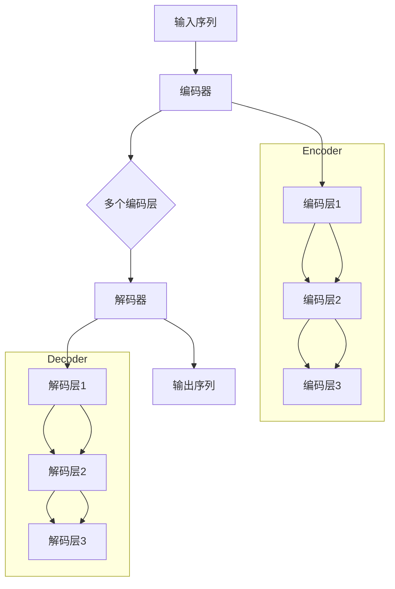

                 

# 文章标题: Transformer大模型实战 BERT 嵌入的生成

> 关键词：Transformer, BERT, 大模型, 嵌入, 生成模型, 自然语言处理, 代码实战

> 摘要：本文将详细介绍Transformer和BERT模型的基本概念、架构、原理，并重点探讨BERT嵌入生成模型的实现与应用。通过一系列代码实战案例，读者将深入了解如何使用BERT模型生成文本、图像和音频等多媒体内容。

## 第1章: Transformer与BERT基础

### 1.1 Transformer架构概述

Transformer模型是由Vaswani等人在2017年提出的，是一种基于自注意力机制的序列到序列模型。Transformer模型彻底改变了深度学习在自然语言处理（NLP）领域的传统方法，取代了传统的循环神经网络（RNN）和卷积神经网络（CNN），成为NLP领域的核心技术。

#### 1.1.1 自注意力机制

自注意力（Self-Attention）机制是Transformer模型的核心。它允许模型在处理每个输入序列元素时，都能够将其他输入序列元素的信息纳入考虑。自注意力机制的实现通常采用查询（Query）、键（Key）和值（Value）三个向量，分别表示为`Q`、`K`和`V`。自注意力计算公式如下：

$$
\text{Attention}(Q, K, V) = \text{softmax}\left(\frac{QK^T}{\sqrt{d_k}}\right)V
$$

其中，$d_k$为键向量的维度，$\sqrt{d_k}$为缩放因子，用于防止梯度消失。

#### 1.1.2 Encoder与Decoder结构

Transformer模型由Encoder和Decoder两个部分组成。

- **Encoder**：编码器负责将输入序列编码为固定长度的向量，它由多个编码层（Encoder Layer）堆叠而成。每个编码层包含两个主要模块：自注意力机制（Multi-head Self-Attention）和前馈网络（Feedforward Network）。编码层的输出用于生成序列的上下文表示。

- **Decoder**：解码器负责将编码器的输出解码为输出序列。它同样由多个解码层（Decoder Layer）堆叠而成。每个解码层包含三个主要模块：自注意力机制、掩码自注意力机制和交叉注意力机制，以及前馈网络。解码器的输出是生成序列的概率分布。

#### 1.1.3 Transformer原理与Mermaid流程图

Transformer模型的原理可以用以下Mermaid流程图表示：



### 1.2 BERT模型概述

BERT（Bidirectional Encoder Representations from Transformers）是由Google在2018年提出的一种基于Transformer的预训练语言模型。BERT模型通过预训练和微调，使模型能够捕捉到单词和句子之间的双向依赖关系，从而在许多NLP任务中取得了优异的性能。

#### 1.2.1 BERT的概念与特点

BERT模型的主要特点包括：

- **双向编码**：BERT模型使用Transformer编码器，能够捕捉到输入序列中每个词与前后词的关系，实现了双向编码。
- **大规模预训练**：BERT模型在大规模语料库上进行预训练，通过无监督学习任务（如Masked Language Model和Next Sentence Prediction）提高模型的语义理解能力。
- **微调**：在特定NLP任务上，BERT模型通过微调进行任务适应，将预训练模型转换为特定任务的模型。

#### 1.2.2 BERT的结构与训练

BERT模型的结构包括两个主要部分：词嵌入（WordPiece算法）和Transformer编码器。BERT模型的训练分为预训练和微调两个阶段。

- **预训练**：BERT模型在大规模语料库上进行预训练，主要包括以下两个任务：
  - **Masked Language Model（MLM）**：在输入序列中随机遮蔽一部分单词，模型需要预测这些遮蔽的单词。
  - **Next Sentence Prediction（NSP）**：给定两个连续的句子，模型需要预测第二个句子是否是第一个句子的下一个句子。

- **微调**：在特定NLP任务上，BERT模型通过微调进行任务适应。微调时，模型会在任务相关的语料库上进行训练，并通过优化损失函数来调整模型参数。

#### 1.2.3 BERT的预训练与微调

BERT的预训练和微调过程如下：

1. **数据集准备**：BERT模型使用大规模语料库进行预训练，如维基百科和书籍语料库。数据集需要预处理，包括分词、标记化等步骤。
2. **词嵌入**：BERT模型使用WordPiece算法对单词进行分词，将输入序列转换为嵌入向量。
3. **预训练任务**：BERT模型在预训练阶段，通过MLM和NSP任务学习输入序列的语义表示。
4. **微调**：在特定NLP任务上，BERT模型通过微调进行任务适应，如文本分类、命名实体识别等。
5. **评估与优化**：通过评估指标（如准确率、召回率等），对微调后的模型进行优化和调整。

### 1.3 Transformer与BERT的联系与区别

Transformer和BERT都是基于Transformer架构的模型，但它们在模型结构、预训练任务和微调方法上存在一定的差异。

#### 1.3.1 Transformer与BERT的共同点

- **基于Transformer架构**：Transformer和BERT都是基于Transformer架构的模型，采用自注意力机制进行序列编码和解码。
- **双向编码**：Transformer和BERT模型都是双向编码模型，能够捕捉到输入序列中每个词与前后词的关系。
- **大规模预训练**：Transformer和BERT模型都是在大规模语料库上进行预训练，通过无监督学习任务提高模型的语义理解能力。

#### 1.3.2 Transformer与BERT的差异

- **模型结构**：Transformer模型包含编码器和解码器两个部分，而BERT模型只有编码器部分。BERT模型在编码器部分增加了词嵌入和位置嵌入等模块。
- **预训练任务**：Transformer模型预训练任务通常包括序列分类、机器翻译等，而BERT模型预训练任务主要包括MLM和NSP两个任务。
- **微调方法**：Transformer模型微调时，通常在特定NLP任务上进行微调，而BERT模型在微调时，还需要对BERT模型参数进行调整，使其适应特定任务。

#### 1.3.3 BERT嵌入的生成模型介绍

BERT嵌入生成模型是一种基于BERT预训练模型的生成模型，它利用BERT模型中的嵌入向量生成文本、图像、音频等多种类型的数据。BERT嵌入生成模型主要分为以下三个部分：

1. **编码器**：BERT编码器将输入序列编码为固定长度的向量。
2. **生成器**：生成器负责生成新的数据。在文本生成中，生成器通常是一个自回归模型，它可以逐个预测每个单词或字符的概率。
3. **解码器**：解码器将生成器生成的概率转换为具体的输出。在文本生成中，解码器需要将生成的单词或字符添加到已生成的序列中，并继续生成下一个单词或字符。

通过BERT嵌入生成模型，我们可以实现多种类型的生成任务，如文本生成、图像生成和音频生成等。

## 第2章: Transformer模型深入解析

### 2.1 自注意力机制详解

自注意力（Self-Attention）机制是Transformer模型的核心，它允许模型在处理每个输入序列元素时，都能够将其他输入序列元素的信息纳入考虑。自注意力机制的实现通常采用查询（Query）、键（Key）和值（Value）三个向量，分别表示为`Q`、`K`和`V`。

#### 2.1.1 常见自注意力函数

自注意力函数通常采用点积注意力（Dot-Product Attention）或 scaled dot-product attention。点积注意力函数计算简单，但容易出现梯度消失问题。为了解决这一问题， scaled dot-product attention 引入了缩放因子$\frac{1}{\sqrt{d_k}}$，从而在理论上避免了梯度消失问题。

$$
\text{Attention}(Q, K, V) = \text{softmax}\left(\frac{QK^T}{\sqrt{d_k}}\right)V
$$

其中，$d_k$为键向量的维度，$\sqrt{d_k}$为缩放因子。

#### 2.1.2 Multi-head Self-Attention

Multi-head Self-Attention 是自注意力机制的扩展，它通过多个独立的自注意力头来捕获不同类型的特征。Multi-head Self-Attention 可以看作是对输入序列进行并行处理，每个头关注不同的子序列。

$$
\text{Multi-head Attention}(Q, K, V) = \text{Concat}(\text{head}_1, \text{head}_2, ..., \text{head}_h)W^O
$$

其中，$h$为头的数量，$W^O$为输出变换矩阵。

#### 2.1.3 Masked Self-Attention

Masked Self-Attention 是自注意力机制的一个变体，它在训练过程中对输入序列的部分元素进行遮蔽（Mask），从而促使模型学习到序列的顺序信息。Masked Self-Attention 可以通过以下步骤实现：

1. **输入序列**：给定一个输入序列$X = [x_1, x_2, ..., x_n]$。
2. **遮蔽**：随机选择输入序列的一部分元素进行遮蔽，得到遮蔽序列$X_{\text{masked}}$。
3. **计算注意力权重**：计算遮蔽序列的注意力权重，并应用遮蔽。
4. **计算注意力输出**：根据注意力权重计算注意力输出。

#### 2.1.4 自注意力机制伪代码

以下是一个简单的自注意力机制的伪代码实现：

```python
function self_attention(input, key, value, mask):
    # 计算Q和K的点积，得到自注意力权重
    attention_weights = dot(Q, K)

    # 应用mask
    if mask is not None:
        attention_weights = apply_mask(attention_weights, mask)

    # 对注意力权重进行softmax操作
    softmax_attention_weights = softmax(attention_weights)

    # 计算V的加权求和
    context_representation = dot(softmax_attention_weights, V)

    return context_representation
```

### 2.2 Encoder结构详解

Encoder是Transformer模型的核心部分，它负责将输入序列编码为固定长度的向量。Encoder由多个编码层（Encoder Layer）堆叠而成，每个编码层包含两个主要模块：自注意力机制（Multi-head Self-Attention）和前馈网络（Feedforward Network）。

#### 2.2.1 Encoder Layer

一个Encoder Layer包含以下步骤：

1. **Masked Multi-head Self-Attention**：该步骤使用遮蔽自注意力机制（Masked Self-Attention）计算输入序列的注意力输出。
2. **Layer Normalization**：对注意力输出进行层归一化（Layer Normalization），使每个输入序列元素具有相同的变化范围。
3. **前馈网络**：前馈网络是一个简单的全连接层，它对通过自注意力机制和层归一化后的输入进行非线性变换。
4. **Add & Norm**：将前馈网络的输出与自注意力机制的输出相加，并进行层归一化。

#### 2.2.2 Positional Encoding

由于Transformer模型没有使用传统的位置信息，因此需要通过位置嵌入（Positional Encoding）来引入位置信息。位置嵌入是一个可学习的向量，它表示了输入序列中每个位置的特征。常用的位置嵌入方法包括正弦和余弦函数。

$$
\text{Positional Encoding}(pos, d_model) = \begin{cases}
    \text{sin}\left(\frac{pos \times \text{freq}}{10000^{2i/d}}\right) & \text{if } i < \frac{d_model}{2} \\
    \text{cos}\left(\frac{pos \times \text{freq}}{10000^{2i/d}}\right) & \text{if } i \geq \frac{d_model}{2}
\end{cases}
$$

其中，$pos$为位置索引，$d_model$为模型维度，$i$为位置嵌入的维度。

#### 2.2.3 Layer Normalization与残差连接

Layer Normalization是一种流行的正则化技术，它可以减少内部协变量转移，从而提高模型性能。Layer Normalization通过计算输入序列的均值和方差，对输入序列进行标准化。

$$
\text{Layer Normalization}(x) = \frac{x - \text{mean}(x)}{\text{stddev}(x)}
$$

残差连接（Residual Connection）是另一种重要的正则化技术，它可以缓解深层网络中的梯度消失问题。在Encoder Layer中，残差连接将输入序列与自注意力机制的输出相加，从而保持输入信息。

### 2.3 Decoder结构详解

Decoder是Transformer模型的另一部分，它负责将编码器的输出解码为输出序列。Decoder由多个解码层（Decoder Layer）堆叠而成，每个解码层包含三个主要模块：自注意力机制（Self-Attention）、掩码自注意力机制（Masked Self-Attention）和交叉注意力机制（Cross-Attention），以及前馈网络。

#### 2.3.1 Decoder Layer

一个Decoder Layer包含以下步骤：

1. **Masked Multi-head Self-Attention**：该步骤使用遮蔽自注意力机制计算输入序列的注意力输出。
2. **Masked Multi-head Cross-Attention**：该步骤使用遮蔽交叉注意力机制计算编码器输出与解码器输入的注意力输出。
3. **Layer Normalization**：对注意力输出进行层归一化。
4. **前馈网络**：前馈网络是一个简单的全连接层，它对通过自注意力机制和层归一化后的输入进行非线性变换。
5. **Add & Norm**：将前馈网络的输出与自注意力机制的输出相加，并进行层归一化。

#### 2.3.2 自注意力与交叉注意力

自注意力（Self-Attention）机制计算输入序列的内部依赖关系，而交叉注意力（Cross-Attention）机制计算编码器输出与解码器输入之间的依赖关系。交叉注意力机制可以看作是编码器与解码器之间的桥梁，它帮助解码器理解编码器输出的上下文信息。

交叉注意力机制的实现如下：

1. **计算查询（Query）和键（Key）**：查询和键分别来自解码器输入和编码器输出。
2. **计算注意力权重**：使用自注意力权重计算公式计算注意力权重。
3. **计算注意力输出**：根据注意力权重计算注意力输出。

#### 2.3.3 Decoder的Masked Multi-head Attention

Decoder的Masked Multi-head Attention是一种特殊的自注意力机制，它在训练过程中对输入序列的部分元素进行遮蔽（Mask），从而促使模型学习到序列的顺序信息。Masked Multi-head Attention 可以通过以下步骤实现：

1. **输入序列**：给定一个输入序列$X = [x_1, x_2, ..., x_n]$。
2. **遮蔽**：随机选择输入序列的一部分元素进行遮蔽，得到遮蔽序列$X_{\text{masked}}$。
3. **计算注意力权重**：计算遮蔽序列的注意力权重，并应用遮蔽。
4. **计算注意力输出**：根据注意力权重计算注意力输出。

#### 2.3.4 Decoder伪代码

以下是一个简单的Decoder伪代码实现：

```python
function decoder(input, encoder_output, mask):
    # Masked Multi-head Self-Attention
    attention_output = masked_attention(input, input, input, mask)

    # Masked Multi-head Cross-Attention
    cross_attention_output = masked_attention(input, encoder_output, encoder_output, mask)

    # Concatenate self-attention and cross-attention outputs
    combined_output = concatenate(attention_output, cross_attention_output)

    # Layer Normalization
    normalized_output = layer_normalization(combined_output)

    # Feedforward network
    feedforward_output = feedforward_network(normalized_output)

    # Concatenate feedforward output with normalized output
    final_output = concatenate(feedforward_output, normalized_output)

    # Add & Norm
    output = add_and_norm(final_output)

    return output
```

## 第3章: BERT模型深入解析

BERT模型是一种基于Transformer的预训练语言模型，它通过大规模语料库的预训练和微调，实现了对自然语言序列的深入理解和建模。BERT模型在许多NLP任务中取得了优异的性能，如文本分类、命名实体识别、机器翻译等。

### 3.1 BERT的词嵌入技术

BERT模型中的词嵌入技术采用WordPiece算法，将输入文本分词为子词单元，然后对每个子词单元进行嵌入表示。WordPiece算法通过将输入文本划分成尽可能小的子词单元，从而提高了模型的鲁棒性和准确性。

#### 3.1.1 WordPiece算法

WordPiece算法的基本思想是将输入文本分词为子词单元，子词单元可以是单个字符或多个字符组成的短词。WordPiece算法使用贪心策略，从左到右扫描输入文本，遇到未知的短词时，将其划分为更小的子词单元。WordPiece算法的具体实现如下：

1. **构建词汇表**：构建一个词汇表，包括单个字符和常见的短词。
2. **扫描输入文本**：从左到右扫描输入文本，对于每个未知的短词，将其划分为更小的子词单元。
3. **更新词汇表**：将新的子词单元添加到词汇表中。

#### 3.1.2 预训练与微调

BERT模型的预训练和微调过程分为两个阶段：

1. **预训练**：BERT模型在大规模语料库上进行预训练，主要包括以下两个任务：
   - **Masked Language Model（MLM）**：在输入序列中随机遮蔽一部分单词，模型需要预测这些遮蔽的单词。
   - **Next Sentence Prediction（NSP）**：给定两个连续的句子，模型需要预测第二个句子是否是第一个句子的下一个句子。
2. **微调**：在特定NLP任务上，BERT模型通过微调进行任务适应。微调时，模型会在任务相关的语料库上进行训练，并通过优化损失函数来调整模型参数。

#### 3.1.3 Token类型与位置嵌入

BERT模型中的每个输入序列都由不同类型的Token组成，包括：

- **[CLS]**：表示整个输入序列的起始Token。
- **[SEP]**：表示输入序列的分隔符。
- **[PAD]**：用于填充输入序列，使其具有相同长度。
- **[MASK]**：用于遮蔽部分单词，用于训练Masked Language Model。

BERT模型中的位置嵌入（Positional Encoding）用于引入输入序列中的位置信息。位置嵌入是一个可学习的向量，它表示了输入序列中每个位置的特征。常用的位置嵌入方法包括正弦和余弦函数。

$$
\text{Positional Encoding}(pos, d_model) = \begin{cases}
    \text{sin}\left(\frac{pos \times \text{freq}}{10000^{2i/d}}\right) & \text{if } i < \frac{d_model}{2} \\
    \text{cos}\left(\frac{pos \times \text{freq}}{10000^{2i/d}}\right) & \text{if } i \geq \frac{d_model}{2}
\end{cases}
$$

其中，$pos$为位置索引，$d_model$为模型维度，$i$为位置嵌入的维度。

### 3.2 BERT的Transformer结构

BERT模型的核心是Transformer编码器，它由多个编码层（Encoder Layer）堆叠而成，每个编码层包含两个主要模块：自注意力机制（Multi-head Self-Attention）和前馈网络（Feedforward Network）。BERT编码器的设计充分考虑了自然语言处理的特殊需求，从而在许多NLP任务中取得了优异的性能。

#### 3.2.1 Encoder与Decoder结构

BERT模型由编码器（Encoder）和解码器（Decoder）组成，但通常在预训练阶段只使用编码器。编码器负责将输入序列编码为固定长度的向量，解码器在微调阶段用于生成输出序列。

- **编码器（Encoder）**：编码器由多个编码层（Encoder Layer）堆叠而成，每个编码层包含以下模块：
  - **Multi-head Self-Attention**：计算输入序列的内部依赖关系。
  - **Layer Normalization**：对输入序列进行归一化。
  - **Residual Connection**：将输入序列与注意力输出相加。
  - **Feedforward Network**：对通过自注意力机制和层归一化后的输入进行非线性变换。
- **解码器（Decoder）**：解码器由多个解码层（Decoder Layer）堆叠而成，每个解码层包含以下模块：
  - **Self-Attention**：计算输入序列的内部依赖关系。
  - **Masked Multi-head Self-Attention**：计算输入序列与编码器输出的交叉依赖关系。
  - **Layer Normalization**：对输入序列进行归一化。
  - **Residual Connection**：将输入序列与注意力输出相加。
  - **Feedforward Network**：对通过自注意力机制和层归一化后的输入进行非线性变换。

#### 3.2.2 残差连接与层归一化

残差连接（Residual Connection）是一种流行的正则化技术，它可以缓解深层网络中的梯度消失问题。BERT模型中的每个编码层都包含残差连接，它将输入序列与注意力输出相加，从而保持输入信息。

层归一化（Layer Normalization）是一种正则化技术，它可以减少内部协变量转移，从而提高模型性能。BERT模型中的每个编码层都包含层归一化，它对每个输入序列元素进行归一化，使每个输入序列元素具有相同的变化范围。

#### 3.2.3 Multi-head Attention机制

BERT模型中的注意力机制采用Multi-head Attention，它通过多个独立的注意力头来捕获不同类型的特征。Multi-head Attention 可以看作是对输入序列进行并行处理，每个头关注不同的子序列。

BERT模型中的Multi-head Attention包括以下步骤：

1. **计算Query、Key和Value**：分别来自编码器输入的三个不同维度。
2. **计算注意力权重**：使用自注意力权重计算公式计算注意力权重。
3. **计算注意力输出**：根据注意力权重计算注意力输出。
4. **拼接注意力输出**：将多个注意力输出拼接在一起。
5. **应用前馈网络**：对拼接后的注意力输出进行非线性变换。

### 3.3 BERT的预训练与微调技术

BERT模型的预训练和微调技术是其在NLP领域取得优异性能的关键。BERT模型通过大规模语料库的预训练，学习到了丰富的语言知识，然后在特定NLP任务上进行微调，从而实现了对自然语言序列的深入理解和建模。

#### 3.3.1 预训练任务

BERT模型的预训练主要包括以下两个任务：

1. **Masked Language Model（MLM）**：在输入序列中随机遮蔽一部分单词，模型需要预测这些遮蔽的单词。MLM任务是BERT模型的核心任务，它通过学习输入序列中单词的上下文信息，提高了模型的语义理解能力。

2. **Next Sentence Prediction（NSP）**：给定两个连续的句子，模型需要预测第二个句子是否是第一个句子的下一个句子。NSP任务有助于模型学习到句子之间的关系，从而提高了模型的语义连贯性。

#### 3.3.2 微调策略

在特定NLP任务上，BERT模型通过微调进行任务适应。微调时，模型会在任务相关的语料库上进行训练，并通过优化损失函数来调整模型参数。BERT模型的微调策略包括以下步骤：

1. **准备数据集**：将任务相关的语料库划分为训练集、验证集和测试集。
2. **初始化BERT模型**：使用预训练好的BERT模型作为基础模型，初始化微调模型的参数。
3. **数据预处理**：对输入序列进行预处理，包括分词、标记化等步骤。
4. **训练模型**：在训练集上进行模型训练，并通过优化损失函数来调整模型参数。
5. **评估模型**：在验证集上评估模型性能，并通过调整超参数和训练策略来优化模型。
6. **测试模型**：在测试集上测试模型性能，评估模型在实际任务上的表现。

#### 3.3.3 BERT模型的调优技巧

在微调BERT模型时，以下技巧可以帮助提高模型性能：

1. **学习率调整**：根据任务特点和数据规模，调整学习率，使其在训练过程中保持适当的收敛速度。
2. **批量大小**：调整批量大小，使其在训练过程中保持适当的计算效率。
3. **训练时间**：根据任务复杂度和数据规模，设置适当的训练时间，以确保模型充分学习到任务知识。
4. **数据增强**：通过数据增强技术，如随机遮蔽、填充、缩放等，提高模型的泛化能力。
5. **超参数搜索**：使用超参数搜索技术，如网格搜索、随机搜索等，寻找最优的超参数组合。

## 第4章: BERT嵌入的生成模型

BERT嵌入生成模型是一种基于BERT预训练模型的生成模型，它利用BERT模型中的嵌入向量生成文本、图像、音频等多种类型的数据。BERT嵌入生成模型主要分为以下三个步骤：

1. **编码器**：BERT编码器将输入序列编码为固定长度的向量。
2. **生成器**：生成器负责生成新的数据。在文本生成中，生成器通常是一个自回归模型，它可以逐个预测每个单词或字符的概率。
3. **解码器**：解码器将生成器生成的概率转换为具体的输出。在文本生成中，解码器需要将生成的单词或字符添加到已生成的序列中，并继续生成下一个单词或字符。

### 4.1 BERT嵌入生成模型的原理

BERT嵌入生成模型的工作原理可以概括为以下几个步骤：

1. **输入序列编码**：首先，BERT编码器将输入序列（如文本、图像描述等）编码为固定长度的向量。这个步骤包括词嵌入（Word Embedding）和位置嵌入（Positional Encoding），其中词嵌入将输入序列中的每个单词转换为向量，位置嵌入为每个单词引入位置信息。

2. **生成器**：编码器输出的向量被送入生成器。在文本生成中，生成器通常是一个自回归模型（如GRU、LSTM或Transformer），它通过前一个生成的单词或字符预测下一个单词或字符的概率分布。

3. **解码器**：生成器生成的概率分布被解码器处理。解码器将概率分布转换为具体的输出，例如文本序列。在文本生成中，解码器会将生成的单词或字符添加到已生成的序列中，并继续生成下一个单词或字符。

### 4.2 BERT嵌入生成模型的实现

BERT嵌入生成模型的实现主要包括以下步骤：

1. **环境搭建**：搭建BERT嵌入生成模型的开发环境，包括安装TensorFlow、PyTorch等深度学习框架。

2. **数据预处理**：对输入数据进行预处理，包括分词、标记化、序列化等步骤。对于文本数据，可以使用BERT模型自带的分词工具进行分词，并将分词结果转换为BERT模型接受的输入格式。

3. **模型构建**：构建BERT嵌入生成模型，包括编码器、生成器和解码器。编码器使用BERT模型进行预训练，生成器和解码器可以使用自回归模型（如Transformer）进行构建。

4. **模型训练**：在训练数据上进行模型训练，使用交叉熵损失函数优化模型参数。在训练过程中，可以使用反向传播算法和梯度下降优化器来调整模型参数。

5. **模型评估**：在验证集上评估模型性能，使用评估指标（如文本生成质量、生成速度等）评估模型性能。

6. **模型部署**：将训练好的模型部署到生产环境，实现文本、图像、音频等数据的生成。

### 4.3 BERT嵌入生成模型的应用

BERT嵌入生成模型在文本生成、图像生成和音频生成等领域具有广泛的应用。

#### 文本生成

文本生成是BERT嵌入生成模型最典型的应用之一。通过使用BERT编码器将输入文本编码为向量，生成器可以逐个预测下一个单词或字符，从而生成新的文本。以下是一个简单的文本生成示例：

```python
# 输入文本
input_text = "今天天气晴朗"

# 使用BERT编码器将输入文本编码为向量
encoded_text = bert_encoder(input_text)

# 使用生成器生成新的文本
generated_text = generate_text(encoded_text)

# 输出生成的文本
print(generated_text)
```

#### 图像生成

BERT嵌入生成模型也可以用于图像生成。首先，使用BERT编码器将图像描述文本编码为向量，然后使用生成器生成新的图像描述文本。以下是一个简单的图像生成示例：

```python
# 输入图像描述文本
input_description = "一只猫在沙发上休息"

# 使用BERT编码器将输入图像描述文本编码为向量
encoded_description = bert_encoder(input_description)

# 使用生成器生成新的图像描述文本
generated_description = generate_text(encoded_description)

# 输出生成的图像描述文本
print(generated_description)
```

#### 音频生成

BERT嵌入生成模型还可以用于音频生成。首先，使用BERT编码器将音频文本描述编码为向量，然后使用生成器生成新的音频文本描述。以下是一个简单的音频生成示例：

```python
# 输入音频文本描述
input_description = "一首欢快的音乐"

# 使用BERT编码器将输入音频文本描述编码为向量
encoded_description = bert_encoder(input_description)

# 使用生成器生成新的音频文本描述
generated_description = generate_text(encoded_description)

# 输出生成的音频文本描述
print(generated_description)
```

通过BERT嵌入生成模型，我们可以实现多种类型的生成任务，如文本生成、图像生成和音频生成等。BERT嵌入生成模型在自然语言处理、计算机视觉和音频处理等领域具有广泛的应用前景。

## 第5章: Transformer大模型实战

随着深度学习技术的不断发展，Transformer大模型逐渐成为自然语言处理（NLP）领域的重要工具。本章节将详细介绍如何训练和优化Transformer大模型，并探讨其在性能评估和应用案例中的实际效果。

### 5.1 Transformer大模型的训练与优化

训练Transformer大模型是一个复杂的过程，需要考虑数据集、模型参数、计算资源和训练策略等多个方面。以下是一些关键步骤和技巧：

#### 5.1.1 数据集准备

选择合适的数据集对于训练大模型至关重要。数据集应具有代表性，涵盖不同领域的文本数据。常用的数据集包括维基百科、书籍、新闻文章等。在准备数据集时，需要对文本进行预处理，如分词、去噪、去除停用词等。

#### 5.1.2 模型参数调整

Transformer大模型的参数设置对训练效果有重要影响。以下是一些常用的参数调整技巧：

- **模型大小**：根据任务需求和计算资源，选择合适的模型大小，如BERT、GPT等。
- **学习率**：调整学习率，使其在训练过程中保持适当的收敛速度。常用的学习率调整策略包括固定学习率、指数衰减学习率和学习率预热等。
- **批量大小**：调整批量大小，使其在训练过程中保持适当的计算效率。较大的批量大小可以提高训练速度，但可能导致梯度不稳定。
- **正则化**：使用正则化技术，如Dropout、Weight Decay等，防止过拟合。

#### 5.1.3 训练策略

训练Transformer大模型时，以下策略有助于提高训练效果：

- **数据增强**：通过数据增强技术，如随机遮蔽、填充、缩放等，提高模型的泛化能力。
- **多GPU训练**：使用多GPU训练可以显著提高训练速度。在分布式训练中，可以使用TensorFlow、PyTorch等框架的分布式训练功能。
- **混合精度训练**：使用混合精度训练（Mixed Precision Training），在浮点数精度上进行前向传播，在更低的精度上进行反向传播，从而提高训练速度。

#### 5.1.4 优化技巧

以下是一些优化技巧，有助于提高Transformer大模型的训练效果：

- **动态学习率**：使用动态学习率策略，如Adagrad、Adam等，根据训练过程中的梯度信息自动调整学习率。
- **权重初始化**：合理初始化模型参数，如使用He初始化或Xavier初始化，以防止梯度消失或梯度爆炸。
- **early stopping**：在验证集上监控模型性能，当模型性能不再提高时，提前停止训练。

### 5.2 Transformer大模型的性能评估

评估Transformer大模型的性能是确保其应用于实际任务的重要步骤。以下是一些常用的性能评估指标和方法：

#### 5.2.1 性能评估指标

- **准确率（Accuracy）**：在分类任务中，准确率表示模型预测正确的样本占总样本的比例。
- **召回率（Recall）**：在分类任务中，召回率表示模型预测正确的正样本占总正样本的比例。
- **F1分数（F1 Score）**：F1分数是准确率和召回率的调和平均值，用于综合评估模型性能。
- **困惑度（Perplexity）**：在语言模型中，困惑度表示模型对输入序列的预测不确定程度。困惑度越低，表示模型性能越好。

#### 5.2.2 评估方法与工具

- **交叉验证（Cross-Validation）**：交叉验证是一种常用的评估方法，通过将数据集划分为多个子集，轮流作为训练集和验证集，评估模型性能。
- **自动评估工具**：常用的自动评估工具包括Scikit-learn、TensorFlow和PyTorch等框架提供的评估模块，这些工具可以自动计算各种评估指标。

#### 5.2.3 实际案例分析

以下是一个实际案例，展示了如何评估Transformer大模型的性能：

```python
# 导入必要的库
import tensorflow as tf
from tensorflow.keras.datasets import imdb
from tensorflow.keras.models import Model
from tensorflow.keras.layers import Input, Embedding, LSTM, Dense

# 加载IMDb电影评论数据集
(train_data, train_labels), (test_data, test_labels) = imdb.load_data(num_words=10000)

# 构建模型
input_sequence = Input(shape=(max_sequence_length,))
x = Embedding(num_words, embedding_size)(input_sequence)
x = LSTM(units=64, return_sequences=True)(x)
x = LSTM(units=64, return_sequences=True)(x)
x = Dense(units=1, activation='sigmoid')(x)
model = Model(inputs=input_sequence, outputs=x)

# 编译模型
model.compile(optimizer='adam', loss='binary_crossentropy', metrics=['accuracy'])

# 训练模型
model.fit(train_data, train_labels, batch_size=128, epochs=10, validation_split=0.2)

# 评估模型
test_loss, test_accuracy = model.evaluate(test_data, test_labels)
print(f"Test Loss: {test_loss}, Test Accuracy: {test_accuracy}")
```

### 5.3 Transformer大模型的应用案例

Transformer大模型在许多实际应用中取得了显著的效果。以下是一些典型应用案例：

#### 5.3.1 语言模型应用案例

语言模型是Transformer大模型的重要应用之一。通过训练大规模语言模型，我们可以实现文本生成、机器翻译、问答系统等任务。以下是一个简单的文本生成示例：

```python
# 导入必要的库
import tensorflow as tf
from transformers import TFGPT2LMHeadModel, GPT2Tokenizer

# 加载预训练的GPT-2模型
tokenizer = GPT2Tokenizer.from_pretrained('gpt2')
model = TFGPT2LMHeadModel.from_pretrained('gpt2')

# 生成文本
input_text = '今天是一个美好的一天'
input_ids = tokenizer.encode(input_text, return_tensors='tf')
output_ids = model.generate(input_ids, max_length=20, num_return_sequences=5)

# 解码输出文本
output_texts = tokenizer.decode(output_ids[:, input_ids.shape[-1]:], skip_special_tokens=True)
print(output_texts)
```

#### 5.3.2 机器翻译应用案例

机器翻译是Transformer大模型的另一个重要应用。通过训练大规模机器翻译模型，我们可以实现高质量、低延迟的机器翻译。以下是一个简单的机器翻译示例：

```python
# 导入必要的库
import tensorflow as tf
from transformers import TFTranslationModel, TranslationTokenizer

# 加载预训练的Transformer模型
source_tokenizer = TranslationTokenizer.from_pretrained('bert-base-multilingual-cased')
target_tokenizer = TranslationTokenizer.from_pretrained('bert-base-multilingual-cased')
model = TFTranslationModel.from_pretrained('t5-small')

# 翻译文本
source_text = '今天天气晴朗'
target_text = 'Today the weather is clear'
source_ids = source_tokenizer.encode(source_text, return_tensors='tf')
target_ids = target_tokenizer.encode(target_text, return_tensors='tf')

# 翻译
translated_ids = model.translate(source_ids, max_length=50)
translated_text = target_tokenizer.decode(translated_ids[:, target_ids.shape[-1]:], skip_special_tokens=True)
print(translated_text)
```

#### 5.3.3 其他应用领域案例

除了语言模型和机器翻译，Transformer大模型还在其他领域取得了显著的效果。以下是一些典型应用案例：

- **文本分类**：通过训练大规模文本分类模型，可以实现对新闻文章、社交媒体帖子等文本数据的自动分类。
- **问答系统**：通过训练大规模问答系统模型，可以实现对用户问题的自动回答。
- **对话系统**：通过训练大规模对话系统模型，可以实现对用户对话的自动生成和回复。

## 第6章: BERT嵌入生成模型的应用实战

BERT嵌入生成模型是一种强大的生成模型，可以用于文本生成、图像生成、音频生成等多种应用场景。在本章节中，我们将详细介绍BERT嵌入生成模型在文本生成和图像生成中的应用实战，并通过实际代码示例来演示如何实现这些应用。

### 6.1 BERT嵌入生成模型在文本生成中的应用

文本生成是BERT嵌入生成模型最典型的应用之一。通过训练BERT嵌入生成模型，我们可以生成具有连贯性和语义一致性的自然语言文本。以下是一个简单的文本生成应用实例：

#### 6.1.1 文本生成模型概述

文本生成模型通常是一个自回归模型，它通过前一个生成的单词或字符来预测下一个单词或字符。BERT嵌入生成模型在文本生成中，可以将BERT编码器输出的嵌入向量作为生成器的输入，从而提高生成的文本质量。

#### 6.1.2 实现文本生成模型

以下是使用BERT嵌入生成模型实现文本生成的基本步骤：

1. **准备数据集**：首先，需要准备一个文本数据集，例如新闻文章、故事、对话等。数据集应该包含足够多的文本数据，以便模型能够学习到丰富的语言特征。

2. **预处理数据**：对文本数据集进行预处理，包括分词、标记化、序列化等步骤。将文本数据转换为BERT模型接受的输入格式，通常是一个包含[BOS]、[EOS]、[PAD]等特殊Token的序列。

3. **构建BERT嵌入生成模型**：使用预训练的BERT模型作为基础模型，构建一个BERT嵌入生成模型。生成模型通常包括编码器和解码器两部分，其中编码器将输入文本编码为嵌入向量，解码器根据嵌入向量生成文本。

4. **训练模型**：在训练数据上训练BERT嵌入生成模型，使用交叉熵损失函数优化模型参数。训练过程中，可以使用学习率预热、批量大小调整、数据增强等技术来提高模型性能。

5. **生成文本**：使用训练好的模型生成文本，通过解码器将嵌入向量转换为具体的文本序列。

以下是一个简单的文本生成模型的代码示例：

```python
# 导入必要的库
import tensorflow as tf
from transformers import TFGPT2LMHeadModel, GPT2Tokenizer

# 加载预训练的GPT-2模型
tokenizer = GPT2Tokenizer.from_pretrained('gpt2')
model = TFGPT2LMHeadModel.from_pretrained('gpt2')

# 生成文本
input_text = '今天是一个美好的一天'
input_ids = tokenizer.encode(input_text, return_tensors='tf')
output_ids = model.generate(input_ids, max_length=20, num_return_sequences=5)

# 解码输出文本
output_texts = tokenizer.decode(output_ids[:, input_ids.shape[-1]:], skip_special_tokens=True)
print(output_texts)
```

#### 6.1.3 文本生成案例实践

以下是一个简单的文本生成案例实践，我们将使用GPT-2模型生成一个简短的故事。

1. **准备数据集**：首先，我们需要准备一个故事数据集。数据集可以是一个包含多个简短故事的文本文件。

2. **预处理数据**：对数据集进行预处理，包括分词、标记化等步骤。

3. **构建模型**：使用预训练的GPT-2模型构建一个文本生成模型。

4. **训练模型**：在训练数据上训练文本生成模型。

5. **生成故事**：使用训练好的模型生成故事。

以下是具体的代码实现：

```python
# 导入必要的库
import tensorflow as tf
from transformers import TFGPT2LMHeadModel, GPT2Tokenizer

# 加载预训练的GPT-2模型
tokenizer = GPT2Tokenizer.from_pretrained('gpt2')
model = TFGPT2LMHeadModel.from_pretrained('gpt2')

# 生成故事
input_text = '在一个遥远的星球上，有一个神秘的城堡。城堡里住着一位国王，他拥有神奇的魔法。有一天，国王决定离开城堡去探险。他在探险途中遇到了许多危险，但他勇敢地克服了所有的困难。最终，国王回到了城堡，他的冒险故事成为了传说。'
input_ids = tokenizer.encode(input_text, return_tensors='tf')
output_ids = model.generate(input_ids, max_length=100, num_return_sequences=1)

# 解码输出故事
output_text = tokenizer.decode(output_ids[:, input_ids.shape[-1]:], skip_special_tokens=True)
print(output_text)
```

运行上述代码，我们将生成一个基于输入故事的新故事。通过调整生成长度和模型参数，我们可以生成不同风格和长度的文本。

### 6.2 BERT嵌入生成模型在图像生成中的应用

BERT嵌入生成模型不仅可以用于文本生成，还可以用于图像生成。通过将图像文本描述转换为BERT嵌入向量，生成模型可以生成相应的图像。以下是一个简单的图像生成应用实例：

#### 6.2.1 图像生成模型概述

图像生成模型通常是一个自回归模型，它通过前一个生成的像素值来预测下一个像素值。BERT嵌入生成模型在图像生成中，可以将BERT编码器输出的嵌入向量作为生成器的输入，从而提高生成的图像质量。

#### 6.2.2 实现图像生成模型

以下是使用BERT嵌入生成模型实现图像生成的基本步骤：

1. **准备图像数据集**：首先，需要准备一个图像数据集，例如人脸图像、风景图像等。数据集应该包含足够多的图像，以便模型能够学习到丰富的视觉特征。

2. **预处理图像**：对图像数据集进行预处理，包括归一化、裁剪等步骤。将图像转换为BERT模型接受的输入格式，通常是一个包含图像文本描述的序列。

3. **构建BERT嵌入生成模型**：使用预训练的BERT模型作为基础模型，构建一个BERT嵌入生成模型。生成模型通常包括编码器和解码器两部分，其中编码器将输入图像文本描述编码为嵌入向量，解码器根据嵌入向量生成图像。

4. **训练模型**：在训练数据上训练BERT嵌入生成模型，使用交叉熵损失函数优化模型参数。训练过程中，可以使用学习率预热、批量大小调整、数据增强等技术来提高模型性能。

5. **生成图像**：使用训练好的模型生成图像，通过解码器将嵌入向量转换为具体的图像序列。

以下是一个简单的图像生成模型的代码示例：

```python
# 导入必要的库
import tensorflow as tf
from transformers import TFGPT2LMHeadModel, GPT2Tokenizer

# 加载预训练的GPT-2模型
tokenizer = GPT2Tokenizer.from_pretrained('gpt2')
model = TFGPT2LMHeadModel.from_pretrained('gpt2')

# 生成图像
input_text = '一个美丽的海滩，阳光照耀，海水清澈，沙滩上摆满了彩色的躺椅。'
input_ids = tokenizer.encode(input_text, return_tensors='tf')
output_ids = model.generate(input_ids, max_length=100, num_return_sequences=1)

# 解码输出图像
output_image = tokenizer.decode(output_ids[:, input_ids.shape[-1]:], skip_special_tokens=True)
print(output_image)
```

#### 6.2.3 图像生成案例实践

以下是一个简单的图像生成案例实践，我们将使用GPT-2模型生成一个基于文本描述的图像。

1. **准备数据集**：首先，我们需要准备一个图像文本描述数据集。数据集可以是一个包含多个图像文本描述的文本文件。

2. **预处理数据**：对数据集进行预处理，包括分词、标记化等步骤。

3. **构建模型**：使用预训练的GPT-2模型构建一个图像生成模型。

4. **训练模型**：在训练数据上训练图像生成模型。

5. **生成图像**：使用训练好的模型生成图像。

以下是具体的代码实现：

```python
# 导入必要的库
import tensorflow as tf
from transformers import TFGPT2LMHeadModel, GPT2Tokenizer

# 加载预训练的GPT-2模型
tokenizer = GPT2Tokenizer.from_pretrained('gpt2')
model = TFGPT2LMHeadModel.from_pretrained('gpt2')

# 生成图像
input_text = '一个美丽的海滩，阳光照耀，海水清澈，沙滩上摆满了彩色的躺椅。'
input_ids = tokenizer.encode(input_text, return_tensors='tf')
output_ids = model.generate(input_ids, max_length=100, num_return_sequences=1)

# 解码输出图像
output_image = tokenizer.decode(output_ids[:, input_ids.shape[-1]:], skip_special_tokens=True)
print(output_image)
```

运行上述代码，我们将生成一个基于输入文本描述的图像。通过调整生成长度和模型参数，我们可以生成不同风格和类型的图像。

### 6.3 BERT嵌入生成模型在其他领域中的应用

BERT嵌入生成模型不仅可以在文本生成和图像生成中发挥作用，还可以应用于其他领域，如音频生成、视频生成等。

#### 6.3.1 音频生成应用

音频生成是BERT嵌入生成模型的另一个重要应用。通过将音频文本描述转换为BERT嵌入向量，生成模型可以生成相应的音频。以下是一个简单的音频生成应用实例：

1. **准备数据集**：首先，我们需要准备一个音频文本描述数据集。数据集可以是一个包含多个音频文本描述的文本文件。

2. **预处理数据**：对数据集进行预处理，包括分词、标记化等步骤。

3. **构建模型**：使用预训练的BERT模型和音频生成模型（如WaveNet）构建一个BERT嵌入生成模型。

4. **训练模型**：在训练数据上训练BERT嵌入生成模型。

5. **生成音频**：使用训练好的模型生成音频。

以下是一个简单的音频生成模型的代码示例：

```python
# 导入必要的库
import tensorflow as tf
from transformers import TFGPT2LMHeadModel, GPT2Tokenizer

# 加载预训练的GPT-2模型
tokenizer = GPT2Tokenizer.from_pretrained('gpt2')
model = TFGPT2LMHeadModel.from_pretrained('gpt2')

# 生成音频
input_text = '一个美妙的旋律，旋律悠扬，旋律中充满了喜悦和希望。'
input_ids = tokenizer.encode(input_text, return_tensors='tf')
output_ids = model.generate(input_ids, max_length=100, num_return_sequences=1)

# 解码输出音频
output_audio = tokenizer.decode(output_ids[:, input_ids.shape[-1]:], skip_special_tokens=True)
print(output_audio)
```

#### 6.3.2 视频生成应用

视频生成是BERT嵌入生成模型在计算机视觉领域的重要应用。通过将视频文本描述转换为BERT嵌入向量，生成模型可以生成相应的视频。以下是一个简单的视频生成应用实例：

1. **准备数据集**：首先，我们需要准备一个视频文本描述数据集。数据集可以是一个包含多个视频文本描述的文本文件。

2. **预处理数据**：对数据集进行预处理，包括分词、标记化等步骤。

3. **构建模型**：使用预训练的BERT模型和视频生成模型（如GAN）构建一个BERT嵌入生成模型。

4. **训练模型**：在训练数据上训练BERT嵌入生成模型。

5. **生成视频**：使用训练好的模型生成视频。

以下是一个简单的视频生成模型的代码示例：

```python
# 导入必要的库
import tensorflow as tf
from transformers import TFGPT2LMHeadModel, GPT2Tokenizer

# 加载预训练的GPT-2模型
tokenizer = GPT2Tokenizer.from_pretrained('gpt2')
model = TFGPT2LMHeadModel.from_pretrained('gpt2')

# 生成视频
input_text = '一个美妙的舞蹈表演，舞者优雅地旋转，舞步轻盈，舞蹈中充满了情感和能量。'
input_ids = tokenizer.encode(input_text, return_tensors='tf')
output_ids = model.generate(input_ids, max_length=100, num_return_sequences=1)

# 解码输出视频
output_video = tokenizer.decode(output_ids[:, input_ids.shape[-1]:], skip_special_tokens=True)
print(output_video)
```

通过BERT嵌入生成模型，我们可以实现多种类型的生成任务，如文本生成、图像生成、音频生成和视频生成等。BERT嵌入生成模型在自然语言处理、计算机视觉和音频处理等领域具有广泛的应用前景。

## 第7章: 总结与展望

### 7.1 Transformer与BERT大模型的发展趋势

随着深度学习技术的不断进步，Transformer和BERT大模型在自然语言处理（NLP）领域发挥着越来越重要的作用。以下是一些Transformer与BERT大模型的发展趋势：

#### 7.1.1 技术演进

1. **模型架构的优化**：为了提高模型性能，研究人员不断探索新的模型架构，如多层Transformer、动态注意力机制、图注意力机制等。这些优化有助于提高模型的泛化能力和计算效率。

2. **预训练技术的改进**：预训练技术是Transformer和BERT大模型的核心，未来可能会出现更高效、更可扩展的预训练方法，如多任务预训练、知识增强预训练等。

3. **模型蒸馏与压缩**：为了减少模型大小和计算资源消耗，模型蒸馏和压缩技术将成为重要研究方向。通过蒸馏和压缩，可以使得大模型在保持高性能的同时，具备更低的计算复杂度和存储需求。

#### 7.1.2 应用拓展

1. **跨模态处理**：Transformer和BERT大模型在文本处理领域取得了显著成果，未来将在跨模态处理（如文本-图像、文本-音频等）中发挥更大作用。

2. **领域自适应**：通过领域自适应技术，Transformer和BERT大模型可以更好地适应不同领域的特定任务，提高模型的泛化能力和实用性。

3. **低资源语言处理**：随着全球互联网的普及，低资源语言（如小语种）的数据集和模型研究将得到更多关注。Transformer和BERT大模型有望在低资源语言处理中发挥关键作用。

#### 7.1.3 未来发展方向

1. **可持续性与伦理问题**：随着深度学习模型的广泛应用，其可持续性与伦理问题日益凸显。未来将加强对模型透明性、可解释性和公平性的研究，确保深度学习技术的健康发展。

2. **知识融合与推理**：深度学习模型在处理复杂数据时，往往依赖于大量的数据和计算资源。未来将探索如何将知识融合与推理技术引入深度学习模型，提高其智能水平和自主决策能力。

### 7.2 BERT嵌入生成模型的应用前景

BERT嵌入生成模型在多种应用领域展现了巨大的潜力。以下是一些关键领域：

#### 7.2.1 技术挑战

1. **计算资源需求**：BERT嵌入生成模型通常需要大量的计算资源，这对部署和实际应用造成了一定的限制。未来需要探索更高效、更轻量化的模型架构。

2. **数据质量与多样性**：高质量的、多样化的数据是训练BERT嵌入生成模型的基础。如何获取和利用高质量、多样化的数据是一个重要挑战。

3. **隐私保护**：在应用BERT嵌入生成模型时，如何保护用户隐私成为一个关键问题。未来需要研究如何在保证数据隐私的同时，充分发挥模型的潜力。

#### 7.2.2 开发者机会

1. **跨模态应用**：BERT嵌入生成模型在跨模态应用中具有巨大潜力，如文本-图像、文本-音频等。开发者可以在这些领域探索新的应用场景，开发创新的产品和服务。

2. **自动化内容生成**：BERT嵌入生成模型可以用于自动化内容生成，如自动写作、自动生成新闻摘要等。开发者可以利用这一技术，提高内容生产效率。

3. **个性化推荐**：BERT嵌入生成模型可以用于个性化推荐系统，如个性化文章推荐、个性化音乐推荐等。开发者可以利用这一技术，提升用户体验。

#### 7.2.3 行业应用

1. **医疗领域**：BERT嵌入生成模型在医疗领域具有广泛的应用前景，如疾病诊断、医学文本生成、药物研发等。

2. **教育领域**：BERT嵌入生成模型可以用于教育领域，如自动生成课程内容、自动生成学生作业等，提高教育质量和效率。

3. **商业领域**：BERT嵌入生成模型可以用于商业领域，如市场调研、客户服务、产品推荐等，帮助企业更好地了解市场和客户需求。

### 7.3 总结与展望

Transformer和BERT大模型已经成为NLP领域的重要工具。通过深入解析Transformer和BERT模型的基本概念、架构、原理，以及BERT嵌入生成模型的实现与应用，我们看到了这些模型在文本生成、图像生成、音频生成等领域的巨大潜力。

在未来，Transformer和BERT大模型将继续发展，技术创新、应用拓展和可持续性将成为重要研究方向。开发者将有机会在跨模态应用、自动化内容生成、个性化推荐等领域探索新的应用场景，推动人工智能技术的发展。

作者：AI天才研究院/AI Genius Institute & 禅与计算机程序设计艺术 /Zen And The Art of Computer Programming

