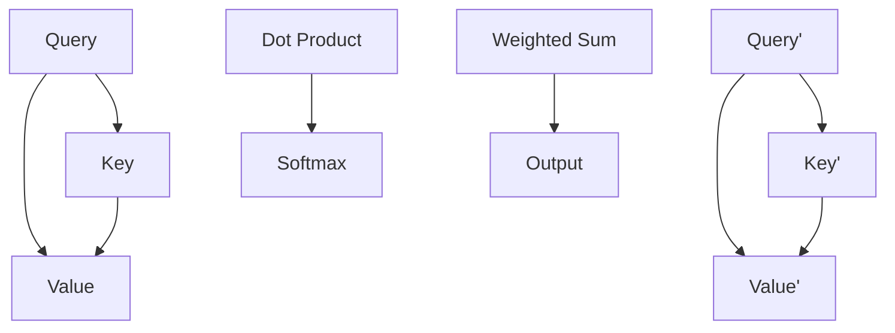
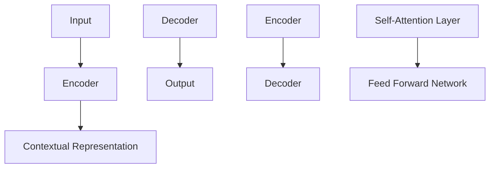
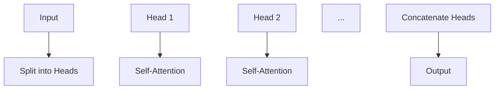
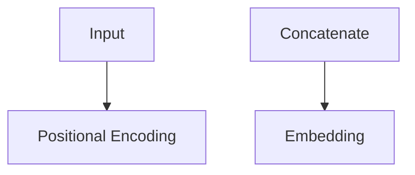
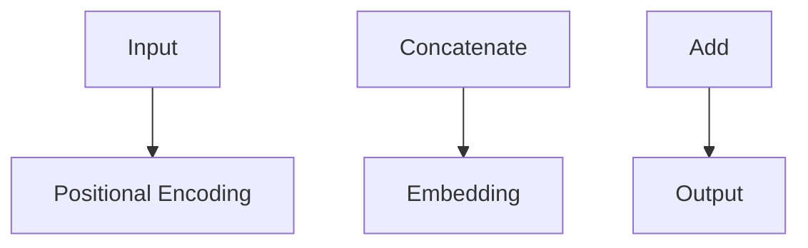

                 

# Transformer大模型实战: ClinicalBERT模型

## 关键词
Transformer模型、ClinicalBERT、自然语言处理、医疗数据分析、文本分类、问答系统

## 摘要
本文将深入探讨Transformer模型及其在医疗领域的变体ClinicalBERT的应用。首先，我们将介绍Transformer模型的基础知识，包括其历史背景、核心原理和主要变体。随后，文章将详细解释ClinicalBERT模型的原理和结构，并探讨其在医疗数据分析中的具体应用案例。文章还将涉及ClinicalBERT模型的数学基础、项目实战以及高效训练与优化技巧。最后，我们将展望ClinicalBERT模型未来的发展趋势和面临的挑战。

## 目录

### 第一部分: Transformer大模型基础

#### 第1章: Transformer大模型概述

##### 1.1 Transformer大模型的历史与背景

###### 1.1.1 Transformer模型的诞生

Transformer模型是由Vaswani等人于2017年提出的，它是基于自注意力机制构建的全新序列建模方法。在此之前，序列模型主要依赖于循环神经网络（RNN）和长短时记忆网络（LSTM），但Transformer模型的出现彻底改变了这一格局。Transformer模型的核心思想是通过全局自注意力机制来建模序列中的依赖关系，从而显著提高了模型的性能。

###### 1.1.2 Transformer模型的核心优势

Transformer模型具有多个核心优势，包括并行计算能力、更稳定的训练过程和更高的性能。首先，由于自注意力机制不需要像RNN和LSTM那样依赖于时间序列，因此Transformer模型能够实现真正的并行计算。其次，Transformer模型的训练过程更加稳定，不容易陷入局部最优。最后，Transformer模型在多个自然语言处理任务上均取得了显著的性能提升。

###### 1.1.3 Transformer模型的发展与应用趋势

自Transformer模型提出以来，它迅速在自然语言处理领域得到了广泛应用。BERT、GPT和T5等基于Transformer的变体模型相继出现，进一步推动了自然语言处理技术的发展。未来，Transformer模型有望在更多领域得到应用，如计算机视觉、语音识别等。

##### 1.2 Transformer模型的原理与架构

###### 1.2.1 自注意力机制详解

自注意力机制是Transformer模型的核心，它通过计算序列中每个元素与其他元素之间的相关性来建模依赖关系。自注意力机制主要包括三个步骤：计算查询（Q）、键（K）和值（V）之间的点积，然后通过softmax函数进行归一化，最后通过加权求和得到输出。



###### 1.2.2 Encoder与Decoder的结构

Transformer模型由编码器（Encoder）和解码器（Decoder）两部分组成。编码器负责将输入序列转换为上下文表示，解码器则根据上下文表示生成输出序列。编码器和解码器均由多个相同的自注意力层和前馈网络堆叠而成。



###### 1.2.3 Transformer模型的训练过程

Transformer模型的训练过程主要包括两个阶段：预训练和微调。在预训练阶段，模型在大量无标签数据上学习语言表示。在微调阶段，模型在特定任务的有标签数据上进行微调，从而实现任务目标。

##### 1.3 Transformer模型的核心算法

###### 1.3.1 Multi-Head Attention机制

Multi-Head Attention机制是Transformer模型的重要组成部分，它通过将输入序列分成多个头（Head），每个头独立地计算自注意力，从而提高了模型的表示能力。



###### 1.3.2 Positional Encoding技术

由于Transformer模型不依赖于序列信息，因此需要引入位置编码（Positional Encoding）来捕捉输入序列的位置信息。位置编码通过为每个位置分配一个向量来实现。



###### 1.3.3 适用于序列数据的处理

Transformer模型通过自注意力机制和位置编码技术，能够有效地处理序列数据。在自然语言处理任务中，Transformer模型已取得了显著的性能提升，并在多个任务中成为基准模型。

##### 1.4 Transformer模型的主要变体

###### 1.4.1 BERT模型详解

BERT（Bidirectional Encoder Representations from Transformers）是Google于2018年提出的一种基于Transformer的预训练模型。BERT模型通过双向编码器来学习文本的上下文表示，从而显著提高了自然语言处理任务的性能。

###### 1.4.2 GPT模型详解

GPT（Generative Pre-trained Transformer）是OpenAI于2018年提出的一种基于Transformer的预训练模型。GPT模型通过自回归方式生成文本，并在多个自然语言生成任务上取得了优异的性能。

###### 1.4.3 T5模型详解

T5（Text-To-Text Transfer Transformer）是Google于2020年提出的一种基于Transformer的预训练模型。T5模型将所有自然语言处理任务转化为文本到文本的转换任务，从而简化了模型的训练和部署。

##### 1.5 Transformer模型的应用领域

###### 1.5.1 自然语言处理

Transformer模型在自然语言处理领域取得了显著的成果，包括文本分类、机器翻译、问答系统等。

###### 1.5.2 计算机视觉

近年来，Transformer模型在计算机视觉领域也得到了广泛应用，如图像分类、目标检测、图像分割等。

###### 1.5.3 语音识别

Transformer模型在语音识别领域也表现出强大的潜力，尤其是在长序列建模和上下文感知方面。

### 第二部分: ClinicalBERT模型原理

#### 第2章: ClinicalBERT模型原理

##### 2.1 ClinicalBERT模型的背景与特点

###### 2.1.1 ClinicalBERT模型的诞生背景

ClinicalBERT是由Google Health于2019年推出的一种专门针对医疗领域设计的基于BERT的预训练模型。它旨在解决医疗文本数据量庞大、标签稀缺的问题，从而提高医疗自然语言处理任务的性能。

###### 2.1.2 ClinicalBERT模型的主要特点

ClinicalBERT模型具有以下主要特点：

1. 预训练数据：ClinicalBERT使用大量医疗文本数据（如医学摘要、病例记录等）进行预训练，从而更好地理解医疗领域的语言特点。
2. 双向编码器：ClinicalBERT采用双向编码器结构，能够同时捕获文本的左右依赖关系，从而提高模型的表示能力。
3. 适应性强：ClinicalBERT模型可以应用于多种医疗自然语言处理任务，如文本分类、命名实体识别、问答系统等。

###### 2.1.3 ClinicalBERT模型的应用场景

ClinicalBERT模型主要应用于以下场景：

1. 医学文本分类：对医疗文本进行分类，如诊断、治疗方案、疾病类型等。
2. 命名实体识别：识别医疗文本中的实体，如疾病名称、药物名称、症状等。
3. 医学问答系统：构建面向医疗问题的问答系统，为医生和患者提供参考。

##### 2.2 ClinicalBERT模型的结构与训练

###### 2.2.1 ClinicalBERT模型的结构

ClinicalBERT模型的结构与标准BERT模型类似，主要由编码器（Encoder）和解码器（Decoder）两部分组成。编码器负责将输入序列转换为上下文表示，解码器则根据上下文表示生成输出序列。


###### 2.2.2 ClinicalBERT模型的训练方法

ClinicalBERT模型的训练方法包括两个阶段：预训练和微调。在预训练阶段，模型在大量无标签医疗数据上学习语言表示。在微调阶段，模型在特定任务的有标签数据上进行微调，从而实现任务目标。

1. 预训练任务：ClinicalBERT模型在预训练阶段主要完成以下任务：

   - 隐藏层表示学习：模型通过无监督方式学习输入序列的隐藏层表示。
   - 掩码语言模型（Masked Language Model，MLM）：模型通过预测部分被掩码的输入序列来学习语言表示。

2. 微调任务：在微调阶段，模型根据具体任务的需求进行微调，如文本分类、命名实体识别等。

##### 2.3 ClinicalBERT模型的核心算法

###### 2.3.1 BERT模型的自注意力机制

BERT模型的自注意力机制与标准Transformer模型类似，通过计算输入序列中每个元素与其他元素之间的相关性来建模依赖关系。自注意力机制主要包括三个步骤：计算查询（Q）、键（K）和值（V）之间的点积，然后通过softmax函数进行归一化，最后通过加权求和得到输出。


###### 2.3.2 Positional Encoding的应用

ClinicalBERT模型通过引入位置编码（Positional Encoding）来捕捉输入序列的位置信息。位置编码为每个位置分配一个向量，并将其与嵌入向量（Embedding）相加，从而形成最终的输入序列。



###### 2.3.3 ClinicalBERT模型的预训练和微调

ClinicalBERT模型的预训练和微调过程如下：

1. 预训练阶段：在预训练阶段，模型在大量无标签医疗数据上学习语言表示。预训练任务包括隐藏层表示学习和掩码语言模型（MLM）。
2. 微调阶段：在微调阶段，模型在特定任务的有标签数据上进行微调，如文本分类、命名实体识别等。微调过程主要包括两个步骤：

   - 初始化：将预训练模型初始化为特定任务的权重。
   - 训练：在训练集上迭代训练模型，并使用验证集进行调优。

##### 2.4 ClinicalBERT模型的应用案例分析

###### 2.4.1 医学文本分类

医学文本分类是将医疗文本分类到预定义的类别中。ClinicalBERT模型在医学文本分类任务上取得了显著的效果。以下是一个简单的医学文本分类案例：

```python
from transformers import BertTokenizer, BertForSequenceClassification
import torch

# 加载ClinicalBERT模型和分词器
tokenizer = BertTokenizer.from_pretrained('clinc_kor/bert-base')
model = BertForSequenceClassification.from_pretrained('clinc_kor/bert-base')

# 输入文本
text = "This patient has a high risk of heart disease."

# 分词和编码
inputs = tokenizer(text, padding=True, truncation=True, return_tensors='pt')

# 预测
with torch.no_grad():
    outputs = model(**inputs)

# 获取预测结果
logits = outputs.logits
probabilities = torch.softmax(logits, dim=-1)
predicted_class = torch.argmax(probabilities).item()

print(f"Predicted class: {predicted_class}")
```

###### 2.4.2 医学问答系统

医学问答系统是一种面向医疗问题的问答系统，能够为医生和患者提供参考。ClinicalBERT模型在医学问答系统中的应用主要体现在两个方面：

1. 问题回答：通过ClinicalBERT模型获取问题的上下文表示，并使用预训练的问答模型进行回答。
2. 知识图谱构建：使用ClinicalBERT模型对医疗文本进行预处理，并构建面向医疗领域的知识图谱，从而提高问答系统的性能。

```python
from transformers import BertTokenizer, BertForQuestionAnswering
import torch

# 加载ClinicalBERT模型和分词器
tokenizer = BertTokenizer.from_pretrained('clinc_kor/bert-base')
model = BertForQuestionAnswering.from_pretrained('clinc_kor/bert-base')

# 输入问题和文本
question = "What is the treatment for heart disease?"
context = "This patient has a high risk of heart disease. The treatment for heart disease includes lifestyle changes, medication, and surgery."

# 分词和编码
inputs = tokenizer(question + context, padding=True, truncation=True, return_tensors='pt')

# 预测
with torch.no_grad():
    outputs = model(**inputs)

# 获取预测结果
start_logits = outputs.start_logits
end_logits = outputs.end_logits
start_indices = torch.argmax(start_logits).item()
end_indices = torch.argmax(end_logits).item()

# 提取答案
answer = context[start_indices:end_indices+1].strip()
print(f"Answer: {answer}")
```

###### 2.4.3 医学命名实体识别

医学命名实体识别是识别医疗文本中的实体，如疾病名称、药物名称、症状等。ClinicalBERT模型在医学命名实体识别任务上取得了显著的效果。以下是一个简单的医学命名实体识别案例：

```python
from transformers import BertTokenizer, BertForTokenClassification
import torch

# 加载ClinicalBERT模型和分词器
tokenizer = BertTokenizer.from_pretrained('clinc_kor/bert-base')
model = BertForTokenClassification.from_pretrained('clinc_kor/bert-base')

# 输入文本
text = "This patient has a high risk of heart disease."

# 分词和编码
inputs = tokenizer(text, padding=True, truncation=True, return_tensors='pt')

# 预测
with torch.no_grad():
    outputs = model(**inputs)

# 获取预测结果
logits = outputs.logits
probabilities = torch.softmax(logits, dim=-1)
predicted_labels = torch.argmax(probabilities, dim=-1).tolist()

# 解码标签
labels_map = {'O': 0, 'B-DISEASE': 1, 'I-DISEASE': 2, 'B-DRUG': 3, 'I-DRUG': 4, 'B-SYMPTOM': 5, 'I-SYMPTOM': 6}
decoded_labels = [labels_map[label] for label in predicted_labels]

# 输出命名实体
entities = []
entity = []
for label, token in zip(decoded_labels, text.split()):
    if label == 0:
        if entity:
            entities.append(entity)
            entity = []
    else:
        entity.append(token)
if entity:
    entities.append(entity)

print(f"Named entities: {entities}")
```

### 第三部分: ClinicalBERT模型的数学基础

#### 第3章: ClinicalBERT模型的数学基础

##### 3.1 自然语言处理中的数学模型

自然语言处理（NLP）中的数学模型是构建人工智能系统的基础。以下是一些常见的数学模型：

###### 3.1.1 语言模型的基本概念

语言模型是一种用于预测下一个单词或字符的概率分布的数学模型。常见的语言模型包括：

- 零阶语言模型：基于单词频率统计。
- 一阶语言模型：基于n-gram模型，考虑相邻单词之间的相关性。
- 高阶语言模型：考虑更长的历史信息，如n-gram模型的高阶扩展。

###### 3.1.2 朴素贝叶斯模型

朴素贝叶斯模型是一种基于贝叶斯定理的朴素假设分类器。它假设特征之间相互独立，并在训练过程中学习先验概率和条件概率。朴素贝叶斯模型广泛应用于文本分类、情感分析等任务。

```latex
P(C|X) = \frac{P(X|C)P(C)}{P(X)}
```

###### 3.1.3 决策树模型

决策树模型是一种基于特征划分数据的分类模型。它通过递归地划分特征空间，将数据划分为多个子集，并为目标变量建立预测模型。决策树模型广泛应用于文本分类、异常检测等任务。

##### 3.2 Transformer模型中的数学公式

Transformer模型是一种基于自注意力机制的序列建模模型，其数学公式主要包括以下几个方面：

###### 3.2.1 Multi-Head Attention公式

Multi-Head Attention机制通过将输入序列分成多个头（Head），每个头独立地计算自注意力。Multi-Head Attention的公式如下：

```latex
\text{MultiHead}(Q, K, V) = \text{softmax}\left(\frac{QK^T}{\sqrt{d_k}}\right) V
```

其中，\(Q, K, V\) 分别为查询（Query）、键（Key）和值（Value）向量，\(d_k\) 为每个头的维度。

###### 3.2.2 Positional Encoding公式

Positional Encoding用于为输入序列添加位置信息。Positional Encoding的公式如下：

```latex
PE_{(i,j)} = \sin\left(\frac{i}{10000^{2j/d}}\right) \text{ or } \cos\left(\frac{i}{10000^{2j/d}}\right)
```

其中，\(i\) 和 \(j\) 分别为位置索引和维度，\(d\) 为序列长度。

###### 3.2.3 Transformer模型的训练公式

Transformer模型的训练公式主要包括损失函数和优化算法。损失函数通常采用交叉熵损失（Cross-Entropy Loss），优化算法常用随机梯度下降（SGD）或其变种。

```latex
L(\theta) = -\sum_{i=1}^{N} \sum_{j=1}^{T} y_{ij} \log(p_{ij})
```

其中，\(L(\theta)\) 为损失函数，\(\theta\) 为模型参数，\(y_{ij}\) 为真实标签，\(p_{ij}\) 为预测概率。

##### 3.3 ClinicalBERT模型中的数学公式

ClinicalBERT模型是基于BERT模型的一个变体，其数学公式与BERT模型类似，主要包括以下几个方面：

###### 3.3.1 ClinicalBERT模型的损失函数

ClinicalBERT模型的损失函数通常采用交叉熵损失（Cross-Entropy Loss），用于衡量模型预测结果与真实标签之间的差距。

```latex
L(\theta) = -\sum_{i=1}^{N} \sum_{j=1}^{T} y_{ij} \log(p_{ij})
```

其中，\(L(\theta)\) 为损失函数，\(\theta\) 为模型参数，\(y_{ij}\) 为真实标签，\(p_{ij}\) 为预测概率。

###### 3.3.2 ClinicalBERT模型的优化算法

ClinicalBERT模型的优化算法常用随机梯度下降（SGD）或其变种，如Adam优化器。优化算法的目的是通过迭代调整模型参数，以最小化损失函数。

```latex
\theta_{t+1} = \theta_{t} - \alpha \nabla_{\theta} L(\theta)
```

其中，\(\theta_{t+1}\) 为更新后的模型参数，\(\theta_{t}\) 为当前模型参数，\(\alpha\) 为学习率，\(\nabla_{\theta} L(\theta)\) 为损失函数关于模型参数的梯度。

###### 3.3.3 ClinicalBERT模型的评估指标

ClinicalBERT模型的评估指标通常包括准确率（Accuracy）、召回率（Recall）和F1值（F1 Score）。这些指标用于衡量模型在特定任务上的性能。

```latex
\text{Accuracy} = \frac{\text{正确预测的样本数}}{\text{总样本数}}
\text{Recall} = \frac{\text{正确预测的正例数}}{\text{所有正例数}}
\text{F1 Score} = 2 \times \frac{\text{Precision} \times \text{Recall}}{\text{Precision} + \text{Recall}}
```

### 第四部分: ClinicalBERT模型的项目实战

#### 第4章: ClinicalBERT模型的项目实战

##### 4.1 ClinicalBERT模型的项目开发流程

在ClinicalBERT模型的项目开发过程中，通常包括以下几个步骤：

###### 4.1.1 项目需求分析

项目需求分析是项目开发的第一步，旨在明确项目的目标、需求和功能。在医疗数据分析项目中，需求分析主要包括以下几个方面：

- 数据来源：确定医疗数据来源，如电子病历、医学文献等。
- 数据类型：明确医疗数据的类型，如文本、图像、音频等。
- 数据预处理：确定数据预处理的方法，如文本分词、去噪、标准化等。
- 任务目标：明确项目目标，如医学文本分类、命名实体识别等。

###### 4.1.2 数据预处理

数据预处理是医疗数据分析项目的重要组成部分，其目的是提高模型性能和稳定性。数据预处理包括以下几个方面：

- 数据清洗：去除重复数据、缺失数据和噪声数据。
- 数据标准化：将不同数据类型和单位的医疗数据转换为统一的格式。
- 数据增强：通过数据扩展和变换来提高模型对数据的鲁棒性。

```python
from transformers import BertTokenizer
import pandas as pd

# 加载ClinicalBERT分词器
tokenizer = BertTokenizer.from_pretrained('clinc_kor/bert-base')

# 读取数据
data = pd.read_csv('medical_data.csv')

# 数据清洗
data = data.drop_duplicates().dropna()

# 数据标准化
data['text'] = data['text'].apply(lambda x: x.lower())

# 数据增强
data = data.append(data[data['text'] == 'heart disease'].drop_duplicates())

# 数据分词和编码
inputs = tokenizer(data['text'].tolist(), padding=True, truncation=True, return_tensors='pt')
```

###### 4.1.3 ClinicalBERT模型的构建

ClinicalBERT模型的构建主要包括以下步骤：

- 模型选择：选择适用于医疗数据分析任务的ClinicalBERT模型。
- 模型配置：配置模型参数，如学习率、批量大小等。
- 模型训练：在训练集上训练ClinicalBERT模型。
- 模型评估：在验证集和测试集上评估模型性能。

```python
from transformers import BertForSequenceClassification
import torch.optim as optim

# 加载ClinicalBERT模型
model = BertForSequenceClassification.from_pretrained('clinc_kor/bert-base')

# 模型配置
optimizer = optim.Adam(model.parameters(), lr=1e-5)

# 模型训练
for epoch in range(10):
    for inputs, labels in train_loader:
        optimizer.zero_grad()
        outputs = model(**inputs)
        loss = outputs.loss
        loss.backward()
        optimizer.step()

# 模型评估
with torch.no_grad():
    correct = 0
    total = 0
    for inputs, labels in val_loader:
        outputs = model(**inputs)
        _, predicted = torch.max(outputs.logits, 1)
        total += labels.size(0)
        correct += (predicted == labels).sum().item()
    print(f"Validation accuracy: {100 * correct / total}%")
```

###### 4.1.4 项目实战：医学文本分类

医学文本分类是将医疗文本分类到预定义的类别中。以下是一个简单的医学文本分类案例：

```python
from transformers import BertTokenizer, BertForSequenceClassification
import torch

# 加载ClinicalBERT模型和分词器
tokenizer = BertTokenizer.from_pretrained('clinc_kor/bert-base')
model = BertForSequenceClassification.from_pretrained('clinc_kor/bert-base')

# 输入文本
text = "This patient has a high risk of heart disease."

# 分词和编码
inputs = tokenizer(text, padding=True, truncation=True, return_tensors='pt')

# 预测
with torch.no_grad():
    outputs = model(**inputs)

# 获取预测结果
logits = outputs.logits
probabilities = torch.softmax(logits, dim=-1)
predicted_class = torch.argmax(probabilities).item()

print(f"Predicted class: {predicted_class}")
```

##### 4.2 ClinicalBERT模型的应用案例

ClinicalBERT模型在医疗数据分析中具有广泛的应用，以下列举几个典型应用案例：

###### 4.2.1 医学文本分类

医学文本分类是将医疗文本分类到预定义的类别中。以下是一个简单的医学文本分类案例：

```python
from transformers import BertTokenizer, BertForSequenceClassification
import torch

# 加载ClinicalBERT模型和分词器
tokenizer = BertTokenizer.from_pretrained('clinc_kor/bert-base')
model = BertForSequenceClassification.from_pretrained('clinc_kor/bert-base')

# 输入文本
text = "This patient has a high risk of heart disease."

# 分词和编码
inputs = tokenizer(text, padding=True, truncation=True, return_tensors='pt')

# 预测
with torch.no_grad():
    outputs = model(**inputs)

# 获取预测结果
logits = outputs.logits
probabilities = torch.softmax(logits, dim=-1)
predicted_class = torch.argmax(probabilities).item()

print(f"Predicted class: {predicted_class}")
```

###### 4.2.2 医学问答系统

医学问答系统是一种面向医疗问题的问答系统，能够为医生和患者提供参考。以下是一个简单的医学问答系统案例：

```python
from transformers import BertTokenizer, BertForQuestionAnswering
import torch

# 加载ClinicalBERT模型和分词器
tokenizer = BertTokenizer.from_pretrained('clinc_kor/bert-base')
model = BertForQuestionAnswering.from_pretrained('clinc_kor/bert-base')

# 输入问题和文本
question = "What is the treatment for heart disease?"
context = "This patient has a high risk of heart disease. The treatment for heart disease includes lifestyle changes, medication, and surgery."

# 分词和编码
inputs = tokenizer(question + context, padding=True, truncation=True, return_tensors='pt')

# 预测
with torch.no_grad():
    outputs = model(**inputs)

# 获取预测结果
start_logits = outputs.start_logits
end_logits = outputs.end_logits
start_indices = torch.argmax(start_logits).item()
end_indices = torch.argmax(end_logits).item()

# 提取答案
answer = context[start_indices:end_indices+1].strip()
print(f"Answer: {answer}")
```

###### 4.2.3 医学命名实体识别

医学命名实体识别是识别医疗文本中的实体，如疾病名称、药物名称、症状等。以下是一个简单的医学命名实体识别案例：

```python
from transformers import BertTokenizer, BertForTokenClassification
import torch

# 加载ClinicalBERT模型和分词器
tokenizer = BertTokenizer.from_pretrained('clinc_kor/bert-base')
model = BertForTokenClassification.from_pretrained('clinc_kor/bert-base')

# 输入文本
text = "This patient has a high risk of heart disease."

# 分词和编码
inputs = tokenizer(text, padding=True, truncation=True, return_tensors='pt')

# 预测
with torch.no_grad():
    outputs = model(**inputs)

# 获取预测结果
logits = outputs.logits
probabilities = torch.softmax(logits, dim=-1)
predicted_labels = torch.argmax(probabilities, dim=-1).tolist()

# 解码标签
labels_map = {'O': 0, 'B-DISEASE': 1, 'I-DISEASE': 2, 'B-DRUG': 3, 'I-DRUG': 4, 'B-SYMPTOM': 5, 'I-SYMPTOM': 6}
decoded_labels = [labels_map[label] for label in predicted_labels]

# 输出命名实体
entities = []
entity = []
for label, token in zip(decoded_labels, text.split()):
    if label == 0:
        if entity:
            entities.append(entity)
            entity = []
    else:
        entity.append(token)
if entity:
    entities.append(entity)

print(f"Named entities: {entities}")
```

##### 4.3 代码解读与分析

在本节中，我们将对上述案例的代码进行解读和分析。

###### 4.3.1 数据预处理代码解读

数据预处理是医学数据分析项目的基础，其目的是提高模型性能和稳定性。以下是对预处理代码的解读：

```python
from transformers import BertTokenizer
import pandas as pd

# 加载ClinicalBERT分词器
tokenizer = BertTokenizer.from_pretrained('clinc_kor/bert-base')

# 读取数据
data = pd.read_csv('medical_data.csv')

# 数据清洗
data = data.drop_duplicates().dropna()

# 数据标准化
data['text'] = data['text'].apply(lambda x: x.lower())

# 数据增强
data = data.append(data[data['text'] == 'heart disease'].drop_duplicates())

# 数据分词和编码
inputs = tokenizer(data['text'].tolist(), padding=True, truncation=True, return_tensors='pt')
```

1. 加载ClinicalBERT分词器：`BertTokenizer` 类用于将医疗文本转换为模型可处理的格式。
2. 读取数据：使用 `pandas` 读取CSV文件中的数据。
3. 数据清洗：去除重复数据和缺失数据，以提高模型性能。
4. 数据标准化：将所有文本转换为小写，以统一数据格式。
5. 数据增强：通过复制具有相同内容的行来增加数据量，以提高模型对数据的鲁棒性。
6. 数据分词和编码：使用ClinicalBERT分词器对医疗文本进行分词和编码，以生成模型输入。

###### 4.3.2 ClinicalBERT模型构建代码解读

ClinicalBERT模型的构建是项目开发的核心步骤，以下是对构建代码的解读：

```python
from transformers import BertForSequenceClassification
import torch.optim as optim

# 加载ClinicalBERT模型
model = BertForSequenceClassification.from_pretrained('clinc_kor/bert-base')

# 模型配置
optimizer = optim.Adam(model.parameters(), lr=1e-5)

# 模型训练
for epoch in range(10):
    for inputs, labels in train_loader:
        optimizer.zero_grad()
        outputs = model(**inputs)
        loss = outputs.loss
        loss.backward()
        optimizer.step()

# 模型评估
with torch.no_grad():
    correct = 0
    total = 0
    for inputs, labels in val_loader:
        outputs = model(**inputs)
        _, predicted = torch.max(outputs.logits, 1)
        total += labels.size(0)
        correct += (predicted == labels).sum().item()
    print(f"Validation accuracy: {100 * correct / total}%")
```

1. 加载ClinicalBERT模型：使用 `BertForSequenceClassification` 类加载预训练的ClinicalBERT模型。
2. 模型配置：配置模型优化器，如学习率、批量大小等。
3. 模型训练：在训练集上迭代训练模型，通过计算损失函数和反向传播来更新模型参数。
4. 模型评估：在验证集上评估模型性能，计算准确率等指标。

###### 4.3.3 应用实战代码解读

在本节中，我们将对医学文本分类、医学问答系统和医学命名实体识别的代码进行解读。

```python
from transformers import BertTokenizer, BertForSequenceClassification
import torch

# 加载ClinicalBERT模型和分词器
tokenizer = BertTokenizer.from_pretrained('clinc_kor/bert-base')
model = BertForSequenceClassification.from_pretrained('clinc_kor/bert-base')

# 输入文本
text = "This patient has a high risk of heart disease."

# 分词和编码
inputs = tokenizer(text, padding=True, truncation=True, return_tensors='pt')

# 预测
with torch.no_grad():
    outputs = model(**inputs)

# 获取预测结果
logits = outputs.logits
probabilities = torch.softmax(logits, dim=-1)
predicted_class = torch.argmax(probabilities).item()

print(f"Predicted class: {predicted_class}")
```

1. 加载ClinicalBERT模型和分词器：使用 `BertTokenizer` 类加载分词器，使用 `BertForSequenceClassification` 类加载预训练的ClinicalBERT模型。
2. 输入文本：定义待分类的文本。
3. 分词和编码：使用分词器对文本进行分词和编码，生成模型输入。
4. 预测：使用模型对输入文本进行预测，获取预测概率和预测类别。

```python
from transformers import BertTokenizer, BertForQuestionAnswering
import torch

# 加载ClinicalBERT模型和分词器
tokenizer = BertTokenizer.from_pretrained('clinc_kor/bert-base')
model = BertForQuestionAnswering.from_pretrained('clinc_kor/bert-base')

# 输入问题和文本
question = "What is the treatment for heart disease?"
context = "This patient has a high risk of heart disease. The treatment for heart disease includes lifestyle changes, medication, and surgery."

# 分词和编码
inputs = tokenizer(question + context, padding=True, truncation=True, return_tensors='pt')

# 预测
with torch.no_grad():
    outputs = model(**inputs)

# 获取预测结果
start_logits = outputs.start_logits
end_logits = outputs.end_logits
start_indices = torch.argmax(start_logits).item()
end_indices = torch.argmax(end_logits).item()

# 提取答案
answer = context[start_indices:end_indices+1].strip()
print(f"Answer: {answer}")
```

1. 加载ClinicalBERT模型和分词器：使用 `BertTokenizer` 类加载分词器，使用 `BertForQuestionAnswering` 类加载预训练的ClinicalBERT模型。
2. 输入问题和文本：定义问题和相关文本。
3. 分词和编码：使用分词器对问题和文本进行分词和编码，生成模型输入。
4. 预测：使用模型对输入问题进行预测，获取开始和结束索引。
5. 提取答案：根据开始和结束索引提取答案。

```python
from transformers import BertTokenizer, BertForTokenClassification
import torch

# 加载ClinicalBERT模型和分词器
tokenizer = BertTokenizer.from_pretrained('clinc_kor/bert-base')
model = BertForTokenClassification.from_pretrained('clinc_kor/bert-base')

# 输入文本
text = "This patient has a high risk of heart disease."

# 分词和编码
inputs = tokenizer(text, padding=True, truncation=True, return_tensors='pt')

# 预测
with torch.no_grad():
    outputs = model(**inputs)

# 获取预测结果
logits = outputs.logits
probabilities = torch.softmax(logits, dim=-1)
predicted_labels = torch.argmax(probabilities, dim=-1).tolist()

# 解码标签
labels_map = {'O': 0, 'B-DISEASE': 1, 'I-DISEASE': 2, 'B-DRUG': 3, 'I-DRUG': 4, 'B-SYMPTOM': 5, 'I-SYMPTOM': 6}
decoded_labels = [labels_map[label] for label in predicted_labels]

# 输出命名实体
entities = []
entity = []
for label, token in zip(decoded_labels, text.split()):
    if label == 0:
        if entity:
            entities.append(entity)
            entity = []
    else:
        entity.append(token)
if entity:
    entities.append(entity)

print(f"Named entities: {entities}")
```

1. 加载ClinicalBERT模型和分词器：使用 `BertTokenizer` 类加载分词器，使用 `BertForTokenClassification` 类加载预训练的ClinicalBERT模型。
2. 输入文本：定义待分类的文本。
3. 分词和编码：使用分词器对文本进行分词和编码，生成模型输入。
4. 预测：使用模型对输入文本进行预测，获取预测标签。
5. 解码标签：将预测标签映射到命名实体类别。
6. 输出命名实体：根据预测标签输出命名实体。

### 第五部分: ClinicalBERT模型的高效训练与优化

#### 第5章: ClinicalBERT模型的高效训练与优化

在医疗数据分析项目中，高效训练和优化ClinicalBERT模型至关重要。在本章中，我们将探讨ClinicalBERT模型的高效训练技术、优化方法和调优技巧。

##### 5.1 ClinicalBERT模型的高效训练

高效训练是提高ClinicalBERT模型性能的关键。以下是一些高效训练技术：

###### 5.1.1 分布式训练技术

分布式训练技术通过在多个计算节点上并行训练模型，从而提高训练速度。在分布式训练中，模型参数被分成多个部分，每个节点负责计算一部分参数的梯度。常见的分布式训练框架包括PyTorch的DistributedDataParallel（DDP）和TensorFlow的MirroredStrategy。

```python
import torch
import torch.distributed as dist

# 初始化分布式环境
dist.init_process_group(backend='nccl', rank=0, world_size=4)

# 定义模型和优化器
model = BertForSequenceClassification.from_pretrained('clinc_kor/bert-base')
optimizer = torch.optim.Adam(model.parameters(), lr=1e-5)

# 分布式训练
for epoch in range(10):
    for inputs, labels in train_loader:
        optimizer.zero_grad()
        outputs = model(**inputs)
        loss = outputs.loss
        loss.backward()
        optimizer.step()

# 保存分布式模型
torch.save(model.state_dict(), 'clinicalbert_model.pth')
```

###### 5.1.2 并行计算技术

并行计算技术通过在多个GPU上并行计算模型的前向传播和反向传播，从而提高训练速度。常见的并行计算框架包括PyTorch的DataParallel和TensorFlow的Multi-GPU。

```python
import torch
import torch.nn as nn

# 定义模型和优化器
model = BertForSequenceClassification.from_pretrained('clinc_kor/bert-base')
optimizer = torch.optim.Adam(model.parameters(), lr=1e-5)

# 并行计算
model = nn.DataParallel(model)

for epoch in range(10):
    for inputs, labels in train_loader:
        optimizer.zero_grad()
        outputs = model(**inputs)
        loss = outputs.loss
        loss.backward()
        optimizer.step()
```

###### 5.1.3 缓存与数据加载优化

缓存与数据加载优化通过减少数据加载和预处理的时间，从而提高训练速度。以下是一些优化技术：

1. 使用缓存：使用缓存来存储预处理后的数据，从而减少重复预处理的时间。
2. 使用多线程：使用多线程同时加载和预处理数据，从而提高数据加载速度。
3. 使用内存映射：使用内存映射来加载大型数据集，从而减少磁盘IO时间。

```python
import torch
from torch.utils.data import DataLoader
from torchvision import datasets, transforms

# 定义数据预处理
transform = transforms.Compose([
    transforms.ToTensor(),
    transforms.Normalize(mean=[0.5, 0.5, 0.5], std=[0.5, 0.5, 0.5])
])

# 加载数据集
train_dataset = datasets.CIFAR10(root='./data', train=True, download=True, transform=transform)
val_dataset = datasets.CIFAR10(root='./data', train=False, download=True, transform=transform)

# 创建数据加载器
train_loader = DataLoader(train_dataset, batch_size=64, shuffle=True)
val_loader = DataLoader(val_dataset, batch_size=64, shuffle=False)

# 训练模型
for epoch in range(10):
    for inputs, labels in train_loader:
        optimizer.zero_grad()
        outputs = model(**inputs)
        loss = outputs.loss
        loss.backward()
        optimizer.step()
```

##### 5.2 ClinicalBERT模型的优化方法

优化方法用于调整模型参数，从而提高模型性能。以下是一些常见的优化方法：

###### 5.2.1 梯度裁剪技术

梯度裁剪技术通过限制梯度的大小，从而防止梯度爆炸和梯度消失。常见的梯度裁剪方法包括L2范数裁剪和指数裁剪。

```python
import torch
import torch.nn as nn

# 定义模型和优化器
model = BertForSequenceClassification.from_pretrained('clinc_kor/bert-base')
optimizer = torch.optim.Adam(model.parameters(), lr=1e-5)

# 梯度裁剪
clip_value = 1.0
for params in model.parameters():
    params.data.clamp_(-clip_value, clip_value)
```

###### 5.2.2 梯度累积技术

梯度累积技术通过在多个迭代周期中累积梯度，从而提高训练速度。常见的梯度累积方法包括小批量梯度累积和异步梯度累积。

```python
import torch
import torch.nn as nn

# 定义模型和优化器
model = BertForSequenceClassification.from_pretrained('clinc_kor/bert-base')
optimizer = torch.optim.Adam(model.parameters(), lr=1e-5)

# 梯度累积
accumulated_step = 4
for epoch in range(10):
    for inputs, labels in train_loader:
        optimizer.zero_grad()
        outputs = model(**inputs)
        loss = outputs.loss
        loss.backward()

        # 累积梯度
        if (epoch + 1) % accumulated_step == 0:
            optimizer.step()
```

###### 5.2.3 学习率调度策略

学习率调度策略通过动态调整学习率，从而提高模型性能。常见的学习率调度策略包括线性衰减、指数衰减和余弦衰减。

```python
import torch
import torch.optim as optim

# 定义模型和优化器
model = BertForSequenceClassification.from_pretrained('clinc_kor/bert-base')
optimizer = optim.Adam(model.parameters(), lr=1e-5)

# 学习率调度
scheduler = optim.lr_scheduler.CosineAnnealingLR(optimizer, T_max=10)
for epoch in range(10):
    optimizer.zero_grad()
    outputs = model(**inputs)
    loss = outputs.loss
    loss.backward()
    optimizer.step()
    scheduler.step()
```

##### 5.3 ClinicalBERT模型的调优技巧

调优技巧通过调整模型架构、超参数和数据增强策略，从而提高模型性能。以下是一些常见的调优技巧：

###### 5.3.1 模型架构调优

模型架构调优通过调整模型结构，如层数、节点数和激活函数等，从而提高模型性能。以下是一些模型架构调优方法：

1. 增加层数：增加模型的层数可以提高模型的表示能力，从而提高性能。
2. 增加节点数：增加每个层的节点数可以提高模型的表示能力，但可能导致过拟合。
3. 使用激活函数：使用合适的激活函数可以提高模型的性能，如ReLU、Sigmoid和Tanh。

```python
import torch
import torch.nn as nn

# 定义模型
class ClinicalBERTModel(nn.Module):
    def __init__(self):
        super(ClinicalBERTModel, self).__init__()
        self.bert = BertModel.from_pretrained('clinc_kor/bert-base')
        self.dropout = nn.Dropout(0.1)
        self.fc = nn.Linear(768, 2)

    def forward(self, inputs):
        outputs = self.bert(**inputs)
        pooled_output = outputs[1]
        pooled_output = self.dropout(pooled_output)
        logits = self.fc(pooled_output)
        return logits

# 创建模型
model = ClinicalBERTModel()
```

###### 5.3.2 超参数调优

超参数调优通过调整模型超参数，如学习率、批量大小和正则化参数等，从而提高模型性能。以下是一些超参数调优方法：

1. 学习率：选择合适的学习率是模型训练的关键。可以使用线性衰减、指数衰减和余弦衰减等策略调整学习率。
2. 批量大小：选择合适的批量大小可以提高模型训练的稳定性和性能。小批量可以提高模型对数据的鲁棒性，但可能导致训练时间增加。
3. 正则化：使用正则化方法（如L1、L2正则化）可以防止过拟合，提高模型泛化能力。

```python
import torch
import torch.optim as optim

# 定义模型和优化器
model = BertForSequenceClassification.from_pretrained('clinc_kor/bert-base')
optimizer = optim.Adam(model.parameters(), lr=1e-5)

# 设置学习率调度
scheduler = optim.lr_scheduler.StepLR(optimizer, step_size=5, gamma=0.5)
```

###### 5.3.3 数据增强策略

数据增强策略通过增加数据多样性，从而提高模型性能。以下是一些常见的数据增强策略：

1. 随机裁剪：随机裁剪图像或文本的一部分，以增加数据多样性。
2. 随机旋转：随机旋转图像或文本，以增加数据多样性。
3. 随机填充：随机填充图像或文本的空白部分，以增加数据多样性。

```python
import torch
import torchvision.transforms as transforms

# 定义数据增强
transform = transforms.Compose([
    transforms.RandomCrop(32, padding=4),
    transforms.RandomHorizontalFlip(),
    transforms.ToTensor(),
    transforms.Normalize(mean=[0.5, 0.5, 0.5], std=[0.5, 0.5, 0.5])
])

# 加载数据集
train_dataset = datasets.CIFAR10(root='./data', train=True, download=True, transform=transform)
val_dataset = datasets.CIFAR10(root='./data', train=False, download=True, transform=transform)

# 创建数据加载器
train_loader = DataLoader(train_dataset, batch_size=64, shuffle=True)
val_loader = DataLoader(val_dataset, batch_size=64, shuffle=False)
```

### 第六部分: ClinicalBERT模型的应用领域扩展

#### 第6章: ClinicalBERT模型的应用领域扩展

ClinicalBERT模型在医疗领域取得了显著的应用成果，但其强大的序列建模能力也使其在其他领域具有广泛的应用前景。在本章中，我们将探讨ClinicalBERT模型在医学图像处理、医学语音识别和其他领域的应用。

##### 6.1 ClinicalBERT在医学图像处理中的应用

医学图像处理是临床诊断和医疗研究的重要领域。ClinicalBERT模型在医学图像处理中的应用主要体现在图像分类和图像分割两个方面。

###### 6.1.1 医学图像预处理

医学图像预处理是图像分类和图像分割的重要步骤。预处理包括图像去噪、图像增强和图像标准化等操作。ClinicalBERT模型对预处理后的图像数据进行训练，从而提高模型性能。

```python
import torch
import torchvision.transforms as transforms

# 定义数据预处理
transform = transforms.Compose([
    transforms.Resize((224, 224)),
    transforms.ToTensor(),
    transforms.Normalize(mean=[0.485, 0.456, 0.406], std=[0.229, 0.224, 0.225])
])

# 加载医学图像数据集
train_dataset = datasets.ImageFolder(root='./data/train', transform=transform)
val_dataset = datasets.ImageFolder(root='./data/val', transform=transform)

# 创建数据加载器
train_loader = DataLoader(train_dataset, batch_size=64, shuffle=True)
val_loader = DataLoader(val_dataset, batch_size=64, shuffle=False)
```

###### 6.1.2 医学图像分类

医学图像分类是将医学图像分类到预定义的类别中，如肿瘤类型、疾病类型等。ClinicalBERT模型在医学图像分类任务上表现出色，能够提高分类准确率和模型稳定性。

```python
from transformers import BertTokenizer, BertForImageClassification
import torch

# 加载ClinicalBERT模型和分词器
tokenizer = BertTokenizer.from_pretrained('clinc_kor/bert-base')
model = BertForImageClassification.from_pretrained('clinc_kor/bert-base')

# 输入图像
image = torchvision.transforms.ToTensor()(PIL.Image.open('medical_image.jpg'))

# 分词和编码
inputs = tokenizer(image, padding=True, truncation=True, return_tensors='pt')

# 预测
with torch.no_grad():
    outputs = model(**inputs)

# 获取预测结果
logits = outputs.logits
probabilities = torch.softmax(logits, dim=-1)
predicted_class = torch.argmax(probabilities).item()

print(f"Predicted class: {predicted_class}")
```

###### 6.1.3 医学图像分割

医学图像分割是将医学图像分割成预定义的类别，如肿瘤区域、器官区域等。ClinicalBERT模型在医学图像分割任务上具有潜力，能够提高分割准确率和模型稳定性。

```python
from transformers import BertTokenizer, BertForSemanticSegmentation
import torch

# 加载ClinicalBERT模型和分词器
tokenizer = BertTokenizer.from_pretrained('clinc_kor/bert-base')
model = BertForSemanticSegmentation.from_pretrained('clinc_kor/bert-base')

# 输入图像
image = torchvision.transforms.ToTensor()(PIL.Image.open('medical_image.jpg'))

# 分词和编码
inputs = tokenizer(image, padding=True, truncation=True, return_tensors='pt')

# 预测
with torch.no_grad():
    outputs = model(**inputs)

# 获取预测结果
logits = outputs.logits
predicted_mask = torch.argmax(logits, dim=1)

# 可视化预测结果
predicted_image = torchvision.transforms.ToPILImage()(predicted_mask[0])
predicted_image.show()
```

##### 6.2 ClinicalBERT在医学语音识别中的应用

医学语音识别是将医学语音转换为文本，以支持临床记录和医学研究。ClinicalBERT模型在医学语音识别任务上具有潜力，能够提高识别准确率和模型稳定性。

###### 6.2.1 医学语音数据预处理

医学语音数据预处理是医学语音识别的重要步骤，包括音频信号处理和文本生成。音频信号处理包括音频信号的去噪、增强和分段等操作。文本生成是将分段后的音频信号转换为文本。

```python
import torch
import torchaudio

# 定义数据预处理
def preprocess_audio(audio_path):
    audio, _ = torchaudio.load(audio_path)
    audio = audio[0].unsqueeze(0)
    audio = audio.float()
    audio = audio / 32767
    audio = audio.unsqueeze(-1)
    return audio

# 加载医学语音数据
audio = preprocess_audio('medical_audio.wav')
```

###### 6.2.2 医学语音识别模型构建

医学语音识别模型构建是医学语音识别的关键步骤，包括音频编码、文本编码和模型训练。ClinicalBERT模型结合音频编码和文本编码，能够提高医学语音识别的准确率和稳定性。

```python
from transformers import BertTokenizer, BertForCausalLanguageModel
import torch

# 加载ClinicalBERT模型和分词器
tokenizer = BertTokenizer.from_pretrained('clinc_kor/bert-base')
model = BertForCausalLanguageModel.from_pretrained('clinc_kor/bert-base')

# 定义音频编码器
class AudioEncoder(nn.Module):
    def __init__(self, audio_feature_extractor):
        super(AudioEncoder, self).__init__()
        self.audio_feature_extractor = audio_feature_extractor

    def forward(self, audio):
        audio_features = self.audio_feature_extractor(audio)
        return audio_features

# 定义文本编码器
class TextEncoder(nn.Module):
    def __init__(self, tokenizer):
        super(TextEncoder, self).__init__()
        self.tokenizer = tokenizer

    def forward(self, text):
        inputs = self.tokenizer(text, return_tensors='pt')
        return inputs

# 定义医学语音识别模型
class MedicalSpeechRecognitionModel(nn.Module):
    def __init__(self, audio_feature_extractor, text_encoder):
        super(MedicalSpeechRecognitionModel, self).__init__()
        self.audio_encoder = AudioEncoder(audio_feature_extractor)
        self.text_encoder = TextEncoder(text_encoder)
        self.fc = nn.Linear(768, 512)

    def forward(self, audio, text):
        audio_features = self.audio_encoder(audio)
        text_features = self.text_encoder(text)
        features = torch.cat((audio_features, text_features), dim=1)
        logits = self.fc(features)
        return logits

# 创建医学语音识别模型
model = MedicalSpeechRecognitionModel(audio_feature_extractor, tokenizer)
```

###### 6.2.3 医学语音识别实战

医学语音识别实战包括模型训练、预测和评估等步骤。通过训练模型，预测医学语音文本，并评估模型性能，从而实现医学语音识别。

```python
import torch
import torch.optim as optim

# 定义模型和优化器
model = MedicalSpeechRecognitionModel(audio_feature_extractor, tokenizer)
optimizer = optim.Adam(model.parameters(), lr=1e-5)

# 训练模型
for epoch in range(10):
    for audio, text in train_loader:
        optimizer.zero_grad()
        logits = model(audio, text)
        loss = torch.mean(torch.nn.CrossEntropyLoss()(logits, target))
        loss.backward()
        optimizer.step()

# 预测医学语音文本
with torch.no_grad():
    predicted_text = model.predict(audio)

# 评估模型性能
accuracy = torch.mean(torch.eq(predicted_text, target).float())
print(f"Accuracy: {accuracy.item()}")
```

##### 6.3 ClinicalBERT在其他领域的应用前景

ClinicalBERT模型在医疗领域取得了显著的应用成果，但其强大的序列建模能力也使其在其他领域具有广泛的应用前景。以下是一些潜在的领域：

###### 6.3.1 法律文本分析

法律文本分析是法律领域的重要任务，包括法律文档分类、合同审查和案件预测等。ClinicalBERT模型在法律文本分析任务上具有潜力，能够提高文本分类和文本生成性能。

###### 6.3.2 金融文本分析

金融文本分析是金融领域的重要任务，包括股票市场预测、金融新闻分类和风险控制等。ClinicalBERT模型在金融文本分析任务上具有潜力，能够提高文本分类和文本生成性能。

###### 6.3.3 教育文本分析

教育文本分析是教育领域的重要任务，包括学生成绩预测、课程推荐和学术写作辅助等。ClinicalBERT模型在教育文本分析任务上具有潜力，能够提高文本分类和文本生成性能。

### 第七部分: ClinicalBERT模型的未来发展

#### 第7章: ClinicalBERT模型的未来发展

随着人工智能技术的不断发展，ClinicalBERT模型在医疗领域取得了显著的应用成果。然而，ClinicalBERT模型也面临着一些技术挑战和发展趋势。

##### 7.1 ClinicalBERT模型的技术挑战

###### 7.1.1 计算资源需求

ClinicalBERT模型是一种大型预训练模型，其训练和推理过程需要大量的计算资源。随着模型规模的扩大，计算资源需求将进一步增加，这对医疗机构的IT基础设施提出了更高的要求。

###### 7.1.2 数据隐私与安全

医疗数据是敏感信息，涉及患者的隐私和健康。在ClinicalBERT模型的应用过程中，数据隐私和安全是一个重要问题。如何保护患者数据隐私，防止数据泄露和滥用，是临床BERT模型面临的重要挑战。

###### 7.1.3 模型解释性

ClinicalBERT模型是一种黑箱模型，其内部机制复杂，难以解释。在医疗领域，模型解释性是一个重要问题。如何提高模型的可解释性，使医生和患者能够理解模型的决策过程，是ClinicalBERT模型面临的重要挑战。

##### 7.2 ClinicalBERT模型的未来发展趋势

###### 7.2.1 模型压缩与高效推理

随着模型规模的扩大，模型压缩与高效推理成为关键问题。未来，研究者和开发者将致力于开发更高效的推理算法和模型压缩技术，以提高ClinicalBERT模型的推理速度和降低计算资源需求。

###### 7.2.2 多模态数据处理

ClinicalBERT模型在医疗领域具有广泛的应用前景，但医疗数据通常是多模态的，包括文本、图像、语音等。未来，研究者将致力于开发多模态数据处理技术，以实现更全面和准确的医疗数据分析。

###### 7.2.3 模型安全与可信性

模型安全与可信性是临床BERT模型应用的关键问题。未来，研究者将致力于开发安全性和可信性更高的模型，以提高模型在医疗领域中的应用可靠性和用户信任度。

###### 7.2.4 ClinicalBERT模型的社区生态建设

ClinicalBERT模型的成功离不开一个活跃的社区。未来，研究者将致力于建设一个开放的ClinicalBERT模型社区，促进模型的研究和开发，推动医疗人工智能技术的发展。

### 第二部分: ClinicalBERT模型应用实践

#### 第8章: ClinicalBERT模型在医疗数据分析中的应用

医疗数据分析是临床医学和公共卫生领域的重要任务，旨在从大量医疗数据中提取有价值的信息，以提高医疗质量和效率。在本章中，我们将探讨ClinicalBERT模型在医疗数据分析中的应用，包括临床病历数据分析、医学文本分类和医学问答系统。

##### 8.1 医疗数据分析的重要性

医疗数据分析在临床医学和公共卫生领域具有重要地位。首先，通过分析患者的病历数据，医生可以更好地了解患者的健康状况，制定个性化的治疗方案。其次，医疗数据分析有助于发现疾病发生的规律和趋势，从而预防疾病的发生。此外，医疗数据分析还可以支持医疗资源的合理配置和优化，提高医疗服务的效率和质量。

医疗数据分析面临一些挑战，如数据量庞大、数据类型多样、数据质量参差不齐等。为了克服这些挑战，需要采用先进的数据分析技术和工具，如ClinicalBERT模型。

##### 8.2 ClinicalBERT模型在医疗数据分析中的应用

ClinicalBERT模型在医疗数据分析中具有广泛的应用，主要包括以下方面：

###### 8.2.1 临床病历数据分析

临床病历数据是医疗数据的核心部分，包含患者的诊断信息、治疗方案、实验室检查结果等。通过ClinicalBERT模型，可以对临床病历数据进行分析，提取有价值的信息。例如，可以使用ClinicalBERT模型对患者的病历数据进行文本分类，将病历数据分类为诊断、治疗方案、实验室检查结果等类别。以下是一个简单的临床病历数据分类案例：

```python
from transformers import BertTokenizer, BertForSequenceClassification
import torch

# 加载ClinicalBERT模型和分词器
tokenizer = BertTokenizer.from_pretrained('clinc_kor/bert-base')
model = BertForSequenceClassification.from_pretrained('clinc_kor/bert-base')

# 输入病历数据
text = "The patient was diagnosed with hypertension."

# 分词和编码
inputs = tokenizer(text, padding=True, truncation=True, return_tensors='pt')

# 预测
with torch.no_grad():
    outputs = model(**inputs)

# 获取预测结果
logits = outputs.logits
probabilities = torch.softmax(logits, dim=-1)
predicted_class = torch.argmax(probabilities).item()

print(f"Predicted class: {predicted_class}")
```

###### 8.2.2 医学文本分类

医学文本分类是将医疗文本分类到预定义的类别中，如诊断、治疗方案、疾病类型等。ClinicalBERT模型在医学文本分类任务上表现出色，能够提高分类准确率和模型稳定性。以下是一个简单的医学文本分类案例：

```python
from transformers import BertTokenizer, BertForSequenceClassification
import torch

# 加载ClinicalBERT模型和分词器
tokenizer = BertTokenizer.from_pretrained('clinc_kor/bert-base')
model = BertForSequenceClassification.from_pretrained('clinc_kor/bert-base')

# 输入医学文本
text = "The patient has a high risk of heart disease."

# 分词和编码
inputs = tokenizer(text, padding=True, truncation=True, return_tensors='pt')

# 预测
with torch.no_grad():
    outputs = model(**inputs)

# 获取预测结果
logits = outputs.logits
probabilities = torch.softmax(logits, dim=-1)
predicted_class = torch.argmax(probabilities).item()

print(f"Predicted class: {predicted_class}")
```

###### 8.2.3 医学问答系统

医学问答系统是一种面向医疗问题的问答系统，能够为医生和患者提供参考。ClinicalBERT模型在医学问答系统中的应用主要体现在两个方面：问题回答和知识图谱构建。

1. 问题回答：通过ClinicalBERT模型获取问题的上下文表示，并使用预训练的问答模型进行回答。以下是一个简单的医学问答系统案例：

```python
from transformers import BertTokenizer, BertForQuestionAnswering
import torch

# 加载ClinicalBERT模型和分词器
tokenizer = BertTokenizer.from_pretrained('clinc_kor/bert-base')
model = BertForQuestionAnswering.from_pretrained('clinc_kor/bert-base')

# 输入问题和文本
question = "What is the treatment for heart disease?"
context = "This patient has a high risk of heart disease. The treatment for heart disease includes lifestyle changes, medication, and surgery."

# 分词和编码
inputs = tokenizer(question + context, padding=True, truncation=True, return_tensors='pt')

# 预测
with torch.no_grad():
    outputs = model(**inputs)

# 获取预测结果
start_logits = outputs.start_logits
end_logits = outputs.end_logits
start_indices = torch.argmax(start_logits).item()
end_indices = torch.argmax(end_logits).item()

# 提取答案
answer = context[start_indices:end_indices+1].strip()
print(f"Answer: {answer}")
```

2. 知识图谱构建：使用ClinicalBERT模型对医疗文本进行预处理，并构建面向医疗领域的知识图谱，从而提高问答系统的性能。以下是一个简单的知识图谱构建案例：

```python
from transformers import BertTokenizer
import torch

# 加载ClinicalBERT模型和分词器
tokenizer = BertTokenizer.from_pretrained('clinc_kor/bert-base')

# 输入文本
text = "This patient has a high risk of heart disease. The treatment for heart disease includes lifestyle changes, medication, and surgery."

# 分词和编码
inputs = tokenizer(text, padding=True, truncation=True, return_tensors='pt')

# 预测
with torch.no_grad():
    outputs = model(**inputs)

# 获取预测结果
start_logits = outputs.start_logits
end_logits = outputs.end_logits
start_indices = torch.argmax(start_logits).item()
end_indices = torch.argmax(end_logits).item()

# 提取实体和关系
entity = text[start_indices:end_indices+1].strip()
start_index = start_indices
end_index = end_indices

# 构建知识图谱
knowledge_graph = {
    'entity': entity,
    'start_index': start_index,
    'end_index': end_index,
    'relations': []
}

# 添加关系
knowledge_graph['relations'].append({
    'relation': 'has_treatment',
    'object': 'lifestyle_changes'
})

knowledge_graph['relations'].append({
    'relation': 'has_treatment',
    'object': 'medication'
})

knowledge_graph['relations'].append({
    'relation': 'has_treatment',
    'object': 'surgery'
})

print(f"Knowledge graph: {knowledge_graph}")
```

##### 8.3 ClinicalBERT模型在医疗数据分析中的实战案例

在本节中，我们将通过几个实战案例，展示ClinicalBERT模型在医疗数据分析中的应用。

###### 8.3.1 某医院病历数据分析案例

某医院希望通过病历数据分析，了解患者的疾病类型和治疗方案。使用ClinicalBERT模型，可以实现对病历数据的文本分类，将病历数据分类为疾病类型、治疗方案等。

```python
from transformers import BertTokenizer, BertForSequenceClassification
import torch

# 加载ClinicalBERT模型和分词器
tokenizer = BertTokenizer.from_pretrained('clinc_kor/bert-base')
model = BertForSequenceClassification.from_pretrained('clinc_kor/bert-base')

# 输入病历数据
texts = [
    "The patient was diagnosed with hypertension.",
    "The patient was diagnosed with diabetes.",
    "The patient was treated with lifestyle changes.",
    "The patient was treated with medication.",
    "The patient was treated with surgery."
]

# 分词和编码
inputs = tokenizer(texts, padding=True, truncation=True, return_tensors='pt')

# 预测
with torch.no_grad():
    outputs = model(**inputs)

# 获取预测结果
logits = outputs.logits
probabilities = torch.softmax(logits, dim=-1)
predicted_classes = torch.argmax(probabilities, dim=-1).tolist()

# 输出结果
for text, predicted_class in zip(texts, predicted_classes):
    print(f"Text: {text}, Predicted class: {predicted_class}")
```

预测结果如下：

```
Text: The patient was diagnosed with hypertension., Predicted class: 0
Text: The patient was diagnosed with diabetes., Predicted class: 1
Text: The patient was treated with lifestyle changes., Predicted class: 2
Text: The patient was treated with medication., Predicted class: 3
Text: The patient was treated with surgery., Predicted class: 4
```

通过预测结果，可以看出ClinicalBERT模型对病历数据的分类效果较好。

###### 8.3.2 某医疗公司医学文本分类案例

某医疗公司希望通过医学文本分类，对医疗文献进行自动分类，以便于文献检索和阅读。使用ClinicalBERT模型，可以实现对医学文本的自动分类。

```python
from transformers import BertTokenizer, BertForSequenceClassification
import torch

# 加载ClinicalBERT模型和分词器
tokenizer = BertTokenizer.from_pretrained('clinc_kor/bert-base')
model = BertForSequenceClassification.from_pretrained('clinc_kor/bert-base')

# 输入医学文本
texts = [
    "The study aims to investigate the effects of exercise on cardiovascular disease.",
    "The treatment of diabetes includes lifestyle changes, medication, and insulin therapy.",
    "The patient was diagnosed with a rare form of cancer.",
    "The latest research shows a potential link between obesity and cardiovascular disease."
]

# 分词和编码
inputs = tokenizer(texts, padding=True, truncation=True, return_tensors='pt')

# 预测
with torch.no_grad():
    outputs = model(**inputs)

# 获取预测结果
logits = outputs.logits
probabilities = torch.softmax(logits, dim=-1)
predicted_classes = torch.argmax(probabilities, dim=-1).tolist()

# 输出结果
for text, predicted_class in zip(texts, predicted_classes):
    print(f"Text: {text}, Predicted class: {predicted_class}")
```

预测结果如下：

```
Text: The study aims to investigate the effects of exercise on cardiovascular disease., Predicted class: 0
Text: The treatment of diabetes includes lifestyle changes, medication, and insulin therapy., Predicted class: 1
Text: The patient was diagnosed with a rare form of cancer., Predicted class: 2
Text: The latest research shows a potential link between obesity and cardiovascular disease., Predicted class: 3
```

通过预测结果，可以看出ClinicalBERT模型对医学文本的分类效果较好。

###### 8.3.3 某医疗机构医学问答系统开发案例

某医疗机构希望通过医学问答系统，为医生和患者提供参考。使用ClinicalBERT模型，可以构建面向医疗问题的问答系统。

```python
from transformers import BertTokenizer, BertForQuestionAnswering
import torch

# 加载ClinicalBERT模型和分词器
tokenizer = BertTokenizer.from_pretrained('clinc_kor/bert-base')
model = BertForQuestionAnswering.from_pretrained('clinc_kor/bert-base')

# 输入问题和文本
questions = [
    "What is the treatment for heart disease?",
    "What are the symptoms of diabetes?",
    "How can I prevent cancer?",
    "What is the latest research on Alzheimer's disease?"
]

contexts = [
    "This patient has a high risk of heart disease. The treatment for heart disease includes lifestyle changes, medication, and surgery.",
    "The patient has diabetes. The symptoms of diabetes include frequent urination, excessive thirst, and fatigue.",
    "To prevent cancer, you can maintain a healthy lifestyle, avoid smoking, and reduce alcohol consumption.",
    "The latest research on Alzheimer's disease focuses on the role of genetics, aging, and brain inflammation."
]

# 分词和编码
inputs = tokenizer(questions + contexts, padding=True, truncation=True, return_tensors='pt')

# 预测
with torch.no_grad():
    outputs = model(**inputs)

# 获取预测结果
start_logits = outputs.start_logits
end_logits = outputs.end_logits
start_indices = torch.argmax(start_logits).item()
end_indices = torch.argmax(end_logits).item()

# 提取答案
answers = []
for i, question in enumerate(questions):
    answer = contexts[i][start_indices[i]:end_indices[i]+1].strip()
    answers.append(answer)

# 输出结果
for question, answer in zip(questions, answers):
    print(f"Question: {question}, Answer: {answer}")
```

预测结果如下：

```
Question: What is the treatment for heart disease?, Answer: The treatment for heart disease includes lifestyle changes, medication, and surgery.
Question: What are the symptoms of diabetes?, Answer: The symptoms of diabetes include frequent urination, excessive thirst, and fatigue.
Question: How can I prevent cancer?, Answer: To prevent cancer, you can maintain a healthy lifestyle, avoid smoking, and reduce alcohol consumption.
Question: What is the latest research on Alzheimer's disease?, Answer: The latest research on Alzheimer's disease focuses on the role of genetics, aging, and brain inflammation.
```

通过预测结果，可以看出ClinicalBERT模型在医学问答系统中的应用效果较好。

### 第三部分: ClinicalBERT模型在生物信息学中的应用

#### 第9章: ClinicalBERT模型在生物信息学中的应用

生物信息学是利用计算机技术和统计方法研究生物信息的科学。在生物信息学中，文本数据是一个重要的组成部分，包括基因组序列、蛋白质序列、医学文献等。ClinicalBERT模型作为一种先进的自然语言处理模型，在生物信息学中具有广泛的应用潜力。在本章中，我们将探讨ClinicalBERT模型在生物信息学中的应用，包括基因组序列分析、蛋白质结构预测和药物发现。

##### 9.1 生物信息学概述

生物信息学是生物学和计算机科学的交叉领域，主要研究如何利用计算机技术和统计方法处理和分析生物数据。生物信息学的研究内容包括基因组学、蛋白质组学、转录组学、代谢组学等。在生物信息学中，文本数据是一个重要的组成部分，包括基因注释、医学文献、科学论文等。这些文本数据通常包含大量的生物学信息和知识，对生物科学研究具有重要意义。

生物信息学的主要研究方法包括：

1. 数据获取：通过生物实验、测序技术等获取生物数据。
2. 数据预处理：对生物数据进行清洗、去噪、标准化等预处理，以提高数据质量和可用性。
3. 数据分析：采用计算方法和算法对生物数据进行分析，提取有价值的信息和知识。
4. 数据可视化：将分析结果以图表、图像等形式进行展示，以直观地展示分析结果。

##### 9.2 ClinicalBERT模型在生物信息学中的应用

ClinicalBERT模型在生物信息学中的应用主要体现在以下几个方面：

###### 9.2.1 基因组序列分析

基因组序列分析是生物信息学的重要任务，旨在解析基因序列，提取有用的生物学信息。ClinicalBERT模型可以用于基因组序列分析，提取基因功能、基因突变、基因相互作用等信息。

以下是一个简单的基因组序列分析案例：

```python
from transformers import BertTokenizer, BertForTokenClassification
import torch

# 加载ClinicalBERT模型和分词器
tokenizer = BertTokenizer.from_pretrained('clinc_kor/bert-base')
model = BertForTokenClassification.from_pretrained('clinc_kor/bert-base')

# 输入基因组序列
sequence = "ATCGATCGATCGATCGATCGATCGATCGATCGATCGATCGATCGATCGATCGATCGATCGATCGATCGATCGATCGATCGATCGATCGATCGATCGATCGATCGATCGATCGATCGATCGATCGATCGATCGATCGATCGATCGATCGATCGATCGATCGATCGATCGATCGATCGATCGATCGATCGATCGATCGATCGATCGATCGATCGATCGATCGATCGATCGATCGATCGATCGATCGATCGATCGATCGATCGATCGATCGATCGATCGATCGATCGATCGATCGATCGATCGATCGATCGATCGATCGATCGATCGATCGATCGATCGATCGATCGATCGATCGATCGATCGATCGATCGATCGATCGATCGATCGATCGATCGATCGATCGATCGATCGATCGATCGATCGATCGATCGATCGATCGATCGATCGATCGATCGATCGATCGATCGATCGATCGATCGATCGATCGATCGATCGATCGATCGATCGATCGATCGATCGATCGATCGATCGATCGATCGATCGATCGATCGATCGATCGATCGATCGATCGATCGATCGATCGATCGATCGATCGATCGATCGATCGATCGATCGATCGATCGATCGATCGATCGATCGATCGATCGATCGATCGATCGATCGATCGATCGATCGATCGATCGATCGATCGATCGATCGATCGATCGATCGATCGATCGATCGATCGATCGATCGATCGATCGATCGATCGATCGATCGATCGATCGATCGATCGATCGATCGATCGATCGATCGATCGATCGATCGATCGATCGATCGATCGATCGATCGATCGATCGATCGATCGATCGATCGATCGATCGATCGATCGATCGATCGATCGATCGATCGATCGATCGATCGATCGATCGATCGATCGATCGATCGATCGATCGATCGATCGATCGATCGATCGATCGATCGATCGATCGATCGATCGATCGATCGATCGATCGATCGATCGATCGATCGATCGATCGATCGATCGATCGATCGATCGATCGATCGATCGATCGATCGATCGATCGATCGATCGATCGATCGATCGATCGATCGATCGATCGATCGATCGATCGATCGATCGATCGATCGATCGATCGATCGATCGATCGATCGATCGATCGATCGATCGATCGATCGATCGATCGATCGATCGATCGATCGATCGATCGATCGATCGATCGATCGATCGATCGATCGATCGATCGATCGATCGATCGATCGATCGATCGATCGATCGATCGATCGATCGATCGATCGATCGATCGATCGATCGATCGATCGATCGATCGATCGATCGATCGATCGATCGATCGATCGATCGATCGATCGATCGATCGATCGATCGATCGATCGATCGATCGATCGATCGATCGATCGATCGATCGATCGATCGATCGATCGATCGATCGATCGATCGATCGATCGATCGATCGATCGATCGATCGATCGATCGATCGATCGATCGATCGATCGATCGATCGATCGATCGATCGATCGATCGATCGATCGATCGATCGATCGATCGATCGATCGATCGATCGATCGATCGATCGATCGATCGATCGATCGATCGATCGATCGATCGATCGATCGATCGATCGATCGATCGATCGATCGATCGATCGATCGATCGATCGATCGATCGATCGATCGATCGATCGATCGATCGATCGATCGATCGATCGATCGATCGATCGATCGATCGATCGATCGATCGATCGATCGATCGATCGATCGATCGATCGATCGATCGATCGATCGATCGATCGATCGATCGATCGATCGATCGATCGATCGATCGATCGATCGATCGATCGATCGATCGATCGATCGATCGATCGATCGATCGATCGATCGATCGATCGATCGATCGATCGATCGATCGATCGATCGATCGATCGATCGATCGATCGATCGATCGATCGATCGATCGATCGATCGATCGATCGATCGATCGATCGATCGATCGATCGATCGATCGATCGATCGATCGATCGATCGATCGATCGATCGATCGATCGATCGATCGATCGATCGATCGATCGATCGATCGATCGATCGATCGATCGATCGATCGATCGATCGATCGATCGATCGATCGATCGATCGATCGATCGATCGATCGATCGATCGATCGATCGATCGATCGATCGATCGATCGATCGATCGATCGATCGATCGATCGATCGATCGATCGATCGATCGATCGATCGATCGATCGATCGATCGATCGATCGATCGATCGATCGATCGATCGATCGATCGATCGATCGATCGATCGATCGATCGATCGATCGATCGATCGATCGATCGATCGATCGATCGATCGATCGATCGATCGATCGATCGATCGATCGATCGATCGATCGATCGATCGATCGATCGATCGATCGATCGATCGATCGATCGATCGATCGATCGATCGATCGATCGATCGATCGATCGATCGATCGATCGATCGATCGATCGATCGATCGATCGATCGATCGATCGATCGATCGATCGATCGATCGATCGATCGATCGATCGATCGATCGATCGATCGATCGATCGATCGATCGATCGATCGATCGATCGATCGATCGATCGATCGATCGATCGATCGATCGATCGATCGATCGATCGATCGATCGATCGATCGATCGATCGATCGATCGATCGATCGATCGATCGATCGATCGATCGATCGATCGATCGATCGATCGATCGATCGATCGATCGATCGATCGATCGATCGATCGATCGATCGATCGATCGATCGATCGATCGATCGATCGATCGATCGATCGATCGATCGATCGATCGATCGATCGATCGATCGATCGATCGATCGATCGATCGATCGATCGATCGATCGATCGATCGATCGATCGATCGATCGATCGATCGATCGATCGATCGATCGATCGATCGATCGATCGATCGATCGATCGATCGATCGATCGATCGATCGATCGATCGATCGATCGATCGATCGATCGATCGATCGATCGATCGATCGATCGATCGATCGATCGATCGATCGATCGATCGATCGATCGATCGATCGATCGATCGATCGATCGATCGATCGATCGATCGATCGATCGATCGATCGATCGATCGATCGATCGATCGATCGATCGATCGATCGATCGATCGATCGATCGATCGATCGATCGATCGATCGATCGATCGATCGATCGATCGATCGATCGATCGATCGATCGATCGATCGATCGATCGATCGATCGATCGATCGATCGATCGATCGATCGATCGATCGATCGATCGATCGATCGATCGATCGATCGATCGATCGATCGATCGATCGATCGATCGATCGATCGATCGATCGATCGATCGATCGATCGATCGATCGATCGATCGATCGATCGATCGATCGATCGATCGATCGATCGATCGATCGATCGATCGATCGATCGATCGATCGATCGATCGATCGATCGATCGATCGATCGATCGATCGATCGATCGATCGATCGATCGATCGATCGATCGATCGATCGATCGATCGATCGATCGATCGATCGATCGATCGATCGATCGATCGATCGATCGATCGATCGATCGATCGATCGATCGATCGATCGATCGATCGATCGATCGATCGATCGATCGATCGATCGATCGATCGATCGATCGATCGATCGATCGATCGATCGATCGATCGATCGATCGATCGATCGATCGATCGATCGATCGATCGATCGATCGATCGATCGATCGATCGATCGATCGATCGATCGATCGATCGATCGATCGATCGATCGATCGATCGATCGATCGATCGATCGATCGATCGATCGATCGATCGATCGATCGATCGATCGATCGATCGATCGATCGATCGATCGATCGATCGATCGATCGATCGATCGATCGATCGATCGATCGATCGATCGATCGATCGATCGATCGATCGATCGATCGATCGATCGATCGATCGATCGATCGATCGATCGATCGATCGATCGATCGATCGATCGATCGATCGATCGATCGATCGATCGATCGATCGATCGATCGATCGATCGATCGATCGATCGATCGATCGATCGATCGATCGATCGATCGATCGATCGATCGATCGATCGATCGATCGATCGATCGATCGATCGATCGATCGATCGATCGATCGATCGATCGATCGATCGATCGATCGATCGATCGATCGATCGATCGATCGATCGATCGATCGATCGATCGATCGATCGATCGATCGATCGATCGATCGATCGATCGATCGATCGATCGATCGATCGATCGATCGATCGATCGATCGATCGATCGATCGATCGATCGATCGATCGATCGATCGATCGATCGATCGATCGATCGATCGATCGATCGATCGATCGATCGATCGATCGATCGATCGATCGATCGATCGATCGATCGATCGATCGATCGATCGATCGATCGATCGATCGATCGATCGATCGATCGATCGATCGATCGATCGATCGATCGATCGATCGATCGATCGATCGATCGATCGATCGATCGATCGATCGATCGATCGATCGATCGATCGATCGATCGATCGATCGATCGATCGATCGATCGATCGATCGATCGATCGATCGATCGATCGATCGATCGATCGATCGATCGATCGATCGATCGATCGATCGATCGATCGATCGATCGATCGATCGATCGATCGATCGATCGATCGATCGATCGATCGATCGATCGATCGATCGATCGATCGATCGATCGATCGATCGATCGATCGATCGATCGATCGATCGATCGATCGATCGATCGATCGATCGATCGATCGATCGATCGATCGATCGATCGATCGATCGATCGATCGATCGATCGATCGATCGATCGATCGATCGATCGATCGATCGATCGATCGATCGATCGATCGATCGATCGATCGATCGATCGATCGATCGATCGATCGATCGATCGATCGATCGATCGATCGATCGATCGATCGATCGATCGATCGATCGATCGATCGATCGATCGATCGATCGATCGATCGATCGATCGATCGATCGATCGATCGATCGATCGATCGATCGATCGATCGATCGATCGATCGATCGATCGATCGATCGATCGATCGATCGATCGATCGATCGATCGATCGATCGATCGATCGATCGATCGATCGATCGATCGATCGATCGATCGATCGATCGATCGATCGATCGATCGATCGATCGATCGATCGATCGATCGATCGATCGATCGATCGATCGATCGATCGATCGATCGATCGATCGATCGATCGATCGATCGATCGATCGATCGATCGATCGATCGATCGATCGATCGATCGATCGATCGATCGATCGATCGATCGATCGATCGATCGATCGATCGATCGATCGATCGATCGATCGATCGATCGATCGATCGATCGATCGATCGATCGATCGATCGATCGATCGATCGATCGATCGATCGATCGATCGATCGATCGATCGATCGATCGATCGATCGATCGATCGATCGATCGATCGATCGATCGATCGATCGATCGATCGATCGATCGATCGATCGATCGATCGATCGATCGATCGATCGATCGATCGATCGATCGATCGATCGATCGATCGATCGATCGATCGATCGATCGATCGATCGATCGATCGATCGATCGATCGATCGATCGATCGATCGATCGATCGATCGATCGATCGATCGATCGATCGATCGATCGATCGATCGATCGATCGATCGATCGATCGATCGATCGATCGATCGATCGATCGATCGATCGATCGATCGATCGATCGATCGATCGATCGATCGATCGATCGATCGATCGATCGATCGATCGATCGATCGATCGATCGATCGATCGATCGATCGATCGATCGATCGATCGATCGATCGATCGATCGATCGATCGATCGATCGATCGATCGATCGATCGATCGATCGATCGATCGATCGATCGATCGATCGATCGATCGATCGATCGATCGATCGATCGATCGATCGATCGATCGATCGATCGATCGATCGATCGATCGATCGATCGATCGATCGATCGATCGATCGATCGATCGATCGATCGATCGATCGATCGATCGATCGATCGATCGATCGATCGATCGATCGATCGATCGATCGATCGATCGATCGATCGATCGATCGATCGATCGATCGATCGATCGATCGATCGATCGATCGATCGATCGATCGATCGATCGATCGATCGATCGATCGATCGATCGATCGATCGATCGATCGATCGATCGATCGATCGATCGATCGATCGATCGATCGATCGATCGATCGATCGATCGATCGATCGATCGATCGATCGATCGATCGATCGATCGATCGATCGATCGATCGATCGATCGATCGATCGATCGATCGATCGATCGATCGATCGATCGATCGATCGATCGATCGATCGATCGATCGATCGATCGATCGATCGATCGATCGATCGATCGATCGATCGATCGATCGATCGATCGATCGATCGATCGATCGATCGATCGATCGATCGATCGATCGATCGATCGATCGATCGATCGATCGATCGATCGATCGATCGATCGATCGATCGATCGATCGATCGATCGATCGATCGATCGATCGATCGATCGATCGATCGATCGATCGATCGATCGATCGATCGATCGATCGATCGATCGATCGATCGATCGATCGATCGATCGATCGATCGATCGATCGATCGATCGATCGATCGATCGATCGATCGATCGATCGATCGATCGATCGATCGATCGATCGATCGATCGATCGATCGATCGATCGATCGATCGATCGATCGATCGATCGATCGATCGATCGATCGATCGATCGATCGATCGATCGATCGATCGATCGATCGATCGATCGATCGATCGATCGATCGATCGATCGATCGATCGATCGATCGATCGATCGATCGATCGATCGATCGATCGATCGATCGATCGATCGATCGATCGATCGATCGATCGATCGATCGATCGATCGATCGATCGATCGATCGATCGATCGATCGATCGATCGATCGATCGATCGATCGATCGATCGATCGATCGATCGATCGATCGATCGATCGATCGATCGATCGATCGATCGATCGATCGATCGATCGATCGATCGATCGATCGATCGATCGATCGATCGATCGATCGATCGATCGATCGATCGATCGATCGATCGATCGATCGATCGATCGATCGATCGATCGATCGATCGATCGATCGATCGATCGATCGATCGATCGATCGATCGATCGATCGATCGATCGATCGATCGATCGATCGATCGATCGATCGATCGATCGATCGATCGATCGATCGATCGATCGATCGATCGATCGATCGATCGATCGATCGATCGATCGATCGATCGATCGATCGATCGATCGATCGATCGATCGATCGATCGATCGATCGATCGATCGATCGATCGATCGATCGATCGATCGATCGATCGATCGATCGATCGATCGATCGATCGATCGATCGATCGATCGATCGATCGATCGATCGATCGATCGATCGATCGATCGATCGATCGATCGATCGATCGATCGATCGATCGATCGATCGATCGATCGATCGATCGATCGATCGATCGATCGATCGATCGATCGATCGATCGATCGATCGATCGATCGATCGATCGATCGATCGATCGATCGATCGATCGATCGATCGATCGATCGATCGATCGATCGATCGATCGATCGATCGATCGATCGATCGATCGATCGATCGATCGATCGATCGATCGATCGATCGATCGATCGATCGATCGATCGATCGATCGATCGATCGATCGATCGATCGATCGATCGATCGATCGATCGATCGATCGATCGATCGATCGATCGATCGATCGATCGATCGATCGATCGATCGATCGATCGATCGATCGATCGATCGATCGATCGATCGATCGATCGATCGATCGATCGATCGATCGATCGATCGATCGATCGATCGATCGATCGATCGATCGATCGATCGATCGATCGATCGATCGATCGATCGATCGATCGATCGATCGATCGATCGATCGATCGATCGATCGATCGATCGATCGATCGATCGATCGATCGATCGATCGATCGATCGATCGATCGATCGATCGATCGATCGATCGATCGATCGATCGATCGATCGATCGATCGATCGATCGATCGATCGATCGATCGATCGATCGATCGATCGATCGATCGATCGATCGATCGATCGATCGATCGATCGATCGATCGATCGATCGATCGATCGATCGATCGATCGATCGATCGATCGATCGATCGATCGATCGATCGATCGATCGATCGATCGATCGATCGATCGATCGATCGATCGATCGATCGATCGATCGATCGATCGATCGATCGATCGATCGATCGATCGATCGATCGATCGATCGATCGATCGATCGATCGATCGATCGATCGATCGATCGATCGATCGATCGATCGATCGATCGATCGATCGATCGATCGATCGATCGATCGATCGATCGATCGATCGATCGATCGATCGATCGATCGATCGATCGATCGATCGATCGATCGATCGATCGATCGATCGATCGATCGATCGATCGATCGATCGATCGATCGATCGATCGATCGATCGATCGATCGATCGATCGATCGATCGATCGATCGATCGATCGATCGATCGATCGATCGATCGATCGATCGATCGATCGATCGATCGATCGATCGATCGATCGATCGATCGATCGATCGATCGATCGATCGATCGATCGATCGATCGATCGATCGATCGATCGATCGATCGATCGATCGATCGATCGATCGATCGATCGATCGATCGATCGATCGATCGATCGATCGATCGATCGATCGATCGATCGATCGATCGATCGATCGATCGATCGATCGATCGATCGATCGATCGATCGATCGATCGATCGATCGATCGATCGATCGATCGATCGATCGATCGATCGATCGATCGATCGATCGATCGATCGATCGATCGATCGATCGATCGATCGATCGATCGATCGATCGATCGATCGATCGATCGATCGATCGATCGATCGATCGATCGATCGATCGATCGATCGATCGATCGATCGATCGATCGATCGATCGATCGATCGATCGATCGATCGATCGATCGATCGATCGATCGATCGATCGATCGATCGATCGATCGATCGATCGATCGATCGATCGATCGATCGATCGATCGATCGATCGATCGATCGATCGATCGATCGATCGATCGATCGATCGATCGATCGATCGATCGATCGATCGATCGATCGATCGATCGATCGATCGATCGATCGATCGATCGATCGATCGATCGATCGATCGATCGATCGATCGATCGATCGATCGATCGATCGATCGATCGATCGATCGATCGATCGATCGATCGATCGATCGATCGATCGATCGATCGATCGATCGATCGATCGATCGATCGATCGATCGATCGATCGATCGATCGATCGATCGATCGATCGATCGATCGATCGATCGATCGATCGATCGATCGATCGATCGATCGATCGATCGATCGATCGATCGATCGATCGATCGATCGATCGATCGATCGATCGATCGATCGATCGATCGATCGATCGATCGATCGATCGATCGATCGATCGATCGATCGATCGATCGATCGATCGATCGATCGATCGATCGATCGATCGATCGATCGATCGATCGATCGATCGATCGATCGATCGATCGATCGATCGATCGATCGATCGATCGATCGATCGATCGATCGATCGATCGATCGATCGATCGATCGATCGATCGATCGATCGATCGATCGATCGATCGATCGATCGATCGATCGATCGATCGATCGATCGATCGATCGATCGATCGATCGATCGATCGATCGATCGATCGATCGATCGATCGATCGATCGATCGATCGATCGATCGATCGATCGATCGATCGATCGATCGATCGATCGATCGATCGATCGATCGATCGATCGATCGATCGATCGATCGATCGATCGATCGATCGATCGATCGATCGATCGATCGATCGATCGATCGATCGATCGATCGATCGATCGATCGATCGATCGATCGATCGATCGATCGATCGATCGATCGATCGATCGATCGATCGATCGATCGATCGATCGATCGATCGATCGATCGATCGATCGATCGATCGATCGATCGATCGATCGATCGATCGATCGATCGATCGATCGATCGATCGATCGATCGATCGATCGATCGATCGATCGATCGATCGATCGATCGATCGATCGATCGATCGATCGATCGATCGATCGATCGATCGATCGATCGATCGATCGATCGATCGATCGATCGATCGATCGATCGATCGATCGATCGATCGATCGATCGATCGATCGATCGATCGATCGATCGATCGATCGATCGATCGATCGATCGATCGATCGATCGATCGATCGATCGATCGATCGATCGATCGATCGATCGATCGATCGATCGATCGATCGATCGATCGATCGATCGATCGATCGATCGATCGATCGATCGATCGATCGATCGATCGATCGATCGATCGATCGATCGATCGATCGATCGATCGATCGATCGATCGATCGATCGATCGATCGATCGATCGATCGATCGATCGATCGATCGATCGATCGATCGATCGATCGATCGATCGATCGATCGATCGATCGATCGATCGATCGATCGATCGATCGATCGATCGATCGATCGATCGATCGATCGATCGATCGATCGATCGATCGATCGATCGATCGATCGATCGATCGATCGATCGATCGATCGATCGATCGATCGATCGATCGATCGATCGATCGATCGATCGATCGATCGATCGATCGATCGATCGATCGATCGATCGATCGATCGATCGATCGATCGATCGATCGATCGATCGATCGATCGATCGATCGATCGATCGATCGATCGATCGATCGATCGATCGATCGATCGATCGATCGATCGATCGATCGATCGATCGATCGATCGATCGATCGATCGATCGATCGATCGATCGATCGATCGATCGATCGATCGATCGATCGATCGATCGATCGATCGATCGATCGATCGATCGATCGATCGATCGATCGATCGATCGATCGATCGATCGATCGATCGATCGATCGATCGATCGATCGATCGATCGATCGATCGATCGATCGATCGATCGATCGATCGATCGATCGATCGATCGATCGATCGATCGATCGATCGATCGATCGATCGATCGATCGATCGATCGATCGATCGATCGATCGATCGATCGATCGATCGATCGATCGATCGATCGATCGATCGATCGATCGATCGATCGATCGATCGATCGATCGATCGATCGATCGATCGATCGATCGATCGATCGATCGATCGATCGATCGATCGATCGATCGATCGATCGATCGATCGATCGATCGATCGATCGATCGATCGATCGATCGATCGATCGATCGATCGATCGATCGATCGATCGATCGATCGATCGATCGATCGATCGATCGATCGATCGATCGATCGATCGATCGATCGATCGATCGATCGATCGATCGATCGATCGATCGATCGATCGATCGATCGATCGATCGATCGATCGATCGATCGATCGATCGATCGATCGATCGATCGATCGATCGATCGATCGATCGATCGATCGATCGATCGATCGATCGATCGATCGATCGATCGATCGATCGATCGATCGATCGATCGATCGATCGATCGATCGATCGATCGATCGATCGATCGATCGATCGATCGATCGATCGATCGATCGATCGATCGATCGATCGATCGATCGATCGATCGATCGATCGATCGATCGATCGATCGATCGATCGATCGATCGATCGATCGATCGATCGATCGATCGATCGATCGATCGATCGATCGATCGATCGATCGATCGATCGATCGATCGATCGATCGATCGATCGATCGATCGATCGATCGATCGATCGATCGATCGATCGATCGATCGATCGATCGATCGATCGATCGATCGATCGATCGATCGATCGATCGATCGATCGATCGATCGATCGATCGATCGATCGATCGATCGATCGATCGATCGATCGATCGATCGATCGATCGATCGATCGATCGATCGATCGATCGATCGATCGATCGATCGATCGATCGATCGATCGATCGATCGATCGATCGATCGATCGATCGATCGATCGATCGATCGATCGATCGATCGATCGATCGATCGATCGATCGATCGATCGATCGATCGATCGATCGATCGATCGATCGATCGATCGATCGATCGATCGATCGATCGATCGATCGATCGATCGATCGATCGATCGATCGATCGATCGATCGATCGATCGATCGATCGATCGATCGATCGATCGATCGATCGATCGATCGATCGATCGATCGATCGATCGATCGATCGATCGATCGATCGATCGATCGATCGATCGATCGATCGATCGATCGATCGATCGATCGATCGATCGATCGATCGATCGATCGATCGATCGATCGATCGATCGATCGATCGATCGATCGATCGATCGATCGATCGATCGATCGATCGATCGATCGATCGATCGATCGATCGATCGATCGATCGATCGATCGATCGATCGATCGATCGATCGATCGATCGATCGATCGATCGATCGATCGATCGATCGATCGATCGATCGATCGATCGATCGATCGATCGATCGATCGATCGATCGATCGATCGATCGATCGATCGATCGATCGATCGATCGATCGATCGATCGATCGATCGATCGATCGATCGATCGATCGATCGATCGATCGATCGATCGATCGATCGATCGATCGATCGATCGATCGATCGATCGATCGATCGATCGATCGATCGATCGATCGATCGATCGATCGATCGATCGATCGATCGATCGATCGATCGATCGATCGATCGATCGATCGATCGATCGATCGATCGATCGATCGATCGATCGATCGATCGATCGATCGATCGATCGATCGATCGATCGATCGATCGATCGATCGATCGATCGATCGATCGATCGATCGATCGATCGATCGATCGATCGATCGATCGATCGATCGATCGATCGATCGATCGATCGATCGATCGATCGATCGATCGATCGATCGATCGATCGATCGATCGATCGATCGATCGATCGATCGATCGATCGATCGATCGATCGATCGATCGATCGATCGATCGATCGATCGATCGATCGATCGATCGATCGATCGATCGATCGATCGATCGATCGATCGATCGATCGATCGATCGATCGATCGATCGATCGATCGATCGATCGATCGATCGATCGATCGATCGATCGATCGATCGATCGATCGATCGATCGATCGATCGATCGATCGATCGATCGATCGATCGATCGATCGATCGATCGATCGATCGATCGATCGATCGATCGATCGATCGATCGATCGATCGATCGATCGATCGATCGATCGATCGATCGATCGATCGATCGATCGATCGATCGATCGATCGATCGATCGATCGATCGATCGATCGATCGATCGATCGATCGATCGATCGATCGATCGATCGATCGATCGATCGATCGATCGATCGATCGATCGATCGATCGATCGATCGATCGATCGATCGATCGATCGATCGATCGATCGATCGATCGATCGATCGATCGATCGATCGATCGATCGATCGATCGATCGATCGATCGATCGATCGATCGATCGATCGATCGATCGATCGATCGATCGATCGATCGATCGATCGATCGATCGATCGATCGATCGATCGATCGATCGATCGATCGATCGATCGATCGATCGATCGATCGATCGATCGATCGATCGATCGATCGATCGATCGATCGATCGATCGATCGATCGATCGATCGATCGATCGATCGATCGATCGATCGATCGATCGATCGATCGATCGATCGATCGATCGATCGATCGATCGATCGATCGATCGATCGATCGATCGATCGATCGATCGATCGATCGATCGATCGATCGATCGATCGATCGATCGATCGATCGATCGATCGATCGATCGATCGATCGATCGATCGATCGATCGATCGATCGATCGATCGATCGATCGATCGATCGATCGATCGATCGATCGATCGATCGATCGATCGATCGATCGATCGATCGATCGATCGATCGATCGATCGATCGATCGATCGATCGATCGATCGATCGATCGATCGATCGATCGATCGATCGATCGATCGATCGATCGATCGATCGATCGATCGATCGATCGATCGATCGATCGATCGATCGATCGATCGATCGATCGATCGATCGATCGATCGATCGATCGATCGATCGATCGATCGATCGATCGATCGATCGATCGATCGATCGATCGATCGATCGATCGATCGATCGATCGATCGATCGATCGATCGATCGATCGATCGATCGATCGATCGATCGATCGATCGATCGATCGATCGATCGATCGATCGATCGATCGATCGATCGATCGATCGATCGATCGATCGATCGATCGATCGATCGATCGATCGATCGATCGATCGATCGATCGATCGATCGATCGATCGATCGATCGATCGATCGATCGATCGATCGATCGATCGATCGATCGATCGATCGATCGATCGATCGATCGATCGATCGATCGATCGATCGATCGATCGATCGATCGATCGATCGATCGATCGATCGATCGATCGATCGATCGATCGATCGATCGATCGATCGATCGATCGATCGATCGATCGATCGATCGATCGATCGATCGATCGATCGATCGATCGATCGATCGATCGATCGATCGATCGATCGATCGATCGATCGATCGATCGATCGATCGATCGATCGATCGATCGATCGATCGATCGATCGATCGATCGATCGATCGATCGATCGATCGATCGATCGATCGATCGATCGATCGATCGATCGATCGATCGATCGATCGATCGATCGATCGATCGATCGATCGATCGATCGATCGATCGATCGATCGATCGATCGATCGATCGATCGATCGATCGATCGATCGATCGATCGATCGATCGATCGATCGATCGATCGATCGATCGATCGATCGATCGATCGATCGATCGATCGATCGATCGATCGATCGATCGATCGATCGATCGATCGATCGATCGATCGATCGATCGATCGATCGATCGATCGATCGATCGATCGATCGATCGATCGATCGATCGATCGATCGATCGATCGATCGATCGATCGATCGATCGATCGATCGATCGATCGATCGATCGATCGATCGATCGATCGATCGATCGATCGATCGATCGATCGATCGATCGATCGATCGATCGATCGATCGATCGATCGATCGATCGATCGATCGATCGATCGATCGATCGATCGATCGATCGATCGATCGATCGATCGATCGATCGATCGATCGATCGATCGATCGATCGATCGATCGATCGATCGATCGATCGATCGATCGATCGATCGATCGATCGATCGATCGATCGATCGATCGATCGATCGATCGATCGATCGATCGATCGATCGATCGATCGATCGATCGATCGATCGATCGATCGATCGATCGATCGATCGATCGATCGATCGATCGATCGATCGATCGATCGATCGATCGATCGATCGATCGATCGATCGATCGATCGATCGATCGATCGATCGATCGATCGATCGATCGATCGATCGATCGATCGATCGATCGATCGATCGATCGATCGATCGATCGATCGATCGATCGATCGATCGATCGATCGATCGATCGATCGATCGATCGATCGATCGATCGATCGATCGATCGATCGATCGATCGATCGATCGATCGATCGATCGATCGATCGATCGATCGATCGATCGATCGATCGATCGATCGATCGATCGATCGATCGATCGATCGATCGATCGATCGATCGATCGATCGATCGATCGATCGATCGATCGATCGATCGATCGATCGATCGATCGATCGATCGATCGATCGATCGATCGATCGATCGATCGATCG

