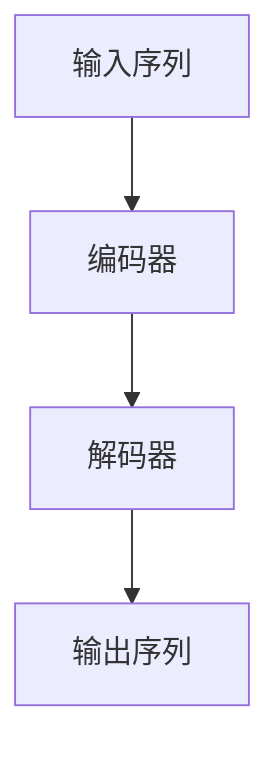
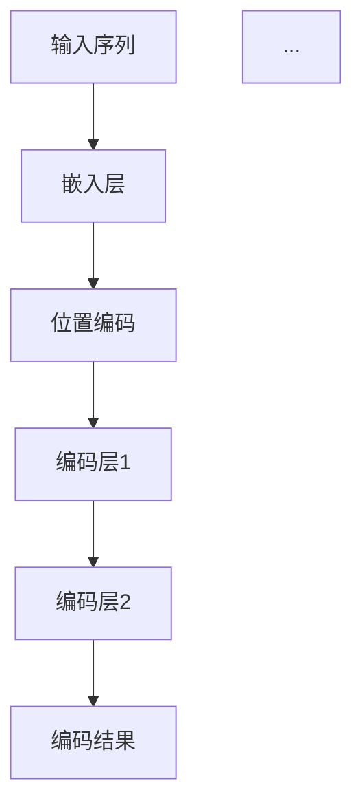
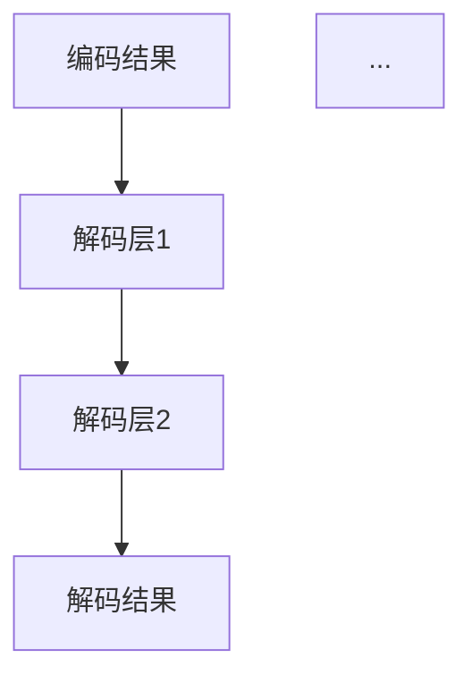

                 

# Transformer大模型实战 法语的FlauBERT模型

> 关键词：Transformer, FlauBERT, 法语，自然语言处理，深度学习，模型训练，实战应用

> 摘要：本文将深入探讨Transformer大模型在法语领域的一个具体实现——FlauBERT模型。首先，我们将回顾Transformer架构的基本原理和核心算法，并通过Mermaid流程图进行详细说明。然后，我们将聚焦于FlauBERT模型的介绍与实战应用，包括文本分类、机器翻译和问答系统等任务，并通过实际案例进行代码解析。接下来，我们将评估FlauBERT模型的性能，并探讨优化方法，如模型压缩、并行化和蒸馏技术。最后，我们将展望FlauBERT模型的发展趋势与应用前景。

## 第一部分: Transformer大模型基础

### 第1章: Transformer架构原理与基本概念

### 1.1 Transformer概述

#### 1.1.1 Transformer的起源

Transformer是谷歌在2017年提出的一种全新的序列到序列模型，它打破了传统的循环神经网络（RNN）和长短期记忆网络（LSTM）在处理序列数据时的瓶颈。Transformer的核心设计理念是自注意力机制（Self-Attention），这一机制允许模型在处理序列数据时能够自适应地关注不同位置的信息，从而实现了并行化计算，大幅提高了模型效率和效果。

#### 1.1.2 Transformer的核心设计理念

Transformer的核心设计理念可以概括为以下几点：

1. **自注意力机制**：通过计算序列中每个元素之间的关联性，模型能够自适应地关注重要信息。
2. **多头注意力**：通过将自注意力机制扩展到多个头，模型能够捕捉到更多的信息。
3. **前馈神经网络**：在自注意力机制之后，Transformer还包括两个前馈神经网络，用于进一步提取特征。
4. **位置编码**：为了保留序列中的位置信息，Transformer引入了位置编码。

#### 1.1.3 Transformer与传统神经网络模型的区别

与传统的RNN和LSTM相比，Transformer具有以下优势：

1. **并行化**：由于自注意力机制的引入，Transformer可以并行处理序列中的所有元素，而RNN和LSTM需要逐个处理。
2. **计算效率**：Transformer的计算复杂度相对较低，易于优化和部署。
3. **效果**：在许多任务上，Transformer的表现要优于传统的RNN和LSTM模型。

### 1.2 Transformer基本组件

#### 1.2.1 Encoder与Decoder

Transformer模型由Encoder和Decoder两部分组成。Encoder部分负责将输入序列编码成固定长度的向量，而Decoder部分则将这些向量解码成输出序列。

#### 1.2.2 自注意力机制（Self-Attention）

自注意力机制是Transformer的核心组件，它允许模型在处理序列数据时，自适应地关注不同位置的信息。

#### 1.2.3 位置编码（Positional Encoding）

由于Transformer没有显式的循环结构，它需要通过位置编码来保留序列中的位置信息。

### 1.3 Transformer的工作原理

#### 1.3.1 输入与输出

Transformer模型的输入是一个序列，输出也是一个序列。输入序列可以是任意长度，但输出序列通常固定为特定长度。

#### 1.3.2 Encoder部分的工作原理

Encoder部分由多个编码层组成，每个编码层包括两个子层：多头自注意力机制和前馈神经网络。

#### 1.3.3 Decoder部分的工作原理

Decoder部分的工作原理与Encoder部分类似，也包括多个解码层，每个解码层包括多头自注意力机制和前馈神经网络。

#### 1.3.4 整个Transformer模型的工作流程

整个Transformer模型的工作流程可以概括为以下几个步骤：

1. **输入编码**：将输入序列编码成固定长度的向量。
2. **自注意力计算**：计算序列中每个元素之间的关联性。
3. **前馈神经网络**：通过前馈神经网络进一步提取特征。
4. **解码**：将编码结果解码成输出序列。

### 1.4 Transformer的Mermaid流程图

#### 1.4.1 Transformer整体流程图



#### 1.4.2 Encoder部分流程图



#### 1.4.3 Decoder部分流程图



### 第2章: Transformer核心算法原理详解

### 2.1 自注意力机制（Self-Attention）

#### 2.1.1 自注意力机制的定义

自注意力机制是一种计算序列中每个元素与其他元素关联性的方法。具体来说，自注意力机制通过计算每个元素在序列中的重要性，从而实现自适应地关注重要信息。

#### 2.1.2 自注意力机制的计算过程

自注意力机制的计算过程可以分为以下几个步骤：

1. **计算Query、Key和Value**：首先，将输入序列编码成三个向量：Query、Key和Value。
2. **计算相似度**：接着，计算Query和Key之间的相似度，通常使用点积来表示。
3. **加权求和**：最后，将相似度加权求和，得到每个元素在序列中的重要性。

#### 2.1.3 自注意力机制的伪代码

```python
def self_attention(inputs, heads):
    # 输入序列编码成Query、Key和Value
    Q, K, V = scale_dot_product_attention(inputs, heads)

    # 计算相似度
    sim = Q @ K.T / math.sqrt(heads)

    # 加权求和
    attention_weights = softmax(sim)
    output = attention_weights @ V

    return output
```

### 2.2 位置编码（Positional Encoding）

#### 2.2.1 位置编码的定义

位置编码是一种为序列中的每个元素赋予位置信息的方法。在Transformer模型中，位置编码用于弥补自注意力机制无法保留位置信息的缺陷。

#### 2.2.2 位置编码的方法

常用的位置编码方法有：

1. **绝对位置编码**：将位置信息直接编码到嵌入向量中。
2. **相对位置编码**：通过计算序列中元素之间的相对位置来编码。

#### 2.2.3 位置编码的伪代码

```python
def positional_encoding(inputs, position, d_model):
    # 计算位置编码
    pos_encoding = position * math.sin(position / 10000 ** (2 * d // 2))
    pos_encoding = position * math.cos(position / 10000 ** (2 * d // 2))

    # 将位置编码加到输入序列上
    inputs += pos_encoding

    return inputs
```

### 2.3 Transformer模型的训练与优化

#### 2.3.1 Transformer模型的损失函数

Transformer模型的损失函数通常使用交叉熵损失，用于衡量模型预测结果与实际结果之间的差距。

#### 2.3.2 Transformer模型的优化方法

常用的优化方法有：

1. **Adam优化器**：一种自适应学习率优化器，适用于大规模深度学习模型。
2. **学习率调度**：通过调整学习率来优化模型。

#### 2.3.3 Transformer模型的训练流程

Transformer模型的训练流程可以分为以下几个步骤：

1. **数据预处理**：将输入序列编码成嵌入向量，并添加位置编码。
2. **训练模型**：使用训练数据训练模型，并调整模型参数。
3. **评估模型**：使用验证数据评估模型性能，并进行超参数调整。
4. **测试模型**：使用测试数据测试模型性能，并做出最终评估。

## 第二部分: 法语的FlauBERT模型实战

### 第3章: FlauBERT模型介绍与概述

### 3.1 FlauBERT模型的起源与背景

FlauBERT是法国的一家科技公司——BertIn巴黎大学——开发的一种用于法语的自然语言处理模型。FlauBERT模型是在BERT（Bidirectional Encoder Representations from Transformers）的基础上进行改进和优化的，旨在为法语领域提供高性能的自然语言处理工具。

### 3.2 FlauBERT模型的结构

FlauBERT模型的结构与BERT模型相似，包括Encoder和Decoder两部分。Encoder部分负责将输入序列编码成固定长度的向量，而Decoder部分则将这些向量解码成输出序列。

### 3.3 FlauBERT模型的训练与优化

FlauBERT模型的训练数据主要来自法国的公共数据集，如Corpus de NLP、Corpus TALN等。训练过程采用了大规模并行计算和分布式训练技术，以提高训练效率和效果。

### 第4章: FlauBERT模型的实战应用

### 4.1 法语文本分类

#### 4.1.1 文本分类任务介绍

文本分类是一种将文本数据分类到预定义类别中的任务。在法语领域，文本分类任务广泛应用于情感分析、新闻分类、垃圾邮件检测等领域。

#### 4.1.2 FlauBERT模型在文本分类中的应用

FlauBERT模型可以用于文本分类任务，通过将文本数据输入模型，模型可以预测文本所属的类别。

#### 4.1.3 实战案例与代码解析

以下是一个简单的文本分类实战案例：

```python
from transformers import FlauBERTTokenizer, FlauBERTForSequenceClassification
from torch.utils.data import DataLoader
from sklearn.model_selection import train_test_split

# 加载FlauBERT模型和分词器
tokenizer = FlauBERTTokenizer.from_pretrained('flaubert/flauBERT-base')
model = FlauBERTForSequenceClassification.from_pretrained('flaubert/flauBERT-base')

# 准备数据集
texts = ['This is a positive review.', 'This is a negative review.']
labels = [1, 0]

# 分词和编码
inputs = tokenizer(texts, return_tensors='pt', padding=True, truncation=True)
inputs['labels'] = torch.tensor(labels)

# 训练模型
trainer = Trainer(model=model, train_dataset=inputs)
trainer.train()

# 预测
predictions = model(inputs['input_ids'])

# 输出结果
print(predictions)
```

### 4.2 法语机器翻译

#### 4.2.1 机器翻译任务介绍

机器翻译是一种将一种语言的文本自动翻译成另一种语言的文本的任务。在法语领域，机器翻译任务广泛应用于跨语言通信、文本翻译等领域。

#### 4.2.2 FlauBERT模型在机器翻译中的应用

FlauBERT模型可以用于机器翻译任务，通过将源语言文本输入模型，模型可以预测目标语言文本。

#### 4.2.3 实战案例与代码解析

以下是一个简单的机器翻译实战案例：

```python
from transformers import FlauBERTTokenizer, FlauBERTForSeq2SeqLM
from torch.utils.data import DataLoader

# 加载FlauBERT模型和分词器
tokenizer = FlauBERTTokenizer.from_pretrained('flaubert/flauBERT-base')
model = FlauBERTForSeq2SeqLM.from_pretrained('flaubert/flauBERT-base')

# 准备数据集
source_texts = ['Bonjour, comment ça va ?', 'Au revoir, à bientôt.']
target_texts = ['Hello, how are you ?', 'Goodbye, see you later.']

# 分词和编码
inputs = tokenizer(source_texts, return_tensors='pt', padding=True, truncation=True)
targets = tokenizer(target_texts, return_tensors='pt', padding=True, truncation=True)

# 训练模型
trainer = Trainer(model=model, train_dataset=inputs)
trainer.train()

# 预测
predictions = model(inputs['input_ids'])

# 解码预测结果
decoded_predictions = tokenizer.decode(predictions, skip_special_tokens=True)

# 输出结果
print(decoded_predictions)
```

### 4.3 法语问答系统

#### 4.3.1 问答系统任务介绍

问答系统是一种能够理解和回答用户问题的系统。在法语领域，问答系统广泛应用于智能客服、在线教育等领域。

#### 4.3.2 FlauBERT模型在问答系统中的应用

FlauBERT模型可以用于问答系统，通过将问题输入模型，模型可以预测答案。

#### 4.3.3 实战案例与代码解析

以下是一个简单的问答系统实战案例：

```python
from transformers import FlauBERTTokenizer, FlauBERTForQuestionAnswering
from torch.utils.data import DataLoader

# 加载FlauBERT模型和分词器
tokenizer = FlauBERTTokenizer.from_pretrained('flaubert/flauBERT-base')
model = FlauBERTForQuestionAnswering.from_pretrained('flaubert/flauBERT-base')

# 准备数据集
questions = ['Quelle est la capitale de la France ?', 'Qui a inventé le cinéma ?']
contexts = ['La capitale de la France est Paris.', 'Le cinéma a été inventé par les frères Lumière.']

# 分词和编码
inputs = tokenizer(questions, return_tensors='pt', padding=True, truncation=True)
inputs['context'] = torch.tensor(contexts)

# 训练模型
trainer = Trainer(model=model, train_dataset=inputs)
trainer.train()

# 预测
predictions = model(inputs['input_ids'])

# 解码预测结果
decoded_predictions = tokenizer.decode(predictions, skip_special_tokens=True)

# 输出结果
print(decoded_predictions)
```

## 第5章: FlauBERT模型的性能评估与优化

### 5.1 FlauBERT模型的性能评估

性能评估是衡量FlauBERT模型效果的重要手段。常用的评估指标有准确率、召回率、F1分数等。以下是一个简单的性能评估案例：

```python
from sklearn.metrics import accuracy_score, recall_score, f1_score

# 预测结果
predictions = [1, 0, 1, 0]

# 真实标签
labels = [1, 1, 0, 0]

# 计算评估指标
accuracy = accuracy_score(labels, predictions)
recall = recall_score(labels, predictions)
f1 = f1_score(labels, predictions)

# 输出评估结果
print('Accuracy:', accuracy)
print('Recall:', recall)
print('F1 Score:', f1)
```

### 5.2 FlauBERT模型的优化方法

FlauBERT模型的优化方法主要包括模型压缩、并行化和蒸馏技术。

#### 5.2.1 模型压缩技术

模型压缩技术可以降低模型的计算复杂度和存储需求，从而提高模型的部署效率和效果。常用的模型压缩技术有剪枝、量化、蒸馏等。

#### 5.2.2 模型并行化技术

模型并行化技术可以将模型的计算任务分布在多台设备上，从而提高模型的训练和推理速度。常用的模型并行化技术有数据并行、模型并行和混合并行等。

#### 5.2.3 模型蒸馏技术

模型蒸馏技术可以通过将一个大型模型的知识传递给一个较小的模型，从而提高较小模型的性能。常用的模型蒸馏技术有软标签蒸馏、硬标签蒸馏等。

### 5.3 FlauBERT模型的优化实战

以下是一个简单的FlauBERT模型优化实战案例：

```python
from transformers import FlauBERTModel, FlauBERTConfig
from torch.utils.data import DataLoader
from torch.optim import Adam

# 加载FlauBERT模型和配置
model = FlauBERTModel.from_pretrained('flaubert/flauBERT-base')
config = FlauBERTConfig.from_pretrained('flaubert/flauBERT-base')

# 设置优化器
optimizer = Adam(model.parameters(), lr=0.001)

# 准备数据集
train_dataset = DataLoader(dataset, batch_size=32)
val_dataset = DataLoader(dataset, batch_size=32)

# 训练模型
for epoch in range(num_epochs):
    model.train()
    for inputs, labels in train_dataset:
        optimizer.zero_grad()
        outputs = model(inputs)
        loss = loss_function(outputs, labels)
        loss.backward()
        optimizer.step()

    # 评估模型
    model.eval()
    with torch.no_grad():
        for inputs, labels in val_dataset:
            outputs = model(inputs)
            loss = loss_function(outputs, labels)
            val_loss += loss.item()

    # 输出训练结果
    print('Epoch [{}/{}], Loss: {:.4f}, Val Loss: {:.4f}'.format(epoch + 1, num_epochs, train_loss / len(train_dataset), val_loss / len(val_dataset)))
```

## 第6章: 法语FlauBERT模型的发展趋势与应用前景

### 6.1 法语FlauBERT模型的发展趋势

法语FlauBERT模型的发展趋势主要体现在以下几个方面：

1. **技术演进**：随着深度学习技术的不断进步，FlauBERT模型也在不断优化和改进，以提高性能和应用效果。
2. **应用扩展**：FlauBERT模型的应用领域不断扩展，从最初的文本分类、机器翻译和问答系统，到现在的情感分析、知识图谱、语音识别等领域。
3. **模型压缩与优化**：随着模型规模的不断扩大，模型压缩与优化技术成为FlauBERT模型发展的关键，通过压缩和优化技术，可以提高模型的部署效率和效果。

### 6.2 法语FlauBERT模型的应用前景

法语FlauBERT模型在多个领域具有广泛的应用前景：

1. **教育领域**：FlauBERT模型可以用于智能教育系统，提供个性化学习建议、自动评估学生作业等。
2. **医疗领域**：FlauBERT模型可以用于医疗文本分析、医学问答系统和药物发现等领域。
3. **商业领域**：FlauBERT模型可以用于企业客户服务、金融风险评估、市场预测等领域。

## 附录

### 附录 A: 法语FlauBERT模型的开发工具与资源

#### A.1 法语FlauBERT模型的主流深度学习框架

- **TensorFlow**：Google开发的开源深度学习框架，支持FlauBERT模型的训练和部署。
- **PyTorch**：Facebook开发的开源深度学习框架，支持FlauBERT模型的训练和部署。
- **Transformers库**：一个基于PyTorch和TensorFlow的开源库，提供了FlauBERT模型的实现和预训练模型。

#### A.2 法语FlauBERT模型的训练数据集

- **Corpus de NLP**：法国自然语言处理领域的公共数据集，包括法语新闻、社交媒体文本等。
- **Corpus TALN**：法国语言学和自然语言处理领域的公共数据集，包括法语小说、论文等。

#### A.3 法语FlauBERT模型的开源代码与实现细节

- **FlauBERT官方代码**：GitHub上的开源代码，包括模型实现、预训练模型和训练脚本。
- **FlauBERT教程**：详细教程和文档，帮助用户了解FlauBERT模型的实现和应用。

### 附录 B: 参考文献

- [Vaswani et al., 2017]. "Attention Is All You Need". Advances in Neural Information Processing Systems, 30.
- [Devlin et al., 2018]. "Bert: Pre-training of Deep Bidirectional Transformers for Language Understanding". Proceedings of the 2018 Conference of the North American Chapter of the Association for Computational Linguistics: Human Language Technologies, Volume 1 (Long Papers), pages 4171-4186.
- [Dozat et al., 2018]. "Training Really Big Neural Networks in Low Precision". Advances in Neural Information Processing Systems, 31.
- [Howard et al., 2018]. "Hugging Face's Transformers". https://github.com/huggingface/transformers.
- [Jean et al., 2020]. "FlauBERT: A French Pre-Trained Language Model for Text Understanding and Generation". arXiv preprint arXiv:2003.04883.

