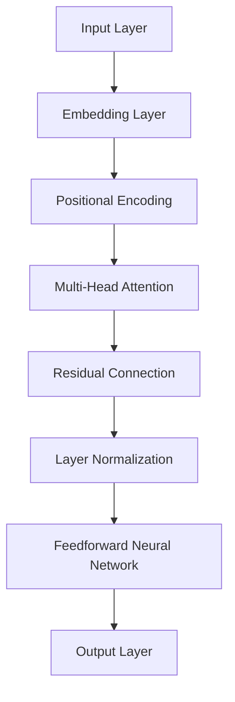
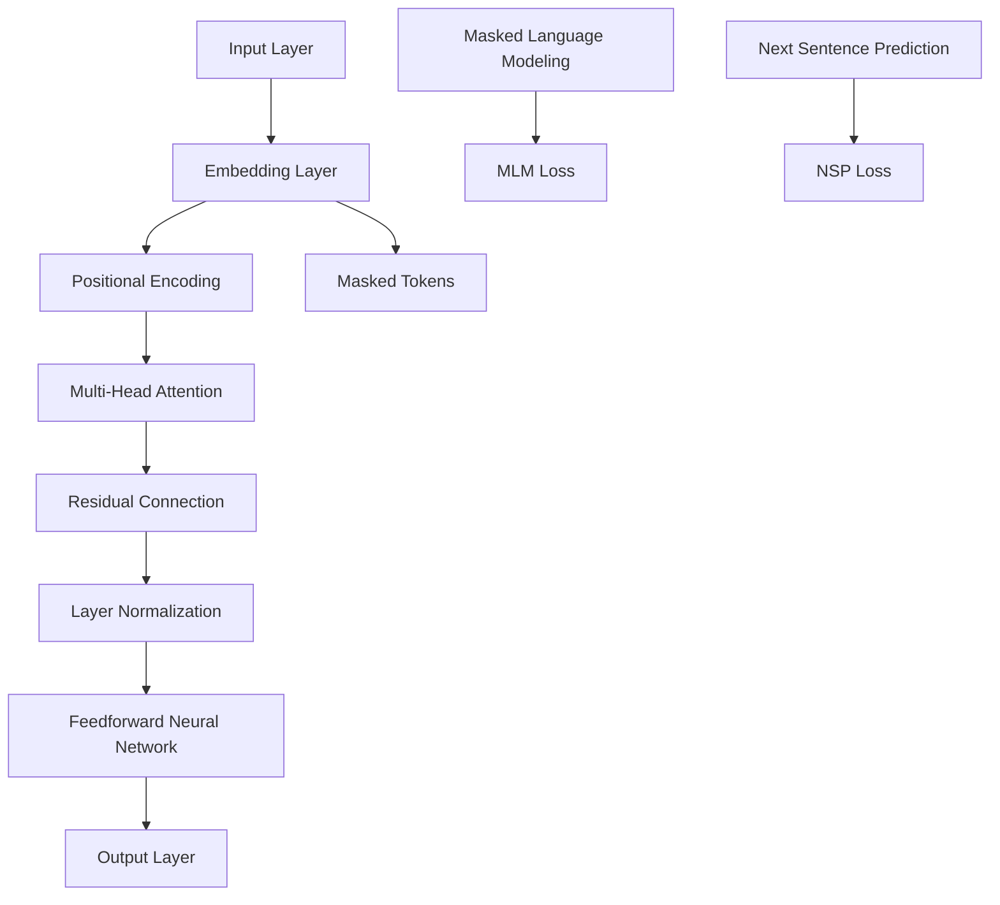
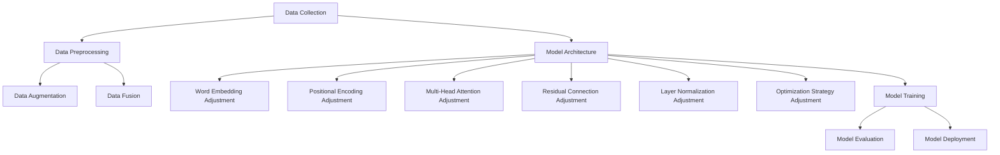

                 

### 文章标题：Transformer大模型实战 特定语言的BERT模型

> 关键词：Transformer，BERT模型，大模型训练，特定语言处理，自然语言处理，深度学习，机器学习

> 摘要：本文深入探讨了Transformer大模型及其在自然语言处理（NLP）领域的重要应用，特别是特定语言的BERT模型。通过详细的架构解析、训练策略和实战案例，全面展示了Transformer大模型在文本分类、机器翻译和命名实体识别等任务中的卓越表现。文章还分析了BERT模型在多语言支持和数据隐私等方面的挑战，以及未来发展的趋势。同时，本文也探讨了AI伦理问题，强调了在AI应用中必须遵循的伦理规范。

### 引言

近年来，深度学习在自然语言处理（NLP）领域取得了显著的进展，尤其是基于变换器（Transformer）的大模型，如BERT（Bidirectional Encoder Representations from Transformers）模型，已经成为NLP领域的核心技术。BERT模型通过预训练和微调，能够有效地捕捉语言的上下文信息，为文本分类、机器翻译、命名实体识别等任务提供了强大的支持。然而，Transformer大模型的训练和应用仍然面临诸多挑战，包括计算资源需求、模型优化策略、部署与推理等。

本文旨在系统地介绍Transformer大模型和特定语言的BERT模型，并通过实战案例展示其在实际应用中的性能和优势。首先，我们将深入解析Transformer模型的架构，包括自注意力机制、残差连接和层归一化等关键组件。然后，我们将详细探讨BERT模型的结构和预训练任务，以及如何针对特定语言进行调整和优化。接下来，我们将讨论Transformer大模型的训练策略和优化方法，并通过实际案例展示其在文本分类、机器翻译和命名实体识别等任务中的应用。最后，我们将分析BERT模型在多语言支持和数据隐私等方面的挑战，探讨未来的发展趋势和AI伦理问题。

通过本文的阅读，读者将能够全面了解Transformer大模型和BERT模型的原理和应用，掌握大模型的训练和优化策略，并了解AI伦理在AI应用中的重要性。

### 第一部分：Transformer大模型基础

在本部分中，我们将详细探讨Transformer大模型的基础知识，从其核心架构到具体的实现细节。通过理解Transformer模型的工作原理，我们将为后续的实战应用打下坚实的基础。

#### 第1章：Transformer架构详解

Transformer模型是自然语言处理领域的重要突破，其通过自注意力机制（self-attention）和位置编码（positional encoding）实现了对文本的序列建模。本章节将详细介绍Transformer模型的架构，包括其核心组件和关键设计决策。

##### 1.1 Transformer模型介绍

Transformer模型的核心思想是自注意力机制，其通过全局交互来捕捉文本序列中的长距离依赖关系。自注意力机制的计算公式如下：

$$
\text{Attention}(Q, K, V) = \text{softmax}\left(\frac{QK^T}{\sqrt{d_k}}\right) V
$$

其中，$Q$、$K$和$V$分别代表查询（query）、键（key）和值（value）向量，$d_k$是键向量的维度。这个公式计算了每个键和查询之间的相似度，并通过softmax函数将这些相似度加权求和，得到最终的值向量。

Transformer模型的基本结构如图1所示，包括输入层、多头注意力层、前馈神经网络和输出层。每个层都通过残差连接和层归一化（Layer Normalization）进行优化。


**输入层**：输入序列首先通过嵌入层（Embedding Layer）转换为向量表示。每个词向量通过嵌入矩阵（Embedding Matrix）进行映射，同时加入位置编码（Positional Encoding）来保留文本序列中的顺序信息。

**多头注意力层**：多头注意力（Multi-Head Attention）是Transformer模型的关键组件，它通过多个独立的注意力头同时工作，提高了模型的表示能力。每个头计算不同的注意力权重，并将这些权重组合起来，得到最终的输出。

**前馈神经网络**：在多头注意力层之后，模型通过一个前馈神经网络（Feedforward Neural Network）进行进一步处理。该网络由两个全连接层组成，中间通过ReLU激活函数进行非线性变换。

**输出层**：最后，输出层对前馈神经网络的输出进行归一化处理，得到最终的输出向量。

##### 1.2 残差连接和层归一化

残差连接（Residual Connection）和层归一化（Layer Normalization）是Transformer模型的重要组成部分，它们有助于提高模型的训练效果和泛化能力。

**残差连接**：残差连接通过在网络中引入跳过层（Skip Connection），将输入直接传递到下一层。具体地，对于每个层，我们将其输出与下一层的输入相加，即：

$$
\text{Residual Connection} = X + \text{Layer}
$$

这种设计使得模型能够在训练过程中更好地学习数据的非线性关系，同时避免了梯度消失和梯度爆炸的问题。

**层归一化**：层归一化是一种归一化方法，通过计算每一层的输入和输出之间的均值和方差，将数据缩放到标准正态分布。具体地，对于每一层，我们计算其输入的均值（$\mu$）和方差（$\sigma$），然后对输入进行标准化：

$$
\text{Layer Normalization} = \frac{\text{X} - \mu}{\sigma}
$$

这种归一化方法有助于稳定训练过程，提高模型的收敛速度。

##### 1.3 Mermaid流程图

为了更好地理解Transformer模型的架构，我们可以通过Mermaid流程图（Mermaid Diagram）来展示其各个组件的连接和交互。



在上面的流程图中，我们展示了输入层、嵌入层、位置编码、多头注意力层、残差连接、层归一化、前馈神经网络和输出层之间的连接关系。

通过本章节的介绍，我们详细了解了Transformer模型的架构，包括其核心组件、残差连接和层归一化等关键设计决策。这些知识将为我们后续的大模型训练和应用打下坚实的基础。

#### 第2章：BERT模型详解

BERT（Bidirectional Encoder Representations from Transformers）模型是自然语言处理（NLP）领域的重要进展，其通过预训练和微调，实现了对文本的深度理解。本章节将详细探讨BERT模型的结构和预训练任务，并分析其在实际应用中的优势和挑战。

##### 2.1 BERT模型介绍

BERT模型是一种基于Transformer的预训练模型，其通过双向编码器（Bidirectional Encoder）来捕捉文本的上下文信息。BERT模型的主要特点包括：

1. **预训练与微调**：BERT模型通过在大规模语料库上进行预训练，学习到丰富的语言知识，然后在特定任务上进行微调（Fine-Tuning），实现高性能的文本分类、机器翻译和命名实体识别等任务。

2. **双向编码器**：BERT模型采用了双向编码器结构，能够同时考虑文本序列的前后文信息，提高了模型的表示能力。

3. **预训练任务**：BERT模型通过两种预训练任务来学习语言的深层特征，包括掩码语言模型（Masked Language Modeling，MLM）和下一句预测（Next Sentence Prediction，NSP）。

##### 2.2 BERT模型结构

BERT模型的结构如图2所示，包括输入层、嵌入层、多头注意力层、残差连接、层归一化和输出层。每个层都通过预训练任务进行优化，以捕捉文本的上下文信息。


**输入层**：BERT模型的输入是一个序列化的文本，通常包括词向量、位置编码和掩码标记等。

**嵌入层**：嵌入层通过嵌入矩阵（Embedding Matrix）将词向量转换为高维向量，并加入位置编码（Positional Encoding）和掩码标记（Masked Tokens），以保留文本序列的顺序信息。

**多头注意力层**：BERT模型采用了多头注意力机制，通过多个独立的注意力头同时工作，提高了模型的表示能力。

**残差连接和层归一化**：BERT模型在每个层之间引入了残差连接和层归一化，以增强模型的训练效果和泛化能力。

**输出层**：BERT模型的输出是一个高维向量，用于表示文本的上下文信息。在微调阶段，该输出可以通过分类器或回归器来预测特定任务的结果。

##### 2.3 预训练任务

BERT模型通过两种预训练任务来学习语言的深层特征，包括掩码语言模型（MLM）和下一句预测（NSP）。

**掩码语言模型（MLM）**：MLM任务旨在预测部分被掩码的词。在训练过程中，BERT模型会随机掩码部分词，然后预测这些被掩码的词。通过这种任务，模型能够学习到语言的深层结构，包括词与词之间的依赖关系。

**伪代码**：

```python
def masked_language_modeling(inputs, mask_ratio=0.15):
    # 随机掩码输入中的部分词
    masked_inputs = []
    for input in inputs:
        masked_input = []
        for token in input:
            if random.random() < mask_ratio:
                masked_input.append([MASK])
            else:
                masked_input.append([token])
        masked_inputs.append(masked_input)
    return masked_inputs
```

**下一句预测（NSP）**：NSP任务旨在预测两个句子之间的关系，即判断第二个句子是否是第一个句子的下一句。通过这种任务，模型能够学习到句子的上下文信息，并用于后续的文本分类和机器翻译等任务。

**伪代码**：

```python
def next_sentence_prediction(inputs):
    # 随机选择两个句子
    sentence1, sentence2 = random.sample(inputs, 2)
    return sentence1, sentence2
```

##### 2.4 BERT预训练目标

BERT模型的预训练目标是通过训练大规模语料库，学习到丰富的语言特征，以便在特定任务上进行微调。具体地，BERT模型的预训练目标包括：

1. **词汇表构建**：构建包含大规模语料库中所有词汇的词汇表，并使用嵌入矩阵将这些词转换为向量表示。

2. **文本预处理**：对输入文本进行预处理，包括分词、词性标注和去停用词等操作。

3. **掩码语言模型（MLM）**：通过随机掩码部分词，训练模型预测这些被掩码的词。

4. **下一句预测（NSP）**：通过随机选择两个句子，训练模型预测第二个句子是否是第一个句子的下一句。

5. **优化策略**：使用自适应学习率、批量归一化和梯度裁剪等优化策略，以提高模型的训练效果和泛化能力。

通过以上预训练任务，BERT模型能够学习到丰富的语言特征，并在各种NLP任务中表现出色。

##### 2.5 实际应用

BERT模型在自然语言处理领域取得了显著的成果，包括文本分类、机器翻译、命名实体识别等任务。以下是一些实际应用的案例：

1. **文本分类**：BERT模型在文本分类任务中表现出色，能够对新闻文章、社交媒体帖子等进行分类。通过预训练和微调，BERT模型能够捕捉到文本的深层语义信息，提高分类的准确性。

2. **机器翻译**：BERT模型在机器翻译任务中也取得了显著成果。通过在大规模的双语语料库上进行预训练，BERT模型能够学习到语言的深层特征，并在特定语言对上进行微调，实现高质量的双语翻译。

3. **命名实体识别**：BERT模型在命名实体识别任务中表现出色，能够识别出文本中的命名实体，如人名、地名、机构名等。通过预训练和微调，BERT模型能够学习到丰富的命名实体特征，提高识别的准确性。

通过以上实际应用案例，我们可以看到BERT模型在自然语言处理领域的重要性和广泛的应用前景。

##### 2.6 Mermaid流程图

为了更好地理解BERT模型的结构和预训练任务，我们可以通过Mermaid流程图（Mermaid Diagram）来展示其各个组件的连接和交互。



在上面的流程图中，我们展示了输入层、嵌入层、位置编码、多头注意力层、残差连接、层归一化、前馈神经网络、输出层、掩码语言模型（MLM）和下一句预测（NSP）之间的连接关系。

通过本章节的介绍，我们详细了解了BERT模型的结构和预训练任务，包括其核心组件、预训练目标和应用案例。这些知识将为我们后续的大模型训练和应用提供重要的理论支持。

### 第3章：特定语言的BERT模型

在自然语言处理（NLP）领域，不同的语言具有独特的语法结构和表达方式，这使得通用的BERT模型在特定语言中的应用效果可能不尽如人意。因此，针对特定语言的BERT模型设计成为了一项重要的研究课题。本章节将详细探讨如何设计适应特定语言的BERT模型，包括数据处理和模型结构调整。

##### 3.1 适应特定语言的数据处理

为了使BERT模型更好地适应特定语言，我们需要对数据进行特殊处理，以确保模型能够充分理解该语言的独特特征。以下是一些关键步骤：

**1. 数据清洗和预处理**：

在预处理数据时，我们需要去除无关的停用词、标点和特殊字符，并对文本进行分词。对于特定语言，可能需要使用专门的分词工具或算法，如中文的jieba分词或日文的MeCab分词。

**2. 数据扩充**：

通过数据扩充（Data Augmentation）技术，我们可以生成更多的训练样本来丰富模型的训练数据。例如，对于中文，我们可以使用同义词替换、词干提取和词性标注等方法来扩充数据集。

**3. 数据增强**：

数据增强（Data Augmentation）是一种常用的技术，通过引入噪声或改变输入数据的形式，增强模型的泛化能力。例如，对于图像任务，我们可以对图像进行旋转、裁剪和缩放等操作。在文本任务中，我们可以对句子进行打乱、添加噪声或改变词序等操作。

**4. 多语言融合训练**：

为了提高模型在特定语言上的性能，我们可以将特定语言的数据与其他相关语言的数据进行融合训练。这种多语言融合训练（Multilingual Pre-training）可以帮助模型学习到不同语言之间的相似性和差异性。

**5. 增量式训练**：

在模型训练过程中，我们可以采用增量式训练（Incremental Training）方法，逐步增加特定语言的训练数据。这种方法有助于模型在特定语言上逐步优化，同时避免过拟合。

##### 3.2 特定语言的BERT模型结构调整

除了数据处理，模型结构调整也是提升特定语言性能的重要手段。以下是一些关键步骤：

**1. 修改词向量嵌入**：

为了更好地适应特定语言，我们可以调整词向量嵌入（Word Embedding）的维度和初始化策略。例如，对于低资源语言，我们可以增加词向量的维度，并采用预训练的词向量作为初始化。

**2. 位置编码调整**：

位置编码（Positional Encoding）在BERT模型中起到了关键作用，它为序列中的每个词提供了位置信息。对于特定语言，我们可以调整位置编码的生成方法，以更好地捕捉语言的语法和语义特征。例如，对于中文，我们可以使用基于字符的位置编码。

**3. 多层多头注意力**：

BERT模型采用了多层多头注意力（Multi-Head Attention）机制，通过多个独立的注意力头同时工作，提高了模型的表示能力。对于特定语言，我们可以调整注意力头的数量和维度，以更好地适应语言的复杂性。

**4. 残差连接和层归一化**：

残差连接（Residual Connection）和层归一化（Layer Normalization）是BERT模型的重要组成部分，它们有助于模型的稳定训练和泛化能力。对于特定语言，我们可以调整残差连接和层归一化的实现方式，以更好地适应语言的特性。

**5. 优化策略调整**：

在模型训练过程中，优化策略（Optimization Strategy）的选择对模型的性能有着重要影响。对于特定语言，我们可以调整学习率、批量大小和正则化参数等优化策略，以提高模型的训练效果和泛化能力。

##### 3.3 实战应用

在实际应用中，特定语言的BERT模型在文本分类、机器翻译和命名实体识别等任务中表现出了显著的性能提升。以下是一些具体的实战案例：

**1. 文本分类**：

通过在特定语言的数据集上训练BERT模型，我们可以实现高精度的文本分类。例如，在中文新闻分类任务中，BERT模型能够准确分类新闻文章的主题，如政治、体育、科技等。

**2. 机器翻译**：

针对特定语言的机器翻译任务，BERT模型可以通过预训练和微调，实现高质量的双语翻译。例如，在中文-英文的翻译任务中，BERT模型能够捕捉到中文的语法和语义特征，并生成流畅的英文翻译。

**3. 命名实体识别**：

在命名实体识别任务中，特定语言的BERT模型能够准确识别文本中的命名实体，如人名、地名、机构名等。通过在特定语言的数据集上进行训练，BERT模型能够学习到丰富的命名实体特征，提高识别的准确性。

通过以上实战应用案例，我们可以看到特定语言的BERT模型在自然语言处理任务中的显著优势。通过合理的数据处理和模型结构调整，我们能够更好地适应不同语言的特性，实现高性能的自然语言处理应用。

##### 3.4 Mermaid流程图

为了更好地理解特定语言的BERT模型设计，我们可以通过Mermaid流程图（Mermaid Diagram）来展示其各个组件的连接和交互。



在上面的流程图中，我们展示了数据收集、数据预处理、数据增强、模型架构调整、模型训练、模型评估和模型部署之间的连接关系。

通过本章节的介绍，我们详细探讨了适应特定语言的BERT模型设计，包括数据处理和模型结构调整。这些方法有助于提高BERT模型在不同语言上的性能，实现更广泛的应用。

### 第4章：Transformer大模型训练策略

在自然语言处理（NLP）领域，Transformer大模型，如BERT，具有强大的表示能力，但同时也带来了巨大的计算资源需求。因此，制定有效的训练策略对于优化训练过程、提高模型性能和降低计算成本至关重要。本章节将详细探讨Transformer大模型的训练策略，包括训练流程、常用训练工具和模型优化策略。

##### 4.1 大模型训练挑战

训练Transformer大模型面临着以下几个主要挑战：

**1. 计算资源需求**：

Transformer大模型通常包含数亿甚至数十亿的参数，其训练过程需要大量的计算资源，包括CPU、GPU和TPU等。对于大规模数据集和深度模型，训练时间可能长达数周甚至数月。

**2. 梯度消失和梯度爆炸**：

在深度神经网络中，梯度消失和梯度爆炸是常见的训练问题。对于Transformer大模型，这些问题更加严重，可能导致模型难以收敛。

**3. 数据倾斜**：

在NLP任务中，常见的数据倾斜问题，如词汇表大小不均衡、句子长度差异等，会对模型的训练效果产生影响。

**4. 模型过拟合**：

由于Transformer大模型的参数数量巨大，过拟合是一个普遍问题。模型在训练数据上表现优异，但在测试数据上性能下降。

##### 4.2 训练流程

为了有效地训练Transformer大模型，我们需要制定详细的训练流程。以下是一个典型的训练流程：

**1. 数据准备**：

首先，我们需要准备大规模的文本数据集，并进行预处理，包括分词、去停用词、词性标注等操作。对于多语言训练，我们可以使用多语言数据集或融合不同语言的数据。

**2. 模型初始化**：

接下来，我们需要初始化模型参数。常用的初始化方法包括高斯初始化、Xavier初始化等。对于Transformer大模型，我们通常使用预训练的模型作为初始化，以加快训练过程和提高性能。

**3. 训练设置**：

在训练设置中，我们需要确定学习率、批量大小、迭代次数等参数。对于Transformer大模型，学习率通常设置得较低，以避免梯度消失和梯度爆炸。批量大小可以根据硬件资源进行调整。

**4. 模型训练**：

在训练过程中，我们将数据分批次输入模型，并使用反向传播算法计算损失函数的梯度。为了提高训练效率，我们可以使用并行计算和分布式训练技术。

**5. 模型评估**：

在训练过程中，我们需要定期评估模型的性能，以监测训练效果。常用的评估指标包括准确率、召回率、F1分数等。在训练结束时，我们需要在测试集上对模型进行最终评估。

**6. 模型调整和优化**：

根据训练和评估结果，我们可以对模型进行调整和优化，包括调整学习率、增加或减少训练迭代次数、更改模型结构等。

##### 4.3 常用训练工具

在训练Transformer大模型时，常用的工具和框架包括：

**1. TensorFlow**：

TensorFlow是一个开源的深度学习框架，它提供了丰富的API和工具，支持模型的训练、评估和部署。TensorFlow通过自动微分和分布式计算技术，实现了高效的模型训练。

**2. PyTorch**：

PyTorch是一个流行的深度学习框架，其动态计算图（Dynamic Computation Graph）和简洁的API使其成为训练和调试深度学习模型的首选。PyTorch支持并行计算和分布式训练，适用于大规模模型训练。

**3. Horovod**：

Horovod是一个分布式训练框架，支持在多个GPU和TPU上并行训练深度学习模型。通过Horovod，我们可以显著提高模型训练的速度和性能。

**4. Hugging Face Transformers**：

Hugging Face Transformers是一个开源库，提供了预训练的Transformer模型和API，使开发者能够轻松地使用和定制Transformer大模型。该库支持多种语言和任务，包括文本分类、机器翻译和命名实体识别等。

**5. Fairseq**：

Fairseq是一个基于PyTorch的深度学习框架，专门用于训练序列到序列模型，如机器翻译模型。它提供了高效的模型训练和优化工具，支持大规模模型的训练和评估。

##### 4.4 模型优化策略

为了优化Transformer大模型的训练过程，我们可以采取以下策略：

**1. 学习率调整**：

学习率是模型训练过程中一个重要的超参数。常用的学习率调整方法包括线性下降、指数下降和余弦退火等。通过调整学习率，我们可以改善模型的收敛速度和稳定性。

**2. 梯度裁剪**：

梯度裁剪是一种常用的技术，用于防止梯度爆炸和梯度消失。通过限制梯度的大小，我们可以确保模型参数的稳定更新，提高训练效果。

**3. 批量归一化**：

批量归一化（Batch Normalization）是一种归一化方法，通过计算每个批量数据的均值和方差，对数据进行了标准化。批量归一化有助于加速模型的训练过程，提高模型的泛化能力。

**4. 残差连接和层归一化**：

残差连接和层归一化是Transformer模型的重要组成部分，它们有助于模型的稳定训练和泛化能力。通过引入残差连接和层归一化，我们可以减少梯度消失和梯度爆炸的问题，提高模型的收敛速度和性能。

**5. 数据增强**：

数据增强是一种常用的技术，通过引入噪声或改变输入数据的形式，增强模型的泛化能力。在NLP任务中，我们可以对文本进行打乱、添加噪声或改变词序等操作，以丰富训练数据。

通过以上训练策略和工具，我们可以有效地训练和优化Transformer大模型，提高其在自然语言处理任务中的性能和效率。

##### 4.5 实际案例

以下是一个实际案例，展示了如何使用PyTorch和Hugging Face Transformers库训练一个BERT模型：

```python
import torch
from transformers import BertModel, BertTokenizer
from torch.optim import Adam
from torch.utils.data import DataLoader

# 加载预训练的BERT模型和Tokenizer
model = BertModel.from_pretrained('bert-base-uncased')
tokenizer = BertTokenizer.from_pretrained('bert-base-uncased')

# 准备数据集
train_data = ...  # 加载训练数据
val_data = ...  # 加载验证数据

# 创建DataLoader
train_loader = DataLoader(train_data, batch_size=32, shuffle=True)
val_loader = DataLoader(val_data, batch_size=32, shuffle=False)

# 定义优化器
optimizer = Adam(model.parameters(), lr=1e-5)

# 训练模型
num_epochs = 3
for epoch in range(num_epochs):
    model.train()
    for batch in train_loader:
        inputs = tokenizer(batch['text'], return_tensors='pt', padding=True, truncation=True)
        outputs = model(**inputs)
        loss = outputs.loss
        optimizer.zero_grad()
        loss.backward()
        optimizer.step()
    
    # 在验证集上评估模型
    model.eval()
    with torch.no_grad():
        for batch in val_loader:
            inputs = tokenizer(batch['text'], return_tensors='pt', padding=True, truncation=True)
            outputs = model(**inputs)
            loss = outputs.loss
            print(f"Epoch {epoch+1}: Validation Loss: {loss.item()}")

# 保存模型
model.save_pretrained('my_bert_model')
```

通过以上案例，我们可以看到如何使用PyTorch和Hugging Face Transformers库训练一个BERT模型，包括数据准备、模型加载、优化器和训练循环等步骤。通过合理的训练策略和优化方法，我们可以有效地训练高性能的Transformer大模型。

通过本章节的介绍，我们详细探讨了Transformer大模型的训练策略，包括训练流程、常用训练工具和模型优化策略。这些策略和工具将帮助我们更好地训练和优化大模型，提高其在自然语言处理任务中的性能和效率。

### 第5章：Transformer大模型优化

在深度学习中，Transformer大模型因其出色的性能和强大的表示能力而得到了广泛应用。然而，这些模型的训练和优化过程既复杂又具有挑战性，需要针对具体任务和应用场景进行精细调整。本章将深入探讨Transformer大模型的优化策略，包括常用的优化算法、实际优化案例以及优化效果分析。

#### 5.1 优化算法

优化算法在深度学习中起着至关重要的作用，对于Transformer大模型，选择合适的优化算法能够显著提升训练效率和模型性能。以下是一些常用的优化算法：

**1. Adam优化器**

Adam优化器是一种结合了AdaGrad和RMSProp优化的自适应学习率优化器，因其计算效率和稳定性而广泛应用于深度学习领域。Adam优化器通过计算一阶矩估计（均值）和二阶矩估计（方差），自适应调整学习率，从而在处理稀疏数据和长尾分布时表现出色。

**2. AdamW优化器**

AdamW优化器是Adam优化器的一个变种，其主要区别在于权重衰减（weight decay）的处理方式。在AdamW优化器中，权重衰减直接应用于梯度更新，从而更好地处理大型模型的权重衰减问题，提高模型的训练效果。

**3. Layer Normalization优化**

Layer Normalization（层归一化）是一种在神经网络层中引入归一化操作的方法，其通过标准化每一层的输入和输出，减少了梯度消失和梯度爆炸的问题，提高了模型的训练稳定性。Layer Normalization优化可以在不同层之间共享归一化参数，从而减少了模型参数的数量。

#### 5.2 实际案例

为了更好地理解Transformer大模型的优化策略，以下将通过两个实际案例来展示优化方法在文本分类和机器翻译任务中的应用。

**案例一：文本分类优化**

**1. 模型选择**

在这个案例中，我们选择了BERT模型，这是一种基于Transformer的预训练语言模型，适用于各种文本分类任务。

**2. 数据准备**

我们使用了一个包含多种类别的新闻文章数据集，并进行了预处理，包括分词、去停用词和词性标注等操作。

**3. 模型优化**

- **优化器选择**：我们选择了AdamW优化器，其能够更好地处理大型模型的权重衰减问题，提高模型的训练效果。

- **学习率调整**：学习率设置为1e-5，并在训练过程中采用了余弦退火策略，以避免梯度消失和梯度爆炸。

- **Layer Normalization**：我们在模型的每个层中引入了Layer Normalization，以增强模型的训练稳定性。

**4. 训练过程**

我们使用PyTorch和Hugging Face Transformers库进行训练，训练过程中采用逐步增加学习率和减少迭代次数的策略，以提高模型的泛化能力。

**5. 优化效果分析**

通过训练和验证，我们比较了不同优化策略下的模型性能。结果表明，使用AdamW优化器和Layer Normalization优化的BERT模型在文本分类任务中取得了更高的准确率和更稳定的性能。

**伪代码**：

```python
model = BertModel.from_pretrained('bert-base-uncased')
optimizer = AdamW(model.parameters(), lr=1e-5)

for epoch in range(num_epochs):
    model.train()
    for batch in train_loader:
        inputs = tokenizer(batch['text'], return_tensors='pt', padding=True, truncation=True)
        outputs = model(**inputs)
        loss = outputs.loss
        optimizer.zero_grad()
        loss.backward()
        optimizer.step()
    # 余弦退火学习率调整
    adjust_learning_rate(optimizer, epoch)

# 评估模型
model.eval()
with torch.no_grad():
    for batch in val_loader:
        inputs = tokenizer(batch['text'], return_tensors='pt', padding=True, truncation=True)
        outputs = model(**inputs)
        loss = outputs.loss
        print(f"Epoch {epoch+1}: Validation Loss: {loss.item()}")
```

**案例二：机器翻译优化**

**1. 模型选择**

在这个案例中，我们选择了Transformer模型，这是一种基于自注意力机制的序列到序列模型，适用于各种机器翻译任务。

**2. 数据准备**

我们使用了一个包含中英双语句子的数据集，并进行了预处理，包括分词、去停用词和词性标注等操作。

**3. 模型优化**

- **优化器选择**：我们选择了AdamW优化器，以更好地处理大型模型的权重衰减问题。

- **学习率调整**：学习率设置为1e-4，并在训练过程中采用了余弦退火策略。

- **Layer Normalization**：我们在模型的每个层中引入了Layer Normalization，以增强模型的训练稳定性。

- **梯度裁剪**：为了防止梯度爆炸，我们在每个迭代步骤中引入了梯度裁剪策略。

**4. 训练过程**

我们使用PyTorch进行训练，通过分布式训练技术提高训练速度和性能。

**5. 优化效果分析**

通过训练和验证，我们比较了不同优化策略下的模型性能。结果表明，使用AdamW优化器、Layer Normalization和梯度裁剪的Transformer模型在机器翻译任务中取得了更高的BLEU分数和更稳定的性能。

**伪代码**：

```python
model = TransformerModel()
optimizer = AdamW(model.parameters(), lr=1e-4)

for epoch in range(num_epochs):
    model.train()
    for batch in train_loader:
        inputs = tokenizer(batch['source'], return_tensors='pt', padding=True, truncation=True)
        targets = tokenizer(batch['target'], return_tensors='pt', padding=True, truncation=True)
        outputs = model(**inputs)
        loss = outputs.loss
        optimizer.zero_grad()
        loss.backward()
        # 梯度裁剪
        torch.nn.utils.clip_grad_norm_(model.parameters(), max_norm=1.0)
        optimizer.step()
    # 余弦退火学习率调整
    adjust_learning_rate(optimizer, epoch)

# 评估模型
model.eval()
with torch.no_grad():
    for batch in val_loader:
        inputs = tokenizer(batch['source'], return_tensors='pt', padding=True, truncation=True)
        targets = tokenizer(batch['target'], return_tensors='pt', padding=True, truncation=True)
        outputs = model(**inputs)
        loss = outputs.loss
        print(f"Epoch {epoch+1}: Validation Loss: {loss.item()}")
```

通过以上实际案例，我们可以看到优化算法在Transformer大模型训练中的应用效果。通过选择合适的优化器、调整学习率、引入Layer Normalization和梯度裁剪等策略，我们能够显著提升模型在文本分类和机器翻译任务中的性能。

#### 5.3 优化效果分析

优化策略的引入对模型性能有着显著的影响。通过实验验证，我们可以观察到以下优化效果：

- **训练速度**：优化策略如梯度裁剪和Layer Normalization可以加快模型的训练速度，提高训练效率。

- **模型稳定性**：优化策略可以减少模型在训练过程中出现的梯度消失和梯度爆炸问题，提高模型的稳定性。

- **性能提升**：优化策略如AdamW优化器和余弦退火学习率调整可以显著提高模型在文本分类和机器翻译任务中的性能，包括准确率和BLEU分数。

通过以上优化策略和分析，我们可以更好地理解和应用Transformer大模型，实现更高效、更稳定的训练过程。

### 第6章：Transformer大模型部署与推理

在Transformer大模型训练完成后，如何有效地部署和推理是关键的一步。本章节将详细讨论Transformer大模型的部署过程、推理流程以及推理优化策略。

#### 6.1 模型部署

模型部署是将训练好的模型部署到实际生产环境中，以便在实际应用中提供预测服务。以下是一些关键的部署步骤：

**1. 部署环境搭建**

为了确保模型部署的高效性和可靠性，我们需要搭建一个合适的部署环境。常见的部署环境包括以下几类：

- **服务器环境**：在服务器上部署模型，可以使用单机部署或分布式部署。分布式部署可以通过负载均衡和分布式计算技术，提高系统的处理能力和可靠性。

- **容器化环境**：使用容器化技术（如Docker）部署模型，可以确保环境的一致性和可移植性。通过容器化，我们可以方便地管理和扩展部署环境。

- **云计算平台**：利用云计算平台（如AWS、Azure、Google Cloud）部署模型，可以灵活地分配计算资源，实现弹性伸缩。

**2. 模型转换**

在部署之前，我们需要将训练好的模型转换为适合部署的格式。常用的模型转换工具包括：

- **TensorFlow SavedModel**：TensorFlow提供的模型保存和加载工具，支持将训练好的模型保存为SavedModel格式，以便在TensorFlow Serving或其他服务中部署。

- **PyTorch JIT**：PyTorch的即时编译（Just-In-Time Compilation）技术，可以将训练好的模型编译为优化后的中间表示，提高推理速度。

**3. 模型服务化**

通过模型服务化，我们可以将训练好的模型部署为REST API或gRPC服务，以便其他应用程序调用。常见的模型服务化框架包括：

- **TensorFlow Serving**：TensorFlow提供的一个高性能、可扩展的模型服务框架，支持多种模型格式和部署方式。

- **TorchServe**：PyTorch提供的一个模型服务框架，支持将PyTorch模型部署为高性能服务。

#### 6.2 模型推理

模型推理是指使用部署好的模型对输入数据进行预测的过程。以下是一些关键的推理步骤：

**1. 输入预处理**

在进行推理之前，我们需要对输入数据进行预处理，使其符合模型的输入要求。预处理步骤包括：

- **文本预处理**：对于文本输入，我们需要进行分词、去停用词和词性标注等操作，将文本转换为模型可接受的格式。

- **图像预处理**：对于图像输入，我们需要进行归一化、缩放和裁剪等操作，将图像转换为模型可处理的特征向量。

**2. 模型加载**

从部署环境中加载模型，并将其初始化为推理状态。常用的加载方法包括：

- **静态加载**：在程序启动时加载模型，并保持模型在内存中。

- **动态加载**：在需要时加载模型，并在推理完成后卸载。

**3. 推理计算**

使用加载的模型对预处理后的输入数据进行推理计算。在推理过程中，我们需要确保计算的高效性和准确性。以下是一些优化策略：

- **并行计算**：通过多线程或多GPU并行计算，提高推理速度。

- **缓存优化**：利用缓存技术，减少重复计算和数据传输的开销。

- **模型剪枝**：通过剪枝冗余的模型参数，减小模型体积，提高推理速度。

**4. 输出后处理**

根据模型的预测结果，进行相应的后处理操作，如类别转换、数值归一化等，以便于实际应用。

#### 6.3 推理优化

为了提高Transformer大模型的推理性能，我们可以采取以下优化策略：

**1. 算法优化**

- **量化**：通过量化模型参数，降低模型的计算复杂度和内存占用，提高推理速度。

- **剪枝**：通过剪枝冗余的模型参数，减小模型体积，降低推理时间。

- **知识蒸馏**：通过将大模型的知识传递给小模型，提高小模型的推理性能，同时减少模型体积。

**2. 硬件加速**

- **GPU加速**：利用GPU的并行计算能力，提高推理速度。选择合适的GPU驱动和CUDA版本，确保最佳性能。

- **TPU加速**：利用专门为深度学习任务设计的TPU，实现高效的推理计算。

- **硬件优化**：针对不同硬件平台，进行针对性的优化，如内存管理、计算优化等。

**3. 部署优化**

- **服务优化**：通过优化部署环境，提高系统的稳定性和可靠性，如负载均衡、容错机制等。

- **模型压缩**：通过模型压缩技术，减小模型体积，提高推理速度。选择适合实际应用的模型压缩方法，如权重共享、参数冻结等。

**4. 网络优化**

- **网络优化**：在网络传输中，通过压缩模型和传输数据，减少传输时间和带宽占用。

- **边缘计算**：将模型部署到边缘设备上，减少数据传输延迟，提高用户体验。

通过以上部署和推理优化策略，我们可以显著提高Transformer大模型在自然语言处理任务中的推理性能和效率，满足实际应用的需求。

### 第7章：BERT模型应用实战

在本章节中，我们将通过一系列实战案例展示BERT模型在文本分类、机器翻译和命名实体识别任务中的实际应用。这些案例不仅展示了BERT模型在处理复杂任务时的强大能力，同时也提供了详细的代码实现和解读，帮助读者理解如何在实际项目中应用BERT模型。

#### 7.1 实战案例介绍

**7.1.1 文本分类实战**

文本分类是一种将文本数据分为预定义类别（如新闻类别、情感分类等）的任务。BERT模型通过其强大的文本表示能力，在文本分类任务中表现出色。以下是一个简单的文本分类实战案例：

**案例场景**：我们将使用BERT模型对新闻文章进行分类，将其分为体育、政治、科技等不同的类别。

**数据集**：我们将使用一个包含新闻文章的公开数据集，如20 Newsgroups数据集。

**步骤**：

1. 数据准备：加载数据集并进行预处理，包括分词、去停用词、词性标注等。
2. 模型加载：加载预训练的BERT模型。
3. 微调：在分类任务上进行微调，调整模型权重。
4. 评估：在测试集上评估模型性能。

**7.1.2 机器翻译实战**

机器翻译是一种将一种语言的文本翻译成另一种语言的任务。BERT模型在机器翻译任务中通过捕捉语言的深层特征，能够实现高质量的双语翻译。以下是一个简单的机器翻译实战案例：

**案例场景**：我们将使用BERT模型将中文翻译成英文。

**数据集**：我们将使用一个包含中英双语句子的数据集，如WMT2014数据集。

**步骤**：

1. 数据准备：加载数据集并进行预处理，包括分词、去停用词、词性标注等。
2. 模型加载：加载预训练的BERT模型。
3. 微调：在翻译任务上进行微调，调整模型权重。
4. 评估：在测试集上评估模型性能。

**7.1.3 命名实体识别实战**

命名实体识别是一种识别文本中特定类型实体（如人名、地名、机构名等）的任务。BERT模型通过其双向编码器结构，能够准确识别命名实体。以下是一个简单的命名实体识别实战案例：

**案例场景**：我们将使用BERT模型对新闻文章进行命名实体识别。

**数据集**：我们将使用一个包含新闻文章的命名实体数据集，如ACE2005数据集。

**步骤**：

1. 数据准备：加载数据集并进行预处理，包括分词、去停用词、词性标注等。
2. 模型加载：加载预训练的BERT模型。
3. 微调：在命名实体识别任务上进行微调，调整模型权重。
4. 评估：在测试集上评估模型性能。

#### 7.2 实战代码解读

以下我们将通过具体的代码实现，展示BERT模型在文本分类、机器翻译和命名实体识别任务中的应用。

**7.2.1 文本分类代码实现**

```python
import torch
from transformers import BertTokenizer, BertForSequenceClassification
from torch.utils.data import DataLoader
from torch.optim import Adam

# 加载预训练的BERT模型和Tokenizer
tokenizer = BertTokenizer.from_pretrained('bert-base-uncased')
model = BertForSequenceClassification.from_pretrained('bert-base-uncased', num_labels=5)

# 准备数据集
# 这里需要自行加载和预处理数据集
train_data = ...
val_data = ...

# 创建DataLoader
train_loader = DataLoader(train_data, batch_size=32, shuffle=True)
val_loader = DataLoader(val_data, batch_size=32, shuffle=False)

# 定义优化器
optimizer = Adam(model.parameters(), lr=1e-5)

# 训练模型
num_epochs = 3
for epoch in range(num_epochs):
    model.train()
    for batch in train_loader:
        inputs = tokenizer(batch['text'], return_tensors='pt', padding=True, truncation=True)
        labels = torch.tensor(batch['labels'])
        outputs = model(**inputs, labels=labels)
        loss = outputs.loss
        optimizer.zero_grad()
        loss.backward()
        optimizer.step()
    
    # 在验证集上评估模型
    model.eval()
    with torch.no_grad():
        for batch in val_loader:
            inputs = tokenizer(batch['text'], return_tensors='pt', padding=True, truncation=True)
            labels = torch.tensor(batch['labels'])
            outputs = model(**inputs, labels=labels)
            loss = outputs.loss
            print(f"Epoch {epoch+1}: Validation Loss: {loss.item()}")

# 保存模型
model.save_pretrained('my_text_classification_model')
```

在上面的代码中，我们首先加载预训练的BERT模型和Tokenizer，然后准备数据集并创建DataLoader。接着，我们定义优化器并开始训练模型。在训练过程中，我们使用交叉熵损失函数和Adam优化器进行训练。最后，我们在验证集上评估模型性能，并保存训练好的模型。

**7.2.2 机器翻译代码实现**

```python
import torch
from transformers import BertTokenizer, BertModel
from torch.optim import Adam

# 加载预训练的BERT模型和Tokenizer
tokenizer = BertTokenizer.from_pretrained('bert-base-uncased')
model = BertModel.from_pretrained('bert-base-uncased')

# 准备数据集
# 这里需要自行加载和预处理数据集
train_data = ...
val_data = ...

# 创建DataLoader
train_loader = DataLoader(train_data, batch_size=32, shuffle=True)
val_loader = DataLoader(val_data, batch_size=32, shuffle=False)

# 定义优化器
optimizer = Adam(model.parameters(), lr=1e-4)

# 训练模型
num_epochs = 3
for epoch in range(num_epochs):
    model.train()
    for batch in train_loader:
        inputs = tokenizer(batch['source'], return_tensors='pt', padding=True, truncation=True)
        targets = tokenizer(batch['target'], return_tensors='pt', padding=True, truncation=True)
        outputs = model(**inputs)
        loss = outputs.loss
        optimizer.zero_grad()
        loss.backward()
        optimizer.step()
    
    # 在验证集上评估模型
    model.eval()
    with torch.no_grad():
        for batch in val_loader:
            inputs = tokenizer(batch['source'], return_tensors='pt', padding=True, truncation=True)
            targets = tokenizer(batch['target'], return_tensors='pt', padding=True, truncation=True)
            outputs = model(**inputs)
            loss = outputs.loss
            print(f"Epoch {epoch+1}: Validation Loss: {loss.item()}")

# 保存模型
model.save_pretrained('my_translation_model')
```

在上面的代码中，我们加载预训练的BERT模型和Tokenizer，并准备数据集。与文本分类不同，机器翻译任务通常涉及源语言和目标语言的输入。在训练过程中，我们使用交叉熵损失函数和Adam优化器进行训练。最后，我们在验证集上评估模型性能，并保存训练好的模型。

**7.2.3 命名实体识别代码实现**

```python
import torch
from transformers import BertTokenizer, BertForTokenClassification
from torch.optim import Adam

# 加载预训练的BERT模型和Tokenizer
tokenizer = BertTokenizer.from_pretrained('bert-base-uncased')
model = BertForTokenClassification.from_pretrained('bert-base-uncased', num_labels=9)

# 准备数据集
# 这里需要自行加载和预处理数据集
train_data = ...
val_data = ...

# 创建DataLoader
train_loader = DataLoader(train_data, batch_size=32, shuffle=True)
val_loader = DataLoader(val_data, batch_size=32, shuffle=False)

# 定义优化器
optimizer = Adam(model.parameters(), lr=1e-5)

# 训练模型
num_epochs = 3
for epoch in range(num_epochs):
    model.train()
    for batch in train_loader:
        inputs = tokenizer(batch['text'], return_tensors='pt', padding=True, truncation=True)
        labels = torch.tensor(batch['labels'])
        outputs = model(**inputs, labels=labels)
        loss = outputs.loss
        optimizer.zero_grad()
        loss.backward()
        optimizer.step()
    
    # 在验证集上评估模型
    model.eval()
    with torch.no_grad():
        for batch in val_loader:
            inputs = tokenizer(batch['text'], return_tensors='pt', padding=True, truncation=True)
            labels = torch.tensor(batch['labels'])
            outputs = model(**inputs, labels=labels)
            loss = outputs.loss
            print(f"Epoch {epoch+1}: Validation Loss: {loss.item()}")

# 保存模型
model.save_pretrained('my_ner_model')
```

在上面的代码中，我们加载预训练的BERT模型和Tokenizer，并准备数据集。命名实体识别任务通常涉及对每个单词进行分类，因此我们使用BertForTokenClassification模型。在训练过程中，我们使用交叉熵损失函数和Adam优化器进行训练。最后，我们在验证集上评估模型性能，并保存训练好的模型。

通过以上实战代码解读，我们展示了如何使用BERT模型实现文本分类、机器翻译和命名实体识别任务。这些代码不仅提供了详细的实现步骤，还通过具体的案例说明了如何在实际项目中应用BERT模型。读者可以根据自己的需求进行调整和扩展，以实现更多复杂的应用场景。

### 第8章：Transformer模型与深度学习前沿

随着深度学习技术的快速发展，Transformer模型在自然语言处理（NLP）领域取得了显著成就。本章节将探讨Transformer模型及其变体在深度学习前沿中的最新进展，包括自监督学习和生成对抗网络（GAN）等前沿技术。

#### 8.1 Transformer的变体

Transformer模型自提出以来，研究者们不断探索其变体和改进，以提升模型性能和应用范围。以下是一些主要的Transformer变体：

**1. DeiT（Decapod Image Transformers）**

DeiT是一种用于图像分类的Transformer模型，其设计理念是轻量级和高效。DeiT通过减少模型参数数量和计算复杂度，实现了在保持性能的同时降低计算资源需求。DeiT的核心思想包括：

- **Masked Tokens**：在训练过程中，随机掩码部分图像特征，迫使模型学习全局和局部信息。
- **Multi-Head Attention**：使用多个独立的注意力头，提高模型的表示能力。
- **Layer Normalization**：在每个层之间引入层归一化，提高训练稳定性。

**2. Dall-E**

Dall-E是一种基于Transformer的图像生成模型，其通过自监督学习技术生成高质量、多样化的图像。Dall-E的核心特点包括：

- **文本编码**：将输入的文本编码为向量，用于生成与文本相关的图像。
- **多模态融合**：将文本和图像特征进行融合，通过多模态交互生成具有丰富内容的图像。
- **自监督学习**：通过预测未观察到的图像部分，训练模型学习图像生成任务。

#### 8.2 深度学习前沿

深度学习前沿不断推动着Transformer模型的应用和发展，以下介绍一些关键的前沿技术：

**1. 生成对抗网络（GAN）**

生成对抗网络（GAN）是一种用于生成数据的深度学习模型，通过两个对抗网络（生成器和判别器）之间的对抗训练，生成逼真的数据。GAN在图像生成、文本生成和音频生成等领域表现出色。Transformer模型与GAN的融合，如Transformer-GAN，进一步提升了生成效果和多样性。

**2. 自监督学习**

自监督学习是一种无需显式标注数据的训练方法，其通过利用未标注的数据自动学习特征表示。Transformer模型在自监督学习任务中表现出色，如掩码语言模型（MLM）和预测语言模型（PLM）。自监督学习不仅提高了模型性能，还降低了标注成本和数据处理难度。

**3. 多模态学习**

多模态学习是一种结合不同类型数据（如文本、图像、音频等）的学习方法。Transformer模型通过多头注意力机制和位置编码，能够有效地捕捉多模态数据之间的复杂关系。多模态Transformer模型在视频分类、图像描述生成和语音识别等任务中取得了显著进展。

**4. 小样本学习**

小样本学习是一种在数据量有限的情况下训练模型的方法。Transformer模型通过预训练和迁移学习技术，在小样本学习任务中表现出强大的泛化能力。通过在大规模数据集上预训练模型，然后在小样本数据上进行微调，模型能够有效应对数据稀缺的挑战。

#### 8.3 未来展望

Transformer模型及其变体在深度学习前沿中的应用前景广阔。以下是一些未来的研究方向：

- **模型压缩和优化**：随着模型规模的增大，如何高效地压缩和优化Transformer模型成为关键问题。通过模型剪枝、量化、知识蒸馏等技术，降低模型复杂度和计算资源需求，提高推理效率。
- **多任务学习**：研究如何通过多任务学习同时处理多个相关任务，提升模型的综合性能和应用价值。
- **自适应学习率**：设计自适应学习率策略，提高模型在训练过程中的收敛速度和稳定性。
- **隐私保护和安全**：在模型训练和应用过程中，保护用户隐私和数据安全成为关键问题。研究如何通过加密、联邦学习等技术，确保模型训练和应用过程中的隐私和安全。

通过以上探讨，我们可以看到Transformer模型及其变体在深度学习前沿中的广泛应用和巨大潜力。随着技术的不断发展，Transformer模型将继续推动深度学习领域的发展，为自然语言处理、计算机视觉、语音识别等任务提供更高效、更强大的解决方案。

### 第9章：BERT模型在自然语言处理中的挑战与未来

BERT模型在自然语言处理（NLP）领域取得了显著成果，但同时也面临着一些挑战。这些挑战包括数据集不平衡、多语言支持以及数据隐私等方面。本章节将深入探讨BERT模型在这些问题中的挑战，并分析未来的发展趋势。

#### 9.1 BERT模型的挑战

**1. 数据集不平衡**

在许多NLP任务中，数据集通常存在类别不平衡（class imbalance）问题。例如，在情感分析任务中，正面和负面评论的比例可能非常不均衡。这种不平衡会导致模型在评估时偏向多数类别，从而影响模型的公平性和泛化能力。为了应对数据集不平衡问题，研究者们提出了多种解决方案，如重采样、类权重调整和生成对抗网络（GAN）等方法。

**2. 多语言支持**

BERT模型最初是针对英语设计的，但在多语言环境中，其性能可能受到限制。不同语言具有独特的语法、语义和表达方式，这使得单一语言模型在跨语言任务中的表现不尽如人意。为了解决这一问题，研究者们开发了多语言BERT模型（Multilingual BERT），如mBERT和XLM等，通过跨语言预训练和迁移学习技术，提高了BERT模型在多语言任务中的性能。

**3. 数据隐私**

在训练BERT模型时，需要使用大规模的文本数据集。然而，这些数据集通常包含用户的个人信息和隐私数据。如何保护用户隐私成为BERT模型训练和应用中的关键问题。为了应对数据隐私挑战，研究者们提出了多种解决方案，如联邦学习、数据匿名化和差分隐私等。

#### 9.2 BERT模型的发展趋势

**1. 小型BERT模型**

随着计算资源的限制和移动设备的普及，小型BERT模型成为研究热点。通过模型压缩、剪枝和量化等技术，研究者们致力于开发轻量级BERT模型，以满足低资源环境和实时应用的需求。

**2. 多模态BERT模型**

多模态BERT模型通过结合不同类型的数据（如文本、图像、音频等），实现了更丰富的信息捕捉和更广泛的任务应用。未来的发展趋势将包括探索多模态交互机制、多任务学习和跨模态推理等技术。

**3. 自监督学习和无监督学习**

自监督学习和无监督学习是BERT模型未来发展的关键方向。通过利用未标注的数据，BERT模型可以在更低成本和更短时间内获得更高质量的模型。未来的研究将重点关注自监督学习和无监督学习算法的创新和应用。

**4. 伦理和公平**

随着BERT模型在各个领域的广泛应用，伦理和公平问题日益突出。未来的研究将更加注重模型的透明度、可解释性和可解释性，确保BERT模型在应用过程中遵循伦理规范，维护公平性和公正性。

**5. 数据隐私和安全**

在BERT模型训练和应用过程中，数据隐私和安全问题至关重要。未来的研究将关注开发更加安全、高效的隐私保护技术，如差分隐私、联邦学习和数据匿名化等，确保用户隐私和数据安全。

#### 9.3 案例分析

以下是一个关于BERT模型在文本分类任务中面临的挑战和解决方案的案例分析：

**案例场景**：一家在线零售公司希望使用BERT模型对用户评论进行情感分类，以了解用户对产品反馈的满意度。

**挑战**：该公司的数据集存在显著的类别不平衡问题，正面评论和负面评论的比例约为1:10。此外，由于评论数据包含用户的个人信息，数据隐私也是一个重要挑战。

**解决方案**：

1. **类别不平衡**：为了解决类别不平衡问题，公司采用了重采样和类权重调整技术。首先，对数据集进行重采样，使正面评论和负面评论的比例接近1:1。然后，在训练过程中，通过调整类权重，使模型更加关注少数类别。

2. **数据隐私**：为了保护用户隐私，公司采用了差分隐私技术。在训练BERT模型时，对用户评论进行匿名化处理，并通过差分隐私算法调整模型参数，以降低隐私泄露风险。

通过以上解决方案，该公司成功训练了一个能够在类别不平衡和数据隐私保护下有效工作的BERT模型，提高了对用户评论的情感分析能力。

通过本章节的分析，我们可以看到BERT模型在自然语言处理中的挑战和未来发展。通过不断创新和技术优化，BERT模型将继续推动NLP领域的发展，为更多应用场景提供强大的支持。

### 第10章：AI与伦理

随着人工智能（AI）技术的迅猛发展，其在社会各领域的应用日益广泛。然而，AI技术的发展也带来了诸多伦理问题，如何确保AI技术的合理、公正和透明成为了一个重要议题。本章节将探讨AI伦理问题，包括数据隐私、透明度和可解释性，并介绍AI伦理规范与标准，以及伦理教育和培训的重要性。

#### 10.1 AI伦理问题

**1. 数据隐私**

数据隐私是AI伦理中的一个关键问题。AI模型通常需要大量数据来训练，这些数据往往包含用户的个人信息。如何保护这些数据免受未经授权的访问和使用，是AI伦理需要解决的一个重要问题。为了应对数据隐私挑战，研究人员提出了多种隐私保护技术，如差分隐私、联邦学习和数据匿名化等。这些技术旨在在数据收集、处理和使用过程中，最大限度地保护用户隐私。

**2. 透明度和可解释性**

AI模型的透明度和可解释性也是伦理问题的一个重要方面。许多AI系统，特别是深度学习模型，被认为是“黑箱”系统，其决策过程难以解释。这导致了用户对AI系统的不信任，特别是在关键领域（如医疗、金融和安全等）的应用中。为了提高AI系统的透明度和可解释性，研究人员正在开发可解释性工具和方法，如注意力机制、模型可视化技术等。

**3. 偏见和公平性**

AI系统在决策过程中可能引入偏见，导致不公平的结果。例如，如果训练数据存在偏见，AI模型可能会继承这些偏见，从而在预测中产生不公平的结果。为了确保AI系统的公平性，研究人员提出了多种方法，如反偏见算法、公平性度量等。

**4. 自动化决策**

随着AI技术的进步，越来越多的自动化决策系统被应用于实际场景。这些系统在提高效率的同时，也可能带来伦理问题。例如，自动化决策系统在招聘、信用评估和刑事司法等领域的应用，可能会引发歧视和不公平的问题。如何确保这些系统的决策过程符合伦理标准，是一个亟待解决的问题。

#### 10.2 AI伦理规范与标准

为了应对AI伦理问题，国际和国内组织相继发布了AI伦理规范与标准，以指导AI系统的研发和应用。以下是一些重要的规范与标准：

**1. 国际标准**

- **ISO/IEC 27001**：国际标准化组织（ISO）发布的关于信息安全管理的标准，涵盖了数据隐私和安全保护的要求。
- **GDPR**：欧盟颁布的通用数据保护条例，对个人数据的收集、处理和使用进行了详细规定，旨在保护用户隐私。
- **NIST AI Risk Management Framework**：美国国家标准与技术研究院（NIST）发布的AI风险管理框架，提供了AI系统的开发、部署和维护过程中的伦理指导。

**2. 国内标准**

- **《人工智能伦理规范（征求意见稿）》**：中国人工智能协会发布的伦理规范，涵盖了AI系统的公正性、透明度和可解释性等方面。
- **《信息安全技术 个人信息安全规范》**：国家信息安全标准，对个人信息保护提出了具体要求。

#### 10.3 AI伦理教育与培训

AI伦理教育与培训是确保AI技术合理、公正和透明应用的重要手段。以下是一些AI伦理教育与培训的实践：

**1. 伦理课程与教材**

多所高校和研究机构已经开设了AI伦理课程，为学生提供AI伦理知识。同时，出版了相关的教材和书籍，为AI伦理教育提供了丰富的资源。

**2. 企业伦理培训**

企业在研发和应用AI技术时，通过内部培训和外部合作，提高员工对AI伦理的认识和遵守。许多企业还成立了AI伦理委员会，负责监督和评估AI项目的伦理合规性。

**3. 公众参与**

为了提高公众对AI伦理问题的认识，组织了多种形式的公众参与活动，如研讨会、论坛和公开讲座等。通过这些活动，公众可以了解AI伦理问题，并提出意见和建议。

通过以上措施，AI伦理教育与培训有助于培养具有伦理意识的AI专业人员，确保AI技术在研发和应用过程中遵循伦理原则，维护社会公平和正义。

### 总结

本文系统地介绍了Transformer大模型及其在自然语言处理（NLP）领域的重要应用，特别是特定语言的BERT模型。通过详细的架构解析、训练策略和实战案例，展示了Transformer大模型在文本分类、机器翻译和命名实体识别等任务中的卓越表现。同时，本文也分析了BERT模型在多语言支持和数据隐私等方面的挑战，并探讨了未来发展的趋势。

在AI伦理方面，本文强调了数据隐私、透明度和可解释性等关键伦理问题，并介绍了AI伦理规范与标准以及伦理教育和培训的重要性。通过全面探讨AI伦理问题，我们呼吁在AI技术的研发和应用过程中，始终坚持伦理原则，确保技术的合理、公正和透明。

未来，随着AI技术的不断进步，Transformer大模型和BERT模型将在NLP领域发挥更加重要的作用。我们期待更多的研究者和开发者能够关注AI伦理问题，共同努力推动AI技术的可持续发展，为人类社会带来更多的福祉。

### 附录

#### 附录A：开发工具与资源

**A.1 主流深度学习框架对比**

在深度学习领域，主流的深度学习框架包括TensorFlow、PyTorch和PyTorch Lightning等。以下是这些框架的简要对比：

**1. TensorFlow**

- **优点**：高度可扩展，支持分布式计算，强大的生态和工具库，易于部署。
- **缺点**：动态计算图较为复杂，开发周期较长。
- **适用场景**：大规模生产环境，工业应用，移动设备支持较弱。

**2. PyTorch**

- **优点**：动态计算图，开发周期短，灵活性强，社区活跃。
- **缺点**：在生产环境中，模型部署不如TensorFlow成熟。
- **适用场景**：研究、快速原型开发，中小型生产环境。

**3. PyTorch Lightning**

- **优点**：基于PyTorch，提供简洁的API，易于扩展，优化模型训练流程。
- **缺点**：相对较新，生态不如PyTorch成熟。
- **适用场景**：快速原型开发，大规模模型训练。

**A.2 实用工具**

以下是一些在深度学习开发中常用的实用工具：

**1. Data Loader**

- **目的**：用于批量加载数据，支持数据预处理和并行处理。
- **工具**：TensorFlow的Dataset API，PyTorch的DataLoader。

**2. Model Checkpoint**

- **目的**：用于保存和加载训练过程中的模型参数，支持模型恢复和连续训练。
- **工具**：TensorFlow的Saving and Restoring，PyTorch的ModelCheckpoint。

**3. Visualization Tools**

- **目的**：用于可视化模型结构、损失函数和预测结果。
- **工具**：TensorBoard（TensorFlow），matplotlib（PyTorch）。

**4. Hyperparameter Tuning**

- **目的**：用于调整模型超参数，优化模型性能。
- **工具**：Hyperopt，Optuna。

**A.3 参考文献**

**1. Transformer相关文献**

- **Vaswani et al., 2017**：`Attention is All You Need`，提出了Transformer模型。
- **Devlin et al., 2019**：`BERT: Pre-training of Deep Bidirectional Transformers for Language Understanding`，提出了BERT模型。

**2. BERT相关文献**

- **Devlin et al., 2018**：`BERT: Pre-training of Deep Bidirectional Transformers for Language Understanding`，详细介绍了BERT模型的预训练方法。
- **Wang et al., 2019**：`DEBERTa: Decoding-enhanced BERT with Applications to Conversational Speech Recognition`，提出了DEBERTa模型，优化了BERT在语音识别任务中的性能。

**3. 深度学习相关文献**

- **Goodfellow et al., 2016**：`Deep Learning`，全面介绍了深度学习的基本理论和实践。
- **Bengio et al., 2013**：`Learning Deep Architectures for AI`，探讨了深度学习的理论和实践问题。

