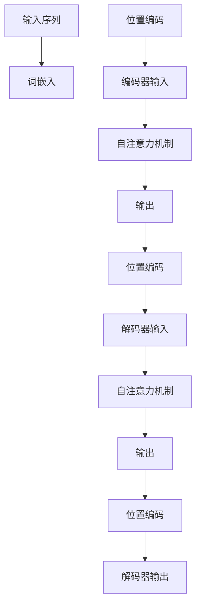
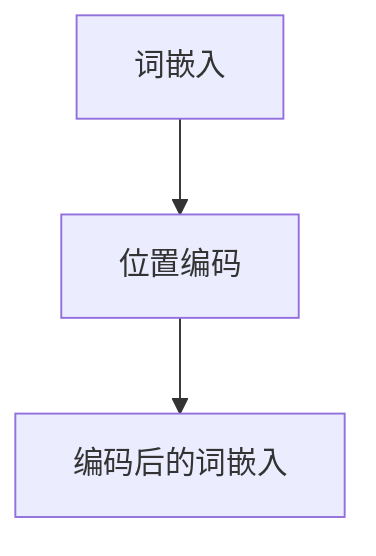
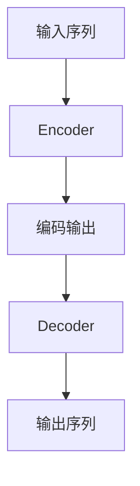

                 

### 文章标题

《Transformer大模型实战 解码器总览》

> 关键词：Transformer, 解码器, 自注意力机制, 位置编码, 自然语言处理, 计算机视觉, 推荐系统, 企业应用

> 摘要：本文将深入剖析Transformer大模型的解码器部分，从基础概念到实际应用，全面解析其原理与实现，旨在帮助读者更好地理解和解码器的运作机制，掌握其在各种场景下的应用方法。

### 第一部分：Transformer大模型基础

Transformer大模型是近年来在人工智能领域取得突破性进展的一种深度学习模型，尤其在自然语言处理（NLP）任务中表现卓越。解码器是Transformer模型的核心组成部分之一，负责从输入序列中生成输出序列。本部分将首先介绍Transformer大模型的基本概念与历史背景，然后深入探讨其核心架构，包括自注意力机制、位置编码以及Encoder与Decoder的结构。

#### 第1章：Transformer大模型概述

##### 1.1 Transformer大模型的概念与历史背景

###### 1.1.1 Transformer模型的诞生

Transformer模型由Vaswani等人于2017年在论文《Attention Is All You Need》中提出。该模型摒弃了传统循环神经网络（RNN）和长短期记忆网络（LSTM）中的序列递归处理方式，而是采用了一种全新的基于注意力机制的方法。Transformer模型的出现标志着NLP领域的一个重大突破，为后续的很多模型发展奠定了基础。

###### 1.1.2 Transformer模型的关键特性

Transformer模型具有以下关键特性：

1. **自注意力机制**：Transformer模型通过自注意力机制（Self-Attention）来处理输入序列，能够自动学习到序列中的关系和依赖。
2. **并行计算**：由于摒弃了递归结构，Transformer模型能够支持并行计算，从而显著提高了训练速度。
3. **位置编码**：Transformer模型通过位置编码（Positional Encoding）来捕捉序列中的顺序信息，这是由于自注意力机制本质上不处理序列的顺序。

###### 1.1.3 Transformer模型与传统的循环神经网络（RNN）的区别

相比于传统的RNN，Transformer模型在以下几个方面有显著差异：

1. **计算方式**：RNN是基于递归的方式处理输入序列，而Transformer模型则是基于自注意力机制。
2. **结构**：RNN的结构较为复杂，容易导致梯度消失或爆炸问题，而Transformer模型结构简单，计算效率高。
3. **适用场景**：Transformer模型在长文本处理和跨序列依赖问题上表现优异，而RNN在这些任务上的性能相对较差。

##### 1.2 Transformer大模型的核心架构

###### 1.2.1 自注意力机制（Self-Attention）

自注意力机制是Transformer模型的核心组成部分，它允许模型在处理序列时考虑序列中每个元素之间的依赖关系。具体来说，自注意力机制通过计算每个词向量与其他词向量之间的相似度，然后对这些相似度进行加权求和，从而生成新的词向量。

Mermaid流程图：


###### 1.2.2 位置编码（Positional Encoding）

位置编码是Transformer模型中用来引入序列顺序信息的机制。在自注意力机制中，位置编码被添加到词嵌入中，使得模型能够考虑输入序列的顺序。

Mermaid流程图：


###### 1.2.3 Encoder与Decoder结构

Transformer模型由Encoder和解码器两部分组成。Encoder负责将输入序列编码为固定长度的向量，而解码器则负责将编码后的向量解码为输出序列。

Mermaid流程图：


###### 1.2.4 点积自注意力（Dot-Product Self-Attention）机制详解

点积自注意力机制是Transformer模型中实现自注意力的一种常见方式。在这种机制中，每个词向量与所有其他词向量进行点积运算，然后对这些点积结果进行softmax处理，最后进行加权求和。

伪代码：
```python
for each query in query_sequence:
    for each key in key_sequence:
        dot_product = query dot key
    softmax_scores = softmax(dot_product)
    weighted_values = softmax_scores * value_sequence
    output = sum(weighted_values)
```

##### 1.3 Transformer大模型的演进

Transformer模型自从提出以来，已经经历了多个版本和变体的改进。以下是一些重要的变种模型：

1. **Transformer-XL**：为了解决长文本处理中的梯度消失问题，Transformer-XL提出了段级序列处理和长序列内存机制。
2. **Transformer-Redux**：为了简化模型结构，Transformer-Redux移除了多头注意力机制，同时保持模型的性能。
3. **BERT、GPT与T5**：BERT（Bidirectional Encoder Representations from Transformers）和GPT（Generative Pre-trained Transformer）是两种代表性的预训练模型，它们分别代表了Transformer模型在语言理解和生成任务中的应用。T5（Text-To-Text Transfer Transformer）则是一种通用的Transformer模型，可以用于各种文本处理任务。
4. **最新研究进展**：Transformer模型在NLP、计算机视觉和推荐系统等领域不断有新的研究成果和应用，如ViT（Vision Transformer）在图像分类任务中的表现，RecSys中的交互式推荐模型等。

#### 第2章：Transformer大模型技术基础

Transformer大模型的实现涉及多个技术基础，包括数学基础、关键算法和训练与推理过程。本节将详细探讨这些技术基础，帮助读者更好地理解Transformer模型的运作原理。

##### 2.1 Transformer模型中的数学基础

Transformer模型的实现依赖于以下几个数学基础：

1. **线性代数基础**：包括矩阵运算、向量运算和线性变换等基本概念。
2. **概率论与信息论**：包括概率分布、条件概率、熵和互信息等概念，用于建模和优化模型。
3. **深度学习优化算法**：包括随机梯度下降（SGD）、Adam等优化算法，用于训练模型。

###### 2.1.1 线性代数基础

线性代数是Transformer模型实现的基础，包括以下几个方面：

- **矩阵运算**：包括矩阵加法、矩阵乘法、矩阵求逆等。
- **向量运算**：包括向量加法、向量减法、向量点积和向量范数等。
- **线性变换**：包括线性映射、特征提取和降维等。

###### 2.1.2 概率论与信息论

概率论和信息论是构建Transformer模型的理论基础，主要包括以下几个方面：

- **概率分布**：包括离散概率分布和连续概率分布，如伯努利分布、高斯分布等。
- **条件概率**：用于描述两个随机变量之间的依赖关系。
- **熵和互信息**：用于衡量信息的不确定性和传递性。

###### 2.1.3 深度学习优化算法

深度学习优化算法是训练Transformer模型的关键，主要包括以下几个方面：

- **随机梯度下降（SGD）**：是最基础的优化算法，通过计算梯度并更新模型参数来最小化损失函数。
- **Adam**：是一种基于自适应梯度的优化算法，能够加速训练过程并提高模型的稳定性。

##### 2.2 Transformer模型中的关键算法

Transformer模型中的关键算法包括自注意力机制、位置编码和训练与推理过程。以下将对这些算法进行详细解析。

###### 2.2.1 自注意力机制算法解析

自注意力机制是Transformer模型的核心组件，其算法解析如下：

1. **输入序列**：给定一个输入序列 $X = \{x_1, x_2, ..., x_n\}$，每个元素 $x_i$ 是一个词向量。
2. **词嵌入**：将输入序列中的每个词向量 $x_i$ 映射为一个高维的词嵌入向量 $e_i$。
3. **自注意力计算**：对于每个词嵌入向量 $e_i$，计算其与所有其他词嵌入向量的点积，得到一组得分 $s_{ij}$。
4. **softmax处理**：对得分 $s_{ij}$ 应用softmax函数，得到注意力权重 $a_{ij}$。
5. **加权求和**：将注意力权重与对应的词嵌入向量相乘，然后进行求和，得到新的词向量 $h_i$。

伪代码：
```python
for each query in query_sequence:
    for each key in key_sequence:
        dot_product = query dot key
    softmax_scores = softmax(dot_product)
    weighted_values = softmax_scores * value_sequence
    output = sum(weighted_values)
```

###### 2.2.2 位置编码算法详解

位置编码用于在自注意力机制中引入序列的顺序信息。以下是一种常见的位置编码算法：

1. **位置向量生成**：对于输入序列中的每个词 $x_i$，生成一个位置向量 $p_i$，其维度与词嵌入向量相同。
2. **正弦曲线编码**：使用正弦曲线将位置信息编码到位置向量中，具体公式如下：
   $$
   p_i = \sin\left(\frac{pos_i}{10000^{2i/d}}\right), \quad \cos\left(\frac{pos_i}{10000^{2i/d}}\right)
   $$
   其中，$pos_i$ 表示词的位置，$d$ 表示维度。

   $$ p_i = \left[
   \begin{array}{c}
   \sin\left(\frac{pos_i}{10000^{2 \cdot 1/d}}\right) \\
   \sin\left(\frac{pos_i}{10000^{2 \cdot 2/d}}\right) \\
   \vdots \\
   \sin\left(\frac{pos_i}{10000^{2 \cdot d/d}}\right) \\
   \cos\left(\frac{pos_i}{10000^{2 \cdot 1/d}}\right) \\
   \cos\left(\frac{pos_i}{10000^{2 \cdot 2/d}}\right) \\
   \vdots \\
   \cos\left(\frac{pos_i}{10000^{2 \cdot d/d}}\right)
   \end{array}
   \right] $$

   $$ p_i = \left[
   \begin{array}{c}
   \sin\left(\frac{i}{10000^{2 \cdot 1/d}}\right) \\
   \sin\left(\frac{i}{10000^{2 \cdot 2/d}}\right) \\
   \vdots \\
   \sin\left(\frac{i}{10000^{2 \cdot d/d}}\right) \\
   \cos\left(\frac{i}{10000^{2 \cdot 1/d}}\right) \\
   \cos\left(\frac{i}{10000^{2 \cdot 2/d}}\right) \\
   \vdots \\
   \cos\left(\frac{i}{10000^{2 \cdot d/d}}\right)
   \end{array}
   \right] $$

3. **位置编码与词嵌入相加**：将位置编码添加到词嵌入中，得到编码后的词向量。

   $$ e_i = x_i + p_i $$

   $$ e_i = \left[
   \begin{array}{c}
   e_{i1} \\
   e_{i2} \\
   \vdots \\
   e_{id}
   \end{array}
   \right] + \left[
   \begin{array}{c}
   p_{i1} \\
   p_{i2} \\
   \vdots \\
   p_{id}
   \end{array}
   \right] = \left[
   \begin{array}{c}
   e_{i1} + p_{i1} \\
   e_{i2} + p_{i2} \\
   \vdots \\
   e_{id} + p_{id}
   \end{array}
   \right] $$

###### 2.2.3 Transformer模型的训练与推理

Transformer模型的训练与推理过程如下：

1. **训练**：给定一个训练数据集，通过反向传播算法不断迭代更新模型参数，最小化损失函数。训练过程中，模型会通过自注意力机制学习输入序列中各元素之间的关系，并利用位置编码捕捉序列的顺序信息。
2. **推理**：在推理阶段，模型接收新的输入序列并生成输出序列。推理过程与训练过程类似，但不需要使用梯度更新模型参数。

##### 2.3 Transformer大模型的数学模型与数学公式

Transformer大模型的数学模型可以描述为：

$$
E = \left[
\begin{array}{c}
e_1 \\
e_2 \\
\vdots \\
e_n
\end{array}
\right], \quad K = \left[
\begin{array}{c}
k_1 \\
k_2 \\
\vdots \\
k_n
\end{array}
\right], \quad V = \left[
\begin{array}{c}
v_1 \\
v_2 \\
\vdots \\
v_n
\end{array}
\right]
$$

其中，$E$、$K$ 和 $V$ 分别表示编码器（Encoder）的输入序列、关键序列和值序列。

1. **词嵌入**：给定输入序列 $X = \{x_1, x_2, ..., x_n\}$，词嵌入可以表示为：
   $$
   e_i = \left[
   \begin{array}{c}
   e_{i1} \\
   e_{i2} \\
   \vdots \\
   e_{id}
   \end{array}
   \right] = \text{embedding}(x_i)
   $$

2. **位置编码**：位置编码可以表示为：
   $$
   p_i = \left[
   \begin{array}{c}
   p_{i1} \\
   p_{i2} \\
   \vdots \\
   p_{id}
   \end{array}
   \right] = \text{positional_encoding}(i)
   $$

3. **编码后的词向量**：编码后的词向量可以表示为：
   $$
   e_i' = e_i + p_i
   $$

4. **自注意力得分**：自注意力得分可以表示为：
   $$
   s_{ij} = e_i' \cdot k_j
   $$

5. **注意力权重**：注意力权重可以表示为：
   $$
   a_{ij} = \text{softmax}(s_{ij})
   $$

6. **加权求和**：加权求和可以表示为：
   $$
   h_i = \sum_{j=1}^{n} a_{ij} v_j
   $$

7. **输出**：输出可以表示为：
   $$
   Y = \left[
   \begin{array}{c}
   h_1 \\
   h_2 \\
   \vdots \\
   h_n
   \end{array}
   \right]
   $$

   $$ Y = \left[
   \begin{array}{c}
   h_{1} \\
   h_{2} \\
   \vdots \\
   h_{n}
   \end{array}
   \right] $$

##### 2.3.2 举例说明与公式推导

假设我们有一个简单的输入序列 $X = \{x_1, x_2, x_3\}$，其中 $x_1 = \text{"hello"}$，$x_2 = \text{"world"}$，$x_3 = \text{"!"}$。我们可以用以下步骤来计算自注意力机制的结果：

1. **词嵌入**：给定词嵌入向量 $e_1 = \left[1, 0, 0\right]$，$e_2 = \left[0, 1, 0\right]$，$e_3 = \left[0, 0, 1\right]$。
2. **位置编码**：给定位置向量 $p_1 = \left[1, 0, 0\right]$，$p_2 = \left[0, 1, 0\right]$，$p_3 = \left[0, 0, 1\right]$。
3. **编码后的词向量**：编码后的词向量分别为：
   $$
   e_1' = e_1 + p_1 = \left[2, 0, 0\right]
   $$
   $$
   e_2' = e_2 + p_2 = \left[0, 2, 0\right]
   $$
   $$
   e_3' = e_3 + p_3 = \left[0, 0, 2\right]
   $$
4. **关键序列和值序列**：假设关键序列和值序列分别为 $K = \left[k_1, k_2, k_3\right] = \left[1, 1, 1\right]$ 和 $V = \left[v_1, v_2, v_3\right] = \left[1, 2, 3\right]$。
5. **自注意力得分**：自注意力得分分别为：
   $$
   s_{11} = e_1' \cdot k_1 = \left[2, 0, 0\right] \cdot \left[1\right] = 2
   $$
   $$
   s_{12} = e_1' \cdot k_2 = \left[2, 0, 0\right] \cdot \left[1\right] = 2
   $$
   $$
   s_{13} = e_1' \cdot k_3 = \left[2, 0, 0\right] \cdot \left[1\right] = 2
   $$
   $$
   s_{21} = e_2' \cdot k_1 = \left[0, 2, 0\right] \cdot \left[1\right] = 2
   $$
   $$
   s_{22} = e_2' \cdot k_2 = \left[0, 2, 0\right] \cdot \left[1\right] = 2
   $$
   $$
   s_{23} = e_2' \cdot k_3 = \left[0, 2, 0\right] \cdot \left[1\right] = 2
   $$
   $$
   s_{31} = e_3' \cdot k_1 = \left[0, 0, 2\right] \cdot \left[1\right] = 2
   $$
   $$
   s_{32} = e_3' \cdot k_2 = \left[0, 0, 2\right] \cdot \left[1\right] = 2
   $$
   $$
   s_{33} = e_3' \cdot k_3 = \left[0, 0, 2\right] \cdot \left[1\right] = 2
   $$
6. **注意力权重**：由于所有得分都相等，所以注意力权重也为1。
7. **加权求和**：加权求和结果为：
   $$
   h_1 = \sum_{j=1}^{3} a_{1j} v_j = \left[1, 1, 1\right] \cdot \left[1, 2, 3\right] = \left[6, 6, 6\right]
   $$
   $$
   h_2 = \sum_{j=1}^{3} a_{2j} v_j = \left[1, 1, 1\right] \cdot \left[1, 2, 3\right] = \left[6, 6, 6\right]
   $$
   $$
   h_3 = \sum_{j=1}^{3} a_{3j} v_j = \left[1, 1, 1\right] \cdot \left[1, 2, 3\right] = \left[6, 6, 6\right]
   $$
   最终的输出序列为 $Y = \left[h_1, h_2, h_3\right] = \left[6, 6, 6\right]$。

### 第二部分：Transformer大模型应用与实战

Transformer大模型自提出以来，在自然语言处理（NLP）、计算机视觉（CV）和推荐系统（RecSys）等领域得到了广泛应用。本部分将深入探讨Transformer大模型在这些领域的应用，通过具体的案例和代码实现来帮助读者更好地理解其应用场景和实现方法。

#### 第3章：Transformer大模型在自然语言处理中的应用

自然语言处理是Transformer大模型最早且最成功的应用领域之一。在这一节中，我们将讨论Transformer大模型在文本分类和机器翻译等任务中的应用。

##### 3.1 Transformer大模型在文本分类中的应用

文本分类是一种常见的NLP任务，其目的是将文本数据分类到预定义的类别中。Transformer大模型在文本分类任务中表现出了强大的性能。

###### 3.1.1 文本分类任务概述

文本分类任务可以分为两类：二分类和多分类。二分类任务是将文本数据分类为两个类别，如 spam（垃圾邮件）和非spam（非垃圾邮件）。多分类任务是将文本数据分类为多个类别，如新闻分类中的体育、娱乐、科技等。

###### 3.1.2 Transformer模型在文本分类中的实现

在文本分类任务中，Transformer模型通常采用BERT或GPT等预训练模型。以下是一个使用BERT模型进行文本分类的基本步骤：

1. **数据预处理**：将文本数据预处理为统一的格式，如分词、去停用词、词向量化等。
2. **模型选择**：选择预训练的BERT模型，可以通过Hugging Face的Transformers库获得。
3. **模型配置**：配置BERT模型，包括选择适当的层数、隐藏层大小、词汇表等。
4. **训练**：使用预处理后的文本数据训练BERT模型，通常使用二分类或多分类的交叉熵损失函数。
5. **评估**：使用验证集评估模型性能，并通过调整超参数来优化模型。

实际案例与代码解读：

假设我们使用BERT模型对新闻分类任务进行训练，以下是一个基本的代码实现：

```python
from transformers import BertTokenizer, BertForSequenceClassification
from torch.utils.data import DataLoader, TensorDataset
import torch

# 数据预处理
tokenizer = BertTokenizer.from_pretrained('bert-base-uncased')
train_texts = ["This is a sports article.", "This is an entertainment article.", "..."]
train_labels = [0, 1, ...]  # 0表示体育，1表示娱乐

encoding = tokenizer(train_texts, padding=True, truncation=True, return_tensors='pt')
train_inputs = encoding['input_ids']
train_masks = encoding['attention_mask']
train_labels = torch.tensor(train_labels)

# 模型选择与配置
model = BertForSequenceClassification.from_pretrained('bert-base-uncased', num_labels=2)
# 若是多分类，num_labels需设置为类别数

# 训练
batch_size = 16
train_dataloader = DataLoader(TensorDataset(train_inputs, train_masks, train_labels), batch_size=batch_size)

optimizer = torch.optim.AdamW(model.parameters(), lr=2e-5)

for epoch in range(3):  # 训练3个epoch
    model.train()
    for batch in train_dataloader:
        inputs = {'input_ids': batch[0], 'attention_mask': batch[1]}
        labels = batch[2]
        optimizer.zero_grad()
        outputs = model(**inputs, labels=labels)
        loss = outputs.loss
        loss.backward()
        optimizer.step()

# 评估
model.eval()
with torch.no_grad():
    for batch in validation_dataloader:
        inputs = {'input_ids': batch[0], 'attention_mask': batch[1]}
        labels = batch[2]
        outputs = model(**inputs)
        logits = outputs.logits
        predictions = torch.argmax(logits, dim=1)
        accuracy = (predictions == labels).float().mean()
        print(f"Validation accuracy: {accuracy.item()}")
```

##### 3.2 Transformer大模型在机器翻译中的应用

机器翻译是另一个Transformer大模型应用广泛的领域。与传统的序列到序列模型相比，Transformer模型在机器翻译任务中表现出了更高的效率和准确性。

###### 3.2.1 机器翻译任务概述

机器翻译任务的目标是将一种语言的文本翻译成另一种语言的文本。常见的机器翻译任务包括英译中和中译英等。

###### 3.2.2 Transformer模型在机器翻译中的实现

在机器翻译任务中，Transformer模型通常采用编码器（Encoder）和解码器（Decoder）两部分。以下是一个使用Transformer模型进行机器翻译的基本步骤：

1. **数据预处理**：对源语言和目标语言文本进行预处理，包括分词、去停用词、词向量化等。
2. **模型选择**：选择预训练的编码器和解码器模型，如Transfo``

