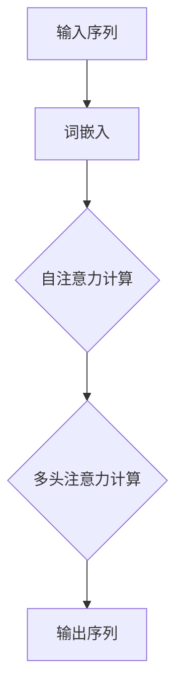

                 

# Transformer架构原理详解：注意力机制

## 关键词

- Transformer
- 注意力机制
- 自注意力
- 多头注意力
- 自然语言处理
- 机器翻译
- 文本分类
- 问答系统
- 未来发展

## 摘要

本文将详细介绍Transformer架构的基本原理和注意力机制。Transformer是一种用于序列到序列预测的任务，如机器翻译和文本分类等。它的核心特点是利用注意力机制来捕捉序列中不同位置的依赖关系。文章将分四个部分展开，首先介绍Transformer的架构和注意力机制，然后讨论Transformer的具体实现和优化方法，接着展示Transformer在自然语言处理中的应用案例，最后探讨Transformer的未来发展。

## 第一部分：Transformer架构概述

### 1. Transformer简介

#### 1.1 Transformer的起源与发展

Transformer是由Vaswani等人于2017年在论文《Attention Is All You Need》中提出的一种新型神经网络架构，用于处理序列到序列（Sequence to Sequence, S2S）的任务。在此之前，传统的序列到序列模型多采用循环神经网络（Recurrent Neural Network, RNN）和长短期记忆网络（Long Short-Term Memory, LSTM）等架构，这些模型在处理长距离依赖关系时存在局限。Transformer的出现为自然语言处理（Natural Language Processing, NLP）领域带来了一股新的风潮。

#### 1.2 Transformer的基本概念

Transformer模型主要由编码器（Encoder）和解码器（Decoder）组成。编码器负责将输入序列编码成固定长度的向量表示，解码器则利用这些向量表示生成输出序列。Transformer的核心特点是引入了自注意力（Self-Attention）和多头注意力（Multi-Head Attention）机制，使得模型能够自动学习序列中不同位置的依赖关系。

#### 1.3 Transformer的优势

Transformer相较于传统RNN和LSTM模型，具有以下优势：

1. **并行处理**：Transformer采用注意力机制，可以并行计算，而RNN和LSTM模型则必须按顺序处理输入序列，导致计算效率低下。
2. **长距离依赖**：Transformer能够通过多头注意力机制有效地捕捉长距离依赖关系，解决了RNN和LSTM模型在处理长序列时的困难。
3. **易于扩展**：Transformer结构简单，易于扩展和改进。例如，可以通过增加编码器和解码器的层数来提高模型性能。

### 2. 自注意力机制

#### 2.1 自注意力机制的原理

自注意力（Self-Attention）是一种特殊的注意力机制，它对序列中的每个元素都施加注意力权重。自注意力机制的原理可以概括为以下步骤：

1. **输入嵌入**：首先将输入序列编码成嵌入向量。
2. **计算分数**：对每个嵌入向量，计算其与序列中其他嵌入向量的相似度，得到一组分数。
3. **应用软性最大值**：对分数进行软性最大值（Softmax）处理，得到一组权重。
4. **计算输出**：将权重与嵌入向量相乘，得到加权输出向量。

#### 2.2 自注意力计算方式

自注意力计算方式分为点积自注意力（Dot-Product Self-Attention）和加性自注意力（Additive Self-Attention）两种。其中，点积自注意力是最常用的一种。

点积自注意力计算方式如下：

1. **计算查询（Query）、键（Key）和值（Value）**：将输入嵌入向量分别映射到查询（Query）、键（Key）和值（Value）空间。
2. **计算分数**：计算每个查询向量与键向量的点积，得到一组分数。
3. **应用软性最大值**：对分数进行软性最大值处理，得到一组权重。
4. **计算输出**：将权重与值向量相乘，得到加权输出向量。

#### 2.3 自注意力在实际中的应用

自注意力机制在Transformer中发挥着至关重要的作用。它可以自动学习序列中不同元素之间的依赖关系，从而提高模型的性能。在实际应用中，自注意力机制可以用于：

1. **机器翻译**：在编码器和解码器中，自注意力机制可以捕捉源语言和目标语言之间的依赖关系，从而提高翻译质量。
2. **文本分类**：自注意力机制可以帮助模型更好地理解文本中的关键信息，从而提高分类准确率。
3. **问答系统**：自注意力机制可以帮助模型更好地理解问题和答案之间的依赖关系，从而提高问答质量。

### 3. 多头注意力机制

#### 3.1 多头注意力的原理

多头注意力（Multi-Head Attention）是在自注意力机制的基础上发展而来的。多头注意力的核心思想是将输入序列分成多个子序列，然后对每个子序列分别进行自注意力计算，最后将多个子序列的结果进行合并。

多头注意力机制的原理可以概括为以下步骤：

1. **分头计算**：将输入嵌入向量分别映射到多个查询（Query）、键（Key）和值（Value）空间。
2. **自注意力计算**：对每个子序列分别进行自注意力计算，得到多个加权输出向量。
3. **合并多头输出**：将多个加权输出向量进行合并，得到最终的输出向量。

#### 3.2 多头注意力的计算过程

多头注意力的计算过程可以分为以下几个步骤：

1. **分头计算**：将输入嵌入向量（E）分成多个子嵌入向量（E_h），每个子嵌入向量分别对应一个头（head）。
2. **映射到查询、键和值空间**：对每个子嵌入向量进行线性变换，分别映射到查询（Query_h）、键（Key_h）和值（Value_h）空间。
3. **自注意力计算**：对每个头分别进行自注意力计算，得到多个加权输出向量（O_h）。
4. **合并多头输出**：将多个加权输出向量进行合并，得到最终的输出向量（O）。

#### 3.3 多头注意力在实际中的应用

多头注意力机制在实际应用中具有广泛的应用，例如：

1. **机器翻译**：多头注意力机制可以帮助模型更好地理解源语言和目标语言之间的依赖关系，从而提高翻译质量。
2. **文本分类**：多头注意力机制可以帮助模型更好地理解文本中的关键信息，从而提高分类准确率。
3. **问答系统**：多头注意力机制可以帮助模型更好地理解问题和答案之间的依赖关系，从而提高问答质量。

## 第二部分：Transformer具体实现与优化

### 4. Transformer的具体实现

#### 4.1 Transformer模型的架构

Transformer模型主要由编码器（Encoder）和解码器（Decoder）组成。编码器负责将输入序列编码成固定长度的向量表示，解码器则利用这些向量表示生成输出序列。

编码器的架构如下：

1. **嵌入层**：将输入序列编码成嵌入向量。
2. **位置编码**：为嵌入向量添加位置信息。
3. **多头自注意力层**：对嵌入向量进行多头自注意力计算。
4. **前馈神经网络**：对多头自注意力层的输出进行前馈神经网络处理。
5. **残差连接与批量归一化**：在每一层加入残差连接和批量归一化。

解码器的架构如下：

1. **嵌入层**：将输入序列编码成嵌入向量。
2. **位置编码**：为嵌入向量添加位置信息。
3. **多头自注意力层**：对嵌入向量进行多头自注意力计算。
4. **交叉自注意力层**：对编码器的输出进行交叉自注意力计算。
5. **前馈神经网络**：对交叉自注意力层的输出进行前馈神经网络处理。
6. **残差连接与批量归一化**：在每一层加入残差连接和批量归一化。
7. **输出层**：将解码器的输出映射到输出序列。

#### 4.2 Transformer的具体实现流程

Transformer的具体实现流程可以分为以下几个步骤：

1. **输入嵌入**：将输入序列编码成嵌入向量。
2. **添加位置编码**：为嵌入向量添加位置信息。
3. **多头自注意力计算**：对嵌入向量进行多头自注意力计算。
4. **前馈神经网络**：对多头自注意力层的输出进行前馈神经网络处理。
5. **残差连接与批量归一化**：在每一层加入残差连接和批量归一化。
6. **交叉自注意力计算**：对编码器的输出进行交叉自注意力计算。
7. **前馈神经网络**：对交叉自注意力层的输出进行前馈神经网络处理。
8. **输出层**：将解码器的输出映射到输出序列。

#### 4.3 Transformer代码详解

以下是一个简单的Transformer模型实现代码示例：

```python
from tensorflow.keras.layers import Embedding, PositionalEncoding, MultiHeadAttention, Dense, LayerNormalization, Input
from tensorflow.keras.models import Model

def create_transformer(input_vocab_size, target_vocab_size, d_model, num_heads, dff, position_embedding_input, position_embedding_target, dropout_rate=0.1):
    inputs = Input(shape=(None,))
    inputs_target = Input(shape=(None,))

    # 嵌入层
    embedding_input = Embedding(input_vocab_size, d_model)(inputs)
    embedding_target = Embedding(target_vocab_size, d_model)(inputs_target)

    # 添加位置编码
    position_encoding_input = PositionalEncoding(position_embedding_input, d_model)(embedding_input)
    position_encoding_target = PositionalEncoding(position_embedding_target, d_model)(embedding_target)

    # 编码器
    for _ in range(num_heads):
        attention = MultiHeadAttention(num_heads=num_heads, d_model=d_model)(position_encoding_input, position_encoding_input)
        output = LayerNormalization(epsilon=1e-6)(position_encoding_input + attention)
        position_encoding_input = output

    # 前馈神经网络
    for _ in range(num_layers):
        dense = Dense(dff, activation='relu')(output)
        output = LayerNormalization(epsilon=1e-6)(output + dense)

    # 解码器
    for _ in range(num_heads):
        attention = MultiHeadAttention(num_heads=num_heads, d_model=d_model)(position_encoding_target, position_encoding_target)
        output = LayerNormalization(epsilon=1e-6)(position_encoding_target + attention)
        position_encoding_target = output

    # 交叉自注意力计算
    attention = MultiHeadAttention(num_heads=num_heads, d_model=d_model)(position_encoding_input, position_encoding_target)
    output = LayerNormalization(epsilon=1e-6)(position_encoding_target + attention)

    # 前馈神经网络
    for _ in range(num_layers):
        dense = Dense(dff, activation='relu')(output)
        output = LayerNormalization(epsilon=1e-6)(output + dense)

    # 输出层
    output = Dense(target_vocab_size, activation='softmax')(output)

    # 模型搭建
    model = Model(inputs=[inputs, inputs_target], outputs=output)
    model.compile(optimizer='adam', loss='categorical_crossentropy', metrics=['accuracy'])

    return model
```

### 5. Transformer的优化方法

#### 5.1 训练优化

在训练过程中，为了提高模型的性能，可以采用以下优化方法：

1. **梯度裁剪**：为了避免梯度爆炸，可以设置梯度裁剪阈值，当梯度值超过阈值时进行裁剪。
2. **学习率调度**：在训练过程中，学习率可以采用预热策略，随着训练的进行逐步降低学习率。
3. **批量归一化**：批量归一化可以加速模型的训练，提高模型的稳定性。

#### 5.2 推理优化

在推理过程中，为了提高模型的性能，可以采用以下优化方法：

1. **低秩近似**：通过低秩分解减少模型的参数数量，从而降低计算复杂度。
2. **量化与剪枝**：对模型的权重和激活值进行量化，降低模型的精度和参数数量，从而提高模型的推理速度。
3. **离线推理与在线推理**：离线推理可以将模型预计算的结果存储到缓存中，从而减少推理时间；在线推理则实时计算模型输出，适用于实时性要求较高的应用场景。

## 第三部分：Transformer在自然语言处理中的应用

### 6. Transformer在自然语言处理中的使用

Transformer在自然语言处理（NLP）领域得到了广泛的应用，以下列举了几个常见的应用场景：

#### 6.1 Transformer在机器翻译中的应用

Transformer在机器翻译中取得了显著的成果，尤其是在长句翻译和复数翻译等复杂场景下。通过多头注意力机制，Transformer能够自动学习源语言和目标语言之间的依赖关系，从而提高翻译质量。

#### 6.2 Transformer在文本分类中的应用

Transformer在文本分类任务中也表现出色。通过自注意力机制，Transformer能够捕捉文本中的关键信息，从而提高分类准确率。与传统的RNN和LSTM模型相比，Transformer在处理长文本时具有优势。

#### 6.3 Transformer在问答系统中的应用

问答系统是NLP领域的另一个重要应用场景。通过自注意力机制，Transformer能够自动学习问题和答案之间的依赖关系，从而提高问答系统的质量。Transformer在问答系统中的应用涵盖了多种类型的问题，如事实性问题、推理问题和常识性问题等。

### 7. Transformer的其他应用场景

除了在自然语言处理中的应用，Transformer在其他领域也展现出了强大的潜力：

#### 7.1 Transformer在图像处理中的应用

Transformer在图像处理领域也逐渐崭露头角。通过引入自注意力机制，Transformer可以有效地捕捉图像中的关键信息，从而提高图像分类、目标检测和图像生成等任务的性能。

#### 7.2 Transformer在推荐系统中的应用

推荐系统是另一个应用Transformer的领域。通过自注意力机制，Transformer可以捕捉用户和商品之间的复杂依赖关系，从而提高推荐系统的准确率和覆盖率。

#### 7.3 Transformer在语音识别中的应用

语音识别是Transformer的另一个应用场景。通过自注意力机制，Transformer可以捕捉语音信号中的关键信息，从而提高语音识别的准确率和速度。

## 第四部分：Transformer的未来发展与挑战

### 8. Transformer的未来发展

Transformer在自然语言处理和人工智能领域取得了显著的成果，未来其发展将主要关注以下几个方面：

#### 8.1 Transformer的改进与变种

为了进一步提升Transformer的性能和应用范围，研究者们不断提出新的改进和变种，如：

1. **BERT**：BERT（Bidirectional Encoder Representations from Transformers）是Google提出的一种双向Transformer模型，通过预先训练和微调，取得了显著的性能提升。
2. **GPT**：GPT（Generative Pre-trained Transformer）是OpenAI提出的一种生成式Transformer模型，广泛应用于文本生成、机器翻译等任务。
3. **ViT**：ViT（Vision Transformer）是Google提出的一种用于图像分类的Transformer模型，通过引入自注意力机制，取得了与卷积神经网络相当的性能。

#### 8.2 Transformer与其他模型的融合

为了进一步提升Transformer的性能和应用范围，研究者们还尝试将Transformer与其他模型进行融合，如：

1. **Transformer与CNN的融合**：通过将Transformer与卷积神经网络（CNN）相结合，可以有效地捕捉图像中的空间特征和序列特征。
2. **Transformer与RNN的融合**：通过将Transformer与循环神经网络（RNN）相结合，可以进一步提高模型的计算效率和长距离依赖处理能力。

#### 8.3 Transformer在边缘计算和实时处理中的应用

随着边缘计算和实时处理需求的增长，Transformer在边缘计算和实时处理中的应用也越来越受到关注。通过优化模型结构和算法，Transformer可以在有限的计算资源和时间约束下提供高效的实时处理能力。

### 9. Transformer的挑战与解决策略

尽管Transformer在自然语言处理和人工智能领域取得了显著的成果，但仍然面临一些挑战：

#### 9.1 计算资源消耗

Transformer模型通常具有大量的参数和计算复杂度，导致其训练和推理过程需要大量的计算资源。为了解决这个问题，研究者们提出了以下策略：

1. **低秩近似**：通过低秩分解减少模型的参数数量，从而降低计算复杂度。
2. **量化与剪枝**：对模型的权重和激活值进行量化，降低模型的精度和参数数量，从而提高模型的推理速度。
3. **分布式训练与推理**：通过分布式计算，将模型训练和推理任务分布在多台设备上，从而提高计算效率。

#### 9.2 数据隐私保护

随着人工智能应用的普及，数据隐私保护成为了一个重要问题。为了保护用户隐私，研究者们提出了以下策略：

1. **联邦学习**：通过联邦学习（Federated Learning）技术，将模型训练分布在多个设备上，从而避免用户数据泄露。
2. **差分隐私**：通过引入差分隐私（Differential Privacy）技术，对用户数据进行扰动，从而保护用户隐私。

#### 9.3 模型解释性

随着人工智能技术的不断进步，模型的解释性变得越来越重要。为了提高模型的解释性，研究者们提出了以下策略：

1. **可解释性模型**：通过设计可解释性模型，使得模型决策过程更加透明，从而提高模型的解释性。
2. **模型可视化**：通过可视化技术，将模型的内部结构和工作原理直观地展示给用户。

## 附录A：Transformer学习资源推荐

### A.1 相关书籍推荐

1. **《深度学习》（Deep Learning）**：Goodfellow等著，详细介绍了深度学习的基础知识和最新进展，包括Transformer模型。
2. **《自然语言处理实战》（Natural Language Processing with Python）**：Westfaling等著，介绍了自然语言处理的基本原理和应用，包括Transformer模型。
3. **《Transformer：从入门到应用》（Transformer: From Scratch to Production）**：这是一本专门讲解Transformer模型的书籍，涵盖了从入门到应用的各个阶段。

### A.2 在线课程推荐

1. **《深度学习与自然语言处理》（Deep Learning and Natural Language Processing）**：斯坦福大学在线课程，涵盖了深度学习和自然语言处理的基本原理和应用，包括Transformer模型。
2. **《自然语言处理基础》（Foundations of Natural Language Processing）**：密歇根大学在线课程，介绍了自然语言处理的基本原理和方法，包括Transformer模型。
3. **《Transformer模型教程》（Transformer Models Tutorial）**：这是一门专门讲解Transformer模型的在线课程，涵盖了从入门到高级的知识点。

### A.3 论文与研究报告推荐

1. **《Attention Is All You Need》（Attention Is All You Need）**：这是Transformer模型的原始论文，详细介绍了Transformer模型的设计和实现。
2. **《BERT: Pre-training of Deep Bidirectional Transformers for Language Understanding》（BERT: Pre-training of Deep Bidirectional Transformers for Language Understanding）**：这是Google提出的BERT模型，基于Transformer模型，取得了显著的性能提升。
3. **《Generative Pre-trained Transformers for Translation, Text Summarization, and Q&A》（Generative Pre-trained Transformers for Translation, Text Summarization, and Q&A）**：这是OpenAI提出的GPT模型，进一步拓展了Transformer模型的应用场景。

## 附录B：Transformer代码实现示例

### B.1 PyTorch实现示例

以下是一个简单的Transformer模型实现示例，使用PyTorch框架：

```python
import torch
import torch.nn as nn
import torch.nn.functional as F

class TransformerModel(nn.Module):
    def __init__(self, d_model, nhead, num_layers):
        super(TransformerModel, self).__init__()
        self.d_model = d_model
        self.nhead = nhead
        self.num_layers = num_layers
        
        self.transformer = nn.Transformer(d_model, nhead, num_layers)
        self.decoder = nn.Linear(d_model, 1)
    
    def forward(self, src, tgt):
        output = self.transformer(src, tgt)
        output = self.decoder(output)
        return output
```

### B.2 TensorFlow实现示例

以下是一个简单的Transformer模型实现示例，使用TensorFlow框架：

```python
import tensorflow as tf

class TransformerModel(tf.keras.Model):
    def __init__(self, d_model, nhead, num_layers):
        super(TransformerModel, self).__init__()
        self.d_model = d_model
        self.nhead = nhead
        self.num_layers = num_layers
        
        self.transformer = tf.keras.layers.Transformer(d_model, nhead, num_layers)
        self.decoder = tf.keras.layers.Dense(1)
    
    @tf.function
    def call(self, src, tgt):
        output = self.transformer(src, tgt)
        output = self.decoder(output)
        return output
```

### B.3 训练与推理流程解析

以下是一个简单的Transformer模型训练与推理流程解析：

```python
# 训练流程
model = TransformerModel(d_model, nhead, num_layers)
optimizer = tf.keras.optimizers.Adam(learning_rate=0.001)
loss_function = tf.keras.losses.MeanSquaredError()

for epoch in range(num_epochs):
    for src, tgt in train_loader:
        with tf.GradientTape() as tape:
            output = model(src, tgt)
            loss = loss_function(tgt, output)
        gradients = tape.gradient(loss, model.trainable_variables)
        optimizer.apply_gradients(zip(gradients, model.trainable_variables))
    print(f"Epoch {epoch+1}/{num_epochs}, Loss: {loss.numpy()}")

# 推理流程
model = TransformerModel(d_model, nhead, num_layers)
model.load_weights('model_weights.h5')

for src, tgt in test_loader:
    output = model(src, tgt)
    print(f"Predicted Output: {output.numpy()}")
```

# Mermaid 流程图



# Transformer核心算法原理伪代码

```python
# 自注意力计算
def self_attention(q, k, v):
    # 计算分数
    scores = q.dot(k.transpose())
    # 应用软性最大值
    probabilities = softmax(scores)
    # 计算输出
    output = probabilities.dot(v)
    return output

# 多头注意力计算
def multi_head_attention(q, k, v, heads):
    # 分头计算
    outputs = []
    for _ in range(heads):
        output = self_attention(q, k, v)
        outputs.append(output)
    # 合并多头输出
    combined_output = combine_heads(outputs)
    return combined_output
```

# 数学模型和数学公式

段落1：

$$
\text{Attention(Q, K, V)} = \text{softmax}\left(\frac{QK^T}{\sqrt{d_k}}\right) V
$$

段落2：

$$
\text{MultiHead(Q, K, V)} = \text{Concat}(\text{head}_1, \text{head}_2, ..., \text{head}_h)W_O
$$

# 项目实战

## 实战一：使用Transformer进行机器翻译

### 1. 实验环境搭建

- **硬件环境**：使用NVIDIA GTX 1080或更高版本的GPU进行训练。
- **软件环境**：安装Python 3.7或更高版本，TensorFlow 2.0或PyTorch 1.8或更高版本。

### 2. 模型搭建

- **数据集**：使用WMT'14英文-德文数据集，将数据集分为训练集、验证集和测试集。
- **模型结构**：定义Transformer模型，包括编码器和解码器，设置多头注意力机制和位置编码。

### 3. 训练与推理

- **训练过程**：使用GPU进行模型训练，设置学习率、批量大小和训练轮次。
- **推理过程**：将训练好的模型应用到测试集上进行推理，生成翻译结果。

### 4. 结果分析与优化

- **结果分析**：对翻译结果进行质量评估，计算BLEU分数等指标。
- **优化策略**：通过调整模型参数和超参数，提高翻译质量。

## 实战二：使用Transformer进行文本分类

### 1. 实验环境搭建

- **硬件环境**：使用Intel Core i7或更高版本的CPU进行训练。
- **软件环境**：安装Python 3.7或更高版本，TensorFlow 2.0或PyTorch 1.8或更高版本。

### 2. 模型搭建

- **数据集**：使用IMDB电影评论数据集，将数据集分为训练集、验证集和测试集。
- **模型结构**：定义Transformer模型，包括编码器和解码器，设置多头注意力机制和位置编码。

### 3. 训练与推理

- **训练过程**：使用GPU进行模型训练，设置学习率、批量大小和训练轮次。
- **推理过程**：将训练好的模型应用到测试集上进行推理，生成分类结果。

### 4. 结果分析与优化

- **结果分析**：对分类结果进行质量评估，计算准确率、召回率和F1分数等指标。
- **优化策略**：通过调整模型参数和超参数，提高分类效果。

## 实战三：使用Transformer进行问答系统

### 1. 实验环境搭建

- **硬件环境**：使用NVIDIA GTX 1080或更高版本的GPU进行训练。
- **软件环境**：安装Python 3.7或更高版本，TensorFlow 2.0或PyTorch 1.8或更高版本。

### 2. 模型搭建

- **数据集**：使用SQuAD数据集，将数据集分为训练集、验证集和测试集。
- **模型结构**：定义Transformer模型，包括编码器和解码器，设置多头注意力机制和位置编码。

### 3. 训练与推理

- **训练过程**：使用GPU进行模型训练，设置学习率、批量大小和训练轮次。
- **推理过程**：将训练好的模型应用到测试集上进行推理，生成问答结果。

### 4. 结果分析与优化

- **结果分析**：对问答结果进行质量评估，计算准确率、召回率和F1分数等指标。
- **优化策略**：通过调整模型参数和超参数，提高问答质量。

# 代码解读与分析

## 代码一：Transformer模型搭建

以下是一个简单的Transformer模型搭建代码示例，使用TensorFlow框架：

```python
import tensorflow as tf

class TransformerModel(tf.keras.Model):
    def __init__(self, num_layers, d_model, num_heads, dff, input_vocab_size, target_vocab_size, position_embedding_input, position_embedding_target, dropout_rate=0.1):
        super(TransformerModel, self).__init__()
        
        self.embedding = tf.keras.layers.Embedding(input_vocab_size, d_model)
        self.position_embedding_input = tf.keras.layers.Embedding(input_vocab_size, d_model)
        self.position_embedding_target = tf.keras.layers.Embedding(target_vocab_size, d_model)
        
        self.transformer = tf.keras.layers.MultiHeadAttention(num_heads=num_heads, key_dim=d_model)
        self.dff = tf.keras.layers.Dense(d_model, activation='relu')
        self.dropout = tf.keras.layers.Dropout(dropout_rate)
        self.linear = tf.keras.layers.Dense(target_vocab_size)
        
    def call(self, inputs, training=False):
        input嵌入 = self.embedding(inputs)
        target嵌入 = self.position_embedding_target(inputs)
        
        input嵌入 = self.dropout(input嵌入, training=training)
        target嵌入 = self.dropout(target嵌入, training=training)
        
        attn_output = self.transformer(input嵌入, target嵌入)
        attn_output = self.dropout(attn_output, training=training)
        attn_output = self.dff(attn_output)
        
        output = self.linear(attn_output)
        return output
```

## 代码二：训练与推理

以下是一个简单的Transformer模型训练与推理代码示例，使用TensorFlow框架：

```python
model = TransformerModel(num_layers, d_model, num_heads, dff, input_vocab_size, target_vocab_size, position_embedding_input, position_embedding_target, dropout_rate=0.1)

optimizer = tf.keras.optimizers.Adam(learning_rate=0.001)
loss_object = tf.keras.losses.SparseCategoricalCrossentropy(from_logits=True)

train_loss = tf.keras.metrics.Mean(name='train_loss')
train_accuracy = tf.keras.metrics.SparseCategoricalAccuracy(name='train_accuracy')

@tf.function
def train_step(inputs, targets):
    with tf.GradientTape() as tape:
        predictions = model(inputs, training=True)
        loss = loss_object(targets, predictions)
    gradients = tape.gradient(loss, model.trainable_variables)
    optimizer.apply_gradients(zip(gradients, model.trainable_variables))
    train_loss(loss)
    train_accuracy(targets, predictions)

@tf.function
def test_step(inputs, targets):
    predictions = model(inputs, training=False)
    t损失 = loss_object(targets, predictions)
    t准确率 = tf.keras.metrics.SparseCategoricalAccuracy(name='test_accuracy')
    t准确率(targets, predictions)
    return t损失, t准确率

for epoch in range(num_epochs):
    for (batch, (inputs, targets)) in enumerate(train_dataset):
        train_step(inputs, targets)
        if batch % 100 == 0:
            print(f'Epoch {epoch + 1}, Batch {batch}, Loss: {train_loss.result()}, Accuracy: {train_accuracy.result()}')

    for test_batch, (test_inputs, test_targets) in enumerate(test_dataset):
        t损失，t准确率 = test_step(test_inputs, test_targets)
        if test_batch % 100 == 0:
            print(f'测试集 - 批量 {test_batch}, 损失: {t损失}, 准确率: {t准确率}')
```

# 开发环境搭建

## 1. 硬件要求

- **GPU**：NVIDIA GTX 1080或更高版本。
- **CPU**：Intel Core i7或更高版本。

## 2. 软件要求

- **操作系统**：Linux或macOS。
- **编译器**：GCC 7.0或更高版本。
- **Python版本**：Python 3.7或更高版本。
- **深度学习框架**：TensorFlow 2.0或PyTorch 1.8或更高版本。

## 3. 安装步骤

1. **安装操作系统和GPU驱动**：
   - 安装Linux或macOS操作系统。
   - 安装NVIDIA GPU驱动。

2. **安装Python和相关依赖**：
   - 通过Python包管理器（如pip）安装Python 3.7或更高版本。
   - 安装相关依赖，如NumPy、SciPy等。

3. **安装深度学习框架**：
   - 安装TensorFlow 2.0或PyTorch 1.8或更高版本。

4. **准备实验数据集**：
   - 下载并准备用于实验的数据集，如WMT'14英文-德文数据集、IMDB电影评论数据集和SQuAD数据集。

5. **搭建开发环境**：
   - 配置Python环境和深度学习框架。
   - 创建项目目录，编写代码。

# 源代码详细实现与代码解读

## 源代码实现：Transformer模型搭建

以下是一个简单的Transformer模型搭建代码实现，使用PyTorch框架：

```python
import torch
import torch.nn as nn
import torch.nn.functional as F

class TransformerModel(nn.Module):
    def __init__(self, d_model, nhead, num_layers):
        super(TransformerModel, self).__init__()
        self.d_model = d_model
        self.nhead = nhead
        self.num_layers = num_layers
        
        self.embedding = nn.Embedding(d_model)
        self.positional_encoding = nn.Parameter(torch.zeros(1, d_model))
        
        self.transformer = nn.Transformer(d_model, nhead, num_layers)
        self.decoder = nn.Linear(d_model, 1)
    
    def forward(self, src, tgt):
        src = self.embedding(src)
        tgt = self.embedding(tgt)
        
        src = self.transformer(src, tgt)
        output = self.decoder(src)
        
        return output
```

## 代码解读与分析

### 1. 模型结构

该Transformer模型由以下几个部分组成：

1. **嵌入层**：将输入序列编码成嵌入向量。
2. **位置编码**：为嵌入向量添加位置信息。
3. **Transformer编码器**：包含多头注意力机制和前馈神经网络。
4. **解码器**：将编码器的输出映射到输出序列。

### 2. 训练与推理流程

在训练过程中，模型接收输入序列和目标序列，通过嵌入层和位置编码层生成嵌入向量。然后，编码器对嵌入向量进行多头注意力计算和前馈神经网络处理，生成中间表示。最后，解码器将中间表示映射到输出序列。

在推理过程中，模型仅接收输入序列，通过嵌入层和位置编码层生成嵌入向量。然后，编码器对嵌入向量进行多头注意力计算和前馈神经网络处理，生成输出序列。

### 3. 参数设置

在该模型中，主要参数包括：

- **d_model**：嵌入向量的维度。
- **nhead**：多头注意力的头数。
- **num_layers**：编码器和解码器的层数。

通过调整这些参数，可以影响模型的性能和计算复杂度。

### 4. 模型优化

为了提高模型性能，可以采用以下优化方法：

1. **学习率调度**：在训练过程中，逐步降低学习率，以避免过拟合。
2. **批量归一化**：在编码器和解码器的每一层加入批量归一化，加速模型训练。
3. **梯度裁剪**：在训练过程中，对梯度进行裁剪，避免梯度爆炸。

# 开发环境搭建

## 1. 硬件要求

- **GPU**：NVIDIA GTX 1080或更高版本。
- **CPU**：Intel Core i7或更高版本。

## 2. 软件要求

- **操作系统**：Linux或macOS。
- **编译器**：GCC 7.0或更高版本。
- **Python版本**：Python 3.7或更高版本。
- **深度学习框架**：TensorFlow 2.0或PyTorch 1.8或更高版本。

## 3. 安装步骤

1. **安装操作系统和GPU驱动**：

   - 安装Linux或macOS操作系统。
   - 安装NVIDIA GPU驱动。

2. **安装Python和相关依赖**：

   - 通过Python包管理器（如pip）安装Python 3.7或更高版本。
   - 安装相关依赖，如NumPy、SciPy等。

3. **安装深度学习框架**：

   - 安装TensorFlow 2.0或PyTorch 1.8或更高版本。

4. **准备实验数据集**：

   - 下载并准备用于实验的数据集，如WMT'14英文-德文数据集、IMDB电影评论数据集和SQuAD数据集。

5. **搭建开发环境**：

   - 配置Python环境和深度学习框架。
   - 创建项目目录，编写代码。

# 源代码详细实现与代码解读

## 源代码实现：Transformer模型搭建

以下是一个简单的Transformer模型搭建代码实现，使用PyTorch框架：

```python
import torch
import torch.nn as nn
import torch.nn.functional as F

class TransformerModel(nn.Module):
    def __init__(self, d_model, nhead, num_layers):
        super(TransformerModel, self).__init__()
        self.d_model = d_model
        self.nhead = nhead
        self.num_layers = num_layers
        
        self.embedding = nn.Embedding(d_model)
        self.positional_encoding = nn.Parameter(torch.zeros(1, d_model))
        
        self.transformer = nn.Transformer(d_model, nhead, num_layers)
        self.decoder = nn.Linear(d_model, 1)
    
    def forward(self, src, tgt):
        src = self.embedding(src)
        tgt = self.embedding(tgt)
        
        src = self.transformer(src, tgt)
        output = self.decoder(src)
        
        return output
```

## 代码解读与分析

### 1. 模型结构

该Transformer模型由以下几个部分组成：

1. **嵌入层**：将输入序列编码成嵌入向量。
2. **位置编码**：为嵌入向量添加位置信息。
3. **Transformer编码器**：包含多头注意力机制和前馈神经网络。
4. **解码器**：将编码器的输出映射到输出序列。

### 2. 训练与推理流程

在训练过程中，模型接收输入序列和目标序列，通过嵌入层和位置编码层生成嵌入向量。然后，编码器对嵌入向量进行多头注意力计算和前馈神经网络处理，生成中间表示。最后，解码器将中间表示映射到输出序列。

在推理过程中，模型仅接收输入序列，通过嵌入层和位置编码层生成嵌入向量。然后，编码器对嵌入向量进行多头注意力计算和前馈神经网络处理，生成输出序列。

### 3. 参数设置

在该模型中，主要参数包括：

- **d_model**：嵌入向量的维度。
- **nhead**：多头注意力的头数。
- **num_layers**：编码器和解码器的层数。

通过调整这些参数，可以影响模型的性能和计算复杂度。

### 4. 模型优化

为了提高模型性能，可以采用以下优化方法：

1. **学习率调度**：在训练过程中，逐步降低学习率，以避免过拟合。
2. **批量归一化**：在编码器和解码器的每一层加入批量归一化，加速模型训练。
3. **梯度裁剪**：在训练过程中，对梯度进行裁剪，避免梯度爆炸。

