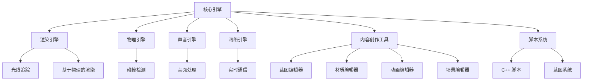
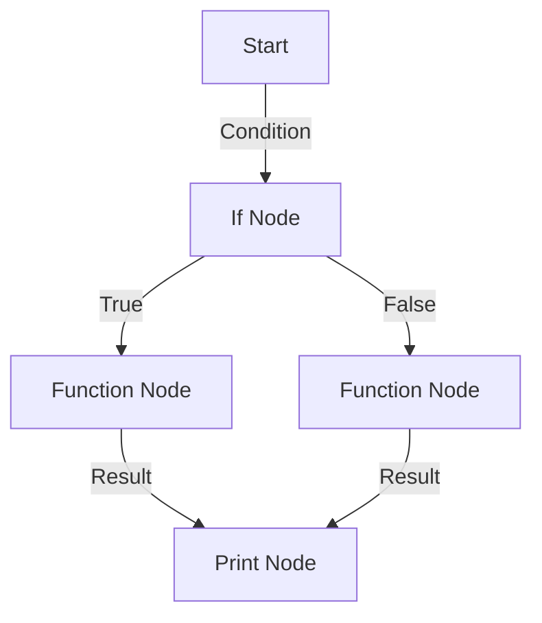
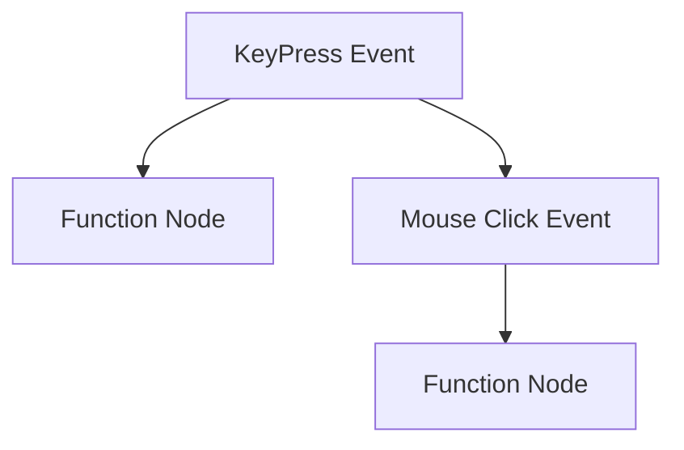

                 

# Unreal Engine 蓝图：可视化编程

## 关键词

- Unreal Engine
- 可视化编程
- 蓝图系统
- 游戏开发
- 渲染
- 人工智能

## 摘要

本文深入探讨Unreal Engine的可视化编程技术，涵盖了从基础架构到高级应用的各个方面。通过详细的流程图、伪代码和实际案例，我们不仅解析了Unreal Engine的核心概念和架构，还介绍了蓝图系统、数学与物理计算、用户输入与交互等关键主题。文章还探讨了游戏开发、实时渲染、多人在线游戏、动作捕捉与面部捕捉、模块化开发与插件、游戏优化、人工智能与机器学习、数据可视化以及持续集成和自动化测试等内容，为开发者提供了全面的技术指南。作者以严谨的逻辑和丰富的经验，为读者构建了一个清晰、系统的知识体系，让开发者能够更好地利用Unreal Engine实现高质量的交互式内容。

## 目录大纲

### 第一部分：引入与概述

- **第1章: Unreal Engine 简介**
  - 1.1 Unreal Engine 的历史与演进
  - 1.2 Unreal Engine 的核心特点
  - 1.3 Unreal Engine 的应用场景

- **第2章: Unreal Engine 基础**
  - 2.1 系统架构概览
  - 2.2 资源管理
  - 2.3 材质与光照

### 第二部分：可视化编程基础

- **第3章: 蓝图系统基础**
  - 3.1 蓝图的基本概念
  - 3.2 蓝图编辑器
  - 3.3 蓝图类和属性

- **第4章: 事件与函数**
  - 4.1 事件系统
  - 4.2 函数与回调
  - 4.3 参数与变量

- **第5章: 逻辑控制**
  - 5.1 If语句与条件分支
  - 5.2 While循环与迭代
  - 5.3 Switch语句与多重分支

- **第6章: 数学与物理计算**
  - 6.1 基本数学运算
  - 6.2 三维数学基础
  - 6.3 物理引擎交互

- **第7章: 用户输入与交互**
  - 7.1 键盘与鼠标输入
  - 7.2 触摸屏交互
  - 7.3 语音识别与合成

### 第三部分：实战案例

- **第8章: 游戏开发基础**
  - 8.1 游戏循环与游戏状态
  - 8.2 角色与AI
  - 8.3 UI界面设计

- **第9章: 实时渲染**
  - 9.1 渲染管线
  - 9.2 后处理效果
  - 9.3 光照与阴影

- **第10章: 多人在线游戏开发**
  - 10.1 网络同步与异步
  - 10.2 实时通讯
  - 10.3 聊天系统与语音聊天

- **第11章: 动作捕捉与面部捕捉**
  - 11.1 动作捕捉技术
  - 11.2 面部捕捉技术
  - 11.3 混合现实应用

- **第12章: 模块化开发与插件**
  - 12.1 模块化架构
  - 12.2 插件开发基础
  - 12.3 第三方插件应用

### 第四部分：高级主题

- **第13章: 游戏优化**
  - 13.1 性能监控
  - 13.2 内存管理
  - 13.3 纹理优化

- **第14章: 人工智能与机器学习**
  - 14.1 人工智能基础
  - 14.2 机器学习应用
  - 14.3 强化学习与游戏AI

- **第15章: 可视化数据与图表**
  - 15.1 数据可视化基础
  - 15.2 2D图表与图形
  - 15.3 3D图表与图形

- **第16章: 持续集成与自动化测试**
  - 16.1 持续集成概述
  - 16.2 自动化测试
  - 16.3 代码覆盖率与静态分析

### 第五部分：未来展望

- **第17章: 未来展望**
  - 17.1 Unreal Engine 发展趋势
  - 17.2 可视化编程的未来
  - 17.3 新技术展望

### 第一部分：引入与概述

#### 第1章: Unreal Engine 简介

Unreal Engine 是一款由 Epic Games 开发的游戏开发引擎，以其卓越的图形渲染能力和灵活的可视化编程体系而闻名于世。从早期的《乌云密码》（Unreal）游戏开始，Unreal Engine 逐渐演变成为业界领先的实时渲染引擎，广泛应用于游戏开发、影视制作、虚拟现实（VR）和增强现实（AR）等领域。

## 1.1 Unreal Engine 的历史与演进

Unreal Engine 的历史可以追溯到1998年，当时Epic Games发布了第一款基于该引擎的游戏《乌云密码》。随后，Epic Games 于2002年发布了Unreal Engine 2，并在2007年发布了重大的升级版——Unreal Engine 3。Unreal Engine 3 的推出标志着该引擎在图形渲染和游戏开发方面的重大突破，许多大型游戏，如《侠盗猎车手：圣安地列斯》（Grand Theft Auto: San Andreas）和《战争机器》（Gears of War）都是基于此引擎开发的。

2014年，Epic Games 发布了 Unreal Engine 4（UE4），该版本引入了全新的图形渲染引擎、改进的蓝图系统以及强大的物理引擎和AI系统。UE4 的推出极大地推动了游戏开发行业的发展，许多知名游戏，如《堡垒之夜》（Fortnite）、《方舟：生存进化》（ARK: Survival Evolved）等，都是基于 UE4 开发的。此外，UE4 的开源特性使得开发者可以更加自由地使用和扩展引擎，进一步推动了创新。

近年来，Epic Games 不断对 Unreal Engine 进行优化和更新，引入了诸如光线追踪、实时编辑、可变网格等技术，使其在虚拟现实和增强现实领域也取得了显著进展。这些更新不仅提升了引擎的性能，还为其应用场景的扩展提供了无限可能。

## 1.2 Unreal Engine 的核心特点

Unreal Engine 具有许多独特且强大的特点，使其成为游戏开发者的首选工具。以下是 Unreal Engine 的几个核心特点：

### 高级图形渲染

Unreal Engine 4（UE4）采用了先进的图形渲染技术，包括光线追踪、基于物理的渲染、环境光照和全局照明等。这使得开发者能够创建出逼真的游戏世界，大幅提升了视觉效果。

### 蓝图系统

蓝图是 Unreal Engine 的一大创新，它允许开发者通过可视化界面而非传统编程语言来构建游戏逻辑。蓝图系统具有强大的灵活性和扩展性，可以轻松实现复杂的游戏机制，如角色控制、AI行为和用户交互。

### 资源管理系统

Unreal Engine 的资源管理系统非常强大，可以有效地管理游戏中的各种资源，如模型、纹理、声音等。开发者可以通过资源预加载、资源卸载和引用计数等机制，优化游戏性能和内存使用。

### 实时预览

Unreal Engine 支持实时预览功能，使得开发者可以在编辑过程中即时查看游戏逻辑和渲染效果。这种实时反馈极大地提高了开发效率，减少了调试时间。

### 开源和社区支持

Unreal Engine 4 是开源的，开发者可以自由地使用和修改引擎源代码。此外，Epic Games 还为开发者提供了一个庞大的社区，提供教程、文档和插件，使得开发者可以轻松地获取资源和帮助。

## 1.3 Unreal Engine 的应用场景

Unreal Engine 的强大功能和灵活性使其在多个领域都有广泛的应用：

### 游戏开发

Unreal Engine 是游戏开发领域最受欢迎的引擎之一，许多大型游戏和独立游戏都基于该引擎开发。其卓越的图形渲染能力和灵活的蓝图系统，使得开发者能够快速开发高质量的游戏。

### 影视制作

Unreal Engine 在影视制作领域也有广泛应用，用于制作电影和电视节目的视觉效果。开发者可以使用 UE4 的实时渲染和编辑功能，创建复杂的虚拟场景和动画。

### 虚拟现实（VR）和增强现实（AR）

Unreal Engine 支持VR和AR开发，开发者可以利用其强大的图形渲染和交互功能，创建沉浸式的VR游戏和AR应用。

### 教育和培训

Unreal Engine 可以用于教育和培训领域，为学生和专业人士提供模拟训练和交互式学习体验。

### 科研和可视化

Unreal Engine 的可视化功能使其在科研领域也有广泛应用，用于数据可视化和模拟实验结果。

### 第一部分总结

Unreal Engine 作为一款功能强大的游戏开发引擎，不仅拥有卓越的图形渲染能力和灵活的可视化编程系统，还广泛应用于多个领域。通过对 Unreal Engine 的历史与演进、核心特点和主要应用场景的介绍，我们可以更好地理解其价值和潜力。在接下来的章节中，我们将深入探讨 Unreal Engine 的基础架构和编程技术，帮助开发者掌握这一强大工具。

### 第二部分：Unreal Engine 基础

#### 第2章: Unreal Engine 基础

在了解了 Unreal Engine 的基本概念和应用场景后，我们需要深入了解其核心架构和基础功能。本章将介绍 Unreal Engine 的系统架构概览、资源管理、材质与光照等基础概念，为后续的编程和实践打下坚实的基础。

#### 2.1 系统架构概览

Unreal Engine 的系统架构是构建其强大功能和高效性能的基础。其整体架构可以分为以下几个主要部分：

1. **核心引擎**：包括渲染、物理、声音、网络等核心功能，是 Unreal Engine 的核心组成部分。
2. **内容创作工具**：如蓝图编辑器、材质编辑器等，用于开发者创建和编辑游戏内容。
3. **脚本系统**：基于 C++ 和蓝图系统，用于实现游戏逻辑和 AI。

**核心引擎**

核心引擎是 Unreal Engine 的核心，负责管理游戏的基本功能，包括：

- **渲染引擎**：实现实时光线追踪、基于物理的渲染、环境光照等功能，为游戏提供高质量的图形渲染。
- **物理引擎**：用于模拟物体运动、碰撞检测等物理现象，为游戏提供真实的物理表现。
- **声音引擎**：提供音频处理和播放功能，为游戏创造丰富的听觉体验。
- **网络引擎**：支持多人在线游戏和实时通信，确保玩家之间的同步和数据传输。

**内容创作工具**

内容创作工具是开发者创建游戏资源的关键，包括：

- **蓝图编辑器**：提供可视化编程界面，允许开发者通过拖拽节点和连接器来构建游戏逻辑。
- **材质编辑器**：用于创建和编辑游戏中的材质，定义物体的外观和质感。
- **动画编辑器**：用于创建和编辑角色的动画，实现平滑的运动效果。
- **场景编辑器**：用于构建游戏场景，包括地形、建筑、环境等。

**脚本系统**

脚本系统是 Unreal Engine 中实现游戏逻辑的重要部分，主要包括：

- **C++ 脚本**：提供高效的编程语言，适用于复杂逻辑和性能敏感的部分。
- **蓝图系统**：提供可视化的编程工具，允许开发者通过节点和连接器来构建游戏逻辑，适合快速原型开发和逻辑验证。

**系统架构关系图**

以下是一个简化的系统架构关系图，展示了 Unreal Engine 的主要组成部分及其相互关系：



#### 2.2 资源管理

资源管理是 Unreal Engine 中一个重要的功能模块，负责管理和维护游戏中的各种资源。这些资源包括模型、纹理、声音、动画等，是游戏内容的重要组成部分。资源管理的核心目标是确保资源的有效加载、存储和卸载，以优化游戏性能和内存使用。

**资源加载与卸载**

资源加载是指在游戏运行过程中将所需的资源从磁盘或内存中读取到内存中，以便在渲染和处理时使用。资源卸载则是将不再使用的资源从内存中释放，以回收内存空间。

- **资源加载**：资源加载通常通过资源管理器（`IResourceModule`）实现，开发者可以使用 `LoadObject` 或 `LoadPackage` 等函数来加载资源。例如：

  ```cpp
  UMesh *mesh = LoadObject<UMesh>(NULL, TEXT("/Game/MyGame/Meshes/MyMesh"));
  ```

- **资源卸载**：资源卸载主要通过引用计数来实现。当资源的引用计数减少到0时，系统会自动卸载资源并释放内存。例如：

  ```cpp
  mesh->AddReferenc
  ```

**资源预加载**

资源预加载是指在游戏运行过程中预先加载未来可能需要使用的资源，以减少加载时间和延迟。资源预加载可以显著提高游戏体验，尤其是在大型场景或复杂游戏中。

- **资源预加载**：开发者可以使用 `PreLoadObject` 或 `PreLoadPackage` 等函数来预加载资源。例如：

  ```cpp
  UMesh *mesh = PreLoadObject<UMesh>(NULL, TEXT("/Game/MyGame/Meshes/MyMesh"));
  ```

**资源引用计数**

资源引用计数是资源管理的关键机制，用于跟踪资源的引用情况。每个资源都有一个引用计数，每当资源被引用时，引用计数增加；当引用关系解除时，引用计数减少。当引用计数减少到0时，系统会自动卸载资源。

- **引用计数**：开发者可以通过 `AddReference` 和 `RemoveReference` 函数来管理资源的引用计数。例如：

  ```cpp
  mesh->AddReference();
  mesh->RemoveReference();
  ```

#### 2.3 材质与光照

材质是 Unreal Engine 中定义物体外观的关键元素，而光照则是营造真实感和氛围的重要手段。理解材质与光照的工作原理对于创建高质量的渲染效果至关重要。

**材质系统**

材质系统包括材质参数、材质属性和材质编辑器等组成部分。开发者可以通过材质编辑器创建和编辑材质，为物体定义各种外观效果。

- **材质参数**：材质参数包括颜色、光泽度、透明度、纹理等，用于控制物体在渲染时的外观。例如：

  ```cpp
  FMaterialParameterCollection MaterialParams;
  MaterialParams.SetScalar("BaseColor", FLinearColor::Red);
  ```

- **材质属性**：材质属性是材质的基本组成部分，包括材质层、纹理坐标、纹理参数等。例如：

  ```cpp
  UMaterial *material = NewObject<UMaterial>(nullptr, TEXT("MyMaterial"));
  material->SetTexture("TextureMap", Texture);
  ```

- **材质编辑器**：材质编辑器提供了一个图形化界面，开发者可以通过拖拽和调整参数来创建和编辑材质。例如：

  ```cpp
  UMaterialEditor *editor = NewObject<UMaterialEditor>(nullptr, UMaterialEditor::StaticClass());
  editor->InitializeMaterial(Mesh, Material);
  ```

**光照系统**

光照系统包括光源、光照模型和光照计算等组成部分。开发者可以使用不同的光源和光照模型来模拟真实世界的光照效果。

- **光源**：光源是光照系统的核心，包括点光源、方向光源、聚光源等。例如：

  ```cpp
  UPointLight *light = NewObject<UPointLight>(nullptr, UPointLight::StaticClass());
  light->SetRadius(500.0f);
  ```

- **光照模型**：光照模型是用于计算光照效果的数学模型，包括朗伯模型、冯·卡门模型等。例如：

  ```cpp
  FLinearColor lightColor = FLinearColor::White;
  FVector lightDirection = FVector(-1.0f, -1.0f, -1.0f);
  FVector normal = FVector(0.0f, 0.0f, 1.0f);
  FVector lightVector = lightDirection.Normalize();
  float cosTheta = FVector::DotProduct(normal, lightVector);
  float lightIntensity = cosTheta > 0.0f ? lightColor * cosTheta : FLinearColor::Black;
  ```

- **光照计算**：光照计算是渲染过程中的关键步骤，用于计算物体表面的光照效果。例如：

  ```cpp
  function CalculateLighting(Mesh mesh) {
      ForEach Light light in mesh.Lights {
          FVector lightDir = light.Position - mesh.Position;
          FVector normal = mesh.Normal;
          float cosTheta = FVector::DotProduct(normal, lightDir);
          FLinearColor lightColor = light.Color;
          FLinearColor shadingColor = lightColor * cosTheta;
          mesh.Material->SetVector("ShadingColor", shadingColor);
      }
  }
  ```

**光照与材质的交互**

光照和材质的交互是渲染效果的关键，通过调整材质参数和光照模型，可以创造出丰富的视觉效果。例如：

- **光照贴图**：使用光照贴图可以模拟复杂的光照效果，如高光、阴影、反射等。例如：

  ```cpp
  function ApplyLightmap(Mesh mesh) {
      FTexture2D *lightmap = LoadTexture("/Game/MyGame/Textures/Lightmap");
      mesh.Material->SetTexture("Lightmap", lightmap);
  }
  ```

- **材质属性混合**：通过混合不同的材质属性，可以创造出丰富的外观效果。例如：

  ```cpp
  function MixMaterials(Mesh mesh) {
      UMaterial *material1 = LoadObject<UMaterial>(nullptr, TEXT("/Game/MyGame/Materials/Material1"));
      UMaterial *material2 = LoadObject<UMaterial>(nullptr, TEXT("/Game/MyGame/Materials/Material2"));
      mesh.Material = MixMaterials(material1, material2, 0.5f);
  }
  ```

通过以上对 Unreal Engine 的系统架构、资源管理、材质与光照的介绍，我们可以更好地理解 Unreal Engine 的基本功能和架构。在接下来的章节中，我们将深入探讨 Unreal Engine 的可视化编程基础，包括蓝图系统、事件与函数、逻辑控制等关键主题。

### 第2章：Unreal Engine 基础

#### 2.1 系统架构概览

Unreal Engine 的系统架构是构建其强大功能和高效性能的基础。为了更好地理解 Unreal Engine 的运作原理，我们可以将其架构分为以下几个主要部分：

**核心引擎**

核心引擎是 Unreal Engine 的核心组成部分，负责管理游戏的基本功能，包括渲染、物理、声音和网络等方面。以下是核心引擎的详细组件：

1. **渲染引擎**：渲染引擎负责将游戏场景渲染到屏幕上，它包括实时光线追踪、基于物理的渲染、环境光照等先进技术。通过这些技术，渲染引擎能够生成高质量的图形效果，如逼真的光影效果和细节丰富的场景。

   **伪代码示例**：
   ```cpp
   UWorld *world = GEngine->CreateWorld();
   world->AddRenderer(new FMyCustomRenderer());
   ```

2. **物理引擎**：物理引擎用于模拟物体的运动和碰撞，确保游戏中的物理现象符合真实世界的物理规律。物理引擎提供了丰富的物理特性，如重力、摩擦力、弹性等，使游戏中的物体表现出真实的物理行为。

   **伪代码示例**：
   ```cpp
   UPhysicalMaterial *material = NewObject<UPhysicalMaterial>(nullptr, UPhysicalMaterial::StaticClass());
   material->SetRestitution(0.3f);
   material->SetFriction(0.5f);
   ```

3. **声音引擎**：声音引擎负责处理游戏中的音频，包括声音的生成、播放、混音和效果处理。通过声音引擎，开发者可以创建丰富的音频体验，增强游戏的沉浸感。

   **伪代码示例**：
   ```cpp
   USoundBase *sound = LoadObject<USoundBase>(nullptr, TEXT("/Game/MyGame/Sounds/MySound"));
   UAudioMixer *mixer = GEngine->GetAudioMixer();
   mixer->PlaySound2D(sound);
   ```

4. **网络引擎**：网络引擎负责处理游戏中的网络通信，支持多人在线游戏和实时交互。通过网络引擎，开发者可以实现玩家之间的同步和数据传输，确保多人游戏体验的一致性。

   **伪代码示例**：
   ```cpp
   UGameEngine *engine = NewObject<UGameEngine>(nullptr, UGameEngine::StaticClass());
   engine->StartPlay();
   ```

**内容创作工具**

内容创作工具是 Unreal Engine 中用于创建和编辑游戏内容的重要部分，包括蓝图编辑器、材质编辑器、动画编辑器和场景编辑器等。以下是这些工具的详细功能：

1. **蓝图编辑器**：蓝图编辑器是一种可视化的编程工具，允许开发者通过图形化的节点和连接器来构建游戏逻辑。蓝图系统使得开发者无需深入了解编程语言即可实现复杂的游戏机制。

   **伪代码示例**：
   ```cpp
   UBlueprint *blueprint = LoadObject<UBlueprint>(nullptr, TEXT("/Game/MyGame/Blueprints/MyBlueprint"));
   UEdGraph *graph = blueprint->GetGraph();
   graph->AddNode(UEventNode_Condition::StaticClass(), FVector2D(100, 100));
   ```

2. **材质编辑器**：材质编辑器用于创建和编辑游戏中的材质，定义物体的外观和质感。通过材质编辑器，开发者可以调整材质的颜色、纹理、光照效果等参数。

   **伪代码示例**：
   ```cpp
   UMaterialInstance *materialInstance = NewObject<UMaterialInstance>(nullptr, UMaterialInstance::StaticClass());
   materialInstance->SetTextureParameterValue("BaseColor", LoadTexture("/Game/MyGame/Textures/MyTexture"));
   ```

3. **动画编辑器**：动画编辑器用于创建和编辑角色的动画，实现平滑的运动效果。通过动画编辑器，开发者可以设置动画的关键帧、转换和混合。

   **伪代码示例**：
   ```cpp
   UAnimSequence *animation = NewObject<UAnimSequence>(nullptr, UAnimSequence::StaticClass());
   animation->SetDuration(2.0f);
   animation->SetLooping(true);
   ```

4. **场景编辑器**：场景编辑器用于构建游戏场景，包括地形、建筑、环境等。通过场景编辑器，开发者可以创建复杂的地形、放置建筑和物体，并调整光照和阴影效果。

   **伪代码示例**：
   ```cpp
   UWorld *world = GEngine->CreateWorld();
   ULevel *level = world->GetLevel();
   FActorSpawnParameters params;
   AMyActor *actor = world->SpawnActor<AMyActor>(FVector(0.0f, 0.0f, 0.0f), params);
   ```

**脚本系统**

脚本系统是 Unreal Engine 中用于实现游戏逻辑的重要组成部分，基于 C++ 和蓝图系统。通过脚本系统，开发者可以编写高效且灵活的代码，实现复杂的功能和算法。

1. **C++ 脚本**：C++ 脚本是 Unreal Engine 中最常用的脚本形式，提供了丰富的功能和性能。通过 C++ 脚本，开发者可以编写复杂的逻辑和算法，实现游戏的核心功能。

   **伪代码示例**：
   ```cpp
   class AMyActor : public AActor {
   public:
       void BeginPlay() override {
           // 初始化游戏逻辑
       }
       void Tick(float DeltaTime) override {
           // 更新游戏状态
       }
   };
   ```

2. **蓝图系统**：蓝图系统是一种可视化的编程工具，允许开发者通过图形化的节点和连接器来构建游戏逻辑。蓝图系统使得开发者无需深入了解编程语言即可实现复杂的游戏机制。

   **伪代码示例**：
   ```cpp
   class UMyBlueprint : public UBlueprint {
   public:
       UFunction *GetFunctionByName(FName Name) override {
           // 获取特定名称的函数
           return UBlueprint::GetFunctionByName(Name);
       }
       UEdGraph *GetGraph() override {
           // 获取蓝图图
           return UBlueprint::GetGraph();
       }
   };
   ```

通过上述内容，我们可以看到 Unreal Engine 的系统架构如何支持游戏开发的各个方面。在接下来的章节中，我们将深入探讨 Unreal Engine 的资源管理、材质与光照等关键主题，为开发者提供更全面的技术指导。

#### 2.2 资源管理

资源管理是 Unreal Engine 中一个关键的功能模块，它涉及到游戏中的各种资源，如模型、纹理、声音、动画等。有效的资源管理不仅能够优化游戏性能，还能提升开发效率。在 Unreal Engine 中，资源管理包括资源的加载、卸载、预加载以及引用计数等。

**资源加载**

资源加载是将所需的资源从磁盘或内存中读取到内存中的过程。在 Unreal Engine 中，资源加载通常通过资源管理器（`IResourceModule`）实现。开发者可以使用 `LoadObject` 或 `LoadPackage` 等函数来加载资源。

**伪代码示例**：
```cpp
UMesh *mesh = LoadObject<UMesh>(NULL, TEXT("/Game/MyGame/Meshes/MyMesh"));
```
在这个示例中，`LoadObject` 函数用于从游戏资源路径 `/Game/MyGame/Meshes/MyMesh` 加载一个网格对象（`UMesh`）。

**资源卸载**

资源卸载是将不再使用的资源从内存中释放的过程。资源卸载主要通过引用计数来实现。每当资源被加载时，其引用计数增加；当引用关系解除时，引用计数减少。当引用计数减少到0时，系统会自动卸载资源并释放内存。

**伪代码示例**：
```cpp
mesh->AddReference();  // 增加引用计数
// ...
mesh->RemoveReference();  // 减少引用计数，如果引用计数变为0，资源将被卸载
```

**资源预加载**

资源预加载是指在游戏运行过程中预先加载未来可能需要使用的资源，以减少加载时间和延迟。资源预加载可以显著提高游戏体验，尤其是在大型场景或复杂游戏中。

**伪代码示例**：
```cpp
UMesh *mesh = PreLoadObject<UMesh>(NULL, TEXT("/Game/MyGame/Meshes/MyMesh"));
```
在这个示例中，`PreLoadObject` 函数用于预加载网格对象（`UMesh`）。

**资源引用计数**

资源引用计数是资源管理的关键机制，用于跟踪资源的引用情况。每个资源都有一个引用计数，每当资源被引用时，引用计数增加；当引用关系解除时，引用计数减少。当引用计数减少到0时，系统会自动卸载资源。

**伪代码示例**：
```cpp
mesh->AddReference();  // 增加引用计数
mesh->RemoveReference();  // 减少引用计数，如果引用计数变为0，资源将被卸载
```

通过以上示例，我们可以看到如何在 Unreal Engine 中进行资源加载、卸载、预加载以及管理引用计数。这些操作是优化游戏性能和资源管理的重要步骤，对于确保游戏流畅运行至关重要。

#### 2.3 材质与光照

材质与光照是游戏开发中创造视觉体验的核心元素。在 Unreal Engine 中，材质是用于定义3D物体外观的视觉元素，而光照则用于创造真实感和氛围。理解材质与光照的工作原理对于创建高质量的渲染效果至关重要。

**材质系统**

材质系统包括材质参数、材质属性和材质编辑器等组成部分。开发者可以通过材质编辑器创建和编辑材质，为物体定义各种外观效果。

1. **材质参数**：材质参数包括颜色、光泽度、透明度、纹理等，用于控制物体在渲染时的外观。例如：

   ```cpp
   FMaterialParameterCollection MaterialParams;
   MaterialParams.SetScalar("BaseColor", FLinearColor::Red);
   ```

2. **材质属性**：材质属性是材质的基本组成部分，包括材质层、纹理坐标、纹理参数等。例如：

   ```cpp
   UMaterial *material = NewObject<UMaterial>(nullptr, UMaterial::StaticClass());
   material->SetTexture("TextureMap", Texture);
   ```

3. **材质编辑器**：材质编辑器提供了一个图形化界面，开发者可以通过拖拽和调整参数来创建和编辑材质。例如：

   ```cpp
   UMaterialEditor *editor = NewObject<UMaterialEditor>(nullptr, UMaterialEditor::StaticClass());
   editor->InitializeMaterial(Mesh, Material);
   ```

**光照系统**

光照系统包括光源、光照模型和光照计算等组成部分。开发者可以使用不同的光源和光照模型来模拟真实世界的光照效果。

1. **光源**：光源是光照系统的核心，包括点光源、方向光源、聚光源等。例如：

   ```cpp
   UPointLight *light = NewObject<UPointLight>(nullptr, UPointLight::StaticClass());
   light->SetRadius(500.0f);
   ```

2. **光照模型**：光照模型是用于计算光照效果的数学模型，包括朗伯模型、冯·卡门模型等。例如：

   ```cpp
   FLinearColor lightColor = FLinearColor::White;
   FVector lightDirection = FVector(-1.0f, -1.0f, -1.0f);
   FVector normal = FVector(0.0f, 0.0f, 1.0f);
   FVector lightVector = lightDirection.Normalize();
   float cosTheta = FVector::DotProduct(normal, lightVector);
   float lightIntensity = cosTheta > 0.0f ? lightColor * cosTheta : FLinearColor::Black;
   ```

3. **光照计算**：光照计算是渲染过程中的关键步骤，用于计算物体表面的光照效果。例如：

   ```cpp
   function CalculateLighting(Mesh mesh) {
       ForEach Light light in mesh.Lights {
           FVector lightDir = light.Position - mesh.Position;
           FVector normal = mesh.Normal;
           float cosTheta = FVector::DotProduct(normal, lightDir);
           FLinearColor lightColor = light.Color;
           FLinearColor shadingColor = lightColor * cosTheta;
           mesh.Material->SetVector("ShadingColor", shadingColor);
       }
   }
   ```

**光照与材质的交互**

光照和材质的交互是渲染效果的关键，通过调整材质参数和光照模型，可以创造出丰富的视觉效果。例如：

- **光照贴图**：使用光照贴图可以模拟复杂的光照效果，如高光、阴影、反射等。例如：

  ```cpp
  function ApplyLightmap(Mesh mesh) {
      FTexture2D *lightmap = LoadTexture("/Game/MyGame/Textures/Lightmap");
      mesh.Material->SetTexture("Lightmap", lightmap);
  }
  ```

- **材质属性混合**：通过混合不同的材质属性，可以创造出丰富的外观效果。例如：

  ```cpp
  function MixMaterials(Mesh mesh) {
      UMaterial *material1 = LoadObject<UMaterial>(nullptr, TEXT("/Game/MyGame/Materials/Material1"));
      UMaterial *material2 = LoadObject<UMaterial>(nullptr, TEXT("/Game/MyGame/Materials/Material2"));
      mesh.Material = MixMaterials(material1, material2, 0.5f);
  }
  ```

通过以上对材质与光照的介绍，我们可以看到如何在 Unreal Engine 中创建和编辑材质，以及如何使用不同的光照模型来模拟真实世界的光照效果。这些技术为开发者提供了丰富的工具，以创造出高质量的游戏视觉体验。

### 第3章：可视化编程基础

#### 3.1 蓝图的基本概念

蓝图是 Unreal Engine 中的一种可视化编程工具，它允许开发者无需编写传统代码，通过图形化界面来构建游戏逻辑。蓝图系统是 Unreal Engine 的重要组成部分，它提供了强大的功能和灵活性，使得开发者能够快速原型开发、逻辑验证和游戏机制实现。

**节点和连接器**

蓝图的核心元素是节点和连接器。节点代表具体的操作或功能，而连接器则是节点之间的数据流通道。通过连接不同的节点和调整连接器，开发者可以构建复杂的逻辑流程。

1. **节点**：节点是蓝图的构建块，每个节点代表一个特定的功能，如事件处理、函数调用、条件分支等。例如，`Event Node` 用于触发事件，`Function Node` 用于执行特定的函数。

   **伪代码示例**：
   ```mermaid
   graph TD
       A[Event Node] --> B[Function Node]
       B --> C[Conditional Node]
   ```

2. **连接器**：连接器用于连接不同的节点，定义数据流向。通过拖拽连接器，开发者可以定义节点之间的逻辑关系。例如，事件节点的输出连接器可以连接到函数节点的输入连接器。

   **伪代码示例**：
   ```mermaid
   graph TD
       A[Event Node] -->|event| B[Function Node]
   ```

**变量**

变量是蓝图中的基本数据存储单元，用于存储和传递数据。在蓝图中，开发者可以定义和使用变量来存储数值、对象和引用等。

1. **定义变量**：在蓝图中，开发者可以在属性窗口中定义变量，包括变量名、类型和初始值。

   **伪代码示例**：
   ```cpp
   int Count = 0;
   ```

2. **使用变量**：在蓝图中，开发者可以通过变量名来访问和修改变量的值。

   **伪代码示例**：
   ```cpp
   Count = Count + 1;
   ```

**事件处理**

事件处理是蓝图系统的重要组成部分，它允许开发者响应特定的触发事件。事件可以在用户交互、游戏状态变化或其他节点触发时执行。

1. **事件触发**：在蓝图中，开发者可以定义事件触发器，如按键、鼠标点击等。

   **伪代码示例**：
   ```mermaid
   graph TD
       A[KeyPress Event] --> B[Function Node]
   ```

2. **事件处理**：在蓝图中，开发者可以绑定事件处理函数，以在事件触发时执行特定的操作。

   **伪代码示例**：
   ```cpp
   void FunctionNode::OnKeyPress() {
       Print("Key pressed.");
   }
   ```

**函数调用**

函数调用是蓝图系统中的基本操作单元，用于执行特定的任务。在蓝图中，开发者可以定义和调用函数，以实现复杂的逻辑。

1. **定义函数**：在蓝图中，开发者可以定义函数，包括函数名、参数和返回值。

   **伪代码示例**：
   ```cpp
   int Add(int a, int b) {
       return a + b;
   }
   ```

2. **调用函数**：在蓝图中，开发者可以通过函数名调用函数，并传递必要的参数。

   **伪代码示例**：
   ```cpp
   int result = Add(3, 4);
   Print("Result is " + result);
   ```

通过以上对蓝图的基本概念、节点和连接器、变量、事件处理和函数调用的介绍，我们可以看到蓝图系统为开发者提供了一种强大且灵活的可视化编程方式。在接下来的章节中，我们将深入探讨蓝图的编辑器界面、蓝图类和属性等关键主题。

#### 3.2 蓝图编辑器

蓝图编辑器是 Unreal Engine 中用于创建和编辑蓝图的工具。它提供了一个图形化的界面，允许开发者通过拖拽节点和连接器来构建游戏逻辑，而不需要编写传统的代码。蓝图编辑器的用户界面直观且功能强大，使得开发者可以快速原型开发、测试和迭代游戏逻辑。

**用户界面**

蓝图编辑器的用户界面主要包括以下几个部分：

- **工具箱**：工具箱提供了各种节点和工具，用于构建蓝图。开发者可以通过拖拽节点到编辑器中来使用它们。
- **节点视图**：节点视图显示了当前蓝图中的所有节点，开发者可以在这里查看和编辑节点的属性。
- **连接器**：连接器用于连接不同节点，定义数据流向。通过拖拽连接器，开发者可以建立节点之间的逻辑关系。
- **属性窗口**：属性窗口显示了当前选中的节点的属性，开发者可以在这里调整节点的参数。
- **输出视图**：输出视图显示了蓝图的输出结果，开发者可以在这里查看实时输出和调试信息。

**实时预览**

蓝图编辑器的实时预览功能是它的一个重要特点。开发者可以在编辑过程中实时预览蓝图的行为和效果，这极大地提高了开发效率。例如，当开发者调整一个条件分支节点时，相关逻辑的执行结果会立即在输出视图中显示出来。

**伪代码示例**：



在这个示例中，`Start` 节点触发一个条件分支节点 `If Node`，根据条件执行不同的函数节点 `Function Node`。执行结果会输出到 `Print Node`，并在实时预览中显示。

**脚本支持**

虽然蓝图主要是一个可视化的编程工具，但它也提供了与 C++ 脚本紧密集成的能力。开发者可以在蓝图中嵌入 C++ 代码，实现更复杂的逻辑和算法。这种脚本支持使得蓝图系统不仅灵活，而且强大。

**伪代码示例**：

```cpp
void UMyBlueprint::FunctionNode_Execute()
{
    // 在这里嵌入 C++ 代码
    int a = 5;
    int b = 10;
    int result = a + b;
    Print("Result is " + result);
}
```

在这个示例中，`FunctionNode_Execute` 函数是蓝图中的一个脚本函数，它可以在条件节点 `If Node` 触发时执行。通过嵌入 C++ 代码，开发者可以轻松实现复杂的逻辑。

**蓝图类**

蓝图类是蓝图系统中的一个重要概念，它定义了蓝图的行为和属性。通过蓝图类，开发者可以定义类属性、类函数和类事件，以便在蓝图中使用。

1. **类属性**：类属性是蓝图类中的属性，用于存储和访问数据。例如，一个角色蓝图可以定义一个速度属性。

   **伪代码示例**：
   ```cpp
   UPROPERTY(EditAnywhere, Category = "Movement")
   float Speed;
   ```

2. **类函数**：类函数是蓝图类中的函数，用于执行特定的任务。例如，一个角色蓝图可以定义一个移动函数。

   **伪代码示例**：
   ```cpp
   UFUNCTION(BlueprintCallable, Category = "Movement")
   void MoveForward(float amount);
   ```

3. **类事件**：类事件是蓝图类中的事件，用于响应特定的触发条件。例如，一个角色蓝图可以定义一个碰撞事件。

   **伪代码示例**：
   ```cpp
   UEVENT(BlueprintCallable, Category = "Collisions")
   Event Collision;
   ```

通过定义蓝图类，开发者可以创建一个结构化且易于管理的蓝图系统，使得游戏逻辑更加清晰和模块化。

**实例**

以下是一个简单的蓝图类实例，它定义了一个角色蓝图的基本属性和功能：

```cpp
UCLASS()
class MYGAME_API AMyCharacter : public ACharacter
{
    GENERATED_BODY()

    UPROPERTY(EditDefaultsOnly, Category = "Movement")
    float MovementSpeed = 200.0f;

    UPROPERTY(BlueprintCallable, Category = "Movement")
    UFUNCTION()
    void MoveForward(float Amount);

    UPROPERTY(BlueprintCallable, Category = "Collisions")
    UFUNCTION()
    void OnHit();

    // ...
};
```

在这个实例中，`AMyCharacter` 是一个角色蓝图类，它定义了一个速度属性 `MovementSpeed`、一个移动函数 `MoveForward` 和一个碰撞事件 `OnHit`。这些属性和函数可以在蓝图中使用，以实现角色控制和行为。

通过蓝图编辑器、实时预览、脚本支持和蓝图类的介绍，我们可以看到蓝图系统为开发者提供了一种强大且灵活的可视化编程方式。在接下来的章节中，我们将继续探讨蓝图中的事件与函数、逻辑控制和数学与物理计算等关键主题。

### 第3章：可视化编程基础

#### 3.3 蓝图类和属性

蓝图类是 Unreal Engine 中用于定义蓝图行为的模块，通过蓝图类，开发者可以定义类属性、类函数和类事件，从而创建具有特定功能的蓝图。理解蓝图类和属性的使用对于开发高效的游戏逻辑至关重要。

**类属性**

类属性用于在蓝图中存储和访问数据。这些属性可以是基本的数值类型，也可以是更复杂的对象类型。通过在蓝图类中定义属性，开发者可以轻松地设置和获取属性值。

1. **定义类属性**：

   类属性需要在蓝图类的 UPROPERTY 标记下定义，并指定适当的类别和访问级别。

   ```cpp
   UPROPERTY(EditAnywhere, Category = "General")
   int Health;
   ```

   在这个例子中，`Health` 是一个整数属性，它属于 "General" 类别，并且可以通过编辑器自由编辑。

2. **使用类属性**：

   在蓝图中，可以通过属性名称直接访问和修改类属性。

   ```cpp
   Health = Health - Damage;
   ```

   这个操作会减少角色的健康值。

**类函数**

类函数是蓝图类中用于执行特定任务的方法。类函数可以通过 UFUNCTION 标记定义，并且可以带有参数和返回值。

1. **定义类函数**：

   类函数需要在蓝图类的 UFUNCTION 标记下定义，并指定适当的类别。

   ```cpp
   UFUNCTION(BlueprintCallable, Category = "Movement")
   void MoveForward(float Speed);
   ```

   在这个例子中，`MoveForward` 是一个函数，它属于 "Movement" 类别，并且可以通过蓝图调用。

2. **调用类函数**：

   在蓝图中，可以通过函数名调用类函数，并传递必要的参数。

   ```cpp
   MoveForward(200.0f);
   ```

   这个操作会使角色向前移动。

**类事件**

类事件是蓝图类中用于响应特定触发条件的机制。类事件可以通过 UEVENT 标记定义，并且可以带有参数。

1. **定义类事件**：

   类事件需要在蓝图类的 UEVENT 标记下定义，并指定适当的类别。

   ```cpp
   UEVENT(BlueprintCallable, Category = "Collisions")
   Event OnHit;
   ```

   在这个例子中，`OnHit` 是一个事件，它属于 "Collisions" 类别，并且可以通过蓝图触发。

2. **触发类事件**：

   在蓝图中，可以通过事件名称触发类事件，并传递必要的参数。

   ```cpp
   OnHit.Broadcast(this, Damage);
   ```

   这个操作会在角色被击中时触发事件，并传递伤害值。

**示例**

以下是一个简单的蓝图类示例，它定义了一个角色蓝图的基本属性、函数和事件：

```cpp
UCLASS()
class MYGAME_API AMyCharacter : public ACharacter
{
    GENERATED_BODY()

    UPROPERTY(EditAnywhere, Category = "General")
    int Health;

    UPROPERTY(BlueprintCallable, Category = "Movement")
    UFUNCTION()
    void MoveForward(float Speed);

    UPROPERTY(BlueprintCallable, Category = "Collisions")
    UFUNCTION()
    void OnHit(int Damage);

public:
    virtual void OnConstruction(const FTransform& Transform) override
    {
        Super::OnConstruction(Transform);
        Health = 100;
    }
};
```

在这个示例中，`AMyCharacter` 是一个角色蓝图类，它定义了一个健康属性 `Health`、一个移动函数 `MoveForward` 和一个击中事件 `OnHit`。在构造函数中，角色的初始健康值被设置为 100。

通过定义和实现蓝图类和属性，开发者可以创建一个具有特定功能的蓝图系统，使得游戏逻辑更加清晰和模块化。在接下来的章节中，我们将深入探讨事件与函数、逻辑控制和数学与物理计算等关键主题。

### 第4章：事件与函数

#### 4.1 事件系统

事件系统是 Unreal Engine 中用于触发和响应特定事件的核心机制。事件系统使得开发者可以轻松地构建复杂的交互式游戏逻辑。在 Unreal Engine 中，事件可以由用户输入、系统触发或其他节点触发，并通过绑定事件处理函数来响应。

**事件触发**

事件触发是事件系统的基础，它可以由多种条件触发。以下是一些常见的触发方式：

- **用户输入**：例如，按键、鼠标点击等。
- **系统触发**：例如，游戏开始、游戏结束等。
- **节点触发**：例如，条件分支节点、函数节点等。

**伪代码示例**：



在这个示例中，`KeyPress Event` 和 `Mouse Click Event` 分别由按键和鼠标点击触发，它们都连接到相应的 `Function Node` 以执行特定操作。

**事件处理**

事件处理是事件系统的核心部分，它定义了当特定事件触发时应执行的操作。在 Unreal Engine 中，事件处理通过绑定事件处理函数来实现。

**伪代码示例**：

```cpp
void UMyBlueprint::OnKeyPress()
{
    // 处理按键事件
    Print("Key pressed.");
}

void UMyBlueprint::OnMouseClick()
{
    // 处理鼠标点击事件
    Print("Mouse clicked.");
}
```

在这个示例中，`OnKeyPress` 和 `OnMouseClick` 是两个事件处理函数，它们分别响应按键和鼠标点击事件。

**事件流**

事件流是指事件在系统中的传递和处理流程。在 Unreal Engine 中，事件流通常遵循以下步骤：

1. **事件触发**：事件源触发事件。
2. **事件传递**：事件传递到目标节点或对象。
3. **事件处理**：目标节点或对象绑定的事件处理函数执行相应的操作。
4. **事件回调**：如果事件处理函数中调用了其他事件，则会继续传递和处理。

**伪代码示例**：

```cpp
void UMyBlueprint::OnKeyPress()
{
    Print("Key pressed.");
    if (SomeCondition)
    {
        OnMouseClick();
    }
}
```

在这个示例中，`OnKeyPress` 函数处理按键事件，并在满足条件时触发 `OnMouseClick` 事件。

通过上述对事件系统的介绍，我们可以看到如何定义和响应事件。在接下来的章节中，我们将探讨函数与回调、参数与变量等关键主题。

#### 4.2 函数与回调

函数和回调是 Unreal Engine 中实现逻辑控制和交互的核心元素。函数是执行特定任务的代码块，而回调是一种特殊的函数，用于在特定事件发生后自动执行。理解函数和回调的使用对于构建高效、灵活的游戏逻辑至关重要。

**定义函数**

在 Unreal Engine 的蓝图中，函数可以通过 UFUNCTION 标记定义。函数可以带有参数和返回值，并可以被其他函数调用。

**伪代码示例**：

```cpp
UFUNCTION(BlueprintCallable, Category = "Movement")
void MoveForward(float Speed);

UFUNCTION(BlueprintCallable, Category = "Interaction")
int AddNumbers(int A, int B);
```

在这个示例中，`MoveForward` 和 `AddNumbers` 是两个定义的函数，它们分别属于 "Movement" 和 "Interaction" 类别，并且可以通过蓝图调用。

**调用函数**

在蓝图中，通过函数名调用定义的函数，并传递必要的参数。

**伪代码示例**：

```cpp
MoveForward(200.0f);
int Sum = AddNumbers(5, 10);
Print("Sum is: " + Sum);
```

在这个示例中，`MoveForward` 函数被调用以移动角色，`AddNumbers` 函数被调用以计算两个数的和。

**回调**

回调是一种特殊的函数，它在一个事件发生后自动执行。在 Unreal Engine 中，回调函数可以通过 `OnFunctionName` 命名约定定义。

**伪代码示例**：

```cpp
UFUNCTION(BlueprintCallable, Category = "Movement")
void OnMoveForward(float Speed);

void UMyBlueprint::OnMoveForward(float Speed)
{
    MoveForward(Speed);
}
```

在这个示例中，`OnMoveForward` 是一个回调函数，它在 `MoveForward` 函数被调用时自动执行。通过使用回调，开发者可以在特定事件发生后执行自定义逻辑。

**伪代码示例**：

```cpp
UFUNCTION(BlueprintCallable, Category = "Interaction")
void AddTwoNumbers(int A, int B, FMathFunction Callback);

void UMyBlueprint::AddTwoNumbers(int A, int B, FMathFunction Callback)
{
    int Sum = A + B;
    Callback(Sum);
}
```

在这个示例中，`AddTwoNumbers` 函数接收两个参数并调用回调函数 `Callback`，以返回计算结果。

通过定义和调用函数以及使用回调，开发者可以在 Unreal Engine 中构建复杂且灵活的交互逻辑。在接下来的章节中，我们将深入探讨参数与变量、逻辑控制等关键主题。

#### 4.3 参数与变量

在 Unreal Engine 的蓝图中，参数和变量是构建游戏逻辑的核心元素。参数用于传递数据到函数中，而变量用于在蓝图内部存储和操作数据。理解参数和变量的使用对于编写高效且灵活的蓝图逻辑至关重要。

**定义参数**

在蓝图中，参数可以通过 UFUNCTION 的参数列表定义。参数可以有不同的数据类型，如整数、浮点数、字符串等。

**伪代码示例**：

```cpp
UFUNCTION(BlueprintCallable, Category = "Movement")
void MoveForward(float Speed);

UFUNCTION(BlueprintCallable, Category = "Interaction")
int AddNumbers(int A, int B);
```

在这个示例中，`MoveForward` 函数有一个浮点数参数 `Speed`，而 `AddNumbers` 函数有两个整数参数 `A` 和 `B`。

**使用参数**

在蓝图中，通过函数名调用定义的函数，并传递必要的参数。

**伪代码示例**：

```cpp
MoveForward(200.0f);
int Sum = AddNumbers(5, 10);
Print("Sum is: " + Sum);
```

在这个示例中，`Move

