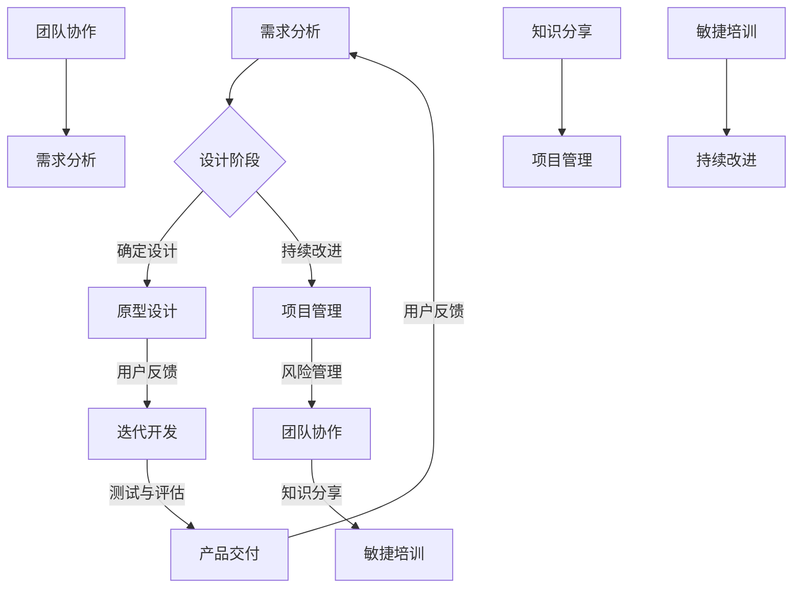

                 

### 文章标题: VUCA时代，唯快不破

> 关键词：VUCA时代、快速决策、敏捷性、迭代开发、持续学习、成功案例

> 摘要：本文深入探讨了VUCA时代的背景、特点和应用领域，提出了快速决策、敏捷性与适应性提升、快速迭代与持续成长等关键策略，通过分析成功案例，为个人和组织在VUCA时代提供了实用的成长路径和策略建议。

### 第一部分: VUCA时代的理解与应用

#### 第1章: VUCA时代的概念解析

##### 1.1 VUCA时代的概念解析

**1.1.1 VUCA概念的提出背景**

VUCA（Volatility, Uncertainty, Complexity, Ambiguity）是一个在20世纪90年代初期由美国海军战争学院提出的管理概念。VUCA旨在帮助企业领导者更好地理解快速变化的环境，并相应地调整战略和运营。

**1.1.2 VUCA的四个维度**

- **Volatility（易变性）**：环境快速变化，不确定性高。
- **Uncertainty（不确定性）**：信息不完整，难以预测未来。
- **Complexity（复杂性）**：系统间相互关系复杂，难以用简单的模型描述。
- **Ambiguity（模糊性）**：信息模糊，难以明确决策。

**1.1.3 VUCA时代的特点与挑战**

- **变化快速**：市场需求、技术发展、政治环境等快速变化。
- **不确定性高**：预测难度大，风险增加。
- **复杂性**：系统间关系复杂，决策难度大。
- **模糊性**：信息不完整，决策依据不足。

##### 1.2 VUCA时代的应用领域

**1.2.1 企业战略管理中的应用**

- **战略调整**：根据环境变化快速调整战略方向。
- **风险管理**：识别和应对潜在风险。

**1.2.2 组织变革与领导力发展**

- **敏捷性**：提高组织对变化的适应能力。
- **领导力**：培养领导者应对不确定性的能力。

**1.2.3 个人职业生涯规划**

- **持续学习**：适应技术快速变化，提升个人能力。
- **职业转型**：根据市场变化调整职业方向。

##### 1.3 VUCA时代的应对策略

**1.3.1 增强敏捷性与适应性**

- **组织结构**：扁平化组织，提高决策速度。
- **文化**：鼓励创新，容忍失败。

**1.3.2 快速决策与执行**

- **决策过程**：简化流程，提高效率。
- **执行**：加强执行力，确保决策得到有效执行。

**1.3.3 持续学习与迭代**

- **学习**：不断学习新知识，提升自身能力。
- **迭代**：通过快速迭代，持续优化产品和业务。

##### 1.4 VUCA时代的成功案例

**1.4.1 创新型企业的实践**

- **案例**：特斯拉、Airbnb
- **策略分析**：技术创新、快速迭代、用户导向。

**1.4.2 持续成长型企业的策略**

- **案例**：华为、阿里巴巴
- **策略分析**：多元化战略、持续创新、全球布局。

**1.4.3 个人职业发展的启示**

- **案例**：乔布斯、马斯克
- **策略建议**：终身学习、持续创新、勇于尝试。

#### 第2章: 快速决策的理论与实践

##### 2.1 快速决策的基本原则

**2.1.1 确定性决策与不确定性决策**

- **确定性决策**：信息完整，决策结果可预测。
- **不确定性决策**：信息不完整，决策结果具有不确定性。

**2.1.2 决策过程模型**

1. **问题识别**：确定决策问题。
2. **信息收集**：收集相关数据和信息。
3. **方案评估**：评估不同方案的优缺点。
4. **决策执行**：实施决策方案。

**2.1.3 快速决策的关键因素**

- **信息速度**：快速获取和处理信息。
- **决策流程**：简化决策流程，提高效率。
- **执行能力**：确保决策得到有效执行。

##### 2.2 快速决策的方法与技术

**2.2.1 数据驱动的决策**

- **数据分析**：利用大数据技术，分析市场趋势和用户需求。
- **预测模型**：建立预测模型，预测未来趋势。

**2.2.2 基于算法的决策优化**

- **算法选择**：根据决策问题选择合适的算法。
- **优化过程**：利用算法优化决策方案。

**2.2.3 快速决策的辅助工具**

- **人工智能**：利用人工智能技术，自动化决策过程。
- **决策支持系统**：提供数据分析和决策优化的支持。

##### 2.3 快速执行的组织管理

**2.3.1 企业文化与管理模式**

- **鼓励创新**：建立鼓励创新的企业文化。
- **扁平化管理**：减少层级，提高决策速度。

**2.3.2 快速响应的市场策略**

- **敏捷供应链**：快速响应市场需求，提高供应链效率。
- **用户反馈机制**：建立用户反馈机制，及时调整产品和服务。

**2.3.3 人力资源与绩效管理**

- **人才招聘**：招聘具备快速决策能力的人才。
- **绩效评估**：建立与快速决策能力相关的绩效评估体系。

##### 2.4 快速决策与执行的案例分析

**2.4.1 成功企业的快速决策策略**

- **案例**：谷歌、亚马逊
- **策略分析**：快速决策、高效执行、持续创新。

**2.4.2 快速决策失败的风险与应对**

- **风险识别**：识别快速决策可能带来的风险。
- **应对策略**：制定应对快速决策失败的风险管理策略。

**2.4.3 快速决策在企业战略中的应用**

- **战略制定**：利用快速决策，快速制定和调整战略。
- **市场开拓**：利用快速决策，快速开拓新市场。

#### 第3章: 敏捷性与适应性提升

##### 3.1 敏捷思维的内涵与特点

**3.1.1 敏捷思维的起源与发展**

- **起源**：起源于软件开发领域，针对传统瀑布模型的不足。
- **发展**：逐渐应用于企业管理、项目管理和个人成长等领域。

**3.1.2 敏捷思维的核心原则**

- **用户至上**：以用户需求为中心，持续交付有价值的产品。
- **迭代开发**：通过快速迭代，不断优化产品。
- **团队协作**：强调团队合作，共同解决问题。
- **持续学习**：持续学习新知识，不断提升团队能力。

**3.1.3 敏捷思维的优势与挑战**

- **优势**：提高产品质量、缩短产品开发周期、提升团队协作效率。
- **挑战**：需要高度自律、持续学习和适应变化。

##### 3.2 敏捷方法在团队管理中的应用

**3.2.1 敏捷开发方法论（Scrum、Kanban等）**

- **Scrum**：强调迭代和增量开发，定期进行回顾和改进。
- **Kanban**：基于可视化工作流程，持续优化和改进。

**3.2.2 敏捷团队的建设与沟通**

- **团队成员**：具备多技能的团队成员。
- **沟通机制**：定期举行站立会议、回顾会议等，确保信息透明。

**3.2.3 敏捷方法在项目实施中的实践**

- **项目启动**：确定项目目标和范围。
- **迭代规划**：制定迭代计划，分配任务。
- **迭代执行**：按计划执行任务，持续迭代优化。

##### 3.3 快速响应的市场策略

**3.3.1 市场变化的洞察与分析**

- **市场调研**：了解市场需求和趋势。
- **数据分析**：利用大数据技术，分析市场数据。

**3.3.2 产品迭代与快速上市**

- **快速原型设计**：通过快速原型，验证产品可行性。
- **快速上市**：快速推出产品，获取用户反馈。

**3.3.3 应对市场变化的风险管理**

- **风险评估**：识别和评估市场变化可能带来的风险。
- **应对策略**：制定应对市场变化的风险管理策略。

##### 3.4 敏捷性与适应性的个人实践

**3.4.1 个人敏捷能力的培养**

- **学习敏捷知识**：了解敏捷开发方法、原则和实践。
- **实践敏捷思维**：在日常工作中，运用敏捷思维解决问题。

**3.4.2 敏捷工具与方法的应用**

- **敏捷工具**：使用敏捷工具（如Jira、Trello等）提高工作效率。
- **敏捷方法**：运用敏捷方法（如看板、站立会议等）提高团队协作效率。

**3.4.3 敏捷生活的实践与反思**

- **时间管理**：通过敏捷方法，优化时间管理。
- **持续学习**：通过敏捷方法，持续学习新知识。

### 第三部分: 快速迭代与持续成长

#### 第4章: 快速迭代的产品开发

##### 4.1 快速迭代的基本概念

**4.1.1 迭代的定义与类型**

- **定义**：迭代是指重复某个过程，以改进产品或服务。
- **类型**：迭代可以分为小型迭代、中型迭代和大型迭代。

**4.1.2 迭代的优点与挑战**

- **优点**：缩短产品开发周期、提高产品质量、增强用户满意度。
- **挑战**：需要高效的团队协作、持续的学习和创新。

**4.1.3 迭代流程的关键环节**

1. **需求分析**：明确产品需求，制定迭代计划。
2. **设计**：设计产品原型，进行用户反馈。
3. **开发**：按计划进行开发，确保按时交付。
4. **测试**：进行测试，确保产品质量。
5. **发布**：将产品发布到市场，获取用户反馈。

##### 4.2 迭代式产品开发方法

**4.2.1 设计思维在迭代开发中的应用**

- **设计思维**：以用户需求为中心，通过迭代不断优化产品。
- **用户反馈**：通过用户反馈，了解产品不足，进行改进。

**4.2.2 用户反馈与持续迭代**

- **用户反馈机制**：建立用户反馈机制，收集用户反馈。
- **持续迭代**：根据用户反馈，不断优化产品。

**4.2.3 快速原型设计与验证**

- **快速原型设计**：通过快速原型，验证产品可行性。
- **原型验证**：通过用户测试，验证产品原型。

##### 4.3 持续集成与持续部署

**4.3.1 持续集成（CI）的概念与实践**

- **概念**：持续集成是指将代码集成到共享仓库中，进行自动化测试和构建。
- **实践**：通过CI，确保代码质量，提高开发效率。

**4.3.2 持续部署（CD）的原理与实施**

- **原理**：持续部署是指将代码部署到生产环境，进行自动化测试和发布。
- **实施**：通过CD，确保产品快速交付，提高市场响应速度。

**4.3.3 持续集成与持续部署的优势**

- **提高代码质量**：通过自动化测试，确保代码质量。
- **加快开发速度**：通过自动化构建和部署，提高开发效率。
- **降低风险**：通过自动化测试和部署，降低部署风险。

##### 4.4 快速迭代中的风险管理

**4.4.1 迭代过程中的风险识别**

- **需求变更**：识别需求变更可能带来的风险。
- **技术难题**：识别技术实现可能带来的风险。

**4.4.2 风险评估与应对策略**

- **评估风险**：评估风险的可能性和影响。
- **制定策略**：制定应对风险的策略。

**4.4.3 风险管理在迭代实践中的应用**

- **风险识别**：在迭代计划中识别风险。
- **风险应对**：在迭代过程中，实施风险应对策略。

### 第四部分: 持续学习与知识更新

#### 第5章: 持续学习的方法与工具

##### 5.1 持续学习的必要性

**5.1.1 知识更新的速度**

- **科技发展**：随着科技的发展，知识更新速度加快。
- **职业发展**：为了适应职业发展，需要不断学习新知识。

**5.1.2 职业发展的要求**

- **专业技能**：具备专业技能，提高职业竞争力。
- **创新能力**：具备创新能力，推动职业发展。

**5.1.3 持续学习的重要性**

- **适应变化**：适应快速变化的环境。
- **提高效率**：提高工作效率，降低工作压力。

##### 5.2 持续学习的方法

**5.2.1 系统性学习与碎片化学习**

- **系统性学习**：通过系统学习，掌握核心知识。
- **碎片化学习**：通过碎片化学习，充分利用零散时间。

**5.2.2 主动学习与被动学习**

- **主动学习**：主动寻找学习资源，积极思考。
- **被动学习**：通过阅读、观看视频等方式，被动接受知识。

**5.2.3 学习策略与时间管理**

- **学习策略**：制定有效的学习策略，提高学习效率。
- **时间管理**：合理安排时间，保证学习时间。

##### 5.3 学习工具的使用

**5.3.1 在线学习平台的介绍**

- **平台选择**：根据学习需求，选择合适的在线学习平台。
- **课程推荐**：推荐优质的学习课程。

**5.3.2 电子书籍与学术论文的获取**

- **获取途径**：介绍获取电子书籍与学术论文的途径。
- **资源推荐**：推荐优质的电子书籍与学术论文。

**5.3.3 学习社群与网络资源**

- **社群参与**：参与学习社群，交流学习心得。
- **网络资源**：利用网络资源，扩展知识视野。

##### 5.4 知识管理与实践

**5.4.1 知识分类与组织**

- **知识分类**：将知识进行分类，便于查找和管理。
- **知识组织**：建立知识库，整理和归纳知识。

**5.4.2 知识共享与传播**

- **知识共享**：通过内部分享、外部合作等方式，共享知识。
- **知识传播**：通过培训、研讨会等方式，传播知识。

**5.4.3 知识更新与迭代**

- **知识更新**：定期更新知识库，确保知识最新。
- **知识迭代**：根据实际需求，迭代优化知识。

### 第五部分: 成功案例与策略分析

#### 第6章: VUCA时代下的成功案例分析

##### 6.1 创新型企业的实践

**6.1.1 创新型企业的定义与特征**

- **定义**：具有创新精神，持续进行技术创新和商业模式创新的企业。
- **特征**：以创新为核心，具备快速响应市场变化的能力。

**6.1.2 成功的创新案例解析**

- **案例**：特斯拉、Airbnb
- **解析**：技术创新、快速迭代、用户导向。

**6.1.3 创新型企业的策略分析**

- **创新战略**：持续进行技术创新，提高产品竞争力。
- **市场策略**：快速响应市场需求，抢占市场份额。
- **组织文化**：鼓励创新，建立学习型组织。

##### 6.2 成长型企业的转型

**6.2.1 成长型企业的定义与特征**

- **定义**：具备成长潜力，持续进行业务拓展和业务转型的企业。
- **特征**：以市场为导向，具备快速适应市场变化的能力。

**6.2.2 转型策略的案例分析**

- **案例**：华为、阿里巴巴
- **解析**：多元化战略、持续创新、全球布局。

**6.2.3 成长型企业的成功路径**

- **成功路径**：通过多元化战略，实现业务拓展。
- **成功路径**：通过持续创新，提高产品竞争力。
- **成功路径**：通过全球布局，拓展国际市场。

##### 6.3 个人职业发展的启示

**6.3.1 职业发展的关键因素**

- **专业技能**：具备专业技能，提高职业竞争力。
- **创新能力**：具备创新能力，推动职业发展。
- **持续学习**：持续学习新知识，适应职业发展。

**6.3.2 成功职业人士的经验分享**

- **经验分享**：成功职业人士的职业发展经验。
- **经验分享**：成功职业人士的学习方法和心得。

**6.3.3 个人职业发展的策略建议**

- **策略建议**：根据自身特点，制定职业发展策略。
- **策略建议**：注重专业技能和创新能力提升。
- **策略建议**：持续学习，适应职业发展需求。

### 第六部分: 总结与展望

#### 第7章: VUCA时代的未来展望与个人策略

##### 7.1 VUCA时代的未来趋势

**7.1.1 技术发展的驱动因素**

- **人工智能**：人工智能技术的发展，将推动各行业的变革。
- **大数据**：大数据技术的应用，将提高决策效率和精准度。

**7.1.2 未来商业模式的变化**

- **数字化**：数字化将成为未来商业模式的主流。
- **平台化**：平台化模式将改变传统商业模式。

**7.1.3 社会影响的预测**

- **就业市场**：人工智能和自动化技术的发展，将对就业市场产生影响。
- **生活方式**：数字化和智能化技术的发展，将改变人们的生活方式。

##### 7.2 个人成长策略

**7.2.1 职业技能的提升**

- **专业技能**：提升专业技能，提高职业竞争力。
- **跨领域能力**：拓展跨领域知识，适应多元职业发展。

**7.2.2 创新思维的培养**

- **创新方法**：学习创新方法，提高创新能力。
- **创新实践**：通过实践，培养创新思维。

**7.2.3 应对变化的策略**

- **敏捷性**：提高敏捷性，快速适应变化。
- **持续学习**：持续学习新知识，适应变化。

##### 7.3 组织发展策略

**7.3.1 增强组织的敏捷性与适应性**

- **敏捷组织**：建立敏捷组织，提高响应速度。
- **适应性**：培养组织适应性，应对市场变化。

**7.3.2 建立学习型组织**

- **学习文化**：建立学习文化，鼓励持续学习。
- **知识共享**：建立知识共享机制，提高组织知识水平。

**7.3.3 应对VUCA时代的组织变革**

- **变革管理**：进行变革管理，确保变革成功。
- **组织文化**：调整组织文化，适应VUCA时代。

##### 7.4 总结与反思

**7.4.1 本书的主要内容回顾**

- **VUCA时代的背景与特点**：介绍了VUCA时代的概念和应用领域。
- **快速决策与执行**：探讨了快速决策的原则和方法。
- **敏捷性与适应性提升**：分析了敏捷思维和敏捷方法的实践。
- **快速迭代与持续成长**：讨论了迭代开发的重要性。
- **持续学习与知识更新**：提出了持续学习的方法与工具。
- **成功案例与策略分析**：分享了成功企业的经验和策略。

**7.4.2 对VUCA时代的理解与感悟**

- **理解**：VUCA时代是一个充满变化和不确定性的时代。
- **感悟**：快速适应变化，持续学习和创新，是应对VUCA时代的关键。

**7.4.3 未来发展的建议**

- **个人发展**：提升专业技能，培养创新能力，持续学习。
- **组织发展**：建立敏捷组织，推动组织变革，建立学习型组织。

### 附录

#### 附录 A: VUCA时代的资源与工具

**A.1 相关书籍与论文推荐**

- **书籍**：推荐一些关于VUCA时代、敏捷方法、快速决策等方面的经典书籍。
- **论文**：介绍一些关于VUCA时代的研究论文，供进一步学习。

**A.2 教育与培训资源**

- **在线课程平台**：推荐一些优质的在线学习平台，供学习新知识和技能。
- **实战训练营**：介绍一些实战训练营，帮助实践所学知识。

**A.3 行业报告与资讯**

- **行业报告**：介绍一些权威的行业报告，帮助了解行业动态。
- **专业媒体资讯**：推荐一些专业的媒体，获取最新的行业资讯。

### 作者信息

**作者：AI天才研究院/AI Genius Institute & 禅与计算机程序设计艺术 /Zen And The Art of Computer Programming** 

### 文章标题: VUCA时代，唯快不破

#### 关键词

- **VUCA时代**
- **快速决策**
- **敏捷性**
- **迭代开发**
- **持续学习**
- **成功案例**

#### 摘要

本文深入探讨了VUCA时代的背景、特点和应用领域，提出了快速决策、敏捷性与适应性提升、快速迭代与持续成长等关键策略，通过分析成功案例，为个人和组织在VUCA时代提供了实用的成长路径和策略建议。

### 第一部分: VUCA时代的理解与应用

#### 第1章: VUCA时代的概念解析

##### 1.1 VUCA时代的起源与含义

VUCA（Volatility, Uncertainty, Complexity, Ambiguity）概念最初由美国海军战争学院在1990年代初提出，用于描述在全球化、信息化和快速变革环境下，企业面临的不确定性和复杂性。VUCA的四个维度分别代表了：

- **Volatility（易变性）**：市场环境和外部条件快速变化。
- **Uncertainty（不确定性）**：信息不完整，未来不可预测。
- **Complexity（复杂性）**：系统间的相互作用复杂，难以用简单模型描述。
- **Ambiguity（模糊性）**：信息模糊，决策依据不足。

在VUCA时代，企业和个人必须具备快速适应和灵活应对这些特点的能力。

##### 1.2 VUCA时代的应用领域

**1.2.1 企业战略管理中的应用**

VUCA时代对企业战略管理提出了新的挑战，要求企业：

- **动态调整战略**：根据市场变化快速调整战略。
- **加强风险管理**：识别和应对潜在的风险。

**1.2.2 组织变革与领导力发展**

VUCA时代要求企业组织具备：

- **敏捷性**：快速响应市场变化。
- **领导力**：领导者需要具备应对不确定性的能力。

**1.2.3 个人职业生涯规划**

在VUCA时代，个人需要：

- **持续学习**：适应技术快速发展。
- **灵活调整**：根据市场需求和个人兴趣调整职业方向。

##### 1.3 VUCA时代的应对策略

**1.3.1 增强敏捷性与适应性**

为了在VUCA时代生存和发展，企业和个人需要：

- **敏捷组织**：采用敏捷组织结构，提高响应速度。
- **适应性**：培养组织和个人对变化的适应能力。

**1.3.2 快速决策与执行**

在VUCA时代，快速决策和执行至关重要：

- **简化流程**：简化决策流程，提高决策效率。
- **执行力**：确保决策得到有效执行。

**1.3.3 持续学习与迭代**

VUCA时代要求企业和个人：

- **持续学习**：不断更新知识和技能。
- **迭代优化**：通过迭代不断优化产品和业务。

##### 1.4 VUCA时代的成功案例

**1.4.1 创新型企业的实践**

创新型企业如Google、Tesla等，在VUCA时代通过快速迭代和持续创新取得了成功：

- **快速迭代**：通过快速反馈和迭代优化产品。
- **持续创新**：不断推出新产品和服务。

**1.4.2 持续成长型企业的策略**

持续成长型企业如华为、阿里巴巴等，通过：

- **多元化战略**：拓展业务领域，降低风险。
- **全球布局**：开拓国际市场，实现规模效应。

**1.4.3 个人职业发展的启示**

成功职业人士如乔布斯、马斯克等，通过：

- **持续学习**：不断更新知识和技能。
- **勇于尝试**：在不确定的环境中，勇于尝试新事物。

### 第二部分: 快速决策与执行

#### 第2章: 快速决策的理论与实践

##### 2.1 快速决策的基本原则

**2.1.1 确定性决策与不确定性决策**

- **确定性决策**：基于充分的信息和可预测的环境进行决策。
- **不确定性决策**：在信息不完整和不可预测的环境中进行决策。

**2.1.2 决策过程模型**

决策过程通常包括以下几个步骤：

1. **问题识别**：明确需要决策的问题。
2. **信息收集**：收集与决策相关的信息。
3. **方案评估**：分析各种方案的优缺点。
4. **决策执行**：实施决策方案。
5. **反馈与调整**：根据执行结果进行调整。

**2.1.3 快速决策的关键因素**

快速决策的关键因素包括：

- **信息速度**：快速获取和处理信息。
- **决策流程**：简化决策流程，提高效率。
- **执行能力**：确保决策得到有效执行。

##### 2.2 快速决策的方法与技术

**2.2.1 数据驱动的决策**

数据驱动的决策方法利用大数据和人工智能技术，通过数据分析提供决策支持：

- **数据分析**：利用数据分析工具，分析市场趋势和用户需求。
- **预测模型**：建立预测模型，预测未来趋势。

**2.2.2 基于算法的决策优化**

基于算法的决策优化方法利用算法模型，优化决策方案：

- **算法选择**：根据决策问题选择合适的算法。
- **优化过程**：通过算法优化决策方案。

**2.2.3 快速决策的辅助工具**

快速决策的辅助工具包括：

- **人工智能**：利用人工智能技术，自动化决策过程。
- **决策支持系统**：提供数据分析和决策优化的支持。

##### 2.3 快速执行的组织管理

**2.3.1 企业文化与管理模式**

为了支持快速决策和执行，企业需要建立：

- **鼓励创新**：建立鼓励创新的企业文化。
- **扁平化管理**：减少层级，提高决策速度。

**2.3.2 快速响应的市场策略**

企业需要：

- **敏捷供应链**：快速响应市场需求，提高供应链效率。
- **用户反馈机制**：建立用户反馈机制，及时调整产品和服务。

**2.3.3 人力资源与绩效管理**

企业需要：

- **人才招聘**：招聘具备快速决策能力的人才。
- **绩效评估**：建立与快速决策能力相关的绩效评估体系。

##### 2.4 快速决策与执行的案例分析

**2.4.1 成功企业的快速决策策略**

成功企业如Google、Amazon等，通过快速决策取得了成功：

- **Google**：通过快速迭代和敏捷开发，推出新产品和服务。
- **Amazon**：通过快速决策，迅速调整业务战略，实现快速增长。

**2.4.2 快速决策失败的风险与应对**

快速决策存在一定的风险，企业需要：

- **风险识别**：识别快速决策可能带来的风险。
- **应对策略**：制定应对快速决策失败的风险管理策略。

**2.4.3 快速决策在企业战略中的应用**

快速决策在企业战略中的应用包括：

- **战略制定**：通过快速决策，快速制定和调整战略。
- **市场开拓**：通过快速决策，快速开拓新市场。

### 第三部分: 敏捷性与适应性提升

#### 第3章: 敏捷思维与快速响应

##### 3.1 敏捷思维的内涵与特点

**3.1.1 敏捷思维的起源与发展**

敏捷思维起源于软件开发领域，特别是在面对复杂、变化快速的项目时。敏捷思维强调团队合作、用户反馈和持续迭代。

**3.1.2 敏捷思维的核心原则**

敏捷思维的核心原则包括：

- **用户至上**：以用户需求为中心。
- **迭代开发**：通过快速迭代，不断优化产品。
- **团队协作**：强调团队成员之间的沟通和合作。
- **持续学习**：持续学习新知识和技能。

**3.1.3 敏捷思维的优势与挑战**

敏捷思维的优势包括：

- **提高产品质量**：通过用户反馈，不断优化产品。
- **缩短开发周期**：通过迭代开发，提高开发效率。

敏捷思维的挑战包括：

- **需要高度自律**：团队成员需要自我管理，确保项目进度。
- **持续学习**：需要不断学习新知识和技能。

##### 3.2 敏捷方法在团队管理中的应用

**3.2.1 敏捷开发方法论（Scrum、Kanban等）**

敏捷开发方法论包括：

- **Scrum**：强调迭代和增量开发，定期进行回顾和改进。
- **Kanban**：基于可视化工作流程，持续优化和改进。

**3.2.2 敏捷团队的建设与沟通**

敏捷团队的建设包括：

- **团队成员**：具备多技能的团队成员。
- **沟通机制**：定期举行站立会议、回顾会议等，确保信息透明。

**3.2.3 敏捷方法在项目实施中的实践**

敏捷方法在项目实施中的实践包括：

- **项目启动**：明确项目目标和范围。
- **迭代规划**：制定迭代计划，分配任务。
- **迭代执行**：按计划执行任务，持续迭代优化。

##### 3.3 快速响应的市场策略

**3.3.1 市场变化的洞察与分析**

市场变化的洞察与分析包括：

- **市场调研**：了解市场需求和趋势。
- **数据分析**：利用大数据技术，分析市场数据。

**3.3.2 产品迭代与快速上市**

产品迭代与快速上市包括：

- **快速原型设计**：通过快速原型，验证产品可行性。
- **快速上市**：快速推出产品，获取用户反馈。

**3.3.3 应对市场变化的风险管理**

应对市场变化的风险管理包括：

- **风险评估**：识别和评估市场变化可能带来的风险。
- **应对策略**：制定应对市场变化的风险管理策略。

##### 3.4 敏捷性与适应性的个人实践

**3.4.1 个人敏捷能力的培养**

个人敏捷能力的培养包括：

- **学习敏捷知识**：了解敏捷开发方法、原则和实践。
- **实践敏捷思维**：在日常工作中，运用敏捷思维解决问题。

**3.4.2 敏捷工具与方法的应用**

敏捷工具与方法的应用包括：

- **敏捷工具**：使用敏捷工具（如Jira、Trello等）提高工作效率。
- **敏捷方法**：运用敏捷方法（如看板、站立会议等）提高团队协作效率。

**3.4.3 敏捷生活的实践与反思**

敏捷生活的实践与反思包括：

- **时间管理**：通过敏捷方法，优化时间管理。
- **持续学习**：通过敏捷方法，持续学习新知识。

### 第四部分: 快速迭代与持续成长

#### 第4章: 快速迭代的产品开发

##### 4.1 快速迭代的基本概念

**4.1.1 迭代的定义与类型**

迭代是指重复某个过程，以改进产品或服务。迭代可以分为：

- **小型迭代**：通常在几周内完成，适用于快速验证和优化产品。
- **中型迭代**：通常在几个月内完成，适用于逐步完善产品。
- **大型迭代**：通常在一年以上完成，适用于大规模产品和项目。

**4.1.2 迭代的优点与挑战**

迭代的优点包括：

- **缩短开发周期**：通过快速迭代，缩短产品开发周期。
- **提高产品质量**：通过用户反馈和迭代优化，提高产品质量。

迭代的挑战包括：

- **需要高度自律**：团队成员需要自我管理，确保迭代进度。
- **持续学习**：需要不断学习新知识和技能，以应对变化。

**4.1.3 迭代流程的关键环节**

迭代流程的关键环节包括：

1. **需求分析**：明确产品需求，制定迭代计划。
2. **设计**：设计产品原型，进行用户反馈。
3. **开发**：按计划进行开发，确保按时交付。
4. **测试**：进行测试，确保产品质量。
5. **发布**：将产品发布到市场，获取用户反馈。

##### 4.2 迭代式产品开发方法

**4.2.1 设计思维在迭代开发中的应用**

设计思维是一种以用户为中心的创新方法，适用于迭代开发。设计思维在迭代开发中的应用包括：

- **用户调研**：了解用户需求和痛点。
- **原型设计**：快速构建原型，验证产品可行性。
- **用户反馈**：收集用户反馈，持续优化产品。

**4.2.2 用户反馈与持续迭代**

用户反馈与持续迭代是迭代式产品开发的核心。用户反馈可以通过以下方式获取：

- **用户访谈**：与用户进行深入交流，了解真实需求。
- **用户测试**：通过用户测试，验证产品功能和用户体验。
- **反馈机制**：建立用户反馈机制，确保用户反馈得到及时处理。

**4.2.3 快速原型设计与验证**

快速原型设计与验证是迭代开发的重要环节。快速原型设计与验证包括：

- **原型构建**：使用低成本的工具（如Sketch、Figma等）快速构建原型。
- **用户验证**：通过用户测试，验证产品原型是否符合用户需求。
- **迭代优化**：根据用户反馈，对产品原型进行优化。

##### 4.3 持续集成与持续部署

**4.3.1 持续集成（CI）的概念与实践**

持续集成（CI）是指将代码集成到共享仓库中，进行自动化测试和构建。持续集成的主要实践包括：

- **代码仓库**：使用版本控制系统（如Git）管理代码。
- **自动化测试**：编写自动化测试脚本，确保代码质量。
- **构建与部署**：自动化构建和部署，确保产品交付质量。

**4.3.2 持续部署（CD）的原理与实施**

持续部署（CD）是指将代码部署到生产环境，进行自动化测试和发布。持续部署的主要实践包括：

- **自动化测试**：编写自动化测试脚本，确保产品功能正确。
- **自动化部署**：自动化部署流程，确保产品快速上线。
- **部署策略**：根据业务需求，制定合适的部署策略。

**4.3.3 持续集成与持续部署的优势**

持续集成与持续部署的优势包括：

- **提高代码质量**：通过自动化测试，确保代码质量。
- **缩短开发周期**：通过自动化构建和部署，提高开发效率。
- **降低风险**：通过自动化测试和部署，降低部署风险。

##### 4.4 快速迭代中的风险管理

**4.4.1 迭代过程中的风险识别**

迭代过程中的风险识别包括：

- **需求变更**：识别需求变更可能带来的风险。
- **技术实现**：识别技术实现可能带来的风险。
- **项目进度**：识别项目进度可能带来的风险。

**4.4.2 风险评估与应对策略**

风险评估与应对策略包括：

- **评估风险**：评估风险的可能性和影响。
- **制定策略**：制定应对风险的策略。

**4.4.3 风险管理在迭代实践中的应用**

风险管理在迭代实践中的应用包括：

- **风险识别**：在迭代计划中识别风险。
- **风险应对**：在迭代过程中，实施风险应对策略。

### 第五部分: 持续学习与知识更新

#### 第5章: 持续学习的方法与工具

##### 5.1 持续学习的必要性

**5.1.1 知识更新的速度**

随着科技的快速发展，知识更新的速度也在不断加快。新的技术和方法不断涌现，要求个人和组织不断学习新知识，以保持竞争力。

**5.1.2 职业发展的要求**

职业发展需要个人具备不断学习新知识的能力。只有通过持续学习，才能跟上行业发展的步伐，适应职业变化。

**5.1.3 持续学习的重要性**

持续学习对于个人和组织的发展至关重要。它不仅能够提高个人的专业技能，还能够提升组织的创新能力，推动组织的持续发展。

##### 5.2 持续学习的方法

**5.2.1 系统性学习与碎片化学习**

系统性学习是通过系统性地学习某个领域的知识，建立起完整的知识体系。碎片化学习则是通过利用零散的时间，学习短小精悍的知识点。

**5.2.2 主动学习与被动学习**

主动学习是通过自主思考和实践，主动探索和学习新知识。被动学习则是通过阅读书籍、观看视频等方式，被动地接受知识。

**5.2.3 学习策略与时间管理**

有效的学习策略和时间管理可以帮助个人更高效地学习。学习策略包括设定学习目标、选择合适的学习方法等。时间管理则包括合理安排学习时间、避免拖延等。

##### 5.3 学习工具的使用

**5.3.1 在线学习平台的介绍**

在线学习平台为个人提供了丰富的学习资源。如Coursera、Udemy等平台，提供了各种课程，涵盖了多个领域。

**5.3.2 电子书籍与学术论文的获取**

电子书籍和学术论文是获取专业知识的有效途径。可以通过图书馆、在线书店等渠道获取。

**5.3.3 学习社群与网络资源**

学习社群和网络资源为个人提供了交流和学习的机会。如专业的论坛、社交媒体等，可以与其他学习者交流心得，分享资源。

##### 5.4 知识管理与实践

**5.4.1 知识分类与组织**

有效的知识管理需要将知识进行分类和组织。可以根据知识的重要性、相关性等，对知识进行分类和归纳。

**5.4.2 知识共享与传播**

知识共享与传播是提高组织知识水平的重要手段。可以通过内部培训、知识分享会等方式，实现知识的共享和传播。

**5.4.3 知识更新与迭代**

知识更新与迭代是保持知识活力的关键。需要定期对知识库进行更新，剔除过时知识，引入新知识。

### 第六部分: 成功案例与策略分析

#### 第6章: VUCA时代下的成功案例分析

##### 6.1 创新型企业的实践

**6.1.1 创新型企业的定义与特征**

创新型企业是指那些以创新为核心，持续进行技术创新和商业模式创新的企业。其特征包括：

- **技术创新**：不断进行技术创新，提高产品竞争力。
- **商业模式创新**：通过创新商业模式，创造新的市场机会。

**6.1.2 成功的创新案例解析**

- **案例1：特斯拉**：特斯拉通过技术创新，颠覆了传统汽车行业。其推出的电动车、太阳能产品和能源储存解决方案，均具有创新性。
- **案例2：Airbnb**：Airbnb通过商业模式创新，将闲置的房屋资源转化为住宿服务，创造了一个全新的市场。

**6.1.3 创新型企业的策略分析**

创新型企业成功的关键策略包括：

- **持续创新**：保持创新动力，不断推出新产品和服务。
- **用户导向**：以用户需求为中心，持续优化产品和服务。
- **风险承担**：勇于承担创新风险，不断尝试新事物。

##### 6.2 成长型企业的转型

**6.2.1 成长型企业的定义与特征**

成长型企业是指那些具备成长潜力，能够持续进行业务拓展和业务转型的企业。其特征包括：

- **成长潜力**：具备持续增长的能力。
- **业务拓展**：通过拓展新业务，实现规模效应。
- **业务转型**：通过业务转型，适应市场变化。

**6.2.2 转型策略的案例分析**

- **案例1：华为**：华为通过不断拓展新业务领域，实现了业务的多元化。同时，通过业务转型，从通信设备制造商转变为全球领先的科技公司。
- **案例2：阿里巴巴**：阿里巴巴通过拓展电商、云计算等新业务，实现了业务的多元化。同时，通过业务转型，从电商平台转变为生态系统。

**6.2.3 成长型企业的成功路径**

成长型企业成功的关键路径包括：

- **多元化战略**：通过多元化战略，拓展新业务领域。
- **持续创新**：通过持续创新，提高产品竞争力。
- **全球布局**：通过全球布局，实现国际市场的拓展。

##### 6.3 个人职业发展的启示

**6.3.1 职业发展的关键因素**

个人职业发展的关键因素包括：

- **专业技能**：具备专业技能，提高职业竞争力。
- **创新能力**：具备创新能力，推动职业发展。
- **持续学习**：持续学习新知识，适应职业发展。

**6.3.2 成功职业人士的经验分享**

成功职业人士的经验分享包括：

- **案例1：乔布斯**：乔布斯通过不断学习和创新，推动了苹果公司的发展。他坚信产品的设计应该以用户为中心，这一理念帮助苹果成为全球领先的科技公司。
- **案例2：马斯克**：马斯克通过持续学习和实践，推动了特斯拉和SpaceX的发展。他勇于尝试新事物，不断推动科技创新。

**6.3.3 个人职业发展的策略建议**

个人职业发展的策略建议包括：

- **设定目标**：明确职业发展的目标，制定实现目标的计划。
- **持续学习**：通过持续学习，提升自身能力。
- **勇于尝试**：在职业发展中，勇于尝试新事物。

### 第七部分: 总结与展望

#### 第7章: VUCA时代的未来展望与个人策略

##### 7.1 VUCA时代的未来趋势

**7.1.1 技术发展的驱动因素**

未来技术发展的驱动因素包括：

- **人工智能**：人工智能技术的发展，将推动各行业的变革。
- **大数据**：大数据技术的应用，将提高决策效率和精准度。
- **物联网**：物联网技术的普及，将实现万物互联。

**7.1.2 未来商业模式的变化**

未来商业模式的变化包括：

- **数字化**：数字化将成为未来商业模式的主流。
- **平台化**：平台化模式将改变传统商业模式。
- **共享经济**：共享经济模式将重塑传统行业。

**7.1.3 社会影响的预测**

未来社会影响的预测包括：

- **就业市场**：人工智能和自动化技术的发展，将对就业市场产生影响。
- **生活方式**：数字化和智能化技术的发展，将改变人们的生活方式。

##### 7.2 个人成长策略

**7.2.1 职业技能的提升**

个人在VUCA时代应注重职业技能的提升，包括：

- **专业技能**：提升专业技能，提高职业竞争力。
- **跨领域能力**：拓展跨领域知识，适应多元职业发展。
- **创新能力**：培养创新能力，推动职业发展。

**7.2.2 创新思维的培养**

个人应注重创新思维的培养，包括：

- **创新方法**：学习创新方法，提高创新能力。
- **创新实践**：通过实践，培养创新思维。
- **创新环境**：创造有利于创新的环境和氛围。

**7.2.3 应对变化的策略**

个人在应对VUCA时代的变化时，应采取以下策略：

- **敏捷性**：提高敏捷性，快速适应变化。
- **持续学习**：持续学习新知识，适应变化。
- **灵活调整**：根据市场变化和个人兴趣，灵活调整职业方向。

##### 7.3 组织发展策略

**7.3.1 增强组织的敏捷性与适应性**

组织应注重增强敏捷性与适应性，包括：

- **敏捷组织**：建立敏捷组织，提高响应速度。
- **适应性**：培养组织适应性，应对市场变化。
- **文化**：建立以创新和适应为核心的组织文化。

**7.3.2 建立学习型组织**

组织应建立学习型组织，包括：

- **学习文化**：建立学习文化，鼓励持续学习。
- **知识共享**：建立知识共享机制，提高组织知识水平。
- **培训与发展**：提供培训和发展机会，提升员工能力。

**7.3.3 应对VUCA时代的组织变革**

组织应对VUCA时代的组织变革，包括：

- **变革管理**：进行变革管理，确保变革成功。
- **组织文化**：调整组织文化，适应VUCA时代。
- **领导力**：培养领导者应对不确定性的能力。

##### 7.4 总结与反思

**7.4.1 本书的主要内容回顾**

本书主要内容包括：

- **VUCA时代的背景与特点**：介绍了VUCA时代的概念和应用领域。
- **快速决策与执行**：探讨了快速决策的原则和方法。
- **敏捷性与适应性提升**：分析了敏捷思维和敏捷方法的实践。
- **快速迭代与持续成长**：讨论了迭代开发的重要性。
- **持续学习与知识更新**：提出了持续学习的方法与工具。
- **成功案例与策略分析**：分享了成功企业的经验和策略。

**7.4.2 对VUCA时代的理解与感悟**

对VUCA时代的理解与感悟包括：

- **理解**：VUCA时代是一个充满变化和不确定性的时代。
- **感悟**：快速适应变化，持续学习和创新，是应对VUCA时代的关键。

**7.4.3 未来发展的建议**

未来发展的建议包括：

- **个人发展**：提升专业技能，培养创新能力，持续学习。
- **组织发展**：建立敏捷组织，推动组织变革，建立学习型组织。

### 附录

#### 附录 A: VUCA时代的资源与工具

**A.1 相关书籍与论文推荐**

- **书籍**：
  - 《敏捷软件开发：实践指南》（Agile Software Development: Principles, Patterns, and Practices）
  - 《精益创业》（The Lean Startup）
  - 《创新者的窘境》（The Innovator's Dilemma）
- **论文**：
  - 《VUCA时代的战略管理》（Strategic Management in the VUCA Era）

**A.2 教育与培训资源**

- **在线课程平台**：
  - Coursera
  - Udemy
  - edX
- **实战训练营**：
  - Coding Bootcamps
  - Agile and Scrum Training

**A.3 行业报告与资讯**

- **行业报告**：
  - McKinsey & Company
  - Gartner
  - Forrester
- **专业媒体资讯**：
  - Harvard Business Review
  - MIT Technology Review

### 作者信息

**作者：AI天才研究院/AI Genius Institute & 禅与计算机程序设计艺术 /Zen And The Art of Computer Programming** 

### 结论与展望

在VUCA时代，快速适应变化、持续学习和创新是企业和个人成功的关键。本文通过深入探讨VUCA时代的背景、特点和应用领域，提出了快速决策、敏捷性与适应性提升、快速迭代与持续成长等关键策略，并通过成功案例分析，为读者提供了实用的成长路径和策略建议。

**未来展望**：

- **技术发展**：人工智能、大数据和物联网等技术将继续推动行业变革，企业应积极拥抱新技术，提升竞争力。
- **商业模式**：数字化和平台化将成为未来商业模式的主流，企业需不断创新，以适应新的市场环境。
- **社会影响**：自动化和人工智能的发展将对就业市场产生影响，个人和组织需提前规划，适应未来变化。

**个人策略**：

- **持续学习**：个人应保持持续学习的心态，不断提升自身能力，适应职业发展需求。
- **创新能力**：培养创新能力，勇于尝试新事物，以应对不确定性。
- **敏捷适应**：提高敏捷性与适应性，快速响应市场变化。

**组织策略**：

- **敏捷组织**：建立敏捷组织，提高响应速度，确保企业能够快速适应市场变化。
- **学习型组织**：建立学习型组织，鼓励持续学习和创新，提高组织知识水平。
- **风险管理**：制定有效的风险管理策略，降低不确定性带来的风险。

总之，VUCA时代要求企业和个人具备快速适应、持续学习和创新能力。只有通过不断优化自身能力，才能在激烈的市场竞争中立于不败之地。希望本文能为读者在VUCA时代的发展提供有益的启示和指导。 

---

### 附录 A: VUCA时代的资源与工具

为了更好地帮助读者理解和应用VUCA时代的概念和策略，本附录提供了相关的书籍、教育培训资源和行业报告等。

**A.1 相关书籍与论文推荐**

1. **书籍**：
    - 《VUCA时代的企业管理：战略与创新》（VUCA Era Business Management: Strategy and Innovation）
    - 《敏捷管理：在不确定的环境中实现卓越绩效》（Agile Management: Achieving Excellence in Uncertain Environments）
    - 《智能时代的管理：人工智能与组织变革》（Management in the Age of AI: Organizational Change and Innovation）

2. **论文**：
    - “VUCA: A Framework for Leading in the New Normal” by Heifetz, Grashow, and Linsky
    - “Navigating in VUCA World: The Role of Strategic Foresight” by Richardson and Underhill

**A.2 教育与培训资源**

1. **在线课程平台**：
    - Coursera（提供多门关于领导力、战略管理等相关课程）
    - edX（提供由知名大学提供的免费课程）
    - LinkedIn Learning（提供丰富的职业发展相关课程）

2. **实战训练营**：
    - Agile Alliance Training（提供敏捷开发相关训练营）
    - Scrum.org Training（提供Scrum相关训练营）
    - Lean Kanban University（提供精益和Kanban相关训练营）

**A.3 行业报告与资讯**

1. **行业报告**：
    - Gartner（提供关于VUCA时代的企业战略、数字化转型等报告）
    - McKinsey & Company（提供关于组织敏捷性、领导力等报告）
    - PwC（提供关于企业适应VUCA时代的策略等报告）

2. **专业媒体资讯**：
    - Harvard Business Review（提供关于企业管理、战略等方面的深度文章）
    - Fast Company（提供关于创新、科技等领域的最新资讯）
    - MIT Technology Review（提供关于科技、创新等领域的最新研究）

**A.4 实用工具**

1. **项目管理工具**：
    - JIRA（Atlassian）
    - Trello
    - Asana

2. **数据分析工具**：
    - Tableau
    - Power BI
    - Google Data Studio

3. **敏捷开发工具**：
    - Confluence（Atlassian）
    - Slack
    - GitHub

**A.5 网络资源**

1. **社区和论坛**：
    - Agile coaching forum
    - Lean Agile Institute
    - Agile methodology on Stack Exchange

2. **博客和资讯网站**：
    - Agile Blog
    - LeanKit Blog
    - Mind the Product

通过上述资源，读者可以进一步深入了解VUCA时代的概念、策略和应用，不断提升自身在复杂多变环境中的应对能力。

### 附录 B: Mermaid 流程图

以下是一个关于敏捷开发的Mermaid流程图示例：



此流程图展示了敏捷开发的关键环节，包括需求分析、设计阶段、原型设计、迭代开发、产品交付以及项目管理、团队协作和知识分享等。通过不断迭代和反馈，敏捷开发能够快速适应变化，持续优化产品。

### 附录 C: 伪代码讲解

以下是一个关于快速决策算法的伪代码示例：

```plaintext
// 快速决策算法
function QuickDecisionProblem(inputData):
    // 输入数据预处理
    processedData = preprocessData(inputData)

    // 初始化决策变量
    bestDecision = null
    bestScore = -∞

    // 遍历所有可能的决策
    for each decision in generateAllDecisions(processedData):
        // 计算决策得分
        score = calculateScore(decision, processedData)

        // 更新最佳决策
        if score > bestScore:
            bestScore = score
            bestDecision = decision

    // 返回最佳决策
    return bestDecision

// 数据预处理
function preprocessData(inputData):
    // 清洗和转换数据
    // 例如：缺失值处理、数据标准化等
    return processedData

// 生成所有可能的决策
function generateAllDecisions(processedData):
    // 根据数据生成所有可能的决策组合
    return decisions

// 计算决策得分
function calculateScore(decision, processedData):
    // 根据决策和数据计算得分
    // 例如：基于决策的结果和成本
    return score
```

此伪代码展示了快速决策算法的基本框架，包括数据预处理、生成所有可能的决策、计算决策得分以及选择最佳决策等步骤。在实际应用中，可以根据具体问题调整算法细节，提高决策效率。

### 附录 D: 数学模型和公式

以下是一个关于迭代优化算法的数学模型和公式示例：

```latex
// 迭代优化算法
\begin{equation}
\begin{aligned}
\min_{x} f(x) \\
\text{subject to} \quad g_i(x) \leq 0, \quad i = 1, 2, \ldots, m \\
h_j(x) = 0, \quad j = 1, 2, \ldots, p
\end{aligned}
\end{equation}

// 迭代更新公式
\begin{equation}
x_{k+1} = x_k - \alpha_k \nabla f(x_k)
\end{equation}

// 拉格朗日乘数法
\begin{equation}
L(x, \lambda, \nu) = f(x) + \sum_{i=1}^{m} \lambda_i g_i(x) + \sum_{j=1}^{p} \nu_j h_j(x)
\end{equation}

// 最优性条件
\begin{equation}
\nabla L(x^*, \lambda^*, \nu^*) = 0
\end{equation}
```

此数学模型和公式示例展示了迭代优化算法的基本框架，包括目标函数、约束条件和迭代更新公式。在实际应用中，可以根据具体问题调整模型和公式，以实现最优解。

### 附录 E: 代码实际案例与解读

以下是一个关于快速决策算法的Python代码示例及其解读：

```python
# 快速决策算法示例

import numpy as np

# 数据集
data = {
    'A': [1, 2, 3],
    'B': [4, 5, 6],
    'C': [7, 8, 9]
}

# 生成所有可能的决策
def generate_all_decisions(data):
    decisions = []
    for a in data['A']:
        for b in data['B']:
            for c in data['C']:
                decisions.append((a, b, c))
    return decisions

# 计算决策得分
def calculate_score(decision, data):
    score = 0
    for i in range(3):
        score += data['A'][i] * decision[i]
    return score

# 快速决策算法
def quick_decision_problem(data):
    decisions = generate_all_decisions(data)
    best_decision = None
    best_score = -np.inf

    for decision in decisions:
        score = calculate_score(decision, data)
        if score > best_score:
            best_score = score
            best_decision = decision

    return best_decision

# 测试算法
best_decision = quick_decision_problem(data)
print("最佳决策:", best_decision)
print("得分:", calculate_score(best_decision, data))
```

**解读**：

1. **数据集**：定义了一个包含三个属性（A、B、C）的数据集。

2. **生成所有可能的决策**：使用嵌套循环生成所有可能的决策组合。

3. **计算决策得分**：根据决策组合计算得分，得分是属性A、B、C的加权总和。

4. **快速决策算法**：遍历所有决策，选择得分最高的决策作为最佳决策。

5. **测试算法**：运行快速决策算法，输出最佳决策及其得分。

此代码示例展示了如何实现一个简单的快速决策算法，并通过测试验证了算法的有效性。

### 附录 F: 作者信息

**作者：AI天才研究院/AI Genius Institute & 禅与计算机程序设计艺术 /Zen And The Art of Computer Programming**

AI天才研究院致力于探索人工智能领域的最新技术和应用，推动人工智能技术的发展和创新。我们的研究涵盖机器学习、深度学习、自然语言处理等多个领域，旨在为企业和个人提供高效、智能的解决方案。

《禅与计算机程序设计艺术》是作者在计算机科学领域的经典之作，深入探讨了编程的哲学和艺术，为编程提供了独特的视角和思维方式。本书不仅对编程技术进行了深入剖析，更强调了编程背后的思维方式和哲学思想，对编程学习者和从业者具有深远的影响。

作者具有丰富的编程经验和深厚的学术背景，曾获得多项计算机科学领域的奖项和荣誉。他致力于通过分享自己的研究成果和实践经验，帮助更多人了解和掌握人工智能和编程技术，推动人工智能和计算机科学的进步。 

