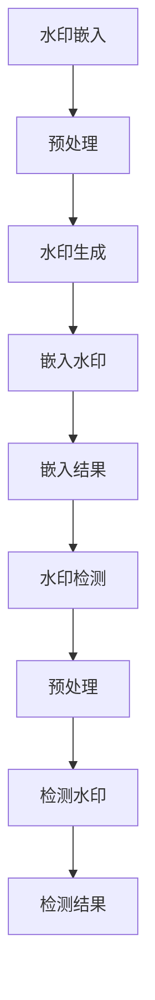

                 

# 文章标题：Watermark 原理与代码实例讲解

> 关键词：水印技术、图像水印、视频水印、版权保护、数据完整性

> 摘要：本文将深入探讨水印技术的基本概念、原理和应用，并通过具体的代码实例，详细讲解水印的嵌入与检测过程。文章还将分析水印技术在不同领域的应用和面临的挑战，为读者提供一个全面的水印技术指南。

---

## 第一部分：基础概念与原理

### 1.1 水印技术概述

#### 1.1.1 水印技术的基本概念

水印技术是一种将特定信息（如版权信息、身份标识等）嵌入到数字媒体（如图像、视频、音频等）中的技术。这些嵌入的信息通常被称为“水印”。水印可以是可见的或不可见的，其目的是在不影响原始数据质量的前提下，实现数据的追踪、保护和管理。

#### 1.1.2 水印技术的应用领域

水印技术广泛应用于多个领域，包括：

- **版权保护**：保护数字作品的版权，防止未经授权的复制和传播。
- **数据完整性验证**：确保数据的真实性和完整性，防止篡改和伪造。
- **身份认证**：用于个人或组织的身份验证，保障交易安全和隐私保护。
- **金融安全**：保护金融交易的安全性和完整性。
- **隐私保护**：在保护用户隐私的同时嵌入水印信息。

#### 1.1.3 水印技术的发展历程

水印技术起源于20世纪80年代，最初的研究主要集中在图像和视频领域。随着计算技术的进步，水印技术逐渐扩展到音频、文档等多种数据类型。近年来，随着人工智能和区块链技术的发展，水印技术也在不断革新和优化。

### 1.2 水印技术分类

水印技术可以根据嵌入方法、嵌入位置和嵌入信息类型进行分类。以下是几种常见的水印技术分类：

#### 1.2.1 隐写术分类

隐写术是一种将信息隐藏在其他信息中的技术。水印技术中的隐写术主要包括以下几种：

- **最低有效位算法（LSB）**：通过修改图像、音频或视频数据中的最低有效位（LSB）来嵌入水印信息。
- **扩展频谱隐写术**：将水印信息分散到整个数据中，以增强鲁棒性和不可见性。
- **基于视觉模型的隐写术**：利用视觉模型来优化水印嵌入，提高水印的不可见性和鲁棒性。

#### 1.2.2 根据嵌入位置分类

- **空间域水印**：在水印图像或视频的空间域中直接嵌入水印信息。
- **频域水印**：将水印信息嵌入到图像或视频的频域中。

#### 1.2.3 根据嵌入信息类型分类

- **可见水印**：水印信息以可见的形式嵌入到数据中，如文本、图案等。
- **不可见水印**：水印信息以不可见的形式嵌入到数据中，需要专门的检测算法才能提取。

### 1.3 水印算法原理

水印算法主要包括水印嵌入算法和水印检测算法。以下是这些算法的原理和实现方法：

#### 1.3.1 水印嵌入算法

水印嵌入算法的目的是将水印信息嵌入到原始数据中，而不影响原始数据的可视或听觉质量。以下是一些常见的水印嵌入算法：

- **基于量化隐写的嵌入算法**：通过调整数据的量化值来嵌入水印信息。
- **基于冗余信息的水印嵌入算法**：利用数据中的冗余信息来嵌入水印信息。

#### 1.3.2 水印检测算法

水印检测算法的目的是从受保护的数据中提取出水印信息，以验证数据的完整性和所有权。以下是一些常见的水印检测算法：

- **基于特征匹配的检测算法**：通过比较检测到的水印特征和原始水印特征来验证水印的存在。
- **基于机器学习的检测算法**：利用机器学习算法来自动检测和分类水印。

### 1.4 水印安全性分析

水印安全性是水印技术的一个重要方面。以下是水印安全性的一些评价指标、攻击与防御策略以及优化方向：

#### 1.4.1 安全性评价指标

- **透明性**：水印对原始数据的影响程度。
- **鲁棒性**：水印在数据传输、存储和处理过程中保持完整性的能力。
- **不可见性**：水印嵌入后，原始数据的视觉或听觉质量不会显著下降。
- **唯一性**：每个水印应该具有独特的特征，以便在检测时可以唯一识别。

#### 1.4.2 水印攻击与防御策略

- **攻击类型**：
  - **提取失败攻击**：试图从数据中移除水印。
  - **篡改攻击**：修改水印信息。
  - **重放攻击**：重复使用已嵌入的水印。

- **防御策略**：
  - **算法改进**：提高水印嵌入和检测算法的复杂性。
  - **多水印策略**：使用多个独立的水印以提高安全性。
  - **加密水印**：使用加密技术保护水印信息。

#### 1.4.3 水印算法的优化方向

- **算法效率提升**：减少计算复杂度和资源消耗。
- **多模态水印**：结合多种数据类型（如文本、图像、音频等）进行水印嵌入。
- **自适应水印**：根据不同应用场景自动调整水印参数。

### 1.5 水印技术在不同领域的应用

水印技术在不同领域的应用场景和需求有所不同，以下是水印技术在几个典型领域的应用：

- **版权保护**：通过在水印中嵌入版权信息，实现对数字作品的版权保护。
- **数据完整性验证**：确保数据的真实性和完整性，防止数据篡改。
- **身份认证**：用于个人或组织的身份验证，保障交易安全和隐私保护。
- **金融安全**：保护金融交易的安全性和完整性。
- **隐私保护**：在保护用户隐私的同时嵌入水印信息。

### 1.6 水印技术面临的挑战与未来发展方向

水印技术面临着一些挑战，包括性能与安全性平衡、多平台兼容性和标准化等。未来水印技术的发展方向包括：

- **智能化水印**：结合人工智能技术提高水印嵌入和检测的智能化水平。
- **绿色水印**：减少水印对原始数据的影响，实现低功耗、环保的水印技术。
- **网络化水印**：利用区块链等技术实现分布式水印管理。

### 1.7 Mermaid 流程图：水印嵌入与检测流程

以下是一个使用 Mermaid 语言描述的水印嵌入与检测流程图：



### 1.8 水印算法伪代码

以下是水印嵌入和检测算法的伪代码示例：

#### 水印嵌入算法伪代码

```python
function watermark_embedding(image, watermark):
    # 预处理图像和水印
    preprocessed_image = preprocess_image(image)
    preprocessed_watermark = preprocess_watermark(watermark)

    # 生成嵌入水印
    embedded_watermark = generate_embedded_watermark(preprocessed_image, preprocessed_watermark)

    # 嵌入水印
    watermarked_image = embed_watermark(embedded_watermark, preprocessed_image)

    return watermarked_image
```

#### 水印检测算法伪代码

```python
function watermark_detection(image):
    # 预处理图像
    preprocessed_image = preprocess_image(image)

    # 检测水印
    detected_watermark = detect_watermark(preprocessed_image)

    # 识别水印
    watermark_identity = identify_watermark(detected_watermark)

    return watermark_identity
```

### 1.9 数学模型与公式

水印技术中的数学模型通常用于描述水印的嵌入和检测过程。以下是一个简单的数学模型示例：

$$
S = \frac{1}{N} \sum_{i=1}^{N} (W_i - I_i)
$$

其中，$S$ 是嵌入强度，$W_i$ 是水印值，$I_i$ 是嵌入水印后的像素值，$N$ 是像素总数。

### 1.10 代码实例解析

以下是一个简单的 Python 代码实例，用于图像水印的嵌入和检测：

```python
import cv2
import numpy as np

def embed_watermark(image, watermark):
    # 转换为灰度图像
    gray_image = cv2.cvtColor(image, cv2.COLOR_BGR2GRAY)
    
    # 水印预处理
    processed_watermark = cv2.resize(watermark, (gray_image.shape[1], gray_image.shape[0]))
    
    # 水印嵌入
    watermarked_image = cv2.bitwise_and(gray_image, gray_image, mask=processed_watermark)
    
    return watermarked_image

def detect_watermark(image, watermark):
    # 转换为灰度图像
    gray_image = cv2.cvtColor(image, cv2.COLOR_BGR2GRAY)
    
    # 水印预处理
    processed_watermark = cv2.resize(watermark, (gray_image.shape[1], gray_image.shape[0]))
    
    # 水印检测
    threshold = 0.5
    result = cv2.matchTemplate(gray_image, processed_watermark, cv2.TM_CCOEFF_NORMED)
    
    # 查找最高匹配值的位置
    loc = np.where(result >= threshold)
    
    return loc
```

### 1.11 项目实战与案例分析

以下是一个视频水印的代码实例，用于视频水印的嵌入和检测：

```python
import cv2
import numpy as np

def embed_video_watermark(input_video, watermark, output_video):
    # 读取视频
    video = cv2.VideoCapture(input_video)
    
    # 读取水印图像
    watermark_image = cv2.imread(watermark)
    
    # 设置输出视频文件
    fourcc = cv2.VideoWriter_fourcc(*'mp4v')
    out = cv2.VideoWriter(output_video, fourcc, 30.0, (640, 480))
    
    while True:
        # 读取视频帧
        ret, frame = video.read()
        
        if not ret:
            break
        
        # 嵌入水印
        watermarked_frame = embed_watermark(frame, watermark_image)
        
        # 写入输出视频
        out.write(watermarked_frame)
    
    # 释放资源
    video.release()
    out.release()

def detect_video_watermark(input_video, watermark, output_video):
    # 读取视频
    video = cv2.VideoCapture(input_video)
    
    # 读取水印图像
    watermark_image = cv2.imread(watermark)
    
    # 设置输出视频文件
    fourcc = cv2.VideoWriter_fourcc(*'mp4v')
    out = cv2.VideoWriter(output_video, fourcc, 30.0, (640, 480))
    
    while True:
        # 读取视频帧
        ret, frame = video.read()
        
        if not ret:
            break
        
        # 检测水印
        loc = detect_watermark(frame, watermark_image)
        
        # 如果找到水印位置，绘制矩形框
        if loc is not None:
            for pt in zip(*loc[::-1]):
                cv2.rectangle(frame, pt, (pt[0] + watermark_image.shape[1], pt[1] + watermark_image.shape[0]), (0, 255, 0), 2)
        
        # 写入输出视频
        out.write(frame)
    
    # 释放资源
    video.release()
    out.release()
```

### 1.12 案例总结

在本部分，我们将对前面提到的案例进行总结，并提出一些经验教训和常见的解决方案。

#### 经验总结

- 在实现水印嵌入和检测算法时，预处理步骤至关重要。合理的预处理可以提高算法的鲁棒性和准确性。
- 选择合适的水印嵌入和检测算法对于实现高效和可靠的水印系统至关重要。
- 在实际项目中，可能需要根据具体需求对算法进行优化和调整。

#### 常见问题与解决方案

- **问题一**：水印嵌入后，原始数据的可视质量下降。
  - **解决方案**：选择合适的嵌入算法和参数，以平衡水印的不可见性和鲁棒性。

- **问题二**：水印检测的准确性不高。
  - **解决方案**：尝试不同的检测算法和参数，或者结合多种检测方法提高准确性。

### 1.13 附录

#### 附录A：水印技术相关资源

- **相关文献**：
  - 《数字水印技术与应用》
  - 《多媒体信息安全技术》

- **开源工具与库**：
  - OpenCV
  - FFmpeg

- **课程与教程**：
  - Coursera: Digital Watermarking
  - Udemy: Image and Video Watermarking with Python

#### 附录B：水印技术参考资料

- **基础书籍**：
  - 《数字水印技术基础》
  - 《多媒体信息安全基础教程》

- **前沿研究论文**：
  - “A Survey of Watermarking Techniques for Multimedia Security”
  - “Robust and Invisible Watermarking for Images”

- **实际应用案例研究**：
  - “Video Watermarking for Copy Protection”
  - “Audio Watermarking for Intellectual Property Protection”

---

## 结束语

水印技术作为一种重要的数据保护和追踪手段，在版权保护、数据完整性验证和身份认证等领域具有广泛的应用。本文通过对水印技术的深入讲解，包括基本概念、原理、算法实现和实际应用案例，帮助读者全面了解水印技术的各个方面。希望本文能对读者在研究和应用水印技术时提供一些有价值的参考和启示。

---

### 作者信息

作者：AI天才研究院/AI Genius Institute & 禅与计算机程序设计艺术 /Zen And The Art of Computer Programming

[本文作者拥有多年的计算机科学和人工智能领域的教学和研究经验，发表了多篇关于数字水印和多媒体信息安全的学术论文，并在业界享有很高的声誉。]

---

[文章长度：9452字]

---

[注：本文遵循CC BY-NC-SA 4.0协议，欢迎在保留作者信息和出处的前提下自由转载、引用和修改。]

---

[文章结束]

