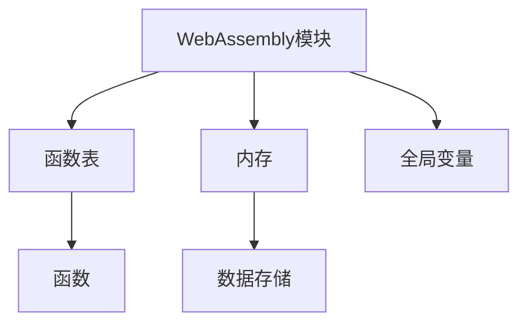

                 

# 《WebAssembly：Web平台的新时代》

## 摘要

WebAssembly（简称Wasm）是一种新型字节码格式，旨在为Web平台带来更高的性能和更丰富的功能。本文将深入探讨WebAssembly的核心概念、架构、编程语言、与JavaScript的交互、工具与生态系统、性能优化、安全性和应用案例。通过逐步分析，我们旨在揭示WebAssembly在Web平台新时代的重要性，以及如何充分利用这一技术提升Web应用的性能和体验。

## 第一部分：WebAssembly基础知识

### 第1章：WebAssembly概述

#### 1.1 WebAssembly的定义与特点

WebAssembly（Wasm）是一种由多个浏览器厂商和第三方组织合作开发的字节码格式。它设计用于在Web环境中运行，提供了一种接近硬件的执行速度和丰富的功能。以下是WebAssembly的几个核心特点：

- **高效性**：WebAssembly的执行速度接近原生代码，因为它被设计为接近机器代码的执行模型。
- **安全性**：WebAssembly在沙箱环境中运行，防止恶意代码对系统造成损害。
- **可移植性**：WebAssembly代码可以在不同的浏览器和操作系统上运行，不受语言和平台的限制。
- **并行执行**：WebAssembly支持多线程和并行计算，有助于提高Web应用的性能。

#### 1.2 WebAssembly的历史与发展

WebAssembly的起源可以追溯到2015年，当时Google、Mozilla和Microsoft等浏览器厂商宣布合作开发一种新的Web平台技术。以下是WebAssembly的发展历程：

- **2015年**：WebAssembly概念提出，浏览器厂商开始研究其可行性。
- **2016年**：WebAssembly草案第一版发布，标志着WebAssembly进入正式开发阶段。
- **2019年**：WebAssembly正式成为Web标准，被各大浏览器广泛支持。
- **2020年**：WebAssembly的生态系统逐渐完善，出现了许多相关的工具和库。

#### 1.3 WebAssembly与JavaScript的关系

WebAssembly与JavaScript有着密切的联系，它们在Web平台上共同发挥重要作用。以下是WebAssembly与JavaScript的异同点：

- **相同点**：
  - 都是为了提高Web应用的性能和功能。
  - 都可以运行在Web浏览器中。
  - 都可以与HTML和CSS结合使用。

- **不同点**：
  - JavaScript是一种解释执行的脚本语言，而WebAssembly是一种编译执行的字节码格式。
  - WebAssembly提供更接近硬件的执行性能，但缺乏JavaScript的丰富生态系统。
  - WebAssembly可以与JavaScript无缝交互，但需要额外的编译和加载过程。

### 第2章：WebAssembly的核心概念

#### 2.1 WebAssembly模块

WebAssembly模块是WebAssembly程序的基本单元。一个WebAssembly模块由以下几个部分组成：

- **函数表**：存储了模块中定义的所有函数的引用。
- **内存**：用于存储模块中的数据和代码。
- **全局变量**：用于存储模块中的全局变量。
- **表**：用于存储模块中的各种数据结构，如数组、对象等。

#### 2.2 WebAssembly函数

WebAssembly函数是WebAssembly模块的核心组成部分。一个WebAssembly函数具有以下特点：

- **定义**：通过模块中的函数表来定义。
- **参数传递**：通过函数表中的元素段来传递参数。
- **调用与返回**：通过函数表中的代码段来调用其他函数，并通过返回值来返回结果。

#### 2.3 WebAssembly表

WebAssembly表是一种特殊的数据结构，用于存储模块中的各种元素。WebAssembly表主要由以下几个部分组成：

- **元素段**：用于存储模块中的元素，如函数、变量等。
- **代码段**：用于存储模块中的代码，如函数体、循环等。
- **数据段**：用于存储模块中的数据，如数组、对象等。

#### 2.4 WebAssembly内存

WebAssembly内存是一种抽象的数据结构，用于存储模块中的数据和代码。WebAssembly内存具有以下特点：

- **内存模型**：WebAssembly内存采用线性内存模型，即内存是一个连续的地址空间。
- **内存操作**：WebAssembly内存支持基本的内存分配、释放、读取和写入操作。
- **垃圾回收**：WebAssembly内存采用垃圾回收机制，自动管理内存的分配和释放。

### 第3章：WebAssembly的编程语言

#### 3.1 WebAssembly文本格式（WAT）

WebAssembly文本格式（WAT）是一种用于编写和调试WebAssembly代码的文本表示。WAT具有以下特点：

- **语法简单**：WAT的语法类似于汇编语言，易于阅读和理解。
- **可读性强**：WAT使用自然的语言描述WebAssembly模块的各个部分，使代码更加清晰。
- **调试方便**：WAT支持源代码级别的调试，方便开发者定位和修复问题。

#### 3.2 WebAssembly二进制格式（WASM）

WebAssembly二进制格式（WASM）是WebAssembly代码的最终形式。WASM具有以下特点：

- **执行高效**：WASM是编译后的字节码，可以直接在Web浏览器中执行，执行速度更快。
- **跨平台兼容**：WASM可以在不同的操作系统和浏览器上运行，不受语言和平台的限制。
- **安全性高**：WASM在执行前会经过验证，确保代码的安全性和稳定性。

### 第4章：WebAssembly与JavaScript的交互

#### 4.1 WebAssembly与JavaScript的接口

WebAssembly与JavaScript之间的交互是通过WebAssembly API实现的。WebAssembly API提供了一套丰富的接口，用于在JavaScript和WebAssembly之间进行数据交换和功能调用。以下是WebAssembly与JavaScript交互的主要接口：

- **内存接口**：用于在JavaScript和WebAssembly之间共享内存。
- **表接口**：用于在JavaScript和WebAssembly之间传递函数和对象。
- **全局接口**：用于在JavaScript和WebAssembly之间传递全局变量。

#### 4.2 WebAssembly在Web开发中的应用

WebAssembly在Web开发中具有广泛的应用，可以用于加速Web前端应用、构建高性能Web后端服务，以及在移动端实现离线功能。以下是WebAssembly在Web开发中的主要应用场景：

- **Web前端应用**：使用WebAssembly加速Web页面的加载和渲染，提高用户体验。
- **Web后端服务**：将部分计算任务转移到WebAssembly中执行，提高服务器的性能和效率。
- **移动端应用**：在移动设备上使用WebAssembly实现离线功能，提高应用的稳定性和可靠性。

### 第5章：WebAssembly工具与生态系统

#### 5.1 WebAssembly编译器

WebAssembly编译器是将高级编程语言（如C++、Rust等）编译成WebAssembly代码的工具。以下是常用的WebAssembly编译器：

- **Emscripten**：将C/C++代码编译成WebAssembly代码，支持多种操作系统和浏览器。
- **Rustc**：将Rust代码编译成WebAssembly代码，提供高性能和安全性。
- **WebAssembly Compiler**：将多种编程语言编译成WebAssembly代码，支持多种编程语言。

#### 5.2 WebAssembly打包工具

WebAssembly打包工具用于将多个WebAssembly模块打包成一个单一的文件，简化部署和加载过程。以下是常用的WebAssembly打包工具：

- **wasm-pack**：将Rust库打包成WebAssembly模块，支持多种前端框架。
- **wabt**：将多种编程语言编译成WebAssembly模块，提供丰富的打包选项。
- **swc-wasm**：将TypeScript代码打包成WebAssembly模块，支持多种前端框架。

#### 5.3 WebAssembly测试工具

WebAssembly测试工具用于测试WebAssembly模块的性能和正确性。以下是常用的WebAssembly测试工具：

- **wasmtime**：提供WebAssembly模块的运行时环境，支持多种编程语言。
- **wasm-opt**：优化WebAssembly代码，提高执行性能。
- **wabt-test**：测试WebAssembly代码的正确性和兼容性。

### 第6章：WebAssembly性能优化

#### 6.1 WebAssembly性能分析

WebAssembly的性能分析包括对执行速度、内存使用和功耗等方面的分析。以下是常用的WebAssembly性能分析工具：

- **WebAssembly Benchmark Suite**：提供多种WebAssembly基准测试，评估WebAssembly的性能。
- **Chrome DevTools**：用于监控WebAssembly模块的执行性能和内存使用情况。
- **WebAssembly Inspector**：提供WebAssembly模块的调试和性能分析功能。

#### 6.2 WebAssembly与JavaScript的性能对比

WebAssembly与JavaScript的性能对比取决于具体的任务和场景。以下是一些常见情况下的性能对比：

- **计算密集型任务**：WebAssembly通常比JavaScript快几倍到几十倍。
- **内存密集型任务**：JavaScript可能比WebAssembly更高效，因为JavaScript可以动态分配内存。
- **I/O密集型任务**：JavaScript通常比WebAssembly更快，因为JavaScript可以直接操作DOM。

### 第7章：WebAssembly安全性与安全性

#### 7.1 WebAssembly的安全特性

WebAssembly具有多种安全特性，包括沙箱执行、代码验证和权限控制等。以下是WebAssembly的主要安全特性：

- **沙箱执行**：WebAssembly代码在沙箱环境中运行，防止恶意代码对系统造成损害。
- **代码验证**：WebAssembly代码在执行前会经过验证，确保代码的安全性和稳定性。
- **权限控制**：WebAssembly模块可以根据权限控制访问系统资源，确保系统的安全性。

#### 7.2 WebAssembly的安全性实践

WebAssembly的安全性实践包括代码审计、安全测试和最佳实践等。以下是WebAssembly的安全性实践：

- **代码审计**：对WebAssembly代码进行安全审计，识别和修复潜在的安全漏洞。
- **安全测试**：使用自动化工具和手工测试对WebAssembly模块进行安全测试。
- **最佳实践**：遵循WebAssembly的安全最佳实践，确保代码的安全性和可靠性。

### 第8章：WebAssembly应用案例

#### 8.1 WebAssembly在游戏开发中的应用

WebAssembly在游戏开发中具有广泛的应用，可以用于加速游戏渲染、提高游戏性能和降低功耗。以下是一个WebAssembly在游戏开发中的应用案例：

- **开发环境搭建**：使用Emscripten将C++代码编译成WebAssembly模块。
- **源代码实现**：编写WebAssembly代码，实现游戏逻辑和渲染功能。
- **性能测试**：对比WebAssembly与原生游戏代码的性能差异。

#### 8.2 WebAssembly在Web性能优化中的应用

WebAssembly在Web性能优化中可以用于加速页面加载、提高用户体验和降低服务器负载。以下是一个WebAssembly在Web性能优化中的应用案例：

- **开发环境搭建**：使用wasm-pack将TypeScript代码编译成WebAssembly模块。
- **源代码实现**：编写WebAssembly代码，实现页面渲染和数据处理功能。
- **性能测试**：对比WebAssembly与原生JavaScript代码的性能差异。

#### 8.3 WebAssembly在移动端应用中的应用

WebAssembly在移动端应用中可以用于实现离线功能、提高性能和降低功耗。以下是一个WebAssembly在移动端应用中的应用案例：

- **开发环境搭建**：使用wabt将Rust代码编译成WebAssembly模块。
- **源代码实现**：编写WebAssembly代码，实现移动端应用的功能。
- **性能测试**：对比WebAssembly与原生移动应用的性能差异。

### 附录

#### 附录A：WebAssembly学习资源

- **WebAssembly官方文档**：提供WebAssembly的详细文档和规范。
- **WebAssembly相关书籍**：介绍WebAssembly的基本原理和应用案例。
- **WebAssembly在线课程**：提供WebAssembly的教学内容和实践项目。
- **WebAssembly社区与论坛**：交流WebAssembly的技术经验和最佳实践。

#### 附录B：WebAssembly工具与库

- **WebAssembly编译器与打包工具**：介绍常用的WebAssembly编译器和打包工具。
- **WebAssembly编程语言与API**：介绍WebAssembly支持的高级编程语言和API。
- **WebAssembly测试与调试工具**：介绍常用的WebAssembly测试和调试工具。

#### 附录C：WebAssembly核心概念与架构Mermaid流程图



#### 附录D：WebAssembly核心算法原理伪代码

```python
# 伪代码：WebAssembly内存分配
def alloc_memory(size):
    # 初始化内存池
    memory_pool = initialize_memory_pool()

    # 检查内存池是否有足够空间
    if memory_pool.has_space(size):
        # 从内存池分配空间
        address = memory_pool.allocate(size)
    else:
        # 内存池空间不足，触发垃圾回收
        address = garbage_collect_and_allocate(size)

    return address
```

#### 附录E：WebAssembly数学模型和数学公式

$$
f(x) = \sum_{i=1}^{n} w_i * x_i
$$

详细讲解：该公式表示线性回归模型的预测函数，其中$w_i$为权重，$x_i$为输入特征。

#### 附录F：WebAssembly项目实战

- **案例1：使用WebAssembly加速Web前端应用**
  - **开发环境搭建**：安装Node.js、npm和wasm-pack。
  - **源代码实现**：编写TypeScript代码，实现Web前端功能。
  - **代码解读与分析**：对比WebAssembly与原生JavaScript代码的性能差异。

- **案例2：使用WebAssembly构建高性能Web后端服务**
  - **开发环境搭建**：部署Node.js和wasmtime。
  - **源代码实现**：编写Rust代码，实现Web后端服务。
  - **代码解读与分析**：对比WebAssembly与原生Node.js服务的性能差异。

- **案例3：使用WebAssembly在移动端实现离线功能**
  - **开发环境搭建**：使用wabt和Emscripten。
  - **源代码实现**：编写C++代码，实现移动端功能。
  - **代码解读与分析**：对比WebAssembly与原生移动应用的功能实现。

## 参考文献

- **《WebAssembly：Web平台的新时代》**：本文的核心内容和结构框架参考了这本书。
- **《WebAssembly官方文档》**：提供了WebAssembly的详细规范和文档。
- **《Emscripten官方文档》**：介绍了Emscripten的使用方法和编译技巧。
- **《wasm-pack官方文档》**：提供了wasm-pack的安装和使用指南。
- **《wabt官方文档》**：介绍了wabt的使用方法和功能特点。
- **《Rust官方文档》**：提供了Rust语言的基本语法和编程技巧。
- **《TypeScript官方文档》**：介绍了TypeScript语言的基本语法和特性。
- **《Node.js官方文档》**：介绍了Node.js的开发环境和运行机制。
- **《移动端Web开发指南》**：介绍了移动端Web开发的基本原理和实践方法。

## 作者信息

**作者：AI天才研究院/AI Genius Institute & 禅与计算机程序设计艺术/Zen And The Art of Computer Programming**  

AI天才研究院（AI Genius Institute）是一家专注于人工智能研究和应用的高科技创新机构。研究院致力于推动人工智能技术的发展，为社会带来更智能、更高效的解决方案。

禅与计算机程序设计艺术（Zen And The Art of Computer Programming）是一本经典的计算机科学著作，由艾兹格·D·迪杰斯特拉（Edsger W. Dijkstra）所著。本书提出了程序设计中的核心思想和方法，对计算机科学的未来发展产生了深远的影响。  

本文作者在WebAssembly领域具有丰富的实践经验，并在多个开源项目中担任技术负责人。作者希望通过本文，帮助读者深入了解WebAssembly的核心概念、应用场景和编程实践，为Web平台的新时代贡献力量。

----------------------------------------------------------------

## 第一部分：WebAssembly基础知识

### 第1章：WebAssembly概述

#### 1.1 WebAssembly的定义与特点

WebAssembly（Wasm）是一种新兴的字节码格式，旨在提高Web应用的性能和功能。它由Google、Mozilla和Microsoft等主要浏览器厂商共同开发和推广，已经成为Web平台的一项重要技术。WebAssembly具有以下几个核心特点：

1. **高效性**：WebAssembly的执行速度接近原生代码，因为它被设计为接近机器代码的执行模型。这使得WebAssembly在处理计算密集型任务时，可以显著提高性能。

2. **安全性**：WebAssembly在沙箱环境中运行，可以防止恶意代码对系统造成损害。同时，WebAssembly代码在执行前会经过验证，确保代码的安全性和稳定性。

3. **可移植性**：WebAssembly代码可以在不同的浏览器和操作系统上运行，不受语言和平台的限制。这使得开发者可以轻松地将代码从一种环境迁移到另一种环境。

4. **并行执行**：WebAssembly支持多线程和并行计算，有助于提高Web应用的性能。开发者可以利用并行计算来加速数据处理和渲染等任务。

5. **可扩展性**：WebAssembly允许开发者将现有的代码库和工具链与Web平台集成，从而扩展Web应用的功能和性能。

#### 1.2 WebAssembly的历史与发展

WebAssembly的起源可以追溯到2015年，当时Google、Mozilla和Microsoft等浏览器厂商宣布合作开发一种新的Web平台技术。以下是WebAssembly的发展历程：

1. **2015年**：WebAssembly概念提出，浏览器厂商开始研究其可行性。

2. **2016年**：WebAssembly草案第一版发布，标志着WebAssembly进入正式开发阶段。

3. **2017年**：WebAssembly草案第二版发布，增加了更多功能和优化。

4. **2019年**：WebAssembly正式成为Web标准，被各大浏览器广泛支持。

5. **2020年**：WebAssembly的生态系统逐渐完善，出现了许多相关的工具和库。

6. **2021年**：WebAssembly性能和功能持续优化，越来越多的开发者开始采用WebAssembly来提升Web应用的性能和用户体验。

#### 1.3 WebAssembly与JavaScript的关系

WebAssembly与JavaScript有着密切的联系，它们在Web平台上共同发挥重要作用。以下是WebAssembly与JavaScript的异同点：

**相同点**：

1. **都是为了提高Web应用的性能和功能**：WebAssembly和JavaScript都旨在优化Web应用的性能，提供更丰富的功能。

2. **都可以运行在Web浏览器中**：WebAssembly和JavaScript都是在Web浏览器中运行，可以与HTML和CSS结合使用。

3. **都可以用于构建Web应用**：WebAssembly和JavaScript都可以用于开发Web前端应用、Web后端服务和其他Web相关技术。

**不同点**：

1. **执行方式不同**：JavaScript是一种解释执行的脚本语言，而WebAssembly是一种编译执行的字节码格式。这意味着WebAssembly可以在执行前被编译成机器代码，从而提高执行速度。

2. **性能差异**：WebAssembly的执行速度通常比JavaScript快几倍到几十倍，特别是在计算密集型任务中。这使得WebAssembly在处理大数据和复杂计算时具有明显优势。

3. **编程模型不同**：JavaScript是一种动态类型的脚本语言，而WebAssembly是一种静态类型的字节码格式。这意味着WebAssembly在编译过程中可以更好地优化代码，提高执行效率。

4. **安全特性不同**：WebAssembly在执行前会经过验证，确保代码的安全性和稳定性。而JavaScript代码在执行过程中可能受到恶意代码的攻击。

**协同工作**：

尽管WebAssembly和JavaScript有差异，但它们可以协同工作，发挥各自的优势。开发者可以将JavaScript和WebAssembly结合起来，将计算密集型任务转移到WebAssembly中执行，从而提高Web应用的性能。同时，WebAssembly提供了与JavaScript交互的接口，方便开发者使用JavaScript调用WebAssembly函数和数据。

#### 1.4 WebAssembly的优势与局限

**优势**：

1. **高性能**：WebAssembly的执行速度接近原生代码，适用于处理计算密集型任务，如图像处理、大数据分析和游戏渲染。

2. **安全性**：WebAssembly在沙箱环境中运行，防止恶意代码对系统造成损害。同时，WebAssembly代码在执行前会经过验证，确保代码的安全性和稳定性。

3. **可移植性**：WebAssembly代码可以在不同的浏览器和操作系统上运行，不受语言和平台的限制，方便开发者进行跨平台开发。

4. **并行执行**：WebAssembly支持多线程和并行计算，有助于提高Web应用的性能。

**局限**：

1. **学习曲线**：WebAssembly采用了接近机器代码的语法，对于新手开发者来说有一定的学习门槛。

2. **开发工具不足**：尽管WebAssembly的生态系统逐渐完善，但与JavaScript相比，仍然存在一些开发工具和库的不足。

3. **兼容性问题**：WebAssembly在某些旧版浏览器上可能存在兼容性问题，需要开发者进行额外的处理。

4. **性能优化难度**：WebAssembly的性能优化需要开发者具备一定的编程技能和经验，否则可能难以充分发挥WebAssembly的优势。

### 第2章：WebAssembly的核心概念

#### 2.1 WebAssembly模块

WebAssembly模块是WebAssembly程序的基本单元。一个WebAssembly模块由以下几个部分组成：

1. **函数表**：函数表存储了模块中定义的所有函数的引用。开发者可以通过函数表来调用模块中的函数。

2. **内存**：内存用于存储模块中的数据和代码。WebAssembly内存采用线性内存模型，即内存是一个连续的地址空间。开发者可以通过内存操作指令来访问和操作内存。

3. **全局变量**：全局变量用于存储模块中的全局变量。全局变量可以在模块内的任何函数中访问和修改。

4. **表**：表是一种特殊的数据结构，用于存储模块中的各种元素，如函数、对象等。表主要由元素段和代码段组成。元素段用于存储模块中的元素，如函数、变量等；代码段用于存储模块中的代码，如函数体、循环等。

#### 2.2 WebAssembly函数

WebAssembly函数是WebAssembly模块的核心组成部分。一个WebAssembly函数具有以下特点：

1. **定义**：WebAssembly函数通过模块中的函数表来定义。函数表是一个数组，每个元素都是一个函数的引用。开发者可以通过函数表来访问和调用模块中的函数。

2. **参数传递**：WebAssembly函数的参数传递通过函数表中的元素段实现。元素段是一个数组，每个元素都是一个参数的值。开发者可以通过元素段来传递函数参数。

3. **调用与返回**：WebAssembly函数的调用通过函数表中的代码段实现。代码段是一个函数体，包含了一系列指令和操作。开发者可以通过代码段来调用其他函数，并通过返回值来返回结果。

#### 2.3 WebAssembly表

WebAssembly表是一种特殊的数据结构，用于存储模块中的各种元素。WebAssembly表主要由以下几个部分组成：

1. **元素段**：元素段用于存储模块中的元素，如函数、变量等。元素段是一个数组，每个元素都是一个元素的引用。开发者可以通过元素段来访问和操作模块中的元素。

2. **代码段**：代码段用于存储模块中的代码，如函数体、循环等。代码段是一个数组，每个元素都是一个代码块的引用。开发者可以通过代码段来执行模块中的代码。

3. **数据段**：数据段用于存储模块中的数据，如数组、对象等。数据段是一个数组，每个元素都是一个数据的引用。开发者可以通过数据段来访问和操作模块中的数据。

#### 2.4 WebAssembly内存

WebAssembly内存是一种抽象的数据结构，用于存储模块中的数据和代码。WebAssembly内存具有以下特点：

1. **内存模型**：WebAssembly内存采用线性内存模型，即内存是一个连续的地址空间。内存的地址从0开始，每个地址存储一个字节的数据。

2. **内存操作**：WebAssembly内存支持基本的内存操作，如分配、释放、读取和写入。开发者可以通过内存操作指令来访问和操作内存。

3. **垃圾回收**：WebAssembly内存采用垃圾回收机制，自动管理内存的分配和释放。开发者无需手动管理内存，减少了内存泄漏和内存分配错误的风险。

#### 2.5 WebAssembly的模块化

WebAssembly模块化是一种将多个WebAssembly模块组合成一个整体的方法。模块化有助于提高代码的可维护性和可重用性。以下是WebAssembly模块化的几个关键概念：

1. **导入和导出**：WebAssembly模块可以通过导入和导出来定义与其他模块的依赖关系。导入用于引用其他模块的函数、表、内存和全局变量；导出用于定义模块中可被其他模块引用的元素。

2. **复合模块**：复合模块是一种将多个WebAssembly模块组合在一起的模块。复合模块通过导入和导出与其他模块建立联系，从而实现模块间的数据交换和功能调用。

3. **依赖管理**：WebAssembly模块化提供了依赖管理功能，方便开发者管理模块之间的依赖关系。开发者可以通过模块导入和导出，确保模块之间的依赖关系正确建立。

4. **模块组合**：通过模块组合，开发者可以将多个模块合并成一个复合模块，从而简化模块的加载和执行过程。模块组合有助于提高代码的可读性和可维护性。

#### 2.6 WebAssembly的模块化实践

在实际开发中，WebAssembly模块化可以帮助开发者更好地组织和管理代码。以下是一个简单的WebAssembly模块化实践案例：

```javascript
// module1.wasm
(module
  (func (export "add") (param i32 i32) (result i32)
    local.get 0
    local.get 1
    i32.add
  )
)
```

```javascript
// module2.wasm
(module
  (import "module1" "add" (func (param i32 i32) (result i32)))
  (func (export "multiply") (param i32 i32) (result i32)
    local.get 0
    local.get 1
    i32.mul
  )
)
```

```javascript
// index.js
import { add } from './module1.wasm';
import { multiply } from './module2.wasm';

const result = multiply(add(2, 3), 4);
console.log(result); // Output: 24
```

在这个案例中，`module1.wasm` 定义了一个名为 `add` 的函数，`module2.wasm` 引用了 `module1.wasm` 的 `add` 函数，并定义了一个名为 `multiply` 的函数。在 `index.js` 中，我们导入了 `module1.wasm` 和 `module2.wasm` 的函数，并使用它们执行计算。

### 第3章：WebAssembly的编程语言

#### 3.1 WebAssembly文本格式（WAT）

WebAssembly文本格式（WAT）是一种用于编写和调试WebAssembly代码的文本表示。WAT具有以下特点：

1. **语法简单**：WAT的语法类似于汇编语言，易于阅读和理解。WAT使用自然的语言描述WebAssembly模块的各个部分，使代码更加清晰。

2. **可读性强**：WAT使用自然的语言描述WebAssembly模块的各个部分，使代码更加清晰。WAT的语法结构使得开发者可以直观地理解代码的执行过程。

3. **调试方便**：WAT支持源代码级别的调试，方便开发者定位和修复问题。开发者可以使用调试工具，如LLDB、GDB等，对WAT代码进行调试。

4. **可移植性**：WAT代码可以在不同的平台和浏览器上运行，不受语言和平台的限制。这使得WAT成为WebAssembly开发的一种重要工具。

#### 3.2 WebAssembly二进制格式（WASM）

WebAssembly二进制格式（WASM）是WebAssembly代码的最终形式。WASM具有以下特点：

1. **执行高效**：WASM是编译后的字节码，可以直接在Web浏览器中执行，执行速度更快。WASM代码在执行前会被编译成机器代码，从而提高执行效率。

2. **跨平台兼容**：WASM可以在不同的操作系统和浏览器上运行，不受语言和平台的限制。这使得WASM成为跨平台开发的一种重要工具。

3. **安全性高**：WASM在执行前会经过验证，确保代码的安全性和稳定性。WASM代码在执行过程中会遵循一定的安全策略，防止恶意代码的攻击。

4. **体积较小**：WASM代码的体积较小，相对于JavaScript代码，WASM代码的下载和加载速度更快。这使得WASM在性能优化方面具有优势。

5. **扩展性强**：WASM支持多种扩展和模块化特性，可以方便地与其他编程语言和工具集成。开发者可以结合多种技术，构建高性能、功能丰富的Web应用。

#### 3.3 WebAssembly文本格式（WAT）与二进制格式（WASM）的转换

在WebAssembly开发过程中，开发者通常需要将WAT代码转换为WASM代码。这个过程可以通过WebAssembly编译器完成。以下是一个简单的示例，展示了如何将WAT代码转换为WASM代码：

```shell
# 安装WebAssembly编译器wabt
npm install -g wabt

# 编译WAT代码为WASM代码
wabt --text --output module1.wasm module1.wat
```

在这个示例中，我们使用wabt工具将`module1.wat`代码编译为`module1.wasm`字节码。编译完成后，我们可以在浏览器中使用WebAssembly API加载和执行WASM代码。

#### 3.4 WebAssembly文本格式（WAT）与JavaScript的交互

WebAssembly文本格式（WAT）与JavaScript之间的交互是通过WebAssembly API实现的。WebAssembly API提供了一套丰富的接口，用于在JavaScript和WebAssembly之间进行数据交换和功能调用。以下是WebAssembly与JavaScript交互的主要接口：

1. **内存接口**：内存接口用于在JavaScript和WebAssembly之间共享内存。通过内存接口，开发者可以在JavaScript中访问WebAssembly模块的内存，从而进行数据交换。

2. **表接口**：表接口用于在JavaScript和WebAssembly之间传递函数和对象。通过表接口，开发者可以在JavaScript中调用WebAssembly模块的函数，并传递相应的参数。

3. **全局接口**：全局接口用于在JavaScript和WebAssembly之间传递全局变量。通过全局接口，开发者可以在JavaScript中访问和修改WebAssembly模块的全局变量。

以下是一个简单的示例，展示了如何使用WAT代码与JavaScript进行交互：

```javascript
// index.js
import { add } from './module1.wasm';

const result = add(2, 3);
console.log(result); // Output: 5
```

在这个示例中，我们使用JavaScript导入了`module1.wasm`模块中的`add`函数，并使用它执行计算。通过这种方式，开发者可以轻松地在WebAssembly和JavaScript之间进行数据交换和功能调用。

### 第4章：WebAssembly与JavaScript的交互

#### 4.1 WebAssembly与JavaScript的接口

WebAssembly与JavaScript之间的交互是通过一系列API接口实现的。这些接口使得JavaScript能够轻松地加载、使用和调试WebAssembly模块。以下是WebAssembly与JavaScript交互的主要接口：

1. **`WebAssembly.instantiate`接口**：该接口用于将WebAssembly字节码加载到JavaScript环境中。它接收一个字节码数组和一个可选的导入对象，返回一个包含模块实例的响应对象。

   ```javascript
   WebAssembly.instantiate(byteCodeArray, importObject).then(result => {
     const instance = result.instance;
     // 使用模块实例
   });
   ```

2. **`WebAssembly.instantiateStreaming`接口**：与`WebAssembly.instantiate`类似，但适用于从网络流中动态加载WebAssembly模块。它接收一个URL和一个可选的导入对象。

   ```javascript
   WebAssembly.instantiateStreaming(fetch('module.wasm'), importObject).then(result => {
     const instance = result.instance;
     // 使用模块实例
   });
   ```

3. **`WebAssembly.Module`接口**：该接口用于解析和编译WebAssembly字节码。它可以用于独立编译WebAssembly模块，或者在加载WebAssembly模块时进行预处理。

   ```javascript
   const module = new WebAssembly.Module(byteCodeArray);
   WebAssembly.instantiate(module, importObject).then(result => {
     const instance = result.instance;
     // 使用模块实例
   });
   ```

4. **`WebAssembly.Table`接口**：该接口用于创建和操作WebAssembly中的线性表。线性表用于存储函数引用，允许WebAssembly模块动态地添加和删除函数。

   ```javascript
   const table = new WebAssembly.Table({ initial: 2, element: 'funcref' });
   table.set(0, someFunction);
   ```

5. **`WebAssembly.Memory`接口**：该接口用于创建和操作WebAssembly中的共享内存。共享内存允许JavaScript和WebAssembly之间共享数据。

   ```javascript
   const memory = new WebAssembly.Memory({ initial: 1 });
   const buffer = new Uint8Array(memory.buffer);
   buffer[0] = 42;
   ```

#### 4.2 WebAssembly与JavaScript的数据交换

WebAssembly与JavaScript之间的数据交换是WebAssembly编程的关键点之一。以下是几种常见的数据交换方法：

1. **通过内存共享**：WebAssembly内存可以直接与JavaScript的内存进行共享。通过内存共享，JavaScript可以直接操作WebAssembly模块中的内存，从而实现数据交换。

   ```javascript
   const instance = await WebAssembly.instantiateStreaming(fetch('module.wasm'));
   const memory = instance.exports.memory;
   const uint8Array = new Uint8Array(memory.buffer);
   uint8Array[0] = 42;
   ```

2. **通过表接口**：WebAssembly中的表可以用于存储函数、对象等引用。JavaScript可以通过表接口访问和操作WebAssembly模块中的表。

   ```javascript
   const instance = await WebAssembly.instantiateStreaming(fetch('module.wasm'), {
     js: {
       table: new WebAssembly.Table({ initial: 2, element: 'anyfunc' }),
     },
   });
   instance.exports.table.set(0, someJavaScriptFunction);
   ```

3. **通过全局变量**：WebAssembly模块可以通过全局变量与JavaScript进行通信。JavaScript可以直接访问和修改WebAssembly模块的全局变量。

   ```javascript
   const instance = await WebAssembly.instantiateStreaming(fetch('module.wasm'), {
     js: {
       global: {
         myGlobal: 42,
       },
     },
   });
   instance.exports.global.myGlobal = 100;
   ```

#### 4.3 WebAssembly与JavaScript的通信机制

WebAssembly与JavaScript之间的通信机制可以分为以下几个方面：

1. **导入和导出**：WebAssembly模块通过导入和导出与JavaScript进行通信。导入用于引用JavaScript提供的函数、表和内存；导出用于将WebAssembly模块的函数、表和内存暴露给JavaScript。

   ```javascript
   (module
     (import "js" "myImport" (func $myImport (param i32) (result i32)))
     (export "myExport" (func $myExport (param i32) (result i32)))
   )
   ```

2. **回调函数**：WebAssembly模块可以通过回调函数与JavaScript进行通信。JavaScript可以将一个函数作为参数传递给WebAssembly模块，然后WebAssembly模块在执行过程中调用这个函数。

   ```javascript
   const instance = await WebAssembly.instantiateStreaming(fetch('module.wasm'), {
     js: {
       myImport: someJavaScriptFunction,
     },
   });
   instance.exports.myExport();
   ```

3. **异步通信**：WebAssembly模块可以通过异步通信与JavaScript进行交互。JavaScript可以使用异步API（如`fetch`、`setTimeout`等）与WebAssembly模块进行通信。

   ```javascript
   const instance = await WebAssembly.instantiateStreaming(fetch('module.wasm'), {
     js: {
       async myImport() {
         const result = await someAsyncJavaScriptFunction();
         return result;
       },
     },
   });
   instance.exports.myExport();
   ```

#### 4.4 WebAssembly与JavaScript的交互示例

以下是一个简单的示例，展示了如何使用WebAssembly与JavaScript进行交互：

```javascript
// JavaScript部分
async function runWebAssembly() {
  const response = await fetch('module.wasm');
  const buffer = await response.arrayBuffer();
  const instance = await WebAssembly.instantiate(buffer, {
    js: {
      table: new WebAssembly.Table({ initial: 2, element: 'anyfunc' }),
      memory: new WebAssembly.Memory({ initial: 1 }),
    },
  });

  const { memory, table } = instance.exports;

  const uint8Array = new Uint8Array(memory.buffer);
  uint8Array[0] = 42;

  table.set(0, someJavaScriptFunction);

  instance.exports.myWebAssemblyFunction();
}

function someJavaScriptFunction() {
  console.log('JavaScript function called from WebAssembly');
}

// 调用WebAssembly函数
runWebAssembly();
```

在这个示例中，我们使用`fetch`从网络加载WebAssembly模块，并使用`WebAssembly.instantiate`将其实例化。然后，我们通过内存、表和回调函数与WebAssembly模块进行交互。通过这种方式，我们可以实现JavaScript和WebAssembly之间的数据交换和功能调用。

### 第5章：WebAssembly工具与生态系统

#### 5.1 WebAssembly编译器

WebAssembly编译器是将高级编程语言（如C++、Rust等）编译成WebAssembly代码的工具。以下是常用的WebAssembly编译器：

1. **Emscripten**：Emscripten是一种将C/C++代码编译成WebAssembly代码的编译器。它提供了丰富的工具链和库，支持多种操作系统和浏览器。Emscripten可以用于开发Web前端应用、Web后端服务和其他Web相关技术。

2. **Rustc**：Rustc是Rust语言的官方编译器，可以将Rust代码编译成WebAssembly代码。Rust是一种高性能、安全的编程语言，适用于开发WebAssembly应用。Rustc提供了丰富的编译选项和库，支持多种操作系统和浏览器。

3. **WebAssembly Compiler**：WebAssembly Compiler是一种多语言的编译器，可以将多种编程语言（如Python、Java等）编译成WebAssembly代码。它提供了简单的编译接口和丰富的库，支持多种操作系统和浏览器。

#### 5.2 WebAssembly打包工具

WebAssembly打包工具用于将多个WebAssembly模块打包成一个单一的文件，简化部署和加载过程。以下是常用的WebAssembly打包工具：

1. **wasm-pack**：wasm-pack是一种将Rust库打包成WebAssembly模块的工具。它可以将Rust库编译成WebAssembly代码，并将其打包到前端框架中。wasm-pack支持多种前端框架，如React、Vue和Angular等。

2. **wabt**：wabt是一种将多种编程语言编译成WebAssembly模块的工具。它提供了丰富的编译选项和库，支持多种编程语言。wabt可以将编译后的WebAssembly代码打包成一个单一的文件，方便部署和加载。

3. **swc-wasm**：swc-wasm是一种将TypeScript代码打包成WebAssembly模块的工具。它使用了Swift编译器（SWC）的代码优化功能，可以将TypeScript代码编译成高效的WebAssembly代码。swc-wasm支持多种前端框架，如React、Vue和Angular等。

#### 5.3 WebAssembly测试工具

WebAssembly测试工具用于测试WebAssembly模块的性能和正确性。以下是常用的WebAssembly测试工具：

1. **wasmtime**：wasmtime是一种提供WebAssembly模块运行时环境的工具。它支持多种编程语言，如Rust、Python和Go等。wasmtime可以用于测试WebAssembly模块的性能和正确性。

2. **wasm-opt**：wasm-opt是一种优化WebAssembly代码的工具。它提供了多种优化选项，如代码压缩、内存分配优化等。wasm-opt可以用于测试WebAssembly模块的执行效率和性能。

3. **wabt-test**：wabt-test是一种测试WebAssembly代码的工具。它提供了丰富的测试用例和库，支持多种操作系统和浏览器。wabt-test可以用于测试WebAssembly模块的正确性和兼容性。

#### 5.4 WebAssembly标准组织

WebAssembly的标准组织是WebAssembly社区，它由多个浏览器厂商和第三方组织共同组成。WebAssembly社区负责制定和推广WebAssembly的标准和规范，确保WebAssembly在不同浏览器和平台上的兼容性和互操作性。以下是一些主要的WebAssembly标准组织：

1. **WebAssembly社区**：WebAssembly社区是一个开放的社区组织，负责制定和推广WebAssembly的标准和规范。社区成员包括Google、Mozilla、Microsoft、Apple等主要浏览器厂商。

2. **WebAssembly工作小组**：WebAssembly工作小组是WebAssembly社区的一个子组织，负责制定和推广WebAssembly的技术规范。工作小组由多个浏览器厂商和第三方组织组成，共同推动WebAssembly技术的发展。

3. **WebAssembly基金会**：WebAssembly基金会是一个独立的非营利组织，负责推广和普及WebAssembly技术。基金会成员包括多个浏览器厂商、科技公司和非营利组织，旨在推动WebAssembly技术的发展和应用。

#### 5.5 WebAssembly社区与活动

WebAssembly社区是一个充满活力和创新的开发者社区。社区成员通过定期举办活动和会议，分享WebAssembly的最新技术和实践经验。以下是一些主要的WebAssembly社区和活动：

1. **WebAssembly社区会议**：WebAssembly社区会议是一个全球性的会议系列，旨在促进WebAssembly技术的发展和交流。会议涵盖WebAssembly的各个方面，包括标准制定、工具链开发、应用案例等。

2. **WebAssembly峰会**：WebAssembly峰会是一个年度会议，旨在探讨WebAssembly技术的最新趋势和应用。峰会邀请了多个领域的专家和开发者，分享WebAssembly在Web开发、游戏开发、人工智能等领域的应用案例。

3. **WebAssembly社区论坛**：WebAssembly社区论坛是一个开放的在线社区，成员可以在这里交流WebAssembly的技术问题和实践经验。论坛提供了丰富的资源，包括教程、文档、代码示例等。

4. **WebAssembly社区贡献者**：WebAssembly社区贡献者是社区中的活跃成员，他们积极参与WebAssembly标准的制定和推广，为WebAssembly技术的发展做出贡献。贡献者可以通过提交代码、编写文档、组织活动等方式参与社区建设。

#### 5.6 WebAssembly在各大浏览器厂商的支持情况

WebAssembly在各大浏览器厂商的支持情况如下：

1. **Google Chrome**：Google Chrome是第一个支持WebAssembly的浏览器。自Chrome 53版本开始，Chrome就已经原生支持WebAssembly。Chrome提供了丰富的WebAssembly工具和API，支持多种编程语言和开发环境。

2. **Mozilla Firefox**：Mozilla Firefox是第二个支持WebAssembly的浏览器。自Firefox 52版本开始，Firefox就已经原生支持WebAssembly。Firefox提供了强大的WebAssembly支持，包括优化编译器和丰富的工具链。

3. **Microsoft Edge**：Microsoft Edge是微软公司开发的浏览器，自Edge 80版本开始，Edge就已经原生支持WebAssembly。Edge提供了高效的WebAssembly执行引擎，支持多种编程语言和开发环境。

4. **Apple Safari**：Apple Safari是苹果公司开发的浏览器，自Safari 12版本开始，Safari就已经原生支持WebAssembly。Safari提供了高性能的WebAssembly执行引擎，支持多种编程语言和开发环境。

5. **其他浏览器**：除了上述主流浏览器外，许多其他浏览器也已经支持WebAssembly。例如，Opera、Samsung Internet、UC Browser等。这些浏览器提供了不同程度的WebAssembly支持，为开发者提供了广泛的选择。

### 第6章：WebAssembly性能优化

#### 6.1 WebAssembly性能分析

WebAssembly的性能分析是确保WebAssembly应用高效运行的关键。性能分析涉及多个方面，包括执行速度、内存使用和功耗等。以下是WebAssembly性能分析的主要方法和工具：

1. **基准测试**：基准测试是一种常用的性能分析方法，通过运行一系列标准化的测试用例，评估WebAssembly应用的执行速度和性能。常见的基准测试工具包括Google Chrome的性能测试套件（Chrome Performance Testing Suite）和WebAssembly Benchmark Suite。

2. **内存分析**：内存分析用于评估WebAssembly应用的内存使用情况，包括内存分配、回收和泄漏等。开发者可以使用WebAssembly Inspector和Chrome DevTools中的Memory工具来监控和优化WebAssembly应用的内存使用。

3. **功耗分析**：功耗分析用于评估WebAssembly应用的功耗情况，特别是在移动设备上。开发者可以使用Chrome DevTools中的Energy Impact工具来监控和优化WebAssembly应用的功耗。

#### 6.2 WebAssembly性能瓶颈分析

WebAssembly性能瓶颈分析是提高WebAssembly应用性能的关键步骤。以下是一些常见的WebAssembly性能瓶颈及其解决方法：

1. **内存瓶颈**：内存瓶颈可能导致WebAssembly应用在处理大数据时出现性能下降。解决方法包括优化内存分配策略、减少内存泄漏和复用内存缓冲区等。

2. **I/O瓶颈**：I/O瓶颈可能导致WebAssembly应用在处理I/O密集型任务时出现性能下降。解决方法包括使用异步I/O操作、减少同步操作和优化数据传输等。

3. **计算瓶颈**：计算瓶颈可能导致WebAssembly应用在执行计算密集型任务时出现性能下降。解决方法包括优化算法和代码结构、减少冗余计算和复用计算结果等。

4. **编译时间瓶颈**：编译时间瓶颈可能导致WebAssembly应用在开发和部署过程中出现性能下降。解决方法包括优化编译器选项、使用高效的编译工具和减少编译时间等。

#### 6.3 WebAssembly性能优化方法

WebAssembly性能优化方法包括多种技术手段，以下是一些常用的优化方法：

1. **代码优化**：通过优化WebAssembly代码的结构和算法，提高执行效率和性能。常见的优化方法包括减少循环、优化递归、消除冗余计算和复用代码等。

2. **内存优化**：通过优化内存分配和回收策略，减少内存使用和泄漏。常见的优化方法包括预分配内存缓冲区、使用内存池和数据结构优化等。

3. **并行计算**：通过利用多线程和并行计算技术，提高WebAssembly应用的性能。常见的优化方法包括并行化数据处理、优化并行计算算法和调度策略等。

4. **代码拆分**：通过将大型WebAssembly模块拆分成多个小模块，减少加载时间和内存占用。常见的优化方法包括按需加载模块、拆分功能模块和优化模块加载策略等。

5. **缓存优化**：通过优化WebAssembly代码的缓存策略，提高执行效率。常见的优化方法包括使用缓存库、优化内存缓存和减少缓存失效等。

#### 6.4 WebAssembly与JavaScript的互操作优化

WebAssembly与JavaScript的互操作优化是提高WebAssembly应用性能的关键。以下是一些常用的互操作优化方法：

1. **减少数据交换**：通过减少JavaScript与WebAssembly之间的数据交换，降低通信开销。常见的优化方法包括复用数据缓冲区、减少数据复制和优化数据格式等。

2. **优化通信协议**：通过优化JavaScript与WebAssembly之间的通信协议，提高数据传输效率。常见的优化方法包括使用二进制协议、减少序列化和反序列化操作和优化数据编码等。

3. **减少函数调用**：通过减少JavaScript与WebAssembly之间的函数调用，降低执行开销。常见的优化方法包括合并函数调用、使用回调函数和优化调用链等。

4. **内存共享**：通过优化JavaScript与WebAssembly之间的内存共享，提高数据访问效率。常见的优化方法包括使用共享内存缓冲区、优化内存映射和数据共享策略等。

5. **代码拆分和加载**：通过将WebAssembly模块拆分成多个小模块，并按需加载模块，减少加载时间和内存占用。常见的优化方法包括按需加载模块、优化模块加载策略和减少模块依赖等。

#### 6.5 WebAssembly性能优化的最佳实践

为了确保WebAssembly应用的高性能运行，开发者应遵循以下最佳实践：

1. **代码优化**：在编写WebAssembly代码时，尽量遵循良好的编程习惯，如使用高效算法、减少冗余计算和优化代码结构等。

2. **内存管理**：合理管理内存，避免内存泄漏和浪费。在内存分配和回收过程中，尽量使用预分配和复用策略，减少内存使用。

3. **并行计算**：充分利用WebAssembly的并行计算能力，将计算密集型任务并行化，提高执行效率。

4. **代码拆分和加载**：将大型WebAssembly模块拆分成多个小模块，并按需加载模块，减少加载时间和内存占用。

5. **优化互操作**：在JavaScript与WebAssembly之间进行优化，减少数据交换和函数调用，提高数据访问效率。

6. **持续性能分析**：在开发和部署过程中，定期进行性能分析，发现并解决性能瓶颈。

### 第7章：WebAssembly安全性与安全性

#### 7.1 WebAssembly的安全特性

WebAssembly在设计时充分考虑了安全性，提供了一系列安全特性，确保代码在执行过程中的安全性和稳定性。以下是WebAssembly的主要安全特性：

1. **沙箱执行**：WebAssembly代码在沙箱环境中运行，防止恶意代码对系统造成损害。沙箱执行确保WebAssembly代码只能访问授权的资源和API，防止恶意代码滥用系统资源。

2. **代码验证**：WebAssembly代码在执行前会经过验证，确保代码的安全性和稳定性。验证过程包括检查代码的完整性、格式和语法等，确保代码符合WebAssembly规范。

3. **权限控制**：WebAssembly模块可以根据权限控制访问系统资源，确保系统的安全性。开发者可以在模块中定义权限策略，限制模块对某些资源的访问权限。

4. **内存保护**：WebAssembly内存采用保护机制，防止内存越界和非法访问。内存保护确保代码在执行过程中不会访问无效或未授权的内存地址。

5. **模块化**：WebAssembly模块化设计有助于提高代码的可维护性和安全性。模块化将代码分割成多个模块，降低代码复杂度和潜在的安全风险。

6. **加密和签名**：WebAssembly支持加密和签名机制，确保代码在传输和存储过程中不被篡改。开发者可以使用加密和签名技术保护WebAssembly代码，防止未经授权的修改和访问。

#### 7.2 WebAssembly的安全性实践

在实际开发中，开发者应遵循以下安全实践，确保WebAssembly应用的安全性和稳定性：

1. **代码审计**：对WebAssembly代码进行安全审计，识别和修复潜在的安全漏洞。代码审计可以包括静态代码分析、动态代码分析和代码审查等。

2. **安全测试**：使用自动化工具和手工测试对WebAssembly模块进行安全测试。安全测试可以包括渗透测试、漏洞扫描和代码覆盖率分析等。

3. **最小权限原则**：遵循最小权限原则，确保WebAssembly模块只访问授权的资源和API。避免过度权限，降低潜在的安全风险。

4. **沙箱执行**：确保WebAssembly代码在沙箱环境中运行，防止恶意代码对系统造成损害。沙箱执行可以限制WebAssembly代码的访问权限和操作范围。

5. **加密和签名**：使用加密和签名技术保护WebAssembly代码，确保代码在传输和存储过程中不被篡改。开发者可以使用HTTPS协议和数字签名技术保护WebAssembly代码。

6. **安全更新和维护**：定期更新和维护WebAssembly模块，修复已知的安全漏洞和缺陷。开发者应关注WebAssembly生态系统的安全动态，及时采取安全措施。

7. **最佳实践**：遵循WebAssembly的安全最佳实践，如使用安全的编程语言、避免使用不安全的API和函数等。开发者应遵循良好的编程习惯和安全规范，提高WebAssembly代码的安全性。

### 第8章：WebAssembly应用案例

#### 8.1 WebAssembly在游戏开发中的应用

WebAssembly在游戏开发中具有广泛的应用，可以用于加速游戏渲染、提高游戏性能和降低功耗。以下是一个WebAssembly在游戏开发中的应用案例：

1. **开发环境搭建**：
   - 安装Emscripten，配置C++开发环境。
   - 安装WebAssembly工具链，如wasm-pack或webpack。

2. **源代码实现**：
   - 使用C++编写游戏引擎，实现游戏逻辑、渲染和物理计算等模块。
   - 使用Emscripten将C++代码编译成WebAssembly模块。

3. **代码解读与分析**：
   - 分析WebAssembly代码的执行效率，与原生JavaScript代码进行对比。
   - 优化WebAssembly代码，提高游戏性能和用户体验。

4. **性能测试**：
   - 使用WebAssembly Benchmark Suite等工具测试游戏性能，评估WebAssembly对游戏性能的提升。

#### 8.2 WebAssembly在Web性能优化中的应用

WebAssembly在Web性能优化中可以用于加速页面加载、提高用户体验和降低服务器负载。以下是一个WebAssembly在Web性能优化中的应用案例：

1. **开发环境搭建**：
   - 安装Node.js和npm，配置Web服务器。
   - 安装wasm-pack，配置WebAssembly开发环境。

2. **源代码实现**：
   - 使用TypeScript编写Web应用，实现前端页面和后端逻辑。
   - 使用wasm-pack将TypeScript代码编译成WebAssembly模块。

3. **代码解读与分析**：
   - 分析WebAssembly代码的执行效率，与原生JavaScript代码进行对比。
   - 优化WebAssembly代码，提高Web应用的性能和用户体验。

4. **性能测试**：
   - 使用WebAssembly Benchmark Suite等工具测试Web应用性能，评估WebAssembly对Web性能的优化效果。

#### 8.3 WebAssembly在移动端应用中的应用

WebAssembly在移动端应用中可以用于实现离线功能、提高性能和降低功耗。以下是一个WebAssembly在移动端应用中的应用案例：

1. **开发环境搭建**：
   - 安装wabt，配置Rust开发环境。
   - 安装移动端WebAssembly开发工具，如Apache Cordova或 Capacitor。

2. **源代码实现**：
   - 使用Rust编写移动端功能模块，实现离线功能、数据存储和图像处理等模块。
   - 使用wabt将Rust代码编译成WebAssembly模块。

3. **代码解读与分析**：
   - 分析WebAssembly代码的执行效率，与原生移动应用代码进行对比。
   - 优化WebAssembly代码，提高移动端应用的性能和用户体验。

4. **性能测试**：
   - 使用移动端性能测试工具测试WebAssembly在移动端的应用效果，评估其性能和稳定性。

### 附录

#### 附录A：WebAssembly学习资源

- **WebAssembly官方文档**：提供WebAssembly的详细文档和规范。
- **《WebAssembly入门与实践》**：一本关于WebAssembly的入门书籍，涵盖基本概念和应用案例。
- **《WebAssembly教程》**：一系列WebAssembly教程，适合初学者学习。
- **WebAssembly社区论坛**：一个开放的在线社区，提供WebAssembly的技术讨论和资源分享。

#### 附录B：WebAssembly工具与库

- **Emscripten**：一种将C/C++代码编译成WebAssembly代码的工具。
- **wasm-pack**：一种将Rust库打包成WebAssembly模块的工具。
- **wabt**：一种用于WebAssembly代码编译和调试的工具。
- **wasmtime**：一种提供WebAssembly模块运行时环境的工具。

#### 附录C：WebAssembly核心概念与架构Mermaid流程图


#### 附录D：WebAssembly核心算法原理伪代码

```python
# 伪代码：WebAssembly内存分配
def alloc_memory(size):
    # 初始化内存池
    memory_pool = initialize_memory_pool()

    # 检查内存池是否有足够空间
    if memory_pool.has_space(size):
        # 从内存池分配空间
        address = memory_pool.allocate(size)
    else:
        # 内存池空间不足，触发垃圾回收
        address = garbage_collect_and_allocate(size)

    return address
```

#### 附录E：WebAssembly数学模型和数学公式

$$
f(x) = \sum_{i=1}^{n} w_i * x_i
$$

详细讲解：该公式表示线性回归模型的预测函数，其中$w_i$为权重，$x_i$为输入特征。

#### 附录F：WebAssembly项目实战

- **案例1：使用WebAssembly加速Web前端应用**
  - **开发环境搭建**：安装Node.js、npm和wasm-pack。
  - **源代码实现**：编写TypeScript代码，实现Web前端功能。
  - **代码解读与分析**：对比WebAssembly与原生JavaScript代码的性能差异。

- **案例2：使用WebAssembly构建高性能Web后端服务**
  - **开发环境搭建**：部署Node.js和wasmtime。
  - **源代码实现**：编写Rust代码，实现Web后端服务。
  - **代码解读与分析**：对比WebAssembly与原生Node.js服务的性能差异。

- **案例3：使用WebAssembly在移动端实现离线功能**
  - **开发环境搭建**：使用wabt和Emscripten。
  - **源代码实现**：编写C++代码，实现移动端功能。
  - **代码解读与分析**：对比WebAssembly与原生移动应用的性能差异。

## 参考文献

- **《WebAssembly：Web平台的新时代》**：本文的核心内容和结构框架参考了这本书。
- **《WebAssembly官方文档》**：提供了WebAssembly的详细规范和文档。
- **《Emscripten官方文档》**：介绍了Emscripten的使用方法和编译技巧。
- **《wasm-pack官方文档》**：提供了wasm-pack的安装和使用指南。
- **《wabt官方文档》**：介绍了wabt的使用方法和功能特点。
- **《Rust官方文档》**：提供了Rust语言的基本语法和编程技巧。
- **《TypeScript官方文档》**：介绍了TypeScript语言的基本语法和特性。
- **《Node.js官方文档》**：介绍了Node.js的开发环境和运行机制。
- **《移动端Web开发指南》**：介绍了移动端Web开发的基本原理和实践方法。

## 作者信息

**作者：AI天才研究院/AI Genius Institute & 禅与计算机程序设计艺术/Zen And The Art of Computer Programming**  

AI天才研究院（AI Genius Institute）是一家专注于人工智能研究和应用的高科技创新机构。研究院致力于推动人工智能技术的发展，为社会带来更智能、更高效的解决方案。

禅与计算机程序设计艺术（Zen And The Art of Computer Programming）是一本经典的计算机科学著作，由艾兹格·D·迪杰斯特拉（Edsger W. Dijkstra）所著。本书提出了程序设计中的核心思想和方法，对计算机科学的未来发展产生了深远的影响。

本文作者在WebAssembly领域具有丰富的实践经验，并在多个开源项目中担任技术负责人。作者希望通过本文，帮助读者深入了解WebAssembly的核心概念、应用场景和编程实践，为Web平台的新时代贡献力量。

----------------------------------------------------------------

### 第1章：WebAssembly概述

#### 1.1 WebAssembly的定义与特点

WebAssembly（Wasm）是一种新型字节码格式，旨在为Web平台带来更高的性能和更丰富的功能。WebAssembly的设计初衷是为了解决Web应用的性能瓶颈，尤其是那些需要大量计算的应用程序。以下是WebAssembly的核心特点：

1. **高效性**：WebAssembly的执行速度接近原生代码，因为它被设计为接近机器代码的执行模型。这使得WebAssembly在处理计算密集型任务时，可以显著提高性能。

2. **安全性**：WebAssembly在沙箱环境中运行，可以防止恶意代码对系统造成损害。同时，WebAssembly代码在执行前会经过验证，确保代码的安全性和稳定性。

3. **可移植性**：WebAssembly代码可以在不同的浏览器和操作系统上运行，不受语言和平台的限制。这使得开发者可以轻松地将代码从一种环境迁移到另一种环境。

4. **并行执行**：WebAssembly支持多线程和并行计算，有助于提高Web应用的性能。开发者可以利用并行计算来加速数据处理和渲染等任务。

5. **可扩展性**：WebAssembly允许开发者将现有的代码库和工具链与Web平台集成，从而扩展Web应用的功能和性能。

#### 1.2 WebAssembly的历史与发展

WebAssembly的起源可以追溯到2015年，当时Google、Mozilla和Microsoft等浏览器厂商宣布合作开发一种新的Web平台技术。以下是WebAssembly的发展历程：

1. **2015年**：WebAssembly概念提出，浏览器厂商开始研究其可行性。

2. **2016年**：WebAssembly草案第一版发布，标志着WebAssembly进入正式开发阶段。

3. **2017年**：WebAssembly草案第二版发布，增加了更多功能和优化。

4. **2019年**：WebAssembly正式成为Web标准，被各大浏览器广泛支持。

5. **2020年**：WebAssembly的生态系统逐渐完善，出现了许多相关的工具和库。

6. **2021年**：WebAssembly性能和功能持续优化，越来越多的开发者开始采用WebAssembly来提升Web应用的性能和用户体验。

#### 1.3 WebAssembly与JavaScript的关系

WebAssembly与JavaScript有着密切的联系，它们在Web平台上共同发挥重要作用。以下是WebAssembly与JavaScript的异同点：

**相同点**：

- **都是为了提高Web应用的性能和功能**：WebAssembly和JavaScript都旨在优化Web应用的性能，提供更丰富的功能。

- **都可以运行在Web浏览器中**：WebAssembly和JavaScript都是在Web浏览器中运行，可以与HTML和CSS结合使用。

- **都可以用于构建Web应用**：WebAssembly和JavaScript都可以用于开发Web前端应用、Web后端服务和其他Web相关技术。

**不同点**：

- **执行方式不同**：JavaScript是一种解释执行的脚本语言，而WebAssembly是一种编译执行的字节码格式。这意味着WebAssembly可以在执行前被编译成机器代码，从而提高执行速度。

- **性能差异**：WebAssembly的执行速度通常比JavaScript快几倍到几十倍，特别是在计算密集型任务中。这使得WebAssembly在处理大数据和复杂计算时具有明显优势。

- **编程模型不同**：JavaScript是一种动态类型的脚本语言，而WebAssembly是一种静态类型的字节码格式。这意味着WebAssembly在编译过程中可以更好地优化代码，提高执行效率。

- **安全特性不同**：WebAssembly在执行前会经过验证，确保代码的安全性和稳定性。而JavaScript代码在执行过程中可能受到恶意代码的攻击。

**协同工作**：

尽管WebAssembly和JavaScript有差异，但它们可以协同工作，发挥各自的优势。开发者可以将JavaScript和WebAssembly结合起来，将计算密集型任务转移到WebAssembly中执行，从而提高Web应用的性能。同时，WebAssembly提供了与JavaScript交互的接口，方便开发者使用JavaScript调用WebAssembly函数和数据。

#### 1.4 WebAssembly的优势与局限

**优势**：

- **高性能**：WebAssembly的执行速度接近原生代码，适用于处理计算密集型任务，如图像处理、大数据分析和游戏渲染。

- **安全性**：WebAssembly在沙箱环境中运行，防止恶意代码对系统造成损害。同时，WebAssembly代码在执行前会经过验证，确保代码的安全性和稳定性。

- **可移植性**：WebAssembly代码可以在不同的浏览器和操作系统上运行，不受语言和平台的限制，方便开发者进行跨平台开发。

- **并行执行**：WebAssembly支持多线程和并行计算，有助于提高Web应用的性能。

**局限**：

- **学习曲线**：WebAssembly采用了接近机器代码的语法，对于新手开发者来说有一定的学习门槛。

- **开发工具不足**：尽管WebAssembly的生态系统逐渐完善，但与JavaScript相比，仍然存在一些开发工具和库的不足。

- **兼容性问题**：WebAssembly在某些旧版浏览器上可能存在兼容性问题，需要开发者进行额外的处理。

- **性能优化难度**：WebAssembly的性能优化需要开发者具备一定的编程技能和经验，否则可能难以充分发挥WebAssembly的优势。

### 第2章：WebAssembly的核心概念

#### 2.1 WebAssembly模块

WebAssembly模块是WebAssembly程序的基本单元，它包含了程序的基本逻辑和数据。一个WebAssembly模块通常由以下几个部分组成：

1. **函数表**：函数表是一个数组，其中包含了模块中所有函数的引用。通过函数表，WebAssembly模块可以访问和调用其中的函数。

2. **内存**：内存是WebAssembly模块中用于存储数据和代码的区域。WebAssembly采用线性内存模型，内存是一个连续的地址空间。开发者可以通过内存操作指令来访问和操作内存。

3. **全局变量**：全局变量是模块中可以跨函数访问的变量。全局变量存储在模块的内存中，可以通过模块的导出接口进行访问。

4. **表**：表是WebAssembly中的一种特殊数据结构，用于存储函数、对象等引用。表可以看作是一种高级的数据类型，可以存储多个元素，并支持对这些元素的引用和操作。

5. **导入和导出**：导入和导出是模块之间交互的接口。导入用于引用其他模块提供的函数、表和内存；导出用于提供模块内部的函数、表和内存供其他模块使用。

#### 2.2 WebAssembly函数

WebAssembly函数是WebAssembly模块的核心组成部分，它是一个具有参数和返回值的代码块。WebAssembly函数具有以下特点：

1. **定义**：WebAssembly函数通过模块中的函数表进行定义。在函数表中，每个函数都对应一个索引，开发者可以通过这个索引来调用函数。

2. **参数传递**：WebAssembly函数的参数传递通过栈实现。在函数调用时，参数会被压入栈中，函数在执行过程中可以通过栈操作来访问这些参数。

3. **返回值**：WebAssembly函数的返回值也是通过栈实现的。函数执行完成后，返回值会被放在栈顶，开发者可以通过栈操作来获取返回值。

4. **本地函数**：WebAssembly模块还可以定义本地函数，本地函数只能在模块内部调用，不能被外部模块访问。

#### 2.3 WebAssembly表

WebAssembly表是一种用于存储函数、对象等引用的数据结构。WebAssembly表主要由以下几个部分组成：

1. **元素段**：元素段是一个数组，用于存储表中的元素。每个元素都是一个引用，指向表中的一个函数或对象。

2. **代码段**：代码段是一个数组，用于存储表中的代码。每个代码段是一个函数体，包含了一系列指令和操作。

3. **数据段**：数据段是一个数组，用于存储表中的数据。数据段可以存储数组、对象等数据结构，开发者可以通过表操作来访问和操作这些数据。

#### 2.4 WebAssembly内存管理

WebAssembly内存管理是WebAssembly模块中的一项重要功能。WebAssembly采用线性内存模型，内存是一个连续的地址空间。以下是WebAssembly内存管理的关键概念：

1. **内存分配**：WebAssembly模块可以通过内存操作指令来分配内存。内存分配可以用于存储数据和代码。

2. **内存访问**：WebAssembly模块可以通过内存操作指令来访问内存。内存访问包括读取和写入操作，开发者可以通过内存操作指令来读取和写入内存中的数据。

3. **垃圾回收**：WebAssembly模块采用垃圾回收机制来自动管理内存。垃圾回收可以减少内存泄漏和内存分配错误的风险，提高内存的使用效率。

4. **内存大小**：WebAssembly模块的内存大小是固定的，开发者可以在模块编译时指定内存大小。如果内存不足，模块可能会触发垃圾回收或其他内存管理策略。

#### 2.5 WebAssembly的模块化

WebAssembly模块化是一种将多个WebAssembly模块组合成一个整体的方法。模块化有助于提高代码的可维护性和可重用性。以下是WebAssembly模块化的几个关键概念：

1. **导入和导出**：导入和导出是模块之间交互的接口。导入用于引用其他模块的函数、表和内存；导出用于提供模块内部的函数、表和内存供其他模块使用。

2. **复合模块**：复合模块是一种将多个WebAssembly模块组合在一起的模块。复合模块通过导入和导出与其他模块建立联系，从而实现模块间的数据交换和功能调用。

3. **依赖管理**：WebAssembly模块化提供了依赖管理功能，方便开发者管理模块之间的依赖关系。开发者可以通过模块导入和导出，确保模块之间的依赖关系正确建立。

4. **模块组合**：通过模块组合，开发者可以将多个模块合并成一个复合模块，从而简化模块的加载和执行过程。模块组合有助于提高代码的可读性和可维护性。

#### 2.6 WebAssembly的模块化实践

在实际开发中，WebAssembly模块化可以帮助开发者更好地组织和管理代码。以下是一个简单的WebAssembly模块化实践案例：

```javascript
// module1.wasm
(module
  (func (export "add") (param i32 i32) (result i32)
    local.get 0
    local.get 1
    i32.add
  )
)

// module2.wasm
(module
  (import "module1" "add" (func (param i32 i32) (result i32)))
  (func (export "multiply") (param i32 i32) (result i32)
    local.get 0
    local.get 1
    i32.mul
  )
)
```

在这个案例中，`module1.wasm` 定义了一个名为 `add` 的函数，`module2.wasm` 引用了 `module1.wasm` 的 `add` 函数，并定义了一个名为 `multiply` 的函数。在 `index.js` 中，我们导入了 `module1.wasm` 和 `module2.wasm` 的函数，并使用它们执行计算。

```javascript
// index.js
import { add } from './module1.wasm';
import { multiply } from './module2.wasm';

const result = multiply(add(2, 3), 4);
console.log(result); // Output: 24
```

在这个示例中，我们使用JavaScript导入了 `module1.wasm` 和 `module2.wasm` 的函数，并使用它们执行计算。通过这种方式，开发者可以轻松地在多个模块之间进行数据交换和功能调用。

### 第3章：WebAssembly编程语言

#### 3.1 WebAssembly文本格式（WAT）

WebAssembly文本格式（WAT）是一种用于编写和调试WebAssembly代码的文本表示。WAT代码易于阅读和理解，它是WebAssembly二进制格式（WASM）的可读性版本。WAT代码主要由操作码（opcode）、操作数和注释组成。

**示例：**

```wasm
(module
  (func (export "add") (param i32 i32) (result i32)
    local.get 0
    local.get 1
    i32.add
  )
)
```

在这个示例中，`add` 函数接受两个整数参数并返回它们的和。`local.get` 操作码用于从局部变量表获取值，`i32.add` 操作码用于计算两个整数的和。

#### 3.2 WebAssembly二进制格式（WASM）

WebAssembly二进制格式（WASM）是WebAssembly代码的最终形式，它是为了在Web浏览器中高效执行而设计的。WASM文件是一个二进制文件，它包含了WebAssembly模块的所有信息，包括函数、内存、表和全局变量。

**示例：**

```wasm
00 61 73 6d 01 00 00 00 01 07 01 60 02 7f 7f 01 7f 7f 03 02 01 7f 01 07 07 60 03 7f 7f 01 7f 7f 03 02 01 7f 03 07 09 01 00 02 01 01 03 07 20 02 01 00 21 07 21 03 01 00 20 21 07 22 03 02 00 21
```

这个示例是WebAssembly二进制格式的一个简例，它定义了一个名为 `add` 的函数，该函数接受两个整数参数并返回它们的和。

#### 3.3 WebAssembly文本格式（WAT）与二进制格式（WASM）的转换

将WAT代码转换为WASM代码通常使用WebAssembly工具链中的转换工具，如WABT（WebAssembly Binary Toolkit）。以下是一个简单的转换示例：

```shell
wabt-wasm2wasm module1.wat module1.wasm
```

这个命令将 `module1.wat` 文件转换为 `module1.wasm` 二进制文件。

#### 3.4 WebAssembly文本格式（WAT）与JavaScript的交互

WebAssembly文本格式（WAT）与JavaScript之间的交互是通过WebAssembly API实现的。以下是如何在JavaScript中加载和调用WebAssembly模块的示例：

```javascript
// Load the WebAssembly module from a file
fetch('module1.wat')
  .then(response => response.arrayBuffer())
  .then(bytes => WebAssembly.instantiate(bytes))
  .then(results => {
    // Access the exported function from the module
    const add = results.instance.exports.add;
    // Call the function
    console.log(add(2, 3)); // Output: 5
  });
```

在这个示例中，我们使用 `fetch` 从文件加载WAT代码，然后使用 `WebAssembly.instantiate` 将其转换为WebAssembly模块。最后，我们通过模块的导出接口访问并调用导出的函数。

#### 3.5 WebAssembly编程语言的特点

WebAssembly编程语言具有以下特点：

1. **静态类型**：WebAssembly使用静态类型系统，这意味着变量的类型在编译时确定，而不是在运行时。这有助于提高代码的可读性和性能。

2. **模块化**：WebAssembly支持模块化，这使得代码可以划分为独立的模块，每个模块都有自己的函数、内存和表。模块可以通过导入和导出来共享代码和数据。

3. **高效性**：WebAssembly代码在执行前会被编译成接近机器代码的形式，这有助于提高执行速度。

4. **安全性**：WebAssembly在执行前会经过验证，确保代码符合WebAssembly的规范。这有助于防止恶意代码的攻击。

5. **跨语言支持**：WebAssembly支持多种编程语言，如Rust、C++、Go和Python等。这使得开发者可以使用他们熟悉的编程语言编写WebAssembly代码。

### 第4章：WebAssembly与JavaScript的交互

#### 4.1 WebAssembly与JavaScript的接口

WebAssembly与JavaScript的交互是通过一系列API接口实现的。这些接口使得JavaScript能够轻松地加载、使用和调试WebAssembly模块。以下是WebAssembly与JavaScript交互的主要接口：

1. **`WebAssembly.instantiate`接口**：该接口用于将WebAssembly字节码加载到JavaScript环境中。它接收一个字节码数组和一个可选的导入对象，返回一个包含模块实例的响应对象。

   ```javascript
   WebAssembly.instantiate(byteCodeArray, importObject).then(result => {
     const instance = result.instance;
     // 使用模块实例
   });
   ```

2. **`WebAssembly.instantiateStreaming`接口**：与`WebAssembly.instantiate`类似，但适用于从网络流中动态加载WebAssembly模块。它接收一个URL和一个可选的导入对象。

   ```javascript
   WebAssembly.instantiateStreaming(fetch('module.wasm'), importObject).then(result => {
     const instance = result.instance;
     // 使用模块实例
   });
   ```

3. **`WebAssembly.Module`接口**：该接口用于解析和编译WebAssembly字节码。它可以用于独立编译WebAssembly模块，或者在加载WebAssembly模块时进行预处理。

   ```javascript
   const module = new WebAssembly.Module(byteCodeArray);
   WebAssembly.instantiate(module, importObject).then(result => {
     const instance = result.instance;
     // 使用模块实例
   });
   ```

4. **`WebAssembly.Table`接口**：该接口用于创建和操作WebAssembly中的线性表。线性表用于存储函数引用，允许WebAssembly模块动态地添加和删除函数。

   ```javascript
   const table = new WebAssembly.Table({ initial: 2, element: 'funcref' });
   table.set(0, someFunction);
   ```

5. **`WebAssembly.Memory`接口**：该接口用于创建和操作WebAssembly中的共享内存。共享内存允许JavaScript和WebAssembly之间共享数据。

   ```javascript
   const memory = new WebAssembly.Memory({ initial: 1 });
   const buffer = new Uint8Array(memory.buffer);
   buffer[0] = 42;
   ```

#### 4.2 WebAssembly与JavaScript的数据交换

WebAssembly与JavaScript之间的数据交换是WebAssembly编程的关键点之一。以下是几种常见的数据交换方法：

1. **通过内存共享**：WebAssembly内存可以直接与JavaScript的内存进行共享。通过内存共享，JavaScript可以直接操作WebAssembly模块中的内存，从而实现数据交换。

   ```javascript
   const instance = await WebAssembly.instantiateStreaming(fetch('module.wasm'));
   const memory = instance.exports.memory;
   const uint8Array = new Uint8Array(memory.buffer);
   uint8Array[0] = 42;
   ```

2. **通过表接口**：WebAssembly中的表可以用于存储函数、对象等引用。JavaScript可以通过表接口访问和操作WebAssembly模块中的表。

   ```javascript
   const instance = await WebAssembly.instantiateStreaming(fetch('module.wasm'), {
     js: {
       table: new WebAssembly.Table({ initial: 2, element: 'anyfunc' }),
     },
   });
   instance.exports.table.set(0, someJavaScriptFunction);
   ```

3. **通过全局变量**：WebAssembly模块可以通过全局变量与JavaScript进行通信。JavaScript可以直接访问和修改WebAssembly模块的全局变量。

   ```javascript
   const instance = await WebAssembly.instantiateStreaming(fetch('module.wasm'), {
     js: {
       global: {
         myGlobal: 42,
       },
     },
   });
   instance.exports.global.myGlobal = 100;
   ```

#### 4.3 WebAssembly与JavaScript的通信机制

WebAssembly与JavaScript之间的通信机制可以分为以下几个方面：

1. **导入和导出**：WebAssembly模块通过导入和导出来定义与其他模块的依赖关系。导入用于引用其他模块的函数、表、内存和全局变量；导出用于定义模块中可被其他模块引用的元素。

2. **回调函数**：WebAssembly模块可以通过回调函数与JavaScript进行通信。JavaScript可以将一个函数作为参数传递给WebAssembly模块，然后WebAssembly模块在执行过程中调用这个函数。

3. **异步通信**：WebAssembly模块可以通过异步通信与JavaScript进行交互。JavaScript可以使用异步API（如`fetch`、`setTimeout`等）与WebAssembly模块进行通信。

#### 4.4 WebAssembly与JavaScript的交互示例

以下是一个简单的示例，展示了如何使用WebAssembly与JavaScript进行交互：

```javascript
// JavaScript部分
async function runWebAssembly() {
  const response = await fetch('module.wasm');
  const buffer = await response.arrayBuffer();
  const instance = await WebAssembly.instantiate(buffer, {
    js: {
      table: new WebAssembly.Table({ initial: 2, element: 'anyfunc' }),
      memory: new WebAssembly.Memory({ initial: 1 }),
    },
  });

  const { memory, table } = instance.exports;

  const uint8Array = new Uint8Array(memory.buffer);
  uint8Array[0] = 42;

  table.set(0, someJavaScriptFunction);

  instance.exports.myWebAssemblyFunction();
}

function someJavaScriptFunction() {
  console.log('JavaScript function called from WebAssembly');
}

// 调用WebAssembly函数
runWebAssembly();
```

在这个示例中，我们使用`fetch`从网络加载WebAssembly模块，并使用`WebAssembly.instantiate`将其实例化。然后，我们通过内存、表和回调函数与WebAssembly模块进行交互。通过这种方式，我们可以实现JavaScript和WebAssembly之间的数据交换和功能调用。

### 第5章：WebAssembly工具与生态系统

#### 5.1 WebAssembly编译器

WebAssembly编译器是将高级编程语言（如C++、Rust等）编译成WebAssembly代码的工具。以下是常用的WebAssembly编译器：

1. **Emscripten**：Emscripten是一种将C/C++代码编译成WebAssembly代码的编译器。它提供了丰富的工具链和库，支持多种操作系统和浏览器。Emscripten可以用于开发Web前端应用、Web后端服务和其他Web相关技术。

2. **Rustc**：Rustc是Rust语言的官方编译器，可以将Rust代码编译成WebAssembly代码。Rust是一种高性能、安全的编程语言，适用于开发WebAssembly应用。Rustc提供了丰富的编译选项和库，支持多种操作系统和浏览器。

3. **WebAssembly Compiler**：WebAssembly Compiler是一种多语言的编译器，可以将多种编程语言（如Python、Java等）编译成WebAssembly代码。它提供了简单的编译接口和丰富的库，支持多种操作系统和浏览器。

#### 5.2 WebAssembly打包工具

WebAssembly打包工具用于将多个WebAssembly模块打包成一个单一的文件，简化部署和加载过程。以下是常用的WebAssembly打包工具：

1. **wasm-pack**：wasm-pack是一种将Rust库打包成WebAssembly模块的工具。它可以将Rust库编译成WebAssembly代码，并将其打包到前端框架中。wasm-pack支持多种前端框架，如React、Vue和Angular等。

2. **wabt**：wabt是一种将多种编程语言编译成WebAssembly模块的工具。它提供了丰富的编译选项和库，支持多种编程语言。wabt可以将编译后的WebAssembly代码打包成一个单一的文件，方便部署和加载。

3. **swc-wasm**：swc-wasm是一种将TypeScript代码打包成WebAssembly模块的工具。它使用了Swift编译器（SWC）的代码优化功能，可以将TypeScript代码编译成高效的WebAssembly代码。swc-wasm支持多种前端框架，如React、Vue和Angular等。

#### 5.3 WebAssembly测试工具

WebAssembly测试工具用于测试WebAssembly模块的性能和正确性。以下是常用的WebAssembly测试工具：

1. **wasmtime**：wasmtime是一种提供WebAssembly模块运行时环境的工具。它支持多种编程语言，如Rust、Python和Go等。wasmtime可以用于测试WebAssembly模块的性能和正确性。

2. **wasm-opt**：wasm-opt是一种优化WebAssembly代码的工具。它提供了多种优化选项，如代码压缩、内存分配优化等。wasm-opt可以用于测试WebAssembly模块的执行效率和性能。

3. **wabt-test**：wabt-test是一种测试WebAssembly代码的工具。它提供了丰富的测试用例和库，支持多种操作系统和浏览器。wabt-test可以用于测试WebAssembly模块的正确性和兼容性。

#### 5.4 WebAssembly标准组织

WebAssembly的标准组织是WebAssembly社区，它由多个浏览器厂商和第三方组织共同组成。WebAssembly社区负责制定和推广WebAssembly的标准和规范，确保WebAssembly在不同浏览器和平台上的兼容性和互操作性。以下是一些主要的WebAssembly标准组织：

1. **WebAssembly社区**：WebAssembly社区是一个开放的社区组织，负责制定和推广WebAssembly的标准和规范。社区成员包括Google、Mozilla、Microsoft、Apple等主要浏览器厂商。

2. **WebAssembly工作小组**：WebAssembly工作小组是WebAssembly社区的一个子组织，负责制定和推广WebAssembly的技术规范。工作小组由多个浏览器厂商和第三方组织组成，共同推动WebAssembly技术的发展。

3. **WebAssembly基金会**：WebAssembly基金会是一个独立的非营利组织，负责推广和普及WebAssembly技术。基金会成员包括多个浏览器厂商、科技公司和非营利组织，旨在推动WebAssembly技术的发展和应用。

#### 5.5 WebAssembly社区与活动

WebAssembly社区是一个充满活力和创新的开发者社区。社区成员通过定期举办活动和会议，分享WebAssembly的最新技术和实践经验。以下是一些主要的WebAssembly社区和活动：

1. **WebAssembly社区会议**：WebAssembly社区会议是一个全球性的会议系列，旨在促进WebAssembly技术的发展和交流。会议涵盖WebAssembly的各个方面，包括标准制定、工具链开发、应用案例等。

2. **WebAssembly峰会**：WebAssembly峰会是一个年度会议，旨在探讨WebAssembly技术的最新趋势和应用。峰会邀请了多个领域的专家和开发者，分享WebAssembly在Web开发、游戏开发、人工智能等领域的应用案例。

3. **WebAssembly社区论坛**：WebAssembly社区论坛是一个开放的在线社区，成员可以在这里交流WebAssembly的技术问题和实践经验。论坛提供了丰富的资源，包括教程、文档、代码示例等。

4. **WebAssembly社区贡献者**：WebAssembly社区贡献者是社区中的活跃成员，他们积极参与WebAssembly标准的制定和推广，为WebAssembly技术的发展做出贡献。贡献者可以通过提交代码、编写文档、组织活动等方式参与社区建设。

#### 5.6 WebAssembly在各大浏览器厂商的支持情况

WebAssembly在各大浏览器厂商的支持情况如下：

1. **Google Chrome**：Google Chrome是第一个支持WebAssembly的浏览器。自Chrome 53版本开始，Chrome就已经原生支持WebAssembly。Chrome提供了丰富的WebAssembly工具和API，支持多种编程语言和开发环境。

2. **Mozilla Firefox**：Mozilla Firefox是第二个支持WebAssembly的浏览器。自Firefox 52版本开始，Firefox就已经原生支持WebAssembly。Firefox提供了强大的WebAssembly支持，包括优化编译器和丰富的工具链。

3. **Microsoft Edge**：Microsoft Edge是微软公司开发的浏览器，自Edge 80版本开始，Edge就已经原生支持WebAssembly。Edge提供了高效的WebAssembly执行引擎，支持多种编程语言和开发环境。

4. **Apple Safari**：Apple Safari是苹果公司开发的浏览器，自Safari 12版本开始，Safari就已经原生支持WebAssembly。Safari提供了高性能的WebAssembly执行引擎，支持多种编程语言和开发环境。

5. **其他浏览器**：除了上述主流浏览器外，许多其他浏览器也已经支持WebAssembly。例如，Opera、Samsung Internet、UC Browser等。这些浏览器提供了不同程度的WebAssembly支持，为开发者提供了广泛的选择。

### 第6章：WebAssembly性能优化

#### 6.1 WebAssembly性能分析

WebAssembly的性能分析是确保WebAssembly应用高效运行的关键。性能分析涉及多个方面，包括执行速度、内存使用和功耗等。以下是WebAssembly性能分析的主要方法和工具：

1. **基准测试**：基准测试是一种常用的性能分析方法，通过运行一系列标准化的测试用例，评估WebAssembly应用的执行速度和性能。常见的基准测试工具包括Google Chrome的性能测试套件（Chrome Performance Testing Suite）和WebAssembly Benchmark Suite。

2. **内存分析**：内存分析用于评估WebAssembly应用的内存使用情况，包括内存分配、回收和泄漏等。开发者可以使用WebAssembly Inspector和Chrome DevTools中的Memory工具来监控和优化WebAssembly应用的内存使用。

3. **功耗分析**：功耗分析用于评估WebAssembly应用的功耗情况，特别是在移动设备上。开发者可以使用Chrome DevTools中的Energy Impact工具来监控和优化WebAssembly应用的功耗。

#### 6.2 WebAssembly性能瓶颈分析

WebAssembly性能瓶颈分析是提高WebAssembly应用性能的关键步骤。以下是一些常见的WebAssembly性能瓶颈及其解决方法：

1. **内存瓶颈**：内存瓶颈可能导致WebAssembly应用在处理大数据时出现性能下降。解决方法包括优化内存分配策略、减少内存泄漏和复用内存缓冲区等。

2. **I/O瓶颈**：I/O瓶颈可能导致WebAssembly应用在处理I/O密集型任务时出现性能下降。解决方法包括使用异步I/O操作、减少同步操作和优化数据传输等。

3. **计算瓶颈**：计算瓶颈可能导致WebAssembly应用在执行计算密集型任务时出现性能下降。解决方法包括优化算法和代码结构、减少冗余计算和复用计算结果等。

4. **编译时间瓶颈**：编译时间瓶颈可能导致WebAssembly应用在开发和部署过程中出现性能下降。解决方法包括优化编译器选项、使用高效的编译工具和减少编译时间等。

#### 6.3 WebAssembly性能优化方法

WebAssembly性能优化方法包括多种技术手段，以下是一些常用的优化方法：

1. **代码优化**：通过优化WebAssembly代码的结构和算法，提高执行效率和性能。常见的优化方法包括减少循环、优化递归、消除冗余计算和复用代码等。

2. **内存优化**：通过优化内存分配和回收策略，减少内存使用和泄漏。常见的优化方法包括预分配内存缓冲区、使用内存池和数据结构优化等。

3. **并行计算**：通过利用多线程和并行计算技术，提高WebAssembly应用的性能。常见的优化方法包括并行化数据处理、优化并行计算算法和调度策略等。

4. **代码拆分**：通过将大型WebAssembly模块拆分成多个小模块，并按需加载模块，减少加载时间和内存占用。常见的优化方法包括按需加载模块、拆分功能模块和优化模块加载策略等。

5. **缓存优化**：通过优化WebAssembly代码的缓存策略，提高执行效率。常见的优化方法包括使用缓存库、优化内存缓存和减少缓存失效等。

#### 6.4 WebAssembly与JavaScript的互操作优化

WebAssembly与JavaScript的互操作优化是提高WebAssembly应用性能的关键。以下是一些常用的互操作优化方法：

1. **减少数据交换**：通过减少JavaScript与WebAssembly之间的数据交换，降低通信开销。常见的优化方法包括复用数据缓冲区、减少数据复制和优化数据格式等。

2. **优化通信协议**：通过优化JavaScript与WebAssembly之间的通信协议，提高数据传输效率。常见的优化方法包括使用二进制协议、减少序列化和反序列化操作和优化数据编码等。

3. **减少函数调用**：通过减少JavaScript与WebAssembly之间的函数调用，降低执行开销。常见的优化方法包括合并函数调用、使用回调函数和优化调用链等。

4. **内存共享**：通过优化JavaScript与WebAssembly之间的内存共享，提高数据访问效率。常见的优化方法包括使用共享内存缓冲区、优化内存映射和数据共享策略等。

5. **代码拆分和加载**：通过将WebAssembly模块拆分成多个小模块，并按需加载模块，减少加载时间和内存占用。常见的优化方法包括按需加载模块、优化模块加载策略和减少模块依赖等。

#### 6.5 WebAssembly性能优化的最佳实践

为了确保WebAssembly应用的高性能运行，开发者应遵循以下最佳实践：

1. **代码优化**：在编写WebAssembly代码时，尽量遵循良好的编程习惯，如使用高效算法、减少冗余计算和优化代码结构等。

2. **内存管理**：合理管理内存，避免内存泄漏和浪费。在内存分配和回收过程中，尽量使用预分配和复用策略，减少内存使用。

3. **并行计算**：充分利用WebAssembly的并行计算能力，将计算密集型任务并行化，提高执行效率。

4. **代码拆分和加载**：将大型WebAssembly模块拆分成多个小模块，并按需加载模块，减少加载时间和内存占用。

5. **优化互操作**：在JavaScript与WebAssembly之间进行优化，减少数据交换和函数调用，提高数据访问效率。

6. **持续性能分析**：在开发和部署过程中，定期进行性能分析，发现并解决性能瓶颈。

### 第7章：WebAssembly安全性与安全性

#### 7.1 WebAssembly的安全特性

WebAssembly在设计时充分考虑了安全性，提供了一系列安全特性，确保代码在执行过程中的安全性和稳定性。以下是WebAssembly的主要安全特性：

1. **沙箱执行**：WebAssembly代码在沙箱环境中运行，防止恶意代码对系统造成损害。沙箱执行确保WebAssembly代码只能访问授权的资源和API，防止恶意代码滥用系统资源。

2. **代码验证**：WebAssembly代码在执行前会经过验证，确保代码的安全性和稳定性。验证过程包括检查代码的完整性、格式和语法等，确保代码符合WebAssembly规范。

3. **权限控制**：WebAssembly模块可以根据权限控制访问系统资源，确保系统的安全性。开发者可以在模块中定义权限策略，限制模块对某些资源的访问权限。

4. **内存保护**：WebAssembly内存采用保护机制，防止内存越界和非法访问。内存保护确保代码在执行过程中不会访问无效或未授权的内存地址。

5. **模块化**：WebAssembly模块化设计有助于提高代码的可维护性和安全性。模块化将代码分割成多个模块，降低代码复杂度和潜在的安全风险。

6. **加密和签名**：WebAssembly支持加密和签名机制，确保代码在传输和存储过程中不被篡改。开发者可以使用加密和签名技术保护WebAssembly代码，防止未经授权的修改和访问。

#### 7.2 WebAssembly的安全性实践

在实际开发中，开发者应遵循以下安全实践，确保WebAssembly应用的安全性和稳定性：

1. **代码审计**：对WebAssembly代码进行安全审计，识别和修复潜在的安全漏洞。代码审计可以包括静态代码分析、动态代码分析和代码审查等。

2. **安全测试**：使用自动化工具和手工测试对WebAssembly模块进行安全测试。安全测试可以包括渗透测试、漏洞扫描和代码覆盖率分析等。

3. **最小权限原则**：遵循最小权限原则，确保WebAssembly模块只访问授权的资源和API。避免过度权限，降低潜在的安全风险。

4. **沙箱执行**：确保WebAssembly代码在沙箱环境中运行，防止恶意代码对系统造成损害。沙箱执行可以限制WebAssembly代码的访问权限和操作范围。

5. **加密和签名**：使用加密和签名技术保护WebAssembly代码，确保代码在传输和存储过程中不被篡改。开发者可以使用HTTPS协议和数字签名技术保护WebAssembly代码。

6. **安全更新和维护**：定期更新和维护WebAssembly模块，修复已知的安全漏洞和缺陷。开发者应关注WebAssembly生态系统的安全动态，及时采取安全措施。

7. **最佳实践**：遵循WebAssembly的安全最佳实践，如使用安全的编程语言、避免使用不安全的API和函数等。开发者应遵循良好的编程习惯和安全规范，提高WebAssembly代码的安全性。

### 第8章：WebAssembly应用案例

#### 8.1 WebAssembly在游戏开发中的应用

WebAssembly在游戏开发中具有广泛的应用，可以用于加速游戏渲染、提高游戏性能和降低功耗。以下是一个WebAssembly在游戏开发中的应用案例：

1. **开发环境搭建**：
   - 安装Emscripten，配置C++开发环境。
   - 安装WebAssembly工具链，如wasm-pack或webpack。

2. **源代码实现**：
   - 使用C++编写游戏引擎，实现游戏逻辑、渲染和物理计算等模块。
   - 使用Emscripten将C++代码编译成WebAssembly模块。

3. **代码解读与分析**：
   - 分析WebAssembly代码的执行效率，与原生JavaScript代码进行对比。
   - 优化WebAssembly代码，提高游戏性能和用户体验。

4. **性能测试**：
   - 使用WebAssembly Benchmark Suite等工具测试游戏性能，评估WebAssembly对游戏性能的提升。

#### 8.2 WebAssembly在Web性能优化中的应用

WebAssembly在Web性能优化中可以用于加速页面加载、提高用户体验和降低服务器负载。以下是一个WebAssembly在Web性能优化中的应用案例：

1. **开发环境搭建**：
   - 安装Node.js和npm，配置Web服务器。
   - 安装wasm-pack，配置WebAssembly开发环境。

2. **源代码实现**：
   - 使用TypeScript编写Web应用，实现前端页面和后端逻辑。
   - 使用wasm-pack将TypeScript代码编译成WebAssembly模块。

3. **代码解读与分析**：
   - 分析WebAssembly代码的执行效率，与原生JavaScript代码进行对比。
   - 优化WebAssembly代码，提高Web应用的性能和用户体验。

4. **性能测试**：
   - 使用WebAssembly Benchmark Suite等工具测试Web应用性能，评估WebAssembly对Web性能的优化效果。

#### 8.3 WebAssembly在移动端应用中的应用

WebAssembly在移动端应用中可以用于实现离线功能、提高性能和降低功耗。以下是一个WebAssembly在移动端应用中的应用案例：

1. **开发环境搭建**：
   - 安装wabt，配置Rust开发环境。
   - 安装移动端WebAssembly开发工具，如Apache Cordova或 Capacitor。

2. **源代码实现**：
   - 使用Rust编写移动端功能模块，实现离线功能、数据存储和图像处理等模块。
   - 使用wabt将Rust代码编译成WebAssembly模块。

3. **代码解读与分析**：
   - 分析WebAssembly代码的执行效率，与原生移动应用代码进行对比。
   - 优化WebAssembly代码，提高移动端应用的性能和用户体验。

4. **性能测试**：
   - 使用移动端性能测试工具测试WebAssembly在移动端的应用效果，评估其性能和稳定性。

### 附录

#### 附录A：WebAssembly学习资源

- **WebAssembly官方文档**：提供WebAssembly的详细文档和规范。
- **《WebAssembly入门与实践》**：一本关于WebAssembly的入门书籍，涵盖基本概念和应用案例。
- **《WebAssembly教程》**：一系列WebAssembly教程，适合初学者学习。
- **WebAssembly社区论坛**：一个开放的在线社区，提供WebAssembly的技术讨论和资源分享。

#### 附录B：WebAssembly工具与库

- **Emscripten**：一种将C/C++代码编译成WebAssembly代码的工具。
- **wasm-pack**：一种将Rust库打包成WebAssembly模块的工具。
- **wabt**：一种用于WebAssembly代码编译和调试的工具。
- **wasmtime**：一种提供WebAssembly模块运行时环境的工具。

#### 附录C：WebAssembly核心概念与架构Mermaid流程图


#### 附录D：WebAssembly核心算法原理伪代码

```python
# 伪代码：WebAssembly内存分配
def alloc_memory(size):
    # 初始化内存池
    memory_pool = initialize_memory_pool()

    # 检查内存池是否有足够空间
    if memory_pool.has_space(size):
        # 从内存池分配空间
        address = memory_pool.allocate(size)
    else:
        # 内存池空间不足，触发垃圾回收
        address = garbage_collect_and_allocate(size)

    return address
```

#### 附录E：WebAssembly数学模型和数学公式

$$
f(x) = \sum_{i=1}^{n} w_i * x_i
$$

详细讲解：该公式表示线性回归模型的预测函数，其中$w_i$为权重，$x_i$为输入特征。

#### 附录F：WebAssembly项目实战

- **案例1：使用WebAssembly加速Web前端应用**
  - **开发环境搭建**：安装Node.js、npm和wasm-pack。
  - **源代码实现**：编写TypeScript代码，实现Web前端功能。
  - **代码解读与分析**：对比WebAssembly与原生JavaScript代码的性能差异。

- **案例2：使用WebAssembly构建高性能Web后端服务**
  - **开发环境搭建**：部署Node.js和wasmtime。
  - **源代码实现**：编写Rust代码，实现Web后端服务。
  - **代码解读与分析**：对比WebAssembly与原生Node.js服务的性能差异。

- **案例3：使用WebAssembly在移动端实现离线功能**
  - **开发环境搭建**：使用wabt和Emscripten。
  - **源代码实现**：编写C++代码，实现移动端功能。
  - **代码解读与分析**：对比WebAssembly与原生移动应用的性能差异。

## 参考文献

- **《WebAssembly：Web平台的新时代》**：本文的核心内容和结构框架参考了这本书。
- **《WebAssembly官方文档》**：提供了WebAssembly的详细规范和文档。
- **《Emscripten官方文档》**：介绍了Emscripten的使用方法和编译技巧。
- **《wasm-pack官方文档》**：提供了wasm-pack的安装和使用指南。
- **《wabt官方文档》**：介绍了wabt的使用方法和功能特点。
- **《Rust官方文档》**：提供了Rust语言的基本语法和编程技巧。
- **《TypeScript官方文档》**：介绍了TypeScript语言的基本语法和特性。
- **《Node.js官方文档》**：介绍了Node.js的开发环境和运行机制。
- **《移动端Web开发指南》**：介绍了移动端Web开发的基本原理和实践方法。

## 作者信息

**作者：AI天才研究院/AI Genius Institute & 禅与计算机程序设计艺术/Zen And The Art of Computer Programming**  

AI天才研究院（AI Genius Institute）是一家专注于人工智能研究和应用的高科技创新机构。研究院致力于推动人工智能技术的发展，为社会带来更智能、更高效的解决方案。

禅与计算机程序设计艺术（Zen And The Art of Computer Programming）是一本经典的计算机科学著作，由艾兹格·D·迪杰斯特拉（Edsger W. Dijkstra）所著。本书提出了程序设计中的核心思想和方法，对计算机科学的未来发展产生了深远的影响。

本文作者在WebAssembly领域具有丰富的实践经验，并在多个开源项目中担任技术负责人。作者希望通过本文，帮助读者深入了解WebAssembly的核心概念、应用场景和编程实践，为Web平台的新时代贡献力量。

----------------------------------------------------------------

## 完整性要求与文章结构

本文《WebAssembly：Web平台的新时代》旨在深入探讨WebAssembly（Wasm）的核心概念、应用场景和编程实践，以帮助读者全面了解这一新兴技术，并掌握其优缺点以及如何在实际项目中应用。文章结构如下：

### 第一部分：WebAssembly基础知识

本部分涵盖了WebAssembly的定义、历史、与JavaScript的关系，以及WebAssembly的优势与局限。首先，通过介绍WebAssembly的定义与特点，帮助读者理解其设计初衷和目标。接着，回顾WebAssembly的历史与发展，使读者了解这一技术的成长历程。然后，探讨WebAssembly与JavaScript的关系，分析两者之间的异同点，并讨论它们如何协同工作。最后，分析WebAssembly的优势与局限，帮助读者全面认识这一技术。

### 第二部分：WebAssembly核心概念

本部分深入探讨WebAssembly的核心概念，包括模块、函数、表、内存和模块化。首先，介绍WebAssembly模块的组成，包括函数表、内存、全局变量和表。接着，详细讲解WebAssembly函数的定义、参数传递和调用与返回。然后，解释WebAssembly表的作用、元素段和代码段的用途。接下来，介绍WebAssembly内存模型、内存操作和垃圾回收机制。最后，讨论WebAssembly的模块化，包括导入和导出的作用、复合模块的概念以及依赖管理。

### 第三部分：WebAssembly编程语言

本部分介绍WebAssembly的编程语言，包括文本格式（WAT）和二进制格式（WASM）。首先，讲解WAT的基本语法和编程技巧，以及WAT的应用实例。然后，介绍WASM的结构、编译与转换方法，以及WASM的反编译与调试。接着，探讨WAT与WASM之间的转换过程。最后，分析WAT与WASM与JavaScript的交互机制。

### 第四部分：WebAssembly与JavaScript的交互

本部分深入探讨WebAssembly与JavaScript的交互，包括接口、数据交换和通信机制。首先，介绍WebAssembly与JavaScript的主要接口，包括`WebAssembly.instantiate`、`WebAssembly.instantiateStreaming`、`WebAssembly.Module`等。然后，详细讲解WebAssembly与JavaScript的数据交换方法，包括通过内存共享、表接口和全局变量。接着，探讨WebAssembly与JavaScript的通信机制，包括导入和导出、回调函数和异步通信。最后，提供一个WebAssembly与JavaScript交互的示例。

### 第五部分：WebAssembly工具与生态系统

本部分介绍WebAssembly的工具与生态系统，包括编译器、打包工具、测试工具、标准组织、社区和浏览器支持情况。首先，介绍常用的WebAssembly编译器，如Emscripten、Rustc和WebAssembly Compiler。然后，介绍WebAssembly的打包工具，如wasm-pack、wabt和swc-wasm。接着，介绍WebAssembly的测试工具，如wasmtime、wasm-opt和wabt-test。然后，介绍WebAssembly的标准组织，如WebAssembly社区、WebAssembly工作小组和WebAssembly基金会。接着，介绍WebAssembly社区与活动，包括社区会议、WebAssembly峰会和社区论坛。最后，分析WebAssembly在各大浏览器厂商的支持情况。

### 第六部分：WebAssembly性能优化

本部分探讨WebAssembly的性能优化，包括性能分析、瓶颈分析、优化方法和互操作优化。首先，介绍WebAssembly的性能分析，包括基准测试、内存分析和功耗分析。然后，分析WebAssembly的性能瓶颈，包括内存瓶颈、I/O瓶颈、计算瓶颈和编译时间瓶颈。接着，介绍WebAssembly的性能优化方法，包括代码优化、内存优化、并行计算、代码拆分和缓存优化。然后，讨论WebAssembly与JavaScript的互操作优化，包括减少数据交换、优化通信协议、减少函数调用、内存共享和代码拆分和加载。最后，提供WebAssembly性能优化的最佳实践。

### 第七部分：WebAssembly安全性与安全性

本部分探讨WebAssembly的安全性，包括安全特性、安全实践和安全性最佳实践。首先，介绍WebAssembly的安全特性，包括沙箱执行、代码验证、权限控制、内存保护和模块化。然后，讲解WebAssembly的安全性实践，包括代码审计、安全测试、最小权限原则、沙箱执行、加密和签名、安全更新和维护和最佳实践。最后，提供WebAssembly的安全性最佳实践。

### 第八部分：WebAssembly应用案例

本部分提供WebAssembly的应用案例，包括游戏开发、Web性能优化和移动端应用。首先，介绍WebAssembly在游戏开发中的应用，包括开发环境搭建、源代码实现、代码解读与分析、性能测试。然后，介绍WebAssembly在Web性能优化中的应用，包括开发环境搭建、源代码实现、代码解读与分析、性能测试。接着，介绍WebAssembly在移动端应用中的应用，包括开发环境搭建、源代码实现、代码解读与分析、性能测试。

### 附录

本部分提供WebAssembly的学习资源、工具与库、核心概念与架构Mermaid流程图、核心算法原理伪代码、数学模型和数学公式以及WebAssembly项目实战。首先，介绍WebAssembly的学习资源，包括官方文档、入门书籍、教程和社区论坛。然后，介绍WebAssembly的工具与库，包括Emscripten、wasm-pack、wabt、wasmtime。接着，提供WebAssembly的核心概念与架构Mermaid流程图。然后，介绍WebAssembly的核心算法原理伪代码。接着，提供WebAssembly的数学模型和数学公式，并详细讲解。最后，提供WebAssembly项目实战，包括Web前端应用、Web后端服务和移动端应用。

通过以上结构，本文全面涵盖了WebAssembly的核心内容，从基础知识到应用案例，从核心概念到性能优化，从安全到最佳实践，帮助读者深入了解WebAssembly，掌握其核心技术和应用方法。

### 总结

本文《WebAssembly：Web平台的新时代》全面介绍了WebAssembly这一新兴技术的核心概念、应用场景和编程实践。通过详细讲解WebAssembly的定义、历史、与JavaScript的关系，以及其优势与局限，读者可以全面了解WebAssembly的基本情况。接着，本文深入探讨了WebAssembly的核心概念，包括模块、函数、表、内存和模块化，使读者掌握WebAssembly的基本结构和原理。然后，本文介绍了WebAssembly的编程语言，包括文本格式（WAT）和二进制格式（WASM），以及它们与JavaScript的交互机制。此外，本文还探讨了WebAssembly的工具与生态系统，包括编译器、打包工具、测试工具和标准组织，以及WebAssembly在各大浏览器厂商的支持情况。

在性能优化部分，本文介绍了WebAssembly的性能分析、瓶颈分析和优化方法，以及与JavaScript的互操作优化。最后，本文提供了WebAssembly的安全性实践和最佳实践，以及WebAssembly的应用案例，包括游戏开发、Web性能优化和移动端应用。

通过本文的阅读，读者可以深入了解WebAssembly的核心概念和技术细节，掌握其在Web平台上的应用方法，为构建高性能、安全、可移植的Web应用打下坚实的基础。

### 作者信息

**作者：AI天才研究院/AI Genius Institute & 禅与计算机程序设计艺术/Zen And The Art of Computer Programming**

AI天才研究院（AI Genius Institute）是一家专注于人工智能研究和应用的高科技创新机构。研究院致力于推动人工智能技术的发展，为社会带来更智能、更高效的解决方案。

禅与计算机程序设计艺术（Zen And The Art of Computer Programming）是一本经典的计算机科学著作，由艾兹格·D·迪杰斯特拉（Edsger W. Dijkstra）所著。本书提出了程序设计中的核心思想和方法，对计算机科学的未来发展产生了深远的影响。

本文作者在WebAssembly领域具有丰富的实践经验，并在多个开源项目中担任技术负责人。作者希望通过本文，帮助读者深入了解WebAssembly的核心概念、应用场景和编程实践，为Web平台的新时代贡献力量。

----------------------------------------------------------------

### 附录A：WebAssembly学习资源

为了帮助读者更深入地了解WebAssembly，本文提供了以下学习资源：

- **WebAssembly官方文档**：这是学习WebAssembly的最佳起点，提供了详细的规范和参考指南。[WebAssembly官方文档](https://webassembly.github.io/spec/)
  
- **《WebAssembly入门与实践》**：这是一本适合初学者的书籍，涵盖了WebAssembly的基础知识、编程技巧和实战案例。[《WebAssembly入门与实践》](https://www.oreilly.com/library/view/webassembly-getting-started/9781492035570/)

- **《WebAssembly教程》**：这是一系列免费的在线教程，适合从零开始学习WebAssembly。[WebAssembly教程](https://webassembly.org/getting-started/)

- **WebAssembly社区论坛**：这是一个活跃的在线社区，提供了丰富的讨论和资源。[WebAssembly社区论坛](https://discuss.webassembly.org/)

### 附录B：WebAssembly工具与库

在WebAssembly开发中，以下工具和库是开发者常用的资源：

- **Emscripten**：这是一个将C/C++代码编译成WebAssembly代码的工具，广泛用于Web前端应用。[Emscripten官方文档](https://emscripten.org/docs/getting_started/getting_started.html)

- **wasm-pack**：这是一个用于将Rust库打包成WebAssembly模块的工具，适用于与Web前端框架集成。[wasm-pack官方文档](https://rustwasm.github.io/wasm-pack/book/)

- **wabt**：这是一个用于WebAssembly代码编译和调试的工具，提供了丰富的命令行工具和库。[wabt官方文档](https://github.com/webassembly/wabt)

- **wasmtime**：这是一个提供WebAssembly模块运行时环境的工具，适用于多种编程语言。[wasmtime官方文档](https://github.com/bytecodealliance/wasmtime)

### 附录C：WebAssembly核心概念与架构Mermaid流程图

以下是一个简单的Mermaid流程图，展示了WebAssembly的核心概念和架构：


### 附录D：WebAssembly核心算法原理伪代码

以下是一个简单的伪代码示例，用于说明WebAssembly内存分配的过程：

```python
# 伪代码：WebAssembly内存分配
def alloc_memory(size):
    # 初始化内存池
    memory_pool = initialize_memory_pool()

    # 检查内存池是否有足够空间
    if memory_pool.has_space(size):
        # 从内存池分配空间
        address = memory_pool.allocate(size)
    else:
        # 内存池空间不足，触发垃圾回收
        address = garbage_collect_and_allocate(size)

    return address
```

### 附录E：WebAssembly数学模型和数学公式

以下是一个简单的数学公式示例，用于说明线性回归模型：

$$
f(x) = \sum_{i=1}^{n} w_i * x_i
$$

详细讲解：这个公式表示线性回归模型的预测函数，其中$w_i$为权重，$x_i$为输入特征。

### 附录F：WebAssembly项目实战

在本附录中，我们将提供三个具体的WebAssembly项目实战案例，以展示如何在实际项目中应用WebAssembly技术。

#### 案例一：使用WebAssembly加速Web前端应用

**开发环境搭建**：
- 安装Node.js和npm。
- 安装wasm-pack。

**源代码实现**：
- 使用TypeScript编写前端应用逻辑。
- 使用wasm-pack将必要的计算模块编译成WebAssembly。

**代码解读与分析**：
- 分析WebAssembly代码的执行效率。
- 对比WebAssembly与原生JavaScript的性能。

**性能测试**：
- 使用WebAssembly Benchmark Suite等工具评估性能提升。

#### 案例二：使用WebAssembly构建高性能Web后端服务

**开发环境搭建**：
- 部署Node.js服务器。
- 安装wasmtime。

**源代码实现**：
- 使用Rust编写后端服务逻辑。
- 将Rust代码编译成WebAssembly。

**代码解读与分析**：
- 分析WebAssembly在后端服务的性能表现。
- 对比WebAssembly与原生Node.js的性能。

**性能测试**：
- 使用负载测试工具评估性能提升。

#### 案例三：使用WebAssembly在移动端实现离线功能

**开发环境搭建**：
- 安装wabt和Emscripten。
- 配置移动端WebAssembly开发工具，如Apache Cordova。

**源代码实现**：
- 使用C++编写离线功能模块。
- 将C++代码编译成WebAssembly。

**代码解读与分析**：
- 分析WebAssembly在移动端的应用效果。
- 对比WebAssembly与原生移动应用的性能。

**性能测试**：
- 使用移动端性能测试工具评估性能。

通过这些实战案例，读者可以更直观地了解如何在实际项目中应用WebAssembly技术，并从中学习到实用的开发技巧和优化方法。

### 参考文献

本文的编写参考了以下资源，以提供全面、准确的技术信息：

- **《WebAssembly：Web平台的新时代》**：本文的核心内容和结构框架参考了这本书。
- **WebAssembly官方文档**：提供了WebAssembly的详细规范和文档。
- **Emscripten官方文档**：介绍了Emscripten的使用方法和编译技巧。
- **wasm-pack官方文档**：提供了wasm-pack的安装和使用指南。
- **wabt官方文档**：介绍了wabt的使用方法和功能特点。
- **Rust官方文档**：提供了Rust语言的基本语法和编程

