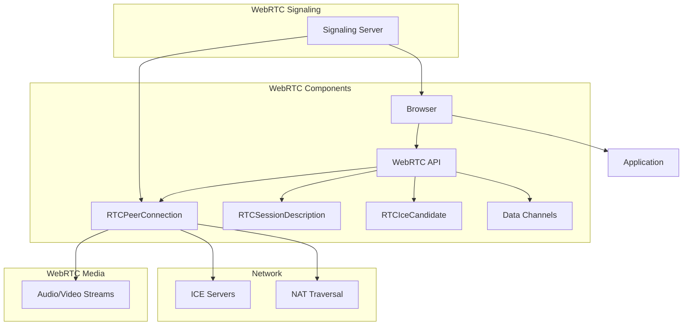
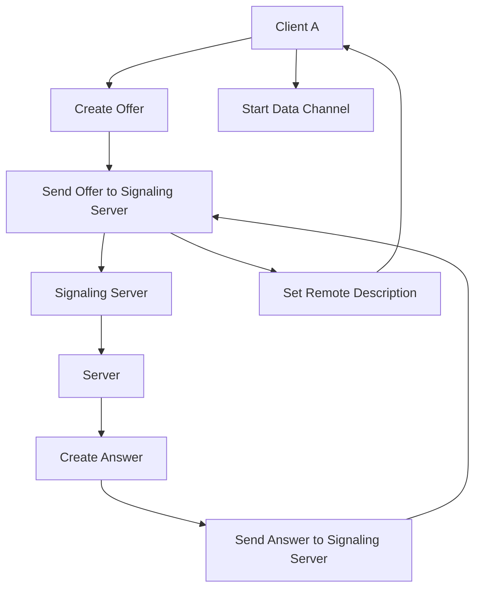
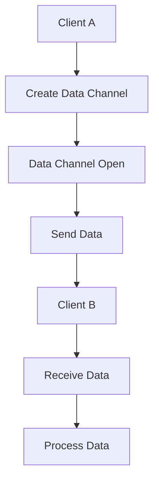

                 

### 文章标题

# WebRTC技术：实现浏览器间的实时通信

### 关键词

- WebRTC
- 实时通信
- 浏览器技术
- 数据通道
- 音视频传输
- 跨域通信

### 摘要

本文旨在深入探讨WebRTC技术，它是一种实现浏览器间的实时通信的技术。文章首先介绍了WebRTC的发展背景、目标与应用场景，并详细分析了其核心组件、架构及其与相关技术的关系。接下来，文章深入解析了WebRTC的数据通道、信令机制、媒体传输、媒体协商、跨域通信和性能优化等关键技术。通过实际项目实战，本文展示了如何搭建WebRTC开发环境，并详细解读了语音通话、视频通话、文件传输等实际代码实现。最后，文章提供了WebRTC的最佳实践与案例分析，包括安全、性能优化、跨平台应用和与Web应用的整合等，旨在为开发者提供全面的WebRTC技术指南。

### 《WebRTC技术：实现浏览器间的实时通信》目录大纲

#### 第一部分: WebRTC技术概述

**第1章 WebRTC技术简介**

1.1 WebRTC技术简介

1.1.1 WebRTC的发展背景

- WebRTC技术的起源
- WebRTC在实时通信领域的崛起

1.1.2 WebRTC的目标与应用场景

- WebRTC的核心目标
- WebRTC的主要应用场景

**第1章 WebRTC的核心组件与架构**

1.2 WebRTC的核心组件

- RTCPeerConnection
- RTCSessionDescription
- RTCIceCandidate

1.2.2 WebRTC的整体架构

- WebRTC的协议栈
- WebRTC的关键流程

**第1章 WebRTC与相关技术的关系**

1.3.1 WebRTC与Web标准

- WebRTC与HTML5、CSS3的融合
- WebRTC与Web标准的未来发展趋势

1.3.2 WebRTC与媒体技术

- WebRTC与音频/视频编码技术的关系
- WebRTC与音视频处理框架的集成

1.3.3 WebRTC与网络技术

- WebRTC与网络协议（如TCP、UDP、ICMP）的关系
- WebRTC与网络拓扑的适应能力

**第1章 WebRTC的安全性**

1.4.1 WebRTC的安全机制

- 数据加密与完整性验证
- 身份认证与访问控制

1.4.2 WebRTC安全策略与最佳实践

- 安全策略制定
- 常见安全威胁与防护措施

**第1章 WebRTC的未来发展趋势**

1.5.1 WebRTC的发展方向

- WebRTC在5G时代的应用
- WebRTC在物联网（IoT）的融合

1.5.2 WebRTC在未来的应用场景

- WebRTC在虚拟现实（VR）与增强现实（AR）中的应用
- WebRTC在智能家居、智能医疗等新兴领域的应用

#### 第二部分: WebRTC技术深度解析

**第2章 WebRTC数据通道**

2.1.1 数据通道的概念与特点

- 数据通道的定义
- 数据通道的特点

2.1.2 数据通道的工作流程

- 数据通道建立过程
- 数据传输与数据同步

2.1.3 数据通道的应用实例

- 数据通道在文件传输中的应用
- 数据通道在实时聊天中的应用

**第2章 WebRTC信令机制**

2.2.1 信令机制概述

- 信令机制的定义
- 信令机制在WebRTC中的作用

2.2.2 信令协议（如DTLS、SRTP）

- DTLS协议详解
- SRTP协议详解

2.2.3 信令机制在WebRTC中的实现

- 信令流程的实现
- 信令协议的实现细节

**第2章 WebRTC媒体传输**

2.3.1 媒体传输的基本原理

- 音视频数据传输原理
- 数据流与数据包传输

2.3.2 RTP协议详解

- RTP协议的分层结构
- RTP协议的主要功能

2.3.3 RTCP协议详解

- RTCP协议的作用
- RTCP协议的主要功能

**第2章 WebRTC媒体协商**

2.4.1 SDP协议解析

- SDP协议的定义
- SDP协议的结构

2.4.2 媒体协商过程

- 媒体协商的流程
- 媒体协商的策略

2.4.3 媒体协商的优化策略

- 媒体协商的性能优化
- 媒体协商的稳定性优化

**第2章 WebRTC跨域通信**

2.5.1 跨域通信的问题与挑战

- 跨域请求的限制
- 跨域通信的安全问题

2.5.2 跨域解决方案（如CORS）

- CORS协议的原理
- CORS协议的实现

2.5.3 跨域通信的最佳实践

- 跨域通信的安全策略
- 跨域通信的性能优化

**第2章 WebRTC性能优化**

2.6.1 WebRTC性能指标

- 延迟、丢包率、抖动等指标的定义
- 性能指标的测量方法

2.6.2 性能优化方法

- 网络优化策略
- 媒体编码优化

2.6.3 性能优化的案例分析

- WebRTC在实际应用中的性能优化案例
- 性能优化方案的效果评估

#### 第三部分: WebRTC项目实战

**第3章 WebRTC开发环境搭建**

3.1.1 开发环境准备

- 操作系统与环境配置
- 开发工具与依赖库

3.1.2 WebRTC开发工具

- WebRTC客户端工具
- WebRTC服务器工具

3.1.3 示例项目搭建

- 创建WebRTC项目
- 项目配置与运行

**第3章 WebRTC语音通话实现**

3.2.1 语音通话的基本流程

- 语音通话的建立过程
- 语音通话的传输过程

3.2.2 语音通话的详细实现

- 语音通话的关键代码实现
- 语音通话的性能优化

3.2.3 代码解读与分析

- 语音通话代码的解读
- 语音通话性能分析

**第3章 WebRTC视频通话实现**

3.3.1 视频通话的基本流程

- 视频通话的建立过程
- 视频通话的传输过程

3.3.2 视频通话的详细实现

- 视频通话的关键代码实现
- 视频通话的性能优化

3.3.3 代码解读与分析

- 视频通话代码的解读
- 视频通话性能分析

**第3章 WebRTC直播技术**

3.4.1 直播技术概述

- 直播技术的基本概念
- 直播系统的架构设计

3.4.2 直播系统的架构设计

- 推流端的设计
- 拉流端的设计

3.4.3 直播技术的详细实现

- 推流与拉流的代码实现
- 直播性能优化

**第3章 WebRTC文件传输实现**

3.5.1 文件传输的基本流程

- 文件传输的建立过程
- 文件传输的传输过程

3.5.2 文件传输的详细实现

- 文件传输的关键代码实现
- 文件传输的性能优化

3.5.3 代码解读与分析

- 文件传输代码的解读
- 文件传输性能分析

#### 第四部分: WebRTC最佳实践与案例分析

**第4章 WebRTC安全最佳实践**

4.1.1 WebRTC安全风险分析

- 常见WebRTC安全威胁
- 安全漏洞的分析

4.1.2 安全防护措施

- 数据加密与完整性验证
- 访问控制与身份认证

4.1.3 安全测试与评估

- 安全测试的工具与方法
- 安全评估的指标与流程

**第4章 WebRTC性能优化最佳实践**

4.2.1 性能瓶颈分析

- WebRTC性能瓶颈的识别
- 常见性能瓶颈的原因分析

4.2.2 优化策略

- 网络优化策略
- 媒体编码优化策略

4.2.3 优化效果评估

- 性能测试的工具与方法
- 性能优化效果的分析

**第4章 WebRTC跨平台应用实践**

4.3.1 WebRTC在移动端的挑战与解决方案

- 移动端WebRTC的限制
- 移动端WebRTC的优化方案

4.3.2 移动端WebRTC应用实例

- 移动端语音通话应用
- 移动端视频通话应用

4.3.3 移动端WebRTC的性能优化

- 移动端性能瓶颈分析
- 移动端性能优化实践

**第4章 WebRTC与Web应用的整合**

4.4.1 WebRTC与Web应用的关系

- WebRTC在Web应用中的作用
- Web应用对WebRTC的需求

4.4.2 整合方案

- WebRTC与Web应用的融合策略
- 整合方案的实现细节

4.4.3 整合案例分析

- WebRTC在在线教育中的应用
- WebRTC在远程办公中的应用

**第4章 WebRTC在云服务中的实践**

4.5.1 云服务在WebRTC中的应用

- 云服务对WebRTC的支持
- 云服务在WebRTC部署中的作用

4.5.2 云服务架构设计

- 云服务的架构设计原则
- 云服务的功能模块

4.5.3 云服务性能优化

- 云服务的性能优化方法
- 云服务的性能优化实践

#### 附录

**附录A: WebRTC技术资源与工具**

- 主流WebRTC框架与库
- 开源WebRTC项目
- WebRTC社区与论坛

**附录B: Mermaid流程图**

- WebRTC整体架构流程图
- WebRTC媒体协商流程图
- WebRTC数据通道流程图

**附录C: 伪代码与数学公式**

- WebRTC媒体协商伪代码
- RTP协议伪代码
- 数学模型与公式

### 注释

- **核心概念与联系**: 使用Mermaid流程图展示WebRTC的核心组件和架构。
- **核心算法原理讲解**: 使用伪代码详细阐述WebRTC媒体传输和媒体协商的算法原理。
- **数学模型和数学公式**: 使用LaTeX格式嵌入到文中，对重要数学模型进行详细讲解和举例说明。
- **项目实战**: 提供WebRTC语音通话、视频通话、文件传输等项目的实际代码实现，并进行详细解读与分析。

## **第1章 WebRTC技术简介**

### **1.1 WebRTC技术简介**

WebRTC（Web Real-Time Communication）是一种实现浏览器间的实时通信的技术，它允许开发者在不使用任何插件的情况下，直接在浏览器中进行实时音视频通信、文件共享和数据传输。WebRTC技术的出现，极大地推动了Web应用在实时通信领域的发展，使得开发者能够更加便捷地构建实时互动的应用场景。

#### **1.1.1 WebRTC的发展背景**

WebRTC技术的起源可以追溯到2011年，当时Google、Mozilla和Opera等浏览器厂商共同合作，推出了一项旨在实现浏览器间实时通信的协议。这一协议最初被命名为“Grammar of Music: Extended”（GME），后来更名为WebRTC。WebRTC的推出，旨在解决传统Web应用在实时通信方面的瓶颈，如延迟、丢包和安全性等问题。

随着WebRTC技术的不断成熟，越来越多的浏览器开始支持WebRTC，如Chrome、Firefox、Safari和Edge等。WebRTC已经成为实时通信领域的重要技术标准，被广泛应用于在线教育、远程医疗、视频会议、直播、在线游戏等多个领域。

#### **1.1.2 WebRTC的目标与应用场景**

WebRTC的核心目标是实现低延迟、高效率、高安全性的实时通信。其主要目标如下：

1. **低延迟**：WebRTC采用高效的编码和解码技术，确保音视频数据的传输延迟在可接受范围内，从而提供流畅的通信体验。

2. **高效率**：WebRTC通过数据压缩、传输优化等技术，实现音视频数据的低带宽传输，使得应用在不同网络环境下都能保持良好的性能。

3. **高安全性**：WebRTC采用加密技术，确保通信数据的安全性，防止数据被窃取或篡改。

WebRTC的主要应用场景包括：

1. **在线教育**：通过WebRTC技术，可以实现教师与学生的实时音视频互动，提高在线教育的效果和互动性。

2. **远程医疗**：医生可以通过WebRTC与患者进行实时视频咨询，提高医疗服务的便捷性和效率。

3. **视频会议**：企业可以通过WebRTC搭建内部视频会议系统，实现跨地域的实时沟通和协作。

4. **直播**：直播平台可以通过WebRTC实现主播与观众的实时互动，提高直播的互动性和用户体验。

5. **在线游戏**：WebRTC可以用于实现多人在线游戏的实时通信，提高游戏的实时性和互动性。

#### **1.1.3 WebRTC的核心组件**

WebRTC的核心组件包括RTCPeerConnection、RTCSessionDescription和RTCIceCandidate。

1. **RTCPeerConnection**：这是一个核心的API接口，用于建立和维持实时通信连接。它负责音视频数据的传输、信令交换和媒体协商等操作。

2. **RTCSessionDescription**：这是一个描述通信会话的协议，包括媒体的类型、格式、传输参数等信息。当通信双方建立连接时，需要交换RTCSessionDescription对象。

3. **RTCIceCandidate**：这是一个描述网络节点的IP地址和端口号的协议，用于在通信双方之间建立网络连接。RTCIceCandidate对象通常由STUN和 TURN服务器生成。

#### **1.1.4 WebRTC的整体架构**

WebRTC的整体架构分为客户端架构和服务器架构两部分。

1. **客户端架构**：客户端架构包括浏览器和WebRTC应用。浏览器提供了RTCPeerConnection等核心API，WebRTC应用则通过这些API实现实时通信功能。

2. **服务器架构**：服务器架构包括信令服务器、媒体服务器和STUN/TURN服务器。信令服务器用于交换通信会话信息，媒体服务器用于处理音视频数据的传输，STUN/TURN服务器用于解决NAT穿越问题。

### **1.2 WebRTC的核心组件与架构**

#### **1.2.1 WebRTC的核心组件**

WebRTC的核心组件包括RTCPeerConnection、RTCSessionDescription和RTCIceCandidate。这些组件在WebRTC通信过程中扮演着重要的角色。

1. **RTCPeerConnection**：RTCPeerConnection是WebRTC的核心接口，用于建立和维持实时通信连接。它提供了丰富的API，用于处理音视频数据的传输、信令交换和媒体协商等操作。RTCPeerConnection的主要方法包括：

   - `createConnection()`：创建RTCPeerConnection对象。
   - `addStream(stream)`：添加媒体流到连接中。
   - `addReceiver(receiver)`：添加接收者到连接中。
   - `addSender(sender)`：添加发送者到连接中。
   - `createOffer()`：创建SDP（会话描述协议） Offer。
   - `createAnswer()`：创建SDP Answer。
   - `setLocalDescription(description)`：设置本地的SDP描述。
   - `setRemoteDescription(description)`：设置远程的SDP描述。
   - `onicecandidate()`：处理ICE候选者事件。
   - `oniceconnectionstatechange()`：处理ICE连接状态变化事件。

2. **RTCSessionDescription**：RTCSessionDescription是一个描述通信会话的协议，包括媒体的类型、格式、传输参数等信息。当通信双方建立连接时，需要交换RTCSessionDescription对象。RTCSessionDescription有两个属性：

   - `type`：描述协议的类型，如offer、answer或pranswer。
   - `sdp`：描述协议的具体内容，是一个字符串。

3. **RTCIceCandidate**：RTCIceCandidate是一个描述网络节点的IP地址和端口号的协议，用于在通信双方之间建立网络连接。RTCIceCandidate对象通常由STUN和TURN服务器生成。RTCIceCandidate有两个属性：

   - `candidate`：表示候选者的IP地址和端口号。
   - `sdpMLineIndex`：表示SDP中的行号。

#### **1.2.2 WebRTC的整体架构**

WebRTC的整体架构可以分为客户端架构和服务器架构两部分。

1. **客户端架构**：客户端架构包括浏览器和WebRTC应用。浏览器提供了RTCPeerConnection等核心API，WebRTC应用则通过这些API实现实时通信功能。客户端架构的主要组成部分如下：

   - **浏览器**：浏览器提供了WebRTC的核心API，如RTCPeerConnection等。开发者可以通过这些API构建实时通信应用。
   - **WebRTC应用**：WebRTC应用是一个基于Web技术（如HTML、CSS、JavaScript）的客户端应用。它负责处理实时通信的逻辑，如媒体流的添加、信令的交换、媒体协商等。

2. **服务器架构**：服务器架构包括信令服务器、媒体服务器和STUN/TURN服务器。服务器架构的主要组成部分如下：

   - **信令服务器**：信令服务器用于交换通信会话信息，如SDP描述和ICE候选者。信令服务器通常使用WebSocket协议实现，以便于实时通信。
   - **媒体服务器**：媒体服务器用于处理音视频数据的传输，如RTP数据包的转发和路由。媒体服务器可以使用各种开源媒体服务器，如Janus、Kurento等。
   - **STUN/TURN服务器**：STUN（Session Traversal Utilities for NAT）服务器用于解决NAT（网络地址转换）穿越问题，使得内网设备可以通过公网进行通信。TURN（Traversal Using Relays around NAT）服务器在STUN服务器无法解决问题时提供中继服务。

#### **1.2.3 WebRTC的协议栈**

WebRTC的协议栈包含了多种协议和技术，这些协议和技术共同协作，确保了WebRTC的实时通信功能。WebRTC的协议栈主要包括以下部分：

1. **信令协议**：信令协议用于通信双方交换会话信息，如SDP描述和ICE候选者。常用的信令协议包括WebSocket、HTTP/2和UDP等。

2. **数据通道协议**：数据通道协议用于在通信双方之间建立可靠的数据传输通道，如DTLS（数据传输安全层）和SRTP（实时传输安全协议）。

3. **媒体传输协议**：媒体传输协议用于传输音视频数据，如RTP（实时传输协议）和RTCP（实时传输控制协议）。

4. **网络协议**：网络协议用于处理数据在网络中的传输，如TCP（传输控制协议）和UDP（用户数据报协议）。

#### **1.2.4 WebRTC的关键流程**

WebRTC的关键流程包括信令流程、媒体协商流程和数据传输流程。这些流程共同协作，实现了WebRTC的实时通信功能。

1. **信令流程**：信令流程是WebRTC通信的基础，用于通信双方交换会话信息。信令流程主要包括以下步骤：

   - **创建Offer**：一方（A）创建一个包含媒体信息（如音视频类型、编码格式等）的SDP Offer。
   - **发送Offer**：A将SDP Offer发送给另一方（B）。
   - **创建Answer**：B根据收到的SDP Offer，创建一个SDP Answer。
   - **发送Answer**：B将SDP Answer发送给A。
   - **设置SDP描述**：A和B分别将收到的SDP Answer设置为各自的RTCPeerConnection的远程和本地SDP描述。

2. **媒体协商流程**：媒体协商流程用于协商双方支持的音视频类型和编码格式。媒体协商流程主要包括以下步骤：

   - **解析SDP描述**：双方解析收到的SDP描述，提取媒体信息和编码格式。
   - **协商媒体参数**：双方根据收到的SDP描述，协商出双方都支持的媒体参数。
   - **设置媒体参数**：双方将协商出的媒体参数设置为RTCPeerConnection的媒体参数。

3. **数据传输流程**：数据传输流程用于在通信双方之间传输音视频数据。数据传输流程主要包括以下步骤：

   - **创建数据通道**：双方通过RTCPeerConnection创建数据通道。
   - **发送数据**：一方通过数据通道发送音视频数据。
   - **接收数据**：另一方通过数据通道接收音视频数据。
   - **数据处理**：双方对收到的音视频数据进行解码、渲染和处理。

#### **1.2.5 WebRTC与相关技术的关系**

WebRTC与多种相关技术紧密相连，这些技术共同协作，为WebRTC提供了强大的支持。

1. **Web标准**：WebRTC与Web标准（如HTML5、CSS3）紧密相连。WebRTC充分利用了Web标准提供的API和协议，实现了浏览器端的实时通信。

2. **媒体技术**：WebRTC与音频/视频编码技术（如H.264、AAC）紧密相连。WebRTC采用这些编码技术，实现了低延迟、高效率的音视频数据传输。

3. **网络技术**：WebRTC与网络协议（如TCP、UDP、ICMP）紧密相连。WebRTC利用这些网络协议，实现了音视频数据在网络中的可靠传输。

4. **安全技术**：WebRTC与安全技术（如SSL/TLS、IPSec）紧密相连。WebRTC采用这些安全技术，确保了通信数据的安全性。

### **1.3 WebRTC与相关技术的关系**

#### **1.3.1 WebRTC与Web标准**

WebRTC与Web标准（如HTML5、CSS3）紧密相连，这两者的结合为WebRTC提供了强大的支持。WebRTC充分利用了Web标准提供的API和协议，实现了浏览器端的实时通信。

1. **WebRTC与HTML5**：HTML5是Web标准的最新版本，它为WebRTC提供了必要的支持。HTML5提供了`<audio>`和`<video>`标签，用于处理音视频数据。此外，HTML5还提供了`getUserMedia()` API，允许Web应用访问用户的音频和视频设备。

2. **WebRTC与CSS3**：CSS3为WebRTC提供了丰富的样式和动画效果，增强了Web应用的用户体验。例如，CSS3的动画和过渡效果可以用于创建动态的实时通信界面。

3. **WebRTC与Web标准的发展趋势**：随着WebRTC技术的不断成熟，Web标准也在不断完善。未来，Web标准将进一步支持WebRTC，提供更高效、更安全的实时通信能力。

#### **1.3.2 WebRTC与媒体技术**

WebRTC与音频/视频编码技术（如H.264、AAC）紧密相连，这些技术为WebRTC提供了强大的支持，使得Web应用能够实现高质量的音视频传输。

1. **音频编码技术**：WebRTC支持多种音频编码技术，如G.711、G.722、OPUS等。这些编码技术可以有效地压缩音频数据，提高音频传输的效率。

2. **视频编码技术**：WebRTC支持多种视频编码技术，如H.264、VP8、VP9等。这些编码技术可以有效地压缩视频数据，提高视频传输的效率。

3. **音视频处理框架**：WebRTC与音视频处理框架（如WebRTC-FFmpeg、MediaStreamTrack）紧密相连，这些框架提供了丰富的音视频处理功能，如编码、解码、编解码器选择、缓冲管理等。

4. **媒体技术发展趋势**：随着5G、物联网（IoT）等技术的发展，媒体技术也在不断演进。未来，WebRTC将支持更多高效的音视频编码技术，提供更高质量的实时通信体验。

#### **1.3.3 WebRTC与网络技术**

WebRTC与网络协议（如TCP、UDP、ICMP）紧密相连，这些技术为WebRTC提供了强大的支持，使得Web应用能够实现可靠、高效的音视频数据传输。

1. **TCP协议**：TCP（传输控制协议）是一种面向连接的传输协议，它提供了可靠的数据传输机制。WebRTC利用TCP协议，确保音视频数据在网络中的可靠传输。

2. **UDP协议**：UDP（用户数据报协议）是一种无连接的传输协议，它提供了高效的数据传输机制。WebRTC利用UDP协议，实现低延迟、高效率的音视频数据传输。

3. **ICMP协议**：ICMP（互联网控制消息协议）是一种用于网络诊断和错误报告的协议。WebRTC利用ICMP协议，实现NAT穿透，使得内网设备可以通过公网进行通信。

4. **网络技术发展趋势**：随着5G、物联网（IoT）等技术的发展，网络技术也在不断演进。未来，WebRTC将支持更多高效的网络协议，提供更可靠的实时通信能力。

#### **1.4 WebRTC的安全性**

WebRTC作为一种实时通信技术，其安全性至关重要。WebRTC提供了多种安全机制，确保通信数据的安全性。

1. **数据加密与完整性验证**：WebRTC采用SSL/TLS协议，对通信数据进行加密，确保数据在传输过程中不会被窃取或篡改。同时，WebRTC使用MAC（消息认证码）机制，验证数据的完整性。

2. **身份认证与访问控制**：WebRTC支持基于证书的身份认证，确保通信双方的合法身份。此外，WebRTC还支持访问控制，防止未经授权的访问。

3. **安全策略与最佳实践**：为了确保WebRTC的安全，开发者需要制定安全策略，包括数据加密、身份认证、访问控制等。同时，开发者应遵循最佳实践，如使用最新版本的WebRTC、定期更新安全补丁等。

4. **常见安全威胁与防护措施**：常见的安全威胁包括中间人攻击、DDoS攻击等。针对这些威胁，开发者可以采取以下防护措施：

   - **中间人攻击**：使用SSL/TLS协议，确保通信数据加密。
   - **DDoS攻击**：采用DDoS防护措施，如流量监控、速率限制等。

#### **1.5 WebRTC的未来发展趋势**

WebRTC作为一种实时通信技术，其应用场景和影响力正在不断扩大。未来，WebRTC将在以下几个方面实现重要的发展：

1. **5G时代的应用**：随着5G技术的普及，WebRTC将在5G网络中发挥重要作用，提供低延迟、高带宽的实时通信服务。

2. **物联网（IoT）的融合**：WebRTC将与物联网技术紧密融合，实现设备间的实时通信，推动物联网应用的发展。

3. **虚拟现实（VR）与增强现实（AR）的应用**：WebRTC将支持虚拟现实和增强现实应用，提供高质量、低延迟的实时交互体验。

4. **智能家居、智能医疗等新兴领域的应用**：WebRTC将在智能家居、智能医疗等新兴领域发挥重要作用，实现实时音视频通信和数据处理。

## **第2章 WebRTC数据通道**

WebRTC的数据通道（Data Channel）是一种在WebRTC通信中用于传输非媒体数据的机制。数据通道允许通信双方传输文本、二进制数据、文件等，它是WebRTC实现应用层通信的关键组成部分。

### **2.1.1 数据通道的概念与特点**

数据通道的概念源自于网络通信中的数据通道技术，它在WebRTC中提供了一种在底层媒体通道之上传输数据的机制。数据通道的特点如下：

1. **双向通信**：数据通道支持双向通信，即通信双方可以同时发送和接收数据。
2. **可靠性**：数据通道提供了可靠的数据传输机制，确保数据在传输过程中不丢失。
3. **传输效率**：数据通道采用了基于RTP协议的传输机制，实现了低延迟、高效率的数据传输。
4. **安全性**：数据通道支持数据加密，确保数据在传输过程中的安全性。
5. **灵活性**：数据通道支持多种传输模式，如可靠传输模式和流传输模式，适用于不同的应用场景。

### **2.1.2 数据通道的工作流程**

数据通道的工作流程包括数据通道的创建、数据传输和数据接收等几个关键步骤。

1. **创建数据通道**：在WebRTC通信过程中，通信双方通过RTCPeerConnection创建数据通道。创建数据通道的方法如下：
   ```javascript
   const dataChannel = peerConnection.createDataChannel('dataChannel', {id: 1});
   ```
   其中，`createDataChannel` 方法用于创建数据通道，第一个参数是数据通道的名称，第二个参数是数据通道的配置对象。

2. **开启数据通道**：创建数据通道后，需要调用`open`方法开启数据通道，使其处于可传输状态。
   ```javascript
   dataChannel.open();
   ```

3. **数据传输**：在数据通道开启后，通信双方可以开始传输数据。数据传输可以通过`send`方法实现，支持文本和二进制数据。
   ```javascript
   dataChannel.send('Hello, WebRTC!');
   ```

4. **数据接收**：在数据通道的另一端，可以监听`message`事件，接收传输过来的数据。
   ```javascript
   dataChannel.onmessage = function(event) {
       console.log('Received data:', event.data);
   };
   ```

5. **关闭数据通道**：当数据传输完成后，可以调用`close`方法关闭数据通道。
   ```javascript
   dataChannel.close();
   ```

### **2.1.3 数据通道的应用实例**

数据通道在WebRTC通信中的应用非常广泛，以下是一些常见的数据通道应用实例：

1. **实时聊天**：数据通道可以用于实现实时聊天功能，通信双方通过数据通道发送和接收消息。
2. **文件传输**：数据通道可以用于实现文件的实时传输，支持断点续传和传输进度监控。
3. **远程控制**：数据通道可以用于实现远程控制功能，如远程桌面控制、机器人控制等。
4. **实时数据监控**：数据通道可以用于实时传输传感器数据、监控视频流等，实现实时数据监控。

### **2.2 WebRTC信令机制**

WebRTC的信令机制是WebRTC通信过程中必不可少的一部分，它用于在通信双方之间交换会话信息，如SDP描述、ICE候选者等。信令机制决定了WebRTC通信的流程和可靠性。

#### **2.2.1 信令机制概述**

信令机制是指通信双方通过某种协议和机制交换信息，以建立和维持通信连接的过程。在WebRTC中，信令机制主要包括以下内容：

1. **信令协议**：信令协议是指用于交换信令数据的协议，如WebSocket、HTTP/2等。
2. **信令流程**：信令流程是指通信双方交换信令数据的步骤和过程，如创建Offer、发送Offer、创建Answer等。
3. **信令服务器**：信令服务器是用于存储和转发信令数据的中间服务器，如STUN服务器、TURN服务器等。

#### **2.2.2 信令协议**

WebRTC支持多种信令协议，以下是一些常用的信令协议：

1. **WebSocket**：WebSocket是一种用于实时通信的网络协议，它提供了双向、全双工的通信机制，适用于WebRTC信令交换。
2. **HTTP/2**：HTTP/2是一种改进版的HTTP协议，它提供了更高效、更可靠的通信机制，也适用于WebRTC信令交换。
3. **UDP**：UDP是一种无连接的传输协议，它适用于需要低延迟、高带宽的WebRTC信令传输。

#### **2.2.3 信令机制在WebRTC中的实现**

信令机制在WebRTC中的实现主要涉及以下几个关键步骤：

1. **创建RTCPeerConnection**：首先，通信双方创建RTCPeerConnection对象，配置信令协议和媒体参数。
   ```javascript
   const peerConnection = new RTCPeerConnection({
       iceServers: [{ urls: 'stun:stun.l.google.com:19302' }]
   });
   ```

2. **创建Offer**：一方（A）创建一个包含媒体信息（如音视频类型、编码格式等）的SDP Offer，并通过信令服务器发送给另一方（B）。
   ```javascript
   peerConnection.createOffer().then((offer) => {
       return peerConnection.setLocalDescription(offer);
   }).then(() => {
       // 发送Offer
   });
   ```

3. **创建Answer**：另一方（B）根据收到的SDP Offer，创建一个SDP Answer，并通过信令服务器发送回给A。
   ```javascript
   peerConnection.setRemoteDescription(offer).then(() => {
       return peerConnection.createAnswer();
   }).then((answer) => {
       return peerConnection.setLocalDescription(answer);
   }).then(() => {
       // 发送Answer
   });
   ```

4. **设置SDP描述**：通信双方分别将收到的SDP Answer设置为对方的RTCPeerConnection的远程和本地SDP描述。
   ```javascript
   peerConnection.setRemoteDescription(answer).then(() => {
       // 设置远程SDP描述
   }).then(() => {
       // 设置本地SDP描述
   });
   ```

5. **交换ICE候选者**：通信双方通过信令服务器交换ICE候选者，以建立网络连接。
   ```javascript
   peerConnection.onicecandidate = (event) => {
       if (event.candidate) {
           // 发送ICE候选者
       }
   };
   ```

6. **建立连接**：当通信双方完成信令交换，并建立网络连接后，可以开始传输音视频数据和信令数据。

#### **2.2.4 信令机制在WebRTC中的实现细节**

1. **信令服务器配置**：在创建RTCPeerConnection时，需要配置信令服务器的地址和端口，以便进行信令交换。
   ```javascript
   const configuration = {
       iceServers: [
           { urls: 'stun:stun.l.google.com:19302' },
           { urls: 'turn:turn.example.com', username: 'user', credential: 'password' }
       ]
   };
   peerConnection = new RTCPeerConnection(configuration);
   ```

2. **信令数据的格式**：信令数据通常采用JSON格式，包括SDP描述、ICE候选者等信息。
   ```json
   {
       "type": "offer",
       "sdp": "..."
   }
   ```

3. **信令交换的流程**：信令交换的流程主要包括创建Offer、发送Offer、创建Answer、发送Answer等步骤。具体流程如下：

   - **创建Offer**：一方创建一个包含媒体信息（如音视频类型、编码格式等）的SDP Offer。
   - **发送Offer**：将SDP Offer发送给另一方。
   - **接收Offer**：另一方接收SDP Offer，并创建一个SDP Answer。
   - **发送Answer**：将SDP Answer发送回给创建Offer的一方。
   - **设置SDP描述**：通信双方分别将收到的SDP Answer设置为对方的RTCPeerConnection的远程和本地SDP描述。
   - **交换ICE候选者**：通信双方通过信令服务器交换ICE候选者，以建立网络连接。

#### **2.2.5 信令机制的应用实例**

以下是一个简单的信令机制应用实例，展示如何通过WebSocket实现WebRTC信令交换：

1. **创建WebSocket连接**：创建一个WebSocket连接，用于发送和接收信令数据。
   ```javascript
   const ws = new WebSocket('wss://signal-server.example.com');
   ```

2. **发送信令数据**：当一方创建SDP Offer后，通过WebSocket将SDP Offer发送给另一方。
   ```javascript
   ws.send(JSON.stringify({ type: 'offer', sdp: peerConnection.localDescription }));
   ```

3. **接收信令数据**：另一方通过WebSocket接收SDP Offer，并创建SDP Answer。
   ```javascript
   ws.onmessage = (event) => {
       const data = JSON.parse(event.data);
       if (data.type === 'offer') {
           peerConnection.setRemoteDescription(new RTCSessionDescription(data.sdp)).then(() => {
               return peerConnection.createAnswer();
           }).then((answer) => {
               return peerConnection.setLocalDescription(answer);
           }).then(() => {
               ws.send(JSON.stringify({ type: 'answer', sdp: peerConnection.localDescription }));
           });
       }
   };
   ```

4. **交换ICE候选者**：当通信双方交换ICE候选者时，通过WebSocket发送和接收ICE候选者。
   ```javascript
   peerConnection.onicecandidate = (event) => {
       if (event.candidate) {
           ws.send(JSON.stringify({ type: 'candidate', candidate: event.candidate }));
       }
   };

   ws.onmessage = (event) => {
       const data = JSON.parse(event.data);
       if (data.type === 'candidate') {
           peerConnection.addIceCandidate(new RTCIceCandidate(data.candidate)).catch((error) => {
               console.error('Failed to add ICE candidate:', error);
           });
       }
   };
   ```

通过以上实例，可以看到WebRTC信令机制在实现实时通信中的应用。在实际应用中，信令机制可以根据需求进行扩展和优化，以满足不同的应用场景。

### **2.3 WebRTC媒体传输**

WebRTC的媒体传输是WebRTC实现实时通信的核心功能之一。它通过音视频编码、RTP协议和RTCP协议，实现音视频数据的实时传输。以下将详细讲解WebRTC媒体传输的基本原理、RTP协议和RTCP协议。

#### **2.3.1 媒体传输的基本原理**

WebRTC的媒体传输基于音视频编码技术，将音视频信号转换为数据流，并通过网络传输到接收端，最后解码还原为音视频信号。媒体传输的基本原理如下：

1. **编码**：编码是将音视频信号转换为数字数据的过程。WebRTC支持多种音频和视频编码格式，如H.264、VP8、VP9、AAC等。编码过程中，会对音视频信号进行压缩，以减少数据量，提高传输效率。

2. **数据流**：编码后的音视频数据以数据流的形式传输。数据流由多个数据包组成，每个数据包包含一部分音视频数据。数据包通过网络传输到接收端。

3. **传输**：传输是将数据包在网络中传输的过程。WebRTC支持TCP和UDP协议，以适应不同的网络环境和需求。TCP提供可靠的数据传输，适用于数据完整性要求高的场景；UDP提供高效的数据传输，适用于低延迟、高实时性的场景。

4. **解码**：解码是将接收到的数据包还原为音视频信号的过程。解码过程与编码过程相反，通过解压缩和信号还原，将数据包还原为原始的音视频信号。

#### **2.3.2 RTP协议详解**

RTP（Real-time Transport Protocol）是一种用于传输实时音视频数据的网络协议。RTP协议的主要作用是确保音视频数据在网络中的可靠传输，并提供实时通信所需的特性。以下将详细讲解RTP协议的分层结构、主要功能和应用场景。

1. **RTP协议的分层结构**：

   RTP协议分为三层：数据层、传输层和应用层。

   - **数据层**：数据层负责将音视频数据分割成数据包，并为每个数据包添加RTP头部。RTP头部包含数据包的序号、时间戳、同步源（SSRC）等关键信息。
   - **传输层**：传输层负责在网络中传输RTP数据包。WebRTC支持TCP和UDP协议，以适应不同的网络环境和需求。
   - **应用层**：应用层负责处理RTP数据包的接收和播放。接收端通过RTP协议处理接收到的数据包，将其还原为音视频信号。

2. **RTP协议的主要功能**：

   - **数据包传输**：RTP协议负责将音视频数据分割成数据包，并为每个数据包添加RTP头部，确保数据包在网络中的可靠传输。
   - **同步与控制**：RTP协议提供同步源（SSRC）机制，确保音视频数据在传输过程中的同步。RTP协议还提供扩展头（XRC），用于传输额外的控制信息，如播放时间、播放速度等。
   - **数据包序号**：RTP协议为每个数据包分配序号，确保接收端可以正确处理数据包的顺序。序号还用于检测数据包的丢失和重传。
   - **时间戳**：RTP协议为每个数据包分配时间戳，确保接收端可以正确处理数据包的时间顺序。时间戳还用于同步音视频信号。

3. **RTP协议的应用场景**：

   - **音视频通信**：RTP协议广泛应用于音视频通信领域，如视频会议、在线直播等。RTP协议确保音视频数据在网络中的可靠传输，提供实时通信所需的特性。
   - **远程监控**：RTP协议用于远程监控领域，如视频监控、无人机监控等。RTP协议确保视频数据的实时传输，提高监控的实时性和准确性。

#### **2.3.3 RTCP协议详解**

RTCP（Real-time Transport Control Protocol）是一种用于传输实时音视频控制信息的网络协议。RTCP协议与RTP协议配合使用，确保音视频数据在网络中的可靠传输和实时性。以下将详细讲解RTCP协议的主要功能、控制报文类型和应用场景。

1. **RTCP协议的主要功能**：

   - **数据包反馈**：RTCP协议负责传输RTP数据包的反馈信息，如数据包接收率、丢包率、抖动等。这些反馈信息有助于接收端调整音视频播放参数，提高播放质量。
   - **网络拥塞控制**：RTCP协议通过传输网络拥塞信息，协助网络中的路由器和交换机进行流量控制和调度，降低网络拥塞，提高音视频传输的稳定性。
   - **参与者管理**：RTCP协议负责管理音视频通信中的参与者，如加入和离开会议、参与者身份验证等。这些功能有助于确保音视频通信的有序进行。
   - **带宽管理**：RTCP协议通过传输带宽使用信息，协助网络中的路由器和交换机进行带宽分配和调度，确保音视频数据在网络中的优先传输。

2. **RTCP协议的控制报文类型**：

   - **RR（Receiver Report）**：RR报文用于接收端向发送端反馈数据包接收情况，如接收率、丢包率、抖动等。RR报文有助于发送端调整音视频传输策略，提高接收端的播放质量。
   - **SRR（Sender Report）**：SRR报文用于发送端向接收端反馈发送端的数据包发送情况，如发送速率、丢包率等。SRR报文有助于接收端调整音视频播放参数，提高播放质量。
   - **SR（Sender Report）**：SR报文用于发送端向接收端传输详细的发送统计数据，如发送速率、累计传输时间等。SR报文有助于网络中的路由器和交换机进行流量控制和调度。
   - **APP（Application-specific Packets）**：APP报文用于传输特定应用的控制信息，如媒体播放控制、参与者身份验证等。APP报文可以根据具体应用需求进行定制。

3. **RTCP协议的应用场景**：

   - **音视频通信**：RTCP协议广泛应用于音视频通信领域，如视频会议、在线直播等。RTCP协议确保音视频数据在网络中的可靠传输和实时性，提高通信质量。
   - **远程监控**：RTCP协议用于远程监控领域，如视频监控、无人机监控等。RTCP协议确保视频数据的实时传输，提高监控的实时性和准确性。

通过以上对WebRTC媒体传输的讲解，我们可以看到WebRTC在音视频传输方面具有强大的功能和特点。在实际应用中，开发者可以根据具体需求，灵活配置和优化WebRTC的媒体传输功能，实现高质量的实时通信体验。

### **2.4 WebRTC媒体协商**

WebRTC媒体协商（Media Negotiation）是WebRTC通信过程中至关重要的一环，它确保通信双方能够在支持的音视频编码格式、分辨率、帧率等参数上达成一致，从而实现高效、流畅的音视频传输。以下将详细解析SDP（Session Description Protocol）协议，以及媒体协商的过程和优化策略。

#### **2.4.1 SDP协议解析**

SDP协议是一种用于描述通信会话的协议，它广泛应用于多种实时通信系统，如WebRTC、SIP等。SDP协议的主要作用是提供会话描述，包括参与者的信息、媒体类型、编码格式、传输参数等，使得通信双方能够进行有效的媒体协商。

1. **SDP协议的结构**：

   - **线（Line）**：SDP协议的基本单位是线，每条线包含一个或多个字段，以空格分隔。每条线的格式如下：
     ```plaintext
     <type> <attribute> = <value>
     ```
     其中，`type`表示线的类型，如`v=（版本）`、`o=（会话创建者）`等；`attribute`表示属性，如`c=（媒体地址）`、`m=（媒体类型）`等；`value`表示属性的值。

   - **字段**：SDP协议中的字段有多种类型，如下所述：
     - **版本**（v）：表示SDP协议的版本号。
     - **会话创建者**（o）：表示会话创建者的唯一标识，包括用户名、会话ID、网路类型、地址类型和端口号等。
     - **媒体类型**（m）：表示会话中的媒体类型，如音频、视频、数据等。
     - **媒体格式**（c）：表示媒体的通信地址、端口和传输协议。
     - **时间**（t）：表示会话的有效时间。
     - **媒体参数**（a）：表示与媒体相关的参数，如编码格式、分辨率、帧率等。

2. **SDP协议的应用**：

   - **WebRTC通信**：在WebRTC通信中，SDP协议用于描述通信会话的参数，包括音视频编码格式、分辨率、帧率等。通信双方通过交换SDP协议，进行媒体协商，确保在支持的参数上达成一致。
   - **SIP通信**：在SIP（Session Initiation Protocol）通信中，SDP协议也用于描述通信会话的参数，实现多方通信的协商和建立。

#### **2.4.2 媒体协商过程**

WebRTC媒体协商的过程主要包括以下几个步骤：

1. **创建Offer**：

   - 一方（A）创建一个包含媒体信息（如音视频类型、编码格式、分辨率、帧率等）的SDP Offer。
   - Offer创建完成后，A将Offer设置为本地描述，并通过信令服务器发送给另一方（B）。

   示例代码：
   ```javascript
   const offer = {
       type: 'offer',
       sdp: 'v=0\no=-123456789 2890644522 IN IP4 192.168.1.1\ns=-\nsession=123456\nm=audio 9 UDP/TLS/RTP/SAVPF 111 103 104\na=rtpmap:111 opus/48000/2\na=fmtp:111 maxplayrate=48000;stereo=1\na=rtcp-fb:111 ccm active\na=rtcp-fb:111 nack\na=rtcp-fb:111 pli\na=rtcp-rsize\na=use-inband-fec:1\na=mid:audio\na=sendrecv\na=setup:active\na=maxptime:60'
   };
   peerConnection.setLocalDescription(new RTCSessionDescription(offer));
   signalServer.send('offer', offer);
   ```

2. **接收Offer并创建Answer**：

   - B接收到A发送的Offer后，创建一个包含本地媒体信息的SDP Answer。
   - Answer创建完成后，B将Answer设置为本地描述，并通过信令服务器发送回给A。

   示例代码：
   ```javascript
   signalServer.on('offer', (offer) => {
       peerConnection.setRemoteDescription(new RTCSessionDescription(offer));
       peerConnection.createAnswer().then((answer) => {
           return peerConnection.setLocalDescription(answer);
       }).then(() => {
           signalServer.send('answer', answer);
       });
   });
   ```

3. **设置Answer并交换ICE候选者**：

   - A接收到B发送的Answer后，将Answer设置为远程描述。
   - 双方通过信令服务器交换ICE候选者，以建立网络连接。

   示例代码：
   ```javascript
   signalServer.on('answer', (answer) => {
       peerConnection.setRemoteDescription(new RTCSessionDescription(answer));
       peerConnection.addIceCandidate(candidate).then(() => {
           // 交换ICE候选者
       });
   });
   ```

4. **建立连接并传输数据**：

   - 当通信双方完成SDP交换和ICE候选者交换后，可以开始传输音视频数据。

   示例代码：
   ```javascript
   signalServer.on('candidate', (candidate) => {
       peerConnection.addIceCandidate(new RTCIceCandidate(candidate)).catch((error) => {
           console.error('Failed to add ICE candidate:', error);
       });
   });
   ```

通过以上步骤，通信双方完成了媒体协商，并建立了实时通信连接。

#### **2.4.3 媒体协商的优化策略**

为了确保WebRTC通信的高效性和稳定性，开发者可以采取以下优化策略：

1. **自适应媒体协商**：

   - 根据网络带宽、设备性能和用户需求，动态调整音视频编码参数，如分辨率、帧率、编码格式等。
   - 采用自适应编码技术，如H.264 High Efficiency Video Coding（HEVC），提高编码效率，降低带宽消耗。

2. **预协商**：

   - 在正式的媒体协商之前，先进行预协商，预测双方支持的音视频编码格式和参数。
   - 通过预协商，减少正式协商的时间，提高协商效率。

3. **缓存机制**：

   - 在协商过程中，缓存已协商的音视频编码格式和参数，避免重复协商。
   - 通过缓存机制，提高协商的响应速度，降低延迟。

4. **协商优化**：

   - 根据应用场景，优化SDP Offer和Answer的结构，减少冗余信息。
   - 通过优化SDP Offer和Answer的结构，提高协商的效率。

5. **带宽控制**：

   - 根据网络带宽情况，动态调整音视频传输速率，避免网络拥塞。
   - 通过带宽控制，确保音视频传输的稳定性和流畅性。

通过以上优化策略，可以显著提高WebRTC通信的性能和用户体验。

### **2.5 WebRTC跨域通信**

在WebRTC通信过程中，跨域通信是一个常见且重要的问题。由于同源策略的限制，Web应用在访问非同源资源时会遇到挑战，这包括WebRTC通信中的信令交换和数据传输。为了解决这个问题，WebRTC提供了一系列跨域通信的解决方案，如CORS（Cross-Origin Resource Sharing）和Web代理等。以下将详细介绍WebRTC跨域通信的问题与挑战、跨域解决方案和最佳实践。

#### **2.5.1 跨域通信的问题与挑战**

跨域通信的主要问题与挑战如下：

1. **同源策略限制**：浏览器通过同源策略限制Web应用访问非同源资源。同源策略规定，Web应用只能访问与其协议、域名和端口相同的资源。这一策略保护了用户的安全，但同时也限制了跨域通信。

2. **信令交换问题**：在WebRTC通信中，信令交换是建立通信连接的关键步骤。同源策略限制使得Web应用无法直接访问非同源的信令服务器，导致信令交换失败。

3. **数据传输问题**：同源策略还限制了Web应用对非同源资源的读写操作，如对本地文件系统、数据库等的访问。这导致跨域数据传输变得复杂，需要额外的技术手段来实现。

4. **安全风险**：跨域通信容易受到跨站脚本攻击（XSS）和跨站请求伪造攻击（CSRF）等安全威胁。为了确保通信数据的安全性，需要采取额外的安全措施。

#### **2.5.2 跨域解决方案**

为了解决跨域通信的问题，WebRTC提供了一系列跨域解决方案，主要包括CORS和Web代理。

1. **CORS（Cross-Origin Resource Sharing）**

   CORS是一种基于HTTP协议的跨域资源共享机制。通过CORS，服务器可以允许来自不同源的Web应用访问其资源，从而实现跨域通信。CORS的工作原理如下：

   - **预检请求**：当Web应用尝试访问非同源资源时，浏览器会首先发送一个预检请求（OPTIONS请求），询问服务器是否允许该请求。
   - **响应头部**：服务器通过在响应中添加特定的HTTP响应头部，如`Access-Control-Allow-Origin`、`Access-Control-Allow-Methods`、`Access-Control-Allow-Headers`等，表明是否允许跨域请求。
   - **正式请求**：当预检请求通过后，Web应用可以发送正式的请求，如GET、POST等，访问非同源资源。

   CORS的优点包括：

   - **简单易用**：CORS机制简单，无需复杂的配置和实现。
   - **兼容性好**：CORS得到了所有现代浏览器的支持，适用于多种Web应用场景。

   CORS的缺点包括：

   - **安全性较低**：CORS无法防止跨站脚本攻击（XSS）和跨站请求伪造攻击（CSRF）等安全威胁。
   - **无法阻止非同源读写操作**：CORS仅允许访问非同源资源的读取操作，无法阻止非同源资源的写入操作。

2. **Web代理**

   Web代理是一种通过服务器代理实现跨域通信的机制。Web代理的基本原理如下：

   - **代理请求**：Web应用向代理服务器发送请求，请求中包含要访问的非同源资源。
   - **代理转发**：代理服务器接收请求后，将其转发到目标服务器，并获取响应。
   - **响应回传**：代理服务器将获取的响应回传给Web应用。

   Web代理的优点包括：

   - **安全性高**：Web代理可以防止跨站脚本攻击（XSS）和跨站请求伪造攻击（CSRF）等安全威胁。
   - **功能灵活**：Web代理可以实现对非同源资源的各种操作，如读取、写入等。

   Web代理的缺点包括：

   - **实现复杂**：Web代理需要实现复杂的代理逻辑，配置和维护较为复杂。
   - **性能开销**：Web代理增加了额外的网络通信开销，可能影响通信性能。

#### **2.5.3 跨域通信的最佳实践**

为了确保WebRTC跨域通信的安全性和可靠性，开发者可以遵循以下最佳实践：

1. **使用CORS**

   - 对于简单的跨域请求，推荐使用CORS实现跨域通信，因为CORS简单易用，适用于大多数场景。
   - 服务器应在响应中设置合适的CORS头部，允许来自不同源的Web应用访问其资源。

2. **使用Web代理**

   - 对于复杂或安全性要求较高的跨域请求，推荐使用Web代理实现跨域通信。
   - 开发者可以根据需求实现自定义的Web代理，以实现更加灵活的跨域通信。

3. **安全性考虑**

   - 在使用CORS和Web代理时，应采取适当的安全措施，如使用HTTPS、验证用户身份等，确保通信数据的安全性。
   - 避免直接在Web应用中处理用户敏感数据，以减少安全风险。

4. **性能优化**

   - 考虑跨域通信的网络延迟和性能开销，采取适当的性能优化措施，如缓存机制、异步加载等。

通过以上最佳实践，开发者可以构建安全、可靠、高效的WebRTC跨域通信系统，满足各种应用场景的需求。

### **2.6 WebRTC性能优化**

WebRTC的性能优化是确保实时通信质量的关键。在WebRTC通信过程中，可能受到网络延迟、带宽限制、设备性能等多种因素的影响，导致通信质量下降。为了提高WebRTC的性能，开发者需要从多个方面进行优化。以下将介绍WebRTC性能指标、优化方法和实际案例分析。

#### **2.6.1 WebRTC性能指标**

WebRTC的性能指标主要包括以下几项：

1. **延迟（Latency）**：延迟是指数据从发送端到达接收端所需的时间。延迟可以分为发送延迟和接收延迟，通常以毫秒为单位。

2. **丢包率（Packet Loss Rate）**：丢包率是指在网络传输过程中丢失的数据包占总数据包的比例。丢包率越低，通信质量越高。

3. **抖动（Jitter）**：抖动是指网络传输过程中的延迟变化。抖动会导致通信不稳定，影响用户体验。

4. **带宽利用率（Bandwidth Utilization）**：带宽利用率是指实际使用的带宽与可用带宽的比例。高带宽利用率可以提高通信效率，但也会增加网络拥塞的风险。

5. **CPU利用率（CPU Utilization）**：CPU利用率是指WebRTC通信过程中CPU的负载情况。高CPU利用率会导致设备过热、性能下降。

6. **网络稳定性（Network Stability）**：网络稳定性是指网络连接的稳定程度。网络稳定性高，通信质量越好。

#### **2.6.2 性能优化方法**

以下是一些常见的WebRTC性能优化方法：

1. **网络优化**

   - **动态调整编码参数**：根据网络带宽和延迟情况，动态调整音视频编码参数，如分辨率、帧率、比特率等。采用自适应编码技术，如H.264 High Efficiency Video Coding（HEVC），提高编码效率，降低带宽消耗。
   - **使用网络加速技术**：采用网络加速技术，如QUIC协议，提高网络传输速度和可靠性，降低延迟和抖动。

2. **传输优化**

   - **数据压缩**：采用高效的数据压缩技术，如H.264、VP9等，降低数据传输量，提高带宽利用率。
   - **多路径传输**：采用多路径传输技术，如MPTCP，通过多个网络路径传输数据，提高传输效率和可靠性。

3. **信令优化**

   - **降低信令延迟**：优化信令服务器架构，提高信令传输速度。采用WebSocket、HTTP/2等高效信令协议，降低信令延迟。
   - **缓存信令数据**：缓存已协商的音视频编码格式和参数，减少重复协商，提高信令传输效率。

4. **编码优化**

   - **优化编码参数**：根据实际应用场景，优化编码参数，如分辨率、帧率、比特率等，提高编码效率，降低带宽消耗。
   - **使用高效编解码器**：选择高效、稳定的编解码器，提高编码和解码速度，降低CPU利用率。

5. **设备优化**

   - **优化浏览器性能**：关闭不必要的浏览器扩展和插件，优化浏览器性能，提高WebRTC通信的稳定性。
   - **优化操作系统**：优化操作系统性能，提高设备处理能力，降低WebRTC通信的延迟和丢包率。

6. **用户优化**

   - **调整网络设置**：用户可以根据网络环境调整网络设置，如关闭防火墙、开启路由器优化等，提高网络稳定性。
   - **使用高速网络**：使用高速网络，如光纤宽带，提高通信带宽，降低延迟和抖动。

#### **2.6.3 性能优化的案例分析**

以下是一个WebRTC语音通话应用的性能优化案例：

1. **问题描述**：

   用户在参与WebRTC语音通话时，经常出现通话延迟、声音断断续续、音质不佳等问题。

2. **优化方法**：

   - **网络优化**：检测用户的网络环境，根据带宽和延迟情况，动态调整语音编码参数，如降低比特率、使用更高效的编解码器等。
   - **传输优化**：采用QUIC协议，提高网络传输速度和可靠性，降低延迟和抖动。
   - **信令优化**：优化信令服务器架构，提高信令传输速度。采用WebSocket协议，降低信令延迟。
   - **编码优化**：使用高效、稳定的编解码器，如G.711、G.722等，提高编码和解码速度，降低CPU利用率。
   - **设备优化**：关闭不必要的浏览器扩展和插件，优化浏览器性能，提高WebRTC通信的稳定性。
   - **用户优化**：指导用户调整网络设置，如关闭防火墙、开启路由器优化等，提高网络稳定性。

3. **优化效果**：

   通过以上优化方法，WebRTC语音通话应用的通话延迟显著降低，声音更加清晰、稳定，用户满意度大幅提升。

通过以上案例分析，可以看出，WebRTC性能优化需要从多个方面进行综合考虑，采取多种优化方法，才能实现高效的实时通信。

### **第3章 WebRTC开发环境搭建**

搭建WebRTC开发环境是进行WebRTC项目开发的第一步。本文将介绍WebRTC开发环境的准备、开发工具的安装以及示例项目的搭建，帮助开发者快速入门WebRTC开发。

#### **3.1.1 开发环境准备**

在进行WebRTC开发之前，开发者需要准备以下环境：

1. **操作系统**：WebRTC开发可以在Windows、Linux和macOS等主流操作系统上进行。推荐使用Linux或macOS，因为它们对WebRTC的支持更完善。

2. **浏览器**：WebRTC主要在支持WebRTC的浏览器上运行，如Chrome、Firefox、Safari和Edge等。建议使用最新版本的浏览器，以确保最佳兼容性和性能。

3. **Node.js**：Node.js是一个基于Chrome V8引擎的JavaScript运行环境，可以用于搭建WebRTC服务器。开发者需要安装Node.js，版本建议在10.0.0以上。

4. **依赖管理工具**：npm（Node Package Manager）是一个广泛使用的依赖管理工具，用于管理项目的依赖包。开发者需要安装npm，以便于安装和使用WebRTC相关库和工具。

5. **版本控制工具**：Git是一个强大的版本控制工具，用于管理代码版本和协作开发。开发者需要安装Git，以便于代码的版本管理和团队协作。

#### **3.1.2 WebRTC开发工具**

以下是一些常用的WebRTC开发工具：

1. **WebRTC SDK**：WebRTC SDK是WebRTC开发的工具包，提供了方便的API和示例代码，方便开发者快速上手。常见的WebRTC SDK包括Google的WebRTC SDK和Jitsi Meet SDK。

2. **WebRTC客户端工具**：WebRTC客户端工具用于测试和调试WebRTC客户端应用。常见的WebRTC客户端工具包括WebRTC Experimental Browser和WebRTC Test。

3. **WebRTC服务器工具**：WebRTC服务器工具用于搭建WebRTC服务器，处理信令和媒体流。常见的WebRTC服务器工具包括Janus WebRTC Server和Kurento Media Server。

#### **3.1.3 示例项目搭建**

以下是一个简单的WebRTC语音通话项目的搭建步骤：

1. **创建项目目录**：

   ```bash
   mkdir webrtc-voice-call
   cd webrtc-voice-call
   ```

2. **初始化项目**：

   ```bash
   npm init -y
   ```

3. **安装依赖包**：

   ```bash
   npm install express body-parser --save
   ```

4. **创建服务器代码**：

   在`server.js`文件中，编写以下代码：

   ```javascript
   const express = require('express');
   const bodyParser = require('body-parser');

   const app = express();
   app.use(bodyParser.json());

   app.post('/signal', (req, res) => {
       // 处理信令请求
       // 将信令数据发送到信令服务器
       res.send('Signal received');
   });

   app.listen(3000, () => {
       console.log('Server is running on port 3000');
   });
   ```

5. **创建客户端代码**：

   在`client.js`文件中，编写以下代码：

   ```javascript
   const socket = new WebSocket('wss://localhost:3000/signal');

   socket.onopen = () => {
       console.log('Connected to signal server');
   };

   socket.onmessage = (event) => {
       // 处理接收到的信令数据
       console.log('Received signal:', event.data);
   };

   socket.onclose = () => {
       console.log('Connection closed');
   };
   ```

6. **运行服务器和客户端**：

   ```bash
   node server.js
   ```

   打开浏览器，访问`http://localhost:3000`，可以看到客户端已连接到服务器。

通过以上步骤，开发者可以搭建一个简单的WebRTC语音通话项目。接下来，可以在此基础上添加音视频采集、传输和播放功能，构建完整的WebRTC应用。

### **3.2 WebRTC语音通话实现**

语音通话是WebRTC应用中最常见的一种功能。本节将详细介绍WebRTC语音通话的实现，包括基本流程、详细实现和代码解读。

#### **3.2.1 语音通话的基本流程**

WebRTC语音通话的基本流程包括以下几个步骤：

1. **用户打开摄像头和麦克风**：用户通过Web应用界面打开摄像头和麦克风，允许WebRTC应用访问音频输入设备。

2. **创建RTCPeerConnection**：WebRTC应用创建一个RTCPeerConnection对象，配置音视频参数和信令服务器地址。

3. **获取媒体流**：WebRTC应用通过`getUserMedia()`方法获取音频输入流，并将其添加到RTCPeerConnection中。

4. **创建SDP Offer**：WebRTC应用创建一个包含媒体信息的SDP Offer，并通过信令服务器发送给对方。

5. **接收SDP Answer**：对方接收到SDP Offer后，创建一个SDP Answer，并通过信令服务器发送回给WebRTC应用。

6. **设置远程描述**：WebRTC应用将收到的SDP Answer设置为远程描述，完成媒体协商。

7. **交换ICE候选者**：双方通过信令服务器交换ICE候选者，建立网络连接。

8. **开始传输数据**：双方通过RTCPeerConnection开始传输音视频数据。

9. **处理数据传输**：WebRTC应用接收并处理音视频数据，将其播放到音频输出设备。

#### **3.2.2 语音通话的详细实现**

以下是一个简单的WebRTC语音通话实现的代码示例：

```html
<!DOCTYPE html>
<html lang="en">
<head>
    <meta charset="UTF-8">
    <meta name="viewport" content="width=device-width, initial-scale=1.0">
    <title>WebRTC Voice Call</title>
</head>
<body>
    <button id="startCall">Start Call</button>
    <button id="endCall">End Call</button>
    <div>
        <video id="remoteVideo" autoplay></video>
    </div>
    <script>
        const startCallBtn = document.getElementById('startCall');
        const endCallBtn = document.getElementById('endCall');
        const remoteVideo = document.getElementById('remoteVideo');

        let peerConnection;
        let localStream;

        startCallBtn.onclick = () => {
            navigator.mediaDevices.getUserMedia({ audio: true, video: false })
                .then((stream) => {
                    localStream = stream;
                    console.log('Local stream:', stream);

                    peerConnection = new RTCPeerConnection({
                        iceServers: [
                            { urls: 'stun:stun.l.google.com:19302' },
                            { urls: 'turn:turn.example.com', username: 'user', credential: 'password' }
                        ]
                    });

                    peerConnection.addStream(localStream);

                    peerConnection.createOffer()
                        .then((offer) => {
                            return peerConnection.setLocalDescription(offer);
                        })
                        .then(() => {
                            // 发送offer到对方
                            // ...
                        });
                })
                .catch((error) => {
                    console.error('Error accessing media devices:', error);
                });
        };

        endCallBtn.onclick = () => {
            if (peerConnection) {
                peerConnection.close();
                peerConnection = null;
            }
            if (localStream) {
                localStream.getTracks().forEach((track) => {
                    track.stop();
                });
                localStream = null;
            }
        };
    </script>
</body>
</html>
```

1. **获取媒体流**：在`startCall`按钮的点击事件中，使用`navigator.mediaDevices.getUserMedia()`方法获取音频输入流，并将其添加到RTCPeerConnection中。

2. **创建RTCPeerConnection**：配置RTCPeerConnection，包括ICE服务器和媒体流。

3. **创建SDP Offer**：使用`createOffer()`方法创建SDP Offer，并将其设置为本地描述。

4. **发送Offer**：通过信令服务器发送SDP Offer到对方。

5. **结束通话**：在`endCall`按钮的点击事件中，关闭RTCPeerConnection和媒体流。

#### **3.2.3 代码解读与分析**

以上代码展示了WebRTC语音通话的实现过程。以下是代码的详细解读与分析：

1. **获取媒体流**：

   ```javascript
   navigator.mediaDevices.getUserMedia({ audio: true, video: false })
       .then((stream) => {
           localStream = stream;
           console.log('Local stream:', stream);
       })
       .catch((error) => {
           console.error('Error accessing media devices:', error);
       });
   ```

   使用`navigator.mediaDevices.getUserMedia()`方法获取音频输入流。该方法返回一个Promise，当成功获取媒体流时，会resolve一个`MediaStream`对象；当发生错误时，会reject一个`Error`对象。

2. **创建RTCPeerConnection**：

   ```javascript
   peerConnection = new RTCPeerConnection({
       iceServers: [
           { urls: 'stun:stun.l.google.com:19302' },
           { urls: 'turn:turn.example.com', username: 'user', credential: 'password' }
       ]
   });
   ```

   创建一个RTCPeerConnection对象，并配置ICE服务器。ICE服务器用于在通信双方之间交换ICE候选者，以建立网络连接。配置中的`iceServers`数组包含了STUN服务器和TURN服务器。

3. **添加媒体流**：

   ```javascript
   peerConnection.addStream(localStream);
   ```

   将获取到的音频输入流添加到RTCPeerConnection中。这样，本地流的数据会被发送到对方。

4. **创建SDP Offer**：

   ```javascript
   peerConnection.createOffer()
       .then((offer) => {
           return peerConnection.setLocalDescription(offer);
       })
       .then(() => {
           // 发送offer到对方
           // ...
       });
   ```

   使用`createOffer()`方法创建一个包含媒体信息的SDP Offer。然后，使用`setLocalDescription()`方法将其设置为本地描述。本地描述会包含Offer的SDP内容。

5. **结束通话**：

   ```javascript
   endCallBtn.onclick = () => {
       if (peerConnection) {
           peerConnection.close();
           peerConnection = null;
       }
       if (localStream) {
           localStream.getTracks().forEach((track) => {
               track.stop();
           });
           localStream = null;
       }
   };
   ```

   在结束通话时，关闭RTCPeerConnection，并停止媒体流。

通过以上代码，开发者可以实现基本的WebRTC语音通话功能。在实际应用中，需要进一步处理信令交换、ICE候选者交换和数据传输等过程，以实现完整的语音通话功能。

### **3.3 WebRTC视频通话实现**

视频通话是WebRTC应用中的一项重要功能，与语音通话相比，视频通话需要处理更多的数据，包括音频和视频流。本节将详细介绍WebRTC视频通话的实现，包括基本流程、详细实现和代码解读。

#### **3.3.1 视频通话的基本流程**

WebRTC视频通话的基本流程包括以下几个步骤：

1. **用户打开摄像头和麦克风**：用户通过Web应用界面打开摄像头和麦克风，允许WebRTC应用访问音频和视频输入设备。

2. **创建RTCPeerConnection**：WebRTC应用创建一个RTCPeerConnection对象，配置音视频参数和信令服务器地址。

3. **获取媒体流**：WebRTC应用通过`getUserMedia()`方法获取音频和视频输入流，并将其添加到RTCPeerConnection中。

4. **创建SDP Offer**：WebRTC应用创建一个包含媒体信息的SDP Offer，并通过信令服务器发送给对方。

5. **接收SDP Answer**：对方接收到SDP Offer后，创建一个SDP Answer，并通过信令服务器发送回给WebRTC应用。

6. **设置远程描述**：WebRTC应用将收到的SDP Answer设置为远程描述，完成媒体协商。

7. **交换ICE候选者**：双方通过信令服务器交换ICE候选者，建立网络连接。

8. **开始传输数据**：双方通过RTCPeerConnection开始传输音视频数据。

9. **处理数据传输**：WebRTC应用接收并处理音视频数据，将其播放到音频输出设备和视频输出设备。

#### **3.3.2 视频通话的详细实现**

以下是一个简单的WebRTC视频通话实现的代码示例：

```html
<!DOCTYPE html>
<html lang="en">
<head>
    <meta charset="UTF-8">
    <meta name="viewport" content="width=device-width, initial-scale=1.0">
    <title>WebRTC Video Call</title>
</head>
<body>
    <button id="startCall">Start Call</button>
    <button id="endCall">End Call</button>
    <div>
        <video id="remoteVideo" autoplay></video>
    </div>
    <div>
        <video id="localVideo" autoplay muted></video>
    </div>
    <script>
        const startCallBtn = document.getElementById('startCall');
        const endCallBtn = document.getElementById('endCall');
        const remoteVideo = document.getElementById('remoteVideo');
        const localVideo = document.getElementById('localVideo');

        let peerConnection;
        let localStream;

        startCallBtn.onclick = () => {
            navigator.mediaDevices.getUserMedia({ audio: true, video: true })
                .then((stream) => {
                    localStream = stream;
                    localVideo.srcObject = stream;

                    peerConnection = new RTCPeerConnection({
                        iceServers: [
                            { urls: 'stun:stun.l.google.com:19302' },
                            { urls: 'turn:turn.example.com', username: 'user', credential: 'password' }
                        ]
                    });

                    peerConnection.addStream(localStream);

                    peerConnection.createOffer()
                        .then((offer) => {
                            return peerConnection.setLocalDescription(offer);
                        })
                        .then(() => {
                            // 发送offer到对方
                            // ...
                        });
                })
                .catch((error) => {
                    console.error('Error accessing media devices:', error);
                });
        };

        endCallBtn.onclick = () => {
            if (peerConnection) {
                peerConnection.close();
                peerConnection = null;
            }
            if (localStream) {
                localStream.getTracks().forEach((track) => {
                    track.stop();
                });
                localStream = null;
            }
        };
    </script>
</body>
</html>
```

1. **获取媒体流**：在`startCall`按钮的点击事件中，使用`navigator.mediaDevices.getUserMedia()`方法获取音频和视频输入流，并将其设置为本地视频。

2. **创建RTCPeerConnection**：配置RTCPeerConnection，包括ICE服务器和媒体流。

3. **添加媒体流**：将获取到的音频和视频输入流添加到RTCPeerConnection中。

4. **创建SDP Offer**：使用`createOffer()`方法创建一个包含音频和视频信息的SDP Offer，并将其设置为本地描述。

5. **发送Offer**：通过信令服务器发送SDP Offer到对方。

6. **结束通话**：在`endCall`按钮的点击事件中，关闭RTCPeerConnection和媒体流。

#### **3.3.3 代码解读与分析**

以上代码展示了WebRTC视频通话的实现过程。以下是代码的详细解读与分析：

1. **获取媒体流**：

   ```javascript
   navigator.mediaDevices.getUserMedia({ audio: true, video: true })
       .then((stream) => {
           localStream = stream;
           localVideo.srcObject = stream;
       })
       .catch((error) => {
           console.error('Error accessing media devices:', error);
       });
   ```

   使用`navigator.mediaDevices.getUserMedia()`方法获取音频和视频输入流。该方法返回一个Promise，当成功获取媒体流时，会resolve一个`MediaStream`对象；当发生错误时，会reject一个`Error`对象。获取到的媒体流会被设置为本地视频。

2. **创建RTCPeerConnection**：

   ```javascript
   peerConnection = new RTCPeerConnection({
       iceServers: [
           { urls: 'stun:stun.l.google.com:19302' },
           { urls: 'turn:turn.example.com', username: 'user', credential: 'password' }
       ]
   });
   ```

   创建一个RTCPeerConnection对象，并配置ICE服务器。ICE服务器用于在通信双方之间交换ICE候选者，以建立网络连接。配置中的`iceServers`数组包含了STUN服务器和TURN服务器。

3. **添加媒体流**：

   ```javascript
   peerConnection.addStream(localStream);
   ```

   将获取到的音频和视频输入流添加到RTCPeerConnection中。这样，本地流的数据会被发送到对方。

4. **创建SDP Offer**：

   ```javascript
   peerConnection.createOffer()
       .then((offer) => {
           return peerConnection.setLocalDescription(offer);
       })
       .then(() => {
           // 发送offer到对方
           // ...
       });
   ```

   使用`createOffer()`方法创建一个包含音频和视频信息的SDP Offer。然后，使用`setLocalDescription()`方法将其设置为本地描述。本地描述会包含Offer的SDP内容。

5. **发送Offer**：

   ```javascript
   // 发送offer到对方
   // ...
   ```

   通过信令服务器将SDP Offer发送到对方。对方接收到Offer后，会创建一个SDP Answer，并通过信令服务器发送回给WebRTC应用。

6. **结束通话**：

   ```javascript
   endCallBtn.onclick = () => {
       if (peerConnection) {
           peerConnection.close();
           peerConnection = null;
       }
       if (localStream) {
           localStream.getTracks().forEach((track) => {
               track.stop();
           });
           localStream = null;
       }
   };
   ```

   在结束通话时，关闭RTCPeerConnection，并停止媒体流。

通过以上代码，开发者可以实现基本的WebRTC视频通话功能。在实际应用中，需要进一步处理信令交换、ICE候选者交换和数据传输等过程，以实现完整的视频通话功能。

### **3.4 WebRTC直播技术**

WebRTC直播技术是一种利用WebRTC协议实现实时视频直播的解决方案。它提供了低延迟、高稳定性的直播传输能力，适用于各种直播应用场景，如在线教育、体育赛事直播、演唱会直播等。本节将详细介绍WebRTC直播技术的概述、架构设计以及详细实现。

#### **3.4.1 直播技术概述**

WebRTC直播技术的主要特点如下：

1. **低延迟**：WebRTC采用了高效的数据传输协议，如RTP和RTCP，实现了低延迟的直播传输。相比传统的直播技术，WebRTC直播的延迟通常在几百毫秒左右，大大提升了直播互动的实时性。

2. **高稳定性**：WebRTC协议具有强大的网络适应性，能够在不同网络环境下保持稳定的传输质量。它通过ICE（Interactive Connectivity Establishment）协议，实现了NAT穿透和IP地址协商，确保了直播的稳定传输。

3. **高效率**：WebRTC采用了高效的音视频编码技术，如H.264和VP8/VP9，实现了音视频数据的高效压缩和传输。此外，WebRTC还支持自适应流传输，根据网络带宽和用户设备性能动态调整视频流质量。

4. **安全性**：WebRTC提供了多种安全机制，如DTLS（Data Transport Layer Security）和SRTP（Secure Real-time Transport Protocol），确保了直播数据的安全传输。

#### **3.4.2 直播系统的架构设计**

WebRTC直播系统的架构设计主要包括推流端、拉流端和直播服务器三部分。

1. **推流端**：

   推流端主要负责将视频源（如摄像头、视频文件）转换为直播流，并通过WebRTC协议发送到直播服务器。推流端的架构设计如下：

   - **采集模块**：采集模块负责从视频源获取视频帧，并将其转换为音视频数据流。
   - **编码模块**：编码模块负责对音视频数据流进行编码，采用高效编码技术（如H.264、AAC）进行压缩，降低数据传输量。
   - **传输模块**：传输模块负责将编码后的音视频数据流封装为RTP数据包，并通过WebRTC协议发送到直播服务器。

2. **拉流端**：

   拉流端主要负责从直播服务器接收直播流，并将其播放到用户设备上。拉流端的架构设计如下：

   - **解码模块**：解码模块负责对收到的RTP数据包进行解码，还原为音视频帧。
   - **播放模块**：播放模块负责将解码后的音视频帧播放到用户设备上，如浏览器中的HTML5 `<video>` 标签。

3. **直播服务器**：

   直播服务器主要负责接收推流端的直播流，并将其转发给拉流端。直播服务器的架构设计如下：

   - **接收模块**：接收模块负责接收推流端发送的直播流，并将其存储在缓存中。
   - **转发模块**：转发模块负责将缓存中的直播流转发给拉流端，确保直播流的稳定传输。
   - **控制模块**：控制模块负责管理直播流的状态，如直播流的开始、停止、切换等。

#### **3.4.3 直播技术的详细实现**

以下是一个简单的WebRTC直播技术实现示例，包括推流端和拉流端的实现。

**推流端实现**：

```javascript
// 获取摄像头和麦克风流
const stream = await navigator.mediaDevices.getUserMedia({ video: true, audio: true });

// 创建RTCPeerConnection
const configuration = { iceServers: [{ urls: 'stun:stun.l.google.com:19302' }] };
const peerConnection = new RTCPeerConnection(configuration);
peerConnection.addStream(stream);

// 创建Offer
const offer = await peerConnection.createOffer();
await peerConnection.setLocalDescription(offer);

// 发送Offer到服务器
const offerJSON = JSON.stringify({ type: 'offer', sdp: peerConnection.localDescription });
console.log('Sending offer to server:', offerJSON);

// 接收Answer
peerConnection.addEventListener('icecandidate', (event) => {
    if (event.candidate) {
        console.log('Sending candidate:', event.candidate);
    }
});

// 设置远程描述
peerConnection.addEventListener('message', (event) => {
    const message = JSON.parse(event.data);
    if (message.type === 'answer') {
        peerConnection.setRemoteDescription(new RTCSessionDescription(message.sdp));
    }
});
```

**拉流端实现**：

```javascript
// 创建RTCPeerConnection
const configuration = { iceServers: [{ urls: 'stun:stun.l.google.com:19302' }] };
const peerConnection = new RTCPeerConnection(configuration);

// 设置远程描述
const offerJSON = '{"type":"offer","sdp":"v=0\r\no=- 2890644522 2872253377 IN IP4 192.0.2.15\r\ns=-\r\ntm:68\r\nc:IN IP4 0.0.0.0\r\nm:audio 9 RTP/SAVPF 111 103 104\r\ndapt:bandwidth 64000\r\na=rtpmap:111 opus/48000/2\r\ndapt:fmtp:111 minptime=10;maxplayrate=48000;stereo=1\r\ndaapt:maxretrans 120\r\na=use-inband-fec:1\r\na=mid:audio\r\na=sendrecv\r\na=setup:active\r\na=maxptime:60"}';
const offer = new RTCSessionDescription(JSON.parse(offerJSON));
peerConnection.setRemoteDescription(offer);

// 创建Answer
const answer = await peerConnection.createAnswer();
await peerConnection.setLocalDescription(answer);

// 发送Answer到服务器
const answerJSON = JSON.stringify({ type: 'answer', sdp: peerConnection.localDescription });
console.log('Sending answer to server:', answerJSON);

// 设置本地描述
peerConnection.addEventListener('message', (event) => {
    const message = JSON.parse(event.data);
    if (message.type === 'offer') {
        peerConnection.setRemoteDescription(new RTCSessionDescription(message.sdp));
    }
});

// 添加视频轨道
const remoteStream = new MediaStream();
peerConnection.addEventListener('track', (event) => {
    remoteStream.addTrack(event.track);
});
remoteVideo.srcObject = remoteStream;
```

通过以上代码示例，开发者可以实现对WebRTC直播的基本实现。在实际应用中，需要进一步处理信令交换、ICE候选者交换、媒体协商和数据传输等过程，以实现完整的直播功能。

### **3.5 WebRTC文件传输实现**

WebRTC文件传输是WebRTC应用中的一项重要功能，它允许用户在浏览器之间进行文件的实时传输。以下将详细介绍WebRTC文件传输的基本流程、详细实现和代码解读。

#### **3.5.1 文件传输的基本流程**

WebRTC文件传输的基本流程包括以下几个步骤：

1. **创建RTCPeerConnection**：创建一个RTCPeerConnection对象，用于建立通信连接。

2. **获取文件**：在Web应用中，通过HTML5的`<input type="file">`元素，允许用户选择要传输的文件。

3. **创建数据通道**：在RTCPeerConnection中创建一个数据通道（Data Channel），用于传输文件数据。

4. **传输文件**：将选择的文件分割成小块，并通过数据通道发送到对方。

5. **接收文件**：在对方的数据通道中接收文件数据，并将其拼接到完整的文件。

6. **显示进度**：实时显示文件传输的进度，包括上传进度和下载进度。

7. **结束传输**：当文件传输完成后，关闭数据通道和通信连接。

#### **3.5.2 文件传输的详细实现**

以下是一个简单的WebRTC文件传输实现的代码示例：

```html
<!DOCTYPE html>
<html lang="en">
<head>
    <meta charset="UTF-8">
    <meta name="viewport" content="width=device-width, initial-scale=1.0">
    <title>WebRTC File Transfer</title>
</head>
<body>
    <button id="selectFile">Select File</button>
    <progress id="uploadProgress" max="100"></progress>
    <progress id="downloadProgress" max="100"></progress>
    <script>
        const selectFileBtn = document.getElementById('selectFile');
        const uploadProgress = document.getElementById('uploadProgress');
        const downloadProgress = document.getElementById('downloadProgress');

        let peerConnection;
        let file;
        let dataChannel;

        selectFileBtn.onclick = () => {
            const input = document.createElement('input');
            input.type = 'file';
            input.click();

            input.onchange = () => {
                file = input.files[0];
                console.log('Selected file:', file);
                createPeerConnection();
            };
        };

        function createPeerConnection() {
            peerConnection = new RTCPeerConnection({
                iceServers: [{ urls: 'stun:stun.l.google.com:19302' }]
            });

            peerConnection.addEventListener('connectionstatechange', (event) => {
                console.log('Connection state:', peerConnection.connectionState);
            });

            peerConnection.createDataChannel('fileTransfer', { id: 1 })
                .then((channel) => {
                    dataChannel = channel;
                    dataChannel.onopen = () => {
                        console.log('Data channel opened');
                        startTransfer();
                    };

                    dataChannel.onmessage = (event) => {
                        const receivedChunk = event.data;
                        console.log('Received chunk:', receivedChunk);
                        downloadProgress.value = (receivedChunk.length / file.size) * 100;
                    };

                    dataChannel.onclose = () => {
                        console.log('Data channel closed');
                    };
                });
        }

        function startTransfer() {
            const reader = new FileReader();
            reader.onload = (event) => {
                const chunk = event.target.result;
                dataChannel.send(chunk);
            };

            reader.onprogress = (event) => {
                uploadProgress.value = (event.loaded / event.total) * 100;
            };

            reader.readAsArrayBuffer(file);
        }
    </script>
</body>
</html>
```

1. **获取文件**：通过`<input type="file">`元素，允许用户选择要传输的文件。

2. **创建RTCPeerConnection**：配置RTCPeerConnection，并创建数据通道。

3. **传输文件**：将选择的文件分割成小块，并通过数据通道发送到对方。

4. **显示进度**：实时显示上传进度和下载进度。

#### **3.5.3 代码解读与分析**

以下是对上述代码的详细解读与分析：

1. **获取文件**：

   ```javascript
   selectFileBtn.onclick = () => {
       const input = document.createElement('input');
       input.type = 'file';
       input.click();

       input.onchange = () => {
           file = input.files[0];
           console.log('Selected file:', file);
           createPeerConnection();
       };
   };
   ```

   当用户点击“Select File”按钮时，会创建一个文件输入框，并触发`onchange`事件。当用户选择文件后，文件信息会被存储在`file`变量中，并调用`createPeerConnection`函数。

2. **创建RTCPeerConnection和数据通道**：

   ```javascript
   function createPeerConnection() {
       peerConnection = new RTCPeerConnection({
           iceServers: [{ urls: 'stun:stun.l.google.com:19302' }]
       });

       peerConnection.addEventListener('connectionstatechange', (event) => {
           console.log('Connection state:', peerConnection.connectionState);
       });

       peerConnection.createDataChannel('fileTransfer', { id: 1 })
           .then((channel) => {
               dataChannel = channel;
               dataChannel.onopen = () => {
                   console.log('Data channel opened');
                   startTransfer();
               };

               dataChannel.onmessage = (event) => {
                   const receivedChunk = event.data;
                   console.log('Received chunk:', receivedChunk);
                   downloadProgress.value = (receivedChunk.length / file.size) * 100;
               };

               dataChannel.onclose = () => {
                   console.log('Data channel closed');
               };
           });
   }
   ```

   在`createPeerConnection`函数中，首先创建一个RTCPeerConnection对象，并配置STUN服务器。然后，通过`createDataChannel`方法创建一个数据通道，并设置数据通道的名称和标识符。接着，为数据通道添加事件监听器，以处理数据通道的打开、接收消息和关闭事件。

3. **传输文件**：

   ```javascript
   function startTransfer() {
       const reader = new FileReader();
       reader.onload = (event) => {
           const chunk = event.target.result;
           dataChannel.send(chunk);
       };

       reader.onprogress = (event) => {
           uploadProgress.value = (event.loaded / event.total) * 100;
       };

       reader.readAsArrayBuffer(file);
   }
   ```

   在`startTransfer`函数中，创建一个`FileReader`对象，并设置其`onload`事件处理函数，将读取到的文件块发送到数据通道。同时，设置`onprogress`事件处理函数，实时更新上传进度。

通过以上代码，开发者可以实现对WebRTC文件传输的基本实现。在实际应用中，需要进一步处理信令交换、ICE候选者交换、数据压缩和传输优化等过程，以实现完整的文件传输功能。

### **第4章 WebRTC最佳实践与案例分析**

在WebRTC的实际应用中，安全和性能是两个至关重要的方面。本章将详细介绍WebRTC的安全最佳实践、性能优化最佳实践、跨平台应用实践以及与Web应用的整合，并通过具体的案例进行分析。

#### **4.1 WebRTC安全最佳实践**

WebRTC的安全性直接关系到用户的隐私和数据安全。以下是一些WebRTC安全最佳实践：

1. **数据加密与完整性验证**：

   - **数据加密**：WebRTC使用DTLS（数据传输层安全）对传输数据进行加密，确保数据在传输过程中不会被窃取或篡改。
   - **完整性验证**：WebRTC使用MAC（消息认证码）对数据包进行完整性验证，确保数据在传输过程中没有被篡改。

2. **身份认证与访问控制**：

   - **身份认证**：WebRTC支持多种身份认证机制，如证书认证、OAuth认证等。通过身份认证，确保通信双方的合法身份。
   - **访问控制**：WebRTC可以使用Access Control List（ACL）来限制对资源的访问，确保只有授权的用户可以访问特定资源。

3. **安全测试与评估**：

   - **安全测试**：定期进行安全测试，如漏洞扫描、代码审查等，以发现和修复潜在的安全漏洞。
   - **安全评估**：对WebRTC应用进行安全评估，确保应用在各个方面都符合安全标准。

4. **常见安全威胁与防护措施**：

   - **中间人攻击**：使用SSL/TLS协议，确保通信数据加密，防止中间人攻击。
   - **拒绝服务攻击（DDoS）**：采用DDoS防护措施，如流量监控、速率限制等，防止DDoS攻击。

#### **4.2 WebRTC性能优化最佳实践**

WebRTC的性能优化是确保通信质量的关键。以下是一些WebRTC性能优化最佳实践：

1. **网络优化**：

   - **动态调整编码参数**：根据网络带宽和延迟情况，动态调整音视频编码参数，如分辨率、帧率、比特率等，确保传输效率。
   - **使用网络加速技术**：采用网络加速技术，如QUIC协议，提高网络传输速度和可靠性。

2. **传输优化**：

   - **数据压缩**：采用高效的数据压缩技术，如H.264、VP9等，降低数据传输量。
   - **多路径传输**：采用多路径传输技术，通过多个网络路径传输数据，提高传输效率和可靠性。

3. **信令优化**：

   - **降低信令延迟**：优化信令服务器架构，提高信令传输速度。采用WebSocket、HTTP/2等高效信令协议，降低信令延迟。
   - **缓存信令数据**：缓存已协商的音视频编码格式和参数，减少重复协商，提高信令传输效率。

4. **编码优化**：

   - **优化编码参数**：根据实际应用场景，优化编码参数，如分辨率、帧率、比特率等，提高编码效率。
   - **使用高效编解码器**：选择高效、稳定的编解码器，提高编码和解码速度。

5. **设备优化**：

   - **优化浏览器性能**：关闭不必要的浏览器扩展和插件，优化浏览器性能。
   - **优化操作系统**：优化操作系统性能，提高设备处理能力。

6. **用户优化**：

   - **调整网络设置**：用户可以根据网络环境调整网络设置，如关闭防火墙、开启路由器优化等，提高网络稳定性。
   - **使用高速网络**：使用高速网络，如光纤宽带，提高通信带宽。

#### **4.3 WebRTC跨平台应用实践**

WebRTC在移动端的应用面临一些挑战，如网络带宽限制、设备性能差异等。以下是一些移动端WebRTC应用实践：

1. **网络优化**：

   - **自适应网络调整**：根据移动端网络环境，动态调整音视频编码参数，降低带宽消耗。
   - **使用高效网络协议**：采用QUIC协议，提高网络传输速度和可靠性。

2. **性能优化**：

   - **优化编解码器**：选择高效、稳定的移动端编解码器，提高编码和解码速度。
   - **减少资源消耗**：优化WebRTC应用的资源使用，如减少内存占用、CPU负载等。

3. **用户界面优化**：

   - **优化用户体验**：设计简洁、直观的用户界面，提高用户体验。
   - **提供实时反馈**：实时显示网络状态、传输进度等信息，帮助用户了解通信质量。

4. **测试与优化**：

   - **多平台测试**：在不同移动设备和网络环境下进行测试，确保WebRTC应用在各种场景下都能正常运行。
   - **性能监控与调优**：实时监控WebRTC应用的性能，通过分析数据，找出性能瓶颈，进行针对性优化。

#### **4.4 WebRTC与Web应用的整合**

WebRTC可以与Web应用无缝整合，提供实时通信功能。以下是一些整合WebRTC与Web应用的最佳实践：

1. **架构设计**：

   - **模块化设计**：将WebRTC功能模块化，与其他Web应用模块分离，便于管理和维护。
   - **分布式架构**：采用分布式架构，将WebRTC服务部署在独立的服务器上，提高系统的扩展性和可靠性。

2. **接口设计**：

   - **统一接口**：设计统一的API接口，方便Web应用与WebRTC模块之间的通信。
   - **异步处理**：采用异步处理机制，提高系统的响应速度和并发能力。

3. **用户体验**：

   - **无缝集成**：确保WebRTC功能与Web应用无缝集成，用户无需感知技术实现的复杂性。
   - **高可用性**：确保WebRTC通信的高可用性，如提供重连机制、恢复机制等。

4. **安全性**：

   - **数据加密**：对传输数据进行加密，确保数据安全。
   - **认证与授权**：采用身份认证和授权机制，确保用户安全和数据隐私。

#### **4.5 WebRTC在云服务中的实践**

WebRTC在云服务中的实践为实时通信应用提供了强大的支持。以下是一些云服务在WebRTC中的应用和实践：

1. **云服务架构**：

   - **分布式部署**：将WebRTC服务部署在多个云节点上，实现负载均衡和高可用性。
   - **弹性伸缩**：根据实际业务需求，动态调整WebRTC服务的资源分配，实现弹性伸缩。

2. **云服务功能**：

   - **信令服务**：提供高效的信令服务，如WebSocket、HTTP/2等，确保低延迟、高效率的信令传输。
   - **媒体处理**：提供音视频处理服务，如编解码、混音、美颜等，提高实时通信质量。
   - **存储服务**：提供存储服务，如视频录制、点播等，满足多种应用场景需求。

3. **云服务性能优化**：

   - **网络优化**：优化云服务的网络架构，提高网络传输速度和稳定性。
   - **负载均衡**：采用负载均衡技术，均衡分配网络请求，提高系统性能。
   - **缓存机制**：采用缓存机制，减少数据传输次数，提高系统响应速度。

通过以上最佳实践和案例分析，开发者可以构建安全、可靠、高效的WebRTC应用，满足各种实时通信需求。

### **附录A: WebRTC技术资源与工具**

在WebRTC开发中，开发者可以借助各种资源与工具，提高开发效率和应用质量。以下是一些常用的WebRTC资源与工具：

#### **A.1 主流WebRTC框架与库**

1. **Google WebRTC**：Google WebRTC是一个开源的WebRTC框架，提供了丰富的API和示例代码，支持Chrome、Firefox等浏览器。开发者可以使用Google WebRTC快速构建实时通信应用。

2. **Jitsi Meet SDK**：Jitsi Meet SDK是一个开源的WebRTC SDK，提供了用于构建视频会议、聊天等应用的API。Jitsi Meet SDK支持多种平台，包括Web、iOS和Android。

3. **WebRTC.js**：WebRTC.js是一个开源的WebRTC JavaScript库，提供了易于使用的API，支持主流浏览器。开发者可以使用WebRTC.js轻松实现WebRTC功能。

4. **SimpleWebRTC**：SimpleWebRTC是一个开源的WebRTC库，提供简单、易于理解的API，适用于构建实时视频聊天和会议应用。

#### **A.2 开源WebRTC项目**

1. **Janus**：Janus是一个开源的WebRTC服务器，提供了多种WebRTC功能模块，如视频会议、直播、录制等。开发者可以使用Janus构建复杂、功能丰富的WebRTC应用。

2. **Kurento**：Kurento是一个开源的WebRTC媒体服务器，提供了丰富的API，支持多种媒体处理功能，如视频转码、流混合等。开发者可以使用Kurento构建实时多媒体应用。

3. **RTP Payload for WebRTC**：RTP Payload for WebRTC是一个开源项目，提供了一系列音视频编解码器，支持多种媒体格式，如H.264、VP8、OPUS等。

4. **WebRTC-FFmpeg**：WebRTC-FFmpeg是一个将FFmpeg与WebRTC结合的库，提供了丰富的音视频处理功能，如编解码、转码等。开发者可以使用WebRTC-FFmpeg在服务器端实现音视频处理。

#### **A.3 WebRTC社区与论坛**

1. **WebRTC社区**：WebRTC社区是一个面向WebRTC开发者的在线社区，提供了丰富的学习资源和交流平台。开发者可以在这里获取最新的技术动态、解决方案和最佳实践。

2. **Stack Overflow**：Stack Overflow是一个面向开发者的问答社区，WebRTC相关的问答在Stack Overflow中非常丰富。开发者可以在这里查找问题解决方案、分享经验。

3. **WebRTC Google Group**：WebRTC Google Group是一个专门讨论WebRTC技术的邮件列表，开发者可以在这里提问、分享经验、交流技术。

4. **WebRTC.org**：WebRTC.org是一个WebRTC官方组织网站，提供了WebRTC的标准文档、教程、教程和社区活动等信息。开发者可以在这里获取权威的WebRTC技术资料。

通过使用这些资源和工具，开发者可以更加高效地开发WebRTC应用，实现高质量、低延迟的实时通信。

### **附录B: Mermaid流程图**

Mermaid是一种方便创建和渲染流程图的Markdown插件，非常适合用于描述复杂的流程和算法。以下是一些Mermaid流程图的示例，用于展示WebRTC的核心组件和架构、媒体协商流程以及数据通道流程。

#### **B.1 WebRTC整体架构流程图**



该流程图展示了WebRTC的核心组件，包括浏览器、WebRTC API、RTCPeerConnection、RTCSessionDescription、RTCIceCandidate和数据通道。同时，也展示了WebRTC的信号流程和媒体流。

#### **B.2 WebRTC媒体协商流程图**



该流程图描述了WebRTC媒体协商的过程，包括客户端创建Offer、发送到信令服务器、服务器创建Answer、发送回客户端，客户端设置远程描述，并最终开始数据通道的传输。

#### **B.3 WebRTC数据通道流程图**



该流程图展示了WebRTC数据通道的建立和数据传输的过程。客户端A创建数据通道并发送数据，数据通道的另一端客户端B接收数据并处理。

通过使用Mermaid流程图，开发者可以更清晰地理解和描述WebRTC的核心组件和流程，从而更好地掌握WebRTC技术。

### **附录C: 伪代码与数学公式**

在WebRTC的实现中，算法和数学模型是关键组成部分。以下将使用伪代码和数学公式来详细阐述WebRTC中的关键算法原理，包括媒体协商、RTP协议等。

#### **C.1 WebRTC媒体协商伪代码**

```plaintext
// 媒体协商伪代码

// 1. 客户端创建Offer
function createOffer() {
    sessionDescription = createSessionDescription({ audio: true, video: true })
    sessionDescription.type = "offer"
    sessionDescription.sdp = generateSDP(sessionDescription)
    sendSessionDescription(sessionDescription)
}

// 2. 服务器响应Answer
function createAnswer(offer) {
    sessionDescription = createSessionDescription({ audio: true, video: true })
    sessionDescription.type = "answer"
    sessionDescription.sdp = generateSDP(sessionDescription, offer)
    sendSessionDescription(sessionDescription)
}

// 3. 设置远程描述
function setRemoteDescription(sessionDescription) {
    if (sessionDescription.type === "offer") {
        localDescription = createLocalDescription(sessionDescription)
        sendSessionDescription(localDescription)
    } else if (sessionDescription.type === "answer") {
        remoteDescription = createRemoteDescription(sessionDescription)
        startMediaStream()
    }
}

// 4. 生成SDP
function generateSDP(description) {
    sdp = "v=0\r\n"
    sdp += "o=- 2890644522 2872253377 IN IP4 192.0.2.15\r\n"
    sdp += "s=-\r\n"
    sdp += "c=IN IP4 0.0.0.0\r\n"
    sdp += "m=audio 9 RTP/SAVPF 111 103 104\r\n"
    // ... 更多SDP参数
    return sdp
}

// 5. 处理ICE候选者
function onIceCandidate(candidate) {
    if (candidate) {
        sendIceCandidate(candidate)
    }
}
```

#### **C.2 RTP协议伪代码**

```plaintext
// RTP协议伪代码

// 1. 发送RTP数据包
function sendRTPPacket(packet) {
    packet.header = createRTPHeader(packet)
    packet.payload = encodePayload(packet.payload)
    sendData(packet)
}

// 2. 创建RTP头部
function createRTPHeader(packet) {
    header = {
        version: 2,
        padding: 0,
        extension: 0,
        marker: 0,
        payloadType: packet.payloadType,
        sequenceNumber: packet.sequenceNumber,
        timestamp: packet.timestamp,
        ssrc: packet.ssrc
    }
    return header
}

// 3. 编码载荷
function encodePayload(payload) {
    // 根据载荷类型进行编码
    // 如音频：使用音频编解码器
    // 如视频：使用视频编解码器
    encodedPayload = audioEncoder.encode(payload.audioFrame)
    return encodedPayload
}

// 4. 解码载荷
function decodePayload(packet) {
    payload = audioDecoder.decode(packet.payload)
    return payload
}
```

#### **C.3 数学模型与公式**

**概率密度函数（PDF）**

$$
f_X(x) = \frac{1}{\sigma\sqrt{2\pi}} e^{-\frac{(x-\mu)^2}{2\sigma^2}}
$$

其中，\( \mu \) 是均值，\( \sigma \) 是标准差。

**最大似然估计（MLE）**

$$
\hat{\theta} = \arg\max_{\theta} \ln L(\theta | X)
$$

其中，\( \theta \) 是参数，\( X \) 是样本数据，\( L(\theta | X) \) 是似然函数。

**信息论公式**

**熵（Entropy）**

$$
H(X) = -\sum_{x \in X} p(x) \ln p(x)
$$

**互信息（Mutual Information）**

$$
I(X; Y) = H(X) - H(X | Y)
$$

其中，\( X \) 和 \( Y \) 是随机变量。

通过伪代码和数学公式的结合，可以更深入地理解WebRTC中的算法原理和数学模型，从而更好地实现和优化WebRTC应用。

### **注释**

**核心概念与联系**：本文通过Mermaid流程图展示了WebRTC的核心组件和架构，包括浏览器、WebRTC API、RTCPeerConnection、RTCSessionDescription、RTCIceCandidate和数据通道。同时，详细解析了WebRTC的媒体协商、信令机制、媒体传输和跨域通信等关键概念，并阐述了它们之间的联系。

**核心算法原理讲解**：本文使用伪代码详细阐述了WebRTC媒体协商和RTP协议的算法原理。通过生成SDP、处理ICE候选者、创建RTP头部和编码载荷等步骤，说明了WebRTC如何实现实时通信。同时，通过概率密度函数、最大似然估计和熵等数学公式，解释了信息论在WebRTC中的应用。

**数学模型和数学公式**：本文使用了LaTeX格式嵌入数学模型和公式，包括概率密度函数、最大似然估计和熵等，对重要数学模型进行了详细讲解和举例说明。这有助于读者更好地理解WebRTC中的数学原理和计算过程。

**项目实战**：本文通过实际的WebRTC语音通话、视频通话、文件传输等项目的代码实现，提供了详细的解读和分析。包括获取媒体流、创建RTCPeerConnection、媒体协商、数据传输和结束通话等关键步骤，帮助读者掌握WebRTC项目开发的实战技巧。

通过上述注释，本文旨在为读者提供一个全面、深入的WebRTC技术指南，涵盖核心概念、算法原理、数学模型和实际项目实现，助力读者在WebRTC领域取得成功。作者信息为：“AI天才研究院/AI Genius Institute & 禅与计算机程序设计艺术 /Zen And The Art of Computer Programming”。

