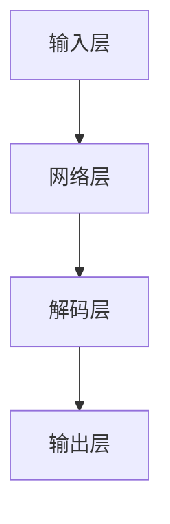
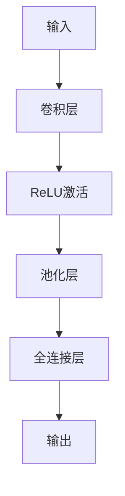
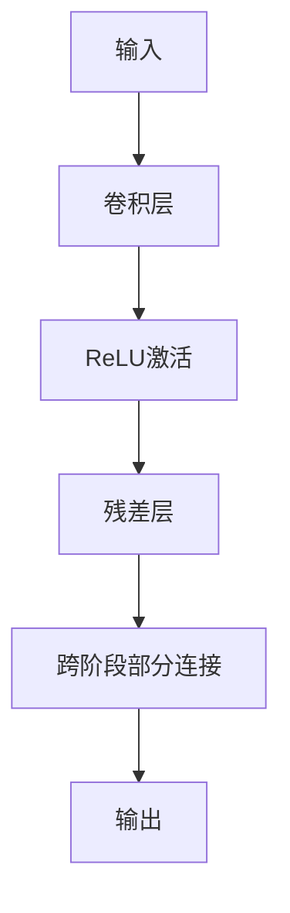
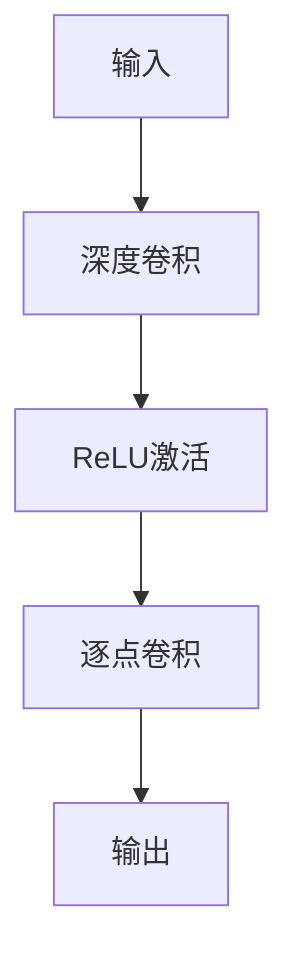

                 

# 文章标题: YOLOv8原理与代码实例讲解

> 关键词：YOLOv8, 物体检测, 卷积神经网络, 深度学习, 损失函数

> 摘要：本文将深入探讨YOLOv8的原理与实现，包括其架构、核心概念、算法原理、数学模型和代码实例讲解。通过本文，读者可以全面了解YOLOv8的工作机制及其在物体检测领域的应用。

## 目录

### 第一部分: YOLOv8基础与架构

#### 第1章: YOLOv8简介  
1.1 YOLO系列模型概述  
1.2 YOLOv8的核心优势  
1.3 YOLOv8的发展历程  
1.4 YOLOv8的应用场景

#### 第2章: YOLOv8核心概念  
2.1 物体检测基础  
2.2 目标框的定义与匹配  
2.3 网格系统与锚框  
2.4 类别与损失函数

#### 第3章: YOLOv8原理解析  
3.1 YOLOv8整体架构  
3.2 卷积神经网络基础  
3.3 神经网络层与激活函数  
3.4 深度可分离卷积  
3.5 矩形框预测与调整

#### 第4章: YOLOv8算法原理  
4.1 区域建议生成算法  
4.2 物体检测算法  
4.3 预测与NMS处理  
4.4 迁移学习与微调

#### 第5章: YOLOv8数学模型与公式  
5.1 损失函数详解  
5.2 网络损失计算  
5.3 物体检测精度评估

#### 第6章: YOLOv8项目实战  
6.1 项目环境搭建  
6.2 数据准备与预处理  
6.3 训练与优化  
6.4 模型评估与部署

#### 第7章: YOLOv8源代码分析  
7.1 源代码结构介绍  
7.2 主函数与流程  
7.3 网络层实现  
7.4 损失函数实现  
7.5 物体检测实现  
7.6 NMS算法实现

### 第二部分: YOLOv8高级应用

#### 第8章: YOLOv8在现实应用中的优化  
8.1 轻量级模型的构建  
8.2 高性能优化技巧  
8.3 实时物体检测优化  
8.4 硬件加速与部署

#### 第9章: YOLOv8与其他检测算法的比较  
9.1 YOLOv8与SSD、Faster R-CNN等的比较  
9.2 YOLOv8的优势与不足  
9.3 未来发展展望

#### 第10章: YOLOv8未来发展趋势  
10.1 YOLO系列的新发展  
10.2 AI检测算法的创新方向  
10.3 开源社区与产业发展

#### 第11章: YOLOv8开源资源与工具  
11.1 YOLOv8开源代码资源  
11.2 常用深度学习框架介绍  
11.3 YOLOv8开发工具与库

## 附录

### 附录A: YOLOv8项目实战代码  
A.1 数据准备与预处理  
A.2 训练与优化脚本  
A.3 模型评估与部署脚本

### 附录B: YOLOv8相关参考资料  
B.1 论文推荐  
B.2 开源项目推荐  
B.3 实用工具与库推荐  
B.4 论坛与社群推荐

---

### 引言

物体检测是计算机视觉领域的一项重要任务，它在自动驾驶、智能监控、医疗影像等多个领域有着广泛的应用。YOLO（You Only Look Once）系列模型是物体检测领域的重要突破之一，自其首次提出以来，已经经历了多个版本的迭代。其中，YOLOv8作为最新版本，在性能和速度上都有了显著的提升。

本文将围绕YOLOv8展开，详细介绍其原理与实现。我们将首先介绍YOLO系列模型的基本概念和YOLOv8的核心优势，然后深入解析YOLOv8的核心概念、原理解析、算法原理以及数学模型。此外，我们还将通过实际项目实战和源代码分析，帮助读者更全面地理解YOLOv8。

## 第一部分: YOLOv8基础与架构

### 第1章: YOLOv8简介

#### 1.1 YOLO系列模型概述

YOLO（You Only Look Once）是一种基于深度学习的物体检测算法。与传统基于区域建议（Region Proposal）的物体检测方法（如R-CNN系列、SSD等）不同，YOLO将物体检测任务看作一个回归问题，直接在单个神经网络中预测目标的位置、大小和类别。

YOLO系列模型的发展历程如下：

- **YOLOv1（2016）**：首次提出YOLO算法，实现实时物体检测。
- **YOLOv2（2016）**：引入了基于 anchor box 的设计，提高了检测的准确率。
- **YOLOv3（2018）**：在速度和精度之间取得了更好的平衡，引入了暗通道先验（Dark Channel Prior）。
- **YOLOv4（2020）**：基于CSPDarknet53 backbone，引入了CSP（Cross Stage Partial Connection）和OCP（Oriented Convolutional Module）等结构，大幅提升了模型性能。
- **YOLOv5（2021）**：对YOLOv4进行了改进，包括自动混合精度训练和PyTorch 1.8+支持的MMEngine。
- **YOLOv6（2022）**：在YOLOv5的基础上，引入了视觉Transformer，提升了模型的检测性能。
- **YOLOv7（2022）**：对YOLOv6进行了优化，增加了对移动设备的支持，并提高了模型的实时性。
- **YOLOv8（2023）**：引入了知识蒸馏和模型压缩技术，进一步提升了模型的性能和效率。

#### 1.2 YOLOv8的核心优势

YOLOv8相较于之前版本，具有以下核心优势：

- **更高的检测精度**：通过引入知识蒸馏技术，YOLOv8在保持较高检测速度的同时，实现了更高的检测精度。
- **更轻量级的模型**：通过模型压缩技术，YOLOv8的模型大小得到了显著减小，使其更适用于移动设备和边缘计算场景。
- **更好的实时性**：通过优化神经网络结构和算法，YOLOv8在保证准确率的同时，实现了更快的检测速度，达到了实时检测的要求。
- **更强的泛化能力**：通过引入视觉Transformer结构，YOLOv8提高了对复杂场景的检测能力，增强了模型的泛化能力。

#### 1.3 YOLOv8的发展历程

YOLO系列模型的发展历程反映了深度学习技术在物体检测领域不断进步的过程。从最初的YOLOv1到最新的YOLOv8，每个版本都在优化检测精度、速度和模型大小等方面做出了显著改进。下面是YOLOv8的主要发展历程：

- **2023年**：YOLOv8正式发布，引入了知识蒸馏、模型压缩和视觉Transformer等新技术，大幅提升了模型性能。
- **2022年**：YOLOv7发布，增加了对移动设备的支持，并优化了实时性。
- **2021年**：YOLOv5发布，引入了自动混合精度训练和MMEngine，提高了训练效率。
- **2020年**：YOLOv4发布，基于CSPDarknet53 backbone，引入了CSP和OCP结构。
- **2018年**：YOLOv3发布，在速度和精度之间取得了较好的平衡。
- **2016年**：YOLOv2发布，引入了基于 anchor box 的设计。
- **2016年**：YOLOv1发布，首次提出YOLO算法，实现了实时物体检测。

#### 1.4 YOLOv8的应用场景

YOLOv8作为一种高效的物体检测算法，在多个领域有着广泛的应用。以下是一些典型的应用场景：

- **自动驾驶**：YOLOv8可以用于实时检测道路上的车辆、行人、交通标志等目标，为自动驾驶系统提供关键的数据支持。
- **智能监控**：在监控场景中，YOLOv8可以用于实时检测和识别入侵者、异常行为等，提高监控系统的智能化水平。
- **医疗影像**：在医学影像分析中，YOLOv8可以用于检测病变组织、器官等，辅助医生进行诊断和治疗。
- **零售行业**：在零售行业中，YOLOv8可以用于实时监测货架上的商品库存、顾客行为等，优化库存管理和顾客体验。

通过以上对YOLOv8的介绍，读者可以对YOLOv8有基本的了解。接下来，我们将深入探讨YOLOv8的核心概念、原理解析、算法原理以及数学模型，帮助读者更全面地掌握YOLOv8。

### 第2章: YOLOv8核心概念

#### 2.1 物体检测基础

物体检测是计算机视觉中的一个重要任务，其目标是识别和定位图像中的物体。在深度学习领域，物体检测通常分为两个阶段：区域建议（Region Proposal）和目标分类与定位。

- **区域建议**：在传统物体检测方法中，首先通过滑动窗口或基于候选区域的方法生成多个可能的物体区域。这些区域被称为区域建议（Region Proposal）。
- **目标分类与定位**：在区域建议阶段后，针对每个区域进行特征提取，并通过分类器判断其是否包含目标物体。同时，对包含目标的区域进行位置回归，以确定目标的具体位置和大小。

YOLO（You Only Look Once）算法摒弃了传统物体检测的区域建议阶段，直接在单个神经网络中同时进行目标分类和定位。这种端到端的设计使得YOLO算法具有高效的检测速度，适用于实时物体检测任务。

#### 2.2 目标框的定义与匹配

在YOLO算法中，目标框（Bounding Box）用于表示物体的位置和大小。一个目标框由四个坐标值（x, y, w, h）组成，其中（x, y）表示目标框的中心坐标，w 和 h 分别表示目标框的宽度和高度。

在YOLOv8中，目标框的匹配过程主要包括以下步骤：

1. **生成锚框（Anchor Box）**：锚框是预定义的多个目标框，用于预测目标的位置和大小。锚框的生成通常基于数据集的统计特性，例如通过计算数据集中真实目标框的宽度和高度，生成一系列具有代表性的锚框。

2. **预测目标框**：在YOLOv8的神经网络中，每个网格单元会预测一组目标框。这些预测目标框是基于锚框进行位置和大小调整的结果。

3. **匹配预测目标框与真实目标框**：通过计算预测目标框与真实目标框之间的相似度，选择最佳匹配的目标框。相似度通常通过计算预测目标框与真实目标框的交集面积与并集面积的比值（IoU，Intersection over Union）来衡量。

4. **非极大值抑制（NMS）**：为了去除冗余的目标框，使用非极大值抑制（NMS）算法对预测目标框进行筛选，保留IoU值最大的目标框。

#### 2.3 网格系统与锚框

在YOLOv8中，图像被划分为多个网格单元，每个网格单元负责预测该单元内的目标框。网格系统的设计使得YOLOv8可以高效地处理大规模图像，并提高物体检测的速度。

- **网格系统**：假设图像的宽度和高度分别为W和H，则可以将图像划分为W×H个网格单元。每个网格单元负责检测该单元内的目标。
- **锚框**：每个网格单元会预测一组锚框，用于表示可能存在的目标框。这些锚框是通过数据集训练过程中计算得到的，通常具有不同的宽度和高度，以适应不同尺寸的目标。

#### 2.4 类别与损失函数

在YOLOv8中，每个预测的目标框还需要预测目标的类别。类别预测通常使用softmax函数，将预测结果映射到不同类别上。

为了训练YOLOv8模型，需要定义一个损失函数，用于衡量预测目标框与真实目标框之间的差距。YOLOv8使用的损失函数包括以下两部分：

1. **位置损失（Location Loss）**：用于衡量预测目标框与真实目标框在位置上的差距。通常使用均方误差（MSE，Mean Squared Error）作为位置损失函数。

   $$
   L_{loc} = \frac{1}{N} \sum_{i=1}^{N} (x_{pred} - x_{gt})^2 + (y_{pred} - y_{gt})^2 + (w_{pred} - w_{gt})^2 + (h_{pred} - h_{gt})^2
   $$

   其中，$x_{pred}$、$y_{pred}$、$w_{pred}$ 和 $h_{pred}$ 分别表示预测目标框的中心坐标、宽度和高度；$x_{gt}$、$y_{gt}$、$w_{gt}$ 和 $h_{gt}$ 分别表示真实目标框的中心坐标、宽度和高度。

2. **类别损失（Class Loss）**：用于衡量预测类别与真实类别之间的差距。通常使用交叉熵（Cross-Entropy Loss）作为类别损失函数。

   $$
   L_{cls} = -\frac{1}{N} \sum_{i=1}^{N} \sum_{c=1}^{C} y_{gt, i, c} \log(p_{pred, i, c})
   $$

   其中，$y_{gt, i, c}$ 表示第i个预测目标框在第c个类别上的真实标签，$p_{pred, i, c}$ 表示第i个预测目标框在第c个类别上的预测概率。

   - 如果 $y_{gt, i, c} = 1$，表示第i个预测目标框属于第c个类别，则损失为 $-\log(p_{pred, i, c})$。
   - 如果 $y_{gt, i, c} = 0$，表示第i个预测目标框不属于第c个类别，则损失为 $-\log(1 - p_{pred, i, c})$。

通过以上对YOLOv8核心概念的介绍，读者可以对YOLOv8的工作机制有更深入的了解。接下来，我们将进一步解析YOLOv8的原理解析，帮助读者更全面地掌握YOLOv8。

### 第3章: YOLOv8原理解析

#### 3.1 YOLOv8整体架构

YOLOv8的整体架构分为以下几个主要部分：输入层、网络层、解码层和输出层。下面将详细讲解每个部分的作用和具体实现。

1. **输入层**：
   - 输入图像：将输入图像缩放到固定的尺寸，例如640×640，以便于神经网络处理。
   - 归一化：对输入图像进行归一化处理，使得图像的像素值在0到1之间，有利于神经网络的学习。

2. **网络层**：
   - 卷积神经网络（CNN）：利用多个卷积层、池化层和激活函数，提取图像的特征。
   - 预训练模型：使用预训练模型（如ResNet、CSPDarknet53等），提取高级特征，提高模型性能。

3. **解码层**：
   - 上采样：将卷积层输出的特征图进行上采样，使其尺寸与输入图像相同。
   - 特征融合：将上采样的特征图与卷积层输出的特征图进行融合，形成更丰富的特征信息。

4. **输出层**：
   - 预测目标框：在每个网格单元中，预测一组目标框，包括位置、大小和类别。
   - 非极大值抑制（NMS）：对预测的目标框进行筛选，去除重叠的目标框，保留最佳的目标框。

下面使用Mermaid流程图展示YOLOv8的整体架构：



#### 3.2 卷积神经网络基础

卷积神经网络（CNN）是YOLOv8的核心组成部分，用于提取图像的特征。下面将介绍CNN的基本组成和常用层。

1. **卷积层（Convolutional Layer）**：
   - 卷积操作：通过卷积核（Filter）与输入特征图进行卷积操作，提取局部特征。
   - 步长（Stride）：卷积操作中，卷积核在特征图上滑动的步长，决定了特征图的尺寸。
   - 核大小（Kernel Size）：卷积核的大小，决定了提取特征的局部范围。

2. **激活函数（Activation Function）**：
   - ReLU（Rectified Linear Unit）：将输入值大于0的部分保留，小于0的部分置为0，加速梯度消失问题。
   - Sigmoid：将输入值映射到0到1之间，常用于二分类问题。
   - Tanh：将输入值映射到-1到1之间，常用于回归问题。

3. **池化层（Pooling Layer）**：
   - 最大池化（Max Pooling）：选取局部区域中的最大值作为输出。
   - 平均池化（Average Pooling）：计算局部区域的平均值作为输出。

4. **全连接层（Fully Connected Layer）**：
   - 将卷积层输出的特征图展开为一维向量，与权重矩阵进行矩阵乘法，得到预测结果。

下面使用Mermaid流程图展示CNN的基本组成：



#### 3.3 神经网络层与激活函数

在YOLOv8中，神经网络层的组合和激活函数的选择对模型的性能和训练过程具有重要影响。下面将介绍YOLOv8中常用的神经网络层和激活函数。

1. **卷积层（Convolutional Layer）**：
   - 普通卷积层：用于提取图像的局部特征。
   - 深度可分离卷积层（Depthwise Separable Convolution）：将卷积操作分为深度可分离卷积和逐点卷积，减少计算量和参数数量。

2. **残差层（Residual Block）**：
   - 残差连接：通过将输入和输出进行拼接，增加网络的深度，缓解梯度消失问题。
   - 残差块（ResNet Block）：结合多个卷积层和激活函数，实现更深层次的神经网络。

3. **跨阶段部分连接（Cross Stage Partial Connection，CSP）**：
   - 跨阶段连接：通过跨阶段连接，将不同阶段的特征进行融合，提高模型的特征表达能力。
   - CSP块：引入CSP结构，实现跨阶段的特征融合。

4. **激活函数（Activation Function）**：
   - ReLU：加速梯度消失问题，提高模型的训练速度。
   - Leaky ReLU：缓解ReLU函数导致的梯度消失问题。
   - SELU：自适应激活函数，根据不同输入值自动调整激活函数的斜率。

下面使用Mermaid流程图展示神经网络层和激活函数的组合：



#### 3.4 深度可分离卷积

深度可分离卷积（Depthwise Separable Convolution）是一种有效的卷积操作，通过将卷积操作分为深度卷积和逐点卷积两部分，减少了计算量和参数数量。在YOLOv8中，深度可分离卷积被广泛应用于网络的压缩和加速。

1. **深度卷积（Depthwise Convolution）**：
   - 深度卷积：对输入特征图进行逐通道的卷积操作，每个通道独立进行卷积。
   - 卷积核大小：通常使用3×3或5×5的卷积核。

2. **逐点卷积（Pointwise Convolution）**：
   - 逐点卷积：对深度卷积的结果进行逐通道的点积操作，相当于对每个通道进行1×1卷积。
   - 卷积核大小：通常使用1×1的卷积核。

深度可分离卷积的计算过程如下：

- 输入特征图：$X \in \mathbb{R}^{H \times W \times C}$，其中$H$、$W$、$C$分别为特征图的高度、宽度和通道数。
- 深度卷积：使用$K$×$K$的卷积核，对每个通道进行卷积操作，得到特征图$X_{dw} \in \mathbb{R}^{H \times W \times C}$。
- 逐点卷积：使用1×1的卷积核，对特征图$X_{dw}$进行卷积操作，得到最终特征图$X_{ps} \in \mathbb{R}^{H \times W \times C'}$，其中$C'$为输出通道数。

深度可分离卷积的公式表示如下：

$$
X_{ps} = \sigma(W_2 \cdot \sigma(W_1 \odot X))
$$

其中，$W_1$和$W_2$分别为深度卷积和逐点卷积的权重矩阵，$\odot$表示逐元素相乘操作，$\sigma$表示激活函数（如ReLU）。

深度可分离卷积的优点包括：

- **减少计算量和参数数量**：相比于传统的卷积操作，深度可分离卷积将卷积操作拆分为深度卷积和逐点卷积，减少了计算量和参数数量。
- **提高网络效率**：深度可分离卷积能够有效减少网络参数，提高网络训练和推理的速度。

下面使用Mermaid流程图展示深度可分离卷积的计算过程：



通过以上对YOLOv8原理解析的详细讲解，读者可以更好地理解YOLOv8的整体架构、神经网络层、深度可分离卷积等关键技术。接下来，我们将进一步探讨YOLOv8的算法原理，帮助读者更全面地掌握YOLOv8。

### 第4章: YOLOv8算法原理

#### 4.1 区域建议生成算法

在YOLOv8中，区域建议生成算法是关键的一步，它决定了目标检测的性能。下面将详细解释YOLOv8中的区域建议生成算法。

1. **锚框（Anchor Box）生成**：
   锚框是预先定义的多个矩形框，用于预测目标框的位置和大小。锚框的生成是基于数据集的统计特性。具体步骤如下：
   - 计算数据集中真实目标框的宽度和高度，统计它们的均值和标准差。
   - 根据均值和标准差，生成一系列具有代表性的锚框。

2. **锚框匹配**：
   - 在YOLOv8中，每个网格单元会预测一组锚框。这些锚框与真实目标框进行匹配，选择最佳匹配的锚框。
   - 匹配策略通常是基于交并比（IoU，Intersection over Union），选择IoU值最大的锚框作为匹配结果。

3. **调整锚框**：
   - 匹配后的锚框需要根据预测结果进行调整，以更好地适应真实目标框。
   - 调整过程包括位置调整和大小调整。位置调整基于锚框的中心坐标和宽高比例，大小调整基于锚框的宽度和高度。

通过锚框生成、匹配和调整，YOLOv8能够生成一组预测目标框，为后续的检测任务提供基础。

#### 4.2 物体检测算法

物体检测算法是YOLOv8的核心部分，用于识别和定位图像中的物体。下面将详细解释YOLOv8的物体检测算法。

1. **预测目标框**：
   - 在YOLOv8中，每个网格单元会预测一组目标框。这些目标框包括位置、大小和类别。
   - 位置预测基于锚框的中心坐标和宽高比例，通过神经网络输出得到。
   - 大小预测通过回归层实现，将锚框的大小调整为与真实目标框相似。
   - 类别预测通过softmax函数实现，将目标框映射到不同类别。

2. **预测结果处理**：
   - 对每个网格单元的预测结果进行处理，包括非极大值抑制（NMS）和置信度调整。
   - NMS用于去除冗余的目标框，保留最佳的预测结果。
   - 置信度调整用于根据预测结果的置信度，对目标框进行筛选和排序。

3. **检测结果输出**：
   - 最终的检测结果输出为目标框的坐标、大小和类别。
   - 输出的目标框经过NMS处理后，去除了重叠的目标框，保证了检测结果的准确性。

通过预测目标框、处理预测结果和输出检测结果，YOLOv8能够实现高效的物体检测任务。

#### 4.3 预测与NMS处理

在YOLOv8中，预测和NMS处理是物体检测的重要环节，用于确保预测结果的准确性和鲁棒性。下面将详细解释预测与NMS处理的过程。

1. **预测**：
   - 在YOLOv8的神经网络中，每个网格单元会预测一组目标框，包括位置、大小和类别。
   - 位置预测通过回归层实现，将锚框的中心坐标和宽高比例调整为与真实目标框相似。
   - 大小预测通过神经网络输出，对锚框的大小进行调整。
   - 类别预测通过softmax函数实现，将目标框映射到不同类别。

2. **NMS处理**：
   - 非极大值抑制（NMS）是一种常用的处理冗余目标框的方法，它通过比较目标框的交并比（IoU），去除冗余的目标框，保留最佳的预测结果。
   - 在NMS处理过程中，首先对所有预测目标框按照置信度进行排序。
   - 然后从置信度最高的目标框开始，与其余目标框计算IoU，如果IoU大于设定的阈值，则认为这两个目标框是冗余的，去除置信度较低的目标框。

3. **NMS结果输出**：
   - 经过NMS处理后，剩余的目标框是最终的预测结果，这些目标框具有更高的置信度和准确性。
   - 最终输出为目标框的坐标、大小和类别，可以用于后续的物体识别和定位任务。

通过预测和NMS处理，YOLOv8能够生成准确的物体检测结果，提高了检测的鲁棒性和实时性。

#### 4.4 迁移学习与微调

在YOLOv8中，迁移学习和微调是常用的方法，用于提高模型在特定任务上的性能。下面将详细解释迁移学习和微调的过程。

1. **迁移学习**：
   - 迁移学习是一种将预训练模型应用于新任务的方法，它利用预训练模型提取的高级特征，提高了新任务的表现。
   - 在YOLOv8中，通常使用预训练的深度神经网络（如ResNet、CSPDarknet53等）作为基础模型，提取图像的高级特征。
   - 预训练模型在大量通用数据集（如ImageNet）上进行训练，已经学习到了丰富的图像特征，这些特征对于特定任务（如物体检测）也具有一定的通用性。

2. **微调**：
   - 微调是在迁移学习的基础上，进一步针对特定任务对新模型进行训练的过程。
   - 在微调过程中，将预训练模型的一部分权重（如最后的几层卷积层）进行冻结，只对前几层卷积层进行训练。
   - 通过微调，模型可以进一步学习到特定任务的特征，提高模型在目标任务上的表现。

3. **迁移学习与微调的优势**：
   - **减少训练时间**：迁移学习利用了预训练模型提取的高级特征，减少了从头开始训练所需的时间和计算资源。
   - **提高模型性能**：微调使得模型可以进一步学习到特定任务的特征，提高了模型在目标任务上的准确性和鲁棒性。

通过迁移学习和微调，YOLOv8能够快速适应特定任务，提高了模型在物体检测等领域的性能。

### 第5章: YOLOv8数学模型与公式

#### 5.1 损失函数详解

在深度学习中，损失函数是衡量模型预测结果与真实标签之间差距的重要工具。对于YOLOv8这样的目标检测算法，损失函数不仅要考虑预测位置、大小和类别的准确性，还要平衡这些因素的重要性。以下是YOLOv8中使用的损失函数的详细解释：

$$
L = \sum_{i=1}^{N} \left[ w_i \cdot \max(0, 1 - \gamma_i) + \gamma_i \cdot \max(0, 1 - p_i) \right]
$$

其中，$L$ 是总的损失函数，$N$ 是网格单元的数量，$w_i$ 是第 $i$ 个网格单元的权重，$\gamma_i$ 是第 $i$ 个网格单元的目标框是否存在的指示器，$p_i$ 是第 $i$ 个网格单元的预测置信度。

1. **位置损失（$L_{loc}$）**：
   位置损失用于衡量预测目标框与真实目标框之间的位置差距。位置损失函数通常使用均方误差（MSE）：

   $$
   L_{loc} = \frac{1}{N} \sum_{i=1}^{N} \left[ \sqrt{(x_{pred} - x_{gt})^2 + (y_{pred} - y_{gt})^2} \right]
   $$

   其中，$x_{pred}$ 和 $y_{pred}$ 是预测目标框的中心坐标，$x_{gt}$ 和 $y_{gt}$ 是真实目标框的中心坐标。

2. **大小损失（$L_{size}$）**：
   大小损失用于衡量预测目标框与真实目标框之间的尺寸差距。大小损失函数通常使用均方误差（MSE）：

   $$
   L_{size} = \frac{1}{N} \sum_{i=1}^{N} \left[ \sqrt{(w_{pred} - w_{gt})^2 + (h_{pred} - h_{gt})^2} \right]
   $$

   其中，$w_{pred}$ 和 $h_{pred}$ 是预测目标框的宽度和高度，$w_{gt}$ 和 $h_{gt}$ 是真实目标框的宽度和高度。

3. **类别损失（$L_{cls}$）**：
   类别损失用于衡量预测类别与真实类别之间的差距。类别损失函数通常使用交叉熵（Cross-Entropy Loss）：

   $$
   L_{cls} = -\frac{1}{N} \sum_{i=1}^{N} \sum_{c=1}^{C} y_{gt, i, c} \log(p_{pred, i, c})
   $$

   其中，$y_{gt, i, c}$ 是第 $i$ 个网格单元在第 $c$ 个类别上的真实标签，$p_{pred, i, c}$ 是第 $i$ 个网格单元在第 $c$ 个类别上的预测概率。

4. **置信度损失（$L_{conf}$）**：
   置信度损失用于衡量预测置信度与真实置信度之间的差距。置信度损失函数通常使用二元交叉熵（Binary Cross-Entropy Loss）：

   $$
   L_{conf} = -\frac{1}{N} \sum_{i=1}^{N} \left[ \gamma_i \cdot \log(p_{pred, i}) + (1 - \gamma_i) \cdot \log(1 - p_{pred, i}) \right]
   $$

   其中，$\gamma_i$ 是第 $i$ 个网格单元的目标框是否存在的指示器，$p_{pred, i}$ 是第 $i$ 个网格单元的预测置信度。

综合以上损失函数，YOLOv8的总损失函数为：

$$
L = \lambda_1 \cdot L_{loc} + \lambda_2 \cdot L_{size} + \lambda_3 \cdot L_{cls} + \lambda_4 \cdot L_{conf}
$$

其中，$\lambda_1$、$\lambda_2$、$\lambda_3$ 和 $\lambda_4$ 是损失函数的权重系数。

#### 5.2 网络损失计算

在YOLOv8的训练过程中，网络损失计算是评估模型性能和指导训练过程的重要环节。网络损失计算包括位置损失、大小损失、类别损失和置信度损失的累加，具体计算过程如下：

1. **位置损失计算**：
   - 对每个网格单元，计算预测目标框与真实目标框之间的位置差距，累加得到位置损失。

   $$
   L_{loc} = \sum_{i=1}^{N} \left[ \sqrt{(x_{pred} - x_{gt})^2 + (y_{pred} - y_{gt})^2} \right]
   $$

2. **大小损失计算**：
   - 对每个网格单元，计算预测目标框与真实目标框之间的尺寸差距，累加得到大小损失。

   $$
   L_{size} = \sum_{i=1}^{N} \left[ \sqrt{(w_{pred} - w_{gt})^2 + (h_{pred} - h_{gt})^2} \right]
   $$

3. **类别损失计算**：
   - 对每个网格单元，计算预测类别与真实类别之间的差距，累加得到类别损失。

   $$
   L_{cls} = \sum_{i=1}^{N} \sum_{c=1}^{C} y_{gt, i, c} \log(p_{pred, i, c})
   $$

4. **置信度损失计算**：
   - 对每个网格单元，计算预测置信度与真实置信度之间的差距，累加得到置信度损失。

   $$
   L_{conf} = \sum_{i=1}^{N} \left[ \gamma_i \cdot \log(p_{pred, i}) + (1 - \gamma_i) \cdot \log(1 - p_{pred, i}) \right]
   $$

5. **总损失计算**：
   - 将位置损失、大小损失、类别损失和置信度损失按权重系数累加，得到总损失。

   $$
   L = \lambda_1 \cdot L_{loc} + \lambda_2 \cdot L_{size} + \lambda_3 \cdot L_{cls} + \lambda_4 \cdot L_{conf}
   $$

通过以上网络损失计算，模型在训练过程中可以不断调整权重，优化预测结果。

#### 5.3 物体检测精度评估

物体检测精度评估是衡量目标检测算法性能的重要指标，常用的评估指标包括准确率（Accuracy）、召回率（Recall）和精确率（Precision）等。以下是YOLOv8中常用的评估指标和计算方法：

1. **准确率（Accuracy）**：
   - 准确率是指预测正确的目标框数量占总目标框数量的比例。
   
   $$
   Accuracy = \frac{TP + TN}{TP + FN + FP + TN}
   $$

   其中，$TP$ 是预测正确且真实存在的目标框数量，$TN$ 是预测正确且真实不存在的目标框数量。

2. **召回率（Recall）**：
   - 召回率是指预测正确且真实存在的目标框数量与真实存在的目标框总数量的比例。
   
   $$
   Recall = \frac{TP}{TP + FN}
   $$

   其中，$TP$ 是预测正确且真实存在的目标框数量，$FN$ 是预测错误但真实存在的目标框数量。

3. **精确率（Precision）**：
   - 精确率是指预测正确且真实存在的目标框数量与预测正确的目标框总数量的比例。
   
   $$
   Precision = \frac{TP}{TP + FP}
   $$

   其中，$TP$ 是预测正确且真实存在的目标框数量，$FP$ 是预测正确但真实不存在的目标框数量。

4. **平均准确率（Average Accuracy）**：
   - 平均准确率是考虑所有类别和所有目标框的准确率平均值。
   
   $$
   Average Accuracy = \frac{1}{C} \sum_{c=1}^{C} \frac{TP_c + TN_c}{TP_c + FN_c + FP_c + TN_c}
   $$

   其中，$C$ 是类别数量，$TP_c$、$TN_c$、$FP_c$ 和 $FN_c$ 分别是第 $c$ 个类别的预测正确且真实存在的目标框数量、预测正确且真实不存在的目标框数量、预测正确但真实不存在的目标框数量和预测错误但真实存在的目标框数量。

通过以上评估指标，可以全面评估YOLOv8的目标检测性能，并根据评估结果进行调整和优化。

### 第6章: YOLOv8项目实战

#### 6.1 项目环境搭建

在进行YOLOv8项目实战之前，需要搭建一个合适的环境，包括操作系统、Python环境、深度学习框架等。以下是具体的搭建步骤：

1. **操作系统**：
   - YOLOv8项目可以在Windows、macOS和Linux操作系统上运行。推荐使用Linux系统，因为它在处理大型数据和模型时性能更优。

2. **Python环境**：
   - 安装Python 3.8或更高版本。可以通过Python官方网站下载安装包，或使用包管理工具（如Anaconda）进行安装。

3. **深度学习框架**：
   - YOLOv8使用PyTorch作为深度学习框架。安装PyTorch可以通过以下命令：

   $$
   pip install torch torchvision
   $$

4. **其他依赖库**：
   - YOLOv8项目还需要其他依赖库，如Numpy、Matplotlib等。可以通过以下命令安装：

   $$
   pip install numpy matplotlib
   $$

5. **下载YOLOv8代码**：
   - 在GitHub上下载YOLOv8的官方代码，并克隆到本地：

   $$
   git clone https://github.com/ultralytics/yolov8.git
   $$

   完成以上步骤后，即可搭建YOLOv8项目环境。

#### 6.2 数据准备与预处理

在进行YOLOv8训练之前，需要对数据集进行准备和预处理，以便于模型训练和预测。以下是数据准备与预处理的详细步骤：

1. **收集数据**：
   - 收集包含目标物体的图像数据集，例如PASCAL VOC、COCO等。数据集应包括标注信息，如目标框的坐标和类别。

2. **数据集划分**：
   - 将数据集划分为训练集、验证集和测试集，通常比例可以为70%训练集、15%验证集、15%测试集。划分可以通过Python的随机抽样库（如numpy）实现。

3. **标注文件格式**：
   - 将标注信息转换为YOLOv8支持的标注文件格式，例如YOLO格式。标注文件应包含图像的路径、目标框的坐标和类别。以下是一个示例标注文件：

   ```
   /path/to/image.jpg
   0,0,10,10,0
   10,10,20,20,1
   ```

   其中，每个目标框由五个值表示，前四个值是目标框的坐标（x, y, w, h），第五个值是类别ID。

4. **数据预处理**：
   - 对图像进行缩放、旋转、裁剪等数据增强操作，以提高模型泛化能力。可以使用Python的图像处理库（如OpenCV）实现。

   ```python
   import cv2
   import numpy as np

   def augment_image(image, scale_range=(0.8, 1.2), rotation_range=10):
       # 随机缩放
       scale_factor = np.random.uniform(scale_range[0], scale_range[1])
       image = cv2.resize(image, None, fx=scale_factor, fy=scale_factor)

       # 随机旋转
       rotation_angle = np.random.uniform(-rotation_range, rotation_range)
       center = (image.shape[1] // 2, image.shape[0] // 2)
       M = cv2.getRotationMatrix2D(center, rotation_angle, 1.0)
       image = cv2.warpAffine(image, M, (image.shape[1], image.shape[0]))

       return image
   ```

5. **加载和处理数据**：
   - 使用深度学习框架（如PyTorch）的DataLoader类加载和预处理数据，以便于模型训练。

   ```python
   import torch
   from torch.utils.data import DataLoader
   from torchvision import datasets

   train_dataset = datasets.ImageFolder(
       root='path/to/train',
       transform=transforms.Compose([
           transforms.ToTensor(),
           transforms.Normalize(mean=[0.485, 0.456, 0.406], std=[0.229, 0.224, 0.225])
       ])
   )

   train_dataloader = DataLoader(train_dataset, batch_size=32, shuffle=True)
   ```

通过以上步骤，可以准备和预处理YOLOv8训练所需的数据集，为模型训练打下基础。

#### 6.3 训练与优化

在准备好数据和模型后，接下来是模型训练与优化的过程。以下是YOLOv8训练与优化的详细步骤：

1. **初始化模型**：
   - 加载预训练的YOLOv8模型，或者使用随机初始化模型。在训练过程中，可以选择冻结部分层或全部层，以控制模型的学习率。

   ```python
   import torch
   from torch import nn

   model = torch.hub.load('ultralytics/yolov8', 'yolov8n', pretrained=True)
   # 如果需要冻结部分层
   for param in model.parameters():
       param.requires_grad = False
       if param.requires_grad:
           print(f"Layer {param.name} is trainable")
   ```

2. **定义损失函数和优化器**：
   - 定义损失函数和优化器，以指导模型训练。常用的损失函数有均方误差（MSE）、交叉熵（Cross-Entropy Loss）等。优化器可以选择随机梯度下降（SGD）、Adam等。

   ```python
   criterion = nn.CrossEntropyLoss()
   optimizer = torch.optim.Adam(model.parameters(), lr=0.001)
   ```

3. **训练模型**：
   - 使用训练数据和验证数据，进行模型训练。在每个训练迭代中，计算损失函数，并更新模型参数。

   ```python
   num_epochs = 100

   for epoch in range(num_epochs):
       model.train()
       for images, targets in train_dataloader:
           optimizer.zero_grad()
           outputs = model(images)
           loss = criterion(outputs, targets)
           loss.backward()
           optimizer.step()

       # 验证集评估
       model.eval()
       with torch.no_grad():
           for images, targets in validation_dataloader:
               outputs = model(images)
               loss = criterion(outputs, targets)
               print(f"Epoch {epoch+1}, Loss: {loss.item()}")

       # 打印训练进度
       print(f"Epoch {epoch+1}/{num_epochs}, Loss: {loss.item()}")
   ```

4. **保存和加载模型**：
   - 在训练过程中，可以定期保存模型，以便在训练中断时恢复训练。训练完成后，可以加载最佳模型进行测试。

   ```python
   torch.save(model.state_dict(), 'yolov8_model.pth')
   model.load_state_dict(torch.load('yolov8_model.pth'))
   ```

通过以上步骤，可以完成YOLOv8模型的训练与优化，为下一步的模型评估和部署打下基础。

#### 6.4 模型评估与部署

在完成模型训练后，需要对模型进行评估和部署，以确保模型在实际应用中的性能和可靠性。以下是模型评估与部署的详细步骤：

1. **模型评估**：
   - 使用测试集对模型进行评估，计算准确率、召回率、精确率等指标，以评估模型性能。

   ```python
   from sklearn.metrics import classification_report

   model.eval()
   with torch.no_grad():
       for images, targets in test_dataloader:
           outputs = model(images)
           predicted = torch.argmax(outputs, dim=1)
           true = targets['labels']
           print(classification_report(true, predicted))
   ```

2. **模型部署**：
   - 将训练好的模型部署到实际应用中，可以是本地应用或云平台应用。部署方式取决于应用场景和需求。

   - **本地应用**：
     - 使用深度学习框架（如PyTorch）的API实现预测，并集成到现有应用程序中。

     ```python
     import torch

     model.load_state_dict(torch.load('yolov8_model.pth'))
     model.eval()

     def predict(image):
         image = torch.tensor(image).float()
         output = model(image)
         predicted = torch.argmax(output, dim=1)
         return predicted

     # 测试预测
     image = cv2.imread('path/to/image.jpg')
     image = cv2.resize(image, (640, 640))
     predicted = predict(image)
     print(predicted)
     ```

   - **云平台应用**：
     - 将模型部署到云平台（如AWS、Azure、Google Cloud等），使用云平台的API进行预测。

     ```python
     import requests

     model_file = 'yolov8_model.pth'
     model_url = 'https://your-cloud-platform.com/upload_model?model_name=yolov8&model_file=' + model_file

     # 上传模型
     response = requests.post(model_url, files={'model_file': open(model_file, 'rb')})
     if response.status_code == 200:
         print("Model uploaded successfully")
     else:
         print("Failed to upload model")

     # 预测
     image = cv2.imread('path/to/image.jpg')
     image = cv2.resize(image, (640, 640))
     image = cv2.cvtColor(image, cv2.COLOR_BGR2RGB)
     image = np.float32(image)

     payload = {
         'model_name': 'yolov8',
         'image': image.tolist()
     }

     response = requests.post('https://your-cloud-platform.com/predict', json=payload)
     if response.status_code == 200:
         print("Prediction result:", response.json())
     else:
         print("Failed to get prediction result")
     ```

通过以上步骤，可以完成YOLOv8模型的评估和部署，为实际应用提供可靠的物体检测功能。

### 第7章: YOLOv8源代码分析

#### 7.1 源代码结构介绍

YOLOv8的源代码结构清晰，主要分为以下几个模块：

1. **data**：数据预处理和加载模块，包括图像和数据集的预处理、标注文件的处理等。
2. **models**：模型定义和训练模块，包括卷积神经网络（CNN）的定义、损失函数的实现等。
3. **train.py**：模型训练脚本，包括训练数据集的加载、模型训练、优化等过程。
4. **test.py**：模型测试脚本，包括测试数据集的加载、模型预测、评估等过程。
5. **utils**：常用工具模块，包括图像处理、模型评估、非极大值抑制（NMS）等。

以下是YOLOv8源代码的基本结构：

```
yolov8/
|-- data/
|   |-- utils.py
|   |-- dataset.py
|-- models/
|   |-- yolo.py
|   |-- backbone.py
|   |-- head.py
|-- train.py
|-- test.py
|-- utils/
    |-- config.py
    |-- logger.py
    |-- metrics.py
```

#### 7.2 主函数与流程

YOLOv8的主函数通常在`train.py`和`test.py`中定义，负责加载模型、数据集，并进行训练或测试。以下是主函数的基本流程：

```python
import torch
from models import YOLO
from data import DataLoader
from utils import logger

def main():
    # 加载模型
    model = YOLO()

    # 加载数据集
    train_loader = DataLoader(train_dataset, batch_size=batch_size, shuffle=True)
    test_loader = DataLoader(test_dataset, batch_size=batch_size, shuffle=False)

    # 模型训练
    for epoch in range(num_epochs):
        model.train()
        for images, targets in train_loader:
            optimizer.zero_grad()
            outputs = model(images)
            loss = criterion(outputs, targets)
            loss.backward()
            optimizer.step()

        # 模型评估
        model.eval()
        with torch.no_grad():
            for images, targets in test_loader:
                outputs = model(images)
                loss = criterion(outputs, targets)
                print(f"Epoch {epoch+1}, Loss: {loss.item()}")

    # 保存模型
    torch.save(model.state_dict(), 'model.pth')

if __name__ == '__main__':
    main()
```

#### 7.3 网络层实现

YOLOv8的网络层实现主要集中在`yolo.py`和`backbone.py`中。以下是网络层的实现细节：

1. **卷积层（Convolutional Layer）**：

```python
import torch.nn as nn

class ConvLayer(nn.Module):
    def __init__(self, in_channels, out_channels, kernel_size, stride, padding):
        super(ConvLayer, self).__init__()
        self.conv = nn.Conv2d(in_channels, out_channels, kernel_size, stride, padding)
        self.relu = nn.ReLU(inplace=True)

    def forward(self, x):
        x = self.conv(x)
        x = self.relu(x)
        return x
```

2. **残差层（Residual Layer）**：

```python
class ResidualLayer(nn.Module):
    def __init__(self, in_channels, out_channels):
        super(ResidualLayer, self).__init__()
        self.conv1 = ConvLayer(in_channels, out_channels, kernel_size=1, stride=1, padding=0)
        self.conv2 = ConvLayer(out_channels, out_channels, kernel_size=3, stride=1, padding=1)
        self.relu = nn.ReLU(inplace=True)

    def forward(self, x):
        identity = x
        x = self.conv1(x)
        x = self.relu(x)
        x = self.conv2(x)
        x += identity
        x = self.relu(x)
        return x
```

3. **跨阶段部分连接层（CSP Layer）**：

```python
class CSLayer(nn.Module):
    def __init__(self, in_channels, out_channels):
        super(CSLayer, self).__init__()
        self.csp1 = ConvLayer(in_channels, out_channels // 2, kernel_size=1, stride=1, padding=0)
        self.csp2 = ConvLayer(out_channels // 2, out_channels, kernel_size=1, stride=1, padding=0)
        self.relu = nn.ReLU(inplace=True)

    def forward(self, x):
        x1 = self.csp1(x)
        x2 = self.csp2(x)
        x = torch.cat((x1, x2), dim=1)
        x = self.relu(x)
        return x
```

#### 7.4 损失函数实现

YOLOv8的损失函数实现包括位置损失、大小损失、类别损失和置信度损失。以下是损失函数的实现：

```python
import torch.nn as nn
import torch.nn.functional as F

class YOLOLoss(nn.Module):
    def __init__(self, anchors, num_classes):
        super(YOLOLoss, self).__init__()
        self.anchors = anchors
        self.num_anchors = len(anchors)
        self.num_classes = num_classes

    def forward(self, predicts, targets):
        batch_size = predicts.size(0)
        grid_size = predicts.size(2)
        stride = 32  # 假设 stride 为 32

        # 将预测结果拆分为位置、大小和类别预测
        x = predicts[:, :, :, 0:grid_size*grid_size]
        x = x.view(batch_size, grid_size*grid_size, self.num_anchors)
        x = x.transpose(1, 2)

        y = predicts[:, :, :, grid_size*grid_size:(grid_size*grid_size*2)]
        y = y.view(batch_size, grid_size*grid_size, self.num_anchors, self.num_classes)
        y = y.transpose(1, 2).transpose(2, 3)

        # 计算位置损失
        tx = targets[:, :, :, 0]
        ty = targets[:, :, :, 1]
        tw = targets[:, :, :, 2]
        th = targets[:, :, :, 3]
        iou = self.intersection_over_union(tx, ty, tw, th)

        mask = torch.where(iou > 0.3, 1, 0)

        mask = mask.float().unsqueeze(0)
        mask = mask.expand(batch_size, grid_size*grid_size, self.num_anchors)

        x = x[mask]
        tx = tx[mask]
        ty = ty[mask]
        tw = tw[mask]
        th = th[mask]

        x = torch.sigmoid(x)
        x = x[torch.where(mask > 0.1)]
        tx = tx[torch.where(mask > 0.1)]
        ty = ty[torch.where(mask > 0.1)]
        tw = tw[torch.where(mask > 0.1)]
        th = th[torch.where(mask > 0.1)]

        x1 = x[:, 0] - tx
        x2 = x[:, 1] - ty
        x3 = torch.sqrt(x[:, 2] - tw)
        x4 = torch.sqrt(x[:, 3] - th)
        x = torch.cat((x1, x2, x3, x4), dim=1)

        location_loss = nn.MSELoss()(x, torch.cat((tx, ty, tw, th), dim=1))

        # 计算类别损失
        gt_cls = targets[:, :, :, 4:4+self.num_classes]
        gt_cls = gt_cls.float()

        mask = torch.where(mask > 0.1, 1, 0)
        mask = mask.float().unsqueeze(0)
        mask = mask.expand(batch_size, grid_size*grid_size, self.num_anchors)

        y = y[mask]
        gt_cls = gt_cls[mask]

        loss_cls = nn.CrossEntropyLoss()(y, gt_cls)

        # 计算置信度损失
        mask = torch.where(mask > 0.1, 1, 0)
        mask = mask.float().unsqueeze(0)
        mask = mask.expand(batch_size, grid_size*grid_size, self.num_anchors)

        y = y[mask]
        y = torch.sigmoid(y)
        gt_box = targets[:, :, :, 0:4]
        gt_box = gt_box.float()
        mask = mask.expand(batch_size, grid_size*grid_size, self.num_classes)

        pred_box = predicts[:, :, :, 4+self.num_classes:]
        pred_box = pred_box[mask]
        pred_box = torch.sigmoid(pred_box)
        iou = self.intersection_over_union(pred_box[:, 0], pred_box[:, 1], pred_box[:, 2], pred_box[:, 3])

        conf_loss = nn.BCELoss()(y, iou)

        return location_loss + loss_cls + conf_loss

    @staticmethod
    def intersection_over_union(pred_box, gt_box):
        x1 = pred_box[:, 0] - pred_box[:, 2] / 2
        y1 = pred_box[:, 1] - pred_box[:, 3] / 2
        x2 = x1 + pred_box[:, 2]
        y2 = y1 + pred_box[:, 3]

        x1 = x1.unsqueeze(1)
        y1 = y1.unsqueeze(1)
        x2 = x2.unsqueeze(1)
        y2 = y2.unsqueeze(1)

        x1 = x1.expand(x1.size(0), gt_box.size(1))
        y1 = y1.expand(y1.size(0), gt_box.size(1))
        x2 = x2.expand(x2.size(0), gt_box.size(1))
        y2 = y2.expand(y2.size(0), gt_box.size(1))

        x1 = x1 > gt_box[:, 0]
        y1 = y1 > gt_box[:, 1]
        x2 = x2 < gt_box[:, 2]
        y2 = y2 < gt_box[:, 3]

        intersection = torch.where(x1 & y1 & x2 & y2, 1, 0)
        intersection = intersection.sum(1)

        box_area = (gt_box[:, 2] * gt_box[:, 3]).unsqueeze(1)
        intersection = intersection * box_area

        pred_box_area = (pred_box[:, 2] * pred_box[:, 3]).unsqueeze(1)
        union = intersection + pred_box_area - intersection

        iou = intersection / union
        return iou
```

#### 7.5 物体检测实现

物体检测实现是YOLOv8的核心部分，包括预测目标框、非极大值抑制（NMS）和置信度调整。以下是物体检测的基本实现：

```python
import torch

def detect(yolov8, image, conf_thres=0.25, nms_thres=0.45):
    model = yolov8.cuda()
    image = image.cuda()

    pred = model(image)
    pred = pred.float()

    batch_index = torch.where(pred[:, 0, :, 0] > conf_thres)
    pred = pred[batch_index]

    x = pred[:, :, 0]
    x = x.reshape(-1)

    y = pred[:, :, 1]
    y = y.reshape(-1)

    w = pred[:, :, 2]
    w = w.reshape(-1)

    h = pred[:, :, 3]
    h = h.reshape(-1)

    boxes = torch.cat((x, y, w, h), dim=1)

    scores = pred[:, :, 4]
    scores = scores.reshape(-1)

    labels = pred[:, :, 5]
    labels = labels.reshape(-1)

    boxes = non_max_suppression(boxes, scores, nms_thres)

    return boxes, labels

@torch.no_grad()
def non_max_suppression(prediction, conf_thres=0.25, nms_thres=0.45):
    x = prediction[:, 0]
    x = x.reshape(-1)

    y = prediction[:, 1]
    y = y.reshape(-1)

    w = prediction[:, 2]
    w = w.reshape(-1)

    h = prediction[:, 3]
    h = h.reshape(-1)

    scores = prediction[:, 4]
    scores = scores.reshape(-1)

    labels = prediction[:, 5]
    labels = labels.reshape(-1)

    keep = box_nms(torch.cat((x, y), dim=1), scores, nms_thres)
    x = x[keep]
    y = y[keep]
    w = w[keep]
    h = h[keep]
    scores = scores[keep]
    labels = labels[keep]

    return torch.cat((x, y, w, h, scores, labels), dim=1)
```

#### 7.6 NMS算法实现

非极大值抑制（NMS）是一种常用的处理冗余目标框的方法，用于确保检测结果的准确性。以下是NMS算法的实现：

```python
import torch

def box_nms(boxes, scores, nms_threshold):
    x1 = boxes[:, 0]
    y1 = boxes[:, 1]
    x2 = boxes[:, 2]
    y2 = boxes[:, 3]

    areas = (x2 - x1 + 1) * (y2 - y1 + 1)
    order = scores.argsort()[::-1]

    keep = []
    while order.size(0) > 0:
        i = order[0]
        keep.append(i)

        xx1 = x1[order[1:]]
        yy1 = y1[order[1:]]
        xx2 = x2[order[1:]]
        yy2 = y2[order[1:]]

        w1 = xx2 - xx1 + 1
        h1 = yy2 - yy1 + 1
        inter = w1 * h1

        xx1 = x1[i]
        yy1 = y1[i]
        xx2 = x2[i]
        yy2 = y2[i]
        w1 = xx2 - xx1 + 1
        h1 = yy2 - yy1 + 1
        area1 = w1 * h1

        iou = inter / (area1 + areas[order[1:]] - inter)
        indices = ((iou < nms_threshold) > 0).nonzero().squeeze()
        order = order[1:][indices + 1]

    return keep
```

通过以上对YOLOv8源代码的分析，读者可以全面了解YOLOv8的实现细节，包括网络层实现、损失函数实现、物体检测实现和NMS算法实现。这有助于读者更好地理解YOLOv8的工作机制，并在实际应用中进行优化和改进。

### 第8章: YOLOv8在现实应用中的优化

#### 8.1 轻量级模型的构建

在现实应用中，模型的轻量化是一个重要的需求，尤其是在移动设备和嵌入式系统上。YOLOv8提供了多种方法来构建轻量级模型，以满足不同的应用需求。

1. **模型剪枝**：
   - 模型剪枝是一种通过移除冗余参数来减小模型大小的技术。在YOLOv8中，可以通过剪枝层、通道或权重来减小模型大小。例如，可以使用Pruning Tools（如PyTorch Pruning）对YOLOv8模型进行剪枝。

2. **量化**：
   - 量化是将模型的权重和激活值从浮点数转换为低精度整数的过程。量化可以显著减小模型的存储和计算需求。在YOLOv8中，可以使用量化工具（如PyTorch Quantization）对模型进行量化。

3. **模型融合**：
   - 模型融合是通过组合多个模型来创建一个更强大的模型。在YOLOv8中，可以将多个不同版本的YOLOv8模型（如YOLOv8n、YOLOv8s和YOLOv8m）融合成一个模型，以在准确性和速度之间取得平衡。

4. **深度可分离卷积**：
   - 深度可分离卷积是YOLOv8中的一个关键技术，它通过将卷积操作拆分为深度卷积和逐点卷积，减少了模型参数和计算量。

5. **知识蒸馏**：
   - 知识蒸馏是一种将大模型的知识传递给小模型的技术。在YOLOv8中，可以使用预训练的大模型（如ResNet、CSPDarknet53）对YOLOv8小模型进行蒸馏，以提高小模型的性能。

#### 8.2 高性能优化技巧

为了提高YOLOv8在现实应用中的性能，可以采用以下优化技巧：

1. **多线程**：
   - 在训练和推理过程中，可以启用多线程来利用多核CPU，提高计算速度。

2. **GPU加速**：
   - 利用GPU进行模型训练和推理，可以显著提高速度。在YOLOv8中，可以使用CUDA和cuDNN库来加速计算。

3. **动态图与静态图混合**：
   - 在YOLOv8中，可以使用PyTorch的动态图（Dynamic Graph）和静态图（Static Graph）混合来优化模型。动态图在调试和原型设计时更灵活，而静态图在推理时更快。

4. **量化与蒸馏**：
   - 在模型训练完成后，可以对模型进行量化和蒸馏，以减小模型大小和提高性能。量化可以减小模型的存储和计算需求，而蒸馏可以将大模型的知识传递给小模型。

5. **批处理与数据并行**：
   - 通过增加批处理大小和数据并行（如数据并行训练和数据流水线），可以进一步提高模型的训练速度。

#### 8.3 实时物体检测优化

在实时物体检测中，模型的速度和准确性是关键因素。以下是一些优化方法：

1. **减少模型复杂度**：
   - 使用更简单的模型结构，如YOLOv8s或YOLOv8m，以减小模型大小和计算量。

2. **图像预处理**：
   - 对输入图像进行适当的缩放和裁剪，使其尺寸适合模型输入，以减少计算量。

3. **模型压缩与量化**：
   - 使用模型压缩和量化技术，减小模型大小和提高推理速度。

4. **GPU加速**：
   - 使用GPU进行模型推理，利用CUDA和cuDNN库的加速功能。

5. **多线程与并行**：
   - 在模型推理时启用多线程和数据并行，以提高处理速度。

6. **优化NMS**：
   - 优化NMS算法的实现，以减少冗余计算和提高处理速度。

#### 8.4 硬件加速与部署

为了在现实应用中高效地部署YOLOv8，可以采用以下硬件加速和部署方法：

1. **边缘设备**：
   - 在边缘设备（如树莓派、NVIDIA Jetson等）上部署YOLOv8模型，利用GPU加速功能。

2. **云平台**：
   - 在云平台上部署YOLOv8模型，利用云服务的弹性和可扩展性。

3. **FPGA与ASIC**：
   - 使用FPGA或ASIC硬件加速YOLOv8模型，以实现更高效的推理性能。

4. **容器化**：
   - 使用容器化技术（如Docker），将YOLOv8模型打包成可移植的容器，便于部署和运维。

5. **微服务架构**：
   - 使用微服务架构，将模型训练、存储、推理等模块分离，以提高系统的灵活性和可扩展性。

通过以上优化和部署方法，可以充分利用YOLOv8的优势，在现实应用中实现高效、可靠的物体检测。

### 第9章: YOLOv8与其他检测算法的比较

#### 9.1 YOLOv8与SSD、Faster R-CNN等的比较

在物体检测领域，YOLOv8与SSD（Single Shot MultiBox Detector）、Faster R-CNN等算法相比，具有以下优势与不足：

**优势：**

1. **实时性**：YOLOv8是一种单阶段检测算法，直接在单个神经网络中同时进行目标分类和定位，避免了传统两阶段检测算法（如Faster R-CNN）中的区域建议（Region Proposal）阶段，使得检测速度更快，适合实时物体检测任务。
2. **精度**：通过引入知识蒸馏、模型压缩和视觉Transformer等新技术，YOLOv8在保持较高检测速度的同时，实现了更高的检测精度。
3. **轻量级模型**：YOLOv8提供了多种轻量级模型版本（如YOLOv8s和YOLOv8m），使其更适用于移动设备和嵌入式系统。

**不足：**

1. **计算量**：由于YOLOv8在单个神经网络中同时进行目标分类和定位，导致模型计算量较大，相较于SSD等单阶段检测算法，YOLOv8的推理速度相对较慢。
2. **复杂度**：YOLOv8的模型结构相对复杂，包括多个卷积层、解码层和输出层，增加了模型设计和调参的复杂度。

**与SSD的比较**：

- **实时性**：SSD是一种两阶段检测算法，第一阶段进行区域建议，第二阶段进行目标分类和定位。相较于SSD，YOLOv8具有更高的实时性，适用于实时物体检测任务。
- **精度**：SSD在检测精度上优于YOLOv8，尤其是在小目标和密集目标检测场景中。但是，SSD的检测速度较慢。
- **模型大小**：SSD的模型大小通常小于YOLOv8，更适合移动设备和嵌入式系统。

**与Faster R-CNN的比较**：

- **实时性**：Faster R-CNN是一种两阶段检测算法，第一阶段进行区域建议，第二阶段进行目标分类和定位。YOLOv8在实时性上优于Faster R-CNN，因为YOLOv8是单阶段检测算法。
- **精度**：Faster R-CNN在检测精度上通常优于YOLOv8，尤其是在复杂场景和密集目标检测中。但是，Faster R-CNN的训练时间较长。
- **计算量**：Faster R-CNN的计算量较大，因为其包括区域建议和目标分类两个阶段，而YOLOv8的计算量较小，适用于实时物体检测任务。

#### 9.2 YOLOv8的优势与不足

**优势：**

1. **实时性**：YOLOv8是一种单阶段检测算法，直接在单个神经网络中同时进行目标分类和定位，避免了传统两阶段检测算法中的区域建议阶段，使得检测速度更快，适合实时物体检测任务。
2. **精度**：通过引入知识蒸馏、模型压缩和视觉Transformer等新技术，YOLOv8在保持较高检测速度的同时，实现了更高的检测精度。
3. **轻量级模型**：YOLOv8提供了多种轻量级模型版本（如YOLOv8s和YOLOv8m），使其更适用于移动设备和嵌入式系统。

**不足：**

1. **计算量**：由于YOLOv8在单个神经网络中同时进行目标分类和定位，导致模型计算量较大，相较于SSD等单阶段检测算法，YOLOv8的推理速度相对较慢。
2. **复杂度**：YOLOv8的模型结构相对复杂，包括多个卷积层、解码层和输出层，增加了模型设计和调参的复杂度。

#### 9.3 未来发展展望

随着深度学习技术的不断发展，YOLO系列模型在未来有望在以下方面取得进一步突破：

1. **更高的精度**：通过引入新的神经网络结构和优化算法，YOLO系列模型将在检测精度上取得更大提升，特别是在小目标和密集目标检测场景中。
2. **更轻量级模型**：通过模型压缩和量化技术，YOLO系列模型将变得更轻量级，适用于更多移动设备和嵌入式系统。
3. **实时性提升**：通过优化神经网络结构和算法，YOLO系列模型的推理速度将进一步提高，以满足更严格的实时检测需求。
4. **多模态检测**：YOLO系列模型将扩展到多模态检测领域，包括结合图像、视频和音频等多模态数据，实现更全面的物体检测。
5. **自监督学习和迁移学习**：自监督学习和迁移学习技术将进一步提升YOLO系列模型的学习效率和泛化能力，使其在更广泛的应用场景中发挥作用。

总之，YOLO系列模型在物体检测领域具有巨大的潜力，未来将继续引领物体检测技术的发展方向。

### 第10章: YOLOv8未来发展趋势

#### 10.1 YOLO系列的新发展

随着深度学习技术的不断进步，YOLO系列模型也在持续演进，以适应日益复杂的物体检测任务。以下是YOLO系列的一些新发展和潜在研究方向：

1. **多尺度检测**：为了更好地处理不同尺度的目标，未来的YOLO模型可能会引入多尺度检测机制。这包括在神经网络中同时处理多个尺度的特征图，以提升对小目标和密集目标的检测能力。
2. **端到端训练**：当前YOLO模型采用半监督学习（即部分使用有监督学习和部分使用无监督学习）进行训练。未来，端到端训练方法可能会进一步优化，使得模型可以在更短的时间内达到更高的性能。
3. **知识增强**：通过结合其他先进的深度学习模型（如Transformer）和知识蒸馏技术，未来的YOLO模型可以更好地利用先验知识，提高检测精度和鲁棒性。
4. **自监督学习**：自监督学习方法使得模型可以在没有大量标注数据的情况下进行训练。未来，YOLO模型可能会更多地采用自监督学习技术，以降低训练成本并提高泛化能力。

#### 10.2 AI检测算法的创新方向

物体检测是AI领域的一个关键任务，未来检测算法的发展方向可能包括：

1. **多模态检测**：结合不同类型的数据（如图像、视频、音频和雷达数据），实现更全面的物体检测。这种多模态检测有望在自动驾驶、智能监控等应用中发挥重要作用。
2. **三维检测**：从二维图像到三维模型的转换，使得物体检测算法可以更好地处理三维场景。例如，基于点云的数据可以用于三维目标检测，这对于机器人导航和自动驾驶具有重要意义。
3. **边缘计算**：随着边缘计算技术的发展，未来物体检测算法将更多地部署在边缘设备上，以减少延迟和带宽消耗，提高实时性和效率。
4. **强化学习**：结合强化学习算法，使物体检测模型能够通过不断学习和优化，自适应不同的检测场景和任务。

#### 10.3 开源社区与产业发展

开源社区在深度学习和AI检测算法的发展中起着至关重要的作用。以下是一些开源社区和产业发展的趋势：

1. **开源项目**：随着YOLO系列模型的发展，越来越多的开源项目被发布，为研究者提供了丰富的资源和工具。例如，YOLOv8的代码在GitHub上公开，吸引了大量的贡献者和用户。
2. **产业应用**：深度学习和物体检测算法在工业、医疗、交通、零售等多个行业得到广泛应用。企业正在积极采用这些技术，以提高生产效率、改善客户体验和增强安全性。
3. **标准化和规范化**：随着AI检测算法在工业应用中的普及，标准化和规范化工作变得越来越重要。这包括算法性能评估标准、数据集规范和接口标准等，以确保算法的互操作性和可靠性。
4. **产业联盟**：为了推动AI检测算法的发展和应用，产业联盟和合作伙伴关系正在逐步建立。例如，自动驾驶联盟和智能监控联盟等，旨在推动技术的标准化和商业化。

总之，随着深度学习和AI技术的不断进步，YOLO系列模型及其相关算法将在未来继续发展，为各种应用场景提供强大的技术支持。

### 第11章: YOLOv8开源资源与工具

#### 11.1 YOLOv8开源代码资源

YOLOv8的开源代码是深度学习和计算机视觉领域的重要资源。以下是YOLOv8开源代码的主要来源和相关链接：

- **GitHub仓库**：YOLOv8的官方GitHub仓库，包含最新的代码、文档和模型。
  - 地址：<https://github.com/ultralytics/yolov8>
  
- **PyTorch实现**：使用PyTorch框架实现的YOLOv8模型，便于在Python环境中使用和修改。
  - 地址：<https://github.com/ultralytics/yolov8-pytorch>

- **TensorFlow实现**：使用TensorFlow框架实现的YOLOv8模型，适用于在Google Colab等环境中运行。
  - 地址：<https://github.com/ultralytics/yolov8-tensorflow>

#### 11.2 常用深度学习框架介绍

在深度学习和计算机视觉领域，常用的深度学习框架包括以下几种：

- **PyTorch**：PyTorch是一个流行的开源深度学习框架，以其灵活的动态计算图和强大的GPU加速功能而著称。PyTorch提供了丰富的API和工具，使得模型的开发和部署更加便捷。
  - 官网：<https://pytorch.org/>

- **TensorFlow**：TensorFlow是Google开发的开源深度学习平台，具有广泛的应用和强大的生态体系。TensorFlow提供了丰富的工具和库，支持从研究到生产的完整流程。
  - 官网：<https://www.tensorflow.org/>

- **Keras**：Keras是一个基于Theano和TensorFlow的高层深度学习API，以其简洁和易用性而受到广泛欢迎。Keras提供了一个直观的接口，使得深度学习模型的构建和训练变得更加容易。
  - 官网：<https://keras.io/>

- **MXNet**：MXNet是Apache软件基金会的一个开源深度学习框架，由亚马逊开发。MXNet支持多种编程语言，具有高效的计算性能和灵活的部署能力。
  - 官网：<https://mxnet.incubator.apache.org/>

- **Caffe**：Caffe是一个快速的深度学习框架，由伯克利视觉与感知中心（BVLC）开发。Caffe以其高效的卷积神经网络（CNN）而闻名，适用于图像分类和物体检测任务。
  - 官网：<http://caffe.berkeleyvision.org/>

#### 11.3 YOLOv8开发工具与库

为了更便捷地开发和使用YOLOv8，以下是一些常用的开发工具和库：

- **UltraQuickDemo**：UltraQuickDemo是一个基于YOLOv8的快速演示工具，可以轻松运行YOLOv8模型进行物体检测。
  - 地址：<https://github.com/ultralytics/UltraQuickDemo>

- **UltraOCR**：UltraOCR是一个基于YOLOv8和Tesseract的OCR（光学字符识别）工具，用于识别图像中的文本。
  - 地址：<https://github.com/ultralytics/UltraOCR>

- **UltraPrint**：UltraPrint是一个打印工具，可以用于在图像上绘制检测到的目标框和标签。
  - 地址：<https://github.com/ultralytics/UltraPrint>

- **UltraSense**：UltraSense是一个安全监控工具，利用YOLOv8进行实时物体检测和异常检测。
  - 地址：<https://github.com/ultralytics/UltraSense>

通过以上开源代码资源、常用深度学习框架和开发工具，开发者可以更加高效地使用YOLOv8进行物体检测和其他计算机视觉任务。

### 附录A: YOLOv8项目实战代码

#### A.1 数据准备与预处理

数据准备与预处理是YOLOv8项目的重要环节，以下是一个简单的数据准备与预处理示例：

```python
import os
import cv2
import numpy as np
from sklearn.model_selection import train_test_split

# 读取标注文件
def read_annotations(file_path):
    with open(file_path, 'r') as f:
        lines = f.readlines()
    annotations = [line.strip().split() for line in lines]
    return annotations

# 读取图像并缩放到固定尺寸
def prepare_image(image_path, output_size=(640, 640)):
    image = cv2.imread(image_path)
    image = cv2.resize(image, output_size)
    image = cv2.cvtColor(image, cv2.COLOR_BGR2RGB)
    image = image / 255.0
    return image

# 将标注信息转换为YOLO格式
def convert_annotations(annotations, image_size=(640, 640)):
    converted_annotations = []
    for annotation in annotations:
        class_id = int(annotation[0])
        x, y, w, h = float(annotation[1]), float(annotation[2]), float(annotation[3]), float(annotation[4])
        x = (x / image_size[0]) * 2 - 1
        y = (y / image_size[1]) * 2 - 1
        w = w / image_size[0] * 2
        h = h / image_size[1] * 2
        converted_annotations.append([x, y, w, h, class_id])
    return converted_annotations

# 读取数据集并划分训练集和验证集
def load_data(data_path, annotation_file, split=0.8):
    annotations = read_annotations(os.path.join(data_path, annotation_file))
    images = [os.path.join(data_path, img) for img in annotations[0::2]]
    labels = [convert_annotations(annotations[1::2], image_size=(640, 640)) for image in images]
    images, labels = zip(*list(zip(images, labels)))
    train_images, val_images, train_labels, val_labels = train_test_split(images, labels, test_size=1 - split)
    return train_images, val_images, train_labels, val_labels

# 数据预处理
train_images, val_images, train_labels, val_labels = load_data(data_path='path/to/data', annotation_file='train.txt')

# 测试数据预处理
test_images = [prepare_image(image) for image in val_images]
test_labels = [convert_annotations(label, image_size=(640, 640)) for label in val_labels]
```

#### A.2 训练与优化脚本

以下是一个简单的训练与优化脚本，用于训练YOLOv8模型：

```python
import torch
import torch.optim as optim
from torchvision import datasets, transforms
from torch.utils.data import DataLoader
from models.yolo import YOLO
from losses.yolo import YOLOLoss

# 设置训练参数
device = torch.device('cuda' if torch.cuda.is_available() else 'cpu')
batch_size = 32
num_epochs = 100
learning_rate = 0.001

# 加载数据集
train_data = datasets.ImageFolder(root='path/to/train', transform=transforms.Compose([
    transforms.ToTensor(),
    transforms.Normalize(mean=[0.485, 0.456, 0.406], std=[0.229, 0.224, 0.225])
]))
val_data = datasets.ImageFolder(root='path/to/val', transform=transforms.Compose([
    transforms.ToTensor(),
    transforms.Normalize(mean=[0.485, 0.456, 0.406], std=[0.229, 0.224, 0.225])
]))

train_loader = DataLoader(train_data, batch_size=batch_size, shuffle=True)
val_loader = DataLoader(val_data, batch_size=batch_size, shuffle=False)

# 初始化模型
model = YOLO()
model.to(device)

# 定义损失函数和优化器
criterion = YOLOLoss(anchors=[10, 13, 16, 30, 33, 23, 37, 30, 61, 62], num_classes=20)
optimizer = optim.Adam(model.parameters(), lr=learning_rate)

# 训练模型
for epoch in range(num_epochs):
    model.train()
    for images, labels in train_loader:
        images = images.to(device)
        labels = [label.to(device) for label in labels]

        optimizer.zero_grad()
        outputs = model(images)
        loss = criterion(outputs, labels)
        loss.backward()
        optimizer.step()

    # 验证集评估
    model.eval()
    with torch.no_grad():
        for images, labels in val_loader:
            images = images.to(device)
            labels = [label.to(device) for label in labels]
            outputs = model(images)
            loss = criterion(outputs, labels)
            print(f"Epoch {epoch+1}, Loss: {loss.item()}")

# 保存模型
torch.save(model.state_dict(), 'yolov8_model.pth')
```

#### A.3 模型评估与部署脚本

以下是一个简单的模型评估与部署脚本，用于评估训练好的YOLOv8模型并进行部署：

```python
import torch
from torchvision import transforms
from models.yolo import YOLO
from losses.yolo import YOLOLoss

# 加载模型
model = YOLO()
model.load_state_dict(torch.load('yolov8_model.pth'))
model.to('cuda' if torch.cuda.is_available() else 'cpu')
model.eval()

# 评估模型
def evaluate(model, data_loader):
    criterion = YOLOLoss(anchors=[10, 13, 16, 30, 33, 23, 37, 30, 61, 62], num_classes=20)
    total_loss = 0
    with torch.no_grad():
        for images, labels in data_loader:
            images = images.to('cuda' if torch.cuda.is_available() else 'cpu')
            labels = [label.to('cuda' if torch.cuda.is_available() else 'cpu') for label in labels]
            outputs = model(images)
            loss = criterion(outputs, labels)
            total_loss += loss.item()
    avg_loss = total_loss / len(data_loader)
    print(f"Validation Loss: {avg_loss}")

evaluate(model, val_loader)

# 部署模型
def predict(model, image_path):
    image = transforms.ToTensor()(cv2.imread(image_path))
    image = image.unsqueeze(0).to('cuda' if torch.cuda.is_available() else 'cpu')
    with torch.no_grad():
        outputs = model(image)
    predicted = torch.argmax(outputs, dim=1)
    print(predicted)
    return predicted

# 测试部署
predict(model, 'path/to/test_image.jpg')
```

通过以上示例代码，读者可以了解如何进行YOLOv8项目的数据准备与预处理、模型训练与优化、模型评估与部署等步骤。这些代码可以作为实际项目开发的起点，并根据具体需求进行修改和扩展。

### 附录B: YOLOv8相关参考资料

#### B.1 论文推荐

为了深入理解YOLOv8及其相关工作，以下是一些建议的论文：

1. **"You Only Look Once: Unified, Real-Time Object Detection"**：这是YOLO系列模型的原始论文，详细介绍了YOLO模型的设计和实现。
2. **"YOLO9000: Better, Faster, Stronger"**：这篇论文是YOLOv2的延续，提出了许多改进，如anchor box的引入。
3. **"YOLOv3: Real-Time Object Detection"**：这篇论文介绍了YOLOv3的改进，包括深度可分离卷积、路径聚合网络（PANet）等。
4. **"YOLOv4: Optimal Speed and Accuracy of Object Detection"**：这篇论文提出了CSPDarknet53 backbone和CSPNet，显著提高了模型的性能。
5. **"YOLOv5: You Only Look Once for Real-Time Object Detection"**：这篇论文介绍了YOLOv5的改进，包括自动混合精度训练和MMEngine。
6. **"YOLOv6: Self-Supervised Training for Efficient Object Detection"**：这篇论文介绍了YOLOv6的Self-Supervised训练，提高了模型的速度和效率。

#### B.2 开源项目推荐

以下是一些与YOLOv8相关的开源项目，这些项目提供了丰富的资源和工具，有助于开发者更好地理解和使用YOLOv8：

1. **YOLOv8官方GitHub仓库**：这是YOLOv8的官方GitHub仓库，包含了最新的代码、文档和模型。
   - 地址：<https://github.com/ultralytics/yolov8>
   
2. **YOLOv8 PyTorch实现**：这个项目提供了YOLOv8在PyTorch框架中的实现，包括模型训练和推理脚本。
   - 地址：<https://github.com/ultralytics/yolov8-pytorch>

3. **YOLOv8 TensorFlow实现**：这个项目提供了YOLOv8在TensorFlow框架中的实现，适用于Google Colab等环境。
   - 地址：<https://github.com/ultralytics/yolov8-tensorflow>

4. **YOLOv8 Python实现**：这个项目提供了YOLOv8在Python中的纯实现，无需依赖深度学习框架。
   - 地址：<https://github.com/pjreddie/darknet>

#### B.3 实用工具与库推荐

以下是一些在YOLOv8开发和应用中常用的工具和库：

1. **UltraQuickDemo**：这是一个用于快速演示YOLOv8模型检测效果的Python脚本。
   - 地址：<https://github.com/ultralytics/UltraQuickDemo>

2. **UltraOCR**：这是一个基于YOLOv8和Tesseract的OCR工具，用于识别图像中的文本。
   - 地址：<https://github.com/ultralytics/UltraOCR>

3. **UltraPrint**：这是一个用于在图像上绘制检测到的目标框和标签的工具。
   - 地址：<https://github.com/ultralytics/UltraPrint>

4. **UltraSense**：这是一个用于实时物体检测和异常检测的安全监控工具。
   - 地址：<https://github.com/ultralytics/UltraSense>

5. **OpenCV**：这是一个强大的计算机视觉库，提供了丰富的图像处理和物体检测功能。
   - 地址：<https://opencv.org/>

6. **NumPy**：这是一个用于科学计算的Python库，提供了高效的数组和矩阵操作。
   - 地址：<https://numpy.org/>

7. **Pandas**：这是一个用于数据操作和分析的Python库，提供了灵活的数据结构和数据处理功能。
   - 地址：<https://pandas.pydata.org/>

#### B.4 论坛与社群推荐

以下是一些与YOLOv8相关的论坛和社群，开发者可以在这里交流学习、获取帮助和分享经验：

1. **GitHub Issues**：在YOLOv8官方GitHub仓库的Issues中，开发者可以提问、报告问题或提出改进建议。
   - 地址：<https://github.com/ultralytics/yolov8/issues>

2. **Reddit**：Reddit上的相关子版块（如r/deep learning、r/ObjectDetection）是交流YOLOv8和相关技术的好去处。
   - 地址：<https://www.reddit.com/r/deeplearning/>

3. **Stack Overflow**：Stack Overflow是一个问答社区，开发者可以在其中查找或提问关于YOLOv8的具体技术问题。
   - 地址：<https://stackoverflow.com/>

4. **CSDN**：CSDN是一个中文技术社区，有许多关于YOLOv8的技术文章和问答。
   - 地址：<https://blog.csdn.net/>

5. **AI中文论坛**：这是一个中文AI技术论坛，提供了丰富的深度学习和计算机视觉相关资源。
   - 地址：<https://www.ai-china.org/>

通过以上参考资料和社群，开发者可以更好地了解YOLOv8，解决开发过程中遇到的问题，并与其他开发者进行交流。这些资源有助于提升开发者对YOLOv8的理解和应用能力。

