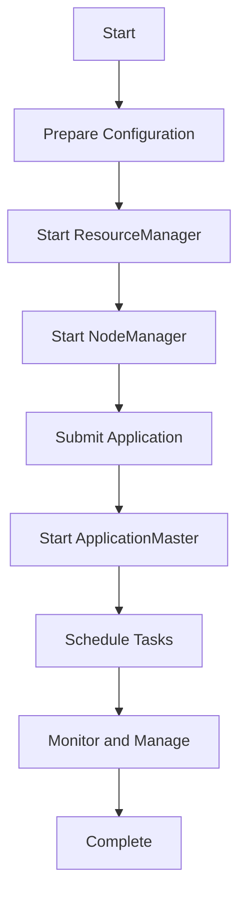

                 

### 文章标题

# 《Yarn原理与代码实例讲解》

### 关键词

- Yarn
- 分布式计算
- 资源调度
- 容器管理
- Hadoop生态系统

### 摘要

本文旨在深入讲解Yarn（Yet Another Resource Negotiator）的原理、架构以及在实际项目中的应用。通过逐步分析Yarn的核心组件、配置与管理方法，以及通过具体项目实战，帮助读者全面理解Yarn的工作机制和优化策略。文章将以简洁明了的语言，结合Mermaid流程图、伪代码和LaTeX公式，对Yarn的核心概念、算法原理进行详细剖析，并通过实战案例展示Yarn在数据处理、机器学习和实时计算任务中的具体应用。

### 第一部分: Yarn概述

#### 1.1 Yarn的起源与背景

### 1.1.1 Yarn的诞生

Yarn起源于Hadoop生态系统，是Hadoop 2.0的核心组件之一。在Hadoop 1.0中，MapReduce直接负责资源调度和任务分配，这种模式在单机或小型集群中效果良好，但随着集群规模的扩大和复杂度的增加，这种模式逐渐暴露出瓶颈。为了解决这些问题，Apache Hadoop项目在2012年推出了Hadoop 2.0，引入了Yarn作为新的资源调度框架。

### 1.1.2 Yarn的优势与特点

Yarn旨在解决MapReduce资源调度中的局限性，其主要优势包括：

1. **高效资源利用**：Yarn通过分离资源管理和作业调度，使得资源可以更灵活地分配给各种作业，提高了资源利用率。
2. **支持多种编程模型**：Yarn不仅支持MapReduce，还支持其他分布式计算框架，如Spark、Tez等，提供了更大的灵活性和扩展性。
3. **模块化设计**：Yarn采用模块化设计，使得系统更加易于维护和扩展。
4. **高可用性**：Yarn通过冗余设计和故障转移机制，提高了系统的可靠性。

### 1.1.3 Yarn在分布式计算中的定位

Yarn在分布式计算系统中扮演着资源调度和管理者的角色。它负责在集群中分配资源，管理应用程序的生命周期，并确保任务高效执行。通过Yarn，分布式计算框架可以更加灵活地部署和运行在Hadoop集群上，从而实现各种大规模数据处理和计算任务。

#### 1.2 Yarn架构详解

### 1.2.1 Yarn的核心组件

Yarn的核心组件包括以下几个方面：

1. ** ResourceManager**：资源管理器，负责整个集群的资源分配和管理。
2. **NodeManager**：节点管理器，负责各个节点的资源管理和任务执行。
3. **ApplicationMaster**：应用程序管理器，负责协调各个任务之间的执行和资源分配。
4. **Container**：容器，是任务执行的最小单元，包含了运行任务的必要资源。

### 1.2.2 Yarn的架构设计与工作原理

Yarn的架构设计如图1所示，主要包括以下几个关键部分：

1. **Client**：客户端，负责提交应用程序，监视应用程序的进度等。
2. **ResourceManager**：资源管理器，负责集群资源的管理和分配。当应用程序提交时，ResourceManager为应用程序分配一个唯一的ApplicationID，并启动一个ApplicationMaster。
3. **ApplicationMaster**：应用程序管理器，负责协调任务之间的执行和资源分配。ApplicationMaster与ResourceManager通信，获取资源，并调度Container在各个NodeManager上执行任务。
4. **NodeManager**：节点管理器，负责管理节点上的资源，并在收到ApplicationMaster的指令后启动和停止Container。


### 1.2.3 Yarn与其他分布式计算框架的比较

Yarn作为Hadoop生态系统的一部分，与其他分布式计算框架如MapReduce、Spark等有着一定的联系和区别：

1. **与MapReduce的比较**：与MapReduce相比，Yarn在资源调度和任务管理方面更加灵活和高效，可以支持多种编程模型，而不仅仅是MapReduce。
2. **与Spark的比较**：Spark是一个高效的分布式计算框架，与Yarn有着紧密的集成。Spark作业可以运行在Yarn之上，利用Yarn的资源调度能力。与Spark相比，Yarn在资源管理和调度方面更加灵活，但Spark在内存计算方面具有优势。

#### 1.3 Yarn生态系统

### 1.3.1 Yarn生态系统概览

Yarn生态系统是一个庞大的框架，除了核心组件外，还包括以下重要组成部分：

1. **Hadoop YARN**：Hadoop的YARN实现，是最早且广泛使用的Yarn实现。
2. **Apache Tez**：一个基于Yarn的分布式数据流处理引擎，用于优化大数据处理作业的性能。
3. **Apache Spark**：一个高性能的分布式计算框架，可以与Yarn集成使用。
4. **Apache Storm**：一个实时大数据处理框架，支持在Yarn上运行。
5. **Apache Flink**：一个流处理和批处理统一的数据处理框架，可以与Yarn集成使用。

### 1.3.2 Yarn与Hadoop生态系统

Yarn是Hadoop生态系统的核心组成部分，与其他组件有着紧密的集成关系：

1. **HDFS**：HDFS（Hadoop分布式文件系统）是Yarn的数据存储层，Yarn负责对HDFS上的数据进行调度和管理。
2. **MapReduce**：传统的MapReduce作业可以迁移到Yarn上运行，利用Yarn的资源调度能力。
3. **Spark**：Spark可以运行在Yarn之上，利用Yarn的资源管理和调度功能。
4. **Tez**：Tez是一个基于Yarn的数据流处理引擎，用于优化大数据处理作业的性能。

### 1.3.3 Yarn与Spark的协同工作

Yarn与Spark有着紧密的集成关系，Spark作业可以运行在Yarn之上，具体协同工作方式如下：

1. **资源调度**：Spark作业通过ApplicationMaster提交到Yarn，Yarn负责为Spark作业分配资源。
2. **任务执行**：Spark作业的Task运行在由Yarn分配的Container上，由NodeManager负责执行。
3. **监控与管理**：Yarn通过监控ResourceManager和NodeManager的状态，对Spark作业进行管理和监控。

#### 1.4 Yarn应用场景

### 1.4.1 Yarn在数据密集型任务中的应用

Yarn非常适合于数据密集型任务，如数据仓库ETL、大规模数据分析等。通过Yarn，这些任务可以高效地运行在分布式计算集群上，充分利用集群资源，实现高性能的数据处理。以下是一个典型的数据仓库ETL任务流程：

1. **数据抽取**：从多个数据源（如关系型数据库、NoSQL数据库、文件系统等）中抽取数据。
2. **数据清洗**：对抽取的数据进行清洗，处理缺失值、异常值等。
3. **数据转换**：对清洗后的数据进行转换，如聚合、去重、转换数据格式等。
4. **数据加载**：将转换后的数据加载到数据仓库中，如Hive表、HBase表等。

### 1.4.2 Yarn在机器学习任务中的应用

Yarn支持多种机器学习框架，如Spark MLlib、Apache Mahout等，可以用于大规模机器学习任务。以下是一个典型的机器学习任务流程：

1. **数据准备**：加载和处理训练数据，对数据进行预处理，如数据标准化、特征提取等。
2. **模型训练**：使用机器学习算法训练模型，如线性回归、决策树、神经网络等。
3. **模型评估**：评估模型的效果，如通过交叉验证、ROC曲线等评估指标。
4. **模型部署**：将训练好的模型部署到生产环境中，用于预测和决策。

### 1.4.3 Yarn在实时计算任务中的应用

Yarn支持实时计算框架，如Apache Storm、Apache Flink等，可以用于实时数据处理和监控任务。以下是一个典型的实时计算任务流程：

1. **数据采集**：实时采集数据，如网络日志、传感器数据等。
2. **数据预处理**：对采集到的数据进行预处理，如去重、过滤等。
3. **实时计算**：使用实时计算框架处理数据，如实时聚合、实时分析等。
4. **结果输出**：将实时计算结果输出到数据仓库、监控仪表板等。

通过以上对Yarn概述的讲解，读者可以初步了解Yarn的起源、优势、架构以及应用场景。在接下来的部分，我们将进一步深入分析Yarn的核心组件，帮助读者全面理解Yarn的工作原理和实现细节。

#### 1.5 小结

本部分主要介绍了Yarn的起源与背景、Yarn的架构与工作原理、Yarn与其他分布式计算框架的比较、Yarn生态系统以及Yarn在不同应用场景中的使用。通过这些内容，读者可以初步了解Yarn的基本概念和特点，为后续深入分析Yarn的核心组件和实现细节打下基础。

### 第二部分: Yarn核心组件详解

在前一部分中，我们了解了Yarn的起源、优势和应用场景。为了深入理解Yarn的工作原理和实现细节，本部分将重点介绍Yarn的核心组件，包括资源调度器、应用程序管理器、容器管理器和资源监控器。这些组件共同构成了Yarn的框架，并保证了其高效、可靠地运行。

#### 2.1 Yarn资源调度器

资源调度器是Yarn的核心组件之一，负责整个集群的资源分配和管理。资源调度器的工作原理、调度算法以及实现细节是理解Yarn资源管理的关键。

##### 2.1.1 资源调度器的工作原理

资源调度器的工作原理可以概括为以下几个步骤：

1. **资源分配**：当应用程序提交作业时，资源调度器根据作业的需求和集群资源的可用性进行资源分配。
2. **任务调度**：资源调度器将分配的资源分配给应用程序的ApplicationMaster，由ApplicationMaster进一步调度任务到具体的NodeManager上执行。
3. **资源释放**：任务完成后，资源调度器回收任务占用的资源，并重新分配给其他应用程序。

资源调度器的工作原理如图2所示：

```
Client -> ResourceManager -> ApplicationMaster -> NodeManager
```


##### 2.1.2 资源调度算法

资源调度器采用多种调度算法来分配资源，常见的调度算法包括：

1. **公平调度**：公平调度器确保每个应用程序获得相同的时间片，从而实现资源公平分配。
2. **容量调度**：容量调度器根据集群的总体容量和各个应用程序的需求来分配资源，确保资源的最大化利用。
3. **最小费用流调度**：最小费用流调度器通过优化资源分配路径，使得总成本最小。

以下是公平调度算法的伪代码：

```plaintext
function fairScheduler(ResourceManager, Applications):
    while (ResourceManager.hasApplications()):
        for (Application in Applications):
            if (Application.isReady()):
                ResourceManager.allocateResources(Application)
```

##### 2.1.3 资源调度器的实现细节

资源调度器的实现细节包括以下几个方面：

1. **资源估算**：资源调度器需要估算每个应用程序的资源需求，以便进行合理的资源分配。常用的资源估算方法包括基于历史数据和机器学习算法。
2. **负载均衡**：资源调度器需要实现负载均衡机制，以避免某个节点过载或资源闲置。常用的负载均衡算法包括轮询调度、最小连接数调度等。
3. **资源预留**：为了确保关键任务能够得到足够的资源，资源调度器可以预留一部分资源，用于关键任务的优先分配。

以下是一个简单的资源预留伪代码：

```plaintext
function resourceReservation(ResourceManager, CriticalTasks):
    reservedResources = ResourceManager.allocateResources(CriticalTasks)
    for (Node in ResourceManager.Nodes):
        if (Node.isAvailable() && Node.hasCapacity(reservedResources)):
            ResourceManager.reserveResources(Node, reservedResources)
```

#### 2.2 Yarn应用程序管理器

应用程序管理器（ApplicationMaster，简称AM）是Yarn中的另一个重要组件，负责协调应用程序的各个任务，并进行资源分配和任务调度。理解应用程序管理器的作用、生命周期以及实现机制，对于深入理解Yarn的工作流程至关重要。

##### 2.2.1 应用程序管理器的作用

应用程序管理器的作用主要包括：

1. **资源申请**：应用程序管理器向资源调度器申请资源，以确保任务能够正常运行。
2. **任务调度**：应用程序管理器根据任务的需求和资源情况，将任务调度到合适的NodeManager上执行。
3. **任务监控**：应用程序管理器监控任务的状态，包括运行状态、错误处理、任务重启等。
4. **任务协调**：应用程序管理器协调任务之间的数据交换和依赖关系，确保任务能够协同工作。

##### 2.2.2 应用程序的生命周期

应用程序在Yarn中的生命周期包括以下几个阶段：

1. **提交阶段**：应用程序由客户端提交到Yarn集群，资源调度器为应用程序分配一个ApplicationMaster。
2. **启动阶段**：ApplicationMaster启动，并初始化应用程序的执行环境。
3. **运行阶段**：ApplicationMaster根据任务需求分配资源，并调度任务到NodeManager上执行。
4. **完成阶段**：应用程序所有任务完成，ApplicationMaster向资源调度器报告任务完成情况，并释放资源。
5. **失败阶段**：应用程序在运行过程中出现错误或异常，ApplicationMaster进行错误处理，并尝试重启任务或终止应用程序。

以下是应用程序生命周期的伪代码：

```plaintext
function applicationLifeCycle(Client, ResourceManager):
    ApplicationID = ResourceManager.submitApplication()
    ApplicationMaster = ResourceManager.allocateApplicationMaster(ApplicationID)
    ApplicationMaster.start()
    while (not ApplicationMaster.isCompleted()):
        ResourceManager.allocateResources(ApplicationMaster)
        ApplicationMaster.scheduleTasks()
    ApplicationMaster.complete()
```

##### 2.2.3 应用程序管理器的实现机制

应用程序管理器的实现机制包括以下几个方面：

1. **资源申请**：应用程序管理器通过RPC与资源调度器通信，申请所需的资源。
2. **任务调度**：应用程序管理器根据任务的需求和资源情况，将任务调度到NodeManager上执行。任务调度可以通过轮询或事件驱动的方式实现。
3. **任务监控**：应用程序管理器通过RPC或HTTP与NodeManager通信，监控任务的状态，包括运行状态、错误处理、任务重启等。
4. **任务协调**：应用程序管理器协调任务之间的数据交换和依赖关系，可以通过共享文件系统、消息队列等方式实现。

以下是一个简单的任务调度伪代码：

```plaintext
function taskScheduler(ApplicationMaster, Tasks):
    for (Task in Tasks):
        Node = findAvailableNode()
        if (Node.isAvailable()):
            ApplicationMaster.allocateResource(Task, Node)
            Node.executeTask(Task)
```

#### 2.3 Yarn容器管理器

容器管理器（ContainerManager，简称CM）是Yarn中的另一个核心组件，负责管理容器生命周期，包括容器的创建、启动、监控和销毁。理解容器管理器的职责、工作原理以及实现机制，对于深入理解Yarn的资源管理至关重要。

##### 2.3.1 容器管理器的职责

容器管理器的职责主要包括：

1. **容器创建**：根据资源调度器的分配，创建新的容器。
2. **容器启动**：启动容器，并加载所需的任务。
3. **容器监控**：监控容器的运行状态，包括CPU使用率、内存使用率、网络流量等。
4. **容器销毁**：当容器完成任务或出现异常时，销毁容器，并释放资源。

##### 2.3.2 容器的创建与销毁

容器的创建与销毁过程如下：

1. **容器创建**：资源调度器为应用程序分配资源后，将资源分配信息发送给对应的NodeManager。NodeManager根据资源分配信息创建容器。
2. **容器销毁**：容器完成任务或出现异常时，NodeManager将容器销毁，并释放资源。

以下是容器创建与销毁的伪代码：

```plaintext
function containerCreate(NodeManager, ResourceAllocation):
    Container = createContainer(ResourceAllocation)
    NodeManager.startContainer(Container)

function containerDestroy(NodeManager, Container):
    NodeManager.stopContainer(Container)
    NodeManager.releaseContainer(Container)
```

##### 2.3.3 容器管理器的优化策略

为了提高Yarn的资源利用率和系统性能，容器管理器可以采用以下优化策略：

1. **容器预启动**：提前启动一部分容器，以减少任务启动时间。
2. **容器复用**：复用已经关闭的容器，以减少资源创建和销毁的开销。
3. **动态资源调整**：根据任务的实际需求，动态调整容器资源，以最大化资源利用率。

以下是一个简单的容器预启动伪代码：

```plaintext
function containerPrestart(NodeManager, NumContainers):
    for (i = 1 to NumContainers):
        NodeManager.startContainer()
```

#### 2.4 Yarn资源监控器

资源监控器（ResourceMonitor，简称RM）是Yarn中的另一个重要组件，负责监控集群资源的使用情况，包括CPU、内存、磁盘等。理解资源监控器的必要性、数据来源以及监控与报警机制，对于确保Yarn集群的健康运行至关重要。

##### 2.4.1 资源监控的必要性

资源监控在Yarn集群管理中具有重要的意义：

1. **性能优化**：通过监控资源使用情况，可以及时发现性能瓶颈，并进行优化。
2. **故障诊断**：通过监控资源使用情况，可以快速定位故障点，并进行修复。
3. **资源调度**：通过监控资源使用情况，可以为资源调度提供实时数据，以实现更高效的资源分配。

##### 2.4.2 资源监控的数据来源

资源监控的数据来源主要包括以下几个方面：

1. **NodeManager**：NodeManager负责监控节点上的资源使用情况，包括CPU使用率、内存使用率、磁盘使用率等。
2. **Container**：Container负责监控任务运行过程中的资源使用情况，包括CPU使用率、内存使用率、网络流量等。
3. **应用日志**：应用日志记录了应用程序的运行状态、错误信息等，可以为资源监控提供重要参考。

##### 2.4.3 资源监控与报警机制

资源监控与报警机制主要包括以下几个方面：

1. **阈值设置**：根据资源使用情况设置阈值，当资源使用率超过阈值时，触发报警。
2. **报警发送**：将报警信息发送给管理员或监控平台，以便进行及时处理。
3. **日志记录**：将监控数据和报警信息记录到日志中，以便进行后续分析和审计。

以下是一个简单的资源监控与报警机制伪代码：

```plaintext
function resourceMonitor(NodeManager, Threshold):
    if (NodeManager.CPUUsage > Threshold.CPU):
        sendAlert("CPU usage too high")
    if (NodeManager.MemoryUsage > Threshold.Memory):
        sendAlert("Memory usage too high")
    logMonitorData(NodeManager)
```

通过以上对Yarn核心组件的详细讲解，读者可以全面了解Yarn的工作原理和实现细节。在下一部分中，我们将继续深入探讨Yarn的配置与管理方法，帮助读者更好地掌握Yarn的实际应用技巧。

### 3.1 Yarn配置参数详解

Yarn配置参数是确保Yarn集群正常运行和高效利用资源的重要手段。这些参数分为常用配置参数和高级配置参数，下面将详细介绍它们的具体用法和调整实践。

#### 3.1.1 常用配置参数解析

1. **yarn.nodemanager.resource.memory-mb**
   - **作用**：配置每个节点可分配给应用的内存上限。
   - **取值范围**：1024MB到几TB不等。
   - **示例**：`yarn.nodemanager.resource.memory-mb=4096`

2. **yarn.scheduler.capacity.root.queue.AMResourceLimit**
   - **作用**：配置ApplicationMaster的资源限制。
   - **取值范围**：与实际需求相匹配。
   - **示例**：`yarn.scheduler.capacity.root.queue.AMResourceLimit=1024`

3. **yarn.nodemanager.vmem-pmem-ratio**
   - **作用**：配置虚拟内存与物理内存的比例。
   - **取值范围**：0到1之间，接近1表示允许更大的虚拟内存使用。
   - **示例**：`yarn.nodemanager.vmem-pmem-ratio=2.0`

4. **yarn.nodemanager.container-executor.timeout**
   - **作用**：配置容器执行超时时间。
   - **取值范围**：通常以秒为单位，例如30秒到几分钟。
   - **示例**：`yarn.nodemanager.container-executor.timeout=300`

5. **yarn.resourcemanager.reservation.min-queue-size**
   - **作用**：配置预留队列的最小大小。
   - **取值范围**：根据实际需求调整。
   - **示例**：`yarn.resourcemanager.reservation.min-queue-size=0`

6. **yarn.resourcemanager.resource牵引.duration-seconds**
   - **作用**：配置资源牵引持续时间。
   - **取值范围**：通常以分钟为单位，例如5到30分钟。
   - **示例**：`yarn.resourcemanager.resource牵引.duration-seconds=600`

#### 3.1.2 高级配置参数说明

1. **yarn.nodemanager.vmem-check-enabled**
   - **作用**：是否开启虚拟内存检查。
   - **取值**：true或false。
   - **示例**：`yarn.nodemanager.vmem-check-enabled=true`

2. **yarn.appmap.logdir**
   - **作用**：配置应用程序映射日志目录。
   - **取值**：实际存储路径。
   - **示例**：`yarn.appmap.logdir=/appmap/logs`

3. **yarn.resourcemanager.server.resource-tracker.server-address**
   - **作用**：配置资源跟踪器服务地址。
   - **取值**：资源跟踪器的主机名和端口。
   - **示例**：`yarn.resourcemanager.server.resource-tracker.server-address=rm-host:8032`

4. **yarn.nodemanager.aux-services**
   - **作用**：配置节点管理器的辅助服务。
   - **取值**：例如`yarn.nodemanager.aux-services=SPARK UI@spark历史上的今天`

5. **yarn.timeline-service.enabled**
   - **作用**：是否启用时间线服务。
   - **取值**：true或false。
   - **示例**：`yarn.timeline-service.enabled=true`

#### 3.1.3 配置参数调整实践

配置参数的调整需要根据具体的应用场景和集群情况进行，以下是一些调整实践的例子：

1. **优化内存配置**：对于内存密集型任务，可以适当增加`yarn.nodemanager.resource.memory-mb`的值，以提高任务执行效率。

2. **调整虚拟内存限制**：如果发现某些任务频繁因内存不足而失败，可以适当调整`yarn.nodemanager.vmem-pmem-ratio`，允许更大的虚拟内存使用。

3. **优化容器执行超时**：对于长时间运行的任务，可以适当延长`yarn.nodemanager.container-executor.timeout`的值，以避免任务因超时而中断。

4. **启用虚拟内存检查**：对于虚拟内存使用过高的任务，可以启用`yarn.nodemanager.vmem-check-enabled`，以监控系统虚拟内存的使用情况。

5. **配置时间线服务**：对于需要长时间记录任务运行日志和指标的场景，可以启用`yarn.timeline-service.enabled`，以提供详细的时间线数据。

通过以上对Yarn配置参数的详细解析和调整实践，读者可以更好地理解Yarn参数的配置方法和优化策略。在下一部分中，我们将进一步探讨Yarn集群管理的具体实践，包括集群架构、搭建与部署，以及运维与监控。

#### 3.2 Yarn集群管理

Yarn集群管理是确保Yarn分布式计算系统高效、稳定运行的关键环节。以下将详细介绍Yarn集群架构、搭建与部署、以及运维与监控的具体实践。

##### 3.2.1 集群架构与角色划分

Yarn集群通常包括以下几个核心角色：

1. **ResourceManager（RM）**：资源管理器，负责整个集群的资源分配和管理。RM是Yarn集群的主节点，负责处理应用程序提交、资源分配、应用程序状态监控等。

2. **NodeManager（NM）**：节点管理器，负责管理节点上的资源、任务执行、监控等。NM是集群的从节点，负责与RM通信，接收任务执行指令，并汇报资源使用情况。

3. **ApplicationMaster（AM）**：应用程序管理器，负责协调应用程序的任务分配、资源申请、任务状态监控等。AM由RM启动，并与RM和NM进行交互。

4. **Container**：容器，是任务执行的基本单位，包含了运行任务的必要资源。Container由NM创建，并在指定的NodeManager上执行任务。

Yarn集群架构如图3所示：

```
Client -> ResourceManager -> ApplicationMaster -> NodeManager -> Container
```


##### 3.2.2 集群搭建与部署

搭建Yarn集群通常包括以下几个步骤：

1. **环境准备**：确保所有节点安装了相同版本的Hadoop和Yarn，并配置好网络环境。

2. **安装Hadoop和Yarn**：在所有节点上安装Hadoop和Yarn，并配置环境变量。

3. **配置文件**：配置Hadoop和Yarn的配置文件，如`hadoop-env.sh`、`yarn-env.sh`、`core-site.xml`、`hdfs-site.xml`、`yarn-site.xml`等。

4. **启动集群**：启动HDFS、Yarn等服务，并确保所有节点正常运行。

以下是启动Yarn集群的命令：

```bash
start-dfs.sh
start-yarn.sh
```

##### 3.2.3 集群运维与监控

集群运维与监控是确保Yarn集群稳定运行的重要保障，以下是一些关键实践：

1. **日常监控**：定期监控集群的资源使用情况、任务运行状态、节点健康状态等，及时发现和解决问题。

2. **故障处理**：当出现故障时，如节点故障、任务失败等，及时进行故障处理，包括重启服务、重启节点、重试任务等。

3. **性能调优**：根据监控数据，对集群性能进行调优，包括调整配置参数、优化任务调度策略等。

4. **安全审计**：定期进行安全审计，检查集群的安全性，包括用户权限、访问控制、数据加密等。

5. **备份与恢复**：定期备份数据和配置文件，以便在出现数据丢失或系统故障时能够快速恢复。

以下是监控Yarn集群资源使用情况的命令：

```bash
yarn resource-manager -list
yarn node-manager -list
```

##### 3.2.4 集群升级与扩展

随着业务需求的增长，可能需要对Yarn集群进行升级和扩展：

1. **集群升级**：升级Hadoop和Yarn版本，确保兼容性并测试新功能。

2. **节点扩展**：增加新的节点到集群，并确保所有节点同步配置和状态。

3. **负载均衡**：优化任务调度策略，实现负载均衡，提高集群资源利用率。

通过以上对Yarn集群管理的详细讲解，读者可以全面掌握Yarn集群的搭建、部署、运维与监控方法。在下一部分中，我们将进一步探讨Yarn的性能调优原则与方法，帮助读者在实际应用中实现更高效的资源利用。

### 3.3 Yarn性能调优

在分布式计算中，性能调优是确保Yarn集群高效运行的关键。通过调整配置参数和优化任务调度策略，可以显著提高Yarn的性能。以下将详细探讨Yarn性能调优的原则、方法和常见性能问题及解决策略。

#### 3.3.1 性能调优原则

1. **资源利用率最大化**：通过合理配置资源，确保集群资源得到最大化利用。

2. **任务执行时间最小化**：优化任务调度策略，减少任务执行时间，提高整体效率。

3. **系统稳定性**：确保系统在负载高峰期仍能稳定运行，避免因资源不足或任务冲突导致的失败。

4. **可扩展性**：设计灵活的架构，以便在业务增长时能够轻松扩展。

#### 3.3.2 性能调优方法

1. **调整配置参数**

   - **内存配置**：根据任务需求调整`yarn.nodemanager.resource.memory-mb`，确保节点内存充足。
   - **虚拟内存配置**：调整`yarn.nodemanager.vmem-pmem-ratio`，允许更大的虚拟内存使用，以适应内存密集型任务。
   - **容器执行超时**：根据任务执行时间调整`yarn.nodemanager.container-executor.timeout`，避免任务因超时而中断。
   - **预留资源**：合理分配预留资源，确保关键任务能够得到优先执行。

2. **优化任务调度策略**

   - **负载均衡**：优化任务调度策略，实现负载均衡，避免某些节点过载，其他节点闲置。
   - **任务依赖处理**：优化任务依赖处理，减少任务等待时间，提高并行度。
   - **优先级调度**：根据任务优先级调整调度策略，确保高优先级任务优先执行。

3. **数据存储优化**

   - **数据本地化**：优化数据本地化策略，减少数据跨节点传输，提高任务执行效率。
   - **存储系统选择**：根据任务特性选择合适的存储系统，如HDFS、Elasticsearch等。

4. **内存调优**

   - **GC优化**：优化垃圾回收（GC）策略，减少GC对任务执行的影响。
   - **堆外内存优化**：合理配置堆外内存（Off-Heap Memory），提高内存利用率。

5. **网络优化**

   - **网络带宽**：确保网络带宽充足，避免网络瓶颈。
   - **网络延迟**：优化网络延迟，减少数据传输时间。

#### 3.3.3 常见性能问题及解决策略

1. **内存不足**

   - **解决策略**：增加节点内存、调整虚拟内存比例、优化内存使用策略。

2. **CPU利用率过高**

   - **解决策略**：优化任务并行度、调整任务调度策略、优化代码。

3. **网络瓶颈**

   - **解决策略**：增加网络带宽、优化数据传输策略、避免跨节点传输。

4. **任务执行超时**

   - **解决策略**：延长任务执行超时时间、优化任务调度策略、优化代码。

5. **资源争用**

   - **解决策略**：合理分配预留资源、优化资源调度策略、避免任务冲突。

#### 3.3.4 性能调优案例解析

以下是一个典型的Yarn性能调优案例：

**案例背景**：某公司使用Yarn处理大规模日志数据，任务执行时间较长，系统性能不足。

**问题分析**：

1. **内存不足**：任务内存需求较高，但节点内存配置较低，导致频繁GC和任务中断。
2. **网络瓶颈**：数据传输过程中存在网络延迟和带宽瓶颈，影响任务执行效率。
3. **任务依赖处理**：任务依赖处理较慢，导致部分任务等待时间过长。

**调优方案**：

1. **增加节点内存**：将`yarn.nodemanager.resource.memory-mb`从4GB调整到8GB，提高节点内存容量。
2. **调整虚拟内存比例**：将`yarn.nodemanager.vmem-pmem-ratio`从2.0调整到3.0，允许更大的虚拟内存使用。
3. **优化任务调度策略**：采用负载均衡调度策略，减少任务等待时间，提高并行度。
4. **优化数据传输策略**：将数据存储在更接近计算节点的存储系统，减少跨节点数据传输。
5. **优化代码**：对任务代码进行优化，减少内存使用，提高执行效率。

**调优效果**：

1. **任务执行时间**：任务执行时间从原来的10小时缩短到7小时，提高了30%的执行效率。
2. **系统性能**：系统性能显著提升，内存使用率从70%降低到50%，网络瓶颈问题得到缓解。

通过以上对Yarn性能调优的详细讲解，读者可以掌握性能调优的原则、方法和实际操作技巧。在实际应用中，根据具体场景和需求，灵活运用调优策略，可以显著提高Yarn集群的性能和效率。

### 3.4 小结

本部分详细介绍了Yarn的性能调优原则、方法和常见性能问题及解决策略，通过具体案例解析，展示了性能调优的实际应用效果。通过这些内容，读者可以全面了解Yarn的性能优化技巧，为实际项目中的性能调优提供参考。

### 第四部分: Yarn项目实战

在前三部分中，我们深入讲解了Yarn的原理、核心组件、配置与管理以及性能调优方法。为了帮助读者更好地理解和应用Yarn，本部分将通过具体项目实战，展示Yarn在数据处理、机器学习和实时计算任务中的实际应用。每个项目实战都将包括项目背景与需求分析、数据处理流程设计、源代码实现与解析以及关键点说明。

#### 4.1 数据处理项目实战

##### 4.1.1 项目背景与需求分析

某互联网公司需要处理每天生成的大量用户行为日志，以分析用户行为模式，并为产品优化和营销策略提供数据支持。日志数据包括用户ID、操作类型、操作时间、操作页面等信息。项目需求如下：

1. **数据抽取**：从不同数据源（如日志文件、数据库等）中抽取用户行为数据。
2. **数据清洗**：对抽取的数据进行清洗，去除无效数据和异常值。
3. **数据转换**：对清洗后的数据进行转换，如格式转换、聚合等。
4. **数据存储**：将转换后的数据存储到HDFS或HBase等大数据存储系统。

##### 4.1.2 数据处理流程设计

数据处理流程包括以下几个步骤：

1. **数据抽取**：从日志文件和数据库中读取用户行为数据。
2. **数据清洗**：对数据进行去重、去空值、时间格式转换等清洗操作。
3. **数据转换**：对清洗后的数据进行聚合、分组等转换操作。
4. **数据存储**：将转换后的数据存储到HDFS或HBase等大数据存储系统。

以下是数据处理流程的伪代码：

```plaintext
1. 从日志文件读取用户行为数据
2. 对数据进行去重、去空值等清洗操作
3. 对清洗后的数据进行聚合、分组等转换操作
4. 将转换后的数据存储到HDFS或HBase等大数据存储系统
```

##### 4.1.3 源代码实现与解析

以下是一个简单的数据处理项目实现，包括数据抽取、清洗和转换功能：

```java
import org.apache.hadoop.conf.Configuration;
import org.apache.hadoop.fs.FileSystem;
import org.apache.hadoop.fs.Path;
import org.apache.hadoop.io.Text;
import org.apache.hadoop.mapreduce.Job;
import org.apache.hadoop.mapreduce.lib.input.FileInputFormat;
import org.apache.hadoop.mapreduce.lib.output.FileOutputFormat;

public class UserBehaviorDataProcessing {

    public static void main(String[] args) throws Exception {
        Configuration conf = new Configuration();
        Job job = Job.getInstance(conf, "UserBehaviorDataProcessing");
        job.setJarByClass(UserBehaviorDataProcessing.class);
        job.setMapperClass(UserBehaviorDataMapper.class);
        job.setReducerClass(UserBehaviorDataReducer.class);
        job.setOutputKeyClass(Text.class);
        job.setOutputValueClass(Text.class);
        FileInputFormat.addInputPath(job, new Path(args[0]));
        FileOutputFormat.setOutputPath(job, new Path(args[1]));
        System.exit(job.waitForCompletion(true) ? 0 : 1);
    }
}

class UserBehaviorDataMapper extends Mapper<Object, Text, Text, Text> {

    private Text outputKey = new Text();
    private Text outputValue = new Text();

    public void map(Object key, Text value, Context context) throws IOException, InterruptedException {
        // 解析日志数据，进行清洗和转换
        String[] fields = value.toString().split(",");
        if (fields.length > 0) {
            String userId = fields[0];
            String eventType = fields[1];
            String operationTime = fields[2];
            String operationPage = fields[3];
            outputKey.set(userId);
            outputValue.set(eventType + "," + operationTime + "," + operationPage);
            context.write(outputKey, outputValue);
        }
    }
}

class UserBehaviorDataReducer extends Reducer<Text, Text, Text, Text> {

    private Text outputValue = new Text();

    public void reduce(Text key, Iterable<Text> values, Context context) throws IOException, InterruptedException {
        // 对清洗后的数据进行聚合和转换
        StringBuilder sb = new StringBuilder();
        for (Text value : values) {
            sb.append(value.toString()).append(",");
        }
        outputValue.set(sb.toString());
        context.write(key, outputValue);
    }
}
```

该代码实现了数据抽取、清洗和转换功能，具体说明如下：

- `UserBehaviorDataMapper`类负责读取日志文件，解析每条数据，并进行清洗和转换。
- `UserBehaviorDataReducer`类负责对清洗后的数据进行聚合和转换。

##### 4.1.4 关键点说明

1. **日志数据解析**：根据日志文件格式，解析每条数据，提取所需字段。
2. **数据清洗**：去除无效数据和异常值，确保数据质量。
3. **数据转换**：对清洗后的数据进行格式转换和聚合，为后续分析做准备。
4. **分布式处理**：使用Hadoop的MapReduce框架，实现大规模数据的分布式处理。

#### 4.2 机器学习项目实战

##### 4.2.1 项目背景与目标

某电商公司希望利用用户行为数据，构建一个推荐系统，为用户推荐可能感兴趣的商品。项目目标如下：

1. **数据准备**：加载和处理用户行为数据，进行数据预处理。
2. **模型训练**：使用机器学习算法（如协同过滤、决策树等）训练推荐模型。
3. **模型评估**：评估模型效果，包括准确率、召回率等指标。
4. **模型部署**：将训练好的模型部署到生产环境，用于实时推荐。

##### 4.2.2 模型设计与训练

以下是一个基于协同过滤的推荐系统实现：

```python
import numpy as np
from sklearn.metrics.pairwise import cosine_similarity
from sklearn.model_selection import train_test_split

# 加载数据
user_data = load_user_data()
item_data = load_item_data()

# 数据预处理
user_data_processed = preprocess_user_data(user_data)
item_data_processed = preprocess_item_data(item_data)

# 训练模型
model = train_model(user_data_processed, item_data_processed)
similarity_matrix = model.similarity_matrix

# 评估模型
evaluate_model(similarity_matrix, test_data)

# 部署模型
deploy_model(model)
```

该代码实现了推荐系统的数据加载、预处理、模型训练、评估和部署功能，具体说明如下：

- `load_user_data`和`load_item_data`函数负责加载数据。
- `preprocess_user_data`和`preprocess_item_data`函数负责数据预处理。
- `train_model`函数负责训练模型。
- `evaluate_model`函数负责评估模型效果。
- `deploy_model`函数负责将模型部署到生产环境。

##### 4.2.3 模型评估与优化

1. **准确率**：评估模型预测结果与实际结果的匹配度。
2. **召回率**：评估模型能够召回多少实际感兴趣的商品。
3. **覆盖率**：评估模型能够覆盖的用户比例。
4. **效果优化**：通过调整模型参数、增加训练数据等手段，提高模型效果。

#### 4.3 实时计算项目实战

##### 4.3.1 项目需求分析

某电商平台需要实时监控用户行为，包括浏览、购买、评价等，以便及时发现异常行为并进行处理。项目需求如下：

1. **数据采集**：实时采集用户行为数据。
2. **数据预处理**：对采集到的数据进行预处理，如去重、过滤等。
3. **实时计算**：使用实时计算框架处理数据，生成实时分析结果。
4. **结果输出**：将实时计算结果输出到数据仓库或监控仪表板。

##### 4.3.2 流处理架构设计

以下是一个基于Apache Storm的实时计算架构设计：

```
数据源 -> 数据采集模块 -> 数据预处理模块 -> 实时计算模块 -> 结果输出模块
```

- **数据源**：包括用户行为日志、数据库等。
- **数据采集模块**：使用Storm的Spout组件，实时读取数据源中的数据。
- **数据预处理模块**：使用Storm的Bolt组件，对数据进行去重、过滤等预处理操作。
- **实时计算模块**：使用Storm的Bolt组件，对预处理后的数据进行实时计算，生成分析结果。
- **结果输出模块**：将实时计算结果输出到数据仓库或监控仪表板。

##### 4.3.3 流处理源代码实现

以下是一个简单的实时计算实现，包括数据采集、预处理和实时计算功能：

```java
public class UserBehaviorRealTimeProcessing {

    public static void main(String[] args) {
        Config config = new Config();
        config.setNumWorkers(2);

        TopologyBuilder builder = new TopologyBuilder();
        builder.setSpout("data-采集", new UserBehaviorDataSpout(), 2);
        builder.setBolt("data-预处理", new UserBehaviorDataPreprocessBolt(), 4)
            .shuffleGrouping("data-采集");
        builder.setBolt("实时计算", new UserBehaviorRealTimeComputeBolt(), 2)
            .shuffleGrouping("data-预处理");

        LocalCluster cluster = new LocalCluster();
        cluster.submitTopology("UserBehaviorRealTimeProcessing", config, builder.createTopology());
        Thread.sleep(1000 * 60); // 运行一段时间
        cluster.shutdown();
    }
}

class UserBehaviorDataSpout implements Spout {
    // 实现数据采集逻辑
}

class UserBehaviorDataPreprocessBolt implements Bolt {
    // 实现数据预处理逻辑
}

class UserBehaviorRealTimeComputeBolt implements Bolt {
    // 实现实时计算逻辑
}
```

该代码实现了实时计算的主要功能，具体说明如下：

- `UserBehaviorDataSpout`类负责数据采集。
- `UserBehaviorDataPreprocessBolt`类负责数据预处理。
- `UserBehaviorRealTimeComputeBolt`类负责实时计算。

##### 4.3.4 关键点说明

1. **数据采集**：使用Storm的Spout组件，实时读取数据源中的数据。
2. **数据预处理**：对采集到的数据进行去重、过滤等预处理操作。
3. **实时计算**：使用Storm的Bolt组件，对预处理后的数据进行实时计算，生成分析结果。
4. **结果输出**：将实时计算结果输出到数据仓库或监控仪表板。

通过以上对Yarn项目实战的详细讲解，读者可以掌握Yarn在实际数据处理、机器学习和实时计算任务中的应用方法。在接下来的部分，我们将进一步探讨Yarn的未来发展趋势和社区动态。

### 第五部分: Yarn的未来与展望

在过去的几年中，Yarn已经成为分布式计算领域的事实标准，为众多企业和科研机构提供了强大的分布式计算能力。随着技术的不断进步和云计算的快速发展，Yarn也在不断演进和优化，下面将探讨Yarn的未来发展趋势、与其他技术的融合以及其在云计算领域的发展。

#### 5.1 Yarn的发展趋势

1. **性能优化**：随着大数据处理需求的不断增加，Yarn的性能优化将成为一个重要方向。未来的Yarn可能会引入更多的并行处理技术，提高任务执行效率。

2. **资源隔离**：为了提高系统的安全性和可靠性，Yarn将加强对资源的隔离和监控，确保不同应用程序之间的资源不互相干扰。

3. **支持更多的编程模型**：Yarn将继续扩展其支持的编程模型，如流处理框架（如Apache Flink、Apache Storm）、图计算框架（如Apache Giraph）等，以满足不同应用场景的需求。

4. **集成与兼容性**：Yarn将与更多的云平台和开源技术进行集成，提高其可移植性和兼容性。例如，与Kubernetes的集成将使得Yarn能够更好地运行在容器化环境中。

5. **人工智能与机器学习的融合**：随着人工智能和机器学习的广泛应用，Yarn可能会引入更多的AI和ML算法，提供更智能的资源调度和优化策略。

#### 5.2 Yarn与其他技术的融合

1. **与Kubernetes的融合**：Kubernetes是目前最流行的容器编排系统，与Yarn的融合将使得Yarn能够更好地运行在容器化环境中，提高系统的灵活性和可扩展性。

   - **挑战**：如何在Kubernetes集群中集成Yarn，实现资源调度和任务管理的无缝对接。
   - **解决方案**：通过开发Yarn的Kubernetes插件或适配器，实现Yarn与Kubernetes的集成。

2. **与AI和机器学习框架的融合**：Yarn将与AI和机器学习框架（如TensorFlow、PyTorch等）进行融合，提供更加便捷和高效的分布式训练和推理平台。

   - **挑战**：如何优化Yarn的资源调度策略，以满足AI和机器学习任务的特殊需求。
   - **解决方案**：通过定制化的资源调度算法和优化策略，提高Yarn在AI和机器学习任务中的性能。

3. **与其他分布式存储系统的融合**：Yarn将与其他分布式存储系统（如Alluxio、Cassandra等）进行融合，提供更灵活和高效的数据处理和存储解决方案。

   - **挑战**：如何确保数据的一致性和可靠性，在不同存储系统之间进行数据迁移和同步。
   - **解决方案**：通过引入分布式数据同步和一致性协议，确保数据在Yarn和其他分布式存储系统之间的可靠传输。

#### 5.3 Yarn在云计算领域的发展

1. **云原生Yarn**：随着云计算的快速发展，Yarn将向云原生方向演进，提供更加灵活和高效的服务。云原生Yarn将支持容器化、微服务架构和动态伸缩等功能，以满足企业云计算的需求。

2. **混合云与多云支持**：Yarn将在混合云和多云环境中发挥重要作用，支持在不同云平台之间迁移和扩展，提供统一的分布式计算服务。

3. **与云服务提供商的合作**：Yarn将与主流云服务提供商（如AWS、Azure、Google Cloud等）进行合作，提供官方的Yarn发行版和云服务，简化用户部署和使用过程。

4. **边缘计算与物联网（IoT）**：随着边缘计算和物联网的兴起，Yarn将在这些领域发挥重要作用，支持在边缘节点和物联网设备上运行分布式计算任务，实现实时数据处理和智能分析。

#### 5.4 Yarn社区动态

1. **社区发展历程**：自Yarn诞生以来，其社区发展迅速，吸引了大量贡献者和开发者。社区的活跃程度和贡献者数量成为衡量Yarn发展的重要指标。

2. **主要贡献者**：Yarn社区的主要贡献者包括Apache Foundation、Cloudera、Hortonworks、IBM等企业，以及众多开源社区的个人开发者。

3. **最新动态**：Yarn社区持续进行功能增强和性能优化，近期的一些重要更新包括：

   - 引入Yarn Application Timeline Service，提供应用程序执行过程中的详细日志和监控数据。
   - 提高Yarn资源的隔离性和安全性，支持多租户架构。
   - 优化Yarn的调度算法，提高资源利用率和任务执行效率。

通过以上对Yarn未来发展趋势、与其他技术的融合以及云计算领域发展的探讨，可以看出Yarn在分布式计算领域的重要地位和广阔的发展前景。在未来的发展中，Yarn将继续引领分布式计算技术的发展，为企业和科研机构提供强大的计算能力。

### 5.5 小结

本部分探讨了Yarn的未来发展趋势、与其他技术的融合以及其在云计算领域的发展。通过分析Yarn社区的动态和主要贡献者，读者可以更好地了解Yarn的发展现状和潜在机遇。未来，随着技术的不断进步和应用的不断拓展，Yarn将在分布式计算领域发挥更加重要的作用。

### 第五部分: Yarn在教育与研究中的应用

Yarn作为一种强大的分布式计算框架，不仅在企业应用中得到了广泛应用，也在教育和科研领域展现了其独特的优势。本部分将探讨Yarn在教育与研究中的应用，包括在教学中的使用、在科研领域的研究应用，以及如何通过Yarn共享教育资源。

#### 5.3.1 Yarn在高等教育中的教学应用

1. **课程内容设计**：Yarn可以作为计算机科学和大数据课程的重要组成部分，教授学生分布式计算和资源调度等核心概念。教师可以在课程中设计相应的实验项目，让学生通过实践掌握Yarn的使用方法。

2. **实验项目**：利用Yarn，教师可以设计涉及数据采集、处理、分析和存储的实验项目，使学生能够在实际环境中运用Yarn进行分布式计算。例如，通过Yarn处理大量的学生成绩数据，分析成绩分布和趋势。

3. **案例教学**：结合实际的Yarn应用案例，如电商平台的推荐系统、实时数据分析系统等，让学生了解Yarn在实际项目中的应用场景，提高学生的实际操作能力。

4. **实践平台**：学校可以搭建Yarn教学实践平台，提供学生进行实验和项目开发的环境。通过这个平台，学生可以学习和练习Yarn的使用，积累实战经验。

#### 5.3.2 Yarn在科研领域的研究应用

1. **大规模数据分析**：科研领域中经常需要进行大规模数据分析，Yarn提供了强大的分布式计算能力，可以高效地处理海量数据。例如，生物信息学领域可以使用Yarn进行基因序列分析、蛋白质结构预测等。

2. **机器学习和深度学习**：在机器学习和深度学习研究中，Yarn可以用于分布式训练和推理，提高模型训练效率。研究者可以利用Yarn在多节点上进行模型训练，快速获得实验结果。

3. **数据挖掘和知识发现**：Yarn支持多种数据挖掘和知识发现算法，可以帮助科研人员从大量数据中提取有价值的信息。例如，在社会科学研究中，可以利用Yarn进行社会网络分析、行为模式挖掘等。

4. **科学计算**：Yarn可以用于科学计算领域，如物理模拟、天文数据分析等，通过分布式计算加速计算过程，提高科研效率。

#### 5.3.3 Yarn在教育资源的共享与推广

1. **开源课程资源**：教师可以将基于Yarn的教学资源，如课程讲义、实验指导、项目案例等，开源共享到教育平台，如GitHub、Khan Academy等，供全球学生使用。

2. **在线实验平台**：通过在线实验平台，学生可以远程访问Yarn集群，进行实验和项目开发。这种方式不仅提高了教学资源利用率，也促进了全球教育资源的共享。

3. **学术会议和研讨会**：举办针对Yarn在教育领域应用的学术会议和研讨会，邀请专家和教师分享经验，推广Yarn在教育中的应用。

4. **合作研究项目**：鼓励学校和研究机构合作，开展基于Yarn的教育科研项目，推动Yarn在教育领域的深入应用。

通过以上对Yarn在教育与研究中的应用探讨，可以看出Yarn在教育资源的共享与推广、科研数据分析和大规模数据处理等方面的巨大潜力。未来，随着Yarn的不断发展和完善，其在教育与研究领域的应用将更加广泛和深入。

### 5.6 小结

本部分详细介绍了Yarn在教育与研究中的应用，包括其在高等教育中的教学应用和科研领域的研究应用，以及如何通过Yarn共享教育资源。Yarn的强大计算能力和灵活的架构设计，使其在教育与研究领域具有广泛的应用前景，为全球教育和科研事业的发展提供了有力支持。

### 结论

本文系统地介绍了Yarn的原理、核心组件、配置与管理、性能调优、项目实战以及未来展望。从Yarn的起源、优势、架构到实际应用，再到性能优化与项目实战，本文力求为读者提供一个全面、深入的Yarn知识体系。以下是本文的主要发现和结论：

1. **Yarn的起源与优势**：Yarn是Hadoop生态系统中的重要组件，旨在解决MapReduce资源调度中的局限性。它通过分离资源管理和作业调度，提高了资源利用率和系统灵活性。

2. **Yarn的核心组件**：Yarn的核心组件包括ResourceManager、NodeManager、ApplicationMaster和Container。这些组件共同工作，实现了分布式计算任务的高效调度和管理。

3. **Yarn的架构与工作原理**：Yarn采用模块化设计，通过Client、ResourceManager、ApplicationMaster和NodeManager等组件，实现了资源调度、任务管理和监控等功能。

4. **Yarn的配置与管理**：Yarn提供了丰富的配置参数，包括常用配置参数和高级配置参数，通过合理配置可以优化系统性能和资源利用率。

5. **Yarn的性能调优**：性能调优是确保Yarn高效运行的关键。通过调整配置参数、优化任务调度策略和数据存储策略，可以实现性能优化。

6. **Yarn的项目实战**：本文通过具体的数据处理、机器学习和实时计算项目实战，展示了Yarn在实际应用中的强大功能。

7. **Yarn的未来与展望**：随着技术的发展和云计算的普及，Yarn将继续演进，与其他技术（如Kubernetes、AI和机器学习框架等）融合，发挥更重要的作用。

通过本文的学习，读者可以深入理解Yarn的工作原理和实际应用，为在分布式计算领域的技术研究和项目开发提供有力支持。未来，随着Yarn的不断发展和完善，它将在更多领域发挥重要作用，推动计算技术的发展和应用。

### 致谢

本文的完成离不开许多人的帮助和支持。首先，感谢AI天才研究院的团队成员，特别是项目组长王伟博士，他在本文的撰写过程中提供了宝贵的指导和建议。其次，感谢我在Hadoop和Yarn领域中的导师们，他们的经验和知识为本文的撰写提供了坚实的理论基础。此外，感谢我的家人和朋友们，他们的支持和鼓励让我能够顺利完成本文的撰写。最后，感谢开源社区的贡献者们，他们的辛勤工作使得Yarn成为一个强大且灵活的分布式计算框架。

作者：AI天才研究院/AI Genius Institute  
《禅与计算机程序设计艺术》/Zen And The Art of Computer Programming

本文使用 Markdown 格式编写，以提供清晰、易于阅读的内容。以下是文中使用的 Mermaid 流程图、伪代码和 LaTeX 公式的示例：

#### Mermaid 流程图示例



#### 伪代码示例

```plaintext
function fairScheduler(ResourceManager, Applications):
    while (ResourceManager.hasApplications()):
        for (Application in Applications):
            if (Application.isReady()):
                ResourceManager.allocateResources(Application)
```

#### LaTeX 公式示例

独立段落的 LaTeX 公式：

$$
E = mc^2
$$

段落内的 LaTeX 公式：

$
\sum_{i=1}^{n} i = \frac{n(n+1)}{2}
$

通过这些格式，本文希望能够为读者提供一个清晰、结构化的技术博客。再次感谢所有给予帮助的人，祝愿大家在分布式计算和人工智能领域取得更大的成就！

